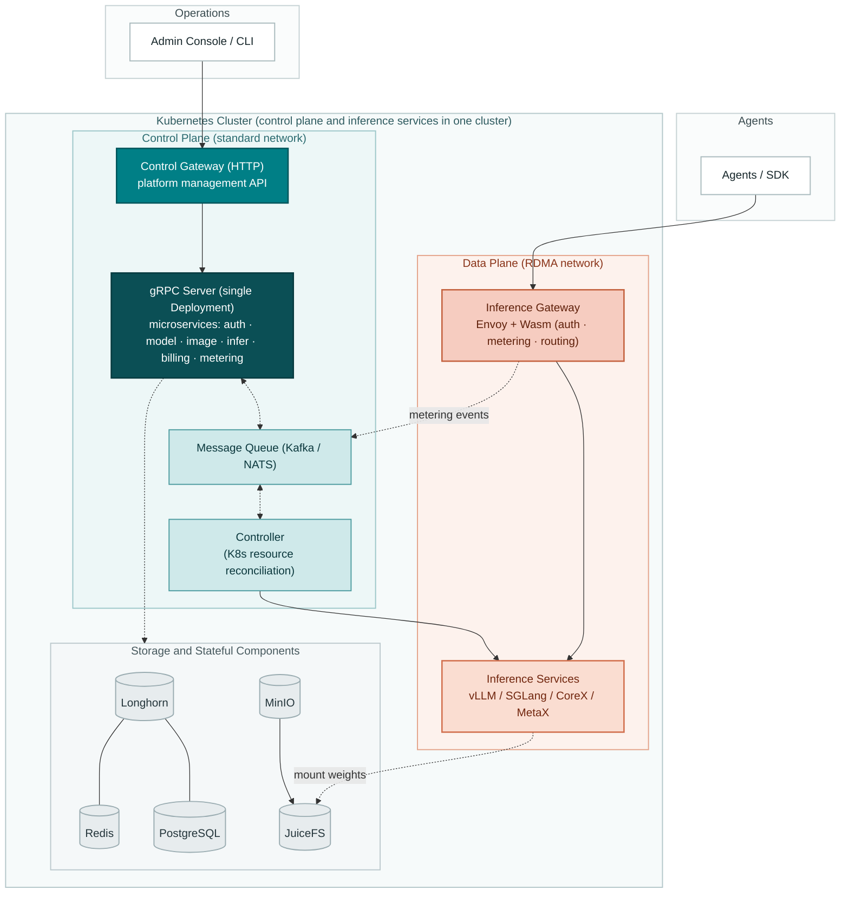

<p align="center">
  
</p>

# Go TaaS

**Token as a Service — an open-source LLM inference and metering/billing platform for AI agents and SDKs, built on Kubernetes**

[](./LICENSE)
[](https://golang.org/)
[](./CONTRIBUTING.md)

**Go TaaS** is an open-source platform for serving and billing large language models on Kubernetes. Administrators deploy open-source models (Qwen, DeepSeek, LLaMA, etc.) on heterogeneous accelerators — NVIDIA GPU, Iluvatar CoreX, and MetaX — and price them per model and card type. Agents and SDKs consume the models through an OpenAI-compatible API, with per-API-Key isolation, token metering, and settlement.

> **Status**: Go TaaS is in the design and early-development stage. The [architecture](./docs/design/architecture.md) is defined, and implementation is tracked in the [roadmap](#roadmap).

**English | [简体中文](./README.zh-cn.md)**

## Table of Contents

- [Features](#features)
- [Architecture](#architecture)
- [Tech Stack](#tech-stack)
- [Getting Started](#getting-started)
- [Usage](#usage)
- [Documentation](#documentation)
- [Roadmap](#roadmap)
- [Contributing](#contributing)
- [Community](#community)
- [License](#license)

## Features

| Area | Capability |
| --- | --- |
| Heterogeneous compute | Unified support for NVIDIA GPU, Iluvatar CoreX, and MetaX; node labeling, Device Plugins, and driver deployment are handled by each vendor's GPU Operator |
| Control plane / data plane separation | Management APIs and inference APIs are served by separate gateways, so platform operations stay available while the inference path scales, upgrades, or degrades |
| One-click model deployment | Deploy models from the console or API; the platform provisions inference workloads through a message queue and a Kubernetes controller, with no hand-written YAML |
| Inference image management | Register, version, and map engine images across NVIDIA / CoreX / MetaX, with node-level pre-pulling to shorten cold starts |
| OpenAI-compatible API | `/v1/chat/completions`, `/v1/completions`, and `/v1/embeddings` served by an Envoy-based gateway; authentication, metering, and routing run in Wasm plugins, so inference traffic never passes through business processes |
| Token metering and billing | Token usage (prompt / completion / cached / reasoning) is metered at the gateway, recorded as tamper-proof vouchers, and settled asynchronously per API Key |
| Flexible pricing | A model × card-type price matrix with separate input/output token rates, tiered pricing, and packages; balance (prepaid) and quota (postpaid) account modes |
| Multi-tenancy | Organization/project isolation with full API Key lifecycle management; keys are stored only as salted hashes |
| SSO federation | Pluggable identity providers — LDAP/LDAPS, OIDC/OAuth 2.0 (GitHub, Google, GitLab), SAML 2.0, and WeChat — with account binding, JIT provisioning, and attribute-to-role mapping |
| Tiered storage and networking | Longhorn for cluster state, MinIO + JuiceFS for weights and images; standard Ethernet for the control plane, optional RDMA (RoCE / InfiniBand) for inference |

## Architecture



- Traffic is split by audience: administrators enter through the **Control Gateway** (HTTP, generated from the Protobuf contract by `grpc-gateway`), while agents and SDKs call the **Inference Gateway** (Envoy + Wasm).
- The two gateways are deployed as separate workloads, so control plane APIs and inference APIs scale, upgrade, and fail independently.
- All microservice gRPC servers (`auth`, `model`, `image`, `infer`, `billing`, `metering`) run in a **single Deployment** and hand work to the Controller through a **message queue** (Kafka / NATS), decoupling API serving from Kubernetes reconciliation.
- Authentication, metering, and routing run in **Wasm plugins** at the Inference Gateway, so inference traffic never passes through business processes.
- The Inference Gateway verifies every API Key by **calling the `auth` module over gRPC**, backed by a two-level cache (Wasm-local TTL cache, then Redis); on timeout or `auth` unavailability it fails closed.
- Inference services and the control plane share **one Kubernetes cluster**, isolated through Namespaces, node labels, and taints/tolerations.

See the [Architecture Design](./docs/design/architecture.md) for component responsibilities, gateway design, and collaboration flows.

## Tech Stack

| Layer | Choice |
| --- | --- |
| Backend | Go, gRPC + grpc-gateway, GORM |
| Data | PostgreSQL, Redis (Valkey-compatible), Kafka / NATS |
| Control plane gateway | grpc-gateway — HTTP/JSON and OpenAPI generated from Protobuf |
| Data plane gateway | Envoy + Wasm |
| Storage | Longhorn for cluster state; MinIO + JuiceFS for inference weights and images |
| Network | Standard Ethernet for the control plane; RDMA (RoCE / InfiniBand) optional for inference |
| Orchestration | Kubernetes + client-go |
| Inference engines | NVIDIA: vLLM / SGLang / TensorRT-LLM; Iluvatar CoreX; MetaX |
| Frontend (`web/`) | React + TypeScript + Tailwind CSS + shadcn/ui + Framer Motion |

## Getting Started

> The project is in early development. The commands below describe the planned workflow and will be updated as implementation progresses.

### Prerequisites

- Go 1.25+
- golangci-lint v2
- buf
- Node.js 20+ (frontend, `web/`)
- Git

### Build from Source

```bash
git clone https://github.com/go-taas/go-taas.git
cd go-taas

make pbgen   # generate Protobuf code (gRPC stubs + grpc-gateway + OpenAPI)
make deps    # update dependencies
make lint    # static checks
make ut      # unit tests
make build   # build the binary
```

### Docker Compose

A one-command experience environment: control plane (with console), PostgreSQL, Redis, and the message queue.

```bash
make compose-up    # build images (console included) and start the local stack
make compose-ps    # show stack status
make compose-logs  # follow logs (or: make compose-logs SERVICE=taas-server)
make compose-down  # stop and remove the stack
```

The admin console is served by `taas-server` at `http://localhost:9091/admin`
(same origin as the API — no CORS setup needed). Management APIs live under
`/api/v1/admin/*`; user-facing APIs (login, signup) live under `/api/v1/auth/*`.
The gateway listens on `9091` (HTTP/JSON + console), `9090` (gRPC) and `9092`
(metrics/healthz).

On restricted networks, point the image build at local mirrors:

```bash
make compose-up GOPROXY=https://goproxy.cn,direct NPM_REGISTRY=https://registry.npmmirror.com
```

### Production Deployment (planned)

One-command deployment based on Kubernetes + Helm, supporting separation of the platform and inference clusters; see the dedicated deployment repository.

## Usage

### Python (OpenAI SDK)

```python
from openai import OpenAI

client = OpenAI(
    base_url="https://<your-taas-host>/v1",
    api_key="sk-xxxxxxxx",
)

resp = client.chat.completions.create(
    model="qwen2.5-7b",
    messages=[{"role": "user", "content": "Hello, introduce yourself."}],
)
print(resp.choices[0].message.content)
```

### cURL

```bash
curl https://<your-taas-host>/v1/chat/completions \
  -H "Content-Type: application/json" \
  -H "Authorization: Bearer sk-xxxxxxxx" \
  -d '{
    "model": "qwen2.5-7b",
    "messages": [{"role": "user", "content": "Hello!"}]
  }'
```

## Documentation

| Document | Language |
| --- | --- |
| [Architecture Design](./docs/design/architecture.md) | English |
| [架构设计文档](./docs/design/architecture.zh-cn.md) | 中文 |

## Roadmap

| Phase | Content |
| --- | --- |
| Phase 1 (MVP) | Single-cluster NVIDIA: model CRUD, API Keys, control/inference gateway split, vLLM deployment, gateway-side auth and metering |
| Phase 2 | Billing & multi-tenancy: pricing, balance/quota, tiered pricing, asynchronous settlement, audit, operations dashboard |
| Phase 3 | Heterogeneous accelerators: GPU Operator integration, Iluvatar / MetaX engine and image adaptation, compatibility matrix |
| Phase 4 | Productionization: Helm one-click install, autoscaling, RDMA networking, load testing, SDK, community operations |

## Contributing

Contributions of all kinds are welcome — code, documentation, bug reports, and feature ideas. See [CONTRIBUTING.md](./CONTRIBUTING.md) for the development setup, commit conventions, and pull request guidelines.

- Follow [Conventional Commits](https://www.conventionalcommits.org/) (validated by commitlint)
- Run `make lint` and `make ut` before submitting
- Use the issue templates for bug reports and feature requests

## Community

- [GitHub Issues](https://github.com/go-taas/go-taas/issues) — bug reports and feature requests
- [GitHub Discussions](https://github.com/go-taas/go-taas/discussions) — questions and open discussion

## License

Go TaaS is licensed under the [Apache License 2.0](./LICENSE).