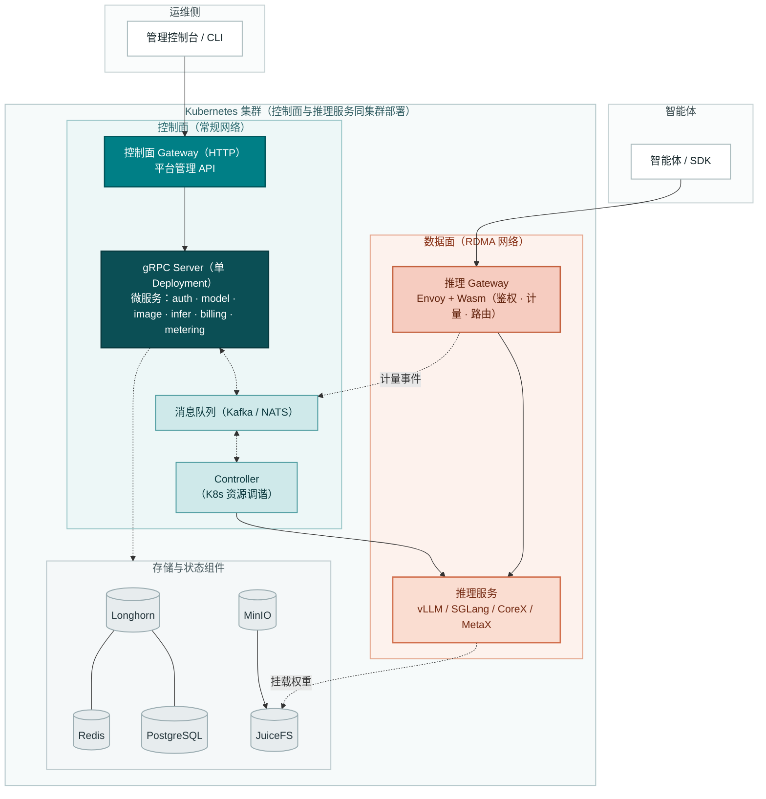

<p align="center">
  
</p>

# Go TaaS

**Token as a Service —— 基于 Kubernetes、面向智能体与 SDK 的开源大模型推理服务与计量计费平台**

[](./LICENSE)
[](https://golang.org/)
[](./CONTRIBUTING.md)

**Go TaaS** 是一个在 Kubernetes 上提供大模型推理与计费服务的开源平台。管理员在异构算力（NVIDIA GPU、天数智芯 CoreX、沐曦 MetaX）上部署开源模型（Qwen、DeepSeek、LLaMA 等），并按「模型 × 卡型」灵活定价；智能体与 SDK 通过 OpenAI 兼容 API 消费模型，按 API Key 隔离，按 token 计量并异步结算。

> **状态**：Go TaaS 处于设计与早期开发阶段。[架构设计](./docs/design/architecture.zh-cn.md)已经确定，实现进度见[路线图](#路线图)。

**English | [简体中文](./README.zh-cn.md)**

## 目录

- [特性](#特性)
- [架构](#架构)
- [技术栈](#技术栈)
- [快速开始](#快速开始)
- [使用示例](#使用示例)
- [文档](#文档)
- [路线图](#路线图)
- [参与贡献](#参与贡献)
- [社区](#社区)
- [许可证](#许可证)

## 特性

| 领域 | 能力 |
| --- | --- |
| 异构算力 | 统一支持 NVIDIA GPU、天数智芯 CoreX 与沐曦 MetaX；节点打标、Device Plugin 与驱动部署由各厂商 GPU Operator 完成 |
| 控制面 / 数据面分离 | 管理 API 与推理 API 由两个独立网关承载，推理链路扩缩容、升级或降级时平台管理能力不受影响 |
| 模型一键部署 | 通过控制台或 API 部署模型；平台经消息队列与 Kubernetes Controller 编排推理工作负载，无需手写 YAML |
| 推理镜像管理 | 统一登记、版本化 NVIDIA / CoreX / MetaX 引擎镜像并维护适配关系，节点级预热缩短冷启动 |
| OpenAI 兼容 API | `/v1/chat/completions`、`/v1/completions`、`/v1/embeddings` 由基于 Envoy 的网关承载；鉴权、计量与路由运行在 Wasm 插件中，推理流量不经过业务进程 |
| Token 计量与计费 | 网关侧计量 token 用量（prompt / completion / cached / reasoning），生成防篡改凭单，按 API Key 异步结算 |
| 灵活定价 | 「模型 × 卡型」价格矩阵，输入/输出 token 分别定价，支持阶梯价与套餐包；余额（预付费）与额度（后付费）两种账户模式 |
| 多租户 | 组织 / 项目两级隔离，API Key 全生命周期管理；密钥仅以加盐哈希存储 |
| SSO 联邦认证 | 插件化身份提供方 —— LDAP/LDAPS、OIDC/OAuth 2.0（GitHub、Google、GitLab）、SAML 2.0 与微信 —— 支持账号绑定、JIT 预置与属性到角色的映射 |
| 存储与网络分层 | Longhorn 承载集群状态，MinIO + JuiceFS 承载权重与镜像；控制面走常规以太网，推理可选 RDMA（RoCE / InfiniBand） |

## 架构



- 流量按受众分流：管理员经**控制面 Gateway**（HTTP，由 `grpc-gateway` 从 Protobuf 契约生成）进入，智能体与 SDK 调用**推理 Gateway**（Envoy + Wasm）。
- 两个网关作为独立工作负载部署，控制面 API 与推理 API 的扩缩容、升级与故障域完全隔离。
- 各微服务 gRPC server（`auth`、`model`、`image`、`infer`、`billing`、`metering`）运行在**单一 Deployment** 内，经**消息队列**（Kafka / NATS）把工作交给 Controller，API 服务与 Kubernetes 调谐解耦。
- 鉴权、计量与路由运行在推理 Gateway 的 **Wasm 插件**中，推理流量不经过业务进程。
- 推理 Gateway 通过 **gRPC 调用 `auth` 模块**校验每个 API Key，两级缓存（Wasm 本地 TTL 缓存 → Redis）支撑；超时或 `auth` 不可用时按 fail-closed 拒绝。
- 推理服务与控制面共享**同一个 Kubernetes 集群**，通过 Namespace、节点标签与污点/容忍度隔离。

组件职责、网关设计与协作流程详见[架构设计文档](./docs/design/architecture.zh-cn.md)。

## 技术栈

| 层次 | 选型 |
| --- | --- |
| 后端 | Go、gRPC + grpc-gateway、GORM |
| 数据 | PostgreSQL、Redis（兼容 Valkey）、Kafka / NATS |
| 控制面网关 | grpc-gateway —— 从 Protobuf 生成 HTTP/JSON 与 OpenAPI |
| 数据面网关 | Envoy + Wasm |
| 存储 | Longhorn 承载集群状态；MinIO + JuiceFS 承载推理权重与镜像 |
| 网络 | 控制面走常规以太网；推理可选 RDMA（RoCE / InfiniBand） |
| 编排 | Kubernetes + client-go |
| 推理引擎 | NVIDIA：vLLM / SGLang / TensorRT-LLM；天数智芯 CoreX；沐曦 MetaX |
| 前端（`web/`） | React + TypeScript + Tailwind CSS + shadcn/ui + Framer Motion |

## 快速开始

> 项目处于早期开发阶段。以下命令描述的是规划中的工作流，将随实现进展更新。

### 环境要求

- Go 1.25+
- golangci-lint v2
- buf
- Node.js 20+（前端，`web/`）
- Git

### 从源码构建

```bash
git clone https://github.com/go-taas/go-taas.git
cd go-taas

make pbgen   # 生成 Protobuf 代码（gRPC stubs + grpc-gateway + OpenAPI）
make deps    # 更新依赖
make lint    # 静态检查
make ut      # 单元测试
make build   # 构建二进制
```

### Docker Compose 体验

一键体验环境：控制面（含控制台）+ PostgreSQL + Redis + 消息队列。

```bash
make compose-up   # 构建镜像并启动本地环境
```

控制台由 `taas-server` 提供服务，访问地址 `http://localhost:9091/`。

### 生产部署（规划中）

基于 Kubernetes + Helm 的一键部署，支持平台与推理集群分离；详见专用部署仓库。

## 使用示例

### Python（OpenAI SDK）

```python
from openai import OpenAI

client = OpenAI(
    base_url="https://<your-taas-host>/v1",
    api_key="sk-xxxxxxxx",
)

resp = client.chat.completions.create(
    model="qwen2.5-7b",
    messages=[{"role": "user", "content": "你好，介绍一下你自己。"}],
)
print(resp.choices[0].message.content)
```

### cURL

```bash
curl https://<your-taas-host>/v1/chat/completions \
  -H "Content-Type: application/json" \
  -H "Authorization: Bearer sk-xxxxxxxx" \
  -d '{
    "model": "qwen2.5-7b",
    "messages": [{"role": "user", "content": "你好！"}]
  }'
```

## 文档

| 文档 | 语言 |
| --- | --- |
| [Architecture Design](./docs/design/architecture.md) | English |
| [架构设计文档](./docs/design/architecture.zh-cn.md) | 中文 |

## 路线图

| 阶段 | 内容 |
| --- | --- |
| Phase 1（MVP） | 单集群 NVIDIA：模型 CRUD、API Key、控制/推理网关分离、vLLM 部署、网关侧鉴权与计量 |
| Phase 2 | 计费与多租户：定价、余额/额度、阶梯价、异步结算、审计、运营看板 |
| Phase 3 | 异构算力：GPU Operator 集成、天数智芯 / 沐曦引擎与镜像适配、兼容矩阵 |
| Phase 4 | 生产化：Helm 一键部署、弹性伸缩、RDMA 网络、压测、SDK、社区运营 |

## 参与贡献

欢迎各种形式的贡献 —— 代码、文档、缺陷报告与功能建议。开发环境、提交规范与 PR 指引见 [CONTRIBUTING.md](./CONTRIBUTING.md)。

- 遵循 [Conventional Commits](https://www.conventionalcommits.org/zh-hans/)（由 commitlint 校验）
- 提交前运行 `make lint` 与 `make ut`
- 缺陷报告与功能请求请使用 issue 模板

## 社区

- [GitHub Issues](https://github.com/go-taas/go-taas/issues) —— 缺陷报告与功能请求
- [GitHub Discussions](https://github.com/go-taas/go-taas/discussions) —— 问题与开放讨论

## 许可证

Go TaaS 基于 [Apache License 2.0](./LICENSE) 许可发布。
