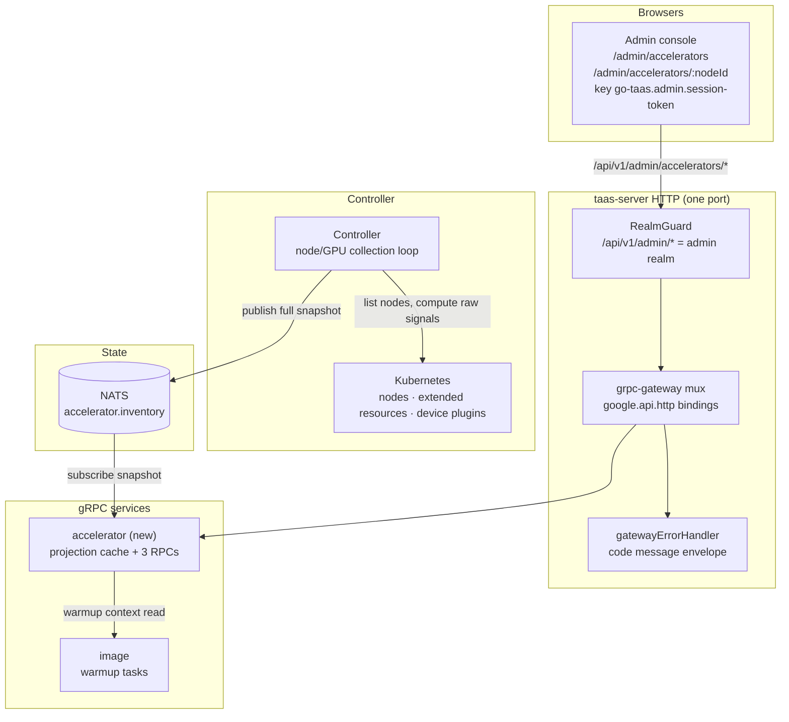
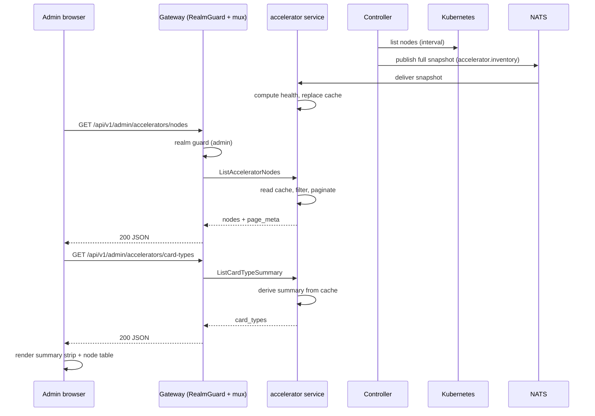
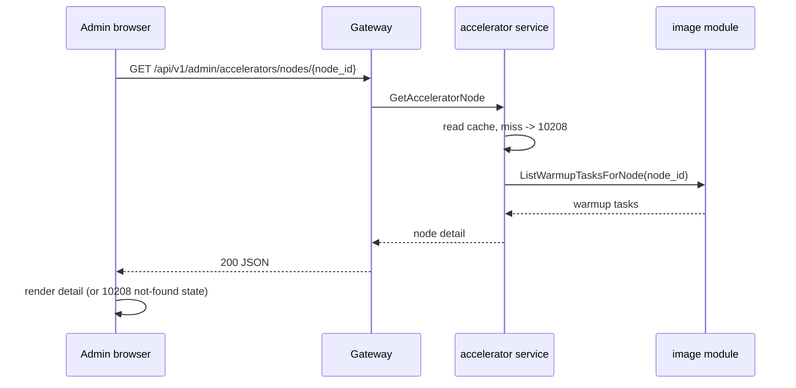
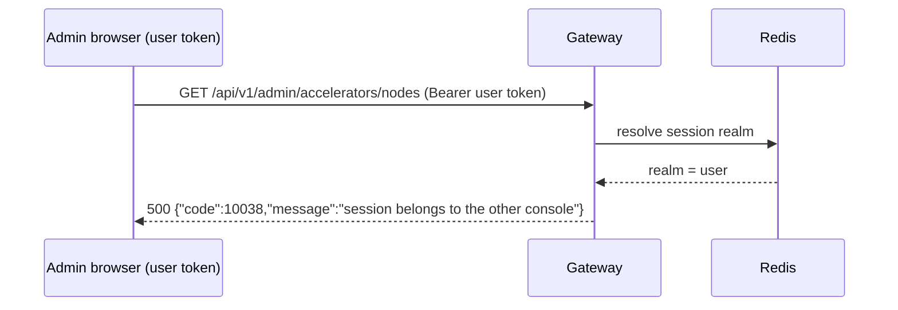

# Accelerator Inventory & Health (GPU Operator Integration) — Architecture and Detailed Design

| Attribute | Content |
| --- | --- |
| Feature point | Accelerator inventory & health — per-node GPU fleet visibility: node, driver version, device-plugin status, GPU model/count/allocated-free, health/readiness (backlog row 18) |
| Document scope | Architecture and detailed design for the read-only admin-surface accelerator inventory: the discovery and reporting mechanism (Controller → MQ → accelerator service), the in-memory projection cache data model, the three admin RPCs with their exact `google.api.http` bindings, the health-composite semantics, the warmup-task context read, the frontend pages and their route → API-prefix mapping, error handling (10208), configuration, security, rollout, and a function-level task list per layer |
| Owning modules | `services/accelerator` (new: projection cache + three admin RPCs), `internal/controller` (node/GPU collection + snapshot publish), `pkg/k8s` (node, device-plugin, extended-resource reads), `pkg/mq` (new `accelerator.inventory` subject), `pkg/errors` (10208), `pkg/config` (accelerator section), `web/` admin console (`AcceleratorsPage`, `AcceleratorNodeDetailPage`), `services/image` (warmup-task narrow read) |
| Related documents | [Requirement Analysis and UI/UX Design](../design/accelerator-inventory.md) · [Architecture Design](../design/architecture.md) §2.3 (heterogeneous compute), §2.7 Controller · [Console Surface Separation](./console-surface-separation.md) (the admin surface, realm guard, `AdminShell`) · [Image Management](./image-management.md) (warmup tasks, per-node results, the "node inventory" this feature provides) · [Model Catalog & One-Click Deployment](./model-catalog-deployment.md) (card type `accelerator_type`) · [Inference Autoscaling](./inference-autoscaling.md) (node-level capacity context) |
| Status | Architecture complete, handed to the Developer agent |

---

## 1. Overview and Goals

go-taas serves inference on heterogeneous accelerators (NVIDIA GPU, Iluvatar CoreX, MetaX) and delegates driver, device-plugin and node-label management to each vendor's GPU Operator (architecture §2.3). Today the operator has no visibility into the accelerator fleet: the deploy form accepts any card type, a request for a card type with no free capacity fails only at the Kubernetes scheduler, and a node whose driver or device plugin is degraded still appears in the cluster with no operator-facing explanation.

This feature adds a **read-only accelerator inventory and health view** on the admin console: a page that lists every compute node, its accelerator vendor, the GPU model(s) it carries, how many are allocated vs free, the driver and device-plugin status, and the node's readiness. It is the smallest independently valuable increment of Phase 3's "heterogeneous accelerators" roadmap item, and it is the "node inventory" prerequisite that image-management defers to and the "card-type inventory" prerequisite that the compatibility matrix (row 19) consumes.

**Goals**:

- A read-only admin page `/admin/accelerators` that lists every compute node with its accelerator vendor, GPU model(s), allocated/free counts, driver version, device-plugin status, and readiness (design D1–D3).
- A card-type summary that answers "how many of card X are free" (design D2, D10).
- Vendor and card-type derivation from node labels and extended resources (design D5, D6).
- A node detail view with per-GPU breakdown, health signals, resources, and warmup-task context (design D4, FR3).
- The page → API surface table with the exact admin prefix (design D7).
- Per-page interactive states including empty, error, and permission-denied.
- Numbered acceptance criteria testable in Nightwatch against the compose stack.

**Non-goals** (from the design, restated): any mutation of nodes (cordon, drain, label editing, driver upgrade) — D1; tenant-facing accelerator visibility — D7; the compatibility matrix (row 19, consumes this inventory); node-aware warmup targeting beyond feature #3's node selector; node-level autoscaling (feature #16); a Grafana-style utilization-over-time dashboard (this page shows a point-in-time snapshot); RDMA/network health.

### 1.1 Reading order

Section 2 records the architecture decisions (including the one point where the architecture refines the UI/UX design, with its rationale). Sections 3–5 are the component view, the discovery/reporting mechanism, and the data model. Sections 6–8 are the API contract, the frontend architecture, and the key sequences. Sections 9–12 are error handling, configuration, security and rollout. Sections 13–15 are the acceptance-criteria traceability, the function-level detailed design, and the ordered implementation task list.

---

## 2. Architecture Decisions

AD1–AD10 restate the UI/UX design's decisions as implementation-level rules. **AD11 is a refinement** the architecture adds, marked as such with the design decision it refines; it preserves the design's intent and is recorded here so the Developer and Test agents implement one reading.

| # | Decision | Rationale |
| --- | --- | --- |
| AD1 | **The inventory is a projection of Kubernetes node + extended-resource state, collected by the Controller and served through the admin gateway; it is not a new database table.** The Controller is the only component with a Kubernetes client; it polls nodes on an interval and publishes a **full snapshot** to the MQ; the accelerator service consumes the snapshot and maintains an **in-memory projection cache** (a map keyed by node id) that the three RPCs read | Design D4. The source of truth is the cluster (node labels, `nvidia.com/gpu`-style extended resources, device-plugin status). A projection avoids a second source of truth that drifts from the cluster. The full-snapshot publish is self-healing: a node removed from the cluster disappears from the next snapshot, and a service restart repopulates the cache from the next snapshot. The cache is ephemeral and single-replica; this is acceptable for a read-only telemetry view (see AD11 for the trade-off) |
| AD2 | **The Controller publishes raw signals; the accelerator service computes the composite health.** The Controller reports per node: readiness, device-plugin state, driver-version presence, vendor, card types, and allocated/free counts. The accelerator service derives the composite `health` from the three raw signals at ingestion | Design D3. Health semantics live in the service that serves the API, so the AC4 unit test is a service-level test and the Controller stays a dumb collector. The client renders the badge; it never computes health |
| AD3 | **Vendor is derived from node labels; card type from the node's accelerator-specific extended-resource name or label; a node with no accelerator label is `unspecified`.** The vendor drives the badge and the card-type parsing; an unlabeled node is still listed and its health is based on node readiness alone | Design D5, FR4.2. Matches the architecture's node-labeling model (§2.3). The vendor set is closed: `nvidia`, `iluvatar`, `metax`, `unspecified` |
| AD4 | **Allocated vs free is computed from the node's allocatable vs allocated extended resources per card type.** The page shows both numbers and a utilization bar | Design D6. "Free capacity" is the operator's planning question; allocatable/allocated is the Kubernetes-native answer |
| AD5 | **The page is admin-surface only.** Route `/admin/accelerators` and `/admin/accelerators/:nodeId`; API prefix `/api/v1/admin/accelerators/*`. Tenants never see the fleet | Design D7. The accelerator fleet is operator-internal orchestration state; a tenant consumes models, not nodes |
| AD6 | **A new error code 10208 `CodeAcceleratorNodeNotFound`** for a node id that does not exist in the inventory | Design D8. Mirrors the per-module code allocation pattern; a stale node id must not be silently treated as an empty node. The code lives in the image block (10201–10299) because the accelerator inventory is the node/card-type inventory the image module defers to |
| AD7 | **The inventory is polled, not pushed.** The page polls `ListAcceleratorNodes` on an interval (default 30 s) and shows a last-updated timestamp; there is no websocket | Design D9. Matches the existing console's `usePolling` pattern and keeps the API stateless |
| AD8 | **Card-type summary groups by `(vendor, card_type)`** and shows total / allocated / free / nodes; a card type with zero free capacity is visually flagged | Design D10. The operator's capacity question is per card type |
| AD9 | **The three RPCs are new RPCs on a new `taas.accelerator.v1.AcceleratorService`**, not extensions of `image` or `infer` | The inventory is a distinct concern (fleet telemetry) with its own projection cache and its own error code. A dedicated service keeps the image module's warmup and registry responsibilities separate and gives the compatibility matrix (row 19) a stable card-type read surface to consume |
| AD10 | **The accelerator APIs are platform-scoped: no `X-Organization-Id` header is required or honored.** The fleet is operator-internal state, like images | Mirrors the image module's platform-scoped decision (image-management D9). The inventory is not tenant-scoped |
| AD11 | **REFINEMENT of design D4 — the projection is an in-memory cache in the accelerator service, refreshed by the Controller's periodic full-snapshot publish, rather than a persistent table.** The design's "not a new database table" is honored literally: no GORM model, no `AutoMigrate`, no SQL. The cache is a `sync.RWMutex`-guarded `map[string]*AcceleratorNode` replaced wholesale on each snapshot | The design explicitly rules out a database table (D4: "it is not a new database table"). An in-memory cache is the smallest faithful reading. Trade-offs, all accepted for a read-only telemetry view: (a) the cache is ephemeral — a service restart shows an empty inventory until the next Controller snapshot (bounded by the collect interval, default 30 s); (b) the cache is per-replica — with multiple `taas-server` replicas each holds its own copy, but the MQ snapshot is pub/sub so all replicas converge on the same data within one interval; (c) no historical data — the page is a point-in-time snapshot by design (non-goal). If durability or history is later required, a DB-backed projection is the follow-up. Rejected alternative: a persistent `accelerator_nodes` table — it violates D4 and creates a second source of truth that drifts from the cluster |

---

## 3. Component View

### 3.1 Ownership

| Layer / component | Owns | Changes in this feature |
| --- | --- | --- |
| **Static bundle (SPA)** | One Vite bundle (`web/dist`), embedded into `taas-server` at `pkg/server/console/`; served by the gateway's SPA fallback | Two new admin pages (`AcceleratorsPage`, `AcceleratorNodeDetailPage`), a nav item, and the route registrations in `App.tsx` |
| **Gateway (`pkg/server`)** | HTTP composition: `RealmGuard` → `withConsole` → `runtime.ServeMux`; the unified error renderer; the SPA fallback | No change — the new RPCs bind under `/api/v1/admin/accelerators/*` and the realm guard already treats that prefix as the admin surface |
| **grpc-gateway mux** | Path → RPC routing from `google.api.http` annotations | New bindings for the three new RPCs (Section 6) |
| **`accelerator` (new)** | The in-memory projection cache, the snapshot consumer (Runner), and the three admin RPCs | New service: `services/accelerator` |
| **`internal/controller`** | Kubernetes reconciliation; node/GPU collection and snapshot publish | New collection loop that lists nodes, computes raw signals, and publishes the full snapshot to `accelerator.inventory` |
| **`pkg/k8s`** | The Kubernetes client (clientset + dynamic) | No change — the collection loop uses the existing clientset |
| **`image`** | Warmup tasks and per-node results | Exposes a narrow read interface `ListWarmupTasksForNode` for the accelerator service's node-detail warmup context |
| **`pkg/mq`** | The canonical subjects | New `AcceleratorInventory` subject |
| **`pkg/errors`** | Code blocks per module | One new image-block code: **10208 `CodeAcceleratorNodeNotFound`** |
| **`pkg/config`** | The merged configuration tree | New `accelerator` section (collect interval, snapshot consumer kill switch) |

### 3.2 Runtime component view



### 3.3 Request identity chain

The accelerator RPCs are **admin-surface, platform-scoped** (AD5, AD10). The chain is:

1. `RealmGuard` (HTTP, `pkg/server/realm.go`) — path prefix `/api/v1/admin/accelerators/*` decides the expected realm `admin`. With no `Authorization` header: pass through (transitional, feature-17 AD4). With a header: resolve the session realm from Redis; mismatch → 10038, unknown/expired/realm-less → 10027.
2. grpc-gateway mux — routes by the annotated path and forwards `authorization`.
3. `accelerator` handler — reads the projection cache. It does **not** resolve an organization (AD10): the fleet is platform-scoped, so no `X-Organization-Id` is required or honored, and no `SessionActiveOrg` / `resolveOrganizationID` call is made.

Because the accelerator RPCs are read-only and platform-scoped, there is no `tenancy.RoleGuard` gate on them: any admin-realm session (or transitional caller) may read the fleet. This matches the image module's platform-scoped reads. The permission-denied state (design FR5.1, AC12) is therefore produced by the realm guard (10038) or the session guard (10027), not by a role check; the page's permission-denied handling is the standard feature-17 state.

---

## 4. Discovery and Reporting Mechanism

### 4.1 The collection loop (Controller)

The Controller is the only component with a Kubernetes client. It runs a new background collection loop that, on an interval (`accelerator.collectInterval`, default 30 s):

1. Lists all nodes via the clientset (`corev1.Nodes`).
2. For each node, computes the **raw signals**:
   - **readiness**: from the node's `Ready` condition (`ready` / `not_ready` / `unknown`).
   - **vendor**: from the accelerator label. The vendor set is closed: `nvidia`, `iluvatar`, `metax`, `unspecified`. A node with no accelerator label is `unspecified` (AD3).
   - **card types and allocated/free**: from the node's accelerator-specific extended resources. For each card type, `allocatable` vs `allocated` (sum of requests across pods on the node, or the extended-resource `allocatable` minus `allocated` as reported by the device plugin). The card type is parsed from the extended-resource name or the accelerator label (e.g. `nvidia.com/gpu` → card type from the node label `nvidia.com/gpu.product`; Iluvatar/MetaX equivalents).
   - **driver version**: from the node label the GPU Operator writes (e.g. `nvidia.com/driver.version`; Iluvatar/MetaX equivalents). Presence is a boolean signal for health; the value is shown on the detail view.
   - **device-plugin state**: from the node's device-plugin status (the `Healthy`/`Unhealthy` condition the device plugin reports, or the extended-resource allocatable being non-zero). `healthy` / `degraded` / `unknown`.
   - **per-GPU breakdown**: index, model, allocated/free, and any per-GPU health note (from the device-plugin's per-device health, where available).
3. Assembles a **full snapshot** of all nodes and publishes it to the MQ subject `accelerator.inventory` (JSON body, `reported_at` timestamp).

The snapshot is **full**, not per-node deltas: a node removed from the cluster disappears from the next snapshot, and a service restart repopulates the cache from the next snapshot (AD1). The collection loop is independent of the reconcile loop; it runs in its own goroutine and is cancelled with the Controller's context.

### 4.2 The snapshot consumer (accelerator service)

The accelerator service runs a `server.Runner` that subscribes to `accelerator.inventory`. On each snapshot:

1. Parse the JSON body; a malformed snapshot is logged and skipped (never retried — a malformed snapshot never becomes well-formed).
2. Compute the composite `health` for each node from the three raw signals (AD2): `healthy` only when readiness is `ready`, device-plugin is `healthy`, and a driver version is present; otherwise `degraded`; `unknown` when any signal is unknown.
3. Replace the in-memory projection cache wholesale under a write lock.

The cache is `sync.RWMutex`-guarded `map[string]*AcceleratorNode`; the three RPCs read it under a read lock.

### 4.3 Health semantics

| Signal | Source | Values |
| --- | --- | --- |
| readiness | node `Ready` condition | `ready` / `not_ready` / `unknown` |
| device-plugin state | device-plugin status / extended-resource allocatable | `healthy` / `degraded` / `unknown` |
| driver presence | driver-version node label | present / absent |

Composite `health` (computed in the accelerator service, AD2):

| readiness | device-plugin | driver present | health |
| --- | --- | --- | --- |
| `ready` | `healthy` | yes | `healthy` |
| any other combination with no `unknown` | | | `degraded` |
| any signal `unknown` | | | `unknown` |

A node with vendor `unspecified` (no accelerator label) has no device-plugin or driver signals; its health is based on node readiness alone (design FR4.2): `ready` → `healthy`, `not_ready` → `degraded`, `unknown` → `unknown`.

---

## 5. Data Model

The inventory is an **in-memory projection cache** (AD1, AD11), not a database table. There is no GORM model, no `AutoMigrate`, no SQL migration. The "data model" is the shape of the cache entries and the wire messages.

### 5.1 Projection cache

```go
// AcceleratorNode is one node's projection in the cache.
type AcceleratorNode struct {
    NodeID            string
    Name              string
    Vendor            string // nvidia | iluvatar | metax | unspecified
    CardTypes         []string
    GPUsAllocated     int64
    GPUsFree          int64
    DriverVersion     string
    DevicePluginState string // healthy | degraded | unknown
    Readiness         string // ready | not_ready | unknown
    Health            string // healthy | degraded | unknown
    GPUs              []AcceleratorGPU
    Labels            map[string]string // accelerator-relevant labels
    Taints            []string
    Resources         []AcceleratorResource // per card type
    LastUpdatedAt     time.Time
}

// AcceleratorGPU is one GPU on a node.
type AcceleratorGPU struct {
    Index     int64
    Model     string
    Allocated bool
    Free      bool
    Note      string
}

// AcceleratorResource is one card type's allocatable vs allocated.
type AcceleratorResource struct {
    CardType   string
    Allocatable int64
    Allocated   int64
}
```

The cache is `map[string]*AcceleratorNode` keyed by node id, guarded by `sync.RWMutex`, replaced wholesale on each snapshot.

### 5.2 Card-type summary derivation

`ListCardTypeSummary` is derived from the cache at request time (no separate storage): group all nodes by `(vendor, card_type)`, sum `total` (allocatable), `allocated`, `free` (allocatable − allocated), and count distinct nodes. Card types with zero total are omitted (design FR1.2). Sorting is by vendor, then free ascending (most constrained first, design FR1.3).

### 5.3 Warmup-task context (cross-module read)

`GetAcceleratorNode` returns the node's warmup-task context (design FR3.2). Warmup tasks live in the image module's `warmup_tasks` table (`node_results` JSON). Following the established narrow-interface pattern (image-management §3.3), the image module exposes:

```go
// ListWarmupTasksForNode returns warmup tasks whose node_selector matches
// the node or whose node_results mention the node, newest first.
func (r *WarmupTaskRepository) ListWarmupTasksForNode(ctx context.Context, nodeID string, limit int) ([]*WarmupTask, error)
```

The accelerator service reads this through an injected narrow interface (`image.NewWarmupTasksForNodeProvider(gormDB)`), keeping the accelerator module free of an image dependency — exactly the pattern `model.SetDeleteGuard` / `image.SetDeleteGuard` established.

---

## 6. API Contract

### 6.1 RPC Surface

All APIs belong to **`taas.accelerator.v1.AcceleratorService`** (proto: `proto/taas/accelerator/v1/accelerator.proto`), served as HTTP via the Control Gateway. All three RPCs are **new** and **admin-surface only** (AD5). Proto changes are additive.

| RPC | HTTP | Status | Purpose |
| --- | --- | --- | --- |
| `ListAcceleratorNodes` | `GET /api/v1/admin/accelerators/nodes` | **new** | Fleet list with vendor/health filters, node-name search, pagination; returns per-node summary |
| `GetAcceleratorNode` | `GET /api/v1/admin/accelerators/nodes/{node_id}` | **new** | Node detail: per-GPU breakdown, labels, taints, resources, warmup-task context |
| `ListCardTypeSummary` | `GET /api/v1/admin/accelerators/card-types` | **new** | `(vendor, card_type)` → total / allocated / free / nodes, for the summary strip |

### 6.2 Proto contract

```proto
syntax = "proto3";

package taas.accelerator.v1;

import "google/api/annotations.proto";
import "taas/common/v1/common.proto";

option go_package = "github.com/go-taas/go-taas/proto/taas/accelerator/v1;acceleratorv1";

// AcceleratorService serves the read-only accelerator fleet inventory.
// Admin-surface API: served under /api/v1/admin/accelerators.
service AcceleratorService {
  // ListAcceleratorNodes returns the fleet list with vendor/health
  // filters, node-name search, and pagination.
  rpc ListAcceleratorNodes(ListAcceleratorNodesRequest) returns (ListAcceleratorNodesResponse) {
    option (google.api.http) = {get: "/api/v1/admin/accelerators/nodes"};
  }

  // GetAcceleratorNode returns one node's detail: per-GPU breakdown,
  // labels, taints, resources, and warmup-task context.
  rpc GetAcceleratorNode(GetAcceleratorNodeRequest) returns (GetAcceleratorNodeResponse) {
    option (google.api.http) = {get: "/api/v1/admin/accelerators/nodes/{node_id}"};
  }

  // ListCardTypeSummary returns the (vendor, card_type) capacity summary.
  rpc ListCardTypeSummary(ListCardTypeSummaryRequest) returns (ListCardTypeSummaryResponse) {
    option (google.api.http) = {get: "/api/v1/admin/accelerators/card-types"};
  }
}

message ListAcceleratorNodesRequest {
  taas.common.v1.PageRequest page = 1;
  // vendor filters by accelerator vendor; empty means all.
  string vendor = 2;
  // health filters by composite health; empty means all.
  string health = 3;
  // search matches a node name substring.
  string search = 4;
}

message ListAcceleratorNodesResponse {
  taas.common.v1.Response response = 1;
  repeated AcceleratorNodeSummary nodes = 2;
  taas.common.v1.PageMeta page_meta = 3;
}

message AcceleratorNodeSummary {
  string node_id = 1;
  string name = 2;
  string vendor = 3;
  repeated string card_types = 4;
  int64 gpus_allocated = 5;
  int64 gpus_free = 6;
  string driver_version = 7;
  string device_plugin_state = 8; // healthy | degraded | unknown
  string readiness = 9;           // ready | not_ready | unknown
  string health = 10;             // healthy | degraded | unknown
  int64 last_updated_at = 11;
}

message GetAcceleratorNodeRequest {
  string node_id = 1;
}

message GetAcceleratorNodeResponse {
  taas.common.v1.Response response = 1;
  AcceleratorNode node = 2;
}

message AcceleratorNode {
  AcceleratorNodeSummary summary = 1;
  repeated AcceleratorGPU gpus = 2;
  map<string, string> labels = 3;
  repeated string taints = 4;
  repeated AcceleratorResource resources = 5;
  repeated WarmupTaskRef warmup_tasks = 6;
}

message AcceleratorGPU {
  int64 index = 1;
  string model = 2;
  bool allocated = 3;
  bool free = 4;
  string note = 5;
}

message AcceleratorResource {
  string card_type = 1;
  int64 allocatable = 2;
  int64 allocated = 3;
}

message WarmupTaskRef {
  string task_id = 1;
  string state = 2;
  string node_outcome = 3;
}

message ListCardTypeSummaryRequest {
  taas.common.v1.PageRequest page = 1;
}

message ListCardTypeSummaryResponse {
  taas.common.v1.Response response = 1;
  repeated CardTypeSummary card_types = 2;
}

message CardTypeSummary {
  string vendor = 1;
  string card_type = 2;
  int64 total = 3;
  int64 allocated = 4;
  int64 free = 5;
  int64 node_count = 6;
}
```

### 6.3 Wire format (established conventions)

- Pagination binds as `?page.offset=0&page.limit=20` (dotted form); default limit 20, cap 100.
- Success responses are HTTP 200; business errors render as `{"code": <int>, "message": "..."}`.
- The accelerator APIs are **platform-scoped**: no `X-Organization-Id` header is required or honored (AD10).
- `ListAcceleratorNodes` supports `vendor` and `health` filters, `search` (node-name substring), and `offset`/`limit` pagination. Filtering and pagination are applied server-side over the projection cache.
- `GetAcceleratorNode` returns the summary plus `gpus[]`, `labels`, `taints`, `resources[]`, and `warmup_tasks[]`. A missing `node_id` returns **10208 `CodeAcceleratorNodeNotFound`** (AD6).
- `ListCardTypeSummary` returns `(vendor, card_type, total, allocated, free, node_count)` rows, sorted by vendor then free ascending, omitting card types with zero total (design FR1.2/FR1.3).
- Health is computed server-side (AD2); the client renders the badge, it does not compute it.

### 6.4 Validation matrix

| RPC | Check | Failure code | Canonical message |
| --- | --- | --- | --- |
| `ListAcceleratorNodes` | `vendor` in {nvidia, iluvatar, metax, unspecified} or empty; `health` in {healthy, degraded, unknown} or empty; `limit` ≤ 100 | 10001 `UNAUTHORIZED` for a missing org header is **not** applicable (platform-scoped, AD10); invalid filter values are ignored (treated as empty) | — |
| `GetAcceleratorNode` | `node_id` present in the cache | 10208 `CodeAcceleratorNodeNotFound` | accelerator node not found |
| `ListCardTypeSummary` | none | — | — |

---

## 7. Frontend Architecture

### 7.1 Module plan

| Concern | File | Notes |
| --- | --- | --- |
| Admin nav item | `web/src/shells/AdminShell.tsx` | add `{ path: '/admin/accelerators', label: 'Accelerators', testid: 'nav-accelerators' }` to `ADMIN_NAV_ITEMS` |
| Route registration | `web/src/App.tsx` | add `/admin/accelerators` and `/admin/accelerators/:nodeId` to the `AdminSurface` `<Routes>` |
| Fleet list page | `web/src/pages/AcceleratorsPage.tsx` (new) | card-type summary strip + node table, filters, search, pagination, polling |
| Node detail page | `web/src/pages/AcceleratorNodeDetailPage.tsx` (new) | per-GPU breakdown, health signals, resources, labels/taints, warmup context |
| Shared components | `web/src/components.tsx` | reuse `ErrorBanner`, `Pagination`, `StateBadge`, `usePolling`; no new shared component required |

### 7.2 Admin console: page → route → API

| Route | Component | Purpose | API prefix (exact calls) |
| --- | --- | --- | --- |
| `/admin/accelerators` | `pages/AcceleratorsPage.tsx` | fleet list + card-type summary | `GET /api/v1/admin/accelerators/nodes?page.offset=…&page.limit=…&vendor=…&health=…&search=…`, `GET /api/v1/admin/accelerators/card-types` |
| `/admin/accelerators/:nodeId` | `pages/AcceleratorNodeDetailPage.tsx` | node detail | `GET /api/v1/admin/accelerators/nodes/{node_id}` |

The pages call **only** `/api/v1/admin/accelerators/*` routes; they contain no `/api/v1/*` (user-prefix) string (design FR5.2, feature-17). The realm-scoped API client (`useApi()`) enforces this at runtime (feature-17 AD1).

### 7.3 Route registration in `web/src/App.tsx`

```tsx
<Route path="/admin/accelerators" element={<AcceleratorsPage />} />
<Route path="/admin/accelerators/:nodeId" element={<AcceleratorNodeDetailPage />} />
```

Both routes are inside the `AdminSurface` `<Routes>`, so they render inside `AdminShell` and inherit the admin realm's session guard and nav.

### 7.4 Per-surface auth guard

The pages inherit the `AdminShell` guard (feature-17 §7.5): on boot it reads `go-taas.admin.session-token`; empty → transitional mode; present → `GET /api/v1/admin/auth/session`; 10027/10038 → clear the admin token and redirect to `/admin/login?next=<path>&reason=…`. The pages never read the user realm's keys. Because the accelerator RPCs are platform-scoped and read-only, there is no additional role gate; the permission-denied state (design FR5.1, AC12) is the standard feature-17 state produced by the realm/session guard.

### 7.5 Polling and stale-data handling

`AcceleratorsPage` uses `usePolling` (design D9, FR5.3): it polls `ListAcceleratorNodes` and `ListCardTypeSummary` on a 30 s interval and shows a last-updated timestamp. A failed poll keeps the last good data and shows a "Showing stale data" banner with a Retry action (design FR5.3, AC9); it never clears the table. The `Refresh` action is disabled while a poll is in flight.

### 7.6 `data-testid` hooks the Test agent can drive

- Shell/nav: `nav-accelerators`.
- Fleet page: `accelerators-page`, `accelerators-refresh`, `accelerators-last-updated`, `accelerators-summary-strip`, `accelerator-card-{vendor}-{card_type}`, `accelerator-card-no-free-{vendor}-{card_type}`, `accelerators-vendor-banner-{vendor}`, `accelerators-vendor-filter`, `accelerators-health-filter`, `accelerators-search`, `accelerators-table`, `accelerators-empty`, `accelerators-stale-banner`, `accelerators-error`, `accelerator-node-{node_id}`, `accelerators-pagination`.
- Node detail: `accelerator-node-detail`, `accelerator-node-back`, `accelerator-node-health`, `accelerator-node-gpus`, `accelerator-node-resources`, `accelerator-node-labels`, `accelerator-node-taints`, `accelerator-node-warmup`, `accelerator-node-not-found`.

---

## 8. Sequence Diagrams

### 8.1 Fleet page load and poll



### 8.2 Node detail with warmup context



### 8.3 Wrong-realm rejection



---

## 9. Error Handling

| Code | Constant | Message | When |
| --- | --- | --- | --- |
| 10208 | `CodeAcceleratorNodeNotFound` | accelerator node not found | `GetAcceleratorNode` with a `node_id` absent from the cache (AD6) |
| 10038 | `CodeRealmMismatch` | session belongs to the other console | a user-realm session presented on `/api/v1/admin/accelerators/*` (feature-17) |
| 10027 | `CodeSessionInvalid` | session invalid | an unknown/expired/realm-less session on the admin prefix (feature-17) |

The HTTP status is `500` and the `code` lives in the body, matching every other business error in this platform (feature-17 §4.3). Clients branch on the body `code`, never on the status. The page maps 10208 to the "Node not found — it may have been removed" state (design FR3.3, AC10) and 10038/10027 to the standard permission-denied / sign-in states.

---

## 10. Configuration

New `accelerator` section in `pkg/config/api.go` and `configs/config.yaml`:

```yaml
accelerator:
  # collectInterval is the Controller's node/GPU collection period; the
  # full snapshot is published on this interval (AD1). Default 30s.
  collectInterval: 30s
  # snapshotConsumer configures the accelerator service's snapshot
  # consumer Runner (kill switch + worker count).
  snapshotConsumer:
    enabled: true
    workers: 1
```

`AcceleratorConfig` (Go):

```go
type AcceleratorConfig struct {
    CollectInterval  time.Duration `mapstructure:"collectInterval"`
    SnapshotConsumer AcceleratorSnapshotConsumerConfig `mapstructure:"snapshotConsumer"`
}

type AcceleratorSnapshotConsumerConfig struct {
    Enabled bool `mapstructure:"enabled"`
    Workers int  `mapstructure:"workers"`
}
```

Defaults: `collectInterval` 30 s, `snapshotConsumer.enabled` true, `workers` 1 (the snapshot is a single full replacement; one worker suffices). The `ControllerConfig` gains no field — the collection interval lives in the shared `accelerator` section read by both binaries.

---

## 11. Security

- **Surface separation**: all three RPCs bind under `/api/v1/admin/accelerators/*` and are reachable only through the admin realm guard (AD5). A user-realm session is rejected with 10038; a tenant page never calls these routes (feature-17 AD1, enforced by the realm-scoped API client).
- **Platform-scoped, read-only**: the accelerator APIs require no organization header and perform no mutation (AD10, design D1). There is no write path, so there is no privilege escalation surface beyond the read itself.
- **No tenant data**: the inventory is operator-internal orchestration state; it is never exposed on the user surface (design D7).
- **No secrets**: the inventory carries node labels, driver versions, and resource counts — no credentials, tokens, or model weights. The projection cache is in-memory and never persisted.
- **Read-only by construction**: the RPCs are `GET` only; there is no `POST`/`PATCH`/`DELETE` binding, so the page cannot mutate nodes even if a caller crafts a request.

---

## 12. Rollout / Upgrade Notes

- **Proto**: additive — three new RPCs on a new service. No existing RPC or message changes. Regenerate with `buf generate`.
- **No schema migration**: the inventory is an in-memory projection (AD11); there is no `AutoMigrate`, no SQL, no init-SQL upgrade path. The `accelerator` service registers no `Migrator`.
- **New service registration**: `apps/taas-server/main.go` constructs the projection cache once (`accelerator.NewProjectionCache()`), registers the service over it (`accelerator.NewWithCache(cache)`), and adds `srv.AddRunner(accelerator.NewSnapshotConsumerRunner(srv.Components(), cache))`. The service and the snapshot consumer share the **same** cache instance, so the consumer's `Replace()` populates the cache the RPCs read (BUG-ACCEL-001). The gateway picks up the new service's handler register function automatically.
- **Controller**: `apps/controller/main.go` starts the collection loop. The Controller and `taas-server` can be upgraded independently (feature-17 / architecture §2.7): an old Controller publishing no snapshots leaves the accelerator service with an empty cache (the page shows the empty state); a new Controller with an old server is harmless (the subject is simply unsubscribed).
- **Config**: the `accelerator` section is additive; binaries that predate it fall back to defaults.
- **Backward compatibility**: no existing API, page, or test changes. The new nav item and pages are additive to the admin console.

---

## 13. Acceptance Criteria Coverage

| AC | Addressed by | Verification hook |
| --- | --- | --- |
| AC1 — `ListAcceleratorNodes` returns every labeled node with vendor, card types, allocated/free, driver, device-plugin, readiness, health; unlabeled = `unspecified` | Section 4 (collection), Section 6.2, AD3 | FVT |
| AC2 — `ListCardTypeSummary` returns sorted rows, omits zero-total | Section 5.2, AD8 | FVT |
| AC3 — `GetAcceleratorNode` returns per-GPU, labels, taints, resources, warmup context; missing node → 10208 | Section 6.2, AD6, Section 5.3 | FVT |
| AC4 — health is `healthy` only when all three signals hold; any failure degrades | Section 4.3, AD2 | Unit + FVT |
| AC5 — page renders summary strip + node table from first successful poll, with last-updated | Section 7.5 | E2E |
| AC6 — vendor/health filters, search, pagination work server-side | Section 6.3, Section 7.2 | E2E |
| AC7 — zero-free card type flagged; zero-node vendor banner | Section 7.6, AD8 | E2E |
| AC8 — empty state renders | Section 7.6 | E2E |
| AC9 — failed poll keeps last good data with stale banner + Retry | Section 7.5 | E2E |
| AC10 — node detail shows breakdown, health, resources, warmup; missing node → 10208 state | Section 7.2, Section 8.2 | E2E |
| AC11 — admin-surface only: nav item, `/admin/accelerators` route, all calls `/api/v1/admin/accelerators/*`, no `/api/v1/*` string | Section 7.2, AD5 | E2E (surface separation) |
| AC12 — session without required role receives 10036 / standard permission-denied state | Section 7.4 (realm/session guard) | E2E |

---

## 14. Detailed Design

### 14.1 File Layout

| Module | File | Contents |
| --- | --- | --- |
| `proto/taas/accelerator/v1` | `accelerator.proto` (new) | `AcceleratorService` + messages (Section 6.2) |
| `services/accelerator` | `projection.go` (new) | `AcceleratorNode`, `AcceleratorGPU`, `AcceleratorResource` structs + the `ProjectionCache` (`sync.RWMutex`-guarded map, `Replace`, `Get`, `List`, `CardTypeSummary`) |
| | `snapshot_consumer.go` (new) | `SnapshotConsumer` (Runner): subscribe to `accelerator.inventory`, parse, compute health, replace cache |
| | `service.go` (new) | `Service` (implements `server.Service` + `server.ServiceWithGateway`): the three RPCs |
| | `warmup_provider.go` (new) | the injected narrow interface for warmup-task context |
| `services/image` | `warmup_repository.go` (additive) | `ListWarmupTasksForNode` + `NewWarmupTasksForNodeProvider` |
| `internal/controller` | `inventory.go` (new) | the collection loop: list nodes, compute raw signals, publish the full snapshot |
| | `controller.go` (additive) | start the collection loop in `Run` |
| `pkg/mq` | `mq.go` | `AcceleratorInventory` subject addition |
| `pkg/errors` | `codes.go`, `messages.go` | `CodeAcceleratorNodeNotFound` (10208) + message |
| `pkg/config` | `api.go`, `configuration.go` | `AcceleratorConfig` + defaults |
| `apps/taas-server` | `main.go` | register `accelerator.New(...)`, add the snapshot consumer Runner, wire the warmup provider |
| `apps/controller` | `main.go` | start the collection loop |
| `web/src` | `shells/AdminShell.tsx`, `App.tsx` | nav item + route registrations |
| | `pages/AcceleratorsPage.tsx`, `pages/AcceleratorNodeDetailPage.tsx` (new) | the two pages |

### 14.2 `accelerator` module

`projection.go`:

```go
type ProjectionCache struct {
    mu    sync.RWMutex
    nodes map[string]*AcceleratorNode
}

func NewProjectionCache() *ProjectionCache
func (c *ProjectionCache) Replace(nodes map[string]*AcceleratorNode) // wholesale, write lock
func (c *ProjectionCache) Get(nodeID string) (*AcceleratorNode, bool) // read lock
func (c *ProjectionCache) List(vendor, health, search string, offset, limit int) ([]*AcceleratorNode, int64, error) // read lock, filter + paginate
func (c *ProjectionCache) CardTypeSummary() []CardTypeSummary // read lock, group + sort
```

`snapshot_consumer.go`:

- `SnapshotConsumer` implements `server.Runner`: `Run(ctx)` subscribes to `subjects.AcceleratorInventory` and applies each snapshot via `handle`.
- `handle(ctx, msg)`: unmarshal the snapshot; malformed → log + skip (never retried). For each node, compute the composite `health` from the three raw signals (Section 4.3); build the `map[string]*AcceleratorNode`; `cache.Replace(...)`.
- Construction: `NewSnapshotConsumer(mqClient, cache, workers)`; `NewSnapshotConsumerRunner(components, cache)` returns nil when disabled or components unavailable (the `infer`/`image` pattern). The caller passes the same `*ProjectionCache` the service reads from, so the consumer and service share one cache (BUG-ACCEL-001).
- Config: `accelerator.snapshotConsumer.{enabled,workers}` (defaults true / 1).

`service.go`:

- `Service` implements `server.Service` (`AttachToServer`, `ServiceName`) and `server.ServiceWithGateway` (`GetServiceHandlerRegisterFn` → `RegisterAcceleratorServiceHandlerFromEndpoint`).
- `ListAcceleratorNodes`: normalize pagination (default 20, cap 100); `cache.List(vendor, health, search, offset, limit)`; map to `AcceleratorNodeSummary`; respond with `page_meta`.
- `GetAcceleratorNode`: `cache.Get(node_id)`; miss → 10208; hit → read warmup context via the injected provider (`ListWarmupTasksForNode`), map to `AcceleratorNode`; respond.
- `ListCardTypeSummary`: `cache.CardTypeSummary()`; respond.
- `Migrate(ctx)`: no-op (no schema; AD11). The service registers no `Migrator`.

`warmup_provider.go`:

```go
// WarmupTasksForNodeProvider returns warmup tasks that targeted a node.
type WarmupTasksForNodeProvider interface {
    ListWarmupTasksForNode(ctx context.Context, nodeID string, limit int) ([]*image.WarmupTask, error)
}
```

Wired in `apps/taas-server/main.go` via `acceleratorSvc.SetWarmupProvider(image.NewWarmupTasksForNodeProvider(gormDB))`.

### 14.3 `image` module (additive only)

- `ListWarmupTasksForNode(ctx, nodeID string, limit int) ([]*WarmupTask, error)` on `WarmupTaskRepository`: returns warmup tasks whose `node_selector` matches the node or whose `node_results` mention the node, newest first, capped at `limit` (default 20).
- `NewWarmupTasksForNodeProvider(db *gorm.DB) WarmupTasksForNodeProvider` — the narrow-interface constructor, mirroring `infer.NewDeleteImageGuard`.

### 14.4 Controller collection loop (`internal/controller/inventory.go`)

`InventoryCollector` runs on `accelerator.collectInterval`:

1. `clientset.CoreV1().Nodes().List(ctx, metav1.ListOptions{})`.
2. For each node, compute the raw signals (Section 4.1): readiness from the `Ready` condition; vendor from the accelerator label; card types and allocated/free from extended resources; driver version from the driver label; device-plugin state from the device-plugin status; per-GPU breakdown where available.
3. Assemble the full snapshot (all nodes) and publish to `subjects.AcceleratorInventory` as JSON with a `reported_at` timestamp.
4. Transient Kubernetes API errors are logged and the loop retries on the next tick; the snapshot is best-effort telemetry, not a reconcile.

The collector is started in `Controller.Run` alongside the existing subscriptions (a third goroutine). It uses the same `mq.Client` for publishing (the Controller already holds a publish-capable client for status reports).

### 14.5 Console (contract summary)

The two pages are the console deliverable; this design pins their contract:

- `AcceleratorsPage` (`/admin/accelerators`): header with Refresh + last-updated; the card-type summary strip (one card per `(vendor, card_type)`, vendor badge, card type, `Free / Total`, utilization bar, "No free capacity" flag when free = 0); the "0 nodes" vendor banner; the node table (Node link, Vendor badge, Card type(s), GPUs allocated/free, Driver version, Device plugin badge, Readiness badge, Health composite badge, Last updated) with vendor/health filters, node-name search, and pagination; the empty, error, stale-data, and permission-denied states (Section 7.5). Polls `ListAcceleratorNodes` + `ListCardTypeSummary` on 30 s.
- `AcceleratorNodeDetailPage` (`/admin/accelerators/:nodeId`): back link; header with node name + composite health badge; Overview card (vendor, readiness, device-plugin, driver, last updated); GPU breakdown table; Resources card (allocatable vs allocated per card type with utilization bars); Labels & taints card (read-only); Warmup context card (warmup tasks that targeted the node and their per-node outcome). The 10208 not-found state ("Node not found — it may have been removed" + link back) and the permission-denied state.

---

## 15. Ordered Implementation Task List

1. `pkg/errors`: add `CodeAcceleratorNodeNotFound` (10208) + message.
2. `pkg/mq`: add `AcceleratorInventory` subject.
3. `pkg/config`: add `AcceleratorConfig` + defaults; add the `accelerator` section to `configs/config.yaml`.
4. `proto/taas/accelerator/v1/accelerator.proto`: the service + messages; `buf generate`.
5. `services/accelerator`: `projection.go` (cache), `snapshot_consumer.go` (Runner), `service.go` (RPCs), `warmup_provider.go` (narrow interface).
6. `services/image`: `ListWarmupTasksForNode` + `NewWarmupTasksForNodeProvider`.
7. `internal/controller`: `inventory.go` (collection loop) + start it in `Controller.Run`.
8. `apps/taas-server/main.go`: register the accelerator service, add the snapshot consumer Runner, wire the warmup provider.
9. `apps/controller/main.go`: start the collection loop.
10. `web/src`: nav item in `AdminShell`, route registrations in `App.tsx`, `AcceleratorsPage.tsx`, `AcceleratorNodeDetailPage.tsx`.
11. Unit tests: health composite (AC4), cache list/filter/paginate, card-type summary derivation.
12. FVT: the three RPCs against a fake snapshot (AC1–AC4).
13. E2E: the two pages and the surface-separation assertions (AC5–AC12).

---

## 16. Deferred Items

| Item | Deferred to |
| --- | --- |
| Model × engine × card-type compatibility matrix | Row 19 (consumes this inventory) |
| Node-aware warmup targeting beyond feature #3's node selector | Feature #3 |
| Node-level autoscaling / vertical GPU sizing | Feature #16 follow-up |
| Node mutation (cordon, drain, label editing, driver upgrade) | Kubernetes tooling, not a console feature |
| Utilization-over-time metrics dashboard | Future observability feature |
| RDMA / network health | Phase 4 networking concern |
| Tenant-facing accelerator visibility | Deliberately absent (D7) |
| Durable / historical inventory (DB-backed projection) | Follow-up if durability or history is required (AD11) |