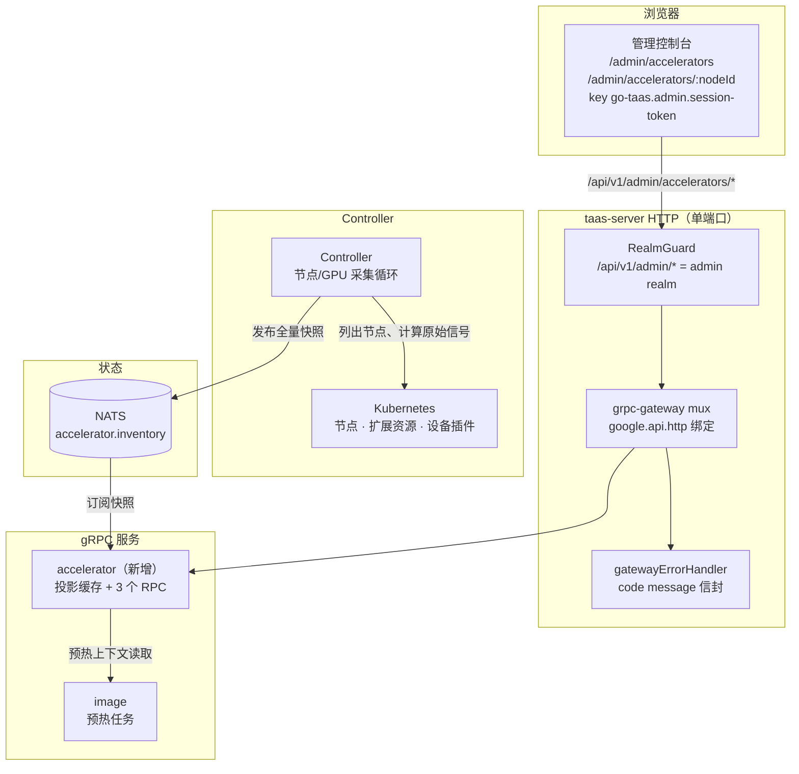
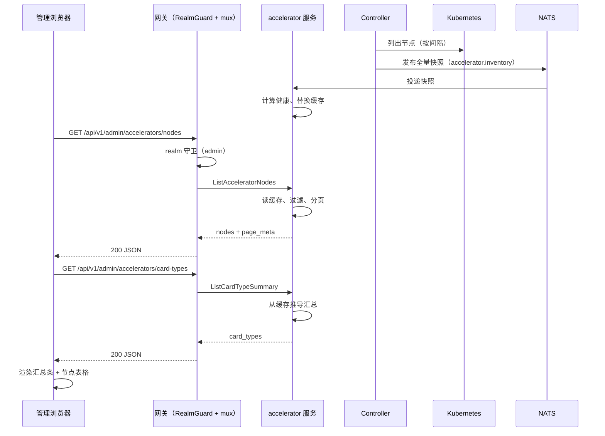
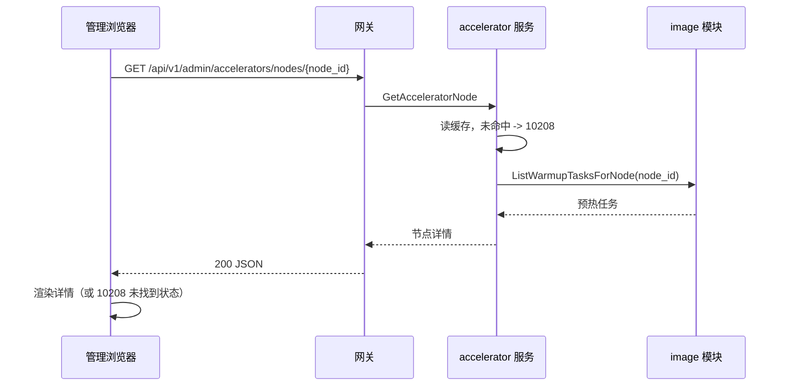
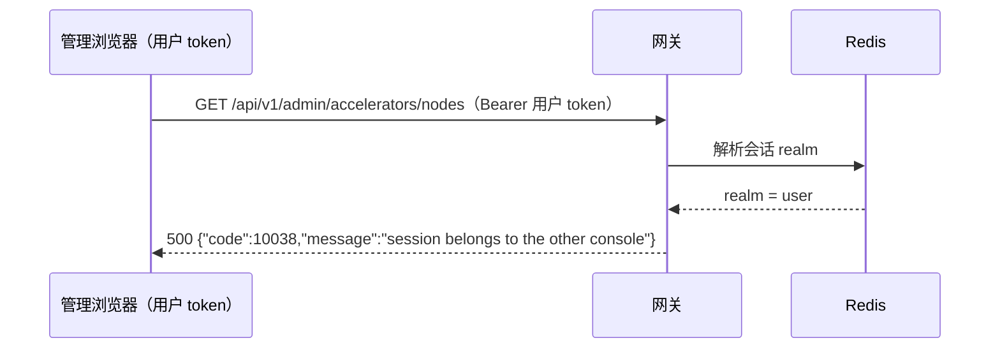

# 加速器清单与健康（GPU Operator 集成）— 架构与详细设计

| 属性 | 内容 |
| --- | --- |
| 特性点 | 加速器清单与健康 —— 按节点展示 GPU 集群全貌：节点、驱动版本、设备插件状态、GPU 型号/数量/已分配-空闲、健康/就绪（backlog 第 18 行） |
| 文档范围 | 只读管理面加速器清单的架构与详细设计：发现与上报机制（Controller → MQ → accelerator 服务）、内存投影缓存数据模型、三个管理面 RPC 及其精确的 `google.api.http` 绑定、健康复合语义、预热任务上下文读取、前端页面及其路由 → API 前缀映射、错误处理（10208）、配置、安全、上线，以及按层的函数级任务清单 |
| 归属模块 | `services/accelerator`（新增：投影缓存 + 三个管理面 RPC）、`internal/controller`（节点/GPU 采集 + 快照发布）、`pkg/k8s`（节点、设备插件、扩展资源读取）、`pkg/mq`（新增 `accelerator.inventory` subject）、`pkg/errors`（10208）、`pkg/config`（accelerator 配置段）、`web/` 管理控制台（`AcceleratorsPage`、`AcceleratorNodeDetailPage`）、`services/image`（预热任务窄接口读取） |
| 相关文档 | [需求分析与 UI/UX 设计](../design/accelerator-inventory.zh-cn.md) · [架构设计](../design/architecture.zh-cn.md) 第 2.3 节（异构计算）、第 2.7 节 Controller · [控制台面分离](./console-surface-separation.zh-cn.md)（管理面、realm 守卫、`AdminShell`）· [镜像管理](./image-management.zh-cn.md)（预热任务、按节点结果、本特性提供的「节点清单」）· [模型目录与一键部署](./model-catalog-deployment.zh-cn.md)（卡型 `accelerator_type`）· [推理自动扩缩容](./inference-autoscaling.zh-cn.md)（节点级容量上下文） |
| 状态 | 架构完成，已交付开发者智能体 |

---

## 1. 概述与目标

go-taas 在异构加速器（NVIDIA GPU、Iluvatar CoreX、MetaX）上提供推理服务，并把驱动、设备插件与节点标签管理委托给各厂商的 GPU Operator（架构第 2.3 节）。今天运维人员对加速器集群没有任何可见性：部署表单接受任意卡型，请求一个没有空闲容量的卡型只会在 Kubernetes 调度器处失败，而一个驱动或设备插件已降级的节点仍出现在集群里，没有任何面向运维人员的解释。

本特性在管理控制台上新增一个**只读的加速器清单与健康视图**：一个页面列出每个计算节点、其加速器厂商、承载的 GPU 型号、已分配/空闲数量、驱动与设备插件状态、以及节点就绪度。这是 Phase 3「异构加速器」路线图条目中最小、可独立交付的增量，也是镜像管理延后的「节点清单」与兼容矩阵（第 19 行）消费的「卡型清单」前置条件。

**目标**：

- 一个只读管理页 `/admin/accelerators`，列出每个计算节点及其加速器厂商、GPU 型号、已分配/空闲数量、驱动版本、设备插件状态与就绪度（设计 D1–D3）。
- 一个回答「卡型 X 还剩多少空闲」的卡型汇总（设计 D2、D10）。
- 从节点标签与扩展资源推导厂商与卡型（设计 D5、D6）。
- 带逐 GPU 明细、健康信号、资源与预热任务上下文的节点详情视图（设计 D4、FR3）。
- 带精确管理前缀的页面 → API 面对照表（设计 D7）。
- 包括空态、错误态与权限拒绝态的逐页面交互状态。
- 可在 compose 栈上由 Nightwatch 测试的编号验收标准。

**非目标**（来自设计，复述）：任何节点变更（cordon、drain、改标签、驱动升级）—— D1；面向租户的加速器可见性 —— D7；兼容矩阵（第 19 行，消费本清单）；超出特性 #3 节点选择器的节点感知预热定向；节点级自动扩缩容（特性 #16）；Grafana 式随时间变化的利用率仪表盘（本页面展示时间点快照）；RDMA/网络健康。

### 1.1 阅读顺序

第 2 节记录架构决策（包括架构对 UI/UX 设计的一处细化及其理由）。第 3–5 节是组件视图、发现/上报机制与数据模型。第 6–8 节是 API 契约、前端架构与关键时序。第 9–12 节是错误处理、配置、安全与上线。第 13–15 节是验收标准追溯、函数级详细设计与有序实现任务清单。

---

## 2. 架构决策

AD1–AD10 把 UI/UX 设计的决策复述为实现级规则。**AD11 是架构新增的细化**，已标注其细化的设计决策；它保留设计意图，并记录于此，让开发者与测试智能体按同一解读实现。

| # | 决策 | 理由 |
| --- | --- | --- |
| AD1 | **清单是 Kubernetes 节点 + 扩展资源状态的投影，由 Controller 采集、经管理网关提供；不是新的数据库表。** Controller 是唯一持有 Kubernetes 客户端的组件；它按间隔轮询节点并把**全量快照**发布到 MQ；accelerator 服务消费快照并维护**内存投影缓存**（按节点 id 的 map），三个 RPC 读取它 | 设计 D4。事实来源是集群（节点标签、`nvidia.com/gpu` 式扩展资源、设备插件状态）。投影避免出现与集群漂移的第二个事实来源。全量快照发布是自愈的：从集群移除的节点会在下一个快照中消失，服务重启后也会从下一个快照重新填充缓存。缓存是临时的、单副本的；对只读遥测视图可接受（权衡见 AD11） |
| AD2 | **Controller 发布原始信号；accelerator 服务计算复合健康。** Controller 按节点上报：就绪度、设备插件状态、驱动版本是否存在、厂商、卡型、已分配/空闲数量。accelerator 服务在摄入时从三个原始信号推导复合 `health` | 设计 D3。健康语义位于提供 API 的服务中，因此 AC4 单元测试是服务级测试，Controller 保持为哑采集器。客户端只渲染徽章，从不计算健康 |
| AD3 | **厂商从节点标签推导；卡型从节点上加速器专属的扩展资源名或标签推导；无加速器标签的节点为 `unspecified`。** 厂商驱动徽章与卡型解析；未打标签的节点仍会列出，其健康仅基于节点就绪度 | 设计 D5、FR4.2。与架构的节点标签模型一致（第 2.3 节）。厂商集合是封闭的：`nvidia`、`iluvatar`、`metax`、`unspecified` |
| AD4 | **已分配 vs 空闲由节点每种卡型的可分配 vs 已分配扩展资源计算。** 页面同时展示两个数字与利用率条 | 设计 D6。「空闲容量」是运维的规划问题；可分配/已分配是 Kubernetes 原生答案 |
| AD5 | **页面仅限管理面。** 路由 `/admin/accelerators` 与 `/admin/accelerators/:nodeId`；API 前缀 `/api/v1/admin/accelerators/*`。租户永远看不到集群 | 设计 D7。加速器集群是运维内部的编排状态；租户消费的是模型，不是节点 |
| AD6 | **新增错误码 10208 `CodeAcceleratorNodeNotFound`**，用于清单中不存在的节点 id | 设计 D8。与按模块分配错误码的模式一致；过期的节点 id 不能被静默当作空节点。该码位于镜像块（10201–10299），因为加速器清单正是镜像模块延后的节点/卡型清单 |
| AD7 | **清单是轮询而非推送。** 页面按间隔轮询 `ListAcceleratorNodes`（默认 30 秒）并显示最后更新时间戳；无 websocket | 设计 D9。与现有控制台的 `usePolling` 模式一致，并保持 API 无状态 |
| AD8 | **卡型汇总按 `(vendor, card_type)` 分组**并显示总数/已分配/空闲/节点数；空闲为零的卡型做视觉标记 | 设计 D10。运维的容量问题是按卡型的 |
| AD9 | **三个 RPC 是新增 `taas.accelerator.v1.AcceleratorService` 上的新 RPC**，而非对 `image` 或 `infer` 的扩展 | 清单是独立关注点（集群遥测），有自己的投影缓存与错误码。独立服务让镜像模块的预热与注册职责保持分离，并给兼容矩阵（第 19 行）一个稳定的卡型读取面 |
| AD10 | **加速器 API 是平台级：不要求也不接受 `X-Organization-Id` 头。** 集群是运维内部状态，如同镜像 | 与镜像模块的平台级决策一致（镜像管理 D9）。清单不是租户级 |
| AD11 | **对设计 D4 的细化 —— 投影是 accelerator 服务中的内存缓存，由 Controller 周期性全量快照发布刷新，而非持久化表。** 设计中的「不是新的数据库表」被字面遵守：无 GORM 模型、无 `AutoMigrate`、无 SQL。缓存是 `sync.RWMutex` 保护的 `map[string]*AcceleratorNode`，每次快照整体替换 | 设计明确排除数据库表（D4：「不是新的数据库表」）。内存缓存是最小的忠实解读。权衡（对只读遥测视图均可接受）：(a) 缓存是临时的 —— 服务重启后直到下一个 Controller 快照（受采集间隔约束，默认 30 秒）才显示清单；(b) 缓存是每副本的 —— 多个 `taas-server` 副本各持一份，但 MQ 快照是发布/订阅，所有副本在一个间隔内收敛到相同数据；(c) 无历史数据 —— 页面按设计是时间点快照（非目标）。若日后需要持久化或历史，DB 投影是后续项。被否决的替代：持久化 `accelerator_nodes` 表 —— 违反 D4，并制造与集群漂移的第二个事实来源 |

---

## 3. 组件视图

### 3.1 归属

| 层 / 组件 | 归属 | 本特性的变更 |
| --- | --- | --- |
| **静态包（SPA）** | 一个 Vite 包（`web/dist`），嵌入 `taas-server` 的 `pkg/server/console/`；由网关的 SPA 回退提供 | 两个新管理页（`AcceleratorsPage`、`AcceleratorNodeDetailPage`）、一个导航项、`App.tsx` 中的路由注册 |
| **网关（`pkg/server`）** | HTTP 组合：`RealmGuard` → `withConsole` → `runtime.ServeMux`；统一错误渲染器；SPA 回退 | 无变更 —— 新 RPC 绑定在 `/api/v1/admin/accelerators/*` 下，realm 守卫已把该前缀视为管理面 |
| **grpc-gateway mux** | 从 `google.api.http` 注解做路径 → RPC 路由 | 三个新 RPC 的新绑定（第 6 节） |
| **`accelerator`（新增）** | 内存投影缓存、快照消费者（Runner）、三个管理面 RPC | 新服务：`services/accelerator` |
| **`internal/controller`** | Kubernetes 协调；节点/GPU 采集与快照发布 | 新的采集循环：列出节点、计算原始信号、把全量快照发布到 `accelerator.inventory` |
| **`pkg/k8s`** | Kubernetes 客户端（clientset + dynamic） | 无变更 —— 采集循环使用现有 clientset |
| **`image`** | 预热任务与按节点结果 | 暴露窄接口读取 `ListWarmupTasksForNode`，供 accelerator 服务的节点详情预热上下文使用 |
| **`pkg/mq`** | 规范 subject | 新增 `AcceleratorInventory` subject |
| **`pkg/errors`** | 按模块分配错误码 | 新增一个镜像块错误码：**10208 `CodeAcceleratorNodeNotFound`** |
| **`pkg/config`** | 合并配置树 | 新增 `accelerator` 配置段（采集间隔、快照消费者开关） |

### 3.2 运行时组件视图



### 3.3 请求身份链

accelerator RPC 是**管理面、平台级**（AD5、AD10）。链路为：

1. `RealmGuard`（HTTP，`pkg/server/realm.go`）—— 路径前缀 `/api/v1/admin/accelerators/*` 决定期望 realm 为 `admin`。无 `Authorization` 头：放行（过渡模式，特性-17 AD4）。有头：从 Redis 解析会话 realm；不匹配 → 10038，未知/过期/无 realm → 10027。
2. grpc-gateway mux —— 按注解路径路由并转发 `authorization`。
3. `accelerator` 处理器 —— 读取投影缓存。它**不**解析组织（AD10）：集群是平台级，因此不要求也不接受 `X-Organization-Id`，也不调用 `SessionActiveOrg` / `resolveOrganizationID`。

由于 accelerator RPC 是只读且平台级的，其上没有 `tenancy.RoleGuard` 门：任何 admin-realm 会话（或过渡调用者）都可读取集群。这与镜像模块的平台级读取一致。因此权限拒绝态（设计 FR5.1、AC12）由 realm 守卫（10038）或会话守卫（10027）产生，而非角色检查；页面的权限拒绝处理是标准的特性-17 状态。

---

## 4. 发现与上报机制

### 4.1 采集循环（Controller）

Controller 是唯一持有 Kubernetes 客户端的组件。它运行一个新的后台采集循环，按间隔（`accelerator.collectInterval`，默认 30 秒）：

1. 通过 clientset 列出所有节点（`corev1.Nodes`）。
2. 对每个节点计算**原始信号**：
   - **就绪度**：来自节点的 `Ready` 条件（`ready` / `not_ready` / `unknown`）。
   - **厂商**：来自加速器标签。厂商集合封闭：`nvidia`、`iluvatar`、`metax`、`unspecified`。无加速器标签的节点为 `unspecified`（AD3）。
   - **卡型与已分配/空闲**：来自节点上加速器专属的扩展资源。对每种卡型，`allocatable` vs `allocated`（节点上各 Pod 请求之和，或设备插件上报的扩展资源 `allocatable` 减 `allocated`）。卡型从扩展资源名或加速器标签解析（如 `nvidia.com/gpu` → 卡型来自节点标签 `nvidia.com/gpu.product`；Iluvatar/MetaX 对应项）。
   - **驱动版本**：来自 GPU Operator 写入的节点标签（如 `nvidia.com/driver.version`；Iluvatar/MetaX 对应项）。是否存在是健康的布尔信号；值显示在详情视图。
   - **设备插件状态**：来自节点的设备插件状态（设备插件上报的 `Healthy`/`Unhealthy` 条件，或扩展资源 allocatable 非零）。`healthy` / `degraded` / `unknown`。
   - **逐 GPU 明细**：索引、型号、已分配/空闲，以及任何逐 GPU 健康备注（来自设备插件的逐设备健康，若可用）。
3. 组装**全量快照**（所有节点）并发布到 MQ subject `accelerator.inventory`（JSON 体，带 `reported_at` 时间戳）。

快照是**全量**而非按节点增量：从集群移除的节点会在下一个快照中消失，服务重启后也会从下一个快照重新填充缓存（AD1）。采集循环独立于协调循环；它在自己的 goroutine 中运行，随 Controller 的 context 取消。

### 4.2 快照消费者（accelerator 服务）

accelerator 服务运行一个 `server.Runner`，订阅 `accelerator.inventory`。对每个快照：

1. 解析 JSON 体；畸形快照记录日志并跳过（绝不重试 —— 畸形快照永远不会变好）。
2. 对每个节点从三个原始信号计算复合 `health`（AD2）：仅当就绪度为 `ready`、设备插件为 `healthy` 且存在驱动版本时才为 `healthy`；否则为 `degraded`；任一信号为 `unknown` 则为 `unknown`。
3. 在写锁下整体替换内存投影缓存。

缓存是 `sync.RWMutex` 保护的 `map[string]*AcceleratorNode`；三个 RPC 在读锁下读取它。

### 4.3 健康语义

| 信号 | 来源 | 取值 |
| --- | --- | --- |
| 就绪度 | 节点 `Ready` 条件 | `ready` / `not_ready` / `unknown` |
| 设备插件状态 | 设备插件状态 / 扩展资源 allocatable | `healthy` / `degraded` / `unknown` |
| 驱动存在 | 驱动版本节点标签 | 存在 / 不存在 |

复合 `health`（在 accelerator 服务中计算，AD2）：

| 就绪度 | 设备插件 | 驱动存在 | 健康 |
| --- | --- | --- | --- |
| `ready` | `healthy` | 是 | `healthy` |
| 无 `unknown` 的其他任意组合 | | | `degraded` |
| 任一信号 `unknown` | | | `unknown` |

厂商为 `unspecified`（无加速器标签）的节点没有设备插件或驱动信号；其健康仅基于节点就绪度（设计 FR4.2）：`ready` → `healthy`，`not_ready` → `degraded`，`unknown` → `unknown`。

---

## 5. 数据模型

清单是**内存投影缓存**（AD1、AD11），不是数据库表。无 GORM 模型、无 `AutoMigrate`、无 SQL 迁移。「数据模型」是缓存条目与线上消息的形状。

### 5.1 投影缓存

```go
// AcceleratorNode 是缓存中一个节点的投影。
type AcceleratorNode struct {
    NodeID            string
    Name              string
    Vendor            string // nvidia | iluvatar | metax | unspecified
    CardTypes         []string
    GPUsAllocated     int64
    GPUsFree          int64
    DriverVersion     string
    DevicePluginState string // healthy | degraded | unknown
    Readiness         string // ready | not_ready | unknown
    Health            string // healthy | degraded | unknown
    GPUs              []AcceleratorGPU
    Labels            map[string]string // 加速器相关标签
    Taints            []string
    Resources         []AcceleratorResource // 每种卡型
    LastUpdatedAt     time.Time
}

// AcceleratorGPU 是节点上的一块 GPU。
type AcceleratorGPU struct {
    Index     int64
    Model     string
    Allocated bool
    Free      bool
    Note      string
}

// AcceleratorResource 是某卡型的可分配 vs 已分配。
type AcceleratorResource struct {
    CardType    string
    Allocatable int64
    Allocated   int64
}
```

缓存是 `map[string]*AcceleratorNode`，按节点 id 键控，由 `sync.RWMutex` 保护，每次快照整体替换。

### 5.2 卡型汇总推导

`ListCardTypeSummary` 在请求时从缓存推导（无独立存储）：按 `(vendor, card_type)` 对所有节点分组，求和 `total`（allocatable）、`allocated`、`free`（allocatable − allocated），并统计不同节点数。总数为零的卡型省略（设计 FR1.2）。排序按厂商，再按空闲升序（最紧缺的排最前，设计 FR1.3）。

### 5.3 预热任务上下文（跨模块读取）

`GetAcceleratorNode` 返回节点的预热任务上下文（设计 FR3.2）。预热任务位于镜像模块的 `warmup_tasks` 表（`node_results` JSON）。遵循既有的窄接口模式（镜像管理 §3.3），镜像模块暴露：

```go
// ListWarmupTasksForNode 返回 node_selector 匹配该节点或 node_results
// 提及该节点的预热任务，最新在前。
func (r *WarmupTaskRepository) ListWarmupTasksForNode(ctx context.Context, nodeID string, limit int) ([]*WarmupTask, error)
```

accelerator 服务通过注入的窄接口（`image.NewWarmupTasksForNodeProvider(gormDB)`）读取，使 accelerator 模块不依赖 image —— 正是 `model.SetDeleteGuard` / `image.SetDeleteGuard` 建立的模式。

---

## 6. API 契约

### 6.1 RPC 面

所有 API 属于 **`taas.accelerator.v1.AcceleratorService`**（proto：`proto/taas/accelerator/v1/accelerator.proto`），经控制网关以 HTTP 提供。三个 RPC 均为**新增**且**仅限管理面**（AD5）。Proto 变更是纯增量的。

| RPC | HTTP | 状态 | 用途 |
| --- | --- | --- | --- |
| `ListAcceleratorNodes` | `GET /api/v1/admin/accelerators/nodes` | **新增** | 集群列表，带厂商/健康过滤、节点名搜索、分页；返回按节点汇总 |
| `GetAcceleratorNode` | `GET /api/v1/admin/accelerators/nodes/{node_id}` | **新增** | 节点详情：逐 GPU 明细、标签、污点、资源、预热任务上下文 |
| `ListCardTypeSummary` | `GET /api/v1/admin/accelerators/card-types` | **新增** | `(vendor, card_type)` → 总数 / 已分配 / 空闲 / 节点数，供汇总条使用 |

### 6.2 Proto 契约

```proto
syntax = "proto3";

package taas.accelerator.v1;

import "google/api/annotations.proto";
import "taas/common/v1/common.proto";

option go_package = "github.com/go-taas/go-taas/proto/taas/accelerator/v1;acceleratorv1";

// AcceleratorService 提供只读的加速器集群清单。
// 管理面 API：在 /api/v1/admin/accelerators 下提供。
service AcceleratorService {
  // ListAcceleratorNodes 返回集群列表，带厂商/健康过滤、节点名搜索与分页。
  rpc ListAcceleratorNodes(ListAcceleratorNodesRequest) returns (ListAcceleratorNodesResponse) {
    option (google.api.http) = {get: "/api/v1/admin/accelerators/nodes"};
  }

  // GetAcceleratorNode 返回单个节点的详情：逐 GPU 明细、标签、污点、资源与预热任务上下文。
  rpc GetAcceleratorNode(GetAcceleratorNodeRequest) returns (GetAcceleratorNodeResponse) {
    option (google.api.http) = {get: "/api/v1/admin/accelerators/nodes/{node_id}"};
  }

  // ListCardTypeSummary 返回 (vendor, card_type) 容量汇总。
  rpc ListCardTypeSummary(ListCardTypeSummaryRequest) returns (ListCardTypeSummaryResponse) {
    option (google.api.http) = {get: "/api/v1/admin/accelerators/card-types"};
  }
}

message ListAcceleratorNodesRequest {
  taas.common.v1.PageRequest page = 1;
  // vendor 按加速器厂商过滤；空表示全部。
  string vendor = 2;
  // health 按复合健康过滤；空表示全部。
  string health = 3;
  // search 匹配节点名子串。
  string search = 4;
}

message ListAcceleratorNodesResponse {
  taas.common.v1.Response response = 1;
  repeated AcceleratorNodeSummary nodes = 2;
  taas.common.v1.PageMeta page_meta = 3;
}

message AcceleratorNodeSummary {
  string node_id = 1;
  string name = 2;
  string vendor = 3;
  repeated string card_types = 4;
  int64 gpus_allocated = 5;
  int64 gpus_free = 6;
  string driver_version = 7;
  string device_plugin_state = 8; // healthy | degraded | unknown
  string readiness = 9;           // ready | not_ready | unknown
  string health = 10;             // healthy | degraded | unknown
  int64 last_updated_at = 11;
}

message GetAcceleratorNodeRequest {
  string node_id = 1;
}

message GetAcceleratorNodeResponse {
  taas.common.v1.Response response = 1;
  AcceleratorNode node = 2;
}

message AcceleratorNode {
  AcceleratorNodeSummary summary = 1;
  repeated AcceleratorGPU gpus = 2;
  map<string, string> labels = 3;
  repeated string taints = 4;
  repeated AcceleratorResource resources = 5;
  repeated WarmupTaskRef warmup_tasks = 6;
}

message AcceleratorGPU {
  int64 index = 1;
  string model = 2;
  bool allocated = 3;
  bool free = 4;
  string note = 5;
}

message AcceleratorResource {
  string card_type = 1;
  int64 allocatable = 2;
  int64 allocated = 3;
}

message WarmupTaskRef {
  string task_id = 1;
  string state = 2;
  string node_outcome = 3;
}

message ListCardTypeSummaryRequest {
  taas.common.v1.PageRequest page = 1;
}

message ListCardTypeSummaryResponse {
  taas.common.v1.Response response = 1;
  repeated CardTypeSummary card_types = 2;
}

message CardTypeSummary {
  string vendor = 1;
  string card_type = 2;
  int64 total = 3;
  int64 allocated = 4;
  int64 free = 5;
  int64 node_count = 6;
}
```

### 6.3 线上格式（既有约定）

- 分页绑定为 `?page.offset=0&page.limit=20`（点号形式）；默认 limit 20，上限 100。
- 成功响应为 HTTP 200；业务错误渲染为 `{"code": <int>, "message": "..."}`。
- accelerator API 是**平台级**：不要求也不接受 `X-Organization-Id` 头（AD10）。
- `ListAcceleratorNodes` 支持 `vendor` 与 `health` 过滤、`search`（节点名子串）与 `offset`/`limit` 分页。过滤与分页在投影缓存上服务端应用。
- `GetAcceleratorNode` 返回汇总外加 `gpus[]`、`labels`、`taints`、`resources[]` 与 `warmup_tasks[]`。缺失的 `node_id` 返回 **10208 `CodeAcceleratorNodeNotFound`**（AD6）。
- `ListCardTypeSummary` 返回 `(vendor, card_type, total, allocated, free, node_count)` 行，按厂商再按空闲升序排序，省略总数为零的卡型（设计 FR1.2/FR1.3）。
- 健康由服务端计算（AD2）；客户端只渲染徽章，不计算。

### 6.4 校验矩阵

| RPC | 检查 | 失败码 | 规范消息 |
| --- | --- | --- | --- |
| `ListAcceleratorNodes` | `vendor` 属于 {nvidia, iluvatar, metax, unspecified} 或为空；`health` 属于 {healthy, degraded, unknown} 或为空；`limit` ≤ 100 | 缺失 org 头返回 10001 `UNAUTHORIZED` **不适用**（平台级，AD10）；非法过滤值被忽略（视为空） | — |
| `GetAcceleratorNode` | `node_id` 存在于缓存 | 10208 `CodeAcceleratorNodeNotFound` | accelerator node not found |
| `ListCardTypeSummary` | 无 | — | — |

---

## 7. 前端架构

### 7.1 模块计划

| 关注点 | 文件 | 备注 |
| --- | --- | --- |
| 管理导航项 | `web/src/shells/AdminShell.tsx` | 在 `ADMIN_NAV_ITEMS` 中加入 `{ path: '/admin/accelerators', label: 'Accelerators', testid: 'nav-accelerators' }` |
| 路由注册 | `web/src/App.tsx` | 在 `AdminSurface` 的 `<Routes>` 中加入 `/admin/accelerators` 与 `/admin/accelerators/:nodeId` |
| 集群列表页 | `web/src/pages/AcceleratorsPage.tsx`（新增） | 卡型汇总条 + 节点表格、过滤、搜索、分页、轮询 |
| 节点详情页 | `web/src/pages/AcceleratorNodeDetailPage.tsx`（新增） | 逐 GPU 明细、健康信号、资源、标签/污点、预热上下文 |
| 共享组件 | `web/src/components.tsx` | 复用 `ErrorBanner`、`Pagination`、`StateBadge`、`usePolling`；无需新增共享组件 |

### 7.2 管理控制台：页面 → 路由 → API

| 路由 | 组件 | 用途 | API 前缀（精确调用） |
| --- | --- | --- | --- |
| `/admin/accelerators` | `pages/AcceleratorsPage.tsx` | 集群列表 + 卡型汇总 | `GET /api/v1/admin/accelerators/nodes?page.offset=…&page.limit=…&vendor=…&health=…&search=…`、`GET /api/v1/admin/accelerators/card-types` |
| `/admin/accelerators/:nodeId` | `pages/AcceleratorNodeDetailPage.tsx` | 节点详情 | `GET /api/v1/admin/accelerators/nodes/{node_id}` |

页面只调用 `/api/v1/admin/accelerators/*` 路由；不含任何 `/api/v1/*`（用户前缀）字符串（设计 FR5.2、特性-17）。realm 作用域 API 客户端（`useApi()`）在运行时强制这一点（特性-17 AD1）。

### 7.3 `web/src/App.tsx` 中的路由注册

```tsx
<Route path="/admin/accelerators" element={<AcceleratorsPage />} />
<Route path="/admin/accelerators/:nodeId" element={<AcceleratorNodeDetailPage />} />
```

两个路由都在 `AdminSurface` 的 `<Routes>` 内，因此渲染在 `AdminShell` 中，并继承 admin realm 的会话守卫与导航。

### 7.4 逐面认证守卫

页面继承 `AdminShell` 守卫（特性-17 §7.5）：启动时读取 `go-taas.admin.session-token`；为空 → 过渡模式；存在 → `GET /api/v1/admin/auth/session`；10027/10038 → 清除 admin token 并重定向到 `/admin/login?next=<path>&reason=…`。页面从不读取用户 realm 的键。由于 accelerator RPC 是平台级且只读，无额外角色门；权限拒绝态（设计 FR5.1、AC12）是标准的特性-17 状态，由 realm/会话守卫产生。

### 7.5 轮询与过期数据处理

`AcceleratorsPage` 使用 `usePolling`（设计 D9、FR5.3）：按 30 秒间隔轮询 `ListAcceleratorNodes` 与 `ListCardTypeSummary`，并显示最后更新时间戳。轮询失败时保留最后的好数据并显示「正在显示过期数据」横幅与重试操作（设计 FR5.3、AC9）；绝不清空表格。轮询进行中时刷新操作被禁用。

### 7.6 测试智能体可驱动的 `data-testid` 钩子

- 外壳/导航：`nav-accelerators`。
- 集群页：`accelerators-page`、`accelerators-refresh`、`accelerators-last-updated`、`accelerators-summary-strip`、`accelerator-card-{vendor}-{card_type}`、`accelerator-card-no-free-{vendor}-{card_type}`、`accelerators-vendor-banner-{vendor}`、`accelerators-vendor-filter`、`accelerators-health-filter`、`accelerators-search`、`accelerators-table`、`accelerators-empty`、`accelerators-stale-banner`、`accelerators-error`、`accelerator-node-{node_id}`、`accelerators-pagination`。
- 节点详情：`accelerator-node-detail`、`accelerator-node-back`、`accelerator-node-health`、`accelerator-node-gpus`、`accelerator-node-resources`、`accelerator-node-labels`、`accelerator-node-taints`、`accelerator-node-warmup`、`accelerator-node-not-found`。

---

## 8. 时序图

### 8.1 集群页加载与轮询



### 8.2 带预热上下文的节点详情



### 8.3 错误 realm 拒绝



---

## 9. 错误处理

| 码 | 常量 | 消息 | 时机 |
| --- | --- | --- | --- |
| 10208 | `CodeAcceleratorNodeNotFound` | accelerator node not found | `GetAcceleratorNode` 的 `node_id` 不在缓存中（AD6） |
| 10038 | `CodeRealmMismatch` | session belongs to the other console | 用户 realm 会话出现在 `/api/v1/admin/accelerators/*` 上（特性-17） |
| 10027 | `CodeSessionInvalid` | session invalid | 管理前缀上的未知/过期/无 realm 会话（特性-17） |

HTTP 状态为 `500`，`code` 位于响应体中，与本平台所有其他业务错误一致（特性-17 §4.3）。客户端按响应体 `code` 分支，绝不按状态。页面把 10208 映射为「未找到节点 —— 可能已被移除」状态（设计 FR3.3、AC10），把 10038/10027 映射为标准的权限拒绝/登录状态。

---

## 10. 配置

在 `pkg/config/api.go` 与 `configs/config.yaml` 中新增 `accelerator` 配置段：

```yaml
accelerator:
  # collectInterval 是 Controller 的节点/GPU 采集周期；全量快照按此间隔发布（AD1）。默认 30s。
  collectInterval: 30s
  # snapshotConsumer 配置 accelerator 服务的快照消费者 Runner（开关 + 工作线程数）。
  snapshotConsumer:
    enabled: true
    workers: 1
```

`AcceleratorConfig`（Go）：

```go
type AcceleratorConfig struct {
    CollectInterval  time.Duration `mapstructure:"collectInterval"`
    SnapshotConsumer AcceleratorSnapshotConsumerConfig `mapstructure:"snapshotConsumer"`
}

type AcceleratorSnapshotConsumerConfig struct {
    Enabled bool `mapstructure:"enabled"`
    Workers int  `mapstructure:"workers"`
}
```

默认值：`collectInterval` 30 秒，`snapshotConsumer.enabled` true，`workers` 1（快照是单次整体替换，一个工作线程足够）。`ControllerConfig` 不新增字段 —— 采集间隔位于两个二进制都读取的共享 `accelerator` 段中。

---

## 11. 安全

- **面分离**：三个 RPC 都绑定在 `/api/v1/admin/accelerators/*` 下，只能通过 admin realm 守卫到达（AD5）。用户 realm 会话被 10038 拒绝；租户页面从不调用这些路由（特性-17 AD1，由 realm 作用域 API 客户端强制）。
- **平台级、只读**：accelerator API 不要求组织头，也不做任何变更（AD10、设计 D1）。无写路径，因此除读取本身外没有提权面。
- **无租户数据**：清单是运维内部的编排状态；绝不在用户面暴露（设计 D7）。
- **无机密**：清单携带节点标签、驱动版本与资源计数 —— 无凭据、token 或模型权重。投影缓存是内存的，从不持久化。
- **构造上只读**：RPC 仅 `GET`；无 `POST`/`PATCH`/`DELETE` 绑定，因此即使调用者构造请求，页面也无法变更节点。

---

## 12. 上线 / 升级说明

- **Proto**：纯增量 —— 新服务上的三个新 RPC。无既有 RPC 或消息变更。用 `buf generate` 重新生成。
- **无 schema 迁移**：清单是内存投影（AD11）；无 `AutoMigrate`、无 SQL、无 init-SQL 升级路径。`accelerator` 服务不注册 `Migrator`。
- **新服务注册**：`apps/taas-server/main.go` 注册 `accelerator.New(srv.Components())`，并加入 `srv.AddRunner(accelerator.NewSnapshotConsumerRunner(srv.Components()))`。网关自动拾取新服务的处理器注册函数。
- **Controller**：`apps/controller/main.go` 启动采集循环。Controller 与 `taas-server` 可独立升级（特性-17 / 架构 §2.7）：旧 Controller 不发布快照会让 accelerator 服务保持空缓存（页面显示空态）；新 Controller 配旧服务无害（subject 只是无人订阅）。
- **配置**：`accelerator` 段是增量的；早于它的二进制回退到默认值。
- **向后兼容**：无既有 API、页面或测试变更。新导航项与页面是对管理控制台的增量。

---

## 13. 验收标准覆盖

| AC | 由以下实现 | 验证钩子 |
| --- | --- | --- |
| AC1 — `ListAcceleratorNodes` 返回每个已打标签节点及其厂商、卡型、已分配/空闲、驱动、设备插件、就绪度、健康；未打标签 = `unspecified` | 第 4 节（采集）、第 6.2 节、AD3 | FVT |
| AC2 — `ListCardTypeSummary` 返回排序行，省略零总数 | 第 5.2 节、AD8 | FVT |
| AC3 — `GetAcceleratorNode` 返回逐 GPU、标签、污点、资源、预热上下文；缺失节点 → 10208 | 第 6.2 节、AD6、第 5.3 节 | FVT |
| AC4 — 仅当三个信号都成立时健康才为 `healthy`；任一失败都会降级 | 第 4.3 节、AD2 | 单元 + FVT |
| AC5 — 页面在首次成功轮询后渲染汇总条 + 节点表格，并带最后更新 | 第 7.5 节 | E2E |
| AC6 — 厂商/健康过滤、搜索、分页服务端生效 | 第 6.3 节、第 7.2 节 | E2E |
| AC7 — 空闲为零的卡型被标记；节点数为零的厂商横幅 | 第 7.6 节、AD8 | E2E |
| AC8 — 空态渲染 | 第 7.6 节 | E2E |
| AC9 — 轮询失败保留最后好数据并显示过期横幅 + 重试 | 第 7.5 节 | E2E |
| AC10 — 节点详情展示明细、健康、资源、预热；缺失节点 → 10208 状态 | 第 7.2 节、第 8.2 节 | E2E |
| AC11 — 仅管理面：导航项、`/admin/accelerators` 路由、所有调用 `/api/v1/admin/accelerators/*`、无 `/api/v1/*` 字符串 | 第 7.2 节、AD5 | E2E（面分离） |
| AC12 — 无所需角色的会话收到 10036 / 标准权限拒绝状态 | 第 7.4 节（realm/会话守卫） | E2E |

---

## 14. 详细设计

### 14.1 文件布局

| 模块 | 文件 | 内容 |
| --- | --- | --- |
| `proto/taas/accelerator/v1` | `accelerator.proto`（新增） | `AcceleratorService` + 消息（第 6.2 节） |
| `services/accelerator` | `projection.go`（新增） | `AcceleratorNode`、`AcceleratorGPU`、`AcceleratorResource` 结构体 + `ProjectionCache`（`sync.RWMutex` 保护的 map，`Replace`、`Get`、`List`、`CardTypeSummary`） |
| | `snapshot_consumer.go`（新增） | `SnapshotConsumer`（Runner）：订阅 `accelerator.inventory`、解析、计算健康、替换缓存 |
| | `service.go`（新增） | `Service`（实现 `server.Service` + `server.ServiceWithGateway`）：三个 RPC |
| | `warmup_provider.go`（新增） | 预热任务上下文的注入窄接口 |
| `services/image` | `warmup_repository.go`（增量） | `ListWarmupTasksForNode` + `NewWarmupTasksForNodeProvider` |
| `internal/controller` | `inventory.go`（新增） | 采集循环：列出节点、计算原始信号、发布全量快照 |
| | `controller.go`（增量） | 在 `Run` 中启动采集循环 |
| `pkg/mq` | `mq.go` | 新增 `AcceleratorInventory` subject |
| `pkg/errors` | `codes.go`、`messages.go` | `CodeAcceleratorNodeNotFound`（10208）+ 消息 |
| `pkg/config` | `api.go`、`configuration.go` | `AcceleratorConfig` + 默认值 |
| `apps/taas-server` | `main.go` | 注册 `accelerator.New(...)`、加入快照消费者 Runner、接线预热 provider |
| `apps/controller` | `main.go` | 启动采集循环 |
| `web/src` | `shells/AdminShell.tsx`、`App.tsx` | 导航项 + 路由注册 |
| | `pages/AcceleratorsPage.tsx`、`pages/AcceleratorNodeDetailPage.tsx`（新增） | 两个页面 |

### 14.2 `accelerator` 模块

`projection.go`：

```go
type ProjectionCache struct {
    mu    sync.RWMutex
    nodes map[string]*AcceleratorNode
}

func NewProjectionCache() *ProjectionCache
func (c *ProjectionCache) Replace(nodes map[string]*AcceleratorNode) // 整体替换，写锁
func (c *ProjectionCache) Get(nodeID string) (*AcceleratorNode, bool) // 读锁
func (c *ProjectionCache) List(vendor, health, search string, offset, limit int) ([]*AcceleratorNode, int64, error) // 读锁，过滤 + 分页
func (c *ProjectionCache) CardTypeSummary() []CardTypeSummary // 读锁，分组 + 排序
```

`snapshot_consumer.go`：

- `SnapshotConsumer` 实现 `server.Runner`：`Run(ctx)` 订阅 `subjects.AcceleratorInventory` 并通过 `handle` 应用每个快照。
- `handle(ctx, msg)`：反序列化快照；畸形 → 记录日志 + 跳过（绝不重试）。对每个节点从三个原始信号计算复合 `health`（第 4.3 节）；构建 `map[string]*AcceleratorNode`；`cache.Replace(...)`。
- 构造：`NewSnapshotConsumer(mqClient, cache, workers)`；`NewSnapshotConsumerRunner(components)` 在禁用或组件不可用时返回 nil（`infer`/`image` 模式）。
- 配置：`accelerator.snapshotConsumer.{enabled,workers}`（默认 true / 1）。

`service.go`：

- `Service` 实现 `server.Service`（`AttachToServer`、`ServiceName`）与 `server.ServiceWithGateway`（`GetServiceHandlerRegisterFn` → `RegisterAcceleratorServiceHandlerFromEndpoint`）。
- `ListAcceleratorNodes`：规范化分页（默认 20，上限 100）；`cache.List(vendor, health, search, offset, limit)`；映射为 `AcceleratorNodeSummary`；返回 `page_meta`。
- `GetAcceleratorNode`：`cache.Get(node_id)`；未命中 → 10208；命中 → 通过注入的 provider 读取预热上下文（`ListWarmupTasksForNode`），映射为 `AcceleratorNode`；返回。
- `ListCardTypeSummary`：`cache.CardTypeSummary()`；返回。
- `Migrate(ctx)`：无操作（无 schema；AD11）。服务不注册 `Migrator`。

`warmup_provider.go`：

```go
// WarmupTasksForNodeProvider 返回定向到某节点的预热任务。
type WarmupTasksForNodeProvider interface {
    ListWarmupTasksForNode(ctx context.Context, nodeID string, limit int) ([]*image.WarmupTask, error)
}
```

在 `apps/taas-server/main.go` 中通过 `acceleratorSvc.SetWarmupProvider(image.NewWarmupTasksForNodeProvider(gormDB))` 接线。

### 14.3 `image` 模块（仅增量）

- `WarmupTaskRepository` 上的 `ListWarmupTasksForNode(ctx, nodeID string, limit int) ([]*WarmupTask, error)`：返回 `node_selector` 匹配该节点或 `node_results` 提及该节点的预热任务，最新在前，上限 `limit`（默认 20）。
- `NewWarmupTasksForNodeProvider(db *gorm.DB) WarmupTasksForNodeProvider` —— 窄接口构造函数，镜像 `infer.NewDeleteImageGuard`。

### 14.4 Controller 采集循环（`internal/controller/inventory.go`）

`InventoryCollector` 按 `accelerator.collectInterval` 运行：

1. `clientset.CoreV1().Nodes().List(ctx, metav1.ListOptions{})`。
2. 对每个节点计算原始信号（第 4.1 节）：就绪度来自 `Ready` 条件；厂商来自加速器标签；卡型与已分配/空闲来自扩展资源；驱动版本来自驱动标签；设备插件状态来自设备插件状态；逐 GPU 明细（若可用）。
3. 组装全量快照（所有节点）并以 JSON 发布到 `subjects.AcceleratorInventory`，带 `reported_at` 时间戳。
4. 瞬时 Kubernetes API 错误记录日志，循环在下一个 tick 重试；快照是尽力而为的遥测，不是协调。

采集器在 `Controller.Run` 中与既有订阅一起启动（第三个 goroutine）。它使用同一个 `mq.Client` 发布（Controller 已持有用于状态上报的可发布客户端）。

### 14.5 控制台（契约摘要）

两个页面是控制台交付物；本设计固定其契约：

- `AcceleratorsPage`（`/admin/accelerators`）：头部带刷新 + 最后更新；卡型汇总条（每个 `(vendor, card_type)` 一张卡片：厂商徽章、卡型、`空闲 / 总数`、利用率条、空闲为零时的「无空闲容量」标记）；「0 节点」厂商横幅；节点表格（节点链接、厂商徽章、卡型、GPU 已分配/空闲、驱动版本、设备插件徽章、就绪度徽章、健康复合徽章、最后更新）带厂商/健康过滤、节点名搜索与分页；空态、错误态、过期数据态与权限拒绝态（第 7.5 节）。按 30 秒轮询 `ListAcceleratorNodes` + `ListCardTypeSummary`。
- `AcceleratorNodeDetailPage`（`/admin/accelerators/:nodeId`）：返回链接；头部为节点名 + 复合健康徽章；概览卡片（厂商、就绪度、设备插件、驱动、最后更新）；GPU 明细表格；资源卡片（每种卡型的可分配 vs 已分配，带利用率条）；标签与污点卡片（只读）；预热上下文卡片（定向到该节点的预热任务及其按节点结果）。10208 未找到状态（「未找到节点 —— 可能已被移除」+ 返回链接）与权限拒绝态。

---

## 15. 有序实现任务清单

1. `pkg/errors`：新增 `CodeAcceleratorNodeNotFound`（10208）+ 消息。
2. `pkg/mq`：新增 `AcceleratorInventory` subject。
3. `pkg/config`：新增 `AcceleratorConfig` + 默认值；在 `configs/config.yaml` 中加入 `accelerator` 段。
4. `proto/taas/accelerator/v1/accelerator.proto`：服务 + 消息；`buf generate`。
5. `services/accelerator`：`projection.go`（缓存）、`snapshot_consumer.go`（Runner）、`service.go`（RPC）、`warmup_provider.go`（窄接口）。
6. `services/image`：`ListWarmupTasksForNode` + `NewWarmupTasksForNodeProvider`。
7. `internal/controller`：`inventory.go`（采集循环）+ 在 `Controller.Run` 中启动。
8. `apps/taas-server/main.go`：注册 accelerator 服务、加入快照消费者 Runner、接线预热 provider。
9. `apps/controller/main.go`：启动采集循环。
10. `web/src`：`AdminShell` 导航项、`App.tsx` 路由注册、`AcceleratorsPage.tsx`、`AcceleratorNodeDetailPage.tsx`。
11. 单元测试：健康复合（AC4）、缓存 list/过滤/分页、卡型汇总推导。
12. FVT：针对假快照的三个 RPC（AC1–AC4）。
13. E2E：两个页面与面分离断言（AC5–AC12）。

---

## 16. 延后项

| 项 | 延后至 |
| --- | --- |
| 模型 × 引擎 × 卡型兼容矩阵 | 第 19 行（消费本清单） |
| 超出特性 #3 节点选择器的节点感知预热定向 | 特性 #3 |
| 节点级自动扩缩容 / 垂直 GPU 规格 | 特性 #16 后续 |
| 节点变更（cordon、drain、改标签、驱动升级） | Kubernetes 工具，非控制台特性 |
| 随时间变化的利用率指标仪表盘 | 未来可观测性特性 |
| RDMA / 网络健康 | Phase 4 网络关注点 |
| 面向租户的加速器可见性 | 刻意缺失（D7） |
| 持久化 / 历史清单（DB 投影） | 若日后需要持久化或历史（AD11） |