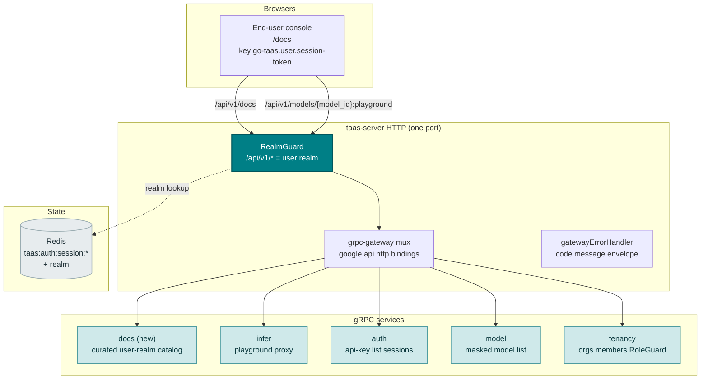
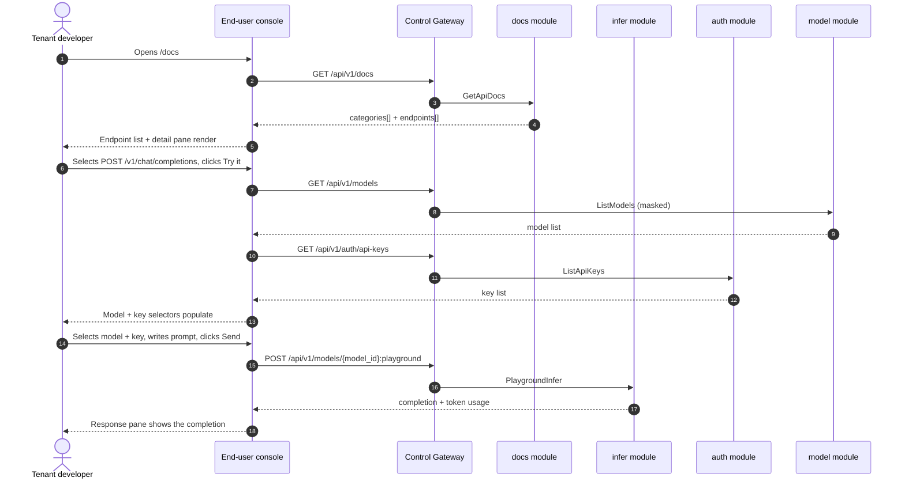
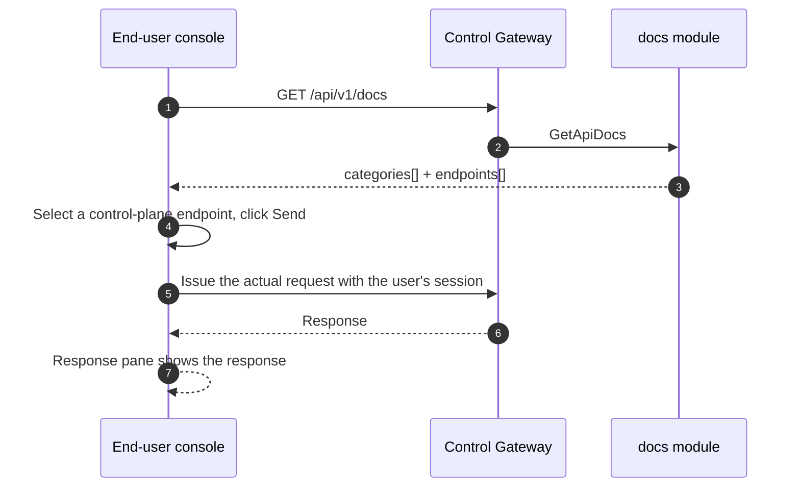

# API Documentation Explorer — Architecture and Detailed Design

| Attribute | Content |
| --- | --- |
| Feature point | API documentation explorer — an interactive API reference page with endpoint list, request/response examples, and try-it-in-console (backlog row 38) |
| Document scope | Architecture and detailed design for feature-38: a new `docs` module serving the curated user-realm API catalog; the `taas.docs.v1.DocsService` proto with the `GetApiDocs` RPC; the end-user API Docs page (`/docs`); the try-it wiring that reuses the playground proxy and the user's session; plus error handling, configuration, security, rollout, and function-level design per layer |
| Owning modules | New `docs` module (`services/docs`): serves the curated user-realm API catalog; `pkg/server` gateway (user-prefix bindings); `web` end-user console (`ApiDocsPage` in `UserShell`); `infer` (reused: the model-based playground proxy for try-it); `auth` (reused: API-key list for try-it); `model` (reused: masked model list for try-it) |
| Related documents | [Requirement Analysis and UI/UX Design](../design/api-docs-explorer.md) · [Architecture Design](../design/architecture.md) §3.2 data-plane gateway, §3.3 API-key authentication chain · [Console Surface Separation](./console-surface-separation.md) (the end-user surface this page lives on, the `UserShell` conventions, the masked-projection rule) · [SDK / Quickstart](./sdk-quickstart.md) (the sibling onboarding page and its language-tab / base-URL / playground-proxy conventions) · [Request Logs & API Playground](./request-logs-playground.md) (the `PlaygroundInfer` proxy this feature reuses for try-it) · [Model Catalog & One-Click Deployment](./model-catalog-deployment.md) (the model list this page consumes) |
| Status | Architecture complete, handed to the Developer agent |

---

## 1. Overview and Goals

go-taas sells OpenAI-compatible inference access to **Agents / SDKs**. The quickstart page (feature #21) walks a tenant through the four steps to a working integration — key, model, base URL, and a canonical snippet. But a tenant who wants to go beyond the quickstart's three canned snippets — to call embeddings, to understand the exact request/response shape of every endpoint, to see the error codes, or to try an endpoint interactively — has nowhere to go. The generated `docs/api/taas/*/v1/*.swagger.json` files exist in the repository but are not served in the console, they include admin endpoints, and they do not document the data-plane inference API (`/v1/chat/completions`, `/v1/embeddings`) that Agents actually call. A tenant must leave the platform and read external documentation that does not exist yet.

This feature adds an **API documentation explorer**: an interactive API reference page with an endpoint list, request/response examples, and try-it-in-console. It is the smallest independently valuable increment of the "developer onboarding" story: it turns "I have a working quickstart snippet" into "I can discover every endpoint I am allowed to call, see its exact shape, and try it in the console". It is a **read-only** surface — nothing in the inference, metering, or billing pipelines changes.

**Goals**: a new `docs` module serving the curated user-realm API catalog; a `taas.docs.v1.DocsService` with the `GetApiDocs` RPC; an end-user API Docs page (`/docs`) with a two-pane layout (endpoint list + detail pane), request/response examples with language tabs, error-code documentation, and try-it-in-console for every catalog endpoint; new error code 12201 `CodeDocsEndpointNotFound`; the page → route → API-prefix table with the exact user prefix; per-page interactive states including empty, error, and permission-denied; and numbered acceptance criteria testable in Nightwatch against the compose stack.

**Non-goals** (deferred, design §8): the quickstart onboarding flow (feature #21 — the sibling page with the three canonical snippets); an admin-surface API reference (deliberately absent, D1); a full OpenAPI/Swagger UI renderer of the raw generated specs (deliberately absent, D2 — the catalog is curated); request/response body capture or a persistent "my requests" list (the try-it is stateless); any change to the inference, metering, or billing pipelines (read-only feature).

### 1.1 Reading order of this document

Section 2 records the architecture decisions (AD1–AD8, mirroring the design's D1–D8). Sections 3–5 are the component view, data model, and API design. Section 6 is the frontend architecture (page → route → API-prefix table, auth guard). Sections 7–8 are the sequence flows and error handling. Sections 9–11 are configuration, security, and rollout. Sections 12–14 are the acceptance-criteria traceability, the function-level detailed design, and the ordered implementation task list.

---

## 2. Architecture Decisions

| # | Decision | Rationale |
| --- | --- | --- |
| AD1 | **The API docs explorer lives on the end-user surface only**: route `/docs`, API prefix `/api/v1/docs/*`. It is added to the `UserShell` navigation as "API Docs" (「API 文档」). There is **no admin surface** — the docs explorer is for API consumers (Agents/SDKs) discovering the endpoints they can call; the admin console has its own operational pages | Design D1. The docs explorer answers the tenant's "what can I call and how" question; the operator's operational pages are already surfaced in the admin console. Consistent with the end-user-only quickstart (feature #21) |
| AD2 | **The catalog is served by a new user-realm endpoint `GET /api/v1/docs`** returning a curated, user-realm API catalog: endpoints grouped by category, each with method, path, parameters, request/response examples, and error codes. It is a **curated projection** — it lists only the endpoints a tenant/Agent can call (the OpenAI-compatible inference API plus the user-realm control-plane APIs), and never exposes admin endpoints or operator internals | Design D2. The generated swagger.json files include admin endpoints and omit the data-plane inference API; a curated catalog keeps the surface controlled, scannable, and testable (the "curated, scannable set" pattern) |
| AD3 | **The catalog is curated server-side in a new `docs` module** (a static, versioned catalog), not derived from the swagger.json at runtime | Design D3. The swagger.json files are generated from protos and include admin endpoints; the docs explorer needs a curated user-realm view with OpenAI-compatible inference examples that are not in the protos. A curated catalog keeps the surface controlled and testable |
| AD4 | **Try-it-in-console works on every endpoint in the catalog.** For the **inference API** endpoints (`/v1/chat/completions`, `/v1/embeddings`), try-it reuses the model-based playground proxy `POST /api/v1/models/{model_id}:playground` (feature #12 D14) with a selected model and API key, so the call goes through the real metered path. For **control-plane** endpoints, try-it issues the actual request with the user's session token and shows the response | Design D4. The inference try-it must exercise the real metered path so test calls are visible in usage (the Chinese-platform pitfall); the playground proxy already exists and routes through the real path. Control-plane try-it uses the user's own session, so it is authorized and testable |
| AD5 | **The page is a two-pane layout**: a left endpoint list grouped by category, and a right detail pane with the method, path, parameters, request/response examples, error codes, and a "Try it" panel | Design D5. Swagger UI, ReadMe, Stripe, and OpenAI all use this layout; it is the canonical API-reference interaction |
| AD6 | **Code examples use language tabs Python / Node / curl**, each with a copy button, consistent with the quickstart (feature #21 D6) | Design D6. The standard trio; copy buttons are the primary interaction |
| AD7 | **The catalog is versioned and read-only** — it is a static, versioned projection; the page writes nothing and mutates nothing, and is audited only for access | Design D7. The feature is a pure read of a curated catalog; the audit trail (feature #15) already covers the underlying writes. No new audit events are needed |
| AD8 | **New error codes in a docs block (12201–12299)**: **12201 `CodeDocsEndpointNotFound`** (an unknown endpoint id in the catalog). No range validation is needed (the catalog is a static projection) | Design D8. The docs module is new (AD3), so its codes live in a fresh block after the resource-metrics block (121xx); distinct not-found keeps "unknown endpoint" actionable |

---

## 3. Component View

### 3.1 Ownership

| Layer / component | Owns | Changes in this feature |
| --- | --- | --- |
| **Control Gateway (`grpc-gateway`)** | HTTP/JSON facade for the `GetApiDocs` RPC; realm guard (feature #17) already rejects a wrong-realm session with 10038; passes `X-Organization-Id` through as gRPC metadata | New binding for the HTTP docs RPC (Section 5); no change to the realm guard |
| **`docs` module (`services/docs`)** | The curated user-realm API catalog (a static, versioned projection), the `GetApiDocs` RPC | **New module** (AD3) |
| **`infer` module** | The model-based playground proxy `PlaygroundInfer` | Reused unchanged for the inference try-it (AD4) |
| **`auth` module** | API-key list, session realm | Reused unchanged for the try-it key selector (AD4) |
| **`model` module** | Masked model list | Reused unchanged for the try-it model selector (AD4) |
| **`tenancy` module** | Organizations, members, roles, RoleGuard | Read-only: `RoleGuard` gates the docs RPC by the caller's role (10036) |
| **Console** | End-user API Docs page | One new page on the end-user surface (Section 6) |

### 3.2 Runtime component view



### 3.3 Request identity chain

The docs RPC is **end-user surface** (AD1). The chain is:

1. `RealmGuard` (HTTP, `pkg/server/realm.go`) — path prefix `/api/v1/docs` decides the expected realm `user`. With no `Authorization` header: pass through (transitional, feature-17 AD4). With a header: resolve the session realm from Redis; mismatch → 10038, unknown/expired/realm-less → 10027.
2. grpc-gateway mux — routes by the annotated path and forwards `authorization` and `x-organization-id`.
3. `docs` handler — resolves the caller's role via `tenancy.RoleGuard` (10036). The docs RPC is user-realm (AD1); there is no admin binding.
4. `tenancy.RoleGuard` — gates the docs RPC by the caller's role (10036).

The try-it calls (`GET /api/v1/models`, `GET /api/v1/auth/api-keys`, `POST /api/v1/models/{model_id}:playground`) ride the existing user-realm identity chains of their owning modules (AD4).

---

## 4. Data Model

### 4.1 No New Tables

The API docs feature is a pure read of a curated, static catalog (AD3, AD7). No new tables, no new MQ subjects, no new runners, and no writes on any path. The catalog is a static, versioned Go structure in the `docs` module; there is no persisted docs store.

### 4.2 Migration Notes

- No schema change, no data migration, and no init-SQL upgrade path. The feature is a pure read of a static catalog (AD3, AD7).

---

## 5. API Design

The docs RPC belongs to the new **`taas.docs.v1.DocsService`** (proto: `proto/taas/docs/v1/docs.proto`), served as HTTP via the Control Gateway. It is end-user-only (AD1); there is **no admin-prefix binding**.

| RPC | HTTP (user) | HTTP (admin) | Status | Purpose |
| --- | --- | --- | --- | --- |
| `GetApiDocs` | `GET /api/v1/docs` | — | **new** | Return the curated user-realm API catalog: categories, endpoints, parameters, examples, and error codes |

### 5.1 Proto contract

```protobuf
syntax = "proto3";

package taas.docs.v1;

import "google/api/annotations.proto";
import "taas/common/v1/common.proto";

option go_package = "github.com/go-taas/go-taas/proto/taas/docs/v1;docsv1";

// DocsService serves the curated user-realm API catalog. End-user
// surface API: served under /api/v1/docs.
service DocsService {
  // GetApiDocs returns the curated user-realm API catalog: categories,
  // endpoints, parameters, request/response examples, and error codes.
  // It is end-user-only (no admin binding).
  rpc GetApiDocs(GetApiDocsRequest) returns (GetApiDocsResponse) {
    option (google.api.http) = {get: "/api/v1/docs"};
  }
}

message GetApiDocsRequest {}

message GetApiDocsResponse {
  taas.common.v1.Response response = 1;
  repeated ApiDocsCategory categories = 2;
}

// ApiDocsCategory is one group of endpoints in the catalog.
message ApiDocsCategory {
  string category_id = 1;
  string category_name = 2;
  repeated ApiDocsEndpoint endpoints = 3;
}

// ApiDocsEndpoint is one endpoint's documentation.
message ApiDocsEndpoint {
  string endpoint_id = 1;
  // method is GET / POST / PUT / DELETE.
  string method = 2;
  string path = 3;
  string summary = 4;
  string description = 5;
  repeated ApiDocsParameter parameters = 6;
  // request_example and response_example are JSON strings.
  string request_example = 7;
  string response_example = 8;
  repeated ApiDocsErrorCode error_codes = 9;
  // tryable is whether try-it-in-console is available.
  bool tryable = 10;
}

// ApiDocsParameter is one parameter of an endpoint.
message ApiDocsParameter {
  string name = 1;
  // in is path / query / body / header.
  string in = 2;
  bool required = 3;
  string type = 4;
  string description = 5;
}

// ApiDocsErrorCode is one error code an endpoint can return.
message ApiDocsErrorCode {
  int32 code = 1;
  string constant = 2;
  string message = 3;
}
```

### 5.2 Contract notes (pinned for the Developer agent)

1. `GetApiDocs` returns `categories[]`, each with `category_id`, `category_name`, and `endpoints[]`. Each endpoint carries `endpoint_id`, `method`, `path`, `summary`, `description`, `parameters[]`, `request_example`, `response_example`, `error_codes[]`, and `tryable` (FR1.1).
2. The catalog is a static, versioned projection in the `docs` module (AD3); it is not derived from the swagger.json at runtime. It covers the inference API (`/v1/chat/completions`, `/v1/embeddings`) and the user-realm control-plane APIs (`/api/v1/models`, `/api/v1/auth/api-keys`, `/api/v1/usage`, `/api/v1/inference-endpoint`), and never exposes admin endpoints or operator internals (FR1.3).
3. Try-it for inference endpoints reuses `POST /api/v1/models/{model_id}:playground` (feature #12 D14) with a selected model and key, so the call goes through the real metered path (AD4). Try-it for control-plane endpoints issues the actual request with the user's session token (AD4).
4. Wire conventions unchanged: HTTP 200 on success, business errors as `{"code": <int>, "message": "..."}`, int64 fields serialized as JSON strings.

### 5.3 Error codes

Error codes (docs block 12201–12299, `pkg/errors/codes.go`):

| Condition | Code | Constant | Notes |
| --- | --- | --- | --- |
| Unknown `endpoint_id` | 12201 | `CodeDocsEndpointNotFound` | **New** (AD8) |
| Database / infrastructure failure | 500 | `CodeInternal` | Via error normalization |

---

## 6. Frontend Architecture

### 6.1 Page → Route → API-prefix table

| Page / component | Surface | Web route | API prefix | Auth guard |
| --- | --- | --- | --- | --- |
| **API Docs page** | end-user | `/docs` | `/api/v1/docs` | user session; RoleGuard (user role) |
| Masked model list (reused) | end-user | `/docs` (try-it) | `/api/v1/models` | user session |
| API-key list (reused) | end-user | `/docs` (try-it) | `/api/v1/auth/api-keys` | user session |
| Inference base URL (reused) | end-user | `/docs` (examples) | `/api/v1/inference-endpoint` | user session |
| Inference try-it (reused) | end-user | `/docs` (try-it) | `/api/v1/models/{model_id}:playground` | user session |

> The end-user API Docs page calls only `/api/v1/*` routes; there is no admin surface (AD1). The page contains no `/api/v1/admin/*` string (feature #17).

### 6.2 Navigation placement

- **End-user console**: a new **API Docs** item (`/docs`, testid `user-nav-api-docs`) in the `UserShell` navigation, in the developer group alongside Quickstart.

### 6.3 Shared components and state to reuse

- **API client** (`web/src/api.ts`): the realm-scoped client (`createApi(realm)`) already sends `Authorization: Bearer <realm>.session-token` and `X-Organization-Id` (only when the realm token key is empty). The API Docs page reuses it unchanged; no new client is added.
- **Language tabs**: the Python / Node / curl language-tab component from the quickstart (feature #21) is reused for the code examples (AD6).
- **Copy button**: the quickstart copy button is reused.
- **Playground proxy**: the try-it reuses the existing playground proxy call (`POST /api/v1/models/{model_id}:playground`) and its response pane pattern (feature #12).
- **Method badge**: a small shared `MethodBadge.tsx` component rendering the GET/POST/PUT/DELETE color-coded badge.

### 6.4 Auth guard per surface

- **End-user API Docs page** (`/docs`): rendered inside `UserShell`, which runs the user session guard when `go-taas.user.session-token` is non-empty; a missing/expired session redirects to `/login?reason=expired`; a wrong-realm session is rejected by the gateway with 10038. The page's API call goes to `/api/v1/docs`. A session without the required role receives 10036 and the page shows the standard permission-denied state (feature #17).
- **Unauthenticated visitors**: an unauthenticated visitor to the page is redirected to `/login` by the shell guard.

### 6.5 Console contract (pinned for the Developer agent)

**API Docs page** (`/docs`): a page header ("API Docs", subtitle "Reference for the go-taas inference and account APIs") with a **Refresh** action (`docs-refresh`). Below, a two-pane layout (AD5): a left **endpoint list** (`docs-endpoint-list`, `docs-endpoint-{endpoint_id}`) grouped by category (Inference / Models / API Keys / Usage / Inference endpoint), each row a method badge and the path; and a right **detail pane** (`docs-detail`) for the selected endpoint with the method badge and path, a summary, a description, a **Parameters** section, a **Request** section with language tabs (`docs-lang-python`, `docs-lang-node`, `docs-lang-curl`) and a copy button (`docs-copy`), a **Response** section with the response example, an **Error codes** section, and a **Try it** panel (`docs-try-it`). For inference endpoints, the Try it panel has a model selector, a key selector, and a prompt editor; **Send** (`docs-try-send`) calls the playground proxy and shows the completion plus token usage in a response pane (`docs-try-response`). For control-plane endpoints, Send issues the actual request with the user's session and shows the response. Send is disabled until the endpoint's required inputs are set. Empty state: "No API documentation available." with a hint that the catalog appears after the platform starts. Error state: an error banner with a Retry button and a "Showing stale data" banner. Permission-denied: the standard state with a link back to the user home.

---

## 7. Sequence Flows

### 7.1 End-user API docs load and try-it



### 7.2 Control-plane try-it



---

## 8. Error Handling

All errors are `pkg/errors` business codes in the unified envelope (Section 5.3). The docs module is read-only, so there are no runner-side failures and no writes to fail. A database failure is normalized to 500 `CodeInternal`.

The console branches on the body `code` (as `web/src/api.ts` already does), never on the HTTP status. The new code 12201 "endpoint not found" renders a specific inline message. The end-user page maps 10036 to the standard permission-denied state (feature #17 §8.2).

---

## 9. Configuration Additions

| Key | Default | Description |
| --- | --- | --- |
| `docs.catalogVersion` | `v1` | The version of the curated catalog served by `GetApiDocs` (AD3, AD7) |

The `docs` config block is new in `pkg/config` (`DocsConfig`), following the `observability` block pattern. `applyDefaults`/`Validate` set the default above. The docs module reads `catalogVersion` in the RPC. No other config keys, runners, or MQ subjects are added — the feature is a pure read of a static catalog (AD3, AD7).

---

## 10. Security Considerations

- **End-user-only surface**: the API Docs page lives on the end-user surface only (AD1); there is no admin surface. The realm guard rejects a wrong-realm session with 10038 before any handler runs (feature #17).
- **User role gated**: the docs RPC is gated by `tenancy.RoleGuard` — only a caller with the required user role can read the catalog; an inaccessible org returns 10036.
- **Curated projection**: the catalog never exposes admin endpoints (`/api/v1/admin/*`) or operator internals (service ids, replica counts, pod names) (AD2). Tenants see only the endpoints they can call.
- **Try-it uses the caller's own identity**: the inference try-it uses the caller's selected API key through the real metered path; the control-plane try-it uses the caller's own session. No stored secrets are ever persisted into examples (AD4).
- **Read-only by construction**: the docs module issues only reads of a static catalog; no writes on any path (AD7). No new audit events are needed.

---

## 11. Rollout / Upgrade Notes

- **No schema change**: the feature reads a static catalog only; deploy `taas-server` alone. No new tables, no new indexes, no data migration, no init-SQL upgrade path.
- **The proto change is additive**: one new RPC on a new `DocsService`; no existing RPC or message changes. The gateway mux gains the new binding; the realm guard is unchanged.
- **Console**: the new page is added to the existing bundle; the `UserShell` nav gains API Docs. No existing route changes.
- **Backward compatibility**: the transitional (session-less, `X-Organization-Id`) path is preserved for the CLI, FVT, and e2e suites; the realm guard passes through requests without an `Authorization` header (feature #17 AD4).
- **Catalog is static**: the catalog is a versioned Go structure; updating it is a code change, not a data migration.

---

## 12. Acceptance-Criteria Traceability

| # | Criterion | Where addressed |
| --- | --- | --- |
| AC1 | `GetApiDocs` returns the curated user-realm catalog with categories, endpoints, parameters, request/response examples, and error codes; it exposes no `/api/v1/admin/*` endpoint and no operator internals | §5.1, §5.2, §10 |
| AC2 | The catalog covers the inference API (`/v1/chat/completions`, `/v1/embeddings`) and the user-realm control-plane APIs (`/api/v1/models`, `/api/v1/auth/api-keys`, `/api/v1/usage`, `/api/v1/inference-endpoint`) | §5.2 |
| AC3 | The `/docs` page renders the endpoint list grouped by category and the detail pane for the first endpoint from the first successful load | §6.5 |
| AC4 | Selecting an endpoint loads its detail pane; the language tabs switch the example client-side; the copy button copies the active example | §6.5 |
| AC5 | Try-it on an inference endpoint populates the model and key selectors, sends via `POST /api/v1/models/{model_id}:playground`, and shows the completion plus token usage in the response pane | §6.5, §7.1 |
| AC6 | Try-it on a control-plane endpoint issues the actual request with the user's session and shows the response; Send is disabled until the endpoint's required inputs are set | §6.5, §7.2 |
| AC7 | The API docs page is reachable only on the end-user surface: route `/docs`, every API call uses the `/api/v1/*` prefix with no `/api/v1/admin/*` string | §6.1, §6.4, §10 |
| AC8 | A session without the required role receives 10036 on the `/docs` page and the page shows the standard permission-denied state | §3.3, §6.4, §10 |

---

## 13. Detailed Design (function-level responsibilities per layer)

### 13.1 Proto → service → repository

| Layer | File | Responsibilities |
| --- | --- | --- |
| `proto/taas/docs/v1` | `docs.proto` | New: `DocsService` with `GetApiDocs` RPC + `GetApiDocsRequest/Response`, `ApiDocsCategory`, `ApiDocsEndpoint`, `ApiDocsParameter`, `ApiDocsErrorCode` messages (Section 5.1). Regenerate `docs.pb.go`/`docs_grpc.pb.go`/`docs.pb.gw.go` via `buf generate` |
| `services/docs` | `catalog.go` | The static, versioned catalog: the `Catalog` struct and the `catalogV1` constant holding the curated categories/endpoints/parameters/examples/error codes (AD3, AD7) |
| | `service.go` | New RPC `GetApiDocs`; returns the curated catalog (AD3); the `RoleGuard` seam for user org scoping (10036) |
| `pkg/errors` | `codes.go`/`messages.go` | `CodeDocsEndpointNotFound` (12201) constant + canonical message "docs endpoint not found" (AD8) |
| `pkg/config` | `api.go`/`configuration.go` | `DocsConfig` + `catalogVersion` (Section 9) + `applyDefaults`/`Validate` |
| `apps/taas-server` | `main.go` | Register the new `DocsService`; wire the `tenancy` RoleGuard into the docs service |
| `web/src` | `pages/ApiDocsPage.tsx`, `components/MethodBadge.tsx`, `App.tsx`, `api.ts`, `shells/UserShell.tsx` | Route `/docs`; `GetApiDocs` API types and calls; nav item (Section 6.5) |
| `test` | `fvt/api_docs_fvt_test.go`, `e2e/tests/apiDocs.js` | Section 14 |

### 13.2 Which React page/module implements each screen

| Screen | React module | Route | API calls |
| --- | --- | --- | --- |
| API Docs page (end-user) | `web/src/pages/ApiDocsPage.tsx` | `/docs` | `GetApiDocs`, `ListModels`, `ListApiKeys`, `GetInferenceEndpoint`, `PlaygroundInfer` |
| Method badge | `web/src/components/MethodBadge.tsx` (shared) | (on the page) | (client-side; renders the returned method) |

---

## 14. Testing Strategy

- **Unit** (`services/docs`): `catalog_test.go` — the static catalog covers the inference API and the user-realm control-plane APIs and exposes no `/api/v1/admin/*` endpoint (AC1, AC2). `service_test.go` — `GetApiDocs` returns the curated catalog (AC1); user org scoping returns 10036 (AC8). Coverage ≥ 80% on the new files.
- **FVT** (`test/fvt/api_docs_fvt_test.go`, the observability FVT pattern: file-backed sqlite + `MigrateSchemaForFVT` + `NewForFVT` + gRPC server with the production interceptor + gateway mux with `FVTHeaderMatcher`): assert `GetApiDocs` returns the curated catalog with categories, endpoints, parameters, examples, and error codes (AC1), and the catalog covers the inference and control-plane APIs (AC2).
- **E2E** (`test/e2e/tests/apiDocs.js`, the `quickstart.js` pattern): against the compose stack — the `/docs` page renders the endpoint list grouped by category and the detail pane for the first endpoint from the first successful load (AC3); selecting an endpoint loads its detail pane, the language tabs switch the example client-side, and the copy button copies the active example (AC4); try-it on an inference endpoint populates the model and key selectors, sends via `POST /api/v1/models/{model_id}:playground`, and shows the completion plus token usage (AC5); try-it on a control-plane endpoint issues the actual request and shows the response, and Send is disabled until the required inputs are set (AC6); the page calls only `/api/v1/*` routes and an unauthenticated visitor is redirected to `/login` (AC7); a session without the required role receives 10036 and shows the permission-denied state (AC8).