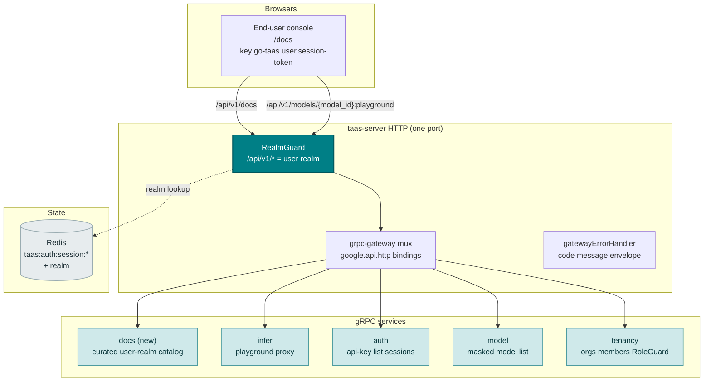
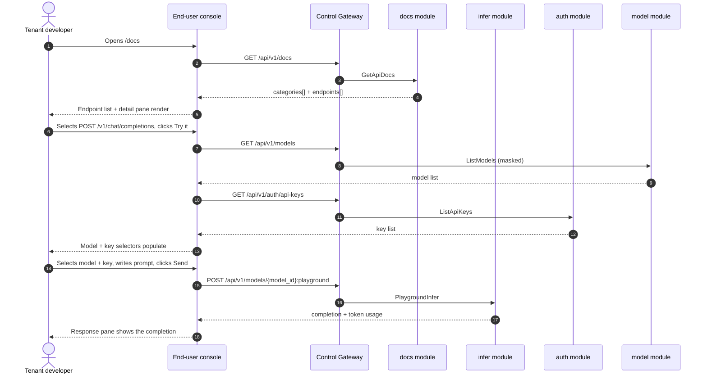
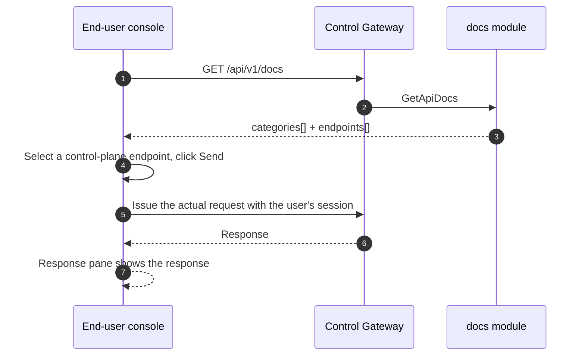

# API 文档浏览器 — 架构与详细设计

| 属性 | 内容 |
| --- | --- |
| 功能点 | API 文档浏览器 — 交互式 API 参考页面，含端点列表、请求/响应示例与控制台内试用（backlog 第 38 行） |
| 文档范围 | 功能 38 的架构与详细设计：新的 `docs` 模块，提供精选的用户域 API 目录；`taas.docs.v1.DocsService` proto 及 `GetApiDocs` RPC；用户端 API 文档页面（`/docs`）；复用 playground 代理与用户会话的试用接线；以及错误处理、配置、安全、上线与各层函数级设计 |
| 所属模块 | 新 `docs` 模块（`services/docs`）：提供精选的用户域 API 目录；`pkg/server` 网关（用户前缀绑定）；`web` 用户端控制台（`UserShell` 中的 `ApiDocsPage`）；`infer`（复用：用于试用的基于模型的 playground 代理）；`auth`（复用：用于试用的 API 密钥列表）；`model`（复用：用于试用的掩码模型列表） |
| 相关文档 | [需求分析与 UI/UX 设计](../design/api-docs-explorer.md) · [架构设计](../design/architecture.md) §3.2 数据面网关、§3.3 API 密钥认证链 · [控制台面分离](./console-surface-separation.md)（本页面所在的用户端面、`UserShell` 约定、掩码投影规则）· [SDK / 快速入门](./sdk-quickstart.md)（同类引导页及其语言标签 / 基础 URL / playground 代理约定）· [请求日志与 API Playground](./request-logs-playground.md)（本功能为试用复用的 `PlaygroundInfer` 代理）· [模型目录与一键部署](./model-catalog-deployment.md)（本页面消费的模型列表） |
| 状态 | 架构完成，已移交给 Developer 智能体 |

---

## 1. 概述与目标

go-taas 向**智能体 / SDK** 销售 OpenAI 兼容的推理访问。快速入门页面（功能 #21）引导租户完成集成的四步 —— 密钥、模型、基础 URL 与规范片段。但想要超越快速入门三个预设片段的租户 —— 调用 embeddings、理解每个端点的精确请求/响应形状、查看错误码或交互式试用端点 —— 无处可去。仓库中生成的 `docs/api/taas/*/v1/*.swagger.json` 文件未在控制台提供，包含管理端端点，且未记录智能体实际调用的数据面推理 API（`/v1/chat/completions`、`/v1/embeddings`）。租户必须离开平台去读尚不存在的外部文档。

本功能新增一个 **API 文档浏览器**：交互式 API 参考页面，含端点列表、请求/响应示例与控制台内试用。它是"开发者引导"故事最小且有独立价值的增量：把"我有一个可用的快速入门片段"变成"我能发现每个允许调用的端点、看到其精确形状并在控制台内试用"。这是一个**只读**面 —— 推理、计量或计费管线均无改动。

**目标**：新的 `docs` 模块，提供精选的用户域 API 目录；`taas.docs.v1.DocsService` 及 `GetApiDocs` RPC；用户端 API 文档页面（`/docs`），双栏布局（端点列表 + 详情面板）、带语言标签的请求/响应示例、错误码文档，以及每个目录端点的控制台内试用；新错误码 12201 `CodeDocsEndpointNotFound`；页面 → 路由 → API 前缀表（精确用户前缀）；各页面交互状态（空、错误、权限拒绝）；以及可在 compose 栈上以 Nightwatch 测试的编号验收标准。

**非目标**（延后，设计 §8）：快速入门引导流程（功能 #21 —— 含三个规范片段的同类页面）；管理端 API 参考（刻意不引入，D1）；原始生成规范的完整 OpenAPI/Swagger UI 渲染器（刻意不引入，D2 —— 目录为精选）；请求/响应体捕获或持久化"我的请求"列表（试用为无状态）；推理、计量或计费管线的任何变更（只读功能）。

### 1.1 本文档阅读顺序

第 2 节记录架构决策（AD1–AD8，对应设计的 D1–D8）。第 3–5 节为组件视图、数据模型与 API 设计。第 6 节为前端架构（页面 → 路由 → API 前缀表、认证守卫）。第 7–8 节为时序流程与错误处理。第 9–11 节为配置、安全与上线。第 12–14 节为验收标准追溯、函数级详细设计与有序实现任务清单。

---

## 2. 架构决策

| # | 决策 | 理由 |
| --- | --- | --- |
| AD1 | **API 文档浏览器仅存在于用户端面**：路由 `/docs`，API 前缀 `/api/v1/docs/*`。加入 `UserShell` 导航为 "API Docs"（「API 文档」）。**无管理端面** —— 文档浏览器面向 API 消费者（智能体/SDK）发现可调用端点；管理端控制台已有自己的运维页面 | 设计 D1。文档浏览器回答租户"我能调用什么、如何调用"的问题；运维人员的运维页面已在管理端控制台呈现。与仅用户端的快速入门（功能 #21）一致 |
| AD2 | **目录由新用户域端点 `GET /api/v1/docs` 提供**，返回精选的用户域 API 目录：按类别分组的端点，各含方法、路径、参数、请求/响应示例与错误码。它是**精选投影** —— 仅列出租户/智能体可调用的端点（OpenAI 兼容推理 API 加用户域控制面 API），绝不含管理端端点或运维内部信息 | 设计 D2。生成的 swagger.json 文件含管理端端点且遗漏数据面推理 API；精选目录保持面受控、可扫描、可测试（"精选、可扫描集合"模式） |
| AD3 | **目录在 `docs` 模块中服务端精选**（静态、版本化目录），而非运行时从 swagger.json 派生 | 设计 D3。swagger.json 文件由 proto 生成且含管理端端点；文档浏览器需要精选的用户域视图，含 proto 中不存在的 OpenAI 兼容推理示例。精选目录保持面受控、可测试 |
| AD4 | **控制台内试用对目录中每个端点生效。** 对**推理 API** 端点（`/v1/chat/completions`、`/v1/embeddings`），试用复用基于模型的 playground 代理 `POST /api/v1/models/{model_id}:playground`（功能 #12 D14），带所选模型与 API 密钥，使调用走真实计量路径。对**控制面**端点，试用以用户会话 token 发出实际请求并显示响应 | 设计 D4。推理试用必须走真实计量路径，使测试调用在用量中可见（中国平台陷阱）；playground 代理已存在并经真实路径路由。控制面试用使用用户自身会话，因此已授权且可测试 |
| AD5 | **页面为双栏布局**：左侧按类别分组的端点列表，右侧详情面板，含方法、路径、参数、请求/响应示例、错误码与 "Try it" 面板 | 设计 D5。Swagger UI、ReadMe、Stripe 与 OpenAI 均用此布局；它是规范的 API 参考交互 |
| AD6 | **代码示例使用 Python / Node / curl 语言标签**，各带复制按钮，与快速入门一致（功能 #21 D6） | 设计 D6。标准三件套；复制按钮是主要交互 |
| AD7 | **目录版本化且只读** —— 它是静态、版本化投影；页面不写入、不修改任何内容，且仅对访问审计 | 设计 D7。本功能是对精选目录的纯读取；审计轨迹（功能 #15）已覆盖底层写入。无需新增审计事件 |
| AD8 | **新错误码在 docs 块（12201–12299）**：**12201 `CodeDocsEndpointNotFound`**（目录中未知端点 id）。无需范围校验（目录为静态投影） | 设计 D8。docs 模块是新模块（AD3），因此其错误码位于资源指标块（121xx）之后的空白块；区分"未找到"使"未知端点"可操作 |

---

## 3. 组件视图

### 3.1 归属

| 层 / 组件 | 拥有 | 本功能变更 |
| --- | --- | --- |
| **控制网关（`grpc-gateway`）** | `GetApiDocs` RPC 的 HTTP/JSON 门面；域守卫（功能 #17）已以 10038 拒绝错误域会话；将 `X-Organization-Id` 作为 gRPC 元数据透传 | 新增 HTTP docs RPC 绑定（第 5 节）；域守卫不变 |
| **`docs` 模块（`services/docs`）** | 精选的用户域 API 目录（静态、版本化投影）、`GetApiDocs` RPC | **新模块**（AD3） |
| **`infer` 模块** | 基于模型的 playground 代理 `PlaygroundInfer` | 为推理试用原样复用（AD4） |
| **`auth` 模块** | API 密钥列表、会话域 | 为试用密钥选择器原样复用（AD4） |
| **`model` 模块** | 掩码模型列表 | 为试用模型选择器原样复用（AD4） |
| **`tenancy` 模块** | 组织、成员、角色、RoleGuard | 只读：`RoleGuard` 按调用者角色门控 docs RPC（10036） |
| **控制台** | 用户端 API 文档页面 | 用户端面新增一页（第 6 节） |

### 3.2 运行时组件视图



### 3.3 请求身份链

docs RPC 为**用户端面**（AD1）。链路如下：

1. `RealmGuard`（HTTP，`pkg/server/realm.go`）—— 路径前缀 `/api/v1/docs` 决定期望域 `user`。无 `Authorization` 头：透传（过渡期，feature-17 AD4）。有头：从 Redis 解析会话域；不匹配 → 10038，未知/过期/无域 → 10027。
2. grpc-gateway mux —— 按注解路径路由并透传 `authorization` 与 `x-organization-id`。
3. `docs` 处理器 —— 经 `tenancy.RoleGuard` 解析调用者角色（10036）。docs RPC 为用户域（AD1）；无管理端绑定。
4. `tenancy.RoleGuard` —— 按调用者角色门控 docs RPC（10036）。

试用调用（`GET /api/v1/models`、`GET /api/v1/auth/api-keys`、`POST /api/v1/models/{model_id}:playground`）走其所属模块既有的用户域身份链（AD4）。

---

## 4. 数据模型

### 4.1 无新表

API 文档功能是对精选静态目录的纯读取（AD3、AD7）。无新表、无新 MQ subject、无新 runner、任何路径无写入。目录是 `docs` 模块中的静态、版本化 Go 结构；无持久化 docs 存储。

### 4.2 迁移说明

- 无 schema 变更、无数据迁移、无 init-SQL 升级路径。本功能是对静态目录的纯读取（AD3、AD7）。

---

## 5. API 设计

docs RPC 属于新的 **`taas.docs.v1.DocsService`**（proto：`proto/taas/docs/v1/docs.proto`），经控制网关以 HTTP 提供。仅用户端（AD1）；**无管理端前缀绑定**。

| RPC | HTTP（用户端） | HTTP（管理端） | 状态 | 用途 |
| --- | --- | --- | --- | --- |
| `GetApiDocs` | `GET /api/v1/docs` | — | **新** | 返回精选的用户域 API 目录：类别、端点、参数、示例与错误码 |

### 5.1 Proto 契约

```protobuf
syntax = "proto3";

package taas.docs.v1;

import "google/api/annotations.proto";
import "taas/common/v1/common.proto";

option go_package = "github.com/go-taas/go-taas/proto/taas/docs/v1;docsv1";

// DocsService serves the curated user-realm API catalog. End-user
// surface API: served under /api/v1/docs.
service DocsService {
  // GetApiDocs returns the curated user-realm API catalog: categories,
  // endpoints, parameters, request/response examples, and error codes.
  // It is end-user-only (no admin binding).
  rpc GetApiDocs(GetApiDocsRequest) returns (GetApiDocsResponse) {
    option (google.api.http) = {get: "/api/v1/docs"};
  }
}

message GetApiDocsRequest {}

message GetApiDocsResponse {
  taas.common.v1.Response response = 1;
  repeated ApiDocsCategory categories = 2;
}

// ApiDocsCategory is one group of endpoints in the catalog.
message ApiDocsCategory {
  string category_id = 1;
  string category_name = 2;
  repeated ApiDocsEndpoint endpoints = 3;
}

// ApiDocsEndpoint is one endpoint's documentation.
message ApiDocsEndpoint {
  string endpoint_id = 1;
  // method is GET / POST / PUT / DELETE.
  string method = 2;
  string path = 3;
  string summary = 4;
  string description = 5;
  repeated ApiDocsParameter parameters = 6;
  // request_example and response_example are JSON strings.
  string request_example = 7;
  string response_example = 8;
  repeated ApiDocsErrorCode error_codes = 9;
  // tryable is whether try-it-in-console is available.
  bool tryable = 10;
}

// ApiDocsParameter is one parameter of an endpoint.
message ApiDocsParameter {
  string name = 1;
  // in is path / query / body / header.
  string in = 2;
  bool required = 3;
  string type = 4;
  string description = 5;
}

// ApiDocsErrorCode is one error code an endpoint can return.
message ApiDocsErrorCode {
  int32 code = 1;
  string constant = 2;
  string message = 3;
}
```

### 5.2 契约说明（为 Developer 智能体固定）

1. `GetApiDocs` 返回 `categories[]`，各含 `category_id`、`category_name` 与 `endpoints[]`。每个端点携带 `endpoint_id`、`method`、`path`、`summary`、`description`、`parameters[]`、`request_example`、`response_example`、`error_codes[]` 与 `tryable`（FR1.1）。
2. 目录是 `docs` 模块中的静态、版本化投影（AD3）；非运行时从 swagger.json 派生。覆盖推理 API（`/v1/chat/completions`、`/v1/embeddings`）与用户域控制面 API（`/api/v1/models`、`/api/v1/auth/api-keys`、`/api/v1/usage`、`/api/v1/inference-endpoint`），绝不含管理端端点或运维内部信息（FR1.3）。
3. 推理端点试用复用 `POST /api/v1/models/{model_id}:playground`（功能 #12 D14），带所选模型与密钥，使调用走真实计量路径（AD4）。控制面端点试用以用户会话 token 发出实际请求（AD4）。
4. 线上约定不变：成功 HTTP 200，业务错误为 `{"code": <int>, "message": "..."}`，int64 字段序列化为 JSON 字符串。

### 5.3 错误码

错误码（docs 块 12201–12299，`pkg/errors/codes.go`）：

| 条件 | 码 | 常量 | 说明 |
| --- | --- | --- | --- |
| 未知 `endpoint_id` | 12201 | `CodeDocsEndpointNotFound` | **新**（AD8） |
| 数据库 / 基础设施故障 | 500 | `CodeInternal` | 经错误归一化 |

---

## 6. 前端架构

### 6.1 页面 → 路由 → API 前缀表

| 页面 / 组件 | 面 | Web 路由 | API 前缀 | 认证守卫 |
| --- | --- | --- | --- | --- |
| **API 文档页面** | 用户端 | `/docs` | `/api/v1/docs` | 用户会话；RoleGuard（用户角色） |
| 掩码模型列表（复用） | 用户端 | `/docs`（试用） | `/api/v1/models` | 用户会话 |
| API 密钥列表（复用） | 用户端 | `/docs`（试用） | `/api/v1/auth/api-keys` | 用户会话 |
| 推理基础 URL（复用） | 用户端 | `/docs`（示例） | `/api/v1/inference-endpoint` | 用户会话 |
| 推理试用（复用） | 用户端 | `/docs`（试用） | `/api/v1/models/{model_id}:playground` | 用户会话 |

> 用户端 API 文档页面仅调用 `/api/v1/*` 路由；无管理端面（AD1）。页面不含 `/api/v1/admin/*` 字符串（功能 #17）。

### 6.2 导航位置

- **用户端控制台**：`UserShell` 导航新增 **API Docs** 项（`/docs`，testid `user-nav-api-docs`），位于开发者分组，紧邻 Quickstart。

### 6.3 复用的共享组件与状态

- **API 客户端**（`web/src/api.ts`）：域作用域客户端（`createApi(realm)`）已发送 `Authorization: Bearer <realm>.session-token` 与 `X-Organization-Id`（仅当域 token 键为空时）。API 文档页面原样复用；不新增客户端。
- **语言标签**：复用快速入门（功能 #21）的 Python / Node / curl 语言标签组件（AD6）。
- **复制按钮**：复用快速入门复制按钮。
- **Playground 代理**：试用复用既有 playground 代理调用（`POST /api/v1/models/{model_id}:playground`）及其响应面板模式（功能 #12）。
- **方法徽标**：新共享 `MethodBadge.tsx` 组件，渲染 GET/POST/PUT/DELETE 颜色编码徽标。

### 6.4 各面认证守卫

- **用户端 API 文档页面**（`/docs`）：在 `UserShell` 内渲染，当 `go-taas.user.session-token` 非空时运行用户会话守卫；缺失/过期会话重定向到 `/login?reason=expired`；错误域会话被网关以 10038 拒绝。页面 API 调用指向 `/api/v1/docs`。无所需角色的会话收到 10036，页面显示标准权限拒绝状态（功能 #17）。
- **未认证访客**：未认证访客被 shell 守卫重定向到 `/login`。

### 6.5 控制台契约（为 Developer 智能体固定）

**API 文档页面**（`/docs`）：页面头部（"API Docs"，副标题 "Reference for the go-taas inference and account APIs"），带 **Refresh** 操作（`docs-refresh`）。下方为双栏布局（AD5）：左侧**端点列表**（`docs-endpoint-list`、`docs-endpoint-{endpoint_id}`），按类别分组（Inference / Models / API Keys / Usage / Inference endpoint），每行一个方法徽标与路径；右侧**详情面板**（`docs-detail`），显示所选端点的方法徽标与路径、摘要、描述、**Parameters** 区、**Request** 区（语言标签 `docs-lang-python`、`docs-lang-node`、`docs-lang-curl` + 复制按钮 `docs-copy`）、**Response** 区（响应示例）、**Error codes** 区与 **Try it** 面板（`docs-try-it`）。对推理端点，Try it 面板含模型选择器、密钥选择器与提示词编辑器；**Send**（`docs-try-send`）调用 playground 代理并在响应面板（`docs-try-response`）显示补全与 token 用量。对控制面端点，Send 以用户会话发出实际请求并显示响应。在端点必需输入设置完成前 Send 禁用。空状态："No API documentation available."，提示目录在平台启动后出现。错误状态：错误横幅 + Retry 按钮 + "Showing stale data" 横幅。权限拒绝：标准状态，带返回用户首页的链接。

---

## 7. 时序流程

### 7.1 用户端 API 文档加载与试用



### 7.2 控制面试用



---

## 8. 错误处理

所有错误均为统一信封中的 `pkg/errors` 业务码（第 5.3 节）。docs 模块只读，因此无 runner 侧失败、无写入可失败。数据库故障归一化为 500 `CodeInternal`。

控制台按 body `code` 分支（`web/src/api.ts` 已如此），绝不按 HTTP 状态。新码 12201 "端点未找到" 渲染特定内联消息。用户端页面将 10036 映射为标准权限拒绝状态（功能 #17 §8.2）。

---

## 9. 配置新增

| 键 | 默认 | 描述 |
| --- | --- | --- |
| `docs.catalogVersion` | `v1` | `GetApiDocs` 提供的精选目录版本（AD3、AD7） |

`docs` 配置块在 `pkg/config` 中新增（`DocsConfig`），遵循 `observability` 块模式。`applyDefaults`/`Validate` 设置上述默认值。docs 模块在 RPC 中读取 `catalogVersion`。不新增其他配置键、runner 或 MQ subject —— 本功能是对静态目录的纯读取（AD3、AD7）。

---

## 10. 安全考量

- **仅用户端面**：API 文档页面仅存在于用户端面（AD1）；无管理端面。域守卫在任何处理器运行前以 10038 拒绝错误域会话（功能 #17）。
- **用户角色门控**：docs RPC 由 `tenancy.RoleGuard` 门控 —— 仅有所需用户角色的调用者可读取目录；不可访问的组织返回 10036。
- **精选投影**：目录绝不含管理端端点（`/api/v1/admin/*`）或运维内部信息（服务 id、副本数、Pod 名）（AD2）。租户仅见可调用端点。
- **试用使用调用者自身身份**：推理试用经真实计量路径使用调用者所选 API 密钥；控制面试用使用调用者自身会话。示例中绝不持久化存储的密钥（AD4）。
- **构造性只读**：docs 模块仅对静态目录发出读取；任何路径无写入（AD7）。无需新增审计事件。

---

## 11. 上线 / 升级说明

- **无 schema 变更**：本功能仅读取静态目录；单独部署 `taas-server`。无新表、无新索引、无数据迁移、无 init-SQL 升级路径。
- **proto 变更为增量**：新 `DocsService` 上一个新 RPC；无既有 RPC 或消息变更。网关 mux 增加新绑定；域守卫不变。
- **控制台**：新页面加入既有 bundle；`UserShell` 导航增加 API Docs。无既有路由变更。
- **向后兼容**：过渡期（无会话、`X-Organization-Id`）路径为 CLI、FVT 与 e2e 套件保留；域守卫透传无 `Authorization` 头的请求（功能 #17 AD4）。
- **目录为静态**：目录是版本化 Go 结构；更新它是代码变更，而非数据迁移。

---

## 12. 验收标准追溯

| # | 标准 | 处理位置 |
| --- | --- | --- |
| AC1 | `GetApiDocs` 返回精选的用户域目录，含类别、端点、参数、请求/响应示例与错误码；不含 `/api/v1/admin/*` 端点或运维内部信息 | §5.1、§5.2、§10 |
| AC2 | 目录覆盖推理 API（`/v1/chat/completions`、`/v1/embeddings`）与用户域控制面 API（`/api/v1/models`、`/api/v1/auth/api-keys`、`/api/v1/usage`、`/api/v1/inference-endpoint`） | §5.2 |
| AC3 | `/docs` 页面在首次成功加载时渲染按类别分组的端点列表与首个端点的详情面板 | §6.5 |
| AC4 | 选择端点加载其详情面板；语言标签在客户端切换示例；复制按钮复制当前示例 | §6.5 |
| AC5 | 推理端点试用填充模型与密钥选择器，经 `POST /api/v1/models/{model_id}:playground` 发送，并在响应面板显示补全与 token 用量 | §6.5、§7.1 |
| AC6 | 控制面端点试用以用户会话发出实际请求并显示响应；在端点必需输入设置完成前 Send 禁用 | §6.5、§7.2 |
| AC7 | API 文档页面仅可在用户端面访问：路由 `/docs`，每次 API 调用使用 `/api/v1/*` 前缀且无 `/api/v1/admin/*` 字符串 | §6.1、§6.4、§10 |
| AC8 | 无所需角色的会话在 `/docs` 页面收到 10036，页面显示标准权限拒绝状态 | §3.3、§6.4、§10 |

---

## 13. 详细设计（各层函数级职责）

### 13.1 Proto → 服务 → 仓库

| 层 | 文件 | 职责 |
| --- | --- | --- |
| `proto/taas/docs/v1` | `docs.proto` | 新：`DocsService` 及 `GetApiDocs` RPC + `GetApiDocsRequest/Response`、`ApiDocsCategory`、`ApiDocsEndpoint`、`ApiDocsParameter`、`ApiDocsErrorCode` 消息（第 5.1 节）。经 `buf generate` 重新生成 `docs.pb.go`/`docs_grpc.pb.go`/`docs.pb.gw.go` |
| `services/docs` | `catalog.go` | 静态、版本化目录：`Catalog` 结构体与持有精选类别/端点/参数/示例/错误码的 `catalogV1` 常量（AD3、AD7） |
| | `service.go` | 新 RPC `GetApiDocs`；返回精选目录（AD3）；用户组织作用域的 `RoleGuard` 接缝（10036） |
| `pkg/errors` | `codes.go`/`messages.go` | `CodeDocsEndpointNotFound`（12201）常量 + 规范消息 "docs endpoint not found"（AD8） |
| `pkg/config` | `api.go`/`configuration.go` | `DocsConfig` + `catalogVersion`（第 9 节）+ `applyDefaults`/`Validate` |
| `apps/taas-server` | `main.go` | 注册新 `DocsService`；将 `tenancy` RoleGuard 接入 docs 服务 |
| `web/src` | `pages/ApiDocsPage.tsx`、`components/MethodBadge.tsx`、`App.tsx`、`api.ts`、`shells/UserShell.tsx` | 路由 `/docs`；`GetApiDocs` API 类型与调用；导航项（第 6.5 节） |
| `test` | `fvt/api_docs_fvt_test.go`、`e2e/tests/apiDocs.js` | 第 14 节 |

### 13.2 各屏幕由哪个 React 页面/模块实现

| 屏幕 | React 模块 | 路由 | API 调用 |
| --- | --- | --- | --- |
| API 文档页面（用户端） | `web/src/pages/ApiDocsPage.tsx` | `/docs` | `GetApiDocs`、`ListModels`、`ListApiKeys`、`GetInferenceEndpoint`、`PlaygroundInfer` |
| 方法徽标 | `web/src/components/MethodBadge.tsx`（共享） | （页面上） | （客户端；渲染返回的方法） |

---

## 14. 测试策略

- **单元**（`services/docs`）：`catalog_test.go` —— 静态目录覆盖推理 API 与用户域控制面 API，且不含 `/api/v1/admin/*` 端点（AC1、AC2）。`service_test.go` —— `GetApiDocs` 返回精选目录（AC1）；用户组织作用域返回 10036（AC8）。新文件覆盖率 ≥ 80%。
- **FVT**（`test/fvt/api_docs_fvt_test.go`，observability FVT 模式：文件 sqlite + `MigrateSchemaForFVT` + `NewForFVT` + 生产拦截器的 gRPC 服务器 + `FVTHeaderMatcher` 的网关 mux）：断言 `GetApiDocs` 返回含类别、端点、参数、示例与错误码的精选目录（AC1），且目录覆盖推理与控制面 API（AC2）。
- **E2E**（`test/e2e/tests/apiDocs.js`，`quickstart.js` 模式）：针对 compose 栈 —— `/docs` 页面在首次成功加载时渲染按类别分组的端点列表与首个端点的详情面板（AC3）；选择端点加载其详情面板、语言标签客户端切换示例、复制按钮复制当前示例（AC4）；推理端点试用填充模型与密钥选择器、经 `POST /api/v1/models/{model_id}:playground` 发送并显示补全与 token 用量（AC5）；控制面端点试用发出实际请求并显示响应、必需输入设置完成前 Send 禁用（AC6）；页面仅调用 `/api/v1/*` 路由、未认证访客重定向到 `/login`（AC7）；无所需角色的会话收到 10036 并显示权限拒绝状态（AC8）。