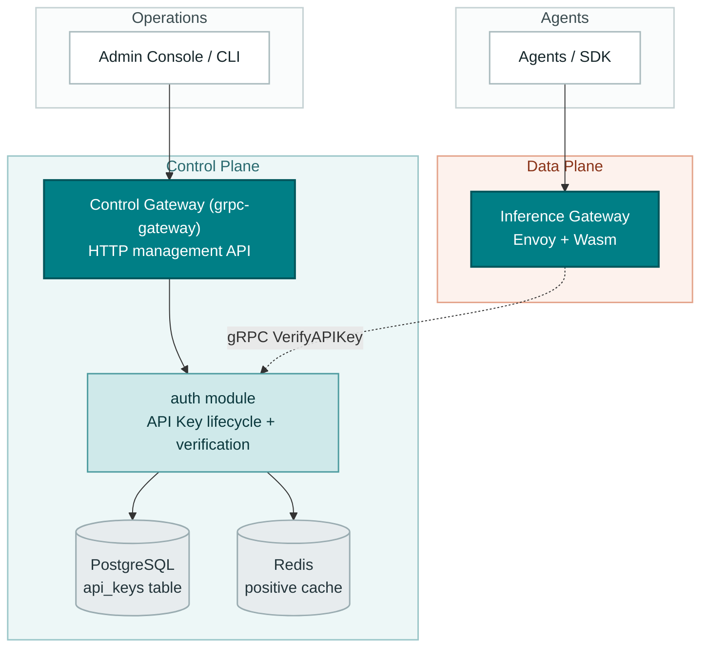
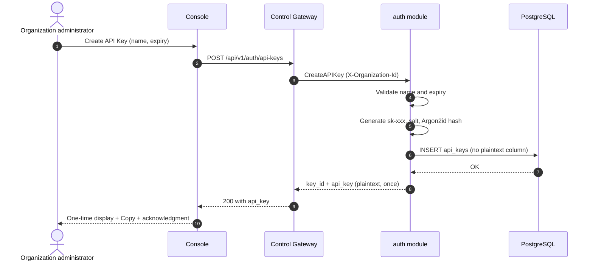
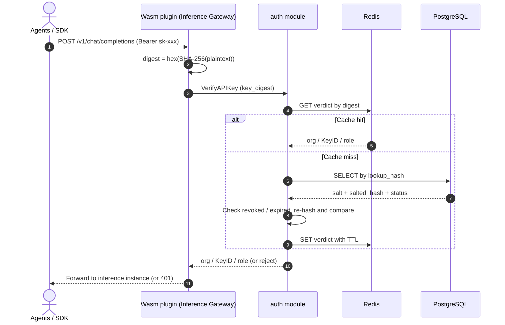
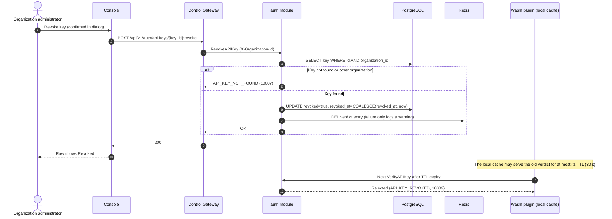

# API Key Management — Architecture and Detailed Design

| Attribute | Content |
| --- | --- |
| Feature point | API Key lifecycle management (create / list / revoke / verify, salted-hash storage) |
| Document scope | Architecture and detailed design for the `auth` module's API Key management capability: component responsibilities, data model, API contract, key flows, error handling, configuration, security, rollout, and function-level design per layer |
| Owning module | `auth` (control plane, served through the Control Gateway; verified by the data-plane Inference Gateway) |
| Related documents | [Requirement Analysis and UI/UX Design](../design/api-key-management.md) · [Architecture Design](../design/architecture.md) Section 2.1 (`auth` responsibilities) and Section 3.3 (the Inference Gateway's API Key authentication chain) |
| Status | Architecture complete, handed to the Developer agent |

---

## 1. Goals and Non-Goals

### 1.1 Goals

- Implement the four `taas.auth.v1.AuthService` RPCs for API Key management: `CreateAPIKey`, `ListAPIKeys`, `RevokeAPIKey` (HTTP via the Control Gateway) and `VerifyAPIKey` (gRPC only, for the data-plane Wasm plugin).
- Store keys with salted, memory-hard hashes only: per-key random salt + Argon2id, no plaintext column, no plaintext in logs or caches.
- One-time secret reveal: the plaintext key appears only in the creation response, in the `sk-<43 base62 chars>` format.
- Masked, paginated, organization-scoped listing with lazy expiry status.
- Idempotent soft revocation with cache invalidation, and a propagation bound on the data plane of at most 30 seconds.
- Optional `expires_at` with expiry behaving exactly like revocation, evaluated lazily without background jobs.
- Configuration and schema changes needed to ship the above, with function-level responsibilities precise enough to implement without guessing.

### 1.2 Non-Goals

| Item | Deferred to |
| --- | --- |
| Per-key permission scoping (model allowlist, IP whitelist) | Feature #6 multi-tenancy |
| Per-key usage statistics, cost attribution, last-used timestamp | Feature #4 metering & settlement |
| Session-derived caller identity (SSO, sessions, organization registry) | Feature #7 |
| The Wasm plugin itself (digest computation, local cache, fail-closed policy) | Data-plane track, already specified in [Architecture Design](../design/architecture.md) Section 3.3 |
| In-place secret rotation and un-revoke | Not planned — rotation is create-new + switch + revoke-old (design decision D5) |
| Negative caching of unknown keys (DoS hardening) | Follow-up hardening, see Section 12 |
| Mapping business error codes to HTTP statuses in the gateway | Platform-wide follow-up, see Section 12 |

---

## 2. Component View



| Component | Responsibility in this feature |
| --- | --- |
| Console | API Keys page, create dialog with one-time reveal and acknowledgment, revoke confirmation with the propagation warning |
| Control Gateway (`grpc-gateway`) | HTTP/JSON facade for Create / List / Revoke; passes the transitional `X-Organization-Id` header through to gRPC metadata |
| `auth` module (`services/auth`) | RPC implementations, key generation, salted hashing, organization scoping, positive cache, revocation and cache invalidation |
| `APIKeyRepository` (`services/auth`) | Persistence for `api_keys` on top of `pkg/database.BaseRepository`, organization-scoped queries, idempotent revoke |
| PostgreSQL | The `api_keys` table (salt + salted hash, no plaintext) |
| Redis | Positive cache keyed by the key digest, deleted at revoke time |
| Inference Gateway Wasm plugin | Computes the digest, calls `VerifyAPIKey`, keeps a 30 s local cache (specified in Architecture Section 3.3, not built by this feature) |
| Controller / message queue | **Not involved** — API Key management is pure control-plane state and drives no Kubernetes resources |

---

## 3. Data Model

### 3.1 The `api_keys` Table

| Column | PostgreSQL type | Constraints | Description |
| --- | --- | --- | --- |
| `id` | `uuid` | PRIMARY KEY | Server-generated UUID v4, exposed as `key_id` |
| `name` | `varchar(64)` | NOT NULL | Display name, 1–64 characters, duplicates allowed |
| `prefix` | `varchar(8)` | NOT NULL | First 8 characters of the plaintext key (e.g. `sk-a3f9k`) for masked display |
| `lookup_hash` | `varchar(64)` | NOT NULL, UNIQUE | Lowercase hex `SHA-256(plaintext)` — the verification lookup key and the cache-invalidation key |
| `salt` | `varchar(32)` | NOT NULL | Base64 of 16 fresh random bytes, one per key |
| `salted_hash` | `varchar(128)` | NOT NULL | Base64 of `Argon2id(key_digest, salt)` |
| `organization_id` | `varchar(64)` | NOT NULL, indexed | Owning organization (transitional plain string, foreign key deferred to #6/#7) |
| `created_at` | `timestamptz` | NOT NULL | Creation time (UTC) |
| `expires_at` | `timestamptz` | NULL | NULL = never expires |
| `revoked` | `boolean` | NOT NULL DEFAULT false | Soft revocation flag |
| `revoked_at` | `timestamptz` | NULL | First revocation time, preserved by idempotent re-revoke |

**No plaintext column exists** (FR6.1). The only place the plaintext ever appears is the `CreateAPIKey` response.

Design notes:

- `lookup_hash` is an architect-level addition to the UI/UX doc's column list (FR6.1). It is cryptographically necessary for two independent reasons: (1) verification must find the row from the presented credential, and per-key salts make the salted hash unusable as an index; (2) revocation must delete the Redis verdict entry, which is keyed by the digest. `SHA-256` of a ~256-bit random key is one-way and uncrackable, so the column leaks nothing usable.
- `prefix` is the first 8 characters of the full key including the `sk-` scheme (e.g. `sk-a3f9k`), displayed as `sk-a3f9k…`. This resolves the wording conflict between design decision D3 ("8 chars after `sk-`") and FR6.1/AC3 ("first 8 chars of the plaintext", "≤ 8 chars of the key") in favor of the acceptance criteria.
- `salted_hash` is computed over the **digest**, not the raw plaintext, because the verification path only ever receives the digest (Section 4.3). The per-key salt still guarantees that identical digests would hash differently.

### 3.2 Indexes

| Index | Definition | Purpose |
| --- | --- | --- |
| Primary key | `(id)` | Key identity |
| Unique | `(lookup_hash)` | Verification lookup, cache invalidation |
| Composite | `(organization_id, created_at DESC)` | Organization-scoped, newest-first paginated list |

### 3.3 Migration Notes

- The table is created by **GORM `AutoMigrate` at startup** through a new optional `Migrator` hook on the server framework (Section 10.6). Startup fails fast if migration fails.
- The GORM model is the **single source of truth** for the schema. No hand-written DDL is kept, which structurally avoids the two-descriptions drift problem (ORM model vs. SQL file).
- Evolution is additive-only (new columns, new indexes). Destructive changes require a dedicated migration design outside this feature.
- This is the platform's first business table; the `Migrator` hook established here is reused by later features.

---

## 4. API Design

### 4.1 RPC Surface

All management APIs belong to `taas.auth.v1.AuthService` (proto: `proto/taas/auth/v1/auth.proto`), served as HTTP through the Control Gateway. `VerifyAPIKey` is gRPC-only.

| RPC | HTTP | Purpose |
| --- | --- | --- |
| `CreateAPIKey` | `POST /api/v1/auth/api-keys` | Create a key; the response carries `api_key` (plaintext, once) + `key_id` |
| `ListAPIKeys` | `GET /api/v1/auth/api-keys` | Paginated list of the caller's organization's keys, masked summaries only |
| `RevokeAPIKey` | `POST /api/v1/auth/api-keys/{key_id}:revoke` | Idempotent soft revoke, ownership-checked |
| `VerifyAPIKey` | gRPC only (no HTTP mapping) | Data-plane verification for the Wasm plugin, backed by the Redis positive cache |

### 4.2 Proto Changes (All Backward Compatible)

1. `APIKeySummary`: add `int64 revoked_at = 7` — audit display (design doc contract constraint 2, "recommended addition").
2. `ListAPIKeysRequest`: add `bool active_only = 2` — the "active only" filter (FR2.3) must be server-side, because client-side filtering over server-side pagination is incorrect (a page may contain no active keys).
3. `VerifyAPIKeyRequest.key_digest` comment: pin the digest definition to "lowercase hex SHA-256 of the plaintext key". The current comment says "salted hash digest", which the gateway cannot compute (it holds no salt); the corrected comment prevents the Wasm implementer from guessing wrong.

After editing the proto, regenerate with `make pbgen` (which also refreshes the swagger used by the AC10 contract review).

### 4.3 The Key Digest Contract

```
key_digest = lowercase hex( SHA-256( plaintext_key ) )   // 64 characters
```

- The Wasm plugin computes the digest from the `Authorization: Bearer sk-xxx` header and sends only the digest. The plaintext key never leaves the gateway.
- `auth` looks the row up by `lookup_hash`, then re-computes `Argon2id(digest, salt)` and compares in constant time (FR6.3 — "the presented key" at the verification boundary is the digest).
- Rejected alternative: the gateway forwards the plaintext over internal gRPC so `auth` could hash the raw key. Rejected because it contradicts the existing contract comment, widens plaintext exposure to the internal network and the `auth` process memory, and buys nothing: the digest already carries the full ~256 bits of key entropy, so indexing by it is as safe as hashing the plaintext.

### 4.4 Wire Format: Pagination and Filtering

Two corrections to the UI/UX doc's examples, both verified against grpc-gateway v2.30.0 generated code:

- **Pagination binds as `?page.offset=0&page.limit=20`** (dotted, nested-field form). Bare `?offset=0&limit=20` is **silently ignored** — unknown query parameters do not error. The console must use the dotted form.
- **Success responses are HTTP 200**, not 201. grpc-gateway renders unary RPC successes as 200 by default; the UI/UX doc's "201 with api_key" is corrected to 200.

Filtering: `?active_only=true` excludes revoked and expired keys server-side (`revoked = false AND (expires_at IS NULL OR expires_at > now)`).

### 4.5 Error Rendering on HTTP

Business errors travel as gRPC status errors whose code **is** the business code (see `pkg/grpcmiddleware`), and the gateway's error handler (delegating to `DefaultHTTPErrorHandler`) renders them as:

```
HTTP 500
{"code": 10007, "message": "API key not found"}
```

Out-of-range business codes (10001–10599) hit the default branch of the gRPC-to-HTTP status mapping, so **callers of the HTTP API must branch on the body `code`, not the HTTP status**. Mapping business codes to proper 4xx/5xx statuses is a platform-wide follow-up (Section 12), deliberately out of scope here.

---

## 5. Sequence Diagrams

### 5.1 Create with One-Time Reveal



### 5.2 Data-Plane Verification



### 5.3 Revoke with Cache Invalidation



Propagation bound: with the Redis entry deleted at revoke time, the worst case is the Wasm local cache TTL (30 s). If the Redis delete fails, the bound degrades to `auth.apiKeyCacheTTL` — which is why the shipped default is aligned to 30 s (Section 7).

---

## 6. Error Handling

All errors are `pkg/errors` business codes carried in the unified envelope. `VerifyAPIKey` rejections are turned into 401 by the Wasm plugin on the data plane; management-API errors render per Section 4.5.

| Condition | Code | Constant | Canonical message | Notes |
| --- | --- | --- | --- | --- |
| Missing or empty `X-Organization-Id` | 10001 | `CodeUnauthorized` | unauthorized | Transitional caller identity, Section 10.7 |
| `name` empty or longer than 64 chars | 10008 | `CodeAPIKeyInvalid` | API key invalid | Detail: "name must be 1-64 characters" |
| `expires_at` in the past | 10008 | `CodeAPIKeyInvalid` | API key invalid | Detail: "expires_at must be in the future" (FR1.5, AC7) |
| `key_id` empty on revoke | 10008 | `CodeAPIKeyInvalid` | API key invalid | |
| `key_digest` not 64 lowercase hex chars | 10008 | `CodeAPIKeyInvalid` | API key invalid | Empty digest stays `codes.InvalidArgument` (existing behavior) |
| Revoke: key not found or owned by another organization | 10007 | `CodeAPIKeyNotFound` | API key not found | No existence leak across organizations (FR3.3, AC6) |
| Verify: unknown digest | 10007 | `CodeAPIKeyNotFound` | API key not found | |
| Verify: key revoked | 10009 | `CodeAPIKeyRevoked` | API key revoked | |
| Verify: key expired | 10010 | `CodeAPIKeyExpired` | API key expired | Lazy check, no background job (FR4.1, AC7) |
| Verify: hash mismatch after lookup hit | 10008 | `CodeAPIKeyInvalid` | API key invalid | Integrity alert, log at error level |
| Database / Redis infrastructure failure | 500 | `CodeInternal` | internal error | Via error normalization; verification fails closed |

---

## 7. Configuration Additions

```yaml
auth:
  sessionTTL: 24h
  apiKeyCacheTTL: 30s          # was 60s, aligned to the propagation bound
  apiKeyHash:
    algorithm: argon2id        # argon2id (bcrypt reserved as fallback, not shipped)
    time: 1
    memoryMiB: 64
    parallelism: 1
  localPasswordLogin: true
  autoRegister: true
```

| Key | Default | Description |
| --- | --- | --- |
| `auth.apiKeyCacheTTL` | `30s` | TTL of the Redis positive cache. Default changed from 60 s to 30 s so that even the Redis-delete-failure path stays within the 30 s propagation bound disclosed by the revoke dialog (AC9). Operators overriding it must keep it ≤ the Wasm local cache TTL. |
| `auth.apiKeyHash.algorithm` | `argon2id` | KDF selector. Only `argon2id` ships; `bcrypt` is reserved for platforms without Argon2 support. |
| `auth.apiKeyHash.time` | `1` | Argon2id passes. |
| `auth.apiKeyHash.memoryMiB` | `64` | Argon2id memory in MiB. |
| `auth.apiKeyHash.parallelism` | `1` | Argon2id parallelism. |

Rules:

- The section ships in **both** `configs/config.yaml` and `configs/server.yaml` (every binary's config glob must see the same keys).
- Zero values fall back to the shipped defaults at the use site (upgrade-friendly for custom configs that predate the section); `Configuration.Validate` rejects **negative** values.
- Duration fields must be explicit durations (`30s`), never empty strings.
- Trade-off note: Argon2id at `t=1, m=64 MiB` costs tens of milliseconds per computation. It runs only on cache misses (creation and first verification after TTL expiry), so steady-state verification stays sub-millisecond through the two cache layers.

---

## 8. Security Considerations

- **Salted, memory-hard storage**: per-key 16-byte random salt + Argon2id over the digest. A database leak reveals nothing usable: `lookup_hash` is SHA-256 of a ~256-bit random key (inversion infeasible), and `salted_hash` is memory-hard even against lower-entropy inputs (defense in depth, US8).
- **One-time display**: the plaintext exists only in the `CreateAPIKey` response. No column, log, or cache carries it. Even with GORM debug SQL logging enabled, the INSERT statement contains no plaintext (the row never holds one). The gRPC access-log interceptor logs method names only.
- **Constant-time comparison**: verification re-computes `Argon2id(digest, salt)` and compares with `subtle.ConstantTimeCompare` (FR6.3).
- **Masked prefix exposure**: the list leaks only 5 random base62 characters beyond the public `sk-` scheme.
- **Cache contents**: Redis stores only the verdict `{organization_id, key_id, role}` keyed by digest, TTL-bounded, deleted at revoke time. The plaintext is never cached (FR5.3).
- **The transitional `X-Organization-Id` header is data partitioning, not authorization.** It is spoofable by design until session-derived identity lands in #7. The management API is effectively unauthenticated today (platform-wide status quo: `Login`/`CreateUser` are unimplemented); this feature does not widen that exposure, and the console is the only intended caller.
- **Fail-closed verification**: on database or Redis failure, `VerifyAPIKey` errors out and the Wasm plugin rejects the request (Architecture Section 3.3), so infrastructure faults never open the data plane.
- **No rate limiting on `VerifyAPIKey`** in this feature (gateway-side operations policy per Architecture Section 3.2); negative caching is a follow-up hardening option (Section 12).

---

## 9. Rollout Notes

- **Schema**: `api_keys` is created by AutoMigrate on first start. Additive only; there is no existing data to migrate.
- **Configuration**: the `auth.apiKeyHash` section and the `apiKeyCacheTTL` default change ship in `configs/config.yaml` and `configs/server.yaml`. Custom configs without `apiKeyHash` keep working (zero values default at the use site).
- **Proto**: three backward-compatible deltas (Section 4.2); regenerate with `make pbgen`. The refreshed swagger is the input for the AC10 contract review (`api_key` appears only in the creation response).
- **Framework fixes**: the components-shell fix and the gateway header matcher (Section 10.6) are inert until services use them, so the rollout is a single rolling update of `taas-server`. No feature flag is needed: the RPCs are new and no existing behavior changes.
- **Transitional header removal**: `X-Organization-Id` is removed in #7 when the organization is derived from the session. The proto never carries organization in management requests, so no contract break occurs at that point.
- **Operational disclosure**: the revoke dialog's "at most 30 seconds" statement (AC9) is backed by the 30 s Wasm local cache TTL and the aligned 30 s Redis TTL.

---

## 10. Detailed Design

### 10.1 File Layout (all under `services/auth`)

| File | Contents |
| --- | --- |
| `apikey_model.go` | GORM model `APIKey` + `TableName` |
| `apikey_crypto.go` | Key generation, digest, salt, Argon2id hash/verify |
| `apikey_repository.go` | `APIKeyRepository` |
| `apikey_cache.go` | Positive cache interface, Redis implementation, in-memory fake |
| `service.go` | RPC implementations + `resolveOrganizationID` |

### 10.2 Crypto Helpers (`apikey_crypto.go`)

- `const apiKeyScheme = "sk-"`, `const apiKeySecretLength = 43`, base62 alphabet `[0-9A-Za-z]`.
- `GenerateAPIKey() (plaintext string, err error)` — 43 uniform base62 characters from `crypto/rand` via per-character rejection sampling, returned as `sk-` + 43 chars. Satisfies AC1 (`^sk-[A-Za-z0-9]{43}$`, ~256 bits of entropy, uniqueness by construction).
- `KeyDigest(plaintext string) string` — `hex.EncodeToString(sha256(...))`, lowercase, 64 chars. **This is the contract shared with the Wasm plugin** (Section 4.3).
- `NewSalt() (string, error)` — 16 `crypto/rand` bytes, base64 standard encoding.
- `HashKey(digest, salt string, p Argon2Params) string` — `argon2.IDKey([]byte(digest), saltBytes, p.Time, p.MemoryMiB<<20, p.Parallelism)`, base64-encoded. The Argon2id input is the 64-char hex digest string's bytes (pinned to avoid a decode-step mismatch).
- `VerifyKeyHash(digest, salt, expected string, p Argon2Params) bool` — recompute, then `subtle.ConstantTimeCompare`.

### 10.3 Repository (`apikey_repository.go`)

Model (single source of truth for the schema, Section 3.3):

```go
type APIKey struct {
    ID             string     `gorm:"primaryKey;type:uuid"`
    Name           string     `gorm:"size:64;not null"`
    Prefix         string     `gorm:"size:8;not null"`
    LookupHash     string     `gorm:"size:64;not null;uniqueIndex"`
    Salt           string     `gorm:"size:32;not null"`
    SaltedHash     string     `gorm:"size:128;not null"`
    OrganizationID string     `gorm:"size:64;not null;index:idx_api_keys_org_created,priority:1"`
    CreatedAt      time.Time  `gorm:"index:idx_api_keys_org_created,priority:2,sort:DESC"`
    ExpiresAt      *time.Time
    Revoked        bool       `gorm:"not null;default:false"`
    RevokedAt      *time.Time
}

func (APIKey) TableName() string { return "api_keys" }
```

`APIKeyRepository` embeds `database.BaseRepository[APIKey]` (all reads/writes join an open transaction via the context):

- `ListByOrganization(ctx, orgID string, offset, limit int, activeOnly bool, now time.Time) ([]*APIKey, int64, error)` — `Paginate` with `organization_id = ?`, plus (when `activeOnly`) `revoked = false AND (expires_at IS NULL OR expires_at > ?)`, ordered `created_at DESC, id DESC` (id tie-break for stable pagination).
- `FindByLookupHash(ctx, digest string) (*APIKey, error)` — `First` on `lookup_hash = ?`; maps `gorm.ErrRecordNotFound` to `errors.New(CodeAPIKeyNotFound)`.
- `RevokeByIDAndOrganization(ctx, orgID, keyID string, now time.Time) (lookupHash string, err error)` — inside `WithinTx`: SELECT the row `WHERE id = ? AND organization_id = ?` (miss → `CodeAPIKeyNotFound`, no cross-org existence leak), then `UpdateFields` with `revoked = true` and `revoked_at = COALESCE(revoked_at, now)` (gorm.Expr). Returns the row's `lookup_hash` for cache invalidation. Idempotent: re-revoking succeeds and **preserves the first `revoked_at`**.

### 10.4 Positive Cache (`apikey_cache.go`)

- `type keyVerdict struct { OrganizationID, KeyID, Role string }` (JSON-serialized).
- `cacheKey(digest) = "taas:auth:apikey:" + digest`.
- Interface `verdictCache { Get(ctx, digest) (*keyVerdict, error); Set(ctx, digest, *keyVerdict, ttl) error; Delete(ctx, digest) error }`.
- `redisVerdictCache` — wraps `*goredis.Client` (type-asserted from `Components().Redis().Client()`), TTL from `cfg.Auth.APIKeyCacheTTL`.
- `fakeVerdictCache` — in-memory map for unit tests (no new test dependency).
- Only positive verdicts are cached in v1; negative caching of unknown keys is deferred (Section 12).

### 10.5 Service RPCs (`service.go`)

`resolveOrganizationID(ctx) (string, error)` — reads `x-organization-id` from incoming gRPC metadata (set by the gateway from the `X-Organization-Id` header). Missing or empty → `CodeUnauthorized`. Transitional; replaced by session-derived identity in #7 (Section 10.7).

`CreateAPIKey(ctx, req)`:
1. `name := strings.TrimSpace(req.GetName())`; require 1–64 chars → else `CodeAPIKeyInvalid`.
2. Expiry: `req.GetExpiresAt() == 0` → nil; else must be strictly in the future → else `CodeAPIKeyInvalid` (AC7).
3. Resolve the organization (step 0).
4. `plaintext := GenerateAPIKey()`; `digest := KeyDigest(plaintext)`; `salt := NewSalt()`; `saltedHash := HashKey(digest, salt, params)`.
5. Insert via the repository: `ID: uuid.NewString()`, `Prefix: plaintext[:8]`, `LookupHash: digest`, `Salt`, `SaltedHash`, `OrganizationID`, `CreatedAt: now`, `ExpiresAt`, `Revoked: false`.
6. Respond `{api_key: plaintext, key_id: id}`. **Never log the plaintext** (AC2).

`ListAPIKeys(ctx, req)`:
1. Resolve the organization.
2. Normalize pagination: `offset = max(0, page.offset)`; `limit = 20` when unset or ≤ 0; capped at 100 (FR2.2).
3. `rows, total := repo.ListByOrganization(..., req.GetActiveOnly(), now)`.
4. Map to `APIKeySummary{key_id, name, prefix, created_at (unix), expires_at (unix, 0 = never), revoked, revoked_at (unix, 0 = never)}`. Never the secret or hash (AC3).

`RevokeAPIKey(ctx, req)`:
1. Resolve the organization; require a non-empty `key_id` → else `CodeAPIKeyInvalid`.
2. `lookupHash := repo.RevokeByIDAndOrganization(...)` — not found / cross-org → `CodeAPIKeyNotFound`; already revoked → success (idempotent, AC6).
3. `cache.Delete(cacheKey(lookupHash))` — on error, log a warning and **do not fail the revoke**; the bound degrades to the Redis TTL (Section 5.3).
4. Respond OK.

`VerifyAPIKey(ctx, req)`:
1. `digest := req.GetKeyDigest()`; empty → `codes.InvalidArgument` (existing behavior); not matching `^[0-9a-f]{64}$` → `CodeAPIKeyInvalid`.
2. Cache `Get` by digest — hit → return the cached verdict.
3. Miss → `repo.FindByLookupHash` — unknown → `CodeAPIKeyNotFound`.
4. `row.Revoked` → `CodeAPIKeyRevoked`; `row.ExpiresAt != nil && now.After(*row.ExpiresAt)` → `CodeAPIKeyExpired` (lazy, no background job, AC7).
5. `VerifyKeyHash(digest, row.Salt, row.SaltedHash, params)` — mismatch → `CodeAPIKeyInvalid` + error-level log (integrity alert).
6. Cache the verdict `{row.OrganizationID, row.ID, Role: "agent"}` with the configured TTL; respond. `model` and `source_ip` are accepted but ignored in v1 (reserved for #6 authorization). `role` is the constant `"agent"` until roles exist (#6/#7).

### 10.6 Framework Touch Points

1. **Components shell** (`pkg/server/common_server.go`): `NewServer` must create the `components` shell (`s.components = &components{}`) and `Init` populates its fields. Today, services constructed with `srv.Components()` **before** `Init` — as `apps/taas-server/main.go` does — capture a non-nil interface wrapping a nil pointer that panics on first use. The fix keeps `main.go` unchanged; alternative (constructing services after `Init`) is rejected because `Init` attaches already-registered services.
2. **Gateway header matcher** (`pkg/server/common_server.go`): add `runtime.WithIncomingHeaderMatcher` to the gateway mux so `X-Organization-Id` passes through as `x-organization-id` metadata. Transitional; removed in #7.
3. **Migrator hook** (`pkg/server`): optional interface `Migrator { Migrate(ctx context.Context) error }`; `Init` invokes it for every registered service that implements it, right after components initialization; an error aborts startup. `auth` implements it with `AutoMigrate(&APIKey{})`. This follows the existing optional-interface pattern (`Collector`, `ServiceWithGateway`).
4. **Config** (`pkg/config/api.go`): `Argon2Params` struct (`algorithm`, `time`, `memoryMiB`, `parallelism`) on `AuthConfig`, plus `Validate` rules from Section 7.
5. **Proto**: the three deltas from Section 4.2, then `make pbgen`.

### 10.7 Organization Scoping (Transitional)

- **Phase 1 (this feature)**: the caller's organization comes from the `x-organization-id` gRPC metadata, set by the gateway from the `X-Organization-Id` HTTP header. Any non-empty value is accepted — there is no organization registry yet, so keys are partitioned by the string and a typo creates a phantom partition (accepted transitional risk, called out here).
- **Phase 2 (feature #7)**: the organization is derived from the verified session; the metadata path and the header matcher are removed.
- **Rationale**: the proto never carries organization in the management requests, so phase 2 is not a contract change. Adding organization fields to the requests now was rejected — it would be a breaking change later.

---

## 11. Acceptance Criteria Coverage

| AC | Addressed by | Verification hook |
| --- | --- | --- |
| AC1 — plaintext format and uniqueness | Section 10.2 `GenerateAPIKey`, Section 10.5 `CreateAPIKey` | Unit: format regex + uniqueness over N draws |
| AC2 — no plaintext in storage or logs | Section 3.1 (no plaintext column), Section 10.5 step 6, Section 8 | Unit: schema assertion + log scan |
| AC3 — masked list, pagination, total | Section 4.4, Section 10.3 `ListByOrganization`, Section 10.5 `ListAPIKeys` | FVT: `page.offset`/`page.limit` round-trip, `page_meta.total` |
| AC4 — created key verifies | Section 5.2, Section 10.5 `VerifyAPIKey` | FVT: create → verify returns org / KeyID / role |
| AC5 — revoke rejects and deletes cache entry | Section 5.3, Section 10.5 `RevokeAPIKey` | FVT with cache assertion (Redis DEL observed) |
| AC6 — idempotent revoke, cross-org not found | Section 10.3 `RevokeByIDAndOrganization` | Unit: re-revoke succeeds, cross-org → 10007 |
| AC7 — past expiry rejected at create, expiry rejects at verify | Section 10.5 steps 2 and 4 | Unit: no background job involved |
| AC8 — one-time display dialog, masked list | UI/UX doc Section 5 (console flows) | Manual / E2E |
| AC9 — propagation bound stated | Section 7 (`apiKeyCacheTTL: 30s`), Section 5.3 | Manual / E2E |
| AC10 — plaintext only in creation response | Section 4.2 (only `CreateAPIKeyResponse.api_key` carries it) | Contract review: grep generated swagger |

---

## 12. Deferred Items

| Item | Deferred to |
| --- | --- |
| Per-key permission scoping (model allowlist, IP whitelist) | Feature #6 |
| Per-key usage statistics and cost attribution | Feature #4 |
| Key last-used timestamp (gateway feedback loop) | Feature #4 |
| Immediate-revocation cache-invalidation broadcast | Architecture decision; default remains TTL-bound propagation |
| Session-derived organization identity (removes `X-Organization-Id`) | Feature #7 |
| Negative caching of unknown keys (bounds DB load on unknown-key floods) | Follow-up hardening |
| Business-code → HTTP status mapping in the gateway error handler | Platform-wide follow-up |
| `bcrypt` fallback KDF | Only if a target platform lacks Argon2 support |
