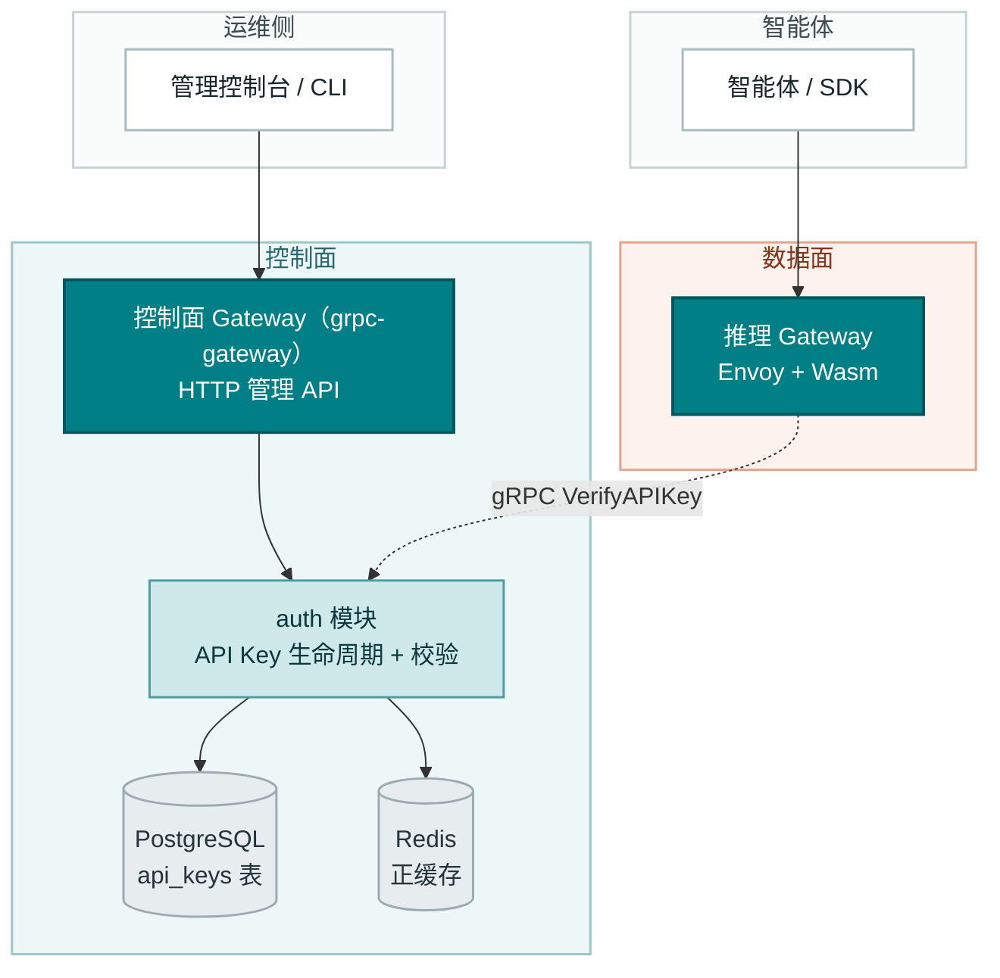
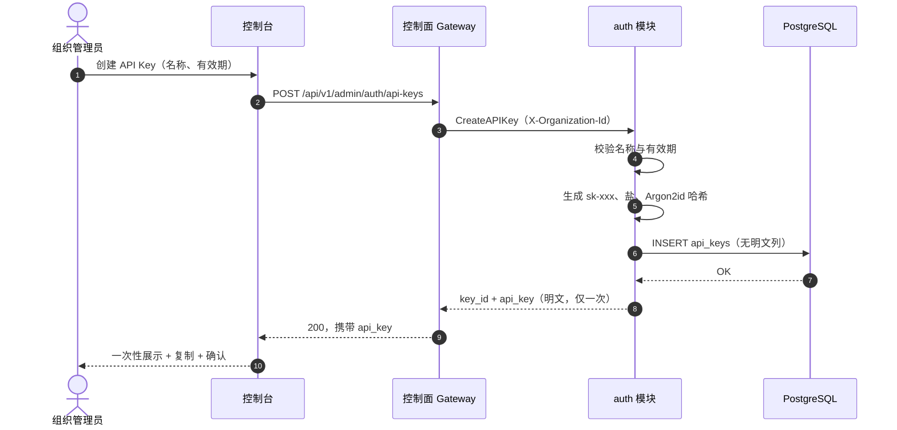
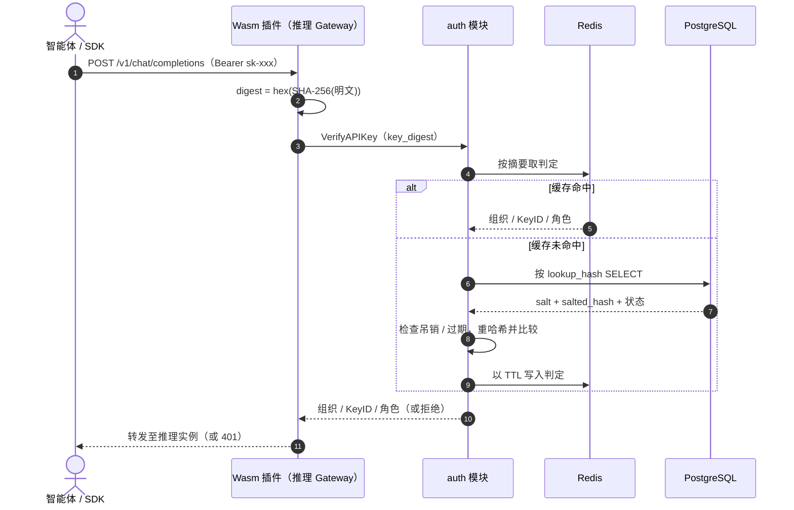
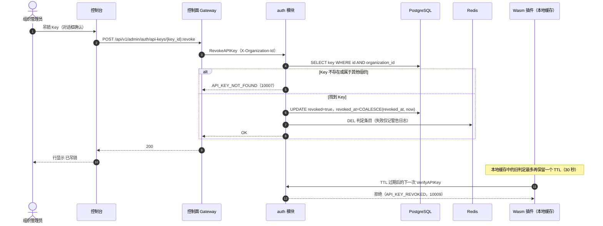

# API Key 管理 —— 架构与详细设计

| 属性 | 内容 |
| --- | --- |
| 特性点 | API Key 生命周期管理（创建 / 列表 / 吊销 / 校验，加盐哈希存储） |
| 文档范围 | `auth` 模块 API Key 管理能力的架构与详细设计：组件职责、数据模型、API 契约、关键流程、错误处理、配置、安全、发布与分层函数级设计 |
| 归属模块 | `auth`（控制面，经控制面 Gateway 对外服务，由数据面推理 Gateway 调用校验） |
| 相关文档 | [需求分析与 UI/UX 设计](../design/api-key-management.zh-cn.md) · [架构设计文档](../design/architecture.zh-cn.md) 第 2.1 节（`auth` 职责）、第 3.3 节（推理 Gateway 的 API Key 鉴权调用链） |
| 状态 | 架构完成，已移交 Developer agent |

---

## 1. 目标与非目标

### 1.1 目标

- 实现 `taas.auth.v1.AuthService` 的四个 API Key 管理 RPC：`CreateAPIKey`、`ListAPIKeys`、`RevokeAPIKey`（经控制面 Gateway 以 HTTP 暴露）与 `VerifyAPIKey`（仅 gRPC，供数据面 Wasm 插件调用）。
- 只以加盐的内存困难哈希存储 Key：每 Key 独立随机盐 + Argon2id，无明文列，明文不进日志与缓存。
- 一次性密钥展示：明文 Key 仅出现在创建响应中，格式为 `sk-<43 位 base62 字符>`。
- 掩码、分页、按组织圈定的列表，过期状态惰性计算。
- 幂等的软吊销并失效缓存，数据面传播上界不超过 30 秒。
- 可选 `expires_at`，过期行为与吊销完全一致，惰性判定，无需后台任务。
- 补齐交付所需的配置与 schema 变更，并给出精确到函数级的分层职责，使实现无需猜测。

### 1.2 非目标

| 事项 | 延期至 |
| --- | --- |
| 按 Key 的权限圈定（模型白名单、IP 白名单） | 特性 #6 多租户 |
| 按 Key 的用量统计、成本归集、最近使用时间 | 特性 #4 计量与结算 |
| 会话派生的调用方身份（SSO、会话、组织注册表） | 特性 #7 |
| Wasm 插件本身（摘要计算、本地缓存、fail-closed 策略） | 数据面专项，已在[架构设计文档](../design/architecture.zh-cn.md)第 3.3 节定义 |
| 原地换密钥与恢复吊销 | 不规划——轮换 = 新建 + 切换 + 吊销旧 Key（设计决策 D5） |
| 负缓存（针对未知 Key 洪水的加固） | 后续加固，见第 12 节 |
| 网关侧业务错误码到 HTTP 状态码的映射 | 平台级后续事项，见第 12 节 |

---

## 2. 组件视图



| 组件 | 在本特性中的职责 |
| --- | --- |
| 控制台 | API Keys 页面、带一次性展示与确认的创建对话框、带传播警告的吊销确认 |
| 控制面 Gateway（`grpc-gateway`） | Create / List / Revoke 的 HTTP/JSON 门面，把过渡期 `X-Organization-Id` 头透传为 gRPC metadata |
| `auth` 模块（`services/auth`） | RPC 实现、Key 生成、加盐哈希、组织圈定、正缓存、吊销与缓存失效 |
| `APIKeyRepository`（`services/auth`） | 基于 `pkg/database.BaseRepository` 的 `api_keys` 持久化、按组织圈定的查询、幂等吊销 |
| PostgreSQL | `api_keys` 表（盐 + 加盐哈希，无明文） |
| Redis | 以 Key 摘要为键的正缓存（判定结果），吊销时删除 |
| 推理 Gateway Wasm 插件 | 计算摘要、调用 `VerifyAPIKey`、维护 30 秒本地缓存（架构文档第 3.3 节已定义，本特性不实现） |
| Controller / 消息队列 | **不参与**——API Key 管理是纯控制面状态，不驱动任何 Kubernetes 资源 |

---

## 3. 数据模型

### 3.1 `api_keys` 表

| 列 | PostgreSQL 类型 | 约束 | 说明 |
| --- | --- | --- | --- |
| `id` | `uuid` | PRIMARY KEY | 服务端生成的 UUID v4，对外即 `key_id` |
| `name` | `varchar(64)` | NOT NULL | 展示名，1–64 字符，允许重名 |
| `prefix` | `varchar(8)` | NOT NULL | 明文 Key 的前 8 个字符（如 `sk-a3f9k`），用于掩码展示 |
| `lookup_hash` | `varchar(64)` | NOT NULL, UNIQUE | 小写十六进制 `SHA-256(明文)`——校验查找键与缓存失效键 |
| `salt` | `varchar(32)` | NOT NULL | 16 字节新鲜随机数的 base64，每 Key 独立 |
| `salted_hash` | `varchar(128)` | NOT NULL | `Argon2id(key_digest, salt)` 的 base64 |
| `organization_id` | `varchar(64)` | NOT NULL, 建索引 | 归属组织（过渡期为纯字符串，外键推迟到 #6/#7） |
| `created_at` | `timestamptz` | NOT NULL | 创建时间（UTC） |
| `expires_at` | `timestamptz` | NULL | NULL = 永不过期 |
| `revoked` | `boolean` | NOT NULL DEFAULT false | 软吊销标记 |
| `revoked_at` | `timestamptz` | NULL | 首次吊销时间，幂等重复吊销时保留 |

**不存在明文列**（FR6.1）。明文唯一出现的场所是 `CreateAPIKey` 响应。

设计说明：

- `lookup_hash` 是架构层在 UI/UX 文档列清单（FR6.1）之上的必要补充，有两个独立理由：(1) 校验必须能从呈上的凭据定位到行，而每 Key 独立的盐使加盐哈希无法充当索引；(2) 吊销必须删除以摘要为键的 Redis 判定条目。约 256 位随机 Key 的 `SHA-256` 是单向且不可破解的，该列不泄露任何可用信息。
- `prefix` 是完整 Key（含 `sk-` 前缀）的前 8 个字符（如 `sk-a3f9k`），展示为 `sk-a3f9k…`。以此裁决设计决策 D3（「`sk-` 后 8 位」）与 FR6.1/AC3（「明文前 8 位」「≤ 8 位」）的措辞冲突，以验收标准为准。
- `salted_hash` 对**摘要**而非原始明文计算，因为校验路径只收到摘要（第 4.3 节）。每 Key 独立的盐仍保证相同摘要也会哈希出不同结果。

### 3.2 索引

| 索引 | 定义 | 用途 |
| --- | --- | --- |
| 主键 | `(id)` | Key 身份 |
| 唯一 | `(lookup_hash)` | 校验查找、缓存失效 |
| 复合 | `(organization_id, created_at DESC)` | 按组织圈定、创建时间倒序的分页列表 |

### 3.3 迁移说明

- 表由**启动时的 GORM `AutoMigrate`** 经服务框架新增的可选 `Migrator` 钩子创建（第 10.6 节）。迁移失败即启动失败（fail fast）。
- GORM 模型是 schema 的**唯一事实来源**。不维护手写 DDL，从结构上避免「两处描述漂移」问题（ORM 模型 vs. SQL 文件）。
- 演进只做增量（新列、新索引）。破坏性变更需本特性之外的专门迁移设计。
- 这是平台第一张业务表，此处建立的 `Migrator` 钩子由后续特性复用。

---

## 4. API 设计

### 4.1 RPC 面

所有管理 API 归属 `taas.auth.v1.AuthService`（proto：`proto/taas/auth/v1/auth.proto`），由控制面 Gateway 以 HTTP 暴露。`VerifyAPIKey` 仅限 gRPC。

| RPC | HTTP | 用途 |
| --- | --- | --- |
| `CreateAPIKey` | `POST /api/v1/admin/auth/api-keys` | 创建 Key，响应携带 `api_key`（明文，仅一次）+ `key_id` |
| `ListAPIKeys` | `GET /api/v1/admin/auth/api-keys` | 分页列出调用方组织的 Key，仅掩码摘要 |
| `RevokeAPIKey` | `POST /api/v1/admin/auth/api-keys/{key_id}:revoke` | 幂等软吊销，校验归属 |
| `VerifyAPIKey` | 仅 gRPC（无 HTTP 映射） | 供 Wasm 插件进行数据面校验，以 Redis 正缓存加速 |

### 4.2 Proto 变更（全部向后兼容）

1. `APIKeySummary`：新增 `int64 revoked_at = 7`——审计展示（设计文档契约约束 2 的「建议补充」）。
2. `ListAPIKeysRequest`：新增 `bool active_only = 2`——「只看生效 Key」过滤（FR2.3）必须在服务端完成，因为客户端过滤叠加服务端分页是错误的（某一页可能没有生效 Key）。
3. `VerifyAPIKeyRequest.key_digest` 注释：把摘要定义钉死为「明文 Key 的小写十六进制 SHA-256」。现有注释写的是「加盐哈希摘要」，而网关没有盐、算不出它，修正注释可避免 Wasm 实现者猜错。

修改 proto 后用 `make pbgen` 重新生成（同时刷新 AC10 契约评审所用的 swagger）。

### 4.3 Key 摘要契约

```text
key_digest = lowercase hex( SHA-256( plaintext_key ) )   // 64 个字符
```

- Wasm 插件从 `Authorization: Bearer sk-xxx` 头计算摘要，只发送摘要。明文 Key 永不离开网关。
- `auth` 按 `lookup_hash` 定位行，再重算 `Argon2id(digest, salt)` 并做常数时间比较（FR6.3——在校验边界上「呈上的 Key」即摘要）。
- 已否决的替代方案：网关经内部 gRPC 转发明文，让 `auth` 对原始 Key 做哈希。否决理由：与现有契约注释矛盾，把明文暴露面扩大到内部网络与 `auth` 进程内存，且毫无收益——摘要已携带 Key 的全部约 256 位熵，以它为索引与哈希明文同样安全。

### 4.4 传输格式：分页与过滤

对 UI/UX 文档示例的两处修正，均已对照 grpc-gateway v2.30.0 生成代码实测验证：

- **分页以 `?page.offset=0&page.limit=20`（点号嵌套字段形式）绑定**。裸的 `?offset=0&limit=20` 会被**静默忽略**——未知查询参数不报错。控制台必须使用点号形式。
- **成功响应是 HTTP 200**，不是 201。grpc-gateway 默认把一元 RPC 成功渲染为 200，UI/UX 文档的「201 with api_key」修正为 200。

过滤：`?active_only=true` 在服务端排除已吊销与已过期的 Key（`revoked = false AND (expires_at IS NULL OR expires_at > now)`）。

### 4.5 HTTP 上的错误渲染

业务错误以 gRPC status error 传输，其 code **就是**业务码（见 `pkg/grpcmiddleware`），网关错误处理器（委托 `DefaultHTTPErrorHandler`）渲染为：

```text
HTTP 500
{"code": 10007, "message": "API key not found"}
```

超范围的业务码（10001–10599）落入 gRPC 到 HTTP 状态映射的 default 分支，因此 **HTTP API 的调用方必须依据响应体 `code` 分支，而不是 HTTP 状态码**。把业务码映射为正确的 4xx/5xx 是平台级后续事项（第 12 节），此处刻意不纳入范围。

---

## 5. 时序图

### 5.1 创建与一次性展示



### 5.2 数据面校验



### 5.3 吊销与缓存失效



传播上界：吊销时 Redis 条目即被删除，最坏情况是 Wasm 本地缓存 TTL（30 秒）。若 Redis 删除失败，上界退化为 `auth.apiKeyCacheTTL`——这正是 shipped 默认值对齐到 30 秒的原因（第 7 节）。

---

## 6. 错误处理

所有错误都是 `pkg/errors` 业务码，走统一信封。`VerifyAPIKey` 的拒绝由 Wasm 插件在数据面转成 401，管理 API 的错误按第 4.5 节渲染。

| 条件 | 码 | 常量 | 标准消息 | 说明 |
| --- | --- | --- | --- | --- |
| `X-Organization-Id` 缺失或为空 | 10001 | `CodeUnauthorized` | unauthorized | 过渡期调用方身份，第 10.7 节 |
| `name` 为空或超过 64 字符 | 10008 | `CodeAPIKeyInvalid` | API key invalid | 细节：「name must be 1-64 characters」 |
| `expires_at` 在过去 | 10008 | `CodeAPIKeyInvalid` | API key invalid | 细节：「expires_at must be in the future」（FR1.5、AC7） |
| 吊销时 `key_id` 为空 | 10008 | `CodeAPIKeyInvalid` | API key invalid | |
| `key_digest` 不是 64 位小写十六进制 | 10008 | `CodeAPIKeyInvalid` | API key invalid | 空摘要保持 `codes.InvalidArgument`（既有行为） |
| 吊销：Key 不存在或属其他组织 | 10007 | `CodeAPIKeyNotFound` | API key not found | 不跨组织泄露存在性（FR3.3、AC6） |
| 校验：未知摘要 | 10007 | `CodeAPIKeyNotFound` | API key not found | |
| 校验：Key 已吊销 | 10009 | `CodeAPIKeyRevoked` | API key revoked | |
| 校验：Key 已过期 | 10010 | `CodeAPIKeyExpired` | API key expired | 惰性判定，无后台任务（FR4.1、AC7） |
| 校验：命中行后哈希不匹配 | 10008 | `CodeAPIKeyInvalid` | API key invalid | 完整性告警，error 级日志 |
| 数据库 / Redis 基础设施故障 | 500 | `CodeInternal` | internal error | 经错误归一化处理，校验 fail-closed |

---

## 7. 配置新增

```yaml
auth:
  sessionTTL: 24h
  apiKeyCacheTTL: 30s          # 原 60s，对齐传播上界
  apiKeyHash:
    algorithm: argon2id        # argon2id（bcrypt 仅作预留回退，不交付）
    time: 1
    memoryMiB: 64
    parallelism: 1
  localPasswordLogin: true
  autoRegister: true
```

| 键 | 默认值 | 说明 |
| --- | --- | --- |
| `auth.apiKeyCacheTTL` | `30s` | Redis 正缓存的 TTL。默认值由 60 秒改为 30 秒，使「Redis 删除失败」路径也落在吊销对话框披露的 30 秒传播上界内（AC9）。运维覆盖该值时必须保持 ≤ Wasm 本地缓存 TTL。 |
| `auth.apiKeyHash.algorithm` | `argon2id` | KDF 选择器。仅交付 `argon2id`，`bcrypt` 为无 Argon2 支持的平台预留。 |
| `auth.apiKeyHash.time` | `1` | Argon2id 迭代次数。 |
| `auth.apiKeyHash.memoryMiB` | `64` | Argon2id 内存（MiB）。 |
| `auth.apiKeyHash.parallelism` | `1` | Argon2id 并行度。 |

规则：

- 该配置段同时写入 **`configs/config.yaml` 与 `configs/server.yaml`**（每个二进制的配置 glob 必须看到相同的键）。
- 零值在使用点回退到 shipped 默认值（对先于该配置段存在的自定义配置是升级友好的），`Configuration.Validate` 拒绝**负值**。
- Duration 字段必须是显式时长（`30s`），绝不能是空字符串。
- 权衡说明：`t=1, m=64 MiB` 的 Argon2id 每次计算耗时数十毫秒。它只在缓存未命中时运行（创建与 TTL 过期后的首次校验），稳态校验经两层缓存仍保持亚毫秒。

---

## 8. 安全考量

- **加盐、内存困难存储**：每 Key 16 字节随机盐 + 对摘要的 Argon2id。数据库泄露无法还原可用信息：`lookup_hash` 是约 256 位随机 Key 的 SHA-256（求逆不可行），`salted_hash` 即使面对低熵输入也有内存困难性兜底（纵深防御，US8）。
- **一次性展示**：明文只存在于 `CreateAPIKey` 响应。没有任何列、日志或缓存携带它。即使开启 GORM debug SQL 日志，INSERT 语句也不含明文（行内根本没有明文）。gRPC 访问日志拦截器只记录方法名。
- **常数时间比较**：校验重算 `Argon2id(digest, salt)` 后用 `subtle.ConstantTimeCompare` 比较（FR6.3）。
- **掩码前缀暴露**：列表只泄露公开 `sk-` 前缀之外的 5 个随机 base62 字符。
- **缓存内容**：Redis 只存以摘要为键的判定 `{organization_id, key_id, role}`，受 TTL 约束，吊销时删除。明文永不缓存（FR5.3）。
- **过渡期 `X-Organization-Id` 头是数据分区，不是授权**。在 #7 的会话派生身份落地前，它按设计即可伪造。管理 API 今天实际上未鉴权（平台现状：`Login`/`CreateUser` 未实现），本特性不扩大该暴露面，且控制台是唯一预期调用方。
- **fail-closed 校验**：数据库或 Redis 故障时 `VerifyAPIKey` 报错，Wasm 插件拒绝请求（架构文档第 3.3 节），基础设施故障绝不会放开数据面。
- **本特性不对 `VerifyAPIKey` 做限流**（按架构文档第 3.2 节属网关侧运维策略），负缓存是后续加固选项（第 12 节）。

---

## 9. 发布说明

- **Schema**：`api_keys` 由首次启动时的 AutoMigrate 创建。只做增量，没有存量数据需要迁移。
- **配置**：`auth.apiKeyHash` 配置段与 `apiKeyCacheTTL` 默认值变更随 `configs/config.yaml` 与 `configs/server.yaml` 交付。没有 `apiKeyHash` 的自定义配置继续可用（零值在使用点取默认）。
- **Proto**：三处向后兼容增量（第 4.2 节），用 `make pbgen` 重新生成。刷新后的 swagger 是 AC10 契约评审的输入（`api_key` 仅出现在创建响应中）。
- **框架修复**：components 外壳修复与网关 header matcher（第 10.6 节）在被服务使用前是惰性的，因此发布就是 `taas-server` 的一次滚动更新。无需特性开关：RPC 全是新增，没有任何既有行为变化。
- **移除过渡期头**：`X-Organization-Id` 在 #7 组织改为会话派生时移除。管理请求的 proto 从不携带组织字段，届时不构成契约破坏。
- **运维披露**：吊销对话框的「最迟 30 秒」表述（AC9）由 30 秒 Wasm 本地缓存 TTL 与对齐后的 30 秒 Redis TTL 支撑。

---

## 10. 详细设计

### 10.1 文件布局（全部在 `services/auth` 下）

| 文件 | 内容 |
| --- | --- |
| `apikey_model.go` | GORM 模型 `APIKey` + `TableName` |
| `apikey_crypto.go` | Key 生成、摘要、盐、Argon2id 哈希/校验 |
| `apikey_repository.go` | `APIKeyRepository` |
| `apikey_cache.go` | 正缓存接口、Redis 实现、内存 fake |
| `service.go` | RPC 实现 + `resolveOrganizationID` |

### 10.2 加密辅助函数（`apikey_crypto.go`）

- `const apiKeyScheme = "sk-"`、`const apiKeySecretLength = 43`、base62 字母表 `[0-9A-Za-z]`。
- `GenerateAPIKey() (plaintext string, err error)`——用 `crypto/rand` 经逐字符拒绝采样生成 43 个均匀 base62 字符，返回 `sk-` + 43 字符。满足 AC1（`^sk-[A-Za-z0-9]{43}$`，约 256 位熵，构造上唯一）。
- `KeyDigest(plaintext string) string`——`hex.EncodeToString(sha256(...))`，小写，64 字符。**这是与 Wasm 插件共享的契约**（第 4.3 节）。
- `NewSalt() (string, error)`——16 个 `crypto/rand` 字节，标准 base64。
- `HashKey(digest, salt string, p Argon2Params) string`——`argon2.IDKey([]byte(digest), saltBytes, p.Time, p.MemoryMiB*1024, p.Parallelism)`，先将 MiB 转换为该库要求的 KiB 单位，再对结果进行 base64 编码。Argon2id 的输入钉死为 64 字符十六进制摘要字符串的字节（避免解码步骤不一致）。
- `VerifyKeyHash(digest, salt, expected string, p Argon2Params) bool`——重算后 `subtle.ConstantTimeCompare`。

### 10.3 仓储（`apikey_repository.go`）

模型（schema 的唯一事实来源，第 3.3 节）：

```go
type APIKey struct {
    ID             string     `gorm:"primaryKey;type:uuid"`
    Name           string     `gorm:"size:64;not null"`
    Prefix         string     `gorm:"size:8;not null"`
    LookupHash     string     `gorm:"size:64;not null;uniqueIndex"`
    Salt           string     `gorm:"size:32;not null"`
    SaltedHash     string     `gorm:"size:128;not null"`
    OrganizationID string     `gorm:"size:64;not null;index:idx_api_keys_org_created,priority:1"`
    CreatedAt      time.Time  `gorm:"index:idx_api_keys_org_created,priority:2,sort:DESC"`
    ExpiresAt      *time.Time
    Revoked        bool       `gorm:"not null;default:false"`
    RevokedAt      *time.Time
}

func (APIKey) TableName() string { return "api_keys" }
```

`APIKeyRepository` 内嵌 `database.BaseRepository[APIKey]`（所有读写经 context 自动加入打开的事务）：

- `ListByOrganization(ctx, orgID string, offset, limit int, activeOnly bool, now time.Time) ([]*APIKey, int64, error)`——`Paginate`，条件 `organization_id = ?`，`activeOnly` 时追加 `revoked = false AND (expires_at IS NULL OR expires_at > ?)`，排序 `created_at DESC, id DESC`（id 决胜保证分页稳定）。
- `FindByLookupHash(ctx, digest string) (*APIKey, error)`——按 `lookup_hash = ?` `First`，把 `gorm.ErrRecordNotFound` 映射为 `errors.New(CodeAPIKeyNotFound)`。
- `RevokeByIDAndOrganization(ctx, orgID, keyID string, now time.Time) (lookupHash string, err error)`——在 `WithinTx` 内：先 `WHERE id = ? AND organization_id = ?` SELECT（未命中 → `CodeAPIKeyNotFound`，不跨组织泄露存在性），再 `UpdateFields` 置 `revoked = true` 与 `revoked_at = COALESCE(revoked_at, now)`（gorm.Expr）。返回该行的 `lookup_hash` 供缓存失效。幂等：重复吊销成功且**保留首次 `revoked_at`**。

### 10.4 正缓存（`apikey_cache.go`）

- `type keyVerdict struct { OrganizationID, KeyID, Role string }`（JSON 序列化）。
- `cacheKey(digest) = "taas:auth:apikey:" + digest`。
- 接口 `verdictCache { Get(ctx, digest) (*keyVerdict, error); Set(ctx, digest, *keyVerdict, ttl) error; Delete(ctx, digest) error }`。
- `redisVerdictCache`——包装 `*goredis.Client`（从 `Components().Redis().Client()` 类型断言得到），TTL 取 `cfg.Auth.APIKeyCacheTTL`。
- `fakeVerdictCache`——供单元测试的内存 map（不引入新测试依赖）。
- v1 只缓存正面判定，未知 Key 的负缓存延期（第 12 节）。

### 10.5 服务 RPC（`service.go`）

`resolveOrganizationID(ctx) (string, error)`——从 incoming gRPC metadata 读取 `x-organization-id`（由网关从 `X-Organization-Id` 头设置）。缺失或为空 → `CodeUnauthorized`。过渡期方案，#7 由会话派生身份取代（第 10.7 节）。

`CreateAPIKey(ctx, req)`：

1. `name := strings.TrimSpace(req.GetName())`，要求 1–64 字符，否则 `CodeAPIKeyInvalid`。
2. 有效期：`req.GetExpiresAt() == 0` → nil，否则必须严格在未来，否则 `CodeAPIKeyInvalid`（AC7）。
3. 解析组织（步骤 0）。
4. `plaintext := GenerateAPIKey()`，`digest := KeyDigest(plaintext)`，`salt := NewSalt()`，`saltedHash := HashKey(digest, salt, params)`。
5. 经仓储插入：`ID: uuid.NewString()`、`Prefix: plaintext[:8]`、`LookupHash: digest`、`Salt`、`SaltedHash`、`OrganizationID`、`CreatedAt: now`、`ExpiresAt`、`Revoked: false`。
6. 响应 `{api_key: plaintext, key_id: id}`。**绝不记录明文日志**（AC2）。

`ListAPIKeys(ctx, req)`：

1. 解析组织。
2. 归一化分页：`offset = max(0, page.offset)`，`limit` 未设置或 ≤ 0 时取 20，上限 100（FR2.2）。
3. `rows, total := repo.ListByOrganization(..., req.GetActiveOnly(), now)`。
4. 映射为 `APIKeySummary{key_id, name, prefix, created_at (unix), expires_at (unix, 0 = 永不), revoked, revoked_at (unix, 0 = 永不)}`。绝不含密钥或哈希（AC3）。

`RevokeAPIKey(ctx, req)`：

1. 解析组织，要求 `key_id` 非空，否则 `CodeAPIKeyInvalid`。
2. `lookupHash := repo.RevokeByIDAndOrganization(...)`——不存在 / 跨组织 → `CodeAPIKeyNotFound`，已吊销 → 成功（幂等，AC6）。
3. `cache.Delete(cacheKey(lookupHash))`——出错时记警告且**不让吊销失败**，上界退化为 Redis TTL（第 5.3 节）。
4. 响应 OK。

`VerifyAPIKey(ctx, req)`：

1. `digest := req.GetKeyDigest()`，为空 → `codes.InvalidArgument`（既有行为），不匹配 `^[0-9a-f]{64}$` → `CodeAPIKeyInvalid`。
2. 按摘要 `Get` 缓存——命中 → 返回缓存判定。
3. 未命中 → `repo.FindByLookupHash`——未知 → `CodeAPIKeyNotFound`。
4. `row.Revoked` → `CodeAPIKeyRevoked`，`row.ExpiresAt != nil && now.After(*row.ExpiresAt)` → `CodeAPIKeyExpired`（惰性，无后台任务，AC7）。
5. `VerifyKeyHash(digest, row.Salt, row.SaltedHash, params)`——不匹配 → `CodeAPIKeyInvalid` 并记 error 级日志（完整性告警）。
6. 以配置的 TTL 缓存判定 `{row.OrganizationID, row.ID, Role: "agent"}` 并响应。`model` 与 `source_ip` 在 v1 接受但忽略（为 #6 授权预留）。`role` 在角色体系出现前（#6/#7）为常量 `"agent"`。

### 10.6 框架触点

1. **components 外壳**（`pkg/server/common_server.go`）：`NewServer` 必须创建 `components` 外壳（`s.components = &components{}`），`Init` 再填充其字段。今天，像 `apps/taas-server/main.go` 那样在 `Init` **之前**用 `srv.Components()` 构造服务，捕获到的是包着 nil 指针的非空接口，首次使用即 panic。该修复使 `main.go` 保持不变，否决的替代方案（在 `Init` 之后构造服务）不可行，因为 `Init` 要挂接已注册的服务。
2. **网关 header matcher**（`pkg/server/common_server.go`）：给网关 mux 加 `runtime.WithIncomingHeaderMatcher`，使 `X-Organization-Id` 以 `x-organization-id` metadata 透传。过渡期方案，#7 移除。
3. **Migrator 钩子**（`pkg/server`）：可选接口 `Migrator { Migrate(ctx context.Context) error }`，`Init` 在 components 初始化之后对每个实现了该接口的已注册服务调用，出错即中止启动。`auth` 以 `AutoMigrate(&APIKey{})` 实现。沿用既有的可选接口模式（`Collector`、`ServiceWithGateway`）。
4. **配置**（`pkg/config/api.go`）：`AuthConfig` 上新增 `Argon2Params` 结构体（`algorithm`、`time`、`memoryMiB`、`parallelism`），并加第 7 节的 `Validate` 规则。
5. **Proto**：第 4.2 节的三处增量，随后 `make pbgen`。

### 10.7 组织圈定（过渡期）

- **阶段 1（本特性）**：调用方组织来自 `x-organization-id` gRPC metadata，由网关从 `X-Organization-Id` HTTP 头设置。任何非空值都被接受——组织注册表尚不存在，Key 按字符串分区，手误会创建幻影分区（此处明示接受的过渡期风险）。
- **阶段 2（特性 #7）**：组织由已验证的会话派生，metadata 路径与 header matcher 移除。
- **理由**：管理请求的 proto 从不携带组织字段，阶段 2 不构成契约变更。现在就往请求里加组织字段已被否决——那会在之后变成破坏性变更。

---

## 11. 验收标准覆盖

| AC | 落点 | 验证抓手 |
| --- | --- | --- |
| AC1——明文格式与唯一性 | 第 10.2 节 `GenerateAPIKey`、第 10.5 节 `CreateAPIKey` | 单元：格式正则 + N 次抽取唯一性 |
| AC2——存储与日志无明文 | 第 3.1 节（无明文列）、第 10.5 节步骤 6、第 8 节 | 单元：schema 断言 + 日志扫描 |
| AC3——掩码列表、分页、total | 第 4.4 节、第 10.3 节 `ListByOrganization`、第 10.5 节 `ListAPIKeys` | FVT：`page.offset`/`page.limit` 往返、`page_meta.total` |
| AC4——创建的 Key 可通过校验 | 第 5.2 节、第 10.5 节 `VerifyAPIKey` | FVT：创建 → 校验返回组织 / KeyID / 角色 |
| AC5——吊销后拒绝且删除缓存条目 | 第 5.3 节、第 10.5 节 `RevokeAPIKey` | FVT 含缓存断言（观察到 Redis DEL） |
| AC6——幂等吊销、跨组织未找到 | 第 10.3 节 `RevokeByIDAndOrganization` | 单元：重复吊销成功、跨组织 → 10007 |
| AC7——过去有效期创建被拒、到期校验被拒 | 第 10.5 节步骤 2 与步骤 4 | 单元：不涉及后台任务 |
| AC8——一次性展示对话框、掩码列表 | UI/UX 文档第 5 节（控制台流程） | 人工 / E2E |
| AC9——披露传播上界 | 第 7 节（`apiKeyCacheTTL: 30s`）、第 5.3 节 | 人工 / E2E |
| AC10——明文仅在创建响应 | 第 4.2 节（仅 `CreateAPIKeyResponse.api_key` 携带） | 契约评审：检索生成的 swagger |

---

## 12. 延期事项

| 事项 | 延期至 |
| --- | --- |
| 按 Key 的权限圈定（模型白名单、IP 白名单） | 特性 #6 |
| 按 Key 的用量统计与成本归集 | 特性 #4 |
| Key 最近使用时间（网关反馈链路） | 特性 #4 |
| 即时吊销的缓存失效广播 | 架构决策，默认仍为 TTL 上界传播 |
| 会话派生的组织身份（移除 `X-Organization-Id`） | 特性 #7 |
| 负缓存（约束未知 Key 洪水下的 DB 负载） | 后续加固 |
| 网关错误处理器的业务码 → HTTP 状态映射 | 平台级后续事项 |
| `bcrypt` 回退 KDF | 仅当目标平台缺乏 Argon2 支持时 |
