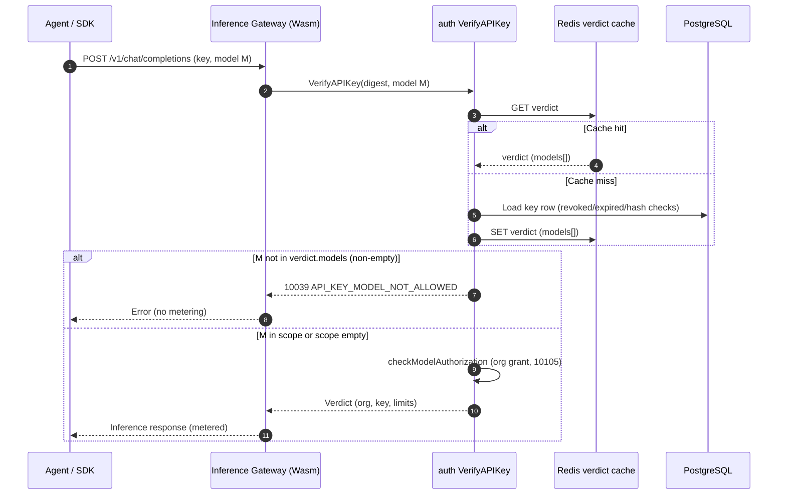

# API Key Model Scoping — Architecture and Detailed Design

| Attribute | Content |
| --- | --- |
| Feature point | Per-API-key model allow-lists enforced on the inference data plane (backlog row 46) |
| Document scope | Scope column and migration, key-management API surface, verdict-cache propagation, data-plane enforcement order, end-user console scope editing, admin read-only visibility, audit, errors, security, rollout, and implementation responsibilities |
| Owning modules | `auth` (scope storage, verdict cache, VerifyAPIKey enforcement, scope-edit RPC, audit); `model` (catalog existence check for write-time validation); `web/` (end-user keys page) |
| Related documents | [Requirement Analysis and UI/UX Design](../design/api-key-model-scoping.md) · [Architecture Design](../design/architecture.md) §2.2 (`auth`) and §3.2 (Inference Gateway) · [API Key Management](./api-key-management.md) — key lifecycle, salted-hash storage, revocation · [Per-tenant Model Authorization](./model-authorization.md) — the org-level gate this feature layers under · [Per-key Rate Limits & Org Spend Limits](./rate-limits-spend-limits.md) · [Console Surface Separation](./console-surface-separation.md) |
| Status | Architecture complete; handoff issued to Developer |

## 1. Goals and Non-Goals

### 1.1 Goals

- Let a tenant restrict one API key to an ordered allow-list of 0–50 catalog model IDs; an empty list means "all models the organization is granted" (today's behavior, unchanged).
- Set the scope at key creation and edit it any time before revocation, without rotating the key material.
- Enforce the scope in `VerifyAPIKey` on the data plane with a distinct business code (10039 `API_KEY_MODEL_NOT_ALLOWED`), before rate limiting, metering, and the org-level model authorization check.
- Carry the allow-list inside the cached key verdict so the data plane stays at one cache lookup; a scope edit deletes the key's cached verdict so the change propagates within the existing bound (≤ 30s default, immediate on cache delete).
- Expose scope editing only on the end-user surface (`/api/v1/auth/api-keys`); the deprecated admin key-list binding returns the scope read-only; no admin console page is added.
- Validate scope writes against the catalog (unknown model IDs rejected) and audit every scope change (`api_key.scope_updated`) with before/after lists.

### 1.2 Non-Goals

Per-key endpoint pinning, per-key pricing, key-scoped rate limits (row 11), project/group constructs, wildcard/pattern scopes, source-IP restrictions, auto-migration of stored scopes when an organization loses a model grant, and any admin-console key-management page are excluded. The org-level model authorization semantics (row 13) and the key lifecycle (row 1) do not change.

## 2. Architecture Decisions

| # | Decision | Rationale |
| --- | --- | --- |
| AD1 | The allow-list is a `models` jsonb string-array column on the existing `api_keys` row (`NOT NULL DEFAULT '[]'`), encoded/decoded as a JSON array of model IDs at the repository boundary — the same convention as `routing_policies.service_ids`. | One table, one row per key; no join for the hot path; additive `AutoMigrate`; empty array is the backward-compatible default. |
| AD2 | The allow-list travels in the `keyVerdict` JSON cached in Redis (`models` field). `VerifyAPIKey` enforces the scope from the verdict on both the cache-hit and cache-miss paths, immediately before `checkModelAuthorization`. | The cache-hit path never touches the DB today; putting the scope in the verdict keeps the data plane at one lookup and makes both paths enforce identically. |
| AD3 | Enforcement order is: key validity (revoked/expired/invalid) → key scope (10039) → org model authorization (10105). A model outside the key scope is rejected with 10039 even when the organization is granted it. | The design's FR2.2 composition "key scope AND org grant"; the distinct code lets callers distinguish key-scope denial from org-level denial. |
| AD4 | Scope editing is a dedicated `UpdateAPIKeyScope` RPC bound to `PUT /api/v1/auth/api-keys/{key_id}/scope` (body `*`), user surface only. The deprecated admin `additional_bindings` of the other key RPCs are NOT extended to it. | A dedicated action makes the audit event and cache invalidation unambiguous; the `:revoke`-style dedicated-action pattern is the house style; the admin prefix must not accept scope writes (FR4.2). |
| AD5 | A scope edit is: validate (key exists in org, not revoked, models exist in catalog, no duplicates, ≤ 50) → update the row → delete the verdict cache entry → record the audit event, best-effort after the mutation (the `api_key.revoke` pattern). | Mirrors the established revoke/update propagation and audit conventions; a cache-delete or audit failure degrades the bound, never fails the committed edit. |
| AD6 | Write-time catalog validation uses a new `ModelExistenceChecker` seam on the auth service (implemented by the model repository, wired next to `SetModelAuthorizer`). Nil until wired: scope writes with unknown model IDs are accepted (transitional, same fail-open shape as the authorizer seam). | Keeps `auth` decoupled from `model` internals; the picker already prevents invalid IDs in the console, and the seam is the server-side guard. |
| AD7 | The scope picker lists the organization's granted models via the existing `GET /api/v1/models` (`ListAvailableModels`, default-allow rule) — the same list the playground uses. | One source of truth for "models the org may use"; no new list endpoint; the picker prevents invalid scopes at write time (design D5). |
| AD8 | The end-user keys page (`/api-keys`) gains the scope UI: a scope section in the create dialog, a per-row scope indicator, and an Edit-scope dialog. The admin console gets no change (its legacy keys page is unrouted since console-surface separation). | The user console has a single keys page and no detail page; the admin surface is API-read-only per design D4/FR4. |
| AD9 | Every scope change emits an `api_key.scope_updated` audit event (actor from the session, `resource_type=api_key`, metadata `{before: [...], after: [...]}`), visible in the existing audit surfaces. | Security-relevant changes must be attributable; the action name matches the `api_key.revoke` convention; no new audit page. |

## 3. Component View

| Component | Responsibility and change |
| --- | --- |
| Control Gateway / grpc-gateway | Registers the new `UpdateAPIKeyScope` HTTP binding from proto. The existing `RealmGuard` runs before the mux; the user binding is under `/api/v1`, so admin-realm sessions are rejected with 10038. |
| `auth` (`services/auth`) | Owns the scope column, the `UpdateAPIKeyScope` RPC, scope validation (org-scoped key lookup, revoked check, catalog existence, dedupe, 50 cap), verdict-cache invalidation, `VerifyAPIKey` scope enforcement (10039), and the audit event. |
| `model` | Supplies the catalog existence check (`ModelExistenceChecker`, implemented by the model repository) for write-time validation. `ListAvailableModels` already serves the picker; no model change beyond the seam implementation. |
| `audit` | Unchanged; consumes the new `api_key.scope_updated` events through the existing `AuditRecorder` seam injected into the auth service. |
| PostgreSQL | `api_keys.models` jsonb column via GORM `AutoMigrate` (additive; no hand-written DDL). |
| Redis | `keyVerdict` entries gain the `models` field; scope edits delete the entry (existing `verdictCache.Delete`). |
| Inference Gateway (Envoy + Wasm) | Unchanged: it already calls `VerifyAPIKey` per request; the new 10039 rejection flows back through the existing error mapping. |
| End-user web console | `web/src/pages/user/ApiKeysPage.tsx` gains the scope section, row indicator, and Edit-scope dialog; locales `en`/`zh`. |
| Admin web console | No change. The deprecated admin binding `GET /api/v1/admin/auth/api-keys` returns `models[]` read-only for support tooling. |

### 3.1 Cache and enforcement consistency

The database row is the source of truth; the Redis verdict is a 30s (default) positive cache. A scope edit commits the row, then deletes the cache entry; a delete failure only degrades the propagation bound to the TTL (the revoke/update precedent). Between commit and cache expiry, the data plane may serve the old scope for at most the TTL — the same bound revocation has today. The verdict's `models` field is authoritative for enforcement on both cache paths, so a stale verdict enforces the old scope consistently (never a mix of old and new lists).

## 4. Data Model and Migration

### 4.1 Column

`api_keys` gains one column:

| Column | Type | Constraint / meaning |
| --- | --- | --- |
| `models` | jsonb | `NOT NULL DEFAULT '[]'`; JSON array of catalog model ID strings, stored order preserved, de-duplicated at write time; empty array = unrestricted |

GORM model (`services/auth/apikey_model.go`):

```go
// Models is the optional model allow-list (feature #46, AD1): a JSON
// array of catalog model IDs; empty = all org-granted models.
Models string `gorm:"type:jsonb;not null;default:'[]'"`
```

### 4.2 Migration and initialization

The column is added by the existing auth `AutoMigrate` (`Migrate` and `MigrateSchemaForFVT` both already register `&APIKey{}`); no init-SQL, no backfill — existing rows get `'[]'` (unrestricted) and behave exactly as before. No new table, no index (the list is never queried by model ID).

### 4.3 Codec

Repository-level helpers `encodeModelIDs([]string) string` / `decodeModelIDs(string) []string` (JSON marshal/unmarshal, empty slice ↔ `"[]"`), following the `routing_policies.service_ids` convention. The service layer never touches the raw JSON string.

## 5. API Design

All changes are on `taas.auth.v1.AuthService` in `proto/taas/auth/v1/auth.proto`.

| RPC | Exact HTTP annotation | Purpose |
| --- | --- | --- |
| `CreateAPIKey` (existing) | `post: "/api/v1/auth/api-keys"` (+ deprecated admin binding, unchanged) | Request gains `repeated string models = 5` (optional; validated identically to a scope edit) |
| `ListAPIKeys` (existing) | `get: "/api/v1/auth/api-keys"` (+ deprecated admin binding) | `APIKeySummary` gains `repeated string models = 10` (empty = unrestricted) — this is the admin read-only surface |
| `UpdateAPIKey` (existing) | `put: "/api/v1/auth/api-keys/{key_id}` (+ deprecated admin binding, unchanged) | Unchanged: name/expiry/rate limits only. Scope edits never go through it. |
| `UpdateAPIKeyScope` (new) | `put: "/api/v1/auth/api-keys/{key_id}/scope"`, `body: "*"` | Replace the allow-list; **user binding only — no admin `additional_binding`** |

### 5.1 Proto message contract

```protobuf
message UpdateAPIKeyScopeRequest {
  // key_id is the path parameter.
  string key_id = 1;
  // models is the complete replacement allow-list: 0–50 distinct
  // catalog model IDs in the desired order; empty clears the scope.
  repeated string models = 2;
}

message UpdateAPIKeyScopeResponse {
  taas.common.v1.Response response = 1;
  // key carries the updated summary (including models); never the plaintext.
  APIKeySummary key = 2;
}
```

`APIKeySummary.models` is always populated (empty = unrestricted). `CreateAPIKeyRequest.models` follows the same rules.

### 5.2 Validation and errors

`UpdateAPIKeyScope` and `CreateAPIKey` (with a non-nil models list) validate:

- `key_id` required (10008 `API_KEY_INVALID` on the scope RPC); the key must exist in the caller's organization (10007 `API_KEY_NOT_FOUND` — no cross-org existence leak).
- The key must not be revoked (10009 `API_KEY_REVOKED).
- Each model ID must exist in the catalog (10101 `MODEL_NOT_FOUND`); duplicates are rejected (10008); at most 50 entries (10008); each ID trimmed, non-empty.
- An empty list is valid and clears the scope.

Allocate one auth error code: `10039 API_KEY_MODEL_NOT_ALLOWED` in `pkg/errors/codes.go` (10031 is taken by `ROLE_INVALID`; 10039 is the next free auth code). Error responses use the existing unified `{code, message}` body; business errors follow the platform's grpc-gateway mapping (HTTP 500, clients branch on body `code`).

## 6. Frontend Architecture and Surface Security

| Page / module | Route | API prefix | Session realm and guard |
| --- | --- | --- | --- |
| End-user keys page (`web/src/pages/user/ApiKeysPage.tsx`) | `/api-keys` | `/api/v1/auth/api-keys*`; picker source `GET /api/v1/models` | User session (seeded or SSO); the page uses the user-realm API client, so admin tokens fail with 10038. Org scoping follows the session's active org (D6: the header is ignored when a session is present). |
| Admin console | No route | Deprecated `GET /api/v1/admin/auth/api-keys` returns `models[]` read-only | No admin UI change; the scope endpoint has no admin binding, so scope writes on the admin prefix are a 404 route mismatch (FR4.2). |
| Data plane | `/v1/chat/completions` etc. | Existing OpenAI-compatible contract | The gateway's `VerifyAPIKey` call now enforces the scope; callers see the existing error body shape with code 10039. |

Console changes (`web/src/pages/user/ApiKeysPage.tsx` only):

- **Create dialog**: a "Model scope" section below the rate-limit fields — radio "All granted models" (default) / "Restrict to selected models"; the restricted choice renders a checkbox list of the org's granted models (from `GET /api/v1/models?page.limit=100`), with model ID + name; submit sends `models: [...]` only when restricted and non-empty.
- **List rows**: a scope cell (`data-testid="scope-cell-{keyId}"`) showing "All models" or "N models"; an **Edit scope** action (`data-testid="edit-scope-{keyId}"`) on non-revoked rows.
- **Edit-scope dialog** (`data-testid="edit-scope-dialog"`): the same picker pre-filled from the row's `models`; Save calls `PUT /api/v1/auth/api-keys/{keyId}/scope` with the full replacement list; the list refreshes in place on success; errors render in the dialog's `ErrorBanner` and keep the previous scope active.
- **Locales**: `uapikeys.scope*` keys in `web/src/locales/en.ts` and `zh.ts`.

## 7. Key Sequences

### 7.1 Edit a key's scope

```mermaid
sequenceDiagram
    autonumber
    actor Dev as Tenant developer
    participant UI as User console (/api-keys)
    participant Guard as RealmGuard
    participant API as grpc-gateway
    participant Auth as auth service
    participant Model as model repository (seam)
    participant DB as PostgreSQL
    participant Redis as Redis verdict cache
    participant Audit as audit recorder

    Dev->>UI: Edit scope, pick models, Save
    UI->>Guard: PUT /api/v1/auth/api-keys/{key_id}/scope
    Guard->>Guard: Require user realm session
    Guard->>API: Forward
    API->>Auth: UpdateAPIKeyScope
    Auth->>Auth: Resolve org (session active org wins)
    Auth->>DB: Load key by (id, org); reject revoked
    Auth->>Model: Existence-check each model ID
    Model-->>Auth: All exist (else 10101)
    Auth->>DB: Update models column (before list read first)
    Auth->>Redis: DEL taas:auth:apikey:{lookup_hash}
    Auth->>Audit: api_key.scope_updated {before, after}
    Auth-->>UI: Updated summary (models[])
    UI->>UI: Refresh list in place
```

### 7.2 Data-plane enforcement



## 8. Runtime Rules, Errors, and Observability

1. Enforcement reads only the verdict's `models` list — never the DB — on both cache paths. An empty list skips the scope check entirely (byte-for-byte today's behavior for unscoped keys).
2. The scope check runs after key validity and before `checkModelAuthorization`, rate limiting, and metering; a 10039 rejection produces no metering row and no spend.
3. A scope edit deletes exactly one cache entry (the key's `lookup_hash`); a delete failure is logged (`Warnw`, the revoke pattern) and never fails the edit.
4. Audit events are best-effort after the committed mutation (`recordAudit`); a recorder failure is logged, never returned.
5. Observability: no new metrics; the existing `VerifyAPIKey` logs and request logs carry the rejection. The audit event's metadata JSON `{"before": [...], "after": [...]}` is the review surface (AC7), visible via `GET /api/v1/admin/audit/events` (admin) and `GET /api/v1/audit/activity` (the acting user).

Management failure semantics: wrong-realm session 10038; missing/expired session on the user binding falls back to the transitional `X-Organization-Id` path (existing key-RPC behavior); key not in org 10007; revoked key 10009; unknown model 10101; duplicate/oversized/empty-ID list 10008; data-plane scope denial 10039.

## 9. Configuration

No new configuration. The verdict-cache TTL (`auth.apikey.cacheTTL`, default 30s) and the model-auth cache TTL (5s default) bound propagation exactly as they do for revocation and org grants today. No new MQ subject, runner, or environment variable.

## 10. Security and Privacy

- Scope writes are user-surface only: the RPC has no admin `additional_binding`, so `/api/v1/admin/auth/api-keys/{key_id}/scope` is not routed (FR4.2); admin-realm sessions on the user binding fail `RealmGuard` with 10038.
- Org scoping follows the session's active organization (D6/FR4.4: the session's org wins, `X-Organization-Id` ignored); a missing key of another organization returns 10007 without leaking existence (AC8).
- The plaintext key is never re-displayed or rotated by a scope edit; only the `models` column changes.
- The audit event records actor, key id, organization, and before/after model lists — no key material, no request bodies.
- The picker's model list is the org's granted models (default-allow rule); a stored scope is not auto-migrated when a grant is lost — calls to that model then fail org-level authorization (10105) first, the documented composition.

## 11. Rollout and Upgrade

1. Deploy the additive `AutoMigrate` (new `models` column, default `'[]'`) — existing keys are unrestricted and byte-for-byte unchanged (AC3).
2. Deploy the API and console in the same release: the new RPC, the summary field, and the page changes. Old consoles ignore the new field; new consoles send `models` only when the user restricts.
3. The gateway needs no change: it already maps `VerifyAPIKey` business errors; 10039 flows through the existing path.
4. Rollback is safe: the schema is additive, old binaries ignore the column, and cached verdicts with the extra `models` field decode fine in old binaries (unknown JSON fields are ignored by `json.Unmarshal`).

## 12. Acceptance-Criteria Traceability

| UI/UX criterion | Architecture coverage |
| --- | --- |
| AC1: scoped create stores the list; list shows the indicator; plaintext shown once | §§2 AD1, 5, 6; §13.2 |
| AC2: allowed model succeeds and meters; other model fails 10039 with no metering | §§2 AD2–AD3, 7.2, 8 |
| AC3: unscoped keys byte-for-byte unchanged | §§2 AD1–AD2, 4.2, 11 |
| AC4: scope edit propagates within the cache bound without rotation | §§2 AD5, 3.1, 7.1 |
| AC5: picker offers exactly granted models; unknown/duplicate rejected inline | §§2 AD6–AD7, 5.2, 6 |
| AC6: admin binding read-only; no admin scope-write route or UI | §§2 AD4, AD8, 5, 6, 10 |
| AC7: every change emits `api_key.scope_updated` with before/after | §§2 AD9, 7.1, 8 |
| AC8: cross-tenant masking (10007) | §§5.2, 10 |

## 13. Detailed Implementation Design

### 13.1 Proto and errors (`proto/taas/auth/v1` → `pkg/errors`)

- Add `UpdateAPIKeyScope` (RPC + request/response messages from §5.1) to `auth.proto` with the user-only `PUT /api/v1/auth/api-keys/{key_id}/scope` binding; add `repeated string models` to `CreateAPIKeyRequest` (field 5) and `APIKeySummary` (field 10). Regenerate via the repository's Buf/Make workflow.
- Add `CodeAPIKeyModelNotAllowed Code = 10039 // API_KEY_MODEL_NOT_ALLOWED` to the auth block in `pkg/errors/codes.go` (after 10038).

### 13.2 Service and repository (`services/auth`)

- `apikey_model.go`: add the `Models` column (§4.1) and the codec helpers (§4.3).
- `apikey_repository.go`: add `UpdateScopeByIDAndOrganization(ctx, orgID, keyID string, modelsJSON string) (*APIKey, error)` — the `UpdateByIDAndOrganization` pattern: org-scoped `First`, missing → nil (caller maps 10007), then `UpdateFields` on `models`; return the row with the previous list for the audit before-value (read before update).
- `apikey_cache.go`: add `Models []string \`json:"models"\`` to `keyVerdict` (after `RateLimitTPM`).
- `service.go`:
  - `CreateAPIKey`: validate `req.GetModels()` via the shared validator (§5.2); store the encoded list on the new row.
  - `summarizeAPIKey`: populate `Models: decodeModelIDs(row.Models)`.
  - New `UpdateAPIKeyScope`: `resolveOrgContext` → `checkOrg(ctx, orgID, false)` (a disabled org may still tighten scopes, the revoke precedent) → validate the list → repo update (revoked check inside, 10009) → `cache.Delete(ctx, row.LookupHash)` (warn on failure) → `recordAudit` (`api_key.scope_updated`, actor from `SessionUserID` when a session is present else `"system"`, metadata `{"before": [...], "after": [...]}`) → return the summary.
  - `VerifyAPIKey`: build verdicts with `Models: decodeModelIDs(row.Models)`; after the cache block and before `checkModelAuthorization`, insert the scope check: if `len(verdict.Models) > 0 && req.GetModel() != ""` and the model is not in the list → `apierrors.New(apierrors.CodeAPIKeyModelNotAllowed)`.
- `model_authorizer.go` (or a new `model_existence.go`): add the `ModelExistenceChecker` interface (`ModelExists(ctx, modelID string) (bool, error)`), the `SetModelExistenceChecker` injector, and a `checkModelsExist` helper used by the validator. Implement `ModelExists` on the model repository (`GetByID` miss → false, the `gorm.ErrRecordNotFound` mapping already exists).

### 13.3 Wiring (`apps/taas-server/main.go`)

- Next to `authSvc.SetModelAuthorizer(model.NewRepository(gormDB))` (line ~218), add `authSvc.SetModelExistenceChecker(model.NewRepository(gormDB))`. No other wiring changes; the audit recorder is already injected (line ~359).

### 13.4 Frontend (`web/src`)

- `pages/user/ApiKeysPage.tsx`: extend `KeyDialog` with the scope section (create mode only); add the scope cell and `edit-scope-{keyId}` action to rows; add the `ScopeDialog` component (picker + save via `PUT .../scope`); load the granted models once per dialog open via `api.get('/api/v1/models?page.limit=100', orgId)`.
- `api.ts`: extend the local `ApiKeySummary` type with `models?: string[]`.
- `locales/en.ts` + `zh.ts`: `uapikeys.scope*` keys (section title, all/restricted labels, column header, "All models"/"{n} models" indicators, dialog title/note, at-least-one error, save-failed).
- Testids: `scope-cell-{keyId}`, `edit-scope-{keyId}`, `edit-scope-dialog`, `scope-option-all`, `scope-option-restricted`, `scope-model-{modelId}` (checkbox), `submit-scope-save`.

### 13.5 Focused verification

- Unit (`services/auth`): validator cases (empty, 50 cap, duplicates, unknown IDs with a fake checker, revoked key, cross-org miss → 10007); `VerifyAPIKey` scope matrix (scoped+allowed, scoped+denied → 10039, unscoped unchanged, cache-hit path enforces, verdict round-trip with the new field); `UpdateAPIKeyScope` cache-delete and audit best-effort paths.
- FVT (`test/fvt/auth_apikey_fvt_test.go` or a new `apikey_scope_fvt_test.go`): create scoped → verify allowed model OK / other model 10039 (the `VerifyAPIKey` seam is directly callable in FVT — the only place enforcement is testable end-to-end, since the RPC has no HTTP binding); edit scope → old denial flips to allowed after the cache delete; unscoped key unchanged; audit row present with before/after; cross-org scope edit → 10007.
- E2E (`test/e2e/tests/apiKeyModelScoping.js`, tag `api-key-model-scoping`): console AC1/AC5 (create with scope, picker lists granted models, duplicate/unknown rejected inline), AC4 (edit scope in the UI, list refreshes), AC6 (admin binding returns `models[]`; `PUT /api/v1/admin/auth/api-keys/{id}/scope` is not routed), AC7 (`GET /api/v1/audit/activity` shows `api_key.scope_updated`), AC8 (orgB session cannot see or edit orgA's key). AC2/AC3 enforcement is FVT-only (no HTTP path to `VerifyAPIKey` in compose); the suite asserts the console and API surfaces only.
