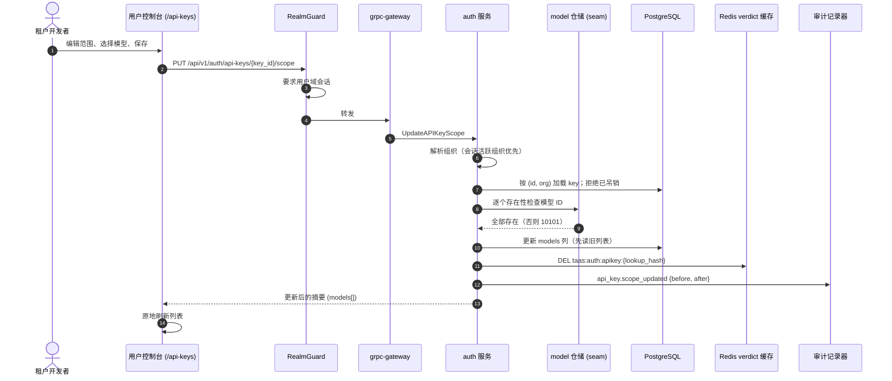
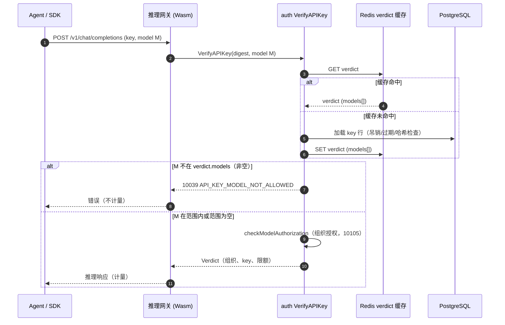

# API Key 模型范围限制 — 架构与详细设计

| 属性 | 内容 |
| --- | --- |
| 功能点 | 按 API Key 限制可调用的模型白名单，并在推理数据面强制执行（backlog 第 46 行） |
| 文档范围 | 范围列与迁移、key 管理 API 端面、verdict 缓存传播、数据面强制执行顺序、用户控制台范围编辑、管理端只读可见性、审计、错误、安全、发布与实现职责 |
| 所属模块 | `auth`（范围存储、verdict 缓存、VerifyAPIKey 强制执行、范围编辑 RPC、审计）；`model`（写入时校验的目录存在性检查）；`web/`（用户端 key 页面） |
| 相关文档 | [需求分析与 UI/UX 设计](../design/api-key-model-scoping.zh-cn.md) · [架构设计](./architecture.zh-cn.md) §2.2（`auth`）与 §3.2（推理网关）· [API Key 管理](./api-key-management.zh-cn.md) — key 生命周期、加盐哈希存储、吊销 · [租户级模型授权](./model-authorization.zh-cn.md) — 本功能叠加其下的组织级门禁 · [每 Key 限流与组织消费限额](./rate-limits-spend-limits.zh-cn.md) · [控制台分离](./console-surface-separation.zh-cn.md) |
| 状态 | 架构完成；已交接 Developer |

## 1. 目标与非目标

### 1.1 目标

- 允许租户将一个 API Key 限制为 0–50 个目录模型 ID 的有序白名单；空列表表示"组织已授权的全部模型"（即现状行为，不变）。
- 创建 key 时设置范围，吊销前随时编辑，不轮换 key 材料。
- 在数据面 `VerifyAPIKey` 以独立业务码（10039 `API_KEY_MODEL_NOT_ALLOWED`）强制执行，先于限流、计量与组织级模型授权检查。
- 白名单随缓存的 key verdict 携带，数据面保持一次缓存查询；编辑范围删除该 key 的缓存 verdict，使变更在现有上界内生效（默认 ≤ 30s，缓存删除后立即）。
- 范围编辑仅暴露在用户端（`/api/v1/auth/api-keys`）；已废弃的管理 key 列表绑定只读返回范围；不新增管理控制台页面。
- 写入时对照目录校验（未知模型 ID 拒绝），每次范围变更写入审计（`api_key.scope_updated`，含前后列表）。

### 1.2 非目标

按 key 端点绑定、按 key 定价、key 级限流（第 11 行）、项目/分组概念、通配符/模式范围、来源 IP 限制、组织失去模型授权时存储范围的自动迁移、以及任何管理端 key 管理页面均排除。组织级模型授权语义（第 13 行）与 key 生命周期（第 1 行）不变。

## 2. 架构决策

| # | 决策 | 理由 |
| --- | --- | --- |
| AD1 | 白名单是现有 `api_keys` 行上的 `models` jsonb 字符串数组列（`NOT NULL DEFAULT '[]'`），在仓储边界按 JSON 数组编解码 —— 与 `routing_policies.service_ids` 相同的约定。 | 单表单行；热路径无 join；`AutoMigrate` 增量变更；空数组即向后兼容默认值。 |
| AD2 | 白名单随 `keyVerdict` JSON 缓存于 Redis（`models` 字段）。`VerifyAPIKey` 在缓存命中与未命中两条路径上都从 verdict 强制执行，位置紧邻 `checkModelAuthorization` 之前。 | 缓存命中路径今天不触库；范围进 verdict 使数据面保持一次查询，两条路径执行一致。 |
| AD3 | 执行顺序：key 有效性（吊销/过期/无效）→ key 范围（10039）→ 组织模型授权（10105）。模型在 key 范围之外时，即使组织已授权也返回 10039。 | 设计 FR2.2 的"key 范围 AND 组织授权"组合语义；独立错误码让调用方区分 key 范围拒绝与组织级拒绝。 |
| AD4 | 范围编辑是独立的 `UpdateAPIKeyScope` RPC，绑定 `PUT /api/v1/auth/api-keys/{key_id}/scope`（body `*`），仅用户端。其他 key RPC 已废弃的管理 `additional_bindings` 不扩展到它。 | 独立动作使审计事件与缓存失效语义明确；`:revoke` 式独立动作是本仓库风格；管理前缀不得接受范围写入（FR4.2）。 |
| AD5 | 范围编辑流程：校验（key 在组织内存在、未吊销、模型在目录中存在、无重复、≤ 50）→ 更新行 → 删除 verdict 缓存 → 变更后尽力记录审计事件（`api_key.revoke` 模式）。 | 沿用既有的吊销/更新传播与审计约定；缓存删除或审计失败只降低上界，绝不让已提交的编辑失败。 |
| AD6 | 写入时目录校验使用 auth 服务上新的 `ModelExistenceChecker` seam（由 model 仓储实现，在 `SetModelAuthorizer` 旁接线）。未接线时为 nil：含未知模型 ID 的范围写入被接受（过渡期，与 authorizer seam 相同的 fail-open 形态）。 | 保持 `auth` 与 `model` 内部解耦；选择器已在控制台阻止无效 ID，seam 是服务端守卫。 |
| AD7 | 范围选择器通过现有 `GET /api/v1/models`（`ListAvailableModels`，default-allow 规则）列出组织已授权的模型 —— 与 playground 相同的列表。 | "组织可用的模型"单一事实来源；不新增列表端点；选择器在写入时阻止无效范围（设计 D5）。 |
| AD8 | 用户端 key 页面（`/api-keys`）新增范围 UI：创建对话框的范围区块、每行范围标识、编辑范围对话框。管理控制台无变更（其旧 key 页面自控制台分离后不再路由）。 | 用户端只有一个 key 页面且无详情页；管理端按设计 D4/FR4 仅 API 只读。 |
| AD9 | 每次范围变更发出 `api_key.scope_updated` 审计事件（操作者来自会话，`resource_type=api_key`，metadata `{before: [...], after: [...]}`），在现有审计端面可见。 | 安全相关变更必须可归因；动作命名与 `api_key.revoke` 约定一致；不新增审计页面。 |

## 3. 组件视图

| 组件 | 职责与变更 |
| --- | --- |
| 控制网关 / grpc-gateway | 注册新的 `UpdateAPIKeyScope` HTTP 绑定。现有 `RealmGuard` 先于 mux 运行；用户绑定在 `/api/v1` 下，管理域会话以 10038 拒绝。 |
| `auth`（`services/auth`） | 负责范围列、`UpdateAPIKeyScope` RPC、范围校验（组织内 key 查找、吊销检查、目录存在性、去重、50 上限）、verdict 缓存失效、`VerifyAPIKey` 范围强制执行（10039）、审计事件。 |
| `model` | 为写入时校验提供目录存在性检查（`ModelExistenceChecker`，由 model 仓储实现）。`ListAvailableModels` 已服务选择器；除 seam 实现外无 model 变更。 |
| `audit` | 不变；通过注入 auth 服务的现有 `AuditRecorder` seam 消费新的 `api_key.scope_updated` 事件。 |
| PostgreSQL | `api_keys.models` jsonb 列，经 GORM `AutoMigrate`（增量；无手写 DDL）。 |
| Redis | `keyVerdict` 条目新增 `models` 字段；范围编辑删除条目（现有 `verdictCache.Delete`）。 |
| 推理网关（Envoy + Wasm） | 不变：已按请求调用 `VerifyAPIKey`；新的 10039 拒绝经现有错误映射返回。 |
| 用户端 Web 控制台 | `web/src/pages/user/ApiKeysPage.tsx` 新增范围区块、行标识、编辑范围对话框；语言包 `en`/`zh`。 |
| 管理 Web 控制台 | 无变更。已废弃的管理绑定 `GET /api/v1/admin/auth/api-keys` 只读返回 `models[]` 供支持工具使用。 |

### 3.1 缓存与执行一致性

数据库行是事实来源；Redis verdict 是 30s（默认）正向缓存。范围编辑先提交行，再删除缓存条目；删除失败只把传播上界降低到 TTL（吊销/更新先例）。提交与缓存过期之间，数据面最多在 TTL 内服务旧范围 —— 与今天的吊销相同的上界。verdict 的 `models` 字段在两条缓存路径上都是执行的权威来源，因此过期 verdict 一致地执行旧范围（绝不会新旧列表混合）。

## 4. 数据模型与迁移

### 4.1 列

`api_keys` 新增一列：

| 列 | 类型 | 约束 / 含义 |
| --- | --- | --- |
| `models` | jsonb | `NOT NULL DEFAULT '[]'`；目录模型 ID 字符串的 JSON 数组，保留存储顺序，写入时去重；空数组 = 不限制 |

GORM 模型（`services/auth/apikey_model.go`）：

```go
// Models is the optional model allow-list (feature #46, AD1): a JSON
// array of catalog model IDs; empty = all org-granted models.
Models string `gorm:"type:jsonb;not null;default:'[]'"`
```

### 4.2 迁移与初始化

该列由现有 auth `AutoMigrate` 添加（`Migrate` 与 `MigrateSchemaForFVT` 均已注册 `&APIKey{}`）；无 init-SQL、无回填 —— 存量行得到 `'[]'`（不限制）且行为与之前完全一致。无新表、无索引（列表从不按模型 ID 查询）。

### 4.3 编解码

仓储层辅助函数 `encodeModelIDs([]string) string` / `decodeModelIDs(string) []string`（JSON 序列化/反序列化，空切片 ↔ `"[]"`），遵循 `routing_policies.service_ids` 约定。服务层从不触碰原始 JSON 字符串。

## 5. API 设计

所有变更位于 `proto/taas/auth/v1/auth.proto` 的 `taas.auth.v1.AuthService`。

| RPC | 精确 HTTP 注解 | 用途 |
| --- | --- | --- |
| `CreateAPIKey`（现有） | `post: "/api/v1/auth/api-keys"`（+ 已废弃管理绑定，不变） | 请求新增 `repeated string models = 5`（可选；与范围编辑相同校验） |
| `ListAPIKeys`（现有） | `get: "/api/v1/auth/api-keys"`（+ 已废弃管理绑定） | `APIKeySummary` 新增 `repeated string models = 10`（空 = 不限制）—— 即管理只读端面 |
| `UpdateAPIKey`（现有） | `put: "/api/v1/auth/api-keys/{key_id}"`（+ 已废弃管理绑定，不变） | 不变：仅名称/过期/限流。范围编辑绝不走它。 |
| `UpdateAPIKeyScope`（新增） | `put: "/api/v1/auth/api-keys/{key_id}/scope"`，`body: "*"` | 替换白名单；**仅用户绑定 —— 无管理 `additional_binding`** |

### 5.1 Proto 消息契约

```protobuf
message UpdateAPIKeyScopeRequest {
  // key_id is the path parameter.
  string key_id = 1;
  // models is the complete replacement allow-list: 0–50 distinct
  // catalog model IDs in the desired order; empty clears the scope.
  repeated string models = 2;
}

message UpdateAPIKeyScopeResponse {
  taas.common.v1.Response response = 1;
  // key carries the updated summary (including models); never the plaintext.
  APIKeySummary key = 2;
}
```

`APIKeySummary.models` 总是填充（空 = 不限制）。`CreateAPIKeyRequest.models` 遵循相同规则。

### 5.2 校验与错误

`UpdateAPIKeyScope` 与 `CreateAPIKey`（带非空 models 列表时）校验：

- `key_id` 必填（scope RPC 上 10008 `API_KEY_INVALID`）；key 必须存在于调用者组织（10007 `API_KEY_NOT_FOUND` —— 不泄露跨组织存在性）。
- key 不得已吊销（10009 `API_KEY_REVOKED`）。
- 每个模型 ID 必须存在于目录（10101 `MODEL_NOT_FOUND`）；重复拒绝（10008）；最多 50 项（10008）；每个 ID 去除首尾空白且非空。
- 空列表合法，清除范围。

分配一个 auth 错误码：`pkg/errors/codes.go` 中的 `10039 API_KEY_MODEL_NOT_ALLOWED`（10031 已被 `ROLE_INVALID` 占用；10039 是下一个空闲 auth 码）。错误响应使用现有统一 `{code, message}` 体；业务错误遵循平台现有 grpc-gateway 映射（HTTP 500，客户端按体 `code` 分支）。

## 6. 前端架构与端面安全

| 页面 / 模块 | 路由 | API 前缀 | 会话域与守卫 |
| --- | --- | --- | --- |
| 用户端 key 页面（`web/src/pages/user/ApiKeysPage.tsx`） | `/api-keys` | `/api/v1/auth/api-keys*`；选择器数据源 `GET /api/v1/models` | 用户会话（种子或 SSO）；页面使用用户域 API 客户端，管理令牌以 10038 失败。组织范围跟随会话活跃组织（D6：有会话时忽略 header）。 |
| 管理控制台 | 无路由 | 已废弃的 `GET /api/v1/admin/auth/api-keys` 只读返回 `models[]` | 无管理 UI 变更；scope 端点无管理绑定，管理前缀上的范围写入是 404 路由不匹配（FR4.2）。 |
| 数据面 | `/v1/chat/completions` 等 | 现有 OpenAI 兼容契约 | 网关的 `VerifyAPIKey` 调用现在强制执行范围；调用方看到现有错误体形状，code 为 10039。 |

控制台变更（仅 `web/src/pages/user/ApiKeysPage.tsx`）：

- **创建对话框**：限流字段之下的"模型范围"区块 —— 单选"全部已授权模型"（默认）/"限制为选定模型"；受限选择渲染组织已授权模型的复选框列表（来自 `GET /api/v1/models?page.limit=100`），展示模型 ID + 名称；仅在受限且非空时提交发送 `models: [...]`。
- **列表行**：范围单元格（`data-testid="scope-cell-{keyId}"`）显示"全部模型"或"N 个模型"；未吊销行上的**编辑范围**操作（`data-testid="edit-scope-{keyId}"`）。
- **编辑范围对话框**（`data-testid="edit-scope-dialog"`）：同一选择器按行 `models` 预填；保存调用 `PUT /api/v1/auth/api-keys/{keyId}/scope` 携带完整替换列表；成功后列表原地刷新；错误在对话框 `ErrorBanner` 渲染且原范围保持生效。
- **语言包**：`web/src/locales/en.ts` 与 `zh.ts` 中的 `uapikeys.scope*` 键。

## 7. 关键时序

### 7.1 编辑 key 范围



### 7.2 数据面强制执行



## 8. 运行时规则、错误与可观测性

1. 执行只读 verdict 的 `models` 列表 —— 两条缓存路径都不触库。空列表完全跳过范围检查（无范围 key 与今天逐字节一致）。
2. 范围检查在 key 有效性之后、`checkModelAuthorization`/限流/计量之前；10039 拒绝不产生计量行与消费。
3. 范围编辑只删除一个缓存条目（key 的 `lookup_hash`）；删除失败记日志（`Warnw`，吊销模式）且绝不让编辑失败。
4. 审计事件在变更提交后尽力记录（`recordAudit`）；记录器失败记日志，绝不返回。
5. 可观测性：无新指标；现有 `VerifyAPIKey` 日志与请求日志携带拒绝。审计事件 metadata JSON `{"before": [...], "after": [...]}` 是审阅端面（AC7），经 `GET /api/v1/admin/audit/events`（管理端）与 `GET /api/v1/audit/activity`（操作用户）可见。

管理失败语义：错误域会话 10038；用户绑定上缺失/过期会话回退到过渡期 `X-Organization-Id` 路径（现有 key RPC 行为）；组织内无此 key 10007；已吊销 10009；未知模型 10101；重复/超限/空 ID 列表 10008；数据面范围拒绝 10039。

## 9. 配置

无新配置。verdict 缓存 TTL（`auth.apikey.cacheTTL`，默认 30s）与模型授权缓存 TTL（默认 5s）的传播上界与今天吊销和组织授权完全相同。无新 MQ subject、runner 或环境变量。

## 10. 安全与隐私

- 范围写入仅用户端：RPC 无管理 `additional_binding`，因此 `/api/v1/admin/auth/api-keys/{key_id}/scope` 不被路由（FR4.2）；用户绑定上的管理域会话被 `RealmGuard` 以 10038 拒绝。
- 组织范围跟随会话活跃组织（D6/FR4.4：会话组织优先，忽略 `X-Organization-Id`）；其他组织的缺失 key 返回 10007 且不泄露存在性（AC8）。
- 明文 key 不再展示、范围编辑不轮换；只有 `models` 列变化。
- 审计事件记录操作者、key id、组织与前后模型列表 —— 无 key 材料、无请求体。
- 选择器的模型列表是组织已授权模型（default-allow 规则）；组织失去授权时存储范围不自动迁移 —— 对该模型的调用先失败于组织级授权（10105），即文档化的组合语义。

## 11. 发布与升级

1. 部署增量 `AutoMigrate`（新 `models` 列，默认 `'[]'`）—— 存量 key 不限制且逐字节不变（AC3）。
2. 同一发布内部署 API 与控制台：新 RPC、摘要字段与页面变更。旧控制台忽略新字段；新控制台仅在用户选择受限时发送 `models`。
3. 网关无需变更：它已映射 `VerifyAPIKey` 业务错误；10039 走现有路径。
4. 回滚安全：schema 增量、旧二进制忽略该列，且带额外 `models` 字段的缓存 verdict 在旧二进制中解码正常（`json.Unmarshal` 忽略未知 JSON 字段）。

## 12. 验收标准追溯

| UI/UX 标准 | 架构覆盖 |
| --- | --- |
| AC1：带范围创建保存列表；列表展示标识；明文仅展示一次 | §§2 AD1、5、6；§13.2 |
| AC2：白名单内模型成功并计量；其他模型 10039 且不计量 | §§2 AD2–AD3、7.2、8 |
| AC3：无范围 key 逐字节不变 | §§2 AD1–AD2、4.2、11 |
| AC4：范围编辑在缓存上界内生效且不轮换 | §§2 AD5、3.1、7.1 |
| AC5：选择器恰好提供已授权模型；未知/重复内联拒绝 | §§2 AD6–AD7、5.2、6 |
| AC6：管理绑定只读；无管理范围写入路由或 UI | §§2 AD4、AD8、5、6、10 |
| AC7：每次变更发出含前后列表的 `api_key.scope_updated` | §§2 AD9、7.1、8 |
| AC8：跨租户掩蔽（10007） | §§5.2、10 |

## 13. 详细实现设计

### 13.1 Proto 与错误码（`proto/taas/auth/v1` → `pkg/errors`）

- 在 `auth.proto` 中添加 `UpdateAPIKeyScope`（§5.1 的 RPC 与消息），仅用户端 `PUT /api/v1/auth/api-keys/{key_id}/scope` 绑定；为 `CreateAPIKeyRequest`（字段 5）与 `APIKeySummary`（字段 10）添加 `repeated string models`。经仓库 Buf/Make 流程重新生成。
- 在 `pkg/errors/codes.go` 的 auth 块添加 `CodeAPIKeyModelNotAllowed Code = 10039 // API_KEY_MODEL_NOT_ALLOWED`（置于 10038 之后）。

### 13.2 服务与仓储（`services/auth`）

- `apikey_model.go`：添加 `Models` 列（§4.1）与编解码辅助（§4.3）。
- `apikey_repository.go`：添加 `UpdateScopeByIDAndOrganization(ctx, orgID, keyID string, modelsJSON string) (*APIKey, error)` —— `UpdateByIDAndOrganization` 模式：组织内 `First`，缺失 → nil（调用方映射 10007），再 `UpdateFields` 更新 `models`；返回行并携带审计 before 值所需的旧列表（更新前读取）。
- `apikey_cache.go`：为 `keyVerdict` 添加 `Models []string \`json:"models"\``（置于 `RateLimitTPM` 之后）。
- `service.go`：
  - `CreateAPIKey`：经共享校验器（§5.2）校验 `req.GetModels()`；在新行上存储编码后的列表。
  - `summarizeAPIKey`：填充 `Models: decodeModelIDs(row.Models)`。
  - 新增 `UpdateAPIKeyScope`：`resolveOrgContext` → `checkOrg(ctx, orgID, false)`（禁用组织仍可收紧范围，吊销先例）→ 校验列表 → 仓储更新（内部吊销检查，10009）→ `cache.Delete(ctx, row.LookupHash)`（失败告警）→ `recordAudit`（`api_key.scope_updated`，有会话时操作者取 `SessionUserID` 否则 `"system"`，metadata `{"before": [...], "after": [...]}`）→ 返回摘要。
  - `VerifyAPIKey`：构建 verdict 时带 `Models: decodeModelIDs(row.Models)`；在缓存块之后、`checkModelAuthorization` 之前插入范围检查：若 `len(verdict.Models) > 0 && req.GetModel() != ""` 且模型不在列表中 → `apierrors.New(apierrors.CodeAPIKeyModelNotAllowed)`。
- `model_authorizer.go`（或新文件 `model_existence.go`）：添加 `ModelExistenceChecker` 接口（`ModelExists(ctx, modelID string) (bool, error)`）、`SetModelExistenceChecker` 注入器、以及校验器使用的 `checkModelsExist` 辅助。在 model 仓储上实现 `ModelExists`（`GetByID` 未命中 → false，`gorm.ErrRecordNotFound` 映射已存在）。

### 13.3 接线（`apps/taas-server/main.go`）

- 在 `authSvc.SetModelAuthorizer(model.NewRepository(gormDB))`（约 218 行）旁添加 `authSvc.SetModelExistenceChecker(model.NewRepository(gormDB))`。无其他接线变更；审计记录器已注入（约 359 行）。

### 13.4 前端（`web/src`）

- `pages/user/ApiKeysPage.tsx`：为 `KeyDialog` 扩展范围区块（仅创建模式）；为行添加范围单元格与 `edit-scope-{keyId}` 操作；添加 `ScopeDialog` 组件（选择器 + 经 `PUT .../scope` 保存）；对话框每次打开时经 `api.get('/api/v1/models?page.limit=100', orgId)` 一次性加载已授权模型。
- `api.ts`：为本地 `ApiKeySummary` 类型扩展 `models?: string[]`。
- `locales/en.ts` + `zh.ts`：`uapikeys.scope*` 键（区块标题、全部/受限标签、列头、"全部模型"/"{n} 个模型"标识、对话框标题/说明、至少选一错误、保存失败）。
- Testid：`scope-cell-{keyId}`、`edit-scope-{keyId}`、`edit-scope-dialog`、`scope-option-all`、`scope-option-restricted`、`scope-model-{modelId}`（复选框）、`submit-scope-save`。

### 13.5 重点验证

- 单元（`services/auth`）：校验器用例（空、50 上限、重复、带 fake checker 的未知 ID、已吊销 key、跨组织未命中 → 10007）；`VerifyAPIKey` 范围矩阵（有范围+允许、有范围+拒绝 → 10039、无范围不变、缓存命中路径执行、带新字段的 verdict 往返）；`UpdateAPIKeyScope` 缓存删除与审计尽力路径。
- FVT（`test/fvt/auth_apikey_fvt_test.go` 或新 `apikey_scope_fvt_test.go`）：创建带范围 key → 校验允许模型 OK / 其他模型 10039（`VerifyAPIKey` seam 在 FVT 中可直接调用 —— 这是唯一能端到端测试强制执行的地方，因为该 RPC 无 HTTP 绑定）；编辑范围 → 缓存删除后旧拒绝翻转为允许；无范围 key 不变；审计行存在且含前后列表；跨组织范围编辑 → 10007。
- E2E（`test/e2e/tests/apiKeyModelScoping.js`，tag `api-key-model-scoping`）：控制台 AC1/AC5（带范围创建、选择器列出已授权模型、重复/未知内联拒绝）、AC4（UI 编辑范围、列表刷新）、AC6（管理绑定返回 `models[]`；`PUT /api/v1/admin/auth/api-keys/{id}/scope` 不被路由）、AC7（`GET /api/v1/audit/activity` 显示 `api_key.scope_updated`）、AC8（orgB 会话不能查看或编辑 orgA 的 key）。AC2/AC3 强制执行仅限 FVT（compose 中无 `VerifyAPIKey` 的 HTTP 路径）；该套件只断言控制台与 API 端面。
