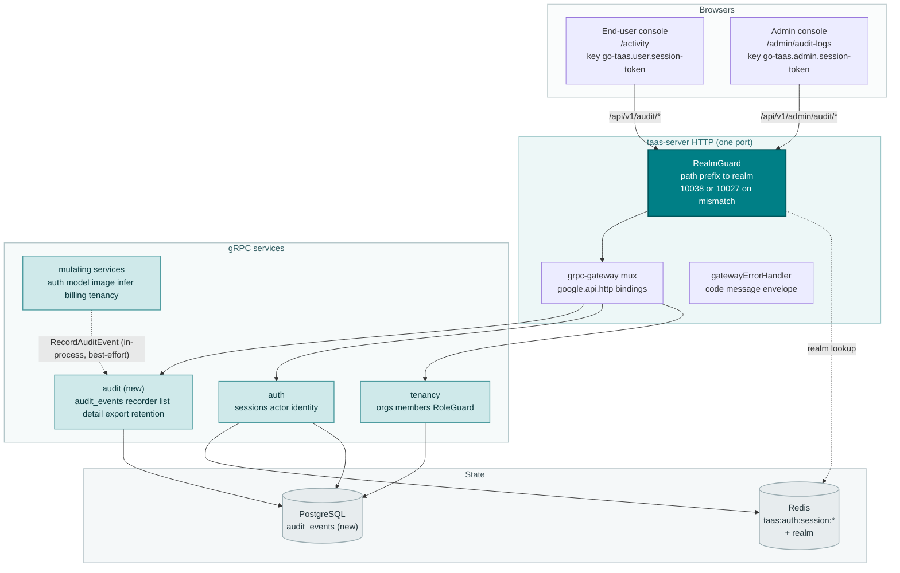
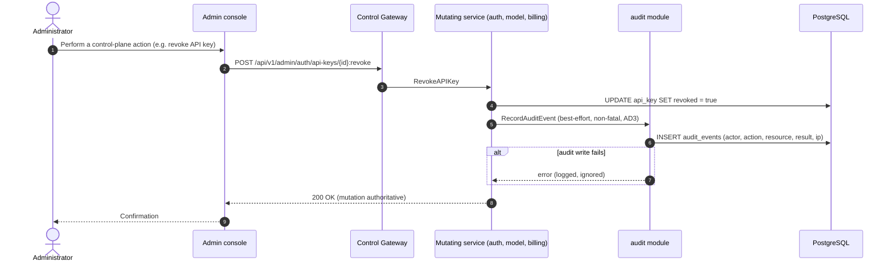
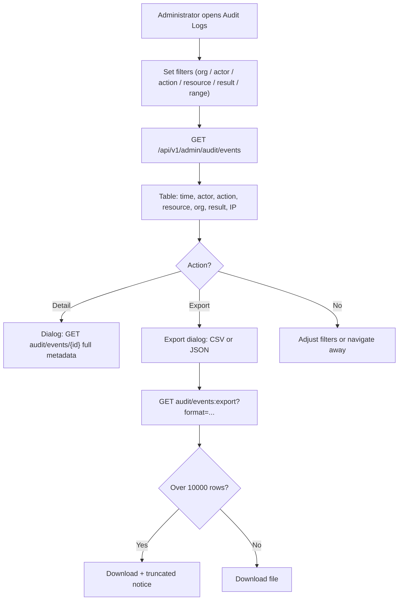
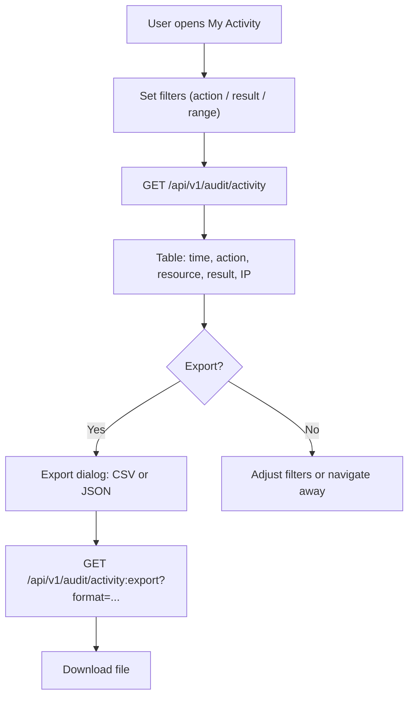
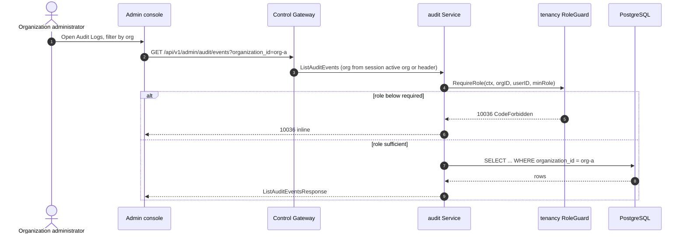

# Audit Logging & Activity Export — Architecture and Detailed Design

| Attribute | Content |
| --- | --- |
| Feature point | Audit logging & activity export |
| Document scope | Architecture and detailed design for feature-15: the `audit_events` table and its best-effort, non-fatal write path invoked by every mutating control-plane API, the admin Audit Logs page (filterable table, drill-down detail, CSV/JSON export), the end-user My Activity page (scoped table + export), plus error handling, configuration, security, rollout, and function-level design per layer |
| Owning modules | New `audit` module (`services/audit`): `audit_events` table, recorder, list/detail/export RPCs, retention runner; `auth` (actor identity, session realm) and `tenancy` (org scoping, RoleGuard) read-only; console web app |
| Related documents | [Requirement Analysis and UI/UX Design](../design/audit-logging.md) · [Architecture Design](../design/architecture.md) §2.1 (`auth`), §2.6 (`billing`), §3.1 (admin/user surface separation) · [Console Surface Separation](./console-surface-separation.md) (the two-console split this feature's two pages must respect; realm guard, 10038) · [Request Logs & API Playground](./request-logs-playground.md) (the diagnostic log this feature complements; the best-effort non-fatal write pattern) · [Organization Members, Roles & Invitations](./org-members-rbac.md) (the RoleGuard that gates who may view and export audit data) · [Multi-Tenancy & Organization Isolation](./multi-tenancy.md) (the transitional `X-Organization-Id` identity) |
| Status | Architecture complete, handed to the Developer agent |

---

## 1. Overview and Goals

Features #1–#14 closed the accounting, observability, and governance loop: API keys, models, images, inference services, pricing, metering, billing, members, and invitations all have real rows and console pages. But **who changed what, when, and with what result is not recorded anywhere**. The request log (feature #12) captures per-inference diagnostics on the data plane, but the control plane — every console action that mutates a key, a model, a price, a member, or a bill — leaves no trace. When an operator asks "who revoked this API key?", "who changed this price?", or "who invited this member?", the console has no answer.

This feature delivers the audit spine: an `audit_events` table recording every control-plane mutation (actor, action, resource, result, IP, timestamp), a best-effort recorder invoked by every mutating control-plane API, an admin Audit Logs page (filterable table, drill-down detail, CSV/JSON export), and an end-user My Activity page (the caller's own account events, with a scoped export). The two pages live on the two separate console surfaces, per the fixed product decision.

**Goals**: a new `audit` module owning the `audit_events` table and its lifecycle; a best-effort, non-fatal recorder invoked by every mutating control-plane API after the mutation succeeds; a curated action taxonomy (a closed enum, not free text); both `success` and `failure` results recorded; configurable retention (default 365 days) enforced by a periodic cleanup runner; `ListAuditEvents` / `GetAuditEvent` / `ExportAuditEvents` admin RPCs under `/api/v1/admin/audit/*`; `ListMyActivity` / `ExportMyActivity` end-user RPCs under `/api/v1/audit/*`; new error codes 10601–10603; an admin Audit Logs page (`/admin/audit-logs`) and an end-user My Activity page (`/activity`).

**Non-goals** (deferred, design D10): async/bucket export (CloudTrail/Google sink pattern); real-time streaming of audit events; audit-event webhooks; per-action retention tiers; data-plane audit (feature #12 owns request logs); and audit of read-only console views (only mutations and auth events are recorded).

### 1.1 Reading order of this document

Section 2 records the architecture decisions (AD1–AD10, mirroring the design's D1–D10). Sections 3–5 are the component view, data model, and API design. Section 6 is the frontend architecture (page → route → API-prefix table for both consoles, auth guard per surface). Sections 7–8 are the sequence flows and error handling. Sections 9–11 are configuration, security, and rollout. Sections 12–14 are the acceptance-criteria traceability, the function-level detailed design, and the ordered implementation task list.

---

## 2. Architecture Decisions

| # | Decision | Rationale |
| --- | --- | --- |
| AD1 | **New `audit` module** (`services/audit`) owning the `audit_events` table, the recorder, the list/detail/export RPCs, and the retention runner, with its own error block **106xx** | Audit is a cross-cutting control-plane concern with its own lifecycle and retention; a dedicated module keeps it separable and testable, mirroring how metering owns request logs (design D1) |
| AD2 | **`audit_events` is a separate table from `request_logs`** — same idea, different plane | Request logs are per-inference data-plane diagnostics (30-day retention, feature #12); audit events are control-plane actions (365-day retention, compliance value). Sharing a table would force one lifecycle on both (design D2) |
| AD3 | **The audit write is best-effort and non-fatal** — every mutating control-plane API calls the recorder after the mutation succeeds; a recorder failure is logged and never fails or rolls back the mutation | The mutation is authoritative; the audit row is a trace. A failed audit write must never block a key revocation or a price change (design D3; the request-log D2 pattern) |
| AD4 | **A curated action taxonomy** — a closed enum of action names (e.g. `api_key.revoke`, `member.remove`, `price.update`, `auth.login`), each with a human label, grouped by resource type | A bounded enum is filterable, renderable as a badge, and testable; free-text actions invite drift (design D4) |
| AD5 | **Both results are recorded** — every event carries `result` (`success`/`failure`); a failed login and a successful key revoke are both audit-worthy | An auditor needs the full picture; recording only failures hides destructive successes (design D5) |
| AD6 | **Configurable retention** (default 365 days) enforced by a periodic cleanup runner, separate from request-log cleanup | Audit events have compliance value and a longer window than diagnostics; retention is configuration, not code (design D6) |
| AD7 | **Synchronous export with a row cap** (default 10,000 rows) — the console downloads the currently filtered set as CSV or JSON; async/bucket export is deferred | A simple console download is testable in Nightwatch and bounds the response; bucket export is infrastructure (design D7) |
| AD8 | **Two audit surfaces** — an admin Audit Logs page (`/admin/audit-logs`, `/api/v1/admin/audit/*`) showing all tenants' events, and an end-user My Activity page (`/activity`, `/api/v1/audit/*`) showing only the caller's own events | The two-console split (feature #17) is binding; admin is operations-oriented, end-user is task-oriented (design D8) |
| AD9 | **New error codes 10601 `CodeAuditEventNotFound`, 10602 `CodeAuditExportInvalid`, 10603 `CodeAuditRangeInvalid`** | The 106xx block is the audit module's; each failure mode needs its own code so the console renders the right inline message (design D9; the metering D9 pattern) |
| AD10 | **The recorder is an in-process gRPC call from mutating services to the audit module** — no message-queue hop, no separate deployment | The single-Deployment topology (architecture §1.2) means modules call each other in-process; the recorder is a direct call after the mutation succeeds, so it adds no MQ latency and cannot be reordered against the mutation (design D3) |

---

## 3. Component View

### 3.1 Ownership

| Layer / component | Owns | Changes in this feature |
| --- | --- | --- |
| **Control Gateway (`grpc-gateway`)** | HTTP/JSON facade for the audit RPCs; realm guard (feature #17) already rejects a wrong-realm session with 10038; passes `X-Organization-Id` through as gRPC metadata | New bindings for the 5 HTTP audit RPCs (Section 5); no change to the realm guard |
| **`audit` module (`services/audit`)** | `audit_events` table, the recorder, the list/detail/export RPCs, the retention runner | **New module** (AD1) |
| **`auth` module** | Actor identity, session realm, session active org | Read-only: the recorder resolves the actor from the session; `SessionActiveOrg` supplies the org for session-bearing calls |
| **`tenancy` module** | Organizations, members, roles, RoleGuard | Read-only: `RoleGuard` gates the admin audit RPCs by the caller's role in the resolved org context (10036) |
| **Mutating services** (`auth`, `model`, `image`, `infer`, `billing`, `tenancy`) | The control-plane mutations that produce audit events | Each mutating RPC calls the audit recorder after the mutation succeeds (AD3) |
| **PostgreSQL** | `audit_events` table (new); all other tables untouched | One new table via AutoMigrate (Section 4) |
| **Console** | Admin Audit Logs page and end-user My Activity page | Two new pages on the two surfaces (Section 6) |

### 3.2 Runtime component view



### 3.3 Request identity chain

The audit RPCs reuse the established identity chain (console-surface-separation §3.3):

1. `RealmGuard` (HTTP, `pkg/server/realm.go`) — path prefix decides the expected realm. `/api/v1/admin/audit/*` expects `admin`; `/api/v1/audit/*` expects `user`. With no `Authorization` header: pass through (transitional, AD4 of feature #17). With a header: resolve the session realm from Redis; mismatch → 10038, unknown/expired/realm-less → 10027.
2. grpc-gateway mux — routes by the annotated path and forwards `authorization` and `x-organization-id`.
3. Service handler — for a session-bearing call, `SessionActiveOrg` makes the session's active organization authoritative and ignores `X-Organization-Id`; without a session, `resolveOrganizationID` reads the transitional header and returns 10001 when it is absent or empty.
4. `tenancy.RoleGuard` — gates the admin audit RPCs by the caller's role in the resolved org context (10036). The end-user RPCs are hard-scoped to the caller and need no role check.

---

## 4. Data Model

### 4.1 The `audit_events` Table

| Column | PostgreSQL type | Constraints | Description |
| --- | --- | --- | --- |
| `audit_event_id` | `uuid` | PRIMARY KEY | Server-generated UUID v4, exposed as `audit_event_id` |
| `organization_id` | `varchar(64)` | NULL, index (composite) | Owning organization; NULL for platform-level events (e.g. a platform admin acting outside an org) |
| `actor_user_id` | `varchar(64)` | NOT NULL, index (composite) | The user who performed the action; `system` for system-initiated events |
| `actor_type` | `varchar(16)` | NOT NULL | `user` / `system` / `api_key` |
| `action` | `varchar(64)` | NOT NULL, index | The curated action name (AD4), e.g. `api_key.revoke` |
| `resource_type` | `varchar(32)` | NOT NULL, index | The resource class, e.g. `api_key`, `model`, `member`, `price` |
| `resource_id` | `varchar(128)` | NOT NULL | The resource instance id |
| `result` | `varchar(16)` | NOT NULL, index | `success` / `failure` (AD5) |
| `ip_address` | `varchar(64)` | NOT NULL DEFAULT '' | The caller's source IP, when known |
| `user_agent` | `varchar(512)` | NOT NULL DEFAULT '' | The caller's user agent, when known |
| `metadata` | `jsonb` | NOT NULL DEFAULT '{}' | Extra context (e.g. the old/new value of a changed field) |
| `created_at` | `timestamptz` | NOT NULL, index (composite) | Event time (UTC) |

Design notes:

- Composite indexes: `idx_audit_events_org_created (organization_id, created_at)` for org-scoped lists; `idx_audit_events_actor_created (actor_user_id, created_at)` for the end-user activity list; `action`, `resource_type`, and `result` indexed for filtering (FR1.3).
- No foreign keys to `users` / `api_keys` / `models` / `inference_services`: audit events must outlive revoked keys, deleted models, and removed members — they are compliance evidence, not relational state (mirrors the voucher/request-log reasoning).
- Audit events are immutable: no API updates or deletes them; the audit retention runner is the only deleter (AD6).
- `organization_id` is nullable because a platform-level event (e.g. a platform admin acting outside any org) has no org; the admin list treats NULL as "platform-level" and the end-user list never sees it (it is scoped by `actor_user_id`).

### 4.2 Migration Notes

- The table is created by GORM `AutoMigrate` on `taas-server` startup (additive; no data migration). `Migrate`/`MigrateSchemaForFVT` gain the `AuditEvent` model.
- No init-SQL upgrade path is needed: the table is new and empty at rollout; the recorder starts filling it as soon as mutating APIs run.
- The audit retention runner is the only deleter; it never touches request logs, vouchers, usage records, or charge records (FR2.2).

---

## 5. API Design

All audit RPCs belong to a new **`taas.audit.v1.AuditService`** (`proto/taas/audit/v1/audit.proto`), served as HTTP via the Control Gateway. Admin RPCs live under `/api/v1/admin/audit/*`; end-user RPCs live under `/api/v1/audit/*`. The recorder is an internal gRPC call from mutating services to the audit module (in-process, per the single-Deployment topology, AD10).

| RPC | HTTP | Status | Purpose | Notes |
| --- | --- | --- | --- | --- |
| `RecordAuditEvent` | (internal gRPC, no HTTP binding) | **new** | Best-effort recorder invoked by mutating services | Non-fatal; never fails the mutation (AD3) |
| `ListAuditEvents` | `GET /api/v1/admin/audit/events` | **new** | All tenants' events, filtered | Admin session; RoleGuard org-scoped; 10603 |
| `GetAuditEvent` | `GET /api/v1/admin/audit/events/{audit_event_id}` | **new** | One event's full metadata | Admin session; 10601 |
| `ExportAuditEvents` | `GET /api/v1/admin/audit/events:export` | **new** | CSV/JSON of the filtered set | Admin session; cap 10,000; 10602 |
| `ListMyActivity` | `GET /api/v1/audit/activity` | **new** | The caller's own events | User session; hard-scoped to caller; 10603 |
| `ExportMyActivity` | `GET /api/v1/audit/activity:export` | **new** | CSV/JSON of the caller's own events | User session; hard-scoped; cap 10,000; 10602 |

### 5.1 Proto contract

```protobuf
syntax = "proto3";

package taas.audit.v1;

import "google/api/annotations.proto";
import "taas/common/v1/common.proto";

option go_package = "github.com/go-taas/go-taas/proto/taas/audit/v1;auditv1";

// AuditService records control-plane mutations and exposes the audit
// trail to the admin console and the caller's own activity to the
// end-user console.
service AuditService {
  // RecordAuditEvent is the best-effort, non-fatal recorder invoked by
  // every mutating control-plane API after the mutation succeeds. It has
  // no HTTP binding (cluster-internal surface, AD10).
  rpc RecordAuditEvent(RecordAuditEventRequest) returns (RecordAuditEventResponse);

  // ListAuditEvents returns audit events across tenants, filtered by
  // org, actor, action, resource type, result and time range.
  // Admin-surface API: served under /api/v1/admin.
  rpc ListAuditEvents(ListAuditEventsRequest) returns (ListAuditEventsResponse) {
    option (google.api.http) = {get: "/api/v1/admin/audit/events"};
  }

  // GetAuditEvent returns one audit event's full metadata for drill-down.
  // Admin-surface API: served under /api/v1/admin.
  rpc GetAuditEvent(GetAuditEventRequest) returns (GetAuditEventResponse) {
    option (google.api.http) = {get: "/api/v1/admin/audit/events/{audit_event_id}"};
  }

  // ExportAuditEvents returns the filtered set as CSV or JSON, capped at
  // 10000 rows.
  // Admin-surface API: served under /api/v1/admin.
  rpc ExportAuditEvents(ExportAuditEventsRequest) returns (ExportAuditEventsResponse) {
    option (google.api.http) = {get: "/api/v1/admin/audit/events:export"};
  }

  // ListMyActivity returns the caller's own audit events.
  // User-surface API: served under /api/v1; hard-scoped to the caller.
  rpc ListMyActivity(ListMyActivityRequest) returns (ListMyActivityResponse) {
    option (google.api.http) = {get: "/api/v1/audit/activity"};
  }

  // ExportMyActivity returns the caller's own filtered events as CSV or
  // JSON, capped at 10000 rows.
  // User-surface API: served under /api/v1; hard-scoped to the caller.
  rpc ExportMyActivity(ExportMyActivityRequest) returns (ExportMyActivityResponse) {
    option (google.api.http) = {get: "/api/v1/audit/activity:export"};
  }
}

enum AuditActorType {
  AUDIT_ACTOR_TYPE_UNSPECIFIED = 0;
  AUDIT_ACTOR_TYPE_USER = 1;
  AUDIT_ACTOR_TYPE_SYSTEM = 2;
  AUDIT_ACTOR_TYPE_API_KEY = 3;
}

enum AuditResult {
  AUDIT_RESULT_UNSPECIFIED = 0;
  AUDIT_RESULT_SUCCESS = 1;
  AUDIT_RESULT_FAILURE = 2;
}

enum AuditExportFormat {
  AUDIT_EXPORT_FORMAT_UNSPECIFIED = 0;
  AUDIT_EXPORT_FORMAT_CSV = 1;
  AUDIT_EXPORT_FORMAT_JSON = 2;
}

message AuditEvent {
  string audit_event_id = 1;
  string organization_id = 2;   // empty for platform-level events
  string actor_user_id = 3;
  AuditActorType actor_type = 4;
  string action = 5;            // curated enum name, e.g. "api_key.revoke"
  string resource_type = 6;
  string resource_id = 7;
  AuditResult result = 8;
  string ip_address = 9;
  string user_agent = 10;
  string metadata = 11;         // JSON string of the metadata object
  int64 created_at = 12;        // unix seconds
}

message RecordAuditEventRequest {
  string organization_id = 1;
  string actor_user_id = 2;
  AuditActorType actor_type = 3;
  string action = 4;
  string resource_type = 5;
  string resource_id = 6;
  AuditResult result = 7;
  string ip_address = 8;
  string user_agent = 9;
  string metadata = 10;         // JSON string
}

message RecordAuditEventResponse {
  taas.common.v1.Response response = 1;
  string audit_event_id = 2;
}

message ListAuditEventsRequest {
  taas.common.v1.PageRequest page = 1;
  string organization_id = 2;   // empty = all orgs (admin)
  string actor_user_id = 3;
  string action = 4;
  string resource_type = 5;
  AuditResult result = 6;
  int64 since = 7;
  int64 until = 8;
}

message ListAuditEventsResponse {
  taas.common.v1.Response response = 1;
  repeated AuditEvent audit_events = 2;
  taas.common.v1.PageMeta page_meta = 3;
}

message GetAuditEventRequest { string audit_event_id = 1; }

message GetAuditEventResponse {
  taas.common.v1.Response response = 1;
  AuditEvent audit_event = 2;
}

message ExportAuditEventsRequest {
  string organization_id = 1;
  string actor_user_id = 2;
  string action = 3;
  string resource_type = 4;
  AuditResult result = 5;
  int64 since = 6;
  int64 until = 7;
  AuditExportFormat format = 8;
}

message ExportAuditEventsResponse {
  taas.common.v1.Response response = 1;
  string content = 2;           // CSV or JSON text
  bool truncated = 3;           // true when the cap was hit
}

message ListMyActivityRequest {
  taas.common.v1.PageRequest page = 1;
  string action = 2;
  AuditResult result = 3;
  int64 since = 4;
  int64 until = 5;
}

message ListMyActivityResponse {
  taas.common.v1.Response response = 1;
  repeated AuditEvent audit_events = 2;
  taas.common.v1.PageMeta page_meta = 3;
}

message ExportMyActivityRequest {
  string action = 1;
  AuditResult result = 2;
  int64 since = 3;
  int64 until = 4;
  AuditExportFormat format = 5;
}

message ExportMyActivityResponse {
  taas.common.v1.Response response = 1;
  string content = 2;
  bool truncated = 3;
}
```

### 5.2 Contract constraints

1. **Surface separation**: admin RPCs are under `/api/v1/admin/audit/*` and require an admin session; end-user RPCs are under `/api/v1/audit/*` and require a user session. The two never mix (feature #17). The realm guard rejects a wrong-realm session with 10038 before any handler runs.
2. **Wire-format conventions unchanged**: dotted pagination (`?page.offset=0&page.limit=20`), success HTTP 200, business errors as `{"code": <int>, "message": "..."}`, int64 fields as JSON strings.
3. **Export contract**: `ExportAuditEvents`/`ExportMyActivity` take the same filters as their list RPCs plus `format=csv|json`; an invalid `format` returns 10602; a set wider than the 10,000-row cap returns the first 10,000 rows with `truncated: true` (AD7).
4. **Range validation**: `since`/`until` are int64 unix seconds; defaults `until = now`, `since = until − 24h`; `since > until` or a range > 366 days returns 10603 (FR3.1/FR4.1).
5. **Recorder**: `RecordAuditEvent` is best-effort and non-fatal — mutating services call it after the mutation succeeds and ignore its failure (AD3).

### 5.3 Error codes

All errors are `pkg/errors` business codes in the unified envelope. Three new codes are allocated (AD9); the rest already exist.

| Condition | Code | Constant | Notes |
| --- | --- | --- | --- |
| Unknown `audit_event_id` on `GetAuditEvent` | 10601 | `CodeAuditEventNotFound` | **New** (AD9) |
| Invalid export `format` (not `csv`/`json`) | 10602 | `CodeAuditExportInvalid` | **New** |
| Invalid time range (`since > until` or > 366 days) | 10603 | `CodeAuditRangeInvalid` | **New** |
| Caller's role below the required role (admin org scope) | 10036 | `CodeForbidden` | Existing (feature #10) |
| Missing/expired/revoked session | 10027 | `CodeSessionInvalid` | Existing (feature #7) |
| Wrong-realm session on the other prefix | 10038 | `CodeRealmMismatch` | Existing (feature #17) |
| Missing `X-Organization-Id` on admin APIs (transitional) | 10001 | `CodeUnauthorized` | The `resolveOrganizationID` pattern |
| Database failure | 500 | `CodeInternal` | Via error normalization |

---

## 6. Frontend Architecture

### 6.1 Page → Route → API-prefix table

| Page / component | Surface | Web route | API prefix | Auth guard |
| --- | --- | --- | --- | --- |
| **Audit Logs page** | admin | `/admin/audit-logs` | `/api/v1/admin/audit/events` | admin session; RoleGuard org-scoped |
| **Audit event detail dialog** | admin | (on Audit Logs page) | `/api/v1/admin/audit/events/{id}` | admin session |
| **Audit export (CSV/JSON)** | admin | (on Audit Logs page) | `/api/v1/admin/audit/events:export` | admin session |
| **My Activity page** | end-user | `/activity` | `/api/v1/audit/activity` | user session; hard-scoped to caller |
| **My Activity export (CSV/JSON)** | end-user | (on My Activity page) | `/api/v1/audit/activity:export` | user session; hard-scoped |

> The admin Audit Logs page calls only `/api/v1/admin/audit/*`; the end-user My Activity page calls only `/api/v1/audit/*`. The two surfaces never share a session token (feature #17).

### 6.2 Navigation placement

- **Admin console**: a new **Audit Logs** item (`/admin/audit-logs`) in the admin nav, in the governance group alongside Members and Invitations.
- **End-user console**: a new **My Activity** item (`/activity`) in the user nav, alongside Usage, API Keys, and Billing.

### 6.3 Shared components and state to reuse

- **API client** (`web/src/api.ts`): the realm-scoped client already sends `Authorization: Bearer <realm>.session-token` and `X-Organization-Id` (only when the realm token key is empty). The audit pages reuse it unchanged; no new client is added.
- **Filter bar**: the time-range preset control (24 h / 7 d / 30 d / 90 d / custom) is shared with the Request Logs and Usage pages; the audit pages reuse it.
- **Result badge**: the `success`/`failure` badge styling is shared with the Request Logs status badge.
- **Export dialog**: a small shared component that offers CSV or JSON and triggers a download; reused by both audit pages.
- **Empty state / data-freshness note**: the Request Logs page pattern (a note that events appear within the ingestion window, a 60-second poll while visible) is reused.

### 6.4 Auth guard per surface

- **Admin Audit Logs page** (`/admin/audit-logs`): rendered inside `AdminShell`, which runs the admin session guard when `go-taas.admin.session-token` is non-empty; a missing/expired session redirects to `/admin/login?reason=expired`; a wrong-realm session is rejected by the gateway with 10038. The page's API calls go to `/api/v1/admin/audit/*`.
- **End-user My Activity page** (`/activity`): rendered inside `UserShell`, which runs the user session guard when `go-taas.user.session-token` is non-empty; a missing/expired session redirects to `/login?reason=expired`. The page's API calls go to `/api/v1/audit/*`.
- **Unauthenticated visitors**: an unauthenticated visitor to either page is redirected to the correct login (`/admin/login` vs `/login`) by the shell guard (AC13).

### 6.5 Console contract (pinned for the Developer agent)

**Audit Logs page** (`/admin/audit-logs`): a filter bar (organization, actor, action, resource type, result, time range with presets 24 h / 7 d / 30 d / 90 d / custom) and a table — time, actor, action badge, resource, org, result badge, IP. A row action "Detail" opens a drill-down dialog (`GetAuditEvent`) showing the full metadata: actor, actor type, action, resource type/id, result, IP, user agent, org, metadata JSON, created_at. An "Export" button (`audit-export`) offers CSV and JSON; it exports the currently applied filters. A "truncated" notice appears when the export exceeds the 10,000-row cap. The page shows a data-freshness note ("audit events appear within the ingestion window") and refreshes on a 60-second poll while visible. Empty state: "No audit events match these filters". Testids: `audit-table`, `audit-row-{id}`, `audit-filter-action`, `audit-filter-result`, `audit-filter-range`, `audit-detail-{id}`, `audit-export`.

**My Activity page** (`/activity`): a filter bar (action, result, time range with presets 24 h / 7 d / 30 d / custom) and a table — time, action badge, resource, result badge, IP. An "Export" button (`activity-export`) offers CSV and JSON; it exports the caller's own filtered events. A "truncated" notice appears when the export exceeds the 10,000-row cap. The page is hard-scoped to the caller; there is no org selector and no drill-down to other users. Empty state: "No activity yet — your account actions will appear here". Testids: `activity-table`, `activity-row-{id}`, `activity-filter-action`, `activity-filter-result`, `activity-export`.

---

## 7. Sequence Flows

### 7.1 Audit Event Recording (best-effort, non-fatal)



### 7.2 Audit Logs Page Flow (admin)



### 7.3 My Activity Page Flow (end-user)



### 7.4 Admin Org Scoping (RoleGuard)



---

## 8. Error Handling

All errors are `pkg/errors` business codes in the unified envelope (Section 5.3). Runner-side failures are not RPC errors: an audit retention delete failure is logged and retried on the next tick (the voucher retention pattern). An audit write failure inside a mutating service is logged and never fails or rolls back the mutation (AD3, AC2).

The console branches on the body `code` (as `web/src/api.ts` already does), never on the HTTP status. Each new code renders a specific inline message: 10601 "audit event not found", 10602 "invalid export format", 10603 "invalid time range".

---

## 9. Configuration Additions

| Key | Default | Description |
| --- | --- | --- |
| `audit.retention.enabled` | `true` | Turns the audit retention runner on or off (incident-triage kill switch) |
| `audit.retention.eventTTL` | `8760h` (365 d) | Audit events older than this are deleted by the audit retention runner (AD6) |
| `audit.retention.batchSize` | `1000` | Rows deleted per retention pass |
| `audit.retention.interval` | `1h` | Ticker period between retention passes |
| `audit.export.maxRows` | `10000` | The export row cap (AD7) |

The `audit` config block is new in `pkg/config` (`AuditConfig` + `AuditRetentionConfig`), following the `metering.retention` pattern. `applyDefaults`/`Validate` set the defaults above. The export cap is read by the export RPCs; the retention runner reads `enabled`/`eventTTL`/`batchSize`/`interval`.

---

## 10. Security Considerations

- **Surface separation**: the admin Audit Logs page calls only `/api/v1/admin/audit/*`; the My Activity page calls only `/api/v1/audit/*`. The realm guard rejects a wrong-realm session with 10038 before any handler runs (feature #17).
- **Admin org scoping**: every admin audit query resolves the org from the session active org (or the transitional `X-Organization-Id`) and is gated by `tenancy.RoleGuard` — a caller can only see/export events for orgs they can access; an inaccessible org returns 10036 (AC8).
- **End-user hard scoping**: `ListMyActivity`/`ExportMyActivity` are hard-scoped to the caller (`actor_user_id` = the caller); a caller can never see or export another user's events (AC7, US9). There is no org selector and no drill-down to other users on the My Activity page.
- **No plaintext, no bodies**: audit events carry metadata (a JSON string) but never request/response bodies or API-key plaintext; the recorder stores only the actor id, action, resource, result, IP, and user agent.
- **Immutable evidence**: audit events are immutable — no API updates or deletes them; the retention runner is the only deleter, and it never touches request logs, vouchers, usage records, or charge records (FR2.2).
- **Best-effort isolation**: an audit write failure is logged and never fails or rolls back the mutation (AD3) — the authoritative control-plane path is untouched.

---

## 11. Rollout / Upgrade Notes

- **One new table** via AutoMigrate (additive); deploy `taas-server` alone. The audit retention runner idles until the first pass; queries return empty until events exist.
- **The recorder is additive**: mutating services call `RecordAuditEvent` after the mutation succeeds; until a mutating service is wired, no audit events are produced for it. The console pages render empty states until events exist.
- **The proto change is additive**: a new `taas.audit.v1.AuditService` with new RPCs; no existing RPC or message changes. The gateway mux gains the new bindings; the realm guard is unchanged.
- **Console**: the two new pages are added to the existing bundle; the admin nav gains Audit Logs, the user nav gains My Activity. No existing route changes.
- **No data migration**: the `audit_events` table is new and empty at rollout; no init-SQL upgrade path is needed.
- **Backward compatibility**: the transitional (session-less, `X-Organization-Id`) path is preserved for the CLI, FVT, and e2e suites; the realm guard passes through requests without an `Authorization` header (feature #17 AD4).

---

## 12. Acceptance-Criteria Traceability

| # | Criterion | Where addressed |
| --- | --- | --- |
| AC1 | `RecordAuditEvent` stores an `audit_events` row; a mutating API produces a `success` event | §4.1, §5.1, §7.1 |
| AC2 | Best-effort non-fatal — recorder failure never fails the mutation | AD3, §7.1, §8 |
| AC3 | Both results recorded — failed login and successful key revoke both produce events | AD5, §4.1 |
| AC4 | `ListAuditEvents` filters by org/actor/action/resource/result/range, newest first, paginated; invalid range returns 10603 | §5.1, §5.2 |
| AC5 | `GetAuditEvent` returns full metadata; unknown id returns 10601 | §5.1, §5.3 |
| AC6 | `ExportAuditEvents` returns CSV/JSON; invalid format returns 10602; over-cap returns first 10,000 with `truncated: true` | §5.1, §5.2 |
| AC7 | End-user scoping — `ListMyActivity`/`ExportMyActivity` return only the caller's events | §5.1, §6.4, §10 |
| AC8 | Admin org scoping — inaccessible org returns 10036 | §5.3, §7.4, §10 |
| AC9 | Retention — events older than 365 days deleted in batches; other tables untouched | AD6, §4.2, §9 |
| AC10 | Admin Audit Logs page renders table/filters/detail/export with the testids | §6.5 |
| AC11 | Admin page shows empty state, truncated notice, data-freshness note | §6.5 |
| AC12 | My Activity page renders table/filters/export with the testids | §6.5 |
| AC13 | Surface separation — each page calls only its own prefix; unauthenticated visitors redirected to the correct login | §6.1, §6.4, §10 |
| AC14 | Regression — data plane unchanged; request logs still capture diagnostics; audit events do not gate inference | §11, §10 |

---

## 13. Detailed Design (function-level responsibilities per layer)

### 13.1 Proto → service → repository → controller

| Layer | File | Responsibilities |
| --- | --- | --- |
| `proto/taas/audit/v1` | `audit.proto` | New `AuditService` with `RecordAuditEvent` (no HTTP binding), `ListAuditEvents`, `GetAuditEvent`, `ExportAuditEvents`, `ListMyActivity`, `ExportMyActivity`; enums `AuditActorType`, `AuditResult`, `AuditExportFormat`; messages `AuditEvent`, `RecordAuditEventRequest/Response`, `ListAuditEventsRequest/Response`, `GetAuditEventRequest/Response`, `ExportAuditEventsRequest/Response`, `ListMyActivityRequest/Response`, `ExportMyActivityRequest/Response` (Section 5.1). Regenerate `audit.pb.go`/`audit_grpc.pb.go`/`audit.pb.gw.go` via `buf generate` |
| `services/audit` | `audit_model.go` | New GORM model `AuditEvent` + `TableName` (Section 4.1) |
| | `audit_repository.go` | `InsertAuditEvent(ctx, event)` — INSERT, returns the generated id; `FindAuditEventByID(ctx, id)` (10601 on unknown); `ListAuditEvents(ctx, filter)` (org/actor/action/resource/result/range, newest first, paginated); `ListMyActivity(ctx, actorUserID, filter)` (hard-scoped to the caller); `DeleteAuditEventsBefore(ctx, cutoff, batch)` |
| | `service.go` | New RPCs `RecordAuditEvent`, `ListAuditEvents`, `GetAuditEvent`, `ExportAuditEvents`, `ListMyActivity`, `ExportMyActivity`; `Migrate`/`MigrateSchemaForFVT` gain `AuditEvent`; the `SessionActiveOrg`/`resolveOrganizationID` seam for org resolution; the `RoleGuard` seam for admin org scoping |
| | `recorder.go` | `Recorder` — the best-effort, non-fatal wrapper: `Record(ctx, event)` calls the repository and logs (never returns) a failure (AD3); exported for mutating services to inject |
| | `export.go` | `renderCSV(events)` / `renderJSON(events)` — the CSV/JSON serializers; `applyExportCap(events, maxRows)` returns the capped slice + `truncated` flag (AD7) |
| | `audit_retention_runner.go` | `AuditRetentionRunner` (server.Runner, separate ticker) + `RetainOnce(ctx)` extracted for tests (the `RetentionRunner`/`ReconcileOnce` pattern) |
| `services/auth` | `service.go` | Read-only: expose the actor identity and session realm to the recorder; `SessionActiveOrg` unchanged |
| `services/tenancy` | `role_guard.go` | Read-only: `RoleGuard.RequireRole` reused to gate the admin audit RPCs (10036) |
| Mutating services | `service.go` (each) | Each mutating RPC calls the injected `Recorder.Record` after the mutation succeeds (AD3); the recorder is injected at wiring time (the `SetDeleteModelGuard` pattern) |
| `pkg/errors` | `codes.go`/`messages.go` | `CodeAuditEventNotFound` (10601), `CodeAuditExportInvalid` (10602), `CodeAuditRangeInvalid` (10603) constants + canonical messages |
| `pkg/config` | `api.go`/`configuration.go` | `AuditConfig` + `AuditRetentionConfig` (Section 9) + `applyDefaults`/`Validate` |
| `apps/taas-server` | `main.go` | Register the `AuditService` with the gRPC server and gateway mux; register the `AuditRetentionRunner` after `srv.Init()`; wire the recorder into the mutating services |
| `web/src` | `pages/AuditLogsPage.tsx`, `pages/MyActivityPage.tsx`, `App.tsx`, `api.ts` | Routes `/admin/audit-logs` and `/activity`; `AuditEvent`/`ListAuditEvents`/`ExportAuditEvents`/`ListMyActivity`/`ExportMyActivity` API types and calls (Section 6.5) |
| `test` | `fvt/audit_logging_fvt_test.go`, `e2e/tests/auditLogging.js` | Section 14 |

### 13.2 Which React page/module implements each screen

| Screen | React module | Route | API calls |
| --- | --- | --- | --- |
| Audit Logs page | `web/src/pages/AuditLogsPage.tsx` | `/admin/audit-logs` | `ListAuditEvents`, `GetAuditEvent`, `ExportAuditEvents` |
| Audit event detail dialog | `web/src/pages/AuditLogsPage.tsx` (dialog component) | (on Audit Logs page) | `GetAuditEvent` |
| Export dialog | `web/src/components/ExportDialog.tsx` (shared) | (on each page) | `ExportAuditEvents` / `ExportMyActivity` |
| My Activity page | `web/src/pages/MyActivityPage.tsx` | `/activity` | `ListMyActivity`, `ExportMyActivity` |

---

## 14. Testing Strategy

- **Unit** (`services/audit`, sqlite in-memory): `audit_repository_test.go` — `InsertAuditEvent` round-trip (AC1), `FindAuditEventByID` (10601 on unknown, AC5), `ListAuditEvents` filters (org/actor/action/resource/result/range, newest first, paginated, AC4), `ListMyActivity` hard-scoping (AC7), `DeleteAuditEventsBefore` batching (AC9). `service_test.go` — `RecordAuditEvent` stores a row (AC1); a recorder failure is logged and never fails the mutation (AC2); both results recorded (AC3); range validation returns 10603 (AC4); export format validation returns 10602 and the cap returns `truncated: true` (AC6); admin org scoping returns 10036 (AC8); retention via `RetainOnce` leaves request logs/vouchers/usage/charge records untouched (AC9). Coverage ≥ 80% on the new files.
- **FVT** (`test/fvt/audit_logging_fvt_test.go`, the metering FVT pattern: file-backed sqlite + `MigrateSchemaForFVT` + `NewForFVT` + gRPC server with the production interceptor + gateway mux with `FVTHeaderMatcher`): record an event through the gateway and assert the row (AC1); `ListAuditEvents` filters and pagination (AC4); `GetAuditEvent` full metadata and 10601 (AC5); `ExportAuditEvents` CSV/JSON, 10602, and the truncated cap (AC6); `ListMyActivity`/`ExportMyActivity` return only the caller's events (AC7); a second org never sees the first org's rows and an inaccessible org returns 10036 (AC8); a failed login and a successful key revoke both produce events (AC3).
- **E2E** (`test/e2e/tests/auditLogging.js`, the `requestLogsPlayground.js` pattern): against the compose stack — the admin Audit Logs page renders `audit-row-{id}`, the filters are `audit-filter-action`/`audit-filter-result`/`audit-filter-range`, the Detail dialog `audit-detail-{id}` shows full metadata, and `audit-export` downloads CSV/JSON (AC10); the empty state, truncated notice, and data-freshness note render (AC11); the My Activity page renders `activity-row-{id}`, filters `activity-filter-action`/`activity-filter-result`, and exports via `activity-export` (AC12); an unauthenticated visitor to either page is redirected to the correct login (`/admin/login` vs `/login`) and each page calls only its own prefix (AC13).
- **Regression**: the existing e2e suites stay green; the data plane is unchanged — request logs (feature #12) still capture per-inference diagnostics and audit events do not gate inference traffic (AC14).

---

## 15. Open Questions

| Question | Leaning |
| --- | --- |
| Async/bucket export for large audits | Deferred (AD7) — revisit only if the 10,000-row cap proves insufficient; would need a sink/object-store design |
| Real-time streaming of audit events | Future UX refinement — v1 polls on a 60-second interval |
| Audit-event webhooks | Future infrastructure — would need a webhook delivery and retry design |
| Per-action retention tiers | Future — v1 uses one 365-day window for all events |
| Data-plane audit (per-inference actions) | Feature #12 owns request logs; audit events stay control-plane-only |
| Audit of read-only console views | Future — v1 records only mutations and auth events |