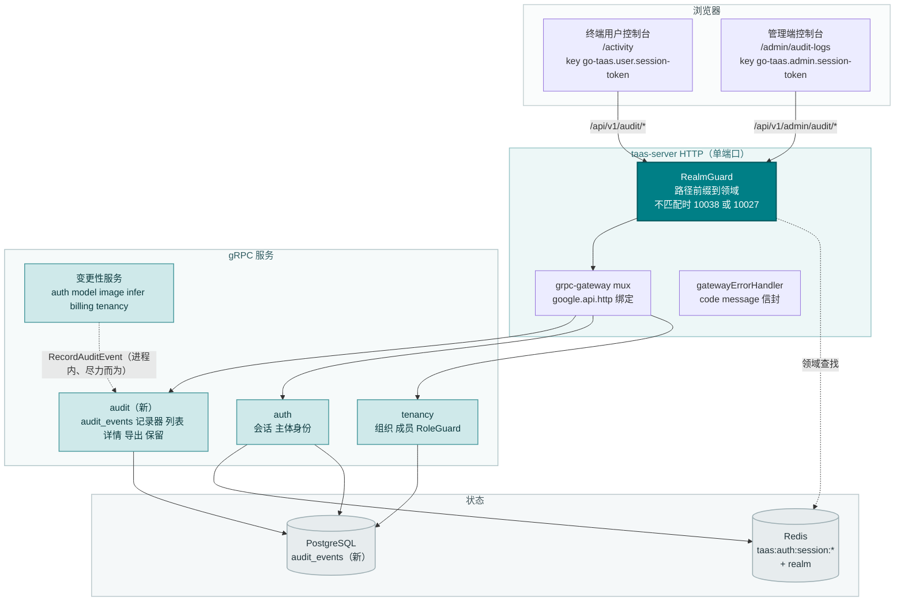
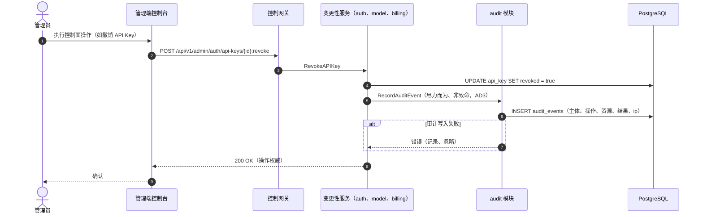
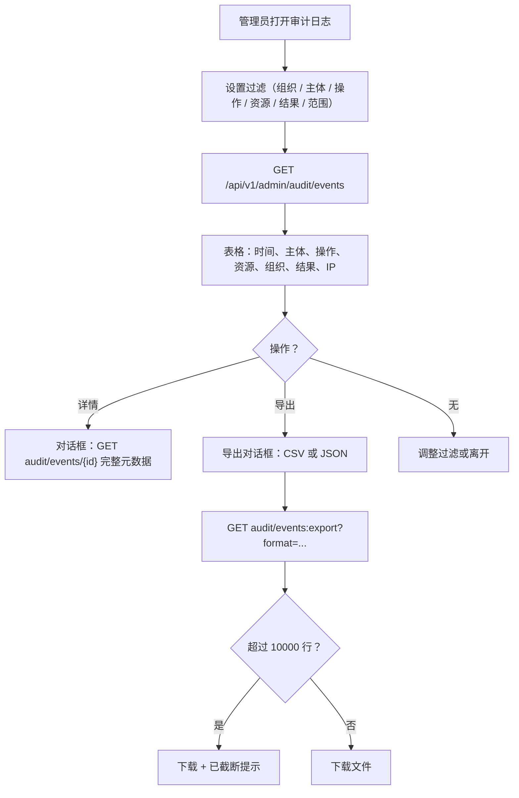
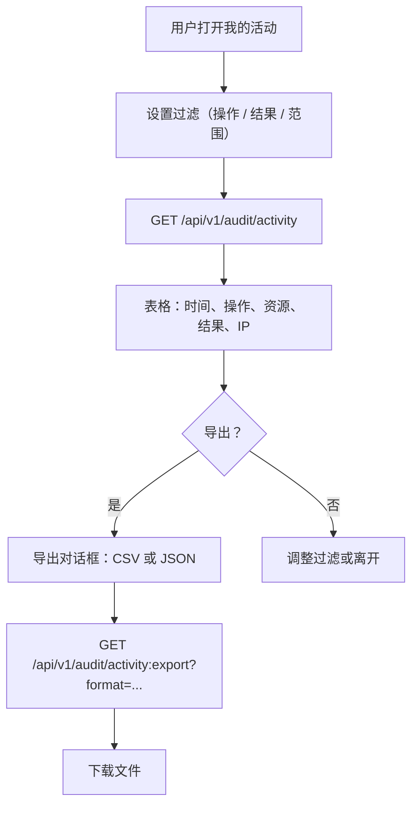
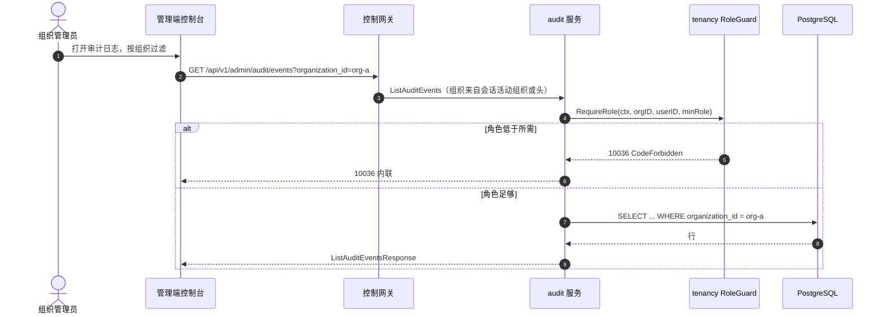

# 审计日志与活动导出 — 架构与详细设计

| 属性 | 内容 |
| --- | --- |
| 特性点 | 审计日志与活动导出 |
| 文档范围 | 特性 #15 的架构与详细设计：`audit_events` 表及其由每个变更性控制面 API 调用的尽力而为、非致命写入路径、带可过滤表格/下钻详情/CSV/JSON 导出的管理端「审计日志」页面、带范围限定导出的终端用户「我的活动」页面，以及错误处理、配置、安全、上线与逐层函数级设计 |
| 归属模块 | 新 `audit` 模块（`services/audit`）：`audit_events` 表、记录器、列表/详情/导出 RPC、保留运行器；`auth`（主体身份、会话领域）与 `tenancy`（组织范围、RoleGuard）只读；控制台 Web 应用 |
| 相关文档 | [需求分析与 UI/UX 设计](../design/audit-logging.zh-cn.md) · [架构设计](../design/architecture.zh-cn.md) 第 2.1 节（`auth`）、第 2.6 节（`billing`）、第 3.1 节（管理端/用户端表面分离）· [控制台表面分离](./console-surface-separation.zh-cn.md)（本特性两个页面必须遵守的双控制台拆分；领域守卫、10038）· [请求日志与 API 游乐场](./request-logs-playground.zh-cn.md)（本特性补充的诊断日志；尽力而为非致命写入模式）· [组织成员、角色与邀请](./org-members-rbac.zh-cn.md)（把关谁能查看与导出审计数据的 RoleGuard）· [多租户与组织隔离](./multi-tenancy.zh-cn.md)（过渡性 `X-Organization-Id` 身份） |
| 状态 | 架构完成，已移交开发代理 |

---

## 1. 概述与目标

特性 #1–#14 闭环了核算、可观测性与治理：API Key、模型、镜像、推理服务、定价、计量、计费、成员与邀请都有真实的行与控制台页面。但**谁在何时改了什么、结果如何，没有任何地方记录**。请求日志（特性 #12）捕获数据面上的每次推理诊断，但控制面 — 控制台里每次变更 Key、模型、价格、成员或账单的操作 — 不留任何痕迹。当运营者问「谁撤销了这个 API Key？」「谁改了这条价格？」「谁邀请了这位成员？」时，控制台没有答案。

本特性交付审计主干：记录每个控制面变更（主体、操作、资源、结果、IP、时间戳）的 `audit_events` 表、由每个变更性控制面 API 调用的尽力而为记录器、带可过滤表格/下钻详情/CSV/JSON 导出的管理端「审计日志」页面，以及展示调用方自身账户事件（带范围限定导出）的终端用户「我的活动」页面。两个页面位于两个独立控制台表面，遵循既定产品决策。

**目标**：拥有 `audit_events` 表及其生命周期的新 `audit` 模块；由每个变更性控制面 API 在操作成功后调用的尽力而为、非致命记录器；精选的操作分类（封闭枚举，而非自由文本）；`success` 与 `failure` 两种结果都记录；由周期性清理运行器强制、可配置的保留期（默认 365 天）；位于 `/api/v1/admin/audit/*` 下的 `ListAuditEvents` / `GetAuditEvent` / `ExportAuditEvents` 管理端 RPC；位于 `/api/v1/audit/*` 下的 `ListMyActivity` / `ExportMyActivity` 终端用户 RPC；新错误码 10601–10603；管理端「审计日志」页面（`/admin/audit-logs`）与终端用户「我的活动」页面（`/activity`）。

**非目标**（延后，设计 D10）：异步/桶导出（CloudTrail/Google sink 模式）；审计事件实时流；审计事件 webhook；按操作保留层级；数据面审计（特性 #12 拥有请求日志）；以及只读控制台视图的审计（只记录变更与认证事件）。

### 1.1 本文档阅读顺序

第 2 节记录架构决策（AD1–AD10，对应设计的 D1–D10）。第 3–5 节是组件视图、数据模型与 API 设计。第 6 节是前端架构（两个控制台的页面 → 路由 → API 前缀表、各表面的认证守卫）。第 7–8 节是关键时序与错误处理。第 9–11 节是配置、安全与上线。第 12–14 节是验收标准追溯、逐层函数级详细设计与有序实现任务清单。

---

## 2. 架构决策

| # | 决策 | 依据 |
| --- | --- | --- |
| AD1 | **新 `audit` 模块**（`services/audit`）拥有 `audit_events` 表、记录器、列表/详情/导出 RPC 与保留运行器，带自己的错误段 **106xx** | 审计是横切控制面关注点，有自己的生命周期与保留期；专用模块使其可分离、可测试，与计量模块拥有请求日志的方式一致（设计 D1） |
| AD2 | **`audit_events` 是与 `request_logs` 独立的表** — 同一思路，不同平面 | 请求日志是数据面每次推理的诊断（30 天保留期，特性 #12）；审计事件是控制面操作（365 天保留期、合规价值）。共享一张表会强制两者共用同一生命周期（设计 D2） |
| AD3 | **审计写入尽力而为、非致命** — 每个变更性控制面 API 在操作成功后调用记录器；记录器失败被记录，绝不失败或回滚操作 | 操作是权威；审计行是痕迹。失败的审计写入绝不能阻塞 Key 撤销或价格变更（设计 D3；请求日志 D2 模式） |
| AD4 | **精选的操作分类** — 封闭的操作名枚举（如 `api_key.revoke`、`member.remove`、`price.update`、`auth.login`），每个带人类可读标签，按资源类型分组 | 有界枚举可过滤、可渲染为徽标、可测试；自由文本操作会招致漂移（设计 D4） |
| AD5 | **两种结果都记录** — 每个事件携带 `result`（`success`/`failure`）；失败的登录与成功的 Key 撤销都值得审计 | 审计者需要全貌；只记录失败会隐藏破坏性的成功（设计 D5） |
| AD6 | **可配置保留期**（默认 365 天）由周期性清理运行器强制，与请求日志清理分离 | 审计事件有合规价值，窗口比诊断更长；保留期是配置，不是代码（设计 D6） |
| AD7 | **带行数上限的同步导出**（默认 10,000 行）— 控制台把当前过滤集合下载为 CSV 或 JSON；异步/桶导出延后 | 简单的控制台下载可在 Nightwatch 中测试并约束响应；桶导出是基础设施（设计 D7） |
| AD8 | **两个审计表面** — 展示所有租户事件的管理端「审计日志」页面（`/admin/audit-logs`，`/api/v1/admin/audit/*`），以及只展示调用方自身事件的终端用户「我的活动」页面（`/activity`，`/api/v1/audit/*`） | 双控制台拆分（特性 #17）具有约束力；管理端面向运营，终端用户面向任务（设计 D8） |
| AD9 | **新错误码 10601 `CodeAuditEventNotFound`、10602 `CodeAuditExportInvalid`、10603 `CodeAuditRangeInvalid`** | 106xx 段属于 audit 模块；每种失败模式需要自己的码，控制台才能渲染正确的内联消息（设计 D9；计量 D9 模式） |
| AD10 | **记录器是变更性服务到 audit 模块的进程内 gRPC 调用** — 无消息队列跳转、无独立部署 | 单 Deployment 拓扑（架构 §1.2）意味着模块间进程内互调；记录器是操作成功后的直接调用，因此不增加 MQ 延迟，也不会相对操作被重排（设计 D3） |

---

## 3. 组件视图

### 3.1 归属

| 层 / 组件 | 拥有 | 本特性的变更 |
| --- | --- | --- |
| **控制网关（grpc-gateway）** | 审计 RPC 的 HTTP/JSON 门面；领域守卫（特性 #17）已用 10038 拒绝错误领域的会话；透传 `X-Organization-Id` 为 gRPC 元数据 | 5 个 HTTP 审计 RPC 的新绑定（第 5 节）；领域守卫不变 |
| **`audit` 模块（`services/audit`）** | `audit_events` 表、记录器、列表/详情/导出 RPC、保留运行器 | **新模块**（AD1） |
| **`auth` 模块** | 主体身份、会话领域、会话活动组织 | 只读：记录器从会话解析主体；`SessionActiveOrg` 为带会话的调用提供组织 |
| **`tenancy` 模块** | 组织、成员、角色、RoleGuard | 只读：`RoleGuard` 按调用方在已解析组织上下文中的角色把关管理端审计 RPC（10036） |
| **变更性服务**（`auth`、`model`、`image`、`infer`、`billing`、`tenancy`） | 产生审计事件的控制面变更 | 每个变更性 RPC 在操作成功后调用审计记录器（AD3） |
| **PostgreSQL** | `audit_events` 表（新）；其余表不变 | 经 AutoMigrate 新增一张表（第 4 节） |
| **控制台** | 管理端「审计日志」页面与终端用户「我的活动」页面 | 两个表面上的两个新页面（第 6 节） |

### 3.2 运行时组件视图



### 3.3 请求身份链

审计 RPC 复用既有的身份链（控制台表面分离 §3.3）：

1. `RealmGuard`（HTTP，`pkg/server/realm.go`）— 路径前缀决定期望领域。`/api/v1/admin/audit/*` 期望 `admin`；`/api/v1/audit/*` 期望 `user`。无 `Authorization` 头：透传（过渡性，特性 #17 的 AD4）。带头：从 Redis 解析会话领域；不匹配 → 10038，未知/过期/无领域 → 10027。
2. grpc-gateway mux — 按注解路径路由，透传 `authorization` 与 `x-organization-id`。
3. 服务处理器 — 对带会话的调用，`SessionActiveOrg` 使会话的活动组织权威并忽略 `X-Organization-Id`；无会话时，`resolveOrganizationID` 读取过渡性头，缺失或为空时返回 10001。
4. `tenancy.RoleGuard` — 按调用方在已解析组织上下文中的角色把关管理端审计 RPC（10036）。终端用户 RPC 硬性限定到调用方，无需角色检查。

---

## 4. 数据模型

### 4.1 `audit_events` 表

| 列 | PostgreSQL 类型 | 约束 | 描述 |
| --- | --- | --- | --- |
| `audit_event_id` | `uuid` | 主键 | 服务端生成的 UUID v4，暴露为 `audit_event_id` |
| `organization_id` | `varchar(64)` | 可空，索引（复合） | 所属组织；平台级事件为 NULL（如平台管理员在组织外操作） |
| `actor_user_id` | `varchar(64)` | 非空，索引（复合） | 执行操作的用户；系统发起的事件为 `system` |
| `actor_type` | `varchar(16)` | 非空 | `user` / `system` / `api_key` |
| `action` | `varchar(64)` | 非空，索引 | 精选操作名（AD4），如 `api_key.revoke` |
| `resource_type` | `varchar(32)` | 非空，索引 | 资源类别，如 `api_key`、`model`、`member`、`price` |
| `resource_id` | `varchar(128)` | 非空 | 资源实例 id |
| `result` | `varchar(16)` | 非空，索引 | `success` / `failure`（AD5） |
| `ip_address` | `varchar(64)` | 非空默认 '' | 调用方源 IP（已知时） |
| `user_agent` | `varchar(512)` | 非空默认 '' | 调用方用户代理（已知时） |
| `metadata` | `jsonb` | 非空默认 '{}' | 额外上下文（如被改字段的旧/新值） |
| `created_at` | `timestamptz` | 非空，索引（复合） | 事件时间（UTC） |

设计说明：

- 复合索引：`idx_audit_events_org_created (organization_id, created_at)` 用于组织范围列表；`idx_audit_events_actor_created (actor_user_id, created_at)` 用于终端用户活动列表；`action`、`resource_type` 与 `result` 索引用于过滤（FR1.3）。
- 无指向 `users` / `api_keys` / `models` / `inference_services` 的外键：审计事件必须比已撤销的 Key、已删除的模型与已移除的成员存活更久 — 它们是合规证据，而非关系状态（与凭证/请求日志的推理一致）。
- 审计事件不可变：无 API 更新或删除它们；审计保留运行器是唯一删除者（AD6）。
- `organization_id` 可空，因为平台级事件（如平台管理员在组织外操作）没有组织；管理端列表把 NULL 视为「平台级」，终端用户列表永远看不到它（按 `actor_user_id` 限定）。

### 4.2 迁移说明

- 表由 `taas-server` 启动时的 GORM `AutoMigrate` 创建（增量；无数据迁移）。`Migrate`/`MigrateSchemaForFVT` 增加 `AuditEvent` 模型。
- 无需 init-SQL 升级路径：表是新的，上线时为空；变更性 API 一运行，记录器就开始填充。
- 审计保留运行器是唯一删除者；它绝不触碰请求日志、凭证、用量记录或计费记录（FR2.2）。

---

## 5. API 设计

所有审计 RPC 属于新 **`taas.audit.v1.AuditService`**（`proto/taas/audit/v1/audit.proto`），经控制网关以 HTTP 提供。管理端 RPC 位于 `/api/v1/admin/audit/*` 下；终端用户 RPC 位于 `/api/v1/audit/*` 下。记录器是变更性服务到 audit 模块的内部 gRPC 调用（进程内，遵循单 Deployment 拓扑，AD10）。

| RPC | HTTP | 状态 | 用途 | 备注 |
| --- | --- | --- | --- | --- |
| `RecordAuditEvent` | （内部 gRPC，无 HTTP 绑定） | **新** | 由变更性服务调用的尽力而为记录器 | 非致命；绝不失败操作（AD3） |
| `ListAuditEvents` | `GET /api/v1/admin/audit/events` | **新** | 所有租户的事件，已过滤 | 管理端会话；RoleGuard 组织范围；10603 |
| `GetAuditEvent` | `GET /api/v1/admin/audit/events/{audit_event_id}` | **新** | 单个事件的完整元数据 | 管理端会话；10601 |
| `ExportAuditEvents` | `GET /api/v1/admin/audit/events:export` | **新** | 过滤集合的 CSV/JSON | 管理端会话；上限 10,000；10602 |
| `ListMyActivity` | `GET /api/v1/audit/activity` | **新** | 调用方自身的事件 | 用户会话；硬性限定到调用方；10603 |
| `ExportMyActivity` | `GET /api/v1/audit/activity:export` | **新** | 调用方自身事件的 CSV/JSON | 用户会话；硬性限定；上限 10,000；10602 |

### 5.1 Proto 契约

```protobuf
syntax = "proto3";

package taas.audit.v1;

import "google/api/annotations.proto";
import "taas/common/v1/common.proto";

option go_package = "github.com/go-taas/go-taas/proto/taas/audit/v1;auditv1";

// AuditService 记录控制面变更，并向管理端控制台暴露审计轨迹、
// 向终端用户控制台暴露调用方自身的活动。
service AuditService {
  // RecordAuditEvent 是每个变更性控制面 API 在操作成功后调用的
  // 尽力而为、非致命记录器。无 HTTP 绑定（集群内部表面，AD10）。
  rpc RecordAuditEvent(RecordAuditEventRequest) returns (RecordAuditEventResponse);

  // ListAuditEvents 返回跨租户的审计事件，按组织、主体、操作、
  // 资源类型、结果与时间范围过滤。
  // 管理端表面 API：位于 /api/v1/admin 下。
  rpc ListAuditEvents(ListAuditEventsRequest) returns (ListAuditEventsResponse) {
    option (google.api.http) = {get: "/api/v1/admin/audit/events"};
  }

  // GetAuditEvent 返回单个审计事件的完整元数据，用于下钻。
  // 管理端表面 API：位于 /api/v1/admin 下。
  rpc GetAuditEvent(GetAuditEventRequest) returns (GetAuditEventResponse) {
    option (google.api.http) = {get: "/api/v1/admin/audit/events/{audit_event_id}"};
  }

  // ExportAuditEvents 把过滤集合返回为 CSV 或 JSON，上限 10000 行。
  // 管理端表面 API：位于 /api/v1/admin 下。
  rpc ExportAuditEvents(ExportAuditEventsRequest) returns (ExportAuditEventsResponse) {
    option (google.api.http) = {get: "/api/v1/admin/audit/events:export"};
  }

  // ListMyActivity 返回调用方自身的审计事件。
  // 用户表面 API：位于 /api/v1 下；硬性限定到调用方。
  rpc ListMyActivity(ListMyActivityRequest) returns (ListMyActivityResponse) {
    option (google.api.http) = {get: "/api/v1/audit/activity"};
  }

  // ExportMyActivity 把调用方自身的过滤事件返回为 CSV 或 JSON，
  // 上限 10000 行。
  // 用户表面 API：位于 /api/v1 下；硬性限定到调用方。
  rpc ExportMyActivity(ExportMyActivityRequest) returns (ExportMyActivityResponse) {
    option (google.api.http) = {get: "/api/v1/audit/activity:export"};
  }
}

enum AuditActorType {
  AUDIT_ACTOR_TYPE_UNSPECIFIED = 0;
  AUDIT_ACTOR_TYPE_USER = 1;
  AUDIT_ACTOR_TYPE_SYSTEM = 2;
  AUDIT_ACTOR_TYPE_API_KEY = 3;
}

enum AuditResult {
  AUDIT_RESULT_UNSPECIFIED = 0;
  AUDIT_RESULT_SUCCESS = 1;
  AUDIT_RESULT_FAILURE = 2;
}

enum AuditExportFormat {
  AUDIT_EXPORT_FORMAT_UNSPECIFIED = 0;
  AUDIT_EXPORT_FORMAT_CSV = 1;
  AUDIT_EXPORT_FORMAT_JSON = 2;
}

message AuditEvent {
  string audit_event_id = 1;
  string organization_id = 2;   // 平台级事件为空
  string actor_user_id = 3;
  AuditActorType actor_type = 4;
  string action = 5;            // 精选枚举名，如 "api_key.revoke"
  string resource_type = 6;
  string resource_id = 7;
  AuditResult result = 8;
  string ip_address = 9;
  string user_agent = 10;
  string metadata = 11;         // metadata 对象的 JSON 字符串
  int64 created_at = 12;        // unix 秒
}

message RecordAuditEventRequest {
  string organization_id = 1;
  string actor_user_id = 2;
  AuditActorType actor_type = 3;
  string action = 4;
  string resource_type = 5;
  string resource_id = 6;
  AuditResult result = 7;
  string ip_address = 8;
  string user_agent = 9;
  string metadata = 10;         // JSON 字符串
}

message RecordAuditEventResponse {
  taas.common.v1.Response response = 1;
  string audit_event_id = 2;
}

message ListAuditEventsRequest {
  taas.common.v1.PageRequest page = 1;
  string organization_id = 2;   // 空 = 所有组织（管理端）
  string actor_user_id = 3;
  string action = 4;
  string resource_type = 5;
  AuditResult result = 6;
  int64 since = 7;
  int64 until = 8;
}

message ListAuditEventsResponse {
  taas.common.v1.Response response = 1;
  repeated AuditEvent audit_events = 2;
  taas.common.v1.PageMeta page_meta = 3;
}

message GetAuditEventRequest { string audit_event_id = 1; }

message GetAuditEventResponse {
  taas.common.v1.Response response = 1;
  AuditEvent audit_event = 2;
}

message ExportAuditEventsRequest {
  string organization_id = 1;
  string actor_user_id = 2;
  string action = 3;
  string resource_type = 4;
  AuditResult result = 5;
  int64 since = 6;
  int64 until = 7;
  AuditExportFormat format = 8;
}

message ExportAuditEventsResponse {
  taas.common.v1.Response response = 1;
  string content = 2;           // CSV 或 JSON 文本
  bool truncated = 3;           // 命中上限时为 true
}

message ListMyActivityRequest {
  taas.common.v1.PageRequest page = 1;
  string action = 2;
  AuditResult result = 3;
  int64 since = 4;
  int64 until = 5;
}

message ListMyActivityResponse {
  taas.common.v1.Response response = 1;
  repeated AuditEvent audit_events = 2;
  taas.common.v1.PageMeta page_meta = 3;
}

message ExportMyActivityRequest {
  string action = 1;
  AuditResult result = 2;
  int64 since = 3;
  int64 until = 4;
  AuditExportFormat format = 5;
}

message ExportMyActivityResponse {
  taas.common.v1.Response response = 1;
  string content = 2;
  bool truncated = 3;
}
```

### 5.2 契约约束

1. **表面分离**：管理端 RPC 位于 `/api/v1/admin/audit/*` 下并需要管理端会话；终端用户 RPC 位于 `/api/v1/audit/*` 下并需要用户会话。两者绝不混用（特性 #17）。领域守卫在任何处理器运行前用 10038 拒绝错误领域的会话。
2. **线格式约定不变**：点分分页（`?page.offset=0&page.limit=20`）、成功 HTTP 200、业务错误为 `{"code": <int>, "message": "..."}`、int64 字段为 JSON 字符串。
3. **导出契约**：`ExportAuditEvents`/`ExportMyActivity` 采用与其列表 RPC 相同的过滤条件，外加 `format=csv|json`；非法 `format` 返回 10602；超过 10,000 行上限的集合返回前 10,000 行并带 `truncated: true`（AD7）。
4. **范围校验**：`since`/`until` 为 int64 unix 秒；默认 `until = now`，`since = until − 24h`；`since > until` 或范围 > 366 天返回 10603（FR3.1/FR4.1）。
5. **记录器**：`RecordAuditEvent` 尽力而为、非致命 — 变更性服务在操作成功后调用它并忽略其失败（AD3）。

### 5.3 错误码

所有错误都是统一信封中的 `pkg/errors` 业务码。分配三个新码（AD9）；其余已存在。

| 条件 | 码 | 常量 | 备注 |
| --- | --- | --- | --- |
| `GetAuditEvent` 时未知 `audit_event_id` | 10601 | `CodeAuditEventNotFound` | **新**（AD9） |
| 非法导出 `format`（非 `csv`/`json`） | 10602 | `CodeAuditExportInvalid` | **新** |
| 非法时间范围（`since > until` 或 > 366 天） | 10603 | `CodeAuditRangeInvalid` | **新** |
| 调用方角色低于所需角色（管理端组织范围） | 10036 | `CodeForbidden` | 现有（特性 #10） |
| 缺失/过期/已撤销会话 | 10027 | `CodeSessionInvalid` | 现有（特性 #7） |
| 错误领域会话出现在另一前缀 | 10038 | `CodeRealmMismatch` | 现有（特性 #17） |
| 管理端 API 缺失 `X-Organization-Id`（过渡性） | 10001 | `CodeUnauthorized` | `resolveOrganizationID` 模式 |
| 数据库失败 | 500 | `CodeInternal` | 经错误归一化 |

---

## 6. 前端架构

### 6.1 页面 → 路由 → API 前缀表

| 页面 / 组件 | 表面 | Web 路由 | API 前缀 | 认证守卫 |
| --- | --- | --- | --- | --- |
| **审计日志页面** | 管理端 | `/admin/audit-logs` | `/api/v1/admin/audit/events` | 管理端会话；RoleGuard 组织范围 |
| **审计事件详情对话框** | 管理端 | （在审计日志页面上） | `/api/v1/admin/audit/events/{id}` | 管理端会话 |
| **审计导出（CSV/JSON）** | 管理端 | （在审计日志页面上） | `/api/v1/admin/audit/events:export` | 管理端会话 |
| **我的活动页面** | 终端用户 | `/activity` | `/api/v1/audit/activity` | 用户会话；硬性限定到调用方 |
| **我的活动导出（CSV/JSON）** | 终端用户 | （在我的活动页面上） | `/api/v1/audit/activity:export` | 用户会话；硬性限定 |

> 管理端「审计日志」页面只调用 `/api/v1/admin/audit/*`；终端用户「我的活动」页面只调用 `/api/v1/audit/*`。两个表面绝不共享会话令牌（特性 #17）。

### 6.2 导航位置

- **管理端控制台**：管理端导航新增 **审计日志** 项（`/admin/audit-logs`），位于治理分组，与成员和邀请并列。
- **终端用户控制台**：用户导航新增 **我的活动** 项（`/activity`），与用量、API Key 和计费并列。

### 6.3 复用的共享组件与状态

- **API 客户端**（`web/src/api.ts`）：领域限定的客户端已发送 `Authorization: Bearer <realm>.session-token` 与 `X-Organization-Id`（仅当领域令牌键为空时）。审计页面原样复用；不新增客户端。
- **过滤栏**：时间范围预设控件（24 小时 / 7 天 / 30 天 / 90 天 / 自定义）与请求日志和用量页面共享；审计页面复用。
- **结果徽标**：`success`/`failure` 徽标样式与请求日志状态徽标共享。
- **导出对话框**：提供 CSV 或 JSON 并触发下载的小型共享组件；两个审计页面复用。
- **空状态 / 数据新鲜度提示**：复用请求日志页面模式（事件在摄取窗口内出现的提示、可见时每 60 秒轮询）。

### 6.4 各表面的认证守卫

- **管理端「审计日志」页面**（`/admin/audit-logs`）：在 `AdminShell` 内渲染，当 `go-taas.admin.session-token` 非空时运行管理端会话守卫；缺失/过期会话重定向到 `/admin/login?reason=expired`；错误领域会话被网关以 10038 拒绝。页面 API 调用发往 `/api/v1/admin/audit/*`。
- **终端用户「我的活动」页面**（`/activity`）：在 `UserShell` 内渲染，当 `go-taas.user.session-token` 非空时运行用户会话守卫；缺失/过期会话重定向到 `/login?reason=expired`。页面 API 调用发往 `/api/v1/audit/*`。
- **未认证访客**：任一页面的未认证访客被外壳守卫重定向到正确的登录页（`/admin/login` 对 `/login`）（AC13）。

### 6.5 控制台契约（为开发代理固定）

**审计日志页面**（`/admin/audit-logs`）：过滤栏（组织、主体、操作、资源类型、结果、带 24 小时/7 天/30 天/90 天/自定义预设的时间范围）与表格 — 时间、主体、操作徽标、资源、组织、结果徽标、IP。行操作「详情」打开下钻对话框（`GetAuditEvent`）展示完整元数据：主体、主体类型、操作、资源类型/id、结果、IP、用户代理、组织、metadata JSON、created_at。「导出」按钮（`audit-export`）提供 CSV 与 JSON；它导出当前应用的过滤条件。导出超过 10,000 行上限时出现「已截断」提示。页面显示数据新鲜度提示（「审计事件在摄取窗口内出现」）并在可见时每 60 秒轮询刷新。空状态：「没有匹配这些过滤条件的审计事件」。Testid：`audit-table`、`audit-row-{id}`、`audit-filter-action`、`audit-filter-result`、`audit-filter-range`、`audit-detail-{id}`、`audit-export`。

**我的活动页面**（`/activity`）：过滤栏（操作、结果、带 24 小时/7 天/30 天/自定义预设的时间范围）与表格 — 时间、操作徽标、资源、结果徽标、IP。「导出」按钮（`activity-export`）提供 CSV 与 JSON；它导出调用方自身的过滤事件。导出超过 10,000 行上限时出现「已截断」提示。页面硬性限定到调用方；没有组织选择器，也没有下钻到其他用户。空状态：「暂无活动 — 你的账户操作将出现在这里」。Testid：`activity-table`、`activity-row-{id}`、`activity-filter-action`、`activity-filter-result`、`activity-export`。

---

## 7. 关键时序

### 7.1 审计事件记录（尽力而为、非致命）



### 7.2 审计日志页面流程（管理端）



### 7.3 我的活动页面流程（终端用户）



### 7.4 管理端组织范围（RoleGuard）



---

## 8. 错误处理

所有错误都是统一信封中的 `pkg/errors` 业务码（第 5.3 节）。运行器侧失败不是 RPC 错误：审计保留删除失败被记录并在下一个 tick 重试（凭证保留模式）。变更性服务内部的审计写入失败被记录，绝不失败或回滚操作（AD3，AC2）。

控制台按 body `code` 分支（`web/src/api.ts` 已如此），绝不按 HTTP 状态。每个新码渲染特定的内联消息：10601「审计事件不存在」、10602「非法导出格式」、10603「非法时间范围」。

---

## 9. 配置新增

| 键 | 默认 | 描述 |
| --- | --- | --- |
| `audit.retention.enabled` | `true` | 开关审计保留运行器（事件分诊 kill switch） |
| `audit.retention.eventTTL` | `8760h`（365 天） | 早于该值的审计事件被审计保留运行器删除（AD6） |
| `audit.retention.batchSize` | `1000` | 每次保留通过删除的行数 |
| `audit.retention.interval` | `1h` | 保留通过之间的 ticker 周期 |
| `audit.export.maxRows` | `10000` | 导出行数上限（AD7） |

`audit` 配置块在 `pkg/config` 中新增（`AuditConfig` + `AuditRetentionConfig`），遵循 `metering.retention` 模式。`applyDefaults`/`Validate` 设置上述默认值。导出上限由导出 RPC 读取；保留运行器读取 `enabled`/`eventTTL`/`batchSize`/`interval`。

---

## 10. 安全考量

- **表面分离**：管理端「审计日志」页面只调用 `/api/v1/admin/audit/*`；「我的活动」页面只调用 `/api/v1/audit/*`。领域守卫在任何处理器运行前用 10038 拒绝错误领域的会话（特性 #17）。
- **管理端组织范围**：每个管理端审计查询从会话活动组织（或过渡性 `X-Organization-Id`）解析组织，并由 `tenancy.RoleGuard` 把关 — 调用方只能查看/导出其可访问组织的事件；不可访问的组织返回 10036（AC8）。
- **终端用户硬性限定**：`ListMyActivity`/`ExportMyActivity` 硬性限定到调用方（`actor_user_id` = 调用方）；调用方绝不能看到或导出其他用户的事件（AC7，US9）。「我的活动」页面没有组织选择器，也没有下钻到其他用户。
- **无明文、无请求体**：审计事件携带 metadata（JSON 字符串），但绝不携带请求/响应体或 API Key 明文；记录器只存储主体 id、操作、资源、结果、IP 与用户代理。
- **不可变证据**：审计事件不可变 — 无 API 更新或删除它们；保留运行器是唯一删除者，且绝不触碰请求日志、凭证、用量记录或计费记录（FR2.2）。
- **尽力而为隔离**：审计写入失败被记录，绝不失败或回滚操作（AD3）— 权威控制面路径不受影响。

---

## 11. 上线 / 升级说明

- **一张新表** 经 AutoMigrate（增量）；单独部署 `taas-server`。审计保留运行器在首次通过前空闲；事件存在前查询返回空。
- **记录器是增量**：变更性服务在操作成功后调用 `RecordAuditEvent`；在某个变更性服务接入前，它不产生审计事件。控制台页面在事件存在前渲染空状态。
- **Proto 变更是增量**：新 `taas.audit.v1.AuditService` 带新 RPC；无既有 RPC 或消息变更。网关 mux 增加新绑定；领域守卫不变。
- **控制台**：两个新页面加入既有 bundle；管理端导航新增审计日志，用户导航新增我的活动。无既有路由变更。
- **无数据迁移**：`audit_events` 表是新的，上线时为空；无需 init-SQL 升级路径。
- **向后兼容**：过渡性（无会话、`X-Organization-Id`）路径为 CLI、FVT 与 e2e 套件保留；领域守卫透传无 `Authorization` 头的请求（特性 #17 AD4）。

---

## 12. 验收标准追溯

| # | 标准 | 覆盖位置 |
| --- | --- | --- |
| AC1 | `RecordAuditEvent` 存储 `audit_events` 行；变更性 API 产生 `success` 事件 | §4.1、§5.1、§7.1 |
| AC2 | 尽力而为、非致命 — 记录器失败绝不失败操作 | AD3、§7.1、§8 |
| AC3 | 两种结果都记录 — 失败的登录与成功的 Key 撤销都产生事件 | AD5、§4.1 |
| AC4 | `ListAuditEvents` 按组织/主体/操作/资源/结果/范围过滤，最新在前，分页；非法范围返回 10603 | §5.1、§5.2 |
| AC5 | `GetAuditEvent` 返回完整元数据；未知 id 返回 10601 | §5.1、§5.3 |
| AC6 | `ExportAuditEvents` 返回 CSV/JSON；非法格式返回 10602；超上限返回前 10,000 行并带 `truncated: true` | §5.1、§5.2 |
| AC7 | 终端用户范围限定 — `ListMyActivity`/`ExportMyActivity` 只返回调用方的事件 | §5.1、§6.4、§10 |
| AC8 | 管理端组织范围 — 不可访问的组织返回 10036 | §5.3、§7.4、§10 |
| AC9 | 保留期 — 超过 365 天的事件被分批删除；其他表不受影响 | AD6、§4.2、§9 |
| AC10 | 管理端「审计日志」页面以指定 testid 渲染表格/过滤/详情/导出 | §6.5 |
| AC11 | 管理端页面显示空状态、已截断提示、数据新鲜度提示 | §6.5 |
| AC12 | 「我的活动」页面以指定 testid 渲染表格/过滤/导出 | §6.5 |
| AC13 | 表面分离 — 每个页面只调用自己的前缀；未认证访客被重定向到正确的登录页 | §6.1、§6.4、§10 |
| AC14 | 回归 — 数据面不变；请求日志仍捕获诊断；审计事件不把关推理流量 | §11、§10 |

---

## 13. 详细设计（逐层函数级职责）

### 13.1 Proto → 服务 → 仓库 → 控制器

| 层 | 文件 | 职责 |
| --- | --- | --- |
| `proto/taas/audit/v1` | `audit.proto` | 新 `AuditService`，含 `RecordAuditEvent`（无 HTTP 绑定）、`ListAuditEvents`、`GetAuditEvent`、`ExportAuditEvents`、`ListMyActivity`、`ExportMyActivity`；枚举 `AuditActorType`、`AuditResult`、`AuditExportFormat`；消息 `AuditEvent`、`RecordAuditEventRequest/Response`、`ListAuditEventsRequest/Response`、`GetAuditEventRequest/Response`、`ExportAuditEventsRequest/Response`、`ListMyActivityRequest/Response`、`ExportMyActivityRequest/Response`（第 5.1 节）。经 `buf generate` 重新生成 `audit.pb.go`/`audit_grpc.pb.go`/`audit.pb.gw.go` |
| `services/audit` | `audit_model.go` | 新 GORM 模型 `AuditEvent` + `TableName`（第 4.1 节） |
| | `audit_repository.go` | `InsertAuditEvent(ctx, event)` — INSERT，返回生成的 id；`FindAuditEventByID(ctx, id)`（未知时 10601）；`ListAuditEvents(ctx, filter)`（组织/主体/操作/资源/结果/范围，最新在前，分页）；`ListMyActivity(ctx, actorUserID, filter)`（硬性限定到调用方）；`DeleteAuditEventsBefore(ctx, cutoff, batch)` |
| | `service.go` | 新 RPC `RecordAuditEvent`、`ListAuditEvents`、`GetAuditEvent`、`ExportAuditEvents`、`ListMyActivity`、`ExportMyActivity`；`Migrate`/`MigrateSchemaForFVT` 增加 `AuditEvent`；组织解析的 `SessionActiveOrg`/`resolveOrganizationID` 接缝；管理端组织范围的 `RoleGuard` 接缝 |
| | `recorder.go` | `Recorder` — 尽力而为、非致命包装：`Record(ctx, event)` 调用仓库并记录（绝不返回）失败（AD3）；导出供变更性服务注入 |
| | `export.go` | `renderCSV(events)` / `renderJSON(events)` — CSV/JSON 序列化器；`applyExportCap(events, maxRows)` 返回截断切片 + `truncated` 标志（AD7） |
| | `audit_retention_runner.go` | `AuditRetentionRunner`（server.Runner，独立 ticker）+ 为测试抽取的 `RetainOnce(ctx)`（`RetentionRunner`/`ReconcileOnce` 模式） |
| `services/auth` | `service.go` | 只读：向记录器暴露主体身份与会话领域；`SessionActiveOrg` 不变 |
| `services/tenancy` | `role_guard.go` | 只读：复用 `RoleGuard.RequireRole` 把关管理端审计 RPC（10036） |
| 变更性服务 | `service.go`（各） | 每个变更性 RPC 在操作成功后调用注入的 `Recorder.Record`（AD3）；记录器在装配时注入（`SetDeleteModelGuard` 模式） |
| `pkg/errors` | `codes.go`/`messages.go` | `CodeAuditEventNotFound`（10601）、`CodeAuditExportInvalid`（10602）、`CodeAuditRangeInvalid`（10603）常量 + 规范消息 |
| `pkg/config` | `api.go`/`configuration.go` | `AuditConfig` + `AuditRetentionConfig`（第 9 节）+ `applyDefaults`/`Validate` |
| `apps/taas-server` | `main.go` | 向 gRPC 服务器与网关 mux 注册 `AuditService`；在 `srv.Init()` 后注册 `AuditRetentionRunner`；把记录器接入变更性服务 |
| `web/src` | `pages/AuditLogsPage.tsx`、`pages/MyActivityPage.tsx`、`App.tsx`、`api.ts` | 路由 `/admin/audit-logs` 与 `/activity`；`AuditEvent`/`ListAuditEvents`/`ExportAuditEvents`/`ListMyActivity`/`ExportMyActivity` API 类型与调用（第 6.5 节） |
| `test` | `fvt/audit_logging_fvt_test.go`、`e2e/tests/auditLogging.js` | 第 14 节 |

### 13.2 哪个 React 页面/模块实现哪个界面

| 界面 | React 模块 | 路由 | API 调用 |
| --- | --- | --- | --- |
| 审计日志页面 | `web/src/pages/AuditLogsPage.tsx` | `/admin/audit-logs` | `ListAuditEvents`、`GetAuditEvent`、`ExportAuditEvents` |
| 审计事件详情对话框 | `web/src/pages/AuditLogsPage.tsx`（对话框组件） | （在审计日志页面上） | `GetAuditEvent` |
| 导出对话框 | `web/src/components/ExportDialog.tsx`（共享） | （在每个页面上） | `ExportAuditEvents` / `ExportMyActivity` |
| 我的活动页面 | `web/src/pages/MyActivityPage.tsx` | `/activity` | `ListMyActivity`、`ExportMyActivity` |

---

## 14. 测试策略

- **单元**（`services/audit`，sqlite 内存）：`audit_repository_test.go` — `InsertAuditEvent` 往返（AC1）、`FindAuditEventByID`（未知时 10601，AC5）、`ListAuditEvents` 过滤（组织/主体/操作/资源/结果/范围，最新在前，分页，AC4）、`ListMyActivity` 硬性限定（AC7）、`DeleteAuditEventsBefore` 分批（AC9）。`service_test.go` — `RecordAuditEvent` 存储一行（AC1）；记录器失败被记录且绝不失败操作（AC2）；两种结果都记录（AC3）；范围校验返回 10603（AC4）；导出格式校验返回 10602 且上限返回 `truncated: true`（AC6）；管理端组织范围返回 10036（AC8）；经 `RetainOnce` 的保留期不触碰请求日志/凭证/用量/计费记录（AC9）。新文件覆盖率 ≥ 80%。
- **FVT**（`test/fvt/audit_logging_fvt_test.go`，计量 FVT 模式：文件 sqlite + `MigrateSchemaForFVT` + `NewForFVT` + 带生产拦截器的 gRPC 服务器 + 带 `FVTHeaderMatcher` 的网关 mux）：经网关记录事件并断言行（AC1）；`ListAuditEvents` 过滤与分页（AC4）；`GetAuditEvent` 完整元数据与 10601（AC5）；`ExportAuditEvents` CSV/JSON、10602 与截断上限（AC6）；`ListMyActivity`/`ExportMyActivity` 只返回调用方的事件（AC7）；第二个组织永远看不到第一个组织的行，且不可访问的组织返回 10036（AC8）；失败的登录与成功的 Key 撤销都产生事件（AC3）。
- **E2E**（`test/e2e/tests/auditLogging.js`，`requestLogsPlayground.js` 模式）：对 compose 栈 — 管理端「审计日志」页面渲染 `audit-row-{id}`，过滤为 `audit-filter-action`/`audit-filter-result`/`audit-filter-range`，详情对话框 `audit-detail-{id}` 显示完整元数据，`audit-export` 下载 CSV/JSON（AC10）；空状态、已截断提示与数据新鲜度提示渲染（AC11）；「我的活动」页面渲染 `activity-row-{id}`，过滤 `activity-filter-action`/`activity-filter-result`，经 `activity-export` 导出（AC12）；任一页面的未认证访客被重定向到正确的登录页（`/admin/login` 对 `/login`），且每个页面只调用自己的前缀（AC13）。
- **回归**：既有 e2e 套件保持绿色；数据面不变 — 请求日志（特性 #12）仍捕获每次推理诊断，审计事件不把关推理流量（AC14）。

---

## 15. 开放问题

| 问题 | 倾向 |
| --- | --- |
| 大型审计的异步/桶导出 | 延后（AD7）— 仅当 10,000 行上限被证明不足时重访；需要 sink/对象存储设计 |
| 审计事件实时流 | 未来 UX 细化 — v1 以 60 秒间隔轮询 |
| 审计事件 webhook | 未来基础设施 — 需要 webhook 投递与重试设计 |
| 按操作保留层级 | 未来 — v1 对所有事件使用单一 365 天窗口 |
| 数据面审计（每次推理操作） | 特性 #12 拥有请求日志；审计事件保持仅控制面 |
| 只读控制台视图的审计 | 未来 — v1 只记录变更与认证事件 |