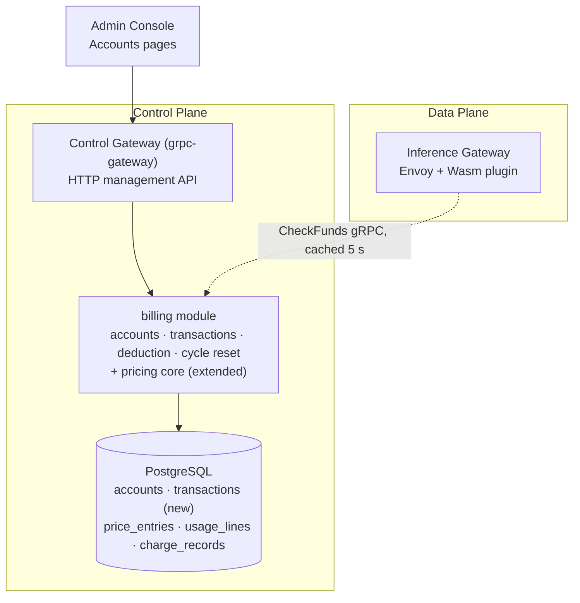
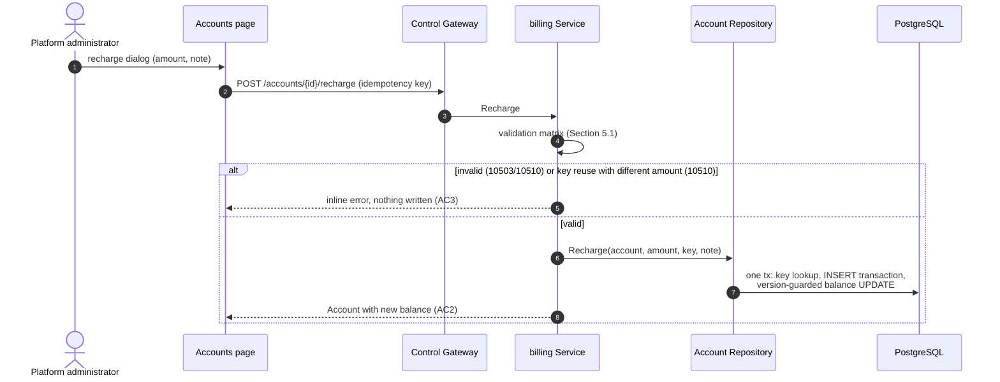
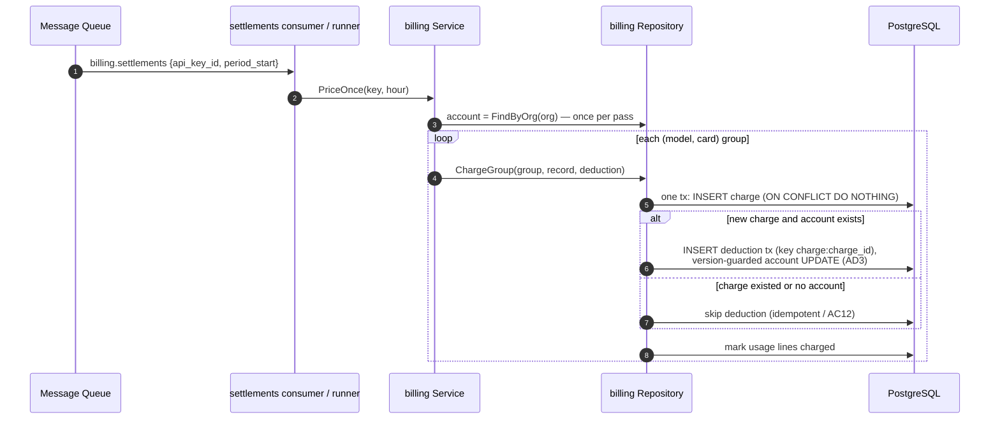
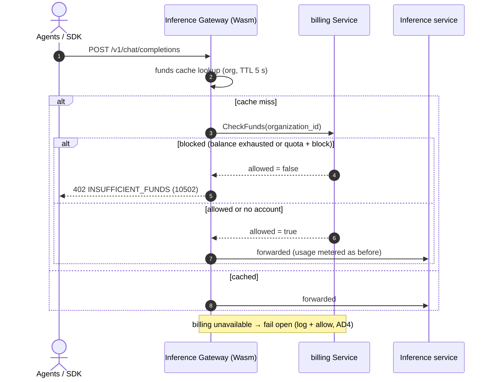
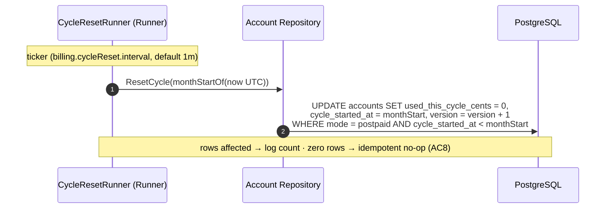

# Balance (Prepaid) & Quota (Postpaid) Account Modes — Architecture and Detailed Design

| Attribute | Content |
| --- | --- |
| Feature point | Balance (prepaid) & quota (postpaid) account modes |
| Document scope | Architecture and detailed design for the billing account core: per-organization accounts (prepaid/postpaid), recharge and refund, settlement-time deduction, inference gating, monthly cycle reset, the transaction ledger, console Accounts pages, error handling, configuration, and function-level design per layer |
| Owning modules | `billing` (accounts, transactions, deduction, cycle reset, gating check), with the Inference Gateway as the enforcement point (data-plane track) |
| Related documents | [Requirement Analysis and UI/UX Design](../design/balance-quota.md) · [Architecture Design](../design/architecture.md) Section 2.6 (`billing`) · [Token Metering Vouchers & Async Settlement](./metering.md) (the settlement pipeline) · [Price Matrix & Tiered Pricing](./pricing.md) (the charge engine this feature hooks into) · [Multi-Tenancy Isolation](./multi-tenancy.md) (org scoping) |
| Status | Architecture complete, handed to the Developer agent |

---

## 1. Overview and Goals

Features #1–#7 shipped the accounting spine: keys identify callers, usage meters and settles hourly, pricing turns settled usage into charge records and bills, and organizations own every resource — but nothing answers "may this call proceed". This feature closes the money loop with a **per-organization billing account** in one of two modes — **prepaid** (recharge a balance; settlement deductions draw it down; exhaustion blocks inference) or **postpaid** (a monthly quota; the overdraw policy decides what happens at the cap) — plus an append-only, idempotent transaction ledger that makes every cent traceable.

**Goals**: the account field set with admin CRUD (`CreateAccount`/`GetAccount`/`UpdateAccount`/`ListAccounts`), `Recharge`/`Refund` with caller-supplied idempotency keys, settlement-time deduction inside the feature-#5 charge transaction, gateway enforcement via the internal `CheckFunds` RPC (10502 → HTTP 402), monthly UTC cycle reset, `ListTransactions` ledger queries, `GetBalance` implemented, console Accounts pages, and activation of the reserved billing error codes (AC1–AC12).

**Non-goals** (deferred): payment channels, invoices, receipts, dunning; auto-recharge thresholds; per-request holds (10506 stays reserved); multi-currency and FX; packages/bundles; tenant self-service balance visibility (#6/#7); negative-balance collections; account deletion (accounts are financial records).

## 2. Architecture Decisions

| # | Decision | Rationale |
| --- | --- | --- |
| AD1 | **One billing account per organization**, owned by the `billing` module (`organization_id` unique). Fields per design D1: `mode`, `balance_cents`, `monthly_quota_cents` (0 = unlimited), `used_this_cycle_cents`, `cycle_started_at`, `overdraw_policy` (`block`/`warn`), `currency` | The org is the ownership boundary (#6); one object answers both "what is left" and "how much this month" |
| AD2 | **Integer cents everywhere**; the single platform currency comes from `billing.currency`. Conversion at the charge boundary: `cents = int64(math.Round(amount × 100))` — exact because charge amounts are already rounded to 2 decimals | Float money is the classic billing bug; cents match charge-record amounts exactly (design D2) |
| AD3 | **Deduction at settlement, inside the charge transaction**: `ChargeGroup` extends to write one `deduction` transaction (idempotency key `charge:{charge_id}`) and update the account in the same DB transaction as the charge record — prepaid decrements `balance_cents`, postpaid increments `used_this_cycle_cents`. No per-request holds | The industry default (design D3); the charge unique index plus the key make redelivery double-deduction impossible (AC4). Settlement lag can overdraw within the final hour — accepted risk |
| AD4 | **Gating via an internal `CheckFunds` RPC** (no HTTP binding) called by the Inference Gateway before forwarding, cached ≤ 5 s per org (gateway-side TTL). Prepaid: `balance_cents ≤ 0` → block. Postpaid: quota > 0 and `used ≥ quota` → block under `block`, allow under `warn`. **No account → not gated** (transitional open mode). On billing unavailability the gateway **fails open** (log + allow) | Mirrors pricing D8 — an operator gap never takes down inference; money is still accounted because deduction happens at settlement (design D4, AC12) |
| AD5 | **Blocked requests return 10502 `CodeInsufficientFunds` as HTTP 402** with the stable message "insufficient funds", rendered by the data-plane gateway. No control-gateway route returns 10502 — insufficient funds is not an admin-path condition | The recognizable industry error (SiliconFlow 402, OpenAI `insufficient_quota`); design D5 |
| AD6 | **The cycle is the UTC calendar month** (aligned with bills, pricing D9). A condition-based runner resets postpaid accounts at the boundary with one guarded `UPDATE ... WHERE mode = 'postpaid' AND cycle_started_at < monthStart` — idempotent under retries, no ledger row (no money moves) | Quota cycles and bills must reconcile to the same window (design D6, AC8) |
| AD7 | **Append-only ledger**: `type` (`recharge`/`deduction`/`refund`; `adjustment` reserved, no v1 writer), **positive `amount_cents` with direction implied by type**, `balance_after_cents` (the account's `balance_cents` after the write — unchanged for postpaid deductions, evidence the balance was untouched, AC5), and a **globally unique `idempotency_key`** | Every cent traceable; replays harmless (design D7). Signed amounts were rejected: the type already carries direction and console rendering stays simple |
| AD8 | **Recharge/refund are prepaid-only**; postpaid adjustments go through quota edits (`UpdateAccount`); both are administrator actions with caller-supplied idempotency keys (the console generates one per dialog submit) | Refunding into a quota is meaningless (design D8) |
| AD9 | **Mode switching preserves both field groups**; only the active mode's fields are enforced and displayed as primary | Switching must never reinterpret history (design D9) |
| AD10 | **Error codes**: 10502/10503 activate; **10509 `CodeAccountInvalid`** (bad mode, negative quota/amount, duplicate org account) and **10510 `CodeTransactionInvalid`** (recharge/refund on postpaid, non-positive amount, idempotency key reuse with a different amount) are new; 10504–10506 stay reserved | Validation vs funds vs not-found stay distinct (design D10) |
| AD11 | **Optimistic locking via a `version` column on every account mutation** (recharge, refund, deduction, update, cycle reset): `UPDATE ... WHERE id = ? AND version = ?`. `SELECT FOR UPDATE` was rejected — it is a no-op on sqlite, which backs the FVT suite. Conflicts: admin paths retry in process (bounded, 3 attempts — the idempotency key keeps retries safe); deduction rolls back the whole charge transaction and converges on the next pass | Uniform, dialect-free, crash-safe |
| AD12 | **`SetQuota` is folded into `UpdateAccount`** (one admin update path for mode/quota/policy — the console's set-quota dialog calls it), and **cycle reset is a runner, not an RPC** (condition-based, no manual trigger needed) | Fewer RPCs, one validation matrix; the reset needs no operator input |


## 3. Component Design



| Component | Responsibility in this feature |
| --- | --- |
| Inference Gateway (data plane) | Calls `CheckFunds` before forwarding (cached ≤ 5 s per org), renders 402/10502 on denial, fails open on billing unavailability (AD4/AD5). Out of repository scope — the contract is pinned here, the established synthetic-verification pattern |
| Control Gateway (`grpc-gateway`) | HTTP/JSON facade for the account RPCs under `/api/v1/admin/billing`; passes `X-Organization-Id` through as gRPC metadata |
| `billing` module (`services/billing`) | Account and transaction repositories, admin RPCs, the deduction step inside `ChargeGroup`, the cycle-reset runner, `CheckFunds`, `GetBalance` |
| `metering` / `infer` / `internal/controller` | **Unchanged** — deduction rides the existing settlement pipeline; accounts are control-plane state, so no Kubernetes resources and no controller involvement |
| PostgreSQL / Console | `accounts` and `transactions` tables (new), existing billing tables untouched; Accounts pages (contract in Section 3.3) |

### 3.1 File Layout and Function-Level Responsibilities

| Module | File | Contents |
| --- | --- | --- |
| `services/billing` | `account_model.go` | GORM models `Account`, `Transaction` + `TableName` |
| | `account_repository.go` | `AccountRepository` (the `Repository` pattern): `FindByOrg` (nil when absent), `FindByIDInOrg` (10503), `CreateAccount` (one tx: INSERT account — org unique violation → 10509 — plus the optional opening-balance `recharge` transaction, key `opening:{account_id}`, reference "opening balance"), `UpdateAccount` (version-guarded), `Recharge` (one tx: idempotency-key lookup → converge or 10510 → INSERT transaction → version-guarded balance UPDATE, bounded retry), `ApplyDeduction(txCtx, spec)` (joins the charge transaction: re-read account, INSERT deduction row, version-guarded UPDATE), `ListTransactions` (filters, newest first, paginated), `ResetCycle(monthStart)` (the AD6 guarded UPDATE), `CheckFundsSnapshot(org)` |
| | `account_service.go` | RPC implementations on `*Service`: `CreateAccount`, `GetAccount`, `UpdateAccount`, `ListAccounts`, `Recharge`, `Refund`, `ListTransactions`, `CheckFunds`, `GetBalance` (stub → implemented) + the Section 5.1 validation matrices |
| | `cycle_reset_runner.go` | `CycleResetRunner` (server.Runner, ticker) + `ResetOnce(ctx)` extracted for tests (the `ReconcileOnce` pattern) |
| | `billing_repository.go` | `ChargeGroup(ctx, group, record, deduction *DeductionSpec)` — extended: inside the existing transaction, after a **new** charge insert (`RowsAffected == 1`) and `deduction != nil`, call `accounts.ApplyDeduction(txCtx, spec)`; an existing charge skips the deduction (idempotent, AC4). `Repository` gains an `accounts *AccountRepository` field |
| | `pricing.go` | `chargeGroup` resolves the org's account once per `PriceOnce` pass (`FindByOrg`) and builds `DeductionSpec{AccountID, ChargeID: record.ID, AmountCents: centsFromAmount(record.Amount)}` — nil when the org has no account (AC12); 0-amount charges still deduct 0 when an account exists (FR3.2) |
| `proto/taas/billing/v1` | `billing.proto` | Additive: 8 RPCs, `Account`/`Transaction` messages, `GetBalanceResponse` cents fields (Section 5) |
| `pkg/errors` + `pkg/config` | `codes.go`/`messages.go`; `api.go`/`configuration.go` | 10509/10510 constants + canonical messages; `BillingCycleResetConfig{Enabled, Interval}` under `billing.cycleReset` |
| `apps/taas-server` + `web/src` + `test` | `main.go`; `pages/AccountsPage.tsx`/`App.tsx`/`api.ts`; `fvt/balance_quota_fvt_test.go`/`e2e/tests/balanceQuota.js` | Cycle-reset runner registration after `srv.Init()`; Accounts pages, route `/admin/billing/accounts`, int64-as-string types; Section 8 |

### 3.2 Configuration Additions

| Key | Default | Description |
| --- | --- | --- |
| `billing.cycleReset.enabled` | `true` | Kill switch for the cycle-reset runner |
| `billing.cycleReset.interval` | `1m` | Ticker period between reset checks (the reset itself is condition-based, so short intervals are cheap) |

The 5 s `CheckFunds` cache TTL is a data-plane gateway parameter, not a repo config (AD4). `applyDefaults`/`Validate` follow the `billing.reconciliation` pattern.

### 3.3 Console Contract (pinned for the Developer agent)

Nav: the Billing group (Pricing, Bills) gains **Accounts** (`/admin/billing/accounts`). The list renders one row per account (`account-row-{id}`): org, mode badge (prepaid blue / postpaid purple), balance or quota progress, cycle start, updated; actions recharge (`recharge-button-{id}`), set quota, detail. The detail page (`account-detail`) shows the full field set plus the ledger (`transaction-row-{id}`, type filter, 60 s poll). The recharge dialog (`recharge-dialog`) takes major units with a currency label and a note, generates one idempotency key per submit, and shows the new balance inline; the set-quota dialog (`quota-dialog`) edits mode, quota (explicit "unlimited" = 0), overdraw policy. Empty states: "No billing accounts yet — create the first one" / "No transactions in this range". Inline 10509/10510 errors (AC11). The Bills page header additionally shows the org's remaining balance or quota usage via `GetBalance`.

### 3.4 Security and Rollout Notes

- **Org scoping**: every admin account/transaction query resolves the org from `X-Organization-Id` (10001 when missing) and scopes the SQL to it — one org's header never returns another org's account or transactions (AC10). `CheckFunds` is cluster-internal (no HTTP route), like `IngestMeteringEvent`.
- **No secrets in the ledger**: ids, cents amounts, references only. Accounts and transactions are immutable financial evidence — no delete in v1.
- **Rollout**: two new tables via AutoMigrate (additive); deploy `taas-server` alone — the runner idles until the first month boundary, queries return 10503/empty until accounts exist, and inference is ungated (AD4). The pricing charge path changes only additively: orgs without accounts charge exactly as before.

## 4. Data Model


### 4.1 The `accounts` Table

| Column | PostgreSQL type | Constraints | Description |
| --- | --- | --- | --- |
| `id` | `uuid` | PRIMARY KEY | Server-generated UUID v4, exposed as `account_id` |
| `organization_id` | `varchar(64)` | NOT NULL, UNIQUE | One account per org (AD1); duplicate insert → 10509 |
| `mode` | `varchar(16)` | NOT NULL | `prepaid` / `postpaid` |
| `balance_cents` | `bigint` | NOT NULL DEFAULT 0 | Prepaid funds; may go ≤ 0 via settlement lag (AD3) |
| `monthly_quota_cents` | `bigint` | NOT NULL DEFAULT 0 | Postpaid cap; 0 = unlimited |
| `used_this_cycle_cents` | `bigint` | NOT NULL DEFAULT 0 | Postpaid usage within the current cycle |
| `cycle_started_at` | `bigint` | NOT NULL | Unix seconds; the UTC month start the cycle covers (defaults to the creation month's start, D6) |
| `overdraw_policy` | `varchar(8)` | NOT NULL DEFAULT 'block' | `block` / `warn` (postpaid enforcement, AD4) |
| `currency` | `varchar(8)` | NOT NULL | From `billing.currency` at creation |
| `version` | `bigint` | NOT NULL DEFAULT 0 | Optimistic-lock counter (AD11) |
| `created_at` / `updated_at` | `timestamptz` | NOT NULL | Row timestamps |

### 4.2 The `transactions` Table

| Column | PostgreSQL type | Constraints | Description |
| --- | --- | --- | --- |
| `id` | `uuid` | PRIMARY KEY | Server-generated UUID v4, exposed as `transaction_id` |
| `account_id` | `uuid` | NOT NULL, index (composite) | Owning account; no FK (ledger rows outlive nothing — accounts are never deleted) |
| `type` | `varchar(16)` | NOT NULL | `recharge` / `deduction` / `refund`; `adjustment` reserved (AD7) |
| `amount_cents` | `bigint` | NOT NULL | Positive; direction implied by type (AD7) |
| `balance_after_cents` | `bigint` | NOT NULL | The account's `balance_cents` after the write |
| `idempotency_key` | `varchar(128)` | NOT NULL, UNIQUE | Caller-supplied (recharge/refund) or `charge:{charge_id}` (deduction) |
| `reference` | `varchar(128)` | NOT NULL DEFAULT '' | `charge_id` for deductions, free-text note otherwise |
| `created_at` | `timestamptz` | NOT NULL, index (composite) | Write time; `idx_transactions_account_created (account_id, created_at)` serves ledger queries |

Design notes: the unique `idempotency_key` index is the replay guard — INSERT, and on conflict re-select: same account/type/amount → return the existing row (idempotent success, AC2); anything else → 10510 (AC3). Transactions are append-only: no API updates or deletes them. An org without an account simply has no rows (AC12).

## 5. API Design

All APIs belong to **`taas.billing.v1.BillingService`** (`proto/taas/billing/v1/billing.proto`), served as HTTP via the Control Gateway, org-scoped via `X-Organization-Id`. Proto changes are additive; int64 cents fields serialize as JSON strings.

| RPC | HTTP | Status | Purpose |
| --- | --- | --- | --- |
| `CreateAccount` | `POST /api/v1/admin/billing/accounts` | **new** | Create the org's single account; optional `initial_balance_cents` credited as an opening `recharge` transaction (Section 3.1) |
| `ListAccounts` | `GET /api/v1/admin/billing/accounts` | **new** | Accounts of the header org (0..1 rows today — AC10 mandates org scoping; a platform-wide operator view arrives with real tenancy) |
| `GetAccount` | `GET .../accounts/{account_id}` | **new** | Detail with computed `remaining_cents` / `quota_usage_percent` |
| `UpdateAccount` | `PUT .../accounts/{account_id}` | **new** | Full replace of `mode`, `monthly_quota_cents`, `overdraw_policy` (AD12); balance/usage fields are never settable here |
| `Recharge` | `POST .../accounts/{account_id}/recharge` | **new** | Credit a prepaid balance (idempotent, AC2) |
| `Refund` | `POST .../accounts/{account_id}/refund` | **new** | Admin-initiated credit return (prepaid-only, D8) |
| `ListTransactions` | `GET /api/v1/admin/billing/transactions` | **new** | Ledger query: `account_id`, `type`, `since`/`until`, paginated (default 20, cap 100), newest first |
| `GetBalance` | `GET /api/v1/admin/billing/balance` | stub → implemented | Mode + cents snapshot; the legacy `double balance` (field 3) is deprecated, returns `balance_cents / 100` for one release; the request's `organization_id` is ignored in favor of the header-resolved org (the `ListCharges` pattern) |
| `CheckFunds` | internal gRPC (no HTTP binding) | **new** | Gateway gating check (AD4) |

Message sketches (new; field numbers continue each message's sequence):

```protobuf
message Account {
  string account_id = 1;  string organization_id = 2;  string mode = 3;  string currency = 9;
  int64 balance_cents = 4;  int64 monthly_quota_cents = 5;  int64 used_this_cycle_cents = 6;
  int64 cycle_started_at = 7;  string overdraw_policy = 8;  int64 created_at = 12;  int64 updated_at = 13;
  int64 remaining_cents = 10;      // prepaid: balance; postpaid: quota - used (0 when unlimited)
  int32 quota_usage_percent = 11;  // postpaid; 0 when unlimited
}
message Transaction {
  string transaction_id = 1;  string account_id = 2;  string type = 3;  string reference = 7;
  int64 amount_cents = 4;  int64 balance_after_cents = 5;  string idempotency_key = 6;  int64 created_at = 8;
}
message CheckFundsRequest { string organization_id = 1; }
message CheckFundsResponse {
  taas.common.v1.Response response = 1;  bool allowed = 2;  string reason = 3;  // "" or "insufficient_funds"
  string mode = 4;  // "prepaid" / "postpaid" / "" (no account)
  int64 balance_cents = 5;  int64 monthly_quota_cents = 6;  int64 used_this_cycle_cents = 7;
}
```

`GetBalanceResponse` gains `balance_cents` (5), `monthly_quota_cents` (6), `used_this_cycle_cents` (7).
### 5.1 Validation Matrices (synchronous, first failure returns, nothing written)

`CreateAccount` / `UpdateAccount` — every failure is **10509**, nothing written: `mode` ∈ {`prepaid`, `postpaid`}; `monthly_quota_cents` ≥ 0; `overdraw_policy` ∈ {`block`, `warn`}; `initial_balance_cents` ≥ 0 (create only); org already has an account (create only — the unique index backstops).

`Recharge` / `Refund`: account exists in the header org → else **10503**; `mode == "prepaid"` → else **10510**; `amount_cents > 0` → else **10510**; `idempotency_key` non-empty, ≤ 128 chars → else **10510**; key reuse with the same account/type/amount → idempotent success (AC2), with a different amount → **10510** (AC3).

`ListTransactions`: `account_id` (when set) resolves within the org → else 10503; `type` ∈ enum or empty → else 10510; range `since ≤ until`, span ≤ 366 days → else 10508 (defaults `until = now`, `since = until - 24h`, the `ListCharges` convention).

## 6. Sequence Flows

### 6.1 Recharge (console)



### 6.2 Settlement Deduction (extends the feature-#5 charge pass)



### 6.3 Inference Gating (data plane)


### 6.4 Monthly Cycle Reset


## 7. Error Handling

All errors are `pkg/errors` business codes in the unified envelope.

| Condition | Code | Constant | Notes |
| --- | --- | --- | --- |
| Inference blocked — balance exhausted, or quota exceeded under `block` | 10502 | `CodeInsufficientFunds` | **Activated**; HTTP 402 rendered by the data-plane gateway (AD5) |
| Account not found (GetBalance, GetAccount, Recharge/Refund, UpdateAccount, unknown `account_id` filter) | 10503 | `CodeAccountNotFound` | **Activated** (was the GetBalance stub) |
| Malformed account — bad mode, negative quota/amount/initial balance, duplicate org account | 10509 | `CodeAccountInvalid` | **New** (AD10) |
| Invalid transaction — recharge/refund on postpaid, non-positive amount, key reuse with a different amount, bad `type` filter | 10510 | `CodeTransactionInvalid` | **New** (AD10) |
| Missing `X-Organization-Id` on admin APIs | 10001 | `CodeUnauthorized` | The `resolveOrganizationID` pattern |
| Malformed time range | 10508 | `CodeBillingRangeInvalid` | Existing |
| Database / MQ infrastructure failure | 500 | `CodeInternal` | Via error normalization |

Runner-side failures are not RPC errors: a deduction version conflict rolls back the whole charge transaction and converges on the next pass (AD11); a cycle-reset failure is logged and retried on the next tick; 10504–10506 stay reserved (no per-request holds in v1).

## 8. Testing Strategy


- **Unit** (`services/billing`, sqlite in-memory): `account_repository_test.go` — org uniqueness (AC1), recharge idempotency and key-reuse rejection (AC2/AC3), in-transaction deduction with the version guard, postpaid usage increment with balance untouched (AC5), cycle-reset idempotence (AC8), redelivery never double-deducts (AC4). `account_service_test.go` — the validation matrices, the `CheckFunds` truth table (prepaid drained, postpaid block/warn, no account — AC6/AC7/AC12), org scoping (AC10). Coverage ≥ 80% on the new files.
- **FVT** (`test/fvt/balance_quota_fvt_test.go`, the pricing FVT pattern: file-backed sqlite + `MigrateSchemaForFVT` + `NewForFVT` + gRPC server with the production interceptor + gateway mux with `FVTHeaderMatcher`): create and recharge through the gateway (AC1/AC2), 10509/10510 inline (AC3), settlement end-to-end — seed price + usage lines, run `PriceOnce`, assert the balance decreased by the charged cents with exactly one `deduction` transaction per charge record, then redeliver and assert no double-deduct (AC4/AC5), `CheckFunds` over gRPC for every gating branch (AC6/AC7/AC12), a second org never sees the first org's account or transactions (AC10), cycle reset via `ResetOnce` (AC8), refund + ledger filters (AC9).
- **E2E** (`test/e2e/tests/balanceQuota.js`, the `pricingBills.js` pattern): against the compose stack — the Accounts page renders `account-row-{id}`, the recharge dialog credits and refreshes the balance inline, the set-quota dialog updates, 10509/10510 surface inline (AC11). Gating is FVT-verified (the data-plane gateway is out of repository scope — the established pattern).
- **Regression**: the existing e2e suites stay green; the charge path changes only additively (a nil deduction spec leaves orgs without accounts byte-for-byte on the old behavior).

## 9. Open Questions

| Question | Leaning |
| --- | --- |
| Should orgs without an account eventually be blocked by default? | Yes, behind `billing.enforceDefault`, once tenants exist (#6/#7) |
| Auto-recharge thresholds and payment-channel integration | Future feature; the recharge idempotency design is the hook |
| Per-request holds to close the settlement-lag overdraw window (AD3) | Defer; 10506 stays reserved until holds are designed |
| Platform-wide operator view of all orgs' accounts | With real tenancy (#6/#7 session context); today AC10 mandates org scoping |
| Quota edits mid-cycle vs next cycle | Mid-cycle (immediate) in v1; `used_this_cycle_cents` keeps both computable |

