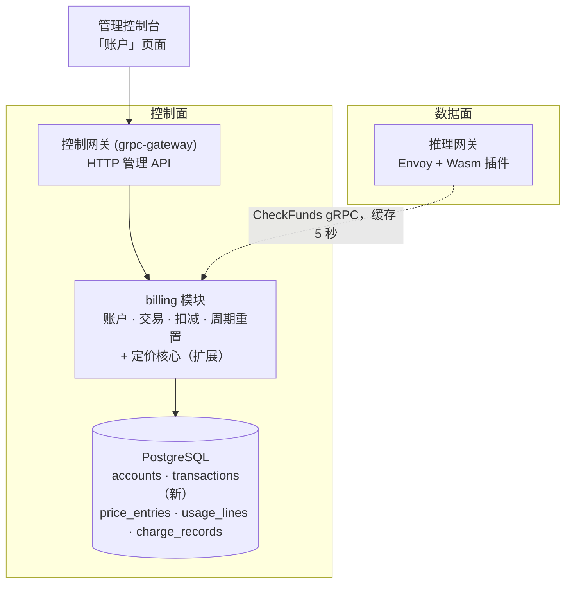
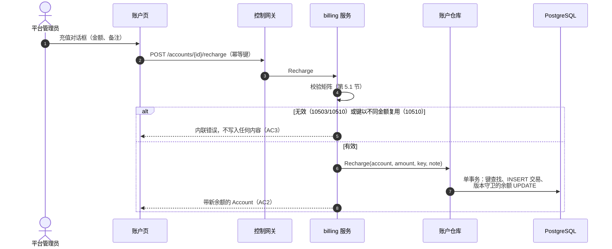
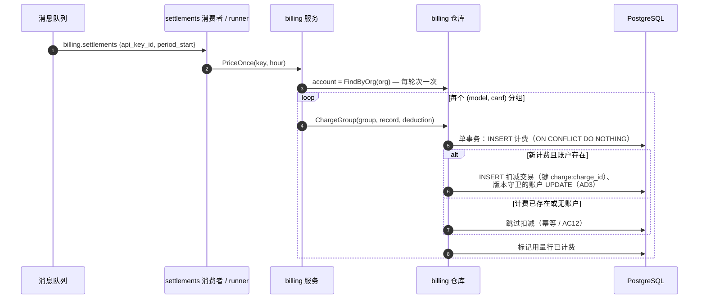
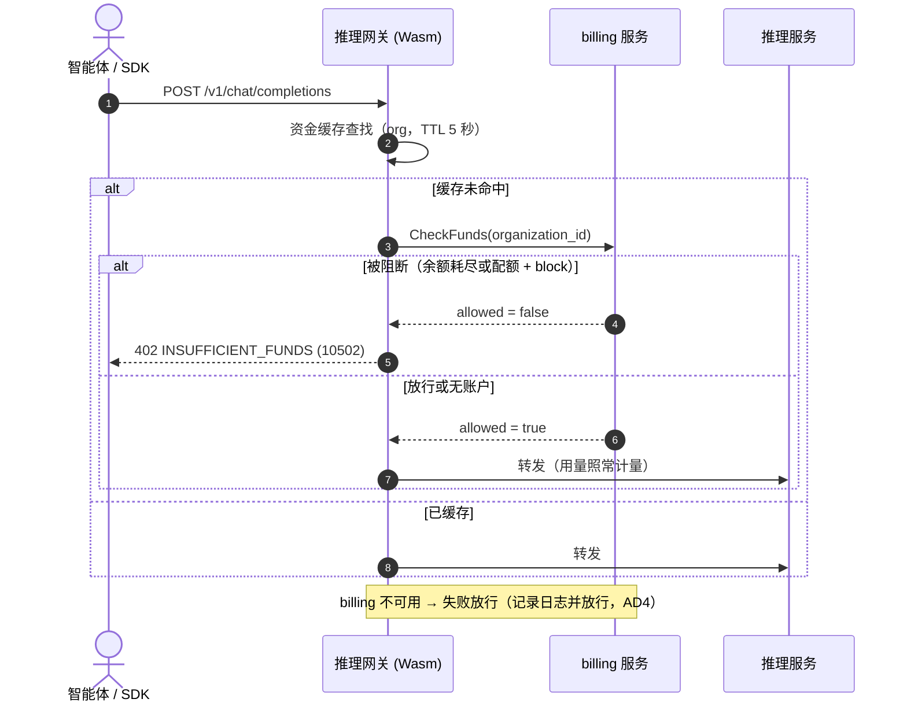
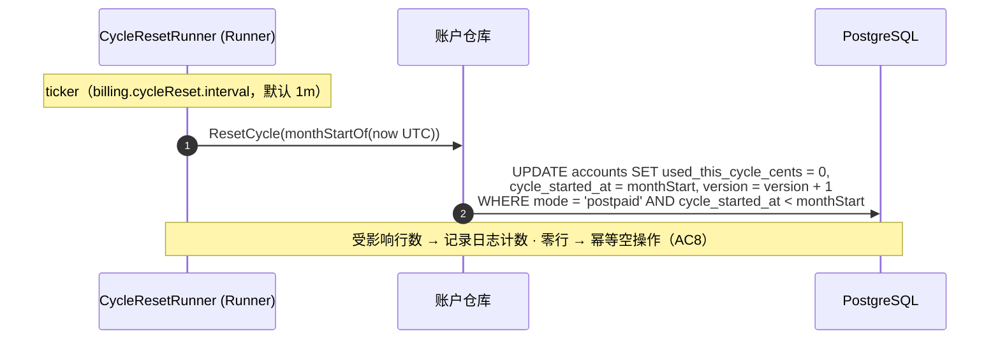

# 余额（预付费）与配额（后付费）账户模式 — 架构与详细设计

| 属性 | 内容 |
| --- | --- |
| 特性点 | 余额（预付费）与配额（后付费）账户模式 |
| 文档范围 | 计费账户核心的架构与详细设计：按组织的账户（预付费/后付费）、充值与退款、结算时扣减、推理准入管控、月度周期重置、交易流水账本、控制台「账户」页面、错误处理、配置，以及各层的函数级设计 |
| 归属模块 | `billing`（账户、交易、扣减、周期重置、准入检查），配合推理网关作为执行点（数据面轨道） |
| 相关文档 | [需求分析与 UI/UX 设计](../design/balance-quota.zh-cn.md) · [架构设计](../design/architecture.zh-cn.md) 第 2.6 节（`billing`） · [Token 计量凭证与异步结算](./metering.zh-cn.md)（结算管道） · [价格矩阵与阶梯定价](./pricing.zh-cn.md)（本特性挂接的计费引擎） · [多租户隔离](./multi-tenancy.zh-cn.md)（组织范围界定） |
| 状态 | 架构完成，已移交开发代理 |

---

## 1. 概述与目标

特性 #1–#7 交付了账务主干：API Key 标识调用方，用量按小时计量与结算，定价把已结算用量转换为计费记录与账单，且一切资源归组织所有 — 但没有任何东西回答「这次调用能否放行」。本特性以**按组织的计费账户**闭环资金链路，账户处于两种模式之一 — **预付费**（充值余额；结算扣减将其消耗；耗尽即阻断推理）或**后付费**（月度配额；超额策略决定触顶后发生什么）— 外加一本只追加、幂等的交易流水账本，让每一分钱都可追溯。

**目标**：带管理员 CRUD（`CreateAccount`/`GetAccount`/`UpdateAccount`/`ListAccounts`）的账户字段集、带调用方幂等键的 `Recharge`/`Refund`、特性 #5 计费事务内的结算时扣减、经内部 `CheckFunds` RPC 的网关执行（10502 → HTTP 402）、UTC 月度周期重置、`ListTransactions` 账本查询、`GetBalance` 落地实现、控制台「账户」页面，以及预留计费错误码的激活（AC1–AC12）。

**非目标**（延后）：支付渠道、发票、回执、催缴；自动充值阈值；按请求冻结（10506 保持预留）；多币种与汇率；套餐/捆绑包；租户自助余额可见性（#6/#7）；负余额催收；账户删除（账户是财务记录）。

## 2. 架构决策

| # | 决策 | 理由 |
| --- | --- | --- |
| AD1 | **每个组织一个计费账户**，归 `billing` 模块所有（`organization_id` 唯一）。字段依设计 D1：`mode`、`balance_cents`、`monthly_quota_cents`（0 = 无上限）、`used_this_cycle_cents`、`cycle_started_at`、`overdraw_policy`（`block`/`warn`）、`currency` | 组织是所有权边界（#6）；一个对象同时回答「还剩多少」与「本月用了多少」 |
| AD2 | **全程整数分**；单一平台币种取自 `billing.currency`。计费边界处换算：`cents = int64(math.Round(amount × 100))` — 精确，因为计费金额已四舍五入到 2 位小数 | 浮点金额是经典的计费 bug；分与计费记录金额精确匹配（设计 D2） |
| AD3 | **扣减发生在结算时、计费事务内**：`ChargeGroup` 扩展为在与计费记录相同的数据库事务内写一条 `deduction` 交易（幂等键 `charge:{charge_id}`）并更新账户 — 预付费递减 `balance_cents`，后付费递增 `used_this_cycle_cents`。无按请求冻结 | 行业默认（设计 D3）；计费唯一索引加幂等键让重投不可能重复扣减（AC4）。结算延迟可能在最后一小时内超额 — 已接受的风险 |
| AD4 | **经内部 `CheckFunds` RPC 准入**（无 HTTP 绑定），推理网关在转发前调用，按组织缓存 ≤ 5 秒（网关侧 TTL）。预付费：`balance_cents ≤ 0` → 阻断。后付费：配额 > 0 且 `used ≥ quota` → `block` 下阻断、`warn` 下放行。**无账户 → 不管控**（过渡性开放模式）。billing 不可用时网关**失败放行（fail open）**（记录日志并放行） | 与定价 D8 呼应 — 运营缺口绝不拖垮推理；资金仍被记账，因为扣减发生在结算时（设计 D4、AC12） |
| AD5 | **被阻断的请求返回 10502 `CodeInsufficientFunds`，即 HTTP 402**，稳定消息 "insufficient funds"，由数据面网关渲染。没有控制网关路由返回 10502 — 余额不足不是管理路径条件 | 业界可识别的错误（SiliconFlow 402、OpenAI `insufficient_quota`）；设计 D5 |
| AD6 | **周期为 UTC 自然月**（与账单对齐，定价 D9）。基于条件判定的 runner 在边界重置后付费账户，一条带守卫的 `UPDATE ... WHERE mode = 'postpaid' AND cycle_started_at < monthStart` — 重试幂等，无账本行（无资金移动） | 配额周期与账单必须对账到同一窗口（设计 D6、AC8） |
| AD7 | **只追加账本**：`type`（`recharge`/`deduction`/`refund`；`adjustment` 预留，v1 无写入方）、**正数 `amount_cents`，方向由类型隐含**、`balance_after_cents`（写入后账户的 `balance_cents` — 后付费扣减时不变，证明余额未被触碰，AC5），以及**全局唯一的 `idempotency_key`** | 每一分钱可追溯；重放无害（设计 D7）。带符号金额被否决：类型已携带方向，控制台渲染保持简单 |
| AD8 | **充值/退款仅限预付费**；后付费调整走配额编辑（`UpdateAccount`）；两者均为管理员操作，带调用方提供的幂等键（控制台每次对话框提交生成一个） | 退入配额没有意义（设计 D8） |
| AD9 | **模式切换保留两组字段**；仅活跃模式的字段被强制执行并作为主展示 | 切换绝不能重新解释历史（设计 D9） |
| AD10 | **错误码**：10502/10503 激活；**10509 `CodeAccountInvalid`**（坏模式、负配额/金额、重复组织账户）与 **10510 `CodeTransactionInvalid`**（对后付费充值/退款、非正金额、幂等键以不同金额复用）为新增；10504–10506 保持预留 | 校验、资金、未找到保持区分（设计 D10） |
| AD11 | **每次账户变更经 `version` 列乐观锁**（充值、退款、扣减、更新、周期重置）：`UPDATE ... WHERE id = ? AND version = ?`。`SELECT FOR UPDATE` 被否决 — 它在支撑 FVT 套件的 sqlite 上是空操作。冲突：管理路径进程内重试（有界，3 次 — 幂等键让重试安全）；扣减回滚整个计费事务并在下一轮收敛 | 统一、方言无关、崩溃安全 |
| AD12 | **`SetQuota` 并入 `UpdateAccount`**（模式/配额/策略的单一管理员更新路径 — 控制台的设置配额对话框调用它），且**周期重置是 runner 而非 RPC**（基于条件判定，无需手动触发） | 更少的 RPC、一张校验矩阵；重置无需运营输入 |

## 3. 组件设计



| 组件 | 本特性中的职责 |
| --- | --- |
| 推理网关（数据面） | 转发前调用 `CheckFunds`（按组织缓存 ≤ 5 秒），拒绝时渲染 402/10502，billing 不可用时失败放行（AD4/AD5）。不在仓库范围内 — 契约在此钉死，沿用既定的合成验证模式 |
| 控制网关（`grpc-gateway`） | `/api/v1/admin/billing` 下账户 RPC 的 HTTP/JSON 门面；将 `X-Organization-Id` 作为 gRPC metadata 透传 |
| `billing` 模块（`services/billing`） | 账户与交易仓库、管理员 RPC、`ChargeGroup` 内的扣减步骤、周期重置 runner、`CheckFunds`、`GetBalance` |
| `metering` / `infer` / `internal/controller` | **不变** — 扣减搭载既有结算管道；账户是控制面状态，故无 Kubernetes 资源、无 controller 参与 |
| PostgreSQL / 控制台 | `accounts` 与 `transactions` 表（新），既有计费表不动；「账户」页面（契约见第 3.3 节） |

### 3.1 文件布局与函数级职责

| 模块 | 文件 | 内容 |
| --- | --- | --- |
| `services/billing` | `account_model.go` | GORM 模型 `Account`、`Transaction` + `TableName` |
| | `account_repository.go` | `AccountRepository`（`Repository` 模式）：`FindByOrg`（不存在时为 nil）、`FindByIDInOrg`（10503）、`CreateAccount`（单事务：INSERT 账户 — 组织唯一冲突 → 10509 — 外加可选的开户余额 `recharge` 交易，键 `opening:{account_id}`，引用 "opening balance"）、`UpdateAccount`（版本守卫）、`Recharge`（单事务：幂等键查找 → 收敛或 10510 → INSERT 交易 → 版本守卫的余额 UPDATE，有界重试）、`ApplyDeduction(txCtx, spec)`（加入计费事务：重读账户、INSERT 扣减行、版本守卫 UPDATE）、`ListTransactions`（过滤、最新在前、分页）、`ResetCycle(monthStart)`（AD6 的守卫 UPDATE）、`CheckFundsSnapshot(org)` |
| | `account_service.go` | `*Service` 上的 RPC 实现：`CreateAccount`、`GetAccount`、`UpdateAccount`、`ListAccounts`、`Recharge`、`Refund`、`ListTransactions`、`CheckFunds`、`GetBalance`（占位 → 实现）+ 第 5.1 节校验矩阵 |
| | `cycle_reset_runner.go` | `CycleResetRunner`（server.Runner，ticker）+ 为测试提取的 `ResetOnce(ctx)`（`ReconcileOnce` 模式） |
| | `billing_repository.go` | `ChargeGroup(ctx, group, record, deduction *DeductionSpec)` — 扩展：在既有事务内，**新**计费插入（`RowsAffected == 1`）且 `deduction != nil` 后调用 `accounts.ApplyDeduction(txCtx, spec)`；已存在的计费跳过扣减（幂等，AC4）。`Repository` 增加 `accounts *AccountRepository` 字段 |
| | `pricing.go` | `chargeGroup` 每次 `PriceOnce` 轮次解析一次组织的账户（`FindByOrg`）并构造 `DeductionSpec{AccountID, ChargeID: record.ID, AmountCents: centsFromAmount(record.Amount)}` — 组织无账户时为 nil（AC12）；存在账户时 0 金额计费仍扣减 0（FR3.2） |
| `proto/taas/billing/v1` | `billing.proto` | 增量：8 个 RPC、`Account`/`Transaction` 消息、`GetBalanceResponse` 分字段（第 5 节） |
| `pkg/errors` + `pkg/config` | `codes.go`/`messages.go`；`api.go`/`configuration.go` | 10509/10510 常量 + 规范消息；`billing.cycleReset` 下的 `BillingCycleResetConfig{Enabled, Interval}` |
| `apps/taas-server` + `web/src` + `test` | `main.go`；`pages/AccountsPage.tsx`/`App.tsx`/`api.ts`；`fvt/balance_quota_fvt_test.go`/`e2e/tests/balanceQuota.js` | `srv.Init()` 之后注册周期重置 runner；「账户」页面、路由 `/admin/billing/accounts`、int64 按字符串序列化的类型；第 8 节 |

### 3.2 配置增量

| 键 | 默认值 | 描述 |
| --- | --- | --- |
| `billing.cycleReset.enabled` | `true` | 周期重置 runner 的开关 |
| `billing.cycleReset.interval` | `1m` | 重置检查之间的 ticker 周期（重置本身基于条件判定，短间隔代价很低） |

5 秒的 `CheckFunds` 缓存 TTL 是数据面网关参数，不是仓库配置（AD4）。`applyDefaults`/`Validate` 沿用 `billing.reconciliation` 模式。

### 3.3 控制台契约（为开发代理钉死）

导航：Billing 分组（Pricing、Bills）新增**账户**（`/admin/billing/accounts`）。列表每个账户一行（`account-row-{id}`）：组织、模式徽标（预付费蓝 / 后付费紫）、余额或配额进度、周期起点、更新时间；操作：充值（`recharge-button-{id}`）、设置配额、详情。详情页（`account-detail`）展示完整字段集外加账本（`transaction-row-{id}`、类型过滤、60 秒轮询）。充值对话框（`recharge-dialog`）接收带币种标注的主单位金额与备注，每次提交生成一个幂等键，并内联展示新余额；设置配额对话框（`quota-dialog`）编辑模式、配额（显式「无上限」= 0）、超额策略。空态：「暂无计费账户 — 创建第一个」「该范围内暂无交易」。内联 10509/10510 错误（AC11）。账单页头部额外经 `GetBalance` 展示组织的剩余余额或配额使用。

### 3.4 安全与发布说明

- **组织范围界定**：每个管理员账户/交易查询从 `X-Organization-Id` 解析组织（缺失时 10001）并将 SQL 限定于该组织 — 一个组织的请求头绝不能返回另一个组织的账户或交易（AC10）。`CheckFunds` 是集群内部的（无 HTTP 路由），与 `IngestMeteringEvent` 同。
- **账本无秘密**：只有 id、分金额、引用。账户与交易是不可变的财务凭证 — v1 无删除。
- **发布**：AutoMigrate 建两张新表（增量）；只部署 `taas-server` — runner 在首个月度边界前空转，账户存在前查询返回 10503/空，推理不受管控（AD4）。定价计费路径的变更纯增量：无账户的组织计费与从前完全一致。

## 4. 数据模型

### 4.1 `accounts` 表

| 列 | PostgreSQL 类型 | 约束 | 描述 |
| --- | --- | --- | --- |
| `id` | `uuid` | 主键 | 服务端生成的 UUID v4，暴露为 `account_id` |
| `organization_id` | `varchar(64)` | NOT NULL，UNIQUE | 每组织一个账户（AD1）；重复插入 → 10509 |
| `mode` | `varchar(16)` | NOT NULL | `prepaid` / `postpaid` |
| `balance_cents` | `bigint` | NOT NULL DEFAULT 0 | 预付费资金；结算延迟可使其 ≤ 0（AD3） |
| `monthly_quota_cents` | `bigint` | NOT NULL DEFAULT 0 | 后付费上限；0 = 无上限 |
| `used_this_cycle_cents` | `bigint` | NOT NULL DEFAULT 0 | 当前周期内的后付费用量 |
| `cycle_started_at` | `bigint` | NOT NULL | Unix 秒；周期覆盖的 UTC 月起点（默认为创建月起点，D6） |
| `overdraw_policy` | `varchar(8)` | NOT NULL DEFAULT 'block' | `block` / `warn`（后付费执行，AD4） |
| `currency` | `varchar(8)` | NOT NULL | 创建时取自 `billing.currency` |
| `version` | `bigint` | NOT NULL DEFAULT 0 | 乐观锁计数器（AD11） |
| `created_at` / `updated_at` | `timestamptz` | NOT NULL | 行时间戳 |

### 4.2 `transactions` 表

| 列 | PostgreSQL 类型 | 约束 | 描述 |
| --- | --- | --- | --- |
| `id` | `uuid` | 主键 | 服务端生成的 UUID v4，暴露为 `transaction_id` |
| `account_id` | `uuid` | NOT NULL，索引（复合） | 所属账户；无外键（账本行不比账户活得短 — 账户永不删除） |
| `type` | `varchar(16)` | NOT NULL | `recharge` / `deduction` / `refund`；`adjustment` 预留（AD7） |
| `amount_cents` | `bigint` | NOT NULL | 正数；方向由类型隐含（AD7） |
| `balance_after_cents` | `bigint` | NOT NULL | 写入后账户的 `balance_cents` |
| `idempotency_key` | `varchar(128)` | NOT NULL，UNIQUE | 调用方提供（充值/退款）或 `charge:{charge_id}`（扣减） |
| `reference` | `varchar(128)` | NOT NULL DEFAULT '' | 扣减为 `charge_id`，其余为自由文本备注 |
| `created_at` | `timestamptz` | NOT NULL，索引（复合） | 写入时间；`idx_transactions_account_created (account_id, created_at)` 服务账本查询 |

设计说明：唯一的 `idempotency_key` 索引是重放守卫 — INSERT，冲突时重查：相同账户/类型/金额 → 返回既有行（幂等成功，AC2）；其余任何情况 → 10510（AC3）。交易只追加：没有 API 更新或删除它们。无账户的组织就是没有行（AC12）。

## 5. API 设计

所有 API 属于 **`taas.billing.v1.BillingService`**（`proto/taas/billing/v1/billing.proto`），经控制网关以 HTTP 提供，经 `X-Organization-Id` 限定组织范围。proto 变更为增量；int64 分字段序列化为 JSON 字符串。

| RPC | HTTP | 状态 | 用途 |
| --- | --- | --- | --- |
| `CreateAccount` | `POST /api/v1/admin/billing/accounts` | **新增** | 创建组织的唯一账户；可选 `initial_balance_cents` 作为开户 `recharge` 交易入账（第 3.1 节） |
| `ListAccounts` | `GET /api/v1/admin/billing/accounts` | **新增** | 请求头组织的账户（今天 0..1 行 — AC10 要求组织范围界定；平台级运营视图随真实多租户到来） |
| `GetAccount` | `GET .../accounts/{account_id}` | **新增** | 带计算的 `remaining_cents` / `quota_usage_percent` 的详情 |
| `UpdateAccount` | `PUT .../accounts/{account_id}` | **新增** | `mode`、`monthly_quota_cents`、`overdraw_policy` 的全量替换（AD12）；余额/用量字段绝不可在此设置 |
| `Recharge` | `POST .../accounts/{account_id}/recharge` | **新增** | 预付费余额入账（幂等，AC2） |
| `Refund` | `POST .../accounts/{account_id}/refund` | **新增** | 管理员发起的资金退回（仅预付费，D8） |
| `ListTransactions` | `GET /api/v1/admin/billing/transactions` | **新增** | 账本查询：`account_id`、`type`、`since`/`until`、分页（默认 20，上限 100）、最新在前 |
| `GetBalance` | `GET /api/v1/admin/billing/balance` | 占位 → 实现 | 模式 + 分快照；遗留的 `double balance`（字段 3）废弃，一个发布周期内返回 `balance_cents / 100`；请求的 `organization_id` 被忽略，以请求头解析的组织为准（`ListCharges` 模式） |
| `CheckFunds` | 内部 gRPC（无 HTTP 绑定） | **新增** | 网关准入检查（AD4） |

消息草案（新增；字段号延续各消息的序列）：

```protobuf
message Account {
  string account_id = 1;  string organization_id = 2;  string mode = 3;  string currency = 9;
  int64 balance_cents = 4;  int64 monthly_quota_cents = 5;  int64 used_this_cycle_cents = 6;
  int64 cycle_started_at = 7;  string overdraw_policy = 8;  int64 created_at = 12;  int64 updated_at = 13;
  int64 remaining_cents = 10;      // prepaid: balance; postpaid: quota - used (0 when unlimited)
  int32 quota_usage_percent = 11;  // postpaid; 0 when unlimited
}
message Transaction {
  string transaction_id = 1;  string account_id = 2;  string type = 3;  string reference = 7;
  int64 amount_cents = 4;  int64 balance_after_cents = 5;  string idempotency_key = 6;  int64 created_at = 8;
}
message CheckFundsRequest { string organization_id = 1; }
message CheckFundsResponse {
  taas.common.v1.Response response = 1;  bool allowed = 2;  string reason = 3;  // "" or "insufficient_funds"
  string mode = 4;  // "prepaid" / "postpaid" / "" (no account)
  int64 balance_cents = 5;  int64 monthly_quota_cents = 6;  int64 used_this_cycle_cents = 7;
}
```

`GetBalanceResponse` 增加 `balance_cents`（5）、`monthly_quota_cents`（6）、`used_this_cycle_cents`（7）。
### 5.1 校验矩阵（同步，首个失败即返回，不写入任何内容）

`CreateAccount` / `UpdateAccount` — 每个失败均为 **10509**，不写入：`mode` ∈ {`prepaid`, `postpaid`}；`monthly_quota_cents` ≥ 0；`overdraw_policy` ∈ {`block`, `warn`}；`initial_balance_cents` ≥ 0（仅创建）；组织已有账户（仅创建 — 唯一索引兜底）。

`Recharge` / `Refund`：账户存在于请求头组织 → 否则 **10503**；`mode == "prepaid"` → 否则 **10510**；`amount_cents > 0` → 否则 **10510**；`idempotency_key` 非空、≤ 128 字符 → 否则 **10510**；键以相同账户/类型/金额复用 → 幂等成功（AC2），以不同金额复用 → **10510**（AC3）。

`ListTransactions`：`account_id`（设置时）在组织内解析 → 否则 10503；`type` 属于枚举或为空 → 否则 10510；范围 `since ≤ until`、跨度 ≤ 366 天 → 否则 10508（默认 `until = now`、`since = until - 24h`，`ListCharges` 约定）。

## 6. 时序流程

### 6.1 充值（控制台）



### 6.2 结算扣减（扩展特性 #5 的计费轮次）



### 6.3 推理准入管控（数据面）


### 6.4 月度周期重置


## 7. 错误处理

所有错误均为统一信封中 `pkg/errors` 的业务码。

| 条件 | 码 | 常量 | 说明 |
| --- | --- | --- | --- |
| 推理被阻断 — 余额耗尽，或 `block` 下配额超限 | 10502 | `CodeInsufficientFunds` | **激活**；HTTP 402 由数据面网关渲染（AD5） |
| 账户未找到（GetBalance、GetAccount、Recharge/Refund、UpdateAccount、未知 `account_id` 过滤） | 10503 | `CodeAccountNotFound` | **激活**（原为 GetBalance 占位） |
| 畸形账户 — 坏模式、负配额/金额/开户余额、重复组织账户 | 10509 | `CodeAccountInvalid` | **新增**（AD10） |
| 无效交易 — 对后付费充值/退款、非正金额、键以不同金额复用、坏 `type` 过滤 | 10510 | `CodeTransactionInvalid` | **新增**（AD10） |
| 管理 API 缺失 `X-Organization-Id` | 10001 | `CodeUnauthorized` | `resolveOrganizationID` 模式 |
| 畸形时间范围 | 10508 | `CodeBillingRangeInvalid` | 既有 |
| 数据库 / MQ 基础设施故障 | 500 | `CodeInternal` | 经错误归一化 |

Runner 侧失败不是 RPC 错误：扣减版本冲突回滚整个计费事务并在下一轮收敛（AD11）；周期重置失败记录日志并在下一 tick 重试；10504–10506 保持预留（v1 无按请求冻结）。

## 8. 测试策略

- **单元**（`services/billing`，内存 sqlite）：`account_repository_test.go` — 组织唯一性（AC1）、充值幂等与键复用拒绝（AC2/AC3）、事务内扣减带版本守卫、后付费用量递增且余额不动（AC5）、周期重置幂等（AC8）、重投绝不重复扣减（AC4）。`account_service_test.go` — 校验矩阵、`CheckFunds` 真值表（预付费耗尽、后付费 block/warn、无账户 — AC6/AC7/AC12）、组织范围界定（AC10）。新文件覆盖率 ≥ 80%。
- **FVT**（`test/fvt/balance_quota_fvt_test.go`，定价 FVT 模式：文件支撑的 sqlite + `MigrateSchemaForFVT` + `NewForFVT` + 带生产拦截器的 gRPC 服务器 + 带 `FVTHeaderMatcher` 的网关 mux）：经网关创建与充值（AC1/AC2）、10509/10510 内联（AC3）、结算端到端 — 种子价格 + 用量行、运行 `PriceOnce`、断言余额减少的分数恰为计费金额且每条计费记录恰有一条 `deduction` 交易，然后重投并断言无重复扣减（AC4/AC5）、经 gRPC 的 `CheckFunds` 覆盖每个准入分支（AC6/AC7/AC12）、第二个组织绝看不到第一个组织的账户或交易（AC10）、经 `ResetOnce` 的周期重置（AC8）、退款 + 账本过滤（AC9）。
- **E2E**（`test/e2e/tests/balanceQuota.js`，`pricingBills.js` 模式）：对 compose 栈 — 账户页渲染 `account-row-{id}`、充值对话框入账并内联刷新余额、设置配额对话框更新、10509/10510 内联浮出（AC11）。准入管控经 FVT 验证（数据面网关不在仓库范围内 — 既定模式）。
- **回归**：既有 e2e 套件保持绿色；计费路径变更纯增量（nil 扣减 spec 让无账户的组织与旧行为逐字节一致）。

## 9. 开放问题

| 问题 | 倾向 |
| --- | --- |
| 无账户的组织最终是否默认阻断？ | 是，置于 `billing.enforceDefault` 之后，待租户存在（#6/#7） |
| 自动充值阈值与支付渠道集成 | 未来特性；充值幂等设计是挂接点 |
| 按请求冻结以关闭结算延迟超额窗口（AD3） | 延后；冻结设计前 10506 保持预留 |
| 所有组织账户的平台级运营视图 | 随真实多租户（#6/#7 会话上下文）；今天 AC10 要求组织范围界定 |
| 配额编辑本周期内生效还是下周期生效？ | v1 本周期内（立即）；`used_this_cycle_cents` 让两者皆可计算 |
