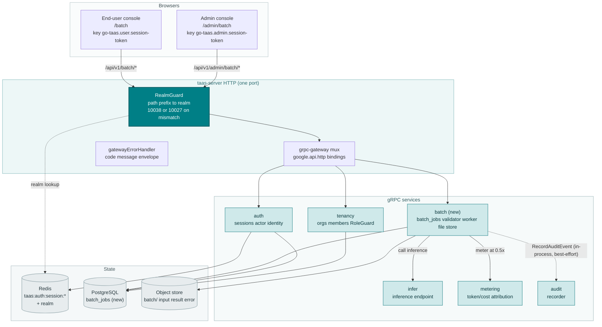
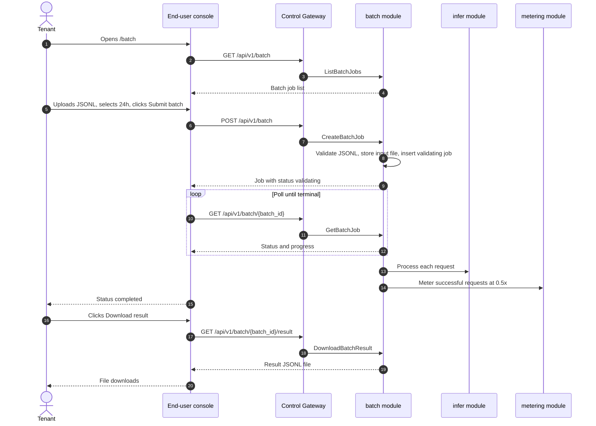
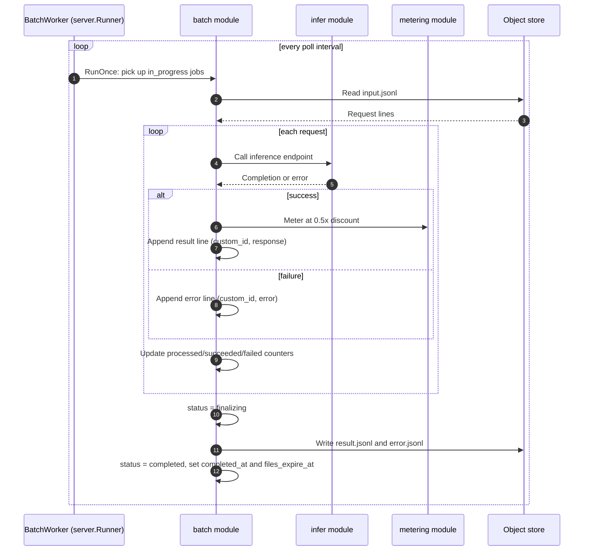
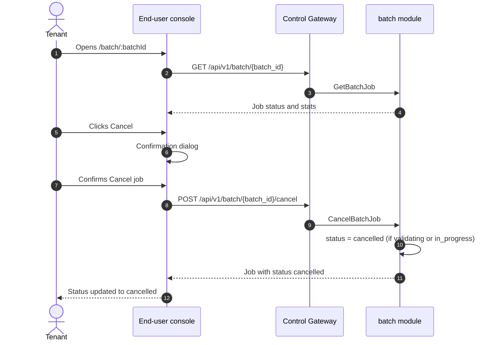

# Batch Inference (Batch Jobs) — Architecture and Detailed Design

| Attribute | Content |
| --- | --- |
| Feature point | Batch inference (batch jobs) — submit a JSONL batch of inference requests, process asynchronously at a discounted rate, monitor progress, and download result/error files (backlog row 42) |
| Document scope | Architecture and detailed design for feature-42: a new `batch` module owning the batch-job lifecycle, the JSONL input/output file store, and the async batch worker; the `batch_jobs` table and the object-store file layout; the `taas.batch.v1.BatchService` proto with dual admin/user HTTP bindings; the batch worker that orchestrates the existing `infer` and `metering` pipelines; the end-user Batch pages (`/batch`, `/batch/:batchId`) and the admin Batch pages (`/admin/batch`, `/admin/batch/:batchId`); plus error handling, configuration, security, rollout, and function-level design per layer |
| Owning modules | New `batch` module (`services/batch`): `batch_jobs` table, CRUD/query RPCs, the JSONL validator, the batch worker, the file store, the retention runner; `infer` (read-only: the inference endpoint the batch worker calls); `metering` (read-only: per-request token/cost attribution for batch jobs); `pkg/server` gateway (admin-prefix and user-prefix bindings); console web app (end-user `BatchPage`/`BatchDetailPage`, admin `AdminBatchPage`/`AdminBatchDetailPage`) |
| Related documents | [Requirement Analysis and UI/UX Design](../design/batch-inference.md) · [Architecture Design](../design/architecture.md) §1.2 (message queue), §2 (module responsibilities), §3.1 (admin/user surface separation) · [Console Surface Separation](./console-surface-separation.md) (the two-console split this feature spans; realm guard, 10038) · [Request Logs & API Playground](./request-logs-playground.md) (the sibling inference surface and its request-log conventions) · [Billing Reports & CSV Export](./billing-reports.md) (the sibling async-job and Excel-friendly-CSV conventions) · [Data Export & Privacy](./data-export-privacy.md) (the sibling async-job lifecycle and tenant-scoping conventions) · [Audit Logging](./audit-logging.md) (the audit recorder batch actions must invoke) |
| Status | Architecture complete, handed to the Developer agent |

---

## 1. Overview and Goals

go-taas serves inference through an OpenAI-compatible gateway (features #2, #12): an Agent sends a request and receives a completion in real time. But a large class of workloads — model evaluation, data labeling, bulk classification, offline summarization, and embedding backfills — process thousands or millions of requests that can wait minutes or hours. Sending those one-by-one through the real-time endpoint is slow, wasteful, and expensive. This feature adds a **batch inference** capability: a tenant uploads a JSONL file of inference requests, the platform processes them asynchronously as a batch job, the tenant monitors progress and downloads the result and error files, at a discounted rate.

**Goals**: a new `batch` module owning the `batch_jobs` table, the JSONL input/output file store, and the async batch worker; a `taas.batch.v1.BatchService` with nine RPCs, each dual-bound to the user prefix `/api/v1/batch/*` and the admin prefix `/api/v1/admin/batch/*`; the batch-job lifecycle `validating` → `in_progress` → `finalizing` → `completed` / `failed` / `expired` / `cancelled`; a batch worker that orchestrates the existing `infer` and `metering` pipelines at 50% of the real-time price; a bounded result/error-file retention window; new error codes 12601–12606; an end-user Batch page (`/batch`) and detail page (`/batch/:batchId`), and an admin Batch page (`/admin/batch`) and detail page (`/admin/batch/:batchId`).

**Non-goals** (deferred, design §8): the real-time inference playground (feature #12); request logs & tracing (features #12, #27); billing reports & CSV export (feature #25); data export & privacy (feature #41); model fine-tuning (removed by the product owner on 2026-10-03). The real-time inference path is unchanged — the batch worker calls the same `infer` endpoint the data plane serves, and the `metering` pipeline is reused read-only.

### 1.1 Reading order of this document

Section 2 records the architecture decisions (AD1–AD9, mirroring the design's D1–D9). Sections 3–5 are the component view, data model, and API design. Section 6 is the frontend architecture (page → route → API-prefix table for both consoles, auth guard per surface). Sections 7–8 are the sequence flows and error handling. Sections 9–11 are configuration, security, and rollout. Sections 12–14 are the acceptance-criteria traceability, the function-level detailed design, and the ordered implementation task list.

---

## 2. Architecture Decisions

| # | Decision | Rationale |
| --- | --- | --- |
| AD1 | **New `batch` module** (`services/batch`) owning the `batch_jobs` table, the JSONL input/output file store, the JSONL validator, the batch worker, and the retention runner, with its own error block **126xx** | Batch inference orchestrates the existing `infer` and `metering` pipelines; a dedicated module keeps the batch-job lifecycle and file store out of the producing modules and gives it one home, mirroring how `webhook` owns delivery (design D1) |
| AD2 | **A batch job is defined by an input file and a completion window.** `CreateBatchJob` takes an uploaded JSONL input file and a `completion_window` (default `24h`, range `1h`–`14d`). The job is created with `status = validating`; the input file is stored in the batch module's object store | The completion window bounds how long the platform may take; the input file is the batch's payload. The window follows the OpenAI/Aliyun convention (design D2) |
| AD3 | **The batch-job lifecycle is `validating` → `in_progress` → `finalizing` → `completed` / `failed` / `expired` / `cancelled`.** `validating` checks the JSONL format, per-line schema, file size, and single-model consistency; `in_progress` processes the requests; `finalizing` writes the result/error files; `completed` makes them downloadable; `failed` means a file-level error (no requests processed); `expired` means the completion window elapsed; `cancelled` means the tenant/operator stopped it | The lifecycle mirrors the surveyed platforms and gives the console a clear progress model. `failed` is distinct from per-line errors (which land in the error file) (design D3) |
| AD4 | **Batch inference is billed at 50% of the real-time price.** Each successfully processed request is metered through the existing `metering` pipeline with a `batch` discount factor of 0.5 applied to the price lookup. Failed requests and file-level failures are not billed | The 50% discount is the universal batch convention (OpenAI, Anthropic, Aliyun) and rewards tenants for off-peak, async workloads. It reuses the existing metering/price pipeline (features #4, #5) (design D4) |
| AD5 | **The batch is tenant-scoped and masked.** `CreateBatchJob` on the user prefix accepts no `organization_id` filter (the caller's org is implicit) and never exposes other tenants' jobs. The admin prefix lists all jobs but masks per-request content (the masked-projection rule, feature #17) | Follows feature #17's masked-projection rule: a tenant's batch must never leak another tenant's data. The admin surface sees job metadata and aggregate stats but not the raw request/response bodies (design D5) |
| AD6 | **The result and error files are JSONL, keyed by `custom_id`.** The result file has one line per successful request with `custom_id` and `response`; the error file has one line per failed request with `custom_id` and `error`. Both are downloadable when `status = completed` | The two-file, `custom_id`-keyed output is the universal convention and lets a tenant correlate results with their input (design D6) |
| AD7 | **New error codes in a batch block 12601–12699.** **12601 `CodeBatchJobNotFound`**, **12602 `CodeBatchJobStateInvalid`**, **12603 `CodeBatchInputInvalid`**, **12604 `CodeBatchInputTooLarge`**, **12605 `CodeBatchModelMismatch`**, **12606 `CodeBatchNotCompleted`**. Range/format validation reuses existing codes where applicable | Batch inference is a new module (AD1), so its codes live in a fresh block after the account block (125xx); distinct codes keep each failure mode actionable (design D7) |
| AD8 | **Batch jobs are retained for a bounded window, then deleted.** A completed job's result/error files are retained for a configurable window (default 30 days), then deleted; the job metadata row is retained with a `files_expired` flag. The console warns before the expiry date | Results that expire silently are a surveyed pitfall; a bounded retention with a visible expiry date keeps the platform tidy without surprising the tenant (design D8) |
| AD9 | **Batch job actions are audited.** Job creation, cancellation, and result download are audited (feature #15) as `batch.created` / `batch.cancelled` / `batch.downloaded`. The underlying per-request inference is already metered and logged by the existing pipeline | The feature orchestrates existing inference and metering; only the new batch actions need new audit events (design D9) |

---

## 3. Component View

### 3.1 Ownership

| Layer / component | Owns | Changes in this feature |
| --- | --- | --- |
| **Control Gateway (`grpc-gateway`)** | HTTP/JSON facade for the batch RPCs; realm guard (feature #17) already rejects a wrong-realm session with 10038; passes `X-Organization-Id` through as gRPC metadata | New bindings for the 9 HTTP batch RPCs (Section 5); no change to the realm guard |
| **`batch` module (`services/batch`)** | `batch_jobs` table, the CRUD/query RPCs, the JSONL validator, the batch worker, the file store, the retention runner | **New module** (AD1) |
| **`infer` module** | The inference endpoint the batch worker calls | Read-only: the batch worker calls the same OpenAI-compatible inference path the data plane serves (AD4) |
| **`metering` module** | Per-request token/cost attribution | Read-only: the batch worker meters each successful request through the existing pipeline with a `batch` discount factor of 0.5 (AD4) |
| **`audit` module** | The audit recorder | Read-only: the batch module calls `RecordAuditEvent` after job creation, cancellation, and result download (AD9) |
| **`auth` module** | Actor identity, session realm, session active org | Read-only: the batch module resolves the org from the session; `SessionActiveOrg` supplies the org for session-bearing calls |
| **`tenancy` module** | Organizations, members, roles, RoleGuard | Read-only: `RoleGuard` gates the admin batch RPCs by the caller's role in the resolved org context (10036) |
| **PostgreSQL** | `batch_jobs` table (new); all other tables untouched | One new table via AutoMigrate (Section 4) |
| **Object store (MinIO / JuiceFS)** | The JSONL input and result/error files | New file layout under a `batch/` prefix (Section 4.2) |
| **Console** | End-user Batch pages and admin Batch pages | Four new pages on the two surfaces (Section 6) |

### 3.2 Runtime component view



### 3.3 Request identity chain

The batch RPCs reuse the established identity chain (console-surface-separation §3.3):

1. `RealmGuard` (HTTP, `pkg/server/realm.go`) — path prefix decides the expected realm. `/api/v1/admin/batch/*` expects `admin`; `/api/v1/batch/*` expects `user`. With no `Authorization` header: pass through (transitional, AD4 of feature #17). With a header: resolve the session realm from Redis; mismatch → 10038, unknown/expired/realm-less → 10027.
2. grpc-gateway mux — routes by the annotated path and forwards `authorization` and `x-organization-id`.
3. Service handler — for a session-bearing call, `SessionActiveOrg` makes the session's active organization authoritative and ignores `X-Organization-Id`; without a session, `resolveOrganizationID` reads the transitional header and returns 10001 when it is absent or empty.
4. `tenancy.RoleGuard` — gates the admin batch RPCs by the caller's role in the resolved org context (10036). The end-user batch RPCs are hard-scoped to the caller's org and need no role check.

### 3.4 The batch worker and the inference/metering seam

The batch worker is an in-process `server.Runner` (the billing-reports generator pattern). It picks up `in_progress` jobs, and for each request in the input file calls the same OpenAI-compatible inference path the data plane serves (via the `infer` module's in-process client), then meters each successful request through the existing `metering` pipeline with a `batch` discount factor of 0.5 (AD4). The worker is a pure orchestration of existing pipelines — no inference, metering, or billing pipeline changes. The worker is the only writer of the result/error files; the retention runner is the only deleter.

---

## 4. Data Model

### 4.1 The `batch_jobs` Table

| Column | PostgreSQL type | Constraints | Description |
| --- | --- | --- | --- |
| `batch_id` | `uuid` | PRIMARY KEY | Server-generated UUID v4, exposed as `batch_id` |
| `organization_id` | `varchar(64)` | NOT NULL, index (composite) | Owning organization |
| `model` | `varchar(128)` | NOT NULL | The single model all requests use (AD3) |
| `status` | `varchar(16)` | NOT NULL, index | `validating` / `in_progress` / `finalizing` / `completed` / `failed` / `expired` / `cancelled` (AD3) |
| `completion_window` | `varchar(8)` | NOT NULL | The completion window, e.g. `24h` (AD2) |
| `input_file_key` | `varchar(512)` | NOT NULL | Object-store key of the uploaded JSONL input file (Section 4.2) |
| `result_file_key` | `varchar(512)` | NULL | Object-store key of the result file; NULL until `finalizing` |
| `error_file_key` | `varchar(512)` | NULL | Object-store key of the error file; NULL until `finalizing` |
| `total_requests` | `bigint` | NOT NULL DEFAULT 0 | Number of requests in the input file |
| `processed_requests` | `bigint` | NOT NULL DEFAULT 0 | Number of requests processed so far |
| `succeeded_requests` | `bigint` | NOT NULL DEFAULT 0 | Number of successful requests |
| `failed_requests` | `bigint` | NOT NULL DEFAULT 0 | Number of failed requests (per-line errors) |
| `input_tokens` | `bigint` | NOT NULL DEFAULT 0 | Sum of input tokens across successful requests |
| `output_tokens` | `bigint` | NOT NULL DEFAULT 0 | Sum of output tokens across successful requests |
| `cost` | `bigint` | NOT NULL DEFAULT 0 | Sum of successful requests' costs, in minor units (e.g. cents) |
| `currency` | `varchar(8)` | NOT NULL DEFAULT `USD` | The billing currency (from the billing module) |
| `files_expired` | `boolean` | NOT NULL DEFAULT false | True when the result/error files were deleted by retention (AD8) |
| `error` | `varchar(512)` | NOT NULL DEFAULT '' | The failure reason when `status = failed` |
| `created_at` | `timestamptz` | NOT NULL, index (composite) | Creation time (UTC) |
| `completed_at` | `timestamptz` | NULL | When the job reached a terminal state |
| `files_expire_at` | `timestamptz` | NULL | When the result/error files expire (created_at + retention window) |

Design notes:

- Composite index `idx_batch_jobs_org_created (organization_id, created_at)` for org-scoped lists; `status` indexed for the worker's `in_progress` scan and the admin fleet view.
- `cost` is stored in minor units (e.g. cents) as an int64, consistent with the billing module's cost representation; the API serializes it as a JSON string.
- No foreign keys to `organizations` / `inference_services`: a batch job must outlive a deleted org or service so its metadata remains debuggable (mirrors the audit-event reasoning).
- The `files_expired` flag is set by the retention runner when it deletes the result/error files; the job metadata row is retained (AD8).

### 4.2 Object-store file layout

The batch module stores the input, result, and error files under a `batch/` prefix in the object store (MinIO / JuiceFS):

| Key | Written by | Read by | Retention |
| --- | --- | --- | --- |
| `batch/{org_id}/{batch_id}/input.jsonl` | `CreateBatchJob` (upload) | batch worker | Deleted when the job is deleted |
| `batch/{org_id}/{batch_id}/result.jsonl` | batch worker (`finalizing`) | `DownloadBatchResult` | Deleted by the retention runner after the window (AD8) |
| `batch/{org_id}/{batch_id}/error.jsonl` | batch worker (`finalizing`) | `DownloadBatchError` | Deleted by the retention runner after the window (AD8) |

The input file is written at creation; the result/error files are written during `finalizing`. The retention runner deletes the result/error files after the retention window and sets `files_expired = true`; the input file is deleted when the job row is deleted.

### 4.3 Migration Notes

- The `batch_jobs` table is created by GORM `AutoMigrate` on `taas-server` startup (additive; no data migration). `Migrate`/`MigrateSchemaForFVT` gain the `BatchJob` model.
- No init-SQL upgrade path is needed: the table is new and empty at rollout; the batch worker and the retention runner start filling it as soon as jobs are created.
- The batch worker is the only writer of the result/error files; the retention runner is the only deleter of the result/error files.

---

## 5. API Design

All batch RPCs belong to a new **`taas.batch.v1.BatchService`** (`proto/taas/batch/v1/batch.proto`), served as HTTP via the Control Gateway. The user RPCs are served under `/api/v1/batch/*`; the admin RPCs are served under `/api/v1/admin/batch/*`. The surface is derived from the request path (Section 3.3).

| RPC | HTTP (user) | HTTP (admin) | Status | Purpose |
| --- | --- | --- | --- | --- |
| `CreateBatchJob` | `POST /api/v1/batch` | — | **new** | Create a batch job (JSONL input + completion window); returns `status = validating` |
| `ListBatchJobs` | `GET /api/v1/batch` | — | **new** | List the caller's jobs, newest first |
| `GetBatchJob` | `GET /api/v1/batch/{batch_id}` | — | **new** | Get a job's status and stats |
| `CancelBatchJob` | `POST /api/v1/batch/{batch_id}/cancel` | — | **new** | Cancel a job in `validating` or `in_progress` |
| `DownloadBatchResult` | `GET /api/v1/batch/{batch_id}/result` | — | **new** | Download the result file when `completed` |
| `DownloadBatchError` | `GET /api/v1/batch/{batch_id}/error` | — | **new** | Download the error file when `completed` |
| `AdminListBatchJobs` | — | `GET /api/v1/admin/batch` | **new** | List all jobs across tenants (masked) |
| `AdminGetBatchJob` | — | `GET /api/v1/admin/batch/{batch_id}` | **new** | Get any job's metadata and aggregate stats (masked) |
| `AdminCancelBatchJob` | — | `POST /api/v1/admin/batch/{batch_id}/cancel` | **new** | Cancel any job in `validating` or `in_progress` |

> **Surface note**: `CreateBatchJob`, `DownloadBatchResult`, and `DownloadBatchError` are **user-only** — the admin surface masks per-request content (AD5) and never creates or downloads a batch's raw request/response bodies. The admin surface has its own `AdminListBatchJobs`, `AdminGetBatchJob`, and `AdminCancelBatchJob` RPCs (fleet-wide and masked), mirroring the design's §6 RPC table. This is the interpretation most consistent with the design's D5 (the admin surface sees job metadata and aggregate stats but not the raw request/response bodies) and the design's §5.1 surface-assignment table (which lists no admin create/download rows).

### 5.1 Proto contract

```protobuf
syntax = "proto3";

package taas.batch.v1;

import "google/api/annotations.proto";
import "taas/common/v1/common.proto";

option go_package = "github.com/go-taas/go-taas/proto/taas/batch/v1;batchv1";

// BatchService manages batch inference jobs. The user RPCs are
// tenant-scoped under /api/v1/batch/*; the admin RPCs are fleet-wide and
// masked under /api/v1/admin/batch/*. CreateBatchJob, DownloadBatchResult
// and DownloadBatchError are user-only (the admin surface masks
// per-request content).
service BatchService {
  // CreateBatchJob creates a batch job from an uploaded JSONL input file
  // and a completion window. User-surface API: tenant-scoped under
  // /api/v1/batch.
  rpc CreateBatchJob(CreateBatchJobRequest) returns (CreateBatchJobResponse) {
    option (google.api.http) = {
      post: "/api/v1/batch"
      body: "*"
    };
  }

  // ListBatchJobs returns the caller's batch jobs, newest first, with
  // dotted pagination. User-surface API: tenant-scoped under
  // /api/v1/batch.
  rpc ListBatchJobs(ListBatchJobsRequest) returns (ListBatchJobsResponse) {
    option (google.api.http) = {
      get: "/api/v1/batch"
    };
  }

  // GetBatchJob returns a job's status and stats.
  // User-surface API: tenant-scoped under /api/v1/batch.
  rpc GetBatchJob(GetBatchJobRequest) returns (GetBatchJobResponse) {
    option (google.api.http) = {
      get: "/api/v1/batch/{batch_id}"
    };
  }

  // CancelBatchJob cancels a job in validating or in_progress.
  // User-surface API: tenant-scoped under /api/v1/batch.
  rpc CancelBatchJob(CancelBatchJobRequest) returns (CancelBatchJobResponse) {
    option (google.api.http) = {
      post: "/api/v1/batch/{batch_id}/cancel"
      body: "*"
    };
  }

  // DownloadBatchResult returns the result file when status = completed.
  // User-surface API: served under /api/v1/batch.
  rpc DownloadBatchResult(DownloadBatchResultRequest) returns (DownloadBatchResultResponse) {
    option (google.api.http) = {
      get: "/api/v1/batch/{batch_id}/result"
    };
  }

  // DownloadBatchError returns the error file when status = completed.
  // User-surface API: served under /api/v1/batch.
  rpc DownloadBatchError(DownloadBatchErrorRequest) returns (DownloadBatchErrorResponse) {
    option (google.api.http) = {
      get: "/api/v1/batch/{batch_id}/error"
    };
  }

  // AdminListBatchJobs returns all batch jobs across tenants, masked,
  // newest first, with dotted pagination. Admin-surface API: fleet-wide
  // under /api/v1/admin/batch.
  rpc AdminListBatchJobs(AdminListBatchJobsRequest) returns (AdminListBatchJobsResponse) {
    option (google.api.http) = {
      get: "/api/v1/admin/batch"
    };
  }

  // AdminGetBatchJob returns any job's metadata and aggregate stats,
  // masked. Admin-surface API: fleet-wide under /api/v1/admin/batch.
  rpc AdminGetBatchJob(AdminGetBatchJobRequest) returns (AdminGetBatchJobResponse) {
    option (google.api.http) = {
      get: "/api/v1/admin/batch/{batch_id}"
    };
  }

  // AdminCancelBatchJob cancels any job in validating or in_progress.
  // Admin-surface API: fleet-wide under /api/v1/admin/batch.
  rpc AdminCancelBatchJob(AdminCancelBatchJobRequest) returns (AdminCancelBatchJobResponse) {
    option (google.api.http) = {
      post: "/api/v1/admin/batch/{batch_id}/cancel"
      body: "*"
    };
  }
}

// BatchJobStatus is the batch-job lifecycle status.
enum BatchJobStatus {
  BATCH_JOB_STATUS_UNSPECIFIED = 0;
  BATCH_JOB_STATUS_VALIDATING = 1;
  BATCH_JOB_STATUS_IN_PROGRESS = 2;
  BATCH_JOB_STATUS_FINALIZING = 3;
  BATCH_JOB_STATUS_COMPLETED = 4;
  BATCH_JOB_STATUS_FAILED = 5;
  BATCH_JOB_STATUS_EXPIRED = 6;
  BATCH_JOB_STATUS_CANCELLED = 7;
}

message CreateBatchJobRequest {
  // input_file is the JSONL input file content (≤ 500 MB, ≤ 50,000
  // lines). Each line is {"custom_id","method","url","body"}.
  bytes input_file = 1;
  // completion_window is the completion window, default "24h", range
  // "1h"–"14d".
  string completion_window = 2;
}

message CreateBatchJobResponse {
  taas.common.v1.Response response = 1;
  BatchJob batch_job = 2;
}

message ListBatchJobsRequest {
  taas.common.v1.PageRequest page = 1;
  // status/model are optional filters.
  string status = 2;
  string model = 3;
}

message ListBatchJobsResponse {
  taas.common.v1.Response response = 1;
  repeated BatchJob batch_jobs = 2;
  taas.common.v1.PageMeta page_meta = 3;
}

message GetBatchJobRequest {
  string batch_id = 1;
}

message GetBatchJobResponse {
  taas.common.v1.Response response = 1;
  BatchJob batch_job = 2;
}

message CancelBatchJobRequest {
  string batch_id = 1;
}

message CancelBatchJobResponse {
  taas.common.v1.Response response = 1;
  BatchJob batch_job = 2;
}

message DownloadBatchResultRequest {
  string batch_id = 1;
}

message DownloadBatchResultResponse {
  taas.common.v1.Response response = 1;
  // content is the result JSONL file content when status = completed.
  bytes content = 2;
  // filename is the Content-Disposition filename.
  string filename = 3;
}

message DownloadBatchErrorRequest {
  string batch_id = 1;
}

message DownloadBatchErrorResponse {
  taas.common.v1.Response response = 1;
  // content is the error JSONL file content when status = completed.
  bytes content = 2;
  // filename is the Content-Disposition filename.
  string filename = 3;
}

message AdminListBatchJobsRequest {
  taas.common.v1.PageRequest page = 1;
  // status/model/organization_id are optional filters; absent
  // organization_id means all orgs.
  string status = 2;
  string model = 3;
  string organization_id = 4;
}

message AdminListBatchJobsResponse {
  taas.common.v1.Response response = 1;
  repeated BatchJob batch_jobs = 2;  // masked (no raw request/response)
  taas.common.v1.PageMeta page_meta = 3;
}

message AdminGetBatchJobRequest {
  string batch_id = 1;
}

message AdminGetBatchJobResponse {
  taas.common.v1.Response response = 1;
  BatchJob batch_job = 2;  // masked (no raw request/response)
}

message AdminCancelBatchJobRequest {
  string batch_id = 1;
}

message AdminCancelBatchJobResponse {
  taas.common.v1.Response response = 1;
  BatchJob batch_job = 2;
}

// BatchJob is one batch inference job.
message BatchJob {
  string batch_id = 1;
  string organization_id = 2;
  string model = 3;
  BatchJobStatus status = 4;
  string completion_window = 5;
  int64 total_requests = 6;
  int64 processed_requests = 7;
  int64 succeeded_requests = 8;
  int64 failed_requests = 9;
  int64 input_tokens = 10;
  int64 output_tokens = 11;
  int64 cost = 12;              // minor units, JSON string
  string currency = 13;
  bool files_expired = 14;
  int64 created_at = 15;        // unix seconds
  int64 completed_at = 16;      // unix seconds
  int64 files_expire_at = 17;   // unix seconds
}
```

### 5.2 Contract constraints

1. **Surface separation**: `CreateBatchJob`, `ListBatchJobs`, `GetBatchJob`, `CancelBatchJob`, `DownloadBatchResult`, and `DownloadBatchError` are user-only under `/api/v1/batch/*`; `AdminListBatchJobs`, `AdminGetBatchJob`, and `AdminCancelBatchJob` are admin-only under `/api/v1/admin/batch/*`. The admin RPCs require an admin session; the user RPCs require a user session. The realm guard rejects a wrong-realm session with 10038 before any handler runs (feature #17). The admin surface masks per-request content (AD5).
2. **Wire-format conventions unchanged**: dotted pagination (`?page.offset=0&page.limit=20`), success HTTP 200, business errors as `{"code": <int>, "message": "..."}`, int64 fields as JSON strings.
3. **`CreateBatchJob` validation**: the input file must be valid JSONL (each line `{"custom_id","method","url","body"}`, `custom_id` unique and ≤ 256 chars, `method` = `POST`, `url` = `/v1/chat/completions` or `/v1/embeddings`), else 12603; ≤ 500 MB and ≤ 50,000 lines, else 12604; all requests use the same `body.model`, else 12605. `completion_window` default `24h`, range `1h`–`14d`. It stores the input file, creates the job with `status = validating`, and returns it.
4. **`ListBatchJobs` / `GetBatchJob`**: the user binding is tenant-scoped (AD5); an unknown `batch_id` returns 12601. **`AdminListBatchJobs` / `AdminGetBatchJob`**: fleet-wide and masked (AD5); an unknown `batch_id` returns 12601.
5. **`CancelBatchJob` / `AdminCancelBatchJob`**: cancel a job in `validating` or `in_progress`; a terminal state returns 12602.
6. **`DownloadBatchResult` / `DownloadBatchError`**: return the files when `status = completed`; a download before `completed` returns 12606. The response is `application/x-ndjson` with a `Content-Disposition` filename like `batch-<batch_id>-result.jsonl` / `batch-<batch_id>-error.jsonl` (AD6).
7. **Billing (AD4)**: each successful request is metered with a `batch` discount factor of 0.5; failed requests and file-level failures are not billed. The job's `cost` is the sum of its successful requests' costs.
8. **Audit (AD9)**: job creation, cancellation, and result download are audited as `batch.created` / `batch.cancelled` / `batch.downloaded`.

### 5.3 Error codes

All errors are `pkg/errors` business codes in the unified envelope. Six new codes are allocated in the batch block **12601–12606** (AD7); the rest already exist.

| Condition | Code | Constant | Notes |
| --- | --- | --- | --- |
| Unknown `batch_id` on `GetBatchJob`/`CancelBatchJob`/`DownloadBatchResult`/`DownloadBatchError`/`AdminGetBatchJob`/`AdminCancelBatchJob` | 12601 | `CodeBatchJobNotFound` | **New** (AD7) |
| Cancel in a terminal state | 12602 | `CodeBatchJobStateInvalid` | **New** |
| Invalid JSONL input file | 12603 | `CodeBatchInputInvalid` | **New** |
| Input file too large | 12604 | `CodeBatchInputTooLarge` | **New** |
| Multiple models in one batch | 12605 | `CodeBatchModelMismatch` | **New** |
| Download before `completed` | 12606 | `CodeBatchNotCompleted` | **New** |
| Caller's role below the required role (admin org scope) | 10036 | `CodeForbidden` | Existing (feature #10) |
| Missing/expired/revoked session | 10027 | `CodeSessionInvalid` | Existing (feature #7) |
| Wrong-realm session on the other prefix | 10038 | `CodeRealmMismatch` | Existing (feature #17) |
| Missing `X-Organization-Id` on admin APIs (transitional) | 10001 | `CodeUnauthorized` | The `resolveOrganizationID` pattern |
| Database / object-store / infrastructure failure | 500 | `CodeInternal` | Via error normalization |

---

## 6. Frontend Architecture

### 6.1 Page → Route → API-prefix table

| Page / component | Surface | Web route | API prefix | Auth guard |
| --- | --- | --- | --- | --- |
| **Batch page** | end-user | `/batch` | `/api/v1/batch` | user session; hard-scoped to caller's org |
| **Batch detail page** | end-user | `/batch/:batchId` | `/api/v1/batch/{id}` | user session |
| **Batch page** | admin | `/admin/batch` | `/api/v1/admin/batch` | admin session; RoleGuard org-scoped |
| **Batch detail page** | admin | `/admin/batch/:batchId` | `/api/v1/admin/batch/{id}` | admin session |

> The end-user Batch pages call only `/api/v1/batch/*`; the admin Batch pages call only `/api/v1/admin/batch/*`. The two surfaces never share a session token (feature #17). The admin surface never calls `CreateBatchJob`, `DownloadBatchResult`, or `DownloadBatchError` (AD5).

### 6.2 Navigation placement

- **End-user console**: a new **Batch** item (`/batch`, testid `user-nav-batch`) in the user nav, in the inference group alongside Playground and Request Logs.
- **Admin console**: a new **Batch** item (`/admin/batch`, testid `nav-batch`) in the admin nav, in the operations group alongside Inference Services and Autoscaling.

### 6.3 Shared components and state to reuse

- **API client** (`web/src/api.ts`): the realm-scoped client (`createApi(realm)`) already sends `Authorization: Bearer <realm>.session-token` and `X-Organization-Id` (only when the realm token key is empty). The batch pages reuse it unchanged; no new client is added.
- **File dropzone**: the `.jsonl` file dropzone is a new small component (the batch builder's input file field); it is not shared with any existing page.
- **Status badge**: the `validating`/`in_progress`/`finalizing`/`completed`/`failed`/`expired`/`cancelled` badge styling reuses the billing-reports pending/ready/failed badge styling.
- **Progress bar**: the `processed_requests / total_requests` progress bar reuses the usage-dashboard progress styling.
- **Dotted pagination**: the shared pagination component used by the Usage and Request Logs tables.
- **Empty / error / stale-data states**: the Request Logs page pattern (empty copy, error banner with Retry, "Showing stale data" banner) is reused.
- **Confirmation dialog**: the cancel-job confirmation reuses the shared confirm-dialog component used by the Webhooks and API Keys pages.

### 6.4 Auth guard per surface

- **End-user Batch pages** (`/batch`, `/batch/:batchId`): rendered inside `UserShell`, which runs the user session guard when `go-taas.user.session-token` is non-empty; a missing/expired session redirects to `/login?reason=expired`. The pages' API calls go to `/api/v1/batch/*`. The pages expose no other tenants' data (AD5).
- **Admin Batch pages** (`/admin/batch`, `/admin/batch/:batchId`): rendered inside `AdminShell`, which runs the admin session guard when `go-taas.admin.session-token` is non-empty; a missing/expired session redirects to `/admin/login?reason=expired`; a wrong-realm session is rejected by the gateway with 10038. The pages' API calls go to `/api/v1/admin/batch/*`. A session without the required role receives 10036 and the page shows the standard permission-denied state (feature #17).
- **Unauthenticated visitors**: an unauthenticated visitor to either page is redirected to the correct login (`/admin/login` vs `/login`) by the shell guard.

### 6.5 Console contract (pinned for the Developer agent)

**Batch page** (`/batch`): a page header ("Batch", subtitle "Process a large workload of inference requests asynchronously at a discounted rate") with a **New batch** primary action (`batch-new`). Below, a collapsible batch builder (`batch-builder`, open by default when the job list is empty) with fields **Input file** (`batch-input-file`, a `.jsonl` dropzone, ≤ 500 MB, ≤ 50,000 lines) and **Completion window** (`batch-completion-window`, a select: 1 h / 6 h / 24 h / 3 d / 7 d / 14 d, default 24 h). A **Submit batch** primary action (`batch-submit`) and a **Cancel** secondary action. Below, the batch job list table (`batch-table`, `batch-row-{id}`) with columns Batch ID, Model, Status (`batch-status-{id}`), Progress, Requests, Cost, Created, Actions (View, Cancel `batch-cancel-{id}` enabled when `status` is `validating` or `in_progress`). A **Refresh** action (`batch-refresh`) above the table. Sortable by Model, Status, Requests, Cost, Created; filterable by Status and Model; dotted pagination.

**Interactive states**: Default (builder + job list render from the first successful load); Loading (skeleton table, New batch and Refresh disabled); Empty ("No batch jobs yet." with a hint to submit one, builder stays visible); Error (error banner with Retry, "Showing stale data" banner); Disabled (Submit batch disabled while a request is in flight, Cancel disabled while `status` is terminal, builder fields disabled while a job is being created); Permission-denied (10036 → standard permission-denied state with a link back to the user home).

**Submit batch flow**: submitting the builder uploads the file and creates the job with `status = validating`, then polls `GetBatchJob` until `status` is terminal, updating the row's progress. A `failed` validation shows the error message with a **Retry** action.

**Batch detail page** (`/batch/:batchId`): a page header with the batch ID and a **Back to batch** secondary action. Below: **Job summary** (`batch-detail-summary`) — a card with `status`, `model`, `completion_window`, `created_at`, `completed_at`, and `files_expire_at` (with a warning if the files expire soon); **Progress** (`batch-detail-progress`) — a progress bar showing `processed_requests / total_requests` with `succeeded_requests` and `failed_requests` counts; **Billing** (`batch-detail-billing`) — a card with `input_tokens`, `output_tokens`, `cost`, and `currency`, plus a note that batch inference is billed at 50% of the real-time price; **Actions** — **Download result** (`batch-download-result`, enabled when `status = completed`), **Download error** (`batch-download-error`, enabled when `status = completed` and `failed_requests > 0`), **Cancel** (`batch-cancel`, enabled when `status` is `validating` or `in_progress`).

**Cancel flow**: clicking Cancel opens a confirmation dialog ("Cancel this batch job? Requests already processed will still be billed.") with **Cancel job** (danger) and **Keep job** (secondary) actions. Confirming calls `CancelBatchJob` and updates the status to `cancelled`.

**Admin Batch page** (`/admin/batch`): a page header ("Batch", subtitle "Monitor and manage batch inference jobs across all tenants"). Below, the batch job list table (`admin-batch-table`, `admin-batch-row-{id}`) with columns Batch ID, Organization, Model, Status, Progress, Requests, Cost, Created, Actions (View, Cancel `admin-batch-cancel-{id}` enabled when `status` is `validating` or `in_progress`). A **Refresh** action (`admin-batch-refresh`) above the table. Sortable by Organization, Model, Status, Requests, Cost, Created; filterable by Status, Model, and Organization; dotted pagination. Content is masked (AD5): no result/error download, no raw request/response bodies.

**Admin Batch detail page** (`/admin/batch/:batchId`): a page header with the batch ID and a **Back to batch** secondary action. Below: **Job summary** (`admin-batch-detail-summary`) — a card with `status`, `organization`, `model`, `completion_window`, `created_at`, `completed_at`, and `files_expire_at`; **Progress** (`admin-batch-detail-progress`) — a progress bar with `succeeded_requests` and `failed_requests` counts; **Billing** (`admin-batch-detail-billing`) — a card with `input_tokens`, `output_tokens`, `cost`, and `currency`; **Actions** — **Cancel** (`admin-batch-cancel`, enabled when `status` is `validating` or `in_progress`). No result/error download (AD5).

---

## 7. Sequence Flows

### 7.1 Batch job creation and monitoring (end-user)



### 7.2 The batch worker (in-process runner)



### 7.3 Batch job cancellation



---

## 8. Error Handling

All errors are `pkg/errors` business codes in the unified envelope (Section 5.3). The batch worker's per-request failures are not RPC errors: a failed request lands in the error file (AD6), and the job's `failed_requests` counter is incremented. A file-level failure (e.g. the input file cannot be read) marks the job `failed` with the `error` set. A retention delete failure is logged and retried on the next tick (the voucher retention pattern).

The console branches on the body `code` (as `web/src/api.ts` already does), never on the HTTP status. Each new code renders a specific inline message: 12601 "batch job not found", 12602 "invalid batch job state", 12603 "invalid JSONL input file", 12604 "input file too large", 12605 "multiple models in one batch", 12606 "batch not completed". The admin page maps 10036 to the standard permission-denied state; the end-user page maps 10005/10017 to the tenant's permission-denied copy (feature #17 §8.2).

---

## 9. Configuration Additions

| Key | Default | Description |
| --- | --- | --- |
| `batch.worker.enabled` | `true` | Turns the batch worker on or off (incident-triage kill switch) |
| `batch.worker.pollInterval` | `5s` | How often the batch worker polls for `in_progress` jobs |
| `batch.worker.concurrency` | `4` | Concurrent requests processed per job pass |
| `batch.retention.enabled` | `true` | Turns the result/error-file retention runner on or off |
| `batch.retention.fileTTL` | `720h` (30 d) | How long a completed job's result/error files are kept before deletion (AD8) |
| `batch.retention.interval` | `1h` | Ticker period between retention passes |
| `batch.maxFileBytes` | `524288000` (500 MB) | The maximum input file size (AD2) |
| `batch.maxLines` | `50000` | The maximum number of input lines (AD2) |

The `batch` config block is new in `pkg/config` (`BatchConfig` + `BatchWorkerConfig` + `BatchRetentionConfig`), following the `webhook.delivery`/`webhook.retention` pattern. `applyDefaults`/`Validate` set the defaults above. The batch worker reads `enabled`/`pollInterval`/`concurrency`; the retention runner reads `enabled`/`fileTTL`/`interval`; the validator reads `maxFileBytes`/`maxLines`.

---

## 10. Security Considerations

- **Surface separation**: the end-user Batch pages call only `/api/v1/batch/*`; the admin Batch pages call only `/api/v1/admin/batch/*`. The realm guard rejects a wrong-realm session with 10038 before any handler runs (feature #17).
- **Admin fleet view gated by role**: the admin batch RPCs are fleet-wide by default (AD5) and gated by `tenancy.RoleGuard` — only a caller with the required admin role can view or cancel a cross-tenant job; an inaccessible org returns 10036.
- **End-user hard scoping**: the user binding of the batch RPCs is hard-scoped to the caller's org (session active org authoritative, `X-Organization-Id` ignored); a caller can never see another tenant's jobs (AD5).
- **Masked projection**: the admin surface sees job metadata and aggregate stats but not the raw request/response bodies (AD5). `CreateBatchJob`, `DownloadBatchResult`, and `DownloadBatchError` are user-only — the admin surface never creates or downloads a batch's raw content.
- **Input validation**: the JSONL validator (AD3) rejects malformed lines, oversized files, and multi-model batches before any request is processed, so a malformed upload cannot consume inference capacity.
- **Bounded retention**: the result/error files are retained for a bounded window (AD8) and deleted by the retention runner; the job metadata row is retained with a `files_expired` flag.
- **Audit trail**: batch job creation, cancellation, and result download are audited (AD9), so who created, cancelled, or downloaded a job is recorded.
- **No new privilege**: batch inference grants no new capability; it is an orchestration of the existing inference and metering pipelines over data the caller could already consume within their scope.

---

## 11. Rollout / Upgrade Notes

- **One new table** (`batch_jobs`) via AutoMigrate on `taas-server` startup; deploy `taas-server` alone. No data migration, no init-SQL upgrade path.
- **The proto change is additive**: a new `taas.batch.v1.BatchService` with new RPCs; no existing RPC or message changes. The gateway mux gains the new bindings; the realm guard is unchanged.
- **Console**: the four new pages are added to the existing bundle; the admin and user navs each gain a Batch item. No existing route changes.
- **Backward compatibility**: the transitional (session-less, `X-Organization-Id`) path is preserved for the CLI, FVT, and e2e suites; the realm guard passes through requests without an `Authorization` header (feature #17 AD4).
- **Empty until data exists**: the batch RPCs return empty job lists until jobs are created; the pages render the empty state with a hint to submit one.
- **The batch worker and retention runner idle** until the first pass; queries return empty until jobs exist.

---

## 12. Acceptance-Criteria Traceability

| # | Criterion | Where addressed |
| --- | --- | --- |
| AC1 | `CreateBatchJob` returns a job with `status = validating`; an invalid JSONL file returns 12603, an oversized file returns 12604, and a multi-model file returns 12605 | §5.1, §5.2, §5.3 |
| AC2 | `ListBatchJobs` returns the caller's batch jobs newest first; `GetBatchJob` returns the full record; an unknown `batch_id` returns 12601 | §5.1, §5.2, §5.3 |
| AC3 | `CancelBatchJob` cancels a job in `validating` or `in_progress`; a terminal state returns 12602 | §5.1, §5.2, §5.3, §7.3 |
| AC4 | `DownloadBatchResult` / `DownloadBatchError` return the files when `status = completed`; a download before `completed` returns 12606 | §5.1, §5.2, §5.3, §7.1 |
| AC5 | Batch inference is billed at 50% of the real-time price: each successful request is metered with a `batch` discount factor of 0.5; failed requests are not billed | §3.4, §5.2, §7.2 |
| AC6 | The batch is tenant-scoped on the user prefix: it aggregates only the caller's own organization's jobs and never exposes other tenants' jobs | §3.3, §5.2, §6.4, §10 |
| AC7 | The `/batch` page renders the batch builder and the batch job list from the first successful load, with the New batch action | §6.5 |
| AC8 | The batch builder validates the input file and completion window and creates a job that appears with `status = validating`, then polls to a terminal state and enables result/error download | §6.5, §7.1 |
| AC9 | The `/batch/:batchId` detail page shows the job's progress, billing, and actions; Cancel opens a confirmation dialog and updates the status to `cancelled` | §6.5, §7.3 |
| AC10 | The `/admin/batch` page lists all batch jobs across tenants with the Organization column; the admin detail page shows masked metadata and can cancel a job | §6.5 |
| AC11 | The batch page is reachable only on the end-user surface: route `/batch`, every API call uses the `/api/v1/batch/*` prefix with no `/api/v1/admin/*` string; the admin page uses only `/api/v1/admin/batch/*` with no `/api/v1/batch/*` string | §6.1, §6.4, §10 |
| AC12 | A session without the required role receives 10036 on the `/batch` and `/admin/batch` pages and the pages show the standard permission-denied state | §3.3, §6.4, §10 |

---

## 13. Detailed Design (function-level responsibilities per layer)

### 13.1 Proto → service → repository → controller

| Layer | File | Responsibilities |
| --- | --- | --- |
| `proto/taas/batch/v1` | `batch.proto` | New `BatchService` with the nine RPCs (Section 5.1); enum `BatchJobStatus`; messages `CreateBatchJobRequest/Response`, `ListBatchJobsRequest/Response`, `GetBatchJobRequest/Response`, `CancelBatchJobRequest/Response`, `DownloadBatchResultRequest/Response`, `DownloadBatchErrorRequest/Response`, `AdminListBatchJobsRequest/Response`, `AdminGetBatchJobRequest/Response`, `AdminCancelBatchJobRequest/Response`, `BatchJob`. Regenerate `batch.pb.go`/`batch_grpc.pb.go`/`batch.pb.gw.go` via `buf generate` |
| `services/batch` | `batch_model.go` | New GORM model `BatchJob` + `TableName` (Section 4.1); the `BatchJobStatus` string constants and their proto-enum ↔ string mapping helpers |
| | `batch_repository.go` | `InsertBatchJob(ctx, job)` — INSERT, returns the generated id; `FindBatchJobByID(ctx, orgID, batchID)` (12601 on unknown); `ListBatchJobs(ctx, orgFilter, filter)` (status/model filters, paginated); `UpdateBatchJob(ctx, job)`; `NextInProgressJob(ctx)` (for the worker); `IncrementCounters(ctx, batchID, processed, succeeded, failed, inputTokens, outputTokens, cost)`; `SetStatus(ctx, batchID, status, completedAt, filesExpireAt)`; `FindExpiredFiles(ctx, cutoff, limit)` (for the retention runner); `MarkFilesExpired(ctx, batchID)` |
| | `jsonl_validator.go` | `ValidateJSONL(content []byte, maxBytes, maxLines int) ([]RequestLine, model string, err error)` — parses each line, checks `custom_id` (unique, ≤ 256 chars), `method` (`POST`), `url` (`/v1/chat/completions` or `/v1/embeddings`), `body` (the request body), file size (12604), line count (12604), and single-model consistency (12605); a malformed line returns 12603 |
| | `file_store.go` | `PutInput(ctx, orgID, batchID, content)` / `PutResult(ctx, orgID, batchID, content)` / `PutError(ctx, orgID, batchID, content)` — write to the object store under `batch/{org_id}/{batch_id}/` (Section 4.2); `GetFile(ctx, key)` — read a file; `DeleteFiles(ctx, orgID, batchID)` — delete the result/error files |
| | `batch_worker.go` | `BatchWorker` (server.Runner, ticker) + `RunOnce(ctx)` extracted for tests; picks up `in_progress` jobs via `NextInProgressJob`, reads the input file, calls the `infer` module's inference client per request, meters each success via the `metering` module at 0.5x, appends result/error lines, updates counters, and transitions `in_progress` → `finalizing` → `completed` (AD3, AD4) |
| | `batch_retention_runner.go` | `BatchRetentionRunner` (server.Runner, ticker) + `RetainOnce(ctx)` — finds completed jobs whose `files_expire_at` has passed, deletes the result/error files, and sets `files_expired = true` (AD8) |
| | `service.go` | New RPCs `CreateBatchJob`, `ListBatchJobs`, `GetBatchJob`, `CancelBatchJob`, `DownloadBatchResult`, `DownloadBatchError`, `AdminListBatchJobs`, `AdminGetBatchJob`, `AdminCancelBatchJob`; `Migrate`/`MigrateSchemaForFVT` gain `BatchJob`; the `SessionActiveOrg`/`resolveOrganizationID` seam for org resolution; the `RoleGuard` seam for admin org scoping; the audit-recorder seam (AD9) |
| `services/infer` | `client.go` | Read-only: expose an in-process inference client the batch worker calls (the same OpenAI-compatible path the data plane serves) |
| `services/metering` | `service.go` | Read-only: expose a metering seam the batch worker calls with a `batch` discount factor of 0.5 (AD4) |
| `services/audit` | `recorder.go` | Read-only: the batch module calls `Recorder.Record` after job creation, cancellation, and result download (AD9) |
| `pkg/errors` | `codes.go`/`messages.go` | `CodeBatchJobNotFound` (12601), `CodeBatchJobStateInvalid` (12602), `CodeBatchInputInvalid` (12603), `CodeBatchInputTooLarge` (12604), `CodeBatchModelMismatch` (12605), `CodeBatchNotCompleted` (12606) constants + canonical messages (AD7) |
| `pkg/config` | `api.go`/`configuration.go` | `BatchConfig` + `BatchWorkerConfig` + `BatchRetentionConfig` (Section 9) + `applyDefaults`/`Validate` |
| `apps/taas-server` | `main.go` | Register the `BatchService` with the gRPC server and gateway mux; register the `BatchWorker` and `BatchRetentionRunner` after `srv.Init()`; wire the audit recorder into the batch service |
| `web/src` | `pages/BatchPage.tsx`, `pages/BatchDetailPage.tsx`, `pages/admin/AdminBatchPage.tsx`, `pages/admin/AdminBatchDetailPage.tsx`, `App.tsx`, `api.ts`, `shells/AdminShell.tsx`, `shells/UserShell.tsx` | Routes `/batch`, `/batch/:batchId`, `/admin/batch`, `/admin/batch/:batchId`; `BatchJob`/`CreateBatchJob`/`ListBatchJobs`/`GetBatchJob`/`CancelBatchJob`/`DownloadBatchResult`/`DownloadBatchError`/`AdminListBatchJobs`/`AdminGetBatchJob`/`AdminCancelBatchJob` API types and calls; nav items (Section 6.5) |
| `test` | `fvt/batch_inference_fvt_test.go`, `e2e/tests/batchInference.js` | Section 14 |

### 13.2 Which React page/module implements each screen

| Screen | React module | Route | API calls |
| --- | --- | --- | --- |
| Batch page (end-user) | `web/src/pages/BatchPage.tsx` | `/batch` | `ListBatchJobs`, `CreateBatchJob`, `GetBatchJob` (poll), `CancelBatchJob` |
| Batch detail page (end-user) | `web/src/pages/BatchDetailPage.tsx` | `/batch/:batchId` | `GetBatchJob`, `CancelBatchJob`, `DownloadBatchResult`, `DownloadBatchError` |
| Batch builder | shared component within `BatchPage.tsx` | (on Batch page) | `CreateBatchJob` |
| Batch job list table | shared component within `BatchPage.tsx` | (on Batch page) | `ListBatchJobs`, `GetBatchJob` (poll), `CancelBatchJob` |
| Batch page (admin) | `web/src/pages/admin/AdminBatchPage.tsx` | `/admin/batch` | `AdminListBatchJobs`, `AdminCancelBatchJob` |
| Batch detail page (admin) | `web/src/pages/admin/AdminBatchDetailPage.tsx` | `/admin/batch/:batchId` | `AdminGetBatchJob`, `AdminCancelBatchJob` |

---

## 14. Testing Strategy

- **Unit** (`services/batch`, sqlite in-memory): `batch_repository_test.go` — `InsertBatchJob` round-trip (AC1), `FindBatchJobByID` (12601 on unknown), `ListBatchJobs` filters (status/model/pagination, AC2), `NextInProgressJob` (AC2), `IncrementCounters`/`SetStatus` (AC3), `FindExpiredFiles`/`MarkFilesExpired` (AC8). `jsonl_validator_test.go` — a valid file parses (AC1), a malformed line returns 12603 (AC1), an oversized file returns 12604 (AC1), a multi-model file returns 12605 (AC1). `batch_worker_test.go` — the worker processes requests, meters successes at 0.5x, appends result/error lines, and transitions to `completed` (AC4, AC5). `batch_retention_runner_test.go` — the runner deletes expired files and sets `files_expired` (AC8). `service_test.go` — `CreateBatchJob` returns `validating` (AC1); `CancelBatchJob` cancels in `validating`/`in_progress` and returns 12602 in a terminal state (AC3); `DownloadBatchResult`/`DownloadBatchError` return the files when `completed` and 12606 before (AC4); the user binding is hard-scoped to the caller's org (AC6); admin org scoping returns 10036 (AC12). Coverage ≥ 80% on the new files.
- **FVT** (`test/fvt/batch_inference_fvt_test.go`, the billing FVT pattern: file-backed sqlite + `MigrateSchemaForFVT` + `NewForFVT` + gRPC server with the production interceptor + gateway mux with `FVTHeaderMatcher`): seed a JSONL input file, then assert `CreateBatchJob` returns `validating` (AC1), `ListBatchJobs`/`GetBatchJob` and 12601 (AC2), `CancelBatchJob` and 12602 (AC3), `DownloadBatchResult`/`DownloadBatchError` and 12606 (AC4), the 0.5x metering (AC5), the user binding is tenant-scoped (AC6), and 12603/12604/12605 inline (AC1).
- **E2E** (`test/e2e/tests/batchInference.js`, the `billingReports.js` pattern): against the compose stack — the `/batch` page renders the batch builder and the job list from the first successful load (AC7); the builder validates and creates a job that appears with `status = validating`, then polls to a terminal state and enables result/error download (AC8); the `/batch/:batchId` detail page shows progress/billing/actions and Cancel updates the status to `cancelled` (AC9); the `/admin/batch` page lists all jobs with the Organization column and the admin detail page shows masked metadata and can cancel (AC10); each page calls only its own prefix and an unauthenticated visitor is redirected to the correct login (AC11); a session without the required role receives 10036 and shows the permission-denied state (AC12).
- **Regression**: the existing e2e suites stay green; the data plane is unchanged — the real-time inference path (features #2, #12) still serves requests and the batch worker calls the same `infer` endpoint.

---

## 15. Open Questions

| Question | Leaning |
| --- | --- |
| Batch job concurrency limits | Deferred — v1 processes jobs sequentially with a bounded per-job concurrency (`batch.worker.concurrency`); a global job queue is a follow-up |
| Result-file streaming | Deferred — v1 writes the full result/error files at `finalizing`; streaming per-request results is a follow-up |
| Batch job priority / queueing | Deferred — v1 processes jobs in creation order; priority queues are a follow-up |
| Cross-tenant batch on the admin surface | Deliberately absent — the admin surface masks per-request content (AD5) |
| Batch result expiry notification | Deferred — v1 shows the `files_expire_at` date and warns in the console; email/webhook notification is a follow-up |