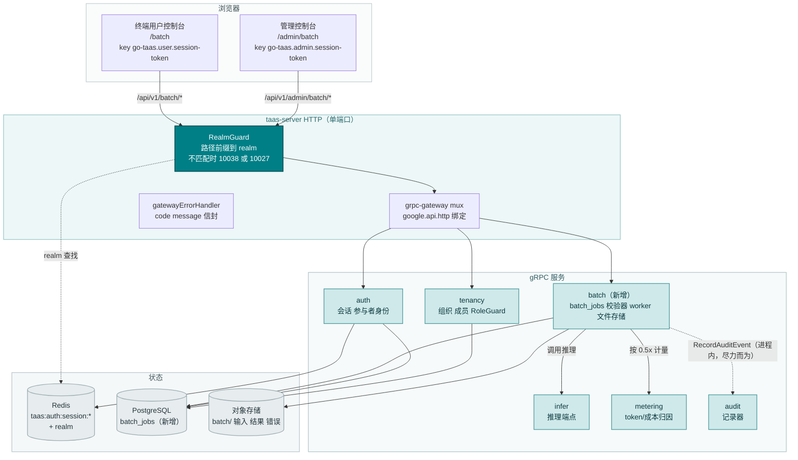
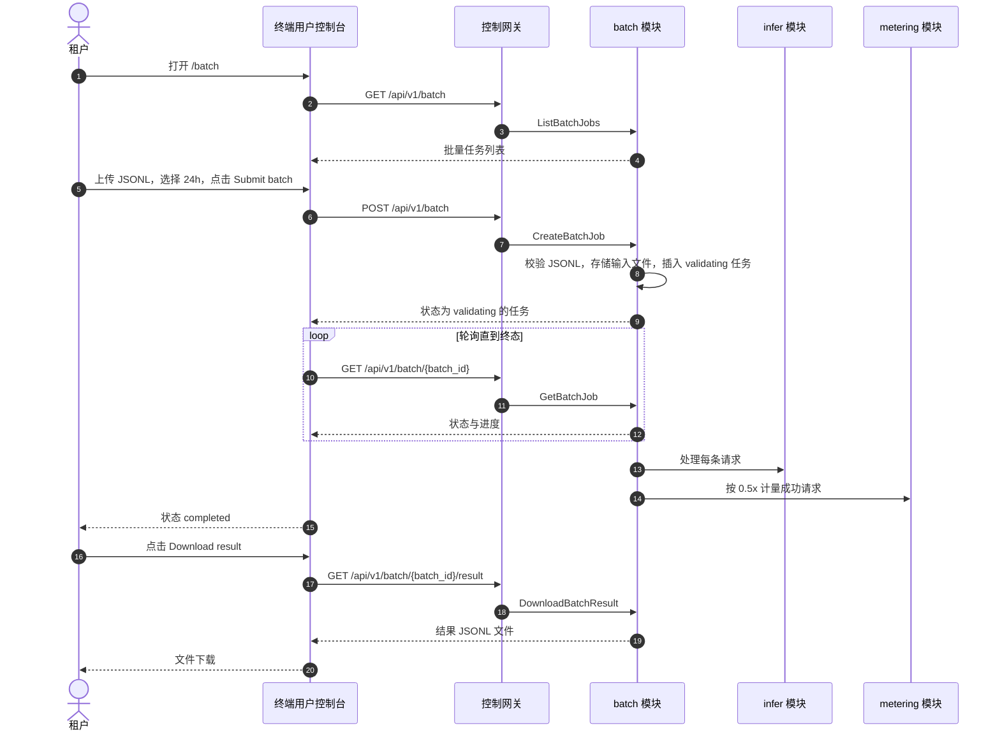
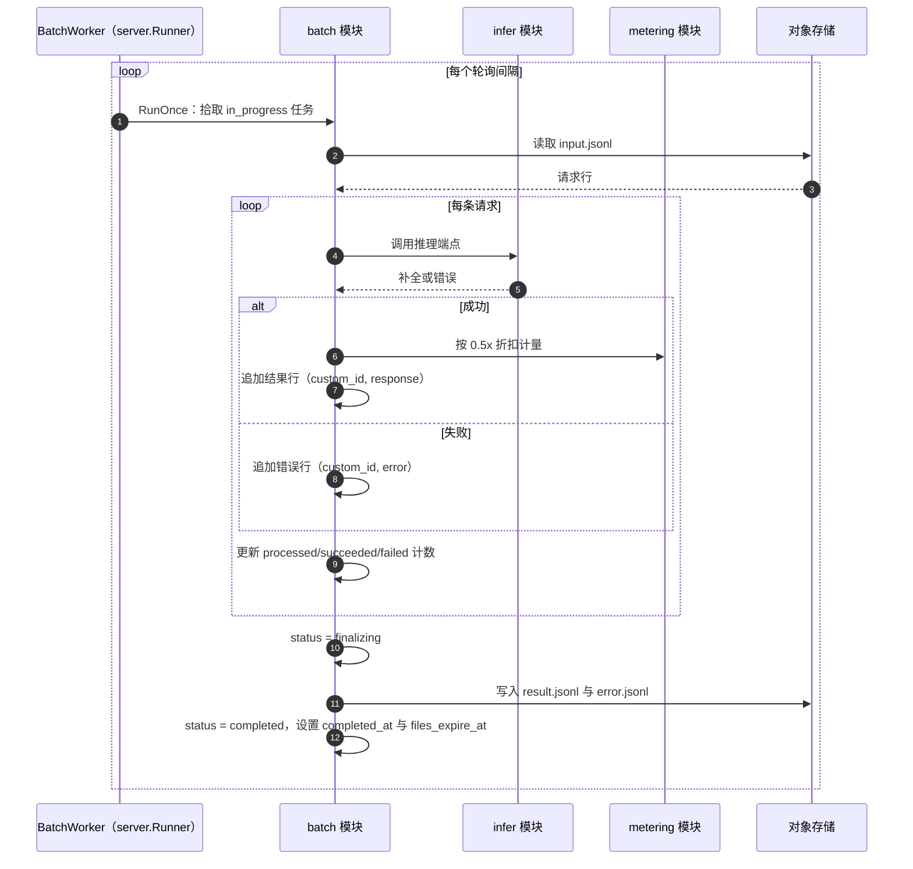
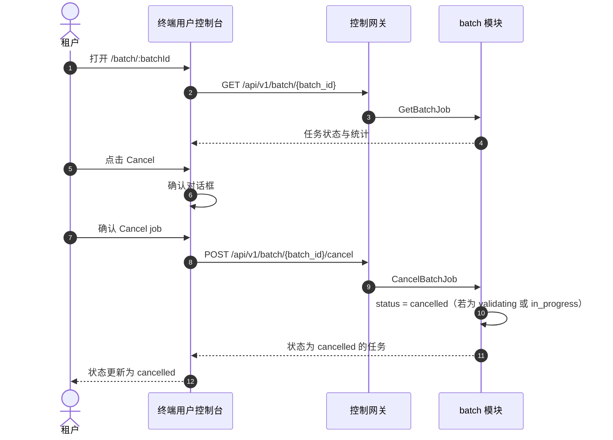

# 批量推理（批量任务）— 架构与详细设计

| 属性 | 内容 |
| --- | --- |
| 特性点 | 批量推理（批量任务）— 提交一个 JSONL 批量推理请求文件，异步处理并享受折扣价，监控进度，下载结果/错误文件（backlog 第 42 行） |
| 文档范围 | 特性-42 的架构与详细设计：新增 `batch` 模块，拥有批量任务生命周期、JSONL 输入/输出文件存储、JSONL 校验器、批量 worker 与保留运行器；`batch_jobs` 表与对象存储文件布局；`taas.batch.v1.BatchService` proto，带管理面/用户面双 HTTP 绑定；编排现有 `infer` 与 `metering` 流水线的批量 worker；终端用户面批量页面（`/batch`、`/batch/:batchId`）与管理面批量页面（`/admin/batch`、`/admin/batch/:batchId`）；以及错误处理、配置、安全、上线与逐层函数级设计 |
| 归属模块 | 新增 `batch` 模块（`services/batch`）：`batch_jobs` 表、CRUD/查询 RPC、JSONL 校验器、批量 worker、文件存储、保留运行器；`infer`（只读：批量 worker 调用的推理端点）；`metering`（只读：批量任务的按请求 token/成本归因）；`pkg/server` 网关（管理前缀与用户前缀绑定）；控制台 web 应用（终端用户面 `BatchPage`/`BatchDetailPage`，管理面 `AdminBatchPage`/`AdminBatchDetailPage`） |
| 相关文档 | [需求分析与 UI/UX 设计](../design/batch-inference.zh-cn.md) · [架构设计](../design/architecture.zh-cn.md) 第 1.2 节（消息队列）、第 2 节（模块职责）、第 3.1 节（管理面/用户面分离）· [控制台面分离](./console-surface-separation.zh-cn.md)（本特性横跨的两个面；realm 守卫，10038）· [请求日志与 API 游乐场](./request-logs-playground.zh-cn.md)（同源的推理面及其请求日志约定）· [账单报表与 CSV 导出](./billing-reports.zh-cn.md)（同源的异步任务与 Excel 友好 CSV 约定）· [数据导出与隐私](./data-export-privacy.zh-cn.md)（同源的异步任务生命周期与租户隔离约定）· [审计日志](./audit-logging.zh-cn.md)（批量操作必须调用的审计记录器） |
| 状态 | 架构完成，已移交开发者代理 |

---

## 1. 概述与目标

go-taas 通过 OpenAI 兼容网关（特性 #2、#12）提供推理服务：智能体发送请求并实时收到补全结果。但有一大类工作负载——模型评测、数据标注、批量分类、离线摘要、向量回填等——需要处理成千上万条可以等待数分钟甚至数小时的请求。通过实时端点逐条发送这些请求既慢、又浪费、还昂贵。本特性新增**批量推理**能力：租户上传一个 JSONL 推理请求文件，平台将其作为批量任务异步处理，租户监控进度并下载结果与错误文件，并享受折扣价。

**目标**：新增 `batch` 模块，拥有 `batch_jobs` 表、JSONL 输入/输出文件存储与异步批量 worker；`taas.batch.v1.BatchService`，含六个 RPC，其中三个双绑定到用户前缀 `/api/v1/batch/*` 与管理前缀 `/api/v1/admin/batch/*`，三个仅用户面；批量任务生命周期 `validating` → `in_progress` → `finalizing` → `completed` / `failed` / `expired` / `cancelled`；编排现有 `infer` 与 `metering` 流水线、按实时价 50% 计费的批量 worker；有界的结果/错误文件保留窗口；新增错误码 12601–12606；终端用户面批量页面（`/batch`）与详情页（`/batch/:batchId`），以及管理面批量页面（`/admin/batch`）与详情页（`/admin/batch/:batchId`）。

**非目标**（延后，设计第 8 节）：实时推理游乐场（特性 #12）；请求日志与追踪（特性 #12、#27）；账单报表与 CSV 导出（特性 #25）；数据导出与隐私（特性 #41）；模型微调（2026-10-03 被产品负责人移除）。实时推理路径不变——批量 worker 调用数据面服务的同一个 `infer` 端点，`metering` 流水线只读复用。

### 1.1 本文档的阅读顺序

第 2 节记录架构决策（AD1–AD9，镜像设计的 D1–D9）。第 3–5 节是组件视图、数据模型与 API 设计。第 6 节是前端架构（两个控制台的页面 → 路由 → API 前缀表，每面认证守卫）。第 7–8 节是时序流程与错误处理。第 9–11 节是配置、安全与上线。第 12–14 节是验收标准追溯、函数级详细设计与有序实现任务清单。

---

## 2. 架构决策

| # | 决策 | 依据 |
| --- | --- | --- |
| AD1 | **新增 `batch` 模块**（`services/batch`），拥有 `batch_jobs` 表、JSONL 输入/输出文件存储、JSONL 校验器、批量 worker 与保留运行器，并使用自己的错误块 **126xx** | 批量推理编排现有 `infer` 与 `metering` 流水线；专用模块把批量任务生命周期与文件存储从产生模块中分离出来并给它一个归属，镜像 `webhook` 拥有投递的方式（设计 D1） |
| AD2 | **批量任务由输入文件与完成窗口定义。** `CreateBatchJob` 接收上传的 JSONL 输入文件与 `completion_window`（默认 `24h`，范围 `1h`–`14d`）。任务以 `status = validating` 创建；输入文件存储在 batch 模块的对象存储中 | 完成窗口限定平台可用的时间；输入文件是批量的载荷。窗口遵循 OpenAI/阿里云约定（设计 D2） |
| AD3 | **批量任务生命周期为 `validating` → `in_progress` → `finalizing` → `completed` / `failed` / `expired` / `cancelled`。** `validating` 校验 JSONL 格式、逐行 schema、文件大小与单模型一致性；`in_progress` 处理请求；`finalizing` 写入结果/错误文件；`completed` 使其可下载；`failed` 表示文件级错误（未处理任何请求）；`expired` 表示完成窗口已过；`cancelled` 表示租户/操作员已停止 | 生命周期镜像被调研平台，并为控制台提供清晰的进度模型。`failed` 与逐行错误（进入错误文件）不同（设计 D3） |
| AD4 | **批量推理按实时价 50% 计费。** 每条成功处理的请求都通过现有 `metering` 流水线计量，并在价格查询中应用 `batch` 折扣因子 0.5。失败请求与文件级失败不计费 | 50% 折扣是通用批量约定（OpenAI、Anthropic、阿里云），并奖励租户使用非高峰、异步工作负载。它复用现有计量/价格流水线（特性 #4、#5）（设计 D4） |
| AD5 | **批量任务按租户隔离并掩码。** 用户面的 `CreateBatchJob` 不接受 `organization_id` 过滤（调用方组织隐含），绝不暴露其他租户的任务。管理面列出所有任务，但掩码逐请求内容（掩码投影规则，特性 #17） | 遵循特性 #17 的掩码投影规则：租户的批量绝不泄露其他租户的数据。管理面看到任务元数据与聚合统计，但看不到原始请求/响应体（设计 D5） |
| AD6 | **结果与错误文件为 JSONL，以 `custom_id` 为键。** 结果文件每条成功请求一行，含 `custom_id` 与 `response`；错误文件每条失败请求一行，含 `custom_id` 与 `error`。两者在 `status = completed` 时可下载 | 双文件、`custom_id` 为键的输出是通用约定，让租户可将结果与输入关联（设计 D6） |
| AD7 | **batch 块新增错误码 12601–12699。** **12601 `CodeBatchJobNotFound`**、**12602 `CodeBatchJobStateInvalid`**、**12603 `CodeBatchInputInvalid`**、**12604 `CodeBatchInputTooLarge`**、**12605 `CodeBatchModelMismatch`**、**12606 `CodeBatchNotCompleted`**。范围/格式校验在适用处复用现有错误码 | 批量推理是新模块（AD1），其错误码位于 account 块（125xx）之后的全新块；不同错误码让每种失败模式都可操作（设计 D7） |
| AD8 | **批量任务保留有限窗口后删除。** 已完成任务的结果/错误文件保留可配置窗口（默认 30 天）后删除；任务元数据行保留并带 `files_expired` 标志。控制台在过期日期前警告 | 结果静默过期是被调研的坑；带可见过期日期的有界保留既保持平台整洁，又不让租户意外（设计 D8） |
| AD9 | **批量任务操作被审计。** 任务创建、取消与结果下载被审计（特性 #15），记为 `batch.created` / `batch.cancelled` / `batch.downloaded`。底层逐请求推理已由现有流水线计量并记录 | 本特性编排现有推理与计量；只有新的批量操作需要新的审计事件（设计 D9） |

---

## 3. 组件视图

### 3.1 归属

| 层 / 组件 | 拥有 | 本特性的变更 |
| --- | --- | --- |
| **控制网关（`grpc-gateway`）** | 批量 RPC 的 HTTP/JSON 门面；realm 守卫（特性 #17）已用 10038 拒绝错误 realm 会话；将 `X-Organization-Id` 作为 gRPC 元数据透传 | 新增 6 个 HTTP 批量 RPC 的绑定（第 5 节）；realm 守卫不变 |
| **`batch` 模块（`services/batch`）** | `batch_jobs` 表、CRUD/查询 RPC、JSONL 校验器、批量 worker、文件存储、保留运行器 | **新增模块**（AD1） |
| **`infer` 模块** | 批量 worker 调用的推理端点 | 只读：批量 worker 调用数据面服务的同一个 OpenAI 兼容推理路径（AD4） |
| **`metering` 模块** | 按请求 token/成本归因 | 只读：批量 worker 通过现有流水线以 `batch` 折扣因子 0.5 计量每条成功请求（AD4） |
| **`audit` 模块** | 审计记录器 | 只读：批量模块在任务创建、取消与结果下载后调用 `RecordAuditEvent`（AD9） |
| **`auth` 模块** | 参与者身份、会话 realm、会话活动组织 | 只读：批量模块从会话解析组织；`SessionActiveOrg` 为带会话的调用提供组织 |
| **`tenancy` 模块** | 组织、成员、角色、RoleGuard | 只读：`RoleGuard` 按解析出的组织上下文中调用者的角色门控管理面批量 RPC（10036） |
| **PostgreSQL** | `batch_jobs` 表（新增）；所有其他表不变 | 通过 AutoMigrate 新增一张表（第 4 节） |
| **对象存储（MinIO / JuiceFS）** | JSONL 输入与结果/错误文件 | 在 `batch/` 前缀下新增文件布局（第 4.2 节） |
| **控制台** | 终端用户面批量页面与管理面批量页面 | 在两个面上新增四个页面（第 6 节） |

### 3.2 运行时组件视图



### 3.3 请求身份链

批量 RPC 复用既定身份链（控制台面分离 §3.3）：

1. `RealmGuard`（HTTP，`pkg/server/realm.go`）——路径前缀决定期望 realm。`/api/v1/admin/batch/*` 期望 `admin`；`/api/v1/batch/*` 期望 `user`。无 `Authorization` 头：透传（过渡期，特性 #17 AD4）。有头：从 Redis 解析会话 realm；不匹配 → 10038，未知/过期/无 realm → 10027。
2. grpc-gateway mux——按注解路径路由并转发 `authorization` 与 `x-organization-id`。
3. 服务处理器——对带会话的调用，`SessionActiveOrg` 使会话的活动组织具有权威性并忽略 `X-Organization-Id`；无会话时，`resolveOrganizationID` 读取过渡期头，缺失或为空时返回 10001。
4. `tenancy.RoleGuard`——按解析出的组织上下文中调用者的角色门控管理面批量 RPC（10036）。终端用户面批量 RPC 硬性限定到调用方组织，无需角色检查。

### 3.4 批量 worker 与推理/计量接缝

批量 worker 是一个进程内 `server.Runner`（账单报表生成器模式）。它拾取 `in_progress` 任务，对输入文件中的每条请求调用数据面服务的同一个 OpenAI 兼容推理路径（通过 `infer` 模块的进程内客户端），然后通过现有 `metering` 流水线以 `batch` 折扣因子 0.5 计量每条成功请求（AD4）。worker 是对现有流水线的纯编排——推理、计量或计费流水线均无改动。worker 是结果/错误文件的唯一写入者；保留运行器是唯一删除者。

---

## 4. 数据模型

### 4.1 `batch_jobs` 表

| 列 | PostgreSQL 类型 | 约束 | 描述 |
| --- | --- | --- | --- |
| `batch_id` | `uuid` | PRIMARY KEY | 服务端生成的 UUID v4，对外暴露为 `batch_id` |
| `organization_id` | `varchar(64)` | NOT NULL，索引（复合） | 归属组织 |
| `model` | `varchar(128)` | NOT NULL | 所有请求使用的单一模型（AD3） |
| `status` | `varchar(16)` | NOT NULL，索引 | `validating` / `in_progress` / `finalizing` / `completed` / `failed` / `expired` / `cancelled`（AD3） |
| `completion_window` | `varchar(8)` | NOT NULL | 完成窗口，如 `24h`（AD2） |
| `input_file_key` | `varchar(512)` | NOT NULL | 上传的 JSONL 输入文件的对象存储键（第 4.2 节） |
| `result_file_key` | `varchar(512)` | NULL | 结果文件的对象存储键；`finalizing` 前为 NULL |
| `error_file_key` | `varchar(512)` | NULL | 错误文件的对象存储键；`finalizing` 前为 NULL |
| `total_requests` | `bigint` | NOT NULL DEFAULT 0 | 输入文件中的请求数 |
| `processed_requests` | `bigint` | NOT NULL DEFAULT 0 | 已处理的请求数 |
| `succeeded_requests` | `bigint` | NOT NULL DEFAULT 0 | 成功请求数 |
| `failed_requests` | `bigint` | NOT NULL DEFAULT 0 | 失败请求数（逐行错误） |
| `input_tokens` | `bigint` | NOT NULL DEFAULT 0 | 成功请求的输入 token 总和 |
| `output_tokens` | `bigint` | NOT NULL DEFAULT 0 | 成功请求的输出 token 总和 |
| `cost` | `bigint` | NOT NULL DEFAULT 0 | 成功请求成本之和，以最小单位（如分）计 |
| `currency` | `varchar(8)` | NOT NULL DEFAULT `USD` | 计费货币（来自 billing 模块） |
| `files_expired` | `boolean` | NOT NULL DEFAULT false | 结果/错误文件被保留删除时为 true（AD8） |
| `error` | `varchar(512)` | NOT NULL DEFAULT '' | `status = failed` 时的失败原因 |
| `created_at` | `timestamptz` | NOT NULL，索引（复合） | 创建时间（UTC） |
| `completed_at` | `timestamptz` | NULL | 任务到达终态的时间 |
| `files_expire_at` | `timestamptz` | NULL | 结果/错误文件过期时间（created_at + 保留窗口） |

设计说明：

- 复合索引 `idx_batch_jobs_org_created (organization_id, created_at)` 用于组织隔离列表；`status` 索引用于 worker 的 `in_progress` 扫描与管理面全量视图。
- `cost` 以最小单位（如分）作为 int64 存储，与 billing 模块的成本表示一致；API 将其序列化为 JSON 字符串。
- 无指向 `organizations` / `inference_services` 的外键：批量任务必须比已删除的组织或服务存活更久，使其元数据保持可调试（镜像审计事件推理）。
- `files_expired` 标志由保留运行器在删除结果/错误文件时设置；任务元数据行保留（AD8）。

### 4.2 对象存储文件布局

batch 模块在对象存储（MinIO / JuiceFS）的 `batch/` 前缀下存储输入、结果与错误文件：

| 键 | 写入者 | 读取者 | 保留 |
| --- | --- | --- | --- |
| `batch/{org_id}/{batch_id}/input.jsonl` | `CreateBatchJob`（上传） | 批量 worker | 任务删除时删除 |
| `batch/{org_id}/{batch_id}/result.jsonl` | 批量 worker（`finalizing`） | `DownloadBatchResult` | 窗口后由保留运行器删除（AD8） |
| `batch/{org_id}/{batch_id}/error.jsonl` | 批量 worker（`finalizing`） | `DownloadBatchError` | 窗口后由保留运行器删除（AD8） |

输入文件在创建时写入；结果/错误文件在 `finalizing` 期间写入。保留运行器在保留窗口后删除结果/错误文件并设置 `files_expired = true`；输入文件在任务行删除时删除。

### 4.3 迁移说明

- `batch_jobs` 表由 GORM `AutoMigrate` 在 `taas-server` 启动时创建（增量；无数据迁移）。`Migrate`/`MigrateSchemaForFVT` 增加 `BatchJob` 模型。
- 无需 init-SQL 升级路径：该表在发布时是新的且为空；批量 worker 与保留运行器在任务创建后立即开始填充。
- 批量 worker 是结果/错误文件的唯一写入者；保留运行器是结果/错误文件的唯一删除者。

---

## 5. API 设计

所有批量 RPC 属于新的 **`taas.batch.v1.BatchService`**（`proto/taas/batch/v1/batch.proto`），通过控制网关以 HTTP 提供。用户 RPC 在 `/api/v1/batch/*` 下提供；管理 RPC 在 `/api/v1/admin/batch/*` 下提供。面由请求路径推导（第 3.3 节）。

| RPC | HTTP（用户） | HTTP（管理） | 状态 | 用途 |
| --- | --- | --- | --- | --- |
| `CreateBatchJob` | `POST /api/v1/batch` | — | **新增** | 创建批量任务（JSONL 输入 + 完成窗口）；返回 `status = validating` |
| `ListBatchJobs` | `GET /api/v1/batch` | — | **新增** | 列出调用方任务，最新在前 |
| `GetBatchJob` | `GET /api/v1/batch/{batch_id}` | — | **新增** | 获取任务状态与统计 |
| `CancelBatchJob` | `POST /api/v1/batch/{batch_id}/cancel` | — | **新增** | 取消处于 `validating` 或 `in_progress` 的任务 |
| `DownloadBatchResult` | `GET /api/v1/batch/{batch_id}/result` | — | **新增** | `completed` 时下载结果文件 |
| `DownloadBatchError` | `GET /api/v1/batch/{batch_id}/error` | — | **新增** | `completed` 时下载错误文件 |
| `AdminListBatchJobs` | — | `GET /api/v1/admin/batch` | **新增** | 列出所有租户的任务（掩码） |
| `AdminGetBatchJob` | — | `GET /api/v1/admin/batch/{batch_id}` | **新增** | 获取任意任务的元数据与聚合统计（掩码） |
| `AdminCancelBatchJob` | — | `POST /api/v1/admin/batch/{batch_id}/cancel` | **新增** | 取消处于 `validating` 或 `in_progress` 的任意任务 |

> **面说明**：`CreateBatchJob`、`DownloadBatchResult` 与 `DownloadBatchError` **仅用户面**——管理面掩码逐请求内容（AD5），绝不创建或下载批量的原始请求/响应体。管理面有自己的 `AdminListBatchJobs`、`AdminGetBatchJob` 与 `AdminCancelBatchJob` RPC（全量并掩码），镜像设计 §6 的 RPC 表。这是与设计 D5（管理面看到任务元数据与聚合统计，但看不到原始请求/响应体）及设计 §5.1 面分配表（未列出管理面创建/下载行）最一致的解读。

### 5.1 Proto 契约

```protobuf
syntax = "proto3";

package taas.batch.v1;

import "google/api/annotations.proto";
import "taas/common/v1/common.proto";

option go_package = "github.com/go-taas/go-taas/proto/taas/batch/v1;batchv1";

// BatchService 管理批量推理任务。用户 RPC 在 /api/v1/batch/* 下按租户隔离；
// 管理 RPC 在 /api/v1/admin/batch/* 下全量并掩码。CreateBatchJob、
// DownloadBatchResult 与 DownloadBatchError 仅用户面（管理面掩码逐请求内容）。
service BatchService {
  // CreateBatchJob 根据上传的 JSONL 输入文件与完成窗口创建批量任务。
  // 用户面 API：在 /api/v1/batch 下按租户隔离。
  rpc CreateBatchJob(CreateBatchJobRequest) returns (CreateBatchJobResponse) {
    option (google.api.http) = {
      post: "/api/v1/batch"
      body: "*"
    };
  }

  // ListBatchJobs 返回调用方的批量任务，最新在前，带点式分页。
  // 用户面 API：在 /api/v1/batch 下按租户隔离。
  rpc ListBatchJobs(ListBatchJobsRequest) returns (ListBatchJobsResponse) {
    option (google.api.http) = {
      get: "/api/v1/batch"
    };
  }

  // GetBatchJob 返回任务的状态与统计。
  // 用户面 API：在 /api/v1/batch 下按租户隔离。
  rpc GetBatchJob(GetBatchJobRequest) returns (GetBatchJobResponse) {
    option (google.api.http) = {
      get: "/api/v1/batch/{batch_id}"
    };
  }

  // CancelBatchJob 取消处于 validating 或 in_progress 的任务。
  // 用户面 API：在 /api/v1/batch 下按租户隔离。
  rpc CancelBatchJob(CancelBatchJobRequest) returns (CancelBatchJobResponse) {
    option (google.api.http) = {
      post: "/api/v1/batch/{batch_id}/cancel"
      body: "*"
    };
  }

  // DownloadBatchResult 在 status = completed 时返回结果文件。
  // 用户面 API：在 /api/v1/batch 下提供。
  rpc DownloadBatchResult(DownloadBatchResultRequest) returns (DownloadBatchResultResponse) {
    option (google.api.http) = {
      get: "/api/v1/batch/{batch_id}/result"
    };
  }

  // DownloadBatchError 在 status = completed 时返回错误文件。
  // 用户面 API：在 /api/v1/batch 下提供。
  rpc DownloadBatchError(DownloadBatchErrorRequest) returns (DownloadBatchErrorResponse) {
    option (google.api.http) = {
      get: "/api/v1/batch/{batch_id}/error"
    };
  }

  // AdminListBatchJobs 返回所有租户的批量任务，掩码，最新在前，带点式分页。
  // 管理面 API：在 /api/v1/admin/batch 下全量。
  rpc AdminListBatchJobs(AdminListBatchJobsRequest) returns (AdminListBatchJobsResponse) {
    option (google.api.http) = {
      get: "/api/v1/admin/batch"
    };
  }

  // AdminGetBatchJob 返回任意任务的元数据与聚合统计，掩码。
  // 管理面 API：在 /api/v1/admin/batch 下全量。
  rpc AdminGetBatchJob(AdminGetBatchJobRequest) returns (AdminGetBatchJobResponse) {
    option (google.api.http) = {
      get: "/api/v1/admin/batch/{batch_id}"
    };
  }

  // AdminCancelBatchJob 取消处于 validating 或 in_progress 的任意任务。
  // 管理面 API：在 /api/v1/admin/batch 下全量。
  rpc AdminCancelBatchJob(AdminCancelBatchJobRequest) returns (AdminCancelBatchJobResponse) {
    option (google.api.http) = {
      post: "/api/v1/admin/batch/{batch_id}/cancel"
      body: "*"
    };
  }
}

// BatchJobStatus 是批量任务生命周期状态。
enum BatchJobStatus {
  BATCH_JOB_STATUS_UNSPECIFIED = 0;
  BATCH_JOB_STATUS_VALIDATING = 1;
  BATCH_JOB_STATUS_IN_PROGRESS = 2;
  BATCH_JOB_STATUS_FINALIZING = 3;
  BATCH_JOB_STATUS_COMPLETED = 4;
  BATCH_JOB_STATUS_FAILED = 5;
  BATCH_JOB_STATUS_EXPIRED = 6;
  BATCH_JOB_STATUS_CANCELLED = 7;
}

message CreateBatchJobRequest {
  // input_file 是 JSONL 输入文件内容（≤ 500 MB，≤ 50,000 行）。
  // 每行是 {"custom_id","method","url","body"}。
  bytes input_file = 1;
  // completion_window 是完成窗口，默认 "24h"，范围 "1h"–"14d"。
  string completion_window = 2;
}

message CreateBatchJobResponse {
  taas.common.v1.Response response = 1;
  BatchJob batch_job = 2;
}

message ListBatchJobsRequest {
  taas.common.v1.PageRequest page = 1;
  // status/model 为可选过滤。
  string status = 2;
  string model = 3;
}

message ListBatchJobsResponse {
  taas.common.v1.Response response = 1;
  repeated BatchJob batch_jobs = 2;
  taas.common.v1.PageMeta page_meta = 3;
}

message GetBatchJobRequest {
  string batch_id = 1;
}

message GetBatchJobResponse {
  taas.common.v1.Response response = 1;
  BatchJob batch_job = 2;
}

message CancelBatchJobRequest {
  string batch_id = 1;
}

message CancelBatchJobResponse {
  taas.common.v1.Response response = 1;
  BatchJob batch_job = 2;
}

message DownloadBatchResultRequest {
  string batch_id = 1;
}

message DownloadBatchResultResponse {
  taas.common.v1.Response response = 1;
  // content 是 status = completed 时的结果 JSONL 文件内容。
  bytes content = 2;
  // filename 是 Content-Disposition 文件名。
  string filename = 3;
}

message DownloadBatchErrorRequest {
  string batch_id = 1;
}

message DownloadBatchErrorResponse {
  taas.common.v1.Response response = 1;
  // content 是 status = completed 时的错误 JSONL 文件内容。
  bytes content = 2;
  // filename 是 Content-Disposition 文件名。
  string filename = 3;
}

message AdminListBatchJobsRequest {
  taas.common.v1.PageRequest page = 1;
  // status/model/organization_id 为可选过滤；缺省 organization_id 表示
  // 所有组织。
  string status = 2;
  string model = 3;
  string organization_id = 4;
}

message AdminListBatchJobsResponse {
  taas.common.v1.Response response = 1;
  repeated BatchJob batch_jobs = 2;  // 掩码（无原始请求/响应）
  taas.common.v1.PageMeta page_meta = 3;
}

message AdminGetBatchJobRequest {
  string batch_id = 1;
}

message AdminGetBatchJobResponse {
  taas.common.v1.Response response = 1;
  BatchJob batch_job = 2;  // 掩码（无原始请求/响应）
}

message AdminCancelBatchJobRequest {
  string batch_id = 1;
}

message AdminCancelBatchJobResponse {
  taas.common.v1.Response response = 1;
  BatchJob batch_job = 2;
}

// BatchJob 是一个批量推理任务。
message BatchJob {
  string batch_id = 1;
  string organization_id = 2;
  string model = 3;
  BatchJobStatus status = 4;
  string completion_window = 5;
  int64 total_requests = 6;
  int64 processed_requests = 7;
  int64 succeeded_requests = 8;
  int64 failed_requests = 9;
  int64 input_tokens = 10;
  int64 output_tokens = 11;
  int64 cost = 12;              // 最小单位，JSON 字符串
  string currency = 13;
  bool files_expired = 14;
  int64 created_at = 15;        // unix 秒
  int64 completed_at = 16;      // unix 秒
  int64 files_expire_at = 17;   // unix 秒
}
```

### 5.2 契约约束

1. **面分离**：`CreateBatchJob`、`ListBatchJobs`、`GetBatchJob`、`CancelBatchJob`、`DownloadBatchResult` 与 `DownloadBatchError` 仅用户面，位于 `/api/v1/batch/*`；`AdminListBatchJobs`、`AdminGetBatchJob` 与 `AdminCancelBatchJob` 仅管理面，位于 `/api/v1/admin/batch/*`。管理 RPC 需要管理会话；用户 RPC 需要用户会话。realm 守卫在任何处理器运行前用 10038 拒绝错误 realm 会话（特性 #17）。管理面掩码逐请求内容（AD5）。
2. **线上约定不变**：点式分页（`?page.offset=0&page.limit=20`）、成功 HTTP 200、业务错误为 `{"code": <int>, "message": "..."}`、int64 字段序列化为 JSON 字符串。
3. **`CreateBatchJob` 校验**：输入文件必须是合法 JSONL（每行 `{"custom_id","method","url","body"}`，`custom_id` 唯一且 ≤ 256 字符，`method` = `POST`，`url` = `/v1/chat/completions` 或 `/v1/embeddings`），否则 12603；≤ 500 MB 且 ≤ 50,000 行，否则 12604；所有请求使用相同 `body.model`，否则 12605。`completion_window` 默认 `24h`，范围 `1h`–`14d`。它存储输入文件，以 `status = validating` 创建任务并返回。
4. **`ListBatchJobs` / `GetBatchJob`**：用户绑定按租户隔离（AD5）；未知 `batch_id` 返回 12601。**`AdminListBatchJobs` / `AdminGetBatchJob`**：全量并掩码（AD5）；未知 `batch_id` 返回 12601。
5. **`CancelBatchJob` / `AdminCancelBatchJob`**：取消处于 `validating` 或 `in_progress` 的任务；终态返回 12602。
6. **`DownloadBatchResult` / `DownloadBatchError`**：在 `status = completed` 时返回文件；在 `completed` 前下载返回 12606。响应为 `application/x-ndjson`，`Content-Disposition` 文件名如 `batch-<batch_id>-result.jsonl` / `batch-<batch_id>-error.jsonl`（AD6）。
7. **计费（AD4）**：每条成功请求以 `batch` 折扣因子 0.5 计量；失败请求与文件级失败不计费。任务 `cost` 是其成功请求成本之和。
8. **审计（AD9）**：任务创建、取消与结果下载记为 `batch.created` / `batch.cancelled` / `batch.downloaded`。

### 5.3 错误码

所有错误都是统一信封中的 `pkg/errors` 业务码。在 batch 块 **12601–12606**（AD7）中分配六个新码；其余已存在。

| 条件 | 错误码 | 常量 | 说明 |
| --- | --- | --- | --- |
| `GetBatchJob`/`CancelBatchJob`/`DownloadBatchResult`/`DownloadBatchError`/`AdminGetBatchJob`/`AdminCancelBatchJob` 上的未知 `batch_id` | 12601 | `CodeBatchJobNotFound` | **新增**（AD7） |
| 终态取消 | 12602 | `CodeBatchJobStateInvalid` | **新增** |
| 非法 JSONL 输入文件 | 12603 | `CodeBatchInputInvalid` | **新增** |
| 输入文件过大 | 12604 | `CodeBatchInputTooLarge` | **新增** |
| 单批量多模型 | 12605 | `CodeBatchModelMismatch` | **新增** |
| `completed` 前下载 | 12606 | `CodeBatchNotCompleted` | **新增** |
| 调用者角色低于所需角色（管理组织范围） | 10036 | `CodeForbidden` | 现有（特性 #10） |
| 缺失/过期/撤销的会话 | 10027 | `CodeSessionInvalid` | 现有（特性 #7） |
| 其他前缀上的错误 realm 会话 | 10038 | `CodeRealmMismatch` | 现有（特性 #17） |
| 管理 API 上缺失 `X-Organization-Id`（过渡期） | 10001 | `CodeUnauthorized` | `resolveOrganizationID` 模式 |
| 数据库 / 对象存储 / 基础设施故障 | 500 | `CodeInternal` | 通过错误归一化 |

---

## 6. 前端架构

### 6.1 页面 → 路由 → API 前缀表

| 页面 / 组件 | 面 | Web 路由 | API 前缀 | 认证守卫 |
| --- | --- | --- | --- | --- |
| **批量页面** | 终端用户 | `/batch` | `/api/v1/batch` | 用户会话；硬性限定到调用方组织 |
| **批量详情页面** | 终端用户 | `/batch/:batchId` | `/api/v1/batch/{id}` | 用户会话 |
| **批量页面** | 管理 | `/admin/batch` | `/api/v1/admin/batch` | 管理会话；RoleGuard 组织范围 |
| **批量详情页面** | 管理 | `/admin/batch/:batchId` | `/api/v1/admin/batch/{id}` | 管理会话 |

> 终端用户批量页面只调用 `/api/v1/batch/*`；管理批量页面只调用 `/api/v1/admin/batch/*`。两个面绝不共享会话令牌（特性 #17）。管理面绝不调用 `CreateBatchJob`、`DownloadBatchResult` 或 `DownloadBatchError`（AD5）。

### 6.2 导航位置

- **终端用户控制台**：在用户导航中新增 **Batch** 项（`/batch`，testid `user-nav-batch`），位于推理组，与 Playground 和 Request Logs 并列。
- **管理控制台**：在管理导航中新增 **Batch** 项（`/admin/batch`，testid `nav-batch`），位于运维组，与 Inference Services 和 Autoscaling 并列。

### 6.3 复用的共享组件与状态

- **API 客户端**（`web/src/api.ts`）：realm 作用域客户端（`createApi(realm)`）已发送 `Authorization: Bearer <realm>.session-token` 与 `X-Organization-Id`（仅当 realm 令牌键为空时）。批量页面原样复用；不新增客户端。
- **文件拖放区**：`.jsonl` 文件拖放区是一个新的小组件（批量构建器的输入文件字段）；不与任何现有页面共享。
- **状态徽章**：`validating`/`in_progress`/`finalizing`/`completed`/`failed`/`expired`/`cancelled` 徽章样式复用账单报表的 pending/ready/failed 徽章样式。
- **进度条**：`processed_requests / total_requests` 进度条复用使用仪表盘的进度样式。
- **点式分页**：Usage 与 Request Logs 表格使用的共享分页组件。
- **空 / 错误 / 过期数据状态**：复用 Request Logs 页面模式（空文案、带 Retry 的错误横幅、"Showing stale data" 横幅）。
- **确认对话框**：取消任务确认复用 Webhooks 与 API Keys 页面使用的共享确认对话框组件。

### 6.4 每面认证守卫

- **终端用户批量页面**（`/batch`、`/batch/:batchId`）：在 `UserShell` 内渲染，当 `go-taas.user.session-token` 非空时运行用户会话守卫；缺失/过期会话重定向到 `/login?reason=expired`。页面 API 调用指向 `/api/v1/batch/*`。页面不暴露其他租户数据（AD5）。
- **管理批量页面**（`/admin/batch`、`/admin/batch/:batchId`）：在 `AdminShell` 内渲染，当 `go-taas.admin.session-token` 非空时运行管理会话守卫；缺失/过期会话重定向到 `/admin/login?reason=expired`；错误 realm 会话被网关以 10038 拒绝。页面 API 调用指向 `/api/v1/admin/batch/*`。无所需角色的会话收到 10036，页面显示标准权限不足状态（特性 #17）。
- **未认证访客**：任一页面的未认证访客由 shell 守卫重定向到正确的登录页（`/admin/login` 与 `/login`）。

### 6.5 控制台契约（为开发者代理钉定）

**批量页面**（`/batch`）：页面头部（"Batch"，副标题 "Process a large workload of inference requests asynchronously at a discounted rate"）带 **New batch** 主操作（`batch-new`）。下方，可折叠批量构建器（`batch-builder`，任务列表为空时默认展开），字段 **Input file**（`batch-input-file`，`.jsonl` 拖放区，≤ 500 MB，≤ 50,000 行）与 **Completion window**（`batch-completion-window`，下拉：1 h / 6 h / 24 h / 3 d / 7 d / 14 d，默认 24 h）。**Submit batch** 主操作（`batch-submit`）与 **Cancel** 次操作。下方，批量任务列表表格（`batch-table`、`batch-row-{id}`），列 Batch ID、Model、Status（`batch-status-{id}`）、Progress、Requests、Cost、Created、Actions（View、Cancel `batch-cancel-{id}`，`status` 为 `validating` 或 `in_progress` 时启用）。表格上方有 **Refresh** 操作（`batch-refresh`）。可按 Model、Status、Requests、Cost、Created 排序；可按 Status 与 Model 过滤；点式分页。

**交互状态**：默认（构建器 + 任务列表从首次成功加载渲染）；加载中（骨架表格，New batch 与 Refresh 禁用）；空（"No batch jobs yet." 并提示提交一个，构建器保持可见）；错误（带 Retry 的错误横幅、"Showing stale data" 横幅）；禁用（请求进行中时 Submit batch 禁用，`status` 为终态时 Cancel 禁用，任务创建中构建器字段禁用）；权限不足（10036 → 标准权限不足状态，带返回用户首页的链接）。

**提交批量流程**：提交构建器会上传文件并以 `status = validating` 创建任务，然后轮询 `GetBatchJob` 直到 `status` 为终态，更新行的进度。`failed` 校验显示错误消息并带 **Retry** 操作。

**批量详情页面**（`/batch/:batchId`）：页面头部带批量 ID 与 **Back to batch** 次操作。下方：**Job summary**（`batch-detail-summary`）——卡片，含 `status`、`model`、`completion_window`、`created_at`、`completed_at`、`files_expire_at`（文件即将过期时警告）；**Progress**（`batch-detail-progress`）——进度条显示 `processed_requests / total_requests`，含 `succeeded_requests` 与 `failed_requests` 计数；**Billing**（`batch-detail-billing`）——卡片，含 `input_tokens`、`output_tokens`、`cost`、`currency`，并注明批量推理按实时价 50% 计费；**Actions**——**Download result**（`batch-download-result`，`status = completed` 时启用）、**Download error**（`batch-download-error`，`status = completed` 且 `failed_requests > 0` 时启用）、**Cancel**（`batch-cancel`，`status` 为 `validating` 或 `in_progress` 时启用）。

**取消流程**：点击 Cancel 打开确认对话框（"Cancel this batch job? Requests already processed will still be billed."），带 **Cancel job**（危险）与 **Keep job**（次）操作。确认后调用 `CancelBatchJob` 并将状态更新为 `cancelled`。

**管理批量页面**（`/admin/batch`）：页面头部（"Batch"，副标题 "Monitor and manage batch inference jobs across all tenants"）。下方，批量任务列表表格（`admin-batch-table`、`admin-batch-row-{id}`），列 Batch ID、Organization、Model、Status、Progress、Requests、Cost、Created、Actions（View、Cancel `admin-batch-cancel-{id}`，`status` 为 `validating` 或 `in_progress` 时启用）。表格上方有 **Refresh** 操作（`admin-batch-refresh`）。可按 Organization、Model、Status、Requests、Cost、Created 排序；可按 Status、Model、Organization 过滤；点式分页。内容被掩码（AD5）：无结果/错误下载，无原始请求/响应体。

**管理批量详情页面**（`/admin/batch/:batchId`）：页面头部带批量 ID 与 **Back to batch** 次操作。下方：**Job summary**（`admin-batch-detail-summary`）——卡片，含 `status`、`organization`、`model`、`completion_window`、`created_at`、`completed_at`、`files_expire_at`；**Progress**（`admin-batch-detail-progress`）——进度条，含 `succeeded_requests` 与 `failed_requests` 计数；**Billing**（`admin-batch-detail-billing`）——卡片，含 `input_tokens`、`output_tokens`、`cost`、`currency`；**Actions**——**Cancel**（`admin-batch-cancel`，`status` 为 `validating` 或 `in_progress` 时启用）。无结果/错误下载（AD5）。

---

## 7. 时序流程

### 7.1 批量任务创建与监控（终端用户）



### 7.2 批量 worker（进程内运行器）



### 7.3 批量任务取消



---

## 8. 错误处理

所有错误都是统一信封中的 `pkg/errors` 业务码（第 5.3 节）。批量 worker 的逐请求失败不是 RPC 错误：失败请求进入错误文件（AD6），任务 `failed_requests` 计数递增。文件级失败（如无法读取输入文件）将任务标记为 `failed` 并设置 `error`。保留删除失败被记录并在下一个 tick 重试（凭证保留模式）。

控制台按 body `code` 分支（`web/src/api.ts` 已如此），绝不按 HTTP 状态。每个新码渲染特定内联消息：12601 "batch job not found"、12602 "invalid batch job state"、12603 "invalid JSONL input file"、12604 "input file too large"、12605 "multiple models in one batch"、12606 "batch not completed"。管理页面将 10036 映射到标准权限不足状态；终端用户页面将 10005/10017 映射到租户的权限不足文案（特性 #17 §8.2）。

---

## 9. 配置新增

| 键 | 默认 | 描述 |
| --- | --- | --- |
| `batch.worker.enabled` | `true` | 打开或关闭批量 worker（事件分诊 kill switch） |
| `batch.worker.pollInterval` | `5s` | 批量 worker 轮询 `in_progress` 任务的频率 |
| `batch.worker.concurrency` | `4` | 每次任务遍历并发处理的请求数 |
| `batch.retention.enabled` | `true` | 打开或关闭结果/错误文件保留运行器 |
| `batch.retention.fileTTL` | `720h`（30 天） | 已完成任务的结果/错误文件在删除前保留多久（AD8） |
| `batch.retention.interval` | `1h` | 保留遍历之间的 ticker 周期 |
| `batch.maxFileBytes` | `524288000`（500 MB） | 最大输入文件大小（AD2） |
| `batch.maxLines` | `50000` | 最大输入行数（AD2） |

`batch` 配置块在 `pkg/config` 中新增（`BatchConfig` + `BatchWorkerConfig` + `BatchRetentionConfig`），遵循 `webhook.delivery`/`webhook.retention` 模式。`applyDefaults`/`Validate` 设置上述默认值。批量 worker 读取 `enabled`/`pollInterval`/`concurrency`；保留运行器读取 `enabled`/`fileTTL`/`interval`；校验器读取 `maxFileBytes`/`maxLines`。

---

## 10. 安全考量

- **面分离**：终端用户批量页面只调用 `/api/v1/batch/*`；管理批量页面只调用 `/api/v1/admin/batch/*`。realm 守卫在任何处理器运行前用 10038 拒绝错误 realm 会话（特性 #17）。
- **管理全量视图按角色门控**：管理批量 RPC 默认全量（AD5），并由 `tenancy.RoleGuard` 门控——只有具有所需管理角色的调用者才能查看或取消跨租户任务；不可访问的组织返回 10036。
- **终端用户硬性隔离**：批量 RPC 的用户绑定硬性限定到调用方组织（会话活动组织权威，`X-Organization-Id` 忽略）；调用者绝不可能看到其他租户的任务（AD5）。
- **掩码投影**：管理面看到任务元数据与聚合统计，但看不到原始请求/响应体（AD5）。`CreateBatchJob`、`DownloadBatchResult` 与 `DownloadBatchError` 仅用户面——管理面绝不创建或下载批量的原始内容。
- **输入校验**：JSONL 校验器（AD3）在任何请求被处理前拒绝格式错误行、过大文件与多模型批量，因此格式错误的上传不会消耗推理容量。
- **有界保留**：结果/错误文件保留有界窗口（AD8）并由保留运行器删除；任务元数据行保留并带 `files_expired` 标志。
- **审计轨迹**：批量任务创建、取消与结果下载被审计（AD9），因此谁创建、取消或下载了任务都被记录。
- **无新特权**：批量推理不授予新能力；它是对现有推理与计量流水线的编排，处理调用者在其范围内本可消费的数据。

---

## 11. 上线 / 升级说明

- **一张新表**（`batch_jobs`）通过 `taas-server` 启动时的 AutoMigrate 创建；单独部署 `taas-server`。无数据迁移，无 init-SQL 升级路径。
- **proto 变更是增量的**：新增 `taas.batch.v1.BatchService` 与新 RPC；无现有 RPC 或消息变更。网关 mux 获得新绑定；realm 守卫不变。
- **控制台**：四个新页面加入现有 bundle；管理导航与用户导航各新增 Batch 项。无现有路由变更。
- **向后兼容**：过渡期（无会话、`X-Organization-Id`）路径为 CLI、FVT 与 e2e 套件保留；realm 守卫透传无 `Authorization` 头的请求（特性 #17 AD4）。
- **数据存在前为空**：批量 RPC 在任务创建前返回空任务列表；页面渲染空状态并提示提交一个。
- **批量 worker 与保留运行器**在首次遍历前空闲；查询在任务存在前返回空。

---

## 12. 验收标准追溯

| # | 标准 | 位置 |
| --- | --- | --- |
| AC1 | `CreateBatchJob` 返回 `status = validating` 的任务；非法 JSONL 文件返回 12603，过大文件返回 12604，多模型文件返回 12605 | §5.1、§5.2、§5.3 |
| AC2 | `ListBatchJobs` 返回调用方的批量任务最新在前；`GetBatchJob` 返回完整记录；未知 `batch_id` 返回 12601 | §5.1、§5.2、§5.3 |
| AC3 | `CancelBatchJob` 取消处于 `validating` 或 `in_progress` 的任务；终态返回 12602 | §5.1、§5.2、§5.3、§7.3 |
| AC4 | `DownloadBatchResult` / `DownloadBatchError` 在 `status = completed` 时返回文件；在 `completed` 前下载返回 12606 | §5.1、§5.2、§5.3、§7.1 |
| AC5 | 批量推理按实时价 50% 计费：每条成功请求以 `batch` 折扣因子 0.5 计量；失败请求不计费 | §3.4、§5.2、§7.2 |
| AC6 | 用户面的批量任务按租户隔离：只聚合调用方自己组织的任务，绝不暴露其他租户的任务 | §3.3、§5.2、§6.4、§10 |
| AC7 | `/batch` 页面从首次成功加载渲染批量构建器与批量任务列表，带 New batch 操作 | §6.5 |
| AC8 | 批量构建器校验输入文件与完成窗口，创建以 `status = validating` 出现的任务，然后轮询到终态并启用结果/错误下载 | §6.5、§7.1 |
| AC9 | `/batch/:batchId` 详情页显示任务的进度、计费与操作；Cancel 打开确认对话框并将状态更新为 `cancelled` | §6.5、§7.3 |
| AC10 | `/admin/batch` 页面列出所有租户的批量任务并带 Organization 列；管理详情页显示掩码元数据并可取消任务 | §6.5 |
| AC11 | 批量页面仅在终端用户面可达：路由 `/batch`，每个 API 调用使用 `/api/v1/batch/*` 前缀且不含 `/api/v1/admin/*` 字符串；管理页面仅使用 `/api/v1/admin/batch/*` 且不含 `/api/v1/batch/*` 字符串 | §6.1、§6.4、§10 |
| AC12 | 无所需角色的会话在 `/batch` 与 `/admin/batch` 页面收到 10036，页面显示标准权限不足状态 | §3.3、§6.4、§10 |

---

## 13. 详细设计（逐层函数级职责）

### 13.1 Proto → 服务 → 仓储 → 控制器

| 层 | 文件 | 职责 |
| --- | --- | --- |
| `proto/taas/batch/v1` | `batch.proto` | 新增 `BatchService`，含九个 RPC（第 5.1 节）；枚举 `BatchJobStatus`；消息 `CreateBatchJobRequest/Response`、`ListBatchJobsRequest/Response`、`GetBatchJobRequest/Response`、`CancelBatchJobRequest/Response`、`DownloadBatchResultRequest/Response`、`DownloadBatchErrorRequest/Response`、`AdminListBatchJobsRequest/Response`、`AdminGetBatchJobRequest/Response`、`AdminCancelBatchJobRequest/Response`、`BatchJob`。通过 `buf generate` 重新生成 `batch.pb.go`/`batch_grpc.pb.go`/`batch.pb.gw.go` |
| `services/batch` | `batch_model.go` | 新增 GORM 模型 `BatchJob` + `TableName`（第 4.1 节）；`BatchJobStatus` 字符串常量及其 proto 枚举 ↔ 字符串映射辅助函数 |
| | `batch_repository.go` | `InsertBatchJob(ctx, job)`——INSERT，返回生成 id；`FindBatchJobByID(ctx, orgID, batchID)`（未知时 12601）；`ListBatchJobs(ctx, orgFilter, filter)`（status/model 过滤，分页）；`UpdateBatchJob(ctx, job)`；`NextInProgressJob(ctx)`（供 worker）；`IncrementCounters(ctx, batchID, processed, succeeded, failed, inputTokens, outputTokens, cost)`；`SetStatus(ctx, batchID, status, completedAt, filesExpireAt)`；`FindExpiredFiles(ctx, cutoff, limit)`（供保留运行器）；`MarkFilesExpired(ctx, batchID)` |
| | `jsonl_validator.go` | `ValidateJSONL(content []byte, maxBytes, maxLines int) ([]RequestLine, model string, err error)`——解析每行，检查 `custom_id`（唯一，≤ 256 字符）、`method`（`POST`）、`url`（`/v1/chat/completions` 或 `/v1/embeddings`）、`body`（请求体）、文件大小（12604）、行数（12604）与单模型一致性（12605）；格式错误行返回 12603 |
| | `file_store.go` | `PutInput(ctx, orgID, batchID, content)` / `PutResult(ctx, orgID, batchID, content)` / `PutError(ctx, orgID, batchID, content)`——写入对象存储 `batch/{org_id}/{batch_id}/` 下（第 4.2 节）；`GetFile(ctx, key)`——读取文件；`DeleteFiles(ctx, orgID, batchID)`——删除结果/错误文件 |
| | `batch_worker.go` | `BatchWorker`（server.Runner，ticker）+ 为测试抽取的 `RunOnce(ctx)`；通过 `NextInProgressJob` 拾取 `in_progress` 任务，读取输入文件，对每条请求调用 `infer` 模块的推理客户端，通过 `metering` 模块按 0.5x 计量每条成功请求，追加结果/错误行，更新计数，并转换 `in_progress` → `finalizing` → `completed`（AD3、AD4） |
| | `batch_retention_runner.go` | `BatchRetentionRunner`（server.Runner，ticker）+ `RetainOnce(ctx)`——查找 `files_expire_at` 已过的已完成任务，删除结果/错误文件，并设置 `files_expired = true`（AD8） |
| | `service.go` | 新 RPC `CreateBatchJob`、`ListBatchJobs`、`GetBatchJob`、`CancelBatchJob`、`DownloadBatchResult`、`DownloadBatchError`、`AdminListBatchJobs`、`AdminGetBatchJob`、`AdminCancelBatchJob`；`Migrate`/`MigrateSchemaForFVT` 增加 `BatchJob`；`SessionActiveOrg`/`resolveOrganizationID` 接缝用于组织解析；`RoleGuard` 接缝用于管理组织范围；审计记录器接缝（AD9） |
| `services/infer` | `client.go` | 只读：暴露批量 worker 调用的进程内推理客户端（数据面服务的同一个 OpenAI 兼容路径） |
| `services/metering` | `service.go` | 只读：暴露批量 worker 以 `batch` 折扣因子 0.5 调用的计量接缝（AD4） |
| `services/audit` | `recorder.go` | 只读：批量模块在任务创建、取消与结果下载后调用 `Recorder.Record`（AD9） |
| `pkg/errors` | `codes.go`/`messages.go` | `CodeBatchJobNotFound`（12601）、`CodeBatchJobStateInvalid`（12602）、`CodeBatchInputInvalid`（12603）、`CodeBatchInputTooLarge`（12604）、`CodeBatchModelMismatch`（12605）、`CodeBatchNotCompleted`（12606）常量 + 规范消息（AD7） |
| `pkg/config` | `api.go`/`configuration.go` | `BatchConfig` + `BatchWorkerConfig` + `BatchRetentionConfig`（第 9 节）+ `applyDefaults`/`Validate` |
| `apps/taas-server` | `main.go` | 用 gRPC 服务器与网关 mux 注册 `BatchService`；在 `srv.Init()` 后注册 `BatchWorker` 与 `BatchRetentionRunner`；将审计记录器接入批量服务 |
| `web/src` | `pages/BatchPage.tsx`、`pages/BatchDetailPage.tsx`、`pages/admin/AdminBatchPage.tsx`、`pages/admin/AdminBatchDetailPage.tsx`、`App.tsx`、`api.ts`、`shells/AdminShell.tsx`、`shells/UserShell.tsx` | 路由 `/batch`、`/batch/:batchId`、`/admin/batch`、`/admin/batch/:batchId`；`BatchJob`/`CreateBatchJob`/`ListBatchJobs`/`GetBatchJob`/`CancelBatchJob`/`DownloadBatchResult`/`DownloadBatchError`/`AdminListBatchJobs`/`AdminGetBatchJob`/`AdminCancelBatchJob` API 类型与调用；导航项（第 6.5 节） |
| `test` | `fvt/batch_inference_fvt_test.go`、`e2e/tests/batchInference.js` | 第 14 节 |

### 13.2 哪个 React 页面/模块实现每个界面

| 界面 | React 模块 | 路由 | API 调用 |
| --- | --- | --- | --- |
| 批量页面（终端用户） | `web/src/pages/BatchPage.tsx` | `/batch` | `ListBatchJobs`、`CreateBatchJob`、`GetBatchJob`（轮询）、`CancelBatchJob` |
| 批量详情页面（终端用户） | `web/src/pages/BatchDetailPage.tsx` | `/batch/:batchId` | `GetBatchJob`、`CancelBatchJob`、`DownloadBatchResult`、`DownloadBatchError` |
| 批量构建器 | `BatchPage.tsx` 内的共享组件 | （在批量页面上） | `CreateBatchJob` |
| 批量任务列表表格 | `BatchPage.tsx` 内的共享组件 | （在批量页面上） | `ListBatchJobs`、`GetBatchJob`（轮询）、`CancelBatchJob` |
| 批量页面（管理） | `web/src/pages/admin/AdminBatchPage.tsx` | `/admin/batch` | `AdminListBatchJobs`、`AdminCancelBatchJob` |
| 批量详情页面（管理） | `web/src/pages/admin/AdminBatchDetailPage.tsx` | `/admin/batch/:batchId` | `AdminGetBatchJob`、`AdminCancelBatchJob` |

---

## 14. 测试策略

- **单元**（`services/batch`，sqlite 内存）：`batch_repository_test.go`——`InsertBatchJob` 往返（AC1）、`FindBatchJobByID`（未知时 12601）、`ListBatchJobs` 过滤（status/model/分页，AC2）、`NextInProgressJob`（AC2）、`IncrementCounters`/`SetStatus`（AC3）、`FindExpiredFiles`/`MarkFilesExpired`（AC8）。`jsonl_validator_test.go`——合法文件解析（AC1）、格式错误行返回 12603（AC1）、过大文件返回 12604（AC1）、多模型文件返回 12605（AC1）。`batch_worker_test.go`——worker 处理请求、按 0.5x 计量成功、追加结果/错误行并转换到 `completed`（AC4、AC5）。`batch_retention_runner_test.go`——运行器删除过期文件并设置 `files_expired`（AC8）。`service_test.go`——`CreateBatchJob` 返回 `validating`（AC1）；`CancelBatchJob` 在 `validating`/`in_progress` 取消并在终态返回 12602（AC3）；`DownloadBatchResult`/`DownloadBatchError` 在 `completed` 时返回文件、之前返回 12606（AC4）；用户绑定硬性限定到调用方组织（AC6）；管理组织范围返回 10036（AC12）。新文件覆盖率 ≥ 80%。
- **FVT**（`test/fvt/batch_inference_fvt_test.go`，账单 FVT 模式：文件备份 sqlite + `MigrateSchemaForFVT` + `NewForFVT` + 带生产拦截器的 gRPC 服务器 + 带 `FVTHeaderMatcher` 的网关 mux）：种子一个 JSONL 输入文件，然后断言 `CreateBatchJob` 返回 `validating`（AC1）、`ListBatchJobs`/`GetBatchJob` 与 12601（AC2）、`CancelBatchJob` 与 12602（AC3）、`DownloadBatchResult`/`DownloadBatchError` 与 12606（AC4）、0.5x 计量（AC5）、用户绑定按租户隔离（AC6），以及内联 12603/12604/12605（AC1）。
- **E2E**（`test/e2e/tests/batchInference.js`，`billingReports.js` 模式）：针对 compose 栈——`/batch` 页面从首次成功加载渲染批量构建器与任务列表（AC7）；构建器校验并创建以 `status = validating` 出现的任务，然后轮询到终态并启用结果/错误下载（AC8）；`/batch/:batchId` 详情页显示进度/计费/操作，Cancel 将状态更新为 `cancelled`（AC9）；`/admin/batch` 页面列出所有任务并带 Organization 列，管理详情页显示掩码元数据并可取消（AC10）；每个页面只调用自己的前缀，未认证访客被重定向到正确的登录页（AC11）；无所需角色的会话收到 10036 并显示权限不足状态（AC12）。
- **回归**：现有 e2e 套件保持绿色；数据面不变——实时推理路径（特性 #2、#12）仍服务请求，批量 worker 调用同一个 `infer` 端点。

---

## 15. 开放问题

| 问题 | 倾向 |
| --- | --- |
| 批量任务并发限制 | 延后——v1 顺序处理任务，带每任务有界并发（`batch.worker.concurrency`）；全局任务队列是后续工作 |
| 结果文件流式 | 延后——v1 在 `finalizing` 时写入完整结果/错误文件；逐请求流式结果是后续工作 |
| 批量任务优先级 / 排队 | 延后——v1 按创建顺序处理任务；优先级队列是后续工作 |
| 管理面的跨租户批量 | 刻意缺失——管理面掩码逐请求内容（AD5） |
| 批量结果过期通知 | 延后——v1 在控制台显示 `files_expire_at` 日期并警告；邮件/webhook 通知是后续工作 |