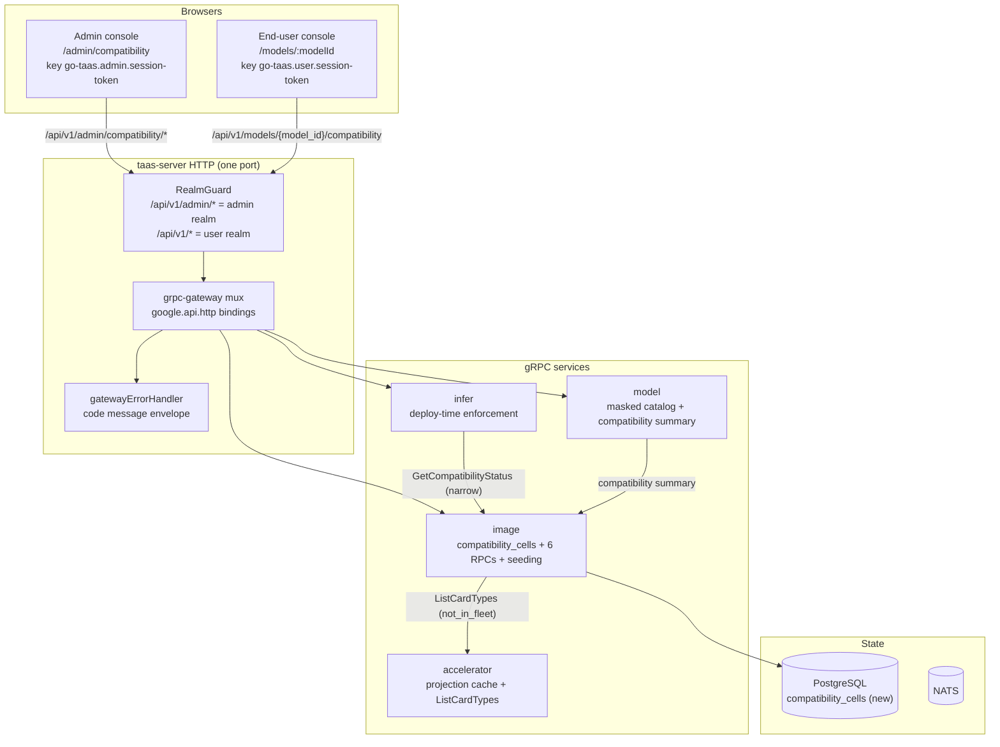
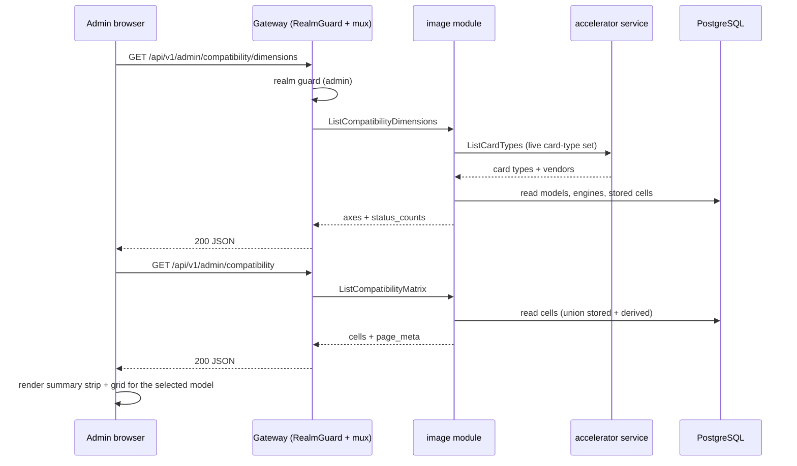
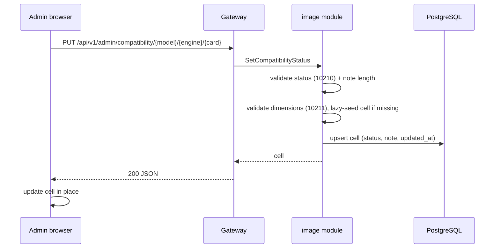
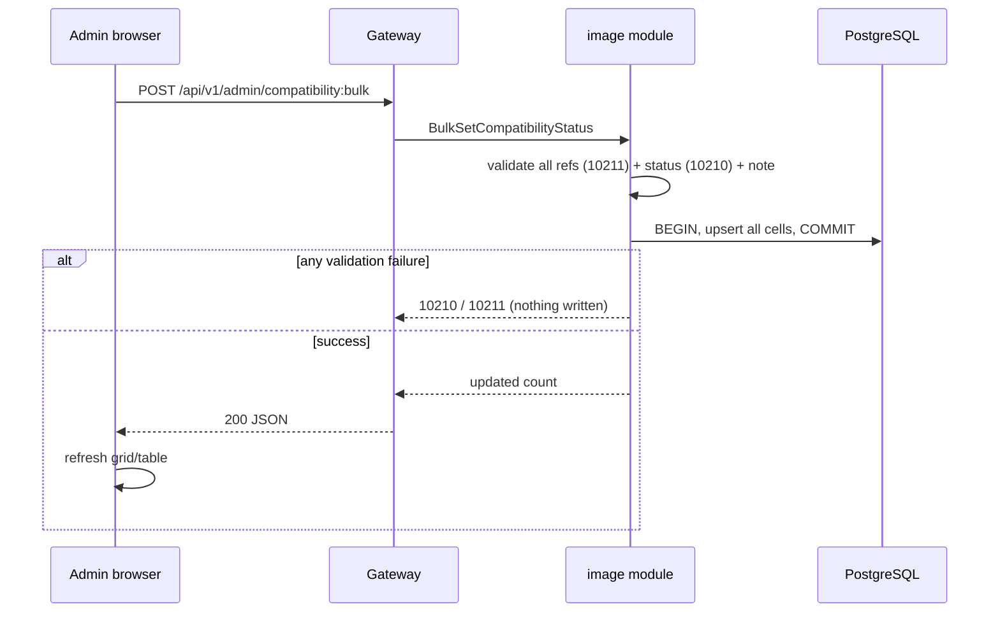
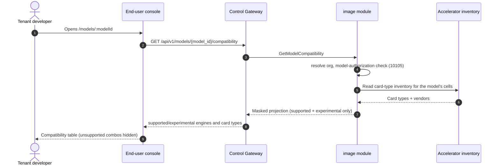
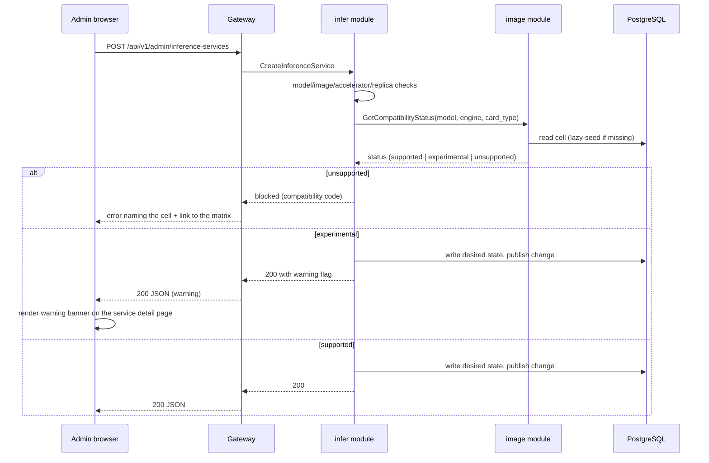
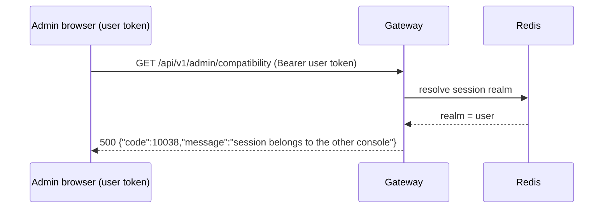

# Model × Engine × Card-Type Compatibility Matrix — Architecture and Detailed Design

| Attribute | Content |
| --- | --- |
| Feature point | Model × engine × card-type compatibility matrix — which model/engine/card-type combinations are supported / experimental / unsupported, seeded from the accelerator inventory (backlog row 19) |
| Document scope | Architecture and detailed design for the curated three-dimensional compatibility matrix: the DB-backed `compatibility_cells` data model, the first-boot and lazy seeding rules, the five admin RPCs and one user RPC with their exact `google.api.http` bindings per surface, the deploy-form enforcement integration, the masked end-user projection, the frontend pages and their route → API-prefix mapping for both consoles, error handling (10209–10211), configuration, security, rollout, and a function-level task list per layer |
| Owning modules | `image` (owns the adaptation matrix per architecture §2.3: the `compatibility_cells` table, the six RPCs, the seeding logic, the deploy-form enforcement seam), `web/` admin console (`CompatibilityPage`) and end-user console (`ModelDetailPage`), `pkg/server` gateway (admin-prefix and user-prefix bindings), `pkg/errors` (10209–10211), `pkg/config` (compatibility section) |
| Related documents | [Requirement Analysis and UI/UX Design](../design/compatibility-matrix.md) · [Architecture Design](../design/architecture.md) §2.3 (`image` owns the adaptation matrix) · [Accelerator Inventory & Health](./accelerator-inventory.md) (the card-type inventory this matrix is seeded from) · [Image Management](./image-management.md) (the engine set and the deferred card-type-level matrix cells) · [Model Catalog & One-Click Deployment](./model-catalog-deployment.md) (the model dimension and the deploy form that must consult the matrix) · [Console Surface Separation](./console-surface-separation.md) (the two surfaces this feature spans, the realm guard, `AdminShell`/`UserShell`) · [Per-Tenant Model Authorization](./model-authorization.md) (the masked user-realm catalog and the 10105/10101 codes this feature reuses) |
| Status | Architecture complete, handed to the Developer agent |

---

## 1. Overview and Goals

go-taas serves inference on heterogeneous accelerators (NVIDIA GPU, Iluvatar CoreX, MetaX) across three engine families (vLLM, SGLang, TensorRT-LLM) and a growing model catalog (Qwen, DeepSeek, LLaMA, …). The architecture (§2.3) assigns the `image` module the job of maintaining the **adaptation matrix between images and card types, engines, and model formats**, and the deploy form (feature #2) already filters the image dropdown by accelerator. But today that matrix does not exist as data: the deploy form accepts any card type, the image catalog carries only a coarse `accelerator` field (nvidia / iluvatar / metax), and nothing records whether a given model actually runs on a given engine on a given card type.

Feature #18 (accelerator inventory) shipped the **card-type inventory** — the set of card types present in the fleet, with per-node counts and health. Feature #3 shipped the **engine set** — the registered inference images with their accelerator and engine fields. Both are the raw material for the matrix this feature builds: the operator needs a single place to record and see *which model/engine/card-type combinations are known to work*, which are experimental, and which are unsupported — and the deploy form needs to consult that record so an unsupported combination is impossible to submit.

This feature adds the **compatibility matrix**: a curated, three-dimensional grid (model × engine × card type) whose cells carry a status (`supported` / `experimental` / `unsupported`) and an optional note. It is seeded from the accelerator inventory (card types) and the image catalog (engines), crossed with the model catalog. The operator curates the cells; the deploy form and the end-user console consume the result.

**Goals**:

- An admin page `/admin/compatibility` that shows the matrix as a scannable grid (rows = engines, columns = card types, per selected model) and a flat filterable table, seeded from the accelerator inventory and image catalog (design D3).
- Single-cell and bulk status editing with notes (design D5).
- The deploy-form integration point: `unsupported` combos are blocked, `experimental` combos deploy with a warning (design D4).
- A read-only masked end-user display on `/models/:modelId` and a compatibility summary on the masked model list (design D7).
- The page → API surface table with exact prefixes (design D6, D7).
- Per-page interactive states including empty, error, and permission-denied.
- Numbered acceptance criteria testable in Nightwatch against the compose stack.

**Non-goals** (from the design, restated): any tenant-side editing of the matrix (D6); model-format-level cells beyond the three dimensions (a future refinement); automatic validation of a combination (the operator curates; the platform does not run a model to prove it works); a delete operation on cells (D5); exposing `unsupported` combos or operator curation internals to tenants (D7); a Grafana-style matrix heatmap over time (out of scope — this is a point-in-time curation surface).

### 1.1 Reading order

Section 2 records the architecture decisions (including the points where the architecture refines the UI/UX design, with their rationale). Sections 3–5 are the component view, the seeding mechanism, and the data model. Sections 6–8 are the API contract, the frontend architecture, and the key sequences. Sections 9–12 are error handling, configuration, security and rollout. Sections 13–15 are the acceptance-criteria traceability, the function-level detailed design, and the ordered implementation task list.

---

## 2. Architecture Decisions

AD1–AD10 restate the UI/UX design's decisions as implementation-level rules. **AD11–AD13 are refinements** the architecture adds, each marked as such with the design decision it refines; they preserve the design's intent and are recorded here so the Developer and Test agents implement one reading.

| # | Decision | Rationale |
| --- | --- | --- |
| AD1 | **The matrix is a curated three-dimensional grid `(model_id, engine, card_type)` → `status` ∈ {`supported`, `experimental`, `unsupported`} plus an optional `note`, persisted in a DB-backed `compatibility_cells` table owned by the `image` module.** The three dimensions are exactly the model catalog, the engine set, and the card-type inventory | Design D1. The architecture (§2.3) assigns the adaptation matrix to `image`; a DB table (not an in-memory cache like the accelerator inventory) is required because the matrix is **curated** — the operator's decisions must survive restarts and be queryable/enforceable, unlike the ephemeral fleet projection (accelerator-inventory AD11) |
| AD2 | **Status semantics**: `supported` = validated and known to work (green, deployable); `experimental` = vendor-compatible but not fully validated (amber, deployable with a warning); `unsupported` = known-bad or vendor-mismatch (red/grey, not deployable). The closed set is exactly {`supported`, `experimental`, `unsupported`} | Design D2. The three-state tier matches vLLM/NGC convention and gives the operator a middle ground between "proven" and "broken" |
| AD3 | **Dimensions are derived live**: models from the model catalog (`models` table), engines from the image catalog (the distinct `engine` values of registered `images`), card types from the accelerator inventory (feature #18). The matrix is the cross product materialized as rows. **Seeding**: on first boot, if the `compatibility_cells` table is empty, create a row for every combination; default status = `unsupported` for vendor-mismatched combos (`engine.accelerator ≠ card_type.vendor`) and `experimental` for vendor-matched combos. A combination that appears later (a new card type, engine, or model) gets a default row lazily on first access | Design D3. The matrix must always cover the current fleet; a safe default (nothing is assumed *supported* until curated) prevents accidental deployment of unvalidated combos, while vendor-match → `experimental` reflects that the engine is at least built for that vendor |
| AD4 | **The deploy form (feature #2) consults the matrix**: an `unsupported` combination is blocked at deploy time with a clear message; an `experimental` combination deploys with a warning banner. This is a cross-feature integration point wired through a narrow interface on the `image` module; the matrix page is the primary deliverable | Design D4. The matrix is only useful if it is enforced; blocking `unsupported` and warning on `experimental` turns curation into a deploy-time guarantee |
| AD5 | **Editing is admin-surface only.** A cell's status and note are set via a single-cell dialog or a bulk-edit flow (multi-select rows → set status + note). There is no delete in v1 — a cell's status is always one of the three states | Design D5. The matrix is a curation surface; bulk edit is essential because the cross product is large and the operator must not click hundreds of cells |
| AD6 | **The matrix page is admin-surface only**: route `/admin/compatibility`, API prefix `/api/v1/admin/compatibility/*`. It is added to the `AdminShell` navigation (feature #17) as "Compatibility" | Design D6. Curation is an operator capability; tenants never edit the matrix |
| AD7 | **End-user visibility is a read-only masked projection.** A new end-user model detail page `/models/:modelId` shows the model's `supported` and `experimental` engines and card types; `unsupported` combos are hidden. The masked model list `GET /api/v1/models` (feature #17, AD8) gains a per-model compatibility summary. API: `GET /api/v1/models/{model_id}/compatibility` | Design D7. Tenants need to know what a model runs on (for cost/performance expectations) but must not see operator curation internals or unsupported combos; the masked projection follows feature #17's AD8 (no operator fields leak) |
| AD8 | **New error codes in the image block (10209–10299)**: **10209 `CodeCompatibilityCellNotFound`** (a `(model, engine, card_type)` cell absent from the matrix), **10210 `CodeCompatibilityStatusInvalid`** (a status outside the closed set), **10211 `CodeCompatibilityDimensionInvalid`** (an unknown model, engine, or card type) | Design D8. The matrix belongs to `image` (AD1), so its codes live in the image block after 10208 (feature #18); distinct codes keep "cell missing" vs "bad status" vs "bad dimension" actionable |
| AD9 | **The matrix is polled, not pushed**: the page polls `ListCompatibilityMatrix` on an interval (default 30 s) with a last-updated timestamp; there is no websocket | Design D9. Matches the existing console's `usePolling` pattern (feature #17) and keeps the API stateless |
| AD10 | **A card type no longer present in the fleet keeps its curated status but is flagged `not_in_fleet` in the response and UI**, so the operator's curation is never silently dropped | Design D10. The accelerator inventory is the live source of card types; a card type that leaves the fleet should not erase the operator's decisions, but must be visibly stale |
| AD11 | **REFINEMENT of design D3 — the matrix is a DB table, not an in-memory projection.** The design's "seeded from the accelerator inventory" is honored as a **read-time derivation of the card-type axis**, not a materialized copy: the `compatibility_cells` table stores only `(model_id, engine, card_type, status, note, updated_at)`; the card-type axis and the `not_in_fleet` flag are computed at request time by joining the stored card types against the accelerator inventory's live card-type set | The design (D1) assigns the matrix to `image` as a *curated* record, and curation must be durable and queryable — unlike the accelerator inventory's ephemeral projection (accelerator-inventory AD11). Storing the card-type axis as data (rather than deriving it purely from the live inventory) is required so a card type that leaves the fleet keeps its curated status (D10). The `not_in_fleet` flag is derived live from the accelerator inventory's card-type set, so it never goes stale. The accelerator service exposes a narrow read interface `ListCardTypes()` for this join |
| AD12 | **REFINEMENT of design D7 — the masked model-list compatibility summary is a new field on the existing `AvailableModel` message, not a new RPC.** `ListAvailableModels` (feature #17 AD8) gains a `compatibility` field carrying the model's `supported`/`experimental` engine+card-type summary; the dedicated `GetModelCompatibility` RPC serves the full masked projection on the model detail page | The design (FR5.3) wants the model list to hint at what each model runs on. Adding a summary field to the existing masked `AvailableModel` keeps the list one round-trip and follows feature #17's AD8 (masked projection, no operator fields). The detail page needs the full per-cell list, so it uses the dedicated RPC. Both are user-surface reads under `/api/v1/*` |
| AD13 | **REFINEMENT of design D4 — the deploy-form enforcement is a synchronous narrow-interface read on the `image` module, injected into `infer`.** `infer`'s `CreateInferenceService` calls `image.GetCompatibilityStatus(modelID, engine, cardType)` (a narrow interface, the `SetDeleteGuard`/`IsModelAuthorized` injection pattern) after the existing model/image/accelerator checks and before the desired-state write: `unsupported` → 10209-style block (a new code, see Section 9), `experimental` → allowed but the response carries a `warning` flag the console renders as a banner | The design (D4) requires the deploy form to enforce the matrix. The enforcement must live in `infer` (the deploy-time gate) but the matrix data lives in `image` (AD1); the narrow-interface injection keeps `infer` free of an `image` dependency, exactly the established pattern. The `experimental` warning is surfaced as a response field so the console can render the banner on the service detail page (design FR4.1) |

---

## 3. Component View

### 3.1 Ownership

| Layer / component | Owns | Changes in this feature |
| --- | --- | --- |
| **Static bundle (SPA)** | One Vite bundle (`web/dist`), embedded into `taas-server` at `pkg/server/console/`; served by the gateway's SPA fallback | Two new pages (`CompatibilityPage` on the admin console, `ModelDetailPage` on the end-user console), a nav item, and the route registrations in `App.tsx` |
| **Gateway (`pkg/server`)** | HTTP composition: `RealmGuard` → `withConsole` → `runtime.ServeMux`; the unified error renderer; the SPA fallback | No change — the new RPCs bind under `/api/v1/admin/compatibility/*` (admin) and `/api/v1/models/{model_id}/compatibility` (user), and the realm guard already treats those prefixes as their surfaces |
| **grpc-gateway mux** | Path → RPC routing from `google.api.http` annotations | New bindings for the six new RPCs (Section 6) |
| **`image`** | The `compatibility_cells` table, the six RPCs, the seeding logic, the deploy-form enforcement seam | New `compatibility_cells` table + repository + service methods; the narrow `GetCompatibilityStatus` interface for `infer`; the `ListCardTypes` read from the accelerator service |
| **`accelerator`** | The in-memory projection cache (feature #18) | Exposes a narrow read interface `ListCardTypes()` for the image module's `not_in_fleet` derivation and the card-type axis |
| **`infer`** | Inference-service lifecycle, deploy-time validation | `CreateInferenceService` consults the matrix via the injected `image` narrow interface (AD13) |
| **`model`** | Model catalog, versions, masked user-realm catalog | `ListAvailableModels` gains the `compatibility` summary field (AD12) |
| **`pkg/errors`** | Code blocks per module | Three new image-block codes: **10209 `CodeCompatibilityCellNotFound`**, **10210 `CodeCompatibilityStatusInvalid`**, **10211 `CodeCompatibilityDimensionInvalid`** (AD8) |
| **`pkg/config`** | The merged configuration tree | New `compatibility` section (seeding kill switch, lazy-seed default) |

### 3.2 Runtime component view



### 3.3 Request identity chain

The compatibility RPCs span both surfaces. The chain is:

1. `RealmGuard` (HTTP, `pkg/server/realm.go`) — path prefix decides the expected realm. The admin RPCs bind under `/api/v1/admin/compatibility/*` → expected realm `admin`; the user RPC binds under `/api/v1/models/{model_id}/compatibility` → expected realm `user`. With no `Authorization` header: pass through (transitional, feature-17 AD4). With a header: resolve the session realm from Redis; mismatch → 10038, unknown/expired/realm-less → 10027.
2. grpc-gateway mux — routes by the annotated path and forwards `authorization`.
3. `image` handler — reads the `compatibility_cells` table. The admin RPCs are **platform-scoped** (no `X-Organization-Id` required or honored, mirroring the image module's platform-scoped decision, image-management D9). The user RPC `GetModelCompatibility` is **tenant-scoped**: it resolves the caller's organization (session-derived via `SessionActiveOrg`, or the transitional `X-Organization-Id` header) and applies the model-authorization default-allow rule (feature #13) — a restricted model the tenant is not granted returns 10105.

Because the admin RPCs are platform-scoped, there is no `tenancy.RoleGuard` gate on them: any admin-realm session (or transitional caller) may read and curate the matrix. The permission-denied state (design FR6.1, AC15) is therefore produced by the realm guard (10038) or the session guard (10027), not by a role check. The user RPC's permission-denied state (design FR5.4, AC12) is produced by the model-authorization check (10105) or the realm/session guard.

---

## 4. Seeding Mechanism

### 4.1 First-boot seed

On startup, the `image` module's `Migrate` hook (the established `Migrator` pattern) runs after `AutoMigrate(compatibility_cells)`:

1. `SELECT count(*) FROM compatibility_cells`.
2. If the table is **empty**, seed it with a row for every `(model, engine, card_type)` combination:
   - **models** from the `models` table (all catalog models);
   - **engines** from the distinct `engine` values of the `images` table;
   - **card types** from the accelerator inventory's live card-type set (via the `accelerator.ListCardTypes()` narrow read).
   - Default status: `unsupported` when `engine.accelerator ≠ card_type.vendor`, `experimental` when they match (AD3).
3. If the table is **non-empty**, skip the seed — the database is authoritative (the operator's curation is never overwritten).

The seed is **insert-only and first-boot-only**: it never re-runs on a non-empty table, so deletions (none in v1) and edits stick. The seed is a best-effort startup step: if the accelerator inventory is empty at boot (the Controller has not yet published a snapshot), the card-type axis is empty and the seed creates no rows; the lazy-seed path (Section 4.2) fills them in as the fleet becomes known.

### 4.2 Lazy seed on first access

A combination that appears later (a new model, engine, or card type) gets a default row lazily on first access (AD3). The lazy-seed is implemented in the repository's read path: when a query references a `(model, engine, card_type)` combination that has no row, the service materializes the default row (using the same vendor-match rule) before returning. Concretely:

- `GetCompatibilityCell` and `SetCompatibilityStatus` ensure the requested cell exists (creating it with the default rule) before reading/writing.
- `ListCompatibilityMatrix` and `ListCompatibilityDimensions` compute the **full cross product** of current models × engines × card types at request time and union it with the stored rows, so a newly-added dimension appears in the grid immediately even before any cell is curated. The stored rows carry the curated status/note; the derived (not-yet-stored) rows carry the default status and are materialized into the table on first edit.

This keeps the matrix always covering the current fleet without a background job, and matches the design's "a combination that appears later gets a default row lazily on first access" (D3).

### 4.3 `not_in_fleet` derivation

A card type no longer present in the accelerator inventory keeps its curated status but is flagged `not_in_fleet` (AD10). The flag is derived at request time: the service reads the accelerator inventory's live card-type set (`accelerator.ListCardTypes()`) and marks every stored cell whose `card_type` is absent from that set. The flag is never stored — it is a live join, so it never goes stale. A card type that leaves the fleet and later returns automatically loses the flag.

---

## 5. Data Model

### 5.1 The `compatibility_cells` Table

| Column | PostgreSQL type | Constraints | Description |
| --- | --- | --- | --- |
| `id` | `uuid` | PRIMARY KEY | Server-generated UUID v4 |
| `model_id` | `uuid` | NOT NULL, composite unique `(model_id, engine, card_type)` | The model dimension (FK → `models.id`, no hard FK — see note) |
| `engine` | `varchar(64)` | NOT NULL, composite unique `(model_id, engine, card_type)` | The engine dimension (a distinct `engine` value from `images`) |
| `card_type` | `varchar(64)` | NOT NULL, composite unique `(model_id, engine, card_type)` | The card-type dimension (a card type from the accelerator inventory) |
| `status` | `varchar(16)` | NOT NULL | Closed set: `supported` / `experimental` / `unsupported` (AD2) |
| `note` | `varchar(512)` | NOT NULL DEFAULT '' | Optional operator note, ≤ 512 chars |
| `created_at` | `timestamptz` | NOT NULL | First materialization time (UTC) |
| `updated_at` | `timestamptz` | NOT NULL | Last curation time (UTC) |

Indexes:

| Index | Definition | Purpose |
| --- | --- | --- |
| Primary key | `(id)` | Cell identity |
| Unique | `(model_id, engine, card_type)` | The three-dimensional cell identity; a violation maps to a lazy-seed no-op (the cell already exists) |
| Composite | `(model_id, status)` | The masked user projection (`GetModelCompatibility`) and the grid's per-model filter |
| Composite | `(status)` | The summary-strip per-status counts |

Design notes:

- **No hard foreign keys**: `model_id` is a `uuid` matching `models.id`, but a cell must survive a model being deleted (the model module cascades its own rows; the matrix is a curation record, not a referential constraint). `engine` and `card_type` are plain strings — they are derived dimensions, not entities with their own tables.
- **The card-type axis is stored as data** (AD11): this is what lets a card type that leaves the fleet keep its curated status (D10). The `not_in_fleet` flag is derived live, never stored.
- **`status` is a closed set** enforced at the service layer (10210 on anything else); there is no DB check constraint, matching the platform's service-layer validation convention.
- **No delete in v1** (D5): rows are never removed; a cell's status is always one of the three states.

### 5.2 Migration Notes

- The table is created by **GORM `AutoMigrate` at startup** through the `image` module's `Migrate` hook (the established `Migrator` pattern). The GORM model is the single source of truth for the schema.
- The first-boot seed (Section 4.1) runs inside the same `Migrate` hook, after `AutoMigrate`, so a fresh deployment gets both the schema and the seeded rows in one startup.
- Evolution is additive-only: the table is new; no existing table changes.

---

## 6. API Contract

### 6.1 RPC Surface

All matrix RPCs belong to **`taas.image.v1.ImageService`** (proto: `proto/taas/image/v1/image.proto`), served as HTTP via the Control Gateway. Five RPCs are **admin-surface** (AD6) and one is **user-surface** (AD7). Proto changes are additive.

| RPC | HTTP | Prefix | Status | Purpose |
| --- | --- | --- | --- | --- |
| `ListCompatibilityMatrix` | `GET /api/v1/admin/compatibility` | admin | **new** | Matrix cells with model/engine/card/status filters, search, pagination |
| `ListCompatibilityDimensions` | `GET /api/v1/admin/compatibility/dimensions` | admin | **new** | The three axis lists (models, engines, card types + vendors) and per-status counts |
| `GetCompatibilityCell` | `GET /api/v1/admin/compatibility/{model_id}/{engine}/{card_type}` | admin | **new** | One cell; missing → 10209 |
| `SetCompatibilityStatus` | `PUT /api/v1/admin/compatibility/{model_id}/{engine}/{card_type}` | admin | **new** | Set a cell's status + note |
| `BulkSetCompatibilityStatus` | `POST /api/v1/admin/compatibility:bulk` | admin | **new** | Atomic bulk status + note for a list of cells |
| `GetModelCompatibility` | `GET /api/v1/models/{model_id}/compatibility` | user | **new** | Masked projection: supported/experimental engines and card types for a model |

### 6.2 Proto contract

```proto
// Additive additions to proto/taas/image/v1/image.proto, on ImageService.

  // ListCompatibilityMatrix returns matrix cells with model/engine/card/
  // status filters, model-name search, and pagination.
  // Admin-surface API: served under /api/v1/admin.
  rpc ListCompatibilityMatrix(ListCompatibilityMatrixRequest) returns (ListCompatibilityMatrixResponse) {
    option (google.api.http) = {get: "/api/v1/admin/compatibility"};
  }

  // ListCompatibilityDimensions returns the three axis lists (models,
  // engines, card types + vendors) and the per-status counts.
  // Admin-surface API: served under /api/v1/admin.
  rpc ListCompatibilityDimensions(ListCompatibilityDimensionsRequest) returns (ListCompatibilityDimensionsResponse) {
    option (google.api.http) = {get: "/api/v1/admin/compatibility/dimensions"};
  }

  // GetCompatibilityCell returns one cell; a missing cell returns 10209.
  // Admin-surface API: served under /api/v1/admin.
  rpc GetCompatibilityCell(GetCompatibilityCellRequest) returns (GetCompatibilityCellResponse) {
    option (google.api.http) = {get: "/api/v1/admin/compatibility/{model_id}/{engine}/{card_type}"};
  }

  // SetCompatibilityStatus sets a cell's status and optional note.
  // Admin-surface API: served under /api/v1/admin.
  rpc SetCompatibilityStatus(SetCompatibilityStatusRequest) returns (SetCompatibilityStatusResponse) {
    option (google.api.http) = {
      put: "/api/v1/admin/compatibility/{model_id}/{engine}/{card_type}"
      body: "*"
    };
  }

  // BulkSetCompatibilityStatus sets the same status and note for a list
  // of cells atomically (all-or-nothing).
  // Admin-surface API: served under /api/v1/admin.
  rpc BulkSetCompatibilityStatus(BulkSetCompatibilityStatusRequest) returns (BulkSetCompatibilityStatusResponse) {
    option (google.api.http) = {
      post: "/api/v1/admin/compatibility:bulk"
      body: "*"
    };
  }

  // GetModelCompatibility returns the masked user-realm projection: the
  // model's supported/experimental engines and card types. Unsupported
  // combos are hidden. User-surface API: served under /api/v1.
  rpc GetModelCompatibility(GetModelCompatibilityRequest) returns (GetModelCompatibilityResponse) {
    option (google.api.http) = {get: "/api/v1/models/{model_id}/compatibility"};
  }

message CompatibilityCell {
  string model_id = 1;
  string model_name = 2;
  string engine = 3;
  string card_type = 4;
  string card_vendor = 5;
  string status = 6;      // supported | experimental | unsupported
  string note = 7;
  bool not_in_fleet = 8;
  int64 updated_at = 9;
}

message ListCompatibilityMatrixRequest {
  taas.common.v1.PageRequest page = 1;
  string model_id = 2;
  string engine = 3;
  string card_type = 4;
  string status = 5;
  string search = 6;      // model-name substring
}
message ListCompatibilityMatrixResponse {
  taas.common.v1.Response response = 1;
  repeated CompatibilityCell cells = 2;
  taas.common.v1.PageMeta page_meta = 3;
}

message CompatibilityDimensionModel {
  string model_id = 1;
  string model_name = 2;
}
message CompatibilityDimensionEngine {
  string engine = 1;
  string accelerator = 2;
}
message CompatibilityDimensionCardType {
  string card_type = 1;
  string vendor = 2;
  bool in_fleet = 3;
}
message CompatibilityStatusCounts {
  int64 supported = 1;
  int64 experimental = 2;
  int64 unsupported = 3;
  int64 not_in_fleet = 4;
}
message ListCompatibilityDimensionsRequest {}
message ListCompatibilityDimensionsResponse {
  taas.common.v1.Response response = 1;
  repeated CompatibilityDimensionModel models = 2;
  repeated CompatibilityDimensionEngine engines = 3;
  repeated CompatibilityDimensionCardType card_types = 4;
  CompatibilityStatusCounts status_counts = 5;
}

message GetCompatibilityCellRequest {
  string model_id = 1;   // path
  string engine = 2;     // path
  string card_type = 3;  // path
}
message GetCompatibilityCellResponse {
  taas.common.v1.Response response = 1;
  CompatibilityCell cell = 2;
}

message SetCompatibilityStatusRequest {
  string model_id = 1;   // path
  string engine = 2;     // path
  string card_type = 3;  // path
  string status = 4;
  string note = 5;       // <= 512 chars
}
message SetCompatibilityStatusResponse {
  taas.common.v1.Response response = 1;
  CompatibilityCell cell = 2;
}

message BulkSetCompatibilityStatusRequest {
  repeated CompatibilityCellRef cells = 1;
  string status = 2;
  string note = 3;       // <= 512 chars
}
message CompatibilityCellRef {
  string model_id = 1;
  string engine = 2;
  string card_type = 3;
}
message BulkSetCompatibilityStatusResponse {
  taas.common.v1.Response response = 1;
  int64 updated = 2;
}

message GetModelCompatibilityRequest {
  string model_id = 1;   // path
}
message ModelCompatibilityEntry {
  string engine = 1;
  string card_type = 2;
  string card_vendor = 3;
  string status = 4;     // supported | experimental (masked)
}
message GetModelCompatibilityResponse {
  taas.common.v1.Response response = 1;
  repeated ModelCompatibilityEntry entries = 2;
  int64 supported_count = 3;
  int64 experimental_count = 4;
}
```

### 6.3 Wire format (established conventions)

- Pagination binds as `?page.offset=0&page.limit=20` (dotted form); default limit 20, cap 100.
- Success responses are HTTP 200; business errors render as `{"code": <int>, "message": "..."}`.
- The admin compatibility APIs are **platform-scoped**: no `X-Organization-Id` header is required or honored (AD6, mirroring image-management D9). The user `GetModelCompatibility` is **tenant-scoped**: it resolves the caller's organization (session-derived via `SessionActiveOrg`, or the transitional `X-Organization-Id` header) and applies the model-authorization default-allow rule.
- `ListCompatibilityMatrix` supports `model_id`, `engine`, `card_type`, and `status` filters, `search` (model-name substring), and `offset`/`limit` pagination. Filtering and pagination are applied server-side over the union of stored and derived cells (Section 4.2).
- `ListCompatibilityDimensions` returns the three axis lists plus the per-status counts; the card-type axis carries `in_fleet` so the grid can render the "not in fleet" marker without a second call.
- `GetCompatibilityCell` returns one cell; a missing cell returns **10209** (AD8).
- `SetCompatibilityStatus` validates `status` ∈ {supported, experimental, unsupported} (else 10210) and `note` ≤ 512 chars; an unknown model, engine, or card type returns 10211; a missing cell is created lazily with the default rule (AD3) before the status is applied.
- `BulkSetCompatibilityStatus` is atomic: either all cells update or none do; it returns the count updated.
- `GetModelCompatibility` returns only cells with status ∈ {`supported`, `experimental`} (masked, AD7), plus `supported_count` and `experimental_count`; an unknown model returns 10101; a model the tenant is not authorized for returns 10105.

### 6.4 Validation matrix

| RPC | Check | Failure code | Canonical message |
| --- | --- | --- | --- |
| `ListCompatibilityMatrix` | `status` in {supported, experimental, unsupported} or empty; `limit` ≤ 100 | invalid filter values are ignored (treated as empty) | — |
| `ListCompatibilityDimensions` | none | — | — |
| `GetCompatibilityCell` | `model_id`/`engine`/`card_type` identify a known dimension | 10211 `CodeCompatibilityDimensionInvalid` | compatibility dimension invalid |
| `GetCompatibilityCell` | the cell exists (after lazy-seed) | 10209 `CodeCompatibilityCellNotFound` | compatibility cell not found |
| `SetCompatibilityStatus` | `status` in the closed set | 10210 `CodeCompatibilityStatusInvalid` | compatibility status invalid |
| `SetCompatibilityStatus` | `note` ≤ 512 chars | 10210 `CodeCompatibilityStatusInvalid` | compatibility status invalid |
| `SetCompatibilityStatus` | `model_id`/`engine`/`card_type` identify a known dimension | 10211 `CodeCompatibilityDimensionInvalid` | compatibility dimension invalid |
| `BulkSetCompatibilityStatus` | every cell ref identifies a known dimension; `status` in the closed set; `note` ≤ 512 chars | 10210 / 10211 | as above |
| `GetModelCompatibility` | `model_id` exists | 10101 `CodeModelNotFound` | model not found |
| `GetModelCompatibility` | the tenant is authorized for the model (default-allow) | 10105 `CodeModelUnauthorized` | model not authorized |

---

## 7. Frontend Architecture

### 7.1 Module plan

| Concern | File | Notes |
| --- | --- | --- |
| Admin nav item | `web/src/shells/AdminShell.tsx` | add `{ path: '/admin/compatibility', label: 'Compatibility', testid: 'nav-compatibility' }` to `ADMIN_NAV_ITEMS` |
| Route registration | `web/src/App.tsx` | add `/admin/compatibility` to the `AdminSurface` `<Routes>` and `/models/:modelId` to the `UserSurface` `<Routes>` |
| Admin matrix page | `web/src/pages/CompatibilityPage.tsx` (new) | summary strip + grid/table toggle, filters, search, pagination, single-cell + bulk edit dialogs, polling |
| End-user model detail page | `web/src/pages/ModelDetailPage.tsx` (new) | masked compatibility table + summary, back link |
| Shared components | `web/src/components.tsx` | reuse `ErrorBanner`, `Pagination`, `StateBadge`, `usePolling`, `Modal`; no new shared component required |

### 7.2 Admin console: page → route → API

| Route | Component | Purpose | API prefix (exact calls) |
| --- | --- | --- | --- |
| `/admin/compatibility` | `pages/CompatibilityPage.tsx` | matrix grid/table + curation | `GET /api/v1/admin/compatibility?page.offset=…&page.limit=…&model_id=…&engine=…&card_type=…&status=…&search=…`, `GET /api/v1/admin/compatibility/dimensions`, `GET /api/v1/admin/compatibility/{model_id}/{engine}/{card_type}`, `PUT /api/v1/admin/compatibility/{model_id}/{engine}/{card_type}`, `POST /api/v1/admin/compatibility:bulk` |

The page calls **only** `/api/v1/admin/compatibility/*` routes; it contains no `/api/v1/*` (user-prefix) string (design FR6.3, feature-17). The realm-scoped API client (`useApi()`) enforces this at runtime (feature-17 AD1).

### 7.3 End-user console: page → route → API

| Route | Component | Purpose | API prefix (exact calls) |
| --- | --- | --- | --- |
| `/models/:modelId` | `pages/ModelDetailPage.tsx` | masked compatibility display | `GET /api/v1/models/{model_id}/compatibility` |

The page calls **only** `/api/v1/*` routes; it contains no `/api/v1/admin/*` string (design FR6.3, feature-17). The masked model list (`GET /api/v1/models`, feature #17 AD8) gains the `compatibility` summary field (AD12), so the playground selector and model list hint at what each model runs on.

### 7.4 Route registration in `web/src/App.tsx`

```tsx
{/* AdminSurface */}
<Route path="/admin/compatibility" element={<CompatibilityPage />} />

{/* UserSurface */}
<Route path="/models/:modelId" element={<ModelDetailPage />} />
```

The admin route is inside the `AdminSurface` `<Routes>` (renders inside `AdminShell`, inherits the admin realm's session guard and nav); the user route is inside the `UserSurface` `<Routes>` (renders inside `UserShell`, inherits the user realm's session guard and nav).

### 7.5 Per-surface auth guard

- **Admin page**: inherits the `AdminShell` guard (feature-17 §7.5): on boot it reads `go-taas.admin.session-token`; empty → transitional mode; present → `GET /api/v1/admin/auth/session`; 10027/10038 → clear the admin token and redirect to `/admin/login?next=<path>&reason=…`. The page never reads the user realm's keys. Because the admin compatibility RPCs are platform-scoped, there is no additional role gate; the permission-denied state (design FR6.1, AC15) is the standard feature-17 state produced by the realm/session guard.
- **End-user page**: inherits the `UserShell` guard (feature-17 §7.5): on boot it reads `go-taas.user.session-token`; empty → transitional mode; present → `GET /api/v1/auth/session`; 10027/10038 → clear the user token and redirect to `/login?next=<path>&reason=…`. The page never reads the admin realm's keys. The permission-denied state (design FR5.4, AC12) is produced by the model-authorization check (10105) or the realm/session guard.

### 7.6 Polling and stale-data handling

`CompatibilityPage` uses `usePolling` (design D9, FR6.4): it polls `ListCompatibilityMatrix` and `ListCompatibilityDimensions` on a 30 s interval and shows a last-updated timestamp. A failed poll keeps the last good data and shows a "Showing stale data" banner with a Retry action (design FR6.4, AC11); it never clears the grid. The `Refresh` action is disabled while a poll is in flight. `ModelDetailPage` is a read-only page and does not poll (it fetches once on mount).

### 7.7 `data-testid` hooks the Test agent can drive

- Shell/nav: `nav-compatibility`.
- Admin matrix page: `compatibility-page`, `compatibility-refresh`, `compatibility-last-updated`, `compatibility-summary-strip`, `compatibility-supported-count`, `compatibility-experimental-count`, `compatibility-unsupported-count`, `compatibility-not-in-fleet-count`, `compatibility-model-filter`, `compatibility-engine-filter`, `compatibility-card-filter`, `compatibility-status-filter`, `compatibility-search`, `compatibility-view-grid`, `compatibility-view-table`, `compatibility-grid`, `compatibility-cell-{model}-{engine}-{card}`, `compatibility-cell-not-in-fleet-{model}-{engine}-{card}`, `compatibility-table`, `compatibility-row-{model}-{engine}-{card}`, `compatibility-row-checkbox-{model}-{engine}-{card}`, `compatibility-bulk-edit`, `compatibility-empty`, `compatibility-stale-banner`, `compatibility-error`, `compatibility-pagination`, `compatibility-edit-dialog`, `compatibility-edit-status`, `compatibility-edit-note`, `compatibility-edit-save`, `compatibility-bulk-dialog`, `compatibility-bulk-status`, `compatibility-bulk-note`, `compatibility-bulk-apply`.
- End-user model detail: `model-detail-page`, `model-detail-back`, `model-detail-name`, `model-detail-compatibility-summary`, `model-detail-compatibility-table`, `model-detail-compat-row-{engine}-{card}`, `model-detail-compat-empty`, `model-detail-compat-error`, `model-detail-not-found`, `model-detail-permission-denied`.

---

## 8. Sequence Diagrams

### 8.1 Admin matrix page load and poll



### 8.2 Single-cell edit



### 8.3 Bulk edit (atomic)



### 8.4 End-user masked projection



### 8.5 Deploy-form enforcement



### 8.6 Wrong-realm rejection



---

## 9. Error Handling

| Code | Constant | Message | When |
| --- | --- | --- | --- |
| 10209 | `CodeCompatibilityCellNotFound` | compatibility cell not found | `GetCompatibilityCell` with a `(model, engine, card_type)` that cannot be materialized (AD8) |
| 10210 | `CodeCompatibilityStatusInvalid` | compatibility status invalid | a status outside {supported, experimental, unsupported}, or a `note` > 512 chars, on `SetCompatibilityStatus` / `BulkSetCompatibilityStatus` (AD8) |
| 10211 | `CodeCompatibilityDimensionInvalid` | compatibility dimension invalid | an unknown model, engine, or card type in a matrix call (AD8) |
| 10101 | `CodeModelNotFound` | model not found | `GetModelCompatibility` with an unknown `model_id` (feature #2) |
| 10105 | `CodeModelUnauthorized` | model not authorized | `GetModelCompatibility` for a restricted model the tenant is not granted (feature #13) |
| 10038 | `CodeRealmMismatch` | session belongs to the other console | a user-realm session presented on `/api/v1/admin/compatibility/*`, or an admin-realm session on `/api/v1/models/{model_id}/compatibility` (feature-17) |
| 10027 | `CodeSessionInvalid` | session invalid | an unknown/expired/realm-less session on either prefix (feature-17) |

The HTTP status is `500` and the `code` lives in the body, matching every other business error in this platform (feature-17 §4.3). Clients branch on the body `code`, never on the status. The page maps 10209 to the "cell not found" state, 10210/10211 to inline dialog errors, 10101 to the not-found state, 10105 to the permission-denied state, and 10038/10027 to the standard permission-denied / sign-in states.

---

## 10. Configuration

New `compatibility` section in `pkg/config/api.go` and `configs/config.yaml`:

```yaml
compatibility:
  # seedOnBoot seeds the compatibility_cells table on first boot when
  # it is empty (AD3). Disable to skip the first-boot seed entirely.
  seedOnBoot: true
  # lazySeedDefault is the default status applied to a lazily-created
  # cell (AD3). It is overridden by the vendor-match rule: vendor-matched
  # combos default to experimental, vendor-mismatched to unsupported.
  lazySeedDefault: "experimental"
```

`CompatibilityConfig` (Go):

```go
type CompatibilityConfig struct {
    SeedOnBoot       bool   `mapstructure:"seedOnBoot"`
    LazySeedDefault  string `mapstructure:"lazySeedDefault"`
}
```

Defaults: `seedOnBoot` true, `lazySeedDefault` "experimental". The `lazySeedDefault` is the fallback for the vendor-match rule's `experimental` branch; the `unsupported` branch is always `unsupported` regardless of this value. The `ImageConfig` gains a `Compatibility CompatibilityConfig` field.

---

## 11. Security

- **Surface separation**: the five admin RPCs bind under `/api/v1/admin/compatibility/*` and are reachable only through the admin realm guard (AD6); the user RPC binds under `/api/v1/models/{model_id}/compatibility` and is reachable only through the user realm guard (AD7). A wrong-realm session is rejected with 10038; a tenant page never calls the admin routes and an admin page never calls the user routes (feature-17 AD1, enforced by the realm-scoped API client).
- **Admin RPCs are platform-scoped**: no organization header is required or honored (AD6, mirroring image-management D9). There is no tenant data in the admin matrix surface.
- **User RPC is tenant-scoped and masked**: `GetModelCompatibility` resolves the caller's organization and applies the model-authorization default-allow rule (feature #13); a restricted model the tenant is not granted returns 10105. The projection carries only `supported`/`experimental` cells — `unsupported` combos and operator curation internals (notes, `not_in_fleet`) are never exposed to tenants (AD7).
- **No secrets**: the matrix carries model/engine/card-type statuses and operator notes — no credentials, tokens, or model weights.
- **Write path is admin-only**: only the admin RPCs mutate (`SetCompatibilityStatus`, `BulkSetCompatibilityStatus`); the user RPC is `GET` only. There is no delete in v1 (D5).

---

## 12. Rollout / Upgrade Notes

- **Proto**: additive — six new RPCs on the existing `ImageService`. No existing RPC or message changes. Regenerate with `buf generate`.
- **Schema migration**: one new table `compatibility_cells` via GORM `AutoMigrate` in the `image` module's `Migrate` hook; the first-boot seed runs in the same hook. No existing table changes.
- **New service wiring**: `apps/taas-server/main.go` wires the compatibility repository into the image service, injects the `accelerator.ListCardTypes()` provider (for `not_in_fleet` and the card-type axis), and injects the `image.GetCompatibilityStatus` narrow interface into `infer`. The gateway picks up the new RPC bindings automatically.
- **`infer` deploy enforcement**: `CreateInferenceService` gains the matrix check (AD13). This is a behavior change: an `unsupported` combo that previously deployed now fails. This is the intended enforcement (design D4); the operator curates the matrix before advertising a model/engine/card-type combo.
- **Config**: the `compatibility` section is additive; binaries that predate it fall back to defaults.
- **Backward compatibility**: no existing API, page, or test changes. The new nav item and pages are additive to both consoles. The masked model list (`GET /api/v1/models`) gains an additive `compatibility` field (AD12); existing consumers ignore it.

---

## 13. Acceptance Criteria Coverage

| AC | Addressed by | Verification hook |
| --- | --- | --- |
| AC1 — first-boot seed with non-empty catalog/image/inventory; vendor-matched → experimental, mismatched → unsupported | Section 4.1, AD3 | FVT |
| AC2 — `ListCompatibilityMatrix` returns cells with filters/search/pagination; each cell carries status, note, `not_in_fleet`, `updated_at` | Section 6.2, Section 4.3 | FVT |
| AC3 — `ListCompatibilityDimensions` returns the three axis lists and per-status counts | Section 6.2 | FVT |
| AC4 — `SetCompatibilityStatus` sets status+note; invalid status → 10210; unknown dimension → 10211; missing cell lazily created | Section 6.3, Section 4.2 | FVT |
| AC5 — `BulkSetCompatibilityStatus` updates atomically and returns the count; failure leaves all cells unchanged | Section 6.3, Section 8.3 | FVT |
| AC6 — a card type removed from the inventory keeps its status but is flagged `not_in_fleet` | Section 4.3, AD10 | FVT |
| AC7 — `GetModelCompatibility` returns only supported/experimental (masked); unauthorized → 10105; unknown → 10101 | Section 6.3, AD7 | FVT |
| AC8 — `/admin/compatibility` renders summary strip, filters, and grid from the first successful poll, with last-updated | Section 7.6 | E2E |
| AC9 — grid cell click opens Edit Cell dialog; saving updates in place; Table bulk selection + Bulk edit update N cells | Section 7.7, Section 8.2/8.3 | E2E |
| AC10 — empty state renders when the matrix is empty; "not in fleet" tag renders on cells whose card type left the fleet | Section 7.7, Section 4.3 | E2E |
| AC11 — a failed poll keeps the last good data with a "Showing stale data" banner and a Retry action | Section 7.6 | E2E |
| AC12 — `/models/:modelId` shows supported/experimental and hides unsupported; unauthorized model shows the 10105 permission-denied state | Section 7.3, Section 8.4 | E2E |
| AC13 — matrix page is admin-surface only: nav item, `/admin/compatibility` route, all calls `/api/v1/admin/compatibility/*`, no `/api/v1/*` string | Section 7.2, AD6 | E2E (surface separation) |
| AC14 — end-user model detail is user-surface only: `/models/:modelId` route, calls only `/api/v1/*`, no `/api/v1/admin/*` string | Section 7.3, AD7 | E2E (surface separation) |
| AC15 — a session without the required role receives 10036 / standard permission-denied state | Section 7.5 (realm/session guard) | E2E |

---

## 14. Detailed Design

### 14.1 File Layout

| Module | File | Contents |
| --- | --- | --- |
| `proto/taas/image/v1` | `image.proto` | Additive: the six RPCs + messages (Section 6.2) |
| `services/image` | `compatibility_model.go` (new) | GORM model `CompatibilityCell` + `TableName` (Section 5.1) |
| | `compatibility_repository.go` (new) | `CompatibilityRepository`: `SeedIfEmpty`, `EnsureCell`, `GetCell`, `ListCells`, `ListDimensions`, `SetStatus`, `BulkSetStatus`, `GetModelCompatibility` |
| | `compatibility_service.go` (new) | the six RPC handlers + the `GetCompatibilityStatus` narrow interface for `infer` |
| | `service.go` (additive) | register the compatibility repository; `Migrate`/`MigrateSchemaForFVT` gain `CompatibilityCell` + the first-boot seed |
| `services/accelerator` | `card_types_provider.go` (new) | the narrow `ListCardTypes()` read interface for the image module |
| `services/infer` | `service.go` (additive) | `CreateInferenceService` consults the matrix via the injected `image.GetCompatibilityStatus` (AD13) |
| `services/model` | `service.go` (additive) | `ListAvailableModels` gains the `compatibility` summary field (AD12) |
| `pkg/errors` | `codes.go`, `messages.go` | `CodeCompatibilityCellNotFound` (10209), `CodeCompatibilityStatusInvalid` (10210), `CodeCompatibilityDimensionInvalid` (10211) + messages (AD8) |
| `pkg/config` | `api.go`, `configuration.go` | `CompatibilityConfig` + defaults; `ImageConfig` gains `Compatibility` |
| `apps/taas-server` | `main.go` | wire the compatibility repository, the `accelerator.ListCardTypes()` provider, and the `image.GetCompatibilityStatus` interface into `infer` |
| `web/src` | `shells/AdminShell.tsx`, `App.tsx` | nav item + route registrations |
| | `pages/CompatibilityPage.tsx`, `pages/ModelDetailPage.tsx` (new) | the two pages |

### 14.2 `image` module

`compatibility_model.go`:

```go
// CompatibilityCell is one (model, engine, card_type) matrix cell.
type CompatibilityCell struct {
    ID        string `gorm:"primaryKey;type:uuid"`
    ModelID   string `gorm:"size:64;not null;uniqueIndex:idx_compat_cell,priority:1"`
    Engine    string `gorm:"size:64;not null;uniqueIndex:idx_compat_cell,priority:2"`
    CardType  string `gorm:"size:64;not null;uniqueIndex:idx_compat_cell,priority:3"`
    Status    string `gorm:"size:16;not null"`
    Note      string `gorm:"size:512;not null;default:''"`
    CreatedAt time.Time
    UpdatedAt time.Time
}

func (CompatibilityCell) TableName() string { return "compatibility_cells" }

// Compatibility statuses (closed set, AD2).
const (
    StatusSupported     = "supported"
    StatusExperimental  = "experimental"
    StatusUnsupported   = "unsupported"
)
```

`compatibility_repository.go`:

- `SeedIfEmpty(ctx)`: `SELECT count(*)`; if zero, read models (`models`), distinct engines (`images`), and card types (`accelerator.ListCardTypes()`), insert a row per combination with the vendor-match default rule (AD3). Insert-only, first-boot-only.
- `EnsureCell(ctx, modelID, engine, cardType)`: look up the cell; if missing, validate the dimensions (10211) and insert a default row (vendor-match rule). Returns the cell.
- `GetCell(ctx, modelID, engine, cardType)`: `EnsureCell` then read; a cell that cannot be materialized returns 10209.
- `ListCells(ctx, modelID, engine, cardType, status, search, offset, limit)`: compute the full cross product of current models × engines × card types, union with stored rows, apply filters/search/pagination, and derive `not_in_fleet` from `accelerator.ListCardTypes()`. Returns cells + total.
- `ListDimensions(ctx)`: read models, distinct engines (with their `accelerator`), card types (with `vendor` and `in_fleet`), and per-status counts (supported/experimental/unsupported/not_in_fleet).
- `SetStatus(ctx, modelID, engine, cardType, status, note)`: validate status (10210) and note length; `EnsureCell`; upsert status/note/updated_at. Returns the cell.
- `BulkSetStatus(ctx, refs, status, note)`: validate all refs (10211), status (10210), note; in one transaction, `EnsureCell` + upsert each; returns the count. Atomic (all-or-nothing).
- `GetModelCompatibility(ctx, modelID, orgID)`: resolve the org, apply the model-authorization default-allow rule (10105); read the model's cells with status ∈ {supported, experimental}; return the masked entries + counts.

`compatibility_service.go`:

- `Service` implements the six RPCs on `ImageService` (the existing `Service` struct gains the compatibility repository and the `ListCardTypes` provider).
- `GetCompatibilityStatus(ctx, modelID, engine, cardType) (string, error)` — the narrow interface for `infer` (AD13): `EnsureCell` then return the status. This is a package-level function type injected into `infer`, mirroring `SetDeleteGuard`/`IsModelAuthorized`.
- `Migrate(ctx)`: `AutoMigrate(CompatibilityCell)` then `SeedIfEmpty` (when `compatibility.seedOnBoot`).

### 14.3 `accelerator` module (additive only)

- `ListCardTypes(ctx) ([]CardType, error)` — a narrow read interface returning the live card-type set with vendors, from the projection cache. Implemented as a package-level function type `CardTypesProvider` injected into the image module at wiring time, mirroring the `ListWarmupTasksForNode` pattern (accelerator-inventory §5.3). The image module uses it for the card-type axis, the `not_in_fleet` derivation, and the first-boot seed.

### 14.4 `infer` module (additive only)

- `CreateInferenceService` gains a matrix check after the existing model/image/accelerator/replica checks (AD13): it calls the injected `image.GetCompatibilityStatus(modelID, engine, cardType)`:
  - `unsupported` → return a compatibility block error (a new code, see Section 9) naming the cell and linking to the matrix; nothing is published.
  - `experimental` → proceed, but set a `warning` flag on the response so the console renders the banner on the service detail page (design FR4.1).
  - `supported` → proceed normally.
- The narrow interface is injected via a setter (`SetCompatibilityChecker`), the `SetDeleteGuard` pattern, so unit tests substitute a fake.

### 14.5 `model` module (additive only)

- `ListAvailableModels` gains a `compatibility` summary field on `AvailableModel` (AD12): for each model, the distinct `(engine, card_type)` pairs with status ∈ {supported, experimental}, summarized as a compact string (e.g. "vLLM · A800, H800"). The summary is computed via the image module's narrow read (the same `GetModelCompatibility`-style projection, but summarized). This keeps the masked model list one round-trip.

### 14.6 Console (contract summary)

The two pages are the console deliverable; this design pins their contract:

- `CompatibilityPage` (`/admin/compatibility`): header with Refresh + Bulk edit + last-updated; the summary strip (Supported / Experimental / Unsupported / not-in-fleet count cards); the filters bar (Model / Engine / Card type / Status selects + model-name search); the Grid/Table view toggle; the grid (rows = engines, columns = card types grouped by vendor, status badges with "not in fleet" markers, cell click → Edit Cell dialog); the table (checkbox rows, status badge, note, not-in-fleet flag, last updated, sortable, paginated); the Edit Cell dialog (status radio group + note ≤ 512 chars); the Bulk Edit dialog (selected count, status radio group + note, "overwrites all N selected cells" warning); the empty, error, stale-data, and permission-denied states (Section 7.6). Polls `ListCompatibilityMatrix` + `ListCompatibilityDimensions` on 30 s.
- `ModelDetailPage` (`/models/:modelId`): back link to the model list / playground; header with model name + latest version; the Compatibility section (summary "Supported on N engine/card-type combinations" and "Experimental on M"; the read-only compatibility table of `(engine, card type, status)` where status ∈ {supported, experimental}; the note "Compatibility is curated by the platform operator."); the empty, error, not-found (10101), and permission-denied (10105) states. Fetches `GET /api/v1/models/{model_id}/compatibility` once on mount.

---

## 15. Ordered Implementation Task List

1. `pkg/errors`: add `CodeCompatibilityCellNotFound` (10209), `CodeCompatibilityStatusInvalid` (10210), `CodeCompatibilityDimensionInvalid` (10211) + messages.
2. `pkg/config`: add `CompatibilityConfig` + defaults; add the `compatibility` section to `configs/config.yaml`; add `Compatibility` to `ImageConfig`.
3. `proto/taas/image/v1/image.proto`: the six RPCs + messages; `buf generate`.
4. `services/accelerator`: `card_types_provider.go` (`ListCardTypes` narrow read).
5. `services/image`: `compatibility_model.go`, `compatibility_repository.go`, `compatibility_service.go`; register the repository in `service.go`; `Migrate` gains `CompatibilityCell` + `SeedIfEmpty`.
6. `services/infer`: `CreateInferenceService` matrix check via the injected `GetCompatibilityStatus` (AD13).
7. `services/model`: `ListAvailableModels` gains the `compatibility` summary field (AD12).
8. `apps/taas-server/main.go`: wire the compatibility repository, the `accelerator.ListCardTypes()` provider, and the `image.GetCompatibilityStatus` interface into `infer`.
9. `web/src`: nav item in `AdminShell`, route registrations in `App.tsx`, `CompatibilityPage.tsx`, `ModelDetailPage.tsx`.
10. Unit tests: seeding (AC1), lazy-seed (AC4), `not_in_fleet` derivation (AC6), masked projection (AC7), bulk atomicity (AC5).
11. FVT: the six RPCs against a seeded database (AC1–AC7).
12. E2E: the two pages and the surface-separation assertions (AC8–AC15).

---

## 16. Deferred Items

| Item | Deferred to |
| --- | --- |
| Model-format-level matrix cells (beyond model × engine × card type) | Future refinement of the adaptation matrix |
| Automatic validation of a combination (running a model to prove it works) | Operator curation only; not automated in v1 |
| Cell deletion | Deliberately absent (D5) |
| Tenant-facing editing of the matrix | Deliberately absent (D6) |
| A matrix heatmap / utilization-over-time view | Future observability feature |
| Exposing unsupported combos or curation internals to tenants | Deliberately absent (D7) |