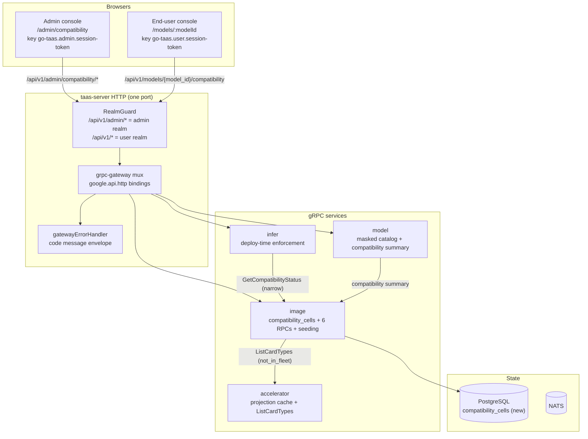
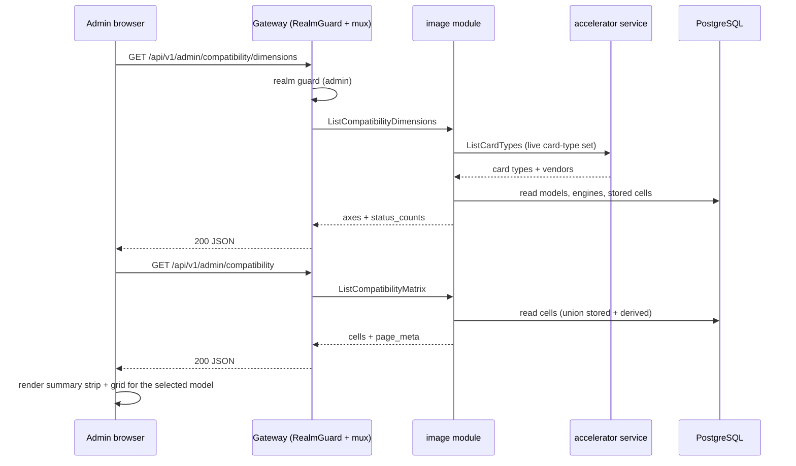
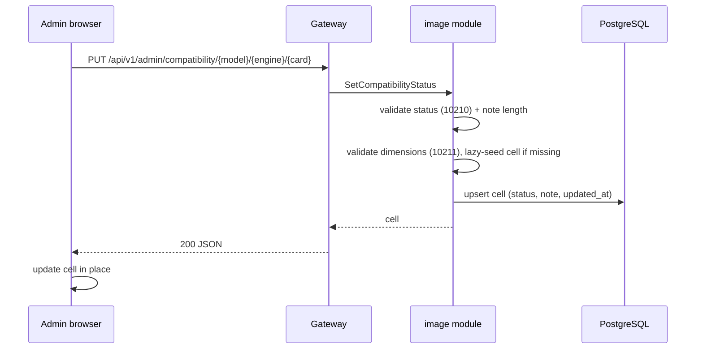
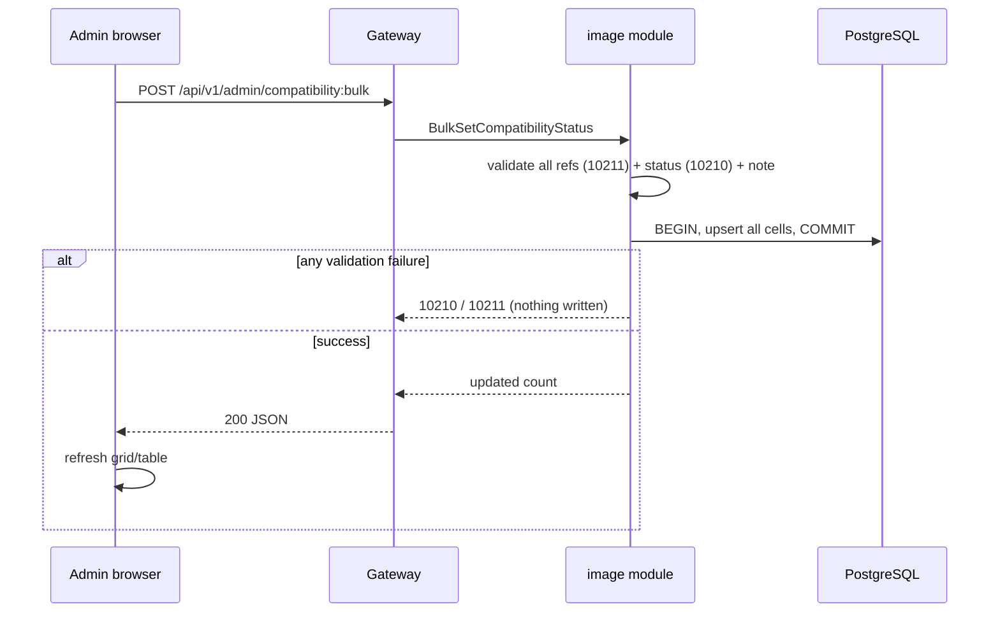
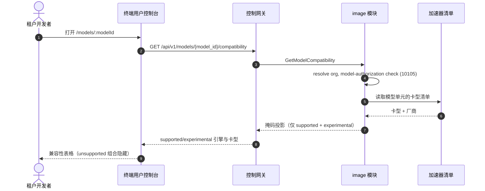
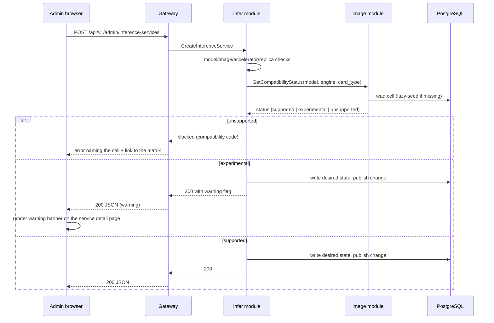
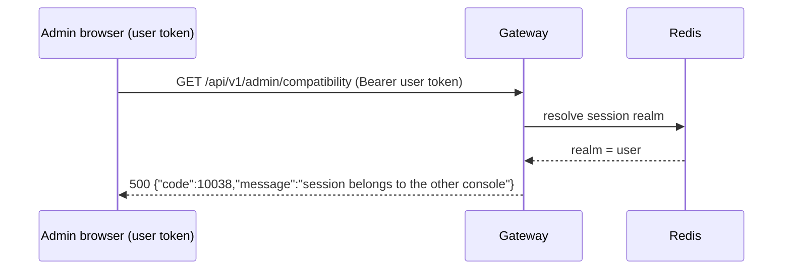

# 模型 × 引擎 × 卡型兼容矩阵 — 架构与详细设计

| 属性 | 内容 |
| --- | --- |
| 特性点 | 模型 × 引擎 × 卡型兼容矩阵 —— 哪些模型/引擎/卡型组合受支持 / 实验性 / 不受支持，由加速器清单播种（backlog 第 19 行） |
| 文档范围 | 经过整理的、三维兼容矩阵的架构与详细设计：DB 支撑的 `compatibility_cells` 数据模型、首次启动与惰性播种规则、按面划分的五个 admin RPC 与一个 user RPC 及其精确 `google.api.http` 绑定、部署表单强制执行集成、掩码终端用户投影、两个控制台的前端页面及其路由 → API 前缀映射、错误处理（10209–10211）、配置、安全、上线，以及逐层的函数级任务清单 |
| 归属模块 | `image`（按架构第 2.3 节拥有适配矩阵：`compatibility_cells` 表、六个 RPC、播种逻辑、部署表单强制执行接缝）、`web/` 管理控制台（`CompatibilityPage`）与终端用户控制台（`ModelDetailPage`）、`pkg/server` 网关（admin 前缀与 user 前缀绑定）、`pkg/errors`（10209–10211）、`pkg/config`（compatibility 区块） |
| 相关文档 | [需求分析与 UI/UX 设计](../design/compatibility-matrix.zh-cn.md) · [架构设计](../design/architecture.zh-cn.md) 第 2.3 节（`image` 拥有适配矩阵）· [加速器清单与健康](./accelerator-inventory.zh-cn.md)（本矩阵播种所用的卡型清单）· [镜像管理](./image-management.zh-cn.md)（引擎集合与延后的卡型级矩阵单元）· [模型目录与一键部署](./model-catalog-deployment.zh-cn.md)（模型维度与必须查询矩阵的部署表单）· [控制台面分离](./console-surface-separation.zh-cn.md)（本特性横跨的两个面、realm 守卫、`AdminShell`/`UserShell`）· [按租户模型授权](./model-authorization.zh-cn.md)（掩码用户面目录与本特性复用的 10105/10101 错误码） |
| 状态 | 架构完成，已交付开发者智能体 |

---

## 1. 概述与目标

go-taas 在**异构加速器**上提供推理服务（NVIDIA GPU、Iluvatar CoreX、MetaX），横跨三个引擎家族（vLLM、SGLang、TensorRT-LLM）与不断增长的模型目录（Qwen、DeepSeek、LLaMA 等）。架构（第 2.3 节）把维护**镜像与卡型、引擎、模型格式之间的适配矩阵**的职责分配给 `image` 模块，部署表单（特性 #2）已经按加速器过滤镜像下拉框。但今天这个矩阵并不以数据形式存在：部署表单接受任意卡型，镜像目录只携带一个粗粒度的 `accelerator` 字段（nvidia / iluvatar / metax），没有任何东西记录某个模型是否真的能在某个引擎上、某个卡型上运行。

特性 #18（加速器清单）刚刚交付了**卡型清单** —— 集群中存在的卡型集合，带按节点数量与健康。特性 #3 交付了**引擎集合** —— 已注册的推理镜像及其 accelerator 与 engine 字段。两者正是本特性要构建的矩阵的原材料：运维人员需要一个统一的地方来记录并查看*哪些模型/引擎/卡型组合已知可用*、哪些是实验性的、哪些不受支持 —— 而部署表单需要查询这份记录，使不受支持的组合无法被提交。

本特性新增**兼容矩阵**：一个经过整理的、三维网格（模型 × 引擎 × 卡型），其单元携带状态（`supported` / `experimental` / `unsupported`）与可选备注。它由加速器清单（卡型）与镜像目录（引擎）播种，再与模型目录交叉。运维人员整理各单元；部署表单与终端用户控制台消费结果。

**目标**：

- 一个管理页 `/admin/compatibility`，以可扫描网格（行 = 引擎，列 = 卡型，按所选模型）与扁平可过滤表格展示矩阵，由加速器清单与镜像目录播种（设计 D3）。
- 单单元与批量状态编辑带备注（设计 D5）。
- 部署表单集成点：`unsupported` 组合被阻止，`experimental` 组合部署但带警告（设计 D4）。
- `/models/:modelId` 上的只读掩码终端用户展示与掩码模型列表上的兼容性摘要（设计 D7）。
- 带精确前缀的页面 → API 面对照表（设计 D6、D7）。
- 包括空态、错误态与权限拒绝态的逐页面交互状态。
- 可在 compose 栈上由 Nightwatch 测试的编号验收标准。

**非目标**（按设计重述）：任何租户侧编辑矩阵（D6）；超出三个维度的模型格式级单元（未来细化）；自动验证组合（运维整理；平台不运行模型来证明其可用）；单元删除操作（D5）；向租户暴露 `unsupported` 组合或运维整理内部（D7）；随时间变化的 Grafana 式矩阵热力图（超出范围 —— 这是时点整理面）。

### 1.1 阅读顺序

第 2 节记录架构决策（包括架构细化 UI/UX 设计的点及其理由）。第 3–5 节是组件视图、播种机制与数据模型。第 6–8 节是 API 契约、前端架构与关键时序。第 9–12 节是错误处理、配置、安全与上线。第 13–15 节是验收标准可追溯性、函数级详细设计与有序实现任务清单。

---

## 2. 架构决策

AD1–AD10 把 UI/UX 设计的决策重述为实现级规则。**AD11–AD13 是架构新增的细化**，各标记其细化的设计决策；它们保留设计意图并记录于此，使开发者与测试智能体实现同一解读。

| # | 决策 | 理由 |
| --- | --- | --- |
| AD1 | **矩阵是一个经过整理的三维网格** `(model_id, engine, card_type)` → `status` ∈ {`supported`, `experimental`, `unsupported`} 外加可选 `note`，持久化在 `image` 模块拥有的 DB 支撑 `compatibility_cells` 表中。三个维度正是模型目录、引擎集合与卡型清单 | 设计 D1。架构（第 2.3 节）把适配矩阵分配给 `image`；需要 DB 表（而非像加速器清单那样的内存缓存），因为矩阵是**经过整理的** —— 运维的决策必须跨重启存活并可查询/可强制执行，这与易失的集群投影（accelerator-inventory AD11）不同 |
| AD2 | **状态语义**：`supported` = 已验证且已知可用（绿色，可部署）；`experimental` = 厂商兼容但未完全验证（琥珀色，可部署但带警告）；`unsupported` = 已知不可用或厂商不匹配（红/灰，不可部署）。封闭集合恰为 {`supported`, `experimental`, `unsupported`} | 设计 D2。三态层级符合 vLLM/NGC 惯例，给运维一个介于「已验证」与「已损坏」之间的中间地带 |
| AD3 | **维度实时推导**：模型来自模型目录（`models` 表），引擎来自镜像目录（已注册 `images` 的不同 `engine` 值），卡型来自加速器清单（特性 #18）。矩阵是交叉积并物化为行。**播种**：首次启动时若 `compatibility_cells` 表为空，为每个组合创建一行；默认状态 = 厂商不匹配的组合（`engine.accelerator ≠ card_type.vendor`）为 `unsupported`，厂商匹配的组合为 `experimental`。之后出现的组合（新卡型、引擎或模型）在首次访问时惰性创建默认行 | 设计 D3。矩阵必须始终覆盖当前集群；安全默认（在整理前不假定任何东西 *supported*）防止意外部署未验证组合，而厂商匹配 → `experimental` 反映引擎至少为该厂商构建 |
| AD4 | **部署表单（特性 #2）查询矩阵**：`unsupported` 组合在部署时被阻止并给出清晰消息；`experimental` 组合部署但带警告横幅。这是通过 `image` 模块窄接口接线的跨特性集成点；矩阵页面是主要交付物 | 设计 D4。矩阵只有被强制执行才有用；阻止 `unsupported` 并警告 `experimental` 把整理变成部署时的保证 |
| AD5 | **编辑仅限管理面。** 单元的状态与备注通过单单元对话框或批量编辑流程（多选行 → 设置状态 + 备注）设置。v1 无删除 —— 单元状态始终是三种之一 | 设计 D5。矩阵是整理面；批量编辑必不可少，因为交叉积很大，运维不能逐个点击数百个单元 |
| AD6 | **矩阵页面仅限管理面**：路由 `/admin/compatibility`，API 前缀 `/api/v1/admin/compatibility/*`。它被加入 `AdminShell` 导航（特性 #17），名为「Compatibility」 | 设计 D6。整理是运维能力；租户永不编辑矩阵 |
| AD7 | **终端用户可见性是只读掩码投影。** 新增终端用户模型详情页 `/models/:modelId`，展示模型的 `supported` 与 `experimental` 引擎和卡型；`unsupported` 组合被隐藏。掩码模型列表 `GET /api/v1/models`（特性 #17，AD8）获得按模型的兼容性摘要。API：`GET /api/v1/models/{model_id}/compatibility` | 设计 D7。租户需要知道模型运行在什么上（用于成本/性能预期），但不得看到运维整理内部或不受支持组合；掩码投影遵循特性 #17 的 AD8（不泄漏运维字段） |
| AD8 | 在**镜像块**（10209–10299）新增错误码：**10209 `CodeCompatibilityCellNotFound`**（矩阵中缺失的 `(model, engine, card_type)` 单元）、**10210 `CodeCompatibilityStatusInvalid`**（超出封闭集合的状态）、**10211 `CodeCompatibilityDimensionInvalid`**（未知模型、引擎或卡型） | 设计 D8。矩阵属于 `image`（AD1），因此其错误码位于 10208（特性 #18）之后的镜像块；独立错误码让「单元缺失」vs「状态错误」vs「维度错误」各自可操作 |
| AD9 | 矩阵**轮询而非推送**：页面按间隔轮询 `ListCompatibilityMatrix`（默认 30 秒）并显示最后更新时间戳；无 websocket | 设计 D9。与现有控制台的 `usePolling` 模式一致（特性 #17），并保持 API 无状态 |
| AD10 | **不再存在于集群中的卡型**保留其整理状态，但在响应与 UI 中标记 `not_in_fleet`，使运维的整理永不静默丢失 | 设计 D10。加速器清单是卡型的实时来源；离开集群的卡型不应抹掉运维的决策，但必须可见地过期 |
| AD11 | **细化设计 D3 —— 矩阵是 DB 表，而非内存投影。** 设计的「由加速器清单播种」被落实为**读取时推导卡型轴**，而非物化副本：`compatibility_cells` 表只存储 `(model_id, engine, card_type, status, note, updated_at)`；卡型轴与 `not_in_fleet` 标记在请求时通过把已存储卡型与加速器清单的实时卡型集合连接来计算 | 设计（D1）把矩阵分配给 `image` 作为*经过整理的*记录，整理必须持久且可查询 —— 这与加速器清单的易失投影（accelerator-inventory AD11）不同。把卡型轴作为数据存储（而非纯粹从实时清单推导）是必需的，这样离开集群的卡型能保留其整理状态（D10）。`not_in_fleet` 标记从加速器清单的卡型集合实时推导，因此永不过期。加速器服务为此连接暴露窄读接口 `ListCardTypes()` |
| AD12 | **细化设计 D7 —— 掩码模型列表的兼容性摘要是现有 `AvailableModel` 消息上的新字段，而非新 RPC。** `ListAvailableModels`（特性 #17 AD8）获得携带模型 `supported`/`experimental` 引擎+卡型摘要的 `compatibility` 字段；专门的 `GetModelCompatibility` RPC 在模型详情页提供完整掩码投影 | 设计（FR5.3）希望模型列表提示每个模型运行在什么上。给现有掩码 `AvailableModel` 添加摘要字段使列表保持一次往返，并遵循特性 #17 的 AD8（掩码投影，无运维字段）。详情页需要完整逐单元列表，因此使用专门 RPC。两者都是 `/api/v1/*` 下的用户面读取 |
| AD13 | **细化设计 D4 —— 部署表单强制执行是 `image` 模块上的同步窄接口读取，注入 `infer`。** `infer` 的 `CreateInferenceService` 在现有模型/镜像/加速器检查之后、期望状态写入之前调用 `image.GetCompatibilityStatus(modelID, engine, cardType)`（窄接口，`SetDeleteGuard`/`IsModelAuthorized` 注入模式）：`unsupported` → 阻止（新错误码，见第 9 节），`experimental` → 允许但响应携带 `warning` 标记，控制台渲染为横幅 | 设计（D4）要求部署表单强制执行矩阵。强制执行必须位于 `infer`（部署时门），但矩阵数据位于 `image`（AD1）；窄接口注入使 `infer` 免于 `image` 依赖，恰为既定模式。`experimental` 警告作为响应字段暴露，使控制台能在服务详情页渲染横幅（设计 FR4.1） |

---

## 3. 组件视图

### 3.1 归属

| 层 / 组件 | 拥有 | 本特性的变更 |
| --- | --- | --- |
| **静态包（SPA）** | 一个 Vite 包（`web/dist`），嵌入 `taas-server` 的 `pkg/server/console/`；由网关的 SPA 回退提供 | 两个新页面（管理控制台的 `CompatibilityPage`、终端用户控制台的 `ModelDetailPage`）、一个导航项与 `App.tsx` 中的路由注册 |
| **网关（`pkg/server`）** | HTTP 组合：`RealmGuard` → `withConsole` → `runtime.ServeMux`；统一错误渲染器；SPA 回退 | 无变更 —— 新 RPC 绑定在 `/api/v1/admin/compatibility/*`（admin）与 `/api/v1/models/{model_id}/compatibility`（user）下，realm 守卫已把这些前缀视为其面 |
| **grpc-gateway mux** | 从 `google.api.http` 注解进行路径 → RPC 路由 | 六个新 RPC 的新绑定（第 6 节） |
| **`image`** | `compatibility_cells` 表、六个 RPC、播种逻辑、部署表单强制执行接缝 | 新 `compatibility_cells` 表 + 仓库 + 服务方法；供 `infer` 的窄 `GetCompatibilityStatus` 接口；从加速器服务读取 `ListCardTypes` |
| **`accelerator`** | 内存投影缓存（特性 #18） | 为 image 模块的 `not_in_fleet` 推导与卡型轴暴露窄读接口 `ListCardTypes()` |
| **`infer`** | 推理服务生命周期、部署时校验 | `CreateInferenceService` 通过注入的 `image` 窄接口查询矩阵（AD13） |
| **`model`** | 模型目录、版本、掩码用户面目录 | `ListAvailableModels` 获得 `compatibility` 摘要字段（AD12） |
| **`pkg/errors`** | 按模块划分的代码块 | 三个新镜像块错误码：**10209 `CodeCompatibilityCellNotFound`**、**10210 `CodeCompatibilityStatusInvalid`**、**10211 `CodeCompatibilityDimensionInvalid`**（AD8） |
| **`pkg/config`** | 合并配置树 | 新 `compatibility` 区块（播种开关、惰性播种默认） |

### 3.2 运行时组件视图



### 3.3 请求身份链

兼容性 RPC 横跨两个面。链路为：

1. `RealmGuard`（HTTP，`pkg/server/realm.go`）—— 路径前缀决定期望 realm。admin RPC 绑定在 `/api/v1/admin/compatibility/*` 下 → 期望 realm `admin`；user RPC 绑定在 `/api/v1/models/{model_id}/compatibility` 下 → 期望 realm `user`。无 `Authorization` 头：透传（过渡，特性-17 AD4）。有头：从 Redis 解析会话 realm；不匹配 → 10038，未知/过期/无 realm → 10027。
2. grpc-gateway mux —— 按注解路径路由并转发 `authorization`。
3. `image` 处理器 —— 读取 `compatibility_cells` 表。admin RPC 是**平台级**（不要求也不理会 `X-Organization-Id`，镜像 image-management D9）。user RPC `GetModelCompatibility` 是**租户级**：解析调用方组织（会话派生的 `SessionActiveOrg`，或过渡 `X-Organization-Id` 头）并应用模型授权默认允许规则（特性 #13）—— 租户未获授权的受限模型返回 10105。

因为 admin RPC 是平台级，其上没有 `tenancy.RoleGuard` 门：任何 admin-realm 会话（或过渡调用方）都可读取与整理矩阵。因此权限拒绝态（设计 FR6.1，AC15）由 realm 守卫（10038）或会话守卫（10027）产生，而非角色检查。user RPC 的权限拒绝态（设计 FR5.4，AC12）由模型授权检查（10105）或 realm/会话守卫产生。

---

## 4. 播种机制

### 4.1 首次启动播种

启动时，`image` 模块的 `Migrate` 钩子（既定 `Migrator` 模式）在 `AutoMigrate(compatibility_cells)` 之后运行：

1. `SELECT count(*) FROM compatibility_cells`。
2. 若表**为空**，为每个 `(model, engine, card_type)` 组合播种一行：
   - **模型**来自 `models` 表（所有目录模型）；
   - **引擎**来自 `images` 表的不同 `engine` 值；
   - **卡型**来自加速器清单的实时卡型集合（经 `accelerator.ListCardTypes()` 窄读）。
   - 默认状态：`engine.accelerator ≠ card_type.vendor` 时为 `unsupported`，匹配时为 `experimental`（AD3）。
3. 若表**非空**，跳过播种 —— 数据库是权威（运维的整理永不被覆盖）。

播种是**仅插入、仅首次启动**：它永不在非空表上重跑，因此删除（v1 无）与编辑都保留。播种是尽力而为的启动步骤：若启动时加速器清单为空（Controller 尚未发布快照），卡型轴为空，播种不创建行；惰性播种路径（第 4.2 节）在集群变得已知时填充它们。

### 4.2 首次访问惰性播种

之后出现的组合（新模型、引擎或卡型）在首次访问时惰性创建默认行（AD3）。惰性播种在仓库的读取路径实现：当查询引用无行的 `(model, engine, card_type)` 组合时，服务在返回前物化默认行（使用相同厂商匹配规则）。具体地：

- `GetCompatibilityCell` 与 `SetCompatibilityStatus` 在读取/写入前确保请求的单元存在（用默认规则创建）。
- `ListCompatibilityMatrix` 与 `ListCompatibilityDimensions` 在请求时计算当前模型 × 引擎 × 卡型的**完整交叉积**并与已存储行并集，使新添加的维度在整理任何单元前立即出现在网格中。已存储行携带整理状态/备注；派生的（尚未存储）行携带默认状态，并在首次编辑时物化进表。

这使矩阵始终覆盖当前集群而无需后台任务，并符合设计的「之后出现的组合在首次访问时惰性创建默认行」（D3）。

### 4.3 `not_in_fleet` 推导

不再存在于加速器清单中的卡型保留其整理状态但标记 `not_in_fleet`（AD10）。该标记在请求时推导：服务读取加速器清单的实时卡型集合（`accelerator.ListCardTypes()`），并标记每个 `card_type` 不在该集合中的已存储单元。该标记从不存储 —— 它是实时连接，因此永不过期。离开集群后又返回的卡型自动失去该标记。

---

## 5. 数据模型

### 5.1 `compatibility_cells` 表

| 列 | PostgreSQL 类型 | 约束 | 描述 |
| --- | --- | --- | --- |
| `id` | `uuid` | PRIMARY KEY | 服务端生成的 UUID v4 |
| `model_id` | `uuid` | NOT NULL，复合唯一 `(model_id, engine, card_type)` | 模型维度（FK → `models.id`，无硬 FK —— 见注） |
| `engine` | `varchar(64)` | NOT NULL，复合唯一 `(model_id, engine, card_type)` | 引擎维度（`images` 的一个不同 `engine` 值） |
| `card_type` | `varchar(64)` | NOT NULL，复合唯一 `(model_id, engine, card_type)` | 卡型维度（加速器清单的一个卡型） |
| `status` | `varchar(16)` | NOT NULL | 封闭集合：`supported` / `experimental` / `unsupported`（AD2） |
| `note` | `varchar(512)` | NOT NULL DEFAULT '' | 可选运维备注，≤ 512 字符 |
| `created_at` | `timestamptz` | NOT NULL | 首次物化时间（UTC） |
| `updated_at` | `timestamptz` | NOT NULL | 最后整理时间（UTC） |

索引：

| 索引 | 定义 | 目的 |
| --- | --- | --- |
| 主键 | `(id)` | 单元身份 |
| 唯一 | `(model_id, engine, card_type)` | 三维单元身份；违反映射为惰性播种无操作（单元已存在） |
| 复合 | `(model_id, status)` | 掩码用户投影（`GetModelCompatibility`）与网格的按模型过滤 |
| 复合 | `(status)` | 摘要条的按状态计数 |

设计说明：

- **无硬外键**：`model_id` 是匹配 `models.id` 的 `uuid`，但单元必须能在模型被删除后存活（模型模块级联自己的行；矩阵是整理记录，而非引用约束）。`engine` 与 `card_type` 是普通字符串 —— 它们是派生维度，不是有自己表的实体。
- **卡型轴作为数据存储**（AD11）：这正是让离开集群的卡型保留其整理状态（D10）的原因。`not_in_fleet` 标记实时推导，从不存储。
- **`status` 是封闭集合**，在服务层强制（其他值 10210）；无 DB 检查约束，符合平台的服务层校验约定。
- **v1 无删除**（D5）：行从不移除；单元状态始终是三种之一。

### 5.2 迁移说明

- 表由 `image` 模块 `Migrate` 钩子中的 GORM `AutoMigrate` 在启动时创建（既定 `Migrator` 模式）。GORM 模型是模式的单一事实来源。
- 首次启动播种（第 4.1 节）在同一 `Migrate` 钩子中、`AutoMigrate` 之后运行，因此全新部署在一次启动中获得模式与播种行。
- 演进仅增量：表是新的；无现有表变更。

---

## 6. API 契约

### 6.1 RPC 面

所有矩阵 RPC 属于 **`taas.image.v1.ImageService`**（proto：`proto/taas/image/v1/image.proto`），经控制网关以 HTTP 提供。五个 RPC 是**管理面**（AD6），一个是**用户面**（AD7）。Proto 变更仅增量。

| RPC | HTTP | 前缀 | 状态 | 目的 |
| --- | --- | --- | --- | --- |
| `ListCompatibilityMatrix` | `GET /api/v1/admin/compatibility` | admin | **新增** | 带模型/引擎/卡型/状态过滤、搜索、分页的矩阵单元 |
| `ListCompatibilityDimensions` | `GET /api/v1/admin/compatibility/dimensions` | admin | **新增** | 三个轴列表（模型、引擎、卡型 + 厂商）与按状态计数 |
| `GetCompatibilityCell` | `GET /api/v1/admin/compatibility/{model_id}/{engine}/{card_type}` | admin | **新增** | 单个单元；缺失 → 10209 |
| `SetCompatibilityStatus` | `PUT /api/v1/admin/compatibility/{model_id}/{engine}/{card_type}` | admin | **新增** | 设置单元状态 + 备注 |
| `BulkSetCompatibilityStatus` | `POST /api/v1/admin/compatibility:bulk` | admin | **新增** | 为单元列表原子批量设置状态 + 备注 |
| `GetModelCompatibility` | `GET /api/v1/models/{model_id}/compatibility` | user | **新增** | 掩码投影：模型的 supported/experimental 引擎与卡型 |

### 6.2 Proto 契约

```proto
// 对 proto/taas/image/v1/image.proto 的增量添加，位于 ImageService 上。

  // ListCompatibilityMatrix 返回带模型/引擎/卡型/状态过滤、模型名搜索与分页的矩阵单元。
  // Admin-surface API: served under /api/v1/admin.
  rpc ListCompatibilityMatrix(ListCompatibilityMatrixRequest) returns (ListCompatibilityMatrixResponse) {
    option (google.api.http) = {get: "/api/v1/admin/compatibility"};
  }

  // ListCompatibilityDimensions 返回三个轴列表（模型、引擎、卡型 + 厂商）与按状态计数。
  // Admin-surface API: served under /api/v1/admin.
  rpc ListCompatibilityDimensions(ListCompatibilityDimensionsRequest) returns (ListCompatibilityDimensionsResponse) {
    option (google.api.http) = {get: "/api/v1/admin/compatibility/dimensions"};
  }

  // GetCompatibilityCell 返回单个单元；缺失单元返回 10209。
  // Admin-surface API: served under /api/v1/admin.
  rpc GetCompatibilityCell(GetCompatibilityCellRequest) returns (GetCompatibilityCellResponse) {
    option (google.api.http) = {get: "/api/v1/admin/compatibility/{model_id}/{engine}/{card_type}"};
  }

  // SetCompatibilityStatus 设置单元的状态与可选备注。
  // Admin-surface API: served under /api/v1/admin.
  rpc SetCompatibilityStatus(SetCompatibilityStatusRequest) returns (SetCompatibilityStatusResponse) {
    option (google.api.http) = {
      put: "/api/v1/admin/compatibility/{model_id}/{engine}/{card_type}"
      body: "*"
    };
  }

  // BulkSetCompatibilityStatus 为单元列表原子（全有或全无）设置相同状态与备注。
  // Admin-surface API: served under /api/v1/admin.
  rpc BulkSetCompatibilityStatus(BulkSetCompatibilityStatusRequest) returns (BulkSetCompatibilityStatusResponse) {
    option (google.api.http) = {
      post: "/api/v1/admin/compatibility:bulk"
      body: "*"
    };
  }

  // GetModelCompatibility 返回掩码用户面投影：模型的 supported/experimental 引擎与卡型。
  // Unsupported 组合被隐藏。User-surface API: served under /api/v1.
  rpc GetModelCompatibility(GetModelCompatibilityRequest) returns (GetModelCompatibilityResponse) {
    option (google.api.http) = {get: "/api/v1/models/{model_id}/compatibility"};
  }

message CompatibilityCell {
  string model_id = 1;
  string model_name = 2;
  string engine = 3;
  string card_type = 4;
  string card_vendor = 5;
  string status = 6;      // supported | experimental | unsupported
  string note = 7;
  bool not_in_fleet = 8;
  int64 updated_at = 9;
}

message ListCompatibilityMatrixRequest {
  taas.common.v1.PageRequest page = 1;
  string model_id = 2;
  string engine = 3;
  string card_type = 4;
  string status = 5;
  string search = 6;      // model-name substring
}
message ListCompatibilityMatrixResponse {
  taas.common.v1.Response response = 1;
  repeated CompatibilityCell cells = 2;
  taas.common.v1.PageMeta page_meta = 3;
}

message CompatibilityDimensionModel {
  string model_id = 1;
  string model_name = 2;
}
message CompatibilityDimensionEngine {
  string engine = 1;
  string accelerator = 2;
}
message CompatibilityDimensionCardType {
  string card_type = 1;
  string vendor = 2;
  bool in_fleet = 3;
}
message CompatibilityStatusCounts {
  int64 supported = 1;
  int64 experimental = 2;
  int64 unsupported = 3;
  int64 not_in_fleet = 4;
}
message ListCompatibilityDimensionsRequest {}
message ListCompatibilityDimensionsResponse {
  taas.common.v1.Response response = 1;
  repeated CompatibilityDimensionModel models = 2;
  repeated CompatibilityDimensionEngine engines = 3;
  repeated CompatibilityDimensionCardType card_types = 4;
  CompatibilityStatusCounts status_counts = 5;
}

message GetCompatibilityCellRequest {
  string model_id = 1;   // path
  string engine = 2;     // path
  string card_type = 3;  // path
}
message GetCompatibilityCellResponse {
  taas.common.v1.Response response = 1;
  CompatibilityCell cell = 2;
}

message SetCompatibilityStatusRequest {
  string model_id = 1;   // path
  string engine = 2;     // path
  string card_type = 3;  // path
  string status = 4;
  string note = 5;       // <= 512 chars
}
message SetCompatibilityStatusResponse {
  taas.common.v1.Response response = 1;
  CompatibilityCell cell = 2;
}

message BulkSetCompatibilityStatusRequest {
  repeated CompatibilityCellRef cells = 1;
  string status = 2;
  string note = 3;       // <= 512 chars
}
message CompatibilityCellRef {
  string model_id = 1;
  string engine = 2;
  string card_type = 3;
}
message BulkSetCompatibilityStatusResponse {
  taas.common.v1.Response response = 1;
  int64 updated = 2;
}

message GetModelCompatibilityRequest {
  string model_id = 1;   // path
}
message ModelCompatibilityEntry {
  string engine = 1;
  string card_type = 2;
  string card_vendor = 3;
  string status = 4;     // supported | experimental (masked)
}
message GetModelCompatibilityResponse {
  taas.common.v1.Response response = 1;
  repeated ModelCompatibilityEntry entries = 2;
  int64 supported_count = 3;
  int64 experimental_count = 4;
}
```

### 6.3 线上格式（既定约定）

- 分页绑定为 `?page.offset=0&page.limit=20`（点形式）；默认 limit 20，上限 100。
- 成功响应为 HTTP 200；业务错误渲染为 `{"code": <int>, "message": "..."}`。
- admin 兼容性 API 是**平台级**：不要求也不理会 `X-Organization-Id` 头（AD6，镜像 image-management D9）。user `GetModelCompatibility` 是**租户级**：解析调用方组织（会话派生的 `SessionActiveOrg`，或过渡 `X-Organization-Id` 头）并应用模型授权默认允许规则。
- `ListCompatibilityMatrix` 支持 `model_id`、`engine`、`card_type`、`status` 过滤，`search`（模型名子串），以及 `offset`/`limit` 分页。过滤与分页在服务端对已存储与派生单元的并集应用（第 4.2 节）。
- `ListCompatibilityDimensions` 返回三个轴列表与按状态计数；卡型轴携带 `in_fleet`，使网格无需第二次调用即可渲染「not in fleet」标记。
- `GetCompatibilityCell` 返回单个单元；缺失单元返回 **10209**（AD8）。
- `SetCompatibilityStatus` 校验 `status` ∈ {supported, experimental, unsupported}（否则 10210）且 `note` ≤ 512 字符；未知模型、引擎或卡型返回 10211；缺失单元在应用状态前按默认规则（AD3）惰性创建。
- `BulkSetCompatibilityStatus` 是原子的：要么所有单元更新，要么都不更新；返回更新数量。
- `GetModelCompatibility` 只返回 status ∈ {`supported`, `experimental`} 的单元（掩码，AD7），外加 `supported_count` 与 `experimental_count`；未知模型返回 10101；租户未授权的模型返回 10105。

### 6.4 校验矩阵

| RPC | 检查 | 失败码 | 规范消息 |
| --- | --- | --- | --- |
| `ListCompatibilityMatrix` | `status` ∈ {supported, experimental, unsupported} 或空；`limit` ≤ 100 | 无效过滤值被忽略（视为空） | — |
| `ListCompatibilityDimensions` | 无 | — | — |
| `GetCompatibilityCell` | `model_id`/`engine`/`card_type` 标识已知维度 | 10211 `CodeCompatibilityDimensionInvalid` | compatibility dimension invalid |
| `GetCompatibilityCell` | 单元存在（惰性播种后） | 10209 `CodeCompatibilityCellNotFound` | compatibility cell not found |
| `SetCompatibilityStatus` | `status` 在封闭集合内 | 10210 `CodeCompatibilityStatusInvalid` | compatibility status invalid |
| `SetCompatibilityStatus` | `note` ≤ 512 字符 | 10210 `CodeCompatibilityStatusInvalid` | compatibility status invalid |
| `SetCompatibilityStatus` | `model_id`/`engine`/`card_type` 标识已知维度 | 10211 `CodeCompatibilityDimensionInvalid` | compatibility dimension invalid |
| `BulkSetCompatibilityStatus` | 每个单元引用标识已知维度；`status` 在封闭集合内；`note` ≤ 512 字符 | 10210 / 10211 | 如上 |
| `GetModelCompatibility` | `model_id` 存在 | 10101 `CodeModelNotFound` | model not found |
| `GetModelCompatibility` | 租户获授权该模型（默认允许） | 10105 `CodeModelUnauthorized` | model not authorized |

---

## 7. 前端架构

### 7.1 模块计划

| 关注点 | 文件 | 说明 |
| --- | --- | --- |
| Admin 导航项 | `web/src/shells/AdminShell.tsx` | 向 `ADMIN_NAV_ITEMS` 添加 `{ path: '/admin/compatibility', label: 'Compatibility', testid: 'nav-compatibility' }` |
| 路由注册 | `web/src/App.tsx` | 向 `AdminSurface` `<Routes>` 添加 `/admin/compatibility`，向 `UserSurface` `<Routes>` 添加 `/models/:modelId` |
| Admin 矩阵页面 | `web/src/pages/CompatibilityPage.tsx`（新） | 摘要条 + 网格/表格切换、过滤器、搜索、分页、单单元 + 批量编辑对话框、轮询 |
| 终端用户模型详情页 | `web/src/pages/ModelDetailPage.tsx`（新） | 掩码兼容性表格 + 摘要、返回链接 |
| 共享组件 | `web/src/components.tsx` | 复用 `ErrorBanner`、`Pagination`、`StateBadge`、`usePolling`、`Modal`；无需新共享组件 |

### 7.2 Admin 控制台：页面 → 路由 → API

| 路由 | 组件 | 目的 | API 前缀（精确调用） |
| --- | --- | --- | --- |
| `/admin/compatibility` | `pages/CompatibilityPage.tsx` | 矩阵网格/表格 + 整理 | `GET /api/v1/admin/compatibility?page.offset=…&page.limit=…&model_id=…&engine=…&card_type=…&status=…&search=…`、`GET /api/v1/admin/compatibility/dimensions`、`GET /api/v1/admin/compatibility/{model_id}/{engine}/{card_type}`、`PUT /api/v1/admin/compatibility/{model_id}/{engine}/{card_type}`、`POST /api/v1/admin/compatibility:bulk` |

页面只调用 `/api/v1/admin/compatibility/*` 路由；不包含任何 `/api/v1/*`（用户前缀）字符串（设计 FR6.3，特性-17）。realm 作用域 API 客户端（`useApi()`）在运行时强制执行（特性-17 AD1）。

### 7.3 终端用户控制台：页面 → 路由 → API

| 路由 | 组件 | 目的 | API 前缀（精确调用） |
| --- | --- | --- | --- |
| `/models/:modelId` | `pages/ModelDetailPage.tsx` | 掩码兼容性展示 | `GET /api/v1/models/{model_id}/compatibility` |

页面只调用 `/api/v1/*` 路由；不包含任何 `/api/v1/admin/*` 字符串（设计 FR6.3，特性-17）。掩码模型列表（`GET /api/v1/models`，特性 #17 AD8）获得 `compatibility` 摘要字段（AD12），使 playground 选择器与模型列表提示每个模型运行在什么上。

### 7.4 `web/src/App.tsx` 中的路由注册

```tsx
{/* AdminSurface */}
<Route path="/admin/compatibility" element={<CompatibilityPage />} />

{/* UserSurface */}
<Route path="/models/:modelId" element={<ModelDetailPage />} />
```

admin 路由位于 `AdminSurface` `<Routes>` 内（在 `AdminShell` 内渲染，继承 admin realm 的会话守卫与导航）；user 路由位于 `UserSurface` `<Routes>` 内（在 `UserShell` 内渲染，继承 user realm 的会话守卫与导航）。

### 7.5 逐面认证守卫

- **Admin 页面**：继承 `AdminShell` 守卫（特性-17 §7.5）：启动时读取 `go-taas.admin.session-token`；空 → 过渡模式；有 → `GET /api/v1/admin/auth/session`；10027/10038 → 清除 admin token 并重定向到 `/admin/login?next=<path>&reason=…`。页面从不读取 user realm 的键。因为 admin 兼容性 RPC 是平台级，无额外角色门；权限拒绝态（设计 FR6.1，AC15）是 realm/会话守卫产生的标准特性-17 状态。
- **终端用户页面**：继承 `UserShell` 守卫（特性-17 §7.5）：启动时读取 `go-taas.user.session-token`；空 → 过渡模式；有 → `GET /api/v1/auth/session`；10027/10038 → 清除 user token 并重定向到 `/login?next=<path>&reason=…`。页面从不读取 admin realm 的键。权限拒绝态（设计 FR5.4，AC12）由模型授权检查（10105）或 realm/会话守卫产生。

### 7.6 轮询与过期数据处理

`CompatibilityPage` 使用 `usePolling`（设计 D9，FR6.4）：按 30 秒间隔轮询 `ListCompatibilityMatrix` 与 `ListCompatibilityDimensions` 并显示最后更新时间戳。失败的轮询保留最后好数据并显示「Showing stale data」横幅与 Retry 动作（设计 FR6.4，AC11）；它从不清空网格。轮询进行中 `Refresh` 动作禁用。`ModelDetailPage` 是只读页面，不轮询（挂载时获取一次）。

### 7.7 测试智能体可驱动的 `data-testid` 钩子

- Shell/导航：`nav-compatibility`。
- Admin 矩阵页面：`compatibility-page`、`compatibility-refresh`、`compatibility-last-updated`、`compatibility-summary-strip`、`compatibility-supported-count`、`compatibility-experimental-count`、`compatibility-unsupported-count`、`compatibility-not-in-fleet-count`、`compatibility-model-filter`、`compatibility-engine-filter`、`compatibility-card-filter`、`compatibility-status-filter`、`compatibility-search`、`compatibility-view-grid`、`compatibility-view-table`、`compatibility-grid`、`compatibility-cell-{model}-{engine}-{card}`、`compatibility-cell-not-in-fleet-{model}-{engine}-{card}`、`compatibility-table`、`compatibility-row-{model}-{engine}-{card}`、`compatibility-row-checkbox-{model}-{engine}-{card}`、`compatibility-bulk-edit`、`compatibility-empty`、`compatibility-stale-banner`、`compatibility-error`、`compatibility-pagination`、`compatibility-edit-dialog`、`compatibility-edit-status`、`compatibility-edit-note`、`compatibility-edit-save`、`compatibility-bulk-dialog`、`compatibility-bulk-status`、`compatibility-bulk-note`、`compatibility-bulk-apply`。
- 终端用户模型详情：`model-detail-page`、`model-detail-back`、`model-detail-name`、`model-detail-compatibility-summary`、`model-detail-compatibility-table`、`model-detail-compat-row-{engine}-{card}`、`model-detail-compat-empty`、`model-detail-compat-error`、`model-detail-not-found`、`model-detail-permission-denied`。

---

## 8. 时序图

### 8.1 Admin 矩阵页面加载与轮询



### 8.2 单单元编辑



### 8.3 批量编辑（原子）



### 8.4 终端用户掩码投影



### 8.5 部署表单强制执行



### 8.6 错误 realm 拒绝



---

## 9. 错误处理

| 代码 | 常量 | 消息 | 时机 |
| --- | --- | --- | --- |
| 10209 | `CodeCompatibilityCellNotFound` | compatibility cell not found | `GetCompatibilityCell` 遇到无法物化的 `(model, engine, card_type)`（AD8） |
| 10210 | `CodeCompatibilityStatusInvalid` | compatibility status invalid | `SetCompatibilityStatus` / `BulkSetCompatibilityStatus` 中超出 {supported, experimental, unsupported} 的状态，或 `note` > 512 字符（AD8） |
| 10211 | `CodeCompatibilityDimensionInvalid` | compatibility dimension invalid | 矩阵调用中的未知模型、引擎或卡型（AD8） |
| 10101 | `CodeModelNotFound` | model not found | `GetModelCompatibility` 遇到未知 `model_id`（特性 #2） |
| 10105 | `CodeModelUnauthorized` | model not authorized | `GetModelCompatibility` 遇到租户未获授权的受限模型（特性 #13） |
| 10038 | `CodeRealmMismatch` | session belongs to the other console | user-realm 会话出现在 `/api/v1/admin/compatibility/*`，或 admin-realm 会话出现在 `/api/v1/models/{model_id}/compatibility`（特性-17） |
| 10027 | `CodeSessionInvalid` | session invalid | 任一前缀上的未知/过期/无 realm 会话（特性-17） |

HTTP 状态为 `500`，`code` 位于 body，匹配本平台所有其他业务错误（特性-17 §4.3）。客户端按 body `code` 分支，绝不按状态。页面把 10209 映射为「cell not found」态，10210/10211 映射为对话框内联错误，10101 映射为未找到态，10105 映射为权限拒绝态，10038/10027 映射为标准权限拒绝/登录态。

---

## 10. 配置

`pkg/config/api.go` 与 `configs/config.yaml` 中的新 `compatibility` 区块：

```yaml
compatibility:
  # seedOnBoot 在首次启动且表为空时播种 compatibility_cells 表（AD3）。
  # 禁用则完全跳过首次启动播种。
  seedOnBoot: true
  # lazySeedDefault 是惰性创建单元的默认状态（AD3）。它被厂商匹配规则覆盖：
  # 厂商匹配组合默认 experimental，厂商不匹配默认 unsupported。
  lazySeedDefault: "experimental"
```

`CompatibilityConfig`（Go）：

```go
type CompatibilityConfig struct {
    SeedOnBoot       bool   `mapstructure:"seedOnBoot"`
    LazySeedDefault  string `mapstructure:"lazySeedDefault"`
}
```

默认：`seedOnBoot` true，`lazySeedDefault` "experimental"。`lazySeedDefault` 是厂商匹配规则 `experimental` 分支的回退；`unsupported` 分支始终为 `unsupported`，与该值无关。`ImageConfig` 获得 `Compatibility CompatibilityConfig` 字段。

---

## 11. 安全

- **面分离**：五个 admin RPC 绑定在 `/api/v1/admin/compatibility/*` 下，仅经 admin realm 守卫可达（AD6）；user RPC 绑定在 `/api/v1/models/{model_id}/compatibility` 下，仅经 user realm 守卫可达（AD7）。错误 realm 会话被 10038 拒绝；租户页面从不调用 admin 路由，admin 页面从不调用 user 路由（特性-17 AD1，由 realm 作用域 API 客户端强制）。
- **Admin RPC 是平台级**：不要求也不理会组织头（AD6，镜像 image-management D9）。admin 矩阵面无租户数据。
- **User RPC 是租户级且掩码**：`GetModelCompatibility` 解析调用方组织并应用模型授权默认允许规则（特性 #13）；租户未获授权的受限模型返回 10105。投影只携带 `supported`/`experimental` 单元 —— `unsupported` 组合与运维整理内部（备注、`not_in_fleet`）绝不暴露给租户（AD7）。
- **无机密**：矩阵携带模型/引擎/卡型状态与运维备注 —— 无凭据、令牌或模型权重。
- **写路径仅限 admin**：只有 admin RPC 变更（`SetCompatibilityStatus`、`BulkSetCompatibilityStatus`）；user RPC 仅 `GET`。v1 无删除（D5）。

---

## 12. 上线 / 升级说明

- **Proto**：增量 —— 现有 `ImageService` 上新增六个 RPC。无现有 RPC 或消息变更。用 `buf generate` 重新生成。
- **模式迁移**：一个新表 `compatibility_cells`，经 `image` 模块 `Migrate` 钩子中的 GORM `AutoMigrate`；首次启动播种在同一钩子中运行。无现有表变更。
- **新服务接线**：`apps/taas-server/main.go` 把兼容性仓库接入 image 服务，注入 `accelerator.ListCardTypes()` 提供者（用于 `not_in_fleet` 与卡型轴），并把 `image.GetCompatibilityStatus` 窄接口注入 `infer`。网关自动拾取新 RPC 绑定。
- **`infer` 部署强制执行**：`CreateInferenceService` 获得矩阵检查（AD13）。这是行为变更：之前可部署的 `unsupported` 组合现在失败。这是预期的强制执行（设计 D4）；运维在宣传模型/引擎/卡型组合前整理矩阵。
- **配置**：`compatibility` 区块是增量的；早于它的二进制回退到默认。
- **向后兼容**：无现有 API、页面或测试变更。新导航项与页面是两个控制台的增量。掩码模型列表（`GET /api/v1/models`）获得增量 `compatibility` 字段（AD12）；现有消费者忽略它。

---

## 13. 验收标准覆盖

| AC | 由以下处理 | 验证钩子 |
| --- | --- | --- |
| AC1 — 模型目录、镜像目录与加速器清单非空时首次启动播种；厂商匹配 → experimental，厂商不匹配 → unsupported | 第 4.1 节，AD3 | FVT |
| AC2 — `ListCompatibilityMatrix` 返回带过滤/搜索/分页的单元；每个单元携带状态、备注、`not_in_fleet`、`updated_at` | 第 6.2 节，第 4.3 节 | FVT |
| AC3 — `ListCompatibilityDimensions` 返回三个轴列表与按状态计数 | 第 6.2 节 | FVT |
| AC4 — `SetCompatibilityStatus` 设置状态+备注；无效状态 → 10210；未知维度 → 10211；缺失单元惰性创建 | 第 6.3 节，第 4.2 节 | FVT |
| AC5 — `BulkSetCompatibilityStatus` 原子更新并返回数量；失败时所有单元保持不变 | 第 6.3 节，第 8.3 节 | FVT |
| AC6 — 从清单移除的卡型保留其状态但标记 `not_in_fleet` | 第 4.3 节，AD10 | FVT |
| AC7 — `GetModelCompatibility` 只返回 supported/experimental（掩码）；未授权 → 10105；未知 → 10101 | 第 6.3 节，AD7 | FVT |
| AC8 — `/admin/compatibility` 从首次成功轮询渲染摘要条、过滤器与网格，带最后更新时间戳 | 第 7.6 节 | E2E |
| AC9 — 网格单元点击打开编辑单元对话框；保存就地更新；Table 批量选择 + Bulk edit 更新 N 个单元 | 第 7.7 节，第 8.2/8.3 节 | E2E |
| AC10 — 矩阵为空时渲染空态；卡型离开集群的单元渲染「not in fleet」标签 | 第 7.7 节，第 4.3 节 | E2E |
| AC11 — 失败的轮询保留最后好数据并带「Showing stale data」横幅与 Retry 动作 | 第 7.6 节 | E2E |
| AC12 — `/models/:modelId` 展示 supported/experimental 并隐藏 unsupported；未授权模型显示 10105 权限拒绝态 | 第 7.3 节，第 8.4 节 | E2E |
| AC13 — 矩阵页面仅限管理面：导航项、`/admin/compatibility` 路由、所有调用 `/api/v1/admin/compatibility/*`、无 `/api/v1/*` 字符串 | 第 7.2 节，AD6 | E2E（面分离） |
| AC14 — 终端用户模型详情仅限用户面：`/models/:modelId` 路由、只调用 `/api/v1/*`、无 `/api/v1/admin/*` 字符串 | 第 7.3 节，AD7 | E2E（面分离） |
| AC15 — 无所需角色的会话收到 10036 / 标准权限拒绝态 | 第 7.5 节（realm/会话守卫） | E2E |

---

## 14. 详细设计

### 14.1 文件布局

| 模块 | 文件 | 内容 |
| --- | --- | --- |
| `proto/taas/image/v1` | `image.proto` | 增量：六个 RPC + 消息（第 6.2 节） |
| `services/image` | `compatibility_model.go`（新） | GORM 模型 `CompatibilityCell` + `TableName`（第 5.1 节） |
| | `compatibility_repository.go`（新） | `CompatibilityRepository`：`SeedIfEmpty`、`EnsureCell`、`GetCell`、`ListCells`、`ListDimensions`、`SetStatus`、`BulkSetStatus`、`GetModelCompatibility` |
| | `compatibility_service.go`（新） | 六个 RPC 处理器 + 供 `infer` 的 `GetCompatibilityStatus` 窄接口 |
| | `service.go`（增量） | 注册兼容性仓库；`Migrate`/`MigrateSchemaForFVT` 获得 `CompatibilityCell` + 首次启动播种 |
| `services/accelerator` | `card_types_provider.go`（新） | 供 image 模块的窄 `ListCardTypes()` 读接口 |
| `services/infer` | `service.go`（增量） | `CreateInferenceService` 通过注入的 `image.GetCompatibilityStatus` 查询矩阵（AD13） |
| `services/model` | `service.go`（增量） | `ListAvailableModels` 获得 `compatibility` 摘要字段（AD12） |
| `pkg/errors` | `codes.go`、`messages.go` | `CodeCompatibilityCellNotFound`（10209）、`CodeCompatibilityStatusInvalid`（10210）、`CodeCompatibilityDimensionInvalid`（10211）+ 消息（AD8） |
| `pkg/config` | `api.go`、`configuration.go` | `CompatibilityConfig` + 默认；`ImageConfig` 获得 `Compatibility` |
| `apps/taas-server` | `main.go` | 接线兼容性仓库、`accelerator.ListCardTypes()` 提供者，以及注入 `infer` 的 `image.GetCompatibilityStatus` 接口 |
| `web/src` | `shells/AdminShell.tsx`、`App.tsx` | 导航项 + 路由注册 |
| | `pages/CompatibilityPage.tsx`、`pages/ModelDetailPage.tsx`（新） | 两个页面 |

### 14.2 `image` 模块

`compatibility_model.go`：

```go
// CompatibilityCell 是一个 (model, engine, card_type) 矩阵单元。
type CompatibilityCell struct {
    ID        string `gorm:"primaryKey;type:uuid"`
    ModelID   string `gorm:"size:64;not null;uniqueIndex:idx_compat_cell,priority:1"`
    Engine    string `gorm:"size:64;not null;uniqueIndex:idx_compat_cell,priority:2"`
    CardType  string `gorm:"size:64;not null;uniqueIndex:idx_compat_cell,priority:3"`
    Status    string `gorm:"size:16;not null"`
    Note      string `gorm:"size:512;not null;default:''"`
    CreatedAt time.Time
    UpdatedAt time.Time
}

func (CompatibilityCell) TableName() string { return "compatibility_cells" }

// 兼容性状态（封闭集合，AD2）。
const (
    StatusSupported     = "supported"
    StatusExperimental  = "experimental"
    StatusUnsupported   = "unsupported"
)
```

`compatibility_repository.go`：

- `SeedIfEmpty(ctx)`：`SELECT count(*)`；若为零，读取模型（`models`）、不同引擎（`images`）与卡型（`accelerator.ListCardTypes()`），按厂商匹配默认规则为每个组合插入一行（AD3）。仅插入、仅首次启动。
- `EnsureCell(ctx, modelID, engine, cardType)`：查找单元；若缺失，校验维度（10211）并插入默认行（厂商匹配规则）。返回单元。
- `GetCell(ctx, modelID, engine, cardType)`：`EnsureCell` 后读取；无法物化的单元返回 10209。
- `ListCells(ctx, modelID, engine, cardType, status, search, offset, limit)`：计算当前模型 × 引擎 × 卡型的完整交叉积，与已存储行并集，应用过滤/搜索/分页，并从 `accelerator.ListCardTypes()` 推导 `not_in_fleet`。返回单元 + 总数。
- `ListDimensions(ctx)`：读取模型、不同引擎（带其 `accelerator`）、卡型（带 `vendor` 与 `in_fleet`），以及按状态计数（supported/experimental/unsupported/not_in_fleet）。
- `SetStatus(ctx, modelID, engine, cardType, status, note)`：校验状态（10210）与备注长度；`EnsureCell`；upsert 状态/备注/updated_at。返回单元。
- `BulkSetStatus(ctx, refs, status, note)`：校验所有引用（10211）、状态（10210）、备注；在一个事务中为每个 `EnsureCell` + upsert；返回数量。原子（全有或全无）。
- `GetModelCompatibility(ctx, modelID, orgID)`：解析组织，应用模型授权默认允许规则（10105）；读取模型 status ∈ {supported, experimental} 的单元；返回掩码条目 + 计数。

`compatibility_service.go`：

- `Service` 在 `ImageService` 上实现六个 RPC（现有 `Service` 结构获得兼容性仓库与 `ListCardTypes` 提供者）。
- `GetCompatibilityStatus(ctx, modelID, engine, cardType) (string, error)` —— 供 `infer` 的窄接口（AD13）：`EnsureCell` 后返回状态。这是注入 `infer` 的包级函数类型，镜像 `SetDeleteGuard`/`IsModelAuthorized`。
- `Migrate(ctx)`：`AutoMigrate(CompatibilityCell)` 然后 `SeedIfEmpty`（当 `compatibility.seedOnBoot`）。

### 14.3 `accelerator` 模块（仅增量）

- `ListCardTypes(ctx) ([]CardType, error)` —— 从投影缓存返回带厂商的实时卡型集合的窄读接口。实现为注入 image 模块的包级函数类型 `CardTypesProvider`，镜像 `ListWarmupTasksForNode` 模式（accelerator-inventory §5.3）。image 模块用它做卡型轴、`not_in_fleet` 推导与首次启动播种。

### 14.4 `infer` 模块（仅增量）

- `CreateInferenceService` 在现有模型/镜像/加速器/副本检查之后获得矩阵检查（AD13）：调用注入的 `image.GetCompatibilityStatus(modelID, engine, cardType)`：
  - `unsupported` → 返回兼容性阻止错误（新错误码，见第 9 节），指明单元并链接到矩阵；不发布任何内容。
  - `experimental` → 继续，但在响应上设置 `warning` 标记，使控制台在服务详情页渲染横幅（设计 FR4.1）。
  - `supported` → 正常继续。
- 窄接口经 setter（`SetCompatibilityChecker`）注入，`SetDeleteGuard` 模式，使单元测试可替换假实现。

### 14.5 `model` 模块（仅增量）

- `ListAvailableModels` 在 `AvailableModel` 上获得 `compatibility` 摘要字段（AD12）：对每个模型，status ∈ {supported, experimental} 的不同 `(engine, card_type)` 对，总结为紧凑字符串（例如「vLLM · A800, H800」）。摘要经 image 模块的窄读计算（同 `GetModelCompatibility` 风格投影，但总结）。这使掩码模型列表保持一次往返。

### 14.6 控制台（契约摘要）

两个页面是控制台交付物；本设计固定其契约：

- `CompatibilityPage`（`/admin/compatibility`）：头部带 Refresh + Bulk edit + last-updated；摘要条（Supported / Experimental / Unsupported / not-in-fleet 计数卡片）；过滤器栏（Model / Engine / Card type / Status 下拉 + 模型名搜索）；Grid/Table 视图切换；网格（行 = 引擎，列 = 按厂商分组的卡型，状态徽章带「not in fleet」标记，单元点击 → 编辑单元对话框）；表格（复选框行、状态徽章、备注、not-in-fleet 标记、最后更新、可排序、可分页）；编辑单元对话框（状态单选组 + 备注 ≤ 512 字符）；批量编辑对话框（所选数量、状态单选组 + 备注、「overwrites all N selected cells」警告）；空态、错误态、过期数据态与权限拒绝态（第 7.6 节）。按 30 秒轮询 `ListCompatibilityMatrix` + `ListCompatibilityDimensions`。
- `ModelDetailPage`（`/models/:modelId`）：返回模型列表 / playground 的返回链接；头部带模型名 + 最新版本；Compatibility 区块（摘要「Supported on N engine/card-type combinations」与「Experimental on M」；`(engine, card type, status)` 的只读兼容性表格，其中 status ∈ {supported, experimental}；备注「Compatibility is curated by the platform operator.」）；空态、错误态、未找到态（10101）与权限拒绝态（10105）。挂载时获取一次 `GET /api/v1/models/{model_id}/compatibility`。

---

## 15. 有序实现任务清单

1. `pkg/errors`：添加 `CodeCompatibilityCellNotFound`（10209）、`CodeCompatibilityStatusInvalid`（10210）、`CodeCompatibilityDimensionInvalid`（10211）+ 消息。
2. `pkg/config`：添加 `CompatibilityConfig` + 默认；向 `configs/config.yaml` 添加 `compatibility` 区块；向 `ImageConfig` 添加 `Compatibility`。
3. `proto/taas/image/v1/image.proto`：六个 RPC + 消息；`buf generate`。
4. `services/accelerator`：`card_types_provider.go`（`ListCardTypes` 窄读）。
5. `services/image`：`compatibility_model.go`、`compatibility_repository.go`、`compatibility_service.go`；在 `service.go` 注册仓库；`Migrate` 获得 `CompatibilityCell` + `SeedIfEmpty`。
6. `services/infer`：`CreateInferenceService` 经注入的 `GetCompatibilityStatus` 矩阵检查（AD13）。
7. `services/model`：`ListAvailableModels` 获得 `compatibility` 摘要字段（AD12）。
8. `apps/taas-server/main.go`：接线兼容性仓库、`accelerator.ListCardTypes()` 提供者，以及注入 `infer` 的 `image.GetCompatibilityStatus` 接口。
9. `web/src`：`AdminShell` 中的导航项、`App.tsx` 中的路由注册、`CompatibilityPage.tsx`、`ModelDetailPage.tsx`。
10. 单元测试：播种（AC1）、惰性播种（AC4）、`not_in_fleet` 推导（AC6）、掩码投影（AC7）、批量原子性（AC5）。
11. FVT：针对已播种数据库的六个 RPC（AC1–AC7）。
12. E2E：两个页面与面分离断言（AC8–AC15）。

---

## 16. 延后项

| 项 | 延后至 |
| --- | --- |
| 超出模型 × 引擎 × 卡型的模型格式级矩阵单元 | 适配矩阵的未来细化 |
| 自动验证组合（运行模型证明其可用） | 仅运维整理；v1 不自动化 |
| 单元删除 | 刻意缺失（D5） |
| 租户侧编辑矩阵 | 刻意缺失（D6） |
| 矩阵热力图 / 随时间利用率视图 | 未来可观测性特性 |
| 向租户暴露 unsupported 组合或整理内部 | 刻意缺失（D7） |