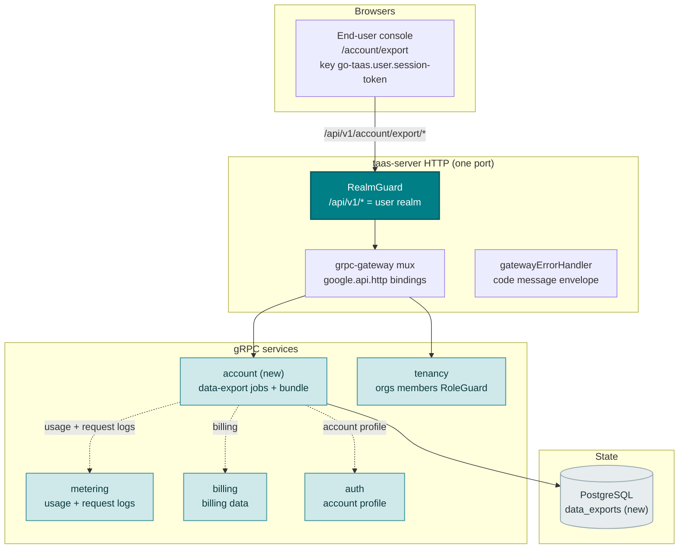
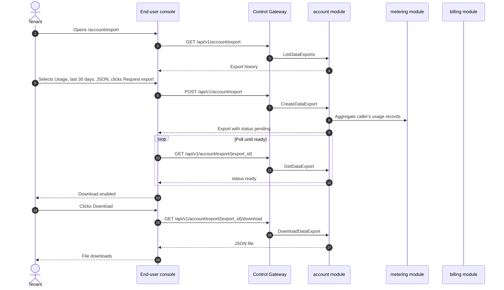
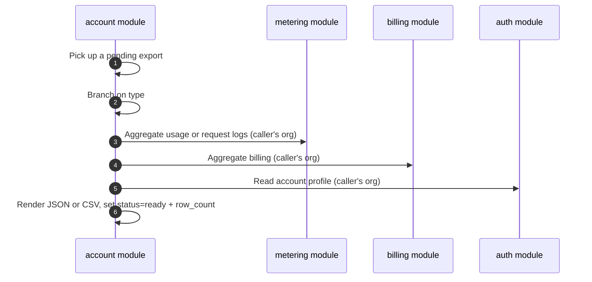

# Data Export & Privacy — Architecture and Detailed Design

| Attribute | Content |
| --- | --- |
| Feature point | Data export & privacy — GDPR-style data export (usage, billing, request logs) and account data download as JSON/CSV (backlog row 41) |
| Document scope | Architecture and detailed design for feature-41: a new `account` module owning the data-export job lifecycle and the account-data bundle; the `taas.account.v1.AccountService` proto with four RPCs; the `data_exports` table; the async export-generation runner; the end-user Data Export page (`/account/export`); plus error handling, configuration, security, rollout, and function-level design per layer |
| Owning modules | New `account` module (`services/account`): the data-export job lifecycle and the account-data bundle; `metering` (read-only: usage and request-log export); `billing` (read-only: billing export); `auth` (read-only: account profile export); `pkg/server` gateway (user-prefix bindings); `web` end-user console (`DataExportPage` in `UserShell`) |
| Related documents | [Requirement Analysis and UI/UX Design](../design/data-export-privacy.md) · [Architecture Design](../design/architecture.md) §2.5 (`metering`), §2.6 (`billing`), §3.1 (admin/user surface separation) · [Billing Reports & CSV Export](./billing-reports.md) (the sibling CSV-export feature and its async-job, Excel-friendly-CSV, and tenant-scoping conventions) · [Audit Logging & Activity Export](./audit-logging.md) (the sibling export feature and its audit-event conventions) · [Console Surface Separation](./console-surface-separation.md) (the end-user surface this page lives on, the `UserShell` conventions, the masked-projection rule) |
| Status | Architecture complete, handed to the Developer agent |

---

## 1. Overview and Goals

go-taas records a tenant's usage (`usage_records`), billing (`bills`, `invoices`), and request logs (`request_logs`) as the platform meters and bills inference (features #4, #5, #8, #12, #14). The billing-reports feature (row 25) lets a tenant download a *billing report* as CSV, but it is a curated, dimensioned report — not a full data-portability export. What the console still cannot do is give a tenant a **complete, machine-readable copy of their own data** — their usage, billing, and request logs, plus their account profile — in a structured format they can take elsewhere. Under GDPR Art. 20 (right to data portability), a data subject has the right to receive their personal data in a structured, commonly used, machine-readable format. go-taas must offer this to its tenants.

This feature adds a **data export & privacy** page: GDPR-style data export (usage, billing, request logs) and account data download as JSON/CSV. It is the smallest independently valuable increment of Phase 4's productionization roadmap item: it turns "I want my data" into "request an export of my usage, billing, request logs, and account profile, and download it as JSON or CSV". It is a **read-only** aggregation and export layer — nothing in the inference, metering, or billing pipelines changes.

**Goals**: a new `account` module owning the data-export job lifecycle and the account-data bundle; the `data_exports` table; a `taas.account.v1.AccountService` with four RPCs (`CreateDataExport`, `ListDataExports`, `GetDataExport`, `DownloadDataExport`); the async export-generation runner; the end-user Data Export page (`/account/export`); new error codes in an account block (125xx); the page → route → API-prefix table with the exact user prefix; per-page interactive states including empty, error, and permission-denied; and numbered acceptance criteria testable in Nightwatch against the compose stack.

**Non-goals** (deferred, design §8): the billing reports & CSV export (row 25 — the curated, dimensioned report builder); audit logging & activity export (row 15); account deletion or erasure (GDPR Art. 17 right to erasure is a separate future feature); an admin-surface data export (deliberately absent, D1).

### 1.1 Reading order of this document

Section 2 records the architecture decisions (AD1–AD7, mirroring the design's D1–D7). Sections 3–5 are the component view, data model, and API design. Section 6 is the frontend architecture (page → route → API-prefix table, auth guard). Sections 7–8 are the sequence flows and error handling. Sections 9–11 are configuration, security, and rollout. Sections 12–14 are the acceptance-criteria traceability, the function-level detailed design, and the ordered implementation task list.

---

## 2. Architecture Decisions

| # | Decision | Rationale |
| --- | --- | --- |
| AD1 | **Data export lives on the end-user surface only**: route `/account/export`, API prefix `/api/v1/account/export/*`. There is **no admin surface** — data export is a tenant's right over their own data (GDPR Art. 20); the operator does not export a tenant's data from the admin console | Design D1. Data export is a tenant self-service right over their own data; the operator's cross-tenant reporting is already covered by billing-reports (row 25) on the admin surface. Consistent with the end-user-only quickstart (feature #21) |
| AD2 | **Exports are generated asynchronously as jobs.** `CreateDataExport` returns an export with `status = pending`; the export becomes `ready` (with a downloadable file) or `failed`. The console polls `GetDataExport` until `ready`, then enables the download | Design D2. Large ranges take time to aggregate; a synchronous export would block or time out. Job-based generation is the universal pattern (Google Takeout, billing-reports D2) and keeps the client responsive |
| AD3 | **An export is defined by a type and a time range.** The type is one of `usage` / `billing` / `request_logs` / `account`. The `usage`, `billing`, and `request_logs` types take a `since`/`until` range (defaults `until = now`, `since = until − 30d`); the `account` type takes no range (it is a point-in-time profile snapshot). The format is `json` or `csv` (CSV only for the tabular types; `account` is always JSON) | Design D3. A per-type export lets a tenant download what they need (pitfall: a full bundle is too large); the range and format follow the billing-reports conventions |
| AD4 | **The export is tenant-scoped and masked.** `CreateDataExport` on the user prefix aggregates only the caller's own organization's usage, billing, request logs, and account profile. It accepts no `organization_id` filter (the caller's org is implicit) and never exposes other tenants' data | Design D4. Follows feature #17's masked-projection rule: a tenant's export must never leak another tenant's data. The end-user surface is the only place a tenant can export their own data |
| AD5 | **The JSON bundle is structured and machine-readable; the CSV is Excel-friendly.** The JSON export is a structured object per type (e.g. `{"usage": [...], "billing": [...], "request_logs": [...], "account": {...}}`). The CSV export is UTF-8 with a BOM, quoted fields, and a header row (the billing-reports D5 convention) | Design D5. GDPR Art. 20 requires a structured, commonly used, machine-readable format; JSON satisfies it. The CSV follows the billing-reports Excel-friendly convention so a tenant can open it in a spreadsheet |
| AD6 | **New error codes in an account block (12501–12599)**: **12501 `CodeDataExportNotFound`**, **12502 `CodeDataExportTypeInvalid`**, **12503 `CodeDataExportFormatInvalid`**, **12504 `CodeDataExportNotReady`**. Range validation reuses **10404** | Design D6. Data export is a new module (AD2), so its codes live in a fresh block after the cluster block (124xx); distinct codes keep each failure mode actionable while the range contract stays uniform with metering |
| AD7 | **Data export is read-only and audited for access and generation.** Export generation is audited (feature #15) as `data_export.created` / `data_export.downloaded`; the underlying usage/billing/request-log writes are already audited by the metering/billing writes. No pipeline changes | Design D7. The feature aggregates existing data and writes only export artifacts; the audit trail (feature #15) already covers the underlying writes, so only the new export actions need new audit events |

---

## 3. Component View

### 3.1 Ownership

| Layer / component | Owns | Changes in this feature |
| --- | --- | --- |
| **Control Gateway (`grpc-gateway`)** | HTTP/JSON facade for the four data-export RPCs; realm guard (feature #17) already rejects a wrong-realm session with 10038; passes `X-Organization-Id` through as gRPC metadata | New bindings for the four HTTP data-export RPCs (Section 5); no change to the realm guard |
| **`account` module (`services/account`)** | The data-export job lifecycle, the account-data bundle, the four RPCs, the export-generation runner | **New module** (AD2) |
| **`metering` module** | Usage and request-log data | Read-only: the account module aggregates the caller's usage and request logs via the metering module (AD4) |
| **`billing` module** | Billing data | Read-only: the account module aggregates the caller's billing via the billing module (AD4) |
| **`auth` module** | Account profile | Read-only: the account module reads the caller's account profile via the auth module (AD4) |
| **`tenancy` module** | Organizations, members, roles, RoleGuard | Read-only: `RoleGuard` gates the data-export RPCs by the caller's role (10036) |
| **PostgreSQL** | `data_exports` (new) | One new table via AutoMigrate (Section 4) |
| **Console** | End-user Data Export page | One new page on the end-user surface (Section 6) |

### 3.2 Runtime component view



### 3.3 Request identity chain

The data-export RPCs are **end-user surface** (AD1). The chain is:

1. `RealmGuard` (HTTP, `pkg/server/realm.go`) — path prefix `/api/v1/account/export/*` decides the expected realm `user`. With no `Authorization` header: pass through (transitional, feature-17 AD4). With a header: resolve the session realm from Redis; mismatch → 10038, unknown/expired/realm-less → 10027.
2. grpc-gateway mux — routes by the annotated path and forwards `authorization` and `x-organization-id`.
3. `account` handler — resolves the caller's role via `tenancy.RoleGuard` (10036). The data-export RPCs are user-realm (AD1); there is no admin binding. The export is hard-scoped to the caller's organization (AD4).
4. `tenancy.RoleGuard` — gates the data-export RPCs by the caller's role (10036).

---

## 4. Data Model

### 4.1 The `data_exports` Table

| Column | PostgreSQL type | Constraints | Description |
| --- | --- | --- | --- |
| `id` | `uuid` | PRIMARY KEY | Server-generated UUID v4, exposed as `export_id` |
| `organization_id` | `varchar(64)` | NOT NULL, index | The owning org (the caller's org, implicit — AD4) |
| `type` | `varchar(16)` | NOT NULL | `usage` / `billing` / `request_logs` / `account` |
| `since` | `bigint` | NOT NULL default 0 | Range start, unix seconds (0 for `account`) |
| `until` | `bigint` | NOT NULL default 0 | Range end, unix seconds (0 for `account`) |
| `format` | `varchar(8)` | NOT NULL | `json` / `csv` (`account` is always `json`) |
| `status` | `varchar(8)` | NOT NULL, index | `pending` / `ready` / `failed` |
| `row_count` | `bigint` | NOT NULL default 0 | Number of data rows in the export |
| `file` | `text` | | The rendered export file (JSON or CSV); NULL until `ready` |
| `error` | `varchar(512)` | NOT NULL default '' | The failure reason when `status = failed` |
| `created_at` | `timestamptz` | NOT NULL | Creation time |

### 4.2 Migration Notes

- The new table is created by GORM `AutoMigrate` on `taas-server` startup (additive; no data migration). `Migrate`/`MigrateSchemaForFVT` gain the new model.
- No init-SQL upgrade path is needed: no existing table changes, and the new table is created automatically on startup.
- The feature reads `usage_records`, `bills`, `invoices`, and `request_logs` (existing) read-only; no index changes are needed on them.

---

## 5. API Design

The data-export RPCs belong to the new **`taas.account.v1.AccountService`** (proto: `proto/taas/account/v1/account.proto`), served as HTTP via the Control Gateway. They are end-user-only (AD1); there is **no admin-prefix binding**.

| RPC | HTTP (user) | HTTP (admin) | Status | Purpose |
| --- | --- | --- | --- | --- |
| `CreateDataExport` | `POST /api/v1/account/export` | — | **new** | Create a data-export job (type, range, format) |
| `ListDataExports` | `GET /api/v1/account/export` | — | **new** | List the caller's export history |
| `GetDataExport` | `GET /api/v1/account/export/{export_id}` | — | **new** | Get an export's status and definition |
| `DownloadDataExport` | `GET /api/v1/account/export/{export_id}/download` | — | **new** | Download the export file when ready |

### 5.1 Proto contract

```protobuf
syntax = "proto3";

package taas.account.v1;

import "google/api/annotations.proto";
import "taas/common/v1/common.proto";

option go_package = "github.com/go-taas/go-taas/proto/taas/account/v1;accountv1";

// AccountService serves the data-export job lifecycle and the
// account-data bundle. End-user surface API: served under
// /api/v1/account/export.
service AccountService {
  // CreateDataExport creates a data-export job (type, range, format)
  // and returns an export with status=pending.
  rpc CreateDataExport(CreateDataExportRequest) returns (CreateDataExportResponse) {
    option (google.api.http) = {post: "/api/v1/account/export"};
  }

  // ListDataExports returns the caller's export history, newest first.
  rpc ListDataExports(ListDataExportsRequest) returns (ListDataExportsResponse) {
    option (google.api.http) = {get: "/api/v1/account/export"};
  }

  // GetDataExport returns an export's status and definition.
  rpc GetDataExport(GetDataExportRequest) returns (GetDataExportResponse) {
    option (google.api.http) = {get: "/api/v1/account/export/{export_id}"};
  }

  // DownloadDataExport returns the export file when status=ready.
  rpc DownloadDataExport(DownloadDataExportRequest) returns (DownloadDataExportResponse) {
    option (google.api.http) = {get: "/api/v1/account/export/{export_id}/download"};
  }
}

message CreateDataExportRequest {
  // type is usage / billing / request_logs / account.
  string type = 1;
  // since/until bound the range, unix seconds. Defaults: until = now,
  // since = until - 30d. Not applicable to account.
  int64 since = 2;
  int64 until = 3;
  // format is json / csv (account is always json).
  string format = 4;
}

message CreateDataExportResponse {
  taas.common.v1.Response response = 1;
  DataExport export = 2;
}

message ListDataExportsRequest {
  taas.common.v1.PageRequest page = 1;
}

message ListDataExportsResponse {
  taas.common.v1.Response response = 1;
  repeated DataExport exports = 2;
  taas.common.v1.PageMeta page_meta = 3;
}

message GetDataExportRequest {
  string export_id = 1;
}

message GetDataExportResponse {
  taas.common.v1.Response response = 1;
  DataExport export = 2;
}

message DownloadDataExportRequest {
  string export_id = 1;
}

message DownloadDataExportResponse {
  taas.common.v1.Response response = 1;
  // file is the rendered export (JSON or CSV).
  string file = 2;
  // content_type is application/json or text/csv.
  string content_type = 3;
  // filename is data-export-<export_id>.json or .csv.
  string filename = 4;
}

message DataExport {
  string export_id = 1;
  // type is usage / billing / request_logs / account.
  string type = 2;
  int64 since = 3;
  int64 until = 4;
  // format is json / csv.
  string format = 5;
  // status is pending / ready / failed.
  string status = 6;
  int64 row_count = 7;
  int64 created_at = 8;
}
```

### 5.2 Contract notes (pinned for the Developer agent)

1. `CreateDataExport` takes `type` (`usage` / `billing` / `request_logs` / `account`), `since`/`until` (int64 unix seconds; defaults `until = now`, `since = until − 30d`; not applicable to `account`), and `format` (`json` / `csv`; `account` is always `json`). It returns an export with `status = pending` (AD2, AD3).
2. `ListDataExports` returns the caller's export history, newest first, with dotted pagination; `GetDataExport` returns the full record including `row_count` (FR2.1, FR2.2).
3. `DownloadDataExport` returns the file when `status = ready`; a download before `ready` returns 12504 (FR2.3).
4. The export is tenant-scoped (AD4): it aggregates only the caller's own organization's data and never exposes other tenants' data.
5. The JSON bundle is structured and machine-readable; the CSV is UTF-8 with a BOM, quoted fields, and a header row (AD5).
6. Wire conventions unchanged: HTTP 200 on success, business errors as `{"code": <int>, "message": "..."}`, int64 fields serialized as JSON strings.

### 5.3 Error codes

Error codes (account block 12501–12599, `pkg/errors/codes.go`):

| Condition | Code | Constant | Notes |
| --- | --- | --- | --- |
| Unknown `export_id` | 12501 | `CodeDataExportNotFound` | **New** (AD6) |
| Invalid `type` | 12502 | `CodeDataExportTypeInvalid` | **New** (AD6) |
| Invalid `format` | 12503 | `CodeDataExportFormatInvalid` | **New** (AD6) |
| Download before `ready` | 12504 | `CodeDataExportNotReady` | **New** (AD6) |
| Invalid range (`since > until` or > 92 days) | 10404 | `CodeMeteringRangeInvalid` | Reused — the metering range contract (AD6) |
| Database / infrastructure failure | 500 | `CodeInternal` | Via error normalization |

---

## 6. Frontend Architecture

### 6.1 Page → Route → API-prefix table

| Page / component | Surface | Web route | API prefix | Auth guard |
| --- | --- | --- | --- | --- |
| **Data Export page** | end-user | `/account/export` | `/api/v1/account/export`, `/api/v1/account/export/{export_id}`, `/api/v1/account/export/{export_id}/download` | user session; RoleGuard (user role) |

> The end-user Data Export page calls only `/api/v1/account/export/*` routes; there is no admin surface (AD1). The page contains no `/api/v1/admin/*` string (feature #17).

### 6.2 Navigation placement

- **End-user console**: a new **Data export** item (`/account/export`, testid `user-nav-data-export`) in the `UserShell` navigation, in the account group alongside Settings.

### 6.3 Shared components and state to reuse

- **API client** (`web/src/api.ts`): the realm-scoped client (`createApi(realm)`) already sends `Authorization: Bearer <realm>.session-token` and `X-Organization-Id` (only when the realm token key is empty). The Data Export page reuses it unchanged; no new client is added.
- **Async-job polling**: the `usePolling` hook (used by the billing reports) is reused to poll `GetDataExport` until `ready` (AD2).
- **Time-range control**: the shared preset control (24 h / 7 d / 30 d / 90 d / custom with a date-time picker) is reused for the tabular types (AD3).
- **Status badge**: the shared `StateBadge` component renders the pending / ready / failed badge.
- **Empty state / data-freshness note**: the Request Logs page pattern (a note that exports appear after creation) is reused.

### 6.4 Auth guard per surface

- **End-user Data Export page** (`/account/export`): rendered inside `UserShell`, which runs the user session guard when `go-taas.user.session-token` is non-empty; a missing/expired session redirects to `/login?reason=expired`; a wrong-realm session is rejected by the gateway with 10038. The page's API calls go to `/api/v1/account/export/*`. A session without the required role receives 10036 and the page shows the standard permission-denied state (feature #17).
- **Unauthenticated visitors**: an unauthenticated visitor to the page is redirected to `/login` by the shell guard.

### 6.5 Console contract (pinned for the Developer agent)

**Data Export page** (`/account/export`): a page header ("Data export", subtitle "Download a copy of your usage, billing, request logs, and account data") with a **New export** primary action (`export-new`). Below: an **export builder** panel (`export-builder`) with fields **Type** (radio: Usage / Billing / Request logs / Account, `export-type-{type}`), **Time range** (`export-range`, presets + custom; hidden for Account), and **Format** (radio: JSON / CSV, `export-format-{format}`; CSV disabled for Account), with a **Request export** primary action (`export-request`) and a **Cancel** secondary action; and an **export history** table (`export-history`, `export-row-{id}`) with columns Type, Range, Format, Status, Rows, Created, Actions, with row actions **Download** (`export-download-{id}`, enabled when `status = ready`) and **View** (`export-view-{id}`), and a **Refresh** action (`export-refresh`) above the table. Sortable by Type, Status, Rows, and Created; filterable by Type and Status; paginated (dotted pagination). Empty state: "No exports yet." with a hint to request one; the builder stays visible. Error state: an error banner with a Retry button and a "Showing stale data" banner. Permission-denied: the standard state with a link back to the user home.

---

## 7. Sequence Flows

### 7.1 Create and download a data export



### 7.2 Export generation (runner)



---

## 8. Error Handling

All errors are `pkg/errors` business codes in the unified envelope (Section 5.3). The account module's writes are the export artifacts; a generation failure surfaces as a `failed` export with an `error`, not as an RPC error. A database failure is normalized to 500 `CodeInternal`.

The console branches on the body `code` (as `web/src/api.ts` already does), never on the HTTP status. The new codes 12501–12504 render specific inline messages. The end-user page maps 10036 to the standard permission-denied state (feature #17 §8.2).

---

## 9. Configuration Additions

| Key | Default | Description |
| --- | --- | --- |
| `account.export.generatorInterval` | `5s` | The export-generation runner's tick interval (AD2) |
| `account.export.maxRangeSeconds` | `7948800` | The maximum range (92 days); a longer range returns 10404 (AD6) |

The `account.export` config block is new in `pkg/config` (`AccountExportConfig`), following the `billing.reports` block pattern. `applyDefaults`/`Validate` set the defaults above. The account module reads `generatorInterval` and `maxRangeSeconds`. No MQ subjects are added — the export-generation runner is an in-process `server.Runner` (the billing-reports generator pattern).

---

## 10. Security Considerations

- **End-user-only surface**: the Data Export page lives on the end-user surface only (AD1); there is no admin surface. The realm guard rejects a wrong-realm session with 10038 before any handler runs (feature #17).
- **User role gated**: the data-export RPCs are gated by `tenancy.RoleGuard` — only a caller with the required user role can export their own data; an inaccessible org returns 10036.
- **Tenant-scoped and masked**: the export aggregates only the caller's own organization's data and never exposes other tenants' data (AD4). The caller's org is implicit; no `organization_id` filter is accepted.
- **Read-only by construction**: the account module issues only reads of the existing usage/billing/request-log data and writes only export artifacts (AD7). The audit trail (feature #15) covers the export actions (`data_export.created` / `data_export.downloaded`).

---

## 11. Rollout / Upgrade Notes

- **One new table**: `data_exports` is created by `AutoMigrate` on `taas-server` startup; no data migration, no init-SQL upgrade path.
- **The proto change is additive**: four new RPCs on a new `AccountService`; no existing RPC or message changes. The gateway mux gains the new bindings; the realm guard is unchanged.
- **Console**: the new page is added to the existing bundle; the `UserShell` nav gains Data export. No existing route changes.
- **Backward compatibility**: the transitional (session-less, `X-Organization-Id`) path is preserved for the CLI, FVT, and e2e suites; the realm guard passes through requests without an `Authorization` header (feature #17 AD4).
- **Empty until data exists**: the RPCs return empty lists until exports exist; the page renders the empty state.

---

## 12. Acceptance-Criteria Traceability

| # | Criterion | Where addressed |
| --- | --- | --- |
| AC1 | `CreateDataExport` returns an export with `status = pending`; an invalid `type` returns 12502, an invalid `format` returns 12503, and an invalid range returns 10404 | §5.1, §5.2, §7.1 |
| AC2 | `ListDataExports` returns the caller's export history newest first; `GetDataExport` returns the full record; an unknown `export_id` returns 12501 | §5.1, §5.2 |
| AC3 | `DownloadDataExport` returns the file when `status = ready`; a download before `ready` returns 12504 | §5.1, §5.2 |
| AC4 | The export is tenant-scoped: it aggregates only the caller's own organization's data and never exposes other tenants' data | §5.2, §10 |
| AC5 | The `/account/export` page renders the export builder and the export history from the first successful load, with the New export action | §6.5 |
| AC6 | The export builder validates the type, format, and time range and creates an export that appears with `status = pending`, then polls to `ready` and enables Download | §6.5, §7.1 |
| AC7 | The data export page is reachable only on the end-user surface: route `/account/export`, every API call uses the `/api/v1/account/export/*` prefix with no `/api/v1/admin/*` string | §6.1, §6.4, §10 |
| AC8 | A session without the required role receives 10036 on the `/account/export` page and the page shows the standard permission-denied state | §3.3, §6.4, §10 |

---

## 13. Detailed Design (function-level responsibilities per layer)

### 13.1 Proto → service → repository → runner

| Layer | File | Responsibilities |
| --- | --- | --- |
| `proto/taas/account/v1` | `account.proto` | New: `AccountService` with four RPCs + request/response messages, `DataExport` (Section 5.1). Regenerate `account.pb.go`/`account_grpc.pb.go`/`account.pb.gw.go` via `buf generate` |
| `services/account` | `export_model.go` | GORM model `DataExport` + `TableName`; the `type`/`format`/`status` constants (AD3) |
| | `export_repository.go` | `CreateExport`, `FindExportByID`, `ListExports`, `UpdateExportStatus` (pending→ready/failed, one tx: set status + row_count + file + error) |
| | `export_service.go` | The four RPCs; the type/format/range validation (12502/12503/10404); the tenant-scope resolution (AD4); the audit events (`data_export.created` / `data_export.downloaded`, AD7); the `RoleGuard` seam (10036) |
| | `export_generator_runner.go` | `ExportGeneratorRunner` (server.Runner, ticker) + `RunOnce(ctx)` extracted for tests; picks up `pending` exports, aggregates the caller's usage/billing/request logs/account profile via the metering/billing/auth modules, renders the JSON or CSV, and marks `ready`/`failed` (AD2, AD5) |
| | `export_render.go` | `renderJSON(export, rows)` and `renderCSV(export, rows)` — the structured JSON and the UTF-8-BOM, quoted-field CSV renderers (AD5) |
| `services/metering` | `service.go` | Read-only: expose narrow reads `ListUsageForExport(ctx, orgID, since, until)` and `ListRequestLogsForExport(ctx, orgID, since, until)` for the account module (AD4) |
| `services/billing` | `service.go` | Read-only: expose a narrow read `ListBillingForExport(ctx, orgID, since, until)` for the account module (AD4) |
| `services/auth` | `service.go` | Read-only: expose a narrow read `GetAccountProfileForExport(ctx, orgID)` for the account module (AD4) |
| `pkg/errors` | `codes.go`/`messages.go` | `CodeDataExportNotFound` (12501), `CodeDataExportTypeInvalid` (12502), `CodeDataExportFormatInvalid` (12503), `CodeDataExportNotReady` (12504) constants + canonical messages (AD6) |
| `pkg/config` | `api.go`/`configuration.go` | `AccountExportConfig` + `generatorInterval`/`maxRangeSeconds` (Section 9) + `applyDefaults`/`Validate` |
| `apps/taas-server` | `main.go` | Register the new `AccountService`; wire the `tenancy` RoleGuard into the account service; start the export-generation runner after `srv.Init()` |
| `web/src` | `pages/DataExportPage.tsx`, `App.tsx`, `api.ts`, `shells/UserShell.tsx` | Route `/account/export`; the four RPC API types and calls; nav item (Section 6.5) |
| `test` | `fvt/data_export_fvt_test.go`, `e2e/tests/dataExport.js` | Section 14 |

### 13.2 Which React page/module implements each screen

| Screen | React module | Route | API calls |
| --- | --- | --- | --- |
| Data Export page (end-user) | `web/src/pages/DataExportPage.tsx` | `/account/export` | `CreateDataExport`, `ListDataExports`, `GetDataExport`, `DownloadDataExport` |

---

## 14. Testing Strategy

- **Unit** (`services/account`, sqlite in-memory): `export_repository_test.go` — `CreateExport`/`FindExportByID`/`ListExports`/`UpdateExportStatus` (AC1, AC2). `export_service_test.go` — the four RPCs; the type/format/range validation returns 12502/12503/10404 (AC1); the tenant-scope resolution (AC4); user org scoping returns 10036 (AC8). `export_generator_runner_test.go` — `RunOnce` aggregates the caller's data and marks `ready`/`failed` (AC1, AC4). Coverage ≥ 80% on the new files.
- **FVT** (`test/fvt/data_export_fvt_test.go`, the billing-reports FVT pattern: file-backed sqlite + `MigrateSchemaForFVT` + `NewForFVT` + gRPC server with the production interceptor + gateway mux with `FVTHeaderMatcher`): seed usage/billing/request-log rows, then assert `CreateDataExport` returns `status=pending` (AC1), `ListDataExports`/`GetDataExport` return the records (AC2), `DownloadDataExport` returns the file when `ready` and 12504 before (AC3), and the export is tenant-scoped (AC4).
- **E2E** (`test/e2e/tests/dataExport.js`, the `billingReports.js` pattern): against the compose stack — the `/account/export` page renders the export builder and the export history from the first successful load (AC5); the export builder validates and creates an export that appears with `status = pending`, then polls to `ready` and enables Download (AC6); the page calls only `/api/v1/account/export/*` routes and an unauthenticated visitor is redirected to `/login` (AC7); a session without the required role receives 10036 and shows the permission-denied state (AC8).