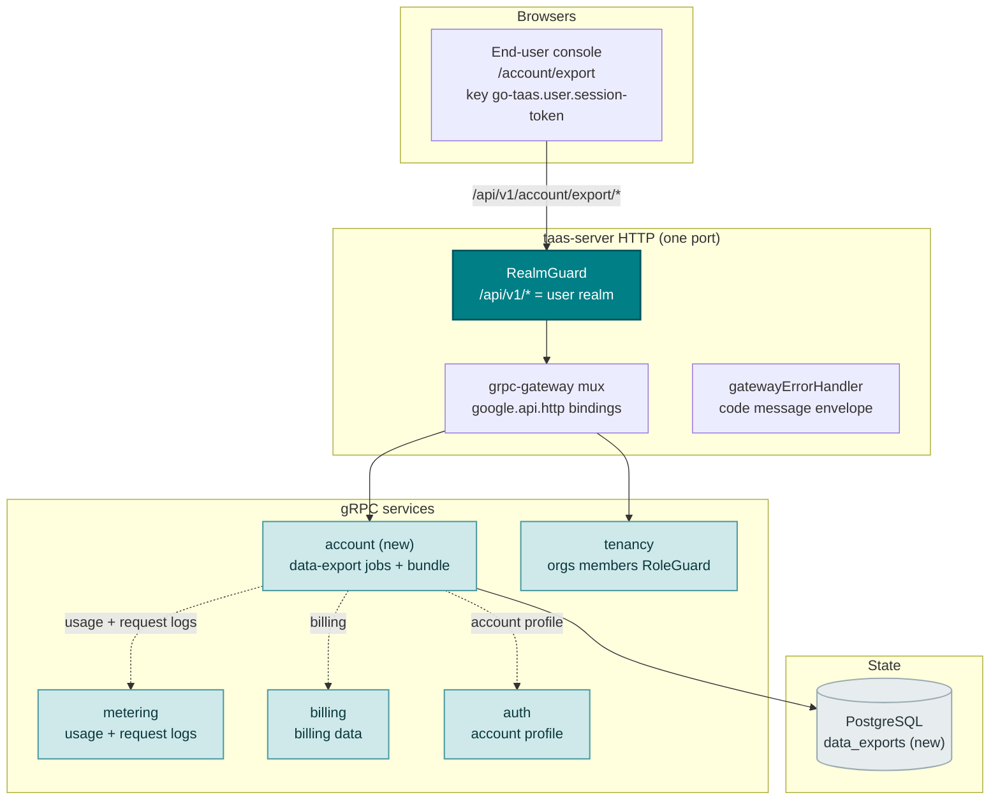
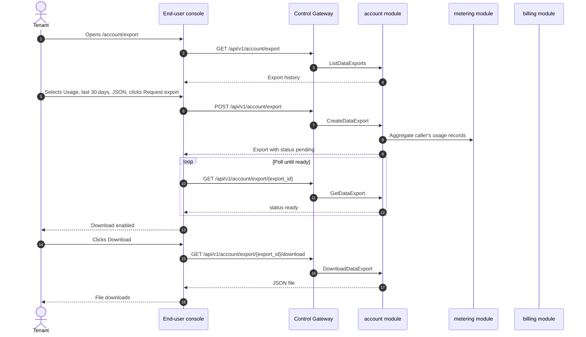
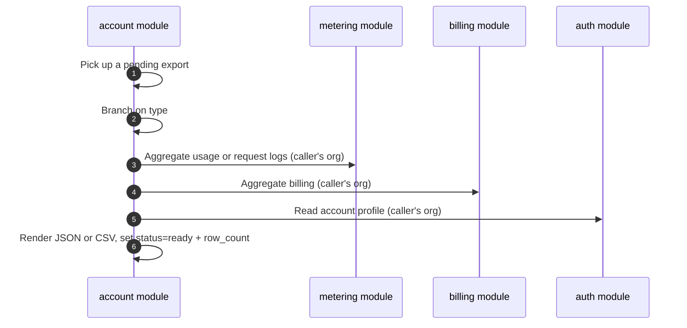

# 数据导出与隐私 — 架构与详细设计

| 属性 | 内容 |
| --- | --- |
| 功能点 | 数据导出与隐私 — GDPR 风格数据导出（用量、计费、请求日志）与账户数据以 JSON/CSV 下载（backlog 第 41 行） |
| 文档范围 | 功能 41 的架构与详细设计：新的 `account` 模块，负责数据导出任务生命周期与账户数据包；`taas.account.v1.AccountService` proto 及四个 RPC；`data_exports` 表；异步导出生成 runner；用户端数据导出页面（`/account/export`）；以及错误处理、配置、安全、上线与各层函数级设计 |
| 所属模块 | 新 `account` 模块（`services/account`）：数据导出任务生命周期与账户数据包；`metering`（只读：用量与请求日志导出）；`billing`（只读：计费导出）；`auth`（只读：账户资料导出）；`pkg/server` 网关（用户前缀绑定）；`web` 用户端控制台（`UserShell` 中的 `DataExportPage`） |
| 相关文档 | [需求分析与 UI/UX 设计](../design/data-export-privacy.md) · [架构设计](../design/architecture.md) §2.5（`metering`）、§2.6（`billing`）、§3.1（管理端/用户端面分离）· [计费报表与 CSV 导出](./billing-reports.md)（同类 CSV 导出功能及其异步任务、Excel 友好 CSV、租户作用域约定）· [审计日志与活动导出](./audit-logging.md)（同类导出功能及其审计事件约定）· [控制台面分离](./console-surface-separation.md)（本页面所在的用户端面、`UserShell` 约定、掩码投影规则） |
| 状态 | 架构完成，已移交给 Developer 智能体 |

---

## 1. 概述与目标

go-taas 在平台计量与计费推理时记录租户的用量（`usage_records`）、计费（`bills`、`invoices`）与请求日志（`request_logs`）（功能 #4、#5、#8、#12、#14）。计费报表功能（第 25 行）让租户以 CSV 下载*计费报表*，但它是精选、维度化的报表 —— 而非完整的数据可移植性导出。而控制台仍无法给租户一份**完整、机器可读的自身数据副本** —— 其用量、计费与请求日志，加上账户资料 —— 以可带往他处的结构化格式。依据 GDPR 第 20 条（数据可移植权），数据主体有权以结构化、常用、机器可读的格式接收其个人数据。go-taas 必须向其租户提供此能力。

本功能新增一个**数据导出与隐私**页面：GDPR 风格数据导出（用量、计费、请求日志）与账户数据以 JSON/CSV 下载。它是 Phase 4 生产化路线图最小且有独立价值的增量：把"我想要我的数据"变成"请求导出我的用量、计费、请求日志与账户资料，并以 JSON 或 CSV 下载"。这是一个**只读**聚合与导出层 —— 推理、计量或计费管线均无改动。

**目标**：新的 `account` 模块，负责数据导出任务生命周期与账户数据包；`data_exports` 表；`taas.account.v1.AccountService` 及四个 RPC（`CreateDataExport`、`ListDataExports`、`GetDataExport`、`DownloadDataExport`）；异步导出生成 runner；用户端数据导出页面（`/account/export`）；account 块（125xx）的新错误码；页面 → 路由 → API 前缀表（精确用户前缀）；各页面交互状态（空、错误、权限拒绝）；以及可在 compose 栈上以 Nightwatch 测试的编号验收标准。

**非目标**（延后，设计 §8）：计费报表与 CSV 导出（第 25 行 —— 精选、维度化报表构建器）；审计日志与活动导出（第 15 行）；账户删除或擦除（GDPR 第 17 条删除权是独立的未来功能）；管理端数据导出（刻意不引入，D1）。

### 1.1 本文档阅读顺序

第 2 节记录架构决策（AD1–AD7，对应设计的 D1–D7）。第 3–5 节为组件视图、数据模型与 API 设计。第 6 节为前端架构（页面 → 路由 → API 前缀表、认证守卫）。第 7–8 节为时序流程与错误处理。第 9–11 节为配置、安全与上线。第 12–14 节为验收标准追溯、函数级详细设计与有序实现任务清单。

---

## 2. 架构决策

| # | 决策 | 理由 |
| --- | --- | --- |
| AD1 | **数据导出仅存在于用户端面**：路由 `/account/export`，API 前缀 `/api/v1/account/export/*`。**无管理端面** —— 数据导出是租户对自身数据的权利（GDPR 第 20 条）；运维人员不从管理端控制台导出租户数据 | 设计 D1。数据导出是租户对自身数据的自助权利；运维人员的跨租户报表已由管理端面的计费报表（第 25 行）覆盖。与仅用户端的快速入门（功能 #21）一致 |
| AD2 | **导出以任务形式异步生成。** `CreateDataExport` 返回 `status = pending` 的导出；导出变为 `ready`（含可下载文件）或 `failed`。控制台轮询 `GetDataExport` 直至 `ready`，然后启用下载 | 设计 D2。大范围聚合耗时；同步导出会阻塞或超时。基于任务的生成是通用模式（Google Takeout、billing-reports D2），并保持客户端响应 |
| AD3 | **导出由类型与时间范围定义。** 类型为 `usage` / `billing` / `request_logs` / `account` 之一。`usage`、`billing` 与 `request_logs` 类型接受 `since`/`until` 范围（默认 `until = now`、`since = until − 30d`）；`account` 类型不接受范围（它是点状资料快照）。格式为 `json` 或 `csv`（CSV 仅用于表格类型；`account` 始终为 JSON） | 设计 D3。按类型导出让租户下载所需内容（陷阱：完整包过大）；范围与格式遵循计费报表约定 |
| AD4 | **导出为租户作用域且掩码。** 用户前缀上的 `CreateDataExport` 仅聚合调用者自身组织的用量、计费、请求日志与账户资料。它不接受 `organization_id` 筛选（调用者组织隐式），绝不含其他租户数据 | 设计 D4。遵循功能 #17 的掩码投影规则：租户导出绝不得泄露其他租户数据。用户端面是租户导出自身数据的唯一场所 |
| AD5 | **JSON 包结构化且机器可读；CSV 为 Excel 友好。** JSON 导出是按类型的结构化对象（如 `{"usage": [...], "billing": [...], "request_logs": [...], "account": {...}}`）。CSV 导出为带 BOM 的 UTF-8、带引号字段与表头行（billing-reports D5 约定） | 设计 D5。GDPR 第 20 条要求结构化、常用、机器可读格式；JSON 满足它。CSV 遵循 billing-reports 的 Excel 友好约定，使租户可在电子表格中打开 |
| AD6 | **新错误码在 account 块（12501–12599）**：**12501 `CodeDataExportNotFound`**、**12502 `CodeDataExportTypeInvalid`**、**12503 `CodeDataExportFormatInvalid`**、**12504 `CodeDataExportNotReady`**。范围校验复用 **10404** | 设计 D6。数据导出是新模块（AD2），因此其错误码位于 cluster 块（124xx）之后的空白块；区分错误码使每种失败模式可操作，而范围契约与计量保持统一 |
| AD7 | **数据导出只读且对访问与生成审计。** 导出生成被审计（功能 #15）为 `data_export.created` / `data_export.downloaded`；底层用量/计费/请求日志写入已由计量/计费写入审计。无管线变更 | 设计 D7。本功能聚合既有数据并仅写入导出制品；审计轨迹（功能 #15）已覆盖底层写入，因此仅新导出操作需要新审计事件 |

---

## 3. 组件视图

### 3.1 归属

| 层 / 组件 | 拥有 | 本功能变更 |
| --- | --- | --- |
| **控制网关（`grpc-gateway`）** | 四个数据导出 RPC 的 HTTP/JSON 门面；域守卫（功能 #17）已以 10038 拒绝错误域会话；将 `X-Organization-Id` 作为 gRPC 元数据透传 | 新增四个 HTTP 数据导出 RPC 绑定（第 5 节）；域守卫不变 |
| **`account` 模块（`services/account`）** | 数据导出任务生命周期、账户数据包、四个 RPC、导出生成 runner | **新模块**（AD2） |
| **`metering` 模块** | 用量与请求日志数据 | 只读：account 模块经 metering 模块聚合调用者的用量与请求日志（AD4） |
| **`billing` 模块** | 计费数据 | 只读：account 模块经 billing 模块聚合调用者的计费（AD4） |
| **`auth` 模块** | 账户资料 | 只读：account 模块经 auth 模块读取调用者的账户资料（AD4） |
| **`tenancy` 模块** | 组织、成员、角色、RoleGuard | 只读：`RoleGuard` 按调用者角色门控数据导出 RPC（10036） |
| **PostgreSQL** | `data_exports`（新） | 一张新表，经 AutoMigrate（第 4 节） |
| **控制台** | 用户端数据导出页面 | 用户端面新增一页（第 6 节） |

### 3.2 运行时组件视图



### 3.3 请求身份链

数据导出 RPC 为**用户端面**（AD1）。链路如下：

1. `RealmGuard`（HTTP，`pkg/server/realm.go`）—— 路径前缀 `/api/v1/account/export/*` 决定期望域 `user`。无 `Authorization` 头：透传（过渡期，feature-17 AD4）。有头：从 Redis 解析会话域；不匹配 → 10038，未知/过期/无域 → 10027。
2. grpc-gateway mux —— 按注解路径路由并透传 `authorization` 与 `x-organization-id`。
3. `account` 处理器 —— 经 `tenancy.RoleGuard` 解析调用者角色（10036）。数据导出 RPC 为用户域（AD1）；无管理端绑定。导出硬作用域到调用者组织（AD4）。
4. `tenancy.RoleGuard` —— 按调用者角色门控数据导出 RPC（10036）。

---

## 4. 数据模型

### 4.1 `data_exports` 表

| 列 | PostgreSQL 类型 | 约束 | 描述 |
| --- | --- | --- | --- |
| `id` | `uuid` | PRIMARY KEY | 服务端生成的 UUID v4，暴露为 `export_id` |
| `organization_id` | `varchar(64)` | NOT NULL, index | 所属组织（调用者组织，隐式 —— AD4） |
| `type` | `varchar(16)` | NOT NULL | `usage` / `billing` / `request_logs` / `account` |
| `since` | `bigint` | NOT NULL default 0 | 范围起始，unix 秒（`account` 为 0） |
| `until` | `bigint` | NOT NULL default 0 | 范围结束，unix 秒（`account` 为 0） |
| `format` | `varchar(8)` | NOT NULL | `json` / `csv`（`account` 始终为 `json`） |
| `status` | `varchar(8)` | NOT NULL, index | `pending` / `ready` / `failed` |
| `row_count` | `bigint` | NOT NULL default 0 | 导出中的数据行数 |
| `file` | `text` | | 渲染的导出文件（JSON 或 CSV）；`ready` 前为 NULL |
| `error` | `varchar(512)` | NOT NULL default '' | `status = failed` 时的失败原因 |
| `created_at` | `timestamptz` | NOT NULL | 创建时间 |

### 4.2 迁移说明

- 新表由 GORM `AutoMigrate` 在 `taas-server` 启动时创建（增量；无数据迁移）。`Migrate`/`MigrateSchemaForFVT` 增加新模型。
- 无需 init-SQL 升级路径：无既有表变更，新表在启动时自动创建。
- 本功能只读读取 `usage_records`、`bills`、`invoices` 与 `request_logs`（既有）；无需对其做索引变更。

---

## 5. API 设计

数据导出 RPC 属于新的 **`taas.account.v1.AccountService`**（proto：`proto/taas/account/v1/account.proto`），经控制网关以 HTTP 提供。仅用户端（AD1）；**无管理端前缀绑定**。

| RPC | HTTP（用户端） | HTTP（管理端） | 状态 | 用途 |
| --- | --- | --- | --- | --- |
| `CreateDataExport` | `POST /api/v1/account/export` | — | **新** | 创建数据导出任务（类型、范围、格式） |
| `ListDataExports` | `GET /api/v1/account/export` | — | **新** | 列出调用者的导出历史 |
| `GetDataExport` | `GET /api/v1/account/export/{export_id}` | — | **新** | 获取导出的状态与定义 |
| `DownloadDataExport` | `GET /api/v1/account/export/{export_id}/download` | — | **新** | 就绪时下载导出文件 |

### 5.1 Proto 契约

```protobuf
syntax = "proto3";

package taas.account.v1;

import "google/api/annotations.proto";
import "taas/common/v1/common.proto";

option go_package = "github.com/go-taas/go-taas/proto/taas/account/v1;accountv1";

// AccountService serves the data-export job lifecycle and the
// account-data bundle. End-user surface API: served under
// /api/v1/account/export.
service AccountService {
  // CreateDataExport creates a data-export job (type, range, format)
  // and returns an export with status=pending.
  rpc CreateDataExport(CreateDataExportRequest) returns (CreateDataExportResponse) {
    option (google.api.http) = {post: "/api/v1/account/export"};
  }

  // ListDataExports returns the caller's export history, newest first.
  rpc ListDataExports(ListDataExportsRequest) returns (ListDataExportsResponse) {
    option (google.api.http) = {get: "/api/v1/account/export"};
  }

  // GetDataExport returns an export's status and definition.
  rpc GetDataExport(GetDataExportRequest) returns (GetDataExportResponse) {
    option (google.api.http) = {get: "/api/v1/account/export/{export_id}"};
  }

  // DownloadDataExport returns the export file when status=ready.
  rpc DownloadDataExport(DownloadDataExportRequest) returns (DownloadDataExportResponse) {
    option (google.api.http) = {get: "/api/v1/account/export/{export_id}/download"};
  }
}

message CreateDataExportRequest {
  // type is usage / billing / request_logs / account.
  string type = 1;
  // since/until bound the range, unix seconds. Defaults: until = now,
  // since = until - 30d. Not applicable to account.
  int64 since = 2;
  int64 until = 3;
  // format is json / csv (account is always json).
  string format = 4;
}

message CreateDataExportResponse {
  taas.common.v1.Response response = 1;
  DataExport export = 2;
}

message ListDataExportsRequest {
  taas.common.v1.PageRequest page = 1;
}

message ListDataExportsResponse {
  taas.common.v1.Response response = 1;
  repeated DataExport exports = 2;
  taas.common.v1.PageMeta page_meta = 3;
}

message GetDataExportRequest {
  string export_id = 1;
}

message GetDataExportResponse {
  taas.common.v1.Response response = 1;
  DataExport export = 2;
}

message DownloadDataExportRequest {
  string export_id = 1;
}

message DownloadDataExportResponse {
  taas.common.v1.Response response = 1;
  // file is the rendered export (JSON or CSV).
  string file = 2;
  // content_type is application/json or text/csv.
  string content_type = 3;
  // filename is data-export-<export_id>.json or .csv.
  string filename = 4;
}

message DataExport {
  string export_id = 1;
  // type is usage / billing / request_logs / account.
  string type = 2;
  int64 since = 3;
  int64 until = 4;
  // format is json / csv.
  string format = 5;
  // status is pending / ready / failed.
  string status = 6;
  int64 row_count = 7;
  int64 created_at = 8;
}
```

### 5.2 契约说明（为 Developer 智能体固定）

1. `CreateDataExport` 接受 `type`（`usage` / `billing` / `request_logs` / `account`）、`since`/`until`（int64 unix 秒；默认 `until = now`、`since = until − 30d`；`account` 不适用）与 `format`（`json` / `csv`；`account` 始终为 `json`）。返回 `status = pending` 的导出（AD2、AD3）。
2. `ListDataExports` 返回调用者的导出历史，最新在前，带点式分页；`GetDataExport` 返回含 `row_count` 的完整记录（FR2.1、FR2.2）。
3. `DownloadDataExport` 在 `status = ready` 时返回文件；`ready` 前下载返回 12504（FR2.3）。
4. 导出为租户作用域（AD4）：仅聚合调用者自身组织的数据，绝不含其他租户数据。
5. JSON 包结构化且机器可读；CSV 为带 BOM 的 UTF-8、带引号字段与表头行（AD5）。
6. 线上约定不变：成功 HTTP 200，业务错误为 `{"code": <int>, "message": "..."}`，int64 字段序列化为 JSON 字符串。

### 5.3 错误码

错误码（account 块 12501–12599，`pkg/errors/codes.go`）：

| 条件 | 码 | 常量 | 说明 |
| --- | --- | --- | --- |
| 未知 `export_id` | 12501 | `CodeDataExportNotFound` | **新**（AD6） |
| 无效 `type` | 12502 | `CodeDataExportTypeInvalid` | **新**（AD6） |
| 无效 `format` | 12503 | `CodeDataExportFormatInvalid` | **新**（AD6） |
| `ready` 前下载 | 12504 | `CodeDataExportNotReady` | **新**（AD6） |
| 无效范围（`since > until` 或 > 92 天） | 10404 | `CodeMeteringRangeInvalid` | 复用 —— 计量范围契约（AD6） |
| 数据库 / 基础设施故障 | 500 | `CodeInternal` | 经错误归一化 |

---

## 6. 前端架构

### 6.1 页面 → 路由 → API 前缀表

| 页面 / 组件 | 面 | Web 路由 | API 前缀 | 认证守卫 |
| --- | --- | --- | --- | --- |
| **数据导出页面** | 用户端 | `/account/export` | `/api/v1/account/export`、`/api/v1/account/export/{export_id}`、`/api/v1/account/export/{export_id}/download` | 用户会话；RoleGuard（用户角色） |

> 用户端数据导出页面仅调用 `/api/v1/account/export/*` 路由；无管理端面（AD1）。页面不含 `/api/v1/admin/*` 字符串（功能 #17）。

### 6.2 导航位置

- **用户端控制台**：`UserShell` 导航新增 **Data export** 项（`/account/export`，testid `user-nav-data-export`），位于账户分组，紧邻 Settings。

### 6.3 复用的共享组件与状态

- **API 客户端**（`web/src/api.ts`）：域作用域客户端（`createApi(realm)`）已发送 `Authorization: Bearer <realm>.session-token` 与 `X-Organization-Id`（仅当域 token 键为空时）。数据导出页面原样复用；不新增客户端。
- **异步任务轮询**：复用 `usePolling` 钩子（billing reports 使用）轮询 `GetDataExport` 直至 `ready`（AD2）。
- **时间范围控件**：复用共享预设控件（24 h / 7 d / 30 d / 90 d / 自定义 + 日期时间选择器）用于表格类型（AD3）。
- **状态徽标**：共享 `StateBadge` 组件渲染 pending / ready / failed 徽标。
- **空状态 / 数据新鲜度提示**：复用 Request Logs 页面模式（提示导出在创建后出现）。

### 6.4 各面认证守卫

- **用户端数据导出页面**（`/account/export`）：在 `UserShell` 内渲染，当 `go-taas.user.session-token` 非空时运行用户会话守卫；缺失/过期会话重定向到 `/login?reason=expired`；错误域会话被网关以 10038 拒绝。页面 API 调用指向 `/api/v1/account/export/*`。无所需角色的会话收到 10036，页面显示标准权限拒绝状态（功能 #17）。
- **未认证访客**：未认证访客被 shell 守卫重定向到 `/login`。

### 6.5 控制台契约（为 Developer 智能体固定）

**数据导出页面**（`/account/export`）：页面头部（"Data export"，副标题 "Download a copy of your usage, billing, request logs, and account data"），带 **New export** 主操作（`export-new`）。下方：**导出构建器**面板（`export-builder`），字段为 **Type**（单选：Usage / Billing / Request logs / Account，`export-type-{type}`）、**Time range**（`export-range`，预设 + 自定义；Account 隐藏）与 **Format**（单选：JSON / CSV，`export-format-{format}`；Account 禁用 CSV），带 **Request export** 主操作（`export-request`）与 **Cancel** 次要操作；以及**导出历史**表（`export-history`、`export-row-{id}`），列为类型、范围、格式、状态、行数、创建时间、操作，行操作为 **Download**（`export-download-{id}`，`status = ready` 时启用）与 **View**（`export-view-{id}`），表上方有 **Refresh** 操作（`export-refresh`）。可按类型、状态、行数、创建时间排序；可按类型与状态筛选；分页（点式分页）。空状态："No exports yet."，提示请求导出；构建器保持可见。错误状态：错误横幅 + Retry 按钮 + "Showing stale data" 横幅。权限拒绝：标准状态，带返回用户首页的链接。

---

## 7. 时序流程

### 7.1 创建并下载数据导出



### 7.2 导出生成（runner）



---

## 8. 错误处理

所有错误均为统一信封中的 `pkg/errors` 业务码（第 5.3 节）。account 模块的写入是导出制品；生成失败以 `failed` 导出及 `error` 呈现，而非 RPC 错误。数据库故障归一化为 500 `CodeInternal`。

控制台按 body `code` 分支（`web/src/api.ts` 已如此），绝不按 HTTP 状态。新码 12501–12504 渲染特定内联消息。用户端页面将 10036 映射为标准权限拒绝状态（功能 #17 §8.2）。

---

## 9. 配置新增

| 键 | 默认 | 描述 |
| --- | --- | --- |
| `account.export.generatorInterval` | `5s` | 导出生成 runner 的 tick 间隔（AD2） |
| `account.export.maxRangeSeconds` | `7948800` | 最大范围（92 天）；更长范围返回 10404（AD6） |

`account.export` 配置块在 `pkg/config` 中新增（`AccountExportConfig`），遵循 `billing.reports` 块模式。`applyDefaults`/`Validate` 设置上述默认值。account 模块读取 `generatorInterval` 与 `maxRangeSeconds`。不新增 MQ subject —— 导出生成 runner 是进程内 `server.Runner`（billing-reports 生成器模式）。

---

## 10. 安全考量

- **仅用户端面**：数据导出页面仅存在于用户端面（AD1）；无管理端面。域守卫在任何处理器运行前以 10038 拒绝错误域会话（功能 #17）。
- **用户角色门控**：数据导出 RPC 由 `tenancy.RoleGuard` 门控 —— 仅有所需用户角色的调用者可导出自身数据；不可访问的组织返回 10036。
- **租户作用域且掩码**：导出仅聚合调用者自身组织的数据，绝不含其他租户数据（AD4）。调用者组织隐式；不接受 `organization_id` 筛选。
- **构造性只读**：account 模块仅对既有用量/计费/请求日志数据发出读取，仅写入导出制品（AD7）。审计轨迹（功能 #15）覆盖导出操作（`data_export.created` / `data_export.downloaded`）。

---

## 11. 上线 / 升级说明

- **一张新表**：`data_exports` 在 `taas-server` 启动时经 `AutoMigrate` 创建；无数据迁移、无 init-SQL 升级路径。
- **proto 变更为增量**：新 `AccountService` 上四个新 RPC；无既有 RPC 或消息变更。网关 mux 增加新绑定；域守卫不变。
- **控制台**：新页面加入既有 bundle；`UserShell` 导航增加 Data export。无既有路由变更。
- **向后兼容**：过渡期（无会话、`X-Organization-Id`）路径为 CLI、FVT 与 e2e 套件保留；域守卫透传无 `Authorization` 头的请求（功能 #17 AD4）。
- **数据出现前为空**：在导出存在前 RPC 返回空列表；页面渲染空状态。

---

## 12. 验收标准追溯

| # | 标准 | 处理位置 |
| --- | --- | --- |
| AC1 | `CreateDataExport` 返回 `status = pending` 的导出；无效 `type` 返回 12502、无效 `format` 返回 12503、无效范围返回 10404 | §5.1、§5.2、§7.1 |
| AC2 | `ListDataExports` 返回调用者的导出历史最新在前；`GetDataExport` 返回完整记录；未知 `export_id` 返回 12501 | §5.1、§5.2 |
| AC3 | `DownloadDataExport` 在 `status = ready` 时返回文件；`ready` 前下载返回 12504 | §5.1、§5.2 |
| AC4 | 导出为租户作用域：仅聚合调用者自身组织的数据，绝不含其他租户数据 | §5.2、§10 |
| AC5 | `/account/export` 页面在首次成功加载时渲染导出构建器与导出历史，含 New export 操作 | §6.5 |
| AC6 | 导出构建器校验类型、格式与时间范围，并创建以 `status = pending` 出现的导出，然后轮询至 `ready` 并启用 Download | §6.5、§7.1 |
| AC7 | 数据导出页面仅可在用户端面访问：路由 `/account/export`，每次 API 调用使用 `/api/v1/account/export/*` 前缀且无 `/api/v1/admin/*` 字符串 | §6.1、§6.4、§10 |
| AC8 | 无所需角色的会话在 `/account/export` 页面收到 10036，页面显示标准权限拒绝状态 | §3.3、§6.4、§10 |

---

## 13. 详细设计（各层函数级职责）

### 13.1 Proto → 服务 → 仓库 → runner

| 层 | 文件 | 职责 |
| --- | --- | --- |
| `proto/taas/account/v1` | `account.proto` | 新：`AccountService` 及四个 RPC + 请求/响应消息、`DataExport`（第 5.1 节）。经 `buf generate` 重新生成 `account.pb.go`/`account_grpc.pb.go`/`account.pb.gw.go` |
| `services/account` | `export_model.go` | GORM 模型 `DataExport` + `TableName`；`type`/`format`/`status` 常量（AD3） |
| | `export_repository.go` | `CreateExport`、`FindExportByID`、`ListExports`、`UpdateExportStatus`（pending→ready/failed，单事务：设置 status + row_count + file + error） |
| | `export_service.go` | 四个 RPC；类型/格式/范围校验（12502/12503/10404）；租户作用域解析（AD4）；审计事件（`data_export.created` / `data_export.downloaded`，AD7）；`RoleGuard` 接缝（10036） |
| | `export_generator_runner.go` | `ExportGeneratorRunner`（server.Runner，ticker）+ 为测试抽取的 `RunOnce(ctx)`；拾取 `pending` 导出，经 metering/billing/auth 模块聚合调用者的用量/计费/请求日志/账户资料，渲染 JSON 或 CSV，并标记 `ready`/`failed`（AD2、AD5） |
| | `export_render.go` | `renderJSON(export, rows)` 与 `renderCSV(export, rows)` —— 结构化 JSON 与带 BOM 的 UTF-8、带引号字段 CSV 渲染器（AD5） |
| `services/metering` | `service.go` | 只读：为 account 模块暴露窄读 `ListUsageForExport(ctx, orgID, since, until)` 与 `ListRequestLogsForExport(ctx, orgID, since, until)`（AD4） |
| `services/billing` | `service.go` | 只读：为 account 模块暴露窄读 `ListBillingForExport(ctx, orgID, since, until)`（AD4） |
| `services/auth` | `service.go` | 只读：为 account 模块暴露窄读 `GetAccountProfileForExport(ctx, orgID)`（AD4） |
| `pkg/errors` | `codes.go`/`messages.go` | `CodeDataExportNotFound`（12501）、`CodeDataExportTypeInvalid`（12502）、`CodeDataExportFormatInvalid`（12503）、`CodeDataExportNotReady`（12504）常量 + 规范消息（AD6） |
| `pkg/config` | `api.go`/`configuration.go` | `AccountExportConfig` + `generatorInterval`/`maxRangeSeconds`（第 9 节）+ `applyDefaults`/`Validate` |
| `apps/taas-server` | `main.go` | 注册新 `AccountService`；将 `tenancy` RoleGuard 接入 account 服务；在 `srv.Init()` 后启动导出生成 runner |
| `web/src` | `pages/DataExportPage.tsx`、`App.tsx`、`api.ts`、`shells/UserShell.tsx` | 路由 `/account/export`；四个 RPC API 类型与调用；导航项（第 6.5 节） |
| `test` | `fvt/data_export_fvt_test.go`、`e2e/tests/dataExport.js` | 第 14 节 |

### 13.2 各屏幕由哪个 React 页面/模块实现

| 屏幕 | React 模块 | 路由 | API 调用 |
| --- | --- | --- | --- |
| 数据导出页面（用户端） | `web/src/pages/DataExportPage.tsx` | `/account/export` | `CreateDataExport`、`ListDataExports`、`GetDataExport`、`DownloadDataExport` |

---

## 14. 测试策略

- **单元**（`services/account`，内存 sqlite）：`export_repository_test.go` —— `CreateExport`/`FindExportByID`/`ListExports`/`UpdateExportStatus`（AC1、AC2）。`export_service_test.go` —— 四个 RPC；类型/格式/范围校验返回 12502/12503/10404（AC1）；租户作用域解析（AC4）；用户组织作用域返回 10036（AC8）。`export_generator_runner_test.go` —— `RunOnce` 聚合调用者数据并标记 `ready`/`failed`（AC1、AC4）。新文件覆盖率 ≥ 80%。
- **FVT**（`test/fvt/data_export_fvt_test.go`，billing-reports FVT 模式：文件 sqlite + `MigrateSchemaForFVT` + `NewForFVT` + 生产拦截器的 gRPC 服务器 + `FVTHeaderMatcher` 的网关 mux）：预置用量/计费/请求日志行，断言 `CreateDataExport` 返回 `status=pending`（AC1）、`ListDataExports`/`GetDataExport` 返回记录（AC2）、`DownloadDataExport` 在 `ready` 时返回文件、之前返回 12504（AC3）、导出为租户作用域（AC4）。
- **E2E**（`test/e2e/tests/dataExport.js`，`billingReports.js` 模式）：针对 compose 栈 —— `/account/export` 页面在首次成功加载时渲染导出构建器与导出历史（AC5）；导出构建器校验并创建以 `status = pending` 出现的导出，然后轮询至 `ready` 并启用 Download（AC6）；页面仅调用 `/api/v1/account/export/*` 路由、未认证访客重定向到 `/login`（AC7）；无所需角色的会话收到 10036 并显示权限拒绝状态（AC8）。