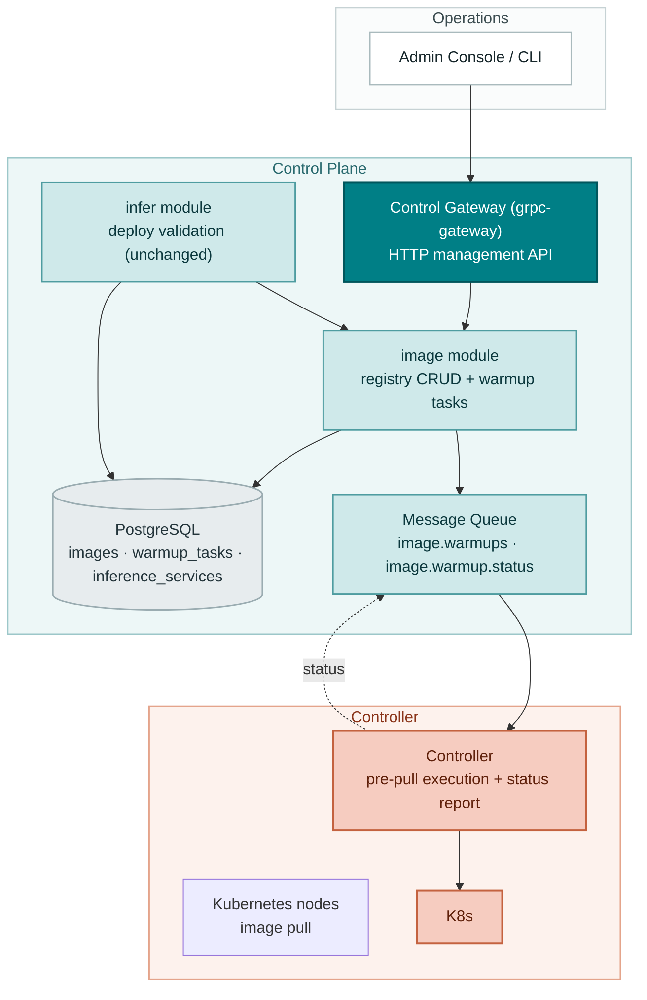
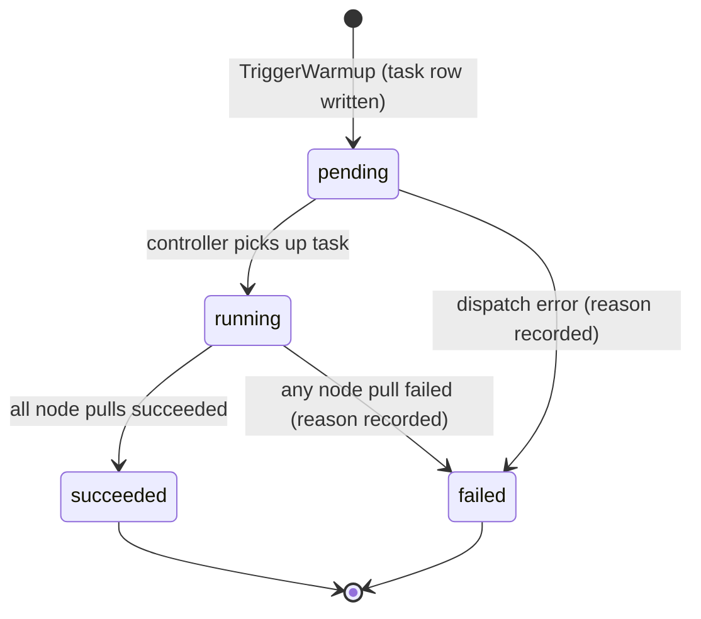
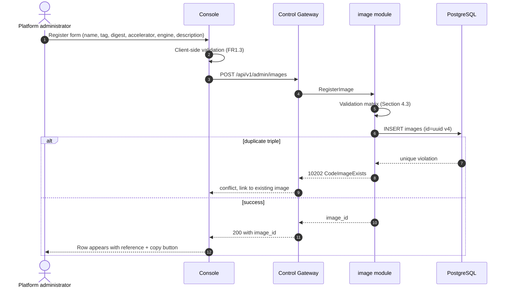

# Inference Image Management — Architecture and Detailed Design

| Attribute | Content |
| --- | --- |
| Feature point | Inference image management (register / version / pre-pull mapping) |
| Document scope | Architecture and detailed design for the DB-backed image registry and warmup (pre-pull) orchestration: component responsibilities, data model, API contract, message contract, controller-side pre-pull, first-boot migration from the config-driven registry, error handling, configuration, rollout, and function-level design per layer |
| Owning modules | `image` (registry CRUD and warmup tasks), `infer` (deploy-form image consumption, unchanged), `controller` (pre-pull execution and status report) |
| Related documents | [Requirement Analysis and UI/UX Design](../design/image-management.md) · [Architecture Design](../design/architecture.md) Section 2.3 (`image`), Section 2.7 Controller · [Model Catalog & One-Click Deployment](./model-catalog-deployment.md) (the transitional config-driven registry, the deploy-form dropdown, the change-event shape, the status-report pattern) |
| Status | Architecture complete, handed to the Developer agent |

---

## 1. Goals and Non-Goals

### 1.1 Goals

- Replace the transitional in-memory, config-seeded image registry with a DB-backed `images` table as the single source of truth, keeping the `image.Lookup` interface signature unchanged so the `infer` module does not change (D1).
- Implement the full `taas.image.v1.ImageService` surface: the three existing RPCs (`RegisterImage`, `ListImages`, `TriggerWarmup` — currently a stub / read-only) plus five new RPCs (`GetImage`, `UpdateImage`, `DeleteImage`, `ListWarmupTasks`, `GetWarmupTask`).
- First-boot seed from `image.registry` config: an empty `images` table gets the config entries as rows preserving their `imageId` values; the seed is insert-only and never re-runs on a non-empty table (D2, AC3, AC4).
- Full CRUD semantics: register with validation (name/tag syntax 10207, digest syntax 10203, accelerator 10204, duplicate triple 10202), description-only update (D6), reference-checked delete with the new 10206 `CodeImageInUse` naming blocking services (D7, D10).
- Warmup (pre-pull) as an asynchronous task: `TriggerWarmup` returns a `task_id` with `state=pending` immediately; the Controller executes per-node pulls and reports status back through the message queue; task states are the closed set `pending` / `running` / `succeeded` / `failed`; at most one active task per image (D8).
- Deploy-form integration: the image dropdown is sourced from the DB-backed `ListImages`, filtered by accelerator — behavior unchanged from feature #2, now persistent (FR7).
- Platform-global images: image APIs require no organization header (D9).

### 1.2 Non-Goals

| Item | Deferred to |
| --- | --- |
| Card-type-level and model-format-level compatibility matrix cells | Future feature point (needs card-type inventory) |
| Private registry credential management (`imagePullSecrets`) | Future platform-operations feature |
| Node-level cache inventory beyond warmup task results | Future (needs node inventory) |
| Automatic warmup on registration | Future policy enhancement; v1 is manual trigger |
| Image signature / provenance verification beyond digest syntax | Future |
| Per-tenant image authorization | Feature #6 multi-tenancy |
| Aligning the model delete-guard error code with a dedicated `InUse` code | Platform-wide error-code cleanup |
| The Inference Gateway data-plane routing | Data-plane track |

---

## 2. Component View



| Component | Responsibility in this feature |
| --- | --- |
| Console | Images page (register, list with filters/search/pagination, warmup / edit / delete actions), image detail (metadata, in-use services, warmup history), warmup dialog, deploy-form dropdown now DB-backed |
| Control Gateway (`grpc-gateway`) | HTTP/JSON facade for all eight RPCs under `/api/v1/admin/images` and `/api/v1/admin/warmup-tasks`; image APIs are platform-scoped — no `X-Organization-Id` pass-through (D9) |
| `image` module (`services/image`) | Registry CRUD, first-boot seed, warmup task lifecycle (create task, consume status), in-use counting for the delete guard |
| `infer` module (`services/infer`) | **Unchanged consumer**: `image.Lookup` keeps its signature; deploy validation and change-event composition behave identically against the DB-backed registry |
| PostgreSQL | `images` and `warmup_tasks` tables (new); `inference_services` read for reference checks and in-use lists |
| Message Queue | `image.warmups` (task dispatch, consumed by the Controller — subject already exists) and the new `image.warmup.status` (task status, consumed by `image`) |
| Controller (`internal/controller`) | Consumes warmup tasks, executes per-node pre-pulls, reports task status (running → succeeded/failed) with per-node results |

---

## 3. Data Model

### 3.1 The `images` Table

| Column | PostgreSQL type | Constraints | Description |
| --- | --- | --- | --- |
| `id` | `varchar(64)` | PRIMARY KEY | Opaque image id: config-seeded rows keep their config `imageId` (e.g. `img-vllm-nvidia-v063`), new registrations get UUID v4 (D4) |
| `name` | `varchar(255)` | NOT NULL, part of `UNIQUE(name, tag, accelerator)` | Image repository name without tag, 1–255 chars, lowercase (D3) |
| `tag` | `varchar(128)` | NOT NULL, part of unique triple | Image tag, 1–128 chars (D3) |
| `digest` | `varchar(71)` | NOT NULL DEFAULT '' | Optional integrity pin: `sha256:` + 64 hex chars |
| `accelerator` | `varchar(32)` | NOT NULL, part of unique triple | `nvidia` / `iluvatar` / `metax` (D5) |
| `engine` | `varchar(64)` | NOT NULL | Inference engine name (`vllm`, `sglang`, ...) |
| `description` | `varchar(1024)` | NOT NULL DEFAULT '' | Free-text build notes, ≤ 1024 chars (D6: the only editable field) |
| `created_at` | `timestamptz` | NOT NULL | Registration time (UTC) |
| `updated_at` | `timestamptz` | NOT NULL | Last touch (description edit) |

Design notes:

- The unique triple `(name, tag, accelerator)` is enforced by a composite unique index `idx_images_name_tag_accelerator`; a violation maps to 10202 `CodeImageExists` (AC1).
- `id` is `varchar(64)` (not `uuid`) because seeded rows carry config ids like `img-vllm-nvidia-v063`; UUID v4 strings (36 chars) fit the same column (D4).
- No hard foreign key from `inference_services.image_id`: terminated services legitimately outlive their images (D7). The reference check is application-level, mirroring the model delete guard.

### 3.2 The `warmup_tasks` Table

| Column | PostgreSQL type | Constraints | Description |
| --- | --- | --- | --- |
| `id` | `uuid` | PRIMARY KEY | Server-generated UUID v4, exposed as `task_id` |
| `image_id` | `varchar(64)` | NOT NULL, index | The image being pre-pulled |
| `state` | `varchar(16)` | NOT NULL DEFAULT 'pending' | Closed set: `pending`, `running`, `succeeded`, `failed` (D8) |
| `node_selector` | `jsonb` | NOT NULL DEFAULT '{}' | Optional node-label selector (key/value pairs) |
| `node_results` | `jsonb` | NOT NULL DEFAULT '[]' | Per-node outcomes, filled by status reports |
| `failure_reason` | `varchar(512)` | NULL | Human-readable reason when `state=failed` |
| `created_at` | `timestamptz` | NOT NULL | Task creation time |
| `updated_at` | `timestamptz` | NOT NULL | Last status transition |

Design notes:

- The one-active-task-per-image rule (D8) is enforced by a **partial unique index**: `CREATE UNIQUE INDEX idx_warmup_tasks_one_active ON warmup_tasks(image_id) WHERE state IN ('pending','running')`. A violation maps to 10205 `CodeImageWarmupFailed`. A partial index (rather than checking in the service layer) makes the rule race-free under concurrent triggers.
- `node_results` is a JSON array of `{node, state, message}` entries appended by status reports; the console renders it as the expandable per-node list (FR6.3).
- Task rows are never deleted — they are the warmup history (FR6.3, AC10).

### 3.3 Cross-Module Read Interface

`in_use_count` (list/detail) and the delete guard need non-terminated inference services by `image_id`. Following the established narrow-interface pattern (`infer.NewDeleteModelGuard` consumed by `model`), `infer` exposes:

```go
// CountByImageID counts non-terminated inference services referencing the image.
func (r *InferenceServiceRepository) CountByImageID(ctx context.Context, imageID string) (int64, error)

// ListActiveByImageID returns non-terminated services referencing the image
// (service_id, name, state), newest-updated first.
func (r *InferenceServiceRepository) ListActiveByImageID(ctx context.Context, imageID string) ([]*InferenceService, error)

// NewDeleteImageGuard builds the image-module delete guard (D7): it blocks
// deleting an image while a non-terminated inference service references it,
// returning 10206 with a detail naming the blocking services.
func NewDeleteImageGuard(db *gorm.DB) func(ctx context.Context, imageID string) error
```

The guard is injected into the image service at wiring time (`apps/taas-server`), keeping the `image` module free of an `infer` dependency — exactly the pattern `model.SetDeleteGuard` established.

---

## 4. API Contract

### 4.1 RPC Surface

All APIs belong to **`taas.image.v1.ImageService`** (proto: `proto/taas/image/v1/image.proto`), served as HTTP via the Control Gateway. Three RPCs exist; five are added. Proto changes are additive only.

| RPC | HTTP | Status | Purpose |
| --- | --- | --- | --- |
| `RegisterImage` | `POST /api/v1/admin/images` | exists, now implemented | Register an image; request gains `description` (field 6) |
| `ListImages` | `GET /api/v1/admin/images` | exists, now DB-backed | Catalog list with accelerator/engine filters; `ImageSummary` gains `description`, `in_use_count`, `last_warmup_state`, `last_warmup_at` |
| `GetImage` | `GET /api/v1/admin/images/{image_id}` | **new** | Detail with in-use services |
| `UpdateImage` | `PATCH /api/v1/admin/images/{image_id}` | **new** | Description-only edit (D6) |
| `DeleteImage` | `DELETE /api/v1/admin/images/{image_id}` | **new** | Reference-checked delete |
| `TriggerWarmup` | `POST /api/v1/admin/images/{image_id}:warmup` | exists, now implemented | Enqueue a pre-pull task; returns `task_id` with `state=pending` |
| `ListWarmupTasks` | `GET /api/v1/admin/images/{image_id}/warmup-tasks` | **new** | Warmup history per image, paginated, newest first |
| `GetWarmupTask` | `GET /api/v1/admin/warmup-tasks/{task_id}` | **new** | Task detail with per-node results (flat path — task ids are globally unique) |

### 4.2 Wire Format (established conventions)

- Pagination binds as `?page.offset=0&page.limit=20` (dotted form); default limit 20, cap 100.
- Success responses are HTTP 200; business errors render as `{"code": <int>, "message": "..."}`.
- Image APIs are platform-scoped: no `X-Organization-Id` header is required or honored (D9, AC14). Deploy APIs continue to require it.

### 4.3 Validation Matrix (synchronous)

`RegisterImage` runs these checks in order; the first failure returns immediately and nothing is written (AC2):

| # | Check | Failure code | Canonical message |
| --- | --- | --- | --- |
| 1 | `name` is a reference without tag (no `:`), 1–255 chars, lowercase | 10207 `CodeImageReferenceInvalid` | image reference invalid |
| 2 | `tag` non-empty, 1–128 chars, no whitespace | 10207 `CodeImageReferenceInvalid` | image reference invalid |
| 3 | `digest` empty or `sha256:` + 64 hex chars | 10203 `CodeImageDigestInvalid` | image digest invalid |
| 4 | `accelerator` in {nvidia, iluvatar, metax} (case-insensitive, stored lowercase) | 10204 `CodeImageIncompatible` | image incompatible |
| 5 | `engine` non-empty after trim, ≤ 64 chars | 10207 `CodeImageReferenceInvalid` | image reference invalid |
| 6 | `description` ≤ 1024 chars | 10207 `CodeImageReferenceInvalid` | image reference invalid |
| 7 | `(name, tag, accelerator)` not already registered | 10202 `CodeImageExists` | image exists |

`UpdateImage` validates: image exists (10201), `description` ≤ 1024 chars (10207). `DeleteImage` validates: image exists (10201), no non-terminated inference service references it (10206 with detail naming the blocking services). `TriggerWarmup` validates: image exists (10201), no active (pending/running) task for the image (10205). `GetImage` / `ListWarmupTasks` / `GetWarmupTask` validate existence only (10201).

### 4.4 Warmup Task State Machine



- The closed state set is exactly `pending`, `running`, `succeeded`, `failed` (contract constraint 6); the console's four badges rely on it (AC15).
- Terminal states are final: a completed task is never re-opened; a new warmup requires a new task (allowed once no active task remains).
- `pending → failed` covers dispatch-time errors (e.g. no node matches the selector); the Controller reports it like any other failure.

---

## 4.5 Message Contracts

### 4.5.1 Warmup Task (`image.warmups`, subject exists)

Published by `image` after the task row is durably written. JSON body:

```json
{
  "task_id": "uuid",
  "image_id": "img-vllm-nvidia-v063",
  "reference": "ghcr.io/go-taas/vllm:v0.6.3",
  "node_selector": {"pool": "gpu-a800"},
  "published_at": "2026-09-23T10:00:00Z"
}
```

Headers: `task_id`, `image_id`. The message carries the **resolved** image reference so the Controller never needs a database round-trip — the same principle as the infer change event. The Controller's handler is idempotent: re-delivery of the same task converges (a pull already in progress is awaited, not duplicated).

### 4.5.2 Warmup Status Report (`image.warmup.status`, new subject)

Published by the Controller as the task progresses. JSON body:

```json
{
  "task_id": "uuid",
  "state": "running" | "succeeded" | "failed",
  "node_results": [{"node": "node-a", "state": "succeeded", "message": ""}],
  "failure_reason": "registry unreachable from 2 nodes",
  "reported_at": "2026-09-23T10:02:41Z"
}
```

`image` consumes this subject and updates `state`, `node_results`, `failure_reason`, `updated_at`. The consumer is a `Runner` registered on the server, mirroring `infer`'s `StatusConsumer`. `pending` is never reported — it is the initial DB state. Unknown `task_id` reports are logged and skipped (a deleted image's late report — tasks are never deleted, so this is defensive only).

Subject registration: `mq.Subjects` gains `ImageWarmupStatus: "image.warmup.status"` in `DefaultSubjects()`. The controller subscribes to `ImageWarmups` (already wired) and publishes to `ImageWarmupStatus`; `image` subscribes to `ImageWarmupStatus` and publishes to `ImageWarmups`.

---

## 5. Sequence Diagrams

### 5.1 Register Image



### 5.2 First-Boot Seed (config-driven → DB-backed)

```mermaid
sequenceDiagram
    autonumber
    participant Main as Server startup
    participant Img as image module
    participant DB as PostgreSQL
    participant Cfg as config (image.registry)

    Main->>Img: Migrate(ctx) — Migrator hook
    Img->>DB: AutoMigrate(images, warmup_tasks)
    Img->>DB: SELECT count(*) FROM images
    alt table empty
        Img->>Cfg: read image.registry entries
        Img->>DB: INSERT rows preserving config imageId values
        Note over Img,DB: Insert-only, first-boot-only (D2):<br/>deletions stick, edits never overwritten
    else table non-empty
        Note over Img: Skip seed — database is authoritative
    end
    Main->>Img: serving starts; Lookup now reads the database
```

### 5.3 Warmup (trigger → pre-pull → status)

```mermaid
sequenceDiagram
    autonumber
    actor Admin as Platform administrator
    participant Console as Console
    participant CGW as Control Gateway
    participant Img as image module
    participant MQ as Message Queue
    participant CTRL as Controller
    participant K8s as Kubernetes nodes
    participant DB as PostgreSQL

    Admin->>Console: Warmup dialog (image, optional node selector)
    Console->>CGW: POST /api/v1/admin/images/{image_id}:warmup
    CGW->>Img: TriggerWarmup
    Img->>DB: INSERT warmup_tasks (state=pending)
    Img->>MQ: Publish task on image.warmups
    Img-->>CGW: task_id, state=pending
    CGW-->>Console: 200 with task_id
    Console-->>Admin: Toast linking to the task; history polls at 10 s
    MQ->>CTRL: Consume warmup task
    CTRL->>MQ: Report running
    MQ->>Img: Consume status → UPDATE state=running
    CTRL->>K8s: Pull image on nodes matching the selector
    K8s-->>CTRL: Per-node pull results
    CTRL->>MQ: Report succeeded (or failed + reason)
    MQ->>Img: Consume status → UPDATE state, node_results
    Console->>CGW: GET /api/v1/admin/warmup-tasks/{task_id}
    Img-->>CGW: state badge, per-node results, failure reason
    CGW-->>Console: Admin sees warm nodes / what to fix
```

### 5.4 Delete Guard

```mermaid
sequenceDiagram
    autonumber
    actor Admin as Platform administrator
    participant Console as Console
    participant CGW as Control Gateway
    participant Img as image module
    participant Infer as infer repository (guard)
    participant DB as PostgreSQL

    Admin->>Console: Delete action on an image row
    Console->>CGW: GET /api/v1/admin/images/{image_id} (in-use check)
    CGW->>Img: GetImage
    Img->>DB: count non-terminated services by image_id
    Img-->>CGW: in_use_services list
    alt in use
        Console-->>Admin: Delete disabled; blocking services listed with links
    else not in use
        Admin->>Console: Confirm delete
        Console->>CGW: DELETE /api/v1/admin/images/{image_id}
        CGW->>Img: DeleteImage
        Img->>Infer: delete guard (NewDeleteImageGuard)
        Infer->>DB: count non-terminated services by image_id
        alt still referenced (race)
            Infer-->>Img: blocked
            Img-->>CGW: 10206 CodeImageInUse naming blocking services
        else not referenced
            Img->>DB: DELETE images row
            Img-->>CGW: OK
            CGW-->>Console: Row leaves the list
        end
    end
```

---

## 6. Error Handling

All errors are `pkg/errors` business codes in the unified envelope. Two new codes are allocated (D10, D11); the rest already exist.

| Condition | Code | Constant | Notes |
| --- | --- | --- | --- |
| Unknown `image_id` (get / update / delete / warmup / deploy validation) | 10201 | `CodeImageNotFound` | Existing |
| Duplicate `(name, tag, accelerator)` on register | 10202 | `CodeImageExists` | Existing |
| Malformed digest | 10203 | `CodeImageDigestInvalid` | Existing |
| Unsupported accelerator at registration | 10204 | `CodeImageIncompatible` | Existing constant, new use; `infer`'s deploy-time mismatch use unchanged |
| Warmup trigger while an active task exists | 10205 | `CodeImageWarmupFailed` | Existing; async pull failures surface as task `state=failed` + reason, not RPC errors |
| Delete blocked by non-terminated service references | 10206 | `CodeImageInUse` | **New** (D10); detail names the blocking services |
| Malformed name / tag / engine / description at registration or update | 10207 | `CodeImageReferenceInvalid` | **New** (D11); mirrors 10104 `CodeModelPathInvalid` |
| Database / MQ infrastructure failure | 500 | `CodeInternal` | Via error normalization |

Controller-side failures are not RPC errors: they surface as task `state=failed` + `failure_reason` through the status subject (AC11). A status-publish failure is logged and retried with the next report; the task stays in its last known state.

---

## 7. Configuration Additions

No new configuration keys. The transitional `image.registry` seed section stays as-is and is now documented as a **deprecated bootstrap default for fresh installs** (FR8.3): it is read only when the `images` table is empty at startup, and never again.

| Key | Default | Description |
| --- | --- | --- |
| `image.registry` | 3 seeded entries | First-boot seed for an empty `images` table; insert-only, never re-runs on a non-empty table (D2) |

Rules:

- The section already ships in `configs/config.yaml` and `configs/server.yaml`; no changes needed.
- `Configuration.Validate` gains no new rules (the seed is validated by the same registration checks at seed time — a malformed config entry is logged and skipped, never fatal: a bad config line must not brick startup).

---

## 8. Security Considerations

- **Platform-scoped APIs (D9)**: image APIs require no organization header. This is a deliberate scope decision (engine images are shared cluster infrastructure), not an auth bypass — the management API is effectively unauthenticated today (transitional, removed in feature #7), and this feature does not widen that exposure.
- **No secrets in messages**: warmup task and status messages carry only image references, node selectors, and outcomes — no credentials.
- **Reference syntax validation (10207)**: name and tag are validated against a conservative pattern (lowercase, no `:` in name, no whitespace in tag), so a malicious reference cannot smuggle extra registry flags into the pull command.
- **Node selector is label-matching only**: the selector maps to Kubernetes node-label selectors; it cannot reference secrets or arbitrary objects.
- **Controller privilege**: pre-pull needs no new privileges beyond the existing Deployment/Service CRUD — the pull happens through a DaemonSet-style helper or image-create on nodes, both covered by the existing service account scope.

---

## 9. Rollout Notes

- **Schema**: two new tables (`images`, `warmup_tasks`) via AutoMigrate on first start; additive only, no existing data touched. The first-boot seed runs immediately after AutoMigrate inside the same `Migrate` hook.
- **Proto**: additive changes (five new RPCs, extended messages) — `make pbgen` required.
- **New subject**: `image.warmup.status` is additive; brokers are subject-based (NATS) so no migration.
- **Controller**: `ApplyImageWarmup` replaces the current stub behind the existing `Reconciler` interface — no signature change, the fake-based tests keep working.
- **Rolling update order**: deploy `taas-server` first (it seeds, serves CRUD, publishes tasks and consumes status), then the controller. The reverse order is safe too: the controller ignores subjects with no publishers.
- **Upgrade compatibility**: existing inference services referencing seeded ids (e.g. `img-vllm-nvidia-v063`) keep validating — the seed preserves config ids (D2, D4, AC3).
- **Feature flags**: none needed — the transitional registry is replaced wholesale; the config seed remains as the fresh-install bootstrap.

---

## 10. Detailed Design

### 10.1 File Layout

| Module | File | Contents |
| --- | --- | --- |
| `services/image` | `image_model.go` | GORM models `Image`, `WarmupTask` + `TableName` |
| | `image_repository.go` | `ImageRepository` (CRUD, seed, in-use joins) + `WarmupTaskRepository` |
| | `registry.go` | **Rewritten**: DB-backed `Lookup` / `List` behind the same signatures; the in-memory registry and `ResetForTest` are removed |
| | `warmup_publisher.go` | Warmup task construction + publish |
| | `warmup_status_consumer.go` | Warmup status subject consumer (Runner) |
| | `service.go` | RPC implementations (all eight) |
| `services/infer` | `infer_repository.go` | `CountByImageID`, `ListActiveByImageID`, `NewDeleteImageGuard` (additive) |
| `internal/controller` | `reconciler.go` | `ApplyImageWarmup` implementation (pre-pull + status report) |
| `pkg/mq` | `mq.go` | `ImageWarmupStatus` subject addition |
| `pkg/errors` | `codes.go` | `CodeImageInUse` (10206), `CodeImageReferenceInvalid` (10207) |
| `pkg/config` | `api.go` | No struct changes; `ImageRegistryEntry` comment updated (deprecated bootstrap default) |
| `apps/taas-server` | `main.go` | Wire `SetDeleteGuard(infer.NewDeleteImageGuard(...))` on the image service; register the warmup status consumer Runner |

### 10.2 `image` Module

GORM models (single source of truth):

```go
type Image struct {
    ID          string    `gorm:"primaryKey;size:64"`
    Name        string    `gorm:"size:255;not null;uniqueIndex:idx_images_name_tag_accelerator,priority:1"`
    Tag         string    `gorm:"size:128;not null;uniqueIndex:idx_images_name_tag_accelerator,priority:2"`
    Digest      string    `gorm:"size:71;not null;default:''"`
    Accelerator string    `gorm:"size:32;not null;uniqueIndex:idx_images_name_tag_accelerator,priority:3"`
    Engine      string    `gorm:"size:64;not null"`
    Description string    `gorm:"size:1024;not null;default:''"`
    CreatedAt   time.Time
    UpdatedAt   time.Time
}

type WarmupTask struct {
    ID            string         `gorm:"primaryKey;type:uuid"`
    ImageID       string         `gorm:"size:64;not null;index"`
    State         string         `gorm:"size:16;not null;default:'pending'"`
    NodeSelector  datatypes.JSON `gorm:"type:jsonb;not null;default:'{}'"`
    NodeResults   datatypes.JSON `gorm:"type:jsonb;not null;default:'[]'"`
    FailureReason *string        `gorm:"size:512"`
    CreatedAt     time.Time
    UpdatedAt     time.Time
}
```

The partial unique index for the one-active-task rule is created after AutoMigrate (GORM does not model partial indexes):

```sql
CREATE UNIQUE INDEX IF NOT EXISTS idx_warmup_tasks_one_active
    ON warmup_tasks(image_id) WHERE state IN ('pending','running');
```

`ImageRepository` (embeds `database.BaseRepository[Image]`):

- `CreateImage(ctx, img *Image) error` — insert; unique-violation on the triple maps to `CodeImageExists`.
- `FindByID(ctx, id string) (*Image, error)` — miss → `CodeImageNotFound`.
- `FindByTriple(ctx, name, tag, accelerator string) (*Image, error)` — used by the conflict response (link to the existing image); miss → `CodeImageNotFound`.
- `ListImages(ctx, accelerator, engine string, offset, limit int) ([]*Image, int64, error)` — filtered, paginated, `created_at DESC, id DESC`; total count for `page_meta`.
- `UpdateDescription(ctx, id, description string) error` — description-only (D6).
- `Delete(ctx, id string) error` — hard delete.
- `CountAll(ctx) (int64, error)` — the first-boot seed emptiness check.
- `SeedFromConfig(ctx, entries []config.ImageRegistryEntry) error` — insert-only batch insert preserving config ids; called only when `CountAll == 0`.

`WarmupTaskRepository` (embeds `database.BaseRepository[WarmupTask]`):

- `Create(ctx, task *WarmupTask) error` — insert; unique-violation on the partial index maps to `CodeImageWarmupFailed` (10205).
- `FindByID(ctx, id string) (*WarmupTask, error)` — miss → `CodeImageNotFound` (task ids are image-scoped in errors for a consistent console experience).
- `ListByImageID(ctx, imageID string, offset, limit int) ([]*WarmupTask, int64, error)` — newest first.
- `HasActiveByImageID(ctx, imageID string) (bool, error)` — pre-check for a friendly 10205 before hitting the partial index.
- `ApplyStatus(ctx, taskID, state string, nodeResults []NodeResult, failureReason *string) error` — used by the status consumer; terminal states are never overwritten (a late `running` report after `succeeded` is skipped).

`registry.go` (rewritten, same signatures):

- `Lookup(imageID string) (*Summary, error)` — now reads the database through a package-level repository wired at construction; miss → `CodeImageNotFound`. The `Summary` struct is unchanged (the `infer` module compiles untouched).
- `List(accelerator, engine string) []*Summary` — same, DB-backed.
- `IsValidAccelerator(accelerator string) bool` — unchanged.
- The in-memory `registry`, `seedFromConfig`, `seedOnce`, and `ResetForTest` are deleted; tests seed through the repository instead.

Wiring: the image service constructs its repositories lazily from the shared components (the `model` pattern), and `Lookup`/`List` resolve the repository the same way. The first call after Init triggers nothing special — the seed already ran in `Migrate`.

Service RPCs (`service.go`):

- `RegisterImage`: trim inputs; run the validation matrix (Section 4.3); `FindByTriple` — hit → 10202; miss → `CreateImage` with UUID v4; respond `{image_id}`.
- `ListImages`: normalize pagination; map rows to `ImageSummary` extended with `description`, `in_use_count` (batch count by image_id over non-terminated services — one grouped query for the page), `last_warmup_state`, `last_warmup_at` (latest task per image — one grouped query for the page).
- `GetImage`: image + `in_use_services` (service_id, name, state via `infer.ListActiveByImageID` through the injected in-use provider); miss → 10201.
- `UpdateImage`: fetch (10201); validate description (10207); `UpdateDescription`; respond OK.
- `DeleteImage`: fetch (10201); run the injected delete guard — blocked → 10206 with detail naming the blocking services; else `Delete`; respond OK. Idempotency: deleting a missing image returns 10201 (consistent with `DeleteModel`).
- `TriggerWarmup`: fetch image (10201); `HasActiveByImageID` — true → 10205; `Create` task (state=pending; the partial index is the race-free backstop); publish the task event (Section 4.5.1); on publish failure the task row is compensated to `failed` with the publish error as the reason (mirroring `infer`'s publish-with-compensation); respond `{task_id}`.
- `ListWarmupTasks`: image existence check (10201); paginated newest-first list.
- `GetWarmupTask`: task fetch (10201); respond with state, node_results, failure_reason, timestamps.

`Migrate(ctx)` (implements `server.Migrator`):

1. `AutoMigrate(&Image{}, &WarmupTask{})`.
2. `CountAll` — zero → `SeedFromConfig(cfg.Image.Registry)`; non-zero → skip (log at info: "image table non-empty, skipping first-boot seed").
3. Create the partial unique index (`IF NOT EXISTS`).

`warmup_status_consumer.go`:

- `WarmupStatusConsumer` implements `server.Runner`: `Run(ctx)` subscribes to `subjects.ImageWarmupStatus` and applies each report via `ApplyStatus`. Parse errors are logged and skipped; unknown `task_id` logged and skipped; terminal-state overwrite attempts logged and skipped.
- Construction: `NewWarmupStatusConsumer(mqClient, taskRepo, workers)`; `NewWarmupStatusConsumerRunner(components)` returns nil when disabled or components unavailable (the `infer` pattern).
- Config: `image.warmupStatusConsumer.{enabled,workers}` mirrors `infer.statusConsumer` (defaults true / 2).

### 10.3 `infer` Module (additive only)

- `CountByImageID` / `ListActiveByImageID` / `NewDeleteImageGuard` added to `infer_repository.go` (Section 3.3). The guard returns 10206 (not 10101 — the image module has its own InUse code, D10) with detail `"referenced by inference service <name>"` (first blocking service; the full list is available through `GetImage`).
- `image.Lookup` call sites (`CreateInferenceService`, `GetInferenceService` change re-publish) are untouched — the DB-backed registry is a drop-in.
- `apps/taas-server/main.go` wires `imageSvc.SetDeleteGuard(infer.NewDeleteImageGuard(gormDB))` and `srv.AddRunner(image.NewWarmupStatusConsumerRunner(srv.Components()))` after `srv.Init()`.

### 10.4 Controller Pre-Pull (`internal/controller/reconciler.go`)

`ApplyImageWarmup(ctx, msg)` replaces the stub:

1. Decode the warmup task (Section 4.5.1); malformed → log + `mq.Permanent`.
2. Publish status `running` (empty node results).
3. Resolve target nodes: list nodes through the Kubernetes client, filter by the task's label selector; no match → publish status `failed` with reason "no node matches the selector" and return `nil` (the task failed, not the delivery).
4. Execute the pre-pull per node. The concrete mechanism is environment-dependent (DaemonSet helper, `kubectl node pull`, CRI direct); v1 implements the **helper-pod pattern**: create (or update) a one-shot Pod per target node with `imagePullPolicy=Always` and the task's image reference, node-pinned via `spec.nodeName`. Pod phase `Running`/`Succeeded` ⇒ pull succeeded; `Failed` ⇒ pull failed with the container's termination message.
5. Collect per-node results; all succeeded → publish status `succeeded`; any failed → publish status `failed` with `failure_reason` summarizing the failing nodes.
6. Return `nil` (delivery acknowledged) in all settled cases; transient Kubernetes API errors return a plain error for broker-level retry (the task stays `running`).

Test seam: the reconciler already receives a `kubernetes.Interface` clientset; the fake clientset drives the helper-pod assertions (create pod → set phase → assert status report).

### 10.5 Console (out of repository scope, contract summary)

The console is a separate deliverable; this design pins its contract: the Images page (filters, search, pagination, register CTA, coverage hint, in-use badge, warmup/edit/delete actions), the image detail page (metadata card, in-use services, warmup history with 10-second polling while any task is pending/running), the four-state task badge set, the description-only edit dialog with read-only identity fields, the delete dialog with blocking-services list, and the deploy-form dropdown sourced from the DB-backed `ListImages` filtered by accelerator (FR7, AC12, AC13, AC15).

---

## 11. Acceptance Criteria Coverage

| AC | Addressed by | Verification hook |
| --- | --- | --- |
| AC1 — register + conflict | Section 10.2 `RegisterImage`, unique triple index | Unit + FVT |
| AC2 — validation rejects, nothing written | Section 4.3 validation matrix | Unit + FVT |
| AC3 — first-boot seed preserves ids | Section 10.2 `Migrate` + `SeedFromConfig` | FVT |
| AC4 — seed is first-boot-only | `CountAll` gate; deletions stick | FVT |
| AC5 — detail with in-use services | `GetImage` + `ListActiveByImageID` | FVT |
| AC6 — description-only update | `UpdateImage` (structural immutability, D6) | FVT + contract review |
| AC7 — delete unreferenced / terminated-only | `DeleteImage` + guard | FVT |
| AC8 — delete blocked with 10206 naming services | `NewDeleteImageGuard` (D7, D10) | FVT |
| AC9 — warmup returns task_id immediately; double-trigger 10205 | `TriggerWarmup` + partial unique index (D8) | FVT |
| AC10 — pending → running → succeeded; history newest-first; per-node results | Sections 4.5, 10.4, `ListWarmupTasks` | FVT (controller harness) |
| AC11 — failed with human-readable reason | Section 10.4 steps 3/5 | FVT (fault injection) |
| AC12 — deploy dropdown DB-backed, no restart needed | `registry.go` rewrite (D1) | E2E |
| AC13 — Images page renders filters/search/pagination/empty/coverage/in-use; delete guarded | Section 10.5 console contract | E2E |
| AC14 — image APIs platform-scoped (no org header) | D9; gateway wiring | FVT |
| AC15 — 10-second polling while active; four-state badges | Section 10.5 console contract | Manual / E2E |

---

## 12. Deferred Items

| Item | Deferred to |
| --- | --- |
| Card-type-level and model-format-level compatibility matrix cells | Future feature point (needs card-type inventory) |
| Private registry credential management (`imagePullSecrets`) | Future platform-operations feature |
| Node-level cache inventory beyond task results | Future (needs node inventory) |
| Automatic warmup on registration | Future policy enhancement |
| Image signature / provenance verification beyond digest syntax | Future |
| Aligning the model delete-guard code with a dedicated `InUse` code | Platform-wide error-code cleanup |
| Per-tenant image authorization | Feature #6 multi-tenancy |
| Business-code → HTTP status mapping in the gateway | Platform-wide follow-up |
