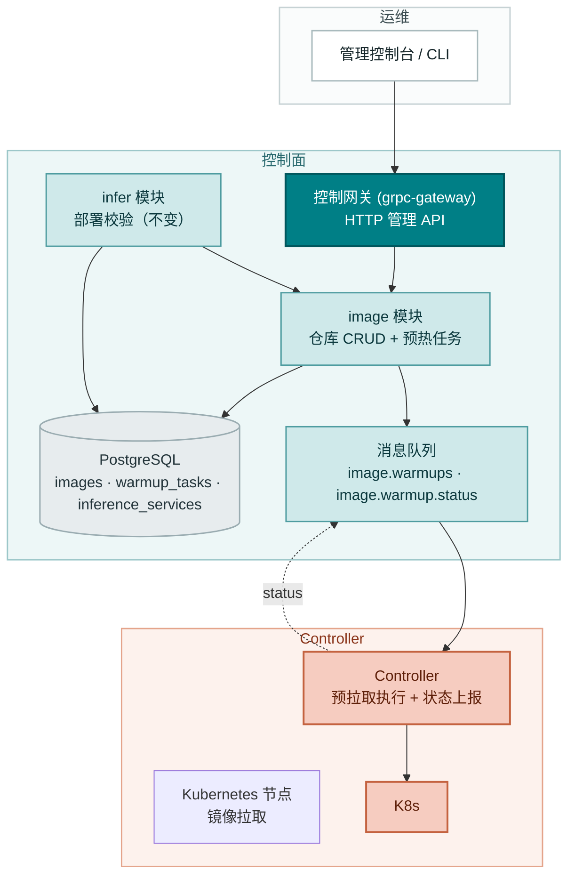
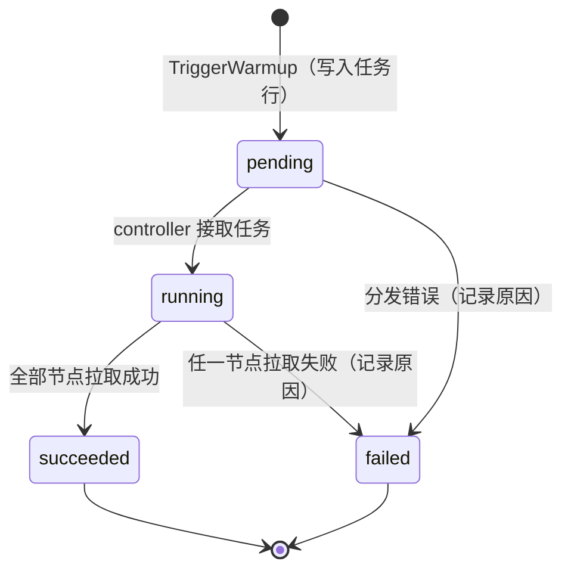
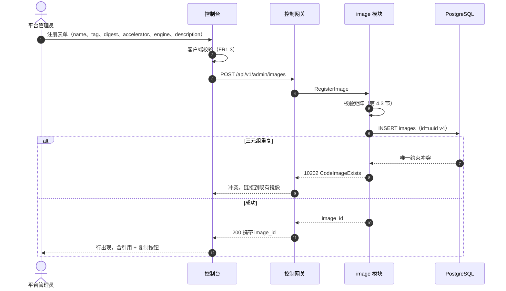
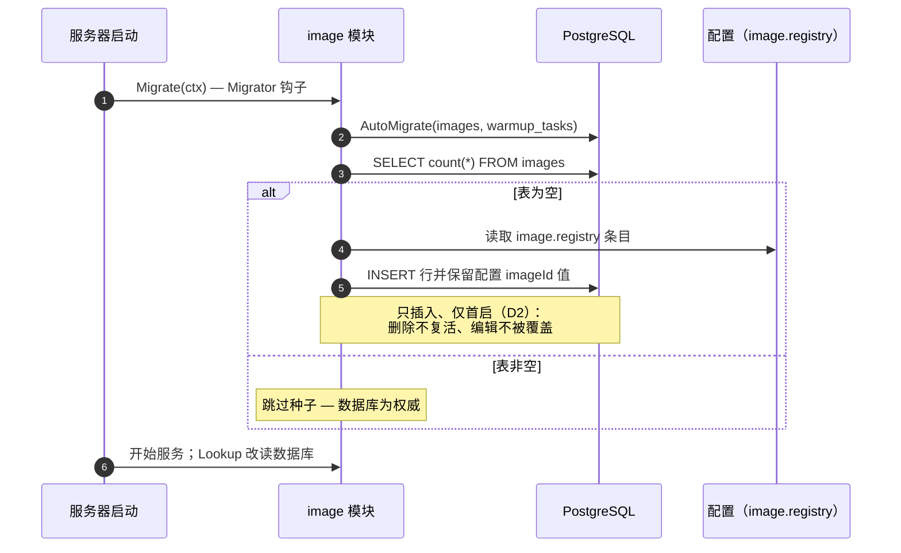
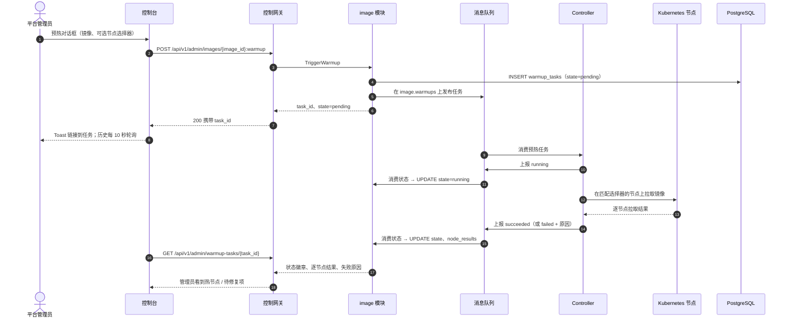
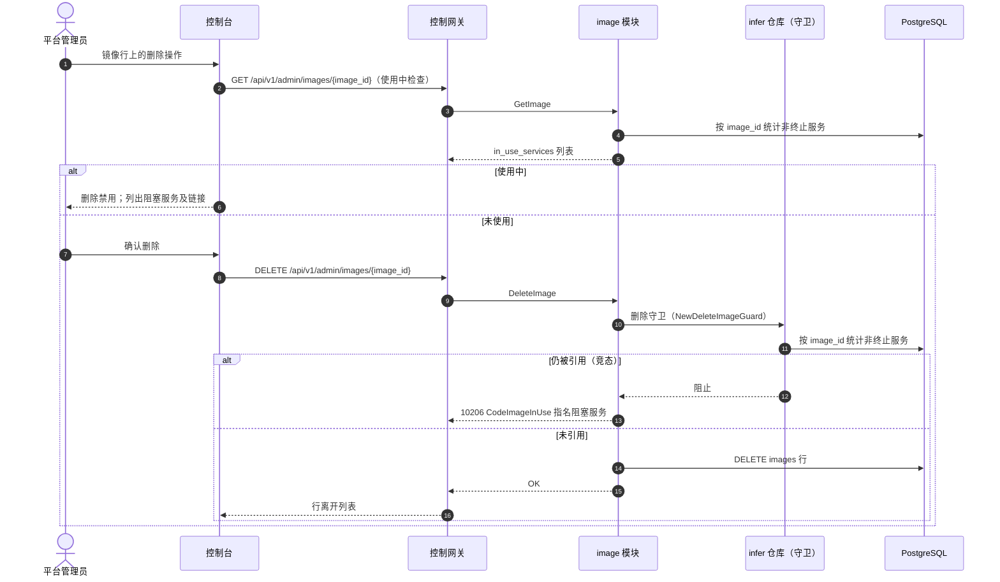

# 推理镜像管理 — 架构与详细设计

| 属性 | 内容 |
| --- | --- |
| 特性点 | 推理镜像管理（注册 / 版本 / 预拉取映射） |
| 文档范围 | DB 化镜像仓库与预热（预拉取）编排的架构与详细设计：组件职责、数据模型、API 契约、消息契约、控制器侧预拉取、从配置驱动仓库的首启迁移、错误处理、配置、发布说明，以及各层的函数级设计 |
| 负责模块 | `image`（仓库 CRUD 与预热任务）、`infer`（部署表单镜像消费，不变）、`controller`（预拉取执行与状态上报） |
| 相关文档 | [需求分析与 UI/UX 设计](../design/image-management.zh-cn.md) · [架构设计](../design/architecture.zh-cn.md) 第 2.3 节（`image`）、第 2.7 节 Controller · [模型目录与一键部署](./model-catalog-deployment.zh-cn.md)（过渡期配置驱动仓库、部署表单下拉、变更事件形态、状态上报模式） |
| 状态 | 架构设计完成，已移交 Developer 代理 |

---

## 1. 目标与非目标

### 1.1 目标

- 用 DB 化的 `images` 表替换过渡期的内存配置种子镜像仓库，作为唯一事实来源；`image.Lookup` 接口签名保持不变，`infer` 模块无需改动（D1）。
- 实现完整的 `taas.image.v1.ImageService` 面：三个既有 RPC（`RegisterImage`、`ListImages`、`TriggerWarmup` — 目前为桩 / 只读）加五个新增 RPC（`GetImage`、`UpdateImage`、`DeleteImage`、`ListWarmupTasks`、`GetWarmupTask`）。
- 从 `image.registry` 配置首启种子：空的 `images` 表将配置条目作为行插入并保留其 `imageId` 值；种子只插入，且永不在非空表上重跑（D2、AC3、AC4）。
- 完整 CRUD 语义：带校验的注册（name/tag 语法 10207、digest 语法 10203、加速卡 10204、三元组重复 10202）、仅描述可更新（D6）、带引用检查的删除，使用新增的 10206 `CodeImageInUse` 并指名阻塞服务（D7、D10）。
- 预热（预拉取）作为异步任务：`TriggerWarmup` 立即返回 `task_id` 且 `state=pending`；Controller 执行逐节点拉取并通过消息队列回报状态；任务状态为封闭集合 `pending` / `running` / `succeeded` / `failed`；每个镜像至多一个活跃任务（D8）。
- 部署表单集成：镜像下拉数据源改为 DB 化的 `ListImages`，按加速卡过滤 — 行为与特性 #2 一致，但现在持久化（FR7）。
- 平台全局镜像：镜像 API 不需要组织头（D9）。

### 1.2 非目标

| 条目 | 延后至 |
| --- | --- |
| 卡型级与模型格式级兼容矩阵单元 | 未来特性点（需要卡型清单） |
| 私有仓库凭证管理（`imagePullSecrets`） | 未来平台运维特性 |
| 预热任务结果之外的节点级缓存清单 | 未来（需要节点清单） |
| 注册时自动预热 | 未来策略增强；v1 为手动触发 |
| digest 语法之外的镜像签名 / 溯源校验 | 未来 |
| 按租户的镜像授权 | 特性 #6 多租户 |
| 将模型删除守卫错误码对齐专用 `InUse` 码 | 平台级错误码清理 |
| 推理网关数据面路由 | 数据面轨道 |

---

## 2. 组件视图



| 组件 | 本特性中的职责 |
| --- | --- |
| 控制台 | 镜像页（注册、带过滤/搜索/分页的列表、预热 / 编辑 / 删除操作）、镜像详情（元数据、使用中服务、预热历史）、预热对话框、部署表单下拉改为 DB 数据源 |
| 控制网关（`grpc-gateway`） | 全部八个 RPC 的 HTTP/JSON 门面，位于 `/api/v1/admin/images` 与 `/api/v1/admin/warmup-tasks`；镜像 API 为平台级 — 不透传 `X-Organization-Id`（D9） |
| `image` 模块（`services/image`） | 仓库 CRUD、首启种子、预热任务生命周期（创建任务、消费状态）、删除守卫的使用计数 |
| `infer` 模块（`services/infer`） | **消费方不变**：`image.Lookup` 签名不变；部署校验与变更事件组装对 DB 化仓库的行为完全一致 |
| PostgreSQL | `images` 与 `warmup_tasks` 表（新增）；读取 `inference_services` 做引用检查与使用中列表 |
| 消息队列 | `image.warmups`（任务分发，Controller 消费 — subject 已存在）与新增的 `image.warmup.status`（任务状态，`image` 消费） |
| Controller（`internal/controller`） | 消费预热任务，执行逐节点预拉取，回报任务状态（running → succeeded/failed）及逐节点结果 |

---

## 3. 数据模型

### 3.1 `images` 表

| 列 | PostgreSQL 类型 | 约束 | 说明 |
| --- | --- | --- | --- |
| `id` | `varchar(64)` | PRIMARY KEY | 不透明镜像 id：配置种子行保留配置 `imageId`（如 `img-vllm-nvidia-v063`），新注册取 UUID v4（D4） |
| `name` | `varchar(255)` | NOT NULL，`UNIQUE(name, tag, accelerator)` 的一部分 | 不含 tag 的镜像仓库名，1–255 字符，小写（D3） |
| `tag` | `varchar(128)` | NOT NULL，唯一三元组的一部分 | 镜像 tag，1–128 字符（D3） |
| `digest` | `varchar(71)` | NOT NULL DEFAULT '' | 可选完整性固定：`sha256:` + 64 位十六进制 |
| `accelerator` | `varchar(32)` | NOT NULL，唯一三元组的一部分 | `nvidia` / `iluvatar` / `metax`（D5） |
| `engine` | `varchar(64)` | NOT NULL | 推理引擎名（`vllm`、`sglang` 等） |
| `description` | `varchar(1024)` | NOT NULL DEFAULT '' | 自由文本构建备注，≤ 1024 字符（D6：唯一可编辑字段） |
| `created_at` | `timestamptz` | NOT NULL | 注册时间（UTC） |
| `updated_at` | `timestamptz` | NOT NULL | 最近触碰（描述编辑） |

设计说明：

- 唯一三元组 `(name, tag, accelerator)` 由复合唯一索引 `idx_images_name_tag_accelerator` 强制；违反映射为 10202 `CodeImageExists`（AC1）。
- `id` 用 `varchar(64)`（而非 `uuid`），因为种子行携带 `img-vllm-nvidia-v063` 这类配置 id；UUID v4 字符串（36 字符）适配同一列（D4）。
- `inference_services.image_id` 不设硬外键：已终止服务合理地比其镜像存活更久（D7）。引用检查在应用层，与模型删除守卫一致。

### 3.2 `warmup_tasks` 表

| 列 | PostgreSQL 类型 | 约束 | 说明 |
| --- | --- | --- | --- |
| `id` | `uuid` | PRIMARY KEY | 服务端生成 UUID v4，暴露为 `task_id` |
| `image_id` | `varchar(64)` | NOT NULL，索引 | 被预拉取的镜像 |
| `state` | `varchar(16)` | NOT NULL DEFAULT 'pending' | 封闭集合：`pending`、`running`、`succeeded`、`failed`（D8） |
| `node_selector` | `jsonb` | NOT NULL DEFAULT '{}' | 可选节点标签选择器（键/值对） |
| `node_results` | `jsonb` | NOT NULL DEFAULT '[]' | 逐节点结果，由状态报告填充 |
| `failure_reason` | `varchar(512)` | NULL | `state=failed` 时的人类可读原因 |
| `created_at` | `timestamptz` | NOT NULL | 任务创建时间 |
| `updated_at` | `timestamptz` | NOT NULL | 最近状态迁移 |

设计说明：

- 每镜像至多一个活跃任务（D8）由**部分唯一索引**强制：`CREATE UNIQUE INDEX idx_warmup_tasks_one_active ON warmup_tasks(image_id) WHERE state IN ('pending','running')`。违反映射为 10205 `CodeImageWarmupFailed`。用部分索引（而非服务层检查）使该规则在并发触发下无竞态。
- `node_results` 是 `{node, state, message}` 的 JSON 数组，由状态报告追加；控制台渲染为可展开的逐节点列表（FR6.3）。
- 任务行永不删除 — 它们就是预热历史（FR6.3、AC10）。

### 3.3 跨模块读接口

`in_use_count`（列表/详情）与删除守卫需要按 `image_id` 统计非终止推理服务。沿用既有窄接口模式（`infer.NewDeleteModelGuard` 被 `model` 消费），`infer` 暴露：

```go
// CountByImageID 统计引用该镜像的非终止推理服务数。
func (r *InferenceServiceRepository) CountByImageID(ctx context.Context, imageID string) (int64, error)

// ListActiveByImageID 返回引用该镜像的非终止服务
// （service_id、name、state），按更新时间新到旧。
func (r *InferenceServiceRepository) ListActiveByImageID(ctx context.Context, imageID string) ([]*InferenceService, error)

// NewDeleteImageGuard 构建 image 模块删除守卫（D7）：当非终止推理服务
// 引用该镜像时阻止删除，返回 10206 并在详情中指名阻塞服务。
func NewDeleteImageGuard(db *gorm.DB) func(ctx context.Context, imageID string) error
```

守卫在装配时注入 image 服务（`apps/taas-server`），使 `image` 模块不依赖 `infer` — 与 `model.SetDeleteGuard` 建立的模式完全一致。

---

## 4. API 契约

### 4.1 RPC 面

全部 API 属于 **`taas.image.v1.ImageService`**（proto：`proto/taas/image/v1/image.proto`），经控制网关以 HTTP 提供。三个 RPC 已存在；五个新增。proto 变更仅为增量。

| RPC | HTTP | 状态 | 用途 |
| --- | --- | --- | --- |
| `RegisterImage` | `POST /api/v1/admin/images` | 已存在，现实现 | 注册镜像；请求新增 `description`（字段 6） |
| `ListImages` | `GET /api/v1/admin/images` | 已存在，现 DB 化 | 带 accelerator/engine 过滤的目录列表；`ImageSummary` 新增 `description`、`in_use_count`、`last_warmup_state`、`last_warmup_at` |
| `GetImage` | `GET /api/v1/admin/images/{image_id}` | **新增** | 含使用中服务的详情 |
| `UpdateImage` | `PATCH /api/v1/admin/images/{image_id}` | **新增** | 仅描述可编辑（D6） |
| `DeleteImage` | `DELETE /api/v1/admin/images/{image_id}` | **新增** | 带引用检查的删除 |
| `TriggerWarmup` | `POST /api/v1/admin/images/{image_id}:warmup` | 已存在，现实现 | 入队预拉取任务；返回 `task_id` 且 `state=pending` |
| `ListWarmupTasks` | `GET /api/v1/admin/images/{image_id}/warmup-tasks` | **新增** | 每镜像预热历史，分页，新到旧 |
| `GetWarmupTask` | `GET /api/v1/admin/warmup-tasks/{task_id}` | **新增** | 含逐节点结果的任务详情（扁平路径 — 任务 id 全局唯一） |

### 4.2 线格式（既有约定）

- 分页绑定为 `?page.offset=0&page.limit=20`（点分形式）；默认 limit 20，上限 100。
- 成功响应为 HTTP 200；业务错误渲染为 `{"code": <int>, "message": "..."}`。
- 镜像 API 为平台级：不需要也不处理 `X-Organization-Id` 头（D9、AC14）。部署 API 继续要求该头。

### 4.3 校验矩阵（同步）

`RegisterImage` 按序执行以下检查；首个失败立即返回且不写入任何内容（AC2）：

| # | 检查 | 失败码 | 规范消息 |
| --- | --- | --- | --- |
| 1 | `name` 为不含 tag 的引用（无 `:`），1–255 字符，小写 | 10207 `CodeImageReferenceInvalid` | image reference invalid |
| 2 | `tag` 非空，1–128 字符，无空白 | 10207 `CodeImageReferenceInvalid` | image reference invalid |
| 3 | `digest` 为空或 `sha256:` + 64 位十六进制 | 10203 `CodeImageDigestInvalid` | image digest invalid |
| 4 | `accelerator` 属于 {nvidia, iluvatar, metax}（大小写不敏感，存储为小写） | 10204 `CodeImageIncompatible` | image incompatible |
| 5 | `engine` 去除空白后非空，≤ 64 字符 | 10207 `CodeImageReferenceInvalid` | image reference invalid |
| 6 | `description` ≤ 1024 字符 | 10207 `CodeImageReferenceInvalid` | image reference invalid |
| 7 | `(name, tag, accelerator)` 未被注册 | 10202 `CodeImageExists` | image exists |

`UpdateImage` 校验：镜像存在（10201）、`description` ≤ 1024 字符（10207）。`DeleteImage` 校验：镜像存在（10201）、无非终止推理服务引用（10206 并指名阻塞服务）。`TriggerWarmup` 校验：镜像存在（10201）、该镜像无活跃（pending/running）任务（10205）。`GetImage` / `ListWarmupTasks` / `GetWarmupTask` 仅校验存在性（10201）。

### 4.4 预热任务状态机



- 封闭状态集合恰为 `pending`、`running`、`succeeded`、`failed`（契约约束 6）；控制台的四个徽章依赖它（AC15）。
- 终态即终局：已完成任务永不重开；新预热需要新任务（在无活跃任务后允许）。
- `pending → failed` 覆盖分发期错误（如选择器无匹配节点）；Controller 像其他失败一样上报。

---

## 4.5 消息契约

### 4.5.1 预热任务（`image.warmups`，subject 已存在）

由 `image` 在任务行持久写入后发布。JSON 体：

```json
{
  "task_id": "uuid",
  "image_id": "img-vllm-nvidia-v063",
  "reference": "ghcr.io/go-taas/vllm:v0.6.3",
  "node_selector": {"pool": "gpu-a800"},
  "published_at": "2026-09-23T10:00:00Z"
}
```

头：`task_id`、`image_id`。消息携带**已解析**的镜像引用，Controller 无需回查数据库 — 与 infer 变更事件同一原则。Controller 处理器幂等：同一任务重投递收敛（进行中的拉取被等待而非重复执行）。

### 4.5.2 预热状态报告（`image.warmup.status`，新 subject）

由 Controller 随任务推进发布。JSON 体：

```json
{
  "task_id": "uuid",
  "state": "running" | "succeeded" | "failed",
  "node_results": [{"node": "node-a", "state": "succeeded", "message": ""}],
  "failure_reason": "registry unreachable from 2 nodes",
  "reported_at": "2026-09-23T10:02:41Z"
}
```

`image` 消费该 subject 并更新 `state`、`node_results`、`failure_reason`、`updated_at`。消费者为注册到服务器的 `Runner`，镜像对应 `infer` 的 `StatusConsumer`。`pending` 永不被上报 — 它是初始 DB 状态。未知 `task_id` 的报告记日志并跳过（任务永不删除，故此为防御性处理）。

subject 注册：`mq.Subjects` 新增 `ImageWarmupStatus: "image.warmup.status"` 于 `DefaultSubjects()`。Controller 订阅 `ImageWarmups`（已接线）并发布到 `ImageWarmupStatus`；`image` 订阅 `ImageWarmupStatus` 并发布到 `ImageWarmups`。

---

## 5. 时序图

### 5.1 注册镜像



### 5.2 首启种子（配置驱动 → DB 化）



### 5.3 预热（触发 → 预拉取 → 状态）



### 5.4 删除守卫



---

## 6. 错误处理

所有错误为统一信封中的 `pkg/errors` 业务码。新增两个码（D10、D11）；其余已存在。

| 条件 | 码 | 常量 | 说明 |
| --- | --- | --- | --- |
| 未知 `image_id`（get / update / delete / warmup / 部署校验） | 10201 | `CodeImageNotFound` | 既有 |
| 注册时 `(name, tag, accelerator)` 重复 | 10202 | `CodeImageExists` | 既有 |
| digest 格式错误 | 10203 | `CodeImageDigestInvalid` | 既有 |
| 注册时不支持的加速卡 | 10204 | `CodeImageIncompatible` | 既有常量，新用途；`infer` 部署期不匹配用途不变 |
| 存在活跃任务时触发预热 | 10205 | `CodeImageWarmupFailed` | 既有；异步拉取失败以任务 `state=failed` + 原因呈现，而非 RPC 错误 |
| 非终止服务引用导致删除被阻止 | 10206 | `CodeImageInUse` | **新增**（D10）；详情指名阻塞服务 |
| 注册或更新时 name / tag / engine / description 格式错误 | 10207 | `CodeImageReferenceInvalid` | **新增**（D11）；对应 10104 `CodeModelPathInvalid` |
| 数据库 / MQ 基础设施故障 | 500 | `CodeInternal` | 经错误归一化 |

Controller 侧失败不是 RPC 错误：它们经状态 subject 以任务 `state=failed` + `failure_reason` 呈现（AC11）。状态发布失败记日志并随下次上报重试；任务停留在最后已知状态。

---

## 7. 配置新增

无新增配置键。过渡期 `image.registry` 种子区保持原样，现文档化为**已弃用的全新安装引导默认**（FR8.3）：仅在启动时 `images` 表为空才读取，此后不再。

| 键 | 默认 | 说明 |
| --- | --- | --- |
| `image.registry` | 3 条种子 | 空 `images` 表的首启种子；只插入、非空表永不重跑（D2） |

规则：

- 该区已随 `configs/config.yaml` 与 `configs/server.yaml` 发布；无需改动。
- `Configuration.Validate` 不新增规则（种子在种子期由与注册相同的检查校验 — 格式错误的配置条目记日志并跳过，绝不致命：一行坏配置不能弄垮启动）。

---

## 8. 安全考量

- **平台级 API（D9）**：镜像 API 不需要组织头。这是明确的范围决策（引擎镜像是共享的集群基础设施），不是鉴权绕过 — 管理 API 目前实际上未鉴权（过渡期，特性 #7 移除），本特性不扩大该暴露面。
- **消息中无秘密**：预热任务与状态消息仅携带镜像引用、节点选择器与结果 — 无凭证。
- **引用语法校验（10207）**：name 与 tag 按保守模式校验（小写、name 无 `:`、tag 无空白），恶意引用无法向拉取命令走私额外仓库标志。
- **节点选择器仅做标签匹配**：选择器映射为 Kubernetes 节点标签选择器；无法引用秘密或任意对象。
- **Controller 权限**：预拉取除既有 Deployment/Service CRUD 外无需新权限 — 拉取经由节点上的 DaemonSet 式辅助或 image-create 完成，均在既有服务账号范围内。

---

## 9. 发布说明

- **模式**：首启经 AutoMigrate 新增两表（`images`、`warmup_tasks`）；仅增量，不触碰既有数据。首启种子在 `Migrate` 钩子内紧随 AutoMigrate 执行。
- **proto**：增量变更（五个新 RPC、扩展消息）— 需要 `make pbgen`。
- **新 subject**：`image.warmup.status` 为增量；broker 基于 subject（NATS）故无迁移。
- **Controller**：`ApplyImageWarmup` 在既有 `Reconciler` 接口后替换当前桩 — 签名不变，基于 fake 的测试继续可用。
- **滚动更新顺序**：先部署 `taas-server`（种子、服务 CRUD、发布任务并消费状态），再部署 controller。反序亦安全：controller 忽略无发布者的 subject。
- **升级兼容**：引用种子 id（如 `img-vllm-nvidia-v063`）的既有推理服务继续通过校验 — 种子保留配置 id（D2、D4、AC3）。
- **特性开关**：无需 — 过渡期仓库被整体替换；配置种子保留为全新安装引导。

---

## 10. 详细设计

### 10.1 文件布局

| 模块 | 文件 | 内容 |
| --- | --- | --- |
| `services/image` | `image_model.go` | GORM 模型 `Image`、`WarmupTask` + `TableName` |
| | `image_repository.go` | `ImageRepository`（CRUD、种子、使用中联查）+ `WarmupTaskRepository` |
| | `registry.go` | **重写**：签名不变的 DB 化 `Lookup` / `List`；删除内存仓库与 `ResetForTest` |
| | `warmup_publisher.go` | 预热任务构造 + 发布 |
| | `warmup_status_consumer.go` | 预热状态 subject 消费者（Runner） |
| | `service.go` | RPC 实现（全部八个） |
| `services/infer` | `infer_repository.go` | `CountByImageID`、`ListActiveByImageID`、`NewDeleteImageGuard`（增量） |
| `internal/controller` | `reconciler.go` | `ApplyImageWarmup` 实现（预拉取 + 状态上报） |
| `pkg/mq` | `mq.go` | `ImageWarmupStatus` subject 新增 |
| `pkg/errors` | `codes.go` | `CodeImageInUse`（10206）、`CodeImageReferenceInvalid`（10207） |
| `pkg/config` | `api.go` | 结构体不变；更新 `ImageRegistryEntry` 注释（已弃用的引导默认） |
| `apps/taas-server` | `main.go` | 在 image 服务上接线 `SetDeleteGuard(infer.NewDeleteImageGuard(...))`；注册预热状态消费者 Runner |

### 10.2 `image` 模块

GORM 模型（唯一事实来源）：

```go
type Image struct {
    ID          string    `gorm:"primaryKey;size:64"`
    Name        string    `gorm:"size:255;not null;uniqueIndex:idx_images_name_tag_accelerator,priority:1"`
    Tag         string    `gorm:"size:128;not null;uniqueIndex:idx_images_name_tag_accelerator,priority:2"`
    Digest      string    `gorm:"size:71;not null;default:''"`
    Accelerator string    `gorm:"size:32;not null;uniqueIndex:idx_images_name_tag_accelerator,priority:3"`
    Engine      string    `gorm:"size:64;not null"`
    Description string    `gorm:"size:1024;not null;default:''"`
    CreatedAt   time.Time
    UpdatedAt   time.Time
}

type WarmupTask struct {
    ID            string         `gorm:"primaryKey;type:uuid"`
    ImageID       string         `gorm:"size:64;not null;index"`
    State         string         `gorm:"size:16;not null;default:'pending'"`
    NodeSelector  datatypes.JSON `gorm:"type:jsonb;not null;default:'{}'"`
    NodeResults   datatypes.JSON `gorm:"type:jsonb;not null;default:'[]'"`
    FailureReason *string        `gorm:"size:512"`
    CreatedAt     time.Time
    UpdatedAt     time.Time
}
```

每镜像单活跃任务规则的部分唯一索引在 AutoMigrate 之后创建（GORM 不建模部分索引）：

```sql
CREATE UNIQUE INDEX IF NOT EXISTS idx_warmup_tasks_one_active
    ON warmup_tasks(image_id) WHERE state IN ('pending','running');
```

`ImageRepository`（嵌入 `database.BaseRepository[Image]`）：

- `CreateImage(ctx, img *Image) error` — 插入；三元组唯一冲突映射为 `CodeImageExists`。
- `FindByID(ctx, id string) (*Image, error)` — 未命中 → `CodeImageNotFound`。
- `FindByTriple(ctx, name, tag, accelerator string) (*Image, error)` — 供冲突响应使用（链接到既有镜像）；未命中 → `CodeImageNotFound`。
- `ListImages(ctx, accelerator, engine string, offset, limit int) ([]*Image, int64, error)` — 过滤、分页、`created_at DESC, id DESC`；总数供 `page_meta`。
- `UpdateDescription(ctx, id, description string) error` — 仅描述（D6）。
- `Delete(ctx, id string) error` — 硬删除。
- `CountAll(ctx) (int64, error)` — 首启种子空表检查。
- `SeedFromConfig(ctx, entries []config.ImageRegistryEntry) error` — 保留配置 id 的只插入批量插入；仅在 `CountAll == 0` 时调用。

`WarmupTaskRepository`（嵌入 `database.BaseRepository[WarmupTask]`）：

- `Create(ctx, task *WarmupTask) error` — 插入；部分索引唯一冲突映射为 `CodeImageWarmupFailed`（10205）。
- `FindByID(ctx, id string) (*WarmupTask, error)` — 未命中 → `CodeImageNotFound`（错误中任务 id 按镜像域处理，保证一致的控制台体验）。
- `ListByImageID(ctx, imageID string, offset, limit int) ([]*WarmupTask, int64, error)` — 新到旧。
- `HasActiveByImageID(ctx, imageID string) (bool, error)` — 在撞部分索引前给出友好 10205 的预检查。
- `ApplyStatus(ctx, taskID, state string, nodeResults []NodeResult, failureReason *string) error` — 供状态消费者使用；终态永不覆盖（`succeeded` 之后的迟到 `running` 报告被跳过）。

`registry.go`（重写，签名不变）：

- `Lookup(imageID string) (*Summary, error)` — 现通过构造时接线的包级仓库读数据库；未命中 → `CodeImageNotFound`。`Summary` 结构不变（`infer` 模块无需重编译即通过）。
- `List(accelerator, engine string) []*Summary` — 同上，DB 化。
- `IsValidAccelerator(accelerator string) bool` — 不变。
- 删除内存 `registry`、`seedFromConfig`、`seedOnce` 与 `ResetForTest`；测试改为经仓库种子。

接线：image 服务按 `model` 模式从共享组件惰性构造仓库，`Lookup`/`List` 以同样方式解析仓库。Init 后首次调用无特殊动作 — 种子已在 `Migrate` 中运行。

服务 RPC（`service.go`）：

- `RegisterImage`：去除输入空白；执行校验矩阵（第 4.3 节）；`FindByTriple` — 命中 → 10202；未命中 → 以 UUID v4 `CreateImage`；响应 `{image_id}`。
- `ListImages`：归一化分页；行映射为扩展的 `ImageSummary`，含 `description`、`in_use_count`（对页面镜像按 image_id 批量统计非终止服务 — 每页一次分组查询）、`last_warmup_state`、`last_warmup_at`（每镜像最新任务 — 每页一次分组查询）。
- `GetImage`：镜像 + `in_use_services`（service_id、name、state，经注入的使用中提供方调用 `infer.ListActiveByImageID`）；未命中 → 10201。
- `UpdateImage`：获取（10201）；校验描述（10207）；`UpdateDescription`；响应 OK。
- `DeleteImage`：获取（10201）；执行注入的删除守卫 — 被阻止 → 10206 并指名阻塞服务；否则 `Delete`；响应 OK。幂等性：删除不存在的镜像返回 10201（与 `DeleteModel` 一致）。
- `TriggerWarmup`：获取镜像（10201）；`HasActiveByImageID` — 真 → 10205；`Create` 任务（state=pending；部分索引是无竞态兜底）；发布任务事件（第 4.5.1 节）；发布失败时任务行补偿为 `failed` 并以发布错误为原因（对应 `infer` 的发布补偿）；响应 `{task_id}`。
- `ListWarmupTasks`：镜像存在检查（10201）；分页新到旧列表。
- `GetWarmupTask`：任务获取（10201）；响应 state、node_results、failure_reason、时间戳。

`Migrate(ctx)`（实现 `server.Migrator`）：

1. `AutoMigrate(&Image{}, &WarmupTask{})`。
2. `CountAll` — 零 → `SeedFromConfig(cfg.Image.Registry)`；非零 → 跳过（info 日志："image table non-empty, skipping first-boot seed"）。
3. 创建部分唯一索引（`IF NOT EXISTS`）。

`warmup_status_consumer.go`：

- `WarmupStatusConsumer` 实现 `server.Runner`：`Run(ctx)` 订阅 `subjects.ImageWarmupStatus` 并经 `ApplyStatus` 应用每份报告。解析错误记日志并跳过；未知 `task_id` 记日志并跳过；终态覆盖尝试记日志并跳过。
- 构造：`NewWarmupStatusConsumer(mqClient, taskRepo, workers)`；`NewWarmupStatusConsumerRunner(components)` 在禁用或组件不可用时返回 nil（`infer` 模式）。
- 配置：`image.warmupStatusConsumer.{enabled,workers}` 对应 `infer.statusConsumer`（默认 true / 2）。

### 10.3 `infer` 模块（仅增量）

- `CountByImageID` / `ListActiveByImageID` / `NewDeleteImageGuard` 加入 `infer_repository.go`（第 3.3 节）。守卫返回 10206（而非 10101 — image 模块有自己的 InUse 码，D10），详情为 `"referenced by inference service <name>"`（首个阻塞服务；完整列表可经 `GetImage` 获取）。
- `image.Lookup` 调用点（`CreateInferenceService`、`GetInferenceService` 变更重发布）不动 — DB 化仓库即插即用。
- `apps/taas-server/main.go` 在 `srv.Init()` 后接线 `imageSvc.SetDeleteGuard(infer.NewDeleteImageGuard(gormDB))` 与 `srv.AddRunner(image.NewWarmupStatusConsumerRunner(srv.Components()))`。

### 10.4 Controller 预拉取（`internal/controller/reconciler.go`）

`ApplyImageWarmup(ctx, msg)` 替换桩实现：

1. 解码预热任务（第 4.5.1 节）；格式错误 → 日志 + `mq.Permanent`。
2. 发布状态 `running`（空节点结果）。
3. 解析目标节点：经 Kubernetes 客户端列出节点，按任务标签选择器过滤；无匹配 → 发布状态 `failed`，原因为 "no node matches the selector"，返回 `nil`（任务失败，而非投递失败）。
4. 逐节点执行预拉取。具体机制依赖环境（DaemonSet 辅助、`kubectl node pull`、直连 CRI）；v1 实现**辅助 Pod 模式**：为每个目标节点创建（或更新）一个一次性 Pod，`imagePullPolicy=Always` 且使用任务镜像引用，经 `spec.nodeName` 钉到节点。Pod 阶段 `Running`/`Succeeded` ⇒ 拉取成功；`Failed` ⇒ 拉取失败并取容器终止消息。
5. 汇总逐节点结果；全部成功 → 发布状态 `succeeded`；任一失败 → 发布状态 `failed`，`failure_reason` 汇总失败节点。
6. 所有已定局情形返回 `nil`（投递确认）；瞬时 Kubernetes API 错误返回普通错误交由 broker 级重试（任务停留 `running`）。

测试缝隙：reconciler 已接收 `kubernetes.Interface` clientset；fake clientset 驱动辅助 Pod 断言（创建 Pod → 设置阶段 → 断言状态报告）。

### 10.5 控制台（不在仓库范围，契约摘要）

控制台为独立交付物；本设计固定其契约：镜像页（过滤、搜索、分页、注册 CTA、覆盖提示、使用中徽章、预热/编辑/删除操作）、镜像详情页（元数据卡、使用中服务、任一任务 pending/running 时 10 秒轮询的预热历史）、四态任务徽章集合、身份字段只读的仅描述编辑对话框、列出阻塞服务的删除对话框，以及数据源为按加速卡过滤的 DB 化 `ListImages` 的部署表单下拉（FR7、AC12、AC13、AC15）。

---

## 11. 验收标准覆盖

| AC | 实现于 | 验证钩子 |
| --- | --- | --- |
| AC1 — 注册 + 冲突 | 第 10.2 节 `RegisterImage`、唯一三元组索引 | 单元 + FVT |
| AC2 — 校验拒绝且不写入 | 第 4.3 节校验矩阵 | 单元 + FVT |
| AC3 — 首启种子保留 id | 第 10.2 节 `Migrate` + `SeedFromConfig` | FVT |
| AC4 — 种子仅首启 | `CountAll` 门控；删除不复活 | FVT |
| AC5 — 详情含使用中服务 | `GetImage` + `ListActiveByImageID` | FVT |
| AC6 — 仅描述更新 | `UpdateImage`（结构性不可变，D6） | FVT + 契约评审 |
| AC7 — 删除未引用 / 仅终止引用 | `DeleteImage` + 守卫 | FVT |
| AC8 — 删除被 10206 阻止并指名服务 | `NewDeleteImageGuard`（D7、D10） | FVT |
| AC9 — 预热立即返回 task_id；重复触发 10205 | `TriggerWarmup` + 部分唯一索引（D8） | FVT |
| AC10 — pending → running → succeeded；历史新到旧；逐节点结果 | 第 4.5、10.4 节，`ListWarmupTasks` | FVT（controller 测试架） |
| AC11 — failed 含人类可读原因 | 第 10.4 节步骤 3/5 | FVT（故障注入） |
| AC12 — 部署下拉 DB 化、无需重启 | `registry.go` 重写（D1） | E2E |
| AC13 — 镜像页渲染过滤/搜索/分页/空态/覆盖/使用中；删除受守卫 | 第 10.5 节控制台契约 | E2E |
| AC14 — 镜像 API 平台级（无组织头） | D9；网关接线 | FVT |
| AC15 — 活跃时 10 秒轮询；四态徽章 | 第 10.5 节控制台契约 | 手动 / E2E |

---

## 12. 延后条目

| 条目 | 延后至 |
| --- | --- |
| 卡型级与模型格式级兼容矩阵单元 | 未来特性点（需要卡型清单） |
| 私有仓库凭证管理（`imagePullSecrets`） | 未来平台运维特性 |
| 任务结果之外的节点级缓存清单 | 未来（需要节点清单） |
| 注册时自动预热 | 未来策略增强 |
| digest 语法之外的镜像签名 / 溯源校验 | 未来 |
| 将模型删除守卫码对齐专用 `InUse` 码 | 平台级错误码清理 |
| 按租户镜像授权 | 特性 #6 多租户 |
| 网关中业务码 → HTTP 状态映射 | 平台级后续 |
