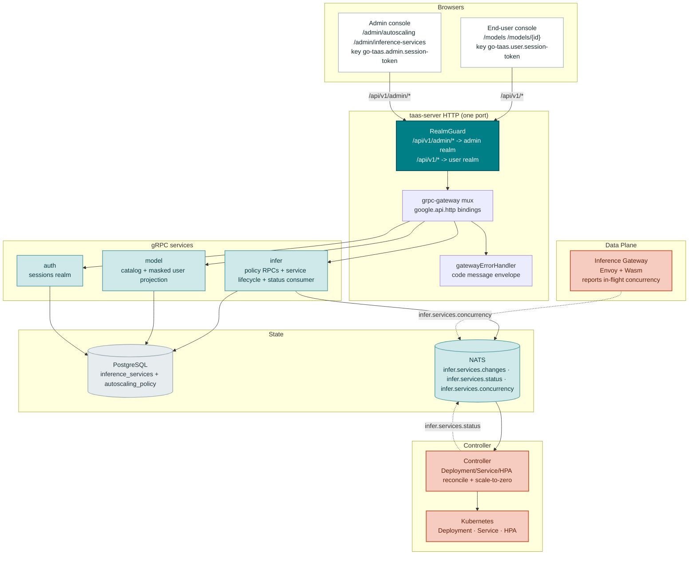
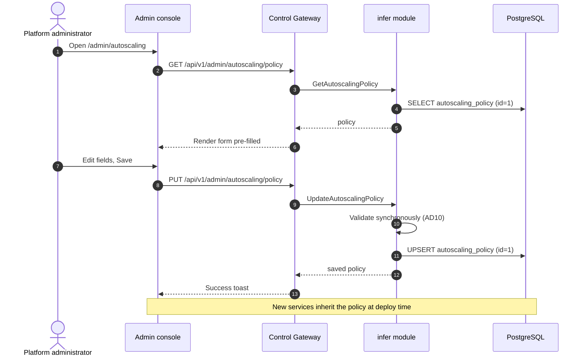
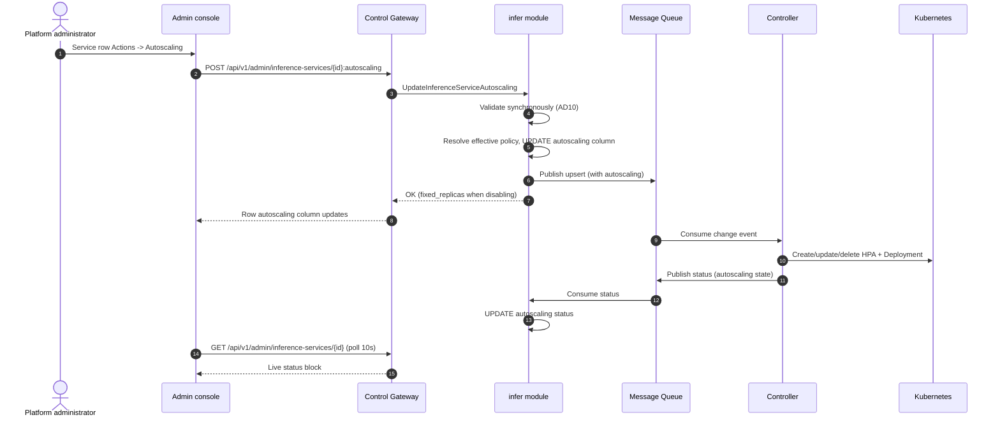
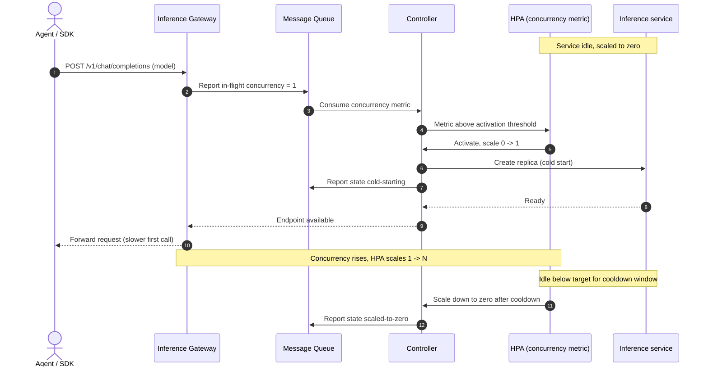
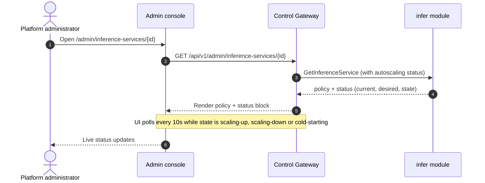

# Inference Autoscaling & Scale-to-Zero — Architecture and Detailed Design

| Attribute | Content |
| --- | --- |
| Feature point | Inference autoscaling & scale-to-zero (backlog row 16) |
| Document scope | Architecture and detailed design for automatic horizontal scaling of inference services and scale-to-zero: the autoscaling policy data model (global default + per-service), the admin `/api/v1/admin/*` API surface (policy CRUD, per-service autoscaling config, extended service create/list/get), the user `/api/v1/*` read-only surface, the Controller's HPA/scale-to-zero reconciliation loop, the frontend pages for both consoles, surface/auth mapping, error handling, configuration, security, rollout, and function-level design per layer |
| Owning modules | `infer` (autoscaling policy on inference services, policy RPCs, status projection), `model` (user-surface autoscaling projection), `internal/controller` (HPA reconciliation, scale-to-zero scheduling, autoscaling status reporting), `pkg/errors` (10307), `web/` (both consoles) |
| Related documents | [Requirement Analysis and UI/UX Design](../design/inference-autoscaling.md) · [Architecture Design](../design/architecture.md) §2.4 (`infer`), §2.7 Controller, §4.2 one-click deployment flow · [Model Catalog & One-Click Deployment](./model-catalog-deployment.md) — the inference-service lifecycle this feature extends · [Console Surface Separation](./console-surface-separation.md) — the two-surface rule and realm guard this feature follows · [Usage Dashboards & Per-Request Cost Attribution](./usage-dashboard.md) — the user-surface model list pattern |
| Status | Architecture complete, handed to the Developer agent |

---

## 1. Goals and Non-Goals

### 1.1 Goals

- Implement the autoscaling **policy on the inference service** (design D1): a global default policy applied to new services, and a per-service policy that overrides it, both editable in place.
- Implement the admin API surface: `GetAutoscalingPolicy` / `UpdateAutoscalingPolicy` (global default, synchronous), `UpdateInferenceServiceAutoscaling` (per-service, asynchronous via MQ), and the extended `CreateInferenceService` / `ListInferenceServices` / `GetInferenceService` that carry the policy and live autoscaling status.
- Implement the user read-only surface: `ListAvailableModels` extended with an autoscaling projection and a new `GetAvailableModel` returning the read-only autoscaling summary.
- Synchronous policy validation at the API boundary (design D10): `min ≤ max`, `min = 0 ⟺ scale_to_zero`, target 1–1000, cooldown 0–3600 — rejected **before** any message is published.
- The Controller turns the policy into a Kubernetes **HPA on a concurrency metric** (design D4), with a downscale stabilization window equal to the cooldown, and drives scale-to-zero through the HPA `minReplicas: 0` path with an activation threshold.
- Autoscaling status feedback: the Controller reports current/desired replicas, current concurrency, and an autoscaling state (closed enum) back to `infer`, so both consoles can render live status and cold-start visibility.
- Scale-to-zero scheduling: an idle service scales to zero after the cooldown window; a request to a scaled-to-zero service triggers activation (cold-start) and the state surfaces as `cold-starting` (admin) / `warming up` (user).
- Schema, configuration, and framework changes needed to ship the above, with function-level responsibilities precise enough to implement without guessing.

### 1.2 Non-Goals

| Item | Deferred to |
| --- | --- |
| Per-model autoscaling defaults distinct from the global default | Follow-up feature point (design §9) |
| Vertical autoscaling (GPU sizing) and node-level autoscaling | Future feature point |
| Fine-grained scaling behaviors (per-direction policies, custom metric formulas, multiple metrics) | Future feature point |
| Canary / blue-green autoscaling | Future feature point |
| Tenant-facing autoscaling configuration (self-service scaling) | Future feature point (currently read-only for tenants) |
| Requiring a session on `/api/v1/admin/*` (transitional `X-Organization-Id` path stays) | Follow-up hardening row (console-surface-separation §11) |
| Business-code → HTTP status mapping in the gateway | Platform-wide follow-up |

---

## 2. Architecture Decisions

AD1–AD10 restate the UI/UX design's decisions as implementation-level rules. **AD11–AD13 are refinements** the architecture adds, each marked as such with the design decision it refines; they preserve the design's intent and are recorded here so the Developer and Test agents implement one reading.

| # | Decision | Rationale |
| --- | --- | --- |
| AD1 | **Autoscaling is a policy on the inference service**, not a new resource type. The policy is a JSON column on `inference_services` plus a singleton global-default row | Design D1. Matches the `infer` module's desired-state model; the Controller turns the policy into an HPA, keeping the console contract stable |
| AD2 | **The policy has exactly six fields**: `enabled` (bool), `min_replicas` (0–max), `max_replicas` (min–100), `target_concurrency` (1–1000, default 32), `scale_to_zero` (bool, requires min=0), `cooldown_seconds` (0–3600, default 300) | Design D2. The smallest field set that mirrors the industry min/max + target + activation/cooldown contract; concurrency is the metric that works at zero |
| AD3 | **Scale-to-zero is a separate toggle that requires `min_replicas = 0`**; enabling it forces min to 0, disabling it forces min to ≥ 1 | Design D3. KServe's explicit opt-in is the cleanest UX; the min=0 dependency is a form rule and a synchronous validation rule, never a hidden constraint |
| AD4 | **The Controller implements the policy as a Kubernetes HPA on a concurrency metric** (in-flight requests reported by the Inference Gateway), with a downscale stabilization window equal to the cooldown; scale-to-zero uses the HPA `minReplicas: 0` path with an activation threshold | Design D4. Concurrency is measurable at the gateway even at zero replicas (the gateway sees the request before routing); this is the only metric that supports scale-to-zero |
| AD5 | **Autoscaling configuration is admin-surface only**; the end-user console gets a read-only autoscaling summary per model | Design D5. Configuration is operator orchestration; the tenant consumes models and only needs to know the model is autoscaled and its current behavior |
| AD6 | **The admin console manages autoscaling in two places**: a global default policy (applied to new services) and a per-service policy (overrides the default) | Design D6. A global default keeps new deployments sane; per-service override gives operators control where it matters |
| AD7 | **The end-user console shows autoscaling at the model level**, never the service level | Design D7. The tenant consumes models over the OpenAI-compatible endpoint; services are operator-internal artifacts |
| AD8 | **A scaled-to-zero service that receives a request shows `cold-starting` to the operator and `warming up` to the tenant** | Design D8. Cold-start is the one UX cost of scale-to-zero; surfacing it prevents "is the model down?" confusion |
| AD9 | **Autoscaling changes are asynchronous like deployment**: the update returns immediately, the service state reflects convergence, and the console polls | Design D9. Matches the MQ + Controller reconciliation model; blocking on HPA convergence would time out the HTTP call |
| AD10 | **The policy is validated synchronously at the API boundary** before any message is published | Design D10. Invalid policies must never reach the Controller (same rule as feature #2's deploy validation) |
| AD11 | **REFINEMENT of design D4 — the concurrency metric is reported by the Inference Gateway on a dedicated subject, and the Controller exposes it to the HPA as a custom/object metric.** The HPA targets the gateway-reported in-flight concurrency for the service's label selector; the Controller owns the HPA object lifecycle (create/update/delete alongside the Deployment) | The data-plane gateway is the only component that sees a request before routing, so it is the authoritative source of in-flight concurrency. The Controller already owns the Deployment/Service; owning the HPA keeps one reconciler and one status publisher. The gateway-side metric emission is pinned as a contract here (the data-plane track implements it); the Controller consumes the subject and feeds the HPA |
| AD12 | **REFINEMENT of design D4 — the activation threshold is derived from the target concurrency, not a separate user field.** Activation fires when reported concurrency ≥ 1 (a request is in flight) and the service is at zero; scale-down to zero fires only when concurrency stays below the target for the full cooldown window | The design's field set (AD2) has no activation-threshold field; deriving activation from "any in-flight request" and scale-down from "below target for cooldown" preserves KEDA's two-threshold intent (no flapping at the 0↔1 boundary) without adding a seventh field. A single stray request activates (cold-start), but does not keep the service at 1 — it scales back to zero after the cooldown if no further load arrives |
| AD13 | **REFINEMENT of design §7.2 — the user-surface model detail is a new `GetAvailableModel` RPC** (not an extension of `GetModel`), and the autoscaling projection is a new message type `ModelAutoscaling` carried by both `AvailableModel` and `GetAvailableModel` | The masked user catalog (feature-17 AD8/AD11) must not leak operator fields (cooldown, target concurrency, service identifiers). A separate RPC with a separate, smaller message makes the mask structural instead of conditional, exactly as `ListAvailableModels` already is |

---

## 3. Component View

### 3.1 Ownership

| Layer / component | Owns | Changes in this feature |
| --- | --- | --- |
| **Control Gateway (`pkg/server`)** | HTTP composition: `RealmGuard` → `withConsole` → `runtime.ServeMux`; the incoming header matcher (`X-Organization-Id`); the unified error renderer | No change — the new RPCs are routed by their `google.api.http` annotations; the realm guard already enforces the surface split (AD5) |
| **grpc-gateway mux** | Path → RPC routing from `google.api.http` annotations | New bindings for `GetAutoscalingPolicy`, `UpdateAutoscalingPolicy`, `UpdateInferenceServiceAutoscaling`, `GetAvailableModel`; extended bindings for `CreateInferenceService`, `ListInferenceServices`, `GetInferenceService`, `ListAvailableModels` |
| **`infer`** | Inference-service lifecycle, autoscaling policy, change publication, status consumption, autoscaling status projection | Autoscaling policy fields on the service; global-default policy store; policy RPCs; extended create/list/get; autoscaling status consumer; concurrency-metric subject consumer |
| **`model`** | Model catalog, versions, tenant authorization grants, masked user catalog | `ListAvailableModels` extended with the autoscaling projection; new `GetAvailableModel` |
| **`internal/controller`** | Kubernetes reconciliation: Deployment/Service/HPA, scale-to-zero scheduling, autoscaling status reporting | HPA create/update/delete; concurrency-metric consumption; autoscaling status report on the status subject |
| **Inference Gateway (data plane)** | Envoy + Wasm: auth, metering, routing | **Contract pinned only** — reports in-flight concurrency per service on a new subject (AD11); the data-plane track implements it |
| **`pkg/errors`** | Code blocks per module | One new infer code: **10307 `CodeAutoscalingPolicyInvalid`** |
| **`web/`** | Both consoles | Admin: Autoscaling page, per-service dialog, autoscaling column/status block; User: model list autoscaling indicator, model detail autoscaling summary |

### 3.2 Runtime component view



| Component | Responsibility in this feature |
| --- | --- |
| Admin console | Autoscaling page (global default), per-service autoscaling dialog, autoscaling column on the service list, autoscaling status block on the service detail |
| End-user console | Model list autoscaling indicator, model detail read-only autoscaling summary |
| Control Gateway (`grpc-gateway`) | HTTP/JSON facade for all new/extended RPCs; the realm guard enforces the surface split (AD5); passes `X-Organization-Id` through as gRPC metadata |
| `infer` module (`services/infer`) | Policy RPCs, synchronous validation, global-default store, per-service policy persistence, extended create/list/get, autoscaling status consumer, concurrency-metric subject consumer |
| `model` module (`services/model`) | `ListAvailableModels` extended with the autoscaling projection; new `GetAvailableModel` |
| PostgreSQL | `inference_services` gains autoscaling columns; new `autoscaling_policy` singleton table |
| Message Queue | `infer.services.changes` (desired state, now carries the policy), `infer.services.status` (observed state, now carries autoscaling status), new `infer.services.concurrency` (gateway-reported in-flight concurrency) |
| Controller (`internal/controller`) | Decodes change events, creates/updates/deletes the Deployment, Service and HPA, consumes the concurrency subject, drives scale-to-zero, reports autoscaling status |
| Inference Gateway | **Contract pinned** — reports in-flight concurrency per service on `infer.services.concurrency` (AD11); the data-plane track implements it |

---

## 4. Data Model

### 4.1 The `inference_services` Table (additive)

| Column | PostgreSQL type | Constraints | Description |
| --- | --- | --- | --- |
| `autoscaling` | `jsonb` | NOT NULL DEFAULT '{}' | The autoscaling policy (AD2). Empty `{}` means "inherit the global default" (design FR1.2) |

Existing columns (`id`, `organization_id`, `name`, `model_id`, `model_version`, `image_id`, `replicas`, `accelerator`, `accelerator_type`, `state`, `failure_reason`, `endpoints`, `created_at`, `updated_at`) are unchanged.

Design notes:

- **`autoscaling` as `jsonb`**: the policy is a fixed six-field object (AD2); JSON keeps the schema flexible for the follow-up per-model defaults and fine-grained behaviors without a migration per field. The GORM model stores it as `datatypes.JSON` (the same pattern as `endpoints`).
- **Empty `{}` means inherit**: a service created without an explicit policy stores `{}` and the effective policy is resolved at read time by merging the global default. This keeps `CreateInferenceService` backward-compatible (existing callers that omit the policy get the default) and makes "existing services are unaffected unless they opt in" (FR1.2) a natural consequence — an existing service with a stored policy keeps it; one with `{}` resolves to the current global default.
- **`replicas` semantics under autoscaling**: when autoscaling is enabled, `replicas` is the **desired** count the HPA manages (the HPA's `minReplicas`/`maxReplicas` bound it). When autoscaling is disabled (FR2.5), `replicas` is the fixed count the service runs at. The Controller reconciles both cases.

### 4.2 The `autoscaling_policy` Table (new, singleton)

| Column | PostgreSQL type | Constraints | Description |
| --- | --- | --- | --- |
| `id` | `int` | PRIMARY KEY, CHECK (id = 1) | Singleton row id (always 1) |
| `enabled` | `boolean` | NOT NULL DEFAULT true | Global default: autoscaling on for new services |
| `min_replicas` | `int` | NOT NULL DEFAULT 1 | 0–max |
| `max_replicas` | `int` | NOT NULL DEFAULT 10 | min–100 |
| `target_concurrency` | `int` | NOT NULL DEFAULT 32 | 1–1000 |
| `scale_to_zero` | `boolean` | NOT NULL DEFAULT false | Requires min = 0 |
| `cooldown_seconds` | `int` | NOT NULL DEFAULT 300 | 0–3600 |
| `updated_at` | `timestamptz` | NOT NULL | Last save time |

Design notes:

- **Singleton**: the global default is a single row (`id = 1`). `GetAutoscalingPolicy` reads it; `UpdateAutoscalingPolicy` upserts it. A fresh install seeds the row with defaults at migration time (design FR1.4: "the global policy always exists").
- **No `organization_id`**: the global default is platform-wide (design D6), not per-organization. Per-organization defaults are a follow-up.

### 4.3 Migration Notes

- Both tables are handled by **GORM `AutoMigrate` at startup** through the existing `Migrator` hooks (`infer.Service.Migrate`). Additive only; no data migration.
- The `autoscaling_policy` singleton is **seeded** in `Migrate`: after AutoMigrate, if no row with `id = 1` exists, insert the defaults (enabled=true, min=1, max=10, target=32, scale_to_zero=false, cooldown=300). This satisfies "the global policy always exists" (FR1.4) on a fresh install and is a no-op on an existing install.
- Existing `inference_services` rows get `autoscaling = '{}'` (inherit), so no existing service changes behavior until an operator edits it (FR1.2).

---

## 5. API Design

### 5.1 RPC Surface

All new RPCs belong to **`taas.infer.v1.InferServiceService`** (policy + per-service) and **`taas.model.v1.ModelService`** (user projection), served as HTTP via the Control Gateway. Proto changes are additive.

#### 5.1.1 Admin surface (`/api/v1/admin/*`)

| RPC | HTTP | Status | Purpose |
| --- | --- | --- | --- |
| `GetAutoscalingPolicy` | `GET /api/v1/admin/autoscaling/policy` | **new** | Read the global default policy |
| `UpdateAutoscalingPolicy` | `PUT /api/v1/admin/autoscaling/policy` | **new** | Save the global default; synchronous (FR1.4) |
| `CreateInferenceService` | `POST /api/v1/admin/inference-services` | extended | Request gains an `autoscaling` policy field (AD2) |
| `UpdateInferenceServiceAutoscaling` | `POST /api/v1/admin/inference-services/{service_id}:autoscaling` | **new** | Edit per-service policy; async via MQ (AD9) |
| `ListInferenceServices` | `GET /api/v1/admin/inference-services` | extended | Summary gains autoscaling fields (enabled, current/min/max, state) |
| `GetInferenceService` | `GET /api/v1/admin/inference-services/{service_id}` | extended | Detail gains full policy + status block |

#### 5.1.2 User surface (`/api/v1/*`)

| RPC | HTTP | Status | Purpose |
| --- | --- | --- | --- |
| `ListAvailableModels` | `GET /api/v1/models` | extended | Summary gains autoscaling projection (autoscaled, current replicas, state) |
| `GetAvailableModel` | `GET /api/v1/models/{model_id}` | **new** | Read-only autoscaling summary for one model (AD13) |

### 5.2 Proto Sketches

```protobuf
// infer.proto — new messages
message AutoscalingPolicy {
  bool enabled = 1;
  int32 min_replicas = 2;
  int32 max_replicas = 3;
  int32 target_concurrency = 4;
  bool scale_to_zero = 5;
  int32 cooldown_seconds = 6;
}

// AutoscalingState is the closed enum the consoles render badges from.
enum AutoscalingState {
  AUTOSCALING_STATE_UNSPECIFIED = 0;
  AUTOSCALING_STATE_DISABLED = 1;
  AUTOSCALING_STATE_STEADY = 2;
  AUTOSCALING_STATE_SCALING_UP = 3;
  AUTOSCALING_STATE_SCALING_DOWN = 4;
  AUTOSCALING_STATE_SCALED_TO_ZERO = 5;
  AUTOSCALING_STATE_COLD_STARTING = 6;
  AUTOSCALING_STATE_ERROR = 7;
}

message AutoscalingStatus {
  AutoscalingState state = 1;
  int32 current_replicas = 2;
  int32 desired_replicas = 3;
  int32 current_concurrency = 4;
  int32 target_concurrency = 5;
  int64 last_scaling_event_at = 6;
  string error_reason = 7; // populated when state = ERROR
}

message GetAutoscalingPolicyRequest {}
message GetAutoscalingPolicyResponse {
  taas.common.v1.Response response = 1;
  AutoscalingPolicy policy = 2;
}
message UpdateAutoscalingPolicyRequest {
  AutoscalingPolicy policy = 1;
}
message UpdateAutoscalingPolicyResponse {
  taas.common.v1.Response response = 1;
  AutoscalingPolicy policy = 2;
}

// CreateInferenceServiceRequest gains:
//   AutoscalingPolicy autoscaling = 8;  // empty = inherit global default

// InferenceServiceSummary gains:
//   bool autoscaling_enabled = 9;
//   int32 current_replicas = 10;
//   int32 min_replicas = 11;
//   int32 max_replicas = 12;
//   AutoscalingState autoscaling_state = 13;

// GetInferenceServiceResponse gains:
//   AutoscalingPolicy autoscaling = 4;   // effective policy (resolved)
//   AutoscalingStatus autoscaling_status = 5;

message UpdateInferenceServiceAutoscalingRequest {
  string service_id = 1; // path
  AutoscalingPolicy policy = 2;
}
message UpdateInferenceServiceAutoscalingResponse {
  taas.common.v1.Response response = 1;
  int32 fixed_replicas = 2; // resulting fixed count when disabling (FR2.5)
}

// rpc GetAutoscalingPolicy(GetAutoscalingPolicyRequest) returns (GetAutoscalingPolicyResponse) {
//   option (google.api.http) = { get: "/api/v1/admin/autoscaling/policy" };
// }
// rpc UpdateAutoscalingPolicy(UpdateAutoscalingPolicyRequest) returns (UpdateAutoscalingPolicyResponse) {
//   option (google.api.http) = { put: "/api/v1/admin/autoscaling/policy" body: "*" };
// }
// rpc UpdateInferenceServiceAutoscaling(UpdateInferenceServiceAutoscalingRequest) returns (UpdateInferenceServiceAutoscalingResponse) {
//   option (google.api.http) = { post: "/api/v1/admin/inference-services/{service_id}:autoscaling" body: "*" };
// }
```

```protobuf
// model.proto — new messages
message ModelAutoscaling {
  bool autoscaled = 1;
  int32 current_replicas = 2;
  int32 min_replicas = 3;
  int32 max_replicas = 4;
  bool scale_to_zero = 5;
  string state = 6; // steady | scaling | scaled-to-zero | warming-up | fixed
}

// AvailableModel gains:
//   ModelAutoscaling autoscaling = 4;  // nil when the model is not autoscaled

message GetAvailableModelRequest {
  string model_id = 1; // path
}
message GetAvailableModelResponse {
  taas.common.v1.Response response = 1;
  AvailableModel model = 2;
  ModelAutoscaling autoscaling = 3;
}

// rpc GetAvailableModel(GetAvailableModelRequest) returns (GetAvailableModelResponse) {
//   option (google.api.http) = { get: "/api/v1/models/{model_id}" };
// }
```

### 5.3 Validation Matrix (synchronous, before publish)

`UpdateAutoscalingPolicy` and `UpdateInferenceServiceAutoscaling` run these checks in order; the first failure returns immediately and **nothing is published** (AD10, design AC2):

| # | Check | Failure code | Canonical message |
| --- | --- | --- | --- |
| 1 | `min_replicas ≤ max_replicas` | 10307 `CodeAutoscalingPolicyInvalid` | autoscaling policy invalid: min replicas must be ≤ max replicas |
| 2 | `min_replicas = 0` requires `scale_to_zero = true` | 10307 | autoscaling policy invalid: min replicas 0 requires scale-to-zero |
| 3 | `scale_to_zero = true` requires `min_replicas = 0` | 10307 | autoscaling policy invalid: scale-to-zero requires min replicas 0 |
| 4 | `target_concurrency` in 1–1000 | 10307 | autoscaling policy invalid: target concurrency must be between 1 and 1000 |
| 5 | `cooldown_seconds` in 0–3600 | 10307 | autoscaling policy invalid: cooldown must be between 0 and 3600 seconds |
| 6 | `max_replicas` in 1–100 | 10307 | autoscaling policy invalid: max replicas must be between 1 and 100 |

`CreateInferenceService` runs the existing validation matrix (model-catalog §4.3) **plus** the policy validation above when an explicit `autoscaling` policy is present. `UpdateInferenceServiceAutoscaling` additionally validates the service exists and is not `terminated` (10301 / 10303).

### 5.4 Wire Format (established conventions)

- Pagination binds as `?page.offset=0&page.limit=20` (dotted form); default limit 20, cap 100.
- Success responses are HTTP 200 (grpc-gateway default for unary RPCs), including creates and updates.
- Business errors render as `{"code": <int>, "message": "..."}` with HTTP 500 for out-of-range codes (platform-wide status quo).
- The transitional `X-Organization-Id` header scopes list and create calls, exactly as in the API Key feature. The realm guard (console-surface-separation AD2/AD3) enforces the surface split: a wrong-realm session fails with 10038 `REALM_MISMATCH`; a realm-less/expired session fails with 10027 `SESSION_INVALID`; a missing `Authorization` header passes through in transitional mode.

### 5.5 Surface and Auth Mapping

| Endpoint | Surface | Realm | Guard |
| --- | --- | --- | --- |
| `GET /api/v1/admin/autoscaling/policy` | admin | admin | `RealmGuard` (admin realm) + transitional `X-Organization-Id` |
| `PUT /api/v1/admin/autoscaling/policy` | admin | admin | `RealmGuard` (admin realm) + transitional `X-Organization-Id` |
| `POST /api/v1/admin/inference-services` | admin | admin | `RealmGuard` (admin realm) + transitional `X-Organization-Id` |
| `POST /api/v1/admin/inference-services/{id}:autoscaling` | admin | admin | `RealmGuard` (admin realm) + transitional `X-Organization-Id` |
| `GET /api/v1/admin/inference-services` | admin | admin | `RealmGuard` (admin realm) + transitional `X-Organization-Id` |
| `GET /api/v1/admin/inference-services/{id}` | admin | admin | `RealmGuard` (admin realm) + transitional `X-Organization-Id` |
| `GET /api/v1/models` | user | user | `RealmGuard` (user realm) + transitional `X-Organization-Id` |
| `GET /api/v1/models/{id}` | user | user | `RealmGuard` (user realm) + transitional `X-Organization-Id` |

Failure semantics (for the Test agent): a request that presents the **wrong realm's** session on either prefix fails with HTTP 500 and body `{"code":10038,"message":"session belongs to the other console"}`. A request with an unknown/expired/realm-less session fails with `{"code":10027,"message":"<session invalid>"}`. A request with **no** `Authorization` header passes through in transitional mode (the CLI, FVT and e2e suites never send a token). The admin console never calls a `/api/v1/*` autoscaling route and the user console never calls a `/api/v1/admin/*` route (design AC10).

---

## 6. Message Contracts

### 6.1 Desired-State Change (`infer.services.changes`, extended)

The existing change event (model-catalog §4.5.1) gains an `autoscaling` object. JSON body:

```json
{
  "event_type": "upsert" | "delete",
  "service_id": "uuid",
  "organization_id": "org",
  "name": "qwen25-32b-a800",
  "model": {"model_id": "uuid", "version": "Qwen2.5-32B-Instruct", "weight_path": "models/qwen2.5-32b/"},
  "image": {"image_id": "uuid", "reference": "ghcr.io/go-taas/vllm:v0.6.3", "engine": "vllm"},
  "replicas": 2,
  "accelerator": "nvidia",
  "accelerator_type": "A800",
  "autoscaling": {
    "enabled": true,
    "min_replicas": 1,
    "max_replicas": 10,
    "target_concurrency": 32,
    "scale_to_zero": false,
    "cooldown_seconds": 300
  },
  "published_at": "2026-09-25T10:00:00Z"
}
```

The `autoscaling` object is the **effective** policy (resolved from the global default when the service stores `{}`), so the Controller never needs a database round-trip. When autoscaling is disabled, `autoscaling.enabled = false` and `replicas` is the fixed count.

### 6.2 Status Report (`infer.services.status`, extended)

The existing status report (model-catalog §4.5.2) gains an `autoscaling` status object. JSON body:

```json
{
  "service_id": "uuid",
  "state": "deploying" | "running" | "failed",
  "endpoints": ["https://infer.example.com/v1"],
  "failure_reason": "weight path models/qwen2.5-32b/ not found in object storage",
  "autoscaling": {
    "state": "steady" | "scaling-up" | "scaling-down" | "scaled-to-zero" | "cold-starting" | "error",
    "current_replicas": 3,
    "desired_replicas": 3,
    "current_concurrency": 12,
    "target_concurrency": 32,
    "last_scaling_event_at": "2026-09-25T10:03:41Z",
    "error_reason": ""
  },
  "reported_at": "2026-09-25T10:03:41Z"
}
```

`infer` consumes this subject and updates `state`, `endpoints`, `failure_reason`, and the autoscaling status columns. The autoscaling status is **write-only by the Controller** — no RPC sets it directly; it is read-only on the wire.

### 6.3 Concurrency Metric (`infer.services.concurrency`, new subject)

Published by the Inference Gateway (AD11). JSON body:

```json
{
  "service_id": "uuid",
  "in_flight": 12,
  "reported_at": "2026-09-25T10:03:41Z"
}
```

The Controller consumes this subject and feeds the HPA's concurrency metric (Section 7). The gateway emits one report per service on a bounded interval (e.g. every 5 s) and on request arrival/departure; the Controller keeps the latest value per service in memory and exposes it to the HPA as the object metric value.

Subject registration: `mq.Subjects` gains `InferServiceConcurrency: "infer.services.concurrency"` in `DefaultSubjects()`. The controller subscribes to it; the gateway publishes to it.

---

## 7. Controller Design (HPA and Scale-to-Zero)

### 7.1 HPA Reconciliation

The Controller owns the HPA lifecycle alongside the Deployment/Service (AD11). On an `upsert` change event with `autoscaling.enabled = true`:

1. Create or update the Deployment and Service exactly as today (model-catalog §10.5).
2. Create or update a `HorizontalPodAutoscaler` named `hpa-<service-name>` in `reconcileNamespace`:
   - `spec.scaleTargetRef` → the Deployment.
   - `spec.minReplicas` → `autoscaling.min_replicas` (0 when scale-to-zero is on).
   - `spec.maxReplicas` → `autoscaling.max_replicas`.
   - `spec.metrics` → one object metric: `pods`/`object` metric on the concurrency value for the service's label selector, with `target.type = AverageValue` and `target.averageValue = autoscaling.target_concurrency`.
   - `spec.behavior.scaleDown.stabilizationWindowSeconds` → `autoscaling.cooldown_seconds` (AD4).
3. On an `upsert` with `autoscaling.enabled = false`: delete the HPA and set the Deployment's `replicas` to the fixed count (the current desired count, per FR2.5).
4. On a `delete` change event: delete the HPA alongside the Deployment and Service.

### 7.2 Scale-to-Zero Scheduling

Scale-to-zero uses the HPA `minReplicas: 0` path with an activation threshold (AD4, AD12):

- **Activation (0 → 1)**: the HPA's concurrency metric is the gateway-reported in-flight concurrency. When a request arrives at a scaled-to-zero service, the gateway reports `in_flight ≥ 1`; the HPA sees the metric above the activation threshold (≥ 1) and scales to 1. The Controller observes the transition and reports `autoscaling.state = cold-starting` (admin) / `warming up` (user) while the replica spins up, then `steady` once ready.
- **Scale-down to zero (1 → 0)**: the HPA scales down only when the concurrency stays below the target for the full `cooldown_seconds` stabilization window (AD12). A single stray request activates but does not keep the service at 1 — it scales back to zero after the cooldown if no further load arrives (design FR5.3).
- **Cooldown enforcement**: the HPA's `scaleDown.stabilizationWindowSeconds = cooldown_seconds` prevents a just-scaled-down service from being immediately re-created (design FR5.2, AC7).

### 7.3 Autoscaling Status Reporting

The Controller derives the autoscaling state from the HPA and Deployment observed state and reports it on `infer.services.status` (Section 6.2):

| Observed | `autoscaling.state` |
| --- | --- |
| Autoscaling disabled | `disabled` |
| `current == desired`, both > 0 | `steady` |
| `current < desired` | `scaling-up` |
| `current > desired` | `scaling-down` |
| `current == 0`, `desired == 0`, idle | `scaled-to-zero` |
| `current == 0`, `desired ≥ 1` (a request arrived, spinning up) | `cold-starting` |
| HPA rejected / metric unavailable / reconcile error | `error` (+ `error_reason`) |

The Controller reports autoscaling status on every reconcile and on every concurrency-metric update that changes the state (bounded to avoid flooding the subject — e.g. at most once per 5 s per service).

### 7.4 Concurrency Metric Consumption

The Controller subscribes to `infer.services.concurrency` (Section 6.3), keeps the latest `in_flight` per `service_id` in memory, and exposes it to the HPA as the object metric value. The HPA polls the metric via the metrics API; the Controller implements the metric provider seam (or, in the simplest integration, the Controller writes the value to a `CustomMetric`/`ExternalMetric` resource the HPA reads). The exact metric-provider mechanism is a data-plane/controller integration detail; the contract pinned here is the subject and the value semantics.

---

## 8. Sequence Diagrams

### 8.1 Global Default Policy Save (admin)



### 8.2 Per-Service Autoscaling Update (admin, async)



### 8.3 Scale-to-Zero and Cold-Start



### 8.4 Autoscaling Status Polling (admin)



---

## 9. Error Handling

All errors are `pkg/errors` business codes in the unified envelope. One new code is added.

| Condition | Code | Constant | Notes |
| --- | --- | --- | --- |
| Policy validation failure (any of §5.3) | 10307 | `CodeAutoscalingPolicyInvalid` | Detail names the failing rule (AD10) |
| Service not found (per-service autoscaling) | 10301 | `CodeInferServiceNotFound` | Cross-organization access looks identical (no existence leak) |
| Per-service autoscaling on a terminated service | 10303 | `CodeInferServiceStateInvalid` | Detail: "cannot autoscale a terminated service" |
| Wrong-realm session on either prefix | 10038 | `CodeRealmMismatch` | Realm guard (console-surface-separation AD3) |
| Unknown/expired/realm-less session | 10027 | `CodeSessionInvalid` | Realm guard |
| Missing `X-Organization-Id` | 10001 | `CodeUnauthorized` | Transitional (same as API keys) |
| Database / MQ infrastructure failure | 500 | `CodeInternal` | Via error normalization |

Controller-side failures are not RPC errors: they surface as `autoscaling.state = error` + `error_reason` through the status subject (design FR3.4). A status-publish failure is logged and retried with the next reconcile.

---

## 10. Configuration Additions

```yaml
infer:
  endpointBaseURL: "https://infer.example.com"
  statusConsumer:
    enabled: true
    workers: 2
  autoscaling:
    concurrencyConsumer:
      enabled: true
      workers: 2
    statusReportInterval: "5s"
```

| Key | Default | Description |
| --- | --- | --- |
| `infer.autoscaling.concurrencyConsumer.enabled` | `true` | Kill switch for the concurrency-metric consumer Runner |
| `infer.autoscaling.concurrencyConsumer.workers` | `2` | Concurrent concurrency handlers |
| `infer.autoscaling.statusReportInterval` | `5s` | Minimum interval between autoscaling status reports per service (bounded to avoid flooding the subject) |

Rules (same as the API Key feature):

- The section ships in **both** `configs/config.yaml` and `configs/server.yaml` (every binary's config glob must see the same keys). The controller binary additionally gets `infer.autoscaling.statusReportInterval` in `configs/controller.yaml` (it reports status).
- Zero values fall back to shipped defaults at the use site; `Configuration.Validate` rejects negative workers and a non-positive status-report interval.

---

## 11. Security Considerations

- **Surface separation is enforced by the realm guard** (console-surface-separation AD2/AD3): the admin autoscaling endpoints live only under `/api/v1/admin/*` and the user read-only endpoints only under `/api/v1/*`. A wrong-realm session fails with 10038; the two consoles never share a session token. The user surface carries **no** operator fields (no cooldown, no target concurrency, no service identifiers) — the masked projection (AD13) makes the mask structural.
- **Organization scoping is transitional and spoofable** (`X-Organization-Id`), identical to the API Key feature's status quo; the management API is effectively unauthenticated today. This feature does not widen that exposure. Removed in feature #7.
- **No secrets in messages**: change, status and concurrency messages carry only resource specs, URLs and metric values — no credentials, no API keys.
- **Policy validation is synchronous** (AD10): an invalid policy never reaches the Controller, so a malformed HPA spec cannot be created from a bad request.
- **Controller privilege**: the controller's service account needs Deployment/Service/HPA CRUD in the platform namespace — no cluster-admin, no secret read. HPA CRUD is additive to the existing RBAC.
- **Endpoint and status disclosure**: autoscaling status is organization-scoped data returned only through the scoped APIs; `GetInferenceService` on another organization's service returns 10301 (no existence leak).

---

## 12. Rollout Notes

- **Schema**: `inference_services` gains `autoscaling` (jsonb, default `{}`); new `autoscaling_policy` singleton table seeded with defaults. Additive via AutoMigrate; no data migration.
- **Configuration**: the `infer.autoscaling` section ships in `configs/config.yaml`, `configs/server.yaml`, and (for `statusReportInterval`) `configs/controller.yaml`. Custom configs without the section keep working (zero-value defaults).
- **Proto**: additive changes — new messages, new RPCs, extended messages. `make pbgen` regenerates the gateway bindings.
- **New subject**: `infer.services.concurrency` is additive; brokers are subject-based (NATS) so no migration.
- **Controller**: the reconciler gains HPA lifecycle and the concurrency-metric consumer behind the existing `Reconciler` interface — no signature change, the fake-based tests keep working.
- **Rolling update order**: deploy `taas-server` first (it starts publishing policy-bearing changes and consuming status), then the controller. The reverse order is safe too: the controller ignores subjects with no publishers.
- **Feature flags**: none needed — the new RPCs are additive; existing services with `autoscaling = '{}'` inherit the global default and existing behavior is unchanged until an operator edits a policy.

---

## 13. Frontend Architecture

### 13.1 Page → Route → API-Prefix Table

| Page / component | Surface | Web route | API prefix | RPC |
| --- | --- | --- | --- | --- |
| Autoscaling page (global default editor) | admin | `/admin/autoscaling` | `/api/v1/admin/autoscaling/policy` | `GetAutoscalingPolicy` / `UpdateAutoscalingPolicy` |
| Per-service autoscaling dialog (from service list/detail) | admin | `/admin/inference-services` (dialog) | `/api/v1/admin/inference-services/{id}:autoscaling` | `UpdateInferenceServiceAutoscaling` |
| Autoscaling section in the deploy form | admin | `/admin/inference-services` (deploy dialog) | `/api/v1/admin/inference-services` | `CreateInferenceService` (extended) |
| Autoscaling status column on the service list | admin | `/admin/inference-services` | `/api/v1/admin/inference-services` | `ListInferenceServices` (extended) |
| Autoscaling status block on the service detail | admin | `/admin/inference-services/{id}` | `/api/v1/admin/inference-services/{id}` | `GetInferenceService` (extended) |
| End-user model list autoscaling indicator | user | `/models` | `/api/v1/models` | `ListAvailableModels` (extended) |
| End-user model detail autoscaling summary | user | `/models/{id}` | `/api/v1/models/{id}` | `GetAvailableModel` (new) |

> The end-user console has **no** autoscaling configuration page; the user surface is read-only (AD5, AD7). The admin console has no autoscaling page on the user prefix.

### 13.2 Navigation Placement

- **Admin console** (`AdminShell`): a new **Autoscaling** nav item (`/admin/autoscaling`, testid `nav-autoscaling`) alongside Models/Images/Inference Services. The Inference Services page (`/admin/inference-services`) and Service Detail page (`/admin/inference-services/{id}`) are upgraded in place with the autoscaling column/status block and the per-service dialog.
- **End-user console** (`UserShell`): a new **Models** nav item (`/models`, testid `nav-models`) — the user model list is a new page (the current user surface has no `/models` route; the playground already consumes `ListAvailableModels`). The model detail page (`/models/{id}`) is new.

### 13.3 Shared Components and State to Reuse

- **`useApi`** (`web/src/surface.tsx`) and **`useOrg`** (`web/src/org.tsx`): the realm-scoped API client and org context. The admin pages call `/api/v1/admin/*`; the user pages call `/api/v1/*`. The realm guard (console-surface-separation) keeps the two surfaces' sessions separate.
- **Badge components** (`web/src/components.tsx`): reuse the existing badge/status rendering for the autoscaling state badges.
- **Polling hook**: reuse the existing 10-second polling pattern (used by the service detail page) for the autoscaling status block while the state is `scaling-up`, `scaling-down`, or `cold-starting` (design AC12).
- **DeployDialog** (`web/src/components/DeployDialog.tsx`): gains the Autoscaling section (FR2.1), pre-filled from the global default.
- **Form validation**: the client-side validation mirrors §5.3 (min ≤ max, min=0 ⟺ scale-to-zero, target/cooldown ranges), with inline field errors.

### 13.4 Auth Guard per Surface

- **Admin pages** (`/admin/autoscaling`, `/admin/inference-services`, `/admin/inference-services/{id}`): the `AdminShell` session guard runs when `go-taas.admin.session-token` is non-empty; a non-admin session on `/admin/autoscaling` redirects to `/admin/login` with a `next` parameter (realm gate, design §6.2). The API calls go to `/api/v1/admin/*` and the realm guard rejects a wrong-realm session with 10038.
- **User pages** (`/models`, `/models/{id}`): the `UserShell` session guard runs when `go-taas.user.session-token` is non-empty; the API calls go to `/api/v1/*`. The user surface exposes no configuration controls (AD5).

---

## 14. Detailed Design

### 14.1 File Layout

| Module | File | Contents |
| --- | --- | --- |
| `proto/taas/infer/v1` | `infer.proto` | New `AutoscalingPolicy`, `AutoscalingState`, `AutoscalingStatus`, `GetAutoscalingPolicy*`, `UpdateAutoscalingPolicy*`, `UpdateInferenceServiceAutoscaling*`; extended `CreateInferenceServiceRequest`, `InferenceServiceSummary`, `GetInferenceServiceResponse` |
| `proto/taas/model/v1` | `model.proto` | New `ModelAutoscaling`, `GetAvailableModel*`; extended `AvailableModel` |
| `services/infer` | `autoscaling_model.go` | GORM models `AutoscalingPolicy` (singleton) + `InferenceService.Autoscaling` field |
| | `autoscaling_repository.go` | `AutoscalingPolicyRepository` (get/upsert singleton), `InferenceServiceRepository` autoscaling helpers |
| | `autoscaling_service.go` | `GetAutoscalingPolicy`, `UpdateAutoscalingPolicy`, `UpdateInferenceServiceAutoscaling` RPCs + validation |
| | `infer_model.go` | `InferenceService` gains `Autoscaling datatypes.JSON` |
| | `infer_repository.go` | Autoscaling column read/write, effective-policy resolution |
| | `change_publisher.go` | Change event gains the `autoscaling` object |
| | `status_consumer.go` | Status consumer applies autoscaling status |
| | `concurrency_consumer.go` | New Runner: consumes `infer.services.concurrency` (for status projection) |
| | `service.go` | Extended `CreateInferenceService`/`ListInferenceServices`/`GetInferenceService` |
| `services/model` | `service.go` | Extended `ListAvailableModels`; new `GetAvailableModel` |
| `internal/controller` | `reconciler.go` | HPA lifecycle, concurrency-metric consumption, autoscaling status reporting |
| `pkg/mq` | `mq.go` | `InferServiceConcurrency` subject addition |
| `pkg/errors` | `codes.go`/`messages.go` | New `CodeAutoscalingPolicyInvalid Code = 10307` + canonical message |
| `pkg/config` | `api.go` | `InferAutoscalingConfig` struct + Validate rules |
| `web/src` | `pages/AutoscalingPage.tsx`; `pages/user/ModelsPage.tsx`; `pages/user/ModelDetailPage.tsx`; `components/DeployDialog.tsx`; `pages/InferenceServicesPage.tsx`; `pages/ServiceDetailPage.tsx`; `api.ts`; `App.tsx`; `shells/AdminShell.tsx`; `shells/UserShell.tsx` | Both consoles' pages and routes |

### 14.2 `infer` Module

GORM models:

```go
// autoscaling_model.go
type AutoscalingPolicy struct {
    ID               int       `gorm:"primaryKey"`
    Enabled          bool      `gorm:"not null;default:true"`
    MinReplicas      int       `gorm:"not null;default:1"`
    MaxReplicas      int       `gorm:"not null;default:10"`
    TargetConcurrency int      `gorm:"not null;default:32"`
    ScaleToZero      bool      `gorm:"not null;default:false"`
    CooldownSeconds  int       `gorm:"not null;default:300"`
    UpdatedAt        time.Time
}

// infer_model.go — InferenceService gains:
//   Autoscaling datatypes.JSON `gorm:"type:jsonb;not null;default:'{}'"`
```

`AutoscalingPolicyRepository`:

- `GetDefault(ctx) (*AutoscalingPolicy, error)` — read the singleton (`id = 1`); miss → `CodeInternal` (the row is seeded at migration, §4.3).
- `UpsertDefault(ctx, p *AutoscalingPolicy) error` — upsert `id = 1`.

`InferenceServiceRepository` additions:

- `UpdateAutoscaling(ctx, orgID, serviceID string, policy datatypes.JSON) error` — scoped by `id AND organization_id`; miss → `CodeInferServiceNotFound`.
- `ResolveEffectivePolicy(ctx, svc *InferenceService) (*AutoscalingPolicy, error)` — if `svc.Autoscaling` is empty `{}`, return the global default; else unmarshal the stored policy. Used by `GetInferenceService` and the change publisher.

`autoscaling_service.go` RPCs:

- `GetAutoscalingPolicy`: `GetDefault` → respond the policy.
- `UpdateAutoscalingPolicy`: validate (§5.3); `UpsertDefault`; respond the saved policy. Synchronous (FR1.4).
- `UpdateInferenceServiceAutoscaling`: scoped fetch (10301); terminated → 10303; validate (§5.3); if `enabled = false`, resolve the current desired count as the fixed count; `UpdateAutoscaling`; publish an `upsert` change with the effective policy; respond `{fixed_replicas}` when disabling (FR2.5).

`change_publisher.go`: `buildChangeEvent` gains the `autoscaling` object (the effective policy, §6.1).

`status_consumer.go`: `StatusConsumer` applies the `autoscaling` status object to the service row (write-only by the Controller).

`concurrency_consumer.go`: new `ConcurrencyConsumer` implementing `server.Runner` — subscribes to `infer.services.concurrency` and updates the service's current-concurrency projection (used by `GetInferenceService`). Registered in `apps/taas-server/main.go` via `srv.AddRunner(...)`.

`service.go` extended RPCs:

- `CreateInferenceService`: run the existing validation matrix plus policy validation when an explicit policy is present; store `autoscaling` (or `{}` to inherit); publish the change with the effective policy.
- `ListInferenceServices`: map each row to `InferenceServiceSummary` with `autoscaling_enabled`, `current_replicas`, `min_replicas`, `max_replicas`, `autoscaling_state` (resolved from the stored policy + status).
- `GetInferenceService`: return the effective policy and the autoscaling status block.

### 14.3 `model` Module

`service.go`:

- `ListAvailableModels`: extended to join the autoscaling projection — for each available model, resolve the current autoscaling state from the `infer` module's service status (the model's ready service) and populate `ModelAutoscaling` (autoscaled, current replicas, min/max, scale-to-zero, state). The projection carries **no** operator fields (AD13).
- `GetAvailableModel`: new RPC — fetch the model (masked) + its autoscaling projection; miss → `CodeModelNotFound`.

Cross-module dependency: `model` reads autoscaling status from `infer` through a narrow interface (the same package-level dependency pattern as model-catalog §10.2).

### 14.4 Framework Touch Points

1. **`mq.Subjects`** (`pkg/mq/mq.go`): add `InferServiceConcurrency string` + `DefaultSubjects()` entry `"infer.services.concurrency"`. Additive.
2. **`Runner` registration** (`apps/taas-server/main.go`): construct the `infer` service's `ConcurrencyConsumer` and `srv.AddRunner` it.
3. **`Migrator` hook**: `infer.Service.Migrate` AutoMigrates `inference_services` (additive column) and `autoscaling_policy`, then seeds the singleton.
4. **Config** (`pkg/config/api.go`): `InferAutoscalingConfig{ConcurrencyConsumer struct{ Enabled bool, Workers int }, StatusReportInterval time.Duration}`; `Validate` rejects negative workers and a non-positive interval.
5. **Controller wiring** (`apps/controller/main.go`): unchanged — the reconciler implementation changes, the construction path stays.

### 14.5 Controller Reconciliation (`internal/controller/reconciler.go`)

`ApplyInferServiceChange(ctx, msg)` gains autoscaling handling:

1. Decode the change event (now with `autoscaling`, §6.1); malformed → log + `mq.Permanent`.
2. `delete` → delete the Deployment, Service **and HPA** (ignore not-found); return.
3. `upsert` → publish status `deploying`; build and create-or-update the Deployment and Service (as today); then:
   - if `autoscaling.enabled`: build and create-or-update the HPA (§7.1); else delete the HPA and set the Deployment's `replicas` to the fixed count.
   - watch pod readiness; when ready → publish status `running` with endpoints and the autoscaling status block.
4. On any reconcile error → publish status `failed` with the reason and `autoscaling.state = error`.

New `ConcurrencyMetricConsumer` (a `server.Runner` in the controller binary): subscribes to `infer.services.concurrency`, keeps the latest `in_flight` per `service_id`, exposes it to the HPA metric provider, and triggers an autoscaling status report when the state changes (bounded by `statusReportInterval`).

### 14.6 Console (out of repository scope, contract summary)

The console is a separate deliverable; this design pins its contract:

- **Admin Autoscaling page** (`/admin/autoscaling`): the global default editor (FR1), fields and validation per §5.3, Save → `PUT /api/v1/admin/autoscaling/policy`.
- **Admin per-service dialog**: from a service row's Actions → Autoscaling, fields pre-filled from the current policy, Save → `POST /api/v1/admin/inference-services/{id}:autoscaling`, disable warning (FR2.5).
- **Admin service list**: autoscaling column with `On`/`Off` badges and `current/min–max` (FR3.1).
- **Admin service detail**: autoscaling card with the full policy + status block (FR3.2–FR3.4), 10-second polling while scaling/cold-starting (AC12).
- **User model list** (`/models`): autoscaling indicator (`Autoscaled`/`Fixed` badges, current replicas) (FR4.1).
- **User model detail** (`/models/{id}`): read-only autoscaling summary with the `warming up` hint (FR4.2–FR4.4), no edit controls.

---

## 15. Acceptance Criteria Coverage

| AC | Addressed by | Verification hook |
| --- | --- | --- |
| AC1 — global default save + inherit | §14.2 `UpdateAutoscalingPolicy`/`GetAutoscalingPolicy`, `ResolveEffectivePolicy`, §4.3 singleton seed | Unit + FVT |
| AC2 — validation rejects invalid policies, publishes nothing | §5.3 validation matrix, publish-after-commit | Unit (fake MQ asserts zero publishes) + FVT |
| AC3 — create with explicit policy stores it; get returns policy + status | §14.2 `CreateInferenceService`, `GetInferenceService` | FVT |
| AC4 — per-service update async, state transitions to steady | §14.2 `UpdateInferenceServiceAutoscaling`, §7.3 status reporting | FVT + E2E |
| AC5 — disabling returns to fixed count, state disabled | §14.2 `UpdateInferenceServiceAutoscaling` (fixed_replicas), §7.3 | FVT |
| AC6 — scaled-to-zero service cold-starts on request | §7.2 activation, §8.3 sequence | FVT (fault/load injection) + E2E |
| AC7 — idle stays at zero for cooldown | §7.2 cooldown window (HPA stabilization) | FVT (timing) |
| AC8 — admin list/detail show autoscaling | §13.1, §14.6 console contract | E2E |
| AC9 — user model list/detail read-only summary | §13.1, §14.6 console contract | E2E |
| AC10 — surface separation (no cross-prefix calls) | §5.5 realm guard, §13.1 route/prefix table | E2E (source/network assertion) |
| AC11 — cold-starting/warming-up hint | §7.3, §14.6 console contract | E2E |
| AC12 — 10-second polling while scaling/cold-starting | §13.3 polling hook, §14.6 | Manual / E2E |

---

## 16. Deferred Items

| Item | Deferred to |
| --- | --- |
| Per-model autoscaling defaults distinct from the global default | Follow-up feature point |
| Vertical autoscaling (GPU sizing) and node-level autoscaling | Future feature point |
| Fine-grained scaling behaviors (per-direction policies, custom metric formulas, multiple metrics) | Future feature point |
| Canary / blue-green autoscaling | Future feature point |
| Tenant-facing autoscaling configuration (self-service scaling) | Future feature point |
| Inference Gateway concurrency-metric emission (`infer.services.concurrency` publisher) | Data-plane track (contract pinned in §6.3, AD11) |
| Requiring a session on `/api/v1/admin/*` | Follow-up hardening row |
| Business-code → HTTP status mapping in the gateway | Platform-wide follow-up |