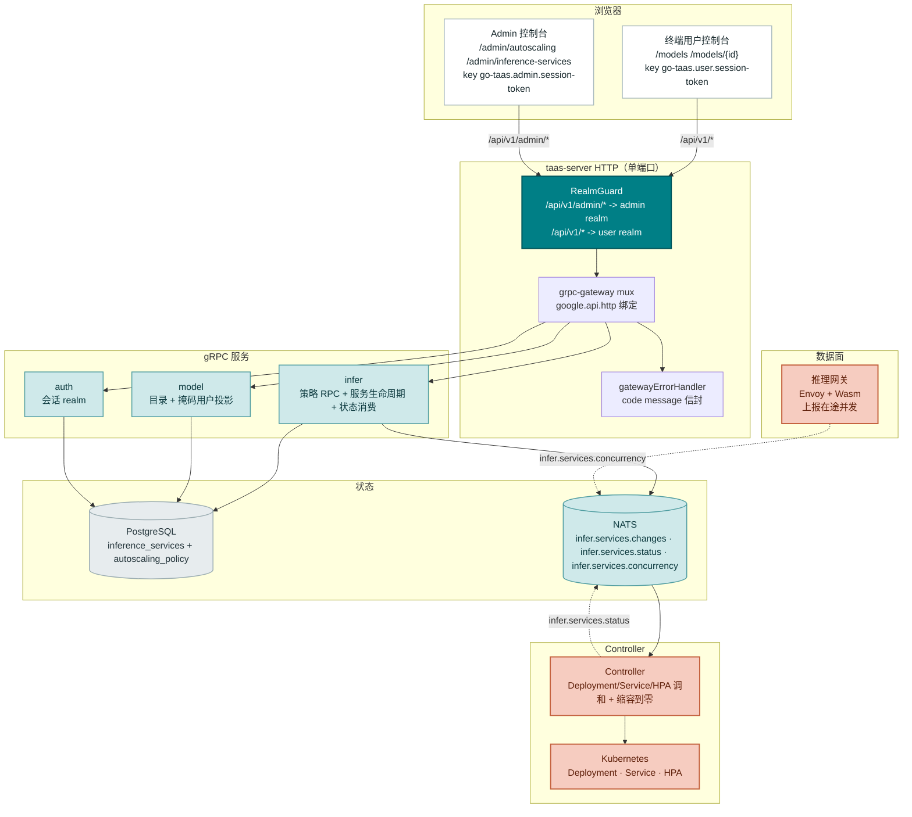
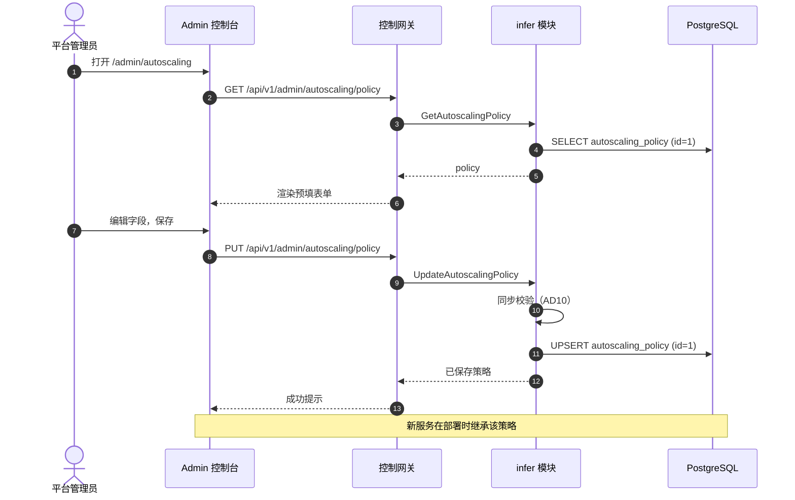
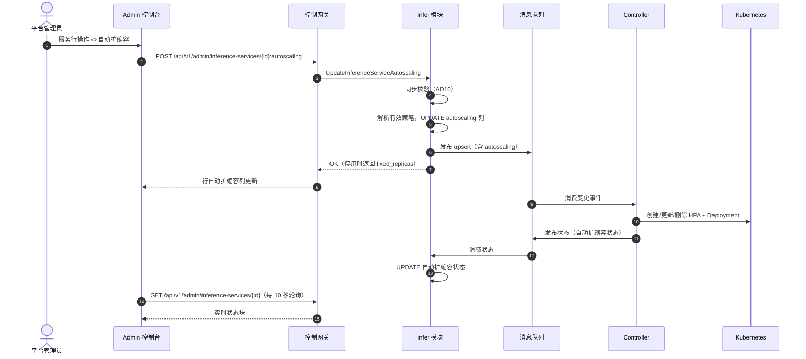
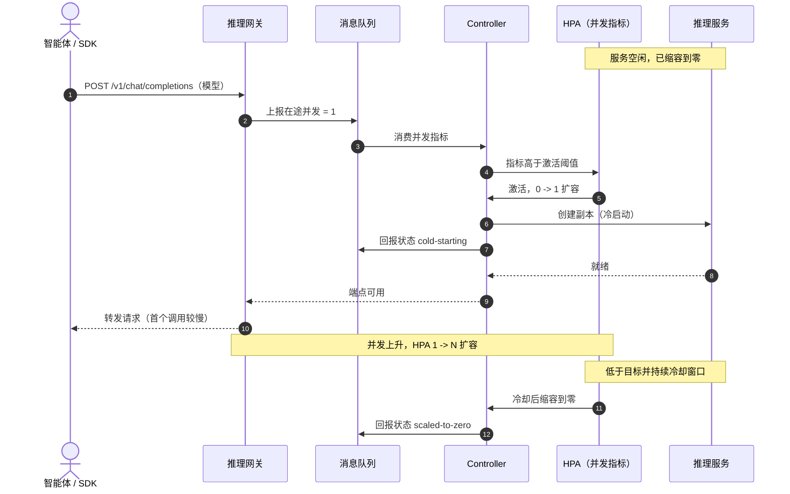
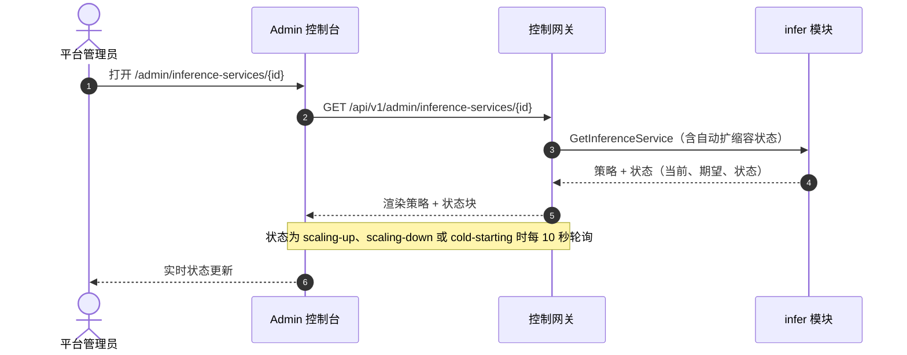

# 推理自动扩缩容与缩容到零 — 架构与详细设计

| 属性 | 内容 |
| --- | --- |
| 特性点 | 推理自动扩缩容与缩容到零（backlog 第 16 行） |
| 文档范围 | 推理服务自动水平扩缩容与缩容到零的架构与详细设计：自动扩缩容策略数据模型（全局默认 + 按服务）、admin `/api/v1/admin/*` API 面（策略 CRUD、按服务自动扩缩容配置、扩展的服务创建/列表/详情）、用户 `/api/v1/*` 只读面、Controller 的 HPA/缩容到零调和循环、两个控制台的前端页面、面/认证映射、错误处理、配置、安全、发布说明与分层函数级设计 |
| 归属模块 | `infer`（推理服务上的自动扩缩容策略、策略 RPC、状态投影）、`model`（用户面自动扩缩容投影）、`internal/controller`（HPA 调和、缩容到零调度、自动扩缩容状态回报）、`pkg/errors`（10307）、`web/`（两个控制台） |
| 相关文档 | [需求分析与 UI/UX 设计](../design/inference-autoscaling.zh-cn.md) · [架构设计](../design/architecture.zh-cn.md) 第 2.4 节（`infer`）、第 2.7 节 Controller、第 4.2 节一键部署流程 · [模型目录与一键部署](./model-catalog-deployment.zh-cn.md) — 本特性点所扩展的推理服务生命周期 · [控制台面分离](./console-surface-separation.zh-cn.md) — 本特性点遵循的双面规则与 realm 守卫 · [用量看板与按请求成本归因](./usage-dashboard.zh-cn.md) — 用户面模型列表模式 |
| 状态 | 架构完成，已移交 Developer agent |

---

## 1. 目标与非目标

### 1.1 目标

- 实现**推理服务上的自动扩缩容策略**（设计 D1）：应用于新服务的全局默认策略，以及覆盖默认的按服务策略，两者均可原位编辑。
- 实现 admin API 面：`GetAutoscalingPolicy` / `UpdateAutoscalingPolicy`（全局默认，同步）、`UpdateInferenceServiceAutoscaling`（按服务，经 MQ 异步），以及携带策略与实时自动扩缩容状态的扩展 `CreateInferenceService` / `ListInferenceServices` / `GetInferenceService`。
- 实现用户只读面：扩展 `ListAvailableModels` 携带自动扩缩容投影，以及返回只读自动扩缩容摘要的新 `GetAvailableModel`。
- 在 API 边界同步校验策略（设计 D10）：`min ≤ max`、`min = 0 ⟺ scale_to_zero`、目标 1–1000、冷却 0–3600 —— 在**任何消息发布之前**被拒绝。
- Controller 把策略落成基于**并发**指标的 Kubernetes **HPA**（设计 D4），缩容稳定窗口等于冷却期，并经 HPA `minReplicas: 0` 路径带激活阈值驱动缩容到零。
- 自动扩缩容状态回传：Controller 把当前/期望副本数、当前并发与自动扩缩容状态（封闭枚举）回报给 `infer`，使两个控制台都能渲染实时状态与冷启动可见性。
- 缩容到零调度：空闲服务在冷却窗口后缩容到零；对缩容到零服务的请求触发激活（冷启动），状态呈现为 `冷启动中`（admin）/ `预热中`（user）。
- 交付上述能力所需的 schema、配置与框架改动，精确到函数级职责，实现者无需猜测。

### 1.2 非目标

| 事项 | 去向 |
| --- | --- |
| 区别于全局默认的按模型自动扩缩容默认值 | 后续特性点（设计 §9） |
| 垂直扩缩容（GPU 规格）与节点级扩缩容 | 未来特性点 |
| 细粒度扩缩容行为（按方向策略、自定义指标公式、多指标） | 未来特性点 |
| 金丝雀 / 蓝绿自动扩缩容 | 未来特性点 |
| 租户侧自动扩缩容配置（自助扩缩容） | 未来特性点（当前对租户只读） |
| 在 `/api/v1/admin/*` 上强制会话（过渡期 `X-Organization-Id` 路径保留） | 后续加固行（控制台面分离 §11） |
| 网关中业务码 → HTTP 状态映射 | 平台级后续项 |

---

## 2. 架构决策

AD1–AD10 把 UI/UX 设计的决策落实为实现级规则。**AD11–AD13 是架构新增的细化**，每条都标注其细化的设计决策；它们保留设计意图并记录于此，使 Developer 与 Test agent 按同一解读实现。

| # | 决策 | 理由 |
| --- | --- | --- |
| AD1 | **自动扩缩容是推理服务上的策略**，不是新资源类型。策略是 `inference_services` 上的 JSON 列，外加一个全局默认单例行 | 设计 D1。契合 `infer` 模块的期望状态模型；Controller 把策略落成 HPA，保持控制台契约稳定 |
| AD2 | **策略字段恰好为六个**：`enabled`（bool）、`min_replicas`（0–max）、`max_replicas`（min–100）、`target_concurrency`（1–1000，默认 32）、`scale_to_zero`（bool，要求 min=0）、`cooldown_seconds`（0–3600，默认 300） | 设计 D2。以最小字段集映射业界「min/max + 目标 + 激活/冷却」契约；并发是在零副本时也成立的指标 |
| AD3 | **缩容到零是独立开关，要求 `min_replicas = 0`**；启用时强制 min=0，停用时强制 min ≥ 1 | 设计 D3。KServe 的显式选择是最干净的交互；min=0 依赖是表单规则与同步校验规则，绝非隐藏约束 |
| AD4 | **Controller 把策略落成基于并发指标的 Kubernetes HPA**（推理网关上报的在途请求），缩容稳定窗口等于冷却期；缩容到零走 HPA `minReplicas: 0` 路径并带激活阈值 | 设计 D4。并发在零副本时也能在网关处测量（网关在路由前先看到请求）；这是唯一支持缩容到零的指标 |
| AD5 | **自动扩缩容配置仅限 admin 面**；终端用户控制台按模型提供只读的自动扩缩容摘要 | 设计 D5。配置是操作员编排；租户消费模型，只需知道模型已自动扩缩容及其当前行为 |
| AD6 | **admin 控制台在两处管理自动扩缩容**：全局默认策略（应用于新服务）与按服务策略（覆盖默认） | 设计 D6。全局默认让新部署无需逐服务配置即可合理；按服务覆盖让操作员在关键处掌控 |
| AD7 | **终端用户控制台在模型层面展示自动扩缩容**，绝不在服务层面 | 设计 D7。租户经 OpenAI 兼容端点消费模型；服务是操作员内部编排产物 |
| AD8 | **收到请求的缩容到零服务向操作员呈现 `冷启动中`、向租户呈现 `预热中`** | 设计 D8。冷启动是缩容到零唯一的交互成本；呈现它可避免「模型是不是挂了」的困惑 |
| AD9 | **自动扩缩容变更是异步的，与部署一致**：更新立即返回，服务状态反映收敛，控制台轮询 | 设计 D9。契合 MQ + Controller 调和模型；阻塞等待 HPA 收敛会拖垮 HTTP 调用 |
| AD10 | **策略在 API 边界同步校验**，任何消息发布前完成 | 设计 D10。无效策略绝不能到达 Controller（与特性 #2 部署校验同规则） |
| AD11 | **细化设计 D4 —— 并发指标由推理网关在专用主题上上报，Controller 把它暴露给 HPA 作为自定义/对象指标。** HPA 以网关上报的、按服务标签选择器过滤的在途并发为目标；Controller 拥有 HPA 对象生命周期（与 Deployment 一起创建/更新/删除） | 数据面网关是唯一在路由前看到请求的组件，因此它是在途并发的权威来源。Controller 已拥有 Deployment/Service；同时拥有 HPA 可保持单一调和器与单一状态发布者。网关侧指标上报在此作为契约钉死（数据面轨道实现）；Controller 消费该主题并喂给 HPA |
| AD12 | **细化设计 D4 —— 激活阈值由目标并发派生，而非独立用户字段。** 当上报并发 ≥ 1（有请求在途）且服务处于零副本时触发激活；仅当并发在完整冷却窗口内持续低于目标时才缩容到零 | 设计的字段集（AD2）没有激活阈值字段；从「任一在途请求」派生激活、从「低于目标并持续冷却」派生缩容，在 0↔1 边界保留了 KEDA 双阈值意图（不抖动），且无需新增第七个字段。单个偶发请求会激活（冷启动），但不会让服务保持在 1 —— 若无更多负载，冷却后缩回零 |
| AD13 | **细化设计 §7.2 —— 用户面模型详情是新 `GetAvailableModel` RPC**（而非扩展 `GetModel`），自动扩缩容投影是新消息类型 `ModelAutoscaling`，由 `AvailableModel` 与 `GetAvailableModel` 共同携带 | 掩码用户目录（特性 #17 AD8/AD11）绝不能泄漏操作员字段（冷却、目标并发、服务标识）。独立 RPC 配独立、更小的消息使掩码成为结构性而非条件性的，正如 `ListAvailableModels` 已是如此 |

---

## 3. 组件视图

### 3.1 归属

| 层 / 组件 | 拥有 | 本特性改动 |
| --- | --- | --- |
| **控制网关（`pkg/server`）** | HTTP 组合：`RealmGuard` → `withConsole` → `runtime.ServeMux`；入站头匹配器（`X-Organization-Id`）；统一错误渲染 | 无改动 —— 新 RPC 由其 `google.api.http` 注解路由；realm 守卫已强制面分离（AD5） |
| **grpc-gateway mux** | 由 `google.api.http` 注解做路径 → RPC 路由 | 新增 `GetAutoscalingPolicy`、`UpdateAutoscalingPolicy`、`UpdateInferenceServiceAutoscaling`、`GetAvailableModel` 绑定；扩展 `CreateInferenceService`、`ListInferenceServices`、`GetInferenceService`、`ListAvailableModels` 绑定 |
| **`infer`** | 推理服务生命周期、自动扩缩容策略、变更发布、状态消费、自动扩缩容状态投影 | 服务上的自动扩缩容策略字段；全局默认策略存储；策略 RPC；扩展的创建/列表/详情；自动扩缩容状态消费者；并发指标主题消费者 |
| **`model`** | 模型目录、版本、租户授权授权、掩码用户目录 | 扩展 `ListAvailableModels` 携带自动扩缩容投影；新 `GetAvailableModel` |
| **`internal/controller`** | Kubernetes 调和：Deployment/Service/HPA、缩容到零调度、自动扩缩容状态回报 | HPA 创建/更新/删除；并发指标消费；状态主题上的自动扩缩容状态回报 |
| **推理网关（数据面）** | Envoy + Wasm：认证、计量、路由 | **仅钉契约** —— 在新主题上按服务上报在途并发（AD11）；数据面轨道实现 |
| **`pkg/errors`** | 各模块码块 | 新增一个 infer 码：**10307 `CodeAutoscalingPolicyInvalid`** |
| **`web/`** | 两个控制台 | Admin：自动扩缩容页、按服务对话框、自动扩缩容列/状态块；User：模型列表自动扩缩容指示、模型详情自动扩缩容摘要 |

### 3.2 运行时组件视图



| 组件 | 本特性职责 |
| --- | --- |
| Admin 控制台 | 自动扩缩容页（全局默认）、按服务自动扩缩容对话框、服务列表自动扩缩容列、服务详情自动扩缩容状态块 |
| 终端用户控制台 | 模型列表自动扩缩容指示、模型详情只读自动扩缩容摘要 |
| 控制网关（`grpc-gateway`） | 所有新增/扩展 RPC 的 HTTP/JSON 门面；realm 守卫强制面分离（AD5）；把 `X-Organization-Id` 作为 gRPC 元数据透传 |
| `infer` 模块（`services/infer`） | 策略 RPC、同步校验、全局默认存储、按服务策略持久化、扩展的创建/列表/详情、自动扩缩容状态消费者、并发指标主题消费者 |
| `model` 模块（`services/model`） | 扩展 `ListAvailableModels` 携带自动扩缩容投影；新 `GetAvailableModel` |
| PostgreSQL | `inference_services` 新增自动扩缩容列；新 `autoscaling_policy` 单例表 |
| 消息队列 | `infer.services.changes`（期望状态，现携带策略）、`infer.services.status`（观测状态，现携带自动扩缩容状态）、新 `infer.services.concurrency`（网关上报的在途并发） |
| Controller（`internal/controller`） | 解码变更事件，创建/更新/删除 Deployment、Service 与 HPA，消费并发主题，驱动缩容到零，回报自动扩缩容状态 |
| 推理网关 | **仅钉契约** —— 在 `infer.services.concurrency` 上按服务上报在途并发（AD11）；数据面轨道实现 |

---

## 4. 数据模型

### 4.1 `inference_services` 表（增量）

| 列 | PostgreSQL 类型 | 约束 | 描述 |
| --- | --- | --- | --- |
| `autoscaling` | `jsonb` | NOT NULL DEFAULT '{}' | 自动扩缩容策略（AD2）。空 `{}` 表示「继承全局默认」（设计 FR1.2） |

既有列（`id`、`organization_id`、`name`、`model_id`、`model_version`、`image_id`、`replicas`、`accelerator`、`accelerator_type`、`state`、`failure_reason`、`endpoints`、`created_at`、`updated_at`）不变。

设计说明：

- **`autoscaling` 为 `jsonb`**：策略是固定六字段对象（AD2）；JSON 让后续的按模型默认值与细粒度行为无需逐字段迁移即可扩展。GORM 模型以 `datatypes.JSON` 存储（与 `endpoints` 同模式）。
- **空 `{}` 表示继承**：未带显式策略创建的服务存储 `{}`，读取时通过合并全局默认解析出有效策略。这让 `CreateInferenceService` 保持向后兼容（省略策略的既有调用方获得默认值），并让「既有服务不受影响，除非它们选择采用」（FR1.2）成为自然结果 —— 存储了策略的既有服务保留它；`{}` 的解析为当前全局默认。
- **自动扩缩容下 `replicas` 语义**：启用自动扩缩容时，`replicas` 是 HPA 管理的**期望**副本数（受 HPA 的 `minReplicas`/`maxReplicas` 约束）。停用自动扩缩容时（FR2.5），`replicas` 是服务运行的固定副本数。Controller 对两种情况都做调和。

### 4.2 `autoscaling_policy` 表（新增，单例）

| 列 | PostgreSQL 类型 | 约束 | 描述 |
| --- | --- | --- | --- |
| `id` | `int` | PRIMARY KEY, CHECK (id = 1) | 单例行 id（恒为 1） |
| `enabled` | `boolean` | NOT NULL DEFAULT true | 全局默认：新服务自动扩缩容开启 |
| `min_replicas` | `int` | NOT NULL DEFAULT 1 | 0–max |
| `max_replicas` | `int` | NOT NULL DEFAULT 10 | min–100 |
| `target_concurrency` | `int` | NOT NULL DEFAULT 32 | 1–1000 |
| `scale_to_zero` | `boolean` | NOT NULL DEFAULT false | 要求 min = 0 |
| `cooldown_seconds` | `int` | NOT NULL DEFAULT 300 | 0–3600 |
| `updated_at` | `timestamptz` | NOT NULL | 最近保存时间 |

设计说明：

- **单例**：全局默认是单行（`id = 1`）。`GetAutoscalingPolicy` 读取它；`UpdateAutoscalingPolicy` upsert 它。全新安装时在迁移期以默认值播种该行（设计 FR1.4：「全局策略始终存在」）。
- **无 `organization_id`**：全局默认是平台级的（设计 D6），非按组织。按组织默认是后续项。

### 4.3 迁移说明

- 两张表都由既有 `Migrator` 钩子（`infer.Service.Migrate`）在启动时经 **GORM `AutoMigrate`** 处理。仅增量；无数据迁移。
- `autoscaling_policy` 单例在 `Migrate` 中**播种**：AutoMigrate 后，若不存在 `id = 1` 的行，则插入默认值（enabled=true、min=1、max=10、target=32、scale_to_zero=false、cooldown=300）。这满足全新安装时「全局策略始终存在」（FR1.4），对既有安装是空操作。
- 既有 `inference_services` 行获得 `autoscaling = '{}'`（继承），因此既有服务在操作员编辑前行为不变（FR1.2）。

---

## 5. API 设计

### 5.1 RPC 面

所有新 RPC 属于 **`taas.infer.v1.InferServiceService`**（策略 + 按服务）与 **`taas.model.v1.ModelService`**（用户投影），经控制网关以 HTTP 提供。Proto 改动均为增量。

#### 5.1.1 Admin 面（`/api/v1/admin/*`）

| RPC | HTTP | 状态 | 用途 |
| --- | --- | --- | --- |
| `GetAutoscalingPolicy` | `GET /api/v1/admin/autoscaling/policy` | **新增** | 读取全局默认策略 |
| `UpdateAutoscalingPolicy` | `PUT /api/v1/admin/autoscaling/policy` | **新增** | 保存全局默认；同步（FR1.4） |
| `CreateInferenceService` | `POST /api/v1/admin/inference-services` | 扩展 | 请求新增 `autoscaling` 策略字段（AD2） |
| `UpdateInferenceServiceAutoscaling` | `POST /api/v1/admin/inference-services/{service_id}:autoscaling` | **新增** | 编辑按服务策略；经 MQ 异步（AD9） |
| `ListInferenceServices` | `GET /api/v1/admin/inference-services` | 扩展 | 摘要新增自动扩缩容字段（启用、当前/min/max、状态） |
| `GetInferenceService` | `GET /api/v1/admin/inference-services/{service_id}` | 扩展 | 详情新增完整策略 + 状态块 |

#### 5.1.2 用户面（`/api/v1/*`）

| RPC | HTTP | 状态 | 用途 |
| --- | --- | --- | --- |
| `ListAvailableModels` | `GET /api/v1/models` | 扩展 | 摘要新增自动扩缩容投影（已自动扩缩容、当前副本、状态） |
| `GetAvailableModel` | `GET /api/v1/models/{model_id}` | **新增** | 单个模型的只读自动扩缩容摘要（AD13） |

### 5.2 Proto 草图

```protobuf
// infer.proto — 新消息
message AutoscalingPolicy {
  bool enabled = 1;
  int32 min_replicas = 2;
  int32 max_replicas = 3;
  int32 target_concurrency = 4;
  bool scale_to_zero = 5;
  int32 cooldown_seconds = 6;
}

// AutoscalingState 是控制台渲染徽标的封闭枚举。
enum AutoscalingState {
  AUTOSCALING_STATE_UNSPECIFIED = 0;
  AUTOSCALING_STATE_DISABLED = 1;
  AUTOSCALING_STATE_STEADY = 2;
  AUTOSCALING_STATE_SCALING_UP = 3;
  AUTOSCALING_STATE_SCALING_DOWN = 4;
  AUTOSCALING_STATE_SCALED_TO_ZERO = 5;
  AUTOSCALING_STATE_COLD_STARTING = 6;
  AUTOSCALING_STATE_ERROR = 7;
}

message AutoscalingStatus {
  AutoscalingState state = 1;
  int32 current_replicas = 2;
  int32 desired_replicas = 3;
  int32 current_concurrency = 4;
  int32 target_concurrency = 5;
  int64 last_scaling_event_at = 6;
  string error_reason = 7; // state = ERROR 时填充
}

message GetAutoscalingPolicyRequest {}
message GetAutoscalingPolicyResponse {
  taas.common.v1.Response response = 1;
  AutoscalingPolicy policy = 2;
}
message UpdateAutoscalingPolicyRequest {
  AutoscalingPolicy policy = 1;
}
message UpdateAutoscalingPolicyResponse {
  taas.common.v1.Response response = 1;
  AutoscalingPolicy policy = 2;
}

// CreateInferenceServiceRequest 新增：
//   AutoscalingPolicy autoscaling = 8;  // 空 = 继承全局默认

// InferenceServiceSummary 新增：
//   bool autoscaling_enabled = 9;
//   int32 current_replicas = 10;
//   int32 min_replicas = 11;
//   int32 max_replicas = 12;
//   AutoscalingState autoscaling_state = 13;

// GetInferenceServiceResponse 新增：
//   AutoscalingPolicy autoscaling = 4;   // 有效策略（已解析）
//   AutoscalingStatus autoscaling_status = 5;

message UpdateInferenceServiceAutoscalingRequest {
  string service_id = 1; // path
  AutoscalingPolicy policy = 2;
}
message UpdateInferenceServiceAutoscalingResponse {
  taas.common.v1.Response response = 1;
  int32 fixed_replicas = 2; // 停用时由此得到的固定副本数（FR2.5）
}

// rpc GetAutoscalingPolicy(GetAutoscalingPolicyRequest) returns (GetAutoscalingPolicyResponse) {
//   option (google.api.http) = { get: "/api/v1/admin/autoscaling/policy" };
// }
// rpc UpdateAutoscalingPolicy(UpdateAutoscalingPolicyRequest) returns (UpdateAutoscalingPolicyResponse) {
//   option (google.api.http) = { put: "/api/v1/admin/autoscaling/policy" body: "*" };
// }
// rpc UpdateInferenceServiceAutoscaling(UpdateInferenceServiceAutoscalingRequest) returns (UpdateInferenceServiceAutoscalingResponse) {
//   option (google.api.http) = { post: "/api/v1/admin/inference-services/{service_id}:autoscaling" body: "*" };
// }
```

```protobuf
// model.proto — 新消息
message ModelAutoscaling {
  bool autoscaled = 1;
  int32 current_replicas = 2;
  int32 min_replicas = 3;
  int32 max_replicas = 4;
  bool scale_to_zero = 5;
  string state = 6; // steady | scaling | scaled-to-zero | warming-up | fixed
}

// AvailableModel 新增：
//   ModelAutoscaling autoscaling = 4;  // 模型未自动扩缩容时为 nil

message GetAvailableModelRequest {
  string model_id = 1; // path
}
message GetAvailableModelResponse {
  taas.common.v1.Response response = 1;
  AvailableModel model = 2;
  ModelAutoscaling autoscaling = 3;
}

// rpc GetAvailableModel(GetAvailableModelRequest) returns (GetAvailableModelResponse) {
//   option (google.api.http) = { get: "/api/v1/models/{model_id}" };
// }
```

### 5.3 校验矩阵（同步，发布前）

`UpdateAutoscalingPolicy` 与 `UpdateInferenceServiceAutoscaling` 按序执行以下检查；首个失败立即返回且**不发布任何内容**（AD10，设计 AC2）：

| # | 检查 | 失败码 | 规范消息 |
| --- | --- | --- | --- |
| 1 | `min_replicas ≤ max_replicas` | 10307 `CodeAutoscalingPolicyInvalid` | autoscaling policy invalid: min replicas must be ≤ max replicas |
| 2 | `min_replicas = 0` 需 `scale_to_zero = true` | 10307 | autoscaling policy invalid: min replicas 0 requires scale-to-zero |
| 3 | `scale_to_zero = true` 需 `min_replicas = 0` | 10307 | autoscaling policy invalid: scale-to-zero requires min replicas 0 |
| 4 | `target_concurrency` 在 1–1000 | 10307 | autoscaling policy invalid: target concurrency must be between 1 and 1000 |
| 5 | `cooldown_seconds` 在 0–3600 | 10307 | autoscaling policy invalid: cooldown must be between 0 and 3600 seconds |
| 6 | `max_replicas` 在 1–100 | 10307 | autoscaling policy invalid: max replicas must be between 1 and 100 |

`CreateInferenceService` 在既有校验矩阵（模型目录 §4.3）**之外**，当存在显式 `autoscaling` 策略时执行上述策略校验。`UpdateInferenceServiceAutoscaling` 额外校验服务存在且非 `terminated`（10301 / 10303）。

### 5.4 传输格式（既有约定）

- 分页绑定为 `?page.offset=0&page.limit=20`（点号形式）；默认 limit 20，上限 100。
- 成功响应为 HTTP 200（grpc-gateway 对一元 RPC 的默认），包括创建与更新。
- 业务错误渲染为 `{"code": <int>, "message": "..."}`，越界码为 HTTP 500（平台现状）。
- 过渡期 `X-Organization-Id` 头限定列表与创建调用，与 API Key 特性完全一致。realm 守卫（控制台面分离 AD2/AD3）强制面分离：错误 realm 的会话以 10038 `REALM_MISMATCH` 失败；无 realm/过期会话以 10027 `SESSION_INVALID` 失败；缺失 `Authorization` 头的请求以过渡模式透传。

### 5.5 面与认证映射

| 端点 | 面 | Realm | 守卫 |
| --- | --- | --- | --- |
| `GET /api/v1/admin/autoscaling/policy` | admin | admin | `RealmGuard`（admin realm）+ 过渡期 `X-Organization-Id` |
| `PUT /api/v1/admin/autoscaling/policy` | admin | admin | `RealmGuard`（admin realm）+ 过渡期 `X-Organization-Id` |
| `POST /api/v1/admin/inference-services` | admin | admin | `RealmGuard`（admin realm）+ 过渡期 `X-Organization-Id` |
| `POST /api/v1/admin/inference-services/{id}:autoscaling` | admin | admin | `RealmGuard`（admin realm）+ 过渡期 `X-Organization-Id` |
| `GET /api/v1/admin/inference-services` | admin | admin | `RealmGuard`（admin realm）+ 过渡期 `X-Organization-Id` |
| `GET /api/v1/admin/inference-services/{id}` | admin | admin | `RealmGuard`（admin realm）+ 过渡期 `X-Organization-Id` |
| `GET /api/v1/models` | user | user | `RealmGuard`（user realm）+ 过渡期 `X-Organization-Id` |
| `GET /api/v1/models/{id}` | user | user | `RealmGuard`（user realm）+ 过渡期 `X-Organization-Id` |

失败语义（供 Test agent）：在任一前缀上呈现**错误 realm** 会话的请求以 HTTP 500 与 body `{"code":10038,"message":"session belongs to the other console"}` 失败。带未知/过期/无 realm 会话的请求以 `{"code":10027,"message":"<session invalid>"}` 失败。**无** `Authorization` 头的请求以过渡模式透传（CLI、FVT 与 e2e 套件从不发送 token）。admin 控制台绝不调用 `/api/v1/*` 自动扩缩容路由，用户控制台绝不调用 `/api/v1/admin/*` 路由（设计 AC10）。

---

## 6. 消息契约

### 6.1 期望状态变更（`infer.services.changes`，扩展）

既有变更事件（模型目录 §4.5.1）新增 `autoscaling` 对象。JSON body：

```json
{
  "event_type": "upsert" | "delete",
  "service_id": "uuid",
  "organization_id": "org",
  "name": "qwen25-32b-a800",
  "model": {"model_id": "uuid", "version": "Qwen2.5-32B-Instruct", "weight_path": "models/qwen2.5-32b/"},
  "image": {"image_id": "uuid", "reference": "ghcr.io/go-taas/vllm:v0.6.3", "engine": "vllm"},
  "replicas": 2,
  "accelerator": "nvidia",
  "accelerator_type": "A800",
  "autoscaling": {
    "enabled": true,
    "min_replicas": 1,
    "max_replicas": 10,
    "target_concurrency": 32,
    "scale_to_zero": false,
    "cooldown_seconds": 300
  },
  "published_at": "2026-09-25T10:00:00Z"
}
```

`autoscaling` 对象是**有效**策略（服务存储 `{}` 时从全局默认解析），因此 Controller 无需数据库往返。停用自动扩缩容时，`autoscaling.enabled = false` 且 `replicas` 为固定副本数。

### 6.2 状态回报（`infer.services.status`，扩展）

既有状态回报（模型目录 §4.5.2）新增 `autoscaling` 状态对象。JSON body：

```json
{
  "service_id": "uuid",
  "state": "deploying" | "running" | "failed",
  "endpoints": ["https://infer.example.com/v1"],
  "failure_reason": "weight path models/qwen2.5-32b/ not found in object storage",
  "autoscaling": {
    "state": "steady" | "scaling-up" | "scaling-down" | "scaled-to-zero" | "cold-starting" | "error",
    "current_replicas": 3,
    "desired_replicas": 3,
    "current_concurrency": 12,
    "target_concurrency": 32,
    "last_scaling_event_at": "2026-09-25T10:03:41Z",
    "error_reason": ""
  },
  "reported_at": "2026-09-25T10:03:41Z"
}
```

`infer` 消费该主题并更新 `state`、`endpoints`、`failure_reason` 与自动扩缩容状态列。自动扩缩容状态**仅由 Controller 写入** —— 无 RPC 直接设置它；在线上只读。

### 6.3 并发指标（`infer.services.concurrency`，新主题）

由推理网关发布（AD11）。JSON body：

```json
{
  "service_id": "uuid",
  "in_flight": 12,
  "reported_at": "2026-09-25T10:03:41Z"
}
```

Controller 消费该主题并喂给 HPA 的并发指标（第 7 节）。网关按有界间隔（如每 5 秒）并在请求到达/离开时按服务发布一次；Controller 在内存中保留每服务最新值，并作为对象指标值暴露给 HPA。

主题注册：`mq.Subjects` 在 `DefaultSubjects()` 中新增 `InferServiceConcurrency: "infer.services.concurrency"`。Controller 订阅它；网关发布它。

---

## 7. Controller 设计（HPA 与缩容到零）

### 7.1 HPA 调和

Controller 与 Deployment/Service 一起拥有 HPA 生命周期（AD11）。在 `autoscaling.enabled = true` 的 `upsert` 变更事件上：

1. 与今天一样创建或更新 Deployment 与 Service（模型目录 §10.5）。
2. 在 `reconcileNamespace` 中创建或更新名为 `hpa-<service-name>` 的 `HorizontalPodAutoscaler`：
   - `spec.scaleTargetRef` → Deployment。
   - `spec.minReplicas` → `autoscaling.min_replicas`（缩容到零开启时为 0）。
   - `spec.maxReplicas` → `autoscaling.max_replicas`。
   - `spec.metrics` → 一个对象指标：按服务标签选择器过滤的并发值上的 `pods`/`object` 指标，`target.type = AverageValue` 且 `target.averageValue = autoscaling.target_concurrency`。
   - `spec.behavior.scaleDown.stabilizationWindowSeconds` → `autoscaling.cooldown_seconds`（AD4）。
3. 在 `autoscaling.enabled = false` 的 `upsert` 上：删除 HPA 并把 Deployment 的 `replicas` 设为固定副本数（当前期望副本数，FR2.5）。
4. 在 `delete` 变更事件上：与 Deployment 和 Service 一起删除 HPA。

### 7.2 缩容到零调度

缩容到零使用 HPA `minReplicas: 0` 路径并带激活阈值（AD4、AD12）：

- **激活（0 → 1）**：HPA 的并发指标是网关上报的在途并发。请求到达缩容到零服务时，网关上报 `in_flight ≥ 1`；HPA 看到指标高于激活阈值（≥ 1）并扩到 1。Controller 观测该转变并回报 `autoscaling.state = cold-starting`（admin）/ `warming up`（user），副本拉起后转为 `steady`。
- **缩容到零（1 → 0）**：HPA 仅在并发持续低于目标并满 `cooldown_seconds` 稳定窗口后才缩容（AD12）。单个偶发请求会激活但不会让服务保持在 1 —— 若无更多负载，冷却后缩回零（设计 FR5.3）。
- **冷却强制**：HPA 的 `scaleDown.stabilizationWindowSeconds = cooldown_seconds` 防止刚缩容的服务被立即重建（设计 FR5.2、AC7）。

### 7.3 自动扩缩容状态回报

Controller 从 HPA 与 Deployment 观测状态派生自动扩缩容状态，并在 `infer.services.status` 上回报（第 6.2 节）：

| 观测 | `autoscaling.state` |
| --- | --- |
| 自动扩缩容停用 | `disabled` |
| `current == desired`，均 > 0 | `steady` |
| `current < desired` | `scaling-up` |
| `current > desired` | `scaling-down` |
| `current == 0`、`desired == 0`、空闲 | `scaled-to-zero` |
| `current == 0`、`desired ≥ 1`（有请求到达，正在拉起） | `cold-starting` |
| HPA 被拒 / 指标不可用 / 调和错误 | `error`（+ `error_reason`） |

Controller 在每次调和以及每次改变状态的并发指标更新时回报自动扩缩容状态（有界以避免淹没主题 —— 例如每服务每 5 秒至多一次）。

### 7.4 并发指标消费

Controller 订阅 `infer.services.concurrency`（第 6.3 节），在内存中保留每 `service_id` 的最新 `in_flight`，并作为对象指标值暴露给 HPA。HPA 经指标 API 轮询该指标；Controller 实现指标提供者接缝（或最简单的集成中，Controller 把值写入 HPA 读取的 `CustomMetric`/`ExternalMetric` 资源）。确切的指标提供者机制是数据面/Controller 集成细节；此处钉死的契约是主题与值语义。

---

## 8. 时序图

### 8.1 全局默认策略保存（admin）



### 8.2 按服务自动扩缩容更新（admin，异步）



### 8.3 缩容到零与冷启动



### 8.4 自动扩缩容状态轮询（admin）



---

## 9. 错误处理

所有错误都是统一信封中的 `pkg/errors` 业务码。新增一个码。

| 条件 | 码 | 常量 | 备注 |
| --- | --- | --- | --- |
| 策略校验失败（§5.3 任一） | 10307 | `CodeAutoscalingPolicyInvalid` | 详情点名失败规则（AD10） |
| 服务未找到（按服务自动扩缩容） | 10301 | `CodeInferServiceNotFound` | 跨组织访问看起来一致（无存在性泄漏） |
| 对 terminated 服务做按服务自动扩缩容 | 10303 | `CodeInferServiceStateInvalid` | 详情：「cannot autoscale a terminated service」 |
| 任一前缀上错误 realm 会话 | 10038 | `CodeRealmMismatch` | realm 守卫（控制台面分离 AD3） |
| 未知/过期/无 realm 会话 | 10027 | `CodeSessionInvalid` | realm 守卫 |
| 缺失 `X-Organization-Id` | 10001 | `CodeUnauthorized` | 过渡期（与 API Key 相同） |
| 数据库 / MQ 基础设施故障 | 500 | `CodeInternal` | 经错误归一化 |

Controller 侧失败不是 RPC 错误：它们经状态主题以 `autoscaling.state = error` + `error_reason` 呈现（设计 FR3.4）。状态发布失败被记录并在下次调和时重试。

---

## 10. 配置新增

```yaml
infer:
  endpointBaseURL: "https://infer.example.com"
  statusConsumer:
    enabled: true
    workers: 2
  autoscaling:
    concurrencyConsumer:
      enabled: true
      workers: 2
    statusReportInterval: "5s"
```

| 键 | 默认 | 描述 |
| --- | --- | --- |
| `infer.autoscaling.concurrencyConsumer.enabled` | `true` | 并发指标消费者 Runner 的开关 |
| `infer.autoscaling.concurrencyConsumer.workers` | `2` | 并发处理器数 |
| `infer.autoscaling.statusReportInterval` | `5s` | 每服务自动扩缩容状态回报的最小间隔（有界以避免淹没主题） |

规则（与 API Key 特性相同）：

- 该区块同时出现在 `configs/config.yaml` 与 `configs/server.yaml`（每个二进制的配置 glob 必须看到相同键）。controller 二进制额外在 `configs/controller.yaml` 中获得 `infer.autoscaling.statusReportInterval`（它回报状态）。
- 零值在使用点回退到随附默认值；`Configuration.Validate` 拒绝负 workers 与非正的状态回报间隔。

---

## 11. 安全考量

- **面分离由 realm 守卫强制**（控制台面分离 AD2/AD3）：admin 自动扩缩容端点只存在于 `/api/v1/admin/*` 下，用户只读端点只存在于 `/api/v1/*` 下。错误 realm 会话以 10038 失败；两个控制台绝不共享会话 token。用户面**不**携带操作员字段（无冷却、无目标并发、无服务标识）—— 掩码投影（AD13）使掩码成为结构性。
- **组织隔离是过渡期且可伪造**（`X-Organization-Id`），与 API Key 特性现状一致；管理 API 今天实际上未认证。本特性不扩大该暴露面。特性 #7 移除。
- **消息中无机密**：变更、状态与并发消息只携带资源规格、URL 与指标值 —— 无凭据、无 API Key。
- **策略同步校验**（AD10）：无效策略绝不到达 Controller，因此无法从坏请求创建畸形 HPA 规格。
- **Controller 权限**：controller 的 service account 只需平台命名空间中的 Deployment/Service/HPA CRUD —— 无 cluster-admin、无 secret 读取。HPA CRUD 是对既有 RBAC 的增量。
- **端点与状态披露**：自动扩缩容状态是组织作用域数据，仅经作用域 API 返回；对另一组织服务的 `GetInferenceService` 返回 10301（无存在性泄漏）。

---

## 12. 发布说明

- **Schema**：`inference_services` 新增 `autoscaling`（jsonb，默认 `{}`）；新 `autoscaling_policy` 单例表以默认值播种。经 AutoMigrate 增量；无数据迁移。
- **配置**：`infer.autoscaling` 区块出现在 `configs/config.yaml`、`configs/server.yaml`，以及（`statusReportInterval`）`configs/controller.yaml`。无该区块的自定义配置继续工作（零值默认）。
- **Proto**：增量改动 —— 新消息、新 RPC、扩展消息。`make pbgen` 重新生成网关绑定。
- **新主题**：`infer.services.concurrency` 是增量；broker 基于主题（NATS）故无迁移。
- **Controller**：调和器在既有 `Reconciler` 接口后新增 HPA 生命周期与并发指标消费者 —— 无签名变更，基于 fake 的测试继续工作。
- **滚动更新顺序**：先部署 `taas-server`（它开始发布携带策略的变更并消费状态），再部署 controller。反向顺序也安全：controller 忽略无发布者的主题。
- **特性开关**：无需 —— 新 RPC 是增量；`autoscaling = '{}'` 的既有服务继承全局默认，操作员编辑策略前既有行为不变。

---

## 13. 前端架构

### 13.1 页面 → 路由 → API 前缀表

| 页面 / 组件 | 面 | Web 路由 | API 前缀 | RPC |
| --- | --- | --- | --- | --- |
| 自动扩缩容页（全局默认编辑器） | admin | `/admin/autoscaling` | `/api/v1/admin/autoscaling/policy` | `GetAutoscalingPolicy` / `UpdateAutoscalingPolicy` |
| 按服务自动扩缩容对话框（从服务列表/详情） | admin | `/admin/inference-services`（对话框） | `/api/v1/admin/inference-services/{id}:autoscaling` | `UpdateInferenceServiceAutoscaling` |
| 部署表单中的自动扩缩容区块 | admin | `/admin/inference-services`（部署对话框） | `/api/v1/admin/inference-services` | `CreateInferenceService`（扩展） |
| 服务列表上的自动扩缩容状态列 | admin | `/admin/inference-services` | `/api/v1/admin/inference-services` | `ListInferenceServices`（扩展） |
| 服务详情上的自动扩缩容状态块 | admin | `/admin/inference-services/{id}` | `/api/v1/admin/inference-services/{id}` | `GetInferenceService`（扩展） |
| 终端用户模型列表自动扩缩容指示 | user | `/models` | `/api/v1/models` | `ListAvailableModels`（扩展） |
| 终端用户模型详情自动扩缩容摘要 | user | `/models/{id}` | `/api/v1/models/{id}` | `GetAvailableModel`（新增） |

> 终端用户控制台**没有**自动扩缩容配置页；用户面只读（AD5、AD7）。admin 控制台在用户前缀上没有自动扩缩容页面。

### 13.2 导航位置

- **Admin 控制台**（`AdminShell`）：在 Models/Images/Inference Services 旁新增**自动扩缩容**导航项（`/admin/autoscaling`，testid `nav-autoscaling`）。推理服务页（`/admin/inference-services`）与服务详情页（`/admin/inference-services/{id}`）原位升级，新增自动扩缩容列/状态块与按服务对话框。
- **终端用户控制台**（`UserShell`）：新增**模型**导航项（`/models`，testid `nav-models`）—— 用户模型列表是新页面（当前用户面没有 `/models` 路由；playground 已消费 `ListAvailableModels`）。模型详情页（`/models/{id}`）是新的。

### 13.3 复用的共享组件与状态

- **`useApi`**（`web/src/surface.tsx`）与 **`useOrg`**（`web/src/org.tsx`）：realm 作用域 API 客户端与组织上下文。admin 页面调用 `/api/v1/admin/*`；用户页面调用 `/api/v1/*`。realm 守卫（控制台面分离）保持两个面的会话分离。
- **徽标组件**（`web/src/components.tsx`）：复用既有徽标/状态渲染来呈现自动扩缩容状态徽标。
- **轮询钩子**：复用既有 10 秒轮询模式（服务详情页所用），在状态为 `scaling-up`、`scaling-down` 或 `cold-starting` 时轮询自动扩缩容状态块（设计 AC12）。
- **DeployDialog**（`web/src/components/DeployDialog.tsx`）：新增自动扩缩容区块（FR2.1），从全局默认预填。
- **表单校验**：客户端校验镜像 §5.3（min ≤ max、min=0 ⟺ 缩容到零、目标/冷却范围），带内联字段错误。

### 13.4 每面认证守卫

- **Admin 页面**（`/admin/autoscaling`、`/admin/inference-services`、`/admin/inference-services/{id}`）：`AdminShell` 会话守卫在 `go-taas.admin.session-token` 非空时运行；`/admin/autoscaling` 上的非 admin 会话重定向到 `/admin/login` 并带 `next` 参数（realm 门，设计 §6.2）。API 调用走 `/api/v1/admin/*`，realm 守卫以 10038 拒绝错误 realm 会话。
- **用户页面**（`/models`、`/models/{id}`）：`UserShell` 会话守卫在 `go-taas.user.session-token` 非空时运行；API 调用走 `/api/v1/*`。用户面不暴露任何配置控件（AD5）。

---

## 14. 详细设计

### 14.1 文件布局

| 模块 | 文件 | 内容 |
| --- | --- | --- |
| `proto/taas/infer/v1` | `infer.proto` | 新 `AutoscalingPolicy`、`AutoscalingState`、`AutoscalingStatus`、`GetAutoscalingPolicy*`、`UpdateAutoscalingPolicy*`、`UpdateInferenceServiceAutoscaling*`；扩展 `CreateInferenceServiceRequest`、`InferenceServiceSummary`、`GetInferenceServiceResponse` |
| `proto/taas/model/v1` | `model.proto` | 新 `ModelAutoscaling`、`GetAvailableModel*`；扩展 `AvailableModel` |
| `services/infer` | `autoscaling_model.go` | GORM 模型 `AutoscalingPolicy`（单例）+ `InferenceService.Autoscaling` 字段 |
| | `autoscaling_repository.go` | `AutoscalingPolicyRepository`（单例 get/upsert）、`InferenceServiceRepository` 自动扩缩容辅助 |
| | `autoscaling_service.go` | `GetAutoscalingPolicy`、`UpdateAutoscalingPolicy`、`UpdateInferenceServiceAutoscaling` RPC + 校验 |
| | `infer_model.go` | `InferenceService` 新增 `Autoscaling datatypes.JSON` |
| | `infer_repository.go` | 自动扩缩容列读写、有效策略解析 |
| | `change_publisher.go` | 变更事件新增 `autoscaling` 对象 |
| | `status_consumer.go` | 状态消费者应用自动扩缩容状态 |
| | `concurrency_consumer.go` | 新 Runner：消费 `infer.services.concurrency`（用于状态投影） |
| | `service.go` | 扩展 `CreateInferenceService`/`ListInferenceServices`/`GetInferenceService` |
| `services/model` | `service.go` | 扩展 `ListAvailableModels`；新 `GetAvailableModel` |
| `internal/controller` | `reconciler.go` | HPA 生命周期、并发指标消费、自动扩缩容状态回报 |
| `pkg/mq` | `mq.go` | `InferServiceConcurrency` 主题新增 |
| `pkg/errors` | `codes.go`/`messages.go` | 新 `CodeAutoscalingPolicyInvalid Code = 10307` + 规范消息 |
| `pkg/config` | `api.go` | `InferAutoscalingConfig` 结构 + Validate 规则 |
| `web/src` | `pages/AutoscalingPage.tsx`；`pages/user/ModelsPage.tsx`；`pages/user/ModelDetailPage.tsx`；`components/DeployDialog.tsx`；`pages/InferenceServicesPage.tsx`；`pages/ServiceDetailPage.tsx`；`api.ts`；`App.tsx`；`shells/AdminShell.tsx`；`shells/UserShell.tsx` | 两个控制台的页面与路由 |

### 14.2 `infer` 模块

GORM 模型：

```go
// autoscaling_model.go
type AutoscalingPolicy struct {
    ID               int       `gorm:"primaryKey"`
    Enabled          bool      `gorm:"not null;default:true"`
    MinReplicas      int       `gorm:"not null;default:1"`
    MaxReplicas      int       `gorm:"not null;default:10"`
    TargetConcurrency int      `gorm:"not null;default:32"`
    ScaleToZero      bool      `gorm:"not null;default:false"`
    CooldownSeconds  int       `gorm:"not null;default:300"`
    UpdatedAt        time.Time
}

// infer_model.go — InferenceService 新增：
//   Autoscaling datatypes.JSON `gorm:"type:jsonb;not null;default:'{}'"`
```

`AutoscalingPolicyRepository`：

- `GetDefault(ctx) (*AutoscalingPolicy, error)` — 读取单例（`id = 1`）；miss → `CodeInternal`（该行在迁移时播种，§4.3）。
- `UpsertDefault(ctx, p *AutoscalingPolicy) error` — upsert `id = 1`。

`InferenceServiceRepository` 新增：

- `UpdateAutoscaling(ctx, orgID, serviceID string, policy datatypes.JSON) error` — 以 `id AND organization_id` 限定；miss → `CodeInferServiceNotFound`。
- `ResolveEffectivePolicy(ctx, svc *InferenceService) (*AutoscalingPolicy, error)` — 若 `svc.Autoscaling` 为空 `{}`，返回全局默认；否则反序列化存储的策略。供 `GetInferenceService` 与变更发布者使用。

`autoscaling_service.go` RPC：

- `GetAutoscalingPolicy`：`GetDefault` → 响应策略。
- `UpdateAutoscalingPolicy`：校验（§5.3）；`UpsertDefault`；响应已保存策略。同步（FR1.4）。
- `UpdateInferenceServiceAutoscaling`：作用域获取（10301）；terminated → 10303；校验（§5.3）；若 `enabled = false`，把当前期望副本数解析为固定副本数；`UpdateAutoscaling`；发布携带有效策略的 `upsert` 变更；停用时响应 `{fixed_replicas}`（FR2.5）。

`change_publisher.go`：`buildChangeEvent` 新增 `autoscaling` 对象（有效策略，§6.1）。

`status_consumer.go`：`StatusConsumer` 把 `autoscaling` 状态对象应用到服务行（仅由 Controller 写入）。

`concurrency_consumer.go`：新 `ConcurrencyConsumer` 实现 `server.Runner` —— 订阅 `infer.services.concurrency` 并更新服务的当前并发投影（供 `GetInferenceService` 使用）。在 `apps/taas-server/main.go` 经 `srv.AddRunner(...)` 注册。

`service.go` 扩展 RPC：

- `CreateInferenceService`：运行既有校验矩阵，并在存在显式策略时执行策略校验；存储 `autoscaling`（或 `{}` 以继承）；发布携带有效策略的变更。
- `ListInferenceServices`：把每行映射为 `InferenceServiceSummary`，含 `autoscaling_enabled`、`current_replicas`、`min_replicas`、`max_replicas`、`autoscaling_state`（从存储策略 + 状态解析）。
- `GetInferenceService`：返回有效策略与自动扩缩容状态块。

### 14.3 `model` 模块

`service.go`：

- `ListAvailableModels`：扩展以连接自动扩缩容投影 —— 对每个可用模型，从 `infer` 模块的服务状态解析当前自动扩缩容状态（模型的就绪服务）并填充 `ModelAutoscaling`（已自动扩缩容、当前副本、min/max、缩容到零、状态）。投影**不**携带操作员字段（AD13）。
- `GetAvailableModel`：新 RPC —— 获取模型（掩码）+ 其自动扩缩容投影；miss → `CodeModelNotFound`。

跨模块依赖：`model` 经窄接口从 `infer` 读取自动扩缩容状态（与模型目录 §10.2 相同的包级依赖模式）。

### 14.4 框架触点

1. **`mq.Subjects`**（`pkg/mq/mq.go`）：新增 `InferServiceConcurrency string` + `DefaultSubjects()` 条目 `"infer.services.concurrency"`。增量。
2. **`Runner` 注册**（`apps/taas-server/main.go`）：构造 `infer` 服务的 `ConcurrencyConsumer` 并 `srv.AddRunner` 它。
3. **`Migrator` 钩子**：`infer.Service.Migrate` AutoMigrate `inference_services`（增量列）与 `autoscaling_policy`，然后播种单例。
4. **配置**（`pkg/config/api.go`）：`InferAutoscalingConfig{ConcurrencyConsumer struct{ Enabled bool, Workers int }, StatusReportInterval time.Duration}`；`Validate` 拒绝负 workers 与非正间隔。
5. **Controller 接线**（`apps/controller/main.go`）：不变 —— 调和器实现改变，构造路径不变。

### 14.5 Controller 调和（`internal/controller/reconciler.go`）

`ApplyInferServiceChange(ctx, msg)` 新增自动扩缩容处理：

1. 解码变更事件（现含 `autoscaling`，§6.1）；畸形 → 记录 + `mq.Permanent`。
2. `delete` → 删除 Deployment、Service **与 HPA**（忽略 not-found）；返回。
3. `upsert` → 发布状态 `deploying`；构建并创建或更新 Deployment 与 Service（如今天）；然后：
   - 若 `autoscaling.enabled`：构建并创建或更新 HPA（§7.1）；否则删除 HPA 并把 Deployment 的 `replicas` 设为固定副本数。
   - 观察 Pod 就绪；就绪后 → 发布状态 `running`，含端点与自动扩缩容状态块。
4. 任一调和错误 → 发布状态 `failed`，含原因与 `autoscaling.state = error`。

新 `ConcurrencyMetricConsumer`（controller 二进制中的 `server.Runner`）：订阅 `infer.services.concurrency`，保留每 `service_id` 的最新 `in_flight`，暴露给 HPA 指标提供者，并在状态改变时触发自动扩缩容状态回报（由 `statusReportInterval` 限界）。

### 14.6 控制台（仓库范围外，契约摘要）

控制台是独立交付物；本设计钉死其契约：

- **Admin 自动扩缩容页**（`/admin/autoscaling`）：全局默认编辑器（FR1），字段与校验按 §5.3，保存 → `PUT /api/v1/admin/autoscaling/policy`。
- **Admin 按服务对话框**：从服务行操作 → 自动扩缩容，字段从当前策略预填，保存 → `POST /api/v1/admin/inference-services/{id}:autoscaling`，停用警告（FR2.5）。
- **Admin 服务列表**：自动扩缩容列，`开`/`关` 徽标与 `当前/min–max`（FR3.1）。
- **Admin 服务详情**：自动扩缩容卡片，含完整策略 + 状态块（FR3.2–FR3.4），扩缩/冷启动期间每 10 秒轮询（AC12）。
- **用户模型列表**（`/models`）：自动扩缩容指示（`已自动扩缩容`/`固定` 徽标、当前副本）（FR4.1）。
- **用户模型详情**（`/models/{id}`）：只读自动扩缩容摘要，含 `预热中` 提示（FR4.2–FR4.4），无编辑控件。

---

## 15. 验收标准覆盖

| AC | 由…覆盖 | 验证钩子 |
| --- | --- | --- |
| AC1 — 全局默认保存 + 继承 | §14.2 `UpdateAutoscalingPolicy`/`GetAutoscalingPolicy`、`ResolveEffectivePolicy`、§4.3 单例播种 | 单元 + FVT |
| AC2 — 校验拒绝无效策略，不发布任何内容 | §5.3 校验矩阵、发布后提交 | 单元（fake MQ 断言零发布）+ FVT |
| AC3 — 带显式策略创建存储它；获取返回策略 + 状态 | §14.2 `CreateInferenceService`、`GetInferenceService` | FVT |
| AC4 — 按服务更新异步，状态转为稳定 | §14.2 `UpdateInferenceServiceAutoscaling`、§7.3 状态回报 | FVT + E2E |
| AC5 — 停用返回固定副本数，状态 disabled | §14.2 `UpdateInferenceServiceAutoscaling`（fixed_replicas）、§7.3 | FVT |
| AC6 — 缩容到零服务收到请求时冷启动 | §7.2 激活、§8.3 时序 | FVT（故障/负载注入）+ E2E |
| AC7 — 空闲保持零副本满冷却时长 | §7.2 冷却窗口（HPA 稳定） | FVT（时序） |
| AC8 — admin 列表/详情显示自动扩缩容 | §13.1、§14.6 控制台契约 | E2E |
| AC9 — 用户模型列表/详情只读摘要 | §13.1、§14.6 控制台契约 | E2E |
| AC10 — 面分离（无跨前缀调用） | §5.5 realm 守卫、§13.1 路由/前缀表 | E2E（源码/网络断言） |
| AC11 — 冷启动中/预热中提示 | §7.3、§14.6 控制台契约 | E2E |
| AC12 — 扩缩/冷启动期间每 10 秒轮询 | §13.3 轮询钩子、§14.6 | 手动 / E2E |

---

## 16. 延后事项

| 事项 | 去向 |
| --- | --- |
| 区别于全局默认的按模型自动扩缩容默认值 | 后续特性点 |
| 垂直扩缩容（GPU 规格）与节点级扩缩容 | 未来特性点 |
| 细粒度扩缩容行为（按方向策略、自定义指标公式、多指标） | 未来特性点 |
| 金丝雀 / 蓝绿自动扩缩容 | 未来特性点 |
| 租户侧自动扩缩容配置（自助扩缩容） | 未来特性点 |
| 推理网关并发指标上报（`infer.services.concurrency` 发布者） | 数据面轨道（契约钉于 §6.3、AD11） |
| 在 `/api/v1/admin/*` 上强制会话 | 后续加固行 |
| 网关中业务码 → HTTP 状态映射 | 平台级后续项 |