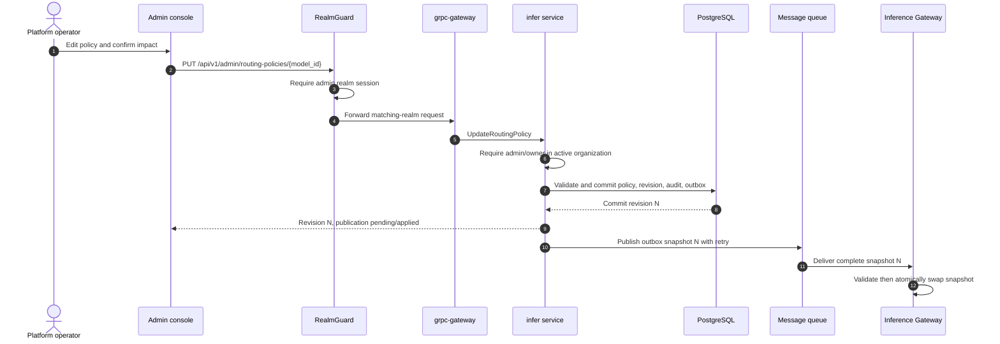
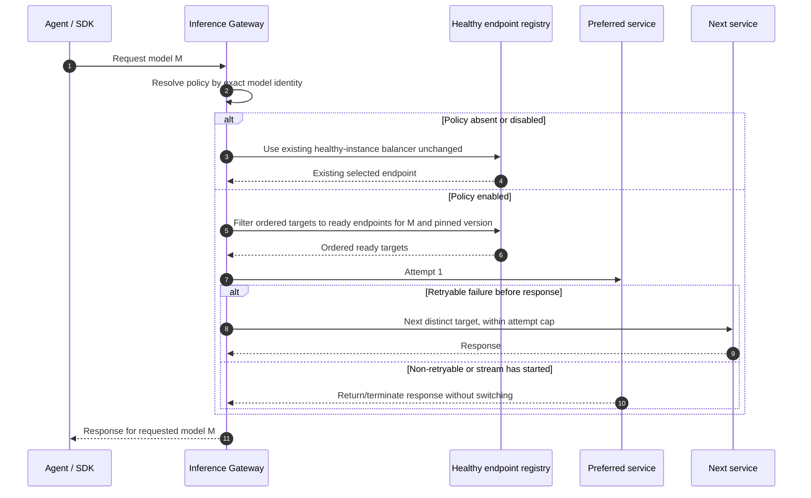

# Inference Routing Policies — Architecture and Detailed Design

| Attribute | Content |
| --- | --- |
| Feature point | Admin-controlled same-model deployment priority and bounded failover (backlog row 45) |
| Document scope | Persisted routing policies and immutable revisions, admin-only APIs and UI, gateway snapshot distribution and request-time selection, audit, errors, security, rollout, and implementation responsibilities |
| Owning modules | `infer` (policy, eligibility, revisions, audit, publication); Inference Gateway Envoy/Wasm routing adapter (snapshot application and attempt selection); `model` (catalog identity); `tenancy` (admin role); `web/` (admin page) |
| Related documents | [Requirement Analysis and UI/UX Design](../design/inference-routing-policies.md) · [Architecture Design](../design/architecture.md) §2.4 (`infer`) and §3.2 (Inference Gateway) · [Model Catalog & One-Click Deployment](./model-catalog-deployment.md) · [Inference Autoscaling](./inference-autoscaling.md) · [Request Tracing](./request-tracing.md) · [Console Surface Separation](./console-surface-separation.md) |
| Status | Architecture complete; handoff issued to Developer |

## 1. Goals and Non-Goals

### 1.1 Goals

- Let platform operators configure an ordered set of 1–10 active inference services for one catalog model and its pinned version, with enable/disable, a maximum of 1–3 total attempts, and the approved retry categories.
- Keep the public model identity, authorization, request payload, and billing price unchanged when a request moves between services for that exact model/version.
- Publish immutable policy revisions to the Inference Gateway; apply each received snapshot atomically and record ordered attempt outcomes in existing request tracing.
- Expose model summaries, current policy, eligible target health, and the latest 20 policy revisions through admin-only APIs.
- Preserve the existing healthy-instance balancing behavior exactly for a model with no policy or a disabled policy.
- Provide one admin page at `/admin/routing-policies`; there is no user policy page or management RPC.

### 1.2 Non-Goals

Cross-model or cross-version fallback, weighted/cost/latency routing, tenant- or caller-controlled policies, canary traffic, arbitrary request overrides, manual cooldown, retries of the same target within a request, rollback UI, raw Kubernetes objects, and retries after response streaming begins are excluded. Existing `/v1/chat/completions`, `/v1/completions`, and `/v1/embeddings` contracts do not change.

## 2. Architecture Decisions

| # | Decision | Rationale |
| --- | --- | --- |
| AD1 | The `infer` module owns policy state and admin RPCs; the data-plane Inference Gateway owns request-time selection. The Controller remains responsible only for Kubernetes reconciliation and observed service status. | Matches the existing `infer` desired/observed-state boundary; inference traffic continues to bypass business processes. |
| AD2 | V1 stores at most one policy per catalog `model_id`, pinned to one `model_version`. Every target must be an active service with the exact same model ID and version. Changing the pinned version requires a new policy revision; the public model name is never rewritten. | The specified API key is `{model_id}` and the design presents one policy per model. Pinning the version makes the URL unambiguous while prohibiting accidental version substitution. |
| AD3 | An absent or disabled policy invokes the pre-feature healthy-instance selection and retry implementation without changing its inputs or defaults. An enabled policy filters its ordered list to currently ready endpoints, then makes no more than `min(max_attempts, ready targets)` attempts, each on a distinct target. | This isolates the feature from default routing and bounds work and latency. |
| AD4 | Only connection/timeout before response, HTTP 429, and HTTP 5xx are retryable, and only when their category is enabled. Never retry other 4xx, client cancellation, or a failure after the first response byte. Do not retry a target twice in one request. | Implements FR2.2–FR2.3 and avoids replay after response commitment. |
| AD5 | Policy update writes the active revision, immutable revision row, audit event, and durable publication-outbox row in one PostgreSQL transaction. An outbox publisher retries delivery; each gateway swaps a complete, monotonically versioned snapshot atomically. | Prevents a committed policy from being permanently lost on a transient MQ failure and prevents partially applied target lists. |
| AD6 | Policy is platform-wide. An admin-realm session is mandatory; `tenancy.RoleGuard` requires `admin` or `owner` in the caller's active organization for reads and writes. That organization only authorizes the operator and does not scope policy data. | The configuration is shared and must not become tenant-editable. Explicit session and role checks strengthen the transitional sessionless behavior used by other existing APIs. |
| AD7 | Health is a current projection from `inference_services` status/endpoints and replica state, not an SLA. Raw endpoint URLs, credentials, and pod names are never returned. | Reuses the `infer` status consumer and limits disclosure. |
| AD8 | The policy does not create Kubernetes resources or change `infer.services.changes`. It is distributed on a dedicated routing-policy subject consumed by the data-plane routing adapter. | Keeps control-plane policy changes distinct from workload reconciliation. |

## 3. Component View

| Component | Responsibility and change |
| --- | --- |
| Control Gateway / grpc-gateway | Registers the new `InferServiceService` HTTP bindings from proto. Existing `RealmGuard` runs before the mux. No direct inference traffic passes through this gateway. |
| `infer` (`services/infer`) | Owns policy validation, model/service eligibility, CRUD reads, optimistic concurrency, revisions, audit transaction, outbox publisher/runner, and health projection. |
| `model` | Supplies model name and pinned catalog version for summaries and verifies the model exists. It does not own or mutate routing policy. |
| `tenancy` and `auth` | `auth` resolves session realm, actor, and active organization; `tenancy.RoleGuard` requires `admin` or `owner` for the active organization. |
| PostgreSQL | Stores current policy, immutable revisions, and publication outbox. GORM `AutoMigrate` is the schema source of truth. |
| MQ | Dedicated `infer.routing.policies` subject transports complete, versioned snapshots to the gateway adapter. It is not consumed by `internal/controller`. |
| Inference Gateway (Envoy + Wasm) | Caches the last valid snapshot, swaps it atomically by model ID/revision, filters to live ready endpoints, enforces attempt/error/stream rules, and emits attempt outcomes into existing request tracing. |
| `internal/controller` | Unchanged. Its existing status reports continue to update service lifecycle/endpoints in `infer`; it does not select targets or interpret policy. |
| Admin web console | Adds `RoutingPoliciesPage` under `AdminShell`, using only `/api/v1/admin/*`. No `UserShell` change is required. |

### 3.1 Policy and gateway consistency

The database transaction is the control-plane commit point. A successful update response means the revision and publication intent are durable; gateway propagation is asynchronous. The page exposes the revision and its publication state. Until a gateway receives the new complete revision it keeps its last valid snapshot; a gateway that has never received a policy uses existing default routing. Gateways ignore revisions older than the active in-memory revision. MQ redelivery is idempotent by `(model_id, revision)`. A malformed snapshot is rejected and logged without replacing the active snapshot. The outbox retries transient publication failures; operators can observe a pending publication rather than seeing the old gateway state misreported as active.

## 4. Data Model and Migration

### 4.1 Tables

`routing_policies` — one current row per catalog model:

| Column | Type | Constraint / meaning |
| --- | --- | --- |
| `model_id` | UUID | Primary key; catalog model identity |
| `model_version` | varchar(64) | Required pinned version |
| `enabled` | boolean | Not null, default false |
| `service_ids` | jsonb | Ordered unique service IDs, maximum 10 |
| `max_attempts` | smallint | 1–3, default 1; includes first attempt |
| `retry_on` | jsonb | Unique enum values: `connect_timeout`, `http_429`, `http_5xx` |
| `revision` | bigint | Monotonically increasing per model, starts at 1 |
| `updated_by` | varchar(64) | Authenticated actor ID |
| `created_at`, `updated_at` | timestamptz | UTC timestamps |

`routing_policy_revisions` — immutable history, primary key `(model_id, revision)`, storing the full normalized policy snapshot, actor ID, timestamp, and concise change summary. Preserve at least the newest 20 per model for API/UI history; older rows may be retained for audit according to platform retention configuration and must not be rewritten.

`routing_policy_outbox` — durable publication intent keyed by UUID, with `model_id`, `revision`, complete serialized snapshot, `created_at`, `published_at` nullable, attempt count, and last error. Unique `(model_id, revision)` makes retries idempotent. No endpoint credentials are stored in any policy or outbox snapshot.

### 4.2 Migration and initialization

Add GORM models to `services/infer` and include them in the existing infer `Migrator.Migrate` / `MigrateSchemaForFVT` registration. Startup `AutoMigrate` is additive; no init-SQL files or manual SQL upgrade path are used by the existing architecture. Do not seed one row per model: absence means default routing and is backward-compatible. Create a disabled default policy row on first `Get` only if the API needs to expose revision zero; prefer representing absence as `enabled=false`, revision `0` without insertion until first update. Existing inference services and deployments require no change.

## 5. API Design

All management and target-health methods are **admin-surface only**. Define them on `taas.infer.v1.InferServiceService` in `proto/taas/infer/v1/infer.proto`; every new RPC has the exact `google.api.http` binding below and is registered through grpc-gateway. There are no dual bindings and no `/api/v1/routing-policies/*` routes.

| RPC | Exact HTTP annotation | Purpose |
| --- | --- | --- |
| `ListRoutingPolicies` | `get: "/api/v1/admin/routing-policies"` | Paginated catalog model and policy summaries with search/state/accelerator filters |
| `GetRoutingPolicy` | `get: "/api/v1/admin/routing-policies/{model_id}"` | Current policy or default state, pinned version, eligible/ready counts, revision, retry options |
| `UpdateRoutingPolicy` | `put: "/api/v1/admin/routing-policies/{model_id}"`, `body: "*"` | Validate and atomically persist a new policy revision |
| `ListRoutingTargetHealth` | `get: "/api/v1/admin/routing-policies/{model_id}/health"` | Masked service readiness, desired/ready replicas, accelerator/card, cluster, health timestamp |
| `ListRoutingPolicyRevisions` | `get: "/api/v1/admin/routing-policies/{model_id}/revisions"` | Latest 20 immutable revisions and before/after values |

Existing selectors remain unchanged: `GET /api/v1/admin/models` and `GET /api/v1/admin/inference-services?model_id={model_id}`. The routing-policy RPC derives eligibility from its own authoritative service/model repositories rather than trusting client selector results. These endpoints and the new policy APIs are called only by the admin page.

### 5.1 Proto message contract

Define `RetryCategory` values `RETRY_CATEGORY_UNSPECIFIED`, `RETRY_CATEGORY_CONNECT_TIMEOUT`, `RETRY_CATEGORY_HTTP_429`, and `RETRY_CATEGORY_HTTP_5XX`. `RoutingPolicy` carries `model_id`, `model_version`, `enabled`, ordered `service_ids`, `max_attempts`, `retry_on`, `revision`, `updated_at`, `publication_state`, eligible count, and ready count. List summaries add model name, target/ready counts, and policy state (`DEFAULT`, `ENABLED`, `UNAVAILABLE`, `UNKNOWN`). Health items contain service ID/name, accelerator/type, cluster ID/name, desired/ready replicas, endpoint readiness, and last health update; they must omit endpoint URLs and pod identifiers. Revision messages contain actor, time, summary, and immutable before/after `RoutingPolicy` values.

`UpdateRoutingPolicyRequest` carries path `model_id`, `model_version`, `enabled`, `service_ids`, `max_attempts`, `retry_on`, and `expected_revision`. `expected_revision=0` means the policy has never been created. The response returns the normalized policy and publication state. A revision conflict returns no mutation and leaves the caller's unsaved values intact in the UI.

### 5.2 Validation and errors

Validate the entire proposed snapshot in one transaction before changing the active row:

- Model exists; version is non-empty and is the selected catalog version.
- At most 10 distinct services; each belongs to the exact `model_id` + `model_version`, is not terminated, and has the active lifecycle state required by the design.
- Disabled policies may have zero targets. Enabling requires at least one currently ready eligible target.
- `max_attempts` is 1–3; attempts greater than 1 require at least one retry category. Unknown/duplicate categories are invalid.
- `expected_revision` must match the stored revision.

Allocate infer errors: `10312 ROUTING_POLICY_INVALID` for invalid model/version/target/attempt/category input and `10313 ROUTING_POLICY_REVISION_CONFLICT` for stale `expected_revision`. Reuse `10301 INFER_SERVICE_NOT_FOUND` / `10101 MODEL_NOT_FOUND` only for genuine missing entities where this does not disclose cross-tenant service ownership; otherwise normalize an ineligible service to `10312`. Error responses use the existing unified `{ "code": ..., "message": ... }` body; business errors follow the platform's current grpc-gateway mapping (HTTP 500, client branches on body `code`). Gateway inference with no ready target returns the existing model-unavailable response; it never tries another model/version.

## 6. Frontend Architecture and Surface Security

| Page / module | Route | API prefix | Session realm and guard |
| --- | --- | --- | --- |
| Routing policy list and configuration drawer (`RoutingPoliciesPage`, `AdminShell`) | `/admin/routing-policies` | `/api/v1/admin/routing-policies*`; existing selectors `/api/v1/admin/models` and `/api/v1/admin/inference-services` | Admin session only; `AdminShell` uses admin-realm storage and `GET /api/v1/admin/auth/session`. `RealmGuard` rejects user tokens with `10038 REALM_MISMATCH`; missing/expired session is `10027 SESSION_INVALID`. Each RPC requires active-org `tenancy.RoleGuard` role `admin` or `owner`, else `10036 FORBIDDEN`. |
| End-user console | No route or page | No routing-policy management endpoint under `/api/v1/*` | No policy capability is exposed to user sessions. |
| Existing inference clients | Existing `/v1/chat/completions`, `/v1/completions`, `/v1/embeddings` | Existing data-plane `/v1/*` contract | Existing API-key auth remains in the data-plane gateway; routing policy is never caller-selectable. |

Place the page in `web/src/pages/RoutingPoliciesPage.tsx`, register `/admin/routing-policies` in the admin route table in `web/src/App.tsx`, and add its Operations navigation item to `ADMIN_NAV_ITEMS` in `web/src/shells/AdminShell.tsx`. Reuse the existing API client, pagination/table, drawer/dialog, i18n, and admin-shell permission/error patterns. Keep model/version immutable in the drawer; support drag-and-drop plus explicit move-up/down keyboard actions. Preserve stale rows on list errors, preserve unsaved fields on validation/conflict errors, and only close after success or explicit discard confirmation. No shared user component or user API client call is added.

## 7. Key Sequences

### 7.1 Save and distribute a revision

### 7.2 Request routing

## 8. Runtime Rules, Errors, and Observability

1. Resolve policy using the externally requested model identity. Require exact model ID and policy-pinned version; a target with a different version is never eligible.
2. Re-check endpoint readiness at request selection time. Skip unhealthy, terminated, stale, or endpoint-less targets; policy order is preference, not a readiness guarantee.
3. Cap actual attempts to the lower of configured `max_attempts` and available distinct eligible targets. The first target counts as attempt one. Never cycle to an earlier target.
4. Retry only an enabled failure category and only before response commitment. Client cancellation stops immediately. Once any streaming response byte is sent, propagate/terminate the stream; never switch target.
5. If no target remains, return the pre-existing model-unavailable code/body and preserve the requested model in logs and billing. No fallback to another version/model is permitted.
6. Emit selected service ID and ordered attempt result, category, and timing to existing request tracing for admin diagnostics. User request logs retain the requested model only. Do not emit request bodies or credentials.

Admin management failure semantics: wrong-realm session `10038`, invalid/expired/missing required session `10027`, insufficient admin/owner role `10036`, invalid policy `10312`, stale revision `10313`, storage/MQ-independent database failure `500`. MQ publication failures do not roll back committed policy; the outbox remains pending and is retried. No user management endpoint exists to return a user-realm authorization response.

## 9. Configuration

No new operator-tunable retry default is required: policy absence is the backward-compatible default. Add a named MQ subject `InferRoutingPolicies = "infer.routing.policies"` to `pkg/mq` defaults and subject documentation. Add infer outbox publisher enablement/worker and retry interval only if the existing runner conventions require explicit config; use conservative defaults and fail startup if policy writes are enabled without durable DB/outbox support. The gateway adapter must subscribe to the subject, validate full snapshots, and report last-applied revision/last error through existing tracing/operational logs; do not put endpoint secrets into configuration or messages.

## 10. Security and Privacy

- Only admin-realm sessions may call the new admin routes; the `RealmGuard` is the first HTTP middleware. User-realm tokens fail with body code `10038`; missing/expired required tokens fail `10027`.
- Require an authenticated actor and `tenancy.RoleGuard` minimum `admin` for all policy reads/writes. Treat `owner` as satisfying that minimum. Missing session context is not equivalent to authorized transitional access for these RPCs.
- Platform-wide policy data is not organization-editable. Active organization is used solely for RBAC. Audit each committed revision with actor, timestamp, model/version, revision, and before/after policy fields.
- Validate service ownership, model identity, lifecycle, and version server-side. Return masked health projections only. Never reveal raw pod names, endpoint URLs, tokens, secrets, or another API's session.
- Retry can duplicate provider-side work after an ambiguous pre-response failure. The UI explicitly warns that attempts may add latency and provider work; attempts are bounded and no retry occurs after streaming starts.

## 11. Rollout and Upgrade

1. Deploy additive AutoMigrate tables and the infer outbox runner. Existing services and routing have no policy row and continue on existing default selection.
2. Deploy the gateway adapter capable of consuming versioned snapshots while preserving the existing balancer for absent/disabled policies. It must ignore malformed and out-of-order revisions.
3. Deploy the admin API and page. Operators initially see models in `Default` state; enabling is blocked until there is a ready same-version target.
4. Verify a committed revision reaches every gateway, outbox retries recover from MQ interruption, and old snapshots do not overwrite newer ones. Rollback of the application binary is safe because the schema is additive; older gateways ignore the new subject and retain default routing. Disable policies before rolling back a gateway that has already been configured with non-default routing.

## 12. Acceptance-Criteria Traceability

| UI/UX criterion | Architecture coverage |
| --- | --- |
| AC1–AC2: admin-only list and exact-version target health with masked fields | §§5–6, admin RPC guard and health projection |
| AC3: pointer and keyboard ordering; reject duplicate/ineligible targets | §§5.1–5.2, frontend module responsibilities |
| AC4: no-ready enable rejection; disable restores existing default | §§2 AD3, 5.2, 8 |
| AC5: 1–3 attempts and only the specified retry categories | §§2 AD4, 5.1–5.2, 8 |
| AC6: impact confirmation and cancel leaves active revision untouched | §§6–7.1 |
| AC7: immutable revision/audit, optimistic conflict, preserve draft | §§2 AD5, 4, 5.2, 6 |
| AC8: exact-model/version healthy routing; cancellation and streaming rules | §§2 AD2–AD4, 7.2, 8 |
| AC9: existing unavailable response and no model/version substitution | §§1.1, 2 AD2–AD3, 8 |
| AC10: admin API only and no user management surface | §§1.1, 5–6, 10 |
| AC11: unchanged default behavior and specified page states | §§1.1, 2 AD3, 6, 11 |

## 13. Detailed Implementation Design

### 13.1 Proto and service (`proto/taas/infer/v1` → `services/infer`)

- Add the five RPCs and messages in §5 to `infer.proto`, with admin-only exact `google.api.http` annotations. Regenerate Go and gateway code using the repository's Buf/Make workflow. Do not add user bindings.
- Add `routing_policy_model.go` for GORM `RoutingPolicy`, `RoutingPolicyRevision`, and `RoutingPolicyOutbox` models and enums; implement `TableName` and include each in infer migrations and FVT schema migration.
- Add `routing_policy_repository.go`: transactional `GetCurrent`, filtered/paginated list, eligible service query, revision query, `CompareAndSwapUpdate`, and outbox claim/mark-published operations. Enforce unique targets and exact model/version at the repository/service boundary.
- Add `routing_policy_service.go`: `ListRoutingPolicies`, `GetRoutingPolicy`, `UpdateRoutingPolicy`, `ListRoutingTargetHealth`, and `ListRoutingPolicyRevisions`. Resolve model catalog metadata, current eligible services and health; validate before transaction; resolve session actor/active organization; require admin role; transactionally store revision, audit record, and outbox item. Return stable platform error codes from §5.2.
- Reuse the existing audit recorder contract where possible, but ensure the audit event is in the same transaction as the active revision. If the current audit recorder is best-effort/out-of-transaction, add a narrow transactional repository seam for this mutation rather than claiming atomic audit without it.
- Add `routing_policy_publisher.go` as a `server.Runner`: publish pending outbox snapshots in revision order per model, mark delivery after successful MQ publish, retry with bounded backoff, and tolerate duplicate delivery. Use the dedicated subject from §9.
- Extend `InferServiceServiceServer` registration and production wiring in `apps/taas-server/main.go` with `SessionUserResolver`, `SessionOrgResolver`, and `tenancy.RoleGuard`; missing required auth seams fail closed in production. Preserve sessionless behavior of unrelated existing infer RPCs.

### 13.2 Gateway routing adapter

- Define a versioned JSON/protobuf snapshot containing model ID, pinned version, enabled flag, ordered service IDs, attempt limit, retry categories, revision, and publication timestamp. Publish no endpoint URL or secret.
- Subscribe on `infer.routing.policies`; validate fields and model/version target identity, then replace the immutable in-memory snapshot for one model under an atomic pointer/lock. Reject malformed or lower/equal duplicate revisions without disturbing the current state.
- At request header phase, obtain ready endpoint candidates from the existing endpoint registry. For absent/disabled policies, execute the old selection path byte-for-byte. For enabled policies, intersect ordered IDs with the registry's ready exact-version endpoints.
- Implement the retry classifier at the upstream response boundary before response commitment. Count the first attempt, enforce one attempt per target and the global configured cap, and stop on cancellation/nonretryable status/stream start. Do not change the request's model, auth context, billing labels, or response identity.
- Add trace fields for service ID and ordered attempts to the existing tracing event. Keep user-facing request-log projection masked.

### 13.3 Repository migration and runtime wiring

- Extend the existing infer `Migrator.Migrate` and FVT migration model lists; no init SQL or destructive migration.
- Add the subject constant in `pkg/mq` and add the outbox publisher to the server's runner registration. On missing MQ, retain durable pending rows and expose pending state; do not discard or falsely mark them published.
- Verify startup order constructs the repositories after DB initialization and publisher after MQ initialization. A disabled/missing runner must not make legacy inference routes fail, but writes must fail with an internal error rather than acknowledge undeliverable policy state.

### 13.4 Frontend modules

- `web/src/pages/RoutingPoliciesPage.tsx`: list/search/filter/sort/paginate models; loading, empty catalog, empty filter, stale-data error, unavailable, unknown, and permission-denied states; open the configuration drawer without changing the page route.
- Drawer subcomponents (local to the page unless an established component exists): policy enabled toggle; exact model/version heading; ordered target list with drag-and-drop and move-up/down buttons; eligible-only add menu; attempt selector and retry-category checkboxes; impact preview; latest-20 revision list and read-only before/after diff.
- `web/src/App.tsx`: add the admin-only `/admin/routing-policies` route. `web/src/shells/AdminShell.tsx`: add an Operations navigation item and translation keys. Do not add route or navigation changes under `UserSurface`/`UserShell`.
- Use only the existing admin API client paths from §5. On `10038` or `10027`, let the shell's realm guard flow redirect to `/admin/login`; on `10036`, render the page-level permission denial and no policy data. On `10313`, retain the draft and provide reload; on validation or save errors, retain the draft and keep the last active revision unchanged.

### 13.5 Focused verification

Add infer unit/FVT coverage for validation bounds, exact-version eligibility, stale revision, transaction rollback, audit/revision/outbox atomicity, publication retry/idempotency, and admin-role enforcement. Add gateway tests for old-path default behavior, ordering, unhealthy target skipping, retryable classification, attempt cap, no repeats, cancellation, 4xx, post-stream failure, all-targets-unavailable, and version/model invariance. Add Nightwatch coverage for AC1–AC7 and AC10–AC11, including proving that `/admin/routing-policies` calls only `/api/v1/admin/*` and that user-realm sessions cannot call policy RPCs.