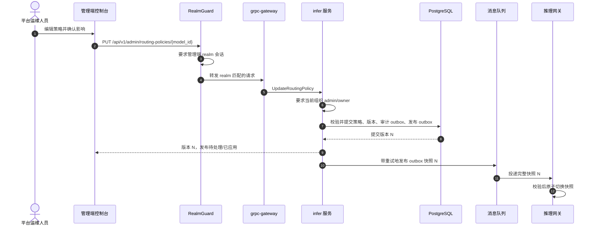
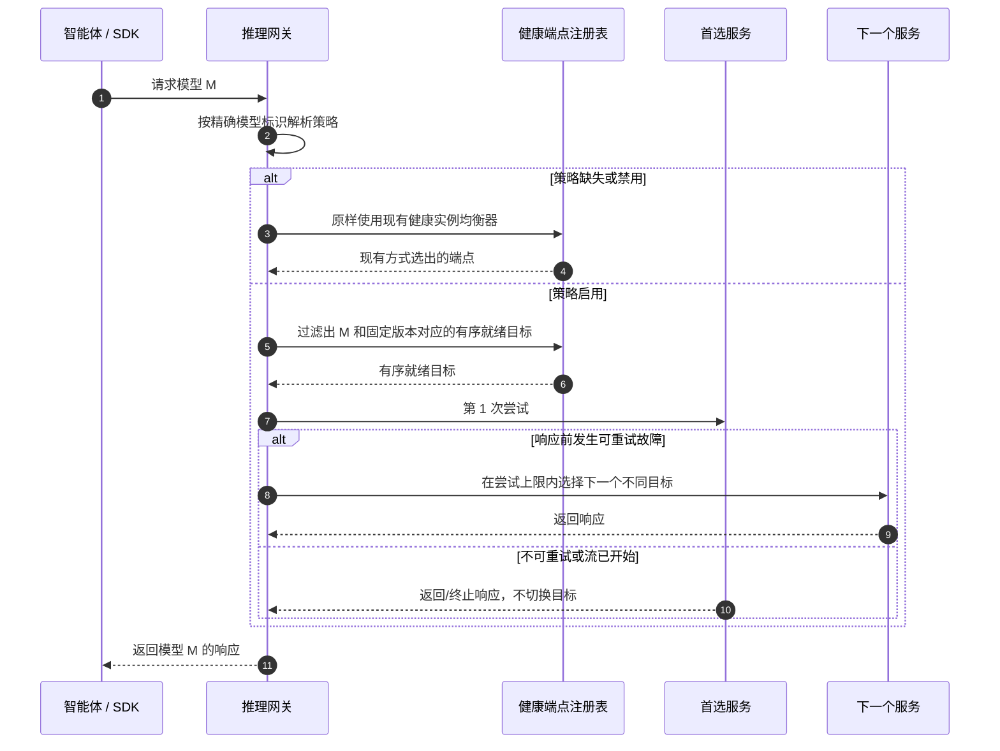

# 推理路由策略 — 架构与详细设计

| 属性 | 内容 |
| --- | --- |
| 功能点 | 管理端控制的同模型部署优先级与有界故障转移（backlog 第 45 行） |
| 文档范围 | 持久化路由策略与不可变版本、仅管理端 API 和 UI、网关快照分发与请求时选择、审计、错误、安全、发布及实现职责 |
| 所属模块 | `infer`（策略、资格校验、版本、审计、发布）；数据面推理网关 Envoy/Wasm 路由适配器（应用快照和选择尝试目标）；`model`（目录标识）；`tenancy`（管理员角色）；`web/`（管理页面） |
| 相关文档 | [需求分析与 UI/UX 设计](../design/inference-routing-policies.zh-cn.md) · [架构设计](../design/architecture.zh-cn.md) §2.4（`infer`）和 §3.2（推理网关）· [模型目录与一键部署](./model-catalog-deployment.zh-cn.md) · [推理自动伸缩](./inference-autoscaling.zh-cn.md) · [请求追踪](./request-tracing.zh-cn.md) · [控制台面分离](./console-surface-separation.zh-cn.md) |
| 状态 | 架构完成；已向 Developer 发出移交 |

## 1. 目标与非目标

### 1.1 目标

- 允许平台运维人员为一个目录模型及其固定版本配置 1–10 个活动推理服务的有序列表，并设置启用/禁用、最多 1–3 次总尝试和获准的重试类别。
- 请求在同一精确模型/版本的服务间切换时，保持公开模型标识、授权、请求载荷和计费价格不变。
- 向推理网关发布不可变策略版本；网关原子应用每个完整快照，并将有序尝试结果记录到现有请求追踪。
- 通过仅管理员可调用的 API 提供模型摘要、当前策略、合格目标健康状态及最近 20 个策略版本。
- 没有策略或策略已禁用时，原样保留现有健康实例均衡行为。
- 提供一个管理端页面 `/admin/routing-policies`；不提供用户策略页面或管理 RPC。

### 1.2 非目标

不支持跨模型或跨版本回退、加权/成本/延迟路由、租户或调用方控制策略、金丝雀流量、任意请求覆盖、手动冷却、单个请求内重复尝试同一目标、回滚 UI、原始 Kubernetes 对象，以及响应流开始后的重试。现有 `/v1/chat/completions`、`/v1/completions` 和 `/v1/embeddings` 契约不变。

## 2. 架构决策

| # | 决策 | 理由 |
| --- | --- | --- |
| AD1 | `infer` 模块拥有策略状态和管理端 RPC；数据面推理网关负责请求时选择。Controller 仍只负责 Kubernetes 协调及服务观测状态。 | 符合现有 `infer` 期望/观测状态边界；推理流量继续绕过业务进程。 |
| AD2 | V1 每个目录 `model_id` 最多保存一个策略，并固定到一个 `model_version`。目标必须是模型 ID 和版本都完全匹配的活动服务。更改固定版本需要新策略版本；不改写公开模型名。 | 设计中的 API 键为 `{model_id}`，并且每个模型配置一个策略。固定版本使 URL 明确且禁止意外版本替换。 |
| AD3 | 策略缺失或禁用时，调用功能变更前的健康实例选择及重试实现，不更改其输入或默认值。启用策略时，从有序列表中过滤当前就绪端点，尝试次数不超过 `min(max_attempts, 就绪目标数)`，且每个目标至多尝试一次。 | 隔离新功能与默认路由，并约束工作量和延迟。 |
| AD4 | 仅响应前连接/超时、HTTP 429 和 HTTP 5xx 可重试，且必须启用相应类别。除 429 外不重试其他 4xx；不重试客户端取消或首个响应字节发出后的故障。单个请求不能重复尝试同一目标。 | 落实 FR2.2–FR2.3，避免响应提交后重放。 |
| AD5 | 策略更新在一个 PostgreSQL 事务中写入当前版本、不可变历史版本和持久发布 outbox。审计事件以事务内的审计 outbox 记录确保可靠投递；outbox 发布器重试投递，每个网关原子切换完整且版本单调递增的快照。 | 避免 MQ 瞬时故障导致已提交策略永久丢失，并防止部分目标列表生效。 |
| AD6 | 策略属于平台级配置。必须提供管理端 realm 会话；所有读写均要求 `tenancy.RoleGuard` 验证调用者当前组织中的 `admin` 或 `owner`。该组织只用于授权，不用于限定策略数据。 | 配置为共享配置，不应变成租户可编辑配置。显式会话与角色校验加强现有 API 的无会话过渡行为。 |
| AD7 | 健康信息是从 `inference_services` 状态/端点和副本状态投影出的当前快照，不是 SLA。不得返回原始端点 URL、凭据或 Pod 名称。 | 复用 `infer` 状态消费者并限制信息暴露。 |
| AD8 | 策略不创建 Kubernetes 资源，也不修改 `infer.services.changes`。通过独立路由策略 subject 分发给数据面路由适配器。 | 将控制面策略变更与工作负载协调分开。 |

## 3. 组件视图

| 组件 | 职责和变更 |
| --- | --- |
| 控制网关 / grpc-gateway | 根据 proto 注册新的 `InferServiceService` HTTP 绑定。现有 `RealmGuard` 在 mux 前执行。推理流量不经过此网关。 |
| `infer`（`services/infer`） | 拥有策略校验、模型/服务资格、CRUD 读取、乐观并发、版本、审计事务、发布 outbox/runner 和健康投影。 |
| `model` | 为摘要提供模型名和固定目录版本并验证模型存在；不拥有或修改路由策略。 |
| `tenancy` 与 `auth` | `auth` 解析会话 realm、操作者和当前组织；`tenancy.RoleGuard` 要求当前组织中的 `admin` 或 `owner`。 |
| PostgreSQL | 保存当前策略、不可变版本和发布 outbox。GORM `AutoMigrate` 是 schema 唯一来源。 |
| MQ | 专用 `infer.routing.policies` subject 向网关适配器传输完整版本化快照；`internal/controller` 不消费该 subject。 |
| 推理网关（Envoy + Wasm） | 缓存最后一个有效快照，按模型 ID/版本原子切换，过滤实时就绪端点，执行尝试/错误/流式规则，并将尝试结果写入现有请求追踪。 |
| `internal/controller` | 不变。现有状态报告继续更新 `infer` 中的服务生命周期/端点；不选择目标，也不解释策略。 |
| 管理端 Web 控制台 | 在 `AdminShell` 下增加 `RoutingPoliciesPage`，仅使用 `/api/v1/admin/*`；不需要修改 `UserShell`。 |

### 3.1 策略与网关一致性

数据库事务是控制面提交点。更新成功响应意味着策略版本和发布意图已持久化；网关传播为异步。页面展示版本及其发布状态。在网关收到完整新版本之前，它保留最后一个有效快照；从未收到策略的网关使用现有默认路由。网关忽略低于当前内存版本的消息。MQ 重投以 `(model_id, revision)` 幂等处理。格式错误的快照会被拒绝并记录日志，不能替换当前快照。outbox 会重试临时发布故障；运维人员能看到待发布状态，不会误以为旧网关状态已生效。

## 4. 数据模型与迁移

### 4.1 数据表

`routing_policies`：每个目录模型一条当前记录：

| 列 | 类型 | 约束 / 含义 |
| --- | --- | --- |
| `model_id` | UUID | 主键；目录模型标识 |
| `model_version` | varchar(64) | 必填固定版本 |
| `enabled` | boolean | 非空，默认 false |
| `service_ids` | jsonb | 有序且唯一的服务 ID，最多 10 个 |
| `max_attempts` | smallint | 1–3，默认 1；包含首次尝试 |
| `retry_on` | jsonb | 唯一枚举值：`connect_timeout`、`http_429`、`http_5xx` |
| `revision` | bigint | 每模型单调递增，从 1 开始 |
| `updated_by` | varchar(64) | 已认证的操作者 ID |
| `created_at`、`updated_at` | timestamptz | UTC 时间戳 |

`routing_policy_revisions`：不可变历史表，主键 `(model_id, revision)`，存储完整规范化策略快照、操作者 ID、时间和简明变更摘要。API/UI 至少保留每个模型最新 20 个版本；更旧记录可按平台留存配置保留，不得改写。

`routing_policy_outbox`：以 UUID 为键的持久发布意图，字段包括 `model_id`、`revision`、完整序列化快照、`created_at`、可空的 `published_at`、尝试次数和最近错误。唯一约束 `(model_id, revision)` 保证重试幂等。策略和 outbox 快照均不存储端点凭据。

### 4.2 迁移与初始化

在 `services/infer` 添加 GORM 模型，并将其加入现有 infer `Migrator.Migrate` / `MigrateSchemaForFVT` 注册。启动时的 `AutoMigrate` 为增量迁移；现有架构不使用 init-SQL 文件或手写 SQL 升级路径。不为每个模型预置行：记录不存在即代表默认路由并保持向后兼容。只有当 API 必须表达版本 0 时，首次 `Get` 才创建禁用默认行；优先在首次更新前用“记录缺失、`enabled=false`、版本 `0`”表示。现有推理服务和部署不需要变更。

## 5. API 设计

所有管理与目标健康方法都**仅属于管理端**。在 `proto/taas/infer/v1/infer.proto` 的 `taas.infer.v1.InferServiceService` 定义；每个新 RPC 都使用下表精确的 `google.api.http` 绑定，并经 grpc-gateway 注册。不提供双重绑定，也不定义 `/api/v1/routing-policies/*` 路由。

| RPC | 精确 HTTP 注解 | 用途 |
| --- | --- | --- |
| `ListRoutingPolicies` | `get: "/api/v1/admin/routing-policies"` | 分页返回目录模型和策略摘要，支持搜索/状态/加速器筛选 |
| `GetRoutingPolicy` | `get: "/api/v1/admin/routing-policies/{model_id}"` | 读取当前策略或默认状态、固定版本、合格/就绪数、版本及重试选项 |
| `UpdateRoutingPolicy` | `put: "/api/v1/admin/routing-policies/{model_id}"`，`body: "*"` | 校验并原子持久化新的策略版本 |
| `ListRoutingTargetHealth` | `get: "/api/v1/admin/routing-policies/{model_id}/health"` | 脱敏服务就绪、副本数、加速器/卡型、集群及健康时间 |
| `ListRoutingPolicyRevisions` | `get: "/api/v1/admin/routing-policies/{model_id}/revisions"` | 返回最近 20 个不可变版本及变更前后值 |

模型与服务选择器维持现状：`GET /api/v1/admin/models` 和 `GET /api/v1/admin/inference-services?model_id={model_id}`。路由策略 RPC 从自身权威服务/模型仓储重新计算资格，不信任客户端选择器结果。上述选择器和新策略 API 只能由管理页面调用。

### 5.1 Proto 消息契约

定义 `RetryCategory`：`RETRY_CATEGORY_UNSPECIFIED`、`RETRY_CATEGORY_CONNECT_TIMEOUT`、`RETRY_CATEGORY_HTTP_429` 和 `RETRY_CATEGORY_HTTP_5XX`。`RoutingPolicy` 包含 `model_id`、`model_version`、`enabled`、有序 `service_ids`、`max_attempts`、`retry_on`、`revision`、`updated_at`、`publication_state`、合格数和就绪数。列表摘要增加模型名、目标/就绪数和策略状态（`DEFAULT`、`ENABLED`、`UNAVAILABLE`、`UNKNOWN`）。健康项包含服务 ID/名称、加速器/卡型、集群 ID/名称、期望/就绪副本数、端点就绪状态和最近健康更新时间；必须排除端点 URL 和 Pod 标识。版本消息包含操作者、时间、摘要以及只读的策略变更前后值。

`UpdateRoutingPolicyRequest` 包含路径 `model_id`、`model_version`、`enabled`、`service_ids`、`max_attempts`、`retry_on` 和 `expected_revision`。`expected_revision=0` 表示从未创建策略。响应返回规范化策略和发布状态。版本冲突不得产生变更，且 UI 保留调用方未保存的字段。

### 5.2 校验与错误

在修改当前记录前，于一个事务中校验完整提案：

- 模型存在；版本非空且为所选目录版本。
- 最多 10 个不同服务；每个服务的 `model_id` 和 `model_version` 精确匹配、未终止，并满足设计要求的活动生命周期状态。
- 禁用策略允许没有目标。启用必须至少有一个当前就绪的合格目标。
- `max_attempts` 为 1–3；大于 1 时至少选择一个重试类别。不接受未知或重复类别。
- `expected_revision` 必须与已存版本相符。

分配 infer 错误码：无效模型/版本/目标/尝试数/类别为 `10312 ROUTING_POLICY_INVALID`；过期 `expected_revision` 为 `10313 ROUTING_POLICY_REVISION_CONFLICT`。仅当确为实体不存在且不会泄露跨租户服务归属时，才复用 `10301 INFER_SERVICE_NOT_FOUND` / `10101 MODEL_NOT_FOUND`；否则将不合格目标统一映射为 `10312`。错误响应使用现有统一 `{ "code": ..., "message": ... }` 结构；业务错误遵循平台现有 grpc-gateway 映射（HTTP 500，客户端根据响应体 `code` 分支）。网关无就绪目标时返回现有模型不可用响应；绝不尝试其他模型/版本。

## 6. 前端架构与面安全

| 页面 / 模块 | 路由 | API 前缀 | 会话 realm 与守卫 |
| --- | --- | --- | --- |
| 路由策略列表和配置抽屉（`RoutingPoliciesPage`、`AdminShell`） | `/admin/routing-policies` | `/api/v1/admin/routing-policies*`；现有选择器 `/api/v1/admin/models` 和 `/api/v1/admin/inference-services` | 仅管理端会话；`AdminShell` 使用 admin realm 存储并调用 `GET /api/v1/admin/auth/session`。`RealmGuard` 对用户令牌返回 `10038 REALM_MISMATCH`；缺失/过期会话为 `10027 SESSION_INVALID`。每个 RPC 都要求当前组织 `tenancy.RoleGuard` 角色为 `admin` 或 `owner`，否则返回 `10036 FORBIDDEN`。 |
| 终端用户控制台 | 无路由或页面 | `/api/v1/*` 下没有路由策略管理端点 | 不向用户会话提供策略能力。 |
| 现有推理客户端 | 现有 `/v1/chat/completions`、`/v1/completions`、`/v1/embeddings` | 现有数据面 `/v1/*` 契约 | 数据面网关继续使用现有 API Key 认证；调用方不能选择路由策略。 |

将页面放在 `web/src/pages/RoutingPoliciesPage.tsx`，在 `web/src/App.tsx` 管理路由表注册 `/admin/routing-policies`，并在 `web/src/shells/AdminShell.tsx` 的 `ADMIN_NAV_ITEMS` 中加入运维导航项。复用现有 API 客户端、分页/表格、抽屉/对话框、i18n 及管理壳层权限/错误模式。抽屉中的模型/版本不可编辑；支持拖放和明确的上移/下移键盘操作。列表错误时保留旧行；校验/冲突错误时保留未保存字段；仅在成功或明确确认丢弃后关闭。不得增加共享用户组件或用户 API 调用。

## 7. 关键时序

### 7.1 保存并分发版本

### 7.2 请求路由

## 8. 运行规则、错误与可观测性

1. 根据外部请求的模型标识解析策略。必须匹配精确模型 ID 和策略固定版本；不同版本的目标永不合格。
2. 请求选择时重新检查端点就绪状态。跳过不健康、已终止、过期或无端点的目标；顺序表示优先级，不代表健康保证。
3. 实际尝试数不超过配置 `max_attempts` 与可用不同合格目标数中的较小值。首次尝试计为一次。不得循环到已尝试目标。
4. 只对启用的错误类别且在响应提交前重试。客户端取消立即终止。一旦发送任何流式响应字节，就继续/终止当前流，绝不切换目标。
5. 没有目标时返回已有模型不可用 code/body，并在日志和计费中保留请求模型。禁止回退到其他版本/模型。
6. 将所选服务 ID、有序尝试结果、类别和耗时写入现有请求追踪供管理端诊断。用户请求日志仍只展示请求模型。不得记录请求体或凭据。

管理 API 错误语义：错误 realm 会话 `10038`；无效/过期/缺失的必需会话 `10027`；管理员/所有者角色不足 `10036`；无效策略 `10312`；版本过期 `10313`；数据库故障 `500`。MQ 发布错误不回滚已提交策略；outbox 保留待处理状态并重试。用户面没有管理端点，因此不存在可调用该策略 API 的用户会话授权响应。

## 9. 配置

无需新增可调重试默认值：没有策略即使用向后兼容默认路由。在 `pkg/mq` 默认 subject 中增加 `InferRoutingPolicies = "infer.routing.policies"` 并补充 subject 文档。仅在现有 runner 模式要求显式配置时，才增加 infer outbox publisher 启用项/worker 数和重试间隔；提供保守默认值，并在启用策略写入但缺少持久 DB/outbox 支持时启动失败。网关适配器订阅该 subject、校验完整快照，并通过现有追踪/运维日志报告最后应用版本和最近错误；配置或消息中不得放入端点密钥。

## 10. 安全与隐私

- 新管理路由只接受管理端 realm 会话；`RealmGuard` 是第一个 HTTP 中间件。用户 realm 令牌返回响应体 code `10038`；缺失/过期必需会话返回 `10027`。
- 所有策略读写均要求已认证操作者和 `tenancy.RoleGuard` 最低 `admin` 角色。`owner` 满足此下限。缺少会话上下文不能视为获得授权的过渡访问。
- 平台级策略不按组织编辑。当前组织仅用于 RBAC。每个已提交版本都记录操作者、时间、模型/版本、版本号及变更前后策略字段。
- 服务归属、模型标识、生命周期和版本必须在服务端校验。健康信息只返回脱敏投影。不得泄露 Pod 名称、端点 URL、令牌、密钥或其他 API 的会话。
- 响应前发生不确定故障时，重试可能重复供应商侧工作。UI 明确提示尝试会增加延迟和供应商工作量；尝试次数有界，流开始后不重试。

## 11. 发布与升级

1. 部署增量 AutoMigrate 表和 infer outbox runner。现有服务没有策略行，因此继续使用现有默认选择。
2. 部署可消费版本化快照的网关适配器；无策略或禁用时保留现有均衡器。忽略格式错误和乱序版本。
3. 部署管理端 API 和页面。运维人员最初看到模型状态为 `Default`；没有同版本就绪目标时禁止启用。
4. 验证已提交版本抵达所有网关、MQ 中断后 outbox 可恢复，以及旧快照不会覆盖新快照。应用二进制回滚因 schema 增量而安全；旧网关忽略新 subject 并保留默认路由。如果已配置非默认路由后要回滚网关，先禁用策略。

## 12. 验收标准追踪

| UI/UX 标准 | 架构覆盖 |
| --- | --- |
| AC1–AC2：仅管理端列表和精确版本目标健康信息，字段脱敏 | §§5–6，管理 RPC 守卫与健康投影 |
| AC3：鼠标/键盘排序；拒绝重复或不合格目标 | §§5.1–5.2，前端职责 |
| AC4：无就绪目标时不能启用；禁用后恢复原有默认行为 | §§2 AD3、5.2、8 |
| AC5：1–3 次尝试及限定的重试类别 | §§2 AD4、5.1–5.2、8 |
| AC6：影响确认；取消不改变活动版本 | §§6–7.1 |
| AC7：不可变版本/审计、并发冲突、保留草稿 | §§2 AD5、4、5.2、6 |
| AC8：仅对精确模型/版本健康路由；取消及流式规则 | §§2 AD2–AD4、7.2、8 |
| AC9：返回现有不可用响应且不替换模型/版本 | §§1.1、2 AD2–AD3、8 |
| AC10：仅管理端 API，无用户管理面 | §§1.1、5–6、10 |
| AC11：默认行为不变且覆盖页面状态 | §§1.1、2 AD3、6、11 |

## 13. 详细实现设计

### 13.1 Proto 与服务（`proto/taas/infer/v1` → `services/infer`）

- 在 `infer.proto` 增加 §5 中五个 RPC 和消息，并使用精确的管理端 `google.api.http` 注解。按仓库 Buf/Make 流程重新生成 Go 和 gateway 代码；不添加用户端绑定。
- 增加 `routing_policy_model.go`，定义 GORM `RoutingPolicy`、`RoutingPolicyRevision`、`RoutingPolicyOutbox` 模型和枚举；实现 `TableName`，并将模型加入 infer 迁移和 FVT schema 迁移。
- 增加 `routing_policy_repository.go`：提供事务型 `GetCurrent`、筛选/分页列表、合格服务查询、版本查询、`CompareAndSwapUpdate`、outbox 认领/标记已发布操作。在仓储/服务边界强制目标唯一及模型/版本精确匹配。
- 增加 `routing_policy_service.go`：实现 `ListRoutingPolicies`、`GetRoutingPolicy`、`UpdateRoutingPolicy`、`ListRoutingTargetHealth` 和 `ListRoutingPolicyRevisions`。解析模型目录信息、当前合格服务和健康状态；事务前校验；解析会话操作者/当前组织并要求管理员角色；事务性保存策略、历史版本和发布 outbox。审计事件通过与策略事务同提交的 infer 审计 outbox 确保可靠投递，禁止假设现有 best-effort 审计记录器参与事务。错误码固定使用 §5.2。
- 增加 `routing_policy_publisher.go`，实现 `server.Runner`：按模型版本顺序发布待处理快照，MQ 成功后标记已发布，以有界退避重试并容忍重复投递。使用 §9 的独立 subject。
- 在 `apps/taas-server/main.go` 中扩展 `InferServiceServiceServer` 注册和生产 wiring，注入 `SessionUserResolver`、`SessionOrgResolver` 和 `tenancy.RoleGuard`；生产缺少必需认证依赖时必须 fail closed。其他现有 infer RPC 的无会话行为保持不变。

### 13.2 网关路由适配器

- 定义版本化 JSON/protobuf 快照，包含模型 ID、固定版本、启用标志、有序服务 ID、尝试上限、重试类别、版本号和发布时间。不得发布端点 URL 或密钥。
- 订阅 `infer.routing.policies`；校验字段及目标模型/版本，然后通过原子指针/锁替换单模型不可变快照。重复、低版本或格式错误的消息不得影响当前快照。
- 在请求头阶段从现有端点注册表获取就绪候选。没有策略/策略禁用时，逐字保持旧选择路径。启用策略时，将有序目标与注册表中精确版本的就绪端点求交。
- 在响应提交前的上游响应边界实现重试分类器。首次请求计入次数；强制单目标单次及总次数上限；取消、不可重试状态或流开始后立即停止。不得修改请求模型、认证上下文、计费标签或响应身份。
- 在现有追踪事件中增加服务 ID 和有序尝试字段。用户请求日志投影继续脱敏。

### 13.3 仓储迁移与运行时 wiring

- 扩展 infer 现有 `Migrator.Migrate` 和 FVT 迁移模型清单；不使用 init SQL，不做破坏性迁移。
- 在 `pkg/mq` 增加 subject 常量，并将 outbox publisher 加入 server runner 注册。MQ 不可用时保留持久的待处理记录并展示待处理状态；不得丢弃或错误标记已发布。
- 确认仓储在 DB 初始化后创建，publisher 在 MQ 初始化后创建。runner 被禁用/缺失不得让旧推理路由失败，但策略写入必须返回内部错误，不能确认无法投递的策略状态。

### 13.4 前端模块

- `web/src/pages/RoutingPoliciesPage.tsx`：模型列表/搜索/筛选/排序/分页；覆盖加载、目录为空、筛选为空、保留旧数据的错误、不可用、未知及权限拒绝状态；配置抽屉不改变页面路由。
- 页面内抽屉组件（除非已有成熟共享组件）：策略启用开关；精确模型/版本标题；支持拖放和上移/下移按钮的有序目标列表；仅含合格服务的添加菜单；尝试次数选择和重试类别复选框；影响预览；最近 20 个版本列表和只读前后差异。
- `web/src/App.tsx`：仅增加 `/admin/routing-policies` 管理端路由。`web/src/shells/AdminShell.tsx`：增加运维导航项和翻译键。不得修改 `UserSurface`/`UserShell` 的路由或导航。
- 只调用 §5 中现有及新增管理端 API。遇到 `10038` 或 `10027` 时由壳层 realm 守卫跳转 `/admin/login`；`10036` 显示页面级拒绝且不显示策略数据。遇到 `10313` 保留草稿并提供重载；校验/保存错误保留草稿且活动版本不变。

### 13.5 聚焦验证

增加 infer 单元/FVT 测试，覆盖校验边界、精确版本资格、旧版本冲突、事务回滚、审计/版本/outbox 原子性、发布重试/幂等和管理员角色。增加网关测试，覆盖原路径默认行为、顺序、不健康目标跳过、重试分类、次数上限、不重复目标、取消、4xx、流开始后的故障、全部目标不可用以及模型/版本不变。增加 Nightwatch 覆盖 AC1–AC7、AC10–AC11，证明 `/admin/routing-policies` 只调用 `/api/v1/admin/*`，且用户 realm 会话不能调用策略 RPC。
