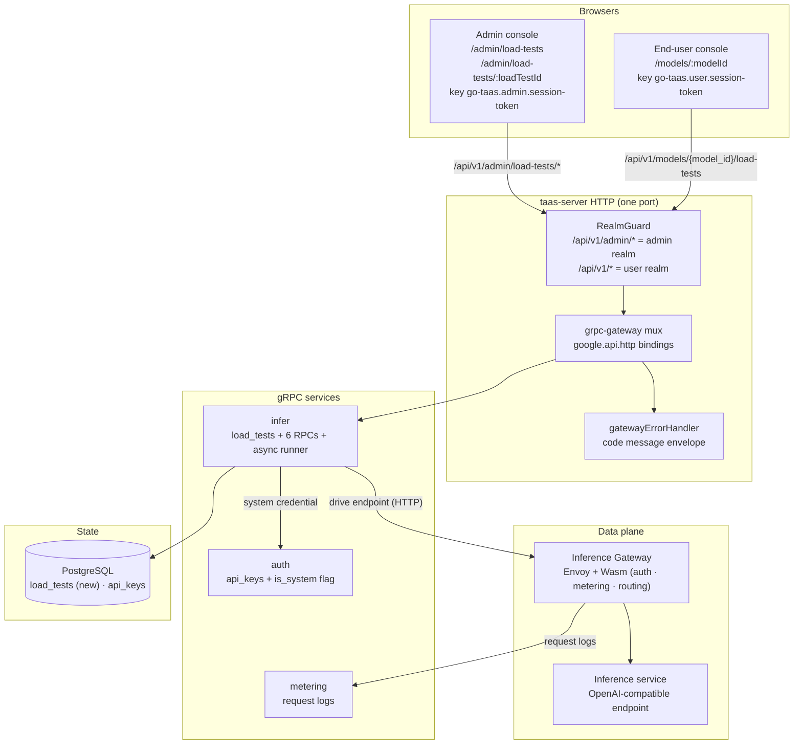
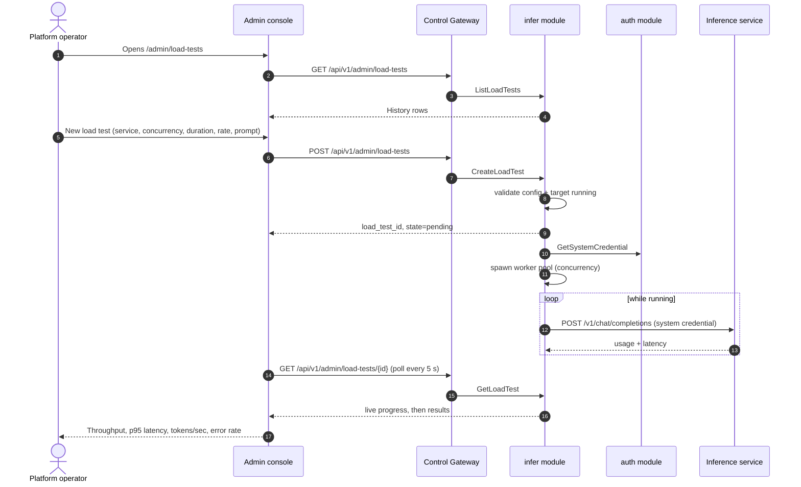
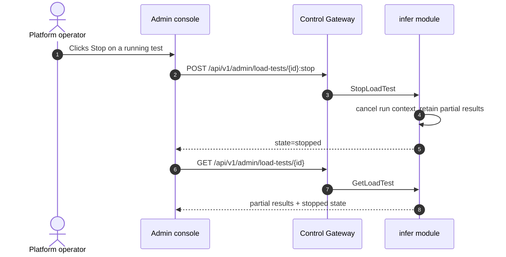
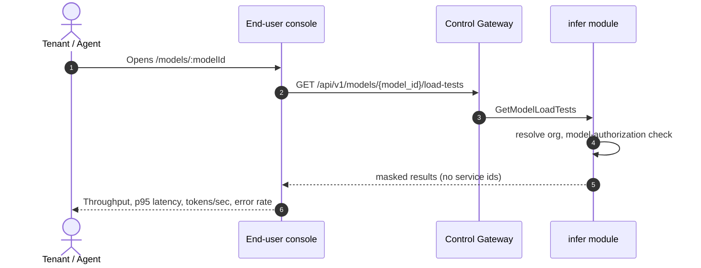

# Inference Load Testing — Architecture and Detailed Design

| Attribute | Content |
| --- | --- |
| Feature point | Inference load testing — run a load test against an inference service and view throughput / latency / tokens-per-second results, with a history of past runs (backlog row 20) |
| Document scope | Architecture and detailed design for the load-testing feature: the DB-backed `load_tests` data model, the async goroutine-based runner in the `infer` module, the five admin RPCs and one user RPC with their exact `google.api.http` bindings per surface, the operator-scoped system credential, the masked end-user projection, the frontend pages and their route → API-prefix mapping for both consoles, error handling (10308–10311), configuration, security, rollout, and a function-level task list per layer |
| Owning modules | `infer` (owns the `load_tests` table, the six RPCs, the async runner, the system credential), `web/` admin console (`LoadTestsPage`, `LoadTestDetailPage`) and end-user console (`ModelDetailPage` performance section), `pkg/server` gateway (admin-prefix and user-prefix bindings), `pkg/errors` (10308–10311), `pkg/config` (load-test section) |
| Related documents | [Requirement Analysis and UI/UX Design](../design/load-testing.md) · [Architecture Design](../design/architecture.md) §2.4 (`infer` owns inference services) · [Model Catalog & One-Click Deployment](./model-catalog-deployment.md) (the inference service this feature targets) · [Request Logs & API Playground](./request-logs-playground.md) (the single-request test surface this feature scales up, and the request-log observability the system credential preserves) · [Inference Autoscaling](./inference-autoscaling.md) (the capacity context load tests inform, and the 10307 code this feature follows) · [Console Surface Separation](./console-surface-separation.md) (the two surfaces this feature spans, the realm guard, `AdminShell`/`UserShell`) · [Compatibility Matrix](./compatibility-matrix.md) (the masked end-user projection pattern this feature reuses) |
| Status | Architecture complete, handed to the Developer agent |

---

## 1. Overview and Goals

go-taas deploys inference services (feature #2) and autoscales them (feature #16). The operator's recurring question is *how well does this service actually serve under load?* — how many requests per second it can sustain, what latency a user sees at the tail, how many output tokens per second it produces, and at what error rate. The playground (feature #12) sends a **single** test request through the real metered path, but a single request cannot reveal sustained throughput, tail latency under concurrency, or tokens-per-second under load.

This feature adds **inference load testing**: the operator configures a load test against a running inference service — concurrency, duration, and request rate — the platform drives real inference traffic at that service, and the console shows throughput, latency percentiles, tokens-per-second, and error rate, plus a history of past runs for comparison. It is the smallest independently valuable increment of Phase 4's productionization roadmap item.

**Goals**:

- An admin page `/admin/load-tests` that configures and runs a load test against a running inference service (concurrency, duration, request rate, prompt, max tokens), shows live progress while running, and displays curated results (throughput, latency percentiles, tokens/sec, error rate) with a history of past runs (design D1, D3, D5, D6, D9).
- A stop action for running tests and delete for completed ones (design D9).
- A read-only masked performance display on the end-user model detail page `/models/:modelId` (design D2).
- The page → API surface table with exact prefixes (design D1, D2).
- Per-page interactive states including empty, error, and permission-denied.
- Numbered acceptance criteria testable in Nightwatch against the compose stack.

**Non-goals** (from the design, restated): load-test scheduling or recurring tests; comparing runs side-by-side in a chart (v1 shows history as a table); TTFT/TPOT split (v1 reports end-to-end latency percentiles and tokens/sec); a load-test script editor (v1 uses a prompt template); tenant-initiated load tests (D1); exposing service ids or operator internals to tenants (D2); a Grafana-style metrics dashboard over time.

### 1.1 Reading order

Section 2 records the architecture decisions (including the points where the architecture refines the UI/UX design, with their rationale). Sections 3–5 are the component view, the async runner, and the data model. Sections 6–8 are the API contract, the frontend architecture, and the key sequences. Sections 9–12 are error handling, configuration, security and rollout. Sections 13–15 are the acceptance-criteria traceability, the function-level detailed design, and the ordered implementation task list.

---

## 2. Architecture Decisions

AD1–AD10 restate the UI/UX design's decisions as implementation-level rules. **AD11–AD13 are refinements** the architecture adds, each marked as such with the design decision it refines; they preserve the design's intent and are recorded here so the Developer and Test agents implement one reading.

| # | Decision | Rationale |
| --- | --- | --- |
| AD1 | **Load-test configuration and running are admin-surface only**: route `/admin/load-tests`, API prefix `/api/v1/admin/load-tests/*`. The page is added to the `AdminShell` navigation (feature #17) as "Load Tests" | Design D1. Load testing drives real inference traffic and reads operator-orchestration state (services, replicas); it is an operator capability, not a tenant self-service |
| AD2 | **The end-user console gets a read-only masked performance display** on the model detail page `/models/:modelId`, showing recent load-test results for the model (throughput, p95 latency, tokens/sec, error rate) with no service ids and no operator internals. API: `GET /api/v1/models/{model_id}/load-tests` | Design D2. Tenants need a performance expectation for a model (cost/performance trade-off) but must not see operator orchestration internals; this follows feature #17's masked-projection rule and the compatibility-matrix D7 pattern |
| AD3 | **A load test is asynchronous**: `CreateLoadTest` returns immediately with `state = pending`; the state machine is `pending → running → completed / failed / stopped`. The page polls `GetLoadTest` while a test is running | Design D3. A load test runs for seconds to an hour; blocking the HTTP call would time out. This matches the deployment async pattern (feature #2, D3) and the console's `usePolling` convention |
| AD4 | **A load test targets a running inference service** (`state = running` with a non-empty endpoint). A service that is not running returns **10311 `CodeLoadTestTargetInvalid`** | Design D4. Load testing measures a live service; a pending/deploying/failed/terminated service has no endpoint to drive. The endpoint comes from the API, never constructed by the client |
| AD5 | **Config fields**: **Service** (required, running), **Concurrency** (integer 1–1000, default 1), **Duration** (integer seconds 5–3600, default 60), **Request rate** (integer req/s 0–10000, 0 = as fast as possible, default 0), **Prompt template** (required, ≤ 4096 chars), **Max tokens** (integer 1–8192, default 256) | Design D5. Mirrors the vLLM/Hey/k6 parameter set in the smallest field list; request rate 0 = unlimited matches the "as fast as possible" convention of every surveyed tool |
| AD6 | **Results are a curated set**: total requests, success count, failure count, error rate, throughput (req/s), output tokens/sec, input/output tokens, and latency percentiles p50 / p90 / p95 / p99. The console renders these as summary cards + a latency table; it never shows raw per-request output | Design D6. vLLM's percentiles and tokens/sec are the canonical LLM-serving metrics; a curated projection keeps the console dependency-light and the surface scannable |
| AD7 | **Load tests use a dedicated operator-scoped load-test credential** (a system key) that authenticates to the service's endpoint but does not consume a tenant's balance or trip a tenant's rate/spend limits. The traffic still produces request logs (feature #12) so load-test traffic is observable | Design D7. Load testing is an operator activity; using a tenant key would drain the tenant's balance and could be blocked by the tenant's limits. A system credential keeps load tests free to the tenant while remaining visible in request logs |
| AD8 | **New error codes in the infer block (10308–10399)**: **10308 `CodeLoadTestNotFound`**, **10309 `CodeLoadTestConfigInvalid`**, **10310 `CodeLoadTestStateInvalid`**, **10311 `CodeLoadTestTargetInvalid`** | Design D8. Load testing belongs to `infer` (AD1's module), so its codes live in the infer block after 10307 (feature #16); distinct codes keep "not found" vs "bad config" vs "bad state" vs "bad target" actionable |
| AD9 | **Load-test history is retained (90 days) and listed with pagination**; a completed run is immutable (config + results are fixed once `completed`). A running test can be stopped; a completed test can be deleted | Design D9. History is the comparison surface (D1's pattern); immutability keeps results trustworthy; 90-day retention matches the request-log retention (feature #12) |
| AD10 | **The load-test runner lives in the `infer` module** as a goroutine-based load generator that drives the service's endpoint with the system credential (D7) and aggregates results; it is not a separate deployment | Design D10. The runner targets inference services and generates inference traffic, which is `infer`'s responsibility; a goroutine-based generator avoids a new service and keeps the run in-process with the gRPC server |
| AD11 | **REFINEMENT of design D7 — the system credential is a synthetic API key row owned by the platform, not a tenant key.** The runner authenticates to the data-plane gateway with a dedicated `api_keys` row whose `organization_id` is a reserved platform org (or a null/`system` marker) and whose `is_system` flag is set. The data-plane gateway's Wasm auth plugin recognizes the `is_system` flag and skips balance holds and rate/spend-limit checks while still emitting a metering event and a request-log row | The design (D7) requires a credential that does not consume a tenant's balance or trip a tenant's limits but still produces request logs. A synthetic `api_keys` row with an `is_system` flag is the smallest faithful reading: it reuses the existing key-verification path (so request logs are produced naturally) and the flag gives the data-plane gateway a single, explicit seam to skip tenant accounting. The reserved platform org keeps the row referentially consistent with the existing `api_keys` schema. The runner never holds a tenant key |
| AD12 | **REFINEMENT of design D10 — the runner is a `server.Runner` in the `infer` module with a per-run goroutine pool, not a single long-lived goroutine.** `CreateLoadTest` spawns a bounded worker pool (one worker per concurrency unit) that drives the endpoint for the configured duration; the runner tracks each run in an in-memory `sync.Map` keyed by `load_test_id` and persists progress/results to the `load_tests` table on a tick and at completion | The design (D10) says "goroutine-based load generator". A per-run worker pool (rather than one goroutine) is required to honor `concurrency` (D5): each worker holds one in-flight request, so `concurrency` workers produce `concurrency` concurrent requests. The in-memory `sync.Map` gives `GetLoadTest` a cheap live-progress read without a DB write per request; the DB is the durable record. The runner is cancelled via the run's context on `StopLoadTest` |
| AD13 | **REFINEMENT of design D6 — the runner drives the service's OpenAI-compatible endpoint directly over HTTP with the system credential, and derives token counts from the response's `usage` block.** The runner is a plain HTTP client (the `net/http` client) that POSTs `/v1/chat/completions` to the service's endpoint with the system credential; it reads `usage.prompt_tokens` / `usage.completion_tokens` from each response and records the end-to-end latency. It does not go through the control gateway or the data-plane gateway's Wasm metering (the system credential's request-log emission is handled by the data-plane gateway when the traffic is real; see AD11) | The design (D6) wants tokens/sec and latency percentiles. The OpenAI-compatible endpoint returns `usage` on every completion, so token counts are read from the response — no separate tokenizer. Driving the endpoint directly (not through the control gateway) keeps the load test measuring the serving path, not the management API. The runner records per-request latency and token deltas in memory and aggregates them at completion (AD12) |

---

## 3. Component View

### 3.1 Ownership

| Layer / component | Owns | Changes in this feature |
| --- | --- | --- |
| **Static bundle (SPA)** | One Vite bundle (`web/dist`), embedded into `taas-server` at `pkg/server/console/`; served by the gateway's SPA fallback | Two new admin pages (`LoadTestsPage`, `LoadTestDetailPage`), a nav item, the end-user `ModelDetailPage` performance section, and the route registrations in `App.tsx` |
| **Gateway (`pkg/server`)** | HTTP composition: `RealmGuard` → `withConsole` → `runtime.ServeMux`; the unified error renderer; the SPA fallback | No change — the new RPCs bind under `/api/v1/admin/load-tests/*` (admin) and `/api/v1/models/{model_id}/load-tests` (user), and the realm guard already treats those prefixes as their surfaces |
| **grpc-gateway mux** | Path → RPC routing from `google.api.http` annotations | New bindings for the six new RPCs (Section 6) |
| **`infer`** | The `load_tests` table, the six RPCs, the async runner, the system credential | New `load_tests` table + repository + service methods; the runner (`server.Runner` + worker pool); the system-credential lookup |
| **`auth`** | The `api_keys` table and key verification | The `is_system` flag on `api_keys` (AD11); a narrow read `GetSystemCredential()` for the infer runner |
| **`metering`** | Request logs (feature #12) | No change — the system credential's traffic produces request-log rows through the existing path (AD11) |
| **`pkg/errors`** | Code blocks per module | Four new infer-block codes: **10308 `CodeLoadTestNotFound`**, **10309 `CodeLoadTestConfigInvalid`**, **10310 `CodeLoadTestStateInvalid`**, **10311 `CodeLoadTestTargetInvalid`** (AD8) |
| **`pkg/config`** | The merged configuration tree | New `loadtest` section (runner interval, retention, system-credential kill switch) |

### 3.2 Runtime component view



### 3.3 Request identity chain

The load-test RPCs span both surfaces. The chain is:

1. `RealmGuard` (HTTP, `pkg/server/realm.go`) — path prefix decides the expected realm. The admin RPCs bind under `/api/v1/admin/load-tests/*` → expected realm `admin`; the user RPC binds under `/api/v1/models/{model_id}/load-tests` → expected realm `user`. With no `Authorization` header: pass through (transitional, feature-17 AD4). With a header: resolve the session realm from Redis; mismatch → 10038, unknown/expired/realm-less → 10027.
2. grpc-gateway mux — routes by the annotated path and forwards `authorization`.
3. `infer` handler — reads/writes the `load_tests` table. The admin RPCs are **platform-scoped** (no `X-Organization-Id` required or honored, mirroring the image module's platform-scoped decision, image-management D9): load testing is an operator activity that spans services across orgs. The user RPC `GetModelLoadTests` is **tenant-scoped**: it resolves the caller's organization (session-derived via `SessionActiveOrg`, or the transitional `X-Organization-Id` header) and applies the model-authorization default-allow rule (feature #13) — a restricted model the tenant is not granted returns 10105.

Because the admin RPCs are platform-scoped, there is no `tenancy.RoleGuard` gate on them: any admin-realm session (or transitional caller) may configure, run, and read load tests. The permission-denied state (design FR5.1, AC14) is therefore produced by the realm guard (10038) or the session guard (10027), not by a role check. The user RPC's permission-denied state (design FR4.2, AC11) is produced by the model-authorization check (10105) or the realm/session guard.

---

## 4. The Async Runner

### 4.1 Lifecycle and state machine

A load test transitions `pending → running → completed / failed / stopped` (AD3). The transitions are driven by the runner:

| From | Event | To | Notes |
| --- | --- | --- | --- |
| `pending` | runner picks up the run | `running` | The runner starts the worker pool and records `started_at` |
| `running` | duration elapses | `completed` | The runner stops the pool, aggregates results, writes them, records `completed_at` |
| `running` | the service becomes unavailable mid-run | `failed` | The runner records a `failure_reason` and any partial results |
| `pending` / `running` | `StopLoadTest` | `stopped` | The runner cancels the run context, retains partial results, records `completed_at` |

### 4.2 The runner loop

The runner is a `server.Runner` in the `infer` module (AD12). On startup it:

1. Recovers any `pending`/`running` runs from the `load_tests` table and marks them `failed` with reason "server restarted mid-run" (a run cannot survive a server restart — the worker pool is in-memory).
2. Subscribes to a run-request channel that `CreateLoadTest` feeds.

`CreateLoadTest` (AD3) validates the config synchronously, validates the target service is `running` with an endpoint (AD4), inserts a `pending` row, and hands the run to the runner's channel. The runner spawns a worker pool of `concurrency` goroutines (AD12):

- Each worker loops: while the run context is not cancelled and elapsed < duration, POST `/v1/chat/completions` to the service's endpoint with the system credential (AD13), reading `usage.prompt_tokens` / `usage.completion_tokens` and the end-to-end latency.
- The request rate (D5) is enforced by a rate limiter shared across workers: when `request_rate > 0`, the pool sleeps between request starts to cap at `request_rate` req/s; when `request_rate = 0`, workers fire as fast as possible.
- Each response is classified success/failure; latency and token deltas are accumulated in a per-run in-memory aggregator (a `sync.Mutex`-guarded struct).
- On a tick (default 5 s, `loadtest.progressInterval`) the runner persists a progress snapshot (requests sent, successes, failures, elapsed) to the `load_tests` row.
- At completion (duration elapsed, stop, or failure) the runner aggregates the final results, writes them to the row, and sets the terminal state.

### 4.3 The system credential

The runner authenticates to the data-plane gateway with the system credential (AD11). The credential is a synthetic `api_keys` row:

- `organization_id` = a reserved platform org (or a null/`system` marker), `is_system = true`, a stable `key_hash` seeded at first boot.
- The data-plane gateway's Wasm auth plugin recognizes `is_system` and skips balance holds and rate/spend-limit checks, but still emits a metering event and a request-log row (so load-test traffic is observable, feature #12).
- The `infer` runner reads the credential via a narrow interface `auth.GetSystemCredential()` (the `SetDeleteGuard`/`IsModelAuthorized` injection pattern), so `infer` never holds a tenant key.

The system credential is seeded in the `auth` module's `Migrate` hook (the established `Migrator` pattern): after `AutoMigrate(api_keys)`, if no `is_system` row exists, insert one with a generated key. The key value is stored hashed (feature #1); the runner uses the plaintext only at seed time and thereafter reads the hash for verification.

---

## 5. Data Model

### 5.1 The `load_tests` Table

| Column | PostgreSQL type | Constraints | Description |
| --- | --- | --- | --- |
| `id` | `uuid` | PRIMARY KEY | Server-generated UUID v4, exposed as `load_test_id` |
| `service_id` | `uuid` | NOT NULL, index | The target inference service (FK → `inference_services.id`, no hard FK — see note) |
| `service_name` | `varchar(63)` | NOT NULL | Denormalized service name for list/search (the service may be deleted later) |
| `model_id` | `uuid` | NOT NULL, index | The deployed model (denormalized from the service) |
| `model_name` | `varchar(128)` | NOT NULL | Denormalized model name |
| `concurrency` | `int` | NOT NULL | 1–1000 (AD5) |
| `duration_seconds` | `int` | NOT NULL | 5–3600 (AD5) |
| `request_rate` | `int` | NOT NULL | 0–10000, 0 = unlimited (AD5) |
| `prompt_template` | `text` | NOT NULL | ≤ 4096 chars (AD5) |
| `max_tokens` | `int` | NOT NULL | 1–8192 (AD5) |
| `state` | `varchar(16)` | NOT NULL | Closed set: `pending` / `running` / `completed` / `failed` / `stopped` (AD3) |
| `failure_reason` | `varchar(512)` | NULL | Human-readable reason when `state = failed` |
| `started_at` | `timestamptz` | NULL | When the runner picked up the run |
| `completed_at` | `timestamptz` | NULL | When the run reached a terminal state |
| `total_requests` | `int` | NOT NULL DEFAULT 0 | Result: total requests sent |
| `success_count` | `int` | NOT NULL DEFAULT 0 | Result: successful responses |
| `failure_count` | `int` | NOT NULL DEFAULT 0 | Result: failed responses |
| `error_rate` | `double precision` | NOT NULL DEFAULT 0 | Result: failure_count / total_requests |
| `throughput_rps` | `double precision` | NOT NULL DEFAULT 0 | Result: total_requests / elapsed |
| `output_tokens_per_sec` | `double precision` | NOT NULL DEFAULT 0 | Result: output_tokens / elapsed |
| `input_tokens` | `int` | NOT NULL DEFAULT 0 | Result: sum of `usage.prompt_tokens` |
| `output_tokens` | `int` | NOT NULL DEFAULT 0 | Result: sum of `usage.completion_tokens` |
| `latency_p50_ms` | `double precision` | NOT NULL DEFAULT 0 | Result: p50 end-to-end latency |
| `latency_p90_ms` | `double precision` | NOT NULL DEFAULT 0 | Result: p90 end-to-end latency |
| `latency_p95_ms` | `double precision` | NOT NULL DEFAULT 0 | Result: p95 end-to-end latency |
| `latency_p99_ms` | `double precision` | NOT NULL DEFAULT 0 | Result: p99 end-to-end latency |
| `created_at` | `timestamptz` | NOT NULL | Creation time (UTC) |
| `updated_at` | `timestamptz` | NOT NULL | Last update (progress tick or terminal write) |

Indexes:

| Index | Definition | Purpose |
| --- | --- | --- |
| Primary key | `(id)` | Run identity |
| Composite | `(service_id, created_at)` | The history list filtered by service |
| Composite | `(model_id, state, created_at)` | The masked user projection (`GetModelLoadTests`) and the list filtered by model/status |
| Composite | `(state, created_at)` | The active-runs section and the retention cleanup |

Design notes:

- **No hard foreign keys**: `service_id` and `model_id` are `uuid`s matching their source tables, but a run must survive a service being deleted (the run is a historical record, not referential state). `service_name` and `model_name` are denormalized so the history list renders without a join to a possibly-deleted service.
- **`state` is a closed set** enforced at the service layer (10310 on an invalid transition); there is no DB check constraint, matching the platform's service-layer validation convention.
- **Results are nullable-in-effect**: a `pending`/`running` run has zeroed result columns; only a `completed` run's results are meaningful and immutable (AD9). A `failed`/`stopped` run carries partial results.
- **Retention**: a periodic cleanup runner deletes runs older than `loadtest.retention` (default 90 days, matching request-log retention, feature #12).

### 5.2 Migration Notes

- The table is created by **GORM `AutoMigrate` at startup** through the `infer` module's `Migrate` hook (the established `Migrator` pattern). The GORM model is the single source of truth for the schema.
- The `api_keys` table gains an additive `is_system` boolean column (default `false`) via the `auth` module's `AutoMigrate`; the system credential is seeded in the same hook (Section 4.3).
- Evolution is additive-only: the `load_tests` table is new; `api_keys` gains one additive column. No data migration.

---

## 6. API Contract

### 6.1 RPC Surface

All load-test RPCs belong to **`taas.infer.v1.InferServiceService`** (proto: `proto/taas/infer/v1/infer.proto`), served as HTTP via the Control Gateway. Five RPCs are **admin-surface** (AD1) and one is **user-surface** (AD2). Proto changes are additive.

| RPC | HTTP | Prefix | Status | Purpose |
| --- | --- | --- | --- | --- |
| `CreateLoadTest` | `POST /api/v1/admin/load-tests` | admin | **new** | Configure + start a load test; returns `load_test_id`, `state=pending` |
| `ListLoadTests` | `GET /api/v1/admin/load-tests` | admin | **new** | History with service/status/model filters, search, pagination |
| `GetLoadTest` | `GET /api/v1/admin/load-tests/{load_test_id}` | admin | **new** | Config + live progress + full results; missing → 10308 |
| `StopLoadTest` | `POST /api/v1/admin/load-tests/{load_test_id}:stop` | admin | **new** | Stop a running/pending test; wrong state → 10310 |
| `DeleteLoadTest` | `DELETE /api/v1/admin/load-tests/{load_test_id}` | admin | **new** | Delete a completed/failed/stopped run; running → 10310 |
| `GetModelLoadTests` | `GET /api/v1/models/{model_id}/load-tests` | user | **new** | Masked projection: recent completed results for a model |

### 6.2 Proto contract

```proto
// Additive additions to proto/taas/infer/v1/infer.proto, on
// InferServiceService.

  // CreateLoadTest configures and starts a load test against a running
  // inference service. Returns immediately with state=pending; the run
  // is executed asynchronously by the infer runner.
  // Admin-surface API: served under /api/v1/admin.
  rpc CreateLoadTest(CreateLoadTestRequest) returns (CreateLoadTestResponse) {
    option (google.api.http) = {
      post: "/api/v1/admin/load-tests"
      body: "*"
    };
  }

  // ListLoadTests returns the load-test history with service/status/
  // model filters, service-name search, and pagination.
  // Admin-surface API: served under /api/v1/admin.
  rpc ListLoadTests(ListLoadTestsRequest) returns (ListLoadTestsResponse) {
    option (google.api.http) = {get: "/api/v1/admin/load-tests"};
  }

  // GetLoadTest returns one load test: config, current state, live
  // progress while running, and the full result set when completed.
  // A missing id returns 10308.
  // Admin-surface API: served under /api/v1/admin.
  rpc GetLoadTest(GetLoadTestRequest) returns (GetLoadTestResponse) {
    option (google.api.http) = {get: "/api/v1/admin/load-tests/{load_test_id}"};
  }

  // StopLoadTest stops a pending/running test; the state becomes
  // stopped and partial results are retained. Wrong state returns 10310.
  // Admin-surface API: served under /api/v1/admin.
  rpc StopLoadTest(StopLoadTestRequest) returns (StopLoadTestResponse) {
    option (google.api.http) = {
      post: "/api/v1/admin/load-tests/{load_test_id}:stop"
      body: "*"
    };
  }

  // DeleteLoadTest deletes a completed/failed/stopped run. Deleting a
  // running/pending run returns 10310.
  // Admin-surface API: served under /api/v1/admin.
  rpc DeleteLoadTest(DeleteLoadTestRequest) returns (DeleteLoadTestResponse) {
    option (google.api.http) = {delete: "/api/v1/admin/load-tests/{load_test_id}"};
  }

  // GetModelLoadTests returns the masked user-realm projection: the
  // model's most recent completed load-test results, with no service
  // ids and no operator internals. User-surface API: served under
  // /api/v1.
  rpc GetModelLoadTests(GetModelLoadTestsRequest) returns (GetModelLoadTestsResponse) {
    option (google.api.http) = {get: "/api/v1/models/{model_id}/load-tests"};
  }

message CreateLoadTestRequest {
  string service_id = 1;
  int32 concurrency = 2;        // 1-1000, default 1
  int32 duration_seconds = 3;   // 5-3600, default 60
  int32 request_rate = 4;       // 0-10000, 0 = unlimited, default 0
  string prompt_template = 5;   // required, <= 4096 chars
  int32 max_tokens = 6;         // 1-8192, default 256
}
message CreateLoadTestResponse {
  taas.common.v1.Response response = 1;
  string load_test_id = 2;
  string state = 3;             // pending
}

message ListLoadTestsRequest {
  taas.common.v1.PageRequest page = 1;
  string service_id = 2;
  string status = 3;            // pending|running|completed|failed|stopped
  string model_id = 4;
  string search = 5;            // service-name substring
}
message ListLoadTestsResponse {
  taas.common.v1.Response response = 1;
  repeated LoadTestSummary runs = 2;
  taas.common.v1.PageMeta page_meta = 3;
}

message LoadTestSummary {
  string load_test_id = 1;
  string service_id = 2;
  string service_name = 3;
  string model_id = 4;
  string model_name = 5;
  int32 concurrency = 6;
  int32 duration_seconds = 7;
  int32 request_rate = 8;
  string state = 9;             // pending|running|completed|failed|stopped
  int64 started_at = 10;
  int64 completed_at = 11;
  // Result summary, populated when completed.
  double throughput_rps = 12;
  double latency_p95_ms = 13;
  double output_tokens_per_sec = 14;
  double error_rate = 15;
}

message GetLoadTestRequest {
  string load_test_id = 1;      // path
}
message LoadTestProgress {
  int64 requests_sent = 1;
  int64 success_count = 2;
  int64 failure_count = 3;
  int64 elapsed_seconds = 4;
}
message LoadTestResult {
  int64 total_requests = 1;
  int64 success_count = 2;
  int64 failure_count = 3;
  double error_rate = 4;
  double throughput_rps = 5;
  double output_tokens_per_sec = 6;
  int64 input_tokens = 7;
  int64 output_tokens = 8;
  double latency_p50_ms = 9;
  double latency_p90_ms = 10;
  double latency_p95_ms = 11;
  double latency_p99_ms = 12;
}
message GetLoadTestResponse {
  taas.common.v1.Response response = 1;
  LoadTestSummary summary = 2;
  string prompt_template = 3;
  int32 max_tokens = 4;
  LoadTestProgress progress = 5;   // live while pending/running
  LoadTestResult result = 6;       // full when completed
  string failure_reason = 7;       // when failed
}

message StopLoadTestRequest {
  string load_test_id = 1;      // path
}
message StopLoadTestResponse {
  taas.common.v1.Response response = 1;
  string state = 2;             // stopped
}

message DeleteLoadTestRequest {
  string load_test_id = 1;      // path
}
message DeleteLoadTestResponse {
  taas.common.v1.Response response = 1;
}

message GetModelLoadTestsRequest {
  string model_id = 1;          // path
}
message ModelLoadTestResult {
  double throughput_rps = 1;
  double latency_p95_ms = 2;
  double output_tokens_per_sec = 3;
  double error_rate = 4;
  int32 concurrency = 5;
  int32 duration_seconds = 6;
  int64 completed_at = 7;
}
message GetModelLoadTestsResponse {
  taas.common.v1.Response response = 1;
  repeated ModelLoadTestResult results = 2;   // most recent completed first
}
```

### 6.3 Wire format (established conventions)

- Pagination binds as `?page.offset=0&page.limit=20` (dotted form); default limit 20, cap 100.
- Success responses are HTTP 200; business errors render as `{"code": <int>, "message": "..."}`.
- The admin load-test APIs are **platform-scoped**: no `X-Organization-Id` header is required or honored (AD1, mirroring image-management D9). The user `GetModelLoadTests` is **tenant-scoped**: it resolves the caller's organization (session-derived via `SessionActiveOrg`, or the transitional `X-Organization-Id` header) and applies the model-authorization default-allow rule.
- `CreateLoadTest` validates `service_id` (must be a running service with an endpoint, else 10311), `concurrency` (1–1000), `duration_seconds` (5–3600), `request_rate` (0–10000), `prompt_template` (non-empty, ≤ 4096 chars), and `max_tokens` (1–8192); an invalid config returns 10309. It returns `load_test_id` and `state = pending` synchronously (AD3).
- `ListLoadTests` supports `service_id`, `status`, and `model_id` filters, `search` (service-name substring), and `offset`/`limit` pagination. Each row carries the result summary when completed.
- `GetLoadTest` returns the config, the current state, live progress while running (`requests_sent`, `success_count`, `failure_count`, `elapsed_seconds`), and the full result set when completed. A `failed` run carries a `failure_reason`. A missing id returns **10308**.
- `StopLoadTest` transitions a `pending`/`running` test to `stopped` and retains partial results; `DeleteLoadTest` deletes a `completed`/`failed`/`stopped` run. Both return 10310 on an invalid state.
- `GetModelLoadTests` returns only completed runs, masked (AD2): `throughput_rps`, `latency_p95_ms`, `output_tokens_per_sec`, `error_rate`, `concurrency`, `duration_seconds`, `completed_at` — no service ids, no operator internals. An unknown model returns 10101; an unauthorized model returns 10105.

### 6.4 Validation matrix

| RPC | Check | Failure code | Canonical message |
| --- | --- | --- | --- |
| `CreateLoadTest` | `service_id` non-empty and the service is `running` with a non-empty endpoint | 10311 `CodeLoadTestTargetInvalid` | load test target invalid |
| `CreateLoadTest` | `concurrency` in 1–1000 | 10309 `CodeLoadTestConfigInvalid` | load test config invalid |
| `CreateLoadTest` | `duration_seconds` in 5–3600 | 10309 | load test config invalid |
| `CreateLoadTest` | `request_rate` in 0–10000 | 10309 | load test config invalid |
| `CreateLoadTest` | `prompt_template` non-empty and ≤ 4096 chars | 10309 | load test config invalid |
| `CreateLoadTest` | `max_tokens` in 1–8192 | 10309 | load test config invalid |
| `GetLoadTest` | `load_test_id` exists | 10308 `CodeLoadTestNotFound` | load test not found |
| `StopLoadTest` | `load_test_id` exists | 10308 | load test not found |
| `StopLoadTest` | state is `pending` or `running` | 10310 `CodeLoadTestStateInvalid` | load test state invalid |
| `DeleteLoadTest` | `load_test_id` exists | 10308 | load test not found |
| `DeleteLoadTest` | state is `completed`/`failed`/`stopped` | 10310 | load test state invalid |
| `GetModelLoadTests` | `model_id` exists | 10101 `CodeModelNotFound` | model not found |
| `GetModelLoadTests` | the tenant is authorized for the model (default-allow) | 10105 `CodeModelUnauthorized` | model not authorized |

---

## 7. Frontend Architecture

### 7.1 Page → route → API-prefix mapping

| Page | Surface | Route | API prefix | Component |
| --- | --- | --- | --- | --- |
| Load Tests (list) | admin | `/admin/load-tests` | `/api/v1/admin/load-tests` | `LoadTestsPage` |
| Load Test Detail | admin | `/admin/load-tests/:loadTestId` | `/api/v1/admin/load-tests/{load_test_id}` | `LoadTestDetailPage` |
| Model Detail (performance) | user | `/models/:modelId` | `/api/v1/models/{model_id}/load-tests` | `ModelDetailPage` (performance section) |

### 7.2 Navigation placement

- **Admin console** (`AdminShell`, feature #17): a new top-level nav item **Load Tests** → `/admin/load-tests`. It sits in the operator-orchestration group alongside Accelerators and Compatibility.
- **End-user console** (`UserShell`, feature #17): no new nav item — the performance section is part of the existing model detail page `/models/:modelId`.

### 7.3 Shared components and state

- **`usePolling`** (feature #17 convention): the load-test pages poll on an interval (default 5 s while a test is `pending`/`running`, 30 s otherwise) and show a last-updated timestamp; a failed poll keeps the last good data with a "Showing stale data" banner (design FR5.4).
- **Status badge**: the existing status-badge component renders the load-test state (`completed` green / `failed` red / `stopped` grey / `running` blue / `pending` amber).
- **Pagination**: the existing pagination component binds to `page.offset`/`page.limit`.
- **Permission-denied / not-found states**: the standard feature-17 states (10036 permission-denied, 10308 not-found) with a link back to the list.
- **API client** (`web/src/api.ts`): new types `LoadTestSummary`, `LoadTestProgress`, `LoadTestResult`, `ModelLoadTestResult`; new functions `createLoadTest`, `listLoadTests`, `getLoadTest`, `stopLoadTest`, `deleteLoadTest`, `getModelLoadTests`.

### 7.4 Auth guard per surface

- **Admin pages** (`LoadTestsPage`, `LoadTestDetailPage`) call only `/api/v1/admin/load-tests/*`. The `AdminShell` route guard requires an admin-realm session; a session without the required role receives 10036 and the page shows the standard permission-denied state (feature #17).
- **End-user page** (`ModelDetailPage`) calls only `/api/v1/models/{model_id}/load-tests`. The `UserShell` route guard requires a user-realm session; a model the tenant is not authorized for returns 10105 and the page shows the standard permission-denied state.
- Neither page contains the other surface's prefix string (feature #17, D8).

---

## 8. Key Sequences

### 8.1 Create and run a load test (admin)



### 8.2 Stop a running load test (admin)



### 8.3 End-user performance display (user)



---

## 9. Error Handling

| Condition | Code | Constant | Notes |
| --- | --- | --- | --- |
| An unknown `load_test_id` | 10308 | `CodeLoadTestNotFound` | **New** (AD8) |
| An invalid load-test config (out-of-range concurrency/duration/rate/max tokens, empty prompt) | 10309 | `CodeLoadTestConfigInvalid` | **New** (AD8) |
| An invalid state transition (stop/delete on the wrong state) | 10310 | `CodeLoadTestStateInvalid` | **New** (AD8) |
| A target service that is not running / has no endpoint | 10311 | `CodeLoadTestTargetInvalid` | **New** (AD8) |
| An unknown model (user projection) | 10101 | `CodeModelNotFound` | Reused (feature #13) |
| A model the tenant is not authorized for (user projection) | 10105 | `CodeModelUnauthorized` | Reused (feature #13) |
| Database / MQ infrastructure failure | 500 | `CodeInternal` | Via error normalization |

The four new codes are added to `pkg/errors/codes.go` (infer block, after 10307) and `pkg/errors/messages.go`:

```go
// infer module error codes (additive).
CodeLoadTestNotFound     Code = 10308 // LOAD_TEST_NOT_FOUND
CodeLoadTestConfigInvalid Code = 10309 // LOAD_TEST_CONFIG_INVALID
CodeLoadTestStateInvalid  Code = 10310 // LOAD_TEST_STATE_INVALID
CodeLoadTestTargetInvalid Code = 10311 // LOAD_TEST_TARGET_INVALID
```

Canonical messages: `"load test not found"`, `"load test config invalid"`, `"load test state invalid"`, `"load test target invalid"`.

---

## 10. Configuration Additions

New `loadtest` section in `configs/server.yaml` (merged via `pkg/config`):

| Key | Default | Description |
| --- | --- | --- |
| `loadtest.progressInterval` | `5s` | How often the runner persists a progress snapshot to the `load_tests` row (AD12) |
| `loadtest.retention` | `2160h` (90 d) | Runs older than this are deleted by the retention cleanup runner (AD9) |
| `loadtest.systemCredentialEnabled` | `true` | Kill switch for the system credential (AD11); when false, `CreateLoadTest` returns 10311 (no credential to drive with) |

---

## 11. Security Considerations

- **Surface separation**: the admin load-test APIs bind under `/api/v1/admin/load-tests/*` and the user read under `/api/v1/models/{model_id}/load-tests`; the realm guard enforces the session realm per prefix (Section 3.3). An admin page never calls a user route and vice versa (feature #17).
- **Platform-scoped admin APIs**: the admin RPCs require no `X-Organization-Id` and honor none — load testing is an operator activity that spans orgs. The user RPC is tenant-scoped and applies the model-authorization default-allow rule (10105).
- **System credential isolation**: the runner uses a synthetic `is_system` API key (AD11), never a tenant key. The data-plane gateway skips balance holds and rate/spend-limit checks for `is_system` traffic but still emits request logs, so load-test traffic is observable without draining a tenant's balance (D7).
- **No tenant funds at risk**: because the system credential is not a tenant key, a load test can never consume a tenant's balance or trip a tenant's limits (D7).
- **Endpoint from the API, never the client**: the runner drives the endpoint returned by `GetInferenceService`; the client never supplies a URL (AD4).
- **Immutable completed runs**: a `completed` run's config and results are fixed (AD9); there is no update path, so results cannot be tampered with after the fact.

---

## 12. Rollout / Upgrade Notes

- **Schema**: new `load_tests` table via `infer`'s `AutoMigrate`; `api_keys` gains an additive `is_system` column via `auth`'s `AutoMigrate`. Additive only; no data migration.
- **System credential seed**: the `auth` module's `Migrate` hook seeds the `is_system` API key on first boot (Section 4.3). Existing deployments get the key on the next startup.
- **Deploy `taas-server` alone**: the new RPCs and the runner ride the existing `infer` service registration; no new deployment, no new MQ subject. The data-plane gateway's Wasm auth plugin must be updated to recognize `is_system` (AD11) — this is a coordinated change with the data-plane gateway.
- **Backward compatibility**: existing consumers ignore the new RPCs and the additive `is_system` column safely. The load-test pages render empty states until runs exist.
- **Runner recovery**: on restart, any `pending`/`running` runs are marked `failed` with reason "server restarted mid-run" (Section 4.2) — a run cannot survive a server restart.

---

## 13. Acceptance-Criteria Traceability

| Criterion | Where it is satisfied |
| --- | --- |
| AC1 — `CreateLoadTest` returns `pending`, transitions to `completed`, `GetLoadTest` returns full results | Section 4 (runner), Section 6.2 (`CreateLoadTest`/`GetLoadTest`), FVT |
| AC2 — non-running service → 10311; invalid config → 10309 | Section 6.4 (validation matrix), FVT |
| AC3 — `ListLoadTests` filters/search/pagination with result summary | Section 6.2/6.3, FVT |
| AC4 — `StopLoadTest` → `stopped` with partial results; wrong state → 10310 | Section 4.1, Section 6.4, FVT |
| AC5 — `DeleteLoadTest` deletes terminal runs; running → 10310 | Section 6.4, FVT |
| AC6 — `GetModelLoadTests` masked; unauthorized → 10105; unknown → 10101 | Section 6.2/6.3, Section 3.3, FVT |
| AC7 — `/admin/load-tests` renders active-runs + history from first poll | Section 7.1/7.3, E2E |
| AC8 — New Load Test dialog validation + navigation | Section 7.1, E2E |
| AC9 — detail page live progress + curated results | Section 7.1, E2E |
| AC10 — empty state + stale-data banner on failed poll | Section 7.3, E2E |
| AC11 — `/models/:modelId` performance display, no service ids; 10105 state | Section 7.1/7.4, E2E |
| AC12 — admin page only on admin surface, `/api/v1/admin/load-tests/*` only | Section 7.4, E2E (surface separation) |
| AC13 — end-user page only on user surface, `/api/v1/*` only | Section 7.4, E2E (surface separation) |
| AC14 — session without role → 10036 permission-denied | Section 3.3, Section 7.4, E2E |

---

## 14. Detailed Design (function-level)

### 14.1 Proto (`proto/taas/infer/v1/infer.proto`)

Add the six RPCs and messages from Section 6.2 to `InferServiceService`. Regenerate with `buf generate`.

### 14.2 `pkg/errors`

- `codes.go`: add `CodeLoadTestNotFound Code = 10308`, `CodeLoadTestConfigInvalid Code = 10309`, `CodeLoadTestStateInvalid Code = 10310`, `CodeLoadTestTargetInvalid Code = 10311` to the infer block.
- `messages.go`: add the four canonical messages.

### 14.3 `services/infer` — repository

New file `loadtest_repository.go`:

- `LoadTest` GORM model (Section 5.1).
- `LoadTestRepository` (the `Repository` pattern):
  - `Create(ctx, *LoadTest) error` — insert a `pending` row.
  - `FindByID(ctx, id) (*LoadTest, error)` — 10308 on unknown.
  - `List(ctx, filter, page) ([]*LoadTest, int64, error)` — service/status/model filters, service-name search, pagination.
  - `UpdateProgress(ctx, id, progress) error` — persist the live-progress snapshot (AD12).
  - `Complete(ctx, id, result, state, failureReason) error` — write the final results and terminal state.
  - `Delete(ctx, id) error`.
  - `ListActive(ctx) ([]*LoadTest, error)` — `pending`/`running` runs (for runner recovery and the active-runs section).
  - `DeleteBefore(ctx, before time.Time) error` — retention cleanup (AD9).
  - `ListCompletedForModel(ctx, modelID, limit) ([]*LoadTest, error)` — the masked user projection (AD2).

### 14.4 `services/infer` — runner

New file `loadtest_runner.go`:

- `LoadTestRunner` struct: holds the repository, the `auth.GetSystemCredential()` narrow interface, the run-request channel, and a `sync.Map` of in-flight runs keyed by `load_test_id`.
- `Run(ctx)` — the `server.Runner` entry point: recover active runs (mark `failed`), then loop on the run-request channel.
- `startRun(ctx, *LoadTest)` — spawn a worker pool of `concurrency` goroutines (AD12), enforce the request rate with a shared rate limiter, drive the endpoint (AD13), aggregate results, persist progress on a tick, and write the terminal state.
- `stopRun(ctx, loadTestID)` — cancel the run context, retain partial results, set `stopped` (AD3).
- `aggregate(...)` — compute throughput, tokens/sec, error rate, and latency percentiles from the per-run in-memory aggregator (AD6).

### 14.5 `services/infer` — service

New file `loadtest_service.go`:

- `CreateLoadTest(ctx, req)` — validate config (10309), validate the target service is `running` with an endpoint (10311), insert a `pending` row, hand the run to the runner, return `load_test_id` + `state=pending` (AD3).
- `ListLoadTests(ctx, req)` — delegate to the repository with filters/search/pagination.
- `GetLoadTest(ctx, req)` — delegate to the repository; attach live progress from the in-memory `sync.Map` when running, and the full result when completed (AD12).
- `StopLoadTest(ctx, req)` — validate state (10310), call `runner.stopRun`, return `state=stopped`.
- `DeleteLoadTest(ctx, req)` — validate state (10310), delete the row.
- `GetModelLoadTests(ctx, req)` — resolve the org, apply the model-authorization default-allow rule (10105), return the masked projection (AD2).

### 14.6 `services/auth` — system credential

- `api_keys` GORM model gains `IsSystem bool` (additive column).
- `Migrate` hook: after `AutoMigrate(api_keys)`, seed the `is_system` key if none exists (Section 4.3).
- New narrow interface `GetSystemCredential(ctx) (keyHash string, err error)` exposed for the infer runner (AD11).

### 14.7 `services/infer` — wiring

- `service.go`: register the six new RPCs; wire the `LoadTestRunner` and the `auth.GetSystemCredential()` narrow interface; add `Migrate`/`MigrateSchemaForFVT` for `LoadTest`.

### 14.8 `web/src` — admin console

- `pages/LoadTestsPage.tsx` — the list page: active-runs section + history table, New Load Test dialog, Refresh, filters/search/pagination, status badges, empty/error/permission-denied states (Section 7).
- `pages/LoadTestDetailPage.tsx` — the detail page: config card, live progress, results cards + latency table, Stop action, not-found state.
- `components/NewLoadTestDialog.tsx` — the config modal with per-field validation (design §5.2).
- `api.ts` — the six API functions and types.
- `App.tsx` — register `/admin/load-tests` and `/admin/load-tests/:loadTestId`; add the **Load Tests** nav item to `AdminShell`.

### 14.9 `web/src` — end-user console

- `pages/ModelDetailPage.tsx` — add the **Performance** section (summary + performance table) fed by `getModelLoadTests` (design §5.4).
- `api.ts` — the `getModelLoadTests` function and `ModelLoadTestResult` type.

### 14.10 Tests

- **FVT** (`test/fvt/load_testing_fvt_test.go`): AC1–AC6 — create/run/list/get/stop/delete and the masked user projection, plus the 10308–10311 and 10101/10105 error paths.
- **E2E** (`test/e2e/tests/loadTesting.js`, the `compatibilityMatrix.js` pattern): against the compose stack — the `/admin/load-tests` page renders `load-test-row-{id}`, the New Load Test dialog validates, the detail page shows live progress and results, the empty state renders, the `/models/:modelId` performance section renders with no service ids, and the surface-separation assertions (AC12–AC14).

---

## 15. Ordered Implementation Task List

1. `pkg/errors`: add 10308–10311 codes + messages.
2. `proto/taas/infer/v1/infer.proto`: add the six RPCs + messages; `buf generate`.
3. `services/infer`: `loadtest_repository.go` (GORM model + repository).
4. `services/auth`: `is_system` column + seed + `GetSystemCredential()` narrow interface.
5. `services/infer`: `loadtest_runner.go` (runner + worker pool + aggregation).
6. `services/infer`: `loadtest_service.go` (six RPCs) + wiring in `service.go`.
7. `pkg/config`: `loadtest` section.
8. `web/src`: `api.ts` types/functions; `LoadTestsPage`, `LoadTestDetailPage`, `NewLoadTestDialog`; `App.tsx` routes + nav.
9. `web/src`: `ModelDetailPage` performance section.
10. FVT + E2E suites; run against the compose stack.