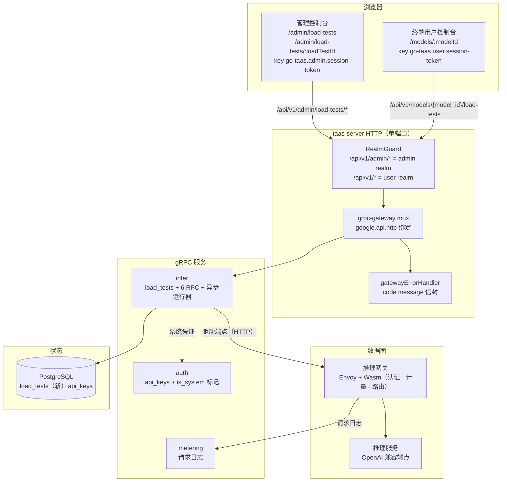
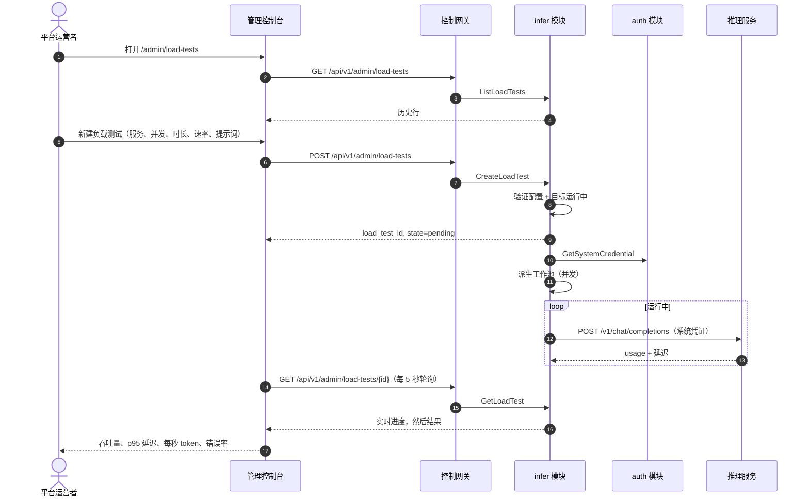
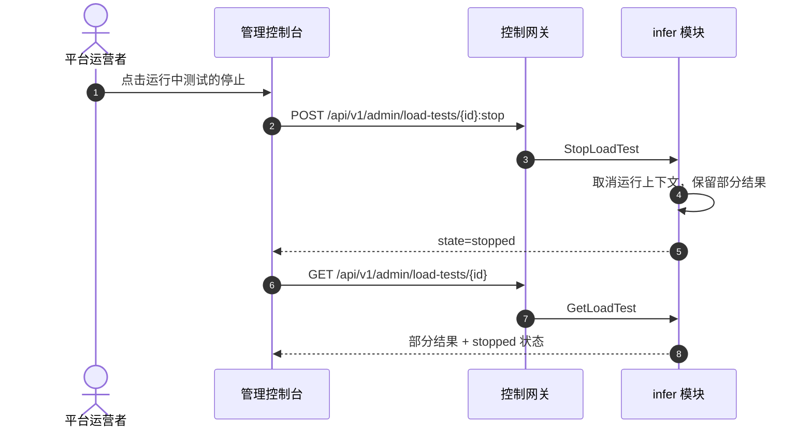
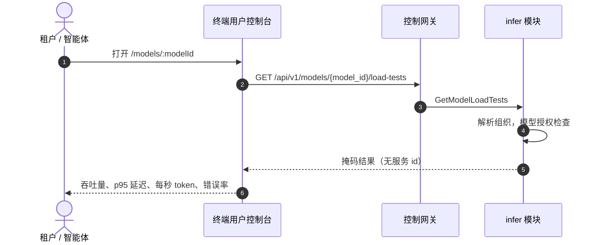

# 推理负载测试 — 架构与详细设计

| 属性 | 内容 |
| --- | --- |
| 特性点 | 推理负载测试 — 针对推理服务运行负载测试，查看吞吐量 / 延迟 / 每秒 token 结果，并保留历史运行记录（backlog 第 20 行） |
| 文档范围 | 负载测试特性的架构与详细设计：DB 支撑的 `load_tests` 数据模型、`infer` 模块中基于 goroutine 的异步运行器、按面划分的五个 admin RPC 与一个 user RPC 及其精确 `google.api.http` 绑定、运营者范围的系统凭证、掩码终端用户投影、两个控制台的前端页面及其路由 → API 前缀映射、错误处理（10308–10311）、配置、安全、上线，以及逐层的函数级任务清单 |
| 归属模块 | `infer`（拥有 `load_tests` 表、六个 RPC、异步运行器、系统凭证）、`web/` 管理控制台（`LoadTestsPage`、`LoadTestDetailPage`）与终端用户控制台（`ModelDetailPage` 性能区块）、`pkg/server` 网关（管理前缀与用户前缀绑定）、`pkg/errors`（10308–10311）、`pkg/config`（loadtest 区块） |
| 相关文档 | [需求分析与 UI/UX 设计](../design/load-testing.zh-cn.md) · [架构设计](../design/architecture.zh-cn.md) 第 2.4 节（`infer` 拥有推理服务）· [模型目录与一键部署](./model-catalog-deployment.zh-cn.md)（本特性所针对的推理服务）· [请求日志与 API Playground](./request-logs-playground.zh-cn.md)（本特性放大为多请求的单请求测试面，以及系统凭证保留的请求日志可观测性）· [推理自动扩缩](./inference-autoscaling.zh-cn.md)（负载测试所支撑的容量语境，以及本特性紧随的 10307 错误码）· [控制台面分离](./console-surface-separation.zh-cn.md)（本特性横跨的两个面、realm 守卫、`AdminShell`/`UserShell`）· [兼容矩阵](./compatibility-matrix.zh-cn.md)（本特性复用的掩码终端用户投影模式） |
| 状态 | 架构完成，已交付开发者智能体 |

---

## 1. 概述与目标

go-taas 部署推理服务（特性 #2）并自动扩缩（特性 #16）。运营者反复提出的问题是 *这个服务在负载下实际表现如何？* — 它能支撑每秒多少请求、用户在尾部的延迟是多少、每秒产出多少输出 token、错误率是多少。Playground（特性 #12）通过真实计量路径发送**单个**测试请求，但单个请求无法揭示持续吞吐量、并发下的尾部延迟或负载下的每秒 token。

本特性新增**推理负载测试**：运营者针对一个运行中的推理服务配置负载测试 — 并发、时长与请求速率 — 平台向该服务驱动真实推理流量，控制台展示吞吐量、延迟百分位、每秒 token 与错误率，外加用于对比的历史运行记录。这是 Phase 4 生产化路线图项中最小可独立交付的增量。

**目标**：

- `/admin/load-tests` 管理页面，针对运行中的推理服务配置并运行负载测试（并发、时长、请求速率、提示词、最大 token），运行时显示实时进度，并展示精选结果（吞吐量、延迟百分位、每秒 token、错误率）与历史运行记录（设计 D1、D3、D5、D6、D9）。
- 运行中测试的停止操作与已完成测试的删除（设计 D9）。
- 终端用户模型详情页 `/models/:modelId` 上的只读掩码性能展示（设计 D2）。
- 带精确前缀的页面 → API 面映射表（设计 D1、D2）。
- 含空态、错误与权限拒绝的逐页交互状态。
- 可在 compose 栈上由 Nightwatch 测试的编号验收标准。

**非目标**（按设计重述）：负载测试调度或周期测试；并排对比运行的图表（v1 以表格展示历史）；TTFT/TPOT 拆分（v1 报告端到端延迟百分位与每秒 token，而非 prefill/decode 拆分）；负载测试脚本编辑器（v1 使用提示词模板，而非脚本）；租户发起的负载测试（D1）；向租户暴露服务 id 或运营者内部信息（D2）；随时间变化的 Grafana 风格指标仪表盘。

### 1.1 阅读顺序

第 2 节记录架构决策（包括架构细化 UI/UX 设计的点及其理由）。第 3–5 节是组件视图、异步运行器与数据模型。第 6–8 节是 API 契约、前端架构与关键时序。第 9–12 节是错误处理、配置、安全与上线。第 13–15 节是验收标准可追溯性、函数级详细设计与有序实现任务清单。

---

## 2. 架构决策

AD1–AD10 把 UI/UX 设计的决策重述为实现级规则。**AD11–AD13 是架构新增的细化**，各标记其细化的设计决策；它们保留设计意图并记录于此，使开发者与测试智能体实现同一解读。

| # | 决策 | 理由 |
| --- | --- | --- |
| AD1 | **负载测试配置与运行仅限管理面**：路由 `/admin/load-tests`，API 前缀 `/api/v1/admin/load-tests/*`。页面加入 `AdminShell` 导航（特性 #17），名为「负载测试」 | 设计 D1。负载测试驱动真实推理流量并读取运营者编排状态（服务、副本）；它是运营者能力，而非租户自助服务 |
| AD2 | **终端用户控制台获得只读掩码性能展示**，位于模型详情页 `/models/:modelId`，展示该模型最近的负载测试结果（吞吐量、p95 延迟、每秒 token、错误率），不含服务 id 与运营者内部信息。API：`GET /api/v1/models/{model_id}/load-tests` | 设计 D2。租户需要模型的性能预期（成本/性能权衡），但绝不能看到运营者编排内部信息；这遵循特性 #17 的掩码投影规则与兼容矩阵的 D7 模式 |
| AD3 | **负载测试是异步的**：`CreateLoadTest` 立即返回 `state = pending`；状态机为 `pending → running → completed / failed / stopped`。测试运行时页面轮询 `GetLoadTest` | 设计 D3。负载测试运行数秒到一小时；阻塞 HTTP 调用会超时。这匹配部署异步模式（特性 #2，D3）与控制台的 `usePolling` 惯例 |
| AD4 | **负载测试针对运行中的推理服务**（`state = running` 且端点非空）。非运行服务返回 **10311 `CodeLoadTestTargetInvalid`** | 设计 D4。负载测试测量的是在线服务；pending/deploying/failed/terminated 服务没有可驱动的端点。端点来自 API，绝不由客户端构造 |
| AD5 | **配置字段**：**服务**（必填，运行中）、**并发**（整数 1–1000，默认 1）、**时长**（整数秒 5–3600，默认 60）、**请求速率**（整数 req/s 0–10000，0 = 尽可能快，默认 0）、**提示词模板**（必填，≤ 4096 字符）、**最大 token**（整数 1–8192，默认 256） | 设计 D5。以最小字段集镜像 vLLM/Hey/k6 参数集；请求速率 0 = 不限速匹配每个调研工具的「尽可能快」惯例 |
| AD6 | **结果是精选集合**：总请求数、成功数、失败数、错误率、吞吐量（req/s）、输出每秒 token、输入/输出 token，以及延迟百分位 p50 / p90 / p95 / p99。控制台以汇总卡片 + 延迟表格渲染，绝不展示原始逐请求输出 | 设计 D6。vLLM 的百分位与每秒 token 是 LLM 服务的权威指标；精选投影保持控制台轻依赖且面可扫读 |
| AD7 | **负载测试使用专用运营者范围的负载测试凭证**（系统 key），向服务端点认证但不消耗租户余额、不触发租户速率/消费上限。流量仍产生请求日志（特性 #12），使负载测试流量可观测 | 设计 D7。负载测试是运营者活动；使用租户 key 会耗尽租户余额并可能被租户上限阻断。系统凭证让负载测试对租户免费，同时在请求日志中可见 |
| AD8 | **infer 段新增错误码（10308–10399）**：**10308 `CodeLoadTestNotFound`**、**10309 `CodeLoadTestConfigInvalid`**、**10310 `CodeLoadTestStateInvalid`**、**10311 `CodeLoadTestTargetInvalid`** | 设计 D8。负载测试属于 `infer`（AD1 的模块），其错误码位于 10307（特性 #16）之后的 infer 段；不同错误码让「未找到」vs「配置错误」vs「状态错误」vs「目标错误」可操作 |
| AD9 | **负载测试历史保留 90 天并以分页列出**；完成的运行不可变（一旦 `completed`，配置与结果固定）。运行中的测试可停止；已完成的测试可删除 | 设计 D9。历史是对比面（D1 的模式）；不可变性让结果可信；90 天保留匹配请求日志保留期（特性 #12） |
| AD10 | **负载测试运行器位于 `infer` 模块**，作为基于 goroutine 的负载生成器，用系统凭证（D7）驱动服务端点并聚合结果；它不是独立部署 | 设计 D10。运行器针对推理服务并生成推理流量，这是 `infer` 的职责；基于 goroutine 的生成器避免新服务，并让运行与 gRPC 服务器同进程 |
| AD11 | **细化设计 D7 —— 系统凭证是平台拥有的合成 API key 行，而非租户 key。** 运行器用一条专用 `api_keys` 行向数据面网关认证，其 `organization_id` 为保留的平台组织（或 null/`system` 标记），并设置 `is_system` 标记。数据面网关的 Wasm 认证插件识别 `is_system` 标记并跳过余额冻结与速率/消费上限检查，同时仍发出计量事件与请求日志行 | 设计（D7）要求一个不消耗租户余额、不触发租户上限但仍产生请求日志的凭证。带 `is_system` 标记的合成 `api_keys` 行是最小忠实解读：它复用现有 key 验证路径（因此自然产生请求日志），而标记给数据面网关一个单一、明确的接缝来跳过租户记账。保留的平台组织使该行与现有 `api_keys` 模式保持引用一致。运行器绝不持有租户 key |
| AD12 | **细化设计 D10 —— 运行器是 `infer` 模块中的 `server.Runner`，带按运行的 goroutine 池，而非单个长生命周期 goroutine。** `CreateLoadTest` 派生一个有界工作池（每个并发单元一个 worker），在配置时长内驱动端点；运行器在内存 `sync.Map`（以 `load_test_id` 为键）中跟踪每次运行，并按 tick 与完成时把进度/结果持久化到 `load_tests` 表 | 设计（D10）说「基于 goroutine 的负载生成器」。按运行的工作池（而非单个 goroutine）是满足 `concurrency`（D5）所必需的：每个 worker 持有一个在途请求，因此 `concurrency` 个 worker 产生 `concurrency` 个并发请求。内存 `sync.Map` 让 `GetLoadTest` 无需每次请求写 DB 即可廉价读取实时进度；DB 是持久记录。运行器通过运行上下文在 `StopLoadTest` 时被取消 |
| AD13 | **细化设计 D6 —— 运行器用系统凭证直接通过 HTTP 驱动服务的 OpenAI 兼容端点，并从响应的 `usage` 块推导 token 计数。** 运行器是普通 HTTP 客户端（`net/http` 客户端），向服务端点 POST `/v1/chat/completions` 并携带系统凭证；它从每个响应读取 `usage.prompt_tokens` / `usage.completion_tokens` 并记录端到端延迟。它不经过控制网关或数据面网关的 Wasm 计量（系统凭证的请求日志发射由数据面网关在流量为真实时处理；见 AD11） | 设计（D6）想要每秒 token 与延迟百分位。OpenAI 兼容端点在每次完成时返回 `usage`，因此 token 计数从响应读取 — 无需单独的分词器。直接驱动端点（而非经过控制网关）让负载测试测量服务路径，而非管理 API。运行器在内存中记录逐请求延迟与 token 增量，并在完成时聚合（AD12） |

---

## 3. 组件视图

### 3.1 归属

| 层 / 组件 | 拥有 | 本特性的变更 |
| --- | --- | --- |
| **静态包（SPA）** | 一个 Vite 包（`web/dist`），嵌入 `taas-server` 的 `pkg/server/console/`；由网关的 SPA 回退提供 | 两个新管理页（`LoadTestsPage`、`LoadTestDetailPage`）、一个导航项、终端用户 `ModelDetailPage` 性能区块，以及 `App.tsx` 中的路由注册 |
| **网关（`pkg/server`）** | HTTP 组合：`RealmGuard` → `withConsole` → `runtime.ServeMux`；统一错误渲染器；SPA 回退 | 无变更 — 新 RPC 绑定在 `/api/v1/admin/load-tests/*`（admin）与 `/api/v1/models/{model_id}/load-tests`（user）下，realm 守卫已把这些前缀视为各自的面 |
| **grpc-gateway mux** | 从 `google.api.http` 注解进行路径 → RPC 路由 | 六个新 RPC 的新绑定（第 6 节） |
| **`infer`** | `load_tests` 表、六个 RPC、异步运行器、系统凭证 | 新 `load_tests` 表 + 仓库 + 服务方法；运行器（`server.Runner` + 工作池）；系统凭证查找 |
| **`auth`** | `api_keys` 表与 key 验证 | `api_keys` 上的 `is_system` 标记（AD11）；供 infer 运行器使用的窄读 `GetSystemCredential()` |
| **`metering`** | 请求日志（特性 #12） | 无变更 — 系统凭证的流量通过现有路径产生请求日志行（AD11） |
| **`pkg/errors`** | 按模块划分的代码块 | 四个新 infer 段错误码：**10308 `CodeLoadTestNotFound`**、**10309 `CodeLoadTestConfigInvalid`**、**10310 `CodeLoadTestStateInvalid`**、**10311 `CodeLoadTestTargetInvalid`**（AD8） |
| **`pkg/config`** | 合并后的配置树 | 新 `loadtest` 区块（运行器间隔、保留期、系统凭证开关） |

### 3.2 运行时组件视图



### 3.3 请求身份链

负载测试 RPC 横跨两个面。链路为：

1. `RealmGuard`（HTTP，`pkg/server/realm.go`）— 路径前缀决定期望 realm。admin RPC 绑定在 `/api/v1/admin/load-tests/*` 下 → 期望 realm `admin`；user RPC 绑定在 `/api/v1/models/{model_id}/load-tests` 下 → 期望 realm `user`。无 `Authorization` 头：放行（过渡期，特性-17 AD4）。有头：从 Redis 解析会话 realm；不匹配 → 10038，未知/过期/无 realm → 10027。
2. grpc-gateway mux — 按注解路径路由并转发 `authorization`。
3. `infer` 处理器 — 读写 `load_tests` 表。admin RPC 是**平台范围的**（不要求也不理会 `X-Organization-Id`，镜像 image 模块的平台范围决策，image-management D9）：负载测试是横跨各组织服务的运营者活动。user RPC `GetModelLoadTests` 是**租户范围的**：它解析调用者的组织（会话派生的 `SessionActiveOrg`，或过渡期 `X-Organization-Id` 头）并应用模型授权默认允许规则（特性 #13）— 租户未被授予的受限模型返回 10105。

因为 admin RPC 是平台范围的，它们没有 `tenancy.RoleGuard` 门：任何 admin-realm 会话（或过渡期调用者）都可配置、运行与读取负载测试。权限拒绝态（设计 FR5.1，AC14）因此由 realm 守卫（10038）或会话守卫（10027）产生，而非角色检查。user RPC 的权限拒绝态（设计 FR4.2，AC11）由模型授权检查（10105）或 realm/会话守卫产生。

---

## 4. 异步运行器

### 4.1 生命周期与状态机

负载测试转换 `pending → running → completed / failed / stopped`（AD3）。转换由运行器驱动：

| 从 | 事件 | 到 | 备注 |
| --- | --- | --- | --- |
| `pending` | 运行器拾取运行 | `running` | 运行器启动工作池并记录 `started_at` |
| `running` | 时长耗尽 | `completed` | 运行器停止池、聚合结果、写入它们、记录 `completed_at` |
| `running` | 服务中途不可用 | `failed` | 运行器记录 `failure_reason` 与任何部分结果 |
| `pending` / `running` | `StopLoadTest` | `stopped` | 运行器取消运行上下文、保留部分结果、记录 `completed_at` |

### 4.2 运行器循环

运行器是 `infer` 模块中的 `server.Runner`（AD12）。启动时它：

1. 从 `load_tests` 表恢复任何 `pending`/`running` 运行，并把它们标记为 `failed`，理由为「服务器中途重启」（运行无法在服务器重启后存活 — 工作池在内存中）。
2. 订阅 `CreateLoadTest` 供给的运行请求通道。

`CreateLoadTest`（AD3）同步验证配置，验证目标服务为 `running` 且有端点（AD4），插入 `pending` 行，并把运行交给运行器的通道。运行器派生一个 `concurrency` 个 goroutine 的工作池（AD12）：

- 每个 worker 循环：当运行上下文未被取消且已用时间 < 时长时，用系统凭证向服务端点 POST `/v1/chat/completions`（AD13），读取 `usage.prompt_tokens` / `usage.completion_tokens` 与端到端延迟。
- 请求速率（D5）由跨 worker 共享的速率限制器强制执行：当 `request_rate > 0` 时，池在请求开始之间休眠以把速率限制在 `request_rate` req/s；当 `request_rate = 0` 时，worker 尽可能快地发射。
- 每个响应被分类为成功/失败；延迟与 token 增量累积在按运行的聚合器（`sync.Mutex` 保护的 struct）中。
- 按 tick（默认 5 秒，`loadtest.progressInterval`）运行器把进度快照（已发送请求、成功数、失败数、已用时间）持久化到 `load_tests` 行。
- 完成时（时长耗尽、停止或失败）运行器聚合最终结果、写入行、设置终态。

### 4.3 系统凭证

运行器用系统凭证向数据面网关认证（AD11）。凭证是合成 `api_keys` 行：

- `organization_id` = 保留的平台组织（或 null/`system` 标记），`is_system = true`，首次启动时播种的稳定 `key_hash`。
- 数据面网关的 Wasm 认证插件识别 `is_system` 并跳过余额冻结与速率/消费上限检查，但仍发出计量事件与请求日志行（因此负载测试流量可观测，特性 #12）。
- `infer` 运行器通过窄接口 `auth.GetSystemCredential()` 读取凭证（`SetDeleteGuard`/`IsModelAuthorized` 注入模式），因此 `infer` 绝不持有租户 key。

系统凭证在 `auth` 模块的 `Migrate` 钩子中播种（既定 `Migrator` 模式）：在 `AutoMigrate(api_keys)` 之后，若无 `is_system` 行，则插入一条带生成 key 的行。key 值按特性 #1 哈希存储；运行器仅在播种时使用明文，此后读取哈希用于验证。

---

## 5. 数据模型

### 5.1 `load_tests` 表

| 列 | PostgreSQL 类型 | 约束 | 描述 |
| --- | --- | --- | --- |
| `id` | `uuid` | PRIMARY KEY | 服务器生成的 UUID v4，暴露为 `load_test_id` |
| `service_id` | `uuid` | NOT NULL, index | 目标推理服务（FK → `inference_services.id`，无硬 FK — 见备注） |
| `service_name` | `varchar(63)` | NOT NULL | 反规范化的服务名，用于列表/搜索（服务可能稍后被删除） |
| `model_id` | `uuid` | NOT NULL, index | 部署的模型（从服务反规范化） |
| `model_name` | `varchar(128)` | NOT NULL | 反规范化的模型名 |
| `concurrency` | `int` | NOT NULL | 1–1000（AD5） |
| `duration_seconds` | `int` | NOT NULL | 5–3600（AD5） |
| `request_rate` | `int` | NOT NULL | 0–10000，0 = 不限速（AD5） |
| `prompt_template` | `text` | NOT NULL | ≤ 4096 字符（AD5） |
| `max_tokens` | `int` | NOT NULL | 1–8192（AD5） |
| `state` | `varchar(16)` | NOT NULL | 封闭集合：`pending` / `running` / `completed` / `failed` / `stopped`（AD3） |
| `failure_reason` | `varchar(512)` | NULL | `state = failed` 时的人类可读理由 |
| `started_at` | `timestamptz` | NULL | 运行器拾取运行的时间 |
| `completed_at` | `timestamptz` | NULL | 运行达到终态的时间 |
| `total_requests` | `int` | NOT NULL DEFAULT 0 | 结果：发送的总请求数 |
| `success_count` | `int` | NOT NULL DEFAULT 0 | 结果：成功响应数 |
| `failure_count` | `int` | NOT NULL DEFAULT 0 | 结果：失败响应数 |
| `error_rate` | `double precision` | NOT NULL DEFAULT 0 | 结果：failure_count / total_requests |
| `throughput_rps` | `double precision` | NOT NULL DEFAULT 0 | 结果：total_requests / elapsed |
| `output_tokens_per_sec` | `double precision` | NOT NULL DEFAULT 0 | 结果：output_tokens / elapsed |
| `input_tokens` | `int` | NOT NULL DEFAULT 0 | 结果：`usage.prompt_tokens` 之和 |
| `output_tokens` | `int` | NOT NULL DEFAULT 0 | 结果：`usage.completion_tokens` 之和 |
| `latency_p50_ms` | `double precision` | NOT NULL DEFAULT 0 | 结果：p50 端到端延迟 |
| `latency_p90_ms` | `double precision` | NOT NULL DEFAULT 0 | 结果：p90 端到端延迟 |
| `latency_p95_ms` | `double precision` | NOT NULL DEFAULT 0 | 结果：p95 端到端延迟 |
| `latency_p99_ms` | `double precision` | NOT NULL DEFAULT 0 | 结果：p99 端到端延迟 |
| `created_at` | `timestamptz` | NOT NULL | 创建时间（UTC） |
| `updated_at` | `timestamptz` | NOT NULL | 最后更新时间（进度 tick 或终态写入） |

索引：

| 索引 | 定义 | 用途 |
| --- | --- | --- |
| 主键 | `(id)` | 运行身份 |
| 复合 | `(service_id, created_at)` | 按服务过滤的历史列表 |
| 复合 | `(model_id, state, created_at)` | 掩码用户投影（`GetModelLoadTests`）与按模型/状态过滤的列表 |
| 复合 | `(state, created_at)` | 活动运行区块与保留清理 |

设计备注：

- **无硬外键**：`service_id` 与 `model_id` 是匹配源表的 `uuid`，但运行必须在服务被删除后存活（运行是历史记录，而非引用状态）。`service_name` 与 `model_name` 被反规范化，使历史列表无需连接可能已删除的服务即可渲染。
- **`state` 是封闭集合**，在服务层强制执行（无效转换 → 10310）；无 DB 检查约束，匹配平台的服务层验证惯例。
- **结果在效果上可空**：`pending`/`running` 运行的结果列为零；只有 `completed` 运行的结果有意义且不可变（AD9）。`failed`/`stopped` 运行携带部分结果。
- **保留期**：周期清理运行器删除早于 `loadtest.retention`（默认 90 天，匹配请求日志保留期，特性 #12）的运行。

### 5.2 迁移备注

- 表由 **GORM `AutoMigrate`** 在启动时通过 `infer` 模块的 `Migrate` 钩子创建（既定 `Migrator` 模式）。GORM 模型是模式的唯一来源。
- `api_keys` 表通过 `auth` 模块的 `AutoMigrate` 获得一个附加的 `is_system` 布尔列（默认 `false`）；系统凭证在同一钩子中播种（第 4.3 节）。
- 演进仅追加：`load_tests` 表是新的；`api_keys` 获得一个附加列。无数据迁移。

---

## 6. API 契约

### 6.1 RPC 面

所有负载测试 RPC 属于 **`taas.infer.v1.InferServiceService`**（proto：`proto/taas/infer/v1/infer.proto`），通过控制网关以 HTTP 提供。五个 RPC 是 **admin 面**（AD1），一个是 **user 面**（AD2）。Proto 变更是追加式的。

| RPC | HTTP | 前缀 | 状态 | 用途 |
| --- | --- | --- | --- | --- |
| `CreateLoadTest` | `POST /api/v1/admin/load-tests` | admin | **新** | 配置 + 启动负载测试；返回 `load_test_id`、`state=pending` |
| `ListLoadTests` | `GET /api/v1/admin/load-tests` | admin | **新** | 带服务/状态/模型过滤、搜索、分页的历史 |
| `GetLoadTest` | `GET /api/v1/admin/load-tests/{load_test_id}` | admin | **新** | 配置 + 实时进度 + 完整结果；缺失 → 10308 |
| `StopLoadTest` | `POST /api/v1/admin/load-tests/{load_test_id}:stop` | admin | **新** | 停止运行中/待处理测试；错误状态 → 10310 |
| `DeleteLoadTest` | `DELETE /api/v1/admin/load-tests/{load_test_id}` | admin | **新** | 删除已完成/失败/已停止运行；运行中 → 10310 |
| `GetModelLoadTests` | `GET /api/v1/models/{model_id}/load-tests` | user | **新** | 掩码投影：某模型最近的已完成结果 |

### 6.2 Proto 契约

```proto
// 对 proto/taas/infer/v1/infer.proto 的追加，位于 InferServiceService 上。

  // CreateLoadTest 针对运行中的推理服务配置并启动负载测试。
  // 立即返回 state=pending；运行由 infer 运行器异步执行。
  // Admin 面 API：在 /api/v1/admin 下提供。
  rpc CreateLoadTest(CreateLoadTestRequest) returns (CreateLoadTestResponse) {
    option (google.api.http) = {
      post: "/api/v1/admin/load-tests"
      body: "*"
    };
  }

  // ListLoadTests 返回带服务/状态/模型过滤、服务名搜索与分页的
  // 负载测试历史。
  // Admin 面 API：在 /api/v1/admin 下提供。
  rpc ListLoadTests(ListLoadTestsRequest) returns (ListLoadTestsResponse) {
    option (google.api.http) = {get: "/api/v1/admin/load-tests"};
  }

  // GetLoadTest 返回一个负载测试：配置、当前状态、运行中的实时进度，
  // 以及完成时的完整结果集。缺失 id 返回 10308。
  // Admin 面 API：在 /api/v1/admin 下提供。
  rpc GetLoadTest(GetLoadTestRequest) returns (GetLoadTestResponse) {
    option (google.api.http) = {get: "/api/v1/admin/load-tests/{load_test_id}"};
  }

  // StopLoadTest 停止待处理/运行中测试；状态变为 stopped 并保留部分
  // 结果。错误状态返回 10310。
  // Admin 面 API：在 /api/v1/admin 下提供。
  rpc StopLoadTest(StopLoadTestRequest) returns (StopLoadTestResponse) {
    option (google.api.http) = {
      post: "/api/v1/admin/load-tests/{load_test_id}:stop"
      body: "*"
    };
  }

  // DeleteLoadTest 删除已完成/失败/已停止运行。删除运行中/待处理运行
  // 返回 10310。
  // Admin 面 API：在 /api/v1/admin 下提供。
  rpc DeleteLoadTest(DeleteLoadTestRequest) returns (DeleteLoadTestResponse) {
    option (google.api.http) = {delete: "/api/v1/admin/load-tests/{load_test_id}"};
  }

  // GetModelLoadTests 返回掩码用户面投影：模型最近的已完成负载测试
  // 结果，无服务 id、无运营者内部信息。User 面 API：在 /api/v1 下提供。
  rpc GetModelLoadTests(GetModelLoadTestsRequest) returns (GetModelLoadTestsResponse) {
    option (google.api.http) = {get: "/api/v1/models/{model_id}/load-tests"};
  }

message CreateLoadTestRequest {
  string service_id = 1;
  int32 concurrency = 2;        // 1-1000，默认 1
  int32 duration_seconds = 3;   // 5-3600，默认 60
  int32 request_rate = 4;       // 0-10000，0 = 不限速，默认 0
  string prompt_template = 5;   // 必填，<= 4096 字符
  int32 max_tokens = 6;         // 1-8192，默认 256
}
message CreateLoadTestResponse {
  taas.common.v1.Response response = 1;
  string load_test_id = 2;
  string state = 3;             // pending
}

message ListLoadTestsRequest {
  taas.common.v1.PageRequest page = 1;
  string service_id = 2;
  string status = 3;            // pending|running|completed|failed|stopped
  string model_id = 4;
  string search = 5;            // 服务名子串
}
message ListLoadTestsResponse {
  taas.common.v1.Response response = 1;
  repeated LoadTestSummary runs = 2;
  taas.common.v1.PageMeta page_meta = 3;
}

message LoadTestSummary {
  string load_test_id = 1;
  string service_id = 2;
  string service_name = 3;
  string model_id = 4;
  string model_name = 5;
  int32 concurrency = 6;
  int32 duration_seconds = 7;
  int32 request_rate = 8;
  string state = 9;             // pending|running|completed|failed|stopped
  int64 started_at = 10;
  int64 completed_at = 11;
  // 结果摘要，完成时填充。
  double throughput_rps = 12;
  double latency_p95_ms = 13;
  double output_tokens_per_sec = 14;
  double error_rate = 15;
}

message GetLoadTestRequest {
  string load_test_id = 1;      // path
}
message LoadTestProgress {
  int64 requests_sent = 1;
  int64 success_count = 2;
  int64 failure_count = 3;
  int64 elapsed_seconds = 4;
}
message LoadTestResult {
  int64 total_requests = 1;
  int64 success_count = 2;
  int64 failure_count = 3;
  double error_rate = 4;
  double throughput_rps = 5;
  double output_tokens_per_sec = 6;
  int64 input_tokens = 7;
  int64 output_tokens = 8;
  double latency_p50_ms = 9;
  double latency_p90_ms = 10;
  double latency_p95_ms = 11;
  double latency_p99_ms = 12;
}
message GetLoadTestResponse {
  taas.common.v1.Response response = 1;
  LoadTestSummary summary = 2;
  string prompt_template = 3;
  int32 max_tokens = 4;
  LoadTestProgress progress = 5;   // pending/running 时实时
  LoadTestResult result = 6;       // completed 时完整
  string failure_reason = 7;       // failed 时
}

message StopLoadTestRequest {
  string load_test_id = 1;      // path
}
message StopLoadTestResponse {
  taas.common.v1.Response response = 1;
  string state = 2;             // stopped
}

message DeleteLoadTestRequest {
  string load_test_id = 1;      // path
}
message DeleteLoadTestResponse {
  taas.common.v1.Response response = 1;
}

message GetModelLoadTestsRequest {
  string model_id = 1;          // path
}
message ModelLoadTestResult {
  double throughput_rps = 1;
  double latency_p95_ms = 2;
  double output_tokens_per_sec = 3;
  double error_rate = 4;
  int32 concurrency = 5;
  int32 duration_seconds = 6;
  int64 completed_at = 7;
}
message GetModelLoadTestsResponse {
  taas.common.v1.Response response = 1;
  repeated ModelLoadTestResult results = 2;   // 最近的已完成在前
}
```

### 6.3 线上格式（既定惯例）

- 分页绑定为 `?page.offset=0&page.limit=20`（点号形式）；默认 limit 20，上限 100。
- 成功响应为 HTTP 200；业务错误渲染为 `{"code": <int>, "message": "..."}`。
- admin 负载测试 API 是**平台范围的**：不要求也不理会 `X-Organization-Id` 头（AD1，镜像 image-management D9）。user `GetModelLoadTests` 是**租户范围的**：它解析调用者的组织（会话派生的 `SessionActiveOrg`，或过渡期 `X-Organization-Id` 头）并应用模型授权默认允许规则。
- `CreateLoadTest` 验证 `service_id`（必须是运行中且有端点的服务，否则 10311）、`concurrency`（1–1000）、`duration_seconds`（5–3600）、`request_rate`（0–10000）、`prompt_template`（非空，≤ 4096 字符）与 `max_tokens`（1–8192）；无效配置返回 10309。它同步返回 `load_test_id` 与 `state = pending`（AD3）。
- `ListLoadTests` 支持 `service_id`、`status` 与 `model_id` 过滤、`search`（服务名子串）与 `offset`/`limit` 分页。每行在完成时携带结果摘要。
- `GetLoadTest` 返回配置、当前状态、运行中的实时进度（`requests_sent`、`success_count`、`failure_count`、`elapsed_seconds`）与完成时的完整结果集。`failed` 运行携带 `failure_reason`。缺失 id 返回 **10308**。
- `StopLoadTest` 把 `pending`/`running` 测试转换为 `stopped` 并保留部分结果；`DeleteLoadTest` 删除 `completed`/`failed`/`stopped` 运行。两者在无效状态时返回 10310。
- `GetModelLoadTests` 只返回已完成运行，掩码（AD2）：`throughput_rps`、`latency_p95_ms`、`output_tokens_per_sec`、`error_rate`、`concurrency`、`duration_seconds`、`completed_at` — 无服务 id、无运营者内部信息。未知模型返回 10101；未授权模型返回 10105。

### 6.4 验证矩阵

| RPC | 检查 | 失败码 | 规范消息 |
| --- | --- | --- | --- |
| `CreateLoadTest` | `service_id` 非空且服务为 `running` 且有非空端点 | 10311 `CodeLoadTestTargetInvalid` | load test target invalid |
| `CreateLoadTest` | `concurrency` 在 1–1000 | 10309 `CodeLoadTestConfigInvalid` | load test config invalid |
| `CreateLoadTest` | `duration_seconds` 在 5–3600 | 10309 | load test config invalid |
| `CreateLoadTest` | `request_rate` 在 0–10000 | 10309 | load test config invalid |
| `CreateLoadTest` | `prompt_template` 非空且 ≤ 4096 字符 | 10309 | load test config invalid |
| `CreateLoadTest` | `max_tokens` 在 1–8192 | 10309 | load test config invalid |
| `GetLoadTest` | `load_test_id` 存在 | 10308 `CodeLoadTestNotFound` | load test not found |
| `StopLoadTest` | `load_test_id` 存在 | 10308 | load test not found |
| `StopLoadTest` | 状态为 `pending` 或 `running` | 10310 `CodeLoadTestStateInvalid` | load test state invalid |
| `DeleteLoadTest` | `load_test_id` 存在 | 10308 | load test not found |
| `DeleteLoadTest` | 状态为 `completed`/`failed`/`stopped` | 10310 | load test state invalid |
| `GetModelLoadTests` | `model_id` 存在 | 10101 `CodeModelNotFound` | model not found |
| `GetModelLoadTests` | 租户被授权该模型（默认允许） | 10105 `CodeModelUnauthorized` | model not authorized |

---

## 7. 前端架构

### 7.1 页面 → 路由 → API 前缀映射

| 页面 | 面 | 路由 | API 前缀 | 组件 |
| --- | --- | --- | --- | --- |
| 负载测试（列表） | admin | `/admin/load-tests` | `/api/v1/admin/load-tests` | `LoadTestsPage` |
| 负载测试详情 | admin | `/admin/load-tests/:loadTestId` | `/api/v1/admin/load-tests/{load_test_id}` | `LoadTestDetailPage` |
| 模型详情（性能） | user | `/models/:modelId` | `/api/v1/models/{model_id}/load-tests` | `ModelDetailPage`（性能区块） |

### 7.2 导航位置

- **管理控制台**（`AdminShell`，特性 #17）：新增顶级导航项 **负载测试** → `/admin/load-tests`。它位于运营者编排组，与加速器与兼容矩阵并列。
- **终端用户控制台**（`UserShell`，特性 #17）：无新导航项 — 性能区块是现有模型详情页 `/models/:modelId` 的一部分。

### 7.3 共享组件与状态

- **`usePolling`**（特性 #17 惯例）：负载测试页面按间隔轮询（测试为 `pending`/`running` 时默认 5 秒，否则 30 秒）并显示最后更新时间戳；失败的轮询保留最后的好数据并显示「显示过期数据」横幅（设计 FR5.4）。
- **状态徽章**：现有状态徽章组件渲染负载测试状态（`completed` 绿 / `failed` 红 / `stopped` 灰 / `running` 蓝 / `pending` 琥珀）。
- **分页**：现有分页组件绑定 `page.offset`/`page.limit`。
- **权限拒绝 / 未找到状态**：标准特性-17 状态（10036 权限拒绝、10308 未找到），带返回列表的链接。
- **API 客户端**（`web/src/api.ts`）：新类型 `LoadTestSummary`、`LoadTestProgress`、`LoadTestResult`、`ModelLoadTestResult`；新函数 `createLoadTest`、`listLoadTests`、`getLoadTest`、`stopLoadTest`、`deleteLoadTest`、`getModelLoadTests`。

### 7.4 各面的认证守卫

- **管理页**（`LoadTestsPage`、`LoadTestDetailPage`）只调用 `/api/v1/admin/load-tests/*`。`AdminShell` 路由守卫要求 admin-realm 会话；无所需角色的会话收到 10036，页面显示标准权限拒绝态（特性 #17）。
- **终端用户页**（`ModelDetailPage`）只调用 `/api/v1/models/{model_id}/load-tests`。`UserShell` 路由守卫要求 user-realm 会话；租户未被授权的模型返回 10105，页面显示标准权限拒绝态。
- 两个页面都不包含对方面的前缀字符串（特性 #17，D8）。

---

## 8. 关键时序

### 8.1 创建并运行负载测试（admin）



### 8.2 停止运行中的负载测试（admin）



### 8.3 终端用户性能展示（user）



---

## 9. 错误处理

| 条件 | 码 | 常量 | 备注 |
| --- | --- | --- | --- |
| 未知 `load_test_id` | 10308 | `CodeLoadTestNotFound` | **新**（AD8） |
| 无效负载测试配置（并发/时长/速率/最大 token 越界，空提示词） | 10309 | `CodeLoadTestConfigInvalid` | **新**（AD8） |
| 无效状态转换（在错误状态上停止/删除） | 10310 | `CodeLoadTestStateInvalid` | **新**（AD8） |
| 目标服务未运行 / 无端点 | 10311 | `CodeLoadTestTargetInvalid` | **新**（AD8） |
| 未知模型（用户投影） | 10101 | `CodeModelNotFound` | 复用（特性 #13） |
| 租户未被授权的模型（用户投影） | 10105 | `CodeModelUnauthorized` | 复用（特性 #13） |
| 数据库 / MQ 基础设施故障 | 500 | `CodeInternal` | 经错误归一化 |

四个新码加入 `pkg/errors/codes.go`（infer 段，10307 之后）与 `pkg/errors/messages.go`：

```go
// infer 模块错误码（追加）。
CodeLoadTestNotFound     Code = 10308 // LOAD_TEST_NOT_FOUND
CodeLoadTestConfigInvalid Code = 10309 // LOAD_TEST_CONFIG_INVALID
CodeLoadTestStateInvalid  Code = 10310 // LOAD_TEST_STATE_INVALID
CodeLoadTestTargetInvalid Code = 10311 // LOAD_TEST_TARGET_INVALID
```

规范消息：`"load test not found"`、`"load test config invalid"`、`"load test state invalid"`、`"load test target invalid"`。

---

## 10. 配置新增

`configs/server.yaml` 中的新 `loadtest` 区块（经 `pkg/config` 合并）：

| 键 | 默认 | 描述 |
| --- | --- | --- |
| `loadtest.progressInterval` | `5s` | 运行器把进度快照持久化到 `load_tests` 行的频率（AD12） |
| `loadtest.retention` | `2160h`（90 天） | 早于此的运行被保留清理运行器删除（AD9） |
| `loadtest.systemCredentialEnabled` | `true` | 系统凭证的开关（AD11）；为 false 时 `CreateLoadTest` 返回 10311（无凭证可驱动） |

---

## 11. 安全考量

- **面分离**：admin 负载测试 API 绑定在 `/api/v1/admin/load-tests/*` 下，用户读取在 `/api/v1/models/{model_id}/load-tests` 下；realm 守卫按前缀强制执行会话 realm（第 3.3 节）。管理页绝不调用用户路由，反之亦然（特性 #17）。
- **平台范围 admin API**：admin RPC 不要求也不理会 `X-Organization-Id` — 负载测试是横跨组织的运营者活动。user RPC 是租户范围的并应用模型授权默认允许规则（10105）。
- **系统凭证隔离**：运行器使用合成 `is_system` API key（AD11），绝不使用租户 key。数据面网关对 `is_system` 流量跳过余额冻结与速率/消费上限检查，但仍发出请求日志，因此负载测试流量可观测而不耗尽租户余额（D7）。
- **租户资金零风险**：因为系统凭证不是租户 key，负载测试绝不可能消耗租户余额或触发租户上限（D7）。
- **端点来自 API，绝不由客户端提供**：运行器驱动 `GetInferenceService` 返回的端点；客户端绝不提供 URL（AD4）。
- **已完成运行不可变**：`completed` 运行的配置与结果固定（AD9）；无更新路径，因此结果事后无法被篡改。

---

## 12. 上线 / 升级备注

- **模式**：经 `infer` 的 `AutoMigrate` 新增 `load_tests` 表；`api_keys` 经 `auth` 的 `AutoMigrate` 获得附加 `is_system` 列。仅追加；无数据迁移。
- **系统凭证播种**：`auth` 模块的 `Migrate` 钩子在首次启动时播种 `is_system` API key（第 4.3 节）。现有部署在下次启动时获得该 key。
- **单独部署 `taas-server`**：新 RPC 与运行器搭载现有 `infer` 服务注册；无新部署、无新 MQ subject。数据面网关的 Wasm 认证插件必须更新以识别 `is_system`（AD11）— 这是与数据面网关的协调变更。
- **向后兼容**：现有消费者安全地忽略新 RPC 与附加 `is_system` 列。负载测试页面在存在运行前渲染空态。
- **运行器恢复**：重启时，任何 `pending`/`running` 运行被标记为 `failed`，理由为「服务器中途重启」（第 4.2 节）— 运行无法在服务器重启后存活。

---

## 13. 验收标准可追溯性

| 标准 | 满足位置 |
| --- | --- |
| AC1 — `CreateLoadTest` 返回 `pending`，转换为 `completed`，`GetLoadTest` 返回完整结果 | 第 4 节（运行器）、第 6.2 节（`CreateLoadTest`/`GetLoadTest`）、FVT |
| AC2 — 非运行服务 → 10311；无效配置 → 10309 | 第 6.4 节（验证矩阵）、FVT |
| AC3 — `ListLoadTests` 过滤/搜索/分页带结果摘要 | 第 6.2/6.3 节、FVT |
| AC4 — `StopLoadTest` → `stopped` 带部分结果；错误状态 → 10310 | 第 4.1 节、第 6.4 节、FVT |
| AC5 — `DeleteLoadTest` 删除终态运行；运行中 → 10310 | 第 6.4 节、FVT |
| AC6 — `GetModelLoadTests` 掩码；未授权 → 10105；未知 → 10101 | 第 6.2/6.3 节、第 3.3 节、FVT |
| AC7 — `/admin/load-tests` 从首次轮询渲染活动运行 + 历史 | 第 7.1/7.3 节、E2E |
| AC8 — 新建负载测试对话框验证 + 导航 | 第 7.1 节、E2E |
| AC9 — 详情页实时进度 + 精选结果 | 第 7.1 节、E2E |
| AC10 — 空态 + 失败轮询的过期数据横幅 | 第 7.3 节、E2E |
| AC11 — `/models/:modelId` 性能展示，无服务 id；10105 状态 | 第 7.1/7.4 节、E2E |
| AC12 — 管理页仅在管理面，仅 `/api/v1/admin/load-tests/*` | 第 7.4 节、E2E（面分离） |
| AC13 — 终端用户页仅在用户面，仅 `/api/v1/*` | 第 7.4 节、E2E（面分离） |
| AC14 — 无角色会话 → 10036 权限拒绝 | 第 3.3 节、第 7.4 节、E2E |

---

## 14. 详细设计（函数级）

### 14.1 Proto（`proto/taas/infer/v1/infer.proto`）

把第 6.2 节的六个 RPC 与消息加入 `InferServiceService`。用 `buf generate` 重新生成。

### 14.2 `pkg/errors`

- `codes.go`：在 infer 段添加 `CodeLoadTestNotFound Code = 10308`、`CodeLoadTestConfigInvalid Code = 10309`、`CodeLoadTestStateInvalid Code = 10310`、`CodeLoadTestTargetInvalid Code = 10311`。
- `messages.go`：添加四个规范消息。

### 14.3 `services/infer` — 仓库

新文件 `loadtest_repository.go`：

- `LoadTest` GORM 模型（第 5.1 节）。
- `LoadTestRepository`（`Repository` 模式）：
  - `Create(ctx, *LoadTest) error` — 插入 `pending` 行。
  - `FindByID(ctx, id) (*LoadTest, error)` — 未知 → 10308。
  - `List(ctx, filter, page) ([]*LoadTest, int64, error)` — 服务/状态/模型过滤、服务名搜索、分页。
  - `UpdateProgress(ctx, id, progress) error` — 持久化实时进度快照（AD12）。
  - `Complete(ctx, id, result, state, failureReason) error` — 写入最终结果与终态。
  - `Delete(ctx, id) error`。
  - `ListActive(ctx) ([]*LoadTest, error)` — `pending`/`running` 运行（用于运行器恢复与活动运行区块）。
  - `DeleteBefore(ctx, before time.Time) error` — 保留清理（AD9）。
  - `ListCompletedForModel(ctx, modelID, limit) ([]*LoadTest, error)` — 掩码用户投影（AD2）。

### 14.4 `services/infer` — 运行器

新文件 `loadtest_runner.go`：

- `LoadTestRunner` 结构体：持有仓库、`auth.GetSystemCredential()` 窄接口、运行请求通道，以及以 `load_test_id` 为键的在途运行 `sync.Map`。
- `Run(ctx)` — `server.Runner` 入口：恢复活动运行（标记 `failed`），然后在运行请求通道上循环。
- `startRun(ctx, *LoadTest)` — 派生 `concurrency` 个 goroutine 的工作池（AD12），用共享速率限制器强制执行请求速率，驱动端点（AD13），聚合结果，按 tick 持久化进度，并写入终态。
- `stopRun(ctx, loadTestID)` — 取消运行上下文、保留部分结果、设置 `stopped`（AD3）。
- `aggregate(...)` — 从按运行的内存聚合器计算吞吐量、每秒 token、错误率与延迟百分位（AD6）。

### 14.5 `services/infer` — 服务

新文件 `loadtest_service.go`：

- `CreateLoadTest(ctx, req)` — 验证配置（10309），验证目标服务为 `running` 且有端点（10311），插入 `pending` 行，把运行交给运行器，返回 `load_test_id` + `state=pending`（AD3）。
- `ListLoadTests(ctx, req)` — 委托仓库，带过滤/搜索/分页。
- `GetLoadTest(ctx, req)` — 委托仓库；运行时从内存 `sync.Map` 附加实时进度，完成时附加完整结果（AD12）。
- `StopLoadTest(ctx, req)` — 验证状态（10310），调用 `runner.stopRun`，返回 `state=stopped`。
- `DeleteLoadTest(ctx, req)` — 验证状态（10310），删除行。
- `GetModelLoadTests(ctx, req)` — 解析组织，应用模型授权默认允许规则（10105），返回掩码投影（AD2）。

### 14.6 `services/auth` — 系统凭证

- `api_keys` GORM 模型获得 `IsSystem bool`（附加列）。
- `Migrate` 钩子：在 `AutoMigrate(api_keys)` 之后，若无 `is_system` key 则播种（第 4.3 节）。
- 新窄接口 `GetSystemCredential(ctx) (keyHash string, err error)`，供 infer 运行器使用（AD11）。

### 14.7 `services/infer` — 接线

- `service.go`：注册六个新 RPC；接线 `LoadTestRunner` 与 `auth.GetSystemCredential()` 窄接口；为 `LoadTest` 添加 `Migrate`/`MigrateSchemaForFVT`。

### 14.8 `web/src` — 管理控制台

- `pages/LoadTestsPage.tsx` — 列表页：活动运行区块 + 历史表、新建负载测试对话框、刷新、过滤/搜索/分页、状态徽章、空/错误/权限拒绝态（第 7 节）。
- `pages/LoadTestDetailPage.tsx` — 详情页：配置卡片、实时进度、结果卡片 + 延迟表、停止操作、未找到态。
- `components/NewLoadTestDialog.tsx` — 带逐字段验证的配置模态框（设计 §5.2）。
- `api.ts` — 六个 API 函数与类型。
- `App.tsx` — 注册 `/admin/load-tests` 与 `/admin/load-tests/:loadTestId`；在 `AdminShell` 添加 **负载测试** 导航项。

### 14.9 `web/src` — 终端用户控制台

- `pages/ModelDetailPage.tsx` — 添加 **性能** 区块（摘要 + 性能表），由 `getModelLoadTests` 提供（设计 §5.4）。
- `api.ts` — `getModelLoadTests` 函数与 `ModelLoadTestResult` 类型。

### 14.10 测试

- **FVT**（`test/fvt/load_testing_fvt_test.go`）：AC1–AC6 — 创建/运行/列表/获取/停止/删除与掩码用户投影，外加 10308–10311 与 10101/10105 错误路径。
- **E2E**（`test/e2e/tests/loadTesting.js`，`compatibilityMatrix.js` 模式）：针对 compose 栈 — `/admin/load-tests` 页面渲染 `load-test-row-{id}`，新建负载测试对话框验证，详情页显示实时进度与结果，空态渲染，`/models/:modelId` 性能区块渲染且无服务 id，以及面分离断言（AC12–AC14）。

---

## 15. 有序实现任务清单

1. `pkg/errors`：添加 10308–10311 错误码 + 消息。
2. `proto/taas/infer/v1/infer.proto`：添加六个 RPC + 消息；`buf generate`。
3. `services/infer`：`loadtest_repository.go`（GORM 模型 + 仓库）。
4. `services/auth`：`is_system` 列 + 播种 + `GetSystemCredential()` 窄接口。
5. `services/infer`：`loadtest_runner.go`（运行器 + 工作池 + 聚合）。
6. `services/infer`：`loadtest_service.go`（六个 RPC）+ `service.go` 中的接线。
7. `pkg/config`：`loadtest` 区块。
8. `web/src`：`api.ts` 类型/函数；`LoadTestsPage`、`LoadTestDetailPage`、`NewLoadTestDialog`；`App.tsx` 路由 + 导航。
9. `web/src`：`ModelDetailPage` 性能区块。
10. FVT + E2E 套件；针对 compose 栈运行。