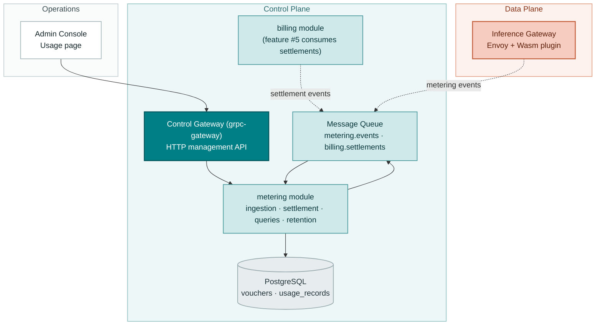
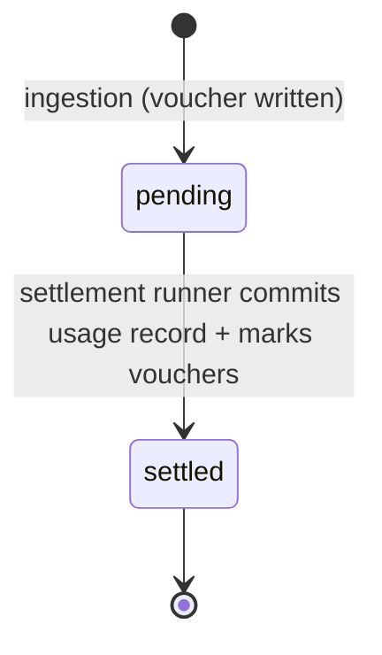
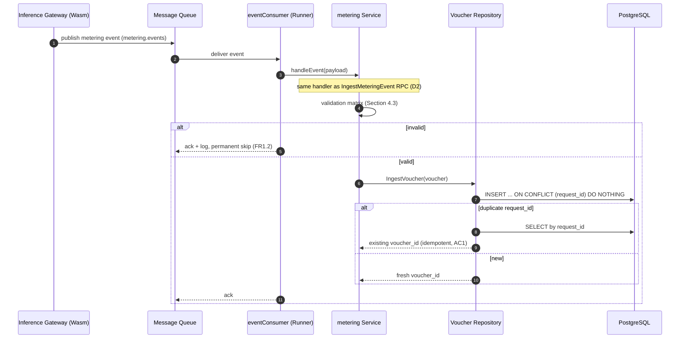
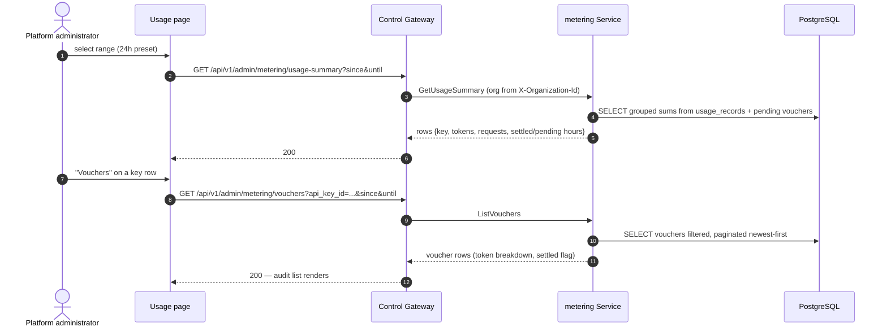

# Token Metering Vouchers & Async Settlement — Architecture and Detailed Design

| Attribute | Content |
| --- | --- |
| Feature point | Token metering vouchers & async settlement per API Key |
| Document scope | Architecture and detailed design for the metering pipeline: event ingestion (MQ consumer + direct RPC), voucher persistence, the hourly settlement runner, settlement-event publication, usage/voucher query APIs, retention cleanup, error handling, configuration, rollout, and function-level design per layer |
| Owning modules | `metering` (ingestion, vouchers, settlement, queries, retention), with `auth` (API Key identity, read-only) and `billing` (settlement-event consumer, feature #5) |
| Related documents | [Requirement Analysis and UI/UX Design](../design/metering.md) · [Architecture Design](../design/architecture.md) Section 2.5 (`metering`), Section 2.6 (`billing`), Section 4.3 (the inference request and billing loop) · [API Key Management](./api-key-management.md) (the key identity vouchers attach to) |
| Status | Architecture complete, handed to the Developer agent |

---

## 1. Goals and Non-Goals

### 1.1 Goals

- Implement the full `taas.metering.v1.MeteringService` surface: the two existing RPCs (`IngestMeteringEvent`, `ListVouchers` — currently stubs) plus three new RPCs (`GetVoucher`, `GetUsageSummary`, `ListUsageRecords`), all additive proto changes.
- **Ingestion** from two paths converging on one handler: the MQ consumer on `metering.events` (the production path — the data-plane gateway's Wasm plugin publishes there) and the `IngestMeteringEvent` gRPC RPC (the direct path for tests and future non-Envoy gateways) (D2, FR1).
- **Idempotent voucher writes**: one `vouchers` row per inference request, keyed by UUID v4 `voucher_id`, unique on `request_id`; a duplicate delivery returns the existing voucher id and writes nothing (D1, FR1.3, AC1).
- **Full token breakdown** on every voucher — prompt / completion / cached / reasoning tokens — plus `api_key_id`, `organization_id`, `model_id`, `service_id`, `request_id`, `completed_at`; no pre-aggregation at capture time (D3, FR2).
- **Hourly settlement runner** (a `server.Runner`): aggregates unsettled vouchers of complete past hours into `usage_records` — one row per `(api_key_id, hour)` — marking contributing vouchers in the same transaction; idempotent via a unique `(api_key_id, period_start)` index; crash-safe re-runs (D4, FR3, AC4–AC6).
- **Settlement events** on `billing.settlements` carrying the usage record id and token sums (no amounts — pricing is feature #5); publish failures retried on the next pass without rolling back settlement (D6, FR3.4, AC7).
- **Query APIs** on the admin surface under `/api/v1/admin/metering/*`, organization-scoped via `X-Organization-Id` (D5, D8, FR4): usage summary (per key or per model), voucher list with filters, single voucher, settled usage records.
- **Retention**: settled vouchers older than the configured window (default 90 days) are batch-deleted; unsettled ones are kept; usage records are never deleted (D7, FR5, AC11).
- **Console Usage page** (`/admin/usage`): time-range presets, per-key usage table, by-model and vouchers drill-downs (D10, FR6, AC12, AC13).

### 1.2 Non-Goals

| Item | Deferred to |
| --- | --- |
| Pricing, amounts on usage records, bill generation | Feature #5 (price matrix & tiered pricing) |
| Balance/quota enforcement at admission (holds, insufficient funds) | Feature #8 (balance & quota modes) |
| End-user (tenant) usage visibility, per-tenant scoping | Features #6/#7 (multi-tenancy, SSO) |
| The Envoy Wasm plugin that emits real gateway events | Data-plane gateway track (this feature consumes its contract; verification uses synthetic events) |
| Real-time streaming usage (sub-hour freshness) | Future — v1 cadence is the hourly batch + 60 s runner |
| Redis metering buffer (architecture Section 2.5 mentions it) | Future — the MQ + DB path is sufficient at v1 scale; Redis is added when ingestion throughput demands it |
| Voucher export (CSV/JSON) for external audit | Future console enhancement |
| Cross-organization usage aggregation | Feature #6 (needs real tenancy) |

---

## 2. Component View



| Component | Responsibility in this feature |
| --- | --- |
| Inference Gateway (data plane) | Publishes one metering event per completed inference request to `metering.events` (the Wasm plugin; out of repository scope — the event contract is pinned in Section 4.5) |
| Control Gateway (`grpc-gateway`) | HTTP/JSON facade for the four query RPCs under `/api/v1/admin/metering`; passes `X-Organization-Id` through as gRPC metadata (the established pattern) |
| `metering` module (`services/metering`) | Event consumer (shared ingestion handler), voucher repository, settlement runner, retention runner, query service |
| PostgreSQL | `vouchers` and `usage_records` tables (new) |
| Message Queue | `metering.events` (consumed; subject exists) and `billing.settlements` (published; subject exists) |
| `billing` module | Unchanged in this feature; feature #5 subscribes to `billing.settlements` |
| Console | Usage page with range presets, per-key table, by-model and vouchers drill-downs (contract in Section 10.5) |

---

## 3. Data Model

### 3.1 The `vouchers` Table

| Column | PostgreSQL type | Constraints | Description |
| --- | --- | --- | --- |
| `id` | `uuid` | PRIMARY KEY | Server-generated UUID v4, exposed as `voucher_id` |
| `request_id` | `varchar(128)` | NOT NULL, UNIQUE | The inference request id from the gateway; the idempotency key (D1) |
| `organization_id` | `varchar(64)` | NOT NULL, index (composite) | Owning organization (transitional plain string, as on `api_keys`) |
| `api_key_id` | `varchar(64)` | NOT NULL, index (composite) | The API Key that made the request |
| `model_id` | `varchar(128)` | NOT NULL | The model that served the request |
| `service_id` | `varchar(64)` | NULL | The inference service that served the request, when known |
| `prompt_tokens` | `bigint` | NOT NULL DEFAULT 0 | Input token count |
| `completion_tokens` | `bigint` | NOT NULL DEFAULT 0 | Output token count |
| `cached_tokens` | `bigint` | NOT NULL DEFAULT 0 | Cache-hit token count |
| `reasoning_tokens` | `bigint` | NOT NULL DEFAULT 0 | Reasoning-trace token count |
| `completed_at` | `timestamptz` | NOT NULL, index (composite) | Request completion time (from the event) |
| `created_at` | `timestamptz` | NOT NULL | Voucher write time (UTC) |
| `settled_usage_record_id` | `varchar(64)` | NULL, index | Set by settlement; NULL means pending (FR2.1) |

Design notes:

- The unique index on `request_id` is the idempotency mechanism: ingestion does INSERT … ON CONFLICT DO NOTHING, then re-selects by `request_id` — a duplicate delivery converges on the existing row without an error path (D1, AC1).
- Composite indexes: `idx_vouchers_org_completed (organization_id, completed_at)` for the audit list; `idx_vouchers_key_completed (api_key_id, completed_at)` for settlement scans and per-key queries. The pending scan filters `settled_usage_record_id IS NULL` and can reuse the key-completed index.
- No foreign keys to `api_keys` / `models` / `inference_services`: vouchers must outlive revoked keys, deleted models, and terminated services — they are financial evidence, not relational state (mirrors the image module's D7 reasoning).
- Vouchers are immutable: no API updates or deletes them; the retention runner is the only deleter (FR2.2).

### 3.2 The `usage_records` Table

| Column | PostgreSQL type | Constraints | Description |
| --- | --- | --- | --- |
| `id` | `uuid` | PRIMARY KEY | Server-generated UUID v4, exposed as `usage_record_id` |
| `organization_id` | `varchar(64)` | NOT NULL, index | Owning organization |
| `api_key_id` | `varchar(64)` | NOT NULL, index (composite, unique) | The settled API Key |
| `period_start` | `bigint` | NOT NULL, index (composite, unique) | Hour start, unix seconds (UTC) |
| `period_end` | `bigint` | NOT NULL | `period_start + 3600` |
| `prompt_tokens` | `bigint` | NOT NULL DEFAULT 0 | Sum over the hour |
| `completion_tokens` | `bigint` | NOT NULL DEFAULT 0 | Sum over the hour |
| `cached_tokens` | `bigint` | NOT NULL DEFAULT 0 | Sum over the hour |
| `reasoning_tokens` | `bigint` | NOT NULL DEFAULT 0 | Sum over the hour |
| `request_count` | `bigint` | NOT NULL DEFAULT 0 | Number of vouchers settled |
| `settled_at` | `timestamptz` | NOT NULL | When the runner committed the record |
| `settlement_event_published` | `boolean` | NOT NULL DEFAULT false | Gates settlement-event re-publishing (FR3.4) |

Design notes:

- The unique composite index `idx_usage_records_key_period (api_key_id, period_start)` makes duplicate settlement inserts impossible — the idempotency backstop (D4, FR3.3, AC5).
- `period_start`/`period_end` are unix seconds (int64) rather than timestamps: they are period labels, not instants, and proto int64 semantics match.
- Usage records are never deleted (D7, FR5.2) — they are the billing evidence feature #5 prices.
- The settled/pending split for `GetUsageSummary` is derived: an hour is settled iff a usage record exists for it; pending hours are computed from unsettled vouchers' hour buckets (FR4.1).

### 3.3 Cross-Module Read Interface

The console's per-key table shows key names, which requires resolving `api_key_id` → key name. Following the narrow-interface pattern (`infer.NewDeleteModelGuard` consumed by `model`), `auth` exposes:

```go
// NamesByIDs returns the display names of the given API Key ids.
// Missing ids are simply absent from the result (revoked-and-deleted
// keys render as their raw id in the console).
func (r *APIKeyRepository) NamesByIDs(ctx context.Context, ids []string) (map[string]string, error)
```

The metering module does **not** depend on this at the API layer: `GetUsageSummary` rows carry `api_key_id` only, and the console resolves names client-side from its existing API Keys page data (or shows the raw id). The repository helper exists for future server-side joins (feature #5's bills). This keeps `metering` free of an `auth` dependency in v1.

---

## 4. API Contract

### 4.1 RPC Surface

All APIs belong to **`taas.metering.v1.MeteringService`** (proto: `proto/taas/metering/v1/metering.proto`), served as HTTP via the Control Gateway. Two RPCs exist; three are added. Proto changes are additive only.

| RPC | HTTP | Status | Purpose |
| --- | --- | --- | --- |
| `IngestMeteringEvent` | internal gRPC (no HTTP binding) | exists, now implemented | Direct ingestion for tests and non-Envoy gateways; request gains `service_id` (field 7) |
| `ListVouchers` | `GET /api/v1/admin/metering/vouchers` | exists, now implemented | Audit list; request gains `api_key_id` (5), `model_id` (6); `VoucherSummary` gains `api_key_id`, `service_id`, `settled` |
| `GetVoucher` | `GET /api/v1/admin/metering/vouchers/{voucher_id}` | **new** | One voucher for audit |
| `GetUsageSummary` | `GET /api/v1/admin/metering/usage-summary` | **new** | Per-key (default) or per-model aggregates for the org and range |
| `ListUsageRecords` | `GET /api/v1/admin/metering/usage-records` | **new** | Settled records (billing evidence), filtered by key and range |

### 4.2 Wire Format (established conventions)

- Pagination binds as `?page.offset=0&page.limit=20` (dotted form); default limit 20, cap 100.
- Success responses are HTTP 200; business errors render as `{"code": <int>, "message": "..."}`.
- All four query APIs require the `X-Organization-Id` header (transitional identity, D8); a missing header returns 10001 `CodeUnauthorized` — the same behavior as the auth module's key APIs (AC14).
- proto3 JSON: int64 fields serialize as strings (`"promptTokens": "123"`); the console parses them as strings (the established `inUseCount` pattern).
- Time-range parameters are unix seconds; defaults `until = now`, `since = until - 24h`; `since > until` or a range > 92 days returns 10404 (FR4.6, AC10).

### 4.3 Validation Matrix (synchronous)

`IngestMeteringEvent` runs these checks in order; the first failure returns immediately and nothing is written (AC2):

| # | Check | Failure code | Canonical message |
| --- | --- | --- | --- |
| 1 | `request_id` non-empty, ≤ 128 chars | 10401 `CodeMeteringEventInvalid` | metering event invalid |
| 2 | `organization_id` non-empty, ≤ 64 chars | 10401 | metering event invalid |
| 3 | `api_key_id` non-empty, ≤ 64 chars | 10401 | metering event invalid |
| 4 | `model_id` non-empty, ≤ 128 chars | 10401 | metering event invalid |
| 5 | all four token counts ≥ 0 | 10401 | metering event invalid |
| 6 | `completed_at` > 0 | 10401 | metering event invalid |

`GetVoucher` validates existence (10403). `ListVouchers` / `GetUsageSummary` / `ListUsageRecords` validate the time range (10404). The MQ consumer applies the same matrix; a violation is logged and the message is permanently skipped (FR1.2).

### 4.4 Settlement State Model

A voucher has exactly two states, derived from `settled_usage_record_id`:



- `pending` → `settled` is the only transition, and it happens exactly once (the marking is inside the settlement transaction).
- An hour becomes settlement-eligible at `hour_start + 1h + grace` (default 5 min); before that its vouchers stay pending even if the runner passes (FR3.1, AC6).
- There is no "failed" state: a settlement attempt either commits or leaves everything pending for the next pass (crash safety, FR3.3).

### 4.5 Message Contracts

#### 4.5.1 Metering Event (`metering.events`, subject exists)

Published by the gateway's Wasm plugin after a request completes. JSON body:

```json
{
  "request_id": "req-abc123",
  "organization_id": "org-fvt",
  "api_key_id": "key-uuid",
  "model_id": "qwen2.5-7b",
  "service_id": "svc-uuid",
  "usage": {
    "prompt_tokens": 1200,
    "completion_tokens": 340,
    "cached_tokens": 0,
    "reasoning_tokens": 0
  },
  "completed_at": 1761234567
}
```

Headers: `request_id`. The consumer is idempotent by `request_id`, so at-least-once delivery is safe (D1).

#### 4.5.2 Settlement Event (`billing.settlements`, subject exists)

Published by the settlement runner after a usage record commits. JSON body:

```json
{
  "usage_record_id": "uuid",
  "api_key_id": "key-uuid",
  "organization_id": "org-fvt",
  "period_start": 1761234400,
  "period_end": 1761238000,
  "prompt_tokens": 12000,
  "completion_tokens": 3400,
  "cached_tokens": 0,
  "reasoning_tokens": 0,
  "request_count": 10,
  "settled_at": "2026-09-23T19:05:00Z"
}
```

Headers: `usage_record_id`. No amounts — pricing is feature #5's contract (D6). The payload is versioned by adding fields only.

---

## 5. Sequence Diagrams

### 5.1 Ingestion (MQ and RPC paths converge)



### 5.2 Settlement Pass

```mermaid
sequenceDiagram
    autonumber
    participant RUN as settlementRunner (Runner)
    participant R as repositories
    participant DB as PostgreSQL
    participant MQ as Message Queue

    Note over RUN: ticker fires (default 60 s)
    RUN->>R: PendingHourBuckets(now - grace)
    R->>DB: SELECT DISTINCT (api_key_id, hour(completed_at))<br/>WHERE settled_usage_record_id IS NULL<br/>AND hour eligible (start + 1h + grace <= now)
    loop each (key, hour) bucket
        RUN->>R: SettleBucket(key, hour) — one transaction
        R->>DB: SELECT SUM(tokens), COUNT(*) WHERE unsettled AND in bucket
        R->>DB: INSERT usage_records (ON CONFLICT DO NOTHING)
        R->>DB: UPDATE vouchers SET settled_usage_record_id = record.id<br/>WHERE unsettled AND in bucket
        RUN->>MQ: publish settlement event (billing.settlements)
        RUN->>R: MarkPublished(record.id)
    end
    Note over RUN: a publish failure leaves the record<br/>unpublished; the next pass re-publishes (FR3.4)
```

### 5.3 Retention Pass

```mermaid
sequenceDiagram
    autonumber
    participant RUN as retentionRunner (same Runner, second ticker)
    participant R as Voucher Repository
    participant DB as PostgreSQL

    Note over RUN: ticker fires (default 1 h)
    RUN->>R: DeleteSettledBefore(now - retention, batch=1000)
    R->>DB: DELETE FROM vouchers<br/>WHERE settled_usage_record_id IS NOT NULL<br/>AND created_at < cutoff LIMIT 1000
    R-->>RUN: deleted count (logged)
    Note over RUN: unsettled old vouchers are kept and logged (FR5.3);<br/>usage_records are never touched (FR5.2)
```

### 5.4 Usage Query (console drill-down)



---

## 6. Error Handling

All errors are `pkg/errors` business codes in the unified envelope. Two new codes are allocated (D9); the rest already exist.

| Condition | Code | Constant | Notes |
| --- | --- | --- | --- |
| Malformed metering event (validation matrix) | 10401 | `CodeMeteringEventInvalid` | Existing; RPC path returns it; MQ path logs and permanently skips |
| Voucher write failure (infrastructure) | 10402 | `CodeMeteringVoucherError` | Existing; MQ path returns it for broker retry |
| Unknown `voucher_id` on `GetVoucher` | 10403 | `CodeMeteringVoucherNotFound` | **New** |
| Malformed time range (`since > until`, range > 92 days) | 10404 | `CodeMeteringRangeInvalid` | **New** |
| Missing `X-Organization-Id` on query APIs | 10001 | `CodeUnauthorized` | Existing; the auth module's `resolveOrganizationID` pattern |
| Database / MQ infrastructure failure | 500 | `CodeInternal` | Via error normalization |

Runner-side failures are not RPC errors: a settlement pass that hits a transient DB error aborts that bucket and retries on the next tick (everything is still pending); a settlement-event publish failure leaves the record unpublished and the next pass re-publishes (FR3.4, AC7). The consumer's permanent-skip policy mirrors the warmup status consumer (FR1.2).

---

## 7. Configuration Additions

The existing `metering` config section (currently `bufferSize` / `flushInterval`, unused by v1 — the Redis buffer is deferred) gains a `settlement` and a `retention` subsection:

| Key | Default | Description |
| --- | --- | --- |
| `metering.settlement.enabled` | `true` | Kill switch for the settlement runner (incident triage) |
| `metering.settlement.interval` | `60s` | Ticker period between settlement passes |
| `metering.settlement.gracePeriod` | `5m` | Extra wait after an hour closes before it is eligible (late-arrival window) |
| `metering.settlement.workers` | `2` | Concurrent bucket settlement workers |
| `metering.retention.enabled` | `true` | Kill switch for the retention runner |
| `metering.retention.voucherTTL` | `2160h` (90 d) | Settled vouchers older than this are deleted |
| `metering.retention.batchSize` | `1000` | Rows deleted per retention pass |
| `metering.retention.interval` | `1h` | Ticker period between retention passes |

Rules:

- `Configuration.applyDefaults` fills the defaults above when unset (the `image.warmupStatusConsumer` pattern); `Validate` gains: settlement/retention intervals and grace non-negative, workers non-negative, `voucherTTL` non-negative, `batchSize` > 0.
- `configs/server.yaml` and `configs/config.yaml` gain the two subsections with the default values, documented inline.
- The existing `metering.bufferSize` / `flushInterval` keys stay (unused, documented as reserved for the future Redis buffer) — removing them would break existing deployments' config files for no gain.

---

## 8. Security Considerations

- **Organization scoping (D8)**: every query API resolves the org from `X-Organization-Id` gRPC metadata and scopes the SQL to it; one org's queries never return another org's data (AC14). The transitional header is replaced by session identity in feature #7.
- **No secrets in messages**: metering and settlement events carry ids and token counts only — no key material, no request bodies, no prompts (the voucher is deliberately free of content: tokens are counts, not text).
- **Immutability as audit property**: no API mutates a voucher; the only writer after ingestion is the settlement runner's marking transaction, and the only deleter is retention (which requires the settled state). This is what makes vouchers tamper-evident in practice (US9).
- **Ingestion is unauthenticated by design**: the MQ subject and the internal RPC are cluster-internal surfaces (the gateway is the only expected publisher); the admin query APIs carry the same transitional auth posture as every other module (removed in feature #7). The RPC has no HTTP binding, so it is not reachable through the gateway.
- **Range cap as a resource guard**: the 92-day range cap and the pagination cap (100) bound every query's cost (FR4.6).

---

## 9. Rollout Notes

- **Schema**: two new tables (`vouchers`, `usage_records`) via AutoMigrate on first start; additive only, no existing data touched.
- **Proto**: additive changes (three new RPCs, extended messages) — `make pbgen` required; generated code is not committed.
- **Subjects**: both `metering.events` and `billing.settlements` already exist in `DefaultSubjects()`; no MQ changes.
- **Wiring**: `apps/taas-server/main.go` registers the metering service already; it gains `srv.AddRunner(...)` for the event consumer, settlement runner, and retention runner after `srv.Init()` (the warmup status consumer pattern). The metering service gains `GetServiceHandlerRegisterFn` (it currently lacks one — billing's pattern).
- **Rolling update order**: deploy `taas-server` alone; the consumer starts draining `metering.events` (empty until the gateway exists), settlement finds no vouchers, retention no-ops. The data-plane gateway can be deployed before or after — events published before the consumer exists are lost (NATS core has no persistence); this is acceptable because the gateway track is not yet shipping.
- **Upgrade compatibility**: nothing existing reads or writes the new tables; the feature is purely additive.
- **Feature flags**: the `enabled` kill switches on both runners allow disabling settlement or retention without a redeploy (config hot-reload is dev-only; production restarts pods).

---

## 10. Detailed Design

### 10.1 File Layout

| Module | File | Contents |
| --- | --- | --- |
| `services/metering` | `metering_model.go` | GORM models `Voucher`, `UsageRecord` + `TableName` |
| | `metering_repository.go` | `Repository` (voucher + usage record persistence, idempotent ingest, settlement transaction, retention delete) |
| | `event_consumer.go` | `EventConsumer` — the `metering.events` subscriber (Runner) |
| | `settlement_runner.go` | `SettlementRunner` — hourly bucket settlement + settlement-event publish (Runner) |
| | `retention_runner.go` | `RetentionRunner` — batch delete of old settled vouchers (Runner) |
| | `service.go` | RPC implementations (all five) + `Migrate` + `NewForFVT` + `MigrateSchemaForFVT` |
| `pkg/errors` | `codes.go` | `CodeMeteringVoucherNotFound` (10403), `CodeMeteringRangeInvalid` (10404) |
| | `messages.go` | Canonical messages for the two new codes |
| `pkg/config` | `api.go` | `MeteringSettlementConfig`, `MeteringRetentionConfig`; `MeteringConfig` gains both subsections |
| | `configuration.go` | `applyDefaults` + `Validate` rules for the new keys |
| `apps/taas-server` | `main.go` | Register the three Runners after `srv.Init()` |
| `configs` | `server.yaml`, `config.yaml` | The `metering.settlement` / `metering.retention` subsections |

### 10.2 `metering` Module

GORM models (single source of truth):

```go
type Voucher struct {
    ID                   string    `gorm:"primaryKey;type:uuid"`
    RequestID            string    `gorm:"size:128;not null;uniqueIndex"`
    OrganizationID       string    `gorm:"size:64;not null;index:idx_vouchers_org_completed,priority:1"`
    APIKeyID             string    `gorm:"size:64;not null;index:idx_vouchers_key_completed,priority:1"`
    ModelID              string    `gorm:"size:128;not null"`
    ServiceID            *string   `gorm:"size:64"`
    PromptTokens         int64     `gorm:"not null;default:0"`
    CompletionTokens     int64     `gorm:"not null;default:0"`
    CachedTokens         int64     `gorm:"not null;default:0"`
    ReasoningTokens      int64     `gorm:"not null;default:0"`
    CompletedAt          time.Time `gorm:"not null;index:idx_vouchers_org_completed,priority:2;index:idx_vouchers_key_completed,priority:2"`
    CreatedAt            time.Time
    SettledUsageRecordID *string   `gorm:"size:64;index"`
}

type UsageRecord struct {
    ID                       string    `gorm:"primaryKey;type:uuid"`
    OrganizationID           string    `gorm:"size:64;not null;index"`
    APIKeyID                 string    `gorm:"size:64;not null;uniqueIndex:idx_usage_records_key_period,priority:1"`
    PeriodStart              int64     `gorm:"not null;uniqueIndex:idx_usage_records_key_period,priority:2"`
    PeriodEnd                int64     `gorm:"not null"`
    PromptTokens             int64     `gorm:"not null;default:0"`
    CompletionTokens         int64     `gorm:"not null;default:0"`
    CachedTokens             int64     `gorm:"not null;default:0"`
    ReasoningTokens          int64     `gorm:"not null;default:0"`
    RequestCount             int64     `gorm:"not null;default:0"`
    SettledAt                time.Time
    SettlementEventPublished bool      `gorm:"not null;default:false"`
}
```

`Repository` (embeds `database.BaseRepository[Voucher]`, holds a `*database.Manager` — the image module's pattern):

- `IngestVoucher(ctx, v *Voucher) (*Voucher, error)` — INSERT with `clause.OnConflict{DoNothing: true}` on the `request_id` unique index; when the insert reports no rows affected, re-select by `request_id` and return the existing row. This is the idempotency primitive (AC1). Infrastructure errors map to 10402.
- `FindByID(ctx, id) (*Voucher, error)` — miss → 10403.
- `ListVouchers(ctx, filter VoucherFilter) ([]*Voucher, int64, error)` — filters: organization (always), api_key_id, model_id, since/until on `completed_at`; `completed_at DESC, id DESC`; total count for `page_meta`.
- `PendingHourBuckets(ctx, eligibleBefore time.Time) ([]HourBucket, error)` — `SELECT api_key_id, organization_id, MIN(period bucket) ...` — concretely: `SELECT api_key_id, organization_id, (unix(completed_at)/3600)*3600 AS period_start, SUM(...) ...` — see `SettleBucket`; the listing query is `SELECT DISTINCT api_key_id, organization_id, (strftime('%s', completed_at)/3600)*3600 AS period_start FROM vouchers WHERE settled_usage_record_id IS NULL AND completed_at < ?` (hour-bucket expression written portably: bucketing happens in Go over a range scan when SQLite/Postgres SQL dialects differ — the runner fetches unsettled vouchers once per pass and groups in Go, which is simpler and dialect-free).
- `SettleBucket(ctx, bucket HourBucket) (*UsageRecord, error)` — one `Manager.WithinTx` transaction: aggregate the bucket's unsettled vouchers (`SUM` tokens, `COUNT`), INSERT the usage record with `clause.OnConflict{DoNothing: true}` on `(api_key_id, period_start)` (a no-op when the record already exists — re-run safety, AC5), then `UPDATE vouchers SET settled_usage_record_id = ? WHERE api_key_id = ? AND completed_at >= start AND completed_at < end AND settled_usage_record_id IS NULL`, and return the record (re-selected on conflict).
- `ListUsageRecords(ctx, filter UsageRecordFilter) ([]*UsageRecord, int64, error)` — filters: organization, api_key_id, since/until on `period_start`; `period_start DESC`; paginated.
- `UsageSummary(ctx, orgID string, since, until int64, groupBy string) ([]*UsageSummaryRow, error)` — settled part: `SELECT api_key_id|model_id, SUM(tokens), COUNT(*) FROM usage_records WHERE org AND period overlap GROUP BY`; pending part: same grouping over unsettled vouchers in range; merged in Go into rows with `settled_hours` / `pending_hours` (distinct hour buckets per group).
- `UnpublishedRecords(ctx) ([]*UsageRecord, error)` — `WHERE settlement_event_published = false` (the publish-retry scan).
- `MarkPublished(ctx, id string) error`.
- `DeleteSettledBefore(ctx, before time.Time, batch int) (int64, error)` — `DELETE ... WHERE settled_usage_record_id IS NOT NULL AND created_at < ? LIMIT ?` (SQLite/Postgres portable form: select ids then delete by ids — the batch bound is required either way).
- `CountUnsettledOlderThan(ctx, before time.Time) (int64, error)` — the FR5.3 logging hook.

`service.go`:

- `Service` gains `repo *Repository` (lazy from components, the image pattern), `publisher mq.Client` (lazy; `NewForFVT` injects directly), and implements `server.ServiceWithGateway` (`GetServiceHandlerRegisterFn` → `meteringv1.RegisterMeteringServiceHandler`).
- `NewForFVT(db *gorm.DB, publisher mq.Client) *Service` — the FVT injection point (the image module's pattern).
- `MigrateSchemaForFVT(db *gorm.DB) error` — `AutoMigrate(&Voucher{}, &UsageRecord{})`.
- `Migrate(ctx)` (implements `server.Migrator`) — `AutoMigrate` both models; no seed (unlike images, there is nothing to seed).
- `handleEvent(ev *meteringEvent) (voucherID string, err error)` — the shared ingestion core: validation matrix (Section 4.3) → build `Voucher` (UUID v4, `CompletedAt` from unix seconds) → `IngestVoucher`. Both `IngestMeteringEvent` (RPC) and `EventConsumer.handle` call it (D2, AC3).
- `IngestMeteringEvent` — decode proto, call `handleEvent`, return `{voucher_id}`.
- `ListVouchers` — resolve org (10001 on missing header), validate range (10404), normalize pagination, map rows to `VoucherSummary` (full breakdown + `settled = SettledUsageRecordID != nil`).
- `GetVoucher` — fetch (10403), map.
- `GetUsageSummary` — resolve org, validate range, `group_by` ∈ {`api_key` (default), `model`} (else 10404), call `UsageSummary`, map rows.
- `ListUsageRecords` — resolve org, validate range, normalize pagination, map.

`event_consumer.go`:

- `EventConsumer` implements `server.Runner`: `Run(ctx)` subscribes to `subjects.MeteringEvents` and handles each message. JSON decode errors and validation failures are logged and permanently skipped (`return nil` — the message never becomes valid); transient DB errors return the error for broker retry (FR1.2, FR1.5).
- `NewEventConsumerRunner(components) *EventConsumer` — nil when disabled or MQ/DB unavailable (the warmup status consumer pattern). Config: `metering.eventConsumer.{enabled,workers}` — **addition to Section 7**: the consumer gets its own kill switch and worker count, mirroring `infer.statusConsumer` (defaults true / 2).

`settlement_runner.go`:

- `SettlementRunner` implements `server.Runner`: `Run(ctx)` loops on a ticker (`interval`); each pass: (1) fetch unsettled vouchers with `completed_at < now - grace` (one query), group in Go by `(api_key_id, hour bucket)`; (2) for each bucket, `SettleBucket` (workers bounded by `workers`, errors logged, bucket retried next pass); (3) `UnpublishedRecords` → for each, publish the settlement event (Section 4.5.2) → `MarkPublished` (FR3.4, AC7).
- Hour bucketing: `periodStart = (completedAt.Unix() / 3600) * 3600` (UTC epoch hours — timezone-free by construction).
- Eligibility: a bucket is settled only when `now >= periodStart + 3600 + grace` (FR3.1, AC6).
- `NewSettlementRunnerRunner(components)` — nil when disabled or components unavailable.

`retention_runner.go`:

- `RetentionRunner` implements `server.Runner`: `Run(ctx)` loops on its own ticker (`retention.interval`); each pass: `DeleteSettledBefore(now - voucherTTL, batchSize)` in a loop until a pass deletes fewer than `batchSize` rows (drain), log the total; `CountUnsettledOlderThan` > 0 → warn log (FR5.3).
- `NewRetentionRunnerRunner(components)` — nil when disabled or DB unavailable.

### 10.3 `pkg/errors` and `pkg/config` (additive)

- `codes.go`: `CodeMeteringVoucherNotFound Code = 10403`, `CodeMeteringRangeInvalid Code = 10404` in the metering block.
- `messages.go`: `"metering voucher not found"`, `"metering range invalid"`.
- `api.go`: `MeteringSettlementConfig{Enabled, Interval, GracePeriod, Workers}`, `MeteringRetentionConfig{Enabled, VoucherTTL, BatchSize, Interval}`, `MeteringEventConsumerConfig{Enabled, Workers}`; `MeteringConfig` gains the three subsections.
- `configuration.go`: `applyDefaults` fills interval/grace/workers/TTL/batch/interval defaults when zero; `Validate` adds the Section 7 rules.

### 10.4 `apps/taas-server/main.go` (additive)

After `srv.Init()`:

```go
if runner := metering.NewEventConsumerRunner(srv.Components()); runner != nil {
    srv.AddRunner(runner)
}
if runner := metering.NewSettlementRunnerRunner(srv.Components()); runner != nil {
    srv.AddRunner(runner)
}
if runner := metering.NewRetentionRunnerRunner(srv.Components()); runner != nil {
    srv.AddRunner(runner)
}
```

### 10.5 Console (out of repository scope, contract summary)

The console is a separate deliverable; this design pins its contract: the Usage page (`/admin/usage`, nav item between API Keys and Images or after Images — final placement at implementation time), range presets (24 h / 7 d / 30 d / custom since-until), the per-key table (key id, input/output/cached tokens, requests, settled/pending badge), the by-model drill-down dialog, the vouchers drill-down dialog (pre-filtered list, paginated, token breakdown + settled flag), the 60-second poll while visible, the freshness note, and the empty state (FR6, AC12, AC13). `web/src/api.ts` gains the response types (`VoucherSummary`, `UsageSummaryRow`, `UsageRecordSummary` — int64-as-string fields).

### 10.6 Testing Strategy

**Unit tests** (`services/metering`, sqlite in-memory per test):

- `metering_repository_test.go`: `IngestVoucher` happy path + duplicate `request_id` idempotency (AC1); `SettleBucket` sums + marking + re-run no-op (AC4, AC5); `DeleteSettledBefore` keeps unsettled (AC11); `UsageSummary` grouping and settled/pending split (AC8); burst ingest of 1000 events settles exactly once (AC15).
- `service_test.go` (framework pattern): validation matrix (AC2), range validation 10404 (AC10), org scoping via metadata context (AC14), `GetVoucher` 10403 (AC9).
- `settlement_runner_test.go`: eligibility boundary (current hour not settled, hour + grace eligible — AC6), publish-failure retry (AC7), idempotent re-pass (AC5).
- `event_consumer_test.go`: MQ path ingests identically to RPC (AC3), malformed events permanently skipped (AC2).

**FVT** (`test/fvt/metering_fvt_test.go`, the image-management FVT pattern): sqlite + `metering.MigrateSchemaForFVT` + recordingBus (extended with `metering`/`settlements` cases) + `metering.NewForFVT(db, bus)` + gRPC server with the production interceptor + gateway mux with `FVTHeaderMatcher`; the real `EventConsumer` runs against the bus. Walks: RPC ingest (AC1), MQ ingest via bus publish (AC3), settlement runner invoked directly (`runner.SettleOnce(ctx)` — the pass function extracted for testability), usage summary + vouchers + records queries through the gateway (AC8, AC9), 10403/10404 (AC9, AC10), org scoping with a second org's vouchers (AC14).

**E2E** (`test/e2e/tests/usageMetering.js`, the imageManagement.js pattern): against the compose stack — seed events via a test helper (the direct RPC through a port-forward or a seed endpoint is decided at implementation; the FVT covers the API behavior, e2e covers the console): Usage page renders presets + table + empty state (AC12), drill-downs render (AC13).

**Regression**: the existing three e2e suites must stay green (no behavior change outside metering).

### 10.7 Acceptance Criteria Coverage

| AC | Addressed by | Verification hook |
| --- | --- | --- |
| AC1 — ingest writes voucher; duplicate returns existing id | `IngestVoucher` ON CONFLICT + re-select | Unit + FVT |
| AC2 — invalid events rejected 10401 / permanently skipped | Validation matrix + consumer policy | Unit |
| AC3 — MQ path identical to RPC (shared handler) | `handleEvent` shared core | Unit |
| AC4 — settlement sums + marks per (key, hour) | `SettleBucket` transaction | Unit |
| AC5 — settlement idempotent, no duplicate records | Unique `(api_key_id, period_start)` + ON CONFLICT | Unit |
| AC6 — current hour not settled; grace respected | Eligibility rule in the runner | Unit |
| AC7 — settlement event published; failure retried, no rollback | `UnpublishedRecords` + `MarkPublished` | Unit |
| AC8 — usage summary per key/model with settled/pending split | `UsageSummary` query | FVT |
| AC9 — voucher list filters + GetVoucher 10403 | `ListVouchers` / `GetVoucher` | FVT |
| AC10 — range validation 10404 everywhere | Range check in all query RPCs | FVT |
| AC11 — retention deletes settled only, keeps records | `DeleteSettledBefore` + `CountUnsettledOlderThan` | Unit |
| AC12 — Usage page renders table + presets + empty state | Console contract (10.5) | E2E |
| AC13 — drill-downs render | Console contract (10.5) | E2E |
| AC14 — org scoping on all query APIs | `resolveOrganizationID` pattern | FVT |
| AC15 — 1000-event burst settles exactly once | `SettleBucket` + burst test | Unit |

---

## 11. Deferred Items

| Item | Deferred to |
| --- | --- |
| Pricing, amounts, bill generation | Feature #5 |
| Balance/quota enforcement at admission | Feature #8 |
| Tenant-facing usage visibility | Features #6/#7 |
| Redis metering buffer (`metering.bufferSize`/`flushInterval` reserved) | Future (throughput-driven) |
| Real gateway events (Wasm plugin) | Data-plane track |
| Voucher export (CSV/JSON) | Future console enhancement |
| Cross-org usage aggregation | Feature #6 |
| Business-code → HTTP status mapping in the gateway | Platform-wide follow-up |
