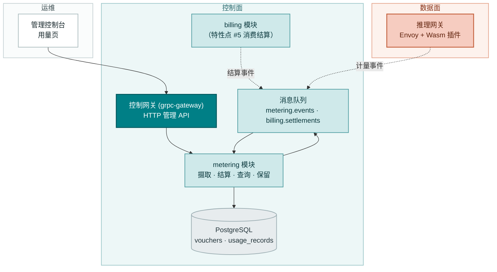
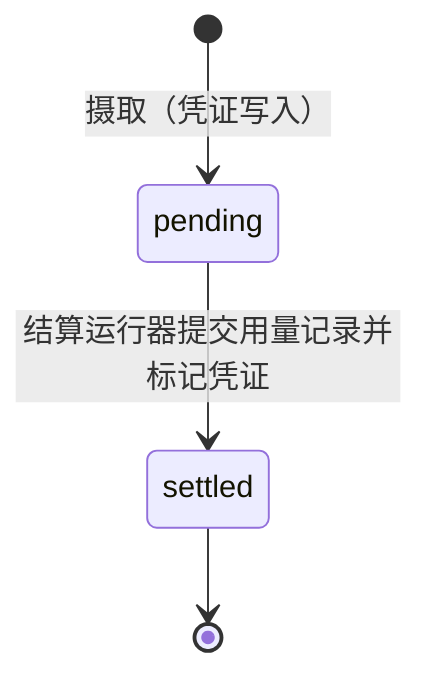
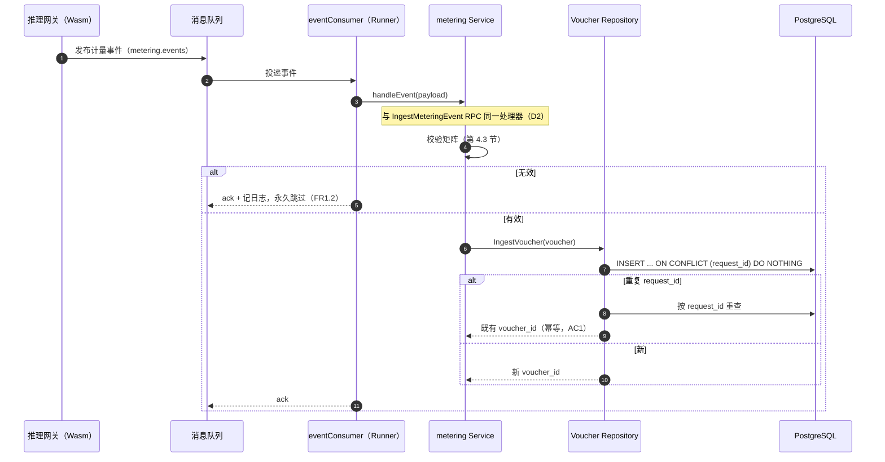
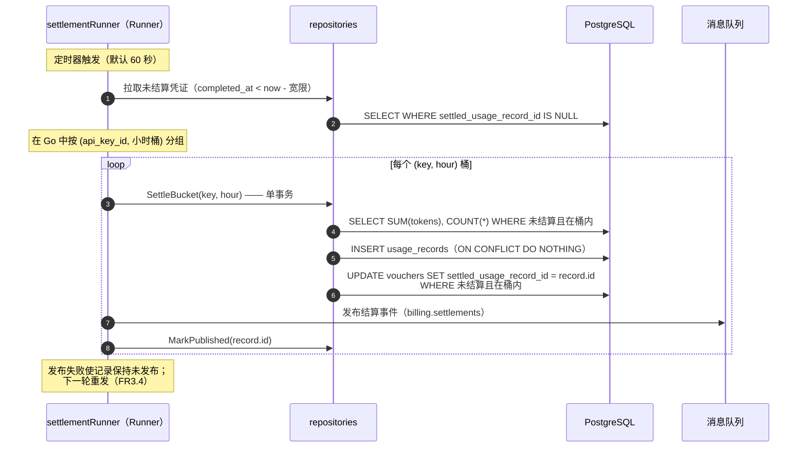
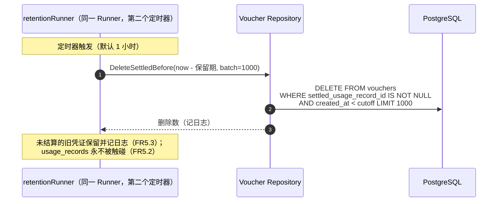
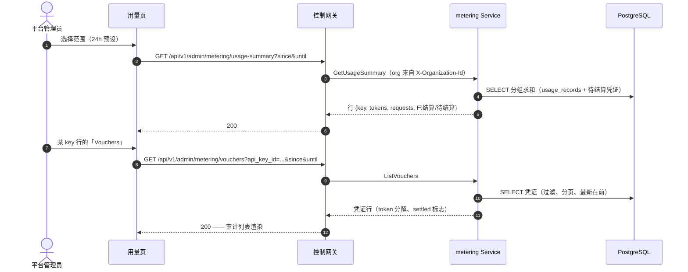

# Token 计量凭证与异步结算 — 架构与详细设计

| 属性 | 内容 |
| --- | --- |
| 特性点 | 按 API Key 的 Token 计量凭证与异步结算 |
| 文档范围 | 计量流水线的架构与详细设计：事件摄取（MQ 消费者 + 直连 RPC）、凭证持久化、小时结算运行器、结算事件发布、用量/凭证查询 API、保留清理、错误处理、配置、发布说明，以及各层的函数级设计 |
| 负责模块 | `metering`（摄取、凭证、结算、查询、保留），以及 `auth`（API Key 身份，只读）和 `billing`（结算事件消费者，特性点 #5） |
| 相关文档 | [需求分析与 UI/UX 设计](../design/metering.zh-cn.md) · [架构设计](../design/architecture.zh-cn.md) 第 2.5 节（`metering`）、第 2.6 节（`billing`）、第 4.3 节（推理请求与计费闭环） · [API Key 管理](./api-key-management.zh-cn.md)（凭证依附的密钥身份） |
| 状态 | 架构设计完成，已移交 Developer 代理 |

---

## 1. 目标与非目标

### 1.1 目标

- 实现完整的 `taas.metering.v1.MeteringService` 面：两个既有 RPC（`IngestMeteringEvent`、`ListVouchers` — 目前为桩）加三个新增 RPC（`GetVoucher`、`GetUsageSummary`、`ListUsageRecords`），proto 变更全部为增量。
- **摄取**从两条路径汇聚到同一处理器：`metering.events` 上的 MQ 消费者（生产路径 —— 数据面网关的 Wasm 插件在此发布）与 `IngestMeteringEvent` gRPC RPC（测试与未来非 Envoy 网关的直连路径）（D2、FR1）。
- **幂等的凭证写入**：每推理请求一行 `vouchers`，以 UUID v4 `voucher_id` 为主键，`request_id` 唯一；重复投递返回既有凭证 id 且不写入任何内容（D1、FR1.3、AC1）。
- 每张凭证携带**完整 token 分解** —— prompt / completion / cached / reasoning token —— 加上 `api_key_id`、`organization_id`、`model_id`、`service_id`、`request_id`、`completed_at`；捕获时不做预聚合（D3、FR2）。
- **小时结算运行器**（一个 `server.Runner`）：把完整过去小时内未结算的凭证聚合为 `usage_records` —— 每 `(api_key_id, hour)` 一行 —— 并在同一事务中标记参与凭证；经 `(api_key_id, period_start)` 唯一索引保证幂等；重跑崩溃安全（D4、FR3、AC4–AC6）。
- **结算事件**发布到 `billing.settlements`，携带用量记录 id 与 token 汇总（不含金额 —— 定价是特性点 #5）；发布失败在下一轮重试，不回滚结算（D6、FR3.4、AC7）。
- **查询 API** 位于管理面 `/api/v1/admin/metering/*`，经 `X-Organization-Id` 按组织限定（D5、D8、FR4）：用量汇总（按 key 或按模型）、带过滤的凭证列表、单个凭证、已结算用量记录。
- **保留**：早于配置窗口（默认 90 天）的已结算凭证被分批删除；未结算的保留；用量记录永不被删除（D7、FR5、AC11）。
- **控制台用量页**（`/admin/usage`）：时间范围预设、按 key 的用量表、按模型与凭证下钻（D10、FR6、AC12、AC13）。

### 1.2 非目标

| 条目 | 延后至 |
| --- | --- |
| 定价、用量记录金额、账单生成 | 特性点 #5（价格矩阵与阶梯定价） |
| 准入时的余额/配额执行（预留、余额不足） | 特性点 #8（余额与配额模式） |
| 终端用户（租户）用量可见性、按租户限定 | 特性点 #6/#7（多租户、SSO） |
| 发布真实网关事件的 Envoy Wasm 插件 | 数据面网关轨道（本特性消费其契约；验证使用合成事件） |
| 实时流式用量（亚小时新鲜度） | 未来 —— v1 节奏为小时批次 + 60 秒运行器 |
| Redis 计量缓冲（架构第 2.5 节提及） | 未来 —— v1 规模下 MQ + DB 路径已足够；摄取吞吐需要时再加 Redis |
| 面向外部审计的凭证导出（CSV/JSON） | 未来控制台增强 |
| 跨组织用量聚合 | 特性点 #6（需要真实租户） |

---

## 2. 组件视图



| 组件 | 在本特性中的职责 |
| --- | --- |
| 推理网关（数据面） | 每个完成的推理请求向 `metering.events` 发布一条计量事件（Wasm 插件；不在仓库范围内 —— 事件契约固定于第 4.5 节） |
| 控制网关（`grpc-gateway`） | 四个查询 RPC 在 `/api/v1/admin/metering` 下的 HTTP/JSON 门面；把 `X-Organization-Id` 作为 gRPC 元数据透传（既有模式） |
| `metering` 模块（`services/metering`） | 事件消费者（共享摄取处理器）、凭证仓库、结算运行器、保留运行器、查询服务 |
| PostgreSQL | `vouchers` 与 `usage_records` 表（新增） |
| 消息队列 | `metering.events`（被消费；主题已存在）与 `billing.settlements`（被发布；主题已存在） |
| `billing` 模块 | 本特性不变；特性点 #5 订阅 `billing.settlements` |
| 控制台 | 带范围预设、按 key 表格、按模型与凭证下钻的用量页（契约见第 10.5 节） |

---

## 3. 数据模型

### 3.1 `vouchers` 表

| 列 | PostgreSQL 类型 | 约束 | 描述 |
| --- | --- | --- | --- |
| `id` | `uuid` | PRIMARY KEY | 服务端生成的 UUID v4，暴露为 `voucher_id` |
| `request_id` | `varchar(128)` | NOT NULL, UNIQUE | 来自网关的推理请求 id；幂等键（D1） |
| `organization_id` | `varchar(64)` | NOT NULL, 索引（复合） | 所属组织（过渡期普通字符串，与 `api_keys` 一致） |
| `api_key_id` | `varchar(64)` | NOT NULL, 索引（复合） | 发起请求的 API Key |
| `model_id` | `varchar(128)` | NOT NULL | 服务该请求的模型 |
| `service_id` | `varchar(64)` | NULL | 服务该请求的推理服务（已知时） |
| `prompt_tokens` | `bigint` | NOT NULL DEFAULT 0 | 输入 token 数 |
| `completion_tokens` | `bigint` | NOT NULL DEFAULT 0 | 输出 token 数 |
| `cached_tokens` | `bigint` | NOT NULL DEFAULT 0 | 缓存命中 token 数 |
| `reasoning_tokens` | `bigint` | NOT NULL DEFAULT 0 | 推理轨迹 token 数 |
| `completed_at` | `timestamptz` | NOT NULL, 索引（复合） | 请求完成时间（来自事件） |
| `created_at` | `timestamptz` | NOT NULL | 凭证写入时间（UTC） |
| `settled_usage_record_id` | `varchar(64)` | NULL, 索引 | 由结算设置；NULL 表示待结算（FR2.1） |

设计说明：

- `request_id` 上的唯一索引是幂等机制：摄取执行 INSERT … ON CONFLICT DO NOTHING，然后按 `request_id` 重查 —— 重复投递收敛到既有行，不产生错误路径（D1、AC1）。
- 复合索引：`idx_vouchers_org_completed (organization_id, completed_at)` 用于审计列表；`idx_vouchers_key_completed (api_key_id, completed_at)` 用于结算扫描与按 key 查询。待结算扫描过滤 `settled_usage_record_id IS NULL`，可复用 key-completed 索引。
- 不设指向 `api_keys` / `models` / `inference_services` 的外键：凭证必须比已吊销的 key、已删除的模型、已终止的服务活得更久 —— 它是财务证据，不是关系状态（镜像 image 模块 D7 的推理）。
- 凭证不可变：任何 API 都不更新或删除它；保留运行器是唯一的删除者（FR2.2）。

### 3.2 `usage_records` 表

| 列 | PostgreSQL 类型 | 约束 | 描述 |
| --- | --- | --- | --- |
| `id` | `uuid` | PRIMARY KEY | 服务端生成的 UUID v4，暴露为 `usage_record_id` |
| `organization_id` | `varchar(64)` | NOT NULL, 索引 | 所属组织 |
| `api_key_id` | `varchar(64)` | NOT NULL, 索引（复合，唯一） | 被结算的 API Key |
| `period_start` | `bigint` | NOT NULL, 索引（复合，唯一） | 小时起点，unix 秒（UTC） |
| `period_end` | `bigint` | NOT NULL | `period_start + 3600` |
| `prompt_tokens` | `bigint` | NOT NULL DEFAULT 0 | 小时内求和 |
| `completion_tokens` | `bigint` | NOT NULL DEFAULT 0 | 小时内求和 |
| `cached_tokens` | `bigint` | NOT NULL DEFAULT 0 | 小时内求和 |
| `reasoning_tokens` | `bigint` | NOT NULL DEFAULT 0 | 小时内求和 |
| `request_count` | `bigint` | NOT NULL DEFAULT 0 | 被结算的凭证数 |
| `settled_at` | `timestamptz` | NOT NULL | 运行器提交记录的时间 |
| `settlement_event_published` | `boolean` | NOT NULL DEFAULT false | 控制结算事件的重发（FR3.4） |

设计说明：

- 唯一复合索引 `idx_usage_records_key_period (api_key_id, period_start)` 使重复的结算插入不可能 —— 幂等的兜底（D4、FR3.3、AC5）。
- `period_start`/`period_end` 是 unix 秒（int64）而非时间戳：它们是周期标签而非时刻，且与 proto int64 语义匹配。
- 用量记录永不被删除（D7、FR5.2）—— 它们是特性点 #5 定价的计费证据。
- `GetUsageSummary` 的已结算/待结算拆分是派生的：某小时已结算当且仅当存在对应用量记录；待结算小时由未结算凭证的小时桶计算（FR4.1）。

### 3.3 跨模块读接口

控制台的按 key 表格显示 key 名称，需要把 `api_key_id` 解析为名称。遵循窄接口模式（`model` 消费的 `infer.NewDeleteModelGuard`），`auth` 暴露：

```go
// NamesByIDs 返回给定 API Key id 的显示名称。
// 缺失的 id 不会出现在结果中（已吊销删除的 key 在控制台
// 显示为原始 id）。
func (r *APIKeyRepository) NamesByIDs(ctx context.Context, ids []string) (map[string]string, error)
```

metering 模块在 API 层**不**依赖它：`GetUsageSummary` 的行只携带 `api_key_id`，控制台在客户端用既有 API Keys 页数据解析名称（或显示原始 id）。该仓库方法为未来的服务端 join（特性点 #5 的账单）而存在。这让 `metering` 在 v1 不依赖 `auth`。

---

## 4. API 契约

### 4.1 RPC 面

所有 API 属于 **`taas.metering.v1.MeteringService`**（proto：`proto/taas/metering/v1/metering.proto`），经控制网关以 HTTP 提供。两个 RPC 已存在；新增三个。proto 变更仅为增量。

| RPC | HTTP | 状态 | 用途 |
| --- | --- | --- | --- |
| `IngestMeteringEvent` | 内部 gRPC（无 HTTP 绑定） | 已存在，现在实现 | 测试与非 Envoy 网关的直连摄取；请求增加 `service_id`（字段 7） |
| `ListVouchers` | `GET /api/v1/admin/metering/vouchers` | 已存在，现在实现 | 审计列表；请求增加 `api_key_id`（5）、`model_id`（6）；`VoucherSummary` 增加 `api_key_id`、`service_id`、`settled` |
| `GetVoucher` | `GET /api/v1/admin/metering/vouchers/{voucher_id}` | **新增** | 单个凭证审计 |
| `GetUsageSummary` | `GET /api/v1/admin/metering/usage-summary` | **新增** | 组织与范围的按 key（默认）或按模型聚合 |
| `ListUsageRecords` | `GET /api/v1/admin/metering/usage-records` | **新增** | 已结算记录（计费证据），按 key 与范围过滤 |

### 4.2 线上格式（既有约定）

- 分页绑定为 `?page.offset=0&page.limit=20`（点分形式）；默认 limit 20，上限 100。
- 成功响应 HTTP 200；业务错误渲染为 `{"code": <int>, "message": "..."}`。
- 四个查询 API 都要求 `X-Organization-Id` 头（过渡期身份，D8）；缺失返回 10001 `CodeUnauthorized` —— 与 auth 模块 key API 的行为一致（AC14）。
- proto3 JSON：int64 字段序列化为字符串（`"promptTokens": "123"`）；控制台按字符串解析（既定的 `inUseCount` 模式）。
- 时间范围参数为 unix 秒；默认 `until = now`、`since = until - 24h`；`since > until` 或跨度 > 92 天返回 10404（FR4.6、AC10）。

### 4.3 校验矩阵（同步）

`IngestMeteringEvent` 依序执行以下检查；首个失败立即返回且不写入任何内容（AC2）：

| # | 检查 | 失败码 | 规范消息 |
| --- | --- | --- | --- |
| 1 | `request_id` 非空，≤ 128 字符 | 10401 `CodeMeteringEventInvalid` | metering event invalid |
| 2 | `organization_id` 非空，≤ 64 字符 | 10401 | metering event invalid |
| 3 | `api_key_id` 非空，≤ 64 字符 | 10401 | metering event invalid |
| 4 | `model_id` 非空，≤ 128 字符 | 10401 | metering event invalid |
| 5 | 四个 token 计数均 ≥ 0 | 10401 | metering event invalid |
| 6 | `completed_at` > 0 | 10401 | metering event invalid |

`GetVoucher` 校验存在性（10403）。`ListVouchers` / `GetUsageSummary` / `ListUsageRecords` 校验时间范围（10404）。MQ 消费者应用同一矩阵；违反即记日志并永久跳过该消息（FR1.2）。

### 4.4 结算状态模型

凭证恰好有两个状态，由 `settled_usage_record_id` 派生：



- `pending` → `settled` 是唯一的迁移，且恰好发生一次（标记在结算事务内）。
- 小时在 `hour_start + 1h + 宽限期`（默认 5 分钟）后才符合结算条件；此前其凭证保持待结算，即使运行器已扫过（FR3.1、AC6）。
- 没有「失败」状态：结算尝试要么提交，要么把一切留给下一轮（崩溃安全，FR3.3）。

### 4.5 消息契约

#### 4.5.1 计量事件（`metering.events`，主题已存在）

由网关的 Wasm 插件在请求完成后发布。JSON 体：

```json
{
  "request_id": "req-abc123",
  "organization_id": "org-fvt",
  "api_key_id": "key-uuid",
  "model_id": "qwen2.5-7b",
  "service_id": "svc-uuid",
  "usage": {
    "prompt_tokens": 1200,
    "completion_tokens": 340,
    "cached_tokens": 0,
    "reasoning_tokens": 0
  },
  "completed_at": 1761234567
}
```

头：`request_id`。消费者按 `request_id` 幂等，因此至少一次投递是安全的（D1）。

#### 4.5.2 结算事件（`billing.settlements`，主题已存在）

由结算运行器在用量记录提交后发布。JSON 体：

```json
{
  "usage_record_id": "uuid",
  "api_key_id": "key-uuid",
  "organization_id": "org-fvt",
  "period_start": 1761234400,
  "period_end": 1761238000,
  "prompt_tokens": 12000,
  "completion_tokens": 3400,
  "cached_tokens": 0,
  "reasoning_tokens": 0,
  "request_count": 10,
  "settled_at": "2026-09-23T19:05:00Z"
}
```

头：`usage_record_id`。不含金额 —— 定价是特性点 #5 的契约（D6）。载荷只增字段地版本化。

---

## 5. 时序图

### 5.1 摄取（MQ 与 RPC 路径汇聚）



### 5.2 结算一轮



### 5.3 保留一轮



### 5.4 用量查询（控制台下钻）



---

## 6. 错误处理

所有错误都是统一信封中的 `pkg/errors` 业务码。新增两个码（D9）；其余已存在。

| 条件 | 码 | 常量 | 备注 |
| --- | --- | --- | --- |
| 畸形计量事件（校验矩阵） | 10401 | `CodeMeteringEventInvalid` | 既有；RPC 路径返回；MQ 路径记日志并永久跳过 |
| 凭证写失败（基础设施） | 10402 | `CodeMeteringVoucherError` | 既有；MQ 路径返回以供代理重试 |
| `GetVoucher` 的未知 `voucher_id` | 10403 | `CodeMeteringVoucherNotFound` | **新增** |
| 畸形时间范围（`since > until`、跨度 > 92 天） | 10404 | `CodeMeteringRangeInvalid` | **新增** |
| 查询 API 缺失 `X-Organization-Id` | 10001 | `CodeUnauthorized` | 既有；auth 模块的 `resolveOrganizationID` 模式 |
| 数据库 / MQ 基础设施失败 | 500 | `CodeInternal` | 经错误归一化 |

运行器侧的失败不是 RPC 错误：结算一轮遇到瞬态 DB 错误时中止该桶并在下个 tick 重试（一切仍为待结算）；结算事件发布失败使记录保持未发布，下一轮重发（FR3.4、AC7）。消费者的永久跳过策略镜像预热状态消费者（FR1.2）。

---

## 7. 配置新增

既有 `metering` 配置节（当前为 `bufferSize` / `flushInterval`，v1 未使用 —— Redis 缓冲已延后）增加 `settlement` 与 `retention` 子节：

| 键 | 默认值 | 描述 |
| --- | --- | --- |
| `metering.settlement.enabled` | `true` | 结算运行器的开关（事件处置） |
| `metering.settlement.interval` | `60s` | 结算轮之间的定时器周期 |
| `metering.settlement.gracePeriod` | `5m` | 小时关闭后的额外等待，之后才符合条件（迟到窗口） |
| `metering.settlement.workers` | `2` | 并发的桶结算工作协程数 |
| `metering.retention.enabled` | `true` | 保留运行器的开关 |
| `metering.retention.voucherTTL` | `2160h`（90 天） | 早于此的已结算凭证被删除 |
| `metering.retention.batchSize` | `1000` | 每轮保留删除的行数 |
| `metering.retention.interval` | `1h` | 保留轮之间的定时器周期 |

规则：

- `Configuration.applyDefaults` 在未设置时填充上述默认值（`image.warmupStatusConsumer` 模式）；`Validate` 增加：settlement/retention 的 interval 与 grace 非负、workers 非负、`voucherTTL` 非负、`batchSize` > 0。
- `configs/server.yaml` 与 `configs/config.yaml` 增加两个子节及默认值，行内注释说明。
- 既有 `metering.bufferSize` / `flushInterval` 键保留（未使用，文档标注为未来 Redis 缓冲预留）—— 删除它们只会破坏既有部署的配置文件。

---

## 8. 安全考量

- **组织限定（D8）**：每个查询 API 从 `X-Organization-Id` gRPC 元数据解析组织并把 SQL 限定到它；一个组织的查询绝不返回另一个组织的数据（AC14）。过渡期头在特性点 #7 被会话身份替换。
- **消息中无秘密**：计量与结算事件只携带 id 与 token 计数 —— 无密钥材料、无请求体、无 prompt（凭证刻意不含内容：token 是计数，不是文本）。
- **不可变即审计属性**：任何 API 都不修改凭证；摄取之后唯一的写入者是结算运行器的标记事务，唯一的删除者是保留（且要求已结算状态）。这正是凭证在实践中防篡改的原因（US9）。
- **摄取按设计不鉴权**：MQ 主题与内部 RPC 是集群内部面（网关是唯一预期的发布者）；管理查询 API 与其他模块一样处于过渡期安全态势（特性点 #7 移除）。该 RPC 无 HTTP 绑定，因此不可经网关到达。
- **范围上限即资源防护**：92 天范围上限与分页上限（100）约束了每个查询的成本（FR4.6）。

---

## 9. 发布说明

- **模式**：首次启动经 AutoMigrate 新增两张表（`vouchers`、`usage_records`）；仅增量，不触碰既有数据。
- **Proto**：增量变更（三个新 RPC、扩展消息）—— 需要 `make pbgen`；生成代码不提交。
- **主题**：`metering.events` 与 `billing.settlements` 均已存在于 `DefaultSubjects()`；无 MQ 变更。
- **接线**：`apps/taas-server/main.go` 已注册 metering 服务；在 `srv.Init()` 之后为事件消费者、结算运行器、保留运行器增加 `srv.AddRunner(...)`（预热状态消费者模式）。metering 服务增加 `GetServiceHandlerRegisterFn`（当前缺失 —— billing 的模式）。
- **滚动更新顺序**：单独部署 `taas-server`；消费者开始排空 `metering.events`（网关存在前为空）、结算找不到凭证、保留空转。数据面网关先后皆可 —— 消费者存在之前发布的事件会丢失（NATS core 无持久化）；这是可接受的，因为网关轨道尚未交付。
- **升级兼容**：没有任何既有代码读写新表；本特性纯增量。
- **特性开关**：两个运行器的 `enabled` 开关允许不重新部署即禁用结算或保留（配置热重载仅限开发；生产重启 Pod）。

---

## 10. 详细设计

### 10.1 文件布局

| 模块 | 文件 | 内容 |
| --- | --- | --- |
| `services/metering` | `metering_model.go` | GORM 模型 `Voucher`、`UsageRecord` + `TableName` |
| | `metering_repository.go` | `Repository`（凭证 + 用量记录持久化、幂等摄取、结算事务、保留删除） |
| | `event_consumer.go` | `EventConsumer` —— `metering.events` 订阅者（Runner） |
| | `settlement_runner.go` | `SettlementRunner` —— 小时桶结算 + 结算事件发布（Runner） |
| | `retention_runner.go` | `RetentionRunner` —— 旧已结算凭证的分批删除（Runner） |
| | `service.go` | RPC 实现（全部五个）+ `Migrate` + `NewForFVT` + `MigrateSchemaForFVT` |
| `pkg/errors` | `codes.go` | `CodeMeteringVoucherNotFound`（10403）、`CodeMeteringRangeInvalid`（10404） |
| | `messages.go` | 两个新码的规范消息 |
| `pkg/config` | `api.go` | `MeteringSettlementConfig`、`MeteringRetentionConfig`；`MeteringConfig` 增加两个子节 |
| | `configuration.go` | 新键的 `applyDefaults` + `Validate` 规则 |
| `apps/taas-server` | `main.go` | 在 `srv.Init()` 之后注册三个 Runner |
| `configs` | `server.yaml`、`config.yaml` | `metering.settlement` / `metering.retention` 子节 |

### 10.2 `metering` 模块

GORM 模型（唯一事实来源）：

```go
type Voucher struct {
    ID                   string    `gorm:"primaryKey;type:uuid"`
    RequestID            string    `gorm:"size:128;not null;uniqueIndex"`
    OrganizationID       string    `gorm:"size:64;not null;index:idx_vouchers_org_completed,priority:1"`
    APIKeyID             string    `gorm:"size:64;not null;index:idx_vouchers_key_completed,priority:1"`
    ModelID              string    `gorm:"size:128;not null"`
    ServiceID            *string   `gorm:"size:64"`
    PromptTokens         int64     `gorm:"not null;default:0"`
    CompletionTokens     int64     `gorm:"not null;default:0"`
    CachedTokens         int64     `gorm:"not null;default:0"`
    ReasoningTokens      int64     `gorm:"not null;default:0"`
    CompletedAt          time.Time `gorm:"not null;index:idx_vouchers_org_completed,priority:2;index:idx_vouchers_key_completed,priority:2"`
    CreatedAt            time.Time
    SettledUsageRecordID *string   `gorm:"size:64;index"`
}

type UsageRecord struct {
    ID                       string    `gorm:"primaryKey;type:uuid"`
    OrganizationID           string    `gorm:"size:64;not null;index"`
    APIKeyID                 string    `gorm:"size:64;not null;uniqueIndex:idx_usage_records_key_period,priority:1"`
    PeriodStart              int64     `gorm:"not null;uniqueIndex:idx_usage_records_key_period,priority:2"`
    PeriodEnd                int64     `gorm:"not null"`
    PromptTokens             int64     `gorm:"not null;default:0"`
    CompletionTokens         int64     `gorm:"not null;default:0"`
    CachedTokens             int64     `gorm:"not null;default:0"`
    ReasoningTokens          int64     `gorm:"not null;default:0"`
    RequestCount             int64     `gorm:"not null;default:0"`
    SettledAt                time.Time
    SettlementEventPublished bool      `gorm:"not null;default:false"`
}
```

`Repository`（嵌入 `database.BaseRepository[Voucher]`，持有 `*database.Manager` —— image 模块的模式）：

- `IngestVoucher(ctx, v *Voucher) (*Voucher, error)` —— 在 `request_id` 唯一索引上带 `clause.OnConflict{DoNothing: true}` 的 INSERT；当插入报告未影响任何行时，按 `request_id` 重查并返回既有行。这是幂等原语（AC1）。基础设施错误映射到 10402。
- `FindByID(ctx, id) (*Voucher, error)` —— 未命中 → 10403。
- `ListVouchers(ctx, filter VoucherFilter) ([]*Voucher, int64, error)` —— 过滤：组织（恒有）、api_key_id、model_id、completed_at 上的 since/until；`completed_at DESC, id DESC`；`page_meta` 的总数。
- `SettleBucket(ctx, bucket HourBucket) (*UsageRecord, error)` —— 一个 `Manager.WithinTx` 事务：聚合桶内未结算凭证（`SUM` tokens、`COUNT`），带 `clause.OnConflict{DoNothing: true}` 在 `(api_key_id, period_start)` 上 INSERT 用量记录（记录已存在时为空操作 —— 重跑安全，AC5），然后 `UPDATE vouchers SET settled_usage_record_id = ? WHERE ...`，返回记录（冲突时重查）。
- `ListUsageRecords(ctx, filter UsageRecordFilter) ([]*UsageRecord, int64, error)` —— 过滤：组织、api_key_id、period_start 上的 since/until；`period_start DESC`；分页。
- `UsageSummary(ctx, orgID string, since, until int64, groupBy string) ([]*UsageSummaryRow, error)` —— 已结算部分：`SELECT api_key_id|model_id, SUM(tokens), COUNT(*) FROM usage_records WHERE org AND 周期重叠 GROUP BY`；待结算部分：对范围内未结算凭证做同样分组；在 Go 中合并为带 `settled_hours` / `pending_hours` 的行（每组的不同小时桶数）。
- `UnpublishedRecords(ctx) ([]*UsageRecord, error)` —— `WHERE settlement_event_published = false`（发布重试扫描）。
- `MarkPublished(ctx, id string) error`。
- `DeleteSettledBefore(ctx, before time.Time, batch int) (int64, error)` —— `DELETE ... WHERE settled_usage_record_id IS NOT NULL AND created_at < ? LIMIT ?`（SQLite/Postgres 可移植形式：先选 id 再按 id 删除 —— 无论哪种都需要批量的界）。
- `CountUnsettledOlderThan(ctx, before time.Time) (int64, error)` —— FR5.3 的日志钩子。

`service.go`：

- `Service` 增加 `repo *Repository`（从组件惰性解析，image 模式）、`publisher mq.Client`（惰性；`NewForFVT` 直接注入），并实现 `server.ServiceWithGateway`（`GetServiceHandlerRegisterFn` → `meteringv1.RegisterMeteringServiceHandler`）。
- `NewForFVT(db *gorm.DB, publisher mq.Client) *Service` —— FVT 注入点（image 模块的模式）。
- `MigrateSchemaForFVT(db *gorm.DB) error` —— `AutoMigrate(&Voucher{}, &UsageRecord{})`。
- `Migrate(ctx)`（实现 `server.Migrator`）—— AutoMigrate 两个模型；无种子（与 image 不同，没有可种子的东西）。
- `handleEvent(ev *meteringEvent) (voucherID string, err error)` —— 共享的摄取核心：校验矩阵（第 4.3 节）→ 构建 `Voucher`（UUID v4、`CompletedAt` 来自 unix 秒）→ `IngestVoucher`。`IngestMeteringEvent`（RPC）与 `EventConsumer.handle` 都调用它（D2、AC3）。
- `IngestMeteringEvent` —— 解码 proto，调用 `handleEvent`，返回 `{voucher_id}`。
- `ListVouchers` —— 解析组织（缺失头 10001）、校验范围（10404）、规范化分页、映射行到 `VoucherSummary`（完整分解 + `settled = SettledUsageRecordID != nil`）。
- `GetVoucher` —— 查询（10403）、映射。
- `GetUsageSummary` —— 解析组织、校验范围、`group_by` ∈ {`api_key`（默认）、`model`}（否则 10404）、调用 `UsageSummary`、映射行。
- `ListUsageRecords` —— 解析组织、校验范围、规范化分页、映射。

`event_consumer.go`：

- `EventConsumer` 实现 `server.Runner`：`Run(ctx)` 订阅 `subjects.MeteringEvents` 并处理每条消息。JSON 解码错误与校验失败记日志并永久跳过（`return nil` —— 消息永远不会变有效）；瞬态 DB 错误返回错误以供代理重试（FR1.2、FR1.5）。
- `NewEventConsumerRunner(components) *EventConsumer` —— 禁用或 MQ/DB 不可用时返回 nil（预热状态消费者模式）。配置：`metering.eventConsumer.{enabled,workers}` —— **第 7 节的补充**：消费者获得自己的开关与工作协程数，镜像 `infer.statusConsumer`（默认 true / 2）。

`settlement_runner.go`：

- `SettlementRunner` 实现 `server.Runner`：`Run(ctx)` 按定时器（`interval`）循环；每轮：(1) 一次查询拉取 `completed_at < now - 宽限期` 的未结算凭证，在 Go 中按 `(api_key_id, 小时桶)` 分组；(2) 对每个桶执行 `SettleBucket`（并发受 `workers` 约束，错误记日志，桶在下一轮重试）；(3) `UnpublishedRecords` → 逐个发布结算事件（第 4.5.2 节）→ `MarkPublished`（FR3.4、AC7）。
- 小时分桶：`periodStart = (completedAt.Unix() / 3600) * 3600`（UTC epoch 小时 —— 构造上即无时区）。
- 资格：仅当 `now >= periodStart + 3600 + 宽限期` 时结算该桶（FR3.1、AC6）。
- `NewSettlementRunnerRunner(components)` —— 禁用或组件不可用时返回 nil。

`retention_runner.go`：

- `RetentionRunner` 实现 `server.Runner`：`Run(ctx)` 按自己的定时器（`retention.interval`）循环；每轮：循环调用 `DeleteSettledBefore(now - voucherTTL, batchSize)` 直到某轮删除数少于 `batchSize`（排空），记录总数；`CountUnsettledOlderThan` > 0 → 警告日志（FR5.3）。
- `NewRetentionRunnerRunner(components)` —— 禁用或 DB 不可用时返回 nil。

### 10.3 `pkg/errors` 与 `pkg/config`（增量）

- `codes.go`：metering 块中增加 `CodeMeteringVoucherNotFound Code = 10403`、`CodeMeteringRangeInvalid Code = 10404`。
- `messages.go`：`"metering voucher not found"`、`"metering range invalid"`。
- `api.go`：`MeteringSettlementConfig{Enabled, Interval, GracePeriod, Workers}`、`MeteringRetentionConfig{Enabled, VoucherTTL, BatchSize, Interval}`、`MeteringEventConsumerConfig{Enabled, Workers}`；`MeteringConfig` 增加三个子节。
- `configuration.go`：`applyDefaults` 在为零时填充 interval/grace/workers/TTL/batch 默认值；`Validate` 增加第 7 节的规则。

### 10.4 `apps/taas-server/main.go`（增量）

在 `srv.Init()` 之后：

```go
if runner := metering.NewEventConsumerRunner(srv.Components()); runner != nil {
    srv.AddRunner(runner)
}
if runner := metering.NewSettlementRunnerRunner(srv.Components()); runner != nil {
    srv.AddRunner(runner)
}
if runner := metering.NewRetentionRunnerRunner(srv.Components()); runner != nil {
    srv.AddRunner(runner)
}
```

### 10.5 控制台（仓库范围外，契约摘要）

控制台是独立交付物；本设计固定其契约：用量页（`/admin/usage`，导航项位于 API Keys 与 Images 之间或 Images 之后 —— 实现时定稿）、范围预设（24 小时 / 7 天 / 30 天 / 自定义 since-until）、按 key 表格（key id、输入/输出/缓存 token、请求数、已结算/待结算徽标）、按模型下钻对话框、凭证下钻对话框（预过滤列表、分页、token 分解 + settled 标志）、可见时 60 秒轮询、新鲜度说明、空状态（FR6、AC12、AC13）。`web/src/api.ts` 增加响应类型（`VoucherSummary`、`UsageSummaryRow`、`UsageRecordSummary` —— int64 即字符串字段）。

### 10.6 测试策略

**单元测试**（`services/metering`，每测试一个内存 sqlite）：

- `metering_repository_test.go`：`IngestVoucher` 正常路径 + 重复 `request_id` 幂等（AC1）；`SettleBucket` 求和 + 标记 + 重跑空操作（AC4、AC5）；`DeleteSettledBefore` 保留未结算（AC11）；`UsageSummary` 分组与已结算/待结算拆分（AC8）；1000 事件突发恰好结算一次（AC15）。
- `service_test.go`（framework 模式）：校验矩阵（AC2）、范围校验 10404（AC10）、经元数据上下文的组织限定（AC14）、`GetVoucher` 10403（AC9）。
- `settlement_runner_test.go`：资格边界（当前小时不结算、小时 + 宽限期后符合 —— AC6）、发布失败重试（AC7）、幂等重跑（AC5）。
- `event_consumer_test.go`：MQ 路径与 RPC 摄取一致（AC3）、畸形事件永久跳过（AC2）。

**FVT**（`test/fvt/metering_fvt_test.go`，image-management FVT 模式）：sqlite + `metering.MigrateSchemaForFVT` + recordingBus（扩展 metering/settlements 分支）+ `metering.NewForFVT(db, bus)` + 带生产拦截器的 gRPC 服务器 + 带 `FVTHeaderMatcher` 的网关 mux；真实 `EventConsumer` 跑在总线上。走查：RPC 摄取（AC1）、经总线发布的 MQ 摄取（AC3）、直接调用的结算运行器（`runner.SettleOnce(ctx)` —— 为可测性抽出单轮函数）、经网关的用量汇总 + 凭证 + 记录查询（AC8、AC9）、10403/10404（AC9、AC10）、用第二个组织的凭证验证组织限定（AC14）。

**E2E**（`test/e2e/tests/usageMetering.js`，imageManagement.js 模式）：针对 compose 栈 —— 经测试助手播种事件（经端口转发的直连 RPC 或播种端点在实现时定夺；FVT 覆盖 API 行为，e2e 覆盖控制台）：用量页渲染预设 + 表格 + 空状态（AC12）、下钻渲染（AC13）。

**回归**：既有三个 e2e 套件必须保持绿色（metering 之外无行为变化）。

### 10.7 验收标准覆盖

| AC | 由何解决 | 验证钩子 |
| --- | --- | --- |
| AC1 —— 摄取写凭证；重复返回既有 id | `IngestVoucher` ON CONFLICT + 重查 | Unit + FVT |
| AC2 —— 无效事件 10401 拒绝 / 永久跳过 | 校验矩阵 + 消费者策略 | Unit |
| AC3 —— MQ 路径与 RPC 一致（共享处理器） | `handleEvent` 共享核心 | Unit |
| AC4 —— 结算按 (key, hour) 求和 + 标记 | `SettleBucket` 事务 | Unit |
| AC5 —— 结算幂等，无重复记录 | `(api_key_id, period_start)` 唯一 + ON CONFLICT | Unit |
| AC6 —— 当前小时不结算；宽限期被尊重 | 运行器中的资格规则 | Unit |
| AC7 —— 结算事件发布；失败重试、不回滚 | `UnpublishedRecords` + `MarkPublished` | Unit |
| AC8 —— 按 key/模型的用量汇总含拆分 | `UsageSummary` 查询 | FVT |
| AC9 —— 凭证列表过滤 + GetVoucher 10403 | `ListVouchers` / `GetVoucher` | FVT |
| AC10 —— 处处 10404 范围校验 | 所有查询 RPC 的范围检查 | FVT |
| AC11 —— 保留只删已结算、保留记录 | `DeleteSettledBefore` + `CountUnsettledOlderThan` | Unit |
| AC12 —— 用量页渲染表格 + 预设 + 空状态 | 控制台契约（10.5） | E2E |
| AC13 —— 下钻渲染 | 控制台契约（10.5） | E2E |
| AC14 —— 所有查询 API 的组织限定 | `resolveOrganizationID` 模式 | FVT |
| AC15 —— 1000 事件突发恰好结算一次 | `SettleBucket` + 突发测试 | Unit |

---

## 11. 遗留项

| 条目 | 延后至 |
| --- | --- |
| 定价、金额、账单生成 | 特性点 #5 |
| 准入时的余额/配额执行 | 特性点 #8 |
| 租户侧用量可见性 | 特性点 #6/#7 |
| Redis 计量缓冲（`metering.bufferSize`/`flushInterval` 预留） | 未来（吞吐驱动） |
| 真实网关事件（Wasm 插件） | 数据面轨道 |
| 凭证导出（CSV/JSON） | 未来控制台增强 |
| 跨组织用量聚合 | 特性点 #6 |
| 网关中业务码 → HTTP 状态映射 | 平台级后续 |
