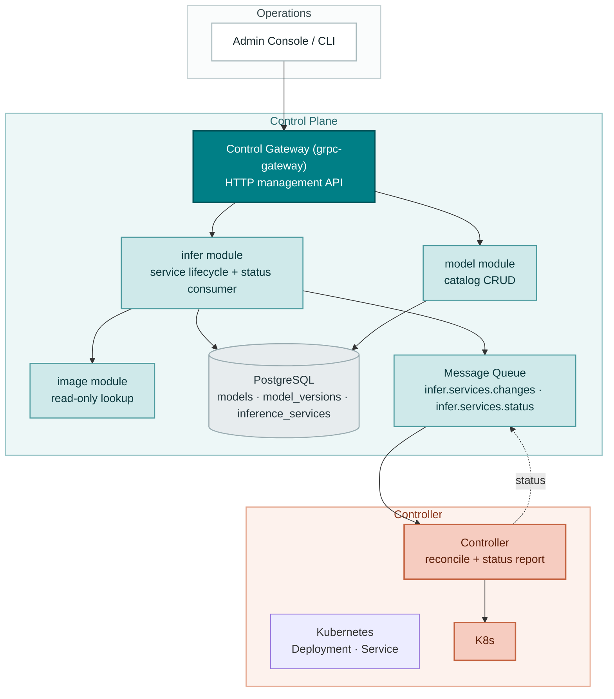
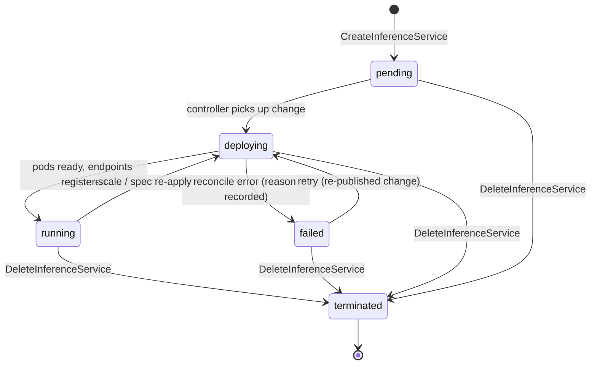
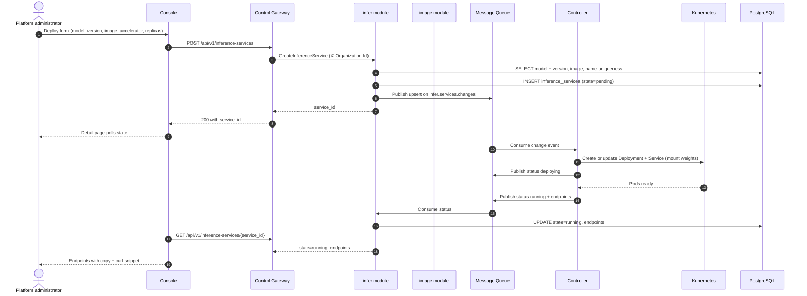
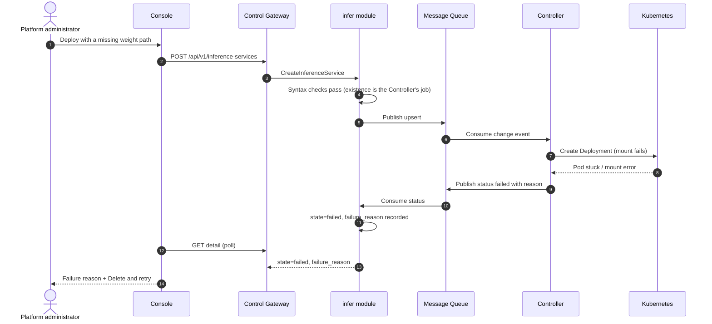
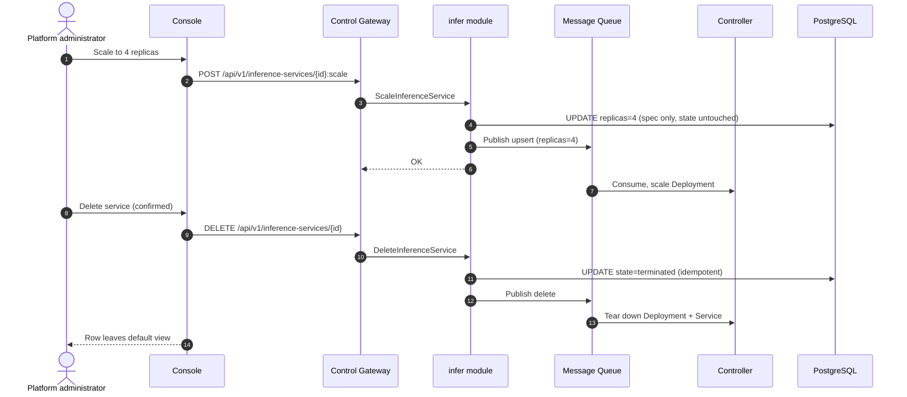

# Model Catalog & One-Click Deployment — Architecture and Detailed Design

| Attribute | Content |
| --- | --- |
| Feature point | Model catalog & one-click deployment (console + API) |
| Document scope | Architecture and detailed design for the `model` catalog and the `infer` inference-service lifecycle: component responsibilities, data model, API contract, message contract, controller reconciliation, error handling, configuration, rollout, and function-level design per layer |
| Owning modules | `model` (catalog and weight assets), `infer` (inference-service lifecycle), `image` (read-only image lookup), `controller` (Kubernetes reconciliation) |
| Related documents | [Requirement Analysis and UI/UX Design](../design/model-catalog-deployment.md) · [Architecture Design](../design/architecture.md) Section 2.2 (`model`), Section 2.4 (`infer`), Section 4.2 (one-click deployment flow) · [API Key Management Architecture](./api-key-management.md) (established patterns: Migrator hook, wire-format conventions, transitional organization scoping) |
| Status | Architecture complete, handed to the Developer agent |

---

## 1. Goals and Non-Goals

### 1.1 Goals

- Implement the four `taas.model.v1.ModelService` RPCs: `RegisterModel`, `ListModels`, `GetModel`, `DeleteModel` — the catalog that the deploy form picks from.
- Implement the five `taas.infer.v1.InferServiceService` RPCs: `CreateInferenceService`, `ListInferenceServices`, `GetInferenceService`, `ScaleInferenceService`, `DeleteInferenceService` — the one-click deployment lifecycle.
- Synchronous validation before publish: unknown model / image, out-of-range replicas, accelerator mismatch, and duplicate service names are rejected **before** anything reaches the message queue (AC5).
- Asynchronous deployment through the existing `infer.services.changes` subject: the create call returns `service_id` with `state=pending` in under 2 s (AC4), and the Controller drives `pending → deploying → running / failed`.
- Status feedback loop: the Controller reports observed state and endpoints back to the `infer` module through a new `infer.services.status` subject, so `GetInferenceService` can return `endpoints` when `running` (AC6) and a human-readable reason when `failed` (AC7).
- Catalog integrity: `DeleteModel` is blocked while a non-terminated inference service references the model, naming the blocking service (AC3).
- Idempotent delete and organization-scoped listing for inference services (AC9).
- Schema, configuration, and framework changes needed to ship the above, with function-level responsibilities precise enough to implement without guessing.

### 1.2 Non-Goals

| Item | Deferred to |
| --- | --- |
| Image registration UI, image versioning, and the full image × card-type adaptation matrix | Feature #3 image management |
| Image pre-pull / warmup orchestration (`TriggerWarmup` exists; the controller side stays a stub) | Feature #3 |
| Per-model and per-card pricing display | Feature #5 price matrix |
| Tenant-level model authorization (which tenants may deploy which models) | Feature #6 multi-tenancy |
| Autoscaling policies, canary upgrades, blue-green deployment | Future feature point |
| The Inference Gateway routing of `/v1/chat/completions` to deployed services | Data-plane track (Architecture Section 3) |
| Session-derived organization identity (this feature reuses the transitional `X-Organization-Id` header) | Feature #7 |
| Weight-path existence validation at registration time | Deliberate: the Controller checks at deploy time and surfaces `failed` with that reason (FR1.3, AC7) |

---

## 2. Component View



| Component | Responsibility in this feature |
| --- | --- |
| Console | Models page (register, list, detail with versions), Inference Services page (deploy dialog, state badges, scale, delete), service detail with endpoints and curl snippet |
| Control Gateway (`grpc-gateway`) | HTTP/JSON facade for all nine RPCs; passes the transitional `X-Organization-Id` header through as gRPC metadata (established by the API Key feature) |
| `model` module (`services/model`) | Catalog RPCs, name+version uniqueness, weight-path syntax validation, delete protection while referenced |
| `infer` module (`services/infer`) | Lifecycle RPCs, synchronous validation (model, image, replicas, accelerator), desired-state persistence, change publication, status consumption, endpoint exposure |
| `image` module (`services/image`) | Read-only: `infer` looks images up by `image_id` to validate existence and accelerator compatibility. Registration UI is feature #3 |
| PostgreSQL | `models`, `model_versions`, `inference_services` tables |
| Message Queue | `infer.services.changes` (desired-state changes, consumed by the Controller) and the new `infer.services.status` (observed state, consumed by `infer`) |
| Controller (`internal/controller`) | Decodes change events, creates/updates/deletes the Kubernetes Deployment and Service, reports observed state and endpoints on the status subject |
| Inference Gateway | **Not involved** in this feature — endpoints are recorded in the control plane; the data-plane routing track consumes them later |

---

## 3. Data Model

### 3.1 The `models` Table (catalog identity)

| Column | PostgreSQL type | Constraints | Description |
| --- | --- | --- | --- |
| `id` | `uuid` | PRIMARY KEY | Server-generated UUID v4, exposed as `model_id` |
| `name` | `varchar(128)` | NOT NULL, UNIQUE | Model name, 1–128 chars (FR1.1) |
| `description` | `varchar(1024)` | NOT NULL DEFAULT '' | Free-text description, ≤ 1024 chars |
| `created_at` | `timestamptz` | NOT NULL | First registration time (UTC) |
| `updated_at` | `timestamptz` | NOT NULL | Last touch (new version registered) |

Design note: the catalog identity is the **name**; versions are separate rows in `model_versions`. `latest_version` is derived at read time (max `version` by the ordering rule in Section 3.2), not stored — a stored `latest_version` column would need a transactional update on every registration and could drift from the version rows.

### 3.2 The `model_versions` Table

| Column | PostgreSQL type | Constraints | Description |
| --- | --- | --- | --- |
| `id` | `uuid` | PRIMARY KEY | Server-generated UUID v4 |
| `model_id` | `uuid` | NOT NULL, FK → `models.id` | Owning model |
| `version` | `varchar(64)` | NOT NULL | Version string, 1–64 chars (FR1.1) |
| `weight_path` | `varchar(512)` | NOT NULL | Object-storage path, syntax-validated (FR1.3) |
| `created_at` | `timestamptz` | NOT NULL | Registration time (UTC) |

Indexes:

| Index | Definition | Purpose |
| --- | --- | --- |
| Primary key | `(id)` | Version identity |
| Unique | `(model_id, version)` | Name+version conflict detection (FR1.2, AC1) |
| Composite | `(model_id, created_at DESC)` | Version list, newest first (AC2) |

Version ordering: versions are ordered by `created_at DESC, version DESC` (id tie-break). "Latest" means the first row of that ordering. This avoids inventing a semver parser for version strings like `2024-09-11` or `v0.1-rc1` while still giving deterministic, newest-first lists (AC2).

Weight-path syntax rules (FR1.3): non-empty, ≤ 512 chars, no `..` path segments, no leading `/`, no backslashes. Existence in MinIO/JuiceFS is **not** checked here — the Controller checks at deploy time and a missing path surfaces as a `failed` deployment with that reason (AC7).

### 3.3 The `inference_services` Table

| Column | PostgreSQL type | Constraints | Description |
| --- | --- | --- | --- |
| `id` | `uuid` | PRIMARY KEY | Server-generated UUID v4, exposed as `service_id` |
| `organization_id` | `varchar(64)` | NOT NULL, indexed | Owning organization (transitional, same as API keys) |
| `name` | `varchar(63)` | NOT NULL | DNS-safe service name, 1–63 chars (FR3.1) |
| `model_id` | `uuid` | NOT NULL, FK → `models.id` | Deployed model |
| `model_version` | `varchar(64)` | NOT NULL | Pinned version (D-decision: never "latest") |
| `image_id` | `uuid` | NOT NULL, FK → `images.id` | Engine image |
| `replicas` | `int` | NOT NULL | Desired replicas, 1–100 |
| `accelerator` | `varchar(32)` | NOT NULL | `nvidia` / `iluvatar` / `metax` |
| `accelerator_type` | `varchar(64)` | NOT NULL | Card model, e.g. `A800`, `BI-V150` |
| `state` | `varchar(16)` | NOT NULL DEFAULT 'pending' | `pending` / `deploying` / `running` / `failed` / `terminated` |
| `failure_reason` | `varchar(512)` | NULL | Human-readable reason when `state=failed` (AC7) |
| `endpoints` | `jsonb` | NOT NULL DEFAULT '[]' | OpenAI-compatible base URLs, set by the Controller (AC6) |
| `created_at` | `timestamptz` | NOT NULL | Creation time (UTC) |
| `updated_at` | `timestamptz` | NOT NULL | Last state change |

Indexes:

| Index | Definition | Purpose |
| --- | --- | --- |
| Primary key | `(id)` | Service identity |
| Unique | `(organization_id, name)` | Duplicate service-name rejection within an organization (AC5) |
| Composite | `(organization_id, updated_at DESC)` | Organization-scoped, newest-first paginated list |
| Composite | `(model_id)` where `state != 'terminated'` | Delete-model reference check (AC3) |

Design notes:

- **Soft termination**: delete sets `state=terminated` (and the Controller tears down the Kubernetes resources); the row stays for audit and idempotent re-delete (FR6.2, AC9). The default list view filters `state != 'terminated'`.
- **`endpoints` as `jsonb`**: the Controller may register more than one endpoint (per-replica or per-gateway); JSON keeps the schema flexible without a join table. The console displays exactly this list (FR7.2).
- **`failure_reason`**: written by the status consumer from the Controller's report; cleared on the next successful reconcile of the same service.
- **No `images` table yet**: the `image` module's persistence ships with feature #3. Until then, `CreateInferenceService` validates `image_id` against the image module's in-memory registry seeded from configuration (Section 7). The FK is added by feature #3's migration; this design keeps `image_id` as a plain `uuid` column so the later FK addition is additive.

### 3.4 Migration Notes

- All three tables are created by **GORM `AutoMigrate` at startup** through the `Migrator` hook established by the API Key feature (`pkg/server`, optional interface invoked by `Init`). `model` and `infer` each implement `Migrate` for their own models; startup fails fast if migration fails.
- The GORM models are the **single source of truth** for the schema (same rationale as the API Key feature: no two-descriptions drift).
- Evolution is additive-only. The `images` FK (feature #3) and organization FK (feature #6/#7) are future additive changes.

---

## 4. API Design

### 4.1 RPC Surface

All nine RPCs already exist in the protos; this feature implements them. No proto changes are required.

| Service | RPC | HTTP | Purpose |
| --- | --- | --- | --- |
| `taas.model.v1` | `RegisterModel` | `POST /api/v1/models` | Register a model version |
| `taas.model.v1` | `ListModels` | `GET /api/v1/models` | Paginated catalog list |
| `taas.model.v1` | `GetModel` | `GET /api/v1/models/{model_id}` | Detail with version list |
| `taas.model.v1` | `DeleteModel` | `DELETE /api/v1/models/{model_id}` | Remove a catalog entry (reference-checked) |
| `taas.infer.v1` | `CreateInferenceService` | `POST /api/v1/inference-services` | One-click deploy |
| `taas.infer.v1` | `ListInferenceServices` | `GET /api/v1/inference-services` | Service list with states |
| `taas.infer.v1` | `GetInferenceService` | `GET /api/v1/inference-services/{service_id}` | Detail with endpoints |
| `taas.infer.v1` | `ScaleInferenceService` | `POST /api/v1/inference-services/{service_id}:scale` | Change replicas only |
| `taas.infer.v1` | `DeleteInferenceService` | `DELETE /api/v1/inference-services/{service_id}` | Retire a service (idempotent) |

### 4.2 Wire Format (established conventions)

- Pagination binds as `?page.offset=0&page.limit=20` (dotted form); bare `offset`/`limit` are silently ignored. Default limit 20, cap 100 (FR2.2).
- Success responses are HTTP 200 (grpc-gateway default for unary RPCs), including creates. The UI/UX doc's "201 with service_id" is corrected to 200, consistent with the API Key feature's correction.
- Business errors render as `{"code": <int>, "message": "..."}` with HTTP 500 for out-of-range codes (platform-wide status quo; HTTP-status mapping is a platform-wide follow-up).
- The transitional `X-Organization-Id` header scopes list and create calls, exactly as in the API Key feature. It is removed in feature #7.

### 4.3 Validation Matrix (synchronous, before publish)

`CreateInferenceService` runs these checks in order; the first failure returns immediately and **nothing is published** (AC5):

| # | Check | Failure code | Canonical message |
| --- | --- | --- | --- |
| 1 | `name` matches `^[a-z0-9]([a-z0-9-]{0,61}[a-z0-9])?$` (DNS-safe, 1–63) | 10303 `CodeInferServiceStateInvalid` | inference service state invalid |
| 2 | `replicas` in 1–100 | 10305 `CodeInferReplicasInvalid` | inference replicas invalid |
| 3 | `accelerator` in {nvidia, iluvatar, metax} | 10306 `CodeInferEngineUnsupported` | inference engine unsupported |
| 4 | `model_id` exists and `model_version` is a registered version of it | 10101 `CodeModelNotFound` / 10103 `CodeModelVersionNotFound` | model not found / model version not found |
| 5 | `image_id` exists (image module lookup) | 10201 `CodeImageNotFound` | image not found |
| 6 | image's `accelerator` equals the request's `accelerator` | 10204 `CodeImageIncompatible` | image incompatible |
| 7 | no non-terminated service with the same `(organization_id, name)` | 10302 `CodeInferServiceExists` | inference service exists |

`ScaleInferenceService` validates: service exists and is not `terminated` (10301), `replicas` in 1–100 (10305). `DeleteInferenceService` validates: service exists (10301); already-terminated is a success (idempotent, AC9). `DeleteModel` validates: model exists (10101); no non-terminated inference service references it (10101 with detail naming the blocking service, AC3).

### 4.4 State Machine



- The closed state set is exactly `pending`, `deploying`, `running`, `failed`, `terminated` (contract constraint 2); the console's badges rely on it (AC11).
- `GetInferenceService` returns `endpoints` only when `state=running`; other states return an empty list (contract constraint 3).
- `failed` is recoverable: the console's "Delete and retry" is delete + pre-filled create (FR4.3); a re-published change also moves `failed → deploying`.

---

## 4.5 Message Contracts

### 4.5.1 Desired-State Change (`infer.services.changes`)

Published by `infer` after the desired state is durably written. JSON body:

```json
{
  "event_type": "upsert" | "delete",
  "service_id": "uuid",
  "organization_id": "org",
  "name": "qwen25-32b-a800",
  "model": {"model_id": "uuid", "version": "Qwen2.5-32B-Instruct", "weight_path": "models/qwen2.5-32b/"},
  "image": {"image_id": "uuid", "reference": "ghcr.io/go-taas/vllm:v0.6.3", "engine": "vllm"},
  "replicas": 2,
  "accelerator": "nvidia",
  "accelerator_type": "A800",
  "published_at": "2026-09-22T10:00:00Z"
}
```

Headers: `event_type` (duplicate of the body field for broker-side routing/debugging), `service_id`. The Controller's handler is idempotent: `upsert` creates or updates the Deployment/Service to match the desired state; `delete` tears them down. The message carries the **resolved** model weight path and image reference so the Controller never needs a database round-trip.

### 4.5.2 Status Report (`infer.services.status`, new subject)

Published by the Controller after each reconcile attempt. JSON body:

```json
{
  "service_id": "uuid",
  "state": "deploying" | "running" | "failed",
  "endpoints": ["https://infer.example.com/v1"],
  "failure_reason": "weight path models/qwen2.5-32b/ not found in object storage",
  "reported_at": "2026-09-22T10:03:41Z"
}
```

`infer` consumes this subject and updates `state`, `endpoints`, `failure_reason`, `updated_at`. The consumer is a `Runner` registered on the server (Section 10.4). `pending` is never reported — it is the initial DB state; `terminated` is set by the delete RPC, not by the Controller.

Subject registration: `mq.Subjects` gains `InferServiceStatus: "infer.services.status"` in `DefaultSubjects()`. The controller subscribes to `InferServiceChanges` (already wired) and publishes to `InferServiceStatus`; `infer` subscribes to `InferServiceStatus` and publishes to `InferServiceChanges`. Both sides use the existing `mq.Client` interface; tests use `mq.NewFake()`.

---

## 5. Sequence Diagrams

### 5.1 One-Click Deployment (happy path)



### 5.2 Failed Deployment (fault injection, AC7)



### 5.3 Scale and Delete



---

## 6. Error Handling

All errors are `pkg/errors` business codes in the unified envelope. Codes already exist in `pkg/errors/codes.go` — no new codes are needed.

| Condition | Code | Constant | Notes |
| --- | --- | --- | --- |
| `name` not DNS-safe / 1–63 chars | 10303 | `CodeInferServiceStateInvalid` | Detail: "name must be DNS-safe, 1-63 characters" |
| `replicas` out of 1–100 (create or scale) | 10305 | `CodeInferReplicasInvalid` | Detail: "replicas must be between 1 and 100" |
| `accelerator` not in the supported set | 10306 | `CodeInferEngineUnsupported` | Detail names the supported set |
| Unknown `model_id` / `model_version` | 10101 / 10103 | `CodeModelNotFound` / `CodeModelVersionNotFound` | |
| Unknown `image_id` | 10201 | `CodeImageNotFound` | |
| Image accelerator mismatch | 10204 | `CodeImageIncompatible` | Detail: "image accelerator <x> does not match request accelerator <y>" |
| Duplicate service name in organization | 10302 | `CodeInferServiceExists` | Only among non-terminated services |
| Service not found (get/scale/delete) | 10301 | `CodeInferServiceNotFound` | Cross-organization access looks identical (no existence leak) |
| Scale on a terminated service | 10303 | `CodeInferServiceStateInvalid` | Detail: "cannot scale a terminated service" |
| Delete model referenced by live services | 10101 | `CodeModelNotFound` | Detail names the blocking service (AC3) |
| Register duplicate name+version | 10102 | `CodeModelExists` | AC1 |
| Weight path syntax invalid | 10104 | `CodeModelPathInvalid` | FR1.3 |
| Missing `X-Organization-Id` | 10001 | `CodeUnauthorized` | Transitional (same as API keys) |
| Database / MQ infrastructure failure | 500 | `CodeInternal` | Via error normalization |

Controller-side failures are not RPC errors: they surface as `state=failed` + `failure_reason` through the status subject (AC7). A status-publish failure is logged and retried with the next reconcile; the service stays in its last known state (never silently `running`).

---

## 7. Configuration Additions

```yaml
infer:
  endpointBaseURL: "https://infer.example.com"   # base for endpoints recorded by the controller
  statusConsumer:
    enabled: true
    workers: 2
```

| Key | Default | Description |
| --- | --- | --- |
| `infer.endpointBaseURL` | `""` | Base URL the Controller uses to compose endpoint URLs (`<base>/v1`). Empty means the Controller records the in-cluster Service DNS name instead. |
| `infer.statusConsumer.enabled` | `true` | Kill switch for the status consumer Runner (operators can disable it during incident triage). |
| `infer.statusConsumer.workers` | `2` | Concurrent status handlers. |

Rules (same as the API Key feature):

- The section ships in **both** `configs/config.yaml` and `configs/server.yaml` (every binary's config glob must see the same keys). The controller binary additionally gets `infer.endpointBaseURL` in `configs/controller.yaml` (it composes endpoints).
- Zero values fall back to shipped defaults at the use site; `Configuration.Validate` rejects negative workers.
- The image registry seed (until feature #3): `configs/server.yaml` gains an `image.registry` list (image_id, name, tag, accelerator, engine) that the image module loads at startup. This is transitional and replaced by the `images` table in feature #3.

---

## 8. Security Considerations

- **Organization scoping is transitional and spoofable** (`X-Organization-Id`), identical to the API Key feature's status quo; the management API is effectively unauthenticated today. This feature does not widen that exposure, and the console is the only intended caller. Removed in feature #7.
- **No secrets in messages**: change and status messages carry only resource specs and URLs — no credentials, no API keys.
- **Weight-path traversal**: registration rejects `..` segments, leading `/`, and backslashes (FR1.3), so a malicious path cannot escape the object-storage prefix at mount time.
- **DNS-safe names**: service names are validated DNS-safe, so the Controller can use them directly as Kubernetes resource names without injection.
- **Controller privilege**: the controller's service account only needs Deployment/Service CRUD in the platform namespace — no cluster-admin, no secret read.
- **Endpoint disclosure**: endpoints are organization-scoped data returned only through the scoped APIs; `GetInferenceService` on another organization's service returns 10301 (no existence leak).

---

## 9. Rollout Notes

- **Schema**: three new tables via AutoMigrate on first start; additive only, no existing data.
- **Configuration**: the `infer` section and the transitional `image.registry` seed ship in `configs/config.yaml`, `configs/server.yaml`, and (for `endpointBaseURL`) `configs/controller.yaml`. Custom configs without the section keep working (zero-value defaults).
- **Proto**: no changes — all nine RPCs and messages already exist; no `make pbgen` needed.
- **New subject**: `infer.services.status` is additive; brokers are subject-based (NATS) so no migration. Environments sharing a broker keep isolation through the existing namespace prefix.
- **Controller**: the reconcile implementation replaces the current TODO stub behind the existing `Reconciler` interface — no signature change, the fake-based tests keep working.
- **Rolling update order**: deploy `taas-server` first (it starts publishing changes and consuming status), then the controller. The reverse order is safe too: the controller ignores subjects with no publishers.
- **Feature flags**: none needed — the RPCs are newly implemented; no existing behavior changes.

---

## 10. Detailed Design

### 10.1 File Layout

| Module | File | Contents |
| --- | --- | --- |
| `services/model` | `model_model.go` | GORM models `Model`, `Version` + `TableName` |
| | `model_repository.go` | `ModelRepository` |
| | `service.go` | RPC implementations |
| `services/infer` | `infer_model.go` | GORM model `InferenceService` + `TableName` |
| | `infer_repository.go` | `InferenceServiceRepository` |
| | `change_publisher.go` | Change-event construction + publish |
| | `status_consumer.go` | Status subject consumer (Runner) |
| | `service.go` | RPC implementations |
| `services/image` | `registry.go` | Transitional in-memory registry (config-seeded) + lookup |
| `internal/controller` | `reconciler.go` | K8s reconcile: Deployment/Service upsert + status publish |
| `pkg/mq` | `mq.go` | `InferServiceStatus` subject addition |
| `pkg/config` | `api.go` | `InferConfig`, `ImageRegistryConfig` structs + Validate rules |

### 10.2 `model` Module

GORM models (single source of truth):

```go
type Model struct {
    ID          string    `gorm:"primaryKey;type:uuid"`
    Name        string    `gorm:"size:128;not null;uniqueIndex"`
    Description string    `gorm:"size:1024;not null;default:''"`
    CreatedAt   time.Time
    UpdatedAt   time.Time
}

type Version struct {
    ID         string    `gorm:"primaryKey;type:uuid"`
    ModelID    string    `gorm:"type:uuid;not null;uniqueIndex:idx_model_versions_model_version,priority:1"`
    Version    string    `gorm:"size:64;not null;uniqueIndex:idx_model_versions_model_version,priority:2;index:idx_model_versions_model_created,priority:2,sort:DESC"`
    WeightPath string    `gorm:"size:512;not null"`
    CreatedAt  time.Time `gorm:"index:idx_model_versions_model_created,priority:1"`
}
```

`ModelRepository` (embeds `database.BaseRepository[T]`):

- `CreateModel(ctx, m *Model) error` — insert; unique-violation on `name` maps to `CodeModelExists`.
- `FindByName(ctx, name string) (*Model, error)` — miss → `CodeModelNotFound`.
- `ListModels(ctx, offset, limit int) ([]*Model, int64, error)` — paginated, `created_at DESC`; total count for `page_meta`.
- `GetModel(ctx, id string) (*Model, error)` — miss → `CodeModelNotFound`.
- `CreateVersion(ctx, v *Version) error` — insert; unique-violation on `(model_id, version)` maps to `CodeModelExists` (AC1).
- `ListVersionsByModel(ctx, modelID string) ([]*Version, error)` — `created_at DESC, version DESC` (AC2).
- `FindVersion(ctx, modelID, version string) (*Version, error)` — miss → `CodeModelVersionNotFound`; used by `infer`'s validation.
- `DeleteModel(ctx, id string) error` — hard delete of the model row (versions cascade via FK `ON DELETE CASCADE`).

Service RPCs (`service.go`):

- `RegisterModel`: trim inputs; validate name 1–128, version 1–64, weight-path syntax (10104); `FindByName` — miss → create model + first version in one `WithinTx`; hit → `FindVersion` — miss → append version (update `models.updated_at`); hit → `CodeModelExists` (AC1). Respond `{model_id}` (the model's id, stable across versions).
- `ListModels`: normalize pagination (default 20, cap 100); map rows to `ModelSummary{model_id, name, latest_version, weight_path, created_at}` where `latest_version` and its `weight_path` come from the first row of `ListVersionsByModel` (one query per page row is acceptable at catalog scale; a single joined query is a documented optimization TODO).
- `GetModel`: model + full version list (AC2); `versions` is the ordered version-string list.
- `DeleteModel`: reference check — `infer` repository `CountByModelID(ctx, modelID, excludeTerminated=true)`; > 0 → 10101 with detail "referenced by inference service <name>" (AC3); else delete model + versions in one `WithinTx`.

Cross-module dependency: `model` exposes `FindVersion` through a narrow interface consumed by `infer` (Section 10.3). The dependency is package-level (`infer` imports `model`), mirroring how the platform already shares `pkg/*`; a wider service-registry refactor is feature #6 scope.

### 10.3 `infer` Module

GORM model:

```go
type InferenceService struct {
    ID              string    `gorm:"primaryKey;type:uuid"`
    OrganizationID  string    `gorm:"size:64;not null;uniqueIndex:idx_infer_services_org_name,priority:1;index:idx_infer_services_org_updated,priority:1"`
    Name            string    `gorm:"size:63;not null;uniqueIndex:idx_infer_services_org_name,priority:2"`
    ModelID         string    `gorm:"type:uuid;not null"`
    ModelVersion    string    `gorm:"size:64;not null"`
    ImageID         string    `gorm:"type:uuid;not null"`
    Replicas        int       `gorm:"not null"`
    Accelerator     string    `gorm:"size:32;not null"`
    AcceleratorType string    `gorm:"size:64;not null"`
    State           string    `gorm:"size:16;not null;default:'pending'"`
    FailureReason   *string   `gorm:"size:512"`
    Endpoints       datatypes.JSON `gorm:"type:jsonb;not null;default:'[]'"`
    CreatedAt       time.Time
    UpdatedAt       time.Time `gorm:"index:idx_infer_services_org_updated,priority:2,sort:DESC"`
}
```

`InferenceServiceRepository`:

- `Create(ctx, svc *InferenceService) error` — unique-violation on `(organization_id, name)` maps to `CodeInferServiceExists`.
- `FindByIDAndOrganization(ctx, orgID, serviceID string) (*InferenceService, error)` — miss → `CodeInferServiceNotFound` (no cross-org leak).
- `ListByOrganization(ctx, orgID string, offset, limit int, includeTerminated bool) ([]*InferenceService, int64, error)` — paginated, `updated_at DESC`; default excludes `terminated` (AC9).
- `UpdateReplicas(ctx, orgID, serviceID string, replicas int) error` — spec-only update.
- `MarkTerminated(ctx, orgID, serviceID string) error` — sets `state=terminated`; idempotent (already-terminated is a no-op success).
- `ApplyStatus(ctx, serviceID string, state string, endpoints []string, failureReason *string) error` — used by the status consumer; last-write-wins by `reported_at` is acceptable (the Controller is the only publisher).
- `CountByModelID(ctx, modelID string, excludeTerminated bool) (int64, error)` — the delete-model reference check.

`change_publisher.go`:

- `buildChangeEvent(svc *InferenceService, model *model.Version, image *image.Summary, eventType string) []byte` — the JSON from Section 4.5.1.
- `publishChange(ctx, svc mq.Client, evt changeEvent) error` — `Publish(ctx, subjects.InferServiceChanges, body, headers)`; on error the RPC returns `CodeInternal` **after rolling back the desired-state insert** (publish-after-commit with compensating delete keeps the invariant "published ⇒ durable"; the simpler alternative — publish inside the DB transaction — is rejected because a commit failure would strand an unbacked message).

`status_consumer.go`:

- `StatusConsumer` implements `server.Runner`: `Run(ctx)` subscribes to `subjects.InferServiceStatus` and applies each report via `ApplyStatus`. Parse errors are logged and skipped (not retried — a malformed report never becomes well-formed). Unknown `service_id` is logged and skipped (a deleted service's late report).
- Construction: `NewStatusConsumer(mqClient mq.Client, repo *InferenceServiceRepository, workers int)`. Registered in `apps/taas-server/main.go` via `srv.AddRunner(...)`.

Service RPCs (`service.go`):

- `CreateInferenceService`: resolve organization (metadata, as in the API Key feature); run the validation matrix (Section 4.3) — model/version via `model.FindVersion`, image via `image.Lookup`; insert with `state=pending`; publish the change event; respond `{service_id}` (AC4, AC5).
- `ListInferenceServices`: organization-scoped paginated list; map to `InferenceServiceSummary` (state, updated_at as unix).
- `GetInferenceService`: scoped fetch; `endpoints` only when `state=running` (contract constraint 3).
- `ScaleInferenceService`: scoped fetch; terminated → 10303; validate replicas (10305); `UpdateReplicas`; publish `upsert` with the new spec (AC8).
- `DeleteInferenceService`: scoped fetch; miss → 10301; already terminated → success; else `MarkTerminated` + publish `delete` (AC9).

### 10.4 Framework Touch Points

1. **`mq.Subjects`** (`pkg/mq/mq.go`): add `InferServiceStatus string` + `DefaultSubjects()` entry `"infer.services.status"`. Additive; existing subjects unchanged.
2. **`Runner` registration** (`apps/taas-server/main.go`): construct the `infer` service's `StatusConsumer` and `srv.AddRunner` it. The framework starts runners with the server and cancels them on shutdown (existing behavior).
3. **`Migrator` hook** (established by the API Key feature): `model` and `infer` implement `Migrate(ctx)` with their AutoMigrate calls.
4. **Config** (`pkg/config/api.go`): `InferConfig{EndpointBaseURL string, StatusConsumer struct{ Enabled bool, Workers int } }` and `ImageRegistryConfig` (transitional seed list); `Validate` rejects negative workers.
5. **Controller wiring** (`apps/controller/main.go`): unchanged — the reconciler implementation changes, the construction path stays.

### 10.5 Controller Reconciliation (`internal/controller/reconciler.go`)

`ApplyInferServiceChange(ctx, msg)`:

1. Decode the change event (Section 4.5.1); malformed → log + `mq.Permanent` (never retried).
2. `delete` → delete the Deployment and Service (ignore not-found), publish status `terminated` is **not** needed (the RPC already set it); return.
3. `upsert` → publish status `deploying`; build the Deployment (image reference, replicas, weight-volume mount from `model.weight_path`, accelerator node selector from `accelerator`/`accelerator_type`) and Service; create-or-update both through `k8s.Client`; on error → publish status `failed` with the reason (AC7) and return `mq.Permanent` for non-retryable errors (e.g. weight path missing) or a plain error for transient ones (broker-level retry).
4. Watch pod readiness: the controller polls the Deployment's ready-replicas (existing clientset) with a bounded interval; when ready → publish status `running` with endpoints composed from `infer.endpointBaseURL` (or the in-cluster Service DNS name).

`ApplyImageWarmup` stays a stub (feature #3).

Reconcile idempotency: every Kubernetes operation is create-or-update; re-delivery of the same change converges to the same desired state.

### 10.6 Console (out of repository scope, contract summary)

The console is a separate deliverable; this design pins its contract: the five-state badge set (AC11), the deploy form fields and their client-side validation mirroring Section 4.3, the image dropdown filtered by accelerator (AC10), 10-second polling while any service is `pending`/`deploying` (AC12), endpoints displayed only from the API (FR7.2), and the curl snippet shape `curl <endpoint>/v1/chat/completions -H "Authorization: Bearer <API_KEY>"`.

---

## 11. Acceptance Criteria Coverage

| AC | Addressed by | Verification hook |
| --- | --- | --- |
| AC1 — register + conflict | Section 10.2 `RegisterModel`, unique index `(model_id, version)` | Unit + FVT |
| AC2 — detail with ordered versions | Section 10.2 `GetModel`, `ListVersionsByModel` ordering | Unit + FVT |
| AC3 — delete-model reference check | Section 10.2 `DeleteModel` + `CountByModelID` | Unit + FVT |
| AC4 — create returns immediately | Section 10.3 `CreateInferenceService` (insert + publish, no K8s call) | FVT latency bound < 2 s |
| AC5 — validation before publish | Section 4.3 validation matrix, publish-after-commit | Unit (fake MQ asserts zero publishes) + FVT |
| AC6 — pending → deploying → running with endpoints | Sections 4.5.2, 10.5 | FVT with fake controller + E2E |
| AC7 — failed with reason | Sections 5.2, 10.5 step 3 | FVT fault injection |
| AC8 — scale changes replicas only | Section 10.3 `ScaleInferenceService` | Unit + FVT |
| AC9 — idempotent delete, terminated hidden | Section 10.3 `DeleteInferenceService`, `ListByOrganization` filter | Unit + FVT |
| AC10 — image dropdown filtered | Section 10.6 console contract, `ListImages` accelerator field | E2E |
| AC11 — five-state badge set | Section 4.4 closed state set | Manual / E2E |
| AC12 — 10-second polling | Section 10.6 console contract | Manual / E2E |

---

## 12. Deferred Items

| Item | Deferred to |
| --- | --- |
| `images` table + FK on `inference_services.image_id` | Feature #3 |
| Image registration UI and warmup orchestration | Feature #3 |
| Per-model / per-card pricing in catalog and deploy form | Feature #5 |
| Tenant-level model authorization | Feature #6 |
| Session-derived organization identity (removes `X-Organization-Id`) | Feature #7 |
| Autoscaling, canary, blue-green | Future feature point |
| Joined single-query `ListModels` (avoid per-row version lookup) | Optimization TODO, catalog scale permitting |
| Business-code → HTTP status mapping in the gateway | Platform-wide follow-up |
