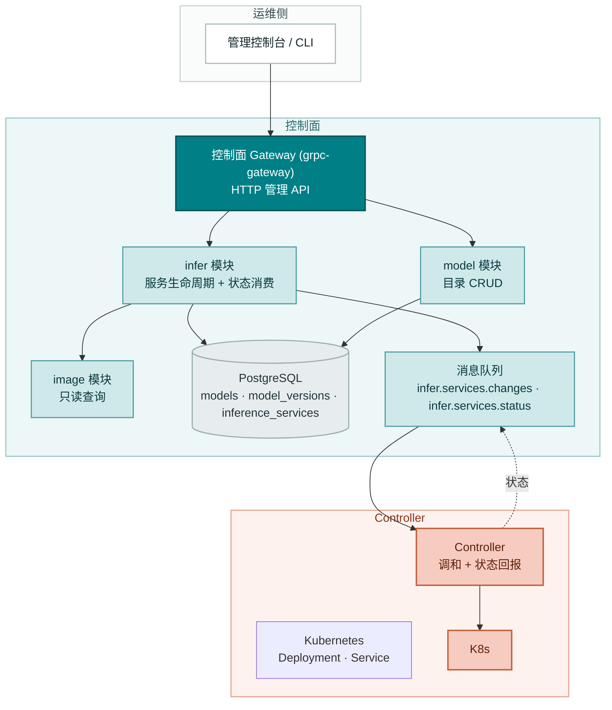
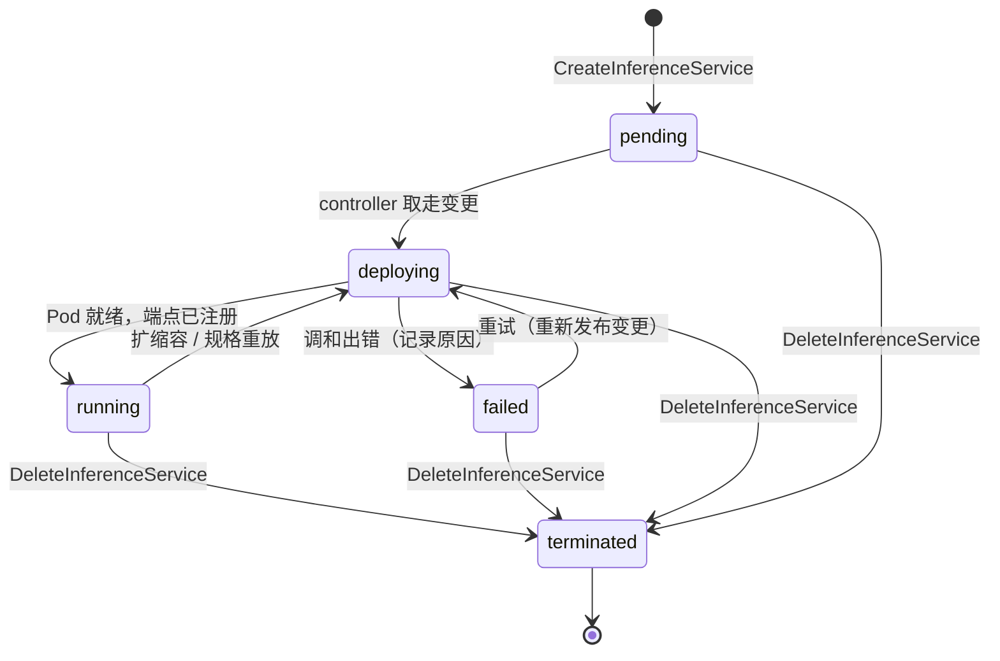
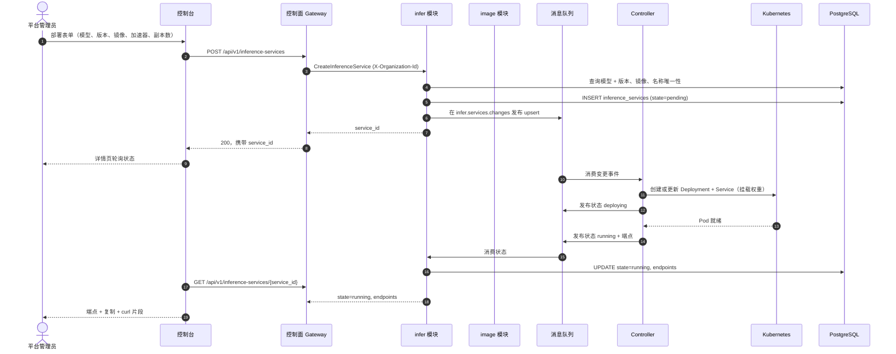
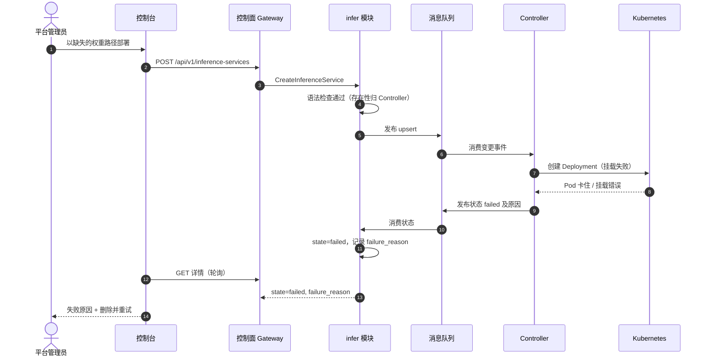
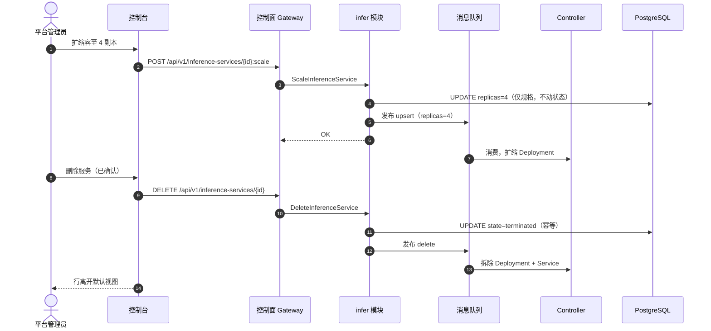

# 模型目录与一键部署 — 架构与详细设计

| 属性 | 内容 |
| --- | --- |
| 特性点 | 模型目录与一键部署（控制台 + API） |
| 文档范围 | `model` 目录与 `infer` 推理服务生命周期的架构与详细设计：组件职责、数据模型、API 契约、消息契约、Controller 调和、错误处理、配置、发布说明与分层函数级设计 |
| 归属模块 | `model`（目录与权重资产）、`infer`（推理服务生命周期）、`image`（只读镜像查询）、`controller`（Kubernetes 调和） |
| 相关文档 | [需求分析与 UI/UX 设计](../design/model-catalog-deployment.zh-cn.md) · [架构设计](../design/architecture.zh-cn.md) 第 2.2 节（`model`）、第 2.4 节（`infer`）、第 4.2 节（一键部署流程） · [API Key 管理架构](./api-key-management.zh-cn.md)（既有模式：Migrator 钩子、传输格式约定、过渡期组织隔离） |
| 状态 | 架构完成，已移交 Developer agent |

---

## 1. 目标与非目标

### 1.1 目标

- 实现 `taas.model.v1.ModelService` 的四个 RPC：`RegisterModel`、`ListModels`、`GetModel`、`DeleteModel` —— 部署表单的数据来源目录。
- 实现 `taas.infer.v1.InferServiceService` 的五个 RPC：`CreateInferenceService`、`ListInferenceServices`、`GetInferenceService`、`ScaleInferenceService`、`DeleteInferenceService` —— 一键部署生命周期。
- 发布前同步校验：未知模型/镜像、越界副本数、加速器不匹配、服务名重复，在**任何消息进入队列之前**被拒绝（AC5）。
- 经既有 `infer.services.changes` 主题的异步部署：创建调用在 2 秒内返回 `service_id` 与 `state=pending`（AC4），由 Controller 驱动 `pending → deploying → running / failed`。
- 状态回传闭环：Controller 通过新的 `infer.services.status` 主题把观测状态与端点回报给 `infer` 模块，使 `GetInferenceService` 在 `running` 时返回 `endpoints`（AC6）、在 `failed` 时返回人类可读原因（AC7）。
- 目录完整性：仍有非 terminated 推理服务引用模型时，`DeleteModel` 被阻止并点名阻塞服务（AC3）。
- 删除幂等、推理服务按组织隔离的列表（AC9）。
- 交付上述能力所需的 schema、配置与框架改动，精确到函数级职责，实现者无需猜测。

### 1.2 非目标

| 事项 | 去向 |
| --- | --- |
| 镜像注册 UI、镜像版本管理与完整镜像 × 卡型适配矩阵 | 特性 #3 镜像管理 |
| 镜像预拉取 / 预热编排（`TriggerWarmup` 已存在，controller 侧保持桩实现） | 特性 #3 |
| 按模型、按卡型计价展示 | 特性 #5 价格矩阵 |
| 租户级模型授权（哪些租户可部署哪些模型） | 特性 #6 多租户 |
| 自动扩缩容策略、灰度升级与蓝绿部署 | 未来特性点 |
| 推理网关把 `/v1/chat/completions` 路由到已部署服务 | 数据面轨道（架构第 3 节） |
| 会话派生的组织身份（本特性复用过渡期 `X-Organization-Id` 头） | 特性 #7 |
| 注册时的权重路径存在性校验 | 有意为之：Controller 在部署时核验，缺失路径以 `failed` 暴露原因（FR1.3、AC7） |

---

## 2. 组件视图



| 组件 | 在本特性中的职责 |
| --- | --- |
| 控制台 | 模型页（注册、列表、含版本的详情）、推理服务页（部署对话框、状态徽标、扩缩容、删除）、含端点与 curl 片段的服务详情 |
| 控制面 Gateway（`grpc-gateway`） | 九个 RPC 的 HTTP/JSON 门面；把过渡期 `X-Organization-Id` 头透传为 gRPC metadata（API Key 特性已建立） |
| `model` 模块（`services/model`） | 目录 RPC、名称+版本唯一性、权重路径语法校验、被引用时的删除保护 |
| `infer` 模块（`services/infer`） | 生命周期 RPC、同步校验（模型、镜像、副本数、加速器）、期望状态持久化、变更发布、状态消费、端点暴露 |
| `image` 模块（`services/image`） | 只读：`infer` 按 `image_id` 查询镜像以校验存在性与加速器兼容性。注册 UI 属特性 #3 |
| PostgreSQL | `models`、`model_versions`、`inference_services` 三张表 |
| 消息队列 | `infer.services.changes`（期望状态变更，Controller 消费）与新的 `infer.services.status`（观测状态，`infer` 消费） |
| Controller（`internal/controller`） | 解码变更事件、创建/更新/删除 Kubernetes Deployment 与 Service、在状态主题上回报观测状态与端点 |
| 推理网关 | 本特性**不涉及** —— 端点记录在控制面；数据面路由轨道稍后消费它们 |

---

## 3. 数据模型

### 3.1 `models` 表（目录身份）

| 列 | PostgreSQL 类型 | 约束 | 描述 |
| --- | --- | --- | --- |
| `id` | `uuid` | PRIMARY KEY | 服务端生成的 UUID v4，对外即 `model_id` |
| `name` | `varchar(128)` | NOT NULL, UNIQUE | 模型名称，1–128 字符（FR1.1） |
| `description` | `varchar(1024)` | NOT NULL DEFAULT '' | 自由文本描述，≤ 1024 字符 |
| `created_at` | `timestamptz` | NOT NULL | 首次注册时间（UTC） |
| `updated_at` | `timestamptz` | NOT NULL | 最近变更（注册新版本） |

设计说明：目录身份是**名称**；版本是 `model_versions` 中的独立行。`latest_version` 在读取时派生（按第 3.2 节排序规则取最大 `version`），不落库 —— 落库的 `latest_version` 列需要在每次注册时事务性更新，且可能与版本行漂移。

### 3.2 `model_versions` 表

| 列 | PostgreSQL 类型 | 约束 | 描述 |
| --- | --- | --- | --- |
| `id` | `uuid` | PRIMARY KEY | 服务端生成的 UUID v4 |
| `model_id` | `uuid` | NOT NULL, FK → `models.id` | 所属模型 |
| `version` | `varchar(64)` | NOT NULL | 版本串，1–64 字符（FR1.1） |
| `weight_path` | `varchar(512)` | NOT NULL | 对象存储路径，做语法校验（FR1.3） |
| `created_at` | `timestamptz` | NOT NULL | 注册时间（UTC） |

索引：

| 索引 | 定义 | 用途 |
| --- | --- | --- |
| 主键 | `(id)` | 版本身份 |
| 唯一 | `(model_id, version)` | 名称+版本冲突检测（FR1.2、AC1） |
| 复合 | `(model_id, created_at DESC)` | 版本列表，最新在前（AC2） |

版本排序：按 `created_at DESC, version DESC`（id 决胜）。「最新」即该排序的第一行。这避免为 `2024-09-11`、`v0.1-rc1` 这类版本串发明 semver 解析器，同时给出确定的最新在前列表（AC2）。

权重路径语法规则（FR1.3）：非空、≤ 512 字符、不含 `..` 段、不以 `/` 开头、不含反斜杠。MinIO/JuiceFS 中的存在性**不**在此校验 —— Controller 在部署时核验，缺失路径以该原因表现为 `failed` 部署（AC7）。

### 3.3 `inference_services` 表

| 列 | PostgreSQL 类型 | 约束 | 描述 |
| --- | --- | --- | --- |
| `id` | `uuid` | PRIMARY KEY | 服务端生成的 UUID v4，对外即 `service_id` |
| `organization_id` | `varchar(64)` | NOT NULL, 索引 | 所属组织（过渡期，与 API Key 相同） |
| `name` | `varchar(63)` | NOT NULL | DNS 安全的服务名，1–63 字符（FR3.1） |
| `model_id` | `uuid` | NOT NULL, FK → `models.id` | 部署的模型 |
| `model_version` | `varchar(64)` | NOT NULL | 钉住的版本（决策：绝不「latest」） |
| `image_id` | `uuid` | NOT NULL, FK → `images.id` | 引擎镜像 |
| `replicas` | `int` | NOT NULL | 期望副本数，1–100 |
| `accelerator` | `varchar(32)` | NOT NULL | `nvidia` / `iluvatar` / `metax` |
| `accelerator_type` | `varchar(64)` | NOT NULL | 卡型，如 `A800`、`BI-V150` |
| `state` | `varchar(16)` | NOT NULL DEFAULT 'pending' | `pending` / `deploying` / `running` / `failed` / `terminated` |
| `failure_reason` | `varchar(512)` | NULL | `state=failed` 时的人类可读原因（AC7） |
| `endpoints` | `jsonb` | NOT NULL DEFAULT '[]' | OpenAI 兼容 base URL，由 Controller 写入（AC6） |
| `created_at` | `timestamptz` | NOT NULL | 创建时间（UTC） |
| `updated_at` | `timestamptz` | NOT NULL | 最近状态变更 |

索引：

| 索引 | 定义 | 用途 |
| --- | --- | --- |
| 主键 | `(id)` | 服务身份 |
| 唯一 | `(organization_id, name)` | 组织内服务名重复拒绝（AC5） |
| 复合 | `(organization_id, updated_at DESC)` | 组织隔离、最新在前的分页列表 |
| 复合 | `(model_id)` where `state != 'terminated'` | 删除模型的引用检查（AC3） |

设计说明：

- **软终止**：删除置 `state=terminated`（Controller 随后拆除 Kubernetes 资源）；行保留用于审计与幂等重删（FR6.2、AC9）。默认列表视图过滤 `state != 'terminated'`。
- **`endpoints` 用 `jsonb`**：Controller 可能注册多个端点（按副本或按网关）；JSON 让 schema 保持灵活而无需联表。控制台只展示该列表（FR7.2）。
- **`failure_reason`**：由状态消费者从 Controller 的回报写入；同一服务下一次成功调和时清除。
- **暂无 `images` 表**：`image` 模块的持久化随特性 #3 交付。在那之前，`CreateInferenceService` 对 `image_id` 的校验基于 image 模块由配置种子的内存注册表（第 7 节）。FK 由特性 #3 的迁移添加；本设计把 `image_id` 保持为普通 `uuid` 列，使后续加 FK 是纯增量变更。

### 3.4 迁移说明

- 三张表均由启动时的 **GORM `AutoMigrate`** 经 API Key 特性建立的 `Migrator` 钩子创建（`pkg/server`，`Init` 调用的可选接口）。`model` 与 `infer` 各自为自有模型实现 `Migrate`；迁移失败则启动快速失败。
- GORM 模型是 schema 的**唯一事实来源**（与 API Key 特性同理：不存在两处描述漂移）。
- 演进只做增量。`images` FK（特性 #3）与组织 FK（特性 #6/#7）是未来的增量变更。

---

## 4. API 设计

### 4.1 RPC 面

九个 RPC 均已存在于 proto；本特性实现它们。无需 proto 变更。

| 服务 | RPC | HTTP | 用途 |
| --- | --- | --- | --- |
| `taas.model.v1` | `RegisterModel` | `POST /api/v1/models` | 注册模型版本 |
| `taas.model.v1` | `ListModels` | `GET /api/v1/models` | 分页目录列表 |
| `taas.model.v1` | `GetModel` | `GET /api/v1/models/{model_id}` | 含版本列表的详情 |
| `taas.model.v1` | `DeleteModel` | `DELETE /api/v1/models/{model_id}` | 移除目录条目（引用检查） |
| `taas.infer.v1` | `CreateInferenceService` | `POST /api/v1/inference-services` | 一键部署 |
| `taas.infer.v1` | `ListInferenceServices` | `GET /api/v1/inference-services` | 含状态的服务列表 |
| `taas.infer.v1` | `GetInferenceService` | `GET /api/v1/inference-services/{service_id}` | 含端点的详情 |
| `taas.infer.v1` | `ScaleInferenceService` | `POST /api/v1/inference-services/{service_id}:scale` | 仅改副本数 |
| `taas.infer.v1` | `DeleteInferenceService` | `DELETE /api/v1/inference-services/{service_id}` | 退役服务（幂等） |

### 4.2 传输格式（沿用既有约定）

- 分页以 `?page.offset=0&page.limit=20`（点号形式）绑定；裸 `offset`/`limit` 被静默忽略。默认 limit 20，上限 100（FR2.2）。
- 成功响应是 HTTP 200（grpc-gateway 对一元 RPC 的默认），包括创建。UI/UX 文档的「201 携带 service_id」修正为 200，与 API Key 特性的修正一致。
- 业务错误渲染为 `{"code": <int>, "message": "..."}`，超范围码的 HTTP 状态为 500（平台现状；HTTP 状态映射是平台级后续事项）。
- 过渡期 `X-Organization-Id` 头为列表与创建调用划定范围，与 API Key 特性完全一致。特性 #7 移除。

### 4.3 校验矩阵（同步，发布之前）

`CreateInferenceService` 依序执行以下检查；首个失败立即返回且**不发布任何消息**（AC5）：

| # | 检查 | 失败码 | 规范消息 |
| --- | --- | --- | --- |
| 1 | `name` 匹配 `^[a-z0-9]([a-z0-9-]{0,61}[a-z0-9])?$`（DNS 安全，1–63） | 10303 `CodeInferServiceStateInvalid` | inference service state invalid |
| 2 | `replicas` 在 1–100 | 10305 `CodeInferReplicasInvalid` | inference replicas invalid |
| 3 | `accelerator` 属于 {nvidia, iluvatar, metax} | 10306 `CodeInferEngineUnsupported` | inference engine unsupported |
| 4 | `model_id` 存在且 `model_version` 是其已注册版本 | 10101 `CodeModelNotFound` / 10103 `CodeModelVersionNotFound` | model not found / model version not found |
| 5 | `image_id` 存在（image 模块查询） | 10201 `CodeImageNotFound` | image not found |
| 6 | 镜像的 `accelerator` 等于请求的 `accelerator` | 10204 `CodeImageIncompatible` | image incompatible |
| 7 | 不存在同 `(organization_id, name)` 的非 terminated 服务 | 10302 `CodeInferServiceExists` | inference service exists |

`ScaleInferenceService` 校验：服务存在且非 `terminated`（10301）、`replicas` 在 1–100（10305）。`DeleteInferenceService` 校验：服务存在（10301）；已 terminated 视为成功（幂等，AC9）。`DeleteModel` 校验：模型存在（10101）；无非 terminated 推理服务引用（10101，detail 点名阻塞服务，AC3）。

### 4.4 状态机



- 封闭状态集恰为 `pending`、`deploying`、`running`、`failed`、`terminated`（契约约束 2）；控制台徽标依赖它（AC11）。
- `GetInferenceService` 仅在 `state=running` 时返回 `endpoints`；其余状态返回空列表（契约约束 3）。
- `failed` 可恢复：控制台的「删除并重试」即删除 + 预填创建（FR4.3）；重新发布的变更同样使 `failed → deploying`。

---

## 4.5 消息契约

### 4.5.1 期望状态变更（`infer.services.changes`）

由 `infer` 在期望状态持久化之后发布。JSON 体：

```json
{
  "event_type": "upsert" | "delete",
  "service_id": "uuid",
  "organization_id": "org",
  "name": "qwen25-32b-a800",
  "model": {"model_id": "uuid", "version": "Qwen2.5-32B-Instruct", "weight_path": "models/qwen2.5-32b/"},
  "image": {"image_id": "uuid", "reference": "ghcr.io/go-taas/vllm:v0.6.3", "engine": "vllm"},
  "replicas": 2,
  "accelerator": "nvidia",
  "accelerator_type": "A800",
  "published_at": "2026-09-22T10:00:00Z"
}
```

Headers：`event_type`（与体字段重复，便于 broker 侧路由/调试）、`service_id`。Controller 的处理幂等：`upsert` 创建或更新 Deployment/Service 至期望状态；`delete` 拆除它们。消息携带**已解析**的模型权重路径与镜像引用，Controller 无需回查数据库。

### 4.5.2 状态回报（`infer.services.status`，新主题）

由 Controller 在每次调和尝试后发布。JSON 体：

```json
{
  "service_id": "uuid",
  "state": "deploying" | "running" | "failed",
  "endpoints": ["https://infer.example.com/v1"],
  "failure_reason": "weight path models/qwen2.5-32b/ not found in object storage",
  "reported_at": "2026-09-22T10:03:41Z"
}
```

`infer` 消费该主题并更新 `state`、`endpoints`、`failure_reason`、`updated_at`。消费者是注册到 server 的 `Runner`（第 10.4 节）。`pending` 永不被回报 —— 它是数据库初始状态；`terminated` 由删除 RPC 置位，而非 Controller。

主题注册：`mq.Subjects` 在 `DefaultSubjects()` 中新增 `InferServiceStatus: "infer.services.status"`。Controller 订阅 `InferServiceChanges`（已接线）并发布到 `InferServiceStatus`；`infer` 订阅 `InferServiceStatus` 并发布到 `InferServiceChanges`。两侧都使用既有 `mq.Client` 接口；测试用 `mq.NewFake()`。

---

## 5. 时序图

### 5.1 一键部署（正常路径）



### 5.2 失败部署（故障注入，AC7）



### 5.3 扩缩容与删除



---

## 6. 错误处理

所有错误都是统一信封中的 `pkg/errors` 业务码。码已存在于 `pkg/errors/codes.go` —— 无需新增。

| 条件 | 码 | 常量 | 说明 |
| --- | --- | --- | --- |
| `name` 非 DNS 安全 / 1–63 字符 | 10303 | `CodeInferServiceStateInvalid` | Detail: "name must be DNS-safe, 1-63 characters" |
| `replicas` 越界 1–100（创建或扩缩） | 10305 | `CodeInferReplicasInvalid` | Detail: "replicas must be between 1 and 100" |
| `accelerator` 不在支持集合 | 10306 | `CodeInferEngineUnsupported` | Detail 列出支持集合 |
| 未知 `model_id` / `model_version` | 10101 / 10103 | `CodeModelNotFound` / `CodeModelVersionNotFound` | |
| 未知 `image_id` | 10201 | `CodeImageNotFound` | |
| 镜像加速器不匹配 | 10204 | `CodeImageIncompatible` | Detail: "image accelerator <x> does not match request accelerator <y>" |
| 组织内服务名重复 | 10302 | `CodeInferServiceExists` | 仅统计非 terminated 服务 |
| 服务不存在（get/scale/delete） | 10301 | `CodeInferServiceNotFound` | 跨组织访问表现一致（无存在性泄露） |
| 对 terminated 服务扩缩 | 10303 | `CodeInferServiceStateInvalid` | Detail: "cannot scale a terminated service" |
| 删除被在线服务引用的模型 | 10101 | `CodeModelNotFound` | Detail 点名阻塞服务（AC3） |
| 注册重复名称+版本 | 10102 | `CodeModelExists` | AC1 |
| 权重路径语法非法 | 10104 | `CodeModelPathInvalid` | FR1.3 |
| 缺失 `X-Organization-Id` | 10001 | `CodeUnauthorized` | 过渡期（与 API Key 相同） |
| 数据库 / MQ 基础设施故障 | 500 | `CodeInternal` | 经错误归一化 |

Controller 侧失败不是 RPC 错误：它们经状态主题表现为 `state=failed` + `failure_reason`（AC7）。状态发布失败记日志并随下次调和重试；服务停留在最后已知状态（绝不静默变 `running`）。

---

## 7. 配置新增

```yaml
infer:
  endpointBaseURL: "https://infer.example.com"   # Controller 记录端点的 base
  statusConsumer:
    enabled: true
    workers: 2
```

| 键 | 默认值 | 描述 |
| --- | --- | --- |
| `infer.endpointBaseURL` | `""` | Controller 组合端点 URL（`<base>/v1`）的 base。为空表示 Controller 记录集群内 Service DNS 名。 |
| `infer.statusConsumer.enabled` | `true` | 状态消费者 Runner 的开关（事故排查时可关停）。 |
| `infer.statusConsumer.workers` | `2` | 并发状态处理器数。 |

规则（与 API Key 特性相同）：

- 该节同时写入 **`configs/config.yaml` 与 `configs/server.yaml`**（每个二进制的配置 glob 必须看到相同键）。controller 二进制额外在 `configs/controller.yaml` 获得 `infer.endpointBaseURL`（它组合端点）。
- 零值在使用处回退到出厂默认；`Configuration.Validate` 拒绝负的 workers。
- 镜像注册表种子（特性 #3 之前）：`configs/server.yaml` 新增 `image.registry` 列表（image_id、name、tag、accelerator、engine），image 模块启动时加载。这是过渡方案，特性 #3 用 `images` 表替换。

---

## 8. 安全考量

- **组织隔离是过渡期且可伪造**（`X-Organization-Id`），与 API Key 特性现状一致；管理 API 今天实际上未认证。本特性不扩大该暴露，控制台是唯一预期调用方。特性 #7 移除。
- **消息不含秘密**：变更与状态消息只携带资源规格与 URL —— 无凭据、无 API Key。
- **权重路径穿越**：注册拒绝 `..` 段、前导 `/` 与反斜杠（FR1.3），恶意路径无法在挂载时逃出对象存储前缀。
- **DNS 安全名称**：服务名校验为 DNS 安全，Controller 可直接用作 Kubernetes 资源名而无注入风险。
- **Controller 权限**：controller 的 ServiceAccount 只需平台命名空间内的 Deployment/Service CRUD —— 无 cluster-admin、无 secret 读。
- **端点披露**：端点是组织隔离数据，仅经隔离 API 返回；对其他组织服务的 `GetInferenceService` 返回 10301（无存在性泄露）。

---

## 9. 发布说明

- **Schema**：首次启动经 AutoMigrate 新建三张表；纯增量，无存量数据。
- **配置**：`infer` 节与过渡期 `image.registry` 种子写入 `configs/config.yaml`、`configs/server.yaml`，以及（`endpointBaseURL`）`configs/controller.yaml`。没有该节的自定义配置继续工作（零值默认）。
- **Proto**：无变更 —— 九个 RPC 与消息均已存在；无需 `make pbgen`。
- **新主题**：`infer.services.status` 是增量；broker 按主题（NATS）无需迁移。共享 broker 的环境靠既有 namespace 前缀保持隔离。
- **Controller**：调和实现替换现有 TODO 桩，位于既有 `Reconciler` 接口之后 —— 签名不变，基于 fake 的测试继续有效。
- **滚动更新顺序**：先部署 `taas-server`（开始发布变更并消费状态），再部署 controller。反序也安全：controller 忽略无发布者的主题。
- **特性开关**：无需 —— RPC 是新实现的；无既有行为变更。

---

## 10. 详细设计

### 10.1 文件布局

| 模块 | 文件 | 内容 |
| --- | --- | --- |
| `services/model` | `model_model.go` | GORM 模型 `Model`、`Version` + `TableName` |
| | `model_repository.go` | `ModelRepository` |
| | `service.go` | RPC 实现 |
| `services/infer` | `infer_model.go` | GORM 模型 `InferenceService` + `TableName` |
| | `infer_repository.go` | `InferenceServiceRepository` |
| | `change_publisher.go` | 变更事件构造 + 发布 |
| | `status_consumer.go` | 状态主题消费者（Runner） |
| | `service.go` | RPC 实现 |
| `services/image` | `registry.go` | 过渡期内存注册表（配置种子）+ 查询 |
| `internal/controller` | `reconciler.go` | K8s 调和：Deployment/Service upsert + 状态发布 |
| `pkg/mq` | `mq.go` | 新增 `InferServiceStatus` 主题 |
| `pkg/config` | `api.go` | `InferConfig`、`ImageRegistryConfig` 结构体 + Validate 规则 |

### 10.2 `model` 模块

GORM 模型（唯一事实来源）：

```go
type Model struct {
    ID          string    `gorm:"primaryKey;type:uuid"`
    Name        string    `gorm:"size:128;not null;uniqueIndex"`
    Description string    `gorm:"size:1024;not null;default:''"`
    CreatedAt   time.Time
    UpdatedAt   time.Time
}

type Version struct {
    ID         string    `gorm:"primaryKey;type:uuid"`
    ModelID    string    `gorm:"type:uuid;not null;uniqueIndex:idx_model_versions_model_version,priority:1"`
    Version    string    `gorm:"size:64;not null;uniqueIndex:idx_model_versions_model_version,priority:2;index:idx_model_versions_model_created,priority:2,sort:DESC"`
    WeightPath string    `gorm:"size:512;not null"`
    CreatedAt  time.Time `gorm:"index:idx_model_versions_model_created,priority:1"`
}
```

`ModelRepository`（嵌入 `database.BaseRepository[T]`）：

- `CreateModel(ctx, m *Model) error` —— 插入；`name` 唯一冲突映射为 `CodeModelExists`。
- `FindByName(ctx, name string) (*Model, error)` —— 未命中 → `CodeModelNotFound`。
- `ListModels(ctx, offset, limit int) ([]*Model, int64, error)` —— 分页，`created_at DESC`；总数供 `page_meta`。
- `GetModel(ctx, id string) (*Model, error)` —— 未命中 → `CodeModelNotFound`。
- `CreateVersion(ctx, v *Version) error` —— 插入；`(model_id, version)` 唯一冲突映射为 `CodeModelExists`（AC1）。
- `ListVersionsByModel(ctx, modelID string) ([]*Version, error)` —— `created_at DESC, version DESC`（AC2）。
- `FindVersion(ctx, modelID, version string) (*Version, error)` —— 未命中 → `CodeModelVersionNotFound`；供 `infer` 校验使用。
- `DeleteModel(ctx, id string) error` —— 硬删模型行（版本经 FK `ON DELETE CASCADE` 级联）。

服务 RPC（`service.go`）：

- `RegisterModel`：修剪输入；校验 name 1–128、version 1–64、权重路径语法（10104）；`FindByName` —— 未命中 → 单个 `WithinTx` 内创建模型 + 首版本；命中 → `FindVersion` —— 未命中 → 追加版本（更新 `models.updated_at`）；命中 → `CodeModelExists`（AC1）。响应 `{model_id}`（模型 id，跨版本稳定）。
- `ListModels`：归一化分页（默认 20，上限 100）；把行映射为 `ModelSummary{model_id, name, latest_version, weight_path, created_at}`，其中 `latest_version` 及其 `weight_path` 取自 `ListVersionsByModel` 的第一行（目录规模下每页行一次查询可接受；联表单查是文档化的优化 TODO）。
- `GetModel`：模型 + 完整版本列表（AC2）；`versions` 是排序后的版本串列表。
- `DeleteModel`：引用检查 —— `infer` 仓库 `CountByModelID(ctx, modelID, excludeTerminated=true)`；> 0 → 10101，detail "referenced by inference service <name>"（AC3）；否则单个 `WithinTx` 内删除模型 + 版本。

跨模块依赖：`model` 通过窄接口暴露 `FindVersion`，由 `infer` 消费（第 10.3 节）。依赖是包级的（`infer` 导入 `model`），与平台既有 `pkg/*` 共享方式一致；更大的服务注册表重构属特性 #6 范围。

### 10.3 `infer` 模块

GORM 模型：

```go
type InferenceService struct {
    ID              string    `gorm:"primaryKey;type:uuid"`
    OrganizationID  string    `gorm:"size:64;not null;uniqueIndex:idx_infer_services_org_name,priority:1;index:idx_infer_services_org_updated,priority:1"`
    Name            string    `gorm:"size:63;not null;uniqueIndex:idx_infer_services_org_name,priority:2"`
    ModelID         string    `gorm:"type:uuid;not null"`
    ModelVersion    string    `gorm:"size:64;not null"`
    ImageID         string    `gorm:"type:uuid;not null"`
    Replicas        int       `gorm:"not null"`
    Accelerator     string    `gorm:"size:32;not null"`
    AcceleratorType string    `gorm:"size:64;not null"`
    State           string    `gorm:"size:16;not null;default:'pending'"`
    FailureReason   *string   `gorm:"size:512"`
    Endpoints       datatypes.JSON `gorm:"type:jsonb;not null;default:'[]'"`
    CreatedAt       time.Time
    UpdatedAt       time.Time `gorm:"index:idx_infer_services_org_updated,priority:2,sort:DESC"`
}
```

`InferenceServiceRepository`：

- `Create(ctx, svc *InferenceService) error` —— `(organization_id, name)` 唯一冲突映射为 `CodeInferServiceExists`。
- `FindByIDAndOrganization(ctx, orgID, serviceID string) (*InferenceService, error)` —— 未命中 → `CodeInferServiceNotFound`（无跨组织泄露）。
- `ListByOrganization(ctx, orgID string, offset, limit int, includeTerminated bool) ([]*InferenceService, int64, error)` —— 分页，`updated_at DESC`；默认排除 `terminated`（AC9）。
- `UpdateReplicas(ctx, orgID, serviceID string, replicas int) error` —— 仅规格更新。
- `MarkTerminated(ctx, orgID, serviceID string) error` —— 置 `state=terminated`；幂等（已 terminated 是无操作成功）。
- `ApplyStatus(ctx, serviceID string, state string, endpoints []string, failureReason *string) error` —— 供状态消费者使用；按 `reported_at` 最后写入者胜出可接受（Controller 是唯一发布者）。
- `CountByModelID(ctx, modelID string, excludeTerminated bool) (int64, error)` —— 删除模型的引用检查。

`change_publisher.go`：

- `buildChangeEvent(svc *InferenceService, model *model.Version, image *image.Summary, eventType string) []byte` —— 第 4.5.1 节的 JSON。
- `publishChange(ctx, svc mq.Client, evt changeEvent) error` —— `Publish(ctx, subjects.InferServiceChanges, body, headers)`；出错时 RPC 在**回滚期望状态插入之后**返回 `CodeInternal`（先发布后提交 + 补偿删除，保持「已发布 ⇒ 已持久化」不变式；更简单的替代 —— 在数据库事务内发布 —— 被否决，因为提交失败会留下无支撑的消息）。

`status_consumer.go`：

- `StatusConsumer` 实现 `server.Runner`：`Run(ctx)` 订阅 `subjects.InferServiceStatus` 并经 `ApplyStatus` 应用每份回报。解析错误记日志并跳过（不重试 —— 畸形回报不会变好）。未知 `service_id` 记日志并跳过（已删除服务的迟到回报）。
- 构造：`NewStatusConsumer(mqClient mq.Client, repo *InferenceServiceRepository, workers int)`。在 `apps/taas-server/main.go` 经 `srv.AddRunner(...)` 注册。

服务 RPC（`service.go`）：

- `CreateInferenceService`：解析组织（metadata，与 API Key 特性相同）；执行校验矩阵（第 4.3 节）—— 模型/版本经 `model.FindVersion`，镜像经 `image.Lookup`；以 `state=pending` 插入；发布变更事件；响应 `{service_id}`（AC4、AC5）。
- `ListInferenceServices`：组织隔离分页列表；映射为 `InferenceServiceSummary`（state、updated_at 为 unix）。
- `GetInferenceService`：隔离取数；仅 `state=running` 时返回 `endpoints`（契约约束 3）。
- `ScaleInferenceService`：隔离取数；terminated → 10303；校验 replicas（10305）；`UpdateReplicas`；以新规格发布 `upsert`（AC8）。
- `DeleteInferenceService`：隔离取数；未命中 → 10301；已 terminated → 成功；否则 `MarkTerminated` + 发布 `delete`（AC9）。

### 10.4 框架触点

1. **`mq.Subjects`**（`pkg/mq/mq.go`）：新增 `InferServiceStatus string` + `DefaultSubjects()` 条目 `"infer.services.status"`。增量；既有主题不变。
2. **`Runner` 注册**（`apps/taas-server/main.go`）：构造 `infer` 服务的 `StatusConsumer` 并 `srv.AddRunner`。框架随 server 启动 Runner 并在关停时取消（既有行为）。
3. **`Migrator` 钩子**（API Key 特性已建立）：`model` 与 `infer` 以各自的 AutoMigrate 调用实现 `Migrate(ctx)`。
4. **配置**（`pkg/config/api.go`）：`InferConfig{EndpointBaseURL string, StatusConsumer struct{ Enabled bool, Workers int } }` 与 `ImageRegistryConfig`（过渡期种子列表）；`Validate` 拒绝负 workers。
5. **Controller 接线**（`apps/controller/main.go`）：不变 —— 变的是调和实现，构造路径保持。

### 10.5 Controller 调和（`internal/controller/reconciler.go`）

`ApplyInferServiceChange(ctx, msg)`：

1. 解码变更事件（第 4.5.1 节）；畸形 → 日志 + `mq.Permanent`（永不重试）。
2. `delete` → 删除 Deployment 与 Service（忽略 not-found），无需发布 `terminated` 状态（RPC 已置位）；返回。
3. `upsert` → 发布状态 `deploying`；构建 Deployment（镜像引用、副本数、来自 `model.weight_path` 的权重卷挂载、来自 `accelerator`/`accelerator_type` 的加速器节点选择器）与 Service；经 `k8s.Client` 对二者 create-or-update；出错 → 发布状态 `failed` 及原因（AC7），不可重试错误（如权重路径缺失）返回 `mq.Permanent`，瞬时错误返回普通 error（broker 级重试）。
4. 监视 Pod 就绪：controller 以有界间隔轮询 Deployment 的 ready-replicas（既有 clientset）；就绪 → 发布状态 `running`，端点由 `infer.endpointBaseURL`（或集群内 Service DNS 名）组合。

`ApplyImageWarmup` 保持桩（特性 #3）。

调和幂等：所有 Kubernetes 操作都是 create-or-update；同一变更的重复投递收敛到同一期望状态。

### 10.6 控制台（不在本仓库范围，契约摘要）

控制台是独立交付物；本设计钉住其契约：五状态徽标集（AC11）、部署表单字段及其镜像第 4.3 节的客户端校验、按加速器过滤的镜像下拉（AC10）、存在 `pending`/`deploying` 服务时 10 秒轮询（AC12）、端点只展示 API 返回内容（FR7.2）、curl 片段形状 `curl <endpoint>/v1/chat/completions -H "Authorization: Bearer <API_KEY>"`。

---

## 11. 验收标准覆盖

| AC | 由何处覆盖 | 验证钩子 |
| --- | --- | --- |
| AC1 — 注册 + 冲突 | 第 10.2 节 `RegisterModel`、唯一索引 `(model_id, version)` | 单元 + FVT |
| AC2 — 含排序版本的详情 | 第 10.2 节 `GetModel`、`ListVersionsByModel` 排序 | 单元 + FVT |
| AC3 — 删除模型引用检查 | 第 10.2 节 `DeleteModel` + `CountByModelID` | 单元 + FVT |
| AC4 — 创建立即返回 | 第 10.3 节 `CreateInferenceService`（插入 + 发布，无 K8s 调用） | FVT 时延上界 < 2 秒 |
| AC5 — 发布前校验 | 第 4.3 节校验矩阵、先提交后发布 | 单元（fake MQ 断言零发布）+ FVT |
| AC6 — pending → deploying → running 及端点 | 第 4.5.2、10.5 节 | fake controller 的 FVT + E2E |
| AC7 — 带原因的 failed | 第 5.2、10.5 节第 3 步 | FVT 故障注入 |
| AC8 — 扩缩容仅改副本数 | 第 10.3 节 `ScaleInferenceService` | 单元 + FVT |
| AC9 — 幂等删除、terminated 隐藏 | 第 10.3 节 `DeleteInferenceService`、`ListByOrganization` 过滤 | 单元 + FVT |
| AC10 — 镜像下拉过滤 | 第 10.6 节控制台契约、`ListImages` accelerator 字段 | E2E |
| AC11 — 五状态徽标集 | 第 4.4 节封闭状态集 | 手动 / E2E |
| AC12 — 10 秒轮询 | 第 10.6 节控制台契约 | 手动 / E2E |

---

## 12. 遗留事项

| 事项 | 去向 |
| --- | --- |
| `images` 表 + `inference_services.image_id` 的 FK | 特性 #3 |
| 镜像注册 UI 与预热编排 | 特性 #3 |
| 目录与部署表单中的按模型/卡型计价 | 特性 #5 |
| 租户级模型授权 | 特性 #6 |
| 会话派生组织身份（移除 `X-Organization-Id`） | 特性 #7 |
| 自动扩缩容、灰度、蓝绿 | 未来特性点 |
| 联表单查 `ListModels`（避免逐行版本查询） | 优化 TODO，视目录规模 |
| 网关中业务码 → HTTP 状态映射 | 平台级后续事项 |
