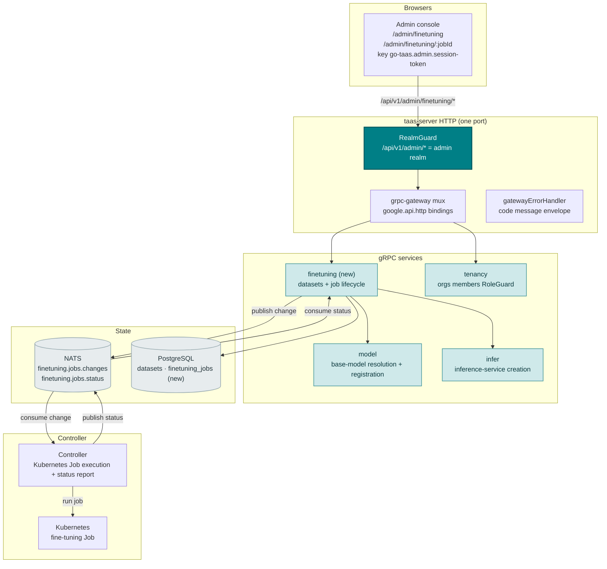
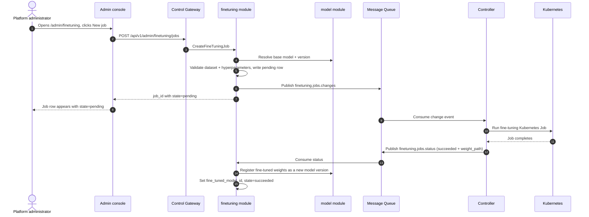
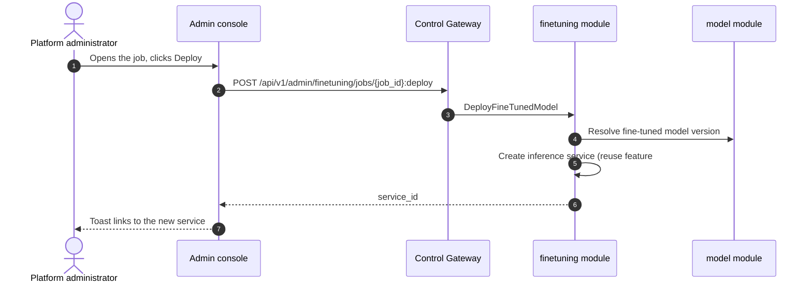

# Model Fine-Tuning Management — Architecture and Detailed Design

| Attribute | Content |
| --- | --- |
| Feature point | Model fine-tuning management — create, monitor, and deploy fine-tuning jobs (dataset, base model, hyperparameters, job status, deploy fine-tuned model) (backlog row 39) |
| Document scope | Architecture and detailed design for feature-39: a new `finetuning` module owning the dataset registry and the fine-tuning job lifecycle; the `taas.finetuning.v1.FineTuningService` proto with six RPCs; the `datasets` and `finetuning_jobs` tables; the Controller's Kubernetes-Job execution and status reporting; the admin Fine-tuning pages (`/admin/finetuning`, `/admin/finetuning/:jobId`); plus error handling, configuration, security, rollout, and function-level design per layer |
| Owning modules | New `finetuning` module (`services/finetuning`): the dataset registry and the fine-tuning job lifecycle; `model` (read-only: base-model resolution and fine-tuned-model registration); `infer` (read-only: deploy the fine-tuned model as an inference service); `controller` (read-only: run the fine-tuning job as a Kubernetes Job and report status); `pkg/server` gateway (admin-prefix bindings); `web` admin console (`FineTuningPage`, `FineTuningJobDetailPage`) |
| Related documents | [Requirement Analysis and UI/UX Design](../design/model-finetuning.md) · [Architecture Design](../design/architecture.md) §2.2 (`model`), §2.4 (`infer`), §2.7 Controller, §4.2 one-click deployment flow · [Model Catalog & One-Click Deployment](./model-catalog-deployment.md) (the `model_versions` table, the `weight_path` object-storage convention, and the Controller's async reconcile pattern) · [Model Versioning & Rollback](./model-versioning.md) (the version-history and activation conventions this feature's deploy step reuses) · [Image Management](./image-management.md) (the artifact/object-storage conventions and the async-task status pattern) · [Console Surface Separation](./console-surface-separation.md) (the two surfaces, the `AdminShell` conventions, the masked-projection rule) |
| Status | Architecture complete, handed to the Developer agent |

---

## 1. Overview and Goals

go-taas registers model versions (`model_versions` rows with a `weight_path` into object storage) and deploys them as inference services (model-catalog-deployment §4.2). What the console still cannot do is *create a custom model*: a tenant or operator who wants a model adapted to their data — a fine-tuned variant of a base model — has no way to submit a dataset, run a training job, and deploy the result. The operator must leave the platform, run a training job against the base model's weights, upload the result to object storage, register it as a new model version, and deploy it — an operator-orchestration escape hatch the console should own.

This feature adds **model fine-tuning management**: create, monitor, and deploy fine-tuning jobs — a dataset, a base model, hyperparameters, job status, and a deploy step that registers the fine-tuned weights as a new model version and deploys it as an inference service. It is the smallest independently valuable increment of Phase 4's model-lifecycle roadmap item: it turns "I want a model adapted to my data" into "submit a dataset and hyperparameters, watch the job run, and deploy the fine-tuned model from the console".

**Goals**: a new `finetuning` module owning the dataset registry and the fine-tuning job lifecycle; the `datasets` and `finetuning_jobs` tables; a `taas.finetuning.v1.FineTuningService` with six RPCs (`RegisterFineTuningDataset`, `ListFineTuningDatasets`, `CreateFineTuningJob`, `ListFineTuningJobs`, `GetFineTuningJob`, `DeployFineTunedModel`); the Controller running the job as a Kubernetes Job and reporting status through the MQ; the admin Fine-tuning pages (`/admin/finetuning`, `/admin/finetuning/:jobId`); new error codes in a finetuning block (123xx); the page → route → API-prefix table with the exact admin prefix; per-page interactive states including empty, error, and permission-denied; and numbered acceptance criteria testable in Nightwatch against the compose stack.

**Non-goals** (deferred, design §8): the model catalog and one-click deployment form (#2); model versioning & rollback (#32); image management (#3); the training algorithm itself (the Controller runs a curated fine-tuning image; the algorithm is out of scope); dataset editing or preview (a dataset is registered once and referenced); a user-realm fine-tuning surface (deliberately absent, D1).

### 1.1 Reading order of this document

Section 2 records the architecture decisions (AD1–AD11, mirroring the design's D1–D11). Sections 3–5 are the component view, data model, and API design. Section 6 is the frontend architecture (page → route → API-prefix table, auth guard). Sections 7–8 are the sequence flows and error handling. Sections 9–11 are configuration, security, and rollout. Sections 12–14 are the acceptance-criteria traceability, the function-level detailed design, and the ordered implementation task list.

---

## 2. Architecture Decisions

| # | Decision | Rationale |
| --- | --- | --- |
| AD1 | **Fine-tuning management lives on the admin surface only**: `/admin/finetuning` + `/admin/finetuning/:jobId` + `/api/v1/admin/finetuning/*`. There is **no end-user surface** — fine-tuning is operator-orchestration (feature #17's masked-projection rule); tenants consume the deployed fine-tuned model through the gateway, not the training flow | Design D1. Fine-tuning is operator-orchestration (creating custom models); tenants consume models, not training jobs. Consistent with the admin-only model versioning (feature #32) and accelerator inventory (feature #18) |
| AD2 | **A new `finetuning` module** (`services/finetuning`) owns the dataset registry and the fine-tuning job lifecycle, with its own error block **123xx**. It reuses the model module for base-model resolution and fine-tuned-model registration, and the infer module for deployment | Design D2. Fine-tuning is a distinct concern (custom-model creation) with its own datasets and jobs; a dedicated module keeps it separate from the model catalog and gives it one home, matching the per-feature-module pattern |
| AD3 | **A new `datasets` table** stores registered datasets: `dataset_id`, `name`, `format` (`jsonl` / `csv`), `object_path` (object-storage path, same syntax rules as `weight_path`), `created_at`. A dataset is registered once and reused across jobs | Design D3. A dataset is a first-class, reusable input (OpenAI, Together); a registry avoids re-uploading the same data per job and gives the create form a dataset selector |
| AD4 | **A new `finetuning_jobs` table** stores the job lifecycle: `job_id`, `name`, `base_model_id`, `base_model_version`, `dataset_id`, `hyperparameters` (jsonb: `epochs`, `batch_size`, `learning_rate`), `state` (`pending` / `running` / `succeeded` / `failed`), `failure_reason`, `fine_tuned_model_id` (set on success), `created_at`, `updated_at` | Design D4. The job lifecycle is the async-task pattern (image-management D8); the table persists the job and its result so the detail page can show status and the deploy step can reference the fine-tuned model |
| AD5 | **A new `CreateFineTuningJob` RPC** validates the dataset and base model, writes a `pending` job row, and publishes a change event to a new `finetuning.jobs.changes` MQ subject for the Controller to run as a Kubernetes Job. It returns `job_id` with `state=pending` immediately | Design D5. Mirrors the one-click deployment async pattern (model-catalog-deployment §5.1): the create call returns fast, and the Controller drives `pending → running → succeeded / failed` |
| AD6 | **The Controller runs the fine-tuning job as a Kubernetes Job** and reports status back through a new `finetuning.jobs.status` MQ subject. On success it writes the fine-tuned weights to object storage and reports the resulting `weight_path`; the `finetuning` module registers it as a new model version (via the model module) and sets `fine_tuned_model_id` | Design D6. The Controller is the only component with a Kubernetes client (service-logs AD2, accelerator AD1); running the job as a Kubernetes Job and reporting status mirrors the deployment reconcile pattern. Registering the result as a real model version keeps the fine-tuned model in the model lifecycle |
| AD7 | **A new `ListFineTuningJobs` RPC** returns the job list with per-job metadata (name, base model, dataset, state, fine-tuned model, created/updated). A new `GetFineTuningJob` RPC returns the full job detail including hyperparameters and failure reason | Design D7. The list page needs a scannable job table; the detail page needs the full job record. Two RPCs mirror the model list/detail split |
| AD8 | **A new `DeployFineTunedModel` RPC** deploys a succeeded job's fine-tuned model as an inference service: it resolves the fine-tuned model version, then calls the existing inference-service create path (feature #2) with the fine-tuned model and a chosen image/accelerator/replica count. It returns the new `service_id` | Design D8. "Deploy fine-tuned model" means the fine-tuned weights serve through the normal inference path; reusing the existing create path keeps the deploy step consistent with one-click deployment |
| AD9 | **The deploy step is available only on a `succeeded` job**; a job in any other state shows the deploy action disabled with a hint. Deploying is idempotent per job (a job already deployed shows the existing service link) | Design D9. You cannot deploy a model that has not finished training; the idempotency guard prevents duplicate services from repeated clicks |
| AD10 | **New error codes in a finetuning block (12301–12399)**: **12301 `CodeFineTuningJobNotFound`**, **12302 `CodeFineTuningJobStateInvalid`**, **12303 `CodeFineTuningDatasetNotFound`**, **12304 `CodeFineTuningDatasetInvalid`**, **12305 `CodeFineTuningHyperparametersInvalid`**. Unknown base model reuses **10101**; unknown base-model version reuses **10103**; unknown image reuses **10201** | Design D10. Fine-tuning is a new module (AD2), so its codes live in a fresh block after the docs block (122xx); distinct codes keep each failure mode actionable while the model/image contracts stay uniform |
| AD11 | **The pages are read-only except for the create and deploy actions** — the create form and the deploy action write; everything else (list, detail, status) is read-only and audited only for access | Design D11. The feature's writes are the create and deploy actions; the audit trail (feature #15) covers them. No new audit events are needed beyond the existing write paths |

---

## 3. Component View

### 3.1 Ownership

| Layer / component | Owns | Changes in this feature |
| --- | --- | --- |
| **Control Gateway (`grpc-gateway`)** | HTTP/JSON facade for the six fine-tuning RPCs; realm guard (feature #17) already rejects a wrong-realm session with 10038; passes `X-Organization-Id` through as gRPC metadata | New bindings for the six HTTP fine-tuning RPCs (Section 5); no change to the realm guard |
| **`finetuning` module (`services/finetuning`)** | The dataset registry, the fine-tuning job lifecycle, the six RPCs, the change-event publication, the status consumption, the fine-tuned-model registration | **New module** (AD2) |
| **`model` module** | Base-model resolution, fine-tuned-model registration | Read-only: the finetuning module resolves base models and registers fine-tuned models via the model module (AD2, AD6) |
| **`infer` module** | Inference-service creation | Read-only: the finetuning module calls the existing inference-service create path to deploy the fine-tuned model (AD8) |
| **`controller`** | Runs the fine-tuning job as a Kubernetes Job, writes the fine-tuned weights to object storage, reports status | Read/write: the Controller consumes `finetuning.jobs.changes` and publishes `finetuning.jobs.status` (AD6) |
| **`tenancy` module** | Organizations, members, roles, RoleGuard | Read-only: `RoleGuard` gates the admin fine-tuning RPCs by the caller's role (10036) |
| **PostgreSQL** | `datasets`, `finetuning_jobs` (new) | Two new tables via AutoMigrate (Section 4) |
| **Message Queue** | `finetuning.jobs.changes`, `finetuning.jobs.status` (new) | Two new subjects (AD5, AD6) |
| **Console** | Admin Fine-tuning pages | Two new pages on the admin surface (Section 6) |

### 3.2 Runtime component view



### 3.3 Request identity chain

The fine-tuning RPCs are **admin-surface** (AD1). The chain is:

1. `RealmGuard` (HTTP, `pkg/server/realm.go`) — path prefix `/api/v1/admin/finetuning/*` decides the expected realm `admin`. With no `Authorization` header: pass through (transitional, feature-17 AD4). With a header: resolve the session realm from Redis; mismatch → 10038, unknown/expired/realm-less → 10027.
2. grpc-gateway mux — routes by the annotated path and forwards `authorization` and `x-organization-id`.
3. `finetuning` handler — resolves the caller's role via `tenancy.RoleGuard` (10036). The fine-tuning RPCs are admin-only (AD1); there is no user binding.
4. `tenancy.RoleGuard` — gates the admin fine-tuning RPCs by the caller's role (10036).

---

## 4. Data Model

### 4.1 The `datasets` Table

| Column | PostgreSQL type | Constraints | Description |
| --- | --- | --- | --- |
| `id` | `uuid` | PRIMARY KEY | Server-generated UUID v4, exposed as `dataset_id` |
| `name` | `varchar(128)` | NOT NULL | Dataset name, 1–128 chars |
| `format` | `varchar(8)` | NOT NULL | `jsonl` / `csv` |
| `object_path` | `varchar(512)` | NOT NULL | Object-storage path, same syntax rules as `weight_path` (non-empty, ≤ 512 chars, no `..` segments, no leading `/`, no backslashes) |
| `created_at` | `timestamptz` | NOT NULL | Registration time |

### 4.2 The `finetuning_jobs` Table

| Column | PostgreSQL type | Constraints | Description |
| --- | --- | --- | --- |
| `id` | `uuid` | PRIMARY KEY | Server-generated UUID v4, exposed as `job_id` |
| `name` | `varchar(128)` | NOT NULL | Job name, 1–128 chars |
| `base_model_id` | `varchar(64)` | NOT NULL | The base model id (the model contract) |
| `base_model_version` | `varchar(64)` | NOT NULL | The base model version (the model contract) |
| `dataset_id` | `uuid` | NOT NULL, index | The registered dataset |
| `hyperparameters` | `jsonb` | NOT NULL | `{"epochs": int, "batch_size": int, "learning_rate": float}` |
| `state` | `varchar(16)` | NOT NULL, index | `pending` / `running` / `succeeded` / `failed` |
| `failure_reason` | `varchar(512)` | NOT NULL default '' | Human-readable failure reason when `failed` |
| `fine_tuned_model_id` | `varchar(64)` | NULL | Set on success; the registered fine-tuned model version |
| `created_at` | `timestamptz` | NOT NULL | Creation time |
| `updated_at` | `timestamptz` | NOT NULL | Last update time |

### 4.3 Migration Notes

- The two new tables are created by GORM `AutoMigrate` on `taas-server` startup (additive; no data migration). `Migrate`/`MigrateSchemaForFVT` gain the two new models.
- No init-SQL upgrade path is needed: no existing table changes, and the new tables are created automatically on startup.
- The `finetuning` module writes the job rows; the Controller reports status through the MQ, and the `finetuning` module applies it to the job row (AD6).

---

## 5. API Design

The fine-tuning RPCs belong to the new **`taas.finetuning.v1.FineTuningService`** (proto: `proto/taas/finetuning/v1/finetuning.proto`), served as HTTP via the Control Gateway. They are admin-only (AD1); there is **no user-prefix binding**.

| RPC | HTTP (admin) | HTTP (user) | Status | Purpose |
| --- | --- | --- | --- | --- |
| `RegisterFineTuningDataset` | `POST /api/v1/admin/finetuning/datasets` | — | **new** | Register a dataset (name, format, object path) |
| `ListFineTuningDatasets` | `GET /api/v1/admin/finetuning/datasets` | — | **new** | List registered datasets |
| `CreateFineTuningJob` | `POST /api/v1/admin/finetuning/jobs` | — | **new** | Create a fine-tuning job (dataset, base model, hyperparameters) |
| `ListFineTuningJobs` | `GET /api/v1/admin/finetuning/jobs` | — | **new** | List fine-tuning jobs |
| `GetFineTuningJob` | `GET /api/v1/admin/finetuning/jobs/{job_id}` | — | **new** | Get a fine-tuning job's full record |
| `DeployFineTunedModel` | `POST /api/v1/admin/finetuning/jobs/{job_id}:deploy` | — | **new** | Deploy a succeeded job's fine-tuned model as an inference service |

### 5.1 Proto contract

```protobuf
syntax = "proto3";

package taas.finetuning.v1;

import "google/api/annotations.proto";
import "taas/common/v1/common.proto";

option go_package = "github.com/go-taas/go-taas/proto/taas/finetuning/v1;finetuningv1";

// FineTuningService serves the dataset registry and the fine-tuning job
// lifecycle. Admin-surface API: served under /api/v1/admin/finetuning.
service FineTuningService {
  // RegisterFineTuningDataset registers a dataset (name, format, object
  // path) and returns dataset_id.
  rpc RegisterFineTuningDataset(RegisterFineTuningDatasetRequest) returns (RegisterFineTuningDatasetResponse) {
    option (google.api.http) = {post: "/api/v1/admin/finetuning/datasets"};
  }

  // ListFineTuningDatasets returns the registered datasets, newest
  // first.
  rpc ListFineTuningDatasets(ListFineTuningDatasetsRequest) returns (ListFineTuningDatasetsResponse) {
    option (google.api.http) = {get: "/api/v1/admin/finetuning/datasets"};
  }

  // CreateFineTuningJob creates a fine-tuning job (dataset, base model,
  // hyperparameters) and returns job_id with state=pending immediately.
  rpc CreateFineTuningJob(CreateFineTuningJobRequest) returns (CreateFineTuningJobResponse) {
    option (google.api.http) = {post: "/api/v1/admin/finetuning/jobs"};
  }

  // ListFineTuningJobs returns the fine-tuning jobs, newest first.
  rpc ListFineTuningJobs(ListFineTuningJobsRequest) returns (ListFineTuningJobsResponse) {
    option (google.api.http) = {get: "/api/v1/admin/finetuning/jobs"};
  }

  // GetFineTuningJob returns a fine-tuning job's full record.
  rpc GetFineTuningJob(GetFineTuningJobRequest) returns (GetFineTuningJobResponse) {
    option (google.api.http) = {get: "/api/v1/admin/finetuning/jobs/{job_id}"};
  }

  // DeployFineTunedModel deploys a succeeded job's fine-tuned model as
  // an inference service and returns service_id.
  rpc DeployFineTunedModel(DeployFineTunedModelRequest) returns (DeployFineTunedModelResponse) {
    option (google.api.http) = {post: "/api/v1/admin/finetuning/jobs/{job_id}:deploy"};
  }
}

message RegisterFineTuningDatasetRequest {
  string name = 1;
  // format is jsonl / csv.
  string format = 2;
  string object_path = 3;
}

message RegisterFineTuningDatasetResponse {
  taas.common.v1.Response response = 1;
  string dataset_id = 2;
}

message ListFineTuningDatasetsRequest {
  taas.common.v1.PageRequest page = 1;
}

message ListFineTuningDatasetsResponse {
  taas.common.v1.Response response = 1;
  repeated FineTuningDataset datasets = 2;
  taas.common.v1.PageMeta page_meta = 3;
}

message FineTuningDataset {
  string dataset_id = 1;
  string name = 2;
  string format = 3;
  string object_path = 4;
  int64 created_at = 5;
}

message CreateFineTuningJobRequest {
  string name = 1;
  string base_model_id = 2;
  string base_model_version = 3;
  string dataset_id = 4;
  FineTuningHyperparameters hyperparameters = 5;
}

message FineTuningHyperparameters {
  int32 epochs = 1;
  int32 batch_size = 2;
  double learning_rate = 3;
}

message CreateFineTuningJobResponse {
  taas.common.v1.Response response = 1;
  string job_id = 2;
  // state is pending immediately (AD5).
  string state = 3;
}

message ListFineTuningJobsRequest {
  taas.common.v1.PageRequest page = 1;
}

message ListFineTuningJobsResponse {
  taas.common.v1.Response response = 1;
  repeated FineTuningJobSummary jobs = 2;
  taas.common.v1.PageMeta page_meta = 3;
}

message FineTuningJobSummary {
  string job_id = 1;
  string name = 2;
  string base_model_id = 3;
  string base_model_version = 4;
  string dataset_id = 5;
  // state is pending / running / succeeded / failed.
  string state = 6;
  string fine_tuned_model_id = 7;
  int64 created_at = 8;
  int64 updated_at = 9;
}

message GetFineTuningJobRequest {
  string job_id = 1;
}

message GetFineTuningJobResponse {
  taas.common.v1.Response response = 1;
  FineTuningJob job = 2;
}

message FineTuningJob {
  FineTuningJobSummary summary = 1;
  FineTuningHyperparameters hyperparameters = 2;
  string failure_reason = 3;
}

message DeployFineTunedModelRequest {
  string job_id = 1;
  string image_id = 2;
  // accelerator is nvidia / iluvatar / metax.
  string accelerator = 3;
  int32 replicas = 4;
}

message DeployFineTunedModelResponse {
  taas.common.v1.Response response = 1;
  string service_id = 2;
}
```

### 5.2 Contract notes (pinned for the Developer agent)

1. `RegisterFineTuningDataset` takes `name`, `format` (`jsonl` / `csv`), and `object_path`; it returns `dataset_id`. `ListFineTuningDatasets` returns the datasets, newest first (FR1.1, FR1.2).
2. `CreateFineTuningJob` takes `name`, `base_model_id`, `base_model_version`, `dataset_id`, and `hyperparameters` (`epochs`, `batch_size`, `learning_rate`); it returns `job_id` with `state=pending` immediately (AD5). It publishes a change event to `finetuning.jobs.changes` (AD5).
3. `ListFineTuningJobs` returns the jobs, newest first, with per-job metadata; `GetFineTuningJob` returns the full record including `hyperparameters` and `failure_reason` (FR3.1, FR3.2).
4. `DeployFineTunedModel` takes `image_id`, `accelerator`, and `replicas`; it returns `service_id`. It is available only on a `succeeded` job and is idempotent per job (AD9).
5. The Controller runs the job as a Kubernetes Job and reports status through `finetuning.jobs.status`; on success it reports the resulting `weight_path`, and the `finetuning` module registers it as a new model version (AD6).
6. Wire conventions unchanged: HTTP 200 on success, business errors as `{"code": <int>, "message": "..."}`, int64 fields serialized as JSON strings.

### 5.3 Error codes

Error codes (finetuning block 12301–12399, `pkg/errors/codes.go`):

| Condition | Code | Constant | Notes |
| --- | --- | --- | --- |
| Unknown `job_id` | 12301 | `CodeFineTuningJobNotFound` | **New** (AD10) |
| Deploy on a non-`succeeded` job | 12302 | `CodeFineTuningJobStateInvalid` | **New** (AD10) |
| Unknown dataset | 12303 | `CodeFineTuningDatasetNotFound` | **New** (AD10) |
| Invalid dataset object path | 12304 | `CodeFineTuningDatasetInvalid` | **New** (AD10) |
| Invalid hyperparameters | 12305 | `CodeFineTuningHyperparametersInvalid` | **New** (AD10) |
| Unknown base model | 10101 | `CodeModelNotFound` | Reused — the model contract |
| Unknown base-model version | 10103 | `CodeModelVersionNotFound` | Reused — the model contract |
| Unknown image | 10201 | `CodeImageNotFound` | Reused — the image contract |
| Incompatible image | 10204 | `CodeImageIncompatible` | Reused — the image contract |
| Database / infrastructure failure | 500 | `CodeInternal` | Via error normalization |

---

## 6. Frontend Architecture

### 6.1 Page → Route → API-prefix table

| Page / component | Surface | Web route | API prefix | Auth guard |
| --- | --- | --- | --- | --- |
| **Fine-tuning page** | admin | `/admin/finetuning` | `/api/v1/admin/finetuning/datasets`, `/api/v1/admin/finetuning/jobs` | admin session; RoleGuard (admin role) |
| **Fine-tuning job detail page** | admin | `/admin/finetuning/:jobId` | `/api/v1/admin/finetuning/jobs/{job_id}`, `/api/v1/admin/finetuning/jobs/{job_id}:deploy` | admin session; RoleGuard (admin role) |

> The admin Fine-tuning pages call only `/api/v1/admin/finetuning/*` routes; there is no end-user surface (AD1). The pages contain no `/api/v1/*` string (feature #17).

### 6.2 Navigation placement

- **Admin console**: a new **Fine-tuning** item (`/admin/finetuning`, testid `nav-finetuning`) in the admin nav, in the model-lifecycle group alongside Models and Inference Services.

### 6.3 Shared components and state to reuse

- **API client** (`web/src/api.ts`): the realm-scoped client (`createApi(realm)`) already sends `Authorization: Bearer <realm>.session-token` and `X-Organization-Id` (only when the realm token key is empty). The Fine-tuning pages reuse it unchanged; no new client is added.
- **State badge**: the shared `StateBadge` component renders the pending / running / succeeded / failed badge, following the image warmup-task badge pattern (AD4).
- **Async-job polling**: the `usePolling` hook (used by the accelerator inventory and billing reports) is reused to poll `GetFineTuningJob` until the job leaves `pending`/`running`.
- **Deploy dialog**: the deploy dialog reuses the inference-service deploy form fields (image, accelerator, replicas) from feature #2 (AD8).
- **Empty state / data-freshness note**: the Request Logs page pattern (a note that jobs appear after creation) is reused.

### 6.4 Auth guard per surface

- **Admin Fine-tuning pages** (`/admin/finetuning`, `/admin/finetuning/:jobId`): rendered inside `AdminShell`, which runs the admin session guard when `go-taas.admin.session-token` is non-empty; a missing/expired session redirects to `/admin/login?reason=expired`; a wrong-realm session is rejected by the gateway with 10038. The pages' API calls go to `/api/v1/admin/finetuning/*`. A session without the required role receives 10036 and the pages show the standard permission-denied state (feature #17).
- **Unauthenticated visitors**: an unauthenticated visitor to the pages is redirected to `/admin/login` by the shell guard.

### 6.5 Console contract (pinned for the Developer agent)

**Fine-tuning page** (`/admin/finetuning`): a page header ("Fine-tuning", subtitle "Create and monitor custom model training") with a **New job** action (`finetuning-new-job`) and a **Register dataset** action (`finetuning-register-dataset`). Below: a **dataset registry** card (`finetuning-datasets`, `finetuning-dataset-{id}`) with columns Name, Format (badge), Object path, Created; and a **job list** table (`finetuning-jobs`, `finetuning-job-{id}`) with columns Name (link to the detail page), Base model, Dataset, State (badge), Fine-tuned model (link when deployed), Created, Updated, and a **View** row action. Sortable by Name, State, and Created; filterable by State (All / Pending / Running / Succeeded / Failed); paginated. Empty state: "No fine-tuning jobs yet." with a hint to create one; the dataset registry shows "No datasets registered" with a Register dataset button. Error state: an error banner with a Retry button and a "Showing stale data" banner. Permission-denied: the standard state with a link back to the admin home.

**Fine-tuning job detail page** (`/admin/finetuning/:jobId`): a page header ("Fine-tuning Job", subtitle with the job name and `job_id`) with a **Back to Fine-tuning** link (`finetuning-back`) and a **Refresh** action (`finetuning-refresh`). Below: a **status card** (`finetuning-status`) with the job's state badge, base model, base model version, dataset, created/updated times, and (when `failed`) the failure reason; a **hyperparameters card** (`finetuning-hyperparameters`) with epochs, batch size, learning rate; and a **deploy card** (`finetuning-deploy`) with a **Deploy** action (`finetuning-deploy-action`) for a `succeeded` job, opening a dialog with Image, Accelerator, and Replicas; for a job already deployed, it shows the existing service link instead; for any other state, the Deploy action is disabled with a hint. Empty state: "No fine-tuning job data." with a hint that the job appears after creation. Error state: an error banner with a Retry button and a "Showing stale data" banner. Permission-denied: the standard state with a link back to the admin home.

---

## 7. Sequence Flows

### 7.1 Create and run a fine-tuning job



### 7.2 Deploy the fine-tuned model



---

## 8. Error Handling

All errors are `pkg/errors` business codes in the unified envelope (Section 5.3). The finetuning module's writes are the create and deploy actions; the job lifecycle is driven by the Controller through the MQ, and a Controller-side failure surfaces as a `failed` job with a `failure_reason`, not as an RPC error. A database failure is normalized to 500 `CodeInternal`.

The console branches on the body `code` (as `web/src/api.ts` already does), never on the HTTP status. The new codes 12301–12305 render specific inline messages. The admin pages map 10036 to the standard permission-denied state (feature #17 §8.2).

---

## 9. Configuration Additions

| Key | Default | Description |
| --- | --- | --- |
| `finetuning.jobImage` | `ghcr.io/go-taas/go-taas/finetune:latest` | The curated fine-tuning image the Controller runs as a Kubernetes Job (AD6) |
| `controller.finetuning.pollInterval` | `5s` | The Controller's fine-tuning job status poll interval |

The `finetuning` config block is new in `pkg/config` (`FineTuningConfig`), following the `observability` block pattern. The `controller.finetuning` block is new in the controller config (`ControllerFineTuningConfig`). `applyDefaults`/`Validate` set the defaults above. The finetuning module reads `jobImage`; the Controller reads `pollInterval`. Two new MQ subjects (`finetuning.jobs.changes`, `finetuning.jobs.status`) are added to `pkg/mq`.

---

## 10. Security Considerations

- **Admin-only surface**: the Fine-tuning pages live on the admin surface only (AD1); there is no end-user surface. The realm guard rejects a wrong-realm session with 10038 before any handler runs (feature #17).
- **Admin role gated**: the fine-tuning RPCs are gated by `tenancy.RoleGuard` — only a caller with the required admin role can register datasets, create jobs, and deploy fine-tuned models; an inaccessible org returns 10036.
- **Masked projection**: the pages expose dataset and job metadata, never pod names or operator-orchestration internals (AD1). Tenants never see the training flow.
- **Object-path validation**: the dataset `object_path` follows the `weight_path` syntax rules (no `..` segments, no leading `/`, no backslashes), preventing path traversal (AD3).
- **Writes are the create and deploy actions only**: the finetuning module writes only dataset and job rows; the Controller writes the fine-tuned weights to object storage. The audit trail (feature #15) covers the create and deploy writes (AD11).

---

## 11. Rollout / Upgrade Notes

- **Two new tables**: `datasets` and `finetuning_jobs` are created by `AutoMigrate` on `taas-server` startup; no data migration, no init-SQL upgrade path.
- **The proto change is additive**: six new RPCs on a new `FineTuningService`; no existing RPC or message changes. The gateway mux gains the new bindings; the realm guard is unchanged.
- **Controller**: the fine-tuning job executor is a new consumer in the Controller; it consumes `finetuning.jobs.changes`, runs the Kubernetes Job, and publishes `finetuning.jobs.status`.
- **Console**: the new pages are added to the existing bundle; the admin nav gains Fine-tuning. No existing route changes.
- **Backward compatibility**: the transitional (session-less, `X-Organization-Id`) path is preserved for the CLI, FVT, and e2e suites; the realm guard passes through requests without an `Authorization` header (feature #17 AD4).
- **Empty until data exists**: the RPCs return empty lists until datasets and jobs exist; the pages render the empty states.

---

## 12. Acceptance-Criteria Traceability

| # | Criterion | Where addressed |
| --- | --- | --- |
| AC1 | `RegisterFineTuningDataset` registers a dataset and `ListFineTuningDatasets` returns it; an invalid object path returns 12304 | §5.1, §5.2, §4.1 |
| AC2 | `CreateFineTuningJob` returns `job_id` with `state=pending`; an unknown base model returns 10101, an unknown dataset returns 12303, and invalid hyperparameters return 12305 | §5.1, §5.2, §7.1 |
| AC3 | `ListFineTuningJobs` returns the jobs newest first; `GetFineTuningJob` returns the full record including hyperparameters and failure reason; an unknown `job_id` returns 12301 | §5.1, §5.2 |
| AC4 | `DeployFineTunedModel` on a `succeeded` job returns a `service_id`; on a non-`succeeded` job it returns 12302; it is idempotent per job | §5.1, §5.2, §7.2 |
| AC5 | The `/admin/finetuning` page renders the dataset registry and the job list from the first successful load, with the New job and Register dataset actions | §6.5 |
| AC6 | The create-job dialog validates the dataset, base model, and hyperparameters and creates a job that appears with `state=pending` | §6.5, §7.1 |
| AC7 | The `/admin/finetuning/:jobId` page renders the status, hyperparameters, and deploy card; the Deploy action is enabled only for a `succeeded` job and disabled otherwise | §6.5 |
| AC8 | The fine-tuning pages are reachable only on the admin surface: routes `/admin/finetuning` and `/admin/finetuning/:jobId`, every API call uses the `/api/v1/admin/finetuning/*` prefix with no `/api/v1/*` string | §6.1, §6.4, §10 |
| AC9 | A session without the required role receives 10036 on the fine-tuning pages and the pages show the standard permission-denied state | §3.3, §6.4, §10 |

---

## 13. Detailed Design (function-level responsibilities per layer)

### 13.1 Proto → service → repository → controller

| Layer | File | Responsibilities |
| --- | --- | --- |
| `proto/taas/finetuning/v1` | `finetuning.proto` | New: `FineTuningService` with six RPCs + request/response messages, `FineTuningDataset`, `FineTuningJobSummary`, `FineTuningJob`, `FineTuningHyperparameters` (Section 5.1). Regenerate `finetuning.pb.go`/`finetuning_grpc.pb.go`/`finetuning.pb.gw.go` via `buf generate` |
| `services/finetuning` | `dataset_model.go` | GORM model `FineTuningDataset` + `TableName`; the `object_path` syntax validation (AD3) |
| | `job_model.go` | GORM model `FineTuningJob` + `TableName`; the `state` constants and the `hyperparameters` jsonb field (AD4) |
| | `dataset_repository.go` | `CreateDataset`, `ListDatasets`, `FindDatasetByID` |
| | `job_repository.go` | `CreateJob`, `FindJobByID`, `ListJobs`, `UpdateJobState` (pending→running→succeeded/failed, one tx: set state + failure_reason + fine_tuned_model_id) |
| | `service.go` | The six RPCs; the dataset/object-path/hyperparameter validation; the base-model resolution via the model module (10101/10103); the change-event publication (AD5); the status consumption (AD6); the fine-tuned-model registration via the model module; the deploy step via the infer module (AD8); the idempotency guard (AD9); the `RoleGuard` seam (10036) |
| | `status_consumer.go` | A `server.Runner` subscribing to `finetuning.jobs.status`; applies the Controller-reported state to the job row (AD6) |
| `internal/controller` | `finetuning.go` | New consumer: consumes `finetuning.jobs.changes`, runs the fine-tuning Kubernetes Job with the curated image, polls its status, writes the fine-tuned weights to object storage on success, and publishes `finetuning.jobs.status` (AD6) |
| `pkg/errors` | `codes.go`/`messages.go` | `CodeFineTuningJobNotFound` (12301), `CodeFineTuningJobStateInvalid` (12302), `CodeFineTuningDatasetNotFound` (12303), `CodeFineTuningDatasetInvalid` (12304), `CodeFineTuningHyperparametersInvalid` (12305) constants + canonical messages (AD10) |
| `pkg/config` | `api.go`/`configuration.go` | `FineTuningConfig` + `jobImage` (Section 9) + `applyDefaults`/`Validate`; `ControllerFineTuningConfig` + `pollInterval` |
| `pkg/mq` | `subjects.go` | `FineTuningJobsChanges`, `FineTuningJobsStatus` subjects (AD5, AD6) |
| `apps/taas-server` | `main.go` | Register the new `FineTuningService`; wire the `tenancy` RoleGuard into the finetuning service; start the status consumer |
| `apps/controller` | `main.go` | Start the fine-tuning job executor |
| `web/src` | `pages/FineTuningPage.tsx`, `pages/FineTuningJobDetailPage.tsx`, `App.tsx`, `api.ts`, `shells/AdminShell.tsx` | Routes `/admin/finetuning` and `/admin/finetuning/:jobId`; the six RPC API types and calls; nav item (Section 6.5) |
| `test` | `fvt/model_finetuning_fvt_test.go`, `e2e/tests/modelFinetuning.js` | Section 14 |

### 13.2 Which React page/module implements each screen

| Screen | React module | Route | API calls |
| --- | --- | --- | --- |
| Fine-tuning page (admin) | `web/src/pages/FineTuningPage.tsx` | `/admin/finetuning` | `ListFineTuningDatasets`, `RegisterFineTuningDataset`, `ListFineTuningJobs`, `CreateFineTuningJob` |
| Fine-tuning job detail page (admin) | `web/src/pages/FineTuningJobDetailPage.tsx` | `/admin/finetuning/:jobId` | `GetFineTuningJob`, `DeployFineTunedModel` |

---

## 14. Testing Strategy

- **Unit** (`services/finetuning`, sqlite in-memory): `dataset_repository_test.go` — `CreateDataset`/`ListDatasets`/`FindDatasetByID` (AC1); the `object_path` validation returns 12304 (AC1). `job_repository_test.go` — `CreateJob`/`FindJobByID`/`ListJobs`/`UpdateJobState` (AC2, AC3). `service_test.go` — the six RPCs; the base-model resolution returns 10101/10103 (AC2); the dataset resolution returns 12303 (AC2); the hyperparameter validation returns 12305 (AC2); the deploy state guard returns 12302 and the idempotency guard returns the existing service (AC4); admin org scoping returns 10036 (AC9). Coverage ≥ 80% on the new files.
- **FVT** (`test/fvt/model_finetuning_fvt_test.go`, the model-catalog FVT pattern: file-backed sqlite + `MigrateSchemaForFVT` + `NewForFVT` + gRPC server with the production interceptor + gateway mux with `FVTHeaderMatcher`): seed a dataset and a job, then assert `RegisterFineTuningDataset`/`ListFineTuningDatasets` (AC1), `CreateFineTuningJob` returns `state=pending` (AC2), `ListFineTuningJobs`/`GetFineTuningJob` return the records (AC3), and `DeployFineTunedModel` on a `succeeded` job returns a `service_id` (AC4).
- **E2E** (`test/e2e/tests/modelFinetuning.js`, the `modelCatalog.js` pattern): against the compose stack — the admin `/admin/finetuning` page renders the dataset registry and the job list from the first successful load (AC5); the create-job dialog validates and creates a job that appears with `state=pending` (AC6); the `/admin/finetuning/:jobId` page renders the status, hyperparameters, and deploy card, and the Deploy action is enabled only for a `succeeded` job (AC7); the pages call only `/api/v1/admin/finetuning/*` routes and an unauthenticated visitor is redirected to `/admin/login` (AC8); a session without the required role receives 10036 and shows the permission-denied state (AC9).