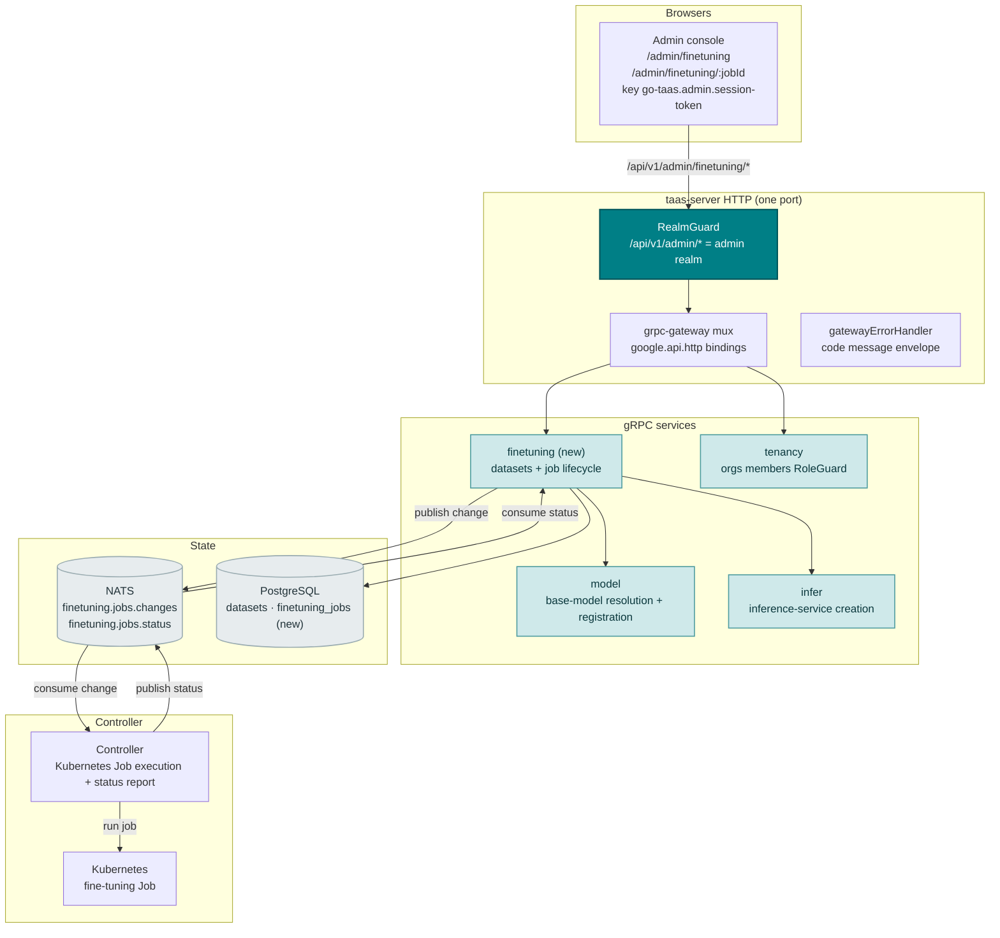
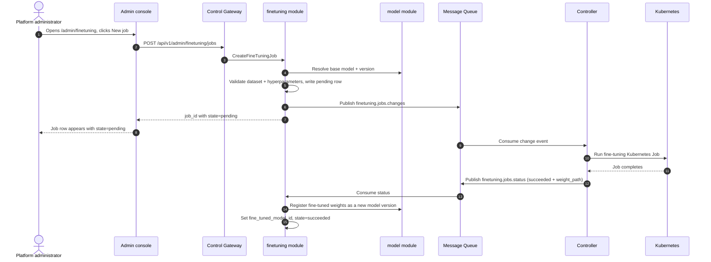
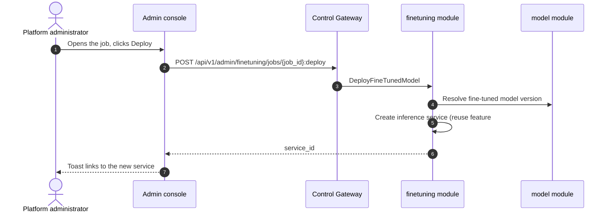

# 模型微调管理 — 架构与详细设计

| 属性 | 内容 |
| --- | --- |
| 功能点 | 模型微调管理 — 创建、监控与部署微调任务（数据集、基础模型、超参数、任务状态、部署微调模型）（backlog 第 39 行） |
| 文档范围 | 功能 39 的架构与详细设计：新的 `finetuning` 模块，负责数据集注册表与微调任务生命周期；`taas.finetuning.v1.FineTuningService` proto 及六个 RPC；`datasets` 与 `finetuning_jobs` 表；Controller 的 Kubernetes Job 执行与状态上报；管理端微调页面（`/admin/finetuning`、`/admin/finetuning/:jobId`）；以及错误处理、配置、安全、上线与各层函数级设计 |
| 所属模块 | 新 `finetuning` 模块（`services/finetuning`）：数据集注册表与微调任务生命周期；`model`（只读：基础模型解析与微调模型注册）；`infer`（只读：将微调模型部署为推理服务）；`controller`（只读：将微调任务作为 Kubernetes Job 运行并上报状态）；`pkg/server` 网关（管理端前缀绑定）；`web` 管理端控制台（`FineTuningPage`、`FineTuningJobDetailPage`） |
| 相关文档 | [需求分析与 UI/UX 设计](../design/model-finetuning.md) · [架构设计](../design/architecture.md) §2.2（`model`）、§2.4（`infer`）、§2.7 Controller、§4.2 一键部署流程 · [模型目录与一键部署](./model-catalog-deployment.md)（`model_versions` 表、`weight_path` 对象存储约定、Controller 的异步 reconcile 模式）· [模型版本与回滚](./model-versioning.md)（本功能部署步骤复用的版本历史与激活约定）· [镜像管理](./image-management.md)（制品/对象存储约定与异步任务状态模式）· [控制台面分离](./console-surface-separation.md)（两个面、`AdminShell` 约定、掩码投影规则） |
| 状态 | 架构完成，已移交给 Developer 智能体 |

---

## 1. 概述与目标

go-taas 注册模型版本（`model_versions` 行，含指向对象存储的 `weight_path`）并将其部署为推理服务（model-catalog-deployment §4.2）。而控制台仍无法*创建自定义模型*：想要针对自身数据适配模型的租户或运维人员 —— 基础模型的微调变体 —— 无法提交数据集、运行训练任务并部署结果。运维人员必须离开平台，针对基础模型权重运行训练任务、将结果上传到对象存储、注册为新模型版本并部署 —— 这是控制台应拥有的运维编排逃生舱。

本功能新增**模型微调管理**：创建、监控与部署微调任务 —— 数据集、基础模型、超参数、任务状态，以及将微调权重注册为新模型版本并部署为推理服务的部署步骤。它是 Phase 4 模型生命周期路线图最小且有独立价值的增量：把"我想要一个针对我的数据适配的模型"变成"提交数据集与超参数、观察任务运行、从控制台部署微调模型"。

**目标**：新的 `finetuning` 模块，负责数据集注册表与微调任务生命周期；`datasets` 与 `finetuning_jobs` 表；`taas.finetuning.v1.FineTuningService` 及六个 RPC（`RegisterFineTuningDataset`、`ListFineTuningDatasets`、`CreateFineTuningJob`、`ListFineTuningJobs`、`GetFineTuningJob`、`DeployFineTunedModel`）；Controller 将任务作为 Kubernetes Job 运行并经 MQ 上报状态；管理端微调页面（`/admin/finetuning`、`/admin/finetuning/:jobId`）；finetuning 块（123xx）的新错误码；页面 → 路由 → API 前缀表（精确管理端前缀）；各页面交互状态（空、错误、权限拒绝）；以及可在 compose 栈上以 Nightwatch 测试的编号验收标准。

**非目标**（延后，设计 §8）：模型目录与一键部署表单（#2）；模型版本与回滚（#32）；镜像管理（#3）；训练算法本身（Controller 运行精选微调镜像；算法不在范围内）；数据集编辑或预览（数据集注册一次并被引用）；用户域微调面（刻意不引入，D1）。

### 1.1 本文档阅读顺序

第 2 节记录架构决策（AD1–AD11，对应设计的 D1–D11）。第 3–5 节为组件视图、数据模型与 API 设计。第 6 节为前端架构（页面 → 路由 → API 前缀表、认证守卫）。第 7–8 节为时序流程与错误处理。第 9–11 节为配置、安全与上线。第 12–14 节为验收标准追溯、函数级详细设计与有序实现任务清单。

---

## 2. 架构决策

| # | 决策 | 理由 |
| --- | --- | --- |
| AD1 | **微调管理仅存在于管理端面**：`/admin/finetuning` + `/admin/finetuning/:jobId` + `/api/v1/admin/finetuning/*`。**无用户端面** —— 微调属于运维编排（功能 #17 的掩码投影规则）；租户经网关消费已部署的微调模型，而非训练流程 | 设计 D1。微调是运维编排（创建自定义模型）；租户消费模型而非训练任务。与仅管理端的模型版本（功能 #32）与加速器清单（功能 #18）一致 |
| AD2 | **新 `finetuning` 模块**（`services/finetuning`）负责数据集注册表与微调任务生命周期，拥有自己的错误块 **123xx**。它复用 model 模块进行基础模型解析与微调模型注册，复用 infer 模块进行部署 | 设计 D2。微调是独立关注点（自定义模型创建），拥有自己的数据集与任务；专用模块使其与模型目录分离并赋予单一归属，符合按功能分模块的模式 |
| AD3 | **新 `datasets` 表**存储已注册数据集：`dataset_id`、`name`、`format`（`jsonl` / `csv`）、`object_path`（对象存储路径，语法规则同 `weight_path`）、`created_at`。数据集注册一次并在任务间复用 | 设计 D3。数据集是一等、可复用输入（OpenAI、Together）；注册表避免每个任务重复上传相同数据，并为创建表单提供数据集选择器 |
| AD4 | **新 `finetuning_jobs` 表**存储任务生命周期：`job_id`、`name`、`base_model_id`、`base_model_version`、`dataset_id`、`hyperparameters`（jsonb：`epochs`、`batch_size`、`learning_rate`）、`state`（`pending` / `running` / `succeeded` / `failed`）、`failure_reason`、`fine_tuned_model_id`（成功时设置）、`created_at`、`updated_at` | 设计 D4。任务生命周期是异步任务模式（image-management D8）；表持久化任务及其结果，使详情页可显示状态、部署步骤可引用微调模型 |
| AD5 | **新 `CreateFineTuningJob` RPC** 校验数据集与基础模型，写入 `pending` 任务行，并向新的 `finetuning.jobs.changes` MQ subject 发布变更事件，供 Controller 作为 Kubernetes Job 运行。立即返回 `job_id` 且 `state=pending` | 设计 D5。镜像一键部署异步模式（model-catalog-deployment §5.1）：创建调用快速返回，Controller 驱动 `pending → running → succeeded / failed` |
| AD6 | **Controller 将微调任务作为 Kubernetes Job 运行**，并通过新的 `finetuning.jobs.status` MQ subject 上报状态。成功时将微调权重写入对象存储并上报结果 `weight_path`；`finetuning` 模块（经 model 模块）将其注册为新模型版本并设置 `fine_tuned_model_id` | 设计 D6。Controller 是唯一持有 Kubernetes 客户端的组件（service-logs AD2、accelerator AD1）；将任务作为 Kubernetes Job 运行并上报状态镜像部署 reconcile 模式。将结果注册为真实模型版本使微调模型留在模型生命周期内 |
| AD7 | **新 `ListFineTuningJobs` RPC** 返回任务列表，含每任务元数据（名称、基础模型、数据集、状态、微调模型、创建/更新）。新 `GetFineTuningJob` RPC 返回完整任务详情，含超参数与失败原因 | 设计 D7。列表页需要可扫描的任务表；详情页需要完整任务记录。两个 RPC 镜像模型列表/详情拆分 |
| AD8 | **新 `DeployFineTunedModel` RPC** 将成功任务的微调模型部署为推理服务：解析微调模型版本，然后以微调模型与所选镜像/加速器/副本数调用既有推理服务创建路径（功能 #2）。返回新 `service_id` | 设计 D8。"部署微调模型"意味着微调权重经正常推理路径服务；复用既有创建路径使部署步骤与一键部署一致 |
| AD9 | **部署步骤仅对 `succeeded` 任务可用**；其他任何状态的任务显示禁用部署操作并带提示。部署按任务幂等（已部署的任务显示既有服务链接） | 设计 D9。不能部署尚未完成训练的任务；幂等守卫防止重复点击产生重复服务 |
| AD10 | **新错误码在 finetuning 块（12301–12399）**：**12301 `CodeFineTuningJobNotFound`**、**12302 `CodeFineTuningJobStateInvalid`**、**12303 `CodeFineTuningDatasetNotFound`**、**12304 `CodeFineTuningDatasetInvalid`**、**12305 `CodeFineTuningHyperparametersInvalid`**。未知基础模型复用 **10101**；未知基础模型版本复用 **10103**；未知镜像复用 **10201** | 设计 D10。微调是新模块（AD2），因此其错误码位于 docs 块（122xx）之后的空白块；区分错误码使每种失败模式可操作，而模型/镜像契约保持统一 |
| AD11 | **页面除创建与部署操作外只读** —— 创建表单与部署操作写入；其余（列表、详情、状态）只读且仅对访问审计 | 设计 D11。本功能的写入是创建与部署操作；审计轨迹（功能 #15）覆盖它们。除既有写入路径外无需新增审计事件 |

---

## 3. 组件视图

### 3.1 归属

| 层 / 组件 | 拥有 | 本功能变更 |
| --- | --- | --- |
| **控制网关（`grpc-gateway`）** | 六个微调 RPC 的 HTTP/JSON 门面；域守卫（功能 #17）已以 10038 拒绝错误域会话；将 `X-Organization-Id` 作为 gRPC 元数据透传 | 新增六个 HTTP 微调 RPC 绑定（第 5 节）；域守卫不变 |
| **`finetuning` 模块（`services/finetuning`）** | 数据集注册表、微调任务生命周期、六个 RPC、变更事件发布、状态消费、微调模型注册 | **新模块**（AD2） |
| **`model` 模块** | 基础模型解析、微调模型注册 | 只读：finetuning 模块经 model 模块解析基础模型并注册微调模型（AD2、AD6） |
| **`infer` 模块** | 推理服务创建 | 只读：finetuning 模块调用既有推理服务创建路径部署微调模型（AD8） |
| **`controller`** | 将微调任务作为 Kubernetes Job 运行、将微调权重写入对象存储、上报状态 | 读写：Controller 消费 `finetuning.jobs.changes` 并发布 `finetuning.jobs.status`（AD6） |
| **`tenancy` 模块** | 组织、成员、角色、RoleGuard | 只读：`RoleGuard` 按调用者角色门控管理端微调 RPC（10036） |
| **PostgreSQL** | `datasets`、`finetuning_jobs`（新） | 两张新表，经 AutoMigrate（第 4 节） |
| **消息队列** | `finetuning.jobs.changes`、`finetuning.jobs.status`（新） | 两个新 subject（AD5、AD6） |
| **控制台** | 管理端微调页面 | 管理端面新增两页（第 6 节） |

### 3.2 运行时组件视图



### 3.3 请求身份链

微调 RPC 为**管理端面**（AD1）。链路如下：

1. `RealmGuard`（HTTP，`pkg/server/realm.go`）—— 路径前缀 `/api/v1/admin/finetuning/*` 决定期望域 `admin`。无 `Authorization` 头：透传（过渡期，feature-17 AD4）。有头：从 Redis 解析会话域；不匹配 → 10038，未知/过期/无域 → 10027。
2. grpc-gateway mux —— 按注解路径路由并透传 `authorization` 与 `x-organization-id`。
3. `finetuning` 处理器 —— 经 `tenancy.RoleGuard` 解析调用者角色（10036）。微调 RPC 仅管理端（AD1）；无用户绑定。
4. `tenancy.RoleGuard` —— 按调用者角色门控管理端微调 RPC（10036）。

---

## 4. 数据模型

### 4.1 `datasets` 表

| 列 | PostgreSQL 类型 | 约束 | 描述 |
| --- | --- | --- | --- |
| `id` | `uuid` | PRIMARY KEY | 服务端生成的 UUID v4，暴露为 `dataset_id` |
| `name` | `varchar(128)` | NOT NULL | 数据集名称，1–128 字符 |
| `format` | `varchar(8)` | NOT NULL | `jsonl` / `csv` |
| `object_path` | `varchar(512)` | NOT NULL | 对象存储路径，语法规则同 `weight_path`（非空、≤ 512 字符、无 `..` 段、无前导 `/`、无反斜杠） |
| `created_at` | `timestamptz` | NOT NULL | 注册时间 |

### 4.2 `finetuning_jobs` 表

| 列 | PostgreSQL 类型 | 约束 | 描述 |
| --- | --- | --- | --- |
| `id` | `uuid` | PRIMARY KEY | 服务端生成的 UUID v4，暴露为 `job_id` |
| `name` | `varchar(128)` | NOT NULL | 任务名称，1–128 字符 |
| `base_model_id` | `varchar(64)` | NOT NULL | 基础模型 id（model 契约） |
| `base_model_version` | `varchar(64)` | NOT NULL | 基础模型版本（model 契约） |
| `dataset_id` | `uuid` | NOT NULL, index | 已注册数据集 |
| `hyperparameters` | `jsonb` | NOT NULL | `{"epochs": int, "batch_size": int, "learning_rate": float}` |
| `state` | `varchar(16)` | NOT NULL, index | `pending` / `running` / `succeeded` / `failed` |
| `failure_reason` | `varchar(512)` | NOT NULL default '' | `failed` 时的人类可读失败原因 |
| `fine_tuned_model_id` | `varchar(64)` | NULL | 成功时设置；已注册的微调模型版本 |
| `created_at` | `timestamptz` | NOT NULL | 创建时间 |
| `updated_at` | `timestamptz` | NOT NULL | 最后更新时间 |

### 4.3 迁移说明

- 两张新表由 GORM `AutoMigrate` 在 `taas-server` 启动时创建（增量；无数据迁移）。`Migrate`/`MigrateSchemaForFVT` 增加两个新模型。
- 无需 init-SQL 升级路径：无既有表变更，新表在启动时自动创建。
- `finetuning` 模块写入任务行；Controller 经 MQ 上报状态，`finetuning` 模块将其应用到任务行（AD6）。

---

## 5. API 设计

微调 RPC 属于新的 **`taas.finetuning.v1.FineTuningService`**（proto：`proto/taas/finetuning/v1/finetuning.proto`），经控制网关以 HTTP 提供。仅管理端（AD1）；**无用户前缀绑定**。

| RPC | HTTP（管理端） | HTTP（用户端） | 状态 | 用途 |
| --- | --- | --- | --- | --- |
| `RegisterFineTuningDataset` | `POST /api/v1/admin/finetuning/datasets` | — | **新** | 注册数据集（名称、格式、对象路径） |
| `ListFineTuningDatasets` | `GET /api/v1/admin/finetuning/datasets` | — | **新** | 列出已注册数据集 |
| `CreateFineTuningJob` | `POST /api/v1/admin/finetuning/jobs` | — | **新** | 创建微调任务（数据集、基础模型、超参数） |
| `ListFineTuningJobs` | `GET /api/v1/admin/finetuning/jobs` | — | **新** | 列出微调任务 |
| `GetFineTuningJob` | `GET /api/v1/admin/finetuning/jobs/{job_id}` | — | **新** | 获取微调任务完整记录 |
| `DeployFineTunedModel` | `POST /api/v1/admin/finetuning/jobs/{job_id}:deploy` | — | **新** | 将成功任务的微调模型部署为推理服务 |

### 5.1 Proto 契约

```protobuf
syntax = "proto3";

package taas.finetuning.v1;

import "google/api/annotations.proto";
import "taas/common/v1/common.proto";

option go_package = "github.com/go-taas/go-taas/proto/taas/finetuning/v1;finetuningv1";

// FineTuningService serves the dataset registry and the fine-tuning job
// lifecycle. Admin-surface API: served under /api/v1/admin/finetuning.
service FineTuningService {
  // RegisterFineTuningDataset registers a dataset (name, format, object
  // path) and returns dataset_id.
  rpc RegisterFineTuningDataset(RegisterFineTuningDatasetRequest) returns (RegisterFineTuningDatasetResponse) {
    option (google.api.http) = {post: "/api/v1/admin/finetuning/datasets"};
  }

  // ListFineTuningDatasets returns the registered datasets, newest
  // first.
  rpc ListFineTuningDatasets(ListFineTuningDatasetsRequest) returns (ListFineTuningDatasetsResponse) {
    option (google.api.http) = {get: "/api/v1/admin/finetuning/datasets"};
  }

  // CreateFineTuningJob creates a fine-tuning job (dataset, base model,
  // hyperparameters) and returns job_id with state=pending immediately.
  rpc CreateFineTuningJob(CreateFineTuningJobRequest) returns (CreateFineTuningJobResponse) {
    option (google.api.http) = {post: "/api/v1/admin/finetuning/jobs"};
  }

  // ListFineTuningJobs returns the fine-tuning jobs, newest first.
  rpc ListFineTuningJobs(ListFineTuningJobsRequest) returns (ListFineTuningJobsResponse) {
    option (google.api.http) = {get: "/api/v1/admin/finetuning/jobs"};
  }

  // GetFineTuningJob returns a fine-tuning job's full record.
  rpc GetFineTuningJob(GetFineTuningJobRequest) returns (GetFineTuningJobResponse) {
    option (google.api.http) = {get: "/api/v1/admin/finetuning/jobs/{job_id}"};
  }

  // DeployFineTunedModel deploys a succeeded job's fine-tuned model as
  // an inference service and returns service_id.
  rpc DeployFineTunedModel(DeployFineTunedModelRequest) returns (DeployFineTunedModelResponse) {
    option (google.api.http) = {post: "/api/v1/admin/finetuning/jobs/{job_id}:deploy"};
  }
}

message RegisterFineTuningDatasetRequest {
  string name = 1;
  // format is jsonl / csv.
  string format = 2;
  string object_path = 3;
}

message RegisterFineTuningDatasetResponse {
  taas.common.v1.Response response = 1;
  string dataset_id = 2;
}

message ListFineTuningDatasetsRequest {
  taas.common.v1.PageRequest page = 1;
}

message ListFineTuningDatasetsResponse {
  taas.common.v1.Response response = 1;
  repeated FineTuningDataset datasets = 2;
  taas.common.v1.PageMeta page_meta = 3;
}

message FineTuningDataset {
  string dataset_id = 1;
  string name = 2;
  string format = 3;
  string object_path = 4;
  int64 created_at = 5;
}

message CreateFineTuningJobRequest {
  string name = 1;
  string base_model_id = 2;
  string base_model_version = 3;
  string dataset_id = 4;
  FineTuningHyperparameters hyperparameters = 5;
}

message FineTuningHyperparameters {
  int32 epochs = 1;
  int32 batch_size = 2;
  double learning_rate = 3;
}

message CreateFineTuningJobResponse {
  taas.common.v1.Response response = 1;
  string job_id = 2;
  // state is pending immediately (AD5).
  string state = 3;
}

message ListFineTuningJobsRequest {
  taas.common.v1.PageRequest page = 1;
}

message ListFineTuningJobsResponse {
  taas.common.v1.Response response = 1;
  repeated FineTuningJobSummary jobs = 2;
  taas.common.v1.PageMeta page_meta = 3;
}

message FineTuningJobSummary {
  string job_id = 1;
  string name = 2;
  string base_model_id = 3;
  string base_model_version = 4;
  string dataset_id = 5;
  // state is pending / running / succeeded / failed.
  string state = 6;
  string fine_tuned_model_id = 7;
  int64 created_at = 8;
  int64 updated_at = 9;
}

message GetFineTuningJobRequest {
  string job_id = 1;
}

message GetFineTuningJobResponse {
  taas.common.v1.Response response = 1;
  FineTuningJob job = 2;
}

message FineTuningJob {
  FineTuningJobSummary summary = 1;
  FineTuningHyperparameters hyperparameters = 2;
  string failure_reason = 3;
}

message DeployFineTunedModelRequest {
  string job_id = 1;
  string image_id = 2;
  // accelerator is nvidia / iluvatar / metax.
  string accelerator = 3;
  int32 replicas = 4;
}

message DeployFineTunedModelResponse {
  taas.common.v1.Response response = 1;
  string service_id = 2;
}
```

### 5.2 契约说明（为 Developer 智能体固定）

1. `RegisterFineTuningDataset` 接受 `name`、`format`（`jsonl` / `csv`）与 `object_path`；返回 `dataset_id`。`ListFineTuningDatasets` 返回数据集，最新在前（FR1.1、FR1.2）。
2. `CreateFineTuningJob` 接受 `name`、`base_model_id`、`base_model_version`、`dataset_id` 与 `hyperparameters`（`epochs`、`batch_size`、`learning_rate`）；立即返回 `job_id` 且 `state=pending`（AD5）。向 `finetuning.jobs.changes` 发布变更事件（AD5）。
3. `ListFineTuningJobs` 返回任务，最新在前，含每任务元数据；`GetFineTuningJob` 返回完整记录，含 `hyperparameters` 与 `failure_reason`（FR3.1、FR3.2）。
4. `DeployFineTunedModel` 接受 `image_id`、`accelerator` 与 `replicas`；返回 `service_id`。仅对 `succeeded` 任务可用且按任务幂等（AD9）。
5. Controller 将任务作为 Kubernetes Job 运行并经 `finetuning.jobs.status` 上报状态；成功时上报结果 `weight_path`，`finetuning` 模块将其注册为新模型版本（AD6）。
6. 线上约定不变：成功 HTTP 200，业务错误为 `{"code": <int>, "message": "..."}`，int64 字段序列化为 JSON 字符串。

### 5.3 错误码

错误码（finetuning 块 12301–12399，`pkg/errors/codes.go`）：

| 条件 | 码 | 常量 | 说明 |
| --- | --- | --- | --- |
| 未知 `job_id` | 12301 | `CodeFineTuningJobNotFound` | **新**（AD10） |
| 对非 `succeeded` 任务部署 | 12302 | `CodeFineTuningJobStateInvalid` | **新**（AD10） |
| 未知数据集 | 12303 | `CodeFineTuningDatasetNotFound` | **新**（AD10） |
| 无效数据集对象路径 | 12304 | `CodeFineTuningDatasetInvalid` | **新**（AD10） |
| 无效超参数 | 12305 | `CodeFineTuningHyperparametersInvalid` | **新**（AD10） |
| 未知基础模型 | 10101 | `CodeModelNotFound` | 复用 —— model 契约 |
| 未知基础模型版本 | 10103 | `CodeModelVersionNotFound` | 复用 —— model 契约 |
| 未知镜像 | 10201 | `CodeImageNotFound` | 复用 —— image 契约 |
| 不兼容镜像 | 10204 | `CodeImageIncompatible` | 复用 —— image 契约 |
| 数据库 / 基础设施故障 | 500 | `CodeInternal` | 经错误归一化 |

---

## 6. 前端架构

### 6.1 页面 → 路由 → API 前缀表

| 页面 / 组件 | 面 | Web 路由 | API 前缀 | 认证守卫 |
| --- | --- | --- | --- | --- |
| **微调页面** | 管理端 | `/admin/finetuning` | `/api/v1/admin/finetuning/datasets`、`/api/v1/admin/finetuning/jobs` | 管理端会话；RoleGuard（管理角色） |
| **微调任务详情页面** | 管理端 | `/admin/finetuning/:jobId` | `/api/v1/admin/finetuning/jobs/{job_id}`、`/api/v1/admin/finetuning/jobs/{job_id}:deploy` | 管理端会话；RoleGuard（管理角色） |

> 管理端微调页面仅调用 `/api/v1/admin/finetuning/*` 路由；无用户端面（AD1）。页面不含 `/api/v1/*` 字符串（功能 #17）。

### 6.2 导航位置

- **管理端控制台**：管理端导航新增 **Fine-tuning** 项（`/admin/finetuning`，testid `nav-finetuning`），位于模型生命周期分组，紧邻 Models 与 Inference Services。

### 6.3 复用的共享组件与状态

- **API 客户端**（`web/src/api.ts`）：域作用域客户端（`createApi(realm)`）已发送 `Authorization: Bearer <realm>.session-token` 与 `X-Organization-Id`（仅当域 token 键为空时）。微调页面原样复用；不新增客户端。
- **状态徽标**：共享 `StateBadge` 组件渲染 pending / running / succeeded / failed 徽标，遵循镜像预热任务徽标模式（AD4）。
- **异步任务轮询**：复用 `usePolling` 钩子（accelerator inventory 与 billing reports 使用），轮询 `GetFineTuningJob` 直至任务离开 `pending`/`running`。
- **部署对话框**：部署对话框复用功能 #2 的推理服务部署表单字段（镜像、加速器、副本数）（AD8）。
- **空状态 / 数据新鲜度提示**：复用 Request Logs 页面模式（提示任务在创建后出现）。

### 6.4 各面认证守卫

- **管理端微调页面**（`/admin/finetuning`、`/admin/finetuning/:jobId`）：在 `AdminShell` 内渲染，当 `go-taas.admin.session-token` 非空时运行管理端会话守卫；缺失/过期会话重定向到 `/admin/login?reason=expired`；错误域会话被网关以 10038 拒绝。页面 API 调用指向 `/api/v1/admin/finetuning/*`。无所需角色的会话收到 10036，页面显示标准权限拒绝状态（功能 #17）。
- **未认证访客**：未认证访客被 shell 守卫重定向到 `/admin/login`。

### 6.5 控制台契约（为 Developer 智能体固定）

**微调页面**（`/admin/finetuning`）：页面头部（"Fine-tuning"，副标题 "Create and monitor custom model training"），带 **New job** 操作（`finetuning-new-job`）与 **Register dataset** 操作（`finetuning-register-dataset`）。下方：**数据集注册表**卡片（`finetuning-datasets`、`finetuning-dataset-{id}`），列为名称、格式（徽标）、对象路径、创建时间；以及**任务列表**表（`finetuning-jobs`、`finetuning-job-{id}`），列为名称（链接到详情页）、基础模型、数据集、状态（徽标）、微调模型（已部署时链接）、创建时间、更新时间，行操作 **View**。可按名称、状态、创建时间排序；可按状态筛选（All / Pending / Running / Succeeded / Failed）；分页。空状态："No fine-tuning jobs yet."，提示创建任务；数据集注册表显示 "No datasets registered" 与 Register dataset 按钮。错误状态：错误横幅 + Retry 按钮 + "Showing stale data" 横幅。权限拒绝：标准状态，带返回管理端首页的链接。

**微调任务详情页面**（`/admin/finetuning/:jobId`）：页面头部（"Fine-tuning Job"，副标题含任务名与 `job_id`），带 **Back to Fine-tuning** 链接（`finetuning-back`）与 **Refresh** 操作（`finetuning-refresh`）。下方：**状态卡片**（`finetuning-status`），含任务状态徽标、基础模型、基础模型版本、数据集、创建/更新时间，以及（`failed` 时）失败原因；**超参数卡片**（`finetuning-hyperparameters`），含 epochs、batch size、learning rate；以及**部署卡片**（`finetuning-deploy`），对 `succeeded` 任务含 **Deploy** 操作（`finetuning-deploy-action`），打开含镜像、加速器、副本数的对话框；对已部署任务显示既有服务链接；对任何其他状态，Deploy 操作禁用并带提示。空状态："No fine-tuning job data."，提示任务在创建后出现。错误状态：错误横幅 + Retry 按钮 + "Showing stale data" 横幅。权限拒绝：标准状态，带返回管理端首页的链接。

---

## 7. 时序流程

### 7.1 创建并运行微调任务



### 7.2 部署微调模型



---

## 8. 错误处理

所有错误均为统一信封中的 `pkg/errors` 业务码（第 5.3 节）。finetuning 模块的写入是创建与部署操作；任务生命周期由 Controller 经 MQ 驱动，Controller 侧失败以 `failed` 任务及 `failure_reason` 呈现，而非 RPC 错误。数据库故障归一化为 500 `CodeInternal`。

控制台按 body `code` 分支（`web/src/api.ts` 已如此），绝不按 HTTP 状态。新码 12301–12305 渲染特定内联消息。管理端页面将 10036 映射为标准权限拒绝状态（功能 #17 §8.2）。

---

## 9. 配置新增

| 键 | 默认 | 描述 |
| --- | --- | --- |
| `finetuning.jobImage` | `ghcr.io/go-taas/go-taas/finetune:latest` | Controller 作为 Kubernetes Job 运行的精选微调镜像（AD6） |
| `controller.finetuning.pollInterval` | `5s` | Controller 的微调任务状态轮询间隔 |

`finetuning` 配置块在 `pkg/config` 中新增（`FineTuningConfig`），遵循 `observability` 块模式。`controller.finetuning` 块在 controller 配置中新增（`ControllerFineTuningConfig`）。`applyDefaults`/`Validate` 设置上述默认值。finetuning 模块读取 `jobImage`；Controller 读取 `pollInterval`。两个新 MQ subject（`finetuning.jobs.changes`、`finetuning.jobs.status`）加入 `pkg/mq`。

---

## 10. 安全考量

- **仅管理端面**：微调页面仅存在于管理端面（AD1）；无用户端面。域守卫在任何处理器运行前以 10038 拒绝错误域会话（功能 #17）。
- **管理角色门控**：微调 RPC 由 `tenancy.RoleGuard` 门控 —— 仅有所需管理角色的调用者可注册数据集、创建任务与部署微调模型；不可访问的组织返回 10036。
- **掩码投影**：页面暴露数据集与任务元数据，绝不为 Pod 名或运维编排内部信息（AD1）。租户绝不见训练流程。
- **对象路径校验**：数据集 `object_path` 遵循 `weight_path` 语法规则（无 `..` 段、无前导 `/`、无反斜杠），防止路径遍历（AD3）。
- **写入仅为创建与部署操作**：finetuning 模块仅写入数据集与任务行；Controller 将微调权重写入对象存储。审计轨迹（功能 #15）覆盖创建与部署写入（AD11）。

---

## 11. 上线 / 升级说明

- **两张新表**：`datasets` 与 `finetuning_jobs` 在 `taas-server` 启动时经 `AutoMigrate` 创建；无数据迁移、无 init-SQL 升级路径。
- **proto 变更为增量**：新 `FineTuningService` 上六个新 RPC；无既有 RPC 或消息变更。网关 mux 增加新绑定；域守卫不变。
- **Controller**：微调任务执行器是 Controller 中的新消费者；消费 `finetuning.jobs.changes`、运行 Kubernetes Job 并发布 `finetuning.jobs.status`。
- **控制台**：新页面加入既有 bundle；管理端导航增加 Fine-tuning。无既有路由变更。
- **向后兼容**：过渡期（无会话、`X-Organization-Id`）路径为 CLI、FVT 与 e2e 套件保留；域守卫透传无 `Authorization` 头的请求（功能 #17 AD4）。
- **数据出现前为空**：在数据集与任务存在前 RPC 返回空列表；页面渲染空状态。

---

## 12. 验收标准追溯

| # | 标准 | 处理位置 |
| --- | --- | --- |
| AC1 | `RegisterFineTuningDataset` 注册数据集且 `ListFineTuningDatasets` 返回它；无效对象路径返回 12304 | §5.1、§5.2、§4.1 |
| AC2 | `CreateFineTuningJob` 返回 `job_id` 且 `state=pending`；未知基础模型返回 10101、未知数据集返回 12303、无效超参数返回 12305 | §5.1、§5.2、§7.1 |
| AC3 | `ListFineTuningJobs` 返回任务最新在前；`GetFineTuningJob` 返回含超参数与失败原因的完整记录；未知 `job_id` 返回 12301 | §5.1、§5.2 |
| AC4 | `DeployFineTunedModel` 对 `succeeded` 任务返回 `service_id`；对非 `succeeded` 任务返回 12302；按任务幂等 | §5.1、§5.2、§7.2 |
| AC5 | `/admin/finetuning` 页面在首次成功加载时渲染数据集注册表与任务列表，含 New job 与 Register dataset 操作 | §6.5 |
| AC6 | 创建任务对话框校验数据集、基础模型与超参数，并创建以 `state=pending` 出现的任务 | §6.5、§7.1 |
| AC7 | `/admin/finetuning/:jobId` 页面渲染状态、超参数与部署卡片；Deploy 操作仅对 `succeeded` 任务启用，否则禁用 | §6.5 |
| AC8 | 微调页面仅可在管理端面访问：路由 `/admin/finetuning` 与 `/admin/finetuning/:jobId`，每次 API 调用使用 `/api/v1/admin/finetuning/*` 前缀且无 `/api/v1/*` 字符串 | §6.1、§6.4、§10 |
| AC9 | 无所需角色的会话在微调页面收到 10036，页面显示标准权限拒绝状态 | §3.3、§6.4、§10 |

---

## 13. 详细设计（各层函数级职责）

### 13.1 Proto → 服务 → 仓库 → Controller

| 层 | 文件 | 职责 |
| --- | --- | --- |
| `proto/taas/finetuning/v1` | `finetuning.proto` | 新：`FineTuningService` 及六个 RPC + 请求/响应消息、`FineTuningDataset`、`FineTuningJobSummary`、`FineTuningJob`、`FineTuningHyperparameters`（第 5.1 节）。经 `buf generate` 重新生成 `finetuning.pb.go`/`finetuning_grpc.pb.go`/`finetuning.pb.gw.go` |
| `services/finetuning` | `dataset_model.go` | GORM 模型 `FineTuningDataset` + `TableName`；`object_path` 语法校验（AD3） |
| | `job_model.go` | GORM 模型 `FineTuningJob` + `TableName`；`state` 常量与 `hyperparameters` jsonb 字段（AD4） |
| | `dataset_repository.go` | `CreateDataset`、`ListDatasets`、`FindDatasetByID` |
| | `job_repository.go` | `CreateJob`、`FindJobByID`、`ListJobs`、`UpdateJobState`（pending→running→succeeded/failed，单事务：设置 state + failure_reason + fine_tuned_model_id） |
| | `service.go` | 六个 RPC；数据集/对象路径/超参数校验；经 model 模块的基础模型解析（10101/10103）；变更事件发布（AD5）；状态消费（AD6）；经 model 模块的微调模型注册；经 infer 模块的部署步骤（AD8）；幂等守卫（AD9）；`RoleGuard` 接缝（10036） |
| | `status_consumer.go` | 订阅 `finetuning.jobs.status` 的 `server.Runner`；将 Controller 上报的状态应用到任务行（AD6） |
| `internal/controller` | `finetuning.go` | 新消费者：消费 `finetuning.jobs.changes`、以精选镜像运行微调 Kubernetes Job、轮询其状态、成功时将微调权重写入对象存储并发布 `finetuning.jobs.status`（AD6） |
| `pkg/errors` | `codes.go`/`messages.go` | `CodeFineTuningJobNotFound`（12301）、`CodeFineTuningJobStateInvalid`（12302）、`CodeFineTuningDatasetNotFound`（12303）、`CodeFineTuningDatasetInvalid`（12304）、`CodeFineTuningHyperparametersInvalid`（12305）常量 + 规范消息（AD10） |
| `pkg/config` | `api.go`/`configuration.go` | `FineTuningConfig` + `jobImage`（第 9 节）+ `applyDefaults`/`Validate`；`ControllerFineTuningConfig` + `pollInterval` |
| `pkg/mq` | `subjects.go` | `FineTuningJobsChanges`、`FineTuningJobsStatus` subject（AD5、AD6） |
| `apps/taas-server` | `main.go` | 注册新 `FineTuningService`；将 `tenancy` RoleGuard 接入 finetuning 服务；启动状态消费者 |
| `apps/controller` | `main.go` | 启动微调任务执行器 |
| `web/src` | `pages/FineTuningPage.tsx`、`pages/FineTuningJobDetailPage.tsx`、`App.tsx`、`api.ts`、`shells/AdminShell.tsx` | 路由 `/admin/finetuning` 与 `/admin/finetuning/:jobId`；六个 RPC API 类型与调用；导航项（第 6.5 节） |
| `test` | `fvt/model_finetuning_fvt_test.go`、`e2e/tests/modelFinetuning.js` | 第 14 节 |

### 13.2 各屏幕由哪个 React 页面/模块实现

| 屏幕 | React 模块 | 路由 | API 调用 |
| --- | --- | --- | --- |
| 微调页面（管理端） | `web/src/pages/FineTuningPage.tsx` | `/admin/finetuning` | `ListFineTuningDatasets`、`RegisterFineTuningDataset`、`ListFineTuningJobs`、`CreateFineTuningJob` |
| 微调任务详情页面（管理端） | `web/src/pages/FineTuningJobDetailPage.tsx` | `/admin/finetuning/:jobId` | `GetFineTuningJob`、`DeployFineTunedModel` |

---

## 14. 测试策略

- **单元**（`services/finetuning`，内存 sqlite）：`dataset_repository_test.go` —— `CreateDataset`/`ListDatasets`/`FindDatasetByID`（AC1）；`object_path` 校验返回 12304（AC1）。`job_repository_test.go` —— `CreateJob`/`FindJobByID`/`ListJobs`/`UpdateJobState`（AC2、AC3）。`service_test.go` —— 六个 RPC；基础模型解析返回 10101/10103（AC2）；数据集解析返回 12303（AC2）；超参数校验返回 12305（AC2）；部署状态守卫返回 12302、幂等守卫返回既有服务（AC4）；管理端组织作用域返回 10036（AC9）。新文件覆盖率 ≥ 80%。
- **FVT**（`test/fvt/model_finetuning_fvt_test.go`，model-catalog FVT 模式：文件 sqlite + `MigrateSchemaForFVT` + `NewForFVT` + 生产拦截器的 gRPC 服务器 + `FVTHeaderMatcher` 的网关 mux）：预置数据集与任务，断言 `RegisterFineTuningDataset`/`ListFineTuningDatasets`（AC1）、`CreateFineTuningJob` 返回 `state=pending`（AC2）、`ListFineTuningJobs`/`GetFineTuningJob` 返回记录（AC3）、`DeployFineTunedModel` 对 `succeeded` 任务返回 `service_id`（AC4）。
- **E2E**（`test/e2e/tests/modelFinetuning.js`，`modelCatalog.js` 模式）：针对 compose 栈 —— 管理端 `/admin/finetuning` 页面在首次成功加载时渲染数据集注册表与任务列表（AC5）；创建任务对话框校验并创建以 `state=pending` 出现的任务（AC6）；`/admin/finetuning/:jobId` 页面渲染状态、超参数与部署卡片，Deploy 操作仅对 `succeeded` 任务启用（AC7）；页面仅调用 `/api/v1/admin/finetuning/*` 路由、未认证访客重定向到 `/admin/login`（AC8）；无所需角色的会话收到 10036 并显示权限拒绝状态（AC9）。