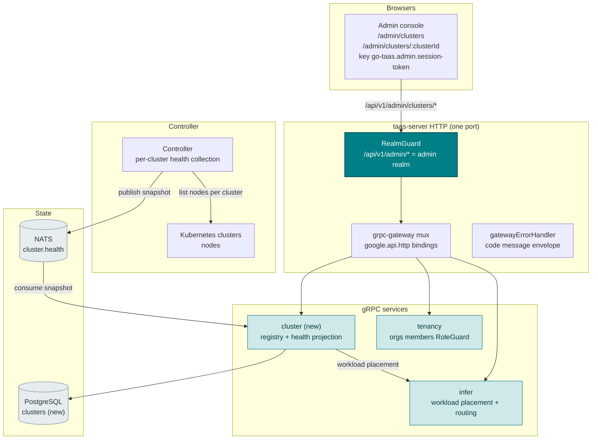
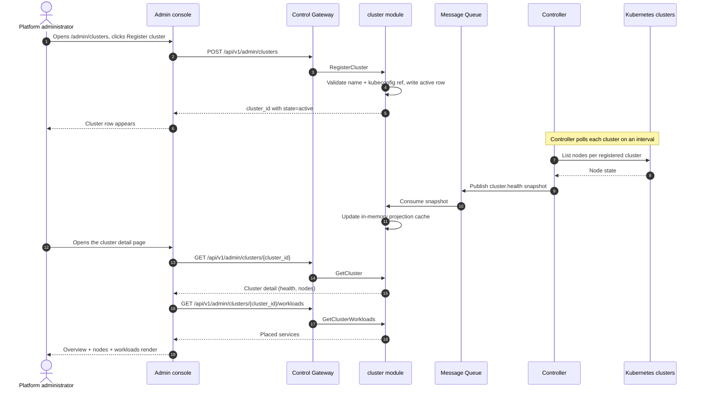
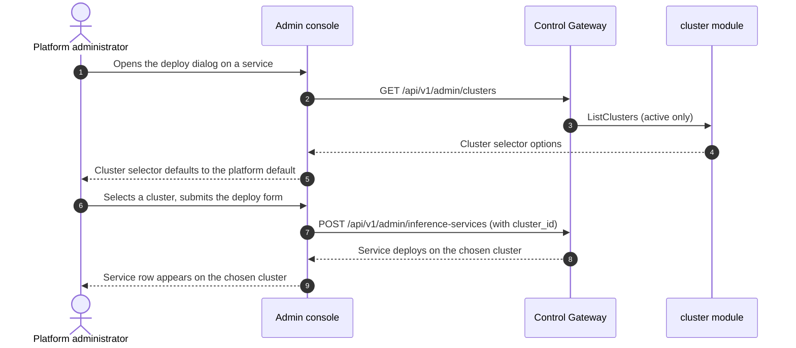

# Multi-Cluster Management — Architecture and Detailed Design

| Attribute | Content |
| --- | --- |
| Feature point | Multi-cluster management — register and manage inference clusters, view cluster health and workload placement, and route deployments across clusters (backlog row 40) |
| Document scope | Architecture and detailed design for feature-40: a new `cluster` module owning the cluster registry and the cluster-health projection; the `taas.cluster.v1.ClusterService` proto with five RPCs; the `clusters` table; the Controller's per-cluster health collection and snapshot publish; the cluster selector in the deploy form; the admin Cluster pages (`/admin/clusters`, `/admin/clusters/:clusterId`); plus error handling, configuration, security, rollout, and function-level design per layer |
| Owning modules | New `cluster` module (`services/cluster`): the cluster registry and the cluster-health projection; `infer` (read-only: workload placement and cross-cluster routing); `controller` (read-only: per-cluster health collection and snapshot publish); `pkg/server` gateway (admin-prefix bindings); `web` admin console (`ClustersPage`, `ClusterDetailPage`) |
| Related documents | [Requirement Analysis and UI/UX Design](../design/multi-cluster-management.md) · [Architecture Design](../design/architecture.md) §2.4 (`infer`), §2.7 Controller, §4.2 one-click deployment flow · [Accelerator Inventory & Health](./accelerator-inventory.md) (the Controller → MQ → service projection pattern and the in-memory cache this feature reuses) · [System Health & Service Status](./system-health-status.md) (the component-health conventions this feature extends to clusters) · [Model Catalog & One-Click Deployment](./model-catalog-deployment.md) (the inference-service lifecycle and the deploy form this feature's routing extends) · [Console Surface Separation](./console-surface-separation.md) (the two surfaces, the `AdminShell` conventions, the masked-projection rule) |
| Status | Architecture complete, handed to the Developer agent |

---

## 1. Overview and Goals

go-taas runs inference services as Kubernetes Deployments on a single cluster (model-catalog-deployment §4.2): the Controller creates the Deployment and Service, and the accelerator inventory (feature #18) reports per-node GPU health. What the console still cannot do is *run inference across more than one cluster*: an operator with a second cluster (a different region, a different accelerator fleet, or a burst capacity pool) has no way to register it, see its health, see which services run on it, or choose where a new deployment lands. The operator must manage each cluster's Kubernetes API separately and route deployments by hand — an operator-orchestration escape hatch the console should own.

This feature adds **multi-cluster management**: register and manage inference clusters, view cluster health and workload placement, and route deployments across clusters. It is the smallest independently valuable increment of Phase 4's productionization roadmap item: it turns "I have a second cluster" into "register it, see its health and what runs on it, and choose where each deployment lands".

**Goals**: a new `cluster` module owning the cluster registry and the cluster-health projection; the `clusters` table; a `taas.cluster.v1.ClusterService` with five RPCs (`RegisterCluster`, `ListClusters`, `GetCluster`, `GetClusterWorkloads`, `DisableCluster`); the Controller's per-cluster health collection and snapshot publish; the cluster selector in the deploy form (feature #2); the admin Cluster pages (`/admin/clusters`, `/admin/clusters/:clusterId`); new error codes in a cluster block (124xx); the page → route → API-prefix table with the exact admin prefix; per-page interactive states including empty, error, and permission-denied; and numbered acceptance criteria testable in Nightwatch against the compose stack.

**Non-goals** (deferred, design §8): the model catalog and one-click deployment form (#2); the accelerator inventory (#18); system health & status (#30); automatic cross-cluster load balancing or failover (the operator chooses the cluster at deploy time; automatic routing is future work); cluster provisioning or lifecycle management (go-taas registers existing clusters, it does not create them); a user-realm cluster surface (deliberately absent, D1).

### 1.1 Reading order of this document

Section 2 records the architecture decisions (AD1–AD10, mirroring the design's D1–D10). Sections 3–5 are the component view, data model, and API design. Section 6 is the frontend architecture (page → route → API-prefix table, auth guard). Sections 7–8 are the sequence flows and error handling. Sections 9–11 are configuration, security, and rollout. Sections 12–14 are the acceptance-criteria traceability, the function-level detailed design, and the ordered implementation task list.

---

## 2. Architecture Decisions

| # | Decision | Rationale |
| --- | --- | --- |
| AD1 | **Multi-cluster management lives on the admin surface only**: `/admin/clusters` + `/admin/clusters/:clusterId` + `/api/v1/admin/clusters/*`. There is **no end-user surface** — cluster health and placement are operator-orchestration (feature #17's masked-projection rule); tenants consume models through the gateway, not cluster internals | Design D1. Cluster management is operator-orchestration; tenants consume models, not clusters. Consistent with the admin-only accelerator inventory (feature #18) and system status (feature #30) |
| AD2 | **A new `cluster` module** (`services/cluster`) owns the cluster registry and the cluster-health projection, with its own error block **124xx**. It reuses the infer module for workload placement and cross-cluster routing | Design D2. Multi-cluster is a distinct concern (cluster registry + health + placement) with its own registry and projection; a dedicated module keeps it separate from the model/infer lifecycle and gives it one home, matching the per-feature-module pattern |
| AD3 | **A new `clusters` table** stores registered clusters: `cluster_id`, `name`, `region`, `kubeconfig_ref` (a reference to the cluster's kubeconfig, not the secret itself), `state` (`active` / `disabled`), `created_at`. A cluster is registered once and referenced by deployments | Design D3. A cluster is a first-class, reusable resource (Rancher, OpenShift); a registry avoids re-entering cluster credentials per deployment and gives the deploy form a cluster selector |
| AD4 | **Cluster health is a projection of per-cluster Kubernetes state, collected by the Controller and served through the `cluster` module** — the Controller polls each registered cluster's nodes and publishes a full snapshot to a new `cluster.health` MQ subject; the `cluster` module maintains an in-memory projection cache (the accelerator-inventory AD1/AD11 pattern) | Design D4. The Controller is the only component with Kubernetes clients (service-logs AD2, accelerator AD1); the projection pattern keeps the health view dependency-light and self-healing (a removed cluster disappears from the next snapshot) |
| AD5 | **A new `RegisterCluster` RPC** validates the cluster name and kubeconfig reference, writes an `active` cluster row, and returns `cluster_id`. A new `ListClusters` RPC returns the cluster list with per-cluster health and workload counts. A new `GetCluster` RPC returns the full cluster detail including nodes and placed services | Design D5. The cluster registry needs create/list/detail; three RPCs mirror the model list/detail split and the accelerator inventory's list/detail split |
| AD6 | **A new `DisableCluster` RPC** sets a cluster `disabled`; a disabled cluster is excluded from the deploy form's cluster selector and from new placements, but existing services keep running until the operator moves them | Design D6. Disabling a cluster (maintenance, decommission) must not tear down running services; the operator moves them explicitly |
| AD7 | **Workload placement is a cluster field on the inference service**: the deploy form (feature #2) gains a **Cluster** selector (from `ListClusters`, `active` only), and `CreateInferenceService` records the chosen `cluster_id`. A new `GetClusterWorkloads` RPC returns the services placed on a cluster | Design D7. "Route deployments across clusters" means the operator chooses a cluster at deploy time; recording it on the service gives the placement view and the routing control |
| AD8 | **The deploy form defaults the cluster selector to a platform default** (the first `active` cluster, or a configured default), so existing single-cluster deployments keep working with no change | Design D8. A default preserves existing behavior (the single-cluster case); the operator overrides it when they have multiple clusters |
| AD9 | **New error codes in a cluster block (12401–12499)**: **12401 `CodeClusterNotFound`**, **12402 `CodeClusterExists`**, **12403 `CodeClusterStateInvalid`**, **12404 `CodeClusterKubeconfigInvalid`**. Unknown inference service reuses **10301** | Design D9. Multi-cluster is a new module (AD2), so its codes live in a fresh block after the finetuning block (123xx); distinct codes keep each failure mode actionable while the infer contract stays uniform |
| AD10 | **The pages are read-only except for the register and disable actions** — the register form and the disable action write; everything else (list, detail, health, placement) is read-only and audited only for access | Design D10. The feature's writes are the register and disable actions; the audit trail (feature #15) covers them. No new audit events are needed beyond the existing write paths |

---

## 3. Component View

### 3.1 Ownership

| Layer / component | Owns | Changes in this feature |
| --- | --- | --- |
| **Control Gateway (`grpc-gateway`)** | HTTP/JSON facade for the five cluster RPCs; realm guard (feature #17) already rejects a wrong-realm session with 10038; passes `X-Organization-Id` through as gRPC metadata | New bindings for the five HTTP cluster RPCs (Section 5); no change to the realm guard |
| **`cluster` module (`services/cluster`)** | The cluster registry, the cluster-health projection cache, the five RPCs, the snapshot consumer | **New module** (AD2) |
| **`infer` module** | Workload placement and cross-cluster routing | Read-only: the infer module records the chosen `cluster_id` on the inference service and exposes it to the cluster module (AD7) |
| **`controller`** | Per-cluster health collection and snapshot publish | Read/write: the Controller polls each registered cluster's nodes and publishes a full snapshot to `cluster.health` (AD4) |
| **`tenancy` module** | Organizations, members, roles, RoleGuard | Read-only: `RoleGuard` gates the admin cluster RPCs by the caller's role (10036) |
| **PostgreSQL** | `clusters` (new) | One new table via AutoMigrate (Section 4) |
| **Message Queue** | `cluster.health` (new) | One new subject (AD4) |
| **Console** | Admin Cluster pages | Two new pages on the admin surface (Section 6) |

### 3.2 Runtime component view



### 3.3 Request identity chain

The cluster RPCs are **admin-surface** (AD1). The chain is:

1. `RealmGuard` (HTTP, `pkg/server/realm.go`) — path prefix `/api/v1/admin/clusters/*` decides the expected realm `admin`. With no `Authorization` header: pass through (transitional, feature-17 AD4). With a header: resolve the session realm from Redis; mismatch → 10038, unknown/expired/realm-less → 10027.
2. grpc-gateway mux — routes by the annotated path and forwards `authorization` and `x-organization-id`.
3. `cluster` handler — resolves the caller's role via `tenancy.RoleGuard` (10036). The cluster RPCs are admin-only (AD1); there is no user binding.
4. `tenancy.RoleGuard` — gates the admin cluster RPCs by the caller's role (10036).

---

## 4. Data Model

### 4.1 The `clusters` Table

| Column | PostgreSQL type | Constraints | Description |
| --- | --- | --- | --- |
| `id` | `uuid` | PRIMARY KEY | Server-generated UUID v4, exposed as `cluster_id` |
| `name` | `varchar(128)` | NOT NULL, UNIQUE | Cluster name, 1–128 chars (duplicate → 12402) |
| `region` | `varchar(64)` | NOT NULL default '' | Region, 1–64 chars (optional) |
| `kubeconfig_ref` | `varchar(512)` | NOT NULL | A reference to the cluster's kubeconfig, not the secret itself |
| `state` | `varchar(16)` | NOT NULL, index | `active` / `disabled` |
| `created_at` | `timestamptz` | NOT NULL | Registration time |

### 4.2 Migration Notes

- The new table is created by GORM `AutoMigrate` on `taas-server` startup (additive; no data migration). `Migrate`/`MigrateSchemaForFVT` gain the new model.
- No init-SQL upgrade path is needed: no existing table changes, and the new table is created automatically on startup.
- The cluster-health projection is an **in-memory cache** in the `cluster` module (AD4), not a table — it is refreshed by the Controller's periodic full-snapshot publish, following the accelerator-inventory AD1/AD11 pattern.

---

## 5. API Design

The cluster RPCs belong to the new **`taas.cluster.v1.ClusterService`** (proto: `proto/taas/cluster/v1/cluster.proto`), served as HTTP via the Control Gateway. They are admin-only (AD1); there is **no user-prefix binding**.

| RPC | HTTP (admin) | HTTP (user) | Status | Purpose |
| --- | --- | --- | --- | --- |
| `RegisterCluster` | `POST /api/v1/admin/clusters` | — | **new** | Register an inference cluster (name, region, kubeconfig reference) |
| `ListClusters` | `GET /api/v1/admin/clusters` | — | **new** | List registered clusters with health and workload counts |
| `GetCluster` | `GET /api/v1/admin/clusters/{cluster_id}` | — | **new** | Get a cluster's full detail (health, nodes) |
| `GetClusterWorkloads` | `GET /api/v1/admin/clusters/{cluster_id}/workloads` | — | **new** | List the inference services placed on a cluster |
| `DisableCluster` | `POST /api/v1/admin/clusters/{cluster_id}:disable` | — | **new** | Disable a cluster (exclude from new placements) |

### 5.1 Proto contract

```protobuf
syntax = "proto3";

package taas.cluster.v1;

import "google/api/annotations.proto";
import "taas/common/v1/common.proto";

option go_package = "github.com/go-taas/go-taas/proto/taas/cluster/v1;clusterv1";

// ClusterService serves the cluster registry and the cluster-health
// projection. Admin-surface API: served under /api/v1/admin/clusters.
service ClusterService {
  // RegisterCluster registers an inference cluster (name, region,
  // kubeconfig reference) and returns cluster_id with state=active.
  rpc RegisterCluster(RegisterClusterRequest) returns (RegisterClusterResponse) {
    option (google.api.http) = {post: "/api/v1/admin/clusters"};
  }

  // ListClusters returns the registered clusters, newest first, with
  // per-cluster health and workload counts.
  rpc ListClusters(ListClustersRequest) returns (ListClustersResponse) {
    option (google.api.http) = {get: "/api/v1/admin/clusters"};
  }

  // GetCluster returns a cluster's full detail (health, nodes).
  rpc GetCluster(GetClusterRequest) returns (GetClusterResponse) {
    option (google.api.http) = {get: "/api/v1/admin/clusters/{cluster_id}"};
  }

  // GetClusterWorkloads returns the inference services placed on a
  // cluster.
  rpc GetClusterWorkloads(GetClusterWorkloadsRequest) returns (GetClusterWorkloadsResponse) {
    option (google.api.http) = {get: "/api/v1/admin/clusters/{cluster_id}/workloads"};
  }

  // DisableCluster sets a cluster disabled (exclude from new
  // placements). It is idempotent.
  rpc DisableCluster(DisableClusterRequest) returns (DisableClusterResponse) {
    option (google.api.http) = {post: "/api/v1/admin/clusters/{cluster_id}:disable"};
  }
}

message RegisterClusterRequest {
  string name = 1;
  string region = 2;
  string kubeconfig_ref = 3;
}

message RegisterClusterResponse {
  taas.common.v1.Response response = 1;
  string cluster_id = 2;
  // state is active immediately (AD5).
  string state = 3;
}

message ListClustersRequest {
  taas.common.v1.PageRequest page = 1;
}

message ListClustersResponse {
  taas.common.v1.Response response = 1;
  repeated ClusterSummary clusters = 2;
  taas.common.v1.PageMeta page_meta = 3;
}

message ClusterSummary {
  string cluster_id = 1;
  string name = 2;
  string region = 3;
  // state is active / disabled.
  string state = 4;
  // health is healthy / degraded / unknown.
  string health = 5;
  int64 node_count = 6;
  int64 service_count = 7;
  int64 last_checked_at = 8;
}

message GetClusterRequest {
  string cluster_id = 1;
}

message GetClusterResponse {
  taas.common.v1.Response response = 1;
  Cluster cluster = 2;
}

message Cluster {
  ClusterSummary summary = 1;
  repeated ClusterNode nodes = 2;
}

message ClusterNode {
  string node_id = 1;
  string name = 2;
  // status is ready / not_ready / unknown.
  string status = 3;
}

message GetClusterWorkloadsRequest {
  string cluster_id = 1;
  taas.common.v1.PageRequest page = 2;
}

message GetClusterWorkloadsResponse {
  taas.common.v1.Response response = 1;
  repeated ClusterWorkload workloads = 2;
  taas.common.v1.PageMeta page_meta = 3;
}

message ClusterWorkload {
  string service_id = 1;
  string name = 2;
  string model_id = 3;
  string state = 4;
  int64 created_at = 5;
}

message DisableClusterRequest {
  string cluster_id = 1;
}

message DisableClusterResponse {
  taas.common.v1.Response response = 1;
}
```

### 5.2 Contract notes (pinned for the Developer agent)

1. `RegisterCluster` takes `name`, `region` (optional), and `kubeconfig_ref`; it returns `cluster_id` with `state=active` (FR1.1). `ListClusters` returns the clusters, newest first, with per-cluster health and workload counts (FR1.2).
2. `GetCluster` returns the full detail including `nodes[]`; `GetClusterWorkloads` returns the placed services (FR2.2, FR3.1).
3. `DisableCluster` sets a cluster `disabled`; it is idempotent and does not tear down existing services (AD6, FR4.1).
4. The Controller polls each registered cluster's nodes on an interval and publishes a full snapshot to `cluster.health`; the `cluster` module maintains an in-memory projection cache (AD4).
5. The deploy form (feature #2) gains a Cluster selector; `CreateInferenceService` records the chosen `cluster_id` (AD7, AD8).
6. Wire conventions unchanged: HTTP 200 on success, business errors as `{"code": <int>, "message": "..."}`, int64 fields serialized as JSON strings.

### 5.3 Error codes

Error codes (cluster block 12401–12499, `pkg/errors/codes.go`):

| Condition | Code | Constant | Notes |
| --- | --- | --- | --- |
| Unknown `cluster_id` | 12401 | `CodeClusterNotFound` | **New** (AD9) |
| Duplicate cluster name | 12402 | `CodeClusterExists` | **New** (AD9) |
| Invalid cluster state transition | 12403 | `CodeClusterStateInvalid` | **New** (AD9) |
| Invalid kubeconfig reference | 12404 | `CodeClusterKubeconfigInvalid` | **New** (AD9) |
| Unknown inference service | 10301 | `CodeInferServiceNotFound` | Reused — the infer contract |
| Database / infrastructure failure | 500 | `CodeInternal` | Via error normalization |

---

## 6. Frontend Architecture

### 6.1 Page → Route → API-prefix table

| Page / component | Surface | Web route | API prefix | Auth guard |
| --- | --- | --- | --- | --- |
| **Clusters page** | admin | `/admin/clusters` | `/api/v1/admin/clusters` | admin session; RoleGuard (admin role) |
| **Cluster detail page** | admin | `/admin/clusters/:clusterId` | `/api/v1/admin/clusters/{cluster_id}`, `/api/v1/admin/clusters/{cluster_id}/workloads`, `/api/v1/admin/clusters/{cluster_id}:disable` | admin session; RoleGuard (admin role) |
| **Deploy dialog** (existing, feature #2) | admin | `/admin/inference-services` (deploy dialog) | `/api/v1/admin/inference-services` (create, extended) | admin session; RoleGuard (admin role) |

> The admin Cluster pages call only `/api/v1/admin/clusters/*` routes; there is no end-user surface (AD1). The pages contain no `/api/v1/*` string (feature #17).

### 6.2 Navigation placement

- **Admin console**: a new **Clusters** item (`/admin/clusters`, testid `nav-clusters`) in the admin nav, in the operations group alongside Inference Services, Observability, and Accelerators.

### 6.3 Shared components and state to reuse

- **API client** (`web/src/api.ts`): the realm-scoped client (`createApi(realm)`) already sends `Authorization: Bearer <realm>.session-token` and `X-Organization-Id` (only when the realm token key is empty). The Cluster pages reuse it unchanged; no new client is added.
- **Health badge**: the shared `StatusBadge` component (from the system-status feature) renders the healthy / degraded / unknown badge (AD4).
- **State badge**: the shared `StateBadge` component renders the active / disabled badge.
- **Polling**: the `usePolling` hook (used by the accelerator inventory) is reused to poll `ListClusters` for the health view (AD4).
- **Deploy dialog**: the deploy dialog (feature #2) gains a Cluster selector populated from `ListClusters` (`active` only), defaulting to the platform default (AD7, AD8).
- **Empty state / data-freshness note**: the Request Logs page pattern (a note that health appears after the Controller's first snapshot) is reused.

### 6.4 Auth guard per surface

- **Admin Cluster pages** (`/admin/clusters`, `/admin/clusters/:clusterId`): rendered inside `AdminShell`, which runs the admin session guard when `go-taas.admin.session-token` is non-empty; a missing/expired session redirects to `/admin/login?reason=expired`; a wrong-realm session is rejected by the gateway with 10038. The pages' API calls go to `/api/v1/admin/clusters/*`. A session without the required role receives 10036 and the pages show the standard permission-denied state (feature #17).
- **Unauthenticated visitors**: an unauthenticated visitor to the pages is redirected to `/admin/login` by the shell guard.

### 6.5 Console contract (pinned for the Developer agent)

**Clusters page** (`/admin/clusters`): a page header ("Clusters", subtitle "Inference clusters and workload placement") with a **Register cluster** action (`clusters-register`) and a **Refresh** action (`clusters-refresh`). Below: a **cluster list** table (`clusters-list`, `clusters-cluster-{id}`) with columns Name (link to the detail page), Region, State (badge), Health (badge), Nodes, Services, Last checked, and a **View** row action. Sortable by Name, Region, State, Health, and Nodes; filterable by State (All / Active / Disabled) and Health (All / Healthy / Degraded / Unknown); paginated. Empty state: "No clusters registered." with a hint to register one; the Register cluster button stays visible. Error state: an error banner with a Retry button and a "Showing stale data" banner. Permission-denied: the standard state with a link back to the admin home.

**Cluster detail page** (`/admin/clusters/:clusterId`): a page header ("Cluster", subtitle with the cluster name and `cluster_id`) with a **Back to Clusters** link (`clusters-back`), a **Refresh** action (`clusters-refresh`), and a **Disable** action (`clusters-disable`, danger, secondary). Below: an **overview card** (`clusters-overview`) with the cluster's name, region, state badge, health badge, node count, service count, and last-checked time; a **nodes card** (`clusters-nodes`, `clusters-node-{id}`) with columns Node (name), Status (badge); and a **workloads card** (`clusters-workloads`, `clusters-workload-{id}`) with columns Service (link to the service detail page), Model, State (badge), Created, and a **View** row action. Empty state: "No cluster data." with a hint that the cluster appears after registration. Error state: an error banner with a Retry button and a "Showing stale data" banner. Permission-denied: the standard state with a link back to the admin home.

---

## 7. Sequence Flows

### 7.1 Register a cluster and view its health



### 7.2 Route a deployment across clusters



---

## 8. Error Handling

All errors are `pkg/errors` business codes in the unified envelope (Section 5.3). The cluster module's writes are the register and disable actions; the health projection is read-only. A database failure is normalized to 500 `CodeInternal`.

The console branches on the body `code` (as `web/src/api.ts` already does), never on the HTTP status. The new codes 12401–12404 render specific inline messages. The admin pages map 10036 to the standard permission-denied state (feature #17 §8.2).

---

## 9. Configuration Additions

| Key | Default | Description |
| --- | --- | --- |
| `cluster.defaultClusterId` | `""` | The platform default cluster for the deploy form's cluster selector; empty means the first `active` cluster (AD8) |
| `controller.cluster.collectInterval` | `30s` | The Controller's per-cluster health collection interval (AD4) |

The `cluster` config block is new in `pkg/config` (`ClusterConfig`), following the `observability` block pattern. The `controller.cluster` block is new in the controller config (`ControllerClusterConfig`). `applyDefaults`/`Validate` set the defaults above. The cluster module reads `defaultClusterId`; the Controller reads `collectInterval`. One new MQ subject (`cluster.health`) is added to `pkg/mq`.

---

## 10. Security Considerations

- **Admin-only surface**: the Cluster pages live on the admin surface only (AD1); there is no end-user surface. The realm guard rejects a wrong-realm session with 10038 before any handler runs (feature #17).
- **Admin role gated**: the cluster RPCs are gated by `tenancy.RoleGuard` — only a caller with the required admin role can register, view, and disable clusters; an inaccessible org returns 10036.
- **Masked projection**: the pages expose cluster health and placement, never pod names or operator-orchestration internals (AD1). Tenants never see cluster internals.
- **Kubeconfig reference, not the secret**: the `clusters` table stores a `kubeconfig_ref` (a reference to the cluster's kubeconfig), never the secret itself (AD3). The Controller resolves the reference to connect to the cluster.
- **Writes are the register and disable actions only**: the cluster module writes only cluster rows; the Controller publishes health snapshots. The audit trail (feature #15) covers the register and disable writes (AD10).

---

## 11. Rollout / Upgrade Notes

- **One new table**: `clusters` is created by `AutoMigrate` on `taas-server` startup; no data migration, no init-SQL upgrade path.
- **The proto change is additive**: five new RPCs on a new `ClusterService`; no existing RPC or message changes. The gateway mux gains the new bindings; the realm guard is unchanged.
- **Controller**: the per-cluster health collection loop is a new background loop in the Controller; it is independent of the reconcile loop and cancelled with the Controller's context.
- **Console**: the new pages are added to the existing bundle; the admin nav gains Clusters. The deploy dialog (feature #2) gains a Cluster selector.
- **Backward compatibility**: the transitional (session-less, `X-Organization-Id`) path is preserved for the CLI, FVT, and e2e suites; the realm guard passes through requests without an `Authorization` header (feature #17 AD4). The deploy form defaults the cluster selector to the platform default, so existing single-cluster deployments keep working with no change (AD8).
- **Empty until data exists**: the RPCs return empty lists until clusters are registered and the Controller's first snapshot arrives; the pages render the empty states.

---

## 12. Acceptance-Criteria Traceability

| # | Criterion | Where addressed |
| --- | --- | --- |
| AC1 | `RegisterCluster` registers a cluster and `ListClusters` returns it with health and workload counts; a duplicate name returns 12402 and an invalid kubeconfig reference returns 12404 | §5.1, §5.2, §4.1 |
| AC2 | `GetCluster` returns the full detail including nodes; `GetClusterWorkloads` returns the placed services; an unknown `cluster_id` returns 12401 | §5.1, §5.2 |
| AC3 | `DisableCluster` sets a cluster `disabled` and is idempotent; a disabled cluster is excluded from new placements | §5.1, §5.2, §7.2 |
| AC4 | The `/admin/clusters` page renders the cluster list from the first successful load, with the Register cluster action | §6.5 |
| AC5 | The register-cluster dialog validates the name and kubeconfig reference and creates a cluster that appears with `state=active` | §6.5, §7.1 |
| AC6 | The `/admin/clusters/:clusterId` page renders the overview, nodes, and workloads cards; the Disable action is enabled only for an `active` cluster | §6.5 |
| AC7 | The deploy form (feature #2) gains a Cluster selector populated from `ListClusters` (`active` only), defaulting to the platform default | §6.5, §7.2 |
| AC8 | The cluster pages are reachable only on the admin surface: routes `/admin/clusters` and `/admin/clusters/:clusterId`, every API call uses the `/api/v1/admin/clusters/*` prefix with no `/api/v1/*` string | §6.1, §6.4, §10 |
| AC9 | A session without the required role receives 10036 on the cluster pages and the pages show the standard permission-denied state | §3.3, §6.4, §10 |

---

## 13. Detailed Design (function-level responsibilities per layer)

### 13.1 Proto → service → repository → controller

| Layer | File | Responsibilities |
| --- | --- | --- |
| `proto/taas/cluster/v1` | `cluster.proto` | New: `ClusterService` with five RPCs + request/response messages, `ClusterSummary`, `Cluster`, `ClusterNode`, `ClusterWorkload` (Section 5.1). Regenerate `cluster.pb.go`/`cluster_grpc.pb.go`/`cluster.pb.gw.go` via `buf generate` |
| `services/cluster` | `cluster_model.go` | GORM model `Cluster` + `TableName`; the `state` constants and the `kubeconfig_ref` syntax validation (AD3) |
| | `cluster_repository.go` | `CreateCluster`, `FindClusterByID`, `ListClusters`, `UpdateClusterState` (active→disabled) |
| | `projection.go` | The in-memory projection cache: `sync.RWMutex`-guarded `map[string]*ClusterHealth` replaced wholesale on each snapshot (AD4) |
| | `snapshot_consumer.go` | A `server.Runner` subscribing to `cluster.health`; parses the snapshot and replaces the projection cache (AD4) |
| | `service.go` | The five RPCs; the name/kubeconfig validation (12402/12404); the health and workload-count assembly from the projection cache and the infer module (AD4, AD7); the `RoleGuard` seam (10036) |
| `services/infer` | `service.go` | Read-only: `CreateInferenceService` records the chosen `cluster_id`; expose a narrow read `ListServicesByCluster(ctx, clusterID)` for the cluster module's workload view (AD7) |
| `internal/controller` | `cluster.go` | New collection loop: on `collectInterval`, list the registered clusters, list each cluster's nodes via its kubeconfig reference, and publish a full snapshot to `cluster.health` (AD4) |
| `pkg/errors` | `codes.go`/`messages.go` | `CodeClusterNotFound` (12401), `CodeClusterExists` (12402), `CodeClusterStateInvalid` (12403), `CodeClusterKubeconfigInvalid` (12404) constants + canonical messages (AD9) |
| `pkg/config` | `api.go`/`configuration.go` | `ClusterConfig` + `defaultClusterId` (Section 9) + `applyDefaults`/`Validate`; `ControllerClusterConfig` + `collectInterval` |
| `pkg/mq` | `subjects.go` | `ClusterHealth` subject (AD4) |
| `apps/taas-server` | `main.go` | Register the new `ClusterService`; wire the `tenancy` RoleGuard into the cluster service; start the snapshot consumer |
| `apps/controller` | `main.go` | Start the per-cluster health collection loop |
| `web/src` | `pages/ClustersPage.tsx`, `pages/ClusterDetailPage.tsx`, `App.tsx`, `api.ts`, `shells/AdminShell.tsx` | Routes `/admin/clusters` and `/admin/clusters/:clusterId`; the five RPC API types and calls; nav item; the deploy-dialog Cluster selector (Section 6.5) |
| `test` | `fvt/multi_cluster_fvt_test.go`, `e2e/tests/multiCluster.js` | Section 14 |

### 13.2 Which React page/module implements each screen

| Screen | React module | Route | API calls |
| --- | --- | --- | --- |
| Clusters page (admin) | `web/src/pages/ClustersPage.tsx` | `/admin/clusters` | `ListClusters`, `RegisterCluster` |
| Cluster detail page (admin) | `web/src/pages/ClusterDetailPage.tsx` | `/admin/clusters/:clusterId` | `GetCluster`, `GetClusterWorkloads`, `DisableCluster` |
| Deploy dialog (existing, feature #2) | `web/src/pages/InferenceServicesPage.tsx` (deploy dialog) | `/admin/inference-services` | `ListClusters` (selector), `CreateInferenceService` (extended) |

---

## 14. Testing Strategy

- **Unit** (`services/cluster`, sqlite in-memory): `cluster_repository_test.go` — `CreateCluster`/`FindClusterByID`/`ListClusters`/`UpdateClusterState` (AC1, AC3); the name/kubeconfig validation returns 12402/12404 (AC1). `projection_test.go` — the cache is replaced wholesale on each snapshot (AC2). `service_test.go` — the five RPCs; the health and workload-count assembly (AC1, AC2); the disable idempotency (AC3); admin org scoping returns 10036 (AC9). Coverage ≥ 80% on the new files.
- **FVT** (`test/fvt/multi_cluster_fvt_test.go`, the accelerator FVT pattern: file-backed sqlite + `MigrateSchemaForFVT` + `NewForFVT` + gRPC server with the production interceptor + gateway mux with `FVTHeaderMatcher`): seed a cluster and a projection snapshot, then assert `RegisterCluster`/`ListClusters` (AC1), `GetCluster`/`GetClusterWorkloads` (AC2), and `DisableCluster` idempotency (AC3).
- **E2E** (`test/e2e/tests/multiCluster.js`, the `accelerators.js` pattern): against the compose stack — the admin `/admin/clusters` page renders the cluster list from the first successful load (AC4); the register-cluster dialog validates and creates a cluster that appears with `state=active` (AC5); the `/admin/clusters/:clusterId` page renders the overview, nodes, and workloads cards, and the Disable action is enabled only for an `active` cluster (AC6); the deploy form gains a Cluster selector populated from `ListClusters` (`active` only), defaulting to the platform default (AC7); the pages call only `/api/v1/admin/clusters/*` routes and an unauthenticated visitor is redirected to `/admin/login` (AC8); a session without the required role receives 10036 and shows the permission-denied state (AC9).