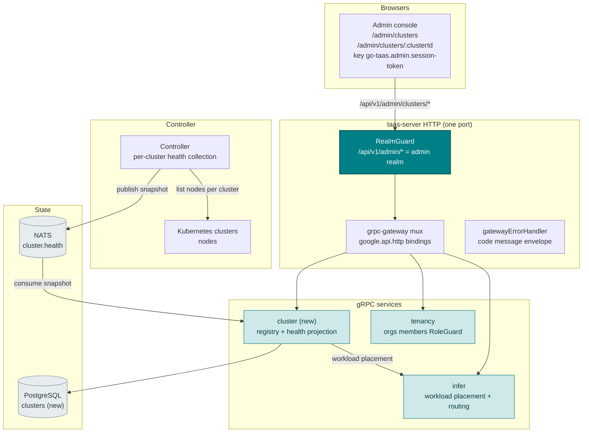
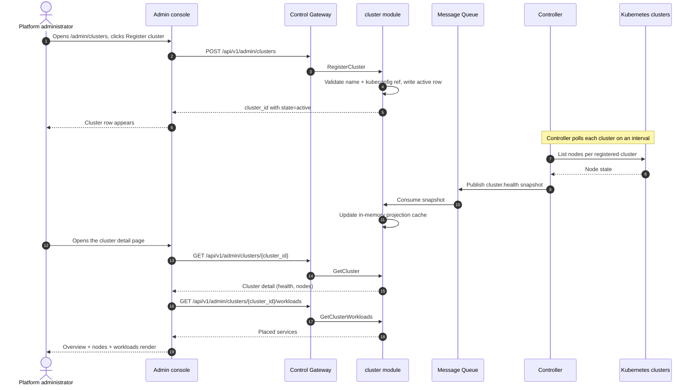
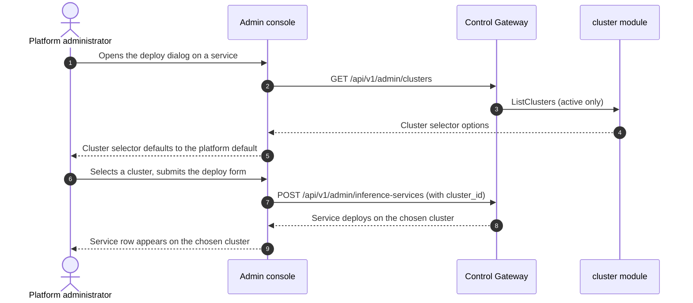

# 多集群管理 — 架构与详细设计

| 属性 | 内容 |
| --- | --- |
| 功能点 | 多集群管理 — 注册与管理推理集群、查看集群健康与工作负载放置、跨集群路由部署（backlog 第 40 行） |
| 文档范围 | 功能 40 的架构与详细设计：新的 `cluster` 模块，负责集群注册表与集群健康投影；`taas.cluster.v1.ClusterService` proto 及五个 RPC；`clusters` 表；Controller 的按集群健康采集与快照发布；部署表单中的集群选择器；管理端集群页面（`/admin/clusters`、`/admin/clusters/:clusterId`）；以及错误处理、配置、安全、上线与各层函数级设计 |
| 所属模块 | 新 `cluster` 模块（`services/cluster`）：集群注册表与集群健康投影；`infer`（只读：工作负载放置与跨集群路由）；`controller`（只读：按集群健康采集与快照发布）；`pkg/server` 网关（管理端前缀绑定）；`web` 管理端控制台（`ClustersPage`、`ClusterDetailPage`） |
| 相关文档 | [需求分析与 UI/UX 设计](../design/multi-cluster-management.md) · [架构设计](../design/architecture.md) §2.4（`infer`）、§2.7 Controller、§4.2 一键部署流程 · [加速器清单与健康](./accelerator-inventory.md)（本功能复用的 Controller → MQ → 服务投影模式与内存缓存）· [系统健康与服务状态](./system-health-status.md)（本功能扩展到集群的组件健康约定）· [模型目录与一键部署](./model-catalog-deployment.md)（本功能路由扩展的推理服务生命周期与部署表单）· [控制台面分离](./console-surface-separation.md)（两个面、`AdminShell` 约定、掩码投影规则） |
| 状态 | 架构完成，已移交给 Developer 智能体 |

---

## 1. 概述与目标

go-taas 在单一集群上以 Kubernetes Deployment 运行推理服务（model-catalog-deployment §4.2）：Controller 创建 Deployment 与 Service，加速器清单（功能 #18）上报每节点 GPU 健康。而控制台仍无法*跨多个集群运行推理*：拥有第二个集群（不同区域、不同加速器集群或突发容量池）的运维人员无法注册它、查看其健康、查看其上运行的服务或选择新部署落在何处。运维人员必须分别管理每个集群的 Kubernetes API 并手工路由部署 —— 这是控制台应拥有的运维编排逃生舱。

本功能新增**多集群管理**：注册与管理推理集群、查看集群健康与工作负载放置、跨集群路由部署。它是 Phase 4 生产化路线图最小且有独立价值的增量：把"我有第二个集群"变成"注册它、查看其健康与运行内容、选择每个部署落在何处"。

**目标**：新的 `cluster` 模块，负责集群注册表与集群健康投影；`clusters` 表；`taas.cluster.v1.ClusterService` 及五个 RPC（`RegisterCluster`、`ListClusters`、`GetCluster`、`GetClusterWorkloads`、`DisableCluster`）；Controller 的按集群健康采集与快照发布；部署表单（功能 #2）中的集群选择器；管理端集群页面（`/admin/clusters`、`/admin/clusters/:clusterId`）；cluster 块（124xx）的新错误码；页面 → 路由 → API 前缀表（精确管理端前缀）；各页面交互状态（空、错误、权限拒绝）；以及可在 compose 栈上以 Nightwatch 测试的编号验收标准。

**非目标**（延后，设计 §8）：模型目录与一键部署表单（#2）；加速器清单（#18）；系统健康与状态（#30）；自动跨集群负载均衡或故障转移（运维人员在部署时选择集群；自动路由为未来工作）；集群供给或生命周期管理（go-taas 注册既有集群，不创建它们）；用户域集群面（刻意不引入，D1）。

### 1.1 本文档阅读顺序

第 2 节记录架构决策（AD1–AD10，对应设计的 D1–D10）。第 3–5 节为组件视图、数据模型与 API 设计。第 6 节为前端架构（页面 → 路由 → API 前缀表、认证守卫）。第 7–8 节为时序流程与错误处理。第 9–11 节为配置、安全与上线。第 12–14 节为验收标准追溯、函数级详细设计与有序实现任务清单。

---

## 2. 架构决策

| # | 决策 | 理由 |
| --- | --- | --- |
| AD1 | **多集群管理仅存在于管理端面**：`/admin/clusters` + `/admin/clusters/:clusterId` + `/api/v1/admin/clusters/*`。**无用户端面** —— 集群健康与放置属于运维编排（功能 #17 的掩码投影规则）；租户经网关消费模型，而非集群内部信息 | 设计 D1。集群管理是运维编排；租户消费模型而非集群。与仅管理端的加速器清单（功能 #18）与系统状态（功能 #30）一致 |
| AD2 | **新 `cluster` 模块**（`services/cluster`）负责集群注册表与集群健康投影，拥有自己的错误块 **124xx**。它复用 infer 模块进行工作负载放置与跨集群路由 | 设计 D2。多集群是独立关注点（集群注册表 + 健康 + 放置），拥有自己的注册表与投影；专用模块使其与模型/infer 生命周期分离并赋予单一归属，符合按功能分模块的模式 |
| AD3 | **新 `clusters` 表**存储已注册集群：`cluster_id`、`name`、`region`、`kubeconfig_ref`（对集群 kubeconfig 的引用，而非密钥本身）、`state`（`active` / `disabled`）、`created_at`。集群注册一次并被部署引用 | 设计 D3。集群是一等、可复用资源（Rancher、OpenShift）；注册表避免每个部署重复输入集群凭据，并为部署表单提供集群选择器 |
| AD4 | **集群健康是对按集群 Kubernetes 状态的投影，由 Controller 采集并经 `cluster` 模块提供** —— Controller 轮询每个已注册集群的节点，向新的 `cluster.health` MQ subject 发布完整快照；`cluster` 模块维护内存投影缓存（accelerator-inventory AD1/AD11 模式） | 设计 D4。Controller 是唯一持有 Kubernetes 客户端的组件（service-logs AD2、accelerator AD1）；投影模式保持健康视图轻依赖且自愈（移除的集群从下一个快照消失） |
| AD5 | **新 `RegisterCluster` RPC** 校验集群名称与 kubeconfig 引用，写入 `active` 集群行并返回 `cluster_id`。新 `ListClusters` RPC 返回集群列表，含每集群健康与工作负载计数。新 `GetCluster` RPC 返回完整集群详情，含节点与已放置服务 | 设计 D5。集群注册表需要创建/列表/详情；三个 RPC 镜像模型列表/详情拆分与加速器清单的列表/详情拆分 |
| AD6 | **新 `DisableCluster` RPC** 将集群设为 `disabled`；禁用集群从部署表单的集群选择器与新建放置中排除，但既有服务继续运行直至运维人员显式迁移 | 设计 D6。禁用集群（维护、退役）不得拆除运行中的服务；运维人员显式迁移它们 |
| AD7 | **工作负载放置是推理服务上的集群字段**：部署表单（功能 #2）增加 **Cluster** 选择器（来自 `ListClusters`，仅 `active`），`CreateInferenceService` 记录所选 `cluster_id`。新 `GetClusterWorkloads` RPC 返回放置在集群上的服务 | 设计 D7。"跨集群路由部署"意味着运维人员在部署时选择集群；将其记录在服务上提供放置视图与路由控制 |
| AD8 | **部署表单将集群选择器默认为平台默认**（第一个 `active` 集群，或配置的默认），使既有单集群部署无需变更即可继续工作 | 设计 D8。默认值保留既有行为（单集群情形）；运维人员在多集群时覆盖它 |
| AD9 | **新错误码在 cluster 块（12401–12499）**：**12401 `CodeClusterNotFound`**、**12402 `CodeClusterExists`**、**12403 `CodeClusterStateInvalid`**、**12404 `CodeClusterKubeconfigInvalid`**。未知推理服务复用 **10301** | 设计 D9。多集群是新模块（AD2），因此其错误码位于 docs 块（122xx）之后的空白块；区分错误码使每种失败模式可操作，而 infer 契约保持统一 |
| AD10 | **页面除注册与禁用操作外只读** —— 注册表单与禁用操作写入；其余（列表、详情、健康、放置）只读且仅对访问审计 | 设计 D10。本功能的写入是注册与禁用操作；审计轨迹（功能 #15）覆盖它们。除既有写入路径外无需新增审计事件 |

---

## 3. 组件视图

### 3.1 归属

| 层 / 组件 | 拥有 | 本功能变更 |
| --- | --- | --- |
| **控制网关（`grpc-gateway`）** | 五个集群 RPC 的 HTTP/JSON 门面；域守卫（功能 #17）已以 10038 拒绝错误域会话；将 `X-Organization-Id` 作为 gRPC 元数据透传 | 新增五个 HTTP 集群 RPC 绑定（第 5 节）；域守卫不变 |
| **`cluster` 模块（`services/cluster`）** | 集群注册表、集群健康投影缓存、五个 RPC、快照消费者 | **新模块**（AD2） |
| **`infer` 模块** | 工作负载放置与跨集群路由 | 只读：infer 模块在推理服务上记录所选 `cluster_id` 并向 cluster 模块暴露它（AD7） |
| **`controller`** | 按集群健康采集与快照发布 | 读写：Controller 轮询每个已注册集群的节点并向 `cluster.health` 发布完整快照（AD4） |
| **`tenancy` 模块** | 组织、成员、角色、RoleGuard | 只读：`RoleGuard` 按调用者角色门控管理端集群 RPC（10036） |
| **PostgreSQL** | `clusters`（新） | 一张新表，经 AutoMigrate（第 4 节） |
| **消息队列** | `cluster.health`（新） | 一个新 subject（AD4） |
| **控制台** | 管理端集群页面 | 管理端面新增两页（第 6 节） |

### 3.2 运行时组件视图



### 3.3 请求身份链

集群 RPC 为**管理端面**（AD1）。链路如下：

1. `RealmGuard`（HTTP，`pkg/server/realm.go`）—— 路径前缀 `/api/v1/admin/clusters/*` 决定期望域 `admin`。无 `Authorization` 头：透传（过渡期，feature-17 AD4）。有头：从 Redis 解析会话域；不匹配 → 10038，未知/过期/无域 → 10027。
2. grpc-gateway mux —— 按注解路径路由并透传 `authorization` 与 `x-organization-id`。
3. `cluster` 处理器 —— 经 `tenancy.RoleGuard` 解析调用者角色（10036）。集群 RPC 仅管理端（AD1）；无用户绑定。
4. `tenancy.RoleGuard` —— 按调用者角色门控管理端集群 RPC（10036）。

---

## 4. 数据模型

### 4.1 `clusters` 表

| 列 | PostgreSQL 类型 | 约束 | 描述 |
| --- | --- | --- | --- |
| `id` | `uuid` | PRIMARY KEY | 服务端生成的 UUID v4，暴露为 `cluster_id` |
| `name` | `varchar(128)` | NOT NULL, UNIQUE | 集群名称，1–128 字符（重复 → 12402） |
| `region` | `varchar(64)` | NOT NULL default '' | 区域，1–64 字符（可选） |
| `kubeconfig_ref` | `varchar(512)` | NOT NULL | 对集群 kubeconfig 的引用，而非密钥本身 |
| `state` | `varchar(16)` | NOT NULL, index | `active` / `disabled` |
| `created_at` | `timestamptz` | NOT NULL | 注册时间 |

### 4.2 迁移说明

- 新表由 GORM `AutoMigrate` 在 `taas-server` 启动时创建（增量；无数据迁移）。`Migrate`/`MigrateSchemaForFVT` 增加新模型。
- 无需 init-SQL 升级路径：无既有表变更，新表在启动时自动创建。
- 集群健康投影是 `cluster` 模块中的**内存缓存**（AD4），而非表 —— 它由 Controller 的周期性完整快照发布刷新，遵循 accelerator-inventory AD1/AD11 模式。

---

## 5. API 设计

集群 RPC 属于新的 **`taas.cluster.v1.ClusterService`**（proto：`proto/taas/cluster/v1/cluster.proto`），经控制网关以 HTTP 提供。仅管理端（AD1）；**无用户前缀绑定**。

| RPC | HTTP（管理端） | HTTP（用户端） | 状态 | 用途 |
| --- | --- | --- | --- | --- |
| `RegisterCluster` | `POST /api/v1/admin/clusters` | — | **新** | 注册推理集群（名称、区域、kubeconfig 引用） |
| `ListClusters` | `GET /api/v1/admin/clusters` | — | **新** | 列出已注册集群，含健康与工作负载计数 |
| `GetCluster` | `GET /api/v1/admin/clusters/{cluster_id}` | — | **新** | 获取集群完整详情（健康、节点） |
| `GetClusterWorkloads` | `GET /api/v1/admin/clusters/{cluster_id}/workloads` | — | **新** | 列出放置在集群上的推理服务 |
| `DisableCluster` | `POST /api/v1/admin/clusters/{cluster_id}:disable` | — | **新** | 禁用集群（从新建放置中排除） |

### 5.1 Proto 契约

```protobuf
syntax = "proto3";

package taas.cluster.v1;

import "google/api/annotations.proto";
import "taas/common/v1/common.proto";

option go_package = "github.com/go-taas/go-taas/proto/taas/cluster/v1;clusterv1";

// ClusterService serves the cluster registry and the cluster-health
// projection. Admin-surface API: served under /api/v1/admin/clusters.
service ClusterService {
  // RegisterCluster registers an inference cluster (name, region,
  // kubeconfig reference) and returns cluster_id with state=active.
  rpc RegisterCluster(RegisterClusterRequest) returns (RegisterClusterResponse) {
    option (google.api.http) = {post: "/api/v1/admin/clusters"};
  }

  // ListClusters returns the registered clusters, newest first, with
  // per-cluster health and workload counts.
  rpc ListClusters(ListClustersRequest) returns (ListClustersResponse) {
    option (google.api.http) = {get: "/api/v1/admin/clusters"};
  }

  // GetCluster returns a cluster's full detail (health, nodes).
  rpc GetCluster(GetClusterRequest) returns (GetClusterResponse) {
    option (google.api.http) = {get: "/api/v1/admin/clusters/{cluster_id}"};
  }

  // GetClusterWorkloads returns the inference services placed on a
  // cluster.
  rpc GetClusterWorkloads(GetClusterWorkloadsRequest) returns (GetClusterWorkloadsResponse) {
    option (google.api.http) = {get: "/api/v1/admin/clusters/{cluster_id}/workloads"};
  }

  // DisableCluster sets a cluster disabled (exclude from new
  // placements). It is idempotent.
  rpc DisableCluster(DisableClusterRequest) returns (DisableClusterResponse) {
    option (google.api.http) = {post: "/api/v1/admin/clusters/{cluster_id}:disable"};
  }
}

message RegisterClusterRequest {
  string name = 1;
  string region = 2;
  string kubeconfig_ref = 3;
}

message RegisterClusterResponse {
  taas.common.v1.Response response = 1;
  string cluster_id = 2;
  // state is active immediately (AD5).
  string state = 3;
}

message ListClustersRequest {
  taas.common.v1.PageRequest page = 1;
}

message ListClustersResponse {
  taas.common.v1.Response response = 1;
  repeated ClusterSummary clusters = 2;
  taas.common.v1.PageMeta page_meta = 3;
}

message ClusterSummary {
  string cluster_id = 1;
  string name = 2;
  string region = 3;
  // state is active / disabled.
  string state = 4;
  // health is healthy / degraded / unknown.
  string health = 5;
  int64 node_count = 6;
  int64 service_count = 7;
  int64 last_checked_at = 8;
}

message GetClusterRequest {
  string cluster_id = 1;
}

message GetClusterResponse {
  taas.common.v1.Response response = 1;
  Cluster cluster = 2;
}

message Cluster {
  ClusterSummary summary = 1;
  repeated ClusterNode nodes = 2;
}

message ClusterNode {
  string node_id = 1;
  string name = 2;
  // status is ready / not_ready / unknown.
  string status = 3;
}

message GetClusterWorkloadsRequest {
  string cluster_id = 1;
  taas.common.v1.PageRequest page = 2;
}

message GetClusterWorkloadsResponse {
  taas.common.v1.Response response = 1;
  repeated ClusterWorkload workloads = 2;
  taas.common.v1.PageMeta page_meta = 3;
}

message ClusterWorkload {
  string service_id = 1;
  string name = 2;
  string model_id = 3;
  string state = 4;
  int64 created_at = 5;
}

message DisableClusterRequest {
  string cluster_id = 1;
}

message DisableClusterResponse {
  taas.common.v1.Response response = 1;
}
```

### 5.2 契约说明（为 Developer 智能体固定）

1. `RegisterCluster` 接受 `name`、`region`（可选）与 `kubeconfig_ref`；返回 `cluster_id` 且 `state=active`（FR1.1）。`ListClusters` 返回集群，最新在前，含每集群健康与工作负载计数（FR1.2）。
2. `GetCluster` 返回含 `nodes[]` 的完整详情；`GetClusterWorkloads` 返回已放置服务（FR2.2、FR3.1）。
3. `DisableCluster` 将集群设为 `disabled`；幂等且不拆除既有服务（AD6、FR4.1）。
4. Controller 按间隔轮询每个已注册集群的节点并向 `cluster.health` 发布完整快照；`cluster` 模块维护内存投影缓存（AD4）。
5. 部署表单（功能 #2）增加 Cluster 选择器；`CreateInferenceService` 记录所选 `cluster_id`（AD7、AD8）。
6. 线上约定不变：成功 HTTP 200，业务错误为 `{"code": <int>, "message": "..."}`，int64 字段序列化为 JSON 字符串。

### 5.3 错误码

错误码（cluster 块 12401–12499，`pkg/errors/codes.go`）：

| 条件 | 码 | 常量 | 说明 |
| --- | --- | --- | --- |
| 未知 `cluster_id` | 12401 | `CodeClusterNotFound` | **新**（AD9） |
| 重复集群名称 | 12402 | `CodeClusterExists` | **新**（AD9） |
| 无效集群状态转换 | 12403 | `CodeClusterStateInvalid` | **新**（AD9） |
| 无效 kubeconfig 引用 | 12404 | `CodeClusterKubeconfigInvalid` | **新**（AD9） |
| 未知推理服务 | 10301 | `CodeInferServiceNotFound` | 复用 —— infer 契约 |
| 数据库 / 基础设施故障 | 500 | `CodeInternal` | 经错误归一化 |

---

## 6. 前端架构

### 6.1 页面 → 路由 → API 前缀表

| 页面 / 组件 | 面 | Web 路由 | API 前缀 | 认证守卫 |
| --- | --- | --- | --- | --- |
| **集群页面** | 管理端 | `/admin/clusters` | `/api/v1/admin/clusters` | 管理端会话；RoleGuard（管理角色） |
| **集群详情页面** | 管理端 | `/admin/clusters/:clusterId` | `/api/v1/admin/clusters/{cluster_id}`、`/api/v1/admin/clusters/{cluster_id}/workloads`、`/api/v1/admin/clusters/{cluster_id}:disable` | 管理端会话；RoleGuard（管理角色） |
| **部署对话框**（既有，功能 #2） | 管理端 | `/admin/inference-services`（部署对话框） | `/api/v1/admin/inference-services`（创建，扩展） | 管理端会话；RoleGuard（管理角色） |

> 管理端集群页面仅调用 `/api/v1/admin/clusters/*` 路由；无用户端面（AD1）。页面不含 `/api/v1/*` 字符串（功能 #17）。

### 6.2 导航位置

- **管理端控制台**：管理端导航新增 **Clusters** 项（`/admin/clusters`，testid `nav-clusters`），位于运维分组，紧邻 Inference Services、Observability 与 Accelerators。

### 6.3 复用的共享组件与状态

- **API 客户端**（`web/src/api.ts`）：域作用域客户端（`createApi(realm)`）已发送 `Authorization: Bearer <realm>.session-token` 与 `X-Organization-Id`（仅当域 token 键为空时）。集群页面原样复用；不新增客户端。
- **健康徽标**：共享 `StatusBadge` 组件（来自系统状态功能）渲染 healthy / degraded / unknown 徽标（AD4）。
- **状态徽标**：共享 `StateBadge` 组件渲染 active / disabled 徽标。
- **轮询**：复用 `usePolling` 钩子（accelerator inventory 使用）轮询 `ListClusters` 以获取健康视图（AD4）。
- **部署对话框**：部署对话框（功能 #2）增加 Cluster 选择器，来自 `ListClusters`（仅 `active`），默认为平台默认（AD7、AD8）。
- **空状态 / 数据新鲜度提示**：复用 Request Logs 页面模式（提示健康在 Controller 首次快照后出现）。

### 6.4 各面认证守卫

- **管理端集群页面**（`/admin/clusters`、`/admin/clusters/:clusterId`）：在 `AdminShell` 内渲染，当 `go-taas.admin.session-token` 非空时运行管理端会话守卫；缺失/过期会话重定向到 `/admin/login?reason=expired`；错误域会话被网关以 10038 拒绝。页面 API 调用指向 `/api/v1/admin/clusters/*`。无所需角色的会话收到 10036，页面显示标准权限拒绝状态（功能 #17）。
- **未认证访客**：未认证访客被 shell 守卫重定向到 `/admin/login`。

### 6.5 控制台契约（为 Developer 智能体固定）

**集群页面**（`/admin/clusters`）：页面头部（"Clusters"，副标题 "Inference clusters and workload placement"），带 **Register cluster** 操作（`clusters-register`）与 **Refresh** 操作（`clusters-refresh`）。下方：**集群列表**表（`clusters-list`、`clusters-cluster-{id}`），列为名称（链接到详情页）、区域、状态（徽标）、健康（徽标）、节点数、服务数、最后检查时间，行操作 **View**。可按名称、区域、状态、健康、节点数排序；可按状态（All / Active / Disabled）与健康（All / Healthy / Degraded / Unknown）筛选；分页。空状态："No clusters registered."，提示注册集群；Register cluster 按钮保持可见。错误状态：错误横幅 + Retry 按钮 + "Showing stale data" 横幅。权限拒绝：标准状态，带返回管理端首页的链接。

**集群详情页面**（`/admin/clusters/:clusterId`）：页面头部（"Cluster"，副标题含集群名与 `cluster_id`），带 **Back to Clusters** 链接（`clusters-back`）、**Refresh** 操作（`clusters-refresh`）与 **Disable** 操作（`clusters-disable`，危险、次要）。下方：**概览卡片**（`clusters-overview`），含集群名称、区域、状态徽标、健康徽标、节点数、服务数与最后检查时间；**节点卡片**（`clusters-nodes`、`clusters-node-{id}`），列为节点（名称）、状态（徽标）；以及**工作负载卡片**（`clusters-workloads`、`clusters-workload-{id}`），列为服务（链接到服务详情页）、模型、状态（徽标）、创建时间，行操作 **View**。空状态："No cluster data."，提示集群在注册后出现。错误状态：错误横幅 + Retry 按钮 + "Showing stale data" 横幅。权限拒绝：标准状态，带返回管理端首页的链接。

---

## 7. 时序流程

### 7.1 注册集群并查看其健康



### 7.2 跨集群路由部署



---

## 8. 错误处理

所有错误均为统一信封中的 `pkg/errors` 业务码（第 5.3 节）。cluster 模块的写入是注册与禁用操作；健康投影只读。数据库故障归一化为 500 `CodeInternal`。

控制台按 body `code` 分支（`web/src/api.ts` 已如此），绝不按 HTTP 状态。新码 12401–12404 渲染特定内联消息。管理端页面将 10036 映射为标准权限拒绝状态（功能 #17 §8.2）。

---

## 9. 配置新增

| 键 | 默认 | 描述 |
| --- | --- | --- |
| `cluster.defaultClusterId` | `""` | 部署表单集群选择器的平台默认集群；空表示第一个 `active` 集群（AD8） |
| `controller.cluster.collectInterval` | `30s` | Controller 的按集群健康采集间隔（AD4） |

`cluster` 配置块在 `pkg/config` 中新增（`ClusterConfig`），遵循 `observability` 块模式。`controller.cluster` 块在 controller 配置中新增（`ControllerClusterConfig`）。`applyDefaults`/`Validate` 设置上述默认值。cluster 模块读取 `defaultClusterId`；Controller 读取 `collectInterval`。一个新 MQ subject（`cluster.health`）加入 `pkg/mq`。

---

## 10. 安全考量

- **仅管理端面**：集群页面仅存在于管理端面（AD1）；无用户端面。域守卫在任何处理器运行前以 10038 拒绝错误域会话（功能 #17）。
- **管理角色门控**：集群 RPC 由 `tenancy.RoleGuard` 门控 —— 仅有所需管理角色的调用者可注册、查看与禁用集群；不可访问的组织返回 10036。
- **掩码投影**：页面暴露集群健康与放置，绝不为 Pod 名或运维编排内部信息（AD1）。租户绝不见集群内部信息。
- **kubeconfig 引用而非密钥**：`clusters` 表存储 `kubeconfig_ref`（对集群 kubeconfig 的引用），绝不为密钥本身（AD3）。Controller 解析引用以连接集群。
- **写入仅为注册与禁用操作**：cluster 模块仅写入集群行；Controller 发布健康快照。审计轨迹（功能 #15）覆盖注册与禁用写入（AD10）。

---

## 11. 上线 / 升级说明

- **一张新表**：`clusters` 在 `taas-server` 启动时经 `AutoMigrate` 创建；无数据迁移、无 init-SQL 升级路径。
- **proto 变更为增量**：新 `ClusterService` 上五个新 RPC；无既有 RPC 或消息变更。网关 mux 增加新绑定；域守卫不变。
- **Controller**：按集群健康采集循环是 Controller 中的新后台循环；独立于 reconcile 循环，随 Controller 上下文取消。
- **控制台**：新页面加入既有 bundle；管理端导航增加 Clusters。部署对话框（功能 #2）增加 Cluster 选择器。
- **向后兼容**：过渡期（无会话、`X-Organization-Id`）路径为 CLI、FVT 与 e2e 套件保留；域守卫透传无 `Authorization` 头的请求（功能 #17 AD4）。部署表单将集群选择器默认为平台默认，使既有单集群部署无需变更即可继续工作（AD8）。
- **数据出现前为空**：在集群注册且 Controller 首次快照到达前 RPC 返回空列表；页面渲染空状态。

---

## 12. 验收标准追溯

| # | 标准 | 处理位置 |
| --- | --- | --- |
| AC1 | `RegisterCluster` 注册集群且 `ListClusters` 返回它，含健康与工作负载计数；重复名称返回 12402、无效 kubeconfig 引用返回 12404 | §5.1、§5.2、§4.1 |
| AC2 | `GetCluster` 返回含节点的完整详情；`GetClusterWorkloads` 返回已放置服务；未知 `cluster_id` 返回 12401 | §5.1、§5.2 |
| AC3 | `DisableCluster` 将集群设为 `disabled` 且幂等；禁用集群从新建放置中排除 | §5.1、§5.2、§7.2 |
| AC4 | `/admin/clusters` 页面在首次成功加载时渲染集群列表，含 Register cluster 操作 | §6.5 |
| AC5 | 注册集群对话框校验名称与 kubeconfig 引用，并创建以 `state=active` 出现的集群 | §6.5、§7.1 |
| AC6 | `/admin/clusters/:clusterId` 页面渲染概览、节点与工作负载卡片；Disable 操作仅对 `active` 集群启用 | §6.5 |
| AC7 | 部署表单（功能 #2）增加 Cluster 选择器，来自 `ListClusters`（仅 `active`），默认为平台默认 | §6.5、§7.2 |
| AC8 | 集群页面仅可在管理端面访问：路由 `/admin/clusters` 与 `/admin/clusters/:clusterId`，每次 API 调用使用 `/api/v1/admin/clusters/*` 前缀且无 `/api/v1/*` 字符串 | §6.1、§6.4、§10 |
| AC9 | 无所需角色的会话在集群页面收到 10036，页面显示标准权限拒绝状态 | §3.3、§6.4、§10 |

---

## 13. 详细设计（各层函数级职责）

### 13.1 Proto → 服务 → 仓库 → Controller

| 层 | 文件 | 职责 |
| --- | --- | --- |
| `proto/taas/cluster/v1` | `cluster.proto` | 新：`ClusterService` 及五个 RPC + 请求/响应消息、`ClusterSummary`、`Cluster`、`ClusterNode`、`ClusterWorkload`（第 5.1 节）。经 `buf generate` 重新生成 `cluster.pb.go`/`cluster_grpc.pb.go`/`cluster.pb.gw.go` |
| `services/cluster` | `cluster_model.go` | GORM 模型 `Cluster` + `TableName`；`state` 常量与 `kubeconfig_ref` 语法校验（AD3） |
| | `cluster_repository.go` | `CreateCluster`、`FindClusterByID`、`ListClusters`、`UpdateClusterState`（active→disabled） |
| | `projection.go` | 内存投影缓存：`sync.RWMutex` 保护的 `map[string]*ClusterHealth`，每次快照整体替换（AD4） |
| | `snapshot_consumer.go` | 订阅 `cluster.health` 的 `server.Runner`；解析快照并替换投影缓存（AD4） |
| | `service.go` | 五个 RPC；名称/kubeconfig 校验（12402/12404）；从投影缓存与 infer 模块组装健康与工作负载计数（AD4、AD7）；`RoleGuard` 接缝（10036） |
| `services/infer` | `service.go` | 只读：`CreateInferenceService` 记录所选 `cluster_id`；为 cluster 模块的工作负载视图暴露窄读 `ListServicesByCluster(ctx, clusterID)`（AD7） |
| `internal/controller` | `cluster.go` | 新采集循环：按 `collectInterval`，列出已注册集群，经其 kubeconfig 引用列出每个集群的节点，并向 `cluster.health` 发布完整快照（AD4） |
| `pkg/errors` | `codes.go`/`messages.go` | `CodeClusterNotFound`（12401）、`CodeClusterExists`（12402）、`CodeClusterStateInvalid`（12403）、`CodeClusterKubeconfigInvalid`（12404）常量 + 规范消息（AD9） |
| `pkg/config` | `api.go`/`configuration.go` | `ClusterConfig` + `defaultClusterId`（第 9 节）+ `applyDefaults`/`Validate`；`ControllerClusterConfig` + `collectInterval` |
| `pkg/mq` | `subjects.go` | `ClusterHealth` subject（AD4） |
| `apps/taas-server` | `main.go` | 注册新 `ClusterService`；将 `tenancy` RoleGuard 接入 cluster 服务；启动快照消费者 |
| `apps/controller` | `main.go` | 启动按集群健康采集循环 |
| `web/src` | `pages/ClustersPage.tsx`、`pages/ClusterDetailPage.tsx`、`App.tsx`、`api.ts`、`shells/AdminShell.tsx` | 路由 `/admin/clusters` 与 `/admin/clusters/:clusterId`；五个 RPC API 类型与调用；导航项；部署对话框 Cluster 选择器（第 6.5 节） |
| `test` | `fvt/multi_cluster_fvt_test.go`、`e2e/tests/multiCluster.js` | 第 14 节 |

### 13.2 各屏幕由哪个 React 页面/模块实现

| 屏幕 | React 模块 | 路由 | API 调用 |
| --- | --- | --- | --- |
| 集群页面（管理端） | `web/src/pages/ClustersPage.tsx` | `/admin/clusters` | `ListClusters`、`RegisterCluster` |
| 集群详情页面（管理端） | `web/src/pages/ClusterDetailPage.tsx` | `/admin/clusters/:clusterId` | `GetCluster`、`GetClusterWorkloads`、`DisableCluster` |
| 部署对话框（既有，功能 #2） | `web/src/pages/InferenceServicesPage.tsx`（部署对话框） | `/admin/inference-services` | `ListClusters`（选择器）、`CreateInferenceService`（扩展） |

---

## 14. 测试策略

- **单元**（`services/cluster`，内存 sqlite）：`cluster_repository_test.go` —— `CreateCluster`/`FindClusterByID`/`ListClusters`/`UpdateClusterState`（AC1、AC3）；名称/kubeconfig 校验返回 12402/12404（AC1）。`projection_test.go` —— 缓存每次快照整体替换（AC2）。`service_test.go` —— 五个 RPC；健康与工作负载计数组装（AC1、AC2）；禁用幂等（AC3）；管理端组织作用域返回 10036（AC9）。新文件覆盖率 ≥ 80%。
- **FVT**（`test/fvt/multi_cluster_fvt_test.go`，accelerator FVT 模式：文件 sqlite + `MigrateSchemaForFVT` + `NewForFVT` + 生产拦截器的 gRPC 服务器 + `FVTHeaderMatcher` 的网关 mux）：预置集群与投影快照，断言 `RegisterCluster`/`ListClusters`（AC1）、`GetCluster`/`GetClusterWorkloads`（AC2）、`DisableCluster` 幂等（AC3）。
- **E2E**（`test/e2e/tests/multiCluster.js`，`accelerators.js` 模式）：针对 compose 栈 —— 管理端 `/admin/clusters` 页面在首次成功加载时渲染集群列表（AC4）；注册集群对话框校验并创建以 `state=active` 出现的集群（AC5）；`/admin/clusters/:clusterId` 页面渲染概览、节点与工作负载卡片，Disable 操作仅对 `active` 集群启用（AC6）；部署表单增加来自 `ListClusters`（仅 `active`）的 Cluster 选择器，默认为平台默认（AC7）；页面仅调用 `/api/v1/admin/clusters/*` 路由、未认证访客重定向到 `/admin/login`（AC8）；无所需角色的会话收到 10036 并显示权限拒绝状态（AC9）。