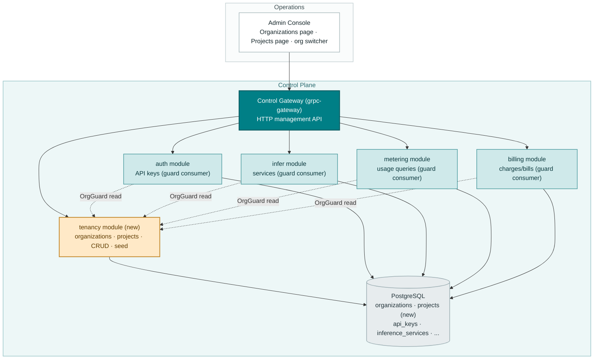
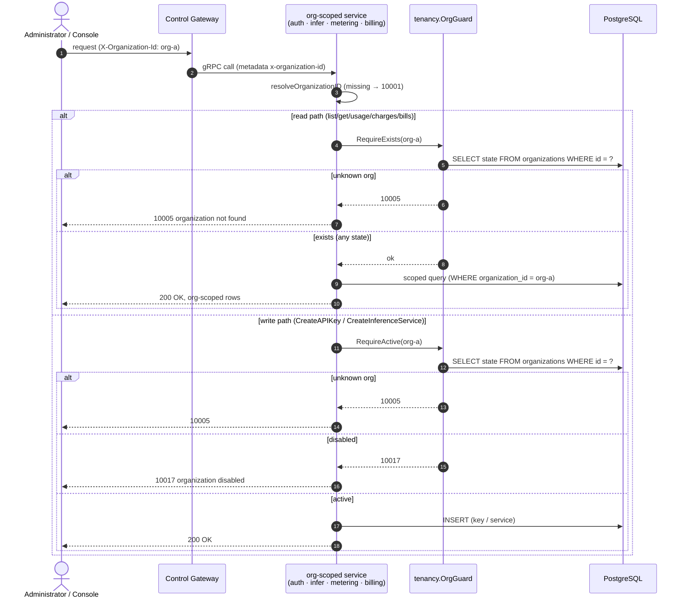
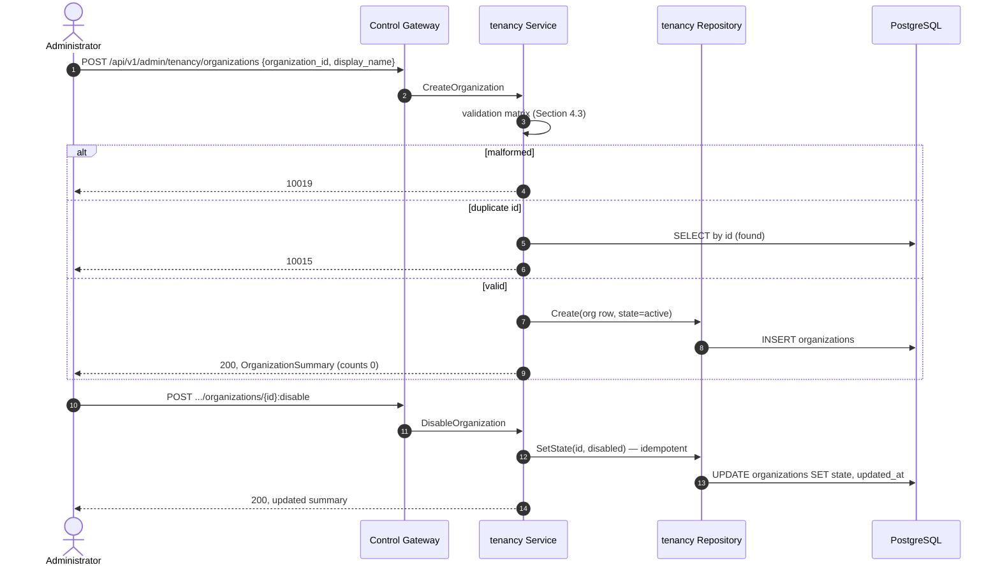
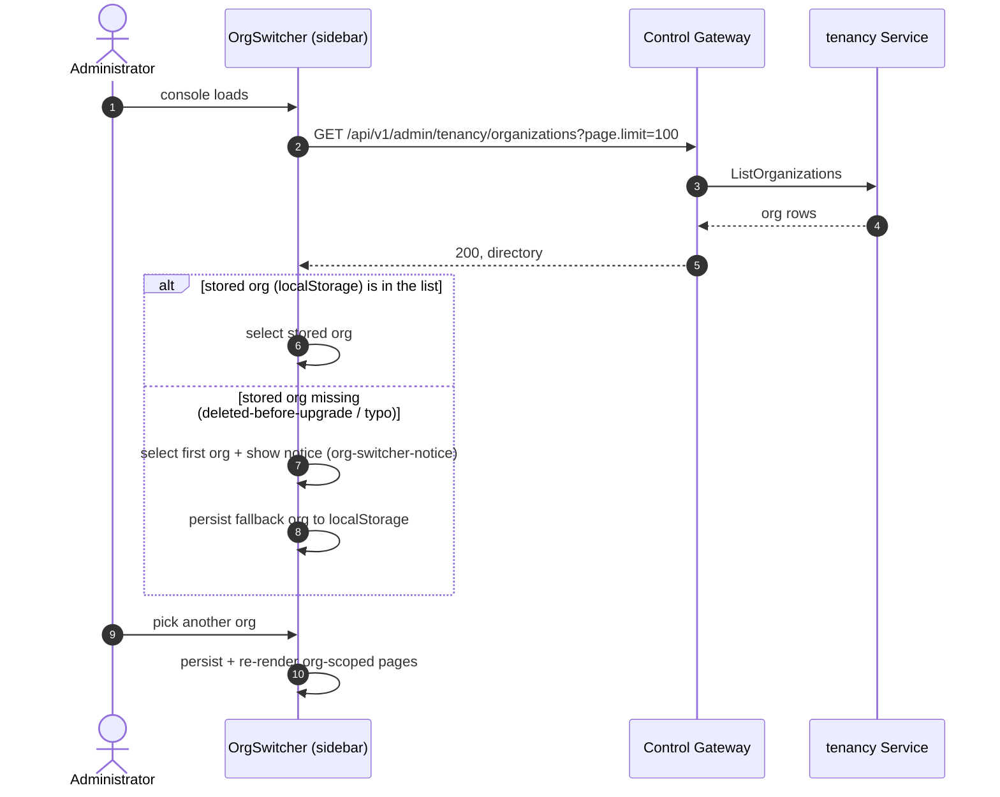

# Organization/Project Multi-Tenancy Isolation — Architecture and Detailed Design

| Attribute | Content |
| --- | --- |
| Feature point | Organization/project multi-tenancy isolation |
| Document scope | Architecture and detailed design for the tenancy core: the `organizations` and `projects` tables, the `tenancy` module (CRUD RPCs, state transitions, first-boot default-org seed), the org-context guard consumed by `auth`/`infer`/`metering`/`billing`, error handling, configuration, rollout, and function-level design per layer |
| Owning modules | `tenancy` (new: `services/tenancy`), with `auth`, `infer`, `metering`, `billing` as guard consumers (additive wiring only) |
| Related documents | [Requirement Analysis and UI/UX Design](../design/multi-tenancy.md) · [Architecture Design](../design/architecture.md) Section 2.1 · [API Key Management](./api-key-management.md) · [Token Metering Vouchers & Async Settlement](./metering.md) · [Model × Card-Type Price Matrix & Tiered Pricing](./pricing.md) |
| Status | Architecture complete, handed to the Developer agent |

---

## 1. Goals and Non-Goals

### 1.1 Goals

- Implement the new **`taas.tenancy.v1.TenancyService`** surface (proto: `proto/taas/tenancy/v1/tenancy.proto`): `CreateOrganization`, `ListOrganizations`, `GetOrganization`, `UpdateOrganization`, `DisableOrganization`, `EnableOrganization`, `CreateProject`, `ListProjects`, `GetProject`, `UpdateProject`, `DisableProject`, `EnableProject` — 12 RPCs, all platform-global under `/api/v1/admin/tenancy/*` (D8).
- **Two new tables** (D1): `organizations` and `projects` with caller-supplied immutable ids, mutable display names/descriptions, and `active`/`disabled` states. No delete in v1 (D2/D3).
- **Validated organization context** (D4/FR3): every org-scoped admin API in `auth` (List/Create/Revoke API keys), `infer` (Create/List/Get/Scale/Delete services), `metering` (vouchers, usage summary, usage records), and `billing` (charges, bills) resolves `X-Organization-Id` against the `organizations` table: missing header stays 10001; unknown id → **10005**; disabled org on the two create paths → **10017** (FR3.1/FR3.2).
- **First-boot default-org seed** (D5): `org-default` ("Default Organization", active) inserted when the `organizations` table is empty, from config; insert-only, never re-run (the feature-#3 image-seed pattern).
- **Resource counts on directory rows** (D11): `api_key_count` (non-revoked), `inference_service_count` (non-terminated), `project_count` per organization, computed with indexed COUNT queries at read time.
- **Console** (D10): Organizations page (`/admin/organizations`), Projects page (`/admin/projects`), and the sidebar org switcher upgraded from free text to a dropdown of real organizations with a stale-org fallback.
- **New error codes** (D9): 10015 `CodeOrganizationExists`, 10016 `CodeProjectExists`, 10017 `CodeOrganizationDisabled`, 10018 `CodeProjectDisabled`, 10019 `CodeTenancyInvalid`.

### 1.2 Non-Goals

| Item | Deferred to |
| --- | --- |
| Members, roles (owner/admin/member), invitations | Feature #7 (needs the account model) |
| Per-tenant sessions replacing the `X-Organization-Id` header | Feature #7 |
| Project-scoped resource columns (`project_id` on keys/services) and per-project usage views | After #7 (needs enforceable membership) |
| Per-project resource counts | Impossible in v1 (D6 adds no project column to resource tables; the design's D11 parenthetical is superseded by FR2.2, which specifies no counts on project rows) |
| Org/project quotas and spend limits | Feature #8 entanglement |
| Scale-up gating under disabled orgs (only `CreateAPIKey`/`CreateInferenceService` gate per FR3.2) | Future tightening (with #7's role model) |
| Tenant deletion with billing-evidence archival | Future (needs a retention design) |
| Hierarchical OUs / nested orgs | Future |
| Auto-backfill of `organizations` rows from distinct `organization_id` values in existing tables | Future operator tooling (rollout note explains the manual path) |
| Org-existence caching (per-request indexed read in v1) | Future optimization |

---

## 2. Component View



| Component | Responsibility in this feature |
| --- | --- |
| Control Gateway (`grpc-gateway`) | HTTP/JSON facade for the 12 tenancy RPCs under `/api/v1/admin/tenancy/*`; passes `X-Organization-Id` through as gRPC metadata (ignored by tenancy RPCs — platform-global) |
| `tenancy` module (`services/tenancy`, **new**) | The `organizations`/`projects` tables, the 12 CRUD RPCs, state transitions, the first-boot default-org seed, and the `OrgGuard` read interface consumed by the four guard consumers |
| `auth` module | Guard consumer: `ListAPIKeys`/`RevokeAPIKey` validate org existence (10005); `CreateAPIKey` additionally requires active (10017) |
| `infer` module | Guard consumer: reads validate existence; `CreateInferenceService` additionally requires active |
| `metering` module | Guard consumer: the four query RPCs validate existence (reads only — the data-plane event consumer is untouched) |
| `billing` module | Guard consumer: `ListCharges`/`ListBills` validate existence (`SetPrice`/`ListPrices` stay platform-global) |
| PostgreSQL | `organizations`, `projects` tables (new); existing org-scoped tables unchanged (D6: no project column anywhere) |
| Message Queue | **Unchanged** — tenancy is RPC-only; no new subjects, no consumers, no runners |
| Console | Organizations page, Projects page, validated org switcher (contract in Section 10.5) |

---

## 3. Data Model

### 3.1 The `organizations` Table

| Column | PostgreSQL type | Constraints | Description |
| --- | --- | --- | --- |
| `id` | `varchar(64)` | PRIMARY KEY | Caller-supplied immutable org id, `^[a-z0-9][a-z0-9-]{2,63}` (3-64 chars, lowercase) |
| `display_name` | `varchar(128)` | NOT NULL | Mutable display name, 1-128 chars |
| `description` | `varchar(1024)` | NOT NULL DEFAULT '' | Optional free text, ≤ 1024 chars |
| `state` | `varchar(16)` | NOT NULL DEFAULT 'active' | `active` or `disabled` (D2) |
| `created_at` | `timestamptz` | NOT NULL | Row creation time (UTC) |
| `updated_at` | `timestamptz` | NOT NULL | Bumped on update and state transitions |

Design notes:

- The primary key is the caller-supplied id (D1): orgs are named, addressable resources (bill ids embed the org id), not anonymous UUID rows. A duplicate insert maps to 10015 (FR1.1).
- No delete (D2): a disabled org keeps its keys, services, usage, charges, and bills readable forever (billing-evidence preservation, the feature-#4/#5 immutability reasoning).
- No foreign key from other tables' `organization_id` columns in v1: the guard validates at read time per request (FR3.1), and existing tables keep their plain string columns (zero migration). Feature #7 may add real constraints when tenancy folds into the account model.
- Ordering: `ListOrganizations` sorts `created_at DESC` — served by a `created_at` index.

### 3.2 The `projects` Table

| Column | PostgreSQL type | Constraints | Description |
| --- | --- | --- | --- |
| `id` | `varchar(64)` | PRIMARY KEY | Caller-supplied immutable project id, same syntax as org ids; **globally unique** (the `GET /projects/{project_id}` path shape demands it — the design's `(organization_id, project_id)` uniqueness is subsumed) |
| `organization_id` | `varchar(64)` | NOT NULL, index | The owning organization |
| `display_name` | `varchar(128)` | NOT NULL | Mutable display name, 1-128 chars |
| `description` | `varchar(1024)` | NOT NULL DEFAULT '' | Optional free text |
| `state` | `varchar(16)` | NOT NULL DEFAULT 'active' | `active` or `disabled` (D3) |
| `created_at` | `timestamptz` | NOT NULL | Row creation time |
| `updated_at` | `timestamptz` | NOT NULL | Bumped on update and state transitions |

Design notes:

- `idx_projects_org_created (organization_id, created_at DESC)` serves the org-filtered directory listing.
- No resource table gains a `project_id` column (D6): without per-tenant auth there is no way to enforce project membership, so a project column would be an unvalidated string — the exact free-text bug this feature fixes, one level down. Project rows are a directory + validation layer only.
- Disabling an organization does **not** cascade to its projects' states (FR2.5): the org gate is enforced at resource-creation time; project state is independent. Enabling a project under a disabled org is rejected (10017).

### 3.3 Cross-Module Read Interface: the `OrgGuard`

Following the narrow-interface pattern (`infer.NewDeleteModelGuard` consumed by `model`, `infer.NewImageInUseProvider` consumed by `image`), the `tenancy` module exposes the org-context guard (D7, FR3.3):

```go
// OrgGuard validates the transitional organization context of
// org-scoped APIs. It is a read-only interface over the organizations
// table, injected into consuming services at wiring time.
type OrgGuard struct { /* holds a *Repository */ }

func NewOrgGuard(db *gorm.DB) *OrgGuard

// RequireExists returns 10005 when the organization does not exist.
func (g *OrgGuard) RequireExists(ctx context.Context, orgID string) error

// RequireActive returns 10005 when unknown, 10017 when disabled.
func (g *OrgGuard) RequireActive(ctx context.Context, orgID string) error
```

Wiring contract (the `SetDeleteModelGuard` pattern):

- Consuming services (`auth`, `infer`, `metering`, `billing`) gain an `orgGuard *tenancy.OrgGuard` field, a `SetOrgGuard(*tenancy.OrgGuard)` setter, and an internal `checkOrg(ctx, orgID, requireActive bool) error` helper that **no-ops when the guard is nil**.
- `apps/taas-server/main.go` wires the guard into all four services after `srv.Init()` (unconditionally when the DB component exists) — production always validates.
- FVT environments wire the guard explicitly (so AC9/AC10 run through the real path); unit tests of the consuming modules leave it nil (their sqlite databases carry only the module's own tables) — the guard itself has dedicated unit tests in `services/tenancy`.
- The guard is one indexed primary-key read per request (FR3.1); no cache in v1.

---

## 4. API Contract

### 4.1 RPC Surface

All APIs belong to the new **`taas.tenancy.v1.TenancyService`**, served as HTTP via the Control Gateway. The service is platform-global: no `X-Organization-Id` header is required or consumed (D8).

| RPC | HTTP | Status | Purpose |
| --- | --- | --- | --- |
| `CreateOrganization` | `POST /api/v1/admin/tenancy/organizations` | **new** | Create a tenant; caller-supplied id |
| `ListOrganizations` | `GET /api/v1/admin/tenancy/organizations` | **new** | The directory; paginated; `state` filter; resource counts per row |
| `GetOrganization` | `GET /api/v1/admin/tenancy/organizations/{organization_id}` | **new** | One tenant; 10005 when unknown |
| `UpdateOrganization` | `PATCH /api/v1/admin/tenancy/organizations/{organization_id}` | **new** | Edit display name/description; id and state immutable |
| `DisableOrganization` | `POST /api/v1/admin/tenancy/organizations/{organization_id}:disable` | **new** | `active` → `disabled`; idempotent |
| `EnableOrganization` | `POST /api/v1/admin/tenancy/organizations/{organization_id}:enable` | **new** | `disabled` → `active`; idempotent |
| `CreateProject` | `POST /api/v1/admin/tenancy/projects` | **new** | Create a project; org must exist and be active |
| `ListProjects` | `GET /api/v1/admin/tenancy/projects` | **new** | Project directory; `organization_id` + `state` filters |
| `GetProject` | `GET /api/v1/admin/tenancy/projects/{project_id}` | **new** | One project; 10006 when unknown |
| `UpdateProject` | `PATCH /api/v1/admin/tenancy/projects/{project_id}` | **new** | Edit display name/description |
| `DisableProject` | `POST /api/v1/admin/tenancy/projects/{project_id}:disable` | **new** | Idempotent |
| `EnableProject` | `POST /api/v1/admin/tenancy/projects/{project_id}:enable` | **new** | Blocked while the org is disabled (10017) |

New messages: `OrganizationSummary {organization_id, display_name, description, state, api_key_count, inference_service_count, project_count, created_at, updated_at}` and `ProjectSummary {project_id, organization_id, display_name, description, state, created_at, updated_at}` (all int64 fields serialize as JSON strings — constraint 3 in the design's Section 6).

### 4.2 Wire Format (established conventions)

- Pagination binds as `?page.offset=0&page.limit=20` (dotted form); default limit 20, cap 100; both lists sort newest first (`created_at DESC`).
- Success responses are HTTP 200; business errors render as `{"code": <int>, "message": "..."}`.
- `Update*` replaces both `display_name` and `description` (no field masks): `display_name` must be valid (10019 otherwise); an empty `description` clears it. The console's edit dialog always sends both.
- `Disable*`/`Enable*` take the id from the path and an empty body; they return the updated summary so the console can refresh the row without a refetch.
- Filters: `ListOrganizations?state=`, `ListProjects?organization_id=&state=`; an unknown `state` value → 10019.
- The tenancy RPCs ignore `X-Organization-Id` entirely (platform-global); the header keeps its meaning on every org-scoped API of the four consumers.

### 4.3 Validation Matrix (synchronous)

`CreateOrganization` runs these checks in order; the first failure returns immediately and nothing is written (AC1):

| # | Check | Failure code |
| --- | --- | --- |
| 1 | `organization_id` matches `^[a-z0-9][a-z0-9-]{2,63}$` | 10019 `CodeTenancyInvalid` |
| 2 | `display_name` 1-128 chars after trim | 10019 |
| 3 | `description` ≤ 1024 chars | 10019 |
| 4 | id not already present | 10015 `CodeOrganizationExists` |

`CreateProject` (AC5):

| # | Check | Failure code |
| --- | --- | --- |
| 1 | `project_id` matches the org-id regex | 10019 |
| 2 | `organization_id` non-empty | 10019 |
| 3 | `display_name` 1-128 chars after trim | 10019 |
| 4 | `description` ≤ 1024 chars | 10019 |
| 5 | organization exists | 10005 `CodeOrganizationNotFound` |
| 6 | organization is `active` | 10017 `CodeOrganizationDisabled` |
| 7 | project id not already present | 10016 `CodeProjectExists` |

`UpdateOrganization`/`UpdateProject`: unknown id → 10005/10006; `display_name` 1-128 → 10019; `description` ≤ 1024 → 10019. `Disable*`/`Enable*`: unknown id → 10005/10006; `EnableProject` under a disabled org → 10017; otherwise idempotent success. List filters: unknown `state` value → 10019.

### 4.4 Tenancy State Model

```mermaid
stateDiagram-v2
    state "organization" {
        [*] --> active: CreateOrganization
        active --> disabled: DisableOrganization (idempotent)
        disabled --> active: EnableOrganization (idempotent)
    }
    state "project" {
        [*] --> active: CreateProject (org must be active)
        active --> disabled: DisableProject (idempotent)
        disabled --> active: EnableProject (blocked while org disabled → 10017)
    }
```

- States transition **only** through the disable/enable endpoints — never through `Update*` (design contract constraint 1).
- A disabled organization blocks: `CreateAPIKey`, `CreateInferenceService` (10017, FR3.2), `CreateProject` (10017), `EnableProject` (10017). Reads of every org-scoped API keep working (history stays visible).
- Revoking an API key under a disabled org stays **allowed**: revocation reduces risk, it never accrues spend (documented deviation from a blanket "writes blocked" rule).

### 4.5 Message Contracts

None. Tenancy is RPC-only: no MQ subjects, no consumers, no runners (Section 2). The data-plane metering path is untouched — ingestion never validates org existence (events carry real key ids; blocking ingestion would lose usage evidence).

---

## 5. Sequence Diagrams

### 5.1 Validated Organization Context (the guard in the four consumers)



### 5.2 Organization Create and State Transition



### 5.3 First-Boot Default-Organization Seed (D5)

```mermaid
sequenceDiagram
    autonumber
    participant MAIN as taas-server main
    participant S as tenancy Service
    participant R as tenancy Repository
    participant DB as PostgreSQL

    MAIN->>S: Migrate(ctx) — during srv.Init()
    S->>DB: AutoMigrate(organizations, projects)
    S->>R: CountOrganizations()
    R->>DB: SELECT COUNT(*) FROM organizations
    alt count == 0 (first boot)
        S->>R: Create(default org from config:<br/>id org-default, "Default Organization", active)
        R->>DB: INSERT organizations
        Note over S,DB: existing deployments sending<br/>X-Organization-Id: org-default keep working
    else count > 0
        S-->>MAIN: skip (never re-seeded; deletions stick, edits win)
    end
```

### 5.4 Console Org Switcher with Stale-Org Fallback (FR4.3)



---

## 6. Error Handling

All errors are `pkg/errors` business codes in the unified envelope. Five new codes are allocated in the auth/tenancy block (D9); 10005/10006 already exist and now actually trigger.

| Condition | Code | Constant | Notes |
| --- | --- | --- | --- |
| Unknown organization on any org-scoped API | 10005 | `CodeOrganizationNotFound` | Existing; the guard's `RequireExists` |
| Unknown project | 10006 | `CodeProjectNotFound` | Existing |
| Duplicate organization id | 10015 | `CodeOrganizationExists` | **New**; canonical message "organization already exists" |
| Duplicate project id | 10016 | `CodeProjectExists` | **New**; "project already exists" |
| Disabled organization on a gated write | 10017 | `CodeOrganizationDisabled` | **New**; "organization disabled" |
| Disabled project on a gated write | 10018 | `CodeProjectDisabled` | **New**; "project disabled" (reserved: no v1 write path gates on project state; `EnableProject` under a disabled org reuses 10017) |
| Malformed ids/names, bad filters | 10019 | `CodeTenancyInvalid` | **New**; "tenancy invalid" |
| Missing `X-Organization-Id` on org-scoped APIs | 10001 | `CodeUnauthorized` | Unchanged (the `resolveOrganizationID` pattern) |
| Database failure | 500 | `CodeInternal` | Via error normalization |

The guard maps GORM `ErrRecordNotFound` to 10005 and everything else passes through error normalization (500). Duplicate inserts race safely: the primary key is the arbiter — a concurrent duplicate create maps its unique-violation error to 10015 (the `CreateImage` pattern).

---

## 7. Configuration Additions

A new top-level `tenancy` config section (the design's D5 named `auth.tenancy.defaultOrgId`; this is refined to a standalone section because the module is standalone per D7 — the design's own module-placement decision wins over its config-path shorthand):

| Key | Default | Description |
| --- | --- | --- |
| `tenancy.defaultOrgId` | `"org-default"` | The org id seeded on first boot (D5); must match the org-id regex |
| `tenancy.defaultOrgDisplayName` | `"Default Organization"` | The seeded org's display name |

Rules:

- `Configuration.applyDefaults` fills both when empty; `Validate` gains: `defaultOrgId` non-empty and matching `^[a-z0-9][a-z0-9-]{2,63}$` (a `FieldError` otherwise), `defaultOrgDisplayName` 1-128 chars.
- `configs/server.yaml` and `configs/config.yaml` gain the `tenancy` section with the default values, documented inline.
- The seed reads config at Migrate time (config is parsed before `srv.Init()` runs migrators).

---

## 8. Security Considerations

- **Closing the free-text hole** (D4): the transitional header becomes a validated context — a typo'd org id now fails loudly (10005) instead of silently forking a tenant. This is a data-integrity fix as much as an access control.
- **Disable as the operator's lever** (D2): a disabled org cannot accrue new keys or services (10017) while all history stays readable — the reversible alternative to deletion.
- **Platform-global admin surface** (D8): the tenancy RPCs manage all tenants and sit on the admin surface (`/api/v1/admin/...`) with the platform's transitional auth posture (replaced by feature #7's sessions); they never consume the org header, so one tenant cannot use the header to scope another tenant's directory reads.
- **No secrets in tenancy rows**: ids, names, descriptions, states, timestamps only.
- **Counts are non-sensitive aggregates**: row counts per org, computed at read time; no per-resource data leaks through the directory.
- **Query cost bounds**: pagination cap 100 and per-row indexed COUNTs bound every directory query (three COUNTs per org row, each hitting an org-priority index).

---

## 9. Rollout Notes

- **Schema**: two new tables (`organizations`, `projects`) via AutoMigrate on first start; additive only — no existing table or column changes (D6).
- **Proto**: one new file (`proto/taas/tenancy/v1/tenancy.proto`), one new service — `make pbgen` required; generated code is not committed.
- **Wiring**: `apps/taas-server/main.go` registers the tenancy service (first, so its Migrate + seed run before the consumers' migrates — order is not functionally required, only tidy) and wires `tenancy.NewOrgGuard(gormDB)` into `auth`, `infer`, `metering`, `billing` after `srv.Init()` (the delete-guard block).
- **Breaking tightening (called out)**: unknown org ids on org-scoped APIs change from empty results to **10005**. Two audiences must act:
  1. **Existing deployments**: org ids that appear in `api_keys`/`inference_services`/`usage_records`/`charge_records` but were never "created" stop resolving. Operators create those organizations once via the console or `POST /api/v1/admin/tenancy/organizations` (the id must match the regex). The seeded `org-default` covers the console default out of the box.
  2. **Test suites**: every FVT env and e2e suite that uses ad-hoc org ids (`org-fvt`, `org-a`, `org-b`, `org-e2e-${runId}`) must create those orgs first — FVT envs insert rows directly after `tenancy.MigrateSchemaForFVT(db)`; e2e suites gain an `api.ensureOrg(browser, orgId)` helper (POST the org; 10015 = already exists = fine) called in `beforeEach`.
- **Upgrade compatibility**: the feature is otherwise purely additive — no MQ changes, no data-plane changes, no changes to existing RPC wire formats.
- **Rolling update order**: deploy `taas-server` alone; on boot the migrator creates the tables and seeds the default org; the guard activates with the new binary. A rollback simply leaves two unused tables behind.

---

## 10. Detailed Design

### 10.1 File Layout

| Module | File | Contents |
| --- | --- | --- |
| `proto/taas/tenancy/v1` | `tenancy.proto` | The `TenancyService` (12 RPCs) + request/response/summary messages |
| `services/tenancy` | `tenancy_model.go` | GORM models `Organization`, `Project` + `TableName` + state constants |
| | `tenancy_repository.go` | `Repository` (org/project CRUD, state transitions, counts, `CountOrganizations`, `SeedDefaultOrganization`) |
| | `guard.go` | `OrgGuard` — `NewOrgGuard`, `RequireExists`, `RequireActive` |
| | `service.go` | The 12 RPC implementations + `Migrate` (AutoMigrate + first-boot seed) + `NewForFVT` + `MigrateSchemaForFVT` |
| `services/auth` | `service.go` | `orgGuard` field + `SetOrgGuard` + `checkOrg` + checks in `ListAPIKeys`/`CreateAPIKey`/`RevokeAPIKey` (additive) |
| `services/infer` | `service.go` | Same wiring; checks in all five RPCs (additive) |
| `services/metering` | `service.go` | Same wiring; checks in the four query RPCs (additive) |
| `services/billing` | `service.go` | Same wiring; checks in `ListCharges`/`ListBills` (additive) |
| `pkg/errors` | `codes.go`, `messages.go` | 10015-10019 + canonical messages |
| `pkg/config` | `api.go`, `configuration.go` | `TenancyConfig` + defaults/validation |
| `apps/taas-server` | `main.go` | Register tenancy; wire the OrgGuard into the four consumers |
| `configs` | `server.yaml`, `config.yaml` | The `tenancy` section |
| `web/src` | `pages/OrganizationsPage.tsx`, `pages/ProjectsPage.tsx` | The two directory pages |
| | `org.tsx` | OrgSwitcher → real-org dropdown with fallback |
| | `App.tsx`, `api.ts` | Routes/nav items; `OrganizationSummary`/`ProjectSummary` types |
| `test/fvt` | `tenancy_fvt_test.go` | The tenancy FVT (AC1-AC11) |
| | `auth_apikey_fvt_test.go`, `model_infer_fvt_test.go`, `metering_fvt_test.go`, `pricing_fvt_test.go` | Seed orgs + wire guards (regression, AC11) |
| `test/e2e` | `tests/tenancy.js`, `page-objects/api.js` | The tenancy e2e (AC12-AC15) + `ensureOrg` helper |
| | `tests/*.js` (5 existing suites) | `ensureOrg` in `beforeEach` (regression) |

### 10.2 `tenancy` Module

GORM models (single source of truth):

```go
// Organization lifecycle states (D2).
const (
    OrgStateActive   = "active"
    OrgStateDisabled = "disabled"
)

type Organization struct {
    ID          string    `gorm:"primaryKey;size:64"`
    DisplayName string    `gorm:"size:128;not null"`
    Description string    `gorm:"size:1024;not null;default:''"`
    State       string    `gorm:"size:16;not null;default:'active'"`
    CreatedAt   time.Time `gorm:"index"`
    UpdatedAt   time.Time
}

func (Organization) TableName() string { return "organizations" }

type Project struct {
    ID             string    `gorm:"primaryKey;size:64"`
    OrganizationID string    `gorm:"size:64;not null;index:idx_projects_org_created,priority:1"`
    DisplayName    string    `gorm:"size:128;not null"`
    Description    string    `gorm:"size:1024;not null;default:''"`
    State          string    `gorm:"size:16;not null;default:'active'"`
    CreatedAt      time.Time `gorm:"index:idx_projects_org_created,priority:2,sort:DESC"`
    UpdatedAt      time.Time
}

func (Project) TableName() string { return "projects" }
```

`Repository` (embeds `database.BaseRepository[Organization]`, holds a `*database.Manager` — the established pattern):

- `CreateOrganization(ctx, org *Organization) error` — INSERT; a unique violation on the PK maps to 10015 (the `CreateImage` error-mapping pattern).
- `FindOrganization(ctx, id string) (*Organization, error)` — `ErrRecordNotFound` passes through (the caller maps to 10005).
- `ListOrganizations(ctx, filter OrgFilter) ([]*Organization, int64, error)` — `state` filter, `created_at DESC`, offset/limit, total count.
- `UpdateOrganization(ctx, id, displayName, description string) (*Organization, error)` — `UPDATE ... SET display_name, description, updated_at`; re-selects the row.
- `SetOrganizationState(ctx, id, state string) (*Organization, error)` — `UPDATE ... SET state, updated_at WHERE id = ?`; idempotent (rows already in the target state just bump `updated_at`); re-selects.
- `CreateProject(ctx, project *Project) error` — PK violation maps to 10016.
- `FindProject(ctx, id string) (*Project, error)`.
- `ListProjects(ctx, filter ProjectFilter) ([]*Project, int64, error)` — `organization_id` + `state` filters, `created_at DESC`, paginated.
- `UpdateProject(ctx, id, displayName, description string) (*Project, error)`.
- `SetProjectState(ctx, id, state string) (*Project, error)`.
- `CountOrganizations(ctx) (int64, error)` — gates the first-boot seed (the `CountAll` pattern).
- `SeedDefaultOrganization(ctx, id, displayName string) error` — insert-only; an existing row is left untouched (never re-seeded).
- Counts (read-time, D11): `APIKeyCountByOrganization(ctx, orgID) (int64, error)` — `SELECT COUNT(*) FROM api_keys WHERE organization_id = ? AND revoked = false`; `InferenceServiceCountByOrganization(ctx, orgID)` — `... WHERE organization_id = ? AND state != 'terminated'`; `ProjectCountByOrganization(ctx, orgID)` — `... FROM projects WHERE organization_id = ?`. Plain table-name SQL over the existing tables (dialect-free; no GORM models of foreign tables — the guard/count pattern reads siblings' tables by name, exactly how `AcceleratorTypesByServiceIDs` reads `inference_services` from `billing`).

`guard.go`:

```go
type OrgGuard struct{ repo *Repository }

func NewOrgGuard(db *gorm.DB) *OrgGuard

func (g *OrgGuard) RequireExists(ctx context.Context, orgID string) error {
    _, err := g.repo.FindOrganization(ctx, orgID)
    if errors.Is(err, gorm.ErrRecordNotFound) {
        return apierrors.New(apierrors.CodeOrganizationNotFound)
    }
    return err
}

func (g *OrgGuard) RequireActive(ctx context.Context, orgID string) error {
    org, err := g.repo.FindOrganization(ctx, orgID)
    if errors.Is(err, gorm.ErrRecordNotFound) {
        return apierrors.New(apierrors.CodeOrganizationNotFound)
    }
    if err != nil {
        return err
    }
    if org.State != OrgStateActive {
        return apierrors.New(apierrors.CodeOrganizationDisabled)
    }
    return nil
}
```

`service.go`:

- `Service` implements `tenancyv1.TenancyServiceServer`, `server.Service`, `server.ServiceWithGateway`, and `server.Migrator`; `repo` is lazy from components (the metering pattern), `NewForFVT(db)` wires it directly.
- `Migrate(ctx)`: AutoMigrate both models, then the first-boot seed — `CountOrganizations == 0` → `SeedDefaultOrganization(cfg.Tenancy.DefaultOrgId, cfg.Tenancy.DefaultOrgDisplayName)`; non-empty → skip with an info log (Section 5.3).
- `MigrateSchemaForFVT(db)`: AutoMigrate both models (FVT-only helper).
- RPC implementations follow the validation matrices in Section 4.3; each returns the `OrganizationSummary`/`ProjectSummary` (counts filled by the count helpers for org rows). `EnableProject` re-checks the org state before flipping (10017). `CreateProject` checks org existence and state via the repository (not the guard — the guard is the cross-module surface; internal calls use the repo directly).
- `summarizeOrganization(row, keyCount, svcCount, projectCount)` and `summarizeProject(row)` map rows to protos; int64 counts flow through `clampInt64`-style helpers (the `clampInt32` pattern).

### 10.3 `pkg/errors`, `pkg/config` (additive)

- `codes.go`: the auth block gains `CodeOrganizationExists Code = 10015`, `CodeProjectExists Code = 10016`, `CodeOrganizationDisabled Code = 10017`, `CodeProjectDisabled Code = 10018`, `CodeTenancyInvalid Code = 10019`.
- `messages.go`: "organization already exists", "project already exists", "organization disabled", "project disabled", "tenancy invalid".
- `api.go`: `TenancyConfig{DefaultOrgID string `mapstructure:"defaultOrgId"`, DefaultOrgDisplayName string `mapstructure:"defaultOrgDisplayName"`}`; `Configuration` gains `Tenancy TenancyConfig `mapstructure:"tenancy"``.
- `configuration.go`: `applyDefaults` fills `org-default` / `Default Organization` when empty; `Validate` adds the Section 7 rules (regex + length checks via `FieldError`).

### 10.4 Guard Consumers and `apps/taas-server/main.go` (additive)

Each of the four consuming services (`auth`, `infer`, `metering`, `billing`) gains identical wiring:

```go
// orgGuard validates the transitional organization context against the
// organizations table (feature #6). Nil until wired: unit tests skip
// validation; main.go and FVT always wire it.
orgGuard *tenancy.OrgGuard

// SetOrgGuard injects the tenancy read guard (the SetDeleteModelGuard
// pattern).
func (s *Service) SetOrgGuard(g *tenancy.OrgGuard) { s.orgGuard = g }

// checkOrg validates the org context: existence on reads, active state
// on gated writes. No-op when the guard is not wired.
func (s *Service) checkOrg(ctx context.Context, orgID string, requireActive bool) error {
    if s.orgGuard == nil {
        return nil
    }
    if requireActive {
        return s.orgGuard.RequireActive(ctx, orgID)
    }
    return s.orgGuard.RequireExists(ctx, orgID)
}
```

Check placement (after `resolveOrganizationID`, before any query):

| Service | RPC | Check |
| --- | --- | --- |
| `auth` | `ListAPIKeys` | exists |
| | `CreateAPIKey` | **active** (10017, FR3.2) |
| | `RevokeAPIKey` | exists (revocation stays allowed under disabled orgs) |
| `infer` | `CreateInferenceService` | **active** (10017, FR3.2) |
| | `ListInferenceServices`, `GetInferenceService`, `ScaleInferenceService`, `DeleteInferenceService` | exists |
| `metering` | `ListVouchers`, `GetVoucher`, `GetUsageSummary`, `ListUsageRecords` | exists |
| `billing` | `ListCharges`, `ListBills` | exists |

`VerifyAPIKey` (the data-plane RPC) does **not** check — key verification is keyed by the key's hash, and the org on the verdict is the key's stored org (already real data). The metering event consumer does **not** check (Section 4.5).

`main.go` (after `srv.Init()`, beside the delete-guard block):

```go
tenancySvc := tenancy.New(srv.Components())
srv.RegisterService(tenancySvc) // registered first; Migrate seeds org-default

// ... after Init:
if dbComponent := srv.Components().DB(); dbComponent != nil {
    if gormDB, ok := dbComponent.GormDB().(*gorm.DB); ok {
        orgGuard := tenancy.NewOrgGuard(gormDB)
        authSvc.SetOrgGuard(orgGuard)
        inferSvc.SetOrgGuard(orgGuard)
        meteringSvc.SetOrgGuard(orgGuard)
        billingSvc.SetOrgGuard(orgGuard)
        // ... existing delete-guard wiring
    }
}
```

(The four services' constructors move into local variables so the guard can be set — a mechanical change.)

### 10.5 Console Contract

**Organizations page** (`/admin/organizations`, first nav item — the operator's directory):

- Directory table `orgs-table`: one row per org `org-row-{id}` — id (mono), display name, `StateBadge` (active/disabled), key count, service count, project count, created time.
- "Create organization" button `create-org` opens dialog `create-org-dialog` with `org-id-input`, `org-name-input`, `org-desc-input`, save `org-save`; inline 10015/10019 errors via `ErrorBanner` inside the dialog.
- Row actions: edit `org-edit-{id}` opens `edit-org-dialog` (`org-edit-name-input`, `org-edit-desc-input`, `org-edit-save`); disable `org-disable-{id}` / enable `org-enable-{id}` opens `org-confirm-dialog` (`org-confirm-ok`, `org-confirm-cancel`) warning that new keys and services will be blocked.
- Empty state `orgs-empty`; 60-second poll while visible; `Pagination`.

**Projects page** (`/admin/projects`, second nav item):

- Org filter dropdown `project-org-filter` (options from `ListOrganizations`, `project-org-option-{id}`); directory table `projects-table` with `project-row-{id}` — id, org, display name, state badge, created.
- "Create project" `create-project` opens `create-project-dialog` with `project-org-select` (`project-org-select-option-{id}`), `project-id-input`, `project-name-input`, `project-desc-input`, save `project-save`; inline 10016/10017/10019.
- Row actions `project-edit-{id}`, `project-disable-{id}`/`project-enable-{id}` with `project-confirm-dialog`; empty state `projects-empty`; 60-second poll; `Pagination`.

**Org switcher** (`org.tsx`, upgraded): fetches `GET /api/v1/admin/tenancy/organizations?page.limit=100` on mount (header ignored server-side); renders `select` `org-switcher-select` with `org-switcher-option-{id}` per org; the stored localStorage org wins when present in the list, else the first org is selected, persisted, and a notice `org-switcher-notice` is shown (FR4.3, AC14). `web/src/api.ts` gains `OrganizationSummary` and `ProjectSummary` types (int64-as-string fields).

### 10.6 Testing Strategy

**Unit tests** (`services/tenancy`, sqlite in-memory per test):

- `tenancy_repository_test.go`: org create/find/list+filter/update/state transitions (idempotent)/counts (seeded api_keys + inference_services rows)/`CountOrganizations`/seed-once (AC1-AC4, AC8).
- `guard_test.go`: `RequireExists` unknown → 10005; `RequireActive` unknown → 10005, disabled → 10017, active → nil (AC9/AC10 semantics).
- `service_test.go` (the framework pattern): the full validation matrices (10019/10015/10016/10017 paths), project-under-disabled-org enable → 10017 (AC5, AC7), summaries carry counts (AC2).

**FVT** (`test/fvt/tenancy_fvt_test.go`, the pricing FVT pattern): file-backed sqlite + `tenancy.MigrateSchemaForFVT` + the four consumers' schemas + recordingBus + gRPC server with the production interceptor + gateway mux with `FVTHeaderMatcher`. The env wires `tenancy.NewOrgGuard(db)` into real `auth`/`infer`/`metering`/`billing` services (the production path). Walks AC1-AC11: org CRUD through the gateway (AC1-AC4), list with counts + state filter (AC2), project CRUD + validations (AC5-AC7), seed-once (AC8), **10005 on unknown org across every consumer's read APIs** (AC9), **10017 on CreateAPIKey/CreateInferenceService under a disabled org + reads still working** (AC10), and the regression flows for an active org (AC11: key create → list, service create → list, usage summary, charges, bills).

**FVT regression updates** (AC11): the four existing envs (`auth_apikey`, `model_infer`, `metering`, `pricing`) add `tenancy.MigrateSchemaForFVT(db)` + direct org-row inserts for their org ids (`org-fvt`, `org-a`, `org-b`) + `SetOrgGuard(tenancy.NewOrgGuard(db))` on the constructed services — every existing FVT then exercises the production validation path and keeps passing.

**E2E** (`test/e2e/tests/tenancy.js`, tags `['tenancy', 'feature-06']`, the pricingBills.js pattern): against the compose stack — Organizations page renders + create via dialog (row appears) + edit + disable/enable with confirmation + inline 10015/10019 (AC12); Projects page with org filter + create + disable (AC13); org switcher lists real orgs and switching changes org-scoped data + stale-org fallback notice (AC14); empty states on a fresh stack (AC15 — the compose DB persists, so the empty-state case uses a fresh org filter on Projects). `page-objects/api.js` gains `ensureOrg(browser, orgId)` (POST the org; 10015 tolerated) and the five existing suites call it for their `orgA`/`orgB` in `beforeEach` (regression, AC11).

**Regression**: all six e2e suites green; the full Go test suite (15 packages + tenancy) green; `make lint` and commitlint pass.

### 10.7 Acceptance Criteria Coverage

| AC | Addressed by | Verification hook |
| --- | --- | --- |
| AC1 — org create/get/dup 10015/malformed 10019 | Validation matrix + `CreateOrganization` | Unit + FVT + E2E |
| AC2 — list newest-first paginated with counts + state filter | `ListOrganizations` + count helpers | Unit + FVT |
| AC3 — update only name/desc; unknown 10005 | `UpdateOrganization` | Unit + FVT |
| AC4 — disable/enable idempotent, bump updated_at | `SetOrganizationState` | Unit + FVT |
| AC5 — project create validations (10016/10005/10017) | `CreateProject` matrix | Unit + FVT |
| AC6 — project list/get filters; unknown 10006 | `ListProjects`/`FindProject` | Unit + FVT |
| AC7 — project state transitions; enable under disabled org 10017 | `SetProjectState` + org re-check | Unit |
| AC8 — default org seeded once | `Migrate` seed + `CountOrganizations` gate | Unit |
| AC9 — 10005 on unknown org across all consumers' reads | `OrgGuard.RequireExists` wired in four services | FVT |
| AC10 — 10017 on CreateAPIKey/CreateInferenceService for disabled org; reads open | `OrgGuard.RequireActive` on the two create paths | FVT |
| AC11 — regression: active-org flows unchanged | Guard no-op for valid orgs; FVT/e2e seeding | FVT + E2E regression |
| AC12 — Organizations page flows | Console contract (10.5) | E2E |
| AC13 — Projects page flows | Console contract (10.5) | E2E |
| AC14 — org switcher real dropdown + fallback | `org.tsx` upgrade | E2E |
| AC15 — empty states | Console contract (10.5) | E2E |

---

## 11. Deferred Items

| Item | Deferred to |
| --- | --- |
| Members, roles, invitations; per-tenant sessions replacing the header | Feature #7 |
| Project-scoped resource columns and per-project usage views | After #7 |
| Per-project resource counts | Impossible in v1 (D6); revisit with #7 |
| Scale-up gating under disabled orgs | Future tightening (with #7's roles) |
| Org/project quotas and spend limits | Feature #8 |
| Tenant self-service portal | Feature #7 |
| Auto-backfill of org rows from existing data | Future operator tooling |
| Org-existence caching (per-request read in v1) | Future optimization |
| Tenant deletion with evidence archival | Future (retention design) |
| Hierarchical OUs | Future |
| CLI tenancy commands | When the CLI surface is next touched |
