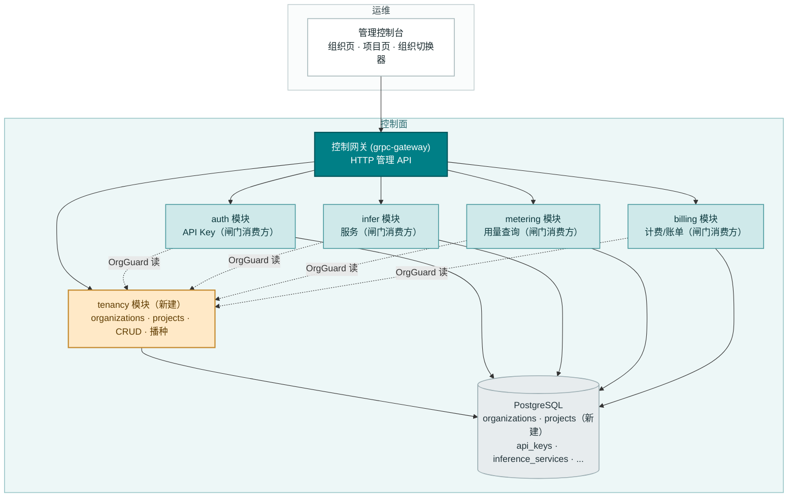
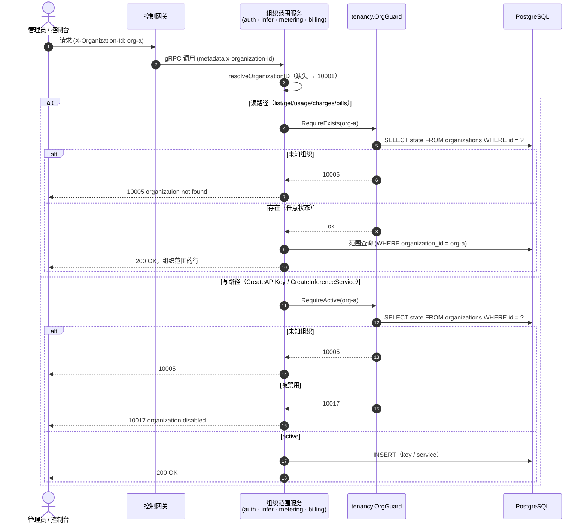
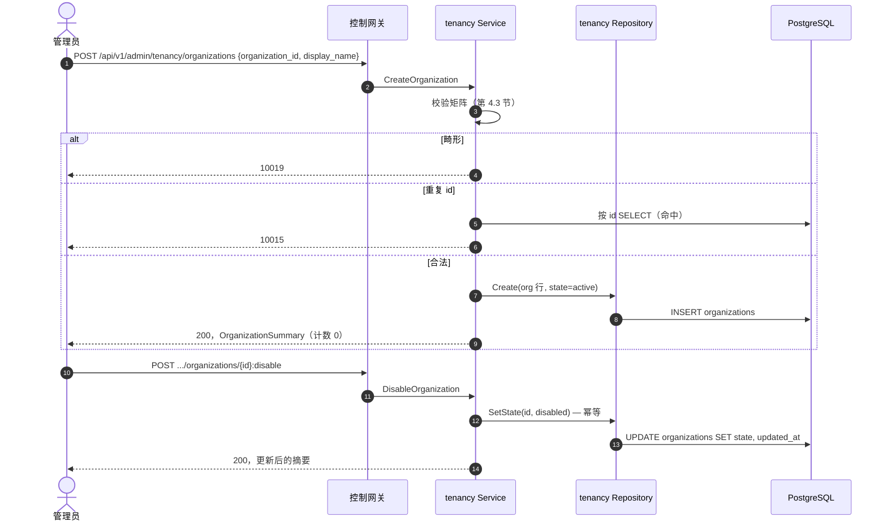
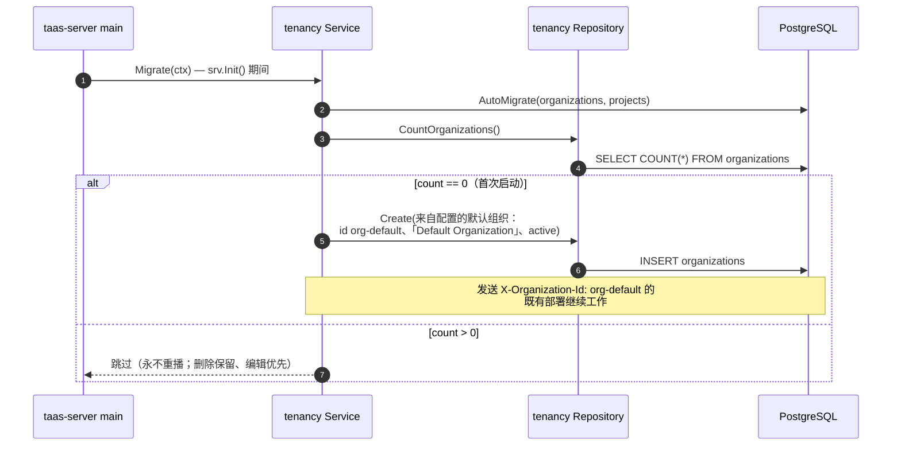
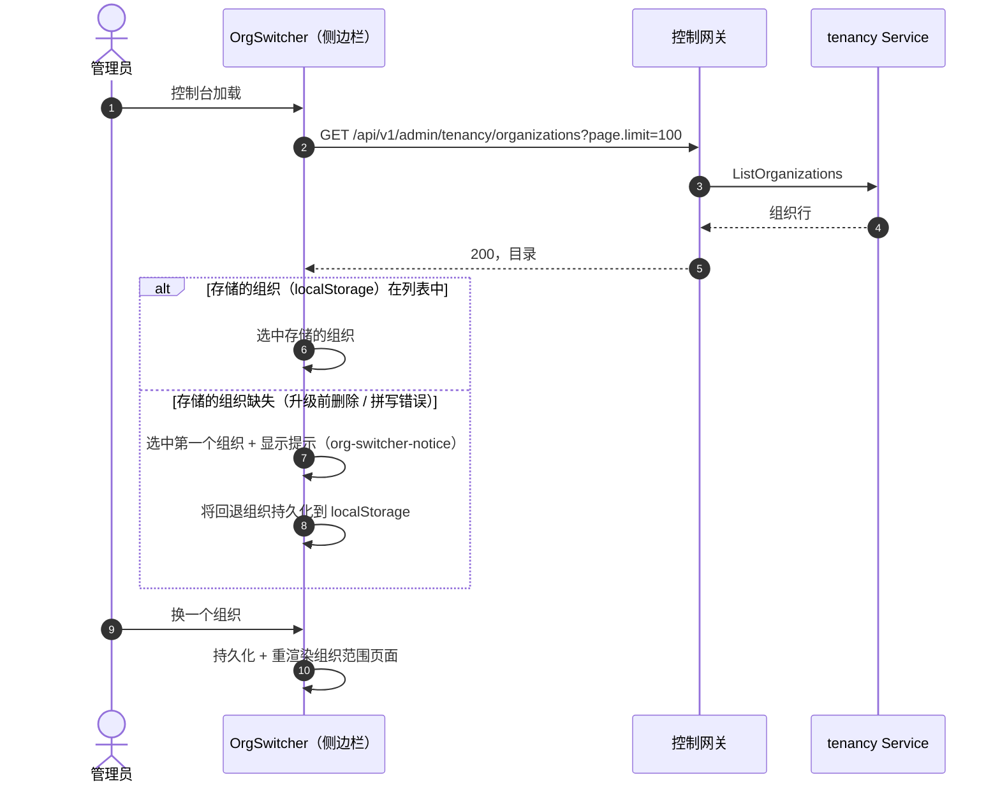

# 组织/项目多租户隔离 — 架构与详细设计

| 属性 | 内容 |
| --- | --- |
| 特性点 | 组织/项目多租户隔离 |
| 文档范围 | 租户核心的架构与详细设计：`organizations` 与 `projects` 表、`tenancy` 模块（CRUD RPC、状态迁移、首次启动默认组织播种）、由 `auth`/`infer`/`metering`/`billing` 消费的组织上下文闸门、错误处理、配置、发布，以及各层的函数级设计 |
| 归属模块 | `tenancy`（新建：`services/tenancy`），`auth`、`infer`、`metering`、`billing` 作为闸门消费方（仅增量接线） |
| 相关文档 | [需求分析与 UI/UX 设计](../design/multi-tenancy.zh-cn.md) · [架构设计](../design/architecture.zh-cn.md) 第 2.1 节 · [API Key 管理](./api-key-management.zh-cn.md) · [Token 计量凭证与异步结算](./metering.zh-cn.md) · [模型 × 卡型价格矩阵与阶梯定价](./pricing.zh-cn.md) |
| 状态 | 架构完成，已移交研发代理 |

---

## 1. 目标与非目标

### 1.1 目标

- 实现新的 **`taas.tenancy.v1.TenancyService`** 接口（proto：`proto/taas/tenancy/v1/tenancy.proto`）：`CreateOrganization`、`ListOrganizations`、`GetOrganization`、`UpdateOrganization`、`DisableOrganization`、`EnableOrganization`、`CreateProject`、`ListProjects`、`GetProject`、`UpdateProject`、`DisableProject`、`EnableProject` — 12 个 RPC，全部平台全局，位于 `/api/v1/admin/tenancy/*` 之下（D8）。
- **两张新表**（D1）：`organizations` 与 `projects`，带调用方提供的不变 id、可变的显示名/描述、`active`/`disabled` 状态。v1 无删除（D2/D3）。
- **经校验的组织上下文**（D4/FR3）：`auth`（List/Create/Revoke API Key）、`infer`（Create/List/Get/Scale/Delete 服务）、`metering`（凭证、用量摘要、用量记录）、`billing`（计费记录、账单）的每个组织范围管理 API 将 `X-Organization-Id` 对照 `organizations` 表解析：缺头仍为 10001；未知 id → **10005**；两个创建路径上的被禁用组织 → **10017**（FR3.1/FR3.2）。
- **首次启动默认组织播种**（D5）：`organizations` 表为空时插入 `org-default`（「Default Organization」，active），来自配置；只插入、永不重跑（特性 #3 的镜像播种模式）。
- **目录行上的资源计数**（D11）：每个组织的 `api_key_count`（未吊销）、`inference_service_count`（未终止）、`project_count`，读取时用带索引的 COUNT 查询计算。
- **控制台**（D10）：组织页（`/admin/organizations`）、项目页（`/admin/projects`），侧边栏组织切换器从自由文本升级为真实组织下拉，带过期组织回退。
- **新错误码**（D9）：10015 `CodeOrganizationExists`、10016 `CodeProjectExists`、10017 `CodeOrganizationDisabled`、10018 `CodeProjectDisabled`、10019 `CodeTenancyInvalid`。

### 1.2 非目标

| 项 | 延后至 |
| --- | --- |
| 成员、角色（owner/admin/member）、邀请 | 特性 #7（需要账号模型） |
| 取代 `X-Organization-Id` 头的按租户会话 | 特性 #7 |
| 项目范围资源列（Key/服务上的 `project_id`）与按项目用量视图 | #7 之后（需要可执行的成员资格） |
| 按项目的资源计数 | v1 不可能（D6 未给资源表加项目列；设计 D11 的括号说明被 FR2.2 取代 — FR2.2 规定项目行不带计数） |
| 组织/项目配额与消费上限 | 特性 #8 纠缠 |
| 被禁用组织下的扩缩容闸门（按 FR3.2 仅 `CreateAPIKey`/`CreateInferenceService` 设闸） | 未来收紧（随 #7 的角色模型） |
| 带账务证据归档的租户删除 | 未来（需要保留期设计） |
| 层级 OU / 嵌套组织 | 未来 |
| 从既有表的 `organization_id` 去重值自动回填 `organizations` 行 | 未来运维工具（发布说明给出手工路径） |
| 组织存在性缓存（v1 为每请求一次索引读） | 未来优化 |

---

## 2. 组件视图



| 组件 | 本特性中的职责 |
| --- | --- |
| 控制网关（`grpc-gateway`） | 12 个租户 RPC 在 `/api/v1/admin/tenancy/*` 下的 HTTP/JSON 门面；`X-Organization-Id` 作为 gRPC metadata 透传（租户 RPC 忽略它 — 平台全局） |
| `tenancy` 模块（`services/tenancy`，**新建**） | `organizations`/`projects` 表、12 个 CRUD RPC、状态迁移、首次启动默认组织播种，以及四个闸门消费方消费的 `OrgGuard` 读接口 |
| `auth` 模块 | 闸门消费方：`ListAPIKeys`/`RevokeAPIKey` 校验组织存在（10005）；`CreateAPIKey` 额外要求 active（10017） |
| `infer` 模块 | 闸门消费方：读校验存在；`CreateInferenceService` 额外要求 active |
| `metering` 模块 | 闸门消费方：四个查询 RPC 校验存在（仅读 — 数据面事件消费方不动） |
| `billing` 模块 | 闸门消费方：`ListCharges`/`ListBills` 校验存在（`SetPrice`/`ListPrices` 保持平台全局） |
| PostgreSQL | `organizations`、`projects` 表（新建）；既有组织范围表不变（D6：任何地方都不加项目列） |
| 消息队列 | **不变** — 租户仅走 RPC；无新 subject、无消费方、无 runner |
| 控制台 | 组织页、项目页、经校验的组织切换器（契约见第 10.5 节） |

---

## 3. 数据模型

### 3.1 `organizations` 表

| 列 | PostgreSQL 类型 | 约束 | 描述 |
| --- | --- | --- | --- |
| `id` | `varchar(64)` | PRIMARY KEY | 调用方提供的不变组织 id，`^[a-z0-9][a-z0-9-]{2,63}`（3-64 字符，小写） |
| `display_name` | `varchar(128)` | NOT NULL | 可变显示名，1-128 字符 |
| `description` | `varchar(1024)` | NOT NULL DEFAULT '' | 可选自由文本，≤ 1024 字符 |
| `state` | `varchar(16)` | NOT NULL DEFAULT 'active' | `active` 或 `disabled`（D2） |
| `created_at` | `timestamptz` | NOT NULL | 行创建时间（UTC） |
| `updated_at` | `timestamptz` | NOT NULL | 更新与状态迁移时递增 |

设计说明：

- 主键是调用方提供的 id（D1）：组织是具名、可寻址的资源（账单 id 内嵌组织 id），而非匿名 UUID 行。重复插入映射为 10015（FR1.1）。
- 无删除（D2）：被禁用的组织永久保留其 Key、服务、用量、计费记录与账单的可读性（账务证据保全，特性 #4/#5 的不可变推理）。
- v1 不从其他表的 `organization_id` 列建外键：闸门按请求在读取时校验（FR3.1），既有表保持纯字符串列（零迁移）。特性 #7 在租户并入账号模型时可能加真约束。
- 排序：`ListOrganizations` 按 `created_at DESC` — 由 `created_at` 索引服务。

### 3.2 `projects` 表

| 列 | PostgreSQL 类型 | 约束 | 描述 |
| --- | --- | --- | --- |
| `id` | `varchar(64)` | PRIMARY KEY | 调用方提供的不变项目 id，语法同组织 id；**全局唯一**（`GET /projects/{project_id}` 的路径形态要求如此 — 设计的 `(organization_id, project_id)` 唯一性被其涵盖） |
| `organization_id` | `varchar(64)` | NOT NULL, index | 所属组织 |
| `display_name` | `varchar(128)` | NOT NULL | 可变显示名，1-128 字符 |
| `description` | `varchar(1024)` | NOT NULL DEFAULT '' | 可选自由文本 |
| `state` | `varchar(16)` | NOT NULL DEFAULT 'active' | `active` 或 `disabled`（D3） |
| `created_at` | `timestamptz` | NOT NULL | 行创建时间 |
| `updated_at` | `timestamptz` | NOT NULL | 更新与状态迁移时递增 |

设计说明：

- `idx_projects_org_created (organization_id, created_at DESC)` 服务于按组织过滤的目录列表。
- 任何资源表都不加 `project_id` 列（D6）：没有按租户的认证就无法执行项目成员资格，项目列会是一个未校验的字符串 — 恰好是本特性要修复的自由文本 bug，下移一层。项目行只是目录 + 校验层。
- 禁用组织**不**级联其项目的状态（FR2.5）：组织闸门在资源创建时执行；项目状态独立。被禁用组织下启用项目被拒绝（10017）。

### 3.3 跨模块读接口：`OrgGuard`

沿用窄接口模式（`model` 消费的 `infer.NewDeleteModelGuard`、`image` 消费的 `infer.NewImageInUseProvider`），`tenancy` 模块暴露组织上下文闸门（D7，FR3.3）：

```go
// OrgGuard 校验组织范围 API 的过渡期组织上下文。
// 它是 organizations 表之上的只读接口，在接线时注入消费方服务。
type OrgGuard struct { /* 持有 *Repository */ }

func NewOrgGuard(db *gorm.DB) *OrgGuard

// RequireExists 在组织不存在时返回 10005。
func (g *OrgGuard) RequireExists(ctx context.Context, orgID string) error

// RequireActive 在未知时返回 10005，被禁用时返回 10017。
func (g *OrgGuard) RequireActive(ctx context.Context, orgID string) error
```

接线契约（`SetDeleteModelGuard` 模式）：

- 消费方服务（`auth`、`infer`、`metering`、`billing`）增加 `orgGuard *tenancy.OrgGuard` 字段、`SetOrgGuard(*tenancy.OrgGuard)` setter，以及内部 `checkOrg(ctx, orgID, requireActive bool) error` 助手 — **闸门为 nil 时无操作**。
- `apps/taas-server/main.go` 在 `srv.Init()` 之后把闸门接入全部四个服务（DB 组件存在时无条件）— 生产始终校验。
- FVT 环境显式接闸门（AC9/AC10 走真实路径）；消费模块的单元测试保持 nil（其 sqlite 库只有本模块的表）— 闸门本身在 `services/tenancy` 有专门单测。
- 闸门是每请求一次的索引主键读（FR3.1）；v1 无缓存。

---

## 4. API 契约

### 4.1 RPC 面

所有 API 属于新的 **`taas.tenancy.v1.TenancyService`**，经控制网关以 HTTP 提供。该服务是平台全局的：不要求也不消费 `X-Organization-Id` 头（D8）。

| RPC | HTTP | 状态 | 用途 |
| --- | --- | --- | --- |
| `CreateOrganization` | `POST /api/v1/admin/tenancy/organizations` | **新增** | 创建租户；调用方提供 id |
| `ListOrganizations` | `GET /api/v1/admin/tenancy/organizations` | **新增** | 目录；分页；`state` 过滤；每行资源计数 |
| `GetOrganization` | `GET /api/v1/admin/tenancy/organizations/{organization_id}` | **新增** | 单个租户；未知 10005 |
| `UpdateOrganization` | `PATCH /api/v1/admin/tenancy/organizations/{organization_id}` | **新增** | 编辑显示名/描述；id 与状态不可变 |
| `DisableOrganization` | `POST /api/v1/admin/tenancy/organizations/{organization_id}:disable` | **新增** | `active` → `disabled`；幂等 |
| `EnableOrganization` | `POST /api/v1/admin/tenancy/organizations/{organization_id}:enable` | **新增** | `disabled` → `active`；幂等 |
| `CreateProject` | `POST /api/v1/admin/tenancy/projects` | **新增** | 创建项目；组织必须存在且 active |
| `ListProjects` | `GET /api/v1/admin/tenancy/projects` | **新增** | 项目目录；`organization_id` + `state` 过滤 |
| `GetProject` | `GET /api/v1/admin/tenancy/projects/{project_id}` | **新增** | 单个项目；未知 10006 |
| `UpdateProject` | `PATCH /api/v1/admin/tenancy/projects/{project_id}` | **新增** | 编辑显示名/描述 |
| `DisableProject` | `POST /api/v1/admin/tenancy/projects/{project_id}:disable` | **新增** | 幂等 |
| `EnableProject` | `POST /api/v1/admin/tenancy/projects/{project_id}:enable` | **新增** | 组织被禁用时阻断（10017） |

新消息：`OrganizationSummary {organization_id, display_name, description, state, api_key_count, inference_service_count, project_count, created_at, updated_at}` 与 `ProjectSummary {project_id, organization_id, display_name, description, state, created_at, updated_at}`（所有 int64 字段序列化为 JSON 字符串 — 设计第 6 节约束 3）。

### 4.2 线格式（既有惯例）

- 分页绑定为 `?page.offset=0&page.limit=20`（点分形式）；默认 limit 20、上限 100；两个列表都最新在前（`created_at DESC`）。
- 成功响应 HTTP 200；业务错误渲染为 `{"code": <int>, "message": "..."}`。
- `Update*` 同时替换 `display_name` 与 `description`（无字段掩码）：`display_name` 必须合法（否则 10019）；空 `description` 表示清空。控制台编辑对话框总是两者都发。
- `Disable*`/`Enable*` 从路径取 id、空请求体；返回更新后的摘要，控制台无需重新拉取即可刷新行。
- 过滤：`ListOrganizations?state=`、`ListProjects?organization_id=&state=`；未知 `state` 值 → 10019。
- 租户 RPC 完全忽略 `X-Organization-Id`（平台全局）；该头在四个消费方的每个组织范围 API 上保持原义。

### 4.3 校验矩阵（同步）

`CreateOrganization` 依序执行以下检查；首个失败立即返回且不写入（AC1）：

| # | 检查 | 失败码 |
| --- | --- | --- |
| 1 | `organization_id` 匹配 `^[a-z0-9][a-z0-9-]{2,63}$` | 10019 `CodeTenancyInvalid` |
| 2 | `display_name` 去空格后 1-128 字符 | 10019 |
| 3 | `description` ≤ 1024 字符 | 10019 |
| 4 | id 不已存在 | 10015 `CodeOrganizationExists` |

`CreateProject`（AC5）：

| # | 检查 | 失败码 |
| --- | --- | --- |
| 1 | `project_id` 匹配组织 id 正则 | 10019 |
| 2 | `organization_id` 非空 | 10019 |
| 3 | `display_name` 去空格后 1-128 字符 | 10019 |
| 4 | `description` ≤ 1024 字符 | 10019 |
| 5 | 组织存在 | 10005 `CodeOrganizationNotFound` |
| 6 | 组织为 `active` | 10017 `CodeOrganizationDisabled` |
| 7 | 项目 id 不已存在 | 10016 `CodeProjectExists` |

`UpdateOrganization`/`UpdateProject`：未知 id → 10005/10006；`display_name` 1-128 → 10019；`description` ≤ 1024 → 10019。`Disable*`/`Enable*`：未知 id → 10005/10006；被禁用组织下 `EnableProject` → 10017；否则幂等成功。列表过滤：未知 `state` 值 → 10019。

### 4.4 租户状态模型

```mermaid
stateDiagram-v2
    state "organization" {
        [*] --> active: CreateOrganization
        active --> disabled: DisableOrganization（幂等）
        disabled --> active: EnableOrganization（幂等）
    }
    state "project" {
        [*] --> active: CreateProject（组织必须 active）
        active --> disabled: DisableProject（幂等）
        disabled --> active: EnableProject（组织被禁用时阻断 → 10017）
    }
```

- 状态**只能**经 disable/enable 端点迁移 — 绝不经 `Update*`（设计契约约束 1）。
- 被禁用的组织阻断：`CreateAPIKey`、`CreateInferenceService`（10017，FR3.2）、`CreateProject`（10017）、`EnableProject`（10017）。每个组织范围 API 的读取保持可用（历史保持可见）。
- 被禁用组织下吊销 API Key 保持**允许**：吊销降低风险、绝不累积消费（与「一刀切阻断写」的规则相比是有意为之的偏差，已记录）。

### 4.5 消息契约

无。租户仅走 RPC：无 MQ subject、无消费方、无 runner（第 2 节）。数据面计量路径不动 — 摄入永不校验组织存在性（事件携带真实 key id；阻断摄入会丢失用量证据）。

---

## 5. 时序图

### 5.1 经校验的组织上下文（四个消费方中的闸门）



### 5.2 组织创建与状态迁移



### 5.3 首次启动默认组织播种（D5）



### 5.4 控制台组织切换器与过期组织回退（FR4.3）



---

## 6. 错误处理

所有错误都是统一信封中的 `pkg/errors` 业务码。auth/租户段新分配五个码（D9）；10005/10006 已存在，现在真正触发。

| 条件 | 码 | 常量 | 备注 |
| --- | --- | --- | --- |
| 任何组织范围 API 上的未知组织 | 10005 | `CodeOrganizationNotFound` | 既有；闸门的 `RequireExists` |
| 未知项目 | 10006 | `CodeProjectNotFound` | 既有 |
| 重复组织 id | 10015 | `CodeOrganizationExists` | **新增**；规范消息 "organization already exists" |
| 重复项目 id | 10016 | `CodeProjectExists` | **新增**；"project already exists" |
| 设闸写路径上的被禁用组织 | 10017 | `CodeOrganizationDisabled` | **新增**；"organization disabled" |
| 设闸写路径上的被禁用项目 | 10018 | `CodeProjectDisabled` | **新增**；"project disabled"（保留：v1 无按项目状态设闸的写路径；被禁用组织下 `EnableProject` 复用 10017） |
| 畸形 id/名称、坏过滤 | 10019 | `CodeTenancyInvalid` | **新增**；"tenancy invalid" |
| 组织范围 API 缺 `X-Organization-Id` | 10001 | `CodeUnauthorized` | 不变（`resolveOrganizationID` 模式） |
| 数据库故障 | 500 | `CodeInternal` | 经错误归一化 |

闸门将 GORM `ErrRecordNotFound` 映射为 10005，其余经错误归一化透传（500）。重复插入竞态安全：主键是仲裁者 — 并发重复创建将其唯一冲突错误映射为 10015（`CreateImage` 模式）。

---

## 7. 配置新增

新的顶层 `tenancy` 配置段（设计的 D5 写作 `auth.tenancy.defaultOrgId`；此处细化为独立段，因为按 D7 模块是独立的 — 设计自身的模块归属决策优先于其配置路径简写）：

| 键 | 默认值 | 描述 |
| --- | --- | --- |
| `tenancy.defaultOrgId` | `"org-default"` | 首次启动播种的组织 id（D5）；必须匹配组织 id 正则 |
| `tenancy.defaultOrgDisplayName` | `"Default Organization"` | 播种组织的显示名 |

规则：

- `Configuration.applyDefaults` 在为空时填充两者；`Validate` 新增：`defaultOrgId` 非空且匹配 `^[a-z0-9][a-z0-9-]{2,63}$`（否则 `FieldError`）、`defaultOrgDisplayName` 1-128 字符。
- `configs/server.yaml` 与 `configs/config.yaml` 增加带默认值的 `tenancy` 段，行内注释说明。
- 播种在 Migrate 时读配置（配置在 `srv.Init()` 运行迁移器之前已解析）。

---

## 8. 安全考量

- **关闭自由文本缺口**（D4）：过渡期头变成经校验的上下文 — 拼错的 org id 现在响亮地失败（10005），而非静默分叉租户。这既是访问控制，也是数据完整性修复。
- **禁用作为运营者的杠杆**（D2）：被禁用的组织无法累积新 Key 或服务（10017），同时全部历史保持可读 — 删除的可逆替代。
- **平台全局管理面**（D8）：租户 RPC 管理所有租户，位于管理面（`/api/v1/admin/...`），带平台过渡期认证姿态（由特性 #7 的会话取代）；它们从不消费组织头，因此一个租户无法用头去圈定另一个租户的目录读取。
- **租户行中无秘密**：仅 id、名称、描述、状态、时间戳。
- **计数是非敏感聚合**：每组织行数，读取时计算；目录不泄漏任何按资源的数据。
- **查询成本有界**：分页上限 100 与每行的索引 COUNT 约束每个目录查询的成本（每组织行三个 COUNT，各命中一个组织优先索引）。

---

## 9. 发布说明

- **模式**：首次启动经 AutoMigrate 建两张新表（`organizations`、`projects`）；纯增量 — 无既有表或列变更（D6）。
- **Proto**：一个新文件（`proto/taas/tenancy/v1/tenancy.proto`）、一个新服务 — 需要 `make pbgen`；生成代码不提交。
- **接线**：`apps/taas-server/main.go` 注册租户服务（第一个，使其 Migrate + 播种先于消费方的迁移运行 — 顺序非功能必需，只为整洁），并在 `srv.Init()` 之后把 `tenancy.NewOrgGuard(gormDB)` 接入 `auth`、`infer`、`metering`、`billing`（delete-guard 代码块旁）。
- **破坏性收紧（明示）**：组织范围 API 上的未知组织 id 从空结果变为 **10005**。两类受众需要行动：
  1. **既有部署**：出现在 `api_keys`/`inference_services`/`usage_records`/`charge_records` 中但从未「创建」过的组织 id 不再解析。运营者通过控制台或 `POST /api/v1/admin/tenancy/organizations` 一次性创建这些组织（id 必须匹配正则）。播种的 `org-default` 开箱即用地覆盖控制台默认值。
  2. **测试套件**：每个使用临时组织 id（`org-fvt`、`org-a`、`org-b`、`org-e2e-${runId}`）的 FVT 环境与 e2e 套件必须先创建这些组织 — FVT 环境在 `tenancy.MigrateSchemaForFVT(db)` 之后直接插行；e2e 套件增加 `api.ensureOrg(browser, orgId)` 助手（POST 该组织；10015 = 已存在 = 无妨），在 `beforeEach` 中调用。
- **升级兼容性**：该特性其余部分纯增量 — 无 MQ 变更、无数据面变更、无既有 RPC 线格式变更。
- **滚动更新顺序**：单独部署 `taas-server`；启动时迁移器建表并播种默认组织；闸门随新二进制激活。回滚只是留下两张未用的表。

---

## 10. 详细设计

### 10.1 文件布局

| 模块 | 文件 | 内容 |
| --- | --- | --- |
| `proto/taas/tenancy/v1` | `tenancy.proto` | `TenancyService`（12 个 RPC）+ 请求/响应/摘要消息 |
| `services/tenancy` | `tenancy_model.go` | GORM 模型 `Organization`、`Project` + `TableName` + 状态常量 |
| | `tenancy_repository.go` | `Repository`（组织/项目 CRUD、状态迁移、计数、`CountOrganizations`、`SeedDefaultOrganization`） |
| | `guard.go` | `OrgGuard` — `NewOrgGuard`、`RequireExists`、`RequireActive` |
| | `service.go` | 12 个 RPC 实现 + `Migrate`（AutoMigrate + 首次启动播种）+ `NewForFVT` + `MigrateSchemaForFVT` |
| `services/auth` | `service.go` | `orgGuard` 字段 + `SetOrgGuard` + `checkOrg` + `ListAPIKeys`/`CreateAPIKey`/`RevokeAPIKey` 中的检查（增量） |
| `services/infer` | `service.go` | 同样接线；全部五个 RPC 中的检查（增量） |
| `services/metering` | `service.go` | 同样接线；四个查询 RPC 中的检查（增量） |
| `services/billing` | `service.go` | 同样接线；`ListCharges`/`ListBills` 中的检查（增量） |
| `pkg/errors` | `codes.go`、`messages.go` | 10015-10019 + 规范消息 |
| `pkg/config` | `api.go`、`configuration.go` | `TenancyConfig` + 默认值/校验 |
| `apps/taas-server` | `main.go` | 注册租户；把 OrgGuard 接入四个消费方 |
| `configs` | `server.yaml`、`config.yaml` | `tenancy` 段 |
| `web/src` | `pages/OrganizationsPage.tsx`、`pages/ProjectsPage.tsx` | 两个目录页 |
| | `org.tsx` | OrgSwitcher → 带回退的真实组织下拉 |
| | `App.tsx`、`api.ts` | 路由/导航项；`OrganizationSummary`/`ProjectSummary` 类型 |
| `test/fvt` | `tenancy_fvt_test.go` | 租户 FVT（AC1-AC11） |
| | `auth_apikey_fvt_test.go`、`model_infer_fvt_test.go`、`metering_fvt_test.go`、`pricing_fvt_test.go` | 播种组织 + 接闸门（回归，AC11） |
| `test/e2e` | `tests/tenancy.js`、`page-objects/api.js` | 租户 e2e（AC12-AC15）+ `ensureOrg` 助手 |
| | `tests/*.js`（5 个既有套件） | `beforeEach` 中的 `ensureOrg`（回归） |

### 10.2 `tenancy` 模块

GORM 模型（唯一事实来源）：

```go
// 组织生命周期状态（D2）。
const (
    OrgStateActive   = "active"
    OrgStateDisabled = "disabled"
)

type Organization struct {
    ID          string    `gorm:"primaryKey;size:64"`
    DisplayName string    `gorm:"size:128;not null"`
    Description string    `gorm:"size:1024;not null;default:''"`
    State       string    `gorm:"size:16;not null;default:'active'"`
    CreatedAt   time.Time `gorm:"index"`
    UpdatedAt   time.Time
}

func (Organization) TableName() string { return "organizations" }

type Project struct {
    ID             string    `gorm:"primaryKey;size:64"`
    OrganizationID string    `gorm:"size:64;not null;index:idx_projects_org_created,priority:1"`
    DisplayName    string    `gorm:"size:128;not null"`
    Description    string    `gorm:"size:1024;not null;default:''"`
    State          string    `gorm:"size:16;not null;default:'active'"`
    CreatedAt      time.Time `gorm:"index:idx_projects_org_created,priority:2,sort:DESC"`
    UpdatedAt      time.Time
}

func (Project) TableName() string { return "projects" }
```

`Repository`（内嵌 `database.BaseRepository[Organization]`，持有 `*database.Manager` — 既有模式）：

- `CreateOrganization(ctx, org *Organization) error` — INSERT；主键唯一冲突映射为 10015（`CreateImage` 的错误映射模式）。
- `FindOrganization(ctx, id string) (*Organization, error)` — `ErrRecordNotFound` 透传（调用方映射为 10005）。
- `ListOrganizations(ctx, filter OrgFilter) ([]*Organization, int64, error)` — `state` 过滤、`created_at DESC`、offset/limit、总数。
- `UpdateOrganization(ctx, id, displayName, description string) (*Organization, error)` — `UPDATE ... SET display_name, description, updated_at`；重新 SELECT 该行。
- `SetOrganizationState(ctx, id, state string) (*Organization, error)` — `UPDATE ... SET state, updated_at WHERE id = ?`；幂等（已在目标状态的行只递增 `updated_at`）；重新 SELECT。
- `CreateProject(ctx, project *Project) error` — 主键冲突映射为 10016。
- `FindProject(ctx, id string) (*Project, error)`。
- `ListProjects(ctx, filter ProjectFilter) ([]*Project, int64, error)` — `organization_id` + `state` 过滤、`created_at DESC`、分页。
- `UpdateProject(ctx, id, displayName, description string) (*Project, error)`。
- `SetProjectState(ctx, id, state string) (*Project, error)`。
- `CountOrganizations(ctx) (int64, error)` — 首次启动播种的闸门（`CountAll` 模式）。
- `SeedDefaultOrganization(ctx, id, displayName string) error` — 只插入；已存在的行不动（永不重播）。
- 计数（读取时，D11）：`APIKeyCountByOrganization(ctx, orgID) (int64, error)` — `SELECT COUNT(*) FROM api_keys WHERE organization_id = ? AND revoked = false`；`InferenceServiceCountByOrganization(ctx, orgID)` — `... WHERE organization_id = ? AND state != 'terminated'`；`ProjectCountByOrganization(ctx, orgID)` — `... FROM projects WHERE organization_id = ?`。对既有表的纯表名 SQL（方言无关；不建外表的 GORM 模型 — 闸门/计数模式按名字读兄弟表，正如 `AcceleratorTypesByServiceIDs` 从 `billing` 读 `inference_services`）。

`guard.go`：

```go
type OrgGuard struct{ repo *Repository }

func NewOrgGuard(db *gorm.DB) *OrgGuard

func (g *OrgGuard) RequireExists(ctx context.Context, orgID string) error {
    _, err := g.repo.FindOrganization(ctx, orgID)
    if errors.Is(err, gorm.ErrRecordNotFound) {
        return apierrors.New(apierrors.CodeOrganizationNotFound)
    }
    return err
}

func (g *OrgGuard) RequireActive(ctx context.Context, orgID string) error {
    org, err := g.repo.FindOrganization(ctx, orgID)
    if errors.Is(err, gorm.ErrRecordNotFound) {
        return apierrors.New(apierrors.CodeOrganizationNotFound)
    }
    if err != nil {
        return err
    }
    if org.State != OrgStateActive {
        return apierrors.New(apierrors.CodeOrganizationDisabled)
    }
    return nil
}
```

`service.go`：

- `Service` 实现 `tenancyv1.TenancyServiceServer`、`server.Service`、`server.ServiceWithGateway` 与 `server.Migrator`；`repo` 从组件惰性解析（metering 模式），`NewForFVT(db)` 直接接线。
- `Migrate(ctx)`：AutoMigrate 两个模型，然后首次启动播种 — `CountOrganizations == 0` → `SeedDefaultOrganization(cfg.Tenancy.DefaultOrgId, cfg.Tenancy.DefaultOrgDisplayName)`；非空 → 跳过并记 info 日志（第 5.3 节）。
- `MigrateSchemaForFVT(db)`：AutoMigrate 两个模型（仅 FVT 助手）。
- RPC 实现遵循第 4.3 节的校验矩阵；每个都返回 `OrganizationSummary`/`ProjectSummary`（组织行的计数由计数助手填充）。`EnableProject` 在翻转前重查组织状态（10017）。`CreateProject` 经仓库检查组织存在与状态（不经闸门 — 闸门是跨模块面；内部调用直接用 repo）。
- `summarizeOrganization(row, keyCount, svcCount, projectCount)` 与 `summarizeProject(row)` 将行映射为 proto；int64 计数经 `clampInt64` 风格的助手（`clampInt32` 模式）。

### 10.3 `pkg/errors`、`pkg/config`（增量）

- `codes.go`：auth 段新增 `CodeOrganizationExists Code = 10015`、`CodeProjectExists Code = 10016`、`CodeOrganizationDisabled Code = 10017`、`CodeProjectDisabled Code = 10018`、`CodeTenancyInvalid Code = 10019`。
- `messages.go`："organization already exists"、"project already exists"、"organization disabled"、"project disabled"、"tenancy invalid"。
- `api.go`：`TenancyConfig{DefaultOrgID string `mapstructure:"defaultOrgId"`, DefaultOrgDisplayName string `mapstructure:"defaultOrgDisplayName"`}`；`Configuration` 增加 `Tenancy TenancyConfig `mapstructure:"tenancy"``。
- `configuration.go`：`applyDefaults` 在为空时填充 `org-default` / `Default Organization`；`Validate` 新增第 7 节的规则（经 `FieldError` 的正则 + 长度检查）。

### 10.4 闸门消费方与 `apps/taas-server/main.go`（增量）

四个消费方服务（`auth`、`infer`、`metering`、`billing`）各自增加完全相同的接线：

```go
// orgGuard 对照 organizations 表校验过渡期组织上下文（特性 #6）。
// 接线前为 nil：单元测试跳过校验；main.go 与 FVT 总是接线。
orgGuard *tenancy.OrgGuard

// SetOrgGuard 注入租户读闸门（SetDeleteModelGuard 模式）。
func (s *Service) SetOrgGuard(g *tenancy.OrgGuard) { s.orgGuard = g }

// checkOrg 校验组织上下文：读校验存在性，设闸写校验 active 状态。
// 闸门未接线时无操作。
func (s *Service) checkOrg(ctx context.Context, orgID string, requireActive bool) error {
    if s.orgGuard == nil {
        return nil
    }
    if requireActive {
        return s.orgGuard.RequireActive(ctx, orgID)
    }
    return s.orgGuard.RequireExists(ctx, orgID)
}
```

检查位置（`resolveOrganizationID` 之后、任何查询之前）：

| 服务 | RPC | 检查 |
| --- | --- | --- |
| `auth` | `ListAPIKeys` | 存在 |
| | `CreateAPIKey` | **active**（10017，FR3.2） |
| | `RevokeAPIKey` | 存在（被禁用组织下吊销保持允许） |
| `infer` | `CreateInferenceService` | **active**（10017，FR3.2） |
| | `ListInferenceServices`、`GetInferenceService`、`ScaleInferenceService`、`DeleteInferenceService` | 存在 |
| `metering` | `ListVouchers`、`GetVoucher`、`GetUsageSummary`、`ListUsageRecords` | 存在 |
| `billing` | `ListCharges`、`ListBills` | 存在 |

`VerifyAPIKey`（数据面 RPC）**不**检查 — key 校验以 key 哈希为键，verdict 上的组织是 key 存储的组织（已是真实数据）。计量事件消费方**不**检查（第 4.5 节）。

`main.go`（`srv.Init()` 之后，delete-guard 代码块旁）：

```go
tenancySvc := tenancy.New(srv.Components())
srv.RegisterService(tenancySvc) // 先注册；Migrate 播种 org-default

// ... Init 之后：
if dbComponent := srv.Components().DB(); dbComponent != nil {
    if gormDB, ok := dbComponent.GormDB().(*gorm.DB); ok {
        orgGuard := tenancy.NewOrgGuard(gormDB)
        authSvc.SetOrgGuard(orgGuard)
        inferSvc.SetOrgGuard(orgGuard)
        meteringSvc.SetOrgGuard(orgGuard)
        billingSvc.SetOrgGuard(orgGuard)
        // ... 既有 delete-guard 接线
    }
}
```

（四个服务的构造移入局部变量以便设置闸门 — 机械性改动。）

### 10.5 控制台契约

**组织页**（`/admin/organizations`，第一个导航项 — 运营者的目录）：

- 目录表 `orgs-table`：每个组织一行 `org-row-{id}` — id（等宽）、显示名、`StateBadge`（active/disabled）、Key 计数、服务计数、项目计数、创建时间。
- 「Create organization」按钮 `create-org` 打开对话框 `create-org-dialog`，含 `org-id-input`、`org-name-input`、`org-desc-input`、保存 `org-save`；10015/10019 的内联错误经对话框内的 `ErrorBanner`。
- 行操作：编辑 `org-edit-{id}` 打开 `edit-org-dialog`（`org-edit-name-input`、`org-edit-desc-input`、`org-edit-save`）；禁用 `org-disable-{id}` / 启用 `org-enable-{id}` 打开 `org-confirm-dialog`（`org-confirm-ok`、`org-confirm-cancel`），警告新 Key 与服务将被阻断。
- 空态 `orgs-empty`；可见时 60 秒轮询；`Pagination`。

**项目页**（`/admin/projects`，第二个导航项）：

- 组织过滤下拉 `project-org-filter`（选项来自 `ListOrganizations`，`project-org-option-{id}`）；目录表 `projects-table`，含 `project-row-{id}` — id、组织、显示名、状态徽标、创建。
- 「Create project」`create-project` 打开 `create-project-dialog`，含 `project-org-select`（`project-org-select-option-{id}`）、`project-id-input`、`project-name-input`、`project-desc-input`、保存 `project-save`；内联 10016/10017/10019。
- 行操作 `project-edit-{id}`、`project-disable-{id}`/`project-enable-{id}`，带 `project-confirm-dialog`；空态 `projects-empty`；60 秒轮询；`Pagination`。

**组织切换器**（`org.tsx`，升级）：挂载时拉取 `GET /api/v1/admin/tenancy/organizations?page.limit=100`（服务端忽略头）；渲染 `select` `org-switcher-select`，每个组织一个 `org-switcher-option-{id}`；localStorage 存储的组织在列表中时优先，否则选中第一个组织、持久化并显示提示 `org-switcher-notice`（FR4.3，AC14）。`web/src/api.ts` 增加 `OrganizationSummary` 与 `ProjectSummary` 类型（int64-as-string 字段）。

### 10.6 测试策略

**单元测试**（`services/tenancy`，每测试内存 sqlite）：

- `tenancy_repository_test.go`：组织 create/find/list+过滤/update/状态迁移（幂等）/计数（播种 api_keys + inference_services 行）/`CountOrganizations`/播种一次（AC1-AC4、AC8）。
- `guard_test.go`：`RequireExists` 未知 → 10005；`RequireActive` 未知 → 10005、被禁用 → 10017、active → nil（AC9/AC10 语义）。
- `service_test.go`（框架模式）：完整校验矩阵（10019/10015/10016/10017 路径）、被禁用组织下启用项目 → 10017（AC5、AC7）、摘要带计数（AC2）。

**FVT**（`test/fvt/tenancy_fvt_test.go`，pricing FVT 模式）：文件型 sqlite + `tenancy.MigrateSchemaForFVT` + 四个消费方的模式 + recordingBus + 生产拦截器链的 gRPC 服务器 + `FVTHeaderMatcher` 网关 mux。环境将 `tenancy.NewOrgGuard(db)` 接入真实的 `auth`/`infer`/`metering`/`billing` 服务（生产路径）。走查 AC1-AC11：经网关的组织 CRUD（AC1-AC4）、带计数 + 状态过滤的列表（AC2）、项目 CRUD + 校验（AC5-AC7）、播种一次（AC8）、**每个消费方读 API 上未知组织的 10005**（AC9）、**被禁用组织下 CreateAPIKey/CreateInferenceService 的 10017 + 读取仍可用**（AC10）、active 组织的回归流程（AC11：key 创建 → 列表、服务创建 → 列表、用量摘要、计费记录、账单）。

**FVT 回归更新**（AC11）：四个既有环境（`auth_apikey`、`model_infer`、`metering`、`pricing`）增加 `tenancy.MigrateSchemaForFVT(db)` + 为其组织 id（`org-fvt`、`org-a`、`org-b`）直接插组织行 + 在构造的服务上 `SetOrgGuard(tenancy.NewOrgGuard(db))` — 每个既有 FVT 随即走生产校验路径并保持通过。

**E2E**（`test/e2e/tests/tenancy.js`，标签 `['tenancy', 'feature-06']`，pricingBills.js 模式）：针对 compose 栈 — 组织页渲染 + 对话框创建（行出现）+ 编辑 + 带确认的禁用/启用 + 内联 10015/10019（AC12）；项目页带组织过滤 + 创建 + 禁用（AC13）；组织切换器列出真实组织且切换改变组织范围数据 + 过期组织回退提示（AC14）；全新栈上的空态（AC15 — compose 数据库持久存在，故空态场景用项目页上的全新组织过滤）。`page-objects/api.js` 增加 `ensureOrg(browser, orgId)`（POST 该组织；容忍 10015），五个既有套件在 `beforeEach` 中为其 `orgA`/`orgB` 调用（回归，AC11）。

**回归**：全部六个 e2e 套件绿；完整 Go 测试套件（15 个包 + tenancy）绿；`make lint` 与 commitlint 通过。

### 10.7 验收标准覆盖

| AC | 实现于 | 验证钩子 |
| --- | --- | --- |
| AC1 — 组织 create/get/重复 10015/畸形 10019 | 校验矩阵 + `CreateOrganization` | 单元 + FVT + E2E |
| AC2 — 列表最新在前、分页、带计数 + 状态过滤 | `ListOrganizations` + 计数助手 | 单元 + FVT |
| AC3 — 仅更新名称/描述；未知 10005 | `UpdateOrganization` | 单元 + FVT |
| AC4 — 禁用/启用幂等，递增 updated_at | `SetOrganizationState` | 单元 + FVT |
| AC5 — 项目创建校验（10016/10005/10017） | `CreateProject` 矩阵 | 单元 + FVT |
| AC6 — 项目列表/获取过滤；未知 10006 | `ListProjects`/`FindProject` | 单元 + FVT |
| AC7 — 项目状态迁移；被禁用组织下启用 10017 | `SetProjectState` + 组织重查 | 单元 |
| AC8 — 默认组织播种一次 | `Migrate` 播种 + `CountOrganizations` 闸门 | 单元 |
| AC9 — 所有消费方读 API 上未知组织 10005 | 四个服务中接线的 `OrgGuard.RequireExists` | FVT |
| AC10 — 被禁用组织 CreateAPIKey/CreateInferenceService 10017；读取开放 | 两个创建路径上的 `OrgGuard.RequireActive` | FVT |
| AC11 — 回归：active 组织流程不变 | 合法组织时闸门无操作；FVT/e2e 播种 | FVT + E2E 回归 |
| AC12 — 组织页流程 | 控制台契约（10.5） | E2E |
| AC13 — 项目页流程 | 控制台契约（10.5） | E2E |
| AC14 — 组织切换器真实下拉 + 回退 | `org.tsx` 升级 | E2E |
| AC15 — 空态 | 控制台契约（10.5） | E2E |

---

## 11. 延后项

| 项 | 延后至 |
| --- | --- |
| 成员、角色、邀请；取代头的按租户会话 | 特性 #7 |
| 项目范围资源列与按项目用量视图 | #7 之后 |
| 按项目的资源计数 | v1 不可能（D6）；随 #7 重审 |
| 被禁用组织下的扩缩容闸门 | 未来收紧（随 #7 的角色） |
| 组织/项目配额与消费上限 | 特性 #8 |
| 租户自助门户 | 特性 #7 |
| 从既有数据自动回填组织行 | 未来运维工具 |
| 组织存在性缓存（v1 每请求读） | 未来优化 |
| 带证据归档的租户删除 | 未来（保留期设计） |
| 层级 OU | 未来 |
| 租户 CLI 命令 | 下次触碰 CLI 面时 |
