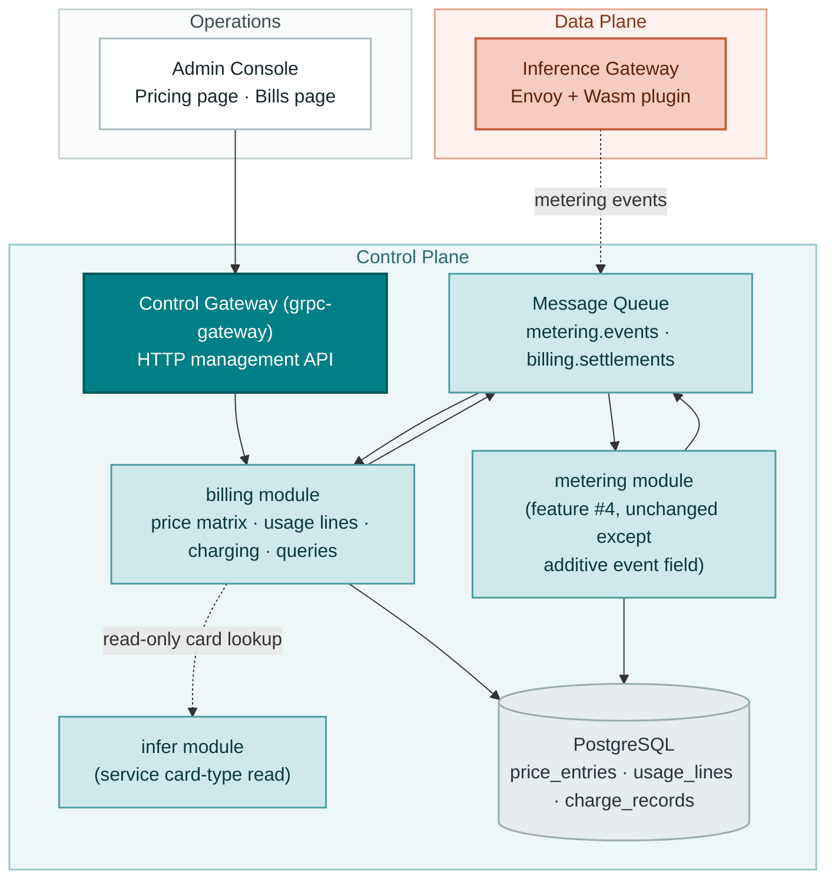
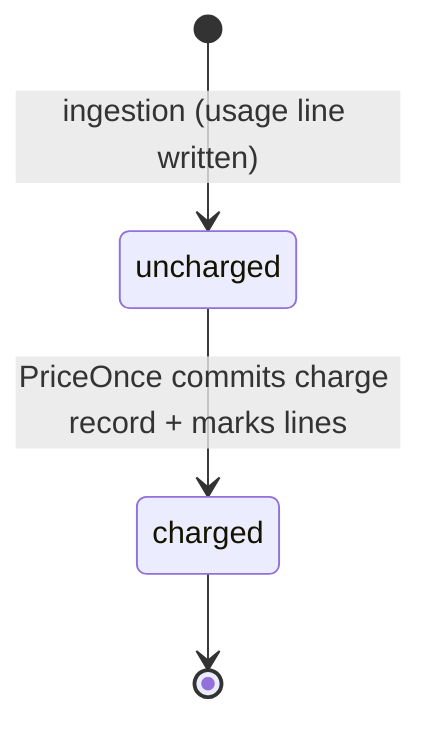
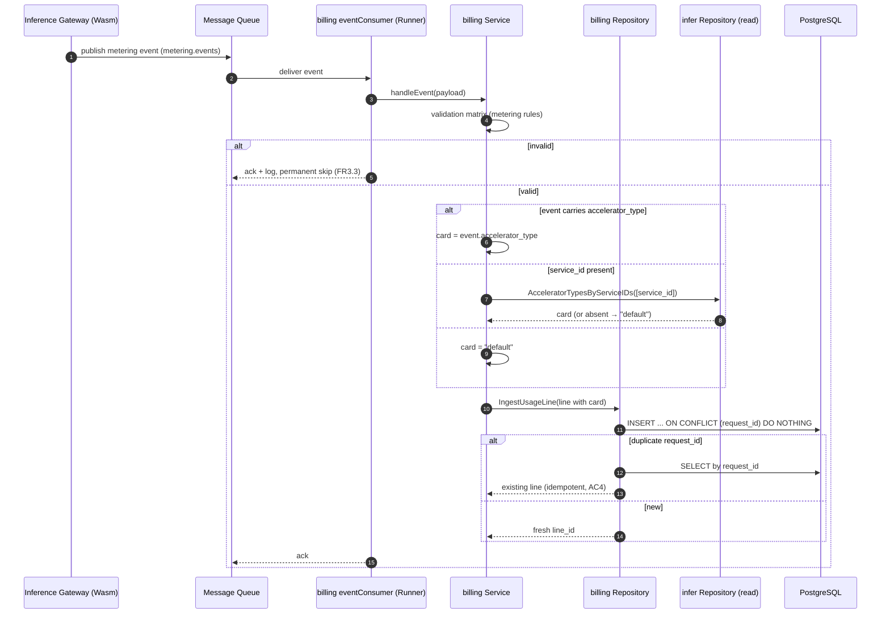
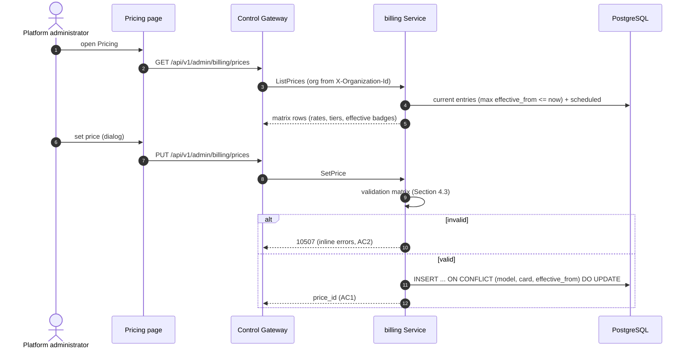
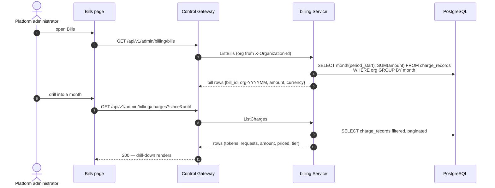

# Model × Card-Type Price Matrix & Tiered Pricing — Architecture and Detailed Design

| Attribute | Content |
| --- | --- |
| Feature point | Model × card-type price matrix & tiered pricing |
| Document scope | Architecture and detailed design for the pricing core: the effective-dated price matrix, the billing usage-line ingestion consumer, the charging engine (settlements consumer + reconciliation runner), charge and bill queries, error handling, configuration, rollout, and function-level design per layer |
| Owning modules | `billing` (price matrix, usage lines, charging, charges/bills queries), with `metering` (additive event-contract extension only) and `infer` (service card-type read interface) |
| Related documents | [Requirement Analysis and UI/UX Design](../design/pricing.md) · [Architecture Design](../design/architecture.md) Section 2.6 (`billing`) · [Token Metering Vouchers & Async Settlement](./metering.md) (the upstream pipeline and the `billing.settlements` contract) |
| Status | Architecture complete, handed to the Developer agent |

---

## 1. Goals and Non-Goals

### 1.1 Goals

- Implement the `taas.billing.v1.BillingService` surface: `SetPrice` and `ListPrices` (existing stubs → implemented), `ListBills` (stub → implemented), the new `ListCharges` RPC, and the additive proto extensions (`cached_price_per_million`, `effective_from`, `tiers` on `SetPrice`; `accelerator_type` filter + `include_history` on `ListPrices`; `PriceEntry` gains `price_id`, cache rate, `effective_from`, `tiers`; new `PriceTier` and `ChargeRecordSummary` messages). `GetBalance` stays a stub returning 10503 (feature #8's contract).
- **Effective-dated price matrix** (D1): `price_entries` rows keyed `(model_id, accelerator_type, effective_from)` unique; the applicable price at time *t* is the greatest `effective_from ≤ t`; same-key `SetPrice` updates in place (FR1, AC1, AC3).
- **Tiered pricing** (D3): ordered tiers on each entry; tier selected by the organization's month-to-date cumulative token volume for `(model, card)` before the charge being computed; flat entries ignore volume (FR4.4, AC8).
- **Billable usage ingestion** (D5): the `billing` module runs its own consumer on `metering.events`, writing per-request `usage_lines` idempotent by `request_id`, with the accelerator type resolved by the D6 chain (event field → `service_id` lookup into `infer` services → `default`) (FR3, AC4, AC5).
- **Charging engine** (D7): a `billing.settlements` consumer plus a reconciliation runner (same hour-eligibility rule as metering settlement), both converging on one `PriceOnce(key, hour)`; charge records per `(api_key, model, card, hour)` group, idempotent via a unique composite index; unpriced groups produce `amount = 0`, `priced = false` (D8) and never block anything (FR4, AC6–AC11).
- **Charges and bills queries** (D9): `ListCharges` (filtered, paginated, org-scoped) and `ListBills` (monthly aggregation computed on read, deterministic `bill_id = {org}-{YYYYMM}`) (FR5, AC12, AC16).
- **Console Pricing and Bills pages** (D11): `/admin/pricing` (matrix, set-price dialog, history toggle) and `/admin/billing` (monthly bills, charge drill-down) (FR6, AC14, AC15).
- **New error codes** (D10): 10507 `CodePriceInvalid`, 10508 `CodeBillingRangeInvalid`.

### 1.2 Non-Goals

| Item | Deferred to |
| --- | --- |
| Balance (prepaid) / quota (postpaid) account modes, funds holds, insufficient-funds rejection | Feature #8 |
| Payments, invoices, receipts, dunning | Future (after #8) |
| Packages/bundles (prepaid token packs) | Future (entangles with #8 balances) |
| Price deletion / matrix reset | Future operator tooling |
| Usage-line retention cleanup | Future operations hardening (lines grow ~1/request; retention mirrors vouchers when needed) |
| Mid-record tier splitting and period-end true-up | Future refinement of D3 |
| Retroactive repricing of charged records | Never in v1 (charges are immutable evidence) |
| Multi-currency and FX | Future |
| Tenant-facing bill visibility | Features #6/#7 |
| The Envoy Wasm plugin emitting real events (with card types) | Data-plane track; verification uses synthetic events |

---

## 2. Component View



| Component | Responsibility in this feature |
| --- | --- |
| Inference Gateway (data plane) | Publishes metering events (now optionally carrying `accelerator_type`) to `metering.events`; out of repository scope — the contract is pinned in Section 4.5 |
| Control Gateway (`grpc-gateway`) | HTTP/JSON facade for the four billing RPCs under `/api/v1/admin/billing`; passes `X-Organization-Id` through as gRPC metadata |
| `billing` module (`services/billing`) | Price matrix repository + validation, the `metering.events` consumer (usage lines), the `billing.settlements` consumer + reconciliation runner (charging engine), charge/bill queries |
| `metering` module | Unchanged except the additive `accelerator_type` field on the event contract (proto field 8 + MQ payload); its consumer, settlement, and retention are untouched |
| `infer` module | Exposes a narrow read interface for service card-type lookup (Section 3.4); no behavior change |
| PostgreSQL | `price_entries`, `usage_lines`, `charge_records` tables (new) |
| Message Queue | `metering.events` (second subscriber: billing) and `billing.settlements` (new subscriber: billing) — both subjects exist |
| Console | Pricing page and Bills page (contract in Section 10.5) |

---

## 3. Data Model

### 3.1 The `price_entries` Table

| Column | PostgreSQL type | Constraints | Description |
| --- | --- | --- | --- |
| `id` | `uuid` | PRIMARY KEY | Server-generated UUID v4, exposed as `price_id` |
| `model_id` | `varchar(128)` | NOT NULL, unique (composite) | The model the price applies to |
| `accelerator_type` | `varchar(64)` | NOT NULL, unique (composite) | The card type; the sentinel `default` is the per-model fallback (D6) |
| `input_price_per_million` | `double precision` | NOT NULL | Input token rate per 1M tokens |
| `output_price_per_million` | `double precision` | NOT NULL | Output token rate per 1M tokens |
| `cached_price_per_million` | `double precision` | NOT NULL DEFAULT 0 | Cache-hit token rate per 1M tokens (D2) |
| `currency` | `varchar(8)` | NOT NULL | From config at write time (D4) |
| `effective_from` | `bigint` | NOT NULL, unique (composite) | Unix seconds; the version's start of validity (D1) |
| `tiers_json` | `jsonb` | NOT NULL DEFAULT '[]' | Ordered `PriceTier` array (D3); `[]` = flat |
| `created_at` | `timestamptz` | NOT NULL | Row write time |
| `updated_at` | `timestamptz` | NOT NULL | Bumped on in-place update (FR1.1) |

Design notes:

- The unique composite index `idx_price_entries_cell_version (model_id, accelerator_type, effective_from)` is the upsert key: `SetPrice` does INSERT … ON CONFLICT DO UPDATE — a repeated save with the same `(model, card, effective_from)` updates rates/tiers and bumps `updated_at` (FR1.1, AC1).
- Price lookup (`ApplicablePrice`): `WHERE model_id = ? AND accelerator_type = ? AND effective_from <= ? ORDER BY effective_from DESC LIMIT 1` — the effective-dated selection (D1, AC3). The `(model_id, accelerator_type, effective_from)` index serves it directly.
- Tiers are stored as JSON (`gorm.io/datatypes.JSON`, the established pattern) rather than a child table: tiers are always read and written with their entry, never queried independently — a child table would add a join and a second write path for zero query gain.
- No delete in v1 (D12): superseded versions remain as history; `ListPrices` with `include_history` is the audit view (FR2.2, US6).
- No foreign key to `models`: a price may be set before a model is registered (operators pre-stage pricing) and must outlive model deletion (financial evidence, the voucher-table reasoning).

### 3.2 The `usage_lines` Table

| Column | PostgreSQL type | Constraints | Description |
| --- | --- | --- | --- |
| `id` | `uuid` | PRIMARY KEY | Server-generated UUID v4, exposed as `line_id` |
| `request_id` | `varchar(128)` | NOT NULL, UNIQUE | The inference request id; the idempotency key (D5) |
| `organization_id` | `varchar(64)` | NOT NULL, index (composite) | Owning organization |
| `api_key_id` | `varchar(64)` | NOT NULL, index (composite) | The API Key that made the request |
| `model_id` | `varchar(128)` | NOT NULL | The model that served the request |
| `service_id` | `varchar(64)` | NULL | The inference service, when known |
| `accelerator_type` | `varchar(64)` | NOT NULL | Resolved per D6; `default` when unresolvable |
| `prompt_tokens` | `bigint` | NOT NULL DEFAULT 0 | Input token count |
| `completion_tokens` | `bigint` | NOT NULL DEFAULT 0 | Output token count |
| `cached_tokens` | `bigint` | NOT NULL DEFAULT 0 | Cache-hit token count |
| `reasoning_tokens` | `bigint` | NOT NULL DEFAULT 0 | Reasoning-trace token count |
| `completed_at` | `timestamptz` | NOT NULL, index (composite) | Request completion time |
| `created_at` | `timestamptz` | NOT NULL | Line write time |
| `charged_charge_id` | `varchar(64)` | NULL, index | Set by charging; NULL means uncharged (FR4.2) |

Design notes:

- The unique index on `request_id` is the idempotency mechanism, identical in shape to `vouchers`: INSERT … ON CONFLICT DO NOTHING, then re-select — a duplicate delivery converges silently (FR3.2, AC4).
- Composite indexes: `idx_usage_lines_key_completed (api_key_id, completed_at)` for the charging scan and per-key queries; `idx_usage_lines_org_completed (organization_id, completed_at)` for bill aggregation.
- `usage_lines` duplicates the voucher's token counts deliberately (D5): billing must not join `metering`'s tables — the modules share only the MQ contract, so a metering schema change can never break charging. The storage cost is one row per request, the same order as vouchers.
- No foreign keys (the voucher-table reasoning: financial evidence outlives keys/models/services).

### 3.3 The `charge_records` Table

| Column | PostgreSQL type | Constraints | Description |
| --- | --- | --- | --- |
| `id` | `uuid` | PRIMARY KEY | Server-generated UUID v4, exposed as `charge_id` |
| `organization_id` | `varchar(64)` | NOT NULL, index | Owning organization |
| `api_key_id` | `varchar(64)` | NOT NULL, unique (composite) | The charged API Key |
| `model_id` | `varchar(128)` | NOT NULL, unique (composite) | The model group |
| `accelerator_type` | `varchar(64)` | NOT NULL, unique (composite) | The card group |
| `period_start` | `bigint` | NOT NULL, unique (composite) | Hour start, unix seconds (UTC) |
| `period_end` | `bigint` | NOT NULL | `period_start + 3600` |
| `prompt_tokens` | `bigint` | NOT NULL DEFAULT 0 | Sum over the group-hour |
| `completion_tokens` | `bigint` | NOT NULL DEFAULT 0 | Sum over the group-hour |
| `cached_tokens` | `bigint` | NOT NULL DEFAULT 0 | Sum over the group-hour |
| `reasoning_tokens` | `bigint` | NOT NULL DEFAULT 0 | Sum over the group-hour |
| `request_count` | `bigint` | NOT NULL DEFAULT 0 | Lines charged |
| `amount` | `double precision` | NOT NULL DEFAULT 0 | The D2 formula, rounded to 2 decimals |
| `currency` | `varchar(8)` | NOT NULL | From the price entry (or config when unpriced) |
| `price_id` | `uuid` | NULL | The price entry version applied; NULL when unpriced (D8) |
| `tier_index` | `int` | NOT NULL DEFAULT -1 | Applied tier; −1 = flat rate |
| `priced` | `boolean` | NOT NULL DEFAULT false | False when no price applied (D8) |
| `month_to_date_tokens` | `bigint` | NOT NULL DEFAULT 0 | Org's cumulative monthly volume for this `(model, card)` **before** this charge (D3 evidence) |
| `charged_at` | `timestamptz` | NOT NULL | When the charge committed |

Design notes:

- The unique composite index `idx_charge_records_group_period (api_key_id, model_id, accelerator_type, period_start)` is the idempotency backstop: duplicate charge inserts are impossible, so a redelivered settlement event and a reconciliation pass over the same hour converge on the existing rows (D7, FR4.5, AC10).
- `month_to_date_tokens` is stored (not recomputed on read) because tier selection must be reproducible for audit: the tier that produced an amount is derivable from the record itself (US7).
- Bill aggregation (`ListBills`) groups by `(organization_id, month(period_start))` with `SUM(amount)` — served by `idx_charge_records_group_period`'s leading `api_key_id` plus an additional index `idx_charge_records_org_period (organization_id, period_start)`.
- Charge records are immutable: no API updates or deletes them (v1 has no retroactive repricing, D12-adjacent).

### 3.4 Cross-Module Read Interface

The D6 resolution chain needs the card type of an inference service. Following the narrow-interface pattern (`infer.NewDeleteModelGuard` consumed by `model`), `infer` exposes:

```go
// AcceleratorTypesByServiceIDs returns the accelerator type of the given
// inference service ids. Missing ids are simply absent from the result
// (terminated services resolve to the "default" sentinel downstream).
func (r *InferRepository) AcceleratorTypesByServiceIDs(ctx context.Context, ids []string) (map[string]string, error)
```

`billing` consumes this only inside its `metering.events` handler (ingestion time), never at charge time — the resolved card is persisted on the usage line, so charging never queries `infer` (a deleted service cannot retroactively change a line's card). `metering` gains no new interface: its event contract simply carries the optional `accelerator_type` field (Section 4.5.1), which the gateway (or synthetic tests) may set.

---

## 4. API Contract

### 4.1 RPC Surface

All APIs belong to **`taas.billing.v1.BillingService`** (proto: `proto/taas/billing/v1/billing.proto`), served as HTTP via the Control Gateway. Four RPCs exist as stubs; one is added. Proto changes are additive only.

| RPC | HTTP | Status | Purpose |
| --- | --- | --- | --- |
| `SetPrice` | `PUT /api/v1/admin/billing/prices` | stub → implemented | Upsert one matrix cell version; request gains `cached_price_per_million` (6), `effective_from` (7), `tiers` (8) |
| `ListPrices` | `GET /api/v1/admin/billing/prices` | stub → implemented | Matrix view / history; request gains `accelerator_type` (3), `include_history` (4); `PriceEntry` gains `price_id`, `cached_price_per_million`, `effective_from`, `tiers` |
| `ListCharges` | `GET /api/v1/admin/billing/charges` | **new** | Charge-record drill-down: filters `api_key_id`, `model_id`, `since`/`until` |
| `ListBills` | `GET /api/v1/admin/billing/bills` | stub → implemented | Monthly bill summaries; `BillSummary` gains `priced`/`unpriced` counts |
| `GetBalance` | `GET /api/v1/admin/billing/balance` | stays stub | Feature #8; returns 10503 |

New messages: `PriceTier {up_to_tokens, input_price_per_million, output_price_per_million}`, `ChargeRecordSummary` (Section 4.2 constraint 3).

### 4.2 Wire Format (established conventions)

- Pagination binds as `?page.offset=0&page.limit=20` (dotted form); default limit 20, cap 100.
- Success responses are HTTP 200; business errors render as `{"code": <int>, "message": "..."}`.
- All four query APIs require the `X-Organization-Id` header (transitional identity); a missing header returns 10001 `CodeUnauthorized` — the established `resolveOrganizationID` pattern (AC16).
- proto3 JSON: int64 fields serialize as strings (`"periodStart": "1761234400"`); the console parses them as strings.
- Time-range parameters are unix seconds; defaults `until = now`, `since =` start of the current month (bills) / `until - 24h` (charges); `since > until` or a range > 366 days returns 10508 (FR5.3, AC12).
- `SetPrice` is idempotent on `(model, card, effective_from)`: a repeated call updates in place and returns the same `price_id` (FR1.1, AC1).

### 4.3 Validation Matrix (synchronous)

`SetPrice` runs these checks in order; the first failure returns immediately and nothing is written (AC2):

| # | Check | Failure code | Canonical message |
| --- | --- | --- | --- |
| 1 | `model_id` non-empty, ≤ 128 chars | 10507 `CodePriceInvalid` | price invalid |
| 2 | `accelerator_type` non-empty, ≤ 64 chars | 10507 | price invalid |
| 3 | `input_price_per_million` ≥ 0 | 10507 | price invalid |
| 4 | `output_price_per_million` ≥ 0 | 10507 | price invalid |
| 5 | `cached_price_per_million` ≥ 0 (default 0) | 10507 | price invalid |
| 6 | `currency` empty or == config currency | 10507 | price invalid |
| 7 | `effective_from` ≥ 0 (0 → now) | 10507 | price invalid |
| 8 | tiers: `up_to_tokens` > 0 for all but the last; last has `up_to_tokens` = 0; strictly ascending; tier rates ≥ 0 | 10507 | price invalid |

`ListCharges` / `ListBills` validate the time range (10508). The `metering.events` consumer applies the metering validation matrix (10401-equivalent, logged and permanently skipped — FR3.3).

### 4.4 Charging State Model

A usage line has exactly two states, derived from `charged_charge_id`:



- `uncharged` → `charged` is the only transition, and it happens exactly once (the marking is inside the charging transaction).
- An hour becomes charge-eligible at `hour_start + 1h + grace` (default 5 min — the same rule as metering settlement, so a settlement event never arrives for an hour billing considers incomplete); before that its lines stay uncharged even if the runner passes (FR4.1, AC11).
- There is no "failed" state: a charging attempt either commits or leaves everything uncharged for the next pass (crash safety, FR4.5).

### 4.5 Message Contracts

#### 4.5.1 Metering Event (`metering.events`, subject exists) — additive field

Published by the gateway's Wasm plugin after a request completes. JSON body (new field `accelerator_type`, everything else unchanged — the versioned-by-addition rule):

```json
{
  "request_id": "req-abc123",
  "organization_id": "org-fvt",
  "api_key_id": "key-uuid",
  "model_id": "qwen2.5-7b",
  "service_id": "svc-uuid",
  "accelerator_type": "A800",
  "usage": {
    "prompt_tokens": 1200,
    "completion_tokens": 340,
    "cached_tokens": 0,
    "reasoning_tokens": 0
  },
  "completed_at": 1761234567
}
```

Headers: `request_id`. Both consumers (metering's and billing's) are idempotent by `request_id`, so at-least-once delivery is safe. The metering proto's `IngestMeteringEventRequest` gains `accelerator_type` (field 8) so the direct RPC path can carry it too; the metering voucher schema does **not** store it (vouchers stay unchanged — feature #4's shipped contract).

#### 4.5.2 Settlement Event (`billing.settlements`, subject exists) — unchanged

The feature-04 payload is consumed verbatim (Section 4.5.2 of the metering architecture doc): `{usage_record_id, api_key_id, organization_id, period_start, period_end, prompt_tokens, completion_tokens, cached_tokens, reasoning_tokens, request_count, settled_at}`. The event means "this key-hour is settled and final" — the charge trigger (D7). Billing does not re-derive token sums from the event (the usage lines are the source); the event only names the `(api_key_id, period)` to price.

---

## 5. Sequence Diagrams

### 5.1 Usage-Line Ingestion (billing's `metering.events` consumer)



### 5.2 Charging Pass (settlements consumer and reconciliation runner converge)

```mermaid
sequenceDiagram
    autonumber
    participant MQ as Message Queue
    participant SC as settlementsConsumer (Runner)
    participant RUN as reconciliationRunner (Runner)
    participant S as billing Service
    participant R as billing Repository
    participant DB as PostgreSQL

    Note over SC,RUN: both call the same PriceOnce(key, hour)
    MQ->>SC: billing.settlements event {api_key_id, period_start}
    SC->>S: PriceOnce(key, hour)
    Note over RUN: ticker (default 60 s) — the safety net
    RUN->>R: UnchargedHourBuckets(now - grace)
    RUN->>S: PriceOnce(key, hour) per bucket
    S->>R: groups = uncharged lines of (key, hour) grouped by (model, card)
    loop each (model, card) group
        S->>R: ApplicablePrice(model, card, period_start)
        R->>DB: SELECT ... WHERE effective_from <= period_start<br/>ORDER BY effective_from DESC LIMIT 1
        alt (model, card) miss
            S->>R: ApplicablePrice(model, "default", period_start)
        end
        S->>S: monthToDate = SUM(prior charges this month, org+model+card)
        S->>S: tier = selectTier(tiers, monthToDate)
        S->>S: amount = D2 formula, round 2
        S->>R: ChargeGroup(...) — one transaction
        R->>DB: INSERT charge_records (ON CONFLICT DO NOTHING)
        R->>DB: UPDATE usage_lines SET charged_charge_id<br/>WHERE uncharged AND in group
    end
    Note over S,DB: no price → priced=false, amount=0 (D8);<br/>never an error, never blocks (AC9)
```

### 5.3 Price Query and Set (console)



### 5.4 Bill Query (console drill-down)



---

## 6. Error Handling

All errors are `pkg/errors` business codes in the unified envelope. Two new codes are allocated (D10); the rest already exist.

| Condition | Code | Constant | Notes |
| --- | --- | --- | --- |
| Malformed price (validation matrix) | 10507 | `CodePriceInvalid` | **New**; canonical message "price invalid" |
| Malformed time range (`since > until`, range > 366 days) | 10508 | `CodeBillingRangeInvalid` | **New**; canonical message "billing range invalid" |
| Missing `X-Organization-Id` on query APIs | 10001 | `CodeUnauthorized` | Existing; the `resolveOrganizationID` pattern |
| Balance queries (stub) | 10503 | `CodeAccountNotFound` | Existing; feature #8 replaces |
| Database / MQ infrastructure failure | 500 | `CodeInternal` | Via error normalization |

Runner/consumer-side failures are not RPC errors: a charging pass that hits a transient DB error aborts that group and retries on the next tick (everything is still uncharged); a malformed metering event is logged and permanently skipped (FR3.3); an unpriced group is **not** an error at all — it charges 0 with `priced = false` (D8, AC9). The settlements consumer treats a redelivered event as a no-op (the unique index absorbs it, AC10).

---

## 7. Configuration Additions

The `billing` config section is new:

| Key | Default | Description |
| --- | --- | --- |
| `billing.currency` | `"USD"` | The single platform currency (D4); `SetPrice` inherits it, charge records and bills carry it |
| `billing.eventConsumer.enabled` | `true` | Kill switch for the `metering.events` consumer |
| `billing.eventConsumer.workers` | `2` | Consumer worker count |
| `billing.settlementsConsumer.enabled` | `true` | Kill switch for the `billing.settlements` consumer |
| `billing.settlementsConsumer.workers` | `2` | Consumer worker count |
| `billing.reconciliation.enabled` | `true` | Kill switch for the reconciliation runner |
| `billing.reconciliation.interval` | `60s` | Ticker period between reconciliation passes |
| `billing.reconciliation.gracePeriod` | `5m` | Extra wait after an hour closes before it is charge-eligible (mirrors metering) |
| `billing.reconciliation.workers` | `2` | Concurrent bucket pricing workers |

Rules:

- `Configuration.applyDefaults` fills the defaults above when unset (the `metering.settlement` pattern); `Validate` gains: intervals and grace non-negative, workers non-negative, `currency` non-empty ≤ 8 chars.
- `configs/server.yaml` and `configs/config.yaml` gain the `billing` section with the default values, documented inline.

---

## 8. Security Considerations

- **Organization scoping**: `ListCharges` and `ListBills` resolve the org from `X-Organization-Id` and scope the SQL to it (AC16). `SetPrice`/`ListPrices` are platform-global (the matrix is operator data, not tenant data) but still served on the admin surface; the transitional header is required for the org-scoped queries only, matching the design's D11.
- **No secrets in messages**: usage lines and charge records carry ids, token counts, and amounts only — no key material, no prompts (the voucher-table reasoning).
- **Immutability as audit property**: no API mutates a charge record; the only writer after charging is nothing at all (v1 has no repricing). `price_id` + `tier_index` + `month_to_date_tokens` on each record make every amount reproducible (US7).
- **Ingestion is unauthenticated by design**: the MQ subjects are cluster-internal surfaces (the gateway is the only expected publisher); the admin APIs carry the transitional auth posture of every other module (replaced in feature #7).
- **Range cap as a resource guard**: the 366-day range cap and the pagination cap (100) bound every query's cost (FR5.3).

---

## 9. Rollout Notes

- **Schema**: three new tables (`price_entries`, `usage_lines`, `charge_records`) via AutoMigrate on first start; additive only, no existing data touched.
- **Proto**: additive changes (one new RPC, extended messages, two new message types) — `make pbgen` required; generated code is not committed.
- **Subjects**: both `metering.events` and `billing.settlements` already exist in `DefaultSubjects()`; no MQ changes. Billing's subscriptions are additional consumers on existing subjects — NATS core fan-out delivers to both metering's and billing's subscriptions independently.
- **Wiring**: `apps/taas-server/main.go` already registers the billing service; it gains `srv.AddRunner(...)` for the event consumer, settlements consumer, and reconciliation runner after `srv.Init()` (the metering pattern).
- **Rolling update order**: deploy `taas-server` alone; the consumers start draining (empty until events flow), the reconciliation runner finds no lines, queries return empty. Feature #4's metering pipeline is untouched — its settlement events simply gain a consumer.
- **Upgrade compatibility**: nothing existing reads or writes the new tables; the metering proto change is additive (field 8); the feature is purely additive.
- **Feature flags**: the `enabled` kill switches on all three background workers allow disabling charging without a redeploy (config hot-reload is dev-only; production restarts pods).

---

## 10. Detailed Design

### 10.1 File Layout

| Module | File | Contents |
| --- | --- | --- |
| `services/billing` | `billing_model.go` | GORM models `PriceEntry`, `UsageLine`, `ChargeRecord` + `TableName` |
| | `billing_repository.go` | `Repository` (price upsert/lookup/list, usage-line ingest, charging transaction, charge/bill queries) |
| | `event_consumer.go` | `EventConsumer` — the `metering.events` subscriber (Runner) |
| | `settlements_consumer.go` | `SettlementsConsumer` — the `billing.settlements` subscriber (Runner) |
| | `reconciliation_runner.go` | `ReconciliationRunner` — the charging safety net (Runner) |
| | `pricing.go` | `PriceOnce` core: grouping, price lookup, tier selection, amount formula |
| | `service.go` | RPC implementations (four) + `Migrate` + `NewForFVT` + `MigrateSchemaForFVT` |
| `services/infer` | `infer_repository.go` | `AcceleratorTypesByServiceIDs` (additive read helper) |
| `pkg/errors` | `codes.go` | `CodePriceInvalid` (10507), `CodeBillingRangeInvalid` (10508) |
| | `messages.go` | Canonical messages for the two new codes |
| `pkg/config` | `api.go` | `BillingConfig` with `Currency`, `EventConsumer`, `SettlementsConsumer`, `Reconciliation` subsections |
| | `configuration.go` | `applyDefaults` + `Validate` rules for the new keys |
| `apps/taas-server` | `main.go` | Register the three Runners after `srv.Init()` |
| `configs` | `server.yaml`, `config.yaml` | The `billing` section |
| `proto/taas/billing/v1` | `billing.proto` | Additive: `ListCharges`, message extensions |
| `proto/taas/metering/v1` | `metering.proto` | Additive: `accelerator_type` field 8 on `IngestMeteringEventRequest` |

### 10.2 `billing` Module

GORM models (single source of truth):

```go
type PriceEntry struct {
    ID                    string         `gorm:"primaryKey;type:uuid"`
    ModelID               string         `gorm:"size:128;not null;uniqueIndex:idx_price_entries_cell_version,priority:1"`
    AcceleratorType       string         `gorm:"size:64;not null;uniqueIndex:idx_price_entries_cell_version,priority:2"`
    InputPricePerMillion  float64        `gorm:"not null"`
    OutputPricePerMillion float64        `gorm:"not null"`
    CachedPricePerMillion float64        `gorm:"not null;default:0"`
    Currency              string         `gorm:"size:8;not null"`
    EffectiveFrom         int64          `gorm:"not null;uniqueIndex:idx_price_entries_cell_version,priority:3"`
    TiersJSON             datatypes.JSON `gorm:"not null"`
    CreatedAt             time.Time
    UpdatedAt             time.Time
}

type UsageLine struct {
    ID               string    `gorm:"primaryKey;type:uuid"`
    RequestID        string    `gorm:"size:128;not null;uniqueIndex"`
    OrganizationID   string    `gorm:"size:64;not null;index:idx_usage_lines_org_completed,priority:1"`
    APIKeyID         string    `gorm:"size:64;not null;index:idx_usage_lines_key_completed,priority:1"`
    ModelID          string    `gorm:"size:128;not null"`
    ServiceID        *string   `gorm:"size:64"`
    AcceleratorType  string    `gorm:"size:64;not null"`
    PromptTokens     int64     `gorm:"not null;default:0"`
    CompletionTokens int64     `gorm:"not null;default:0"`
    CachedTokens     int64     `gorm:"not null;default:0"`
    ReasoningTokens  int64     `gorm:"not null;default:0"`
    CompletedAt      time.Time `gorm:"not null;index:idx_usage_lines_org_completed,priority:2;index:idx_usage_lines_key_completed,priority:2"`
    CreatedAt        time.Time
    ChargedChargeID  *string   `gorm:"size:64;index"`
}

type ChargeRecord struct {
    ID                 string    `gorm:"primaryKey;type:uuid"`
    OrganizationID     string    `gorm:"size:64;not null;index:idx_charge_records_org_period,priority:1"`
    APIKeyID           string    `gorm:"size:64;not null;uniqueIndex:idx_charge_records_group_period,priority:1"`
    ModelID            string    `gorm:"size:128;not null;uniqueIndex:idx_charge_records_group_period,priority:2"`
    AcceleratorType    string    `gorm:"size:64;not null;uniqueIndex:idx_charge_records_group_period,priority:3"`
    PeriodStart        int64     `gorm:"not null;uniqueIndex:idx_charge_records_group_period,priority:4;index:idx_charge_records_org_period,priority:2"`
    PeriodEnd          int64     `gorm:"not null"`
    PromptTokens       int64     `gorm:"not null;default:0"`
    CompletionTokens   int64     `gorm:"not null;default:0"`
    CachedTokens       int64     `gorm:"not null;default:0"`
    ReasoningTokens    int64     `gorm:"not null;default:0"`
    RequestCount       int64     `gorm:"not null;default:0"`
    Amount             float64   `gorm:"not null;default:0"`
    Currency           string    `gorm:"size:8;not null"`
    PriceID            *string   `gorm:"type:uuid"`
    TierIndex          int       `gorm:"not null;default:-1"`
    Priced             bool      `gorm:"not null;default:false"`
    MonthToDateTokens  int64     `gorm:"not null;default:0"`
    ChargedAt          time.Time
}
```

`Repository` (embeds `database.BaseRepository[PriceEntry]`, holds a `*database.Manager` — the established pattern):

- `UpsertPrice(ctx, entry *PriceEntry) (*PriceEntry, error)` — INSERT with `clause.OnConflict{Columns: [model, card, effective_from], DoUpdates: rates/tiers/updated_at}`; returns the stored row (with `price_id`). The upsert primitive (AC1).
- `ApplicablePrice(ctx, modelID, cardType string, at int64) (*PriceEntry, error)` — `WHERE model_id = ? AND accelerator_type = ? AND effective_from <= ? ORDER BY effective_from DESC LIMIT 1`; nil when absent (the caller applies the D6 fallback chain).
- `ListPrices(ctx, filter PriceFilter) ([]*PriceEntry, int64, error)` — current view: for each `(model, card)`, the max `effective_from ≤ now` plus any `effective_from > now` (scheduled); history view (`include_history`): all versions. Filters: model, card. Ordered `model_id, accelerator_type, effective_from DESC`; total count for `page_meta`.
- `IngestUsageLine(ctx, line *UsageLine) (*UsageLine, error)` — INSERT with `clause.OnConflict{DoNothing: true}` on `request_id`; re-select on conflict. The idempotency primitive (AC4).
- `UnchargedGroups(ctx, apiKeyID string, periodStart, periodEnd int64) ([]UsageGroup, error)` — `SELECT model_id, accelerator_type, SUM(tokens), COUNT(*) FROM usage_lines WHERE api_key_id = ? AND completed_at >= ? AND completed_at < ? AND charged_charge_id IS NULL GROUP BY model_id, accelerator_type` (the charging scan; dialect-free — plain SQL aggregates both sqlite and Postgres handle).
- `UnchargedHourBuckets(ctx, eligibleBefore time.Time) ([]HourBucket, error)` — `SELECT DISTINCT api_key_id, (bucket) FROM usage_lines WHERE charged_charge_id IS NULL AND completed_at < ?` (the reconciliation scan; bucketing in Go over the distinct key list, the metering runner's approach).
- `ChargeGroup(ctx, group UsageGroup, record *ChargeRecord) error` — one `Manager.WithinTx` transaction: INSERT the charge record with `clause.OnConflict{DoNothing: true}` on the group-period unique index (a no-op when it exists — re-run safety, AC10), then `UPDATE usage_lines SET charged_charge_id = ? WHERE api_key_id = ? AND model_id = ? AND accelerator_type = ? AND completed_at >= ? AND completed_at < ? AND charged_charge_id IS NULL`.
- `MonthToDateTokens(ctx, orgID, modelID, cardType string, monthStart int64, before int64) (int64, error)` — `SUM(prompt+completion+cached+reasoning)` over the org's charge records for `(model, card)` in the month, excluding the current hour (the D3 volume input).
- `ListCharges(ctx, filter ChargeFilter) ([]*ChargeRecord, int64, error)` — filters: organization (always), api_key_id, model_id, since/until on `period_start`; `period_start DESC`; paginated.
- `BillSummaries(ctx, orgID string, since, until int64, offset, limit int) ([]BillSummaryRow, int64, error)` — `SELECT (period_start/2678400)*2678400 AS month_start, SUM(amount), COUNT(*), SUM(CASE WHEN priced THEN 1 ELSE 0 END) FROM charge_records WHERE organization_id = ? AND period overlap GROUP BY month_start ORDER BY month_start DESC` — month bucketing computed in Go over the org's records (dialect-free, the metering runner's grouping approach); `bill_id = fmt.Sprintf("%s-%s", orgID, month.Format("200601"))`.

`pricing.go` (the `PriceOnce` core, shared by both consumers/runner):

- `PriceOnce(ctx, apiKeyID string, periodStart int64) error` — the single charging entry point: (1) `UnchargedGroups(key, hour)`; (2) for each group: `ApplicablePrice(model, card, periodStart)` → fallback `(model, "default")` → unpriced (D6/D8); `MonthToDateTokens` (org from the group's lines); tier selection (`selectTier`: first tier whose `up_to_tokens > volume`, else the unbounded last; flat when no tiers); amount per D2 rounded to 2 decimals (`math.Round(amount*100)/100`); `ChargeGroup` in one transaction. Groups are processed independently — one group's failure does not abort the others (logged, retried next pass).
- `selectTier(tiers []PriceTier, monthToDate int64) (index int, input, output float64)` — −1/entry rates when flat.

`service.go`:

- `Service` gains `repo *Repository` (lazy from components), `inferRepo` accessor for the card lookup (lazy, read-only), and implements `server.Migrator` (`Migrate`: AutoMigrate the three models; no seed).
- `NewForFVT(db *gorm.DB, bus mq.Client) *Service` — the FVT injection point.
- `MigrateSchemaForFVT(db *gorm.DB) error`.
- `handleMeteringEvent(ev *meteringEvent) error` — the shared ingestion core: validation (metering rules) → D6 card resolution (event field → `AcceleratorTypesByServiceIDs` → `default`) → `IngestUsageLine`. Called by the `metering.events` consumer only (the RPC path is metering's, not billing's — D5).
- `SetPrice` — validation matrix (Section 4.3) → build `PriceEntry` (UUID v4, `effective_from` default now, `currency` from config) → `UpsertPrice` → return `price_id`.
- `ListPrices` — normalize pagination, `ListPrices`, map to `PriceEntry` protos (tiers decoded from JSON).
- `ListCharges` — resolve org (10001), validate range (10508), normalize pagination, map rows to `ChargeRecordSummary`.
- `ListBills` — resolve org, validate range, `BillSummaries`, map to `BillSummary` protos (`bill_id`, amounts, period, priced/unpriced counts).
- `GetBalance` — unchanged stub (10503).

`event_consumer.go`:

- `EventConsumer` implements `server.Runner`: subscribes to `subjects.MeteringEvents` (billing's own subscription — NATS fan-out delivers to both consumers); JSON decode errors and validation failures are logged and permanently skipped; transient DB errors return for broker retry (FR3.3). Config: `billing.eventConsumer.{enabled,workers}`.
- `NewEventConsumerRunner(components) *EventConsumer` — nil when disabled or MQ/DB unavailable (the established pattern).

`settlements_consumer.go`:

- `SettlementsConsumer` implements `server.Runner`: subscribes to `subjects.BillingSettlements`; each event → `PriceOnce(api_key_id, period_start)` (the event's period, not the current time — D7). A redelivered event is absorbed by the unique index (AC10). Config: `billing.settlementsConsumer.{enabled,workers}`.

`reconciliation_runner.go`:

- `ReconciliationRunner` implements `server.Runner`: `Run(ctx)` loops on a ticker (`interval`); each pass: `UnchargedHourBuckets(now - grace)` → for each bucket, `PriceOnce` (workers bounded by `workers`, errors logged, retried next pass). Eligibility: `now >= periodStart + 3600 + grace` (FR4.1, AC11).
- `NewReconciliationRunner(components)` — nil when disabled or components unavailable. `ReconcileOnce(ctx)` extracted for tests (the `SettleOnce` pattern).

### 10.3 `pkg/errors`, `pkg/config`, `services/infer` (additive)

- `codes.go`: `CodePriceInvalid Code = 10507`, `CodeBillingRangeInvalid Code = 10508` in the billing block.
- `messages.go`: `"price invalid"`, `"billing range invalid"`.
- `api.go`: `BillingConfig{Currency string, EventConsumer BillingConsumerConfig, SettlementsConsumer BillingConsumerConfig, Reconciliation BillingReconciliationConfig}`; `Config` gains `Billing BillingConfig`.
- `configuration.go`: `applyDefaults` fills currency/consumers/reconciliation defaults when zero; `Validate` adds the Section 7 rules.
- `services/infer/infer_repository.go`: `AcceleratorTypesByServiceIDs` — `SELECT id, accelerator_type FROM inference_services WHERE id IN (?)` (the existing table; read-only, no migration).

### 10.4 `apps/taas-server/main.go` (additive)

After `srv.Init()` (beside the metering runners):

```go
if runner := billing.NewEventConsumerRunner(srv.Components()); runner != nil {
    srv.AddRunner(runner)
}
if runner := billing.NewSettlementsConsumerRunner(srv.Components()); runner != nil {
    srv.AddRunner(runner)
}
if runner := billing.NewReconciliationRunner(srv.Components()); runner != nil {
    srv.AddRunner(runner)
}
```

### 10.5 Console (out of repository scope, contract summary)

The console is a separate deliverable; this design pins its contract: the Pricing page (`/admin/pricing`, nav item after Usage) — matrix table (model, card, in/out/cache rates per 1M with currency, tier summary, effective badge current/scheduled, updated), set-price dialog (model dropdown from the catalog, card input with suggestions, three rates, tiers editor with unbounded last row, effective-from datetime defaulting to now, currency read-only), history toggle per cell, inline 10507 errors, empty state; the Bills page (`/admin/billing`, nav item after Pricing) — monthly bill table (month, amount, currency), charge drill-down dialog (per key/model/card rows: tokens, requests, amount, priced badge, unpriced highlight), empty state; both pages 60-second poll while visible (FR6, AC14, AC15). `web/src/api.ts` gains `PriceEntry`, `PriceTier`, `ChargeRecordSummary`, `BillSummary` types (int64-as-string fields).

### 10.6 Testing Strategy

**Unit tests** (`services/billing`, sqlite in-memory per test):

- `billing_repository_test.go`: `UpsertPrice` happy path + in-place update (AC1); `ApplicablePrice` version selection boundary (AC3); `IngestUsageLine` idempotency (AC4); `UnchargedGroups` grouping sums; `ChargeGroup` marking + re-run no-op (AC10); `MonthToDateTokens` month scoping; `BillSummaries` month bucketing and `bill_id` determinism (AC12).
- `pricing_test.go`: the D2 amount formula to the cent (AC7); tier selection boundaries — first charge tier 1, crossing `up_to_tokens` selects the next (AC8); default-card fallback and unpriced flagging (AC9); `PriceOnce` end-to-end over seeded lines (AC6).
- `service_test.go` (framework pattern): `SetPrice` validation matrix → 10507 (AC2); range validation → 10508 (AC12); org scoping via metadata context (AC16).
- `event_consumer_test.go`: card resolution chain — event field, service lookup, default (AC5); malformed events permanently skipped (AC4).
- `settlements_consumer_test.go` + `reconciliation_runner_test.go`: event triggers `PriceOnce`; redelivery no-op (AC10); runner prices uncharged hours without events (AC11); eligibility boundary (AC11).

**FVT** (`test/fvt/pricing_fvt_test.go`, the metering FVT pattern): file-backed sqlite + `billing.MigrateSchemaForFVT` + recordingBus + `billing.NewForFVT(db, bus)` + gRPC server with the production interceptor + gateway mux with `FVTHeaderMatcher`; the real consumers run against the bus. Walks: `SetPrice` via gateway (AC1), 10507 (AC2), synthetic metering events published to the bus with card types → usage lines (AC4, AC5), metering settlement invoked → `billing.settlements` event → charge records with expected amounts (AC6, AC7, AC13), `ListCharges`/`ListBills` through the gateway (AC12), org isolation with a second org (AC16).

**E2E** (`test/e2e/tests/pricingBills.js`, the usageMetering.js pattern): against the compose stack — Pricing page renders matrix + dialog creates an entry that appears on reload + inline 10507 (AC14); Bills page renders summaries + drill-down + empty state (AC15). Charges are seeded via the FVT-style direct path (the e2e focuses on the console; the API behavior is FVT-covered).

**Regression**: the existing four e2e suites must stay green (no behavior change outside billing; the metering proto change is additive).

### 10.7 Acceptance Criteria Coverage

| AC | Addressed by | Verification hook |
| --- | --- | --- |
| AC1 — SetPrice stores version; ListPrices returns current; repeat updates in place | `UpsertPrice` ON CONFLICT DO UPDATE | Unit + E2E |
| AC2 — invalid price → 10507, nothing written | Validation matrix | Unit + E2E |
| AC3 — effective-dated version selection | `ApplicablePrice` | Unit |
| AC4 — usage line per event; duplicate no-op | `IngestUsageLine` ON CONFLICT | Unit |
| AC5 — card resolution chain | `handleMeteringEvent` D6 logic | Unit |
| AC6 — settlement event → charge per (model, card) group | `PriceOnce` + `ChargeGroup` | Unit + FVT |
| AC7 — amount formula exact, 2 decimals | D2 formula in `pricing.go` | Unit |
| AC8 — tier selection by month-to-date volume | `selectTier` + `MonthToDateTokens` | Unit |
| AC9 — default-card fallback; unpriced → 0 + flag | D6/D8 in `PriceOnce` | Unit |
| AC10 — charging idempotent under redelivery/re-runs | Unique group-period index + ON CONFLICT | Unit |
| AC11 — reconciliation runner prices without events; eligibility | `ReconcileOnce` + eligibility rule | Unit |
| AC12 — ListCharges/ListBills behavior; 10508 | Query RPCs + range validation | FVT |
| AC13 — full pipeline FVT | FVT walk | FVT |
| AC14 — Pricing page renders; dialog; inline errors | Console contract (10.5) | E2E |
| AC15 — Bills page renders; drill-down; empty state | Console contract (10.5) | E2E |
| AC16 — org scoping on charge/bill queries | `resolveOrganizationID` pattern | FVT |

---

## 11. Deferred Items

| Item | Deferred to |
| --- | --- |
| Balance/quota modes, holds, insufficient funds | Feature #8 |
| Payments, invoices, receipts | Future (after #8) |
| Packages/bundles | Future |
| Price deletion / matrix reset | Future operator tooling |
| Usage-line retention | Future operations hardening |
| Mid-record tier splitting, period-end true-up | Future refinement of D3 |
| Retroactive repricing | Never in v1 |
| Multi-currency / FX | Future |
| Tenant bill visibility | Features #6/#7 |
| Business-code → HTTP status mapping in the gateway | Platform-wide follow-up |
