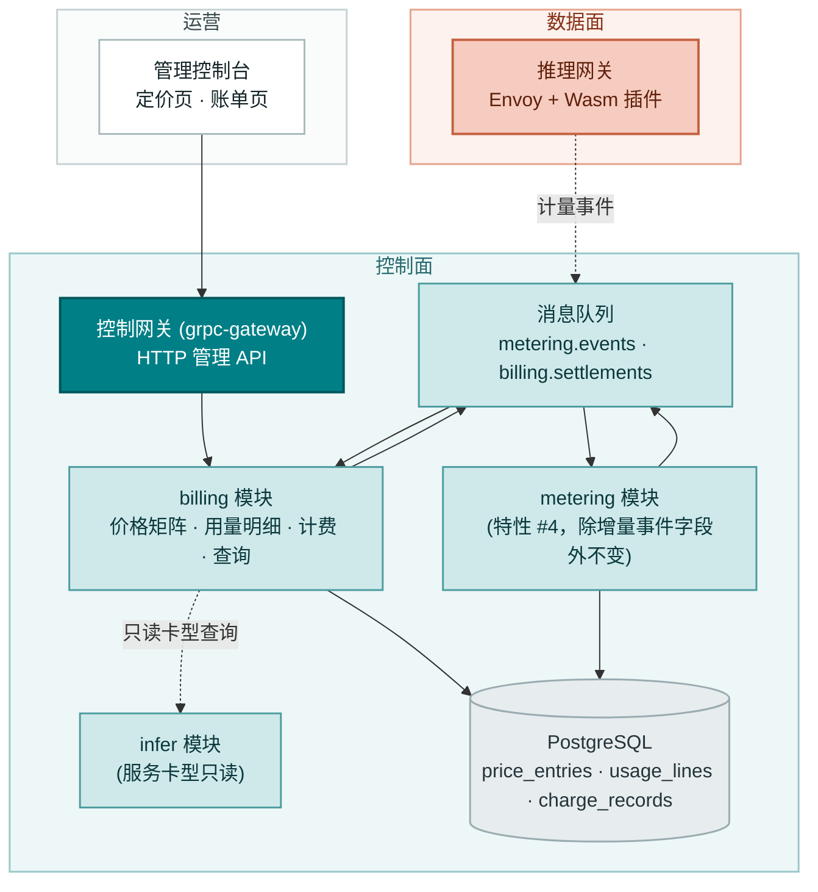
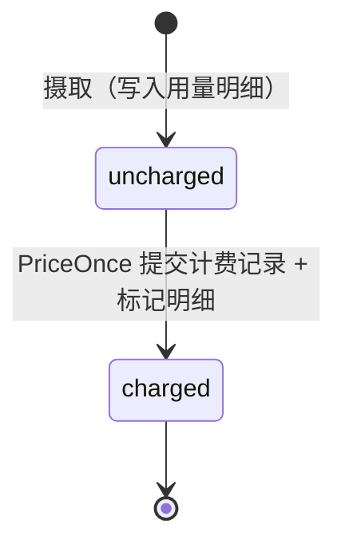
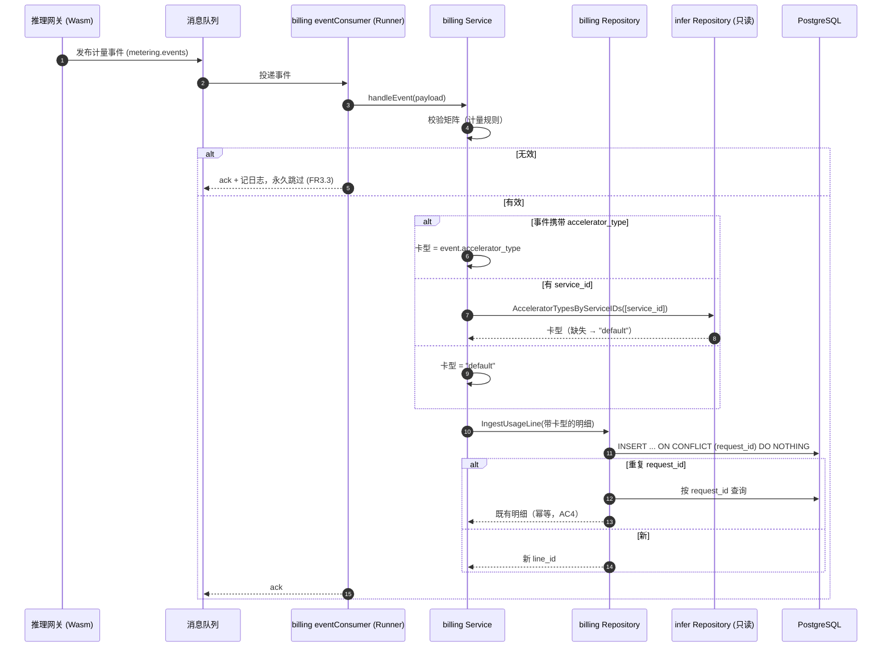
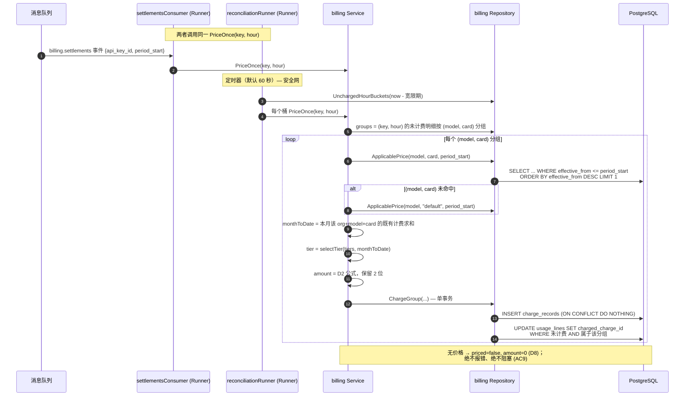
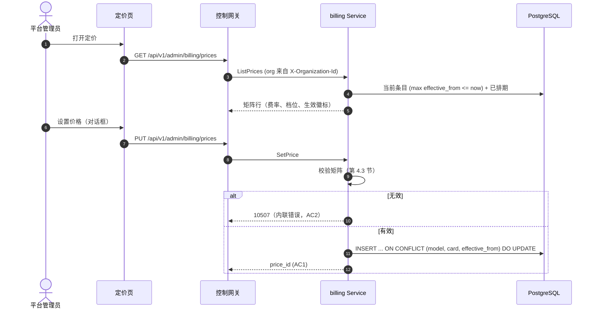
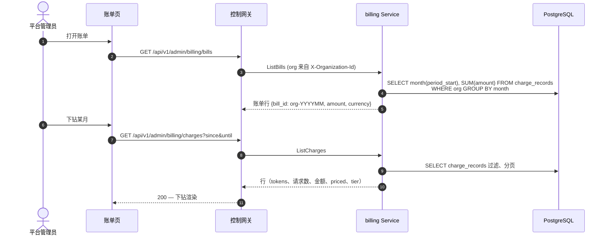

# 模型 × 卡型价格矩阵与阶梯定价 — 架构与详细设计

| 属性 | 内容 |
| --- | --- |
| 特性点 | 模型 × 卡型价格矩阵与阶梯定价 |
| 文档范围 | 定价核心的架构与详细设计：按生效时间版本化的价格矩阵、billing 用量明细摄取消费者、计费引擎（结算事件消费者 + 对账 runner）、计费与账单查询、错误处理、配置、发布说明，以及各层的函数级设计 |
| 归属模块 | `billing`（价格矩阵、用量明细、计费、计费/账单查询），配合 `metering`（仅事件契约增量扩展）与 `infer`（服务卡型只读接口） |
| 相关文档 | [需求分析与 UI/UX 设计](../design/pricing.zh-cn.md) · [架构设计](../design/architecture.zh-cn.md) 第 2.6 节（`billing`） · [Token 计量凭证与异步结算](./metering.zh-cn.md)（上游管道与 `billing.settlements` 契约） |
| 状态 | 架构完成，已移交开发代理 |

---

## 1. 目标与非目标

### 1.1 目标

- 实现 `taas.billing.v1.BillingService` 接口面：`SetPrice` 与 `ListPrices`（既有占位 → 实现）、`ListBills`（占位 → 实现）、新增 `ListCharges` RPC，以及增量 proto 扩展（`SetPrice` 增 `cached_price_per_million`、`effective_from`、`tiers`；`ListPrices` 增 `accelerator_type` 过滤与 `include_history`；`PriceEntry` 增 `price_id`、缓存费率、`effective_from`、`tiers`；新增 `PriceTier` 与 `ChargeRecordSummary` 消息）。`GetBalance` 保持返回 10503 的占位（特性 #8 的契约）。
- **按生效时间版本化的价格矩阵**（D1）：`price_entries` 行以 `(model_id, accelerator_type, effective_from)` 唯一为键；时刻 *t* 的适用价格是 `effective_from ≤ t` 中最大者；相同键的 `SetPrice` 原位更新（FR1、AC1、AC3）。
- **阶梯定价**（D3）：条目上的有序档位；按组织 `(model, card)` 在计算本次计费**之前**的当月累计 token 量选择档位；平价条目忽略用量（FR4.4、AC8）。
- **可计费用量摄取**（D5）：`billing` 模块在 `metering.events` 上运行自己的消费者，按 `request_id` 幂等地写入按请求的 `usage_lines`，卡型按 D6 链路解析（事件字段 → 按 `service_id` 查 `infer` 服务 → `default`）（FR3、AC4、AC5）。
- **计费引擎**（D7）：`billing.settlements` 消费者 + 对账 runner（与计量结算相同的小时资格规则），两者汇聚到同一 `PriceOnce(key, hour)`；每个 `(api_key, model, card, hour)` 分组一条计费记录，靠唯一复合索引保证幂等；未定价分组产出 `amount = 0`、`priced = false`（D8），绝不阻塞任何环节（FR4、AC6–AC11）。
- **计费与账单查询**（D9）：`ListCharges`（过滤、分页、组织范围）与 `ListBills`（读取时计算的月度聚合、确定性 `bill_id = {org}-{YYYYMM}`）（FR5、AC12、AC16）。
- **控制台定价与账单页面**（D11）：`/admin/pricing`（矩阵、设置价格对话框、历史开关）与 `/admin/billing`（月度账单、计费下钻）（FR6、AC14、AC15）。
- **新错误码**（D10）：10507 `CodePriceInvalid`、10508 `CodeBillingRangeInvalid`。

### 1.2 非目标

| 项 | 延后至 |
| --- | --- |
| 余额（预付）/ 配额（后付）账户模式、资金冻结、余额不足拒绝 | 特性 #8 |
| 支付、发票、回执、催缴 | 未来（#8 之后） |
| 套餐/捆绑包（预付 token 包） | 未来（与 #8 余额纠缠） |
| 价格删除 / 矩阵重置 | 未来运营工具 |
| 用量明细保留期清理 | 未来运维强化（明细约 1 行/请求；需要时镜像凭证保留期） |
| 记录内档位拆分与期末找平 | D3 的未来细化 |
| 已计费记录的追溯重定价 | v1 永不做（计费记录是不可变凭证） |
| 多币种与汇率 | 未来 |
| 租户侧账单可见性 | 特性 #6/#7 |
| 发送真实事件（带卡型）的 Envoy Wasm 插件 | 数据面轨道；验证使用合成事件 |

---

## 2. 组件视图



| 组件 | 本特性中的职责 |
| --- | --- |
| 推理网关（数据面） | 向 `metering.events` 发布计量事件（现可选携带 `accelerator_type`）；不在仓库范围内 — 契约见第 4.5 节 |
| 控制网关（`grpc-gateway`） | 四个 billing RPC 的 HTTP/JSON 门面，位于 `/api/v1/admin/billing`；按既有模式透传 `X-Organization-Id` |
| `billing` 模块（`services/billing`） | 价格矩阵仓库 + 校验、`metering.events` 消费者（用量明细）、`billing.settlements` 消费者 + 对账 runner（计费引擎）、计费/账单查询 |
| `metering` 模块 | 除事件契约的增量 `accelerator_type` 字段（proto 字段 8 + MQ 载荷）外不变；其消费者、结算、保留期均不动 |
| `infer` 模块 | 暴露服务卡型查询的窄读接口（第 3.4 节）；无行为变更 |
| PostgreSQL | 新表 `price_entries`、`usage_lines`、`charge_records` |
| 消息队列 | `metering.events`（第二个订阅者：billing）与 `billing.settlements`（新订阅者：billing）— 两个 subject 均已存在 |
| 控制台 | 定价页与账单页（契约见第 10.5 节） |

---

## 3. 数据模型

### 3.1 `price_entries` 表

| 列 | PostgreSQL 类型 | 约束 | 描述 |
| --- | --- | --- | --- |
| `id` | `uuid` | 主键 | 服务端生成的 UUID v4，暴露为 `price_id` |
| `model_id` | `varchar(128)` | NOT NULL，复合唯一 | 价格适用的模型 |
| `accelerator_type` | `varchar(64)` | NOT NULL，复合唯一 | 卡型；哨兵值 `default` 是按模型的兜底（D6） |
| `input_price_per_million` | `double precision` | NOT NULL | 每 1M tokens 的输入费率 |
| `output_price_per_million` | `double precision` | NOT NULL | 每 1M tokens 的输出费率 |
| `cached_price_per_million` | `double precision` | NOT NULL DEFAULT 0 | 每 1M tokens 的缓存命中费率（D2） |
| `currency` | `varchar(8)` | NOT NULL | 写入时取自配置（D4） |
| `effective_from` | `bigint` | NOT NULL，复合唯一 | Unix 秒；版本的生效起点（D1） |
| `tiers_json` | `jsonb` | NOT NULL DEFAULT '[]' | 有序 `PriceTier` 数组（D3）；`[]` = 平价 |
| `created_at` | `timestamptz` | NOT NULL | 行写入时间 |
| `updated_at` | `timestamptz` | NOT NULL | 原位更新时刷新（FR1.1） |

设计说明：

- 复合唯一索引 `idx_price_entries_cell_version (model_id, accelerator_type, effective_from)` 是 upsert 键：`SetPrice` 执行 INSERT … ON CONFLICT DO UPDATE — 相同 `(model, card, effective_from)` 的重复保存更新费率/档位并刷新 `updated_at`（FR1.1、AC1）。
- 价格查找（`ApplicablePrice`）：`WHERE model_id = ? AND accelerator_type = ? AND effective_from <= ? ORDER BY effective_from DESC LIMIT 1` — 按生效时间选择（D1、AC3），由该复合索引直接支撑。
- 档位存为 JSON（`gorm.io/datatypes.JSON`，既有模式）而非子表：档位总是随条目一起读写、从不独立查询 — 子表只会增加一次 join 和第二条写路径，查询收益为零。
- v1 无删除（D12）：被替代的版本留作历史；带 `include_history` 的 `ListPrices` 是审计视图（FR2.2、US6）。
- 不外键关联 `models`：价格可以在模型注册前设置（运营者预置定价），且必须比模型删除活得更久（财务凭证，同凭证表的推理）。

### 3.2 `usage_lines` 表

| 列 | PostgreSQL 类型 | 约束 | 描述 |
| --- | --- | --- | --- |
| `id` | `uuid` | 主键 | 服务端生成的 UUID v4，暴露为 `line_id` |
| `request_id` | `varchar(128)` | NOT NULL，唯一 | 推理请求 id；幂等键（D5） |
| `organization_id` | `varchar(64)` | NOT NULL，复合索引 | 所属组织 |
| `api_key_id` | `varchar(64)` | NOT NULL，复合索引 | 发起请求的 API Key |
| `model_id` | `varchar(128)` | NOT NULL | 服务该请求的模型 |
| `service_id` | `varchar(64)` | NULL | 推理服务（已知时） |
| `accelerator_type` | `varchar(64)` | NOT NULL | 按 D6 解析；无法解析时为 `default` |
| `prompt_tokens` | `bigint` | NOT NULL DEFAULT 0 | 输入 token 数 |
| `completion_tokens` | `bigint` | NOT NULL DEFAULT 0 | 输出 token 数 |
| `cached_tokens` | `bigint` | NOT NULL DEFAULT 0 | 缓存命中 token 数 |
| `reasoning_tokens` | `bigint` | NOT NULL DEFAULT 0 | 推理轨迹 token 数 |
| `completed_at` | `timestamptz` | NOT NULL，复合索引 | 请求完成时间 |
| `created_at` | `timestamptz` | NOT NULL | 明细写入时间 |
| `charged_charge_id` | `varchar(64)` | NULL，索引 | 由计费设置；NULL 表示未计费（FR4.2） |

设计说明：

- `request_id` 唯一索引是幂等机制，与 `vouchers` 完全同构：INSERT … ON CONFLICT DO NOTHING 后重查 — 重复投递静默收敛（FR3.2、AC4）。
- 复合索引：`idx_usage_lines_key_completed (api_key_id, completed_at)` 服务计费扫描与按 key 查询；`idx_usage_lines_org_completed (organization_id, completed_at)` 服务账单聚合。
- `usage_lines` 刻意复制凭证的 token 计数（D5）：billing 不得 join `metering` 的表 — 模块间只共享 MQ 契约，这样 metering 的表结构变更绝不会破坏计费。存储成本是每请求一行，与凭证同量级。
- 无外键（凭证表推理：财务凭证比 key/模型/服务活得久）。

### 3.3 `charge_records` 表

| 列 | PostgreSQL 类型 | 约束 | 描述 |
| --- | --- | --- | --- |
| `id` | `uuid` | 主键 | 服务端生成的 UUID v4，暴露为 `charge_id` |
| `organization_id` | `varchar(64)` | NOT NULL，索引 | 所属组织 |
| `api_key_id` | `varchar(64)` | NOT NULL，复合唯一 | 被计费的 API Key |
| `model_id` | `varchar(128)` | NOT NULL，复合唯一 | 模型分组 |
| `accelerator_type` | `varchar(64)` | NOT NULL，复合唯一 | 卡型分组 |
| `period_start` | `bigint` | NOT NULL，复合唯一 | 小时起点，Unix 秒（UTC） |
| `period_end` | `bigint` | NOT NULL | `period_start + 3600` |
| `prompt_tokens` | `bigint` | NOT NULL DEFAULT 0 | 分组-小时求和 |
| `completion_tokens` | `bigint` | NOT NULL DEFAULT 0 | 分组-小时求和 |
| `cached_tokens` | `bigint` | NOT NULL DEFAULT 0 | 分组-小时求和 |
| `reasoning_tokens` | `bigint` | NOT NULL DEFAULT 0 | 分组-小时求和 |
| `request_count` | `bigint` | NOT NULL DEFAULT 0 | 被计费的明细数 |
| `amount` | `double precision` | NOT NULL DEFAULT 0 | D2 公式，四舍五入到 2 位小数 |
| `currency` | `varchar(8)` | NOT NULL | 取自价格条目（未定价时取自配置） |
| `price_id` | `uuid` | NULL | 应用的价格条目版本；未定价时为 NULL（D8） |
| `tier_index` | `int` | NOT NULL DEFAULT -1 | 应用的档位；−1 = 平价 |
| `priced` | `boolean` | NOT NULL DEFAULT false | 无价格应用时为 false（D8） |
| `month_to_date_tokens` | `bigint` | NOT NULL DEFAULT 0 | 本次计费**之前**该组织此 `(model, card)` 的当月累计量（D3 证据） |
| `charged_at` | `timestamptz` | NOT NULL | 计费提交时间 |

设计说明：

- 复合唯一索引 `idx_charge_records_group_period (api_key_id, model_id, accelerator_type, period_start)` 是幂等兜底：重复的计费插入不可能存在，因此重投的结算事件与对账扫描同一小时都会收敛到既有行（D7、FR4.5、AC10）。
- `month_to_date_tokens` 落库（而非读取时重算），因为档位选择必须对审计可复现：产出某金额的档位可以从记录本身推导（US7）。
- 账单聚合（`ListBills`）按 `(organization_id, month(period_start))` 分组并 `SUM(amount)` — 由 `idx_charge_records_group_period` 的前导 `api_key_id` 加附加索引 `idx_charge_records_org_period (organization_id, period_start)` 支撑。
- 计费记录不可变：没有任何 API 更新或删除它（v1 无追溯重定价）。

### 3.4 跨模块读接口

D6 解析链需要推理服务的卡型。按窄接口模式（`infer.NewDeleteModelGuard` 被 `model` 消费的先例），`infer` 暴露：

```go
// AcceleratorTypesByServiceIDs 返回给定推理服务 id 的卡型。
// 缺失的 id 不会出现在结果中（已终止的服务在下游解析为 "default" 哨兵）。
func (r *InferRepository) AcceleratorTypesByServiceIDs(ctx context.Context, ids []string) (map[string]string, error)
```

`billing` 只在其 `metering.events` 处理器内（摄取时）调用它，绝不在计费时调用 — 解析出的卡型持久化在用量明细上，因此计费从不查询 `infer`（已删除的服务不能追溯改变某条明细的卡型）。`metering` 不新增接口：其事件契约只是携带可选的 `accelerator_type` 字段（第 4.5.1 节），由网关（或合成测试）填写。

---

## 4. API 契约

### 4.1 RPC 接口面

所有 API 属于 **`taas.billing.v1.BillingService`**（proto：`proto/taas/billing/v1/billing.proto`），经控制网关以 HTTP 提供。四个既有 RPC 为占位；新增一个。proto 变更仅增量。

| RPC | HTTP | 状态 | 用途 |
| --- | --- | --- | --- |
| `SetPrice` | `PUT /api/v1/admin/billing/prices` | 占位 → 实现 | upsert 一个矩阵单元格版本；请求增 `cached_price_per_million`（6）、`effective_from`（7）、`tiers`（8） |
| `ListPrices` | `GET /api/v1/admin/billing/prices` | 占位 → 实现 | 矩阵视图 / 历史；请求增 `accelerator_type`（3）、`include_history`（4）；`PriceEntry` 增 `price_id`、`cached_price_per_million`、`effective_from`、`tiers` |
| `ListCharges` | `GET /api/v1/admin/billing/charges` | **新增** | 计费记录下钻：过滤 `api_key_id`、`model_id`、`since`/`until` |
| `ListBills` | `GET /api/v1/admin/billing/bills` | 占位 → 实现 | 月度账单汇总；`BillSummary` 增已计价/未计价计数 |
| `GetBalance` | `GET /api/v1/admin/billing/balance` | 保持占位 | 特性 #8；返回 10503 |

新消息：`PriceTier {up_to_tokens, input_price_per_million, output_price_per_million}`、`ChargeRecordSummary`（第 4.2 节约束 3）。

### 4.2 线格式（既有惯例）

- 分页绑定为 `?page.offset=0&page.limit=20`（点分形式）；默认 limit 20，上限 100。
- 成功响应 HTTP 200；业务错误渲染为 `{"code": <int>, "message": "..."}`。
- 四个查询 API 均要求 `X-Organization-Id` 头（过渡期身份）；缺失返回 10001 `CodeUnauthorized` — 既有 `resolveOrganizationID` 模式（AC16）。
- proto3 JSON：int64 字段序列化为字符串（`"periodStart": "1761234400"`）；控制台按字符串解析。
- 时间范围参数为 Unix 秒；默认 `until = now`，`since` = 当月月初（账单）/ `until - 24h`（计费记录）；`since > until` 或跨度 > 366 天返回 10508（FR5.3、AC12）。
- `SetPrice` 对 `(model, card, effective_from)` 幂等：重复调用原位更新并返回相同 `price_id`（FR1.1、AC1）。

### 4.3 校验矩阵（同步）

`SetPrice` 按序执行以下检查；首个失败立即返回且不写入任何内容（AC2）：

| # | 检查 | 失败码 | 规范消息 |
| --- | --- | --- | --- |
| 1 | `model_id` 非空，≤ 128 字符 | 10507 `CodePriceInvalid` | price invalid |
| 2 | `accelerator_type` 非空，≤ 64 字符 | 10507 | price invalid |
| 3 | `input_price_per_million` ≥ 0 | 10507 | price invalid |
| 4 | `output_price_per_million` ≥ 0 | 10507 | price invalid |
| 5 | `cached_price_per_million` ≥ 0（默认 0） | 10507 | price invalid |
| 6 | `currency` 为空或 == 配置币种 | 10507 | price invalid |
| 7 | `effective_from` ≥ 0（0 → 当前时间） | 10507 | price invalid |
| 8 | 档位：除最后一档外 `up_to_tokens` > 0；最后一档 `up_to_tokens` = 0；严格递增；档位费率 ≥ 0 | 10507 | price invalid |

`ListCharges` / `ListBills` 校验时间范围（10508）。`metering.events` 消费者套用计量校验矩阵（10401 等价，记日志并永久跳过 — FR3.3）。

### 4.4 计费状态模型

一条用量明细只有两个状态，由 `charged_charge_id` 派生：



- `uncharged` → `charged` 是唯一迁移，且恰好发生一次（标记在计费事务内）。
- 小时在 `小时起点 + 1h + 宽限期`（默认 5 分钟 — 与计量结算相同规则，因此结算事件绝不会为 billing 认为未完成的小时到来）后具备计费资格；此前即使 runner 扫过，其明细也保持未计费（FR4.1、AC11）。
- 没有「失败」状态：一次计费要么提交，要么全部留给下一轮（崩溃安全，FR4.5）。

### 4.5 消息契约

#### 4.5.1 计量事件（`metering.events`，subject 已存在）— 增量字段

由网关的 Wasm 插件在请求完成后发布。JSON 载荷（新字段 `accelerator_type`，其余不变 — 按「只加字段」规则版本化）：

```json
{
  "request_id": "req-abc123",
  "organization_id": "org-fvt",
  "api_key_id": "key-uuid",
  "model_id": "qwen2.5-7b",
  "service_id": "svc-uuid",
  "accelerator_type": "A800",
  "usage": {
    "prompt_tokens": 1200,
    "completion_tokens": 340,
    "cached_tokens": 0,
    "reasoning_tokens": 0
  },
  "completed_at": 1761234567
}
```

消息头：`request_id`。两个消费者（metering 的与 billing 的）都按 `request_id` 幂等，因此 at-least-once 投递是安全的。metering proto 的 `IngestMeteringEventRequest` 增 `accelerator_type`（字段 8），使直连 RPC 路径也能携带；metering 凭证表**不**存储它（凭证保持不变 — 特性 #4 已交付的契约）。

#### 4.5.2 结算事件（`billing.settlements`，subject 已存在）— 不变

特性 #4 的载荷原样消费（计量架构文档第 4.5.2 节）：`{usage_record_id, api_key_id, organization_id, period_start, period_end, prompt_tokens, completion_tokens, cached_tokens, reasoning_tokens, request_count, settled_at}`。事件含义是「该 key-小时已结算且终局」— 即计费触发器（D7）。billing 不从事件重新推导 token 求和（用量明细才是事实来源）；事件只指名要计价的 `(api_key_id, period)`。

---

## 5. 时序图

### 5.1 用量明细摄取（billing 的 `metering.events` 消费者）



### 5.2 计费执行（结算消费者与对账 runner 汇聚）



### 5.3 价格查询与设置（控制台）



### 5.4 账单查询（控制台下钻）



---

## 6. 错误处理

所有错误都是统一信封中的 `pkg/errors` 业务码。新分配两个码（D10）；其余均已存在。

| 条件 | 码 | 常量 | 备注 |
| --- | --- | --- | --- |
| 畸形价格（校验矩阵） | 10507 | `CodePriceInvalid` | **新增**；规范消息 "price invalid" |
| 畸形时间范围（`since > until`、跨度 > 366 天） | 10508 | `CodeBillingRangeInvalid` | **新增**；规范消息 "billing range invalid" |
| 查询 API 缺 `X-Organization-Id` | 10001 | `CodeUnauthorized` | 既有；`resolveOrganizationID` 模式 |
| 余额查询（占位） | 10503 | `CodeAccountNotFound` | 既有；特性 #8 替换 |
| 数据库 / MQ 基础设施故障 | 500 | `CodeInternal` | 经错误归一化 |

Runner/消费者侧的失败不是 RPC 错误：计费执行遇到瞬时数据库错误时中止该分组并在下一轮重试（一切仍处于未计费）；畸形计量事件记日志并永久跳过（FR3.3）；未定价分组根本不是错误 — 以 `priced = false` 计 0（D8、AC9）。结算消费者把重投事件当作空操作（唯一索引吸收，AC10）。

---

## 7. 配置新增

`billing` 配置节为新增：

| 键 | 默认值 | 描述 |
| --- | --- | --- |
| `billing.currency` | `"USD"` | 单一平台币种（D4）；`SetPrice` 继承它，计费记录与账单携带它 |
| `billing.eventConsumer.enabled` | `true` | `metering.events` 消费者开关 |
| `billing.eventConsumer.workers` | `2` | 消费者并发数 |
| `billing.settlementsConsumer.enabled` | `true` | `billing.settlements` 消费者开关 |
| `billing.settlementsConsumer.workers` | `2` | 消费者并发数 |
| `billing.reconciliation.enabled` | `true` | 对账 runner 开关 |
| `billing.reconciliation.interval` | `60s` | 对账执行间隔 |
| `billing.reconciliation.gracePeriod` | `5m` | 小时关闭后的额外等待（镜像计量） |
| `billing.reconciliation.workers` | `2` | 并发计价 worker 数 |

规则：

- `Configuration.applyDefaults` 在未设置时填充上述默认值（`metering.settlement` 模式）；`Validate` 新增：interval 与 grace 非负、workers 非负、`currency` 非空且 ≤ 8 字符。
- `configs/server.yaml` 与 `configs/config.yaml` 增加带默认值并内联注释的 `billing` 节。

---

## 8. 安全考量

- **组织范围**：`ListCharges` 与 `ListBills` 从 `X-Organization-Id` 解析组织并将 SQL 限定于它（AC16）。`SetPrice`/`ListPrices` 是平台全局的（矩阵是运营者数据而非租户数据），但仍服务于管理面；过渡期请求头仅对组织范围的查询必需，与设计 D11 一致。
- **消息中无机密**：用量明细与计费记录只携带 id、token 计数与金额 — 无密钥材料、无提示词（凭证表推理）。
- **不可变性即审计属性**：没有任何 API 变更计费记录；计费之后唯一的写者是不存在的（v1 无重定价）。每条记录上的 `price_id` + `tier_index` + `month_to_date_tokens` 使每个金额可复现（US7）。
- **摄取在设计上无鉴权**：MQ subject 是集群内部面（网关是唯一预期发布者）；管理 API 承载与其他模块相同的过渡期鉴权姿态（特性 #7 替换）。
- **范围上限即资源护栏**：366 天范围上限与分页上限（100）约束每次查询的成本（FR5.3）。

---

## 9. 发布说明

- **表结构**：首次启动经 AutoMigrate 新建三张表（`price_entries`、`usage_lines`、`charge_records`）；仅增量，不动既有数据。
- **Proto**：增量变更（一个新 RPC、扩展消息、两个新消息类型）— 需 `make pbgen`；生成代码不入库。
- **Subject**：`metering.events` 与 `billing.settlements` 均已存在于 `DefaultSubjects()`；无 MQ 变更。billing 的订阅是既有 subject 上的额外消费者 — NATS core 的扇出会独立投递给 metering 与 billing 两个订阅。
- **接线**：`apps/taas-server/main.go` 已注册 billing 服务；在 `srv.Init()` 之后按计量模式新增三个 `srv.AddRunner(...)`。
- **滚动更新顺序**：单独部署 `taas-server`；消费者开始排空（事件未流动前为空）、对账 runner 找不到明细、查询返回空。特性 #4 的计量管道不受影响 — 其结算事件只是多了一个消费者。
- **升级兼容**：既有代码不读写新表；metering proto 变更是增量的（字段 8）；本特性纯增量。
- **功能开关**：三个后台 worker 的 `enabled` 开关支持不重新部署即停用计费（配置热加载仅限开发；生产重启 pod）。

---

## 10. 详细设计

### 10.1 文件布局

| 模块 | 文件 | 内容 |
| --- | --- | --- |
| `services/billing` | `billing_model.go` | GORM 模型 `PriceEntry`、`UsageLine`、`ChargeRecord` + `TableName` |
| | `billing_repository.go` | `Repository`（价格 upsert/查找/列表、用量明细摄取、计费事务、计费/账单查询） |
| | `event_consumer.go` | `EventConsumer` — `metering.events` 订阅者（Runner） |
| | `settlements_consumer.go` | `SettlementsConsumer` — `billing.settlements` 订阅者（Runner） |
| | `reconciliation_runner.go` | `ReconciliationRunner` — 计费安全网（Runner） |
| | `pricing.go` | `PriceOnce` 核心：分组、价格查找、档位选择、金额公式 |
| | `service.go` | RPC 实现（四个）+ `Migrate` + `NewForFVT` + `MigrateSchemaForFVT` |
| `services/infer` | `infer_repository.go` | `AcceleratorTypesByServiceIDs`（增量只读助手） |
| `pkg/errors` | `codes.go` | `CodePriceInvalid`（10507）、`CodeBillingRangeInvalid`（10508） |
| | `messages.go` | 两个新码的规范消息 |
| `pkg/config` | `api.go` | `BillingConfig`（含 `Currency`、`EventConsumer`、`SettlementsConsumer`、`Reconciliation` 子节） |
| | `configuration.go` | 新键的 `applyDefaults` + `Validate` 规则 |
| `apps/taas-server` | `main.go` | 在 `srv.Init()` 后注册三个 Runner |
| `configs` | `server.yaml`、`config.yaml` | `billing` 节 |
| `proto/taas/billing/v1` | `billing.proto` | 增量：`ListCharges`、消息扩展 |
| `proto/taas/metering/v1` | `metering.proto` | 增量：`IngestMeteringEventRequest` 增 `accelerator_type` 字段 8 |

### 10.2 `billing` 模块

GORM 模型（唯一事实来源）：

```go
type PriceEntry struct {
    ID                    string         `gorm:"primaryKey;type:uuid"`
    ModelID               string         `gorm:"size:128;not null;uniqueIndex:idx_price_entries_cell_version,priority:1"`
    AcceleratorType       string         `gorm:"size:64;not null;uniqueIndex:idx_price_entries_cell_version,priority:2"`
    InputPricePerMillion  float64        `gorm:"not null"`
    OutputPricePerMillion float64        `gorm:"not null"`
    CachedPricePerMillion float64        `gorm:"not null;default:0"`
    Currency              string         `gorm:"size:8;not null"`
    EffectiveFrom         int64          `gorm:"not null;uniqueIndex:idx_price_entries_cell_version,priority:3"`
    TiersJSON             datatypes.JSON `gorm:"not null"`
    CreatedAt             time.Time
    UpdatedAt             time.Time
}

type UsageLine struct {
    ID               string    `gorm:"primaryKey;type:uuid"`
    RequestID        string    `gorm:"size:128;not null;uniqueIndex"`
    OrganizationID   string    `gorm:"size:64;not null;index:idx_usage_lines_org_completed,priority:1"`
    APIKeyID         string    `gorm:"size:64;not null;index:idx_usage_lines_key_completed,priority:1"`
    ModelID          string    `gorm:"size:128;not null"`
    ServiceID        *string   `gorm:"size:64"`
    AcceleratorType  string    `gorm:"size:64;not null"`
    PromptTokens     int64     `gorm:"not null;default:0"`
    CompletionTokens int64     `gorm:"not null;default:0"`
    CachedTokens     int64     `gorm:"not null;default:0"`
    ReasoningTokens  int64     `gorm:"not null;default:0"`
    CompletedAt      time.Time `gorm:"not null;index:idx_usage_lines_org_completed,priority:2;index:idx_usage_lines_key_completed,priority:2"`
    CreatedAt        time.Time
    ChargedChargeID  *string   `gorm:"size:64;index"`
}

type ChargeRecord struct {
    ID                 string    `gorm:"primaryKey;type:uuid"`
    OrganizationID     string    `gorm:"size:64;not null;index:idx_charge_records_org_period,priority:1"`
    APIKeyID           string    `gorm:"size:64;not null;uniqueIndex:idx_charge_records_group_period,priority:1"`
    ModelID            string    `gorm:"size:128;not null;uniqueIndex:idx_charge_records_group_period,priority:2"`
    AcceleratorType    string    `gorm:"size:64;not null;uniqueIndex:idx_charge_records_group_period,priority:3"`
    PeriodStart        int64     `gorm:"not null;uniqueIndex:idx_charge_records_group_period,priority:4;index:idx_charge_records_org_period,priority:2"`
    PeriodEnd          int64     `gorm:"not null"`
    PromptTokens       int64     `gorm:"not null;default:0"`
    CompletionTokens   int64     `gorm:"not null;default:0"`
    CachedTokens       int64     `gorm:"not null;default:0"`
    ReasoningTokens    int64     `gorm:"not null;default:0"`
    RequestCount       int64     `gorm:"not null;default:0"`
    Amount             float64   `gorm:"not null;default:0"`
    Currency           string    `gorm:"size:8;not null"`
    PriceID            *string   `gorm:"type:uuid"`
    TierIndex          int       `gorm:"not null;default:-1"`
    Priced             bool      `gorm:"not null;default:false"`
    MonthToDateTokens  int64     `gorm:"not null;default:0"`
    ChargedAt          time.Time
}
```

`Repository`（内嵌 `database.BaseRepository[PriceEntry]`，持有 `*database.Manager` — 既有模式）：

- `UpsertPrice(ctx, entry *PriceEntry) (*PriceEntry, error)` — 带 `clause.OnConflict{Columns: [model, card, effective_from], DoUpdates: 费率/档位/updated_at}` 的 INSERT；返回已存行（含 `price_id`）。upsert 原语（AC1）。
- `ApplicablePrice(ctx, modelID, cardType string, at int64) (*PriceEntry, error)` — `WHERE model_id = ? AND accelerator_type = ? AND effective_from <= ? ORDER BY effective_from DESC LIMIT 1`；缺失返回 nil（调用方套用 D6 回退链）。
- `ListPrices(ctx, filter PriceFilter) ([]*PriceEntry, int64, error)` — 当前视图：每个 `(model, card)` 取 `effective_from ≤ now` 最大者加 `effective_from > now`（已排期）；历史视图（`include_history`）：全部版本。过滤：model、card。按 `model_id, accelerator_type, effective_from DESC` 排序；返回 `page_meta` 总数。
- `IngestUsageLine(ctx, line *UsageLine) (*UsageLine, error)` — 对 `request_id` 带 `clause.OnConflict{DoNothing: true}` 的 INSERT；冲突时重查。幂等原语（AC4）。
- `UnchargedGroups(ctx, apiKeyID string, periodStart, periodEnd int64) ([]UsageGroup, error)` — `SELECT model_id, accelerator_type, SUM(tokens), COUNT(*) FROM usage_lines WHERE api_key_id = ? AND completed_at >= ? AND completed_at < ? AND charged_charge_id IS NULL GROUP BY model_id, accelerator_type`（计费扫描；无方言问题 — 普通 SQL 聚合 sqlite 与 Postgres 都能处理）。
- `UnchargedHourBuckets(ctx, eligibleBefore time.Time) ([]HourBucket, error)` — `SELECT DISTINCT api_key_id, (bucket) FROM usage_lines WHERE charged_charge_id IS NULL AND completed_at < ?`（对账扫描；在 Go 中对去重后的 key 列表分桶，计量 runner 的做法）。
- `ChargeGroup(ctx, group UsageGroup, record *ChargeRecord) error` — 一个 `Manager.WithinTx` 事务：对分组-周期唯一索引带 `clause.OnConflict{DoNothing: true}` 地 INSERT 计费记录（已存在则为空操作 — 重跑安全，AC10），然后 `UPDATE usage_lines SET charged_charge_id = ? WHERE api_key_id = ? AND model_id = ? AND accelerator_type = ? AND completed_at >= ? AND completed_at < ? AND charged_charge_id IS NULL`。
- `MonthToDateTokens(ctx, orgID, modelID, cardType string, monthStart int64, before int64) (int64, error)` — 该组织 `(model, card)` 本月（不含当前小时）计费记录的 `SUM(prompt+completion+cached+reasoning)`（D3 的用量输入）。
- `ListCharges(ctx, filter ChargeFilter) ([]*ChargeRecord, int64, error)` — 过滤：组织（恒定）、api_key_id、model_id、`period_start` 上的 since/until；`period_start DESC`；分页。
- `BillSummaries(ctx, orgID string, since, until int64, offset, limit int) ([]BillSummaryRow, int64, error)` — 在 Go 中对该组织记录做月度分桶（无方言问题，计量 runner 的分组做法）；`bill_id = fmt.Sprintf("%s-%s", orgID, month.Format("200601"))`。

`pricing.go`（`PriceOnce` 核心，两个消费者/runner 共享）：

- `PriceOnce(ctx, apiKeyID string, periodStart int64) error` — 唯一计费入口：(1) `UnchargedGroups(key, hour)`；(2) 逐组：`ApplicablePrice(model, card, periodStart)` → 回退 `(model, "default")` → 未定价（D6/D8）；`MonthToDateTokens`（组织取自分组的明细）；档位选择（`selectTier`：取首个 `up_to_tokens > volume` 的档位，否则取无上限末档；无档位即平价）；按 D2 计算金额并保留 2 位小数（`math.Round(amount*100)/100`）；单事务 `ChargeGroup`。分组独立处理 — 一组失败不中止其他组（记日志，下一轮重试）。
- `selectTier(tiers []PriceTier, monthToDate int64) (index int, input, output float64)` — 平价时返回 −1/条目费率。

`service.go`：

- `Service` 增 `repo *Repository`（从 components 惰性获取）、卡型查询用的 `inferRepo` 访问器（惰性、只读），并实现 `server.Migrator`（`Migrate`：AutoMigrate 三个模型；无种子）。
- `NewForFVT(db *gorm.DB, bus mq.Client) *Service` — FVT 注入点。
- `MigrateSchemaForFVT(db *gorm.DB) error`。
- `handleMeteringEvent(ev *meteringEvent) error` — 共享摄取核心：校验（计量规则）→ D6 卡型解析（事件字段 → `AcceleratorTypesByServiceIDs` → `default`）→ `IngestUsageLine`。仅由 `metering.events` 消费者调用（RPC 路径属于 metering 而非 billing — D5）。
- `SetPrice` — 校验矩阵（第 4.3 节）→ 构建 `PriceEntry`（UUID v4、`effective_from` 缺省当前时间、`currency` 取配置）→ `UpsertPrice` → 返回 `price_id`。
- `ListPrices` — 规范化分页、`ListPrices`、映射为 `PriceEntry` proto（档位从 JSON 解码）。
- `ListCharges` — 解析组织（10001）、校验范围（10508）、规范化分页、映射为 `ChargeRecordSummary`。
- `ListBills` — 解析组织、校验范围、`BillSummaries`、映射为 `BillSummary` proto（`bill_id`、金额、周期、已计价/未计价计数）。
- `GetBalance` — 占位不变（10503）。

`event_consumer.go`：

- `EventConsumer` 实现 `server.Runner`：订阅 `subjects.MeteringEvents`（billing 自己的订阅 — NATS 扇出投递给两个消费者）；JSON 解码错误与校验失败记日志并永久跳过；瞬时数据库错误返回以供 broker 重试（FR3.3）。配置：`billing.eventConsumer.{enabled,workers}`。
- `NewEventConsumerRunner(components) *EventConsumer` — 禁用或 MQ/DB 不可用时返回 nil（既有模式）。

`settlements_consumer.go`：

- `SettlementsConsumer` 实现 `server.Runner`：订阅 `subjects.BillingSettlements`；每个事件 → `PriceOnce(api_key_id, period_start)`（用事件的周期而非当前时间 — D7）。重投事件由唯一索引吸收（AC10）。配置：`billing.settlementsConsumer.{enabled,workers}`。

`reconciliation_runner.go`：

- `ReconciliationRunner` 实现 `server.Runner`：`Run(ctx)` 按定时器（`interval`）循环；每轮：`UnchargedHourBuckets(now - grace)` → 逐桶 `PriceOnce`（并发受 `workers` 约束，错误记日志、下一轮重试）。资格：`now >= periodStart + 3600 + grace`（FR4.1、AC11）。
- `NewReconciliationRunner(components)` — 禁用或组件不可用时返回 nil。为可测试性抽出 `ReconcileOnce(ctx)`（`SettleOnce` 模式）。

### 10.3 `pkg/errors`、`pkg/config`、`services/infer`（增量）

- `codes.go`：billing 块中 `CodePriceInvalid Code = 10507`、`CodeBillingRangeInvalid Code = 10508`。
- `messages.go`：`"price invalid"`、`"billing range invalid"`。
- `api.go`：`BillingConfig{Currency string, EventConsumer BillingConsumerConfig, SettlementsConsumer BillingConsumerConfig, Reconciliation BillingReconciliationConfig}`；`Config` 增 `Billing BillingConfig`。
- `configuration.go`：`applyDefaults` 在为零时填充币种/消费者/对账默认值；`Validate` 增加第 7 节规则。
- `services/infer/infer_repository.go`：`AcceleratorTypesByServiceIDs` — `SELECT id, accelerator_type FROM inference_services WHERE id IN (?)`（既有表；只读，无迁移）。

### 10.4 `apps/taas-server/main.go`（增量）

在 `srv.Init()` 之后（与计量 runner 并列）：

```go
if runner := billing.NewEventConsumerRunner(srv.Components()); runner != nil {
    srv.AddRunner(runner)
}
if runner := billing.NewSettlementsConsumerRunner(srv.Components()); runner != nil {
    srv.AddRunner(runner)
}
if runner := billing.NewReconciliationRunner(srv.Components()); runner != nil {
    srv.AddRunner(runner)
}
```

### 10.5 控制台（不在仓库范围内，契约摘要）

控制台是独立交付物；本设计固定其契约：定价页（`/admin/pricing`，导航项位于用量之后）— 矩阵表（模型、卡型、每 1M 输入/输出/缓存费率含币种、档位摘要、当前/已排期生效徽标、更新时间）、设置价格对话框（模型下拉来自目录、卡型输入带建议、三个费率、末行为无上限的档位编辑器、默认当前的生效时间、币种只读）、单元格历史开关、内联 10507 错误、空态；账单页（`/admin/billing`，导航项位于定价之后）— 月度账单表（月份、金额、币种）、计费下钻对话框（按 key/模型/卡型行：tokens、请求数、金额、计价标记、未定价高亮）、空态；两页可见时均 60 秒轮询（FR6、AC14、AC15）。`web/src/api.ts` 增 `PriceEntry`、`PriceTier`、`ChargeRecordSummary`、`BillSummary` 类型（int64 按字符串）。

### 10.6 测试策略

**单元测试**（`services/billing`，每测试 sqlite 内存库）：

- `billing_repository_test.go`：`UpsertPrice` 正常路径 + 原位更新（AC1）；`ApplicablePrice` 版本选择边界（AC3）；`IngestUsageLine` 幂等（AC4）；`UnchargedGroups` 分组求和；`ChargeGroup` 标记 + 重跑空操作（AC10）；`MonthToDateTokens` 月度范围；`BillSummaries` 月度分桶与 `bill_id` 确定性（AC12）。
- `pricing_test.go`：D2 金额公式精确到分（AC7）；档位选择边界 — 当月首笔第 1 档、跨过 `up_to_tokens` 选下一档（AC8）；default 卡回退与未定价标记（AC9）；基于种子明细的 `PriceOnce` 端到端（AC6）。
- `service_test.go`（框架模式）：`SetPrice` 校验矩阵 → 10507（AC2）；范围校验 → 10508（AC12）；经 metadata 上下文的组织范围（AC16）。
- `event_consumer_test.go`：卡型解析链 — 事件字段、服务查询、default（AC5）；畸形事件永久跳过（AC4）。
- `settlements_consumer_test.go` + `reconciliation_runner_test.go`：事件触发 `PriceOnce`；重投空操作（AC10）；runner 无事件也为未计费小时计价（AC11）；资格边界（AC11）。

**FVT**（`test/fvt/pricing_fvt_test.go`，计量 FVT 模式）：文件型 sqlite + `billing.MigrateSchemaForFVT` + recordingBus + `billing.NewForFVT(db, bus)` + 带生产拦截器的 gRPC 服务器 + 带 `FVTHeaderMatcher` 的网关 mux；真实消费者在总线上运行。走查：经网关 `SetPrice`（AC1）、10507（AC2）、向总线发布带卡型的合成计量事件 → 用量明细（AC4、AC5）、调用计量结算 → `billing.settlements` 事件 → 金额正确的计费记录（AC6、AC7、AC13）、经网关 `ListCharges`/`ListBills`（AC12）、第二组织的隔离（AC16）。

**E2E**（`test/e2e/tests/pricingBills.js`，usageMetering.js 模式）：针对 compose 栈 — 定价页渲染矩阵 + 对话框创建条目刷新后出现 + 内联 10507（AC14）；账单页渲染汇总 + 下钻 + 空态（AC15）。计费数据经 FVT 式直连路径播种（e2e 聚焦控制台；API 行为由 FVT 覆盖）。

**回归**：既有四个 e2e 套件必须保持绿色（billing 之外无行为变更；metering proto 变更为增量）。

### 10.7 验收标准覆盖

| AC | 由谁解决 | 验证钩子 |
| --- | --- | --- |
| AC1 — SetPrice 存版本；ListPrices 返回当前；重复原位更新 | `UpsertPrice` ON CONFLICT DO UPDATE | 单元 + E2E |
| AC2 — 无效价格 → 10507，不写入 | 校验矩阵 | 单元 + E2E |
| AC3 — 按生效时间的版本选择 | `ApplicablePrice` | 单元 |
| AC4 — 每事件一条明细；重复空操作 | `IngestUsageLine` ON CONFLICT | 单元 |
| AC5 — 卡型解析链 | `handleMeteringEvent` 的 D6 逻辑 | 单元 |
| AC6 — 结算事件 → 每 (model, card) 分组一条计费 | `PriceOnce` + `ChargeGroup` | 单元 + FVT |
| AC7 — 金额公式精确、2 位小数 | `pricing.go` 的 D2 公式 | 单元 |
| AC8 — 按月初至今用量选档 | `selectTier` + `MonthToDateTokens` | 单元 |
| AC9 — default 卡回退；未定价 → 0 + 标记 | `PriceOnce` 的 D6/D8 | 单元 |
| AC10 — 重投/重跑下计费幂等 | 分组-周期唯一索引 + ON CONFLICT | 单元 |
| AC11 — 对账 runner 无事件也计价；资格 | `ReconcileOnce` + 资格规则 | 单元 |
| AC12 — ListCharges/ListBills 行为；10508 | 查询 RPC + 范围校验 | FVT |
| AC13 — 全链路 FVT | FVT 走查 | FVT |
| AC14 — 定价页渲染；对话框；内联错误 | 控制台契约（10.5） | E2E |
| AC15 — 账单页渲染；下钻；空态 | 控制台契约（10.5） | E2E |
| AC16 — 计费/账单查询的组织范围 | `resolveOrganizationID` 模式 | FVT |

---

## 11. 延后项

| 项 | 延后至 |
| --- | --- |
| 余额/配额模式、冻结、余额不足 | 特性 #8 |
| 支付、发票、回执 | 未来（#8 之后） |
| 套餐/捆绑包 | 未来 |
| 价格删除 / 矩阵重置 | 未来运营工具 |
| 用量明细保留期 | 未来运维强化 |
| 记录内档位拆分、期末找平 | D3 的未来细化 |
| 追溯重定价 | v1 永不做 |
| 多币种 / 汇率 | 未来 |
| 租户账单可见性 | 特性 #6/#7 |
| 网关中业务码 → HTTP 状态映射 | 平台级后续 |
