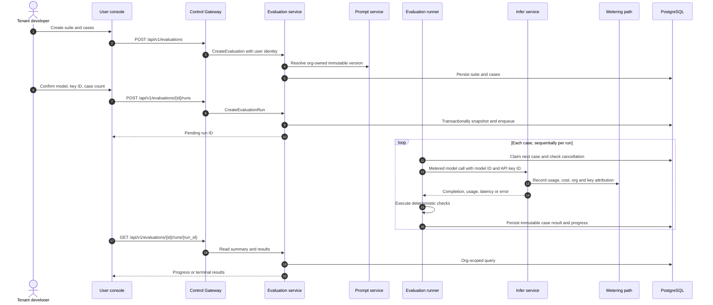
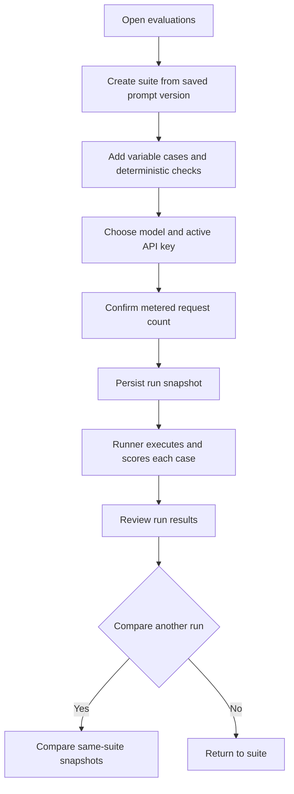

# Prompt Evaluation & Regression Testing — Architecture and Detailed Design

| Attribute | Content |
| --- | --- |
| Feature point | Prompt evaluation & regression testing (backlog row 44) |
| Document scope | Tenant-owned evaluation suites, variable cases, deterministic checks, metered asynchronous runs, result review, and run comparison |
| Owning modules | New `evaluation` module (`services/evaluation`), existing `prompt` (read-only source versions), `infer` (metered model execution), `auth`/`tenancy` (identity and organization roles), `web` (end-user pages) |
| Related documents | [UI/UX design](../design/prompt-evaluation.md) · [Prompt Management](./prompt-management.md) · [Batch Inference](./batch-inference.md) · [Console Surface Separation](./console-surface-separation.md) · [Architecture overview](../design/architecture.md) |
| Status | Architecture complete, ready for Developer |

## 1. Goals and Boundaries

Provide a repeatable, tenant-scoped regression loop: select a saved immutable prompt version, curate variable inputs and deterministic checks, execute one metered inference request per case against one model, inspect all results, and compare two runs. Cases and run outputs can contain tenant data and prompt IP, so the feature is end-user-only.

Non-goals: admin evaluation views or APIs, LLM-as-judge, manual review, online evaluation, imported datasets, model comparison within one run, tool or Agent execution, and changes to the Envoy/Wasm data-plane contract beyond using the existing trusted inference seam.

### Decisions

| # | Decision | Rationale |
| --- | --- | --- |
| AD1 | Add `services/evaluation`, owning suite, case, run, result, validation, deterministic scoring, asynchronous worker, and retention. | Keeps evaluation lifecycle and snapshots out of `prompt` and `infer`; follows `batch`'s in-process `server.Runner` pattern. |
| AD2 | A suite references one tenant prompt and a pinned immutable version. Each run snapshots prompt content, variable declarations, ordered cases/checks, model identity, and key ID. | Prompt edits and suite edits cannot mutate historic results. |
| AD3 | Supported checks are exact match, contains, regular expression, and valid JSON. All checks are deterministic and run locally after inference. | Reproducible results without hidden judge-model cost. |
| AD4 | Run creation enqueues persisted work and returns immediately. A database-backed runner processes cases independently, records partial outcomes, and polls cancellation. | Inference may exceed a browser request lifetime; persisted state supports restart and progress polling without inventing a new MQ/Controller message. |
| AD5 | For every case call the existing user model-inference path using `model_id` and the tenant-owned `api_key_id`; never persist or accept the key secret. The inference/metering path remains responsible for usage, cost, request logs, and organization/key attribution. | Matches the existing `PlaygroundModel` contract, which accepts key identity and uses normal metered inference. The browser's active-key selector supplies only an ID and masked label. |
| AD6 | A case inference/check error is a result, not a run-level abort. Run status is `completed`, `completed_with_errors`, `failed`, or `cancelled`; retry always creates a distinct run. | Preserves successful work and prevents silent overwrite/retry. |
| AD7 | A suite permits 1–50 configured cases; a run permits at most 50, values at most 10,000 characters, and at most 10 queued/running runs per organization. | Enforces the UI/UX limits on both write and execution paths. Enforce the org run cap transactionally. |
| AD8 | Evaluation suite and run data is retained for 90 days. Deleting a suite hides it and its run history from normal suite navigation immediately; run snapshots remain inaccessible to ordinary list APIs and are purged on retention expiry. | Honors the UX retention promise without exposing orphaned snapshots through another tenant or an unexpected route. |
| AD9 | The evaluation service is registered in the unified gRPC server and runs its worker/retention loops as `server.Runner`s. No evaluation work is sent to the Kubernetes Controller. | Evaluation executes inference, not Kubernetes desired-state reconciliation. |
| AD10 | New error codes occupy the open `128xx` block after prompt's `127xx`: `12801` suite not found, `12802` suite name conflict, `12803` invalid case, `12804` invalid check, `12805` run not found, `12806` invalid run state/comparison, `12807` configured limit exceeded, `12808` source prompt/version invalid. | Stable actionable business errors without reusing unrelated prompt or inference errors. |

## 2. Component View

| Layer | Ownership and change |
| --- | --- |
| Control Gateway / grpc-gateway | Register `EvaluationService` annotated routes under `/api/v1/evaluations/*` only. Existing realm guard remains authoritative. |
| `evaluation` | Tenant-scoped CRUD, case validation, run snapshots, deterministic evaluator, worker, result comparison, retention. |
| `prompt` | Read-only lookup of tenant prompt/version content and declared variables. Evaluation does not edit prompt rows or versions. |
| `infer` | Resolve authorized model to ready service and invoke existing metered model path with `api_key_id`; no key secret enters evaluation storage. |
| `auth` / `tenancy` | Resolve active organization and actor from session. Read calls require an active organization member. Suite/case mutations, run creation, and cancellation require `member` or higher via `RoleGuard`; viewers receive the existing role-denied code `10036`. |
| `audit` | Best-effort events `evaluation.created`, `evaluation.updated`, `evaluation.deleted`, `evaluation.run_created`, and `evaluation.run_cancelled`; do not audit raw case values or outputs. |
| PostgreSQL | Evaluation tables and durable work state. GORM additive `AutoMigrate`; no init-SQL changes are required for new tables. |
| MQ / Controller / data plane | No new Controller messages. Each case uses the established model inference path; Envoy/Wasm and metering remain unchanged. |
| Web | Four end-user screens in `UserShell`; no admin page, admin route, or admin RPC. |

The runner claims work with a database lease/conditional state update so multiple server replicas cannot execute the same case concurrently. It persists each result before advancing and checks cancellation between cases. Database state is the source of truth; NATS is not used for run scheduling.

## 3. Data Model

IDs are UUIDs; timestamps are UTC. Every tenant query includes the organization ID derived from `SessionActiveOrg`, never a request-supplied organization filter. Avoid foreign keys to prompt tables: a prompt may be removed while immutable run snapshots remain useful.

| Table | Fields and constraints |
| --- | --- |
| `evaluations` | `evaluation_id` PK; `organization_id` indexed; `name` varchar(128); `description` varchar(500); `prompt_id`; `prompt_version` integer; `created_by`; `created_at`, `updated_at`; `deleted_at` nullable. Unique active name per organization (enforce with transaction/partial unique index). |
| `evaluation_cases` | `case_id` PK; `evaluation_id` indexed; `position` integer; `name` varchar(128); `variables` JSONB object; `expected_output` text nullable; `checks` JSONB array; timestamps. Unique `(evaluation_id, position)`. Cases are editable; runs hold independent snapshots. |
| `evaluation_runs` | `run_id` PK; `evaluation_id`, `organization_id` indexed; `status`; `prompt_id`, `prompt_version`, `prompt_content_snapshot` text, `prompt_variables_snapshot` JSONB; `model_id`, model display snapshot; `api_key_id` only; `case_count`, progress counters, total cost in minor units, currency, median latency; `created_by`, `created_at`, `started_at`, `completed_at`, `retained_until`; `cancel_requested_at`; worker lease fields. |
| `evaluation_run_cases` | `result_id` PK; `run_id` and stable source `case_id` nullable; `case_position`, case-name snapshot, variables/check/expected-output snapshots; `status` (`pending`, `passed`, `failed`, `error`, `cancelled`); completion text; per-check results JSONB; input/output tokens; latency; cost minor units/currency; sanitized error code/message; timestamps. Unique `(run_id, case_position)`. |

Each run snapshots all cases and checks inside the transaction that creates the run, before the runner can claim it. Result rows retain only required response content and usage; errors are bounded and scrubbed of credentials. Comparison aligns by source `case_id`, then clearly labels cases present on only one side. Cost aggregation uses the same currency/minor-unit convention as metering.

Migration: add `Evaluation`, `EvaluationCase`, `EvaluationRun`, and `EvaluationRunCase` to service `Migrate` and `MigrateSchemaForFVT` AutoMigrate. Existing init SQL remains unchanged because these are additive new tables and startup migrations own them. Rollback is application rollback only; do not drop data tables during downgrade.

## 4. API Design

New proto: `proto/taas/evaluation/v1/evaluation.proto`, package `taas.evaluation.v1`, service `EvaluationService`. Every new RPC has the exact annotation below. There are no admin bindings or additional bindings.

| RPC | HTTP annotation | Behavior |
| --- | --- | --- |
| `CreateEvaluation` | `POST /api/v1/evaluations` | Create suite after verifying prompt/version belongs to caller org. |
| `ListEvaluations` | `GET /api/v1/evaluations` | Org-scoped name search/prompt/status filter and page. |
| `GetEvaluation` | `GET /api/v1/evaluations/{evaluation_id}` | Suite and up to 50 ordered cases. |
| `UpdateEvaluation` | `PATCH /api/v1/evaluations/{evaluation_id}` | Update name, description, pinned prompt/version after validation. |
| `DeleteEvaluation` | `DELETE /api/v1/evaluations/{evaluation_id}` | Soft-delete/hide suite; retain snapshots until expiry. |
| `CreateEvaluationCase` | `POST /api/v1/evaluations/{evaluation_id}/cases` | Validate and append case. |
| `UpdateEvaluationCase` | `PATCH /api/v1/evaluations/{evaluation_id}/cases/{case_id}` | Validate and update case. |
| `DeleteEvaluationCase` | `DELETE /api/v1/evaluations/{evaluation_id}/cases/{case_id}` | Delete configuration case only. |
| `ReorderEvaluationCases` | `PUT /api/v1/evaluations/{evaluation_id}/cases:reorder` | Atomically set a permutation of current case IDs. |
| `CreateEvaluationRun` | `POST /api/v1/evaluations/{evaluation_id}/runs` | Validate model/key/cases and limits; snapshot and enqueue, return pending run. |
| `ListEvaluationRuns` | `GET /api/v1/evaluations/{evaluation_id}/runs` | Newest first, paginated run summaries. |
| `GetEvaluationRun` | `GET /api/v1/evaluations/{evaluation_id}/runs/{run_id}` | Summary plus paginated/filterable case results. |
| `CancelEvaluationRun` | `POST /api/v1/evaluations/{evaluation_id}/runs/{run_id}:cancel` | Request cancellation; preserve completed rows, mark remaining rows cancelled. |
| `CompareEvaluationRuns` | `POST /api/v1/evaluations/{evaluation_id}/runs:compare` | Compare two terminal non-failed runs belonging to this suite. |

`google.api.http` entries use `body: "*"` for create/update/reorder/run/cancel/compare requests and path/query parameters for reads/deletes. Proto request/response messages include `taas.common.v1.Response`; list methods use `PageRequest`/`PageMeta`. Run creation fields: `model_id`, `api_key_id`, optional selected `case_ids` (empty means all configured cases), and the pinned `prompt_version` assertion. Reject a version that differs from the suite's current pinned version; update the suite first to select another version. Never accept `organization_id` in user messages.

The UI uses existing selector APIs only: prompt list `GET /api/v1/prompts`, versions `GET /api/v1/prompts/{prompt_id}/versions`, models `GET /api/v1/models`, and active API keys `GET /api/v1/auth/api-keys?active_only=true`. The selector response contains key ID and masked label only. Every evaluation RPC is reachable through grpc-gateway. API errors use the established JSON envelope `{ "code": number, "message": string }`; business errors retain platform HTTP mapping (HTTP 500 with the business `code` in the body).

## 5. Identity, Authorization, and Failure Semantics

Surface is derived from path, not caller input. `/api/v1/evaluations/*` expects the `user` realm and is guarded by the existing `RealmGuard` before grpc-gateway. The authenticated session's active org is authoritative; `X-Organization-Id` is ignored when a session is present. Transitional session-less access remains compatible with existing platform behavior: require the organization header or fail `10001`.

All reads require a resolvable active organization member. Writes and run/cancel operations additionally require `tenancy.RoleGuard` role `member` or above; `viewer` is denied with `10036`. Organization mismatch, missing, deleted, or foreign suite/run/case IDs return `12801` with generic “Evaluation not found” and never reveal existence. A wrong-realm admin token on any user evaluation API returns HTTP 500 and body `{"code":10038,"message":"Realm mismatch"}`. Unknown, expired, or realm-less session returns HTTP 500 and `code:10027`. No `/admin/evaluations` web route and no `/api/v1/admin/evaluations/*` API are registered; a user token presented to any admin route is rejected by that route's normal admin realm guard, not by this feature.

Validation and state failures return the corresponding `128xx` code in the standard body. Inference failures are stored on their individual case result and do not fail the RPC that created the run. A run that cannot be claimed or initialized transitions to `failed` with a sanitized run-level error.

## 6. Frontend Architecture

All pages use the existing end-user `SurfaceProvider(realm="user")`, `OrgProvider`, and `UserShell`; navigation placement is the developer/task navigation beside Prompts. Reuse the existing API client, common page/table/dialog/empty/error-state components, prompt selector conventions, model selector, masked API-key selector, and page-level organization state. Keep suite, case, run, and compare API/state modules under the existing user page/API organization; no admin shell or admin API client is involved.

| Page/module | Web route | API prefix and calls | Guard |
| --- | --- | --- | --- |
| `UserEvaluationsPage` | `/evaluations` | `/api/v1/evaluations` list/create/delete plus `/api/v1/prompts` | User realm only; active org |
| `UserEvaluationDetailPage` | `/evaluations/:evaluationId` | `/api/v1/evaluations/{id}`, `/cases`, `/runs`; prompt versions; `/api/v1/models`; `/api/v1/auth/api-keys?active_only=true` | User realm only; active org |
| `UserEvaluationRunPage` | `/evaluations/:evaluationId/runs/:runId` | `/api/v1/evaluations/{id}/runs/{run_id}` and cancel | User realm only; active org |
| `UserEvaluationComparePage` | `/evaluations/:evaluationId/compare` | `/api/v1/evaluations/{id}/runs:compare` | User realm only; active org |
| Admin evaluation | Not defined | No `/api/v1/admin/evaluations/*` calls | Not applicable |

Run detail polls the run endpoint at a bounded interval while status is pending/running and stops on terminal state or route exit. Table search/filter/sort/pagination use API query fields where supported and otherwise filter the bounded snapshot locally. Preserve form data on validation/conflict errors. Never put case values, prompt snapshots, API key IDs/secrets, or run outputs in URLs or browser storage.

## 7. Key Flows

## 8. Error Handling and Deterministic Checks

| Code | Name | Condition |
| --- | --- | --- |
| 12801 | `EVALUATION_NOT_FOUND` | Suite/run/case absent, deleted, or outside caller organization. |
| 12802 | `EVALUATION_NAME_CONFLICT` | Duplicate active suite name within organization. |
| 12803 | `EVALUATION_CASE_INVALID` | Invalid JSON object, missing/undeclared variable, empty value, or length/case-count violation. |
| 12804 | `EVALUATION_CHECK_INVALID` | No checks, empty expected value, unsupported check type, or invalid regex. |
| 12805 | `EVALUATION_RUN_NOT_FOUND` | Run is not reachable within suite/org. |
| 12806 | `EVALUATION_RUN_STATE_INVALID` | Cancellation/comparison is not valid for current run/suite. |
| 12807 | `EVALUATION_LIMIT_EXCEEDED` | More than 10 in-flight org runs or configured request bounds exceeded. |
| 12808 | `EVALUATION_PROMPT_VERSION_INVALID` | Prompt/version is absent or not owned by active org. |

Exact and contains checks compare completion text to a non-empty expected value; regex is compiled at save time and uses Go RE2 semantics; valid JSON parses the completion as one JSON value. An optional expected-output field is data for checks/detail display and is not an implicit extra check. Each check records its own pass/fail and a bounded diagnostic. Any failed check makes the case `failed`; inference failure makes it `error`; cancellation before execution makes it `cancelled`. Aggregate pass rate denominator is completed cases with at least one evaluated check; error/cancelled cases are shown separately and excluded.

## 9. Configuration, Security, and Rollout

Add `evaluation` configuration in `configs/server.yaml` and matching config structs/defaults:

| Key | Default | Purpose |
| --- | --- | --- |
| `evaluation.worker.enabled` | `true` | Register run worker. |
| `evaluation.worker.pollInterval` | `2s` | Durable pending-run poll interval. |
| `evaluation.worker.maxConcurrentRuns` | `4` | Process-level run concurrency. |
| `evaluation.worker.maxConcurrentCasesPerRun` | `1` | Preserve order and bound tenant call burst. |
| `evaluation.retention.enabled` | `true` | Register retention runner. |
| `evaluation.retention.ttl` | `2160h` | 90-day suite/run/result retention. |
| `evaluation.retention.interval` | `1h` | Purge schedule. |
| `evaluation.maxCasesPerRun` | `50` | Case bound. |
| `evaluation.maxVariableValueLength` | `10000` | Per-value bound. |
| `evaluation.maxInFlightRunsPerOrg` | `10` | Transactionally enforced org cap. |

Treat prompts, variables, completions, and check diagnostics as tenant-confidential. Enforce organization scope in every repository method, cap request/output sizes, redact bearer credentials from logs/errors, store only API key IDs, and never let admin credentials access user endpoints. The service uses the selected org API key identity when invoking the metered path so existing usage/request-log attribution remains intact. Case outputs are not emitted to audit logs or operational metrics.

Roll out additively: deploy schema and server with worker disabled if needed, then enable runner and ship the user UI. Existing prompt and inference records are unchanged. During rollback, remove the UI/API deployment but preserve evaluation tables until retention/restore decisions are made. No Controller or Envoy rollout is required.

## 10. Acceptance Traceability

| UX acceptance | Architecture provision |
| --- | --- |
| AC1 suite list/create and prompt/version validation | `UserEvaluationsPage`, `CreateEvaluation`, `ListEvaluations`, prompt service read, AD2. |
| AC2 variables and four checks validated | Case/check validation, error codes 12803–12804, deterministic semantics. |
| AC3 model/key selectors and pre-run count | Exact selector API calls, run confirmation, AD5. |
| AC4 immutable snapshot, progress, metrics, independent errors | Run/case tables, durable runner and inference sequence. |
| AC5 errors preserved and retry is new run | AD6; each `CreateEvaluationRun` allocates a new ID. |
| AC6 searchable, filterable, sortable, paginated result detail | Run read contract and frontend table behavior. |
| AC7 comparison aligns additions/removals and reports deltas | `CompareEvaluationRuns`, stable source case IDs. |
| AC8 tenant isolation | Active-org identity chain, repository predicates, generic 12801. |
| AC9 exact end-user routes and APIs | Frontend route/API table and proto annotation table. |
| AC10 no admin evaluation surface | User-only routing and realm guard semantics. |
| AC11 usage visible with same org/key | AD5 and metered infer path in sequence. |

## 11. Developer Implementation Order

1. Add `proto/taas/evaluation/v1/evaluation.proto`, messages, all `google.api.http` annotations, generated Go/gateway files, and error constants 12801–12808.
2. Add GORM models/repository methods for suites, cases, runs, results, transactional case snapshots, org run-cap admission, worker claims/leases, progress/cancel updates, compare queries, and retention purge. Register all four models in `Migrate` and `MigrateSchemaForFVT`.
3. Implement `services/evaluation.Service`: identity resolution, `RoleGuard`, prompt-version lookup, suite/case validation, snapshot creation, run/list/get/cancel/compare methods, generic not-found mapping, and best-effort audit hooks.
4. Implement deterministic check evaluator and `EvaluationRunner` / retention `server.Runner`. Inject an inference interface backed by `infer.PlaygroundModel`-equivalent metered execution; the call carries model ID and API key ID, never secret material. Persist each case result before continuing.
5. Add config structs/defaults and runner/service registration; add FVT/unit coverage for isolation, limits, snapshot immutability, partial errors, cancellation, metering attribution, compare alignment, and expiry.
6. Add API client types and React modules/pages `UserEvaluationsPage`, `UserEvaluationDetailPage`, `UserEvaluationRunPage`, and `UserEvaluationComparePage`; register them inside the user route tree and add developer navigation. Exercise the supplied ACs with Nightwatch.

## 12. Self-Review

- EN/ZH documents cover identical decisions, endpoints, storage, auth, flows, limits, configuration, acceptance criteria, and implementation responsibilities.
- All new RPCs are user-only with `/api/v1/evaluations/*` annotations; no admin route or user/admin prefix crossover exists.
- Prompt versions are read-only and runs contain independent snapshots, so prompt deletion/editing does not rewrite historic results.
- Clarified selected-key behavior: select by ID/masked label and invoke the existing metered path; no secret is persisted. Clarified retries always create new run IDs.
- Mermaid statement text contains no ASCII semicolon separators.