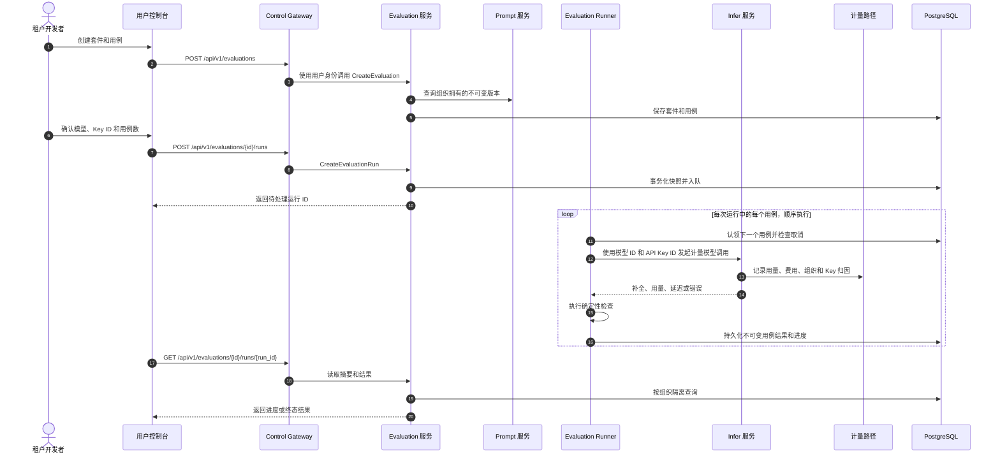
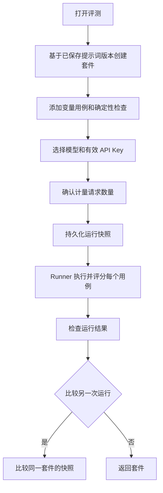

# 提示词评测与回归测试 — 架构与详细设计

| 属性 | 内容 |
| --- | --- |
| 功能点 | 提示词评测与回归测试（backlog 第 44 行） |
| 文档范围 | 租户评测套件、变量化用例、确定性检查、计量异步运行、结果审阅和运行比较 |
| 所属模块 | 新增 `evaluation` 模块（`services/evaluation`），现有 `prompt`（只读版本来源）、`infer`（计量模型执行）、`auth`/`tenancy`（身份和组织角色）、`web`（终端用户页面） |
| 相关文档 | [UI/UX 设计](../design/prompt-evaluation.zh-cn.md) · [提示词管理](./prompt-management.zh-cn.md) · [批量推理](./batch-inference.zh-cn.md) · [控制台面分离](./console-surface-separation.zh-cn.md) · [架构概览](../design/architecture.zh-cn.md) |
| 状态 | 架构完成，已可移交 Developer |

## 1. 目标与边界

提供可重复的租户回归闭环：选择已保存的不可变提示词版本，维护变量输入和确定性检查，针对一个模型对每个用例执行一次计量推理，检查所有结果并比较两次运行。用例和运行输出可能包含租户数据及提示词知识产权，因此本功能仅面向终端用户。

非目标：管理端评测页面或 API、LLM 评判、人工评审、在线评测、导入数据集、单次运行内比较多个模型、工具或智能体执行，以及修改 Envoy/Wasm 数据面契约（复用现有可信推理边界除外）。

### 决策

| # | 决策 | 理由 |
| --- | --- | --- |
| AD1 | 新增 `services/evaluation`，负责套件、用例、运行、结果、校验、确定性评分、异步 Worker 和保留策略。 | 将评测生命周期和快照从 `prompt` 与 `infer` 中分离；采用 `batch` 的进程内 `server.Runner` 模式。 |
| AD2 | 套件引用一个租户提示词及固定的不可变版本。每次运行快照提示词内容、变量声明、有序用例/检查、模型标识和 Key ID。 | 提示词和套件修改不能改变历史结果。 |
| AD3 | 支持精确匹配、包含、正则表达式和有效 JSON 检查。所有检查在推理完成后本地确定性执行。 | 结果可重复，且没有隐式评判模型成本。 |
| AD4 | 创建运行时持久化待处理工作并立即返回。数据库驱动的 Runner 独立处理各用例、保存部分结果，并轮询取消状态。 | 推理可能超过浏览器请求生命周期；持久化状态支持服务重启和进度轮询，无需新增 MQ/Controller 消息。 |
| AD5 | 每个用例通过现有用户模型推理路径，使用 `model_id` 和租户自有 `api_key_id`；绝不保存或接收 Key 密钥。推理/计量路径继续负责用量、费用、请求日志以及组织/Key 归因。 | 与现有 `PlaygroundModel` 契约一致，该契约接受 Key 标识并使用标准计量推理。浏览器有效 Key 选择器只提供 ID 和脱敏标签。 |
| AD6 | 单个用例的推理/检查错误作为结果保存，不中止整次运行。状态为 `completed`、`completed_with_errors`、`failed` 或 `cancelled`；重试始终创建独立运行。 | 保留已成功工作，并避免静默覆盖或重试。 |
| AD7 | 每个套件最多 50 个用例；每次运行最多 50 个用例，每个值最多 10,000 字符，每个组织最多 10 个排队/运行中任务。 | 在写入和执行路径同时强制 UI/UX 限制。组织级任务上限通过事务执行。 |
| AD8 | 套件和运行数据保留 90 天。删除套件后立即从常规套件导航及其运行历史中隐藏；快照保留至到期，随后清理。 | 满足 UX 保留承诺，同时不通过其他租户或意外路由暴露孤立快照。 |
| AD9 | 服务注册到统一 gRPC Server，并以 `server.Runner` 运行 Worker/保留循环。评测任务不发送给 Kubernetes Controller。 | 评测执行推理，不负责 Kubernetes 期望状态协调。 |
| AD10 | 在 prompt 的 `127xx` 之后使用空闲的 `128xx` 错误码：`12801` 套件未找到、`12802` 套件名冲突、`12803` 用例无效、`12804` 检查无效、`12805` 运行未找到、`12806` 运行状态/比较无效、`12807` 超出限制、`12808` 源提示词/版本无效。 | 使用稳定且可操作的业务错误，不复用无关的提示词或推理错误。 |

## 2. 组件视图

| 层 | 职责与变更 |
| --- | --- |
| Control Gateway / grpc-gateway | 注册仅位于 `/api/v1/evaluations/*` 的 `EvaluationService` 注解路由。现有 realm guard 继续负责校验。 |
| `evaluation` | 租户隔离 CRUD、用例校验、运行快照、确定性评分、Worker、结果比较和保留。 |
| `prompt` | 只读查询租户提示词/版本内容及变量声明。评测不修改提示词表或版本。 |
| `infer` | 将已授权模型解析为就绪服务，并通过现有计量模型路径使用 `api_key_id` 执行调用；密钥不进入评测存储。 |
| `auth` / `tenancy` | 从会话解析活动组织和操作者。读取要求活动组织成员身份；套件/用例修改、运行创建和取消要求 `member` 或更高角色；viewer 收到现有角色拒绝码 `10036`。 |
| `audit` | 尽力记录 `evaluation.created`、`evaluation.updated`、`evaluation.deleted`、`evaluation.run_created`、`evaluation.run_cancelled`；不记录原始用例值或输出。 |
| PostgreSQL | 评测表和持久化工作状态。GORM `AutoMigrate` 增量建表；新表不需要 init-SQL 变更。 |
| MQ / Controller / 数据面 | 不新增 Controller 消息。每个用例走现有模型推理路径；Envoy/Wasm 和计量流程保持不变。 |
| Web | `UserShell` 中的四个终端用户页面；没有管理端页面、路由或 RPC。 |

Runner 通过数据库租约/条件状态更新认领工作，避免多个服务副本重复执行同一用例。每条结果在继续前持久化，并在用例之间检查取消状态。数据库为事实来源；不使用 NATS 调度运行。

## 3. 数据模型

标识符使用 UUID，时间戳为 UTC。每个租户查询都必须包含从 `SessionActiveOrg` 得到的组织 ID，不得采用请求提供的组织过滤。不要对 prompt 表设置外键：即使提示词被删除，不可变运行快照仍可保留。

| 表 | 字段与约束 |
| --- | --- |
| `evaluations` | `evaluation_id` 主键；索引 `organization_id`；`name` varchar(128)；`description` varchar(500)；`prompt_id`；整数 `prompt_version`；`created_by`；`created_at`、`updated_at`；可空 `deleted_at`。组织内活动套件名唯一（事务/部分唯一索引）。 |
| `evaluation_cases` | `case_id` 主键；索引 `evaluation_id`；整数 `position`；`name` varchar(128)；JSONB 对象 `variables`；可空文本 `expected_output`；JSONB 数组 `checks`；时间戳。`(evaluation_id, position)` 唯一。用例可编辑；运行保存独立快照。 |
| `evaluation_runs` | `run_id` 主键；索引 `evaluation_id`、`organization_id`；`status`；`prompt_id`、`prompt_version`、文本 `prompt_content_snapshot`、JSONB `prompt_variables_snapshot`；`model_id`、模型显示信息快照；仅保存 `api_key_id`；用例数、进度计数、以最小货币单位计的总费用、币种、中位延迟；`created_by`、`created_at`、`started_at`、`completed_at`、`retained_until`；`cancel_requested_at`；Worker 租约字段。 |
| `evaluation_run_cases` | `result_id` 主键；可空 `run_id` 和源 `case_id`；`case_position`、用例名快照、变量/检查/期望输出快照；`status`（`pending`、`passed`、`failed`、`error`、`cancelled`）；补全文本；逐项检查结果 JSONB；输入/输出 Token；延迟；以最小货币单位计的费用/币种；已清理的错误码/信息；时间戳。`(run_id, case_position)` 唯一。 |

每次运行在 Worker 可认领之前，于创建事务中快照所有用例和检查。结果行只保留必要的响应内容及用量；错误经过长度限制，并清除凭据。比较先按源 `case_id` 对齐，并明确标注仅存在于一侧的用例。费用聚合采用与计量一致的币种及最小货币单位。

迁移：在服务 `Migrate` 和 `MigrateSchemaForFVT` AutoMigrate 中加入 `Evaluation`、`EvaluationCase`、`EvaluationRun`、`EvaluationRunCase`。现有 init SQL 不变，因为这些是新的增量表，由启动迁移创建。回滚仅回滚应用，不得在降级时删除数据表。

## 4. API 设计

新增 proto：`proto/taas/evaluation/v1/evaluation.proto`，包 `taas.evaluation.v1`，服务 `EvaluationService`。每个 RPC 必须带有下列精确注解。没有管理端绑定或额外绑定。

| RPC | HTTP 注解 | 行为 |
| --- | --- | --- |
| `CreateEvaluation` | `POST /api/v1/evaluations` | 验证提示词/版本属于调用组织后创建套件。 |
| `ListEvaluations` | `GET /api/v1/evaluations` | 按组织隔离的名称搜索、提示词/状态筛选和分页。 |
| `GetEvaluation` | `GET /api/v1/evaluations/{evaluation_id}` | 套件及最多 50 个有序用例。 |
| `UpdateEvaluation` | `PATCH /api/v1/evaluations/{evaluation_id}` | 校验后更新名称、描述、固定提示词/版本。 |
| `DeleteEvaluation` | `DELETE /api/v1/evaluations/{evaluation_id}` | 软删除/隐藏套件，快照保留至到期。 |
| `CreateEvaluationCase` | `POST /api/v1/evaluations/{evaluation_id}/cases` | 校验并追加用例。 |
| `UpdateEvaluationCase` | `PATCH /api/v1/evaluations/{evaluation_id}/cases/{case_id}` | 校验并更新用例。 |
| `DeleteEvaluationCase` | `DELETE /api/v1/evaluations/{evaluation_id}/cases/{case_id}` | 仅删除配置用例。 |
| `ReorderEvaluationCases` | `PUT /api/v1/evaluations/{evaluation_id}/cases:reorder` | 原子更新当前用例 ID 的完整排列。 |
| `CreateEvaluationRun` | `POST /api/v1/evaluations/{evaluation_id}/runs` | 校验模型/Key/用例和限制；快照并入队，返回待处理运行。 |
| `ListEvaluationRuns` | `GET /api/v1/evaluations/{evaluation_id}/runs` | 按创建时间倒序分页列出运行摘要。 |
| `GetEvaluationRun` | `GET /api/v1/evaluations/{evaluation_id}/runs/{run_id}` | 摘要及可分页/筛选的用例结果。 |
| `CancelEvaluationRun` | `POST /api/v1/evaluations/{evaluation_id}/runs/{run_id}:cancel` | 请求取消；保留已完成行，并将剩余行标记为已取消。 |
| `CompareEvaluationRuns` | `POST /api/v1/evaluations/{evaluation_id}/runs:compare` | 比较属于此套件的两次终态且非失败运行。 |

`google.api.http` 中，创建/更新/排序/运行/取消/比较请求使用 `body: "*"`，读取/删除使用路径或查询参数。Proto 请求/响应消息包含 `taas.common.v1.Response`；列表方法使用 `PageRequest`/`PageMeta`。运行创建字段：`model_id`、`api_key_id`、可选 `case_ids`（为空表示所有已配置用例），以及用于确认的 `prompt_version`。版本若与套件当前固定版本不同则拒绝；先更新套件再选择其他版本。用户消息中不得接受 `organization_id`。

UI 只使用已有选择器 API：提示词列表 `GET /api/v1/prompts`、版本 `GET /api/v1/prompts/{prompt_id}/versions`、模型 `GET /api/v1/models`、有效 API Key `GET /api/v1/auth/api-keys?active_only=true`。Key 选择器响应仅含 ID 和脱敏标签。每个评测 RPC 均可经 grpc-gateway 访问。API 错误使用现有 JSON 信封 `{ "code": number, "message": string }`；业务错误沿用平台 HTTP 映射（HTTP 500，业务 `code` 位于响应体）。

## 5. 身份、授权与失败语义

面由路径决定，不能由调用者输入选择。`/api/v1/evaluations/*` 属于 `user` realm，并由现有 `RealmGuard` 在 grpc-gateway 之前校验。存在认证会话时，会话活动组织为权威身份，忽略 `X-Organization-Id`。兼容现有平台行为的无会话过渡访问仍可用，但必须提供组织头，否则返回 `10001`。

所有读取要求可解析的活动组织成员身份。写入、运行和取消还要求 `tenancy.RoleGuard` 角色为 `member` 或更高；`viewer` 被拒绝并返回现有角色错误码 `10036`。组织不匹配、缺失、已删除或属于其他租户的套件/运行/用例 ID 均返回 `12801` 和通用信息「Evaluation not found」，绝不泄露资源存在性。用户评测 API 收到错误 realm 的 admin token 时，返回 HTTP 500 和响应体 `{"code":10038,"message":"Realm mismatch"}`。未知、过期或无 realm 的会话返回 HTTP 500、`code:10027`。不注册 `/admin/evaluations` Web 路由和 `/api/v1/admin/evaluations/*` API；用户 Token 访问任何管理端路由时，由该路由正常的 admin realm guard 拒绝，本功能不定义管理端评测能力。

校验和状态错误在标准响应体中返回对应 `128xx` 码。推理错误保存在单个用例结果中，不导致创建运行的 RPC 失败。无法认领或初始化的运行转为 `failed`，并保存经过净化的运行级错误。

## 6. 前端架构

所有页面使用现有终端用户 `SurfaceProvider(realm="user")`、`OrgProvider` 和 `UserShell`；导航放在 Prompts 旁的开发者/任务导航中。复用现有 API 客户端、通用页面/表格/对话框/空态/错误态、提示词选择器模式、模型选择器、脱敏 API Key 选择器和页面组织状态。套件、用例、运行、比较的 API/state 模块归入现有用户页面/API 结构；不涉及管理端 shell 或 API 客户端。

| 页面/模块 | Web 路由 | API 前缀与调用 | Guard |
| --- | --- | --- | --- |
| `UserEvaluationsPage` | `/evaluations` | `/api/v1/evaluations` 列表/创建/删除及 `/api/v1/prompts` | 仅用户 realm；活动组织 |
| `UserEvaluationDetailPage` | `/evaluations/:evaluationId` | `/api/v1/evaluations/{id}`、`/cases`、`/runs`；提示词版本；`/api/v1/models`；`/api/v1/auth/api-keys?active_only=true` | 仅用户 realm；活动组织 |
| `UserEvaluationRunPage` | `/evaluations/:evaluationId/runs/:runId` | `/api/v1/evaluations/{id}/runs/{run_id}` 和取消操作 | 仅用户 realm；活动组织 |
| `UserEvaluationComparePage` | `/evaluations/:evaluationId/compare` | `/api/v1/evaluations/{id}/runs:compare` | 仅用户 realm；活动组织 |
| 管理端评测 | 未定义 | 不调用 `/api/v1/admin/evaluations/*` | 不适用 |

运行详情在状态为 pending/running 时以有界间隔轮询运行端点，进入终态或离开页面时停止。表格搜索/筛选/排序/分页在 API 支持时使用查询字段，否则在有界快照上本地处理。校验/冲突错误发生时保留表单值。不得将用例值、提示词快照、API Key ID/密钥或运行输出放入 URL 或浏览器持久存储。

## 7. 关键流程

## 8. 错误处理与确定性检查

| 代码 | 名称 | 条件 |
| --- | --- | --- |
| 12801 | `EVALUATION_NOT_FOUND` | 套件/运行/用例不存在、已删除或不属于调用组织。 |
| 12802 | `EVALUATION_NAME_CONFLICT` | 同一组织存在同名活动套件。 |
| 12803 | `EVALUATION_CASE_INVALID` | JSON 对象无效、变量缺失/未声明、值为空或超出长度/用例数限制。 |
| 12804 | `EVALUATION_CHECK_INVALID` | 没有检查、期望值为空、检查类型不支持或正则无效。 |
| 12805 | `EVALUATION_RUN_NOT_FOUND` | 运行不能在当前套件/组织中访问。 |
| 12806 | `EVALUATION_RUN_STATE_INVALID` | 当前运行/套件状态不允许取消或比较。 |
| 12807 | `EVALUATION_LIMIT_EXCEEDED` | 组织中超过 10 个在途运行或超出配置请求限制。 |
| 12808 | `EVALUATION_PROMPT_VERSION_INVALID` | 提示词/版本不存在或不属于活动组织。 |

精确匹配和包含检查将补全文本与非空期望值比较；正则在保存时编译并采用 Go RE2 语义；有效 JSON 检查将补全文本解析为单个 JSON 值。可选的期望输出字段是检查及详情展示的数据，不会隐式增加检查项。每项检查保存独立通过/失败及长度受限的诊断。任意检查失败使 case 状态为 `failed`；推理失败使其为 `error`；尚未执行就取消则为 `cancelled`。通过率分母是至少执行过一项检查的已完成用例；错误/取消用例单独显示并排除在分母外。

## 9. 配置、安全与发布

在 `configs/server.yaml` 增加 `evaluation` 配置，并添加对应配置结构/默认值：

| 键 | 默认值 | 用途 |
| --- | --- | --- |
| `evaluation.worker.enabled` | `true` | 注册运行 Worker。 |
| `evaluation.worker.pollInterval` | `2s` | 持久化待处理运行的轮询周期。 |
| `evaluation.worker.maxConcurrentRuns` | `4` | 进程级并发运行数。 |
| `evaluation.worker.maxConcurrentCasesPerRun` | `1` | 保持顺序并限制租户调用突发。 |
| `evaluation.retention.enabled` | `true` | 注册保留 Runner。 |
| `evaluation.retention.ttl` | `2160h` | 90 天套件/运行/结果保留期。 |
| `evaluation.retention.interval` | `1h` | 清理周期。 |
| `evaluation.maxCasesPerRun` | `50` | 用例上限。 |
| `evaluation.maxVariableValueLength` | `10000` | 每个变量值长度上限。 |
| `evaluation.maxInFlightRunsPerOrg` | `10` | 事务强制的组织任务上限。 |

将提示词、变量、补全和检查诊断视为租户机密。每个 Repository 方法都强制组织范围；限制请求/输出大小；日志和错误中脱敏 Bearer 凭据；只保存 API Key ID；管理端凭据不得访问用户端点。服务在调用计量路径时使用用户选择的组织 API Key 身份，以保持现有用量/请求日志归因。用例输出不写入审计日志或运维指标。

以增量方式发布：必要时先部署 schema 和关闭 Worker 的服务，再启用 Runner 并发布用户 UI。现有提示词和推理数据不变。回滚时移除 UI/API 部署，并在决定恢复/保留策略前保留评测数据表。不需要变更 Controller 或 Envoy。

## 10. 验收标准追踪

| UX 验收标准 | 架构对应 |
| --- | --- |
| AC1 套件列表/创建及提示词版本校验 | `UserEvaluationsPage`、`CreateEvaluation`、`ListEvaluations`、只读 Prompt 查询、AD2。 |
| AC2 变量和四种检查的校验 | 用例/检查校验、错误码 12803–12804、确定性语义。 |
| AC3 模型/Key 选择器和运行前计数 | 精确选择器 API、运行确认、AD5。 |
| AC4 不可变快照、进度、指标及独立错误 | 运行/用例表、持久化 Runner 和推理时序。 |
| AC5 保留错误，重试创建新运行 | AD6；每次 `CreateEvaluationRun` 分配新 ID。 |
| AC6 可搜索/筛选/排序/分页的结果详情 | 运行读取契约和前端表格行为。 |
| AC7 比较并正确对齐新增/移除用例 | `CompareEvaluationRuns`、稳定的源 case ID。 |
| AC8 租户隔离 | 活动组织身份链、Repository 条件、通用 12801。 |
| AC9 精确终端用户路由与 API | 前端路由/API 表和 proto 注解表。 |
| AC10 不提供管理端评测界面 | 仅用户路由及 realm guard 语义。 |
| AC11 用量按相同组织/Key 可见 | AD5 及调用链中的计量 infer 路径。 |

## 11. Developer 实现顺序

1. 新增 `proto/taas/evaluation/v1/evaluation.proto`、消息、所有 `google.api.http` 注解、生成 Go/gateway 文件及错误常量 12801–12808。
2. 新增套件、用例、运行、结果的 GORM 模型/Repository 方法：事务化用例快照、组织运行上限准入、Worker 认领/租约、进度/取消更新、比较查询和保留清理。在 `Migrate` 与 `MigrateSchemaForFVT` 注册四个模型。
3. 实现 `services/evaluation.Service`：身份解析、`RoleGuard`、prompt 版本查询、套件/用例校验、快照创建、运行/列表/详情/取消/比较、通用 not-found 映射和尽力审计钩子。
4. 实现确定性检查器、`EvaluationRunner` 和保留 `server.Runner`。注入由 `infer.PlaygroundModel` 等价计量执行支持的推理接口；调用携带模型 ID 和 API Key ID，不带密钥。每个用例结果持久化后再继续。
5. 添加配置结构/默认值以及 Runner/Service 注册；增加租户隔离、限制、快照不可变性、部分错误、取消、计量归因、比较对齐和到期清理的 FVT/单测。
6. 添加 API 客户端类型和 React 模块/页面 `UserEvaluationsPage`、`UserEvaluationDetailPage`、`UserEvaluationRunPage`、`UserEvaluationComparePage`；注册到用户路由并加入开发者导航。使用 Nightwatch 覆盖提供的验收标准。

## 12. 自审

- EN/ZH 文档对齐覆盖相同决策、端点、存储、授权、流程、限制、配置、验收标准和实现职责。
- 所有新增 RPC 均为用户端，注解使用 `/api/v1/evaluations/*`；不存在管理端路由或用户/管理端前缀混用。
- Prompt 版本只读，运行使用独立快照，因此提示词编辑/删除不会改写历史结果。
- 已明确 Key 选择行为：通过 ID/脱敏标签选择并调用现有计量路径；不保存密钥。已明确重试始终创建新运行 ID。
- Mermaid 语句文本不含 ASCII 分号分隔符。