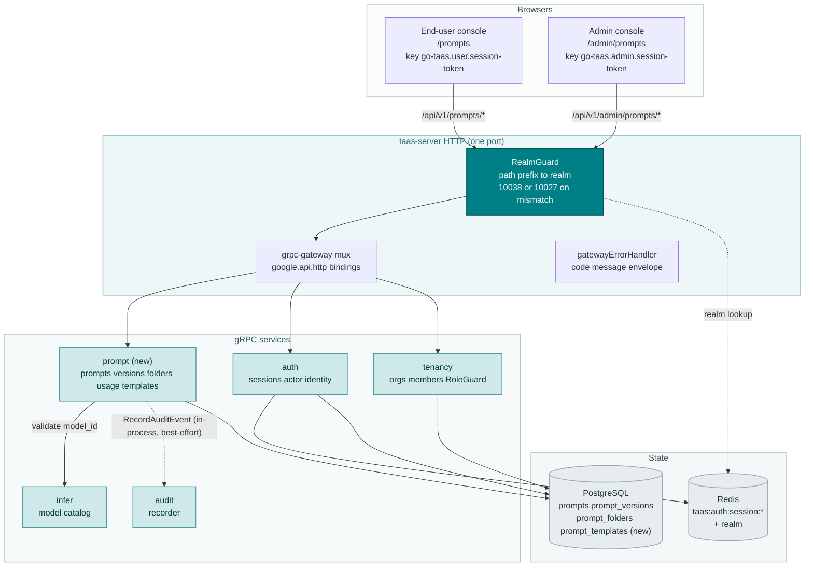
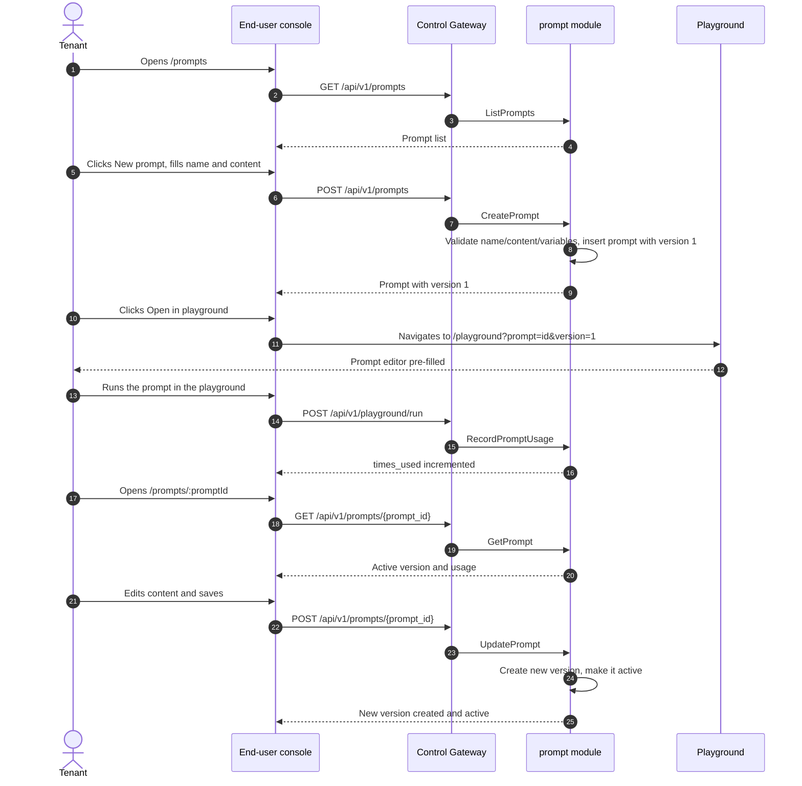
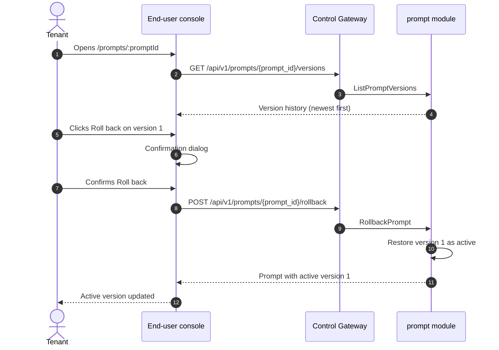
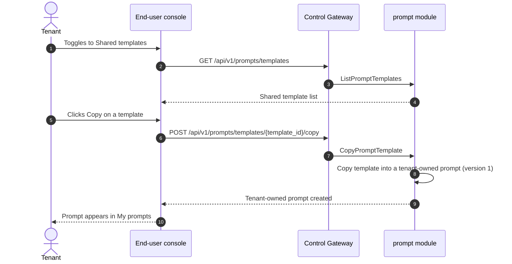
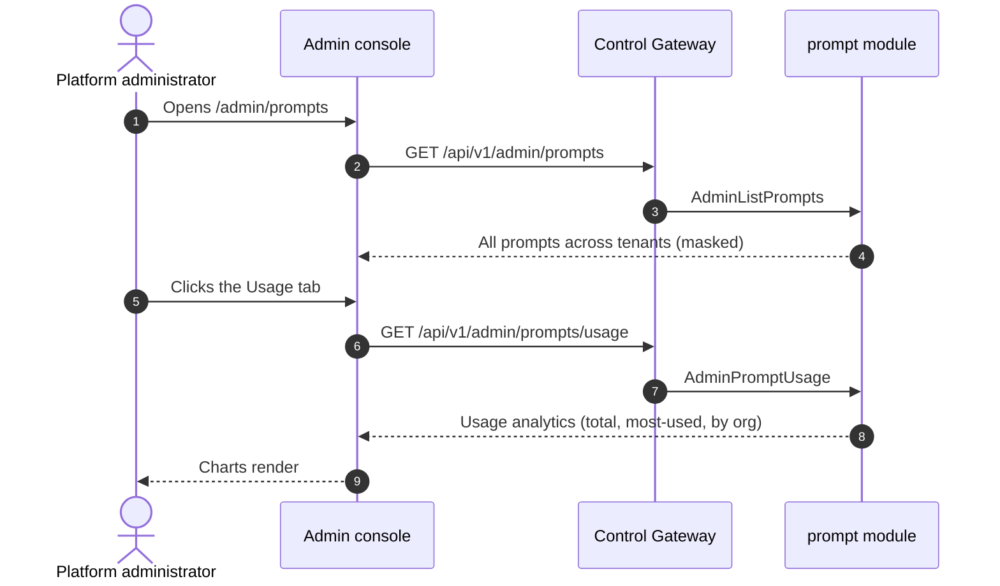

# Prompt Management & Prompt Library — Architecture and Detailed Design

| Attribute | Content |
| --- | --- |
| Feature point | Prompt management & prompt library (prompt templates) — create, version, organize into folders, search, and reuse prompts; open a prompt in the playground; copy prompt text; per-prompt usage stats. The admin surface manages a cross-tenant prompt list (masked), prompt usage analytics, and a shared prompt template library tenants can browse and copy (backlog row 43) |
| Document scope | Architecture and detailed design for feature-43: a new `prompt` module owning the prompt lifecycle, versioning, folders, usage counters, and the shared template library; the `prompts`, `prompt_versions`, `prompt_folders`, and `prompt_templates` tables; the `taas.prompt.v1.PromptService` proto with dual admin/user HTTP bindings; the end-user Prompts pages (`/prompts`, `/prompts/:promptId`) and the admin Prompts page (`/admin/prompts`); plus error handling, configuration, security, rollout, and function-level design per layer |
| Owning modules | New `prompt` module (`services/prompt`): `prompts` + `prompt_versions` + `prompt_folders` + `prompt_templates` tables, CRUD/query RPCs, the versioning logic, the usage counters, the shared template library; `infer` (read-only: the model catalog a prompt references); `audit` (read-only: prompt action audit events); `pkg/server` gateway (admin-prefix and user-prefix bindings); console web app (end-user `PromptsPage`/`PromptDetailPage`, admin `AdminPromptsPage`) |
| Related documents | [Requirement Analysis and UI/UX Design](../design/prompt-management.md) · [Architecture Design](../design/architecture.md) §2.5 (metering), §3.1 (admin/user surface separation) · [Console Surface Separation](./console-surface-separation.md) (the two-console split this feature spans; realm guard, 10038) · [Request Logs & API Playground](./request-logs-playground.md) (the sibling playground surface a prompt opens into) · [Model Catalog & Deployment](./model-catalog-deployment.md) (the model catalog a prompt references) · [Audit Logging](./audit-logging.md) (the audit events prompt actions emit) |
| Status | Architecture complete, handed to the Developer agent |

---

## 1. Overview and Goals

go-taas serves inference through an OpenAI-compatible gateway (features #2, #12): an Agent sends a request and receives a completion. But a tenant who builds a real integration quickly accumulates a library of prompts — system instructions, few-shot examples, output-format constraints — that they reuse across requests, models, and applications. Without a place to store, version, and organize those prompts, the tenant pastes them into the playground or their code by hand, loses track of which version worked, and cannot share a well-tuned prompt with a teammate. This feature adds a **prompt management & prompt library** capability: a tenant creates prompts, versions them, organizes them into folders, searches them, opens one in the playground, copies its text, and sees how often it is used. The platform administrator manages a cross-tenant prompt list (masked), prompt usage analytics, and a shared prompt template library that tenants can browse and copy.

**Goals**: a new `prompt` module owning the `prompts`, `prompt_versions`, `prompt_folders`, and `prompt_templates` tables and their lifecycle; a `taas.prompt.v1.PromptService` with twenty RPCs, each dual-bound to the user prefix `/api/v1/prompts/*` and the admin prefix `/api/v1/admin/prompts/*`; prompt versioning (every edit creates a new version, rollback restores a previous version); folder organization; a lightweight per-prompt usage counter; a copy-on-use shared template library; new error codes 12701–12708; an end-user Prompts page (`/prompts`) and detail page (`/prompts/:promptId`), and an admin Prompts page (`/admin/prompts`).

**Non-goals** (deferred, design §8): the real-time inference playground (feature #12); the model catalog (feature #2); request logs & tracing (features #12, #27); the audit log viewer (feature #15); batch inference (feature #42). The real-time inference path is unchanged — the prompt module stores prompt metadata and content only.

### 1.1 Reading order of this document

Section 2 records the architecture decisions (AD1–AD9, mirroring the design's D1–D9). Sections 3–5 are the component view, data model, and API design. Section 6 is the frontend architecture (page → route → API-prefix table for both consoles, auth guard per surface). Sections 7–8 are the sequence flows and error handling. Sections 9–11 are configuration, security, and rollout. Sections 12–14 are the acceptance-criteria traceability, the function-level detailed design, and the ordered implementation task list.

---

## 2. Architecture Decisions

| # | Decision | Rationale |
| --- | --- | --- |
| AD1 | **New `prompt` module** (`services/prompt`) owning the `prompts`, `prompt_versions`, `prompt_folders`, and `prompt_templates` tables, the CRUD/query RPCs, the versioning logic, the usage counters, and the shared template library, with its own error block **127xx** | Prompt management stores prompt metadata and content; a dedicated module keeps the prompt concern out of the producing modules and gives it one home, mirroring how `batch` owns batch jobs (design D1) |
| AD2 | **A prompt is defined by name, content, model, folder, and variables.** `CreatePrompt` takes `name`, `content`, optional `model_id`, optional `folder_id`, and optional `variables`. The active version's content is what a tenant reuses. Variables use `${var}` syntax | The name/content/model/folder model matches the surveyed platforms and gives the console a clear prompt record. Variables let a tenant parameterize a prompt for reuse (design D2) |
| AD3 | **Prompt versioning: every edit creates a new version.** `UpdatePrompt` creates a new version and makes it active; `RollbackPrompt` restores a previous version as active. The version history is immutable | Versioning lets a tenant iterate on a prompt and roll back a bad edit, matching Anthropic and Baidu Qianfan. An immutable history keeps the audit trail honest (design D3) |
| AD4 | **Prompts are tenant-scoped and masked.** `CreatePrompt` on the user prefix accepts no `organization_id` filter (the caller's org is implicit) and never exposes other tenants' prompts. The admin prefix lists all prompts but masks content (the masked-projection rule, feature #17) | Follows feature #17's masked-projection rule: a tenant's prompt must never leak another tenant's content. The admin surface sees prompt metadata and aggregate usage but not the raw prompt text (design D4) |
| AD5 | **"Open in playground" navigates to `/playground?prompt=<prompt_id>&version=<version>`.** The playground (feature #12) reads the query params and pre-fills its prompt editor with the active version's content | Reuse is the point of a prompt library; opening into the existing playground is the lowest-friction reuse path and reuses the feature #12 surface (design D5) |
| AD6 | **Prompt usage is a lightweight counter, not full metering.** Each time a prompt is opened in the playground and run, the `prompt` module increments `times_used` and sets `last_used_at`. `GetPromptUsage` returns these counters | Full token metering already happens in the `metering` pipeline (feature #4); the prompt module only needs a lightweight "how often is this prompt used" signal for pruning and improvement (design D6) |
| AD7 | **New error codes in a prompt block 12701–12708.** **12701 `CodePromptNotFound`**, **12702 `CodePromptVersionNotFound`**, **12703 `CodePromptNameConflict`**, **12704 `CodePromptFolderNotFound`**, **12705 `CodePromptInvalidContent`**, **12706 `CodePromptInvalidVariable`**, **12707 `CodePromptTemplateNotFound`**, **12708 `CodePromptFolderNotEmpty`**. Range/format validation reuses existing codes where applicable | Prompt management is a new module (AD1), so its codes live in a fresh block after the batch block (126xx); distinct codes keep each failure mode actionable (design D7) |
| AD8 | **The shared template library is copy-on-use.** An administrator creates/edits/deletes shared templates; a tenant browses them and copies one into a tenant-owned prompt (`CopyPromptTemplate`). A tenant never edits a shared template in place | Copy-on-use prevents one tenant from corrupting a shared template for everyone, and matches Aliyun Bailian's preset-template copy flow (design D8) |
| AD9 | **Prompt actions are audited.** Prompt creation, update, rollback, deletion, and template copy are audited (feature #15) as `prompt.created` / `prompt.updated` / `prompt.rolled_back` / `prompt.deleted` / `prompt.copied_from_template`. The underlying inference is already metered and logged by the existing pipeline | The feature stores prompt metadata and content; only the new prompt actions need new audit events (design D9) |

---

## 3. Component View

### 3.1 Ownership

| Layer / component | Owns | Changes in this feature |
| --- | --- | --- |
| **Control Gateway (`grpc-gateway`)** | HTTP/JSON facade for the prompt RPCs; realm guard (feature #17) already rejects a wrong-realm session with 10038; passes `X-Organization-Id` through as gRPC metadata | New bindings for the 20 HTTP prompt RPCs (Section 5); no change to the realm guard |
| **`prompt` module (`services/prompt`)** | `prompts` + `prompt_versions` + `prompt_folders` + `prompt_templates` tables, the CRUD/query RPCs, the versioning logic, the usage counters, the shared template library | **New module** (AD1) |
| **`infer` module** | The model catalog a prompt references | Read-only: the prompt module validates `model_id` against the model catalog (AD2) |
| **`audit` module** | The audit recorder | Read-only: the prompt module calls `RecordAuditEvent` after prompt creation, update, rollback, deletion, and template copy (AD9) |
| **`auth` module** | Actor identity, session realm, session active org | Read-only: the prompt module resolves the org from the session; `SessionActiveOrg` supplies the org for session-bearing calls |
| **`tenancy` module** | Organizations, members, roles, RoleGuard | Read-only: `RoleGuard` gates the admin prompt RPCs by the caller's role in the resolved org context (10036) |
| **PostgreSQL** | `prompts` + `prompt_versions` + `prompt_folders` + `prompt_templates` tables (new); all other tables untouched | Four new tables via AutoMigrate (Section 4) |
| **Console** | End-user Prompts pages and admin Prompts page | Three new pages on the two surfaces (Section 6) |

### 3.2 Runtime component view



### 3.3 Request identity chain

The prompt RPCs reuse the established identity chain (console-surface-separation §3.3):

1. `RealmGuard` (HTTP, `pkg/server/realm.go`) — path prefix decides the expected realm. `/api/v1/admin/prompts/*` expects `admin`; `/api/v1/prompts/*` expects `user`. With no `Authorization` header: pass through (transitional, AD4 of feature #17). With a header: resolve the session realm from Redis; mismatch → 10038, unknown/expired/realm-less → 10027.
2. grpc-gateway mux — routes by the annotated path and forwards `authorization` and `x-organization-id`.
3. Service handler — for a session-bearing call, `SessionActiveOrg` makes the session's active organization authoritative and ignores `X-Organization-Id`; without a session, `resolveOrganizationID` reads the transitional header and returns 10001 when it is absent or empty.
4. `tenancy.RoleGuard` — gates the admin prompt RPCs by the caller's role in the resolved org context (10036). The end-user prompt RPCs are hard-scoped to the caller's org and need no role check.

### 3.4 The shared template library and the copy-on-use seam

The shared template library is copy-on-use (AD8): the admin RPCs (`AdminCreateTemplate`, `AdminListTemplates`, `AdminUpdateTemplate`, `AdminDeleteTemplate`) manage shared templates; the user RPCs (`ListPromptTemplates`, `CopyPromptTemplate`) let a tenant browse and copy them. `CopyPromptTemplate` copies a template into a tenant-owned prompt (a new `prompts` row with `version = 1`), never a live reference — so one tenant can never corrupt a shared template for everyone. The template library is a pure metadata store; no inference, metering, or billing pipeline changes.

---

## 4. Data Model

### 4.1 The `prompts` Table

| Column | PostgreSQL type | Constraints | Description |
| --- | --- | --- | --- |
| `prompt_id` | `uuid` | PRIMARY KEY | Server-generated UUID v4, exposed as `prompt_id` |
| `organization_id` | `varchar(64)` | NOT NULL, index (composite) | Owning organization |
| `name` | `varchar(128)` | NOT NULL, unique per org | The prompt name (duplicate → 12703) |
| `model_id` | `varchar(64)` | NULL | The optional target model (validated against the model catalog) |
| `folder_id` | `uuid` | NULL, index | The optional owning folder (unknown → 12704) |
| `active_version` | `int` | NOT NULL DEFAULT 1 | The active version number |
| `times_used` | `bigint` | NOT NULL DEFAULT 0 | The usage counter (AD6) |
| `last_used_at` | `timestamptz` | NULL | When the prompt was last used (AD6) |
| `created_at` | `timestamptz` | NOT NULL, index (composite) | Creation time (UTC) |
| `updated_at` | `timestamptz` | NOT NULL | Last update time (UTC) |

Design notes:

- Composite index `idx_prompts_org_created (organization_id, created_at)` for org-scoped lists; `name` unique per org for the name-conflict check (12703); `folder_id` indexed for the folder filter.
- No foreign keys to `organizations` / `inference_services`: a prompt must outlive a deleted org or service so its metadata remains debuggable (mirrors the audit-event reasoning).
- Deleting a prompt cascades to its `prompt_versions` rows (AD3).

### 4.2 The `prompt_versions` Table

| Column | PostgreSQL type | Constraints | Description |
| --- | --- | --- | --- |
| `prompt_id` | `uuid` | NOT NULL, index (composite) | Owning prompt (cascade delete) |
| `version` | `int` | NOT NULL | The version number (1-based, monotonically increasing) |
| `content` | `text` | NOT NULL | The prompt content (≤ 6144 chars, else 12705) |
| `model_id` | `varchar(64)` | NULL | The model at this version |
| `variables` | `jsonb` | NOT NULL DEFAULT '[]' | The `${var}` variable names at this version |
| `created_at` | `timestamptz` | NOT NULL | Creation time (UTC) |
| `created_by` | `varchar(64)` | NOT NULL | The actor who created this version |

Design notes:

- Composite primary key `(prompt_id, version)`; the version history is immutable (AD3) — no UPDATE or DELETE on a version row except the cascade delete of the owning prompt.
- `variables` is a JSON array of variable names (e.g. `["topic","tone"]`); the `${var}` syntax is validated at write time (12706).

### 4.3 The `prompt_folders` Table

| Column | PostgreSQL type | Constraints | Description |
| --- | --- | --- | --- |
| `folder_id` | `uuid` | PRIMARY KEY | Server-generated UUID v4, exposed as `folder_id` |
| `organization_id` | `varchar(64)` | NOT NULL, index | Owning organization |
| `name` | `varchar(128)` | NOT NULL, unique per org | The folder name |
| `created_at` | `timestamptz` | NOT NULL | Creation time (UTC) |

Design notes:

- `name` unique per org; a non-empty folder cannot be deleted (12708) — the delete checks for child `prompts` rows.

### 4.4 The `prompt_templates` Table

| Column | PostgreSQL type | Constraints | Description |
| --- | --- | --- | --- |
| `template_id` | `uuid` | PRIMARY KEY | Server-generated UUID v4, exposed as `template_id` |
| `name` | `varchar(128)` | NOT NULL | The template name |
| `content` | `text` | NOT NULL | The template content (≤ 6144 chars) |
| `model_id` | `varchar(64)` | NULL | The optional target model |
| `variables` | `jsonb` | NOT NULL DEFAULT '[]' | The `${var}` variable names |
| `times_used` | `bigint` | NOT NULL DEFAULT 0 | How many times the template was copied |
| `created_at` | `timestamptz` | NOT NULL | Creation time (UTC) |
| `updated_at` | `timestamptz` | NOT NULL | Last update time (UTC) |

Design notes:

- Shared templates are platform-wide (no `organization_id`); the admin RPCs manage them, the user RPCs browse and copy them (AD8).
- `times_used` increments on each `CopyPromptTemplate`; the admin Usage tab reports it.

### 4.5 Migration Notes

- The four new tables are created by GORM `AutoMigrate` on `taas-server` startup (additive; no data migration). `Migrate`/`MigrateSchemaForFVT` gain the `Prompt`, `PromptVersion`, `PromptFolder`, and `PromptTemplate` models.
- No init-SQL upgrade path is needed: all four tables are new and empty at rollout; the prompt module starts filling them as soon as prompts are created.

---

## 5. API Design

All prompt RPCs belong to a new **`taas.prompt.v1.PromptService`** (`proto/taas/prompt/v1/prompt.proto`), served as HTTP via the Control Gateway. The user RPCs are served under `/api/v1/prompts/*`; the admin RPCs are served under `/api/v1/admin/prompts/*`. The surface is derived from the request path (Section 3.3).

| RPC | HTTP (user) | HTTP (admin) | Status | Purpose |
| --- | --- | --- | --- | --- |
| `CreatePrompt` | `POST /api/v1/prompts` | — | **new** | Create a prompt (name, content, model, folder, variables); returns `version = 1` |
| `ListPrompts` | `GET /api/v1/prompts` | — | **new** | List the caller's prompts |
| `GetPrompt` | `GET /api/v1/prompts/{prompt_id}` | — | **new** | Get a prompt's active version and metadata |
| `UpdatePrompt` | `POST /api/v1/prompts/{prompt_id}` | — | **new** | Create a new version and make it active |
| `DeletePrompt` | `DELETE /api/v1/prompts/{prompt_id}` | — | **new** | Delete a prompt and all its versions |
| `ListPromptVersions` | `GET /api/v1/prompts/{prompt_id}/versions` | — | **new** | List a prompt's version history |
| `RollbackPrompt` | `POST /api/v1/prompts/{prompt_id}/rollback` | — | **new** | Restore a previous version as active |
| `CreatePromptFolder` | `POST /api/v1/prompts/folders` | — | **new** | Create a folder |
| `ListPromptFolders` | `GET /api/v1/prompts/folders` | — | **new** | List the caller's folders |
| `DeletePromptFolder` | `DELETE /api/v1/prompts/folders/{folder_id}` | — | **new** | Delete an empty folder |
| `GetPromptUsage` | `GET /api/v1/prompts/{prompt_id}/usage` | — | **new** | Get a prompt's usage counters |
| `RecordPromptUsage` | `POST /api/v1/prompts/{prompt_id}/usage` | — | **new** | Increment a prompt's usage counters |
| `ListPromptTemplates` | `GET /api/v1/prompts/templates` | — | **new** | Browse shared templates |
| `CopyPromptTemplate` | `POST /api/v1/prompts/templates/{template_id}/copy` | — | **new** | Copy a shared template into a tenant-owned prompt |
| `AdminListPrompts` | — | `GET /api/v1/admin/prompts` | **new** | List all prompts across tenants (masked) |
| `AdminPromptUsage` | — | `GET /api/v1/admin/prompts/usage` | **new** | Get prompt usage analytics across tenants |
| `AdminCreateTemplate` | — | `POST /api/v1/admin/prompts/templates` | **new** | Create a shared template |
| `AdminListTemplates` | — | `GET /api/v1/admin/prompts/templates` | **new** | List shared templates |
| `AdminUpdateTemplate` | — | `POST /api/v1/admin/prompts/templates/{template_id}` | **new** | Update a shared template |
| `AdminDeleteTemplate` | — | `DELETE /api/v1/admin/prompts/templates/{template_id}` | **new** | Delete a shared template |

> **Surface note**: the tenant-owned prompt RPCs (`CreatePrompt`, `ListPrompts`, `GetPrompt`, `UpdatePrompt`, `DeletePrompt`, `ListPromptVersions`, `RollbackPrompt`, `CreatePromptFolder`, `ListPromptFolders`, `DeletePromptFolder`, `GetPromptUsage`, `RecordPromptUsage`, `ListPromptTemplates`, `CopyPromptTemplate`) are **user-only** — the admin surface masks prompt content (AD4) and never edits a tenant's prompt or folder. The admin-only RPCs (`AdminListPrompts`, `AdminPromptUsage`, `AdminCreateTemplate`, `AdminListTemplates`, `AdminUpdateTemplate`, `AdminDeleteTemplate`) are admin-only. This is the interpretation most consistent with the design's D4 (the admin surface sees prompt metadata and aggregate usage but not the raw prompt text) and the design's §5.1 surface-assignment table (which lists no admin create/edit/delete rows for tenant prompts).

### 5.1 Proto contract

```protobuf
syntax = "proto3";

package taas.prompt.v1;

import "google/api/annotations.proto";
import "taas/common/v1/common.proto";

option go_package = "github.com/go-taas/go-taas/proto/taas/prompt/v1;promptv1";

// PromptService manages prompts, folders, usage counters, and the shared
// template library. The tenant-owned prompt RPCs are user-only under
// /api/v1/prompts/* (the admin surface masks prompt content). The
// admin-only RPCs are served under /api/v1/admin/prompts/* and manage
// the shared template library and the cross-tenant usage analytics.
service PromptService {
  // CreatePrompt creates a prompt with version = 1.
  // User-surface API: tenant-scoped under /api/v1/prompts.
  rpc CreatePrompt(CreatePromptRequest) returns (CreatePromptResponse) {
    option (google.api.http) = {
      post: "/api/v1/prompts"
      body: "*"
    };
  }

  // ListPrompts returns the caller's prompts, with dotted pagination.
  // User-surface API: tenant-scoped under /api/v1/prompts.
  rpc ListPrompts(ListPromptsRequest) returns (ListPromptsResponse) {
    option (google.api.http) = {
      get: "/api/v1/prompts"
    };
  }

  // GetPrompt returns a prompt's active version and metadata.
  // User-surface API: tenant-scoped under /api/v1/prompts.
  rpc GetPrompt(GetPromptRequest) returns (GetPromptResponse) {
    option (google.api.http) = {
      get: "/api/v1/prompts/{prompt_id}"
    };
  }

  // UpdatePrompt creates a new version and makes it active.
  // User-surface API: served under /api/v1/prompts.
  rpc UpdatePrompt(UpdatePromptRequest) returns (UpdatePromptResponse) {
    option (google.api.http) = {
      post: "/api/v1/prompts/{prompt_id}"
      body: "*"
    };
  }

  // DeletePrompt deletes a prompt and all its versions.
  // User-surface API: served under /api/v1/prompts.
  rpc DeletePrompt(DeletePromptRequest) returns (DeletePromptResponse) {
    option (google.api.http) = {
      delete: "/api/v1/prompts/{prompt_id}"
    };
  }

  // ListPromptVersions returns a prompt's version history.
  // User-surface API: served under /api/v1/prompts.
  rpc ListPromptVersions(ListPromptVersionsRequest) returns (ListPromptVersionsResponse) {
    option (google.api.http) = {
      get: "/api/v1/prompts/{prompt_id}/versions"
    };
  }

  // RollbackPrompt restores a previous version as active.
  // User-surface API: served under /api/v1/prompts.
  rpc RollbackPrompt(RollbackPromptRequest) returns (RollbackPromptResponse) {
    option (google.api.http) = {
      post: "/api/v1/prompts/{prompt_id}/rollback"
      body: "*"
    };
  }

  // CreatePromptFolder creates a folder.
  // User-surface API: served under /api/v1/prompts.
  rpc CreatePromptFolder(CreatePromptFolderRequest) returns (CreatePromptFolderResponse) {
    option (google.api.http) = {
      post: "/api/v1/prompts/folders"
      body: "*"
    };
  }

  // ListPromptFolders lists the caller's folders.
  // User-surface API: served under /api/v1/prompts.
  rpc ListPromptFolders(ListPromptFoldersRequest) returns (ListPromptFoldersResponse) {
    option (google.api.http) = {
      get: "/api/v1/prompts/folders"
    };
  }

  // DeletePromptFolder deletes an empty folder.
  // User-surface API: served under /api/v1/prompts.
  rpc DeletePromptFolder(DeletePromptFolderRequest) returns (DeletePromptFolderResponse) {
    option (google.api.http) = {
      delete: "/api/v1/prompts/folders/{folder_id}"
    };
  }

  // GetPromptUsage returns a prompt's usage counters.
  // User-surface API: served under /api/v1/prompts.
  rpc GetPromptUsage(GetPromptUsageRequest) returns (GetPromptUsageResponse) {
    option (google.api.http) = {
      get: "/api/v1/prompts/{prompt_id}/usage"
    };
  }

  // RecordPromptUsage increments a prompt's usage counters.
  // User-surface API: served under /api/v1/prompts.
  rpc RecordPromptUsage(RecordPromptUsageRequest) returns (RecordPromptUsageResponse) {
    option (google.api.http) = {
      post: "/api/v1/prompts/{prompt_id}/usage"
      body: "*"
    };
  }

  // ListPromptTemplates lets a tenant browse shared templates.
  // User-surface API: served under /api/v1/prompts.
  rpc ListPromptTemplates(ListPromptTemplatesRequest) returns (ListPromptTemplatesResponse) {
    option (google.api.http) = {
      get: "/api/v1/prompts/templates"
    };
  }

  // CopyPromptTemplate copies a shared template into a tenant-owned
  // prompt. User-surface API: served under /api/v1/prompts.
  rpc CopyPromptTemplate(CopyPromptTemplateRequest) returns (CopyPromptTemplateResponse) {
    option (google.api.http) = {
      post: "/api/v1/prompts/templates/{template_id}/copy"
      body: "*"
    };
  }

  // AdminListPrompts lists all prompts across tenants, masked.
  // Admin-surface API: served under /api/v1/admin/prompts.
  rpc AdminListPrompts(AdminListPromptsRequest) returns (AdminListPromptsResponse) {
    option (google.api.http) = {
      get: "/api/v1/admin/prompts"
    };
  }

  // AdminPromptUsage returns prompt usage analytics across tenants.
  // Admin-surface API: served under /api/v1/admin/prompts.
  rpc AdminPromptUsage(AdminPromptUsageRequest) returns (AdminPromptUsageResponse) {
    option (google.api.http) = {
      get: "/api/v1/admin/prompts/usage"
    };
  }

  // AdminCreateTemplate creates a shared template.
  // Admin-surface API: served under /api/v1/admin/prompts.
  rpc AdminCreateTemplate(AdminCreateTemplateRequest) returns (AdminCreateTemplateResponse) {
    option (google.api.http) = {
      post: "/api/v1/admin/prompts/templates"
      body: "*"
    };
  }

  // AdminListTemplates lists shared templates.
  // Admin-surface API: served under /api/v1/admin/prompts.
  rpc AdminListTemplates(AdminListTemplatesRequest) returns (AdminListTemplatesResponse) {
    option (google.api.http) = {
      get: "/api/v1/admin/prompts/templates"
    };
  }

  // AdminUpdateTemplate updates a shared template.
  // Admin-surface API: served under /api/v1/admin/prompts.
  rpc AdminUpdateTemplate(AdminUpdateTemplateRequest) returns (AdminUpdateTemplateResponse) {
    option (google.api.http) = {
      post: "/api/v1/admin/prompts/templates/{template_id}"
      body: "*"
    };
  }

  // AdminDeleteTemplate deletes a shared template.
  // Admin-surface API: served under /api/v1/admin/prompts.
  rpc AdminDeleteTemplate(AdminDeleteTemplateRequest) returns (AdminDeleteTemplateResponse) {
    option (google.api.http) = {
      delete: "/api/v1/admin/prompts/templates/{template_id}"
    };
  }
}

message CreatePromptRequest {
  string name = 1;              // required, ≤ 128 chars, unique per org
  string content = 2;           // required, ≤ 6144 chars
  string model_id = 3;          // optional
  string folder_id = 4;         // optional
  repeated string variables = 5; // optional, ${var} syntax
}

message CreatePromptResponse {
  taas.common.v1.Response response = 1;
  Prompt prompt = 2;
}

message ListPromptsRequest {
  taas.common.v1.PageRequest page = 1;
  string search = 2;            // searches name and content
  string folder_id = 3;         // filter
  string model_id = 4;          // filter
  // organization_id is an optional admin filter; absent means all orgs.
  // On the user surface it is ignored (the caller's org is implicit).
  string organization_id = 5;
}

message ListPromptsResponse {
  taas.common.v1.Response response = 1;
  repeated Prompt prompts = 2;
  taas.common.v1.PageMeta page_meta = 3;
}

message GetPromptRequest {
  string prompt_id = 1;
}

message GetPromptResponse {
  taas.common.v1.Response response = 1;
  Prompt prompt = 2;
}

message UpdatePromptRequest {
  string prompt_id = 1;
  string content = 2;           // required, ≤ 6144 chars
  string model_id = 3;          // optional
  repeated string variables = 4; // optional
}

message UpdatePromptResponse {
  taas.common.v1.Response response = 1;
  Prompt prompt = 2;
}

message DeletePromptRequest {
  string prompt_id = 1;
}

message DeletePromptResponse {
  taas.common.v1.Response response = 1;
}

message ListPromptVersionsRequest {
  string prompt_id = 1;
  taas.common.v1.PageRequest page = 2;
}

message ListPromptVersionsResponse {
  taas.common.v1.Response response = 1;
  repeated PromptVersion versions = 2;
  taas.common.v1.PageMeta page_meta = 3;
}

message RollbackPromptRequest {
  string prompt_id = 1;
  int32 version = 2;            // the version to restore as active
}

message RollbackPromptResponse {
  taas.common.v1.Response response = 1;
  Prompt prompt = 2;
}

message CreatePromptFolderRequest {
  string name = 1;              // required, ≤ 128 chars, unique per org
}

message CreatePromptFolderResponse {
  taas.common.v1.Response response = 1;
  PromptFolder folder = 2;
}

message ListPromptFoldersRequest {
  taas.common.v1.PageRequest page = 1;
}

message ListPromptFoldersResponse {
  taas.common.v1.Response response = 1;
  repeated PromptFolder folders = 2;
  taas.common.v1.PageMeta page_meta = 3;
}

message DeletePromptFolderRequest {
  string folder_id = 1;
}

message DeletePromptFolderResponse {
  taas.common.v1.Response response = 1;
}

message GetPromptUsageRequest {
  string prompt_id = 1;
}

message GetPromptUsageResponse {
  taas.common.v1.Response response = 1;
  int64 times_used = 2;
  int64 last_used_at = 3;       // unix seconds
}

message RecordPromptUsageRequest {
  string prompt_id = 1;
}

message RecordPromptUsageResponse {
  taas.common.v1.Response response = 1;
  int64 times_used = 2;
}

message ListPromptTemplatesRequest {
  taas.common.v1.PageRequest page = 1;
  string search = 2;            // searches name and content
  string model_id = 3;          // filter
}

message ListPromptTemplatesResponse {
  taas.common.v1.Response response = 1;
  repeated PromptTemplate templates = 2;
  taas.common.v1.PageMeta page_meta = 3;
}

message CopyPromptTemplateRequest {
  string template_id = 1;
  string name = 2;              // optional; defaults to the template name
}

message CopyPromptTemplateResponse {
  taas.common.v1.Response response = 1;
  Prompt prompt = 2;
}

message AdminListPromptsRequest {
  taas.common.v1.PageRequest page = 1;
  string search = 2;
  string organization_id = 3;   // filter
  string model_id = 4;          // filter
}

message AdminListPromptsResponse {
  taas.common.v1.Response response = 1;
  repeated Prompt prompts = 2;  // content masked
  taas.common.v1.PageMeta page_meta = 3;
}

message AdminPromptUsageRequest {
  // organization_id is an optional filter; absent means all orgs.
  string organization_id = 1;
}

message AdminPromptUsageResponse {
  taas.common.v1.Response response = 1;
  int64 total_prompts = 2;
  int64 total_uses = 3;
  repeated PromptUsageRow most_used = 4;   // top 10
  repeated OrgUsageRow by_organization = 5;
}

message AdminCreateTemplateRequest {
  string name = 1;              // required, ≤ 128 chars
  string content = 2;           // required, ≤ 6144 chars
  string model_id = 3;          // optional
  repeated string variables = 4; // optional
}

message AdminCreateTemplateResponse {
  taas.common.v1.Response response = 1;
  PromptTemplate template = 2;
}

message AdminListTemplatesRequest {
  taas.common.v1.PageRequest page = 1;
  string search = 2;
}

message AdminListTemplatesResponse {
  taas.common.v1.Response response = 1;
  repeated PromptTemplate templates = 2;
  taas.common.v1.PageMeta page_meta = 3;
}

message AdminUpdateTemplateRequest {
  string template_id = 1;
  string name = 2;
  string content = 3;
  string model_id = 4;
  repeated string variables = 5;
}

message AdminUpdateTemplateResponse {
  taas.common.v1.Response response = 1;
  PromptTemplate template = 2;
}

message AdminDeleteTemplateRequest {
  string template_id = 1;
}

message AdminDeleteTemplateResponse {
  taas.common.v1.Response response = 1;
}

// Prompt is one prompt with its active version.
message Prompt {
  string prompt_id = 1;
  string organization_id = 2;
  string name = 3;
  string content = 4;           // the active version's content
  string model_id = 5;
  string folder_id = 6;
  int32 version = 7;            // the active version
  repeated string variables = 8;
  int64 times_used = 9;
  int64 last_used_at = 10;      // unix seconds
  int64 created_at = 11;        // unix seconds
  int64 updated_at = 12;        // unix seconds
}

// PromptVersion is one immutable version of a prompt.
message PromptVersion {
  string prompt_id = 1;
  int32 version = 2;
  string content = 3;
  string model_id = 4;
  repeated string variables = 5;
  int64 created_at = 6;         // unix seconds
  string created_by = 7;
}

// PromptFolder is one folder.
message PromptFolder {
  string folder_id = 1;
  string name = 2;
  int64 prompt_count = 3;
}

// PromptTemplate is one shared template.
message PromptTemplate {
  string template_id = 1;
  string name = 2;
  string content = 3;
  string model_id = 4;
  repeated string variables = 5;
  int64 times_used = 6;
  int64 created_at = 7;         // unix seconds
  int64 updated_at = 8;         // unix seconds
}

// PromptUsageRow is one prompt's usage in the admin analytics.
message PromptUsageRow {
  string prompt_id = 1;
  string name = 2;
  string organization_id = 3;
  int64 times_used = 4;
  int64 last_used_at = 5;       // unix seconds
}

// OrgUsageRow is one organization's aggregate usage.
message OrgUsageRow {
  string organization_id = 1;
  int64 prompt_count = 2;
  int64 total_uses = 3;
}
```

### 5.2 Contract constraints

1. **Surface separation**: the tenant-owned prompt RPCs (`CreatePrompt`, `ListPrompts`, `GetPrompt`, `UpdatePrompt`, `DeletePrompt`, `ListPromptVersions`, `RollbackPrompt`, `CreatePromptFolder`, `ListPromptFolders`, `DeletePromptFolder`, `GetPromptUsage`, `RecordPromptUsage`, `ListPromptTemplates`, `CopyPromptTemplate`) are user-only under `/api/v1/prompts/*`; the admin-only RPCs (`AdminListPrompts`, `AdminPromptUsage`, `AdminCreateTemplate`, `AdminListTemplates`, `AdminUpdateTemplate`, `AdminDeleteTemplate`) are admin-only under `/api/v1/admin/prompts/*`. The admin RPCs require an admin session; the user RPCs require a user session. The realm guard rejects a wrong-realm session with 10038 before any handler runs (feature #17). The admin surface masks prompt content (AD4).
2. **Wire-format conventions unchanged**: dotted pagination (`?page.offset=0&page.limit=20`), success HTTP 200, business errors as `{"code": <int>, "message": "..."}`, int64 fields as JSON strings.
3. **`CreatePrompt` validation**: `name` (required, ≤ 128 chars, unique per org, else 12703), `content` (required, ≤ 6144 chars, else 12705), `variables` (each `${var}` reference well-formed — balanced braces, non-empty name — else 12706), `model_id` (optional, validated against the model catalog), `folder_id` (optional, unknown → 12704). It returns a prompt with `version = 1`.
4. **`UpdatePrompt` / `RollbackPrompt` / `ListPromptVersions`**: `UpdatePrompt` creates a new version and makes it active; `RollbackPrompt` restores a previous version as active (unknown version → 12702); `ListPromptVersions` returns the immutable history. An unknown `prompt_id` returns 12701.
5. **`CreatePromptFolder` / `ListPromptFolders` / `DeletePromptFolder`**: manage folders; a non-empty folder returns 12708.
6. **`RecordPromptUsage` / `GetPromptUsage`**: `RecordPromptUsage` increments `times_used` and sets `last_used_at`; `GetPromptUsage` returns them (AD6).
7. **Shared template library (AD8)**: `AdminCreateTemplate`/`AdminUpdateTemplate`/`AdminDeleteTemplate` manage shared templates (unknown `template_id` → 12707); `ListPromptTemplates` lets a tenant browse them; `CopyPromptTemplate` copies one into a tenant-owned prompt (a new `prompts` row with `version = 1`).
8. **Audit (AD9)**: prompt creation, update, rollback, deletion, and template copy are audited as `prompt.created` / `prompt.updated` / `prompt.rolled_back` / `prompt.deleted` / `prompt.copied_from_template`.

### 5.3 Error codes

All errors are `pkg/errors` business codes in the unified envelope. Eight new codes are allocated in the prompt block **12701–12708** (AD7); the rest already exist.

| Condition | Code | Constant | Notes |
| --- | --- | --- | --- |
| Unknown `prompt_id` | 12701 | `CodePromptNotFound` | **New** (AD7) |
| Unknown version in rollback | 12702 | `CodePromptVersionNotFound` | **New** |
| Duplicate prompt name | 12703 | `CodePromptNameConflict` | **New** |
| Unknown `folder_id` | 12704 | `CodePromptFolderNotFound` | **New** |
| Empty or oversized content | 12705 | `CodePromptInvalidContent` | **New** |
| Invalid `${var}` reference | 12706 | `CodePromptInvalidVariable` | **New** |
| Unknown `template_id` | 12707 | `CodePromptTemplateNotFound` | **New** |
| Delete a non-empty folder | 12708 | `CodePromptFolderNotEmpty` | **New** |
| Caller's role below the required role (admin org scope) | 10036 | `CodeForbidden` | Existing (feature #10) |
| Missing/expired/revoked session | 10027 | `CodeSessionInvalid` | Existing (feature #7) |
| Wrong-realm session on the other prefix | 10038 | `CodeRealmMismatch` | Existing (feature #17) |
| Missing `X-Organization-Id` on admin APIs (transitional) | 10001 | `CodeUnauthorized` | The `resolveOrganizationID` pattern |
| Database / infrastructure failure | 500 | `CodeInternal` | Via error normalization |

---

## 6. Frontend Architecture

### 6.1 Page → Route → API-prefix table

| Page / component | Surface | Web route | API prefix | Auth guard |
| --- | --- | --- | --- | --- |
| **Prompts page** | end-user | `/prompts` | `/api/v1/prompts` | user session; hard-scoped to caller's org |
| **Prompt detail page** | end-user | `/prompts/:promptId` | `/api/v1/prompts/{id}` | user session |
| **Prompts page** | admin | `/admin/prompts` | `/api/v1/admin/prompts` | admin session; RoleGuard org-scoped |

> The end-user Prompts pages call only `/api/v1/prompts/*`; the admin Prompts page calls only `/api/v1/admin/prompts/*`. The two surfaces never share a session token (feature #17). The admin surface never calls the tenant-owned prompt RPCs (AD4).

### 6.2 Navigation placement

- **End-user console**: a new **Prompts** item (`/prompts`, testid `user-nav-prompts`) in the user nav, in the inference group alongside Playground and Request Logs.
- **Admin console**: a new **Prompts** item (`/admin/prompts`, testid `nav-prompts`) in the admin nav, in the operations group alongside Inference Services and Autoscaling.

### 6.3 Shared components and state to reuse

- **API client** (`web/src/api.ts`): the realm-scoped client (`createApi(realm)`) already sends `Authorization: Bearer <realm>.session-token` and `X-Organization-Id` (only when the realm token key is empty). The prompt pages reuse it unchanged; no new client is added.
- **Model select**: the model dropdown is shared with the Playground and Model Catalog pages (the model catalog a prompt references).
- **Status badge**: the version badge styling reuses the billing-reports pending/ready/failed badge styling.
- **Dotted pagination**: the shared pagination component used by the Usage and Request Logs tables.
- **Empty / error / stale-data states**: the Request Logs page pattern (empty copy, error banner with Retry, "Showing stale data" banner) is reused.
- **Confirmation dialog**: the delete-prompt and rollback confirmations reuse the shared confirm-dialog component used by the Webhooks and API Keys pages.
- **Toast**: the "Copied" toast on the copy action reuses the shared toast component.

### 6.4 Auth guard per surface

- **End-user Prompts pages** (`/prompts`, `/prompts/:promptId`): rendered inside `UserShell`, which runs the user session guard when `go-taas.user.session-token` is non-empty; a missing/expired session redirects to `/login?reason=expired`. The pages' API calls go to `/api/v1/prompts/*`. The pages expose no other tenants' data (AD4).
- **Admin Prompts page** (`/admin/prompts`): rendered inside `AdminShell`, which runs the admin session guard when `go-taas.admin.session-token` is non-empty; a missing/expired session redirects to `/admin/login?reason=expired`; a wrong-realm session is rejected by the gateway with 10038. The page's API calls go to `/api/v1/admin/prompts/*`. A session without the required role receives 10036 and the page shows the standard permission-denied state (feature #17).
- **Unauthenticated visitors**: an unauthenticated visitor to either page is redirected to the correct login (`/admin/login` vs `/login`) by the shell guard.

### 6.5 Console contract (pinned for the Developer agent)

**Prompts page** (`/prompts`): a page header ("Prompts", subtitle "Store, version, and reuse prompts") with a **New prompt** primary action (`prompt-new`). Below, a toolbar (`prompt-toolbar`) with a search box (`prompt-search`, searches name and content), a folder filter (`prompt-filter-folder`, select), a model filter (`prompt-filter-model`, select), and a **Templates** toggle (`prompt-templates-toggle`) that switches the list between "My prompts" and "Shared templates". A folder sidebar (`prompt-folder-sidebar`) lists folders ("All prompts", each folder with its prompt count, and "Unfiled"); selecting a folder filters the list. Below, the prompt list table (`prompt-table`, `prompt-row-{id}`) with columns Name, Model, Folder, Version, Used, Last used, Updated, Actions (Open in playground `prompt-open-{id}`, Copy `prompt-copy-{id}`, Edit, Delete `prompt-delete-{id}`). A **New prompt** primary action above the table. Sortable by Name, Model, Folder, Version, Used, Last used, Updated; filterable by Folder and Model; searchable by name and content; dotted pagination.

**Interactive states**: Default (toolbar, folder sidebar, and prompt list render from the first successful load); Loading (skeleton table, New prompt and toolbar disabled); Empty ("No prompts yet." with a hint to create one, New prompt stays visible); Error (error banner with Retry, "Showing stale data" banner); Disabled (New prompt disabled while a request is in flight, Delete disabled while a prompt is being deleted, toolbar disabled while the list is loading); Permission-denied (10036 → standard permission-denied state with a link back to the user home).

**New prompt dialog** (`prompt-new-dialog`): fields Name (`prompt-dialog-name`, required, ≤ 128 chars), Content (`prompt-dialog-content`, textarea, required, ≤ 6144 chars), Model (`prompt-dialog-model`, select, optional, from the model catalog), Folder (`prompt-dialog-folder`, select, optional, from the caller's folders), Variables (`prompt-dialog-variables`, tag input, optional, `${var}` syntax). Validation per design §5.3. On success, the new prompt appears with `version = 1`; a `12703` name conflict shows the error inline in the dialog.

**Open in playground flow**: clicking **Open in playground** navigates to `/playground?prompt={prompt_id}&version={version}`; the playground pre-fills its prompt editor with the active version's content (AD5).

**Copy flow**: clicking **Copy** copies the active version's content to the clipboard and shows a "Copied" toast.

**Delete flow**: clicking **Delete** opens a confirmation dialog ("Delete this prompt and all its versions?") with **Delete** (danger) and **Keep** (secondary) actions. Confirming calls `DeletePrompt` and removes the row.

**Prompt detail page** (`/prompts/:promptId`): a page header with the prompt name and a **Back to prompts** secondary action. Below: **Prompt editor** (`prompt-detail-editor`) — a read-only view of the active version's `content`, `model_id`, and `variables`, with an **Edit** action (`prompt-detail-edit`) that switches the editor to editable mode; **Usage** (`prompt-detail-usage`) — a card with `times_used` and `last_used_at`; **Version history** (`prompt-detail-versions`) — a list of versions, newest first, each with `version`, `created_at`, `created_by`, and a **Roll back** action (`prompt-rollback-{version}`, enabled for non-active versions); **Actions** — **Open in playground**, **Copy**, **Edit**, **Delete**.

**Edit flow**: clicking **Edit** switches the editor to editable mode with the active version's content, model, and variables. Saving calls `UpdatePrompt`, which creates a new version and makes it active; the editor returns to read-only mode and the version history gains a row.

**Roll back flow**: clicking **Roll back** on a non-active version opens a confirmation dialog ("Roll back to version N? This creates a new active version.") with **Roll back** (primary) and **Keep current** (secondary) actions. Confirming calls `RollbackPrompt` and updates the active version.

**Admin Prompts page** (`/admin/prompts`): a page header ("Prompts", subtitle "Monitor prompt usage across tenants and curate shared templates"). Below, three tabs (`admin-prompts-tabs`): **All prompts** (`admin-prompts-tab`), **Usage** (`admin-usage-tab`), and **Templates** (`admin-templates-tab`).

**All prompts tab**: a table (`admin-prompt-table`, `admin-prompt-row-{id}`) with columns Name, Organization, Model, Version, Used, Last used, Updated. Content is masked (AD4): no content column, and no row action to view content. A **Refresh** action (`admin-prompts-refresh`) above the table. Sortable by Name, Organization, Model, Version, Used, Last used, Updated; filterable by Organization and Model; dotted pagination.

**Usage tab**: a summary of prompt usage across tenants — total prompts, total uses, most-used prompts (top 10), and a per-organization breakdown. Charts: a bar chart of uses by organization and a bar chart of most-used prompts.

**Templates tab**: the shared template library — a table (`admin-template-table`, `admin-template-row-{id}`) with columns Name, Model, Used, Updated, Actions (Edit, Delete `admin-template-delete-{id}`), and a **New template** primary action (`admin-template-new`).

**New template dialog** (`admin-template-new-dialog`): fields Name (`admin-template-dialog-name`, required, ≤ 128 chars), Content (`admin-template-dialog-content`, textarea, required, ≤ 6144 chars), Model (`admin-template-dialog-model`, select, optional), Variables (`admin-template-dialog-variables`, tag input, optional). Validation per design §5.5.

**Delete template flow**: clicking **Delete** opens a confirmation dialog ("Delete this shared template? Tenants who copied it keep their copies.") with **Delete** (danger) and **Keep** (secondary) actions. Confirming calls `AdminDeleteTemplate` and removes the row.

---

## 7. Sequence Flows

### 7.1 Prompt creation and reuse (end-user)



### 7.2 Prompt versioning and rollback



### 7.3 Shared template copy (end-user)



### 7.4 Admin prompt usage analytics



---

## 8. Error Handling

All errors are `pkg/errors` business codes in the unified envelope (Section 5.3). The prompt module is a pure metadata store; there are no runner-side failures. A database failure during a synchronous RPC is normalized to 500 `CodeInternal`.

The console branches on the body `code` (as `web/src/api.ts` already does), never on the HTTP status. Each new code renders a specific inline message: 12701 "prompt not found", 12702 "prompt version not found", 12703 "prompt name already exists", 12704 "folder not found", 12705 "invalid prompt content", 12706 "invalid variable", 12707 "template not found", 12708 "folder not empty". The admin page maps 10036 to the standard permission-denied state; the end-user page maps 10005/10017 to the tenant's permission-denied copy (feature #17 §8.2).

---

## 9. Configuration Additions

| Key | Default | Description |
| --- | --- | --- |
| `prompt.maxNameLength` | `128` | The maximum prompt/folder/template name length (AD2) |
| `prompt.maxContentLength` | `6144` | The maximum prompt/template content length (AD2) |

The `prompt` config block is new in `pkg/config` (`PromptConfig`), following the `docs` config pattern. `applyDefaults`/`Validate` set the defaults above. The prompt module reads `maxNameLength`/`maxContentLength` in the validator. No other config keys, runners, or MQ subjects are added — the feature is a pure metadata store (AD9).

---

## 10. Security Considerations

- **Surface separation**: the end-user Prompts pages call only `/api/v1/prompts/*`; the admin Prompts page calls only `/api/v1/admin/prompts/*`. The realm guard rejects a wrong-realm session with 10038 before any handler runs (feature #17).
- **Admin fleet view gated by role**: the admin prompt RPCs are fleet-wide by default (AD4) and gated by `tenancy.RoleGuard` — only a caller with the required admin role can view the cross-tenant prompt list or curate shared templates; an inaccessible org returns 10036.
- **End-user hard scoping**: the user binding of the prompt RPCs is hard-scoped to the caller's org (session active org authoritative, `X-Organization-Id` ignored); a caller can never see another tenant's prompts (AD4).
- **Masked projection**: the admin surface sees prompt metadata and aggregate usage but not the raw prompt text (AD4). The tenant-owned prompt RPCs are user-only — the admin surface never edits a tenant's prompt or folder.
- **Copy-on-use templates**: a tenant copies a shared template into a tenant-owned prompt rather than editing it in place, so one tenant can never corrupt a shared template for everyone (AD8).
- **Input validation**: the prompt validator (AD2) rejects empty/oversized content (12705), malformed `${var}` references (12706), and duplicate names (12703) before any prompt is stored.
- **Audit trail**: prompt creation, update, rollback, deletion, and template copy are audited (AD9), so who changed a prompt is recorded.
- **No new privilege**: prompt management grants no new capability; it is a metadata store over data the caller could already consume within their scope.

---

## 11. Rollout / Upgrade Notes

- **Four new tables** (`prompts`, `prompt_versions`, `prompt_folders`, `prompt_templates`) via AutoMigrate on `taas-server` startup; deploy `taas-server` alone. No data migration, no init-SQL upgrade path.
- **The proto change is additive**: a new `taas.prompt.v1.PromptService` with new RPCs; no existing RPC or message changes. The gateway mux gains the new bindings; the realm guard is unchanged.
- **Console**: the three new pages are added to the existing bundle; the admin and user navs each gain a Prompts item. No existing route changes.
- **Backward compatibility**: the transitional (session-less, `X-Organization-Id`) path is preserved for the CLI, FVT, and e2e suites; the realm guard passes through requests without an `Authorization` header (feature #17 AD4).
- **Empty until data exists**: the prompt RPCs return empty lists until prompts are created; the pages render the empty state with a hint to create one.

---

## 12. Acceptance-Criteria Traceability

| # | Criterion | Where addressed |
| --- | --- | --- |
| AC1 | `CreatePrompt` returns a prompt with `version = 1`; a duplicate name returns 12703, an empty/oversized content returns 12705, and an invalid `${var}` reference returns 12706 | §5.1, §5.2, §5.3 |
| AC2 | `UpdatePrompt` creates a new version and makes it active; `ListPromptVersions` returns the history; `RollbackPrompt` restores a previous version; an unknown version returns 12702 | §5.1, §5.2, §5.3, §7.2 |
| AC3 | `CreatePromptFolder` / `ListPromptFolders` / `DeletePromptFolder` manage folders; a non-empty folder returns 12708 | §5.1, §5.2, §5.3 |
| AC4 | `RecordPromptUsage` increments `times_used` and sets `last_used_at`; `GetPromptUsage` returns them | §5.1, §5.2, §7.1 |
| AC5 | The prompt is tenant-scoped on the user prefix: it aggregates only the caller's own organization's prompts and never exposes other tenants' prompts | §3.3, §5.2, §6.4, §10 |
| AC6 | `AdminListPrompts` lists all prompts across tenants with content masked; `AdminPromptUsage` returns usage analytics; `AdminCreateTemplate`/`AdminUpdateTemplate`/`AdminDeleteTemplate` manage shared templates; `CopyPromptTemplate` copies one into a tenant-owned prompt | §5.1, §5.2, §7.3, §7.4 |
| AC7 | The `/prompts` page renders the toolbar, folder sidebar, and prompt list from the first successful load, with the New prompt action | §6.5 |
| AC8 | The New prompt dialog validates name/content/variables and creates a prompt that appears with `version = 1`; a name conflict shows an inline error | §6.5, §7.1 |
| AC9 | The `/prompts/:promptId` detail page shows the active version, usage, and version history; Edit creates a new version; Roll back restores a previous version | §6.5, §7.2 |
| AC10 | Open in playground navigates to `/playground?prompt=id&version=n` and pre-fills the prompt editor; Copy copies the content to the clipboard | §6.5, §7.1 |
| AC11 | The `/admin/prompts` page lists all prompts across tenants with the Organization column and masked content, shows usage analytics, and curates the shared template library | §6.5, §7.4 |
| AC12 | The prompt page is reachable only on the end-user surface: route `/prompts`, every API call uses the `/api/v1/prompts/*` prefix with no `/api/v1/admin/*` string; the admin page uses only `/api/v1/admin/prompts/*` with no `/api/v1/prompts/*` string | §6.1, §6.4, §10 |
| AC13 | A session without the required role receives 10036 on the `/prompts` and `/admin/prompts` pages and the pages show the standard permission-denied state | §3.3, §6.4, §10 |

---

## 13. Detailed Design (function-level responsibilities per layer)

### 13.1 Proto → service → repository → controller

| Layer | File | Responsibilities |
| --- | --- | --- |
| `proto/taas/prompt/v1` | `prompt.proto` | New `PromptService` with the twenty RPCs (Section 5.1); messages `CreatePromptRequest/Response`, `ListPromptsRequest/Response`, `GetPromptRequest/Response`, `UpdatePromptRequest/Response`, `DeletePromptRequest/Response`, `ListPromptVersionsRequest/Response`, `RollbackPromptRequest/Response`, `CreatePromptFolderRequest/Response`, `ListPromptFoldersRequest/Response`, `DeletePromptFolderRequest/Response`, `GetPromptUsageRequest/Response`, `RecordPromptUsageRequest/Response`, `ListPromptTemplatesRequest/Response`, `CopyPromptTemplateRequest/Response`, `AdminListPromptsRequest/Response`, `AdminPromptUsageRequest/Response`, `AdminCreateTemplateRequest/Response`, `AdminListTemplatesRequest/Response`, `AdminUpdateTemplateRequest/Response`, `AdminDeleteTemplateRequest/Response`, `Prompt`, `PromptVersion`, `PromptFolder`, `PromptTemplate`, `PromptUsageRow`, `OrgUsageRow`. Regenerate `prompt.pb.go`/`prompt_grpc.pb.go`/`prompt.pb.gw.go` via `buf generate` |
| `services/prompt` | `prompt_model.go` | New GORM models `Prompt`, `PromptVersion`, `PromptFolder`, `PromptTemplate` + `TableName` (Section 4.1–4.4) |
| | `prompt_repository.go` | `InsertPrompt(ctx, p)` — INSERT, returns the generated id; `FindPromptByID(ctx, orgID, promptID)` (12701 on unknown); `ListPrompts(ctx, orgFilter, filter)` (search/folder/model filters, paginated); `UpdatePrompt(ctx, p)`; `DeletePrompt(ctx, orgID, promptID)` (cascade to versions); `InsertVersion(ctx, v)`; `ListVersions(ctx, promptID, page)`; `FindVersion(ctx, promptID, version)` (12702 on unknown); `SetActiveVersion(ctx, promptID, version)`; `InsertFolder(ctx, f)`; `ListFolders(ctx, orgID, page)` (with prompt counts); `DeleteFolder(ctx, orgID, folderID)` (12708 if non-empty); `IncrementUsage(ctx, promptID)`; `InsertTemplate(ctx, t)`; `ListTemplates(ctx, filter)`; `FindTemplateByID(ctx, templateID)` (12707 on unknown); `UpdateTemplate(ctx, t)`; `DeleteTemplate(ctx, templateID)`; `IncrementTemplateUsage(ctx, templateID)`; `AdminListPrompts(ctx, filter)` (masked); `AdminUsage(ctx, orgFilter)` (total, most-used, by-org) |
| | `prompt_validator.go` | `ValidateName(name string) error` (12703 on duplicate); `ValidateContent(content string) error` (12705 on empty/oversized); `ValidateVariables(vars []string) error` (12706 on malformed `${var}`); `ValidateModelID(modelID string) error` (validated against the model catalog) |
| | `service.go` | New RPCs `CreatePrompt`, `ListPrompts`, `GetPrompt`, `UpdatePrompt`, `DeletePrompt`, `ListPromptVersions`, `RollbackPrompt`, `CreatePromptFolder`, `ListPromptFolders`, `DeletePromptFolder`, `GetPromptUsage`, `RecordPromptUsage`, `ListPromptTemplates`, `CopyPromptTemplate`, `AdminListPrompts`, `AdminPromptUsage`, `AdminCreateTemplate`, `AdminListTemplates`, `AdminUpdateTemplate`, `AdminDeleteTemplate`; `Migrate`/`MigrateSchemaForFVT` gain the four new models; the `SessionActiveOrg`/`resolveOrganizationID` seam for org resolution; the `RoleGuard` seam for admin org scoping; the audit-recorder seam (AD9) |
| `services/infer` | `catalog.go` | Read-only: expose a model-catalog lookup the prompt module uses to validate `model_id` (AD2) |
| `services/audit` | `recorder.go` | Read-only: the prompt module calls `Recorder.Record` after prompt creation, update, rollback, deletion, and template copy (AD9) |
| `pkg/errors` | `codes.go`/`messages.go` | `CodePromptNotFound` (12701), `CodePromptVersionNotFound` (12702), `CodePromptNameConflict` (12703), `CodePromptFolderNotFound` (12704), `CodePromptInvalidContent` (12705), `CodePromptInvalidVariable` (12706), `CodePromptTemplateNotFound` (12707), `CodePromptFolderNotEmpty` (12708) constants + canonical messages (AD7) |
| `pkg/config` | `api.go`/`configuration.go` | `PromptConfig` (Section 9) + `applyDefaults`/`Validate` |
| `apps/taas-server` | `main.go` | Register the `PromptService` with the gRPC server and gateway mux; wire the audit recorder into the prompt service |
| `web/src` | `pages/PromptsPage.tsx`, `pages/PromptDetailPage.tsx`, `pages/admin/AdminPromptsPage.tsx`, `App.tsx`, `api.ts`, `shells/AdminShell.tsx`, `shells/UserShell.tsx` | Routes `/prompts`, `/prompts/:promptId`, `/admin/prompts`; `Prompt`/`PromptVersion`/`PromptFolder`/`PromptTemplate`/`CreatePrompt`/`ListPrompts`/`GetPrompt`/`UpdatePrompt`/`DeletePrompt`/`ListPromptVersions`/`RollbackPrompt`/`CreatePromptFolder`/`ListPromptFolders`/`DeletePromptFolder`/`GetPromptUsage`/`RecordPromptUsage`/`ListPromptTemplates`/`CopyPromptTemplate`/`AdminListPrompts`/`AdminPromptUsage`/`AdminCreateTemplate`/`AdminListTemplates`/`AdminUpdateTemplate`/`AdminDeleteTemplate` API types and calls; nav items (Section 6.5) |
| `test` | `fvt/prompt_management_fvt_test.go`, `e2e/tests/promptManagement.js` | Section 14 |

### 13.2 Which React page/module implements each screen

| Screen | React module | Route | API calls |
| --- | --- | --- | --- |
| Prompts page (end-user) | `web/src/pages/PromptsPage.tsx` | `/prompts` | `ListPrompts`, `CreatePrompt`, `DeletePrompt`, `ListPromptFolders`, `CreatePromptFolder`, `DeletePromptFolder`, `ListPromptTemplates`, `CopyPromptTemplate` |
| New prompt dialog | `web/src/pages/PromptsPage.tsx` (dialog component) | (on Prompts page) | `CreatePrompt` |
| Prompt detail page (end-user) | `web/src/pages/PromptDetailPage.tsx` | `/prompts/:promptId` | `GetPrompt`, `UpdatePrompt`, `DeletePrompt`, `ListPromptVersions`, `RollbackPrompt`, `GetPromptUsage` |
| Prompts page (admin) | `web/src/pages/admin/AdminPromptsPage.tsx` | `/admin/prompts` | `AdminListPrompts`, `AdminPromptUsage`, `AdminCreateTemplate`, `AdminListTemplates`, `AdminUpdateTemplate`, `AdminDeleteTemplate` |
| New template dialog | `web/src/pages/admin/AdminPromptsPage.tsx` (dialog component) | (on admin Prompts page) | `AdminCreateTemplate` |

---

## 14. Testing Strategy

- **Unit** (`services/prompt`, sqlite in-memory): `prompt_repository_test.go` — `InsertPrompt` round-trip (AC1), `FindPromptByID` (12701 on unknown), `ListPrompts` filters (search/folder/model/pagination, AC5), `InsertVersion`/`ListVersions`/`FindVersion`/`SetActiveVersion` (AC2), `InsertFolder`/`ListFolders`/`DeleteFolder` (AC3), `IncrementUsage` (AC4), `InsertTemplate`/`ListTemplates`/`FindTemplateByID`/`UpdateTemplate`/`DeleteTemplate`/`IncrementTemplateUsage` (AC6), `AdminListPrompts` masked (AC6), `AdminUsage` (AC6). `prompt_validator_test.go` — `ValidateName` (12703), `ValidateContent` (12705), `ValidateVariables` (12706). `service_test.go` — `CreatePrompt` returns `version = 1` (AC1); `UpdatePrompt` creates a new version and makes it active, `RollbackPrompt` restores a previous version and returns 12702 for an unknown version (AC2); `DeletePromptFolder` returns 12708 for a non-empty folder (AC3); `RecordPromptUsage`/`GetPromptUsage` (AC4); the user binding is hard-scoped to the caller's org (AC5); `CopyPromptTemplate` copies into a tenant-owned prompt and `AdminDeleteTemplate` returns 12707 for an unknown template (AC6); admin org scoping returns 10036 (AC13). Coverage ≥ 80% on the new files.
- **FVT** (`test/fvt/prompt_management_fvt_test.go`, the billing FVT pattern: file-backed sqlite + `MigrateSchemaForFVT` + `NewForFVT` + gRPC server with the production interceptor + gateway mux with `FVTHeaderMatcher`): seed prompts/folders/templates, then assert `CreatePrompt` returns `version = 1` and 12703/12705/12706 (AC1), `UpdatePrompt`/`ListPromptVersions`/`RollbackPrompt` and 12702 (AC2), `CreatePromptFolder`/`ListPromptFolders`/`DeletePromptFolder` and 12708 (AC3), `RecordPromptUsage`/`GetPromptUsage` (AC4), the user binding is tenant-scoped (AC5), `AdminListPrompts` masked/`AdminPromptUsage`/`AdminCreateTemplate`/`AdminUpdateTemplate`/`AdminDeleteTemplate`/`CopyPromptTemplate` and 12707 (AC6).
- **E2E** (`test/e2e/tests/promptManagement.js`, the `billingReports.js` pattern): against the compose stack — the `/prompts` page renders the toolbar, folder sidebar, and prompt list from the first successful load (AC7); the New prompt dialog validates and creates a prompt that appears with `version = 1`, and a name conflict shows an inline error (AC8); the `/prompts/:promptId` detail page shows the active version, usage, and version history, Edit creates a new version, and Roll back restores a previous version (AC9); Open in playground navigates to `/playground?prompt=id&version=n` and Copy copies the content (AC10); the `/admin/prompts` page lists all prompts with the Organization column and masked content, shows usage analytics, and curates the shared template library (AC11); each page calls only its own prefix and an unauthenticated visitor is redirected to the correct login (AC12); a session without the required role receives 10036 and shows the permission-denied state (AC13).
- **Regression**: the existing e2e suites stay green; the data plane is unchanged — the real-time inference path (features #2, #12) still serves requests and the prompt module stores metadata only.

---

## 15. Open Questions

| Question | Leaning |
| --- | --- |
| Prompt variable interpolation | Deferred — v1 stores `${var}` names and validates syntax but does not interpolate; interpolation at inference time is a follow-up |
| Prompt sharing between tenants | Deliberately absent — the shared template library is the only cross-tenant path (AD8); direct prompt sharing is a follow-up |
| Prompt search ranking | Deferred — v1 searches name and content with a simple substring match; full-text ranking is a follow-up |
| Template versioning | Deferred — v1 templates are single-version; versioned templates are a follow-up |
| Prompt usage analytics granularity | Deferred — v1 reports total/most-used/by-org; per-model or per-time-range analytics are a follow-up |