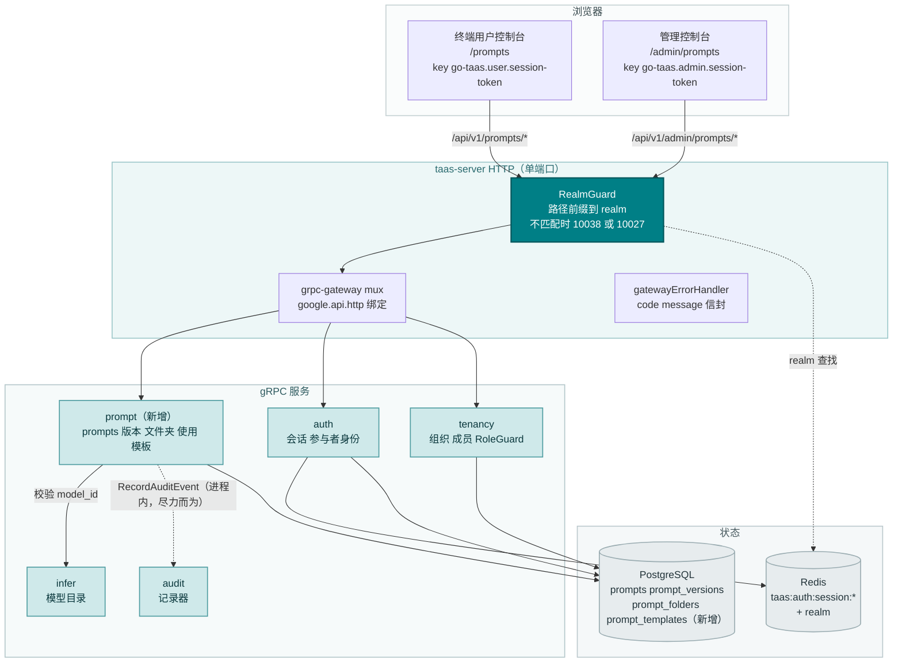
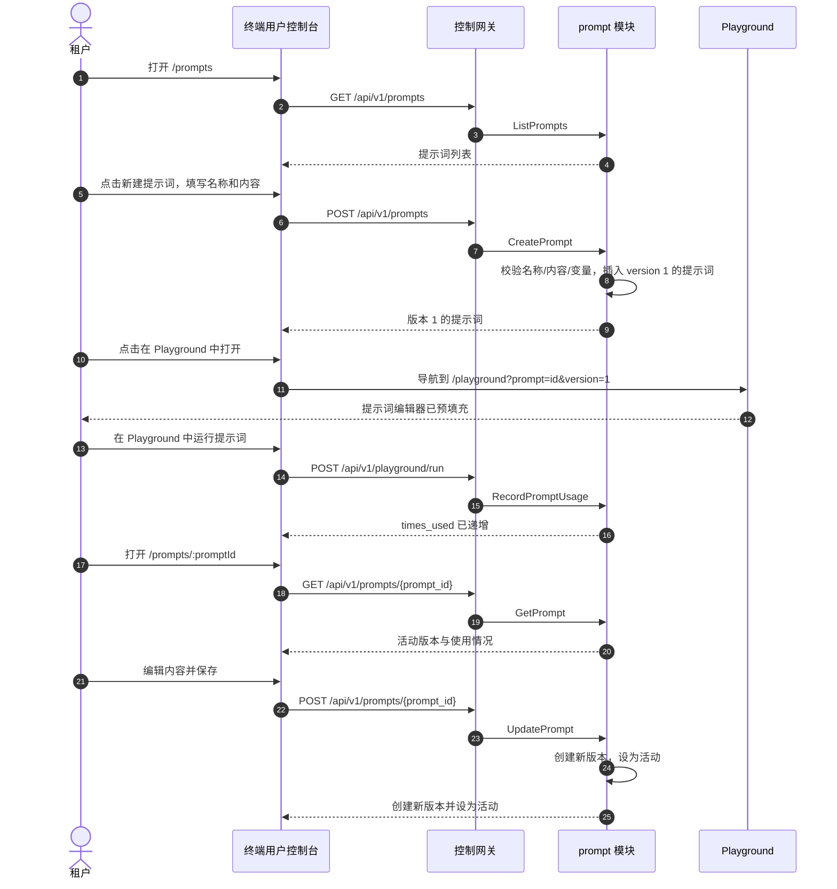
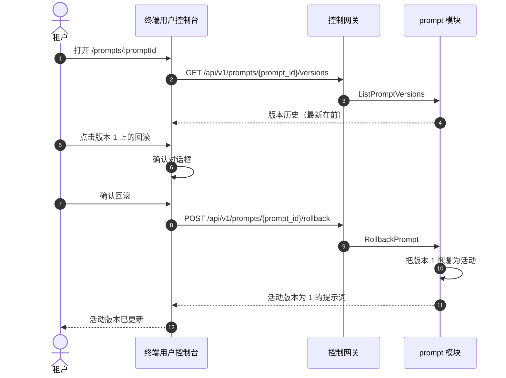
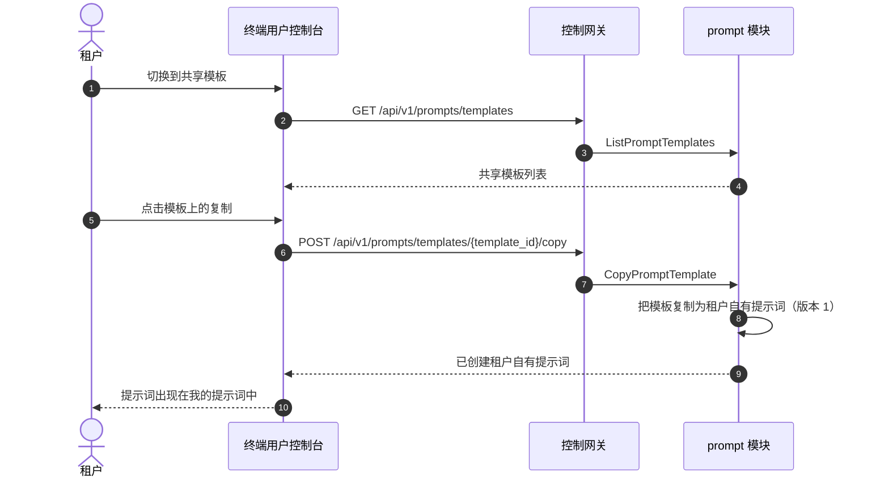
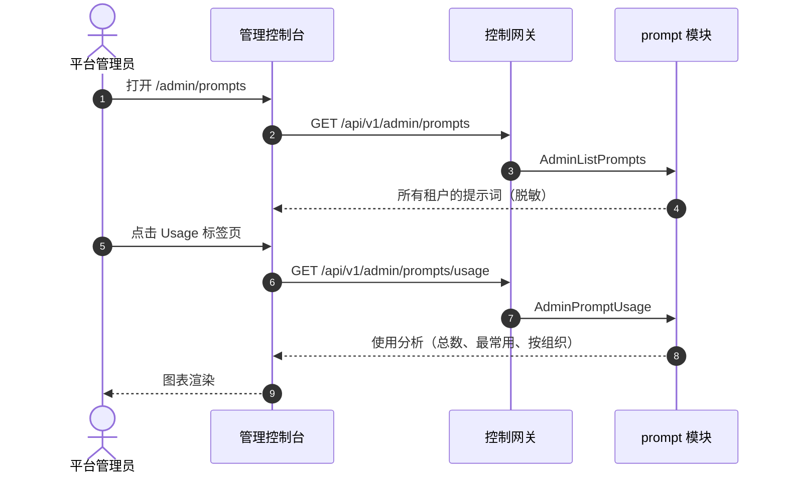

# 提示词管理与提示词库 — 架构与详细设计

| 属性 | 内容 |
| --- | --- |
| 特性点 | 提示词管理与提示词库（提示词模板）— 创建、版本化、按文件夹组织、搜索并复用提示词；在 Playground 中打开提示词；复制提示词文本；每个提示词的使用统计。管理端管理跨租户的提示词列表（脱敏）、提示词使用分析，以及租户可浏览并复制的共享提示词模板库（backlog 第 43 行） |
| 文档范围 | 特性-43 的架构与详细设计：新增 `prompt` 模块，拥有提示词生命周期、版本化、文件夹、使用计数器与共享模板库；`prompts`、`prompt_versions`、`prompt_folders` 与 `prompt_templates` 表；`taas.prompt.v1.PromptService` proto，带管理面/用户面双 HTTP 绑定；终端用户面提示词页面（`/prompts`、`/prompts/:promptId`）与管理面提示词页面（`/admin/prompts`）；以及错误处理、配置、安全、上线与逐层函数级设计 |
| 归属模块 | 新增 `prompt` 模块（`services/prompt`）：`prompts` + `prompt_versions` + `prompt_folders` + `prompt_templates` 表、CRUD/查询 RPC、版本化逻辑、使用计数器、共享模板库；`infer`（只读：提示词引用的模型目录）；`audit`（只读：提示词操作的审计事件）；`pkg/server` 网关（管理前缀与用户前缀绑定）；控制台 web 应用（终端用户面 `PromptsPage`/`PromptDetailPage`，管理面 `AdminPromptsPage`） |
| 相关文档 | [需求分析与 UI/UX 设计](../design/prompt-management.zh-cn.md) · [架构设计](../design/architecture.zh-cn.md) 第 2.5 节（计量）、第 3.1 节（管理面/用户面分离）· [控制台面分离](./console-surface-separation.zh-cn.md)（本特性横跨的两个面；realm 守卫，10038）· [请求日志与 API Playground](./request-logs-playground.zh-cn.md)（提示词打开的兄弟 Playground 面）· [模型目录与部署](./model-catalog-deployment.zh-cn.md)（提示词引用的模型目录）· [审计日志](./audit-logging.zh-cn.md)（提示词操作发出的审计事件） |
| 状态 | 架构完成，已移交开发者代理 |

---

## 1. 概述与目标

go-taas 通过 OpenAI 兼容网关（特性 #2、#12）提供推理服务：智能体发送请求并实时收到补全结果。但真正构建集成的租户很快就会积累一批提示词——系统指令、少样本示例、输出格式约束——他们会在请求、模型和应用之间反复复用。如果没有一个地方来存储、版本化并组织这些提示词，租户就只能手动把它们粘贴到 Playground 或代码里，丢失哪个版本有效，也无法与队友分享调优好的提示词。本特性新增**提示词管理与提示词库**能力：租户创建提示词、版本化、按文件夹组织、搜索、在 Playground 中打开、复制文本，并查看使用频率。平台管理员管理跨租户的提示词列表（脱敏）、提示词使用分析，以及租户可浏览并复制的共享提示词模板库。

**目标**：新增 `prompt` 模块，拥有 `prompts`、`prompt_versions`、`prompt_folders` 与 `prompt_templates` 表及其生命周期；`taas.prompt.v1.PromptService`，含二十个 RPC，每个都双绑定到用户前缀 `/api/v1/prompts/*` 与管理前缀 `/api/v1/admin/prompts/*`；提示词版本化（每次编辑创建新版本，回滚恢复之前的版本）；文件夹组织；轻量级每提示词使用计数器；复制即用的共享模板库；新增错误码 12701–12708；终端用户面提示词页面（`/prompts`）与详情页（`/prompts/:promptId`），以及管理面提示词页面（`/admin/prompts`）。

**非目标**（延后，设计第 8 节）：实时推理 Playground（特性 #12）；模型目录（特性 #2）；请求日志与追踪（特性 #12、#27）；审计日志查看器（特性 #15）；批量推理（特性 #42）。实时推理路径不变——prompt 模块只存储提示词元数据与内容。

### 1.1 本文档的阅读顺序

第 2 节记录架构决策（AD1–AD9，镜像设计的 D1–D9）。第 3–5 节是组件视图、数据模型与 API 设计。第 6 节是前端架构（两个控制台的页面 → 路由 → API 前缀表，每面认证守卫）。第 7–8 节是时序流程与错误处理。第 9–11 节是配置、安全与上线。第 12–14 节是验收标准追溯、函数级详细设计与有序实现任务清单。

---

## 2. 架构决策

| # | 决策 | 依据 |
| --- | --- | --- |
| AD1 | **新增 `prompt` 模块**（`services/prompt`），拥有 `prompts`、`prompt_versions`、`prompt_folders` 与 `prompt_templates` 表、CRUD/查询 RPC、版本化逻辑、使用计数器与共享模板库，并使用自己的错误块 **127xx** | 提示词管理存储提示词元数据与内容；专用模块把提示词关注点从产生模块中分离出来并给它一个归属，镜像 `batch` 拥有批量任务的方式（设计 D1） |
| AD2 | **提示词由名称、内容、模型、文件夹和变量定义。** `CreatePrompt` 接收 `name`、`content`、可选的 `model_id`、可选的 `folder_id` 和可选的 `variables`。租户复用的是活动版本的内容。变量使用 `${var}` 语法 | 名称/内容/模型/文件夹模型与调研的平台一致，并给控制台一个清晰的提示词记录。变量让租户可以参数化提示词以便复用（设计 D2） |
| AD3 | **提示词版本化：每次编辑都会创建新版本。** `UpdatePrompt` 创建新版本并设为活动；`RollbackPrompt` 把之前的版本恢复为活动。版本历史不可变 | 版本化让租户可以迭代提示词并回滚糟糕的编辑，与 Anthropic 和百度千帆一致。不可变历史保证审计轨迹诚实（设计 D3） |
| AD4 | **提示词按租户隔离并脱敏。** 用户面的 `CreatePrompt` 不接受 `organization_id` 过滤（调用者组织隐含），绝不暴露其他租户的提示词。管理面列出所有提示词但脱敏内容（脱敏投影规则，特性 #17） | 遵循特性 #17 的脱敏投影规则：租户的提示词绝不能泄露另一个租户的内容。管理面看到提示词元数据和聚合使用情况，但看不到原始提示词文本（设计 D4） |
| AD5 | **「在 Playground 中打开」导航到 `/playground?prompt=<prompt_id>&version=<version>`。** Playground（特性 #12）读取查询参数，并用活动版本的内容预填充其提示词编辑器 | 复用是提示词库的意义所在；打开到现有 Playground 是摩擦最小的复用路径，并复用特性 #12 的面（设计 D5） |
| AD6 | **提示词使用是轻量级计数器，不是完整计量。** 每次提示词在 Playground 中打开并运行时，`prompt` 模块递增 `times_used` 并设置 `last_used_at`。`GetPromptUsage` 返回这些计数器 | 完整的 token 计量已经在 `metering` 管线中完成（特性 #4）；提示词模块只需要一个轻量级的「这个提示词用了多少次」信号，用于清理和改进（设计 D6） |
| AD7 | **提示词块中的新错误码 12701–12708。** **12701 `CodePromptNotFound`**、**12702 `CodePromptVersionNotFound`**、**12703 `CodePromptNameConflict`**、**12704 `CodePromptFolderNotFound`**、**12705 `CodePromptInvalidContent`**、**12706 `CodePromptInvalidVariable`**、**12707 `CodePromptTemplateNotFound`**、**12708 `CodePromptFolderNotEmpty`**。范围/格式校验在适用处复用现有错误码 | 提示词管理是一个新模块（AD1），因此其错误码位于批量块（126xx）之后的新块中；不同的错误码让每种失败模式都可操作（设计 D7） |
| AD8 | **共享模板库是复制即用。** 管理员创建/编辑/删除共享模板；租户浏览并把一个复制为租户自有提示词（`CopyPromptTemplate`）。租户绝不就地编辑共享模板 | 复制即用防止一个租户破坏所有人的共享模板，并与阿里云百炼的预置模板复制流程一致（设计 D8） |
| AD9 | **提示词操作会被审计。** 提示词的创建、更新、回滚、删除和模板复制会被审计（特性 #15），记为 `prompt.created` / `prompt.updated` / `prompt.rolled_back` / `prompt.deleted` / `prompt.copied_from_template`。底层推理已由现有管线计量和记录 | 本特性存储提示词元数据和内容；只有新的提示词操作需要新的审计事件（设计 D9） |

---

## 3. 组件视图

### 3.1 归属

| 层 / 组件 | 拥有 | 本特性的变更 |
| --- | --- | --- |
| **控制网关（`grpc-gateway`）** | 提示词 RPC 的 HTTP/JSON 门面；realm 守卫（特性 #17）已用 10038 拒绝错误 realm 会话；将 `X-Organization-Id` 作为 gRPC 元数据透传 | 新增 20 个 HTTP 提示词 RPC 的绑定（第 5 节）；realm 守卫不变 |
| **`prompt` 模块（`services/prompt`）** | `prompts` + `prompt_versions` + `prompt_folders` + `prompt_templates` 表、CRUD/查询 RPC、版本化逻辑、使用计数器、共享模板库 | **新增模块**（AD1） |
| **`infer` 模块** | 提示词引用的模型目录 | 只读：prompt 模块对照模型目录校验 `model_id`（AD2） |
| **`audit` 模块** | 审计记录器 | 只读：prompt 模块在提示词创建、更新、回滚、删除与模板复制后调用 `RecordAuditEvent`（AD9） |
| **`auth` 模块** | 参与者身份、会话 realm、会话活动组织 | 只读：prompt 模块从会话解析组织；`SessionActiveOrg` 为带会话的调用提供组织 |
| **`tenancy` 模块** | 组织、成员、角色、RoleGuard | 只读：`RoleGuard` 按解析出的组织上下文中调用者的角色门控管理面提示词 RPC（10036） |
| **PostgreSQL** | `prompts` + `prompt_versions` + `prompt_folders` + `prompt_templates` 表（新增）；所有其他表不变 | 通过 AutoMigrate 新增四张表（第 4 节） |
| **控制台** | 终端用户面提示词页面与管理面提示词页面 | 在两个面上新增三个页面（第 6 节） |

### 3.2 运行时组件视图



### 3.3 请求身份链

提示词 RPC 复用既定身份链（控制台面分离 §3.3）：

1. `RealmGuard`（HTTP，`pkg/server/realm.go`）——路径前缀决定期望 realm。`/api/v1/admin/prompts/*` 期望 `admin`；`/api/v1/prompts/*` 期望 `user`。无 `Authorization` 头：透传（过渡期，特性 #17 AD4）。有头：从 Redis 解析会话 realm；不匹配 → 10038，未知/过期/无 realm → 10027。
2. grpc-gateway mux——按注解路径路由并转发 `authorization` 与 `x-organization-id`。
3. 服务处理器——对带会话的调用，`SessionActiveOrg` 使会话的活动组织具有权威性并忽略 `X-Organization-Id`；无会话时，`resolveOrganizationID` 读取过渡期头，缺失或为空时返回 10001。
4. `tenancy.RoleGuard`——按解析出的组织上下文中调用者的角色门控管理面提示词 RPC（10036）。终端用户面提示词 RPC 硬性限定到调用方组织，无需角色检查。

### 3.4 共享模板库与复制即用接缝

共享模板库是复制即用（AD8）：管理 RPC（`AdminCreateTemplate`、`AdminListTemplates`、`AdminUpdateTemplate`、`AdminDeleteTemplate`）管理共享模板；用户 RPC（`ListPromptTemplates`、`CopyPromptTemplate`）让租户浏览并复制。`CopyPromptTemplate` 把模板复制为租户自有提示词（一条新的 `prompts` 行，`version = 1`），绝不是实时引用——因此一个租户绝不可能破坏所有人的共享模板。模板库是纯元数据存储；推理、计量或计费流水线均无改动。

---

## 4. 数据模型

### 4.1 `prompts` 表

| 列 | PostgreSQL 类型 | 约束 | 描述 |
| --- | --- | --- | --- |
| `prompt_id` | `uuid` | PRIMARY KEY | 服务端生成的 UUID v4，对外暴露为 `prompt_id` |
| `organization_id` | `varchar(64)` | NOT NULL，索引（复合） | 归属组织 |
| `name` | `varchar(128)` | NOT NULL，每组织唯一 | 提示词名称（重复 → 12703） |
| `model_id` | `varchar(64)` | NULL | 可选的目标模型（对照模型目录校验） |
| `folder_id` | `uuid` | NULL，索引 | 可选的归属文件夹（未知 → 12704） |
| `active_version` | `int` | NOT NULL DEFAULT 1 | 活动版本号 |
| `times_used` | `bigint` | NOT NULL DEFAULT 0 | 使用计数器（AD6） |
| `last_used_at` | `timestamptz` | NULL | 提示词最后使用时间（AD6） |
| `created_at` | `timestamptz` | NOT NULL，索引（复合） | 创建时间（UTC） |
| `updated_at` | `timestamptz` | NOT NULL | 最后更新时间（UTC） |

设计说明：

- 复合索引 `idx_prompts_org_created (organization_id, created_at)` 用于组织隔离列表；`name` 每组织唯一用于名称冲突检查（12703）；`folder_id` 索引用于文件夹过滤。
- 无指向 `organizations` / `inference_services` 的外键：提示词必须比已删除的组织或服务存活更久，使其元数据保持可调试（镜像审计事件推理）。
- 删除提示词会级联删除其 `prompt_versions` 行（AD3）。

### 4.2 `prompt_versions` 表

| 列 | PostgreSQL 类型 | 约束 | 描述 |
| --- | --- | --- | --- |
| `prompt_id` | `uuid` | NOT NULL，索引（复合） | 归属提示词（级联删除） |
| `version` | `int` | NOT NULL | 版本号（从 1 开始，单调递增） |
| `content` | `text` | NOT NULL | 提示词内容（≤ 6144 字符，否则 12705） |
| `model_id` | `varchar(64)` | NULL | 该版本的模型 |
| `variables` | `jsonb` | NOT NULL DEFAULT '[]' | 该版本的 `${var}` 变量名 |
| `created_at` | `timestamptz` | NOT NULL | 创建时间（UTC） |
| `created_by` | `varchar(64)` | NOT NULL | 创建该版本的参与者 |

设计说明：

- 复合主键 `(prompt_id, version)`；版本历史不可变（AD3）——除归属提示词的级联删除外，不对版本行做 UPDATE 或 DELETE。
- `variables` 是变量名的 JSON 数组（如 `["topic","tone"]`）；`${var}` 语法在写入时校验（12706）。

### 4.3 `prompt_folders` 表

| 列 | PostgreSQL 类型 | 约束 | 描述 |
| --- | --- | --- | --- |
| `folder_id` | `uuid` | PRIMARY KEY | 服务端生成的 UUID v4，对外暴露为 `folder_id` |
| `organization_id` | `varchar(64)` | NOT NULL，索引 | 归属组织 |
| `name` | `varchar(128)` | NOT NULL，每组织唯一 | 文件夹名称 |
| `created_at` | `timestamptz` | NOT NULL | 创建时间（UTC） |

设计说明：

- `name` 每组织唯一；非空文件夹不能删除（12708）——删除时检查子 `prompts` 行。

### 4.4 `prompt_templates` 表

| 列 | PostgreSQL 类型 | 约束 | 描述 |
| --- | --- | --- | --- |
| `template_id` | `uuid` | PRIMARY KEY | 服务端生成的 UUID v4，对外暴露为 `template_id` |
| `name` | `varchar(128)` | NOT NULL | 模板名称 |
| `content` | `text` | NOT NULL | 模板内容（≤ 6144 字符） |
| `model_id` | `varchar(64)` | NULL | 可选的目标模型 |
| `variables` | `jsonb` | NOT NULL DEFAULT '[]' | `${var}` 变量名 |
| `times_used` | `bigint` | NOT NULL DEFAULT 0 | 模板被复制的次数 |
| `created_at` | `timestamptz` | NOT NULL | 创建时间（UTC） |
| `updated_at` | `timestamptz` | NOT NULL | 最后更新时间（UTC） |

设计说明：

- 共享模板是平台级的（无 `organization_id`）；管理 RPC 管理它们，用户 RPC 浏览并复制（AD8）。
- `times_used` 在每次 `CopyPromptTemplate` 时递增；管理端 Usage 标签页报告它。

### 4.5 迁移说明

- 四张新表由 GORM `AutoMigrate` 在 `taas-server` 启动时创建（增量；无数据迁移）。`Migrate`/`MigrateSchemaForFVT` 增加 `Prompt`、`PromptVersion`、`PromptFolder` 与 `PromptTemplate` 模型。
- 无需 init-SQL 升级路径：四张表在发布时都是新的且为空；prompt 模块在提示词创建后立即开始填充。

---

## 5. API 设计

所有提示词 RPC 属于新的 **`taas.prompt.v1.PromptService`**（`proto/taas/prompt/v1/prompt.proto`），通过控制网关以 HTTP 提供。用户 RPC 在 `/api/v1/prompts/*` 下提供；管理 RPC 在 `/api/v1/admin/prompts/*` 下提供。面由请求路径推导（第 3.3 节）。

| RPC | HTTP（用户） | HTTP（管理） | 状态 | 用途 |
| --- | --- | --- | --- | --- |
| `CreatePrompt` | `POST /api/v1/prompts` | — | **新增** | 创建提示词（名称、内容、模型、文件夹、变量）；返回 `version = 1` |
| `ListPrompts` | `GET /api/v1/prompts` | — | **新增** | 列出调用方提示词 |
| `GetPrompt` | `GET /api/v1/prompts/{prompt_id}` | — | **新增** | 获取提示词的活动版本与元数据 |
| `UpdatePrompt` | `POST /api/v1/prompts/{prompt_id}` | — | **新增** | 创建新版本并设为活动 |
| `DeletePrompt` | `DELETE /api/v1/prompts/{prompt_id}` | — | **新增** | 删除提示词及其所有版本 |
| `ListPromptVersions` | `GET /api/v1/prompts/{prompt_id}/versions` | — | **新增** | 列出提示词的版本历史 |
| `RollbackPrompt` | `POST /api/v1/prompts/{prompt_id}/rollback` | — | **新增** | 把之前的版本恢复为活动 |
| `CreatePromptFolder` | `POST /api/v1/prompts/folders` | — | **新增** | 创建文件夹 |
| `ListPromptFolders` | `GET /api/v1/prompts/folders` | — | **新增** | 列出调用者的文件夹 |
| `DeletePromptFolder` | `DELETE /api/v1/prompts/folders/{folder_id}` | — | **新增** | 删除空文件夹 |
| `GetPromptUsage` | `GET /api/v1/prompts/{prompt_id}/usage` | — | **新增** | 获取提示词的使用计数器 |
| `RecordPromptUsage` | `POST /api/v1/prompts/{prompt_id}/usage` | — | **新增** | 递增提示词的使用计数器 |
| `ListPromptTemplates` | `GET /api/v1/prompts/templates` | — | **新增** | 浏览共享模板 |
| `CopyPromptTemplate` | `POST /api/v1/prompts/templates/{template_id}/copy` | — | **新增** | 把共享模板复制为租户自有提示词 |
| `AdminListPrompts` | — | `GET /api/v1/admin/prompts` | **新增** | 列出所有租户的提示词（脱敏） |
| `AdminPromptUsage` | — | `GET /api/v1/admin/prompts/usage` | **新增** | 获取跨租户的提示词使用分析 |
| `AdminCreateTemplate` | — | `POST /api/v1/admin/prompts/templates` | **新增** | 创建共享模板 |
| `AdminListTemplates` | — | `GET /api/v1/admin/prompts/templates` | **新增** | 列出共享模板 |
| `AdminUpdateTemplate` | — | `POST /api/v1/admin/prompts/templates/{template_id}` | **新增** | 更新共享模板 |
| `AdminDeleteTemplate` | — | `DELETE /api/v1/admin/prompts/templates/{template_id}` | **新增** | 删除共享模板 |

> **面说明**：租户自有提示词 RPC（`CreatePrompt`、`ListPrompts`、`GetPrompt`、`UpdatePrompt`、`DeletePrompt`、`ListPromptVersions`、`RollbackPrompt`、`CreatePromptFolder`、`ListPromptFolders`、`DeletePromptFolder`、`GetPromptUsage`、`RecordPromptUsage`、`ListPromptTemplates`、`CopyPromptTemplate`）**仅用户面**——管理面脱敏提示词内容（AD4），绝不编辑租户的提示词或文件夹。管理专用 RPC（`AdminListPrompts`、`AdminPromptUsage`、`AdminCreateTemplate`、`AdminListTemplates`、`AdminUpdateTemplate`、`AdminDeleteTemplate`）仅管理面。这是与设计 D4（管理面看到提示词元数据和聚合使用情况，但看不到原始提示词文本）及设计 §5.1 面分配表（未列出租户提示词的管理面创建/编辑/删除行）最一致的解读。

### 5.1 Proto 契约

```protobuf
syntax = "proto3";

package taas.prompt.v1;

import "google/api/annotations.proto";
import "taas/common/v1/common.proto";

option go_package = "github.com/go-taas/go-taas/proto/taas/prompt/v1;promptv1";

// PromptService 管理提示词、文件夹、使用计数器与共享模板库。租户自有提示词
// RPC 在 /api/v1/prompts/* 下仅用户面（管理面脱敏提示词内容）。管理专用
// RPC 在 /api/v1/admin/prompts/* 下提供，管理共享模板库与跨租户使用分析。
service PromptService {
  // CreatePrompt 创建 version = 1 的提示词。
  // 用户面 API：在 /api/v1/prompts 下按租户隔离。
  rpc CreatePrompt(CreatePromptRequest) returns (CreatePromptResponse) {
    option (google.api.http) = {
      post: "/api/v1/prompts"
      body: "*"
    };
  }

  // ListPrompts 返回调用方的提示词，带点式分页。
  // 用户面 API：在 /api/v1/prompts 下按租户隔离。
  rpc ListPrompts(ListPromptsRequest) returns (ListPromptsResponse) {
    option (google.api.http) = {
      get: "/api/v1/prompts"
    };
  }

  // GetPrompt 返回提示词的活动版本与元数据。
  // 用户面 API：在 /api/v1/prompts 下按租户隔离。
  rpc GetPrompt(GetPromptRequest) returns (GetPromptResponse) {
    option (google.api.http) = {
      get: "/api/v1/prompts/{prompt_id}"
    };
  }

  // UpdatePrompt 创建新版本并设为活动。
  // 用户面 API：在 /api/v1/prompts 下提供。
  rpc UpdatePrompt(UpdatePromptRequest) returns (UpdatePromptResponse) {
    option (google.api.http) = {
      post: "/api/v1/prompts/{prompt_id}"
      body: "*"
    };
  }

  // DeletePrompt 删除提示词及其所有版本。
  // 用户面 API：在 /api/v1/prompts 下提供。
  rpc DeletePrompt(DeletePromptRequest) returns (DeletePromptResponse) {
    option (google.api.http) = {
      delete: "/api/v1/prompts/{prompt_id}"
    };
  }

  // ListPromptVersions 返回提示词的版本历史。
  // 用户面 API：在 /api/v1/prompts 下提供。
  rpc ListPromptVersions(ListPromptVersionsRequest) returns (ListPromptVersionsResponse) {
    option (google.api.http) = {
      get: "/api/v1/prompts/{prompt_id}/versions"
    };
  }

  // RollbackPrompt 把之前的版本恢复为活动。
  // 用户面 API：在 /api/v1/prompts 下提供。
  rpc RollbackPrompt(RollbackPromptRequest) returns (RollbackPromptResponse) {
    option (google.api.http) = {
      post: "/api/v1/prompts/{prompt_id}/rollback"
      body: "*"
    };
  }

  // CreatePromptFolder 创建文件夹。
  // 用户面 API：在 /api/v1/prompts 下提供。
  rpc CreatePromptFolder(CreatePromptFolderRequest) returns (CreatePromptFolderResponse) {
    option (google.api.http) = {
      post: "/api/v1/prompts/folders"
      body: "*"
    };
  }

  // ListPromptFolders 列出调用者的文件夹。
  // 用户面 API：在 /api/v1/prompts 下提供。
  rpc ListPromptFolders(ListPromptFoldersRequest) returns (ListPromptFoldersResponse) {
    option (google.api.http) = {
      get: "/api/v1/prompts/folders"
    };
  }

  // DeletePromptFolder 删除空文件夹。
  // 用户面 API：在 /api/v1/prompts 下提供。
  rpc DeletePromptFolder(DeletePromptFolderRequest) returns (DeletePromptFolderResponse) {
    option (google.api.http) = {
      delete: "/api/v1/prompts/folders/{folder_id}"
    };
  }

  // GetPromptUsage 返回提示词的使用计数器。
  // 用户面 API：在 /api/v1/prompts 下提供。
  rpc GetPromptUsage(GetPromptUsageRequest) returns (GetPromptUsageResponse) {
    option (google.api.http) = {
      get: "/api/v1/prompts/{prompt_id}/usage"
    };
  }

  // RecordPromptUsage 递增提示词的使用计数器。
  // 用户面 API：在 /api/v1/prompts 下提供。
  rpc RecordPromptUsage(RecordPromptUsageRequest) returns (RecordPromptUsageResponse) {
    option (google.api.http) = {
      post: "/api/v1/prompts/{prompt_id}/usage"
      body: "*"
    };
  }

  // ListPromptTemplates 让租户浏览共享模板。
  // 用户面 API：在 /api/v1/prompts 下提供。
  rpc ListPromptTemplates(ListPromptTemplatesRequest) returns (ListPromptTemplatesResponse) {
    option (google.api.http) = {
      get: "/api/v1/prompts/templates"
    };
  }

  // CopyPromptTemplate 把共享模板复制为租户自有提示词。
  // 用户面 API：在 /api/v1/prompts 下提供。
  rpc CopyPromptTemplate(CopyPromptTemplateRequest) returns (CopyPromptTemplateResponse) {
    option (google.api.http) = {
      post: "/api/v1/prompts/templates/{template_id}/copy"
      body: "*"
    };
  }

  // AdminListPrompts 列出所有租户的提示词，脱敏。
  // 管理面 API：在 /api/v1/admin/prompts 下提供。
  rpc AdminListPrompts(AdminListPromptsRequest) returns (AdminListPromptsResponse) {
    option (google.api.http) = {
      get: "/api/v1/admin/prompts"
    };
  }

  // AdminPromptUsage 返回跨租户的提示词使用分析。
  // 管理面 API：在 /api/v1/admin/prompts 下提供。
  rpc AdminPromptUsage(AdminPromptUsageRequest) returns (AdminPromptUsageResponse) {
    option (google.api.http) = {
      get: "/api/v1/admin/prompts/usage"
    };
  }

  // AdminCreateTemplate 创建共享模板。
  // 管理面 API：在 /api/v1/admin/prompts 下提供。
  rpc AdminCreateTemplate(AdminCreateTemplateRequest) returns (AdminCreateTemplateResponse) {
    option (google.api.http) = {
      post: "/api/v1/admin/prompts/templates"
      body: "*"
    };
  }

  // AdminListTemplates 列出共享模板。
  // 管理面 API：在 /api/v1/admin/prompts 下提供。
  rpc AdminListTemplates(AdminListTemplatesRequest) returns (AdminListTemplatesResponse) {
    option (google.api.http) = {
      get: "/api/v1/admin/prompts/templates"
    };
  }

  // AdminUpdateTemplate 更新共享模板。
  // 管理面 API：在 /api/v1/admin/prompts 下提供。
  rpc AdminUpdateTemplate(AdminUpdateTemplateRequest) returns (AdminUpdateTemplateResponse) {
    option (google.api.http) = {
      post: "/api/v1/admin/prompts/templates/{template_id}"
      body: "*"
    };
  }

  // AdminDeleteTemplate 删除共享模板。
  // 管理面 API：在 /api/v1/admin/prompts 下提供。
  rpc AdminDeleteTemplate(AdminDeleteTemplateRequest) returns (AdminDeleteTemplateResponse) {
    option (google.api.http) = {
      delete: "/api/v1/admin/prompts/templates/{template_id}"
    };
  }
}

message CreatePromptRequest {
  string name = 1;              // 必填，≤ 128 字符，每组织唯一
  string content = 2;           // 必填，≤ 6144 字符
  string model_id = 3;          // 可选
  string folder_id = 4;         // 可选
  repeated string variables = 5; // 可选，${var} 语法
}

message CreatePromptResponse {
  taas.common.v1.Response response = 1;
  Prompt prompt = 2;
}

message ListPromptsRequest {
  taas.common.v1.PageRequest page = 1;
  string search = 2;            // 搜索名称与内容
  string folder_id = 3;         // 过滤
  string model_id = 4;          // 过滤
  // organization_id 为可选管理过滤；缺省表示所有组织。
  // 在用户面被忽略（调用方组织隐含）。
  string organization_id = 5;
}

message ListPromptsResponse {
  taas.common.v1.Response response = 1;
  repeated Prompt prompts = 2;
  taas.common.v1.PageMeta page_meta = 3;
}

message GetPromptRequest {
  string prompt_id = 1;
}

message GetPromptResponse {
  taas.common.v1.Response response = 1;
  Prompt prompt = 2;
}

message UpdatePromptRequest {
  string prompt_id = 1;
  string content = 2;           // 必填，≤ 6144 字符
  string model_id = 3;          // 可选
  repeated string variables = 4; // 可选
}

message UpdatePromptResponse {
  taas.common.v1.Response response = 1;
  Prompt prompt = 2;
}

message DeletePromptRequest {
  string prompt_id = 1;
}

message DeletePromptResponse {
  taas.common.v1.Response response = 1;
}

message ListPromptVersionsRequest {
  string prompt_id = 1;
  taas.common.v1.PageRequest page = 2;
}

message ListPromptVersionsResponse {
  taas.common.v1.Response response = 1;
  repeated PromptVersion versions = 2;
  taas.common.v1.PageMeta page_meta = 3;
}

message RollbackPromptRequest {
  string prompt_id = 1;
  int32 version = 2;            // 要恢复为活动的版本
}

message RollbackPromptResponse {
  taas.common.v1.Response response = 1;
  Prompt prompt = 2;
}

message CreatePromptFolderRequest {
  string name = 1;              // 必填，≤ 128 字符，每组织唯一
}

message CreatePromptFolderResponse {
  taas.common.v1.Response response = 1;
  PromptFolder folder = 2;
}

message ListPromptFoldersRequest {
  taas.common.v1.PageRequest page = 1;
}

message ListPromptFoldersResponse {
  taas.common.v1.Response response = 1;
  repeated PromptFolder folders = 2;
  taas.common.v1.PageMeta page_meta = 3;
}

message DeletePromptFolderRequest {
  string folder_id = 1;
}

message DeletePromptFolderResponse {
  taas.common.v1.Response response = 1;
}

message GetPromptUsageRequest {
  string prompt_id = 1;
}

message GetPromptUsageResponse {
  taas.common.v1.Response response = 1;
  int64 times_used = 2;
  int64 last_used_at = 3;       // unix 秒
}

message RecordPromptUsageRequest {
  string prompt_id = 1;
}

message RecordPromptUsageResponse {
  taas.common.v1.Response response = 1;
  int64 times_used = 2;
}

message ListPromptTemplatesRequest {
  taas.common.v1.PageRequest page = 1;
  string search = 2;            // 搜索名称与内容
  string model_id = 3;          // 过滤
}

message ListPromptTemplatesResponse {
  taas.common.v1.Response response = 1;
  repeated PromptTemplate templates = 2;
  taas.common.v1.PageMeta page_meta = 3;
}

message CopyPromptTemplateRequest {
  string template_id = 1;
  string name = 2;              // 可选；默认使用模板名称
}

message CopyPromptTemplateResponse {
  taas.common.v1.Response response = 1;
  Prompt prompt = 2;
}

message AdminListPromptsRequest {
  taas.common.v1.PageRequest page = 1;
  string search = 2;
  string organization_id = 3;   // 过滤
  string model_id = 4;          // 过滤
}

message AdminListPromptsResponse {
  taas.common.v1.Response response = 1;
  repeated Prompt prompts = 2;  // 内容脱敏
  taas.common.v1.PageMeta page_meta = 3;
}

message AdminPromptUsageRequest {
  // organization_id 为可选过滤；缺省表示所有组织。
  string organization_id = 1;
}

message AdminPromptUsageResponse {
  taas.common.v1.Response response = 1;
  int64 total_prompts = 2;
  int64 total_uses = 3;
  repeated PromptUsageRow most_used = 4;   // 前 10
  repeated OrgUsageRow by_organization = 5;
}

message AdminCreateTemplateRequest {
  string name = 1;              // 必填，≤ 128 字符
  string content = 2;           // 必填，≤ 6144 字符
  string model_id = 3;          // 可选
  repeated string variables = 4; // 可选
}

message AdminCreateTemplateResponse {
  taas.common.v1.Response response = 1;
  PromptTemplate template = 2;
}

message AdminListTemplatesRequest {
  taas.common.v1.PageRequest page = 1;
  string search = 2;
}

message AdminListTemplatesResponse {
  taas.common.v1.Response response = 1;
  repeated PromptTemplate templates = 2;
  taas.common.v1.PageMeta page_meta = 3;
}

message AdminUpdateTemplateRequest {
  string template_id = 1;
  string name = 2;
  string content = 3;
  string model_id = 4;
  repeated string variables = 5;
}

message AdminUpdateTemplateResponse {
  taas.common.v1.Response response = 1;
  PromptTemplate template = 2;
}

message AdminDeleteTemplateRequest {
  string template_id = 1;
}

message AdminDeleteTemplateResponse {
  taas.common.v1.Response response = 1;
}

// Prompt 是一个带活动版本的提示词。
message Prompt {
  string prompt_id = 1;
  string organization_id = 2;
  string name = 3;
  string content = 4;           // 活动版本的内容
  string model_id = 5;
  string folder_id = 6;
  int32 version = 7;            // 活动版本
  repeated string variables = 8;
  int64 times_used = 9;
  int64 last_used_at = 10;      // unix 秒
  int64 created_at = 11;        // unix 秒
  int64 updated_at = 12;        // unix 秒
}

// PromptVersion 是提示词的一个不可变版本。
message PromptVersion {
  string prompt_id = 1;
  int32 version = 2;
  string content = 3;
  string model_id = 4;
  repeated string variables = 5;
  int64 created_at = 6;         // unix 秒
  string created_by = 7;
}

// PromptFolder 是一个文件夹。
message PromptFolder {
  string folder_id = 1;
  string name = 2;
  int64 prompt_count = 3;
}

// PromptTemplate 是一个共享模板。
message PromptTemplate {
  string template_id = 1;
  string name = 2;
  string content = 3;
  string model_id = 4;
  repeated string variables = 5;
  int64 times_used = 6;
  int64 created_at = 7;         // unix 秒
  int64 updated_at = 8;         // unix 秒
}

// PromptUsageRow 是管理分析中一个提示词的使用情况。
message PromptUsageRow {
  string prompt_id = 1;
  string name = 2;
  string organization_id = 3;
  int64 times_used = 4;
  int64 last_used_at = 5;       // unix 秒
}

// OrgUsageRow 是一个组织的聚合使用情况。
message OrgUsageRow {
  string organization_id = 1;
  int64 prompt_count = 2;
  int64 total_uses = 3;
}
```

### 5.2 契约约束

1. **面分离**：租户自有提示词 RPC（`CreatePrompt`、`ListPrompts`、`GetPrompt`、`UpdatePrompt`、`DeletePrompt`、`ListPromptVersions`、`RollbackPrompt`、`CreatePromptFolder`、`ListPromptFolders`、`DeletePromptFolder`、`GetPromptUsage`、`RecordPromptUsage`、`ListPromptTemplates`、`CopyPromptTemplate`）仅用户面，位于 `/api/v1/prompts/*`；管理专用 RPC（`AdminListPrompts`、`AdminPromptUsage`、`AdminCreateTemplate`、`AdminListTemplates`、`AdminUpdateTemplate`、`AdminDeleteTemplate`）仅管理面，位于 `/api/v1/admin/prompts/*`。管理 RPC 需要管理会话；用户 RPC 需要用户会话。realm 守卫在任何处理器运行前用 10038 拒绝错误 realm 会话（特性 #17）。管理面脱敏提示词内容（AD4）。
2. **线上约定不变**：点式分页（`?page.offset=0&page.limit=20`）、成功 HTTP 200、业务错误为 `{"code": <int>, "message": "..."}`、int64 字段序列化为 JSON 字符串。
3. **`CreatePrompt` 校验**：`name`（必填，≤ 128 字符，每组织唯一，否则 12703）、`content`（必填，≤ 6144 字符，否则 12705）、`variables`（每个 `${var}` 引用格式正确——花括号配对、名称非空——否则 12706）、`model_id`（可选，对照模型目录校验）、`folder_id`（可选，未知 → 12704）。返回 `version = 1` 的提示词。
4. **`UpdatePrompt` / `RollbackPrompt` / `ListPromptVersions`**：`UpdatePrompt` 创建新版本并设为活动；`RollbackPrompt` 把之前的版本恢复为活动（未知版本 → 12702）；`ListPromptVersions` 返回不可变历史。未知 `prompt_id` 返回 12701。
5. **`CreatePromptFolder` / `ListPromptFolders` / `DeletePromptFolder`**：管理文件夹；非空文件夹返回 12708。
6. **`RecordPromptUsage` / `GetPromptUsage`**：`RecordPromptUsage` 递增 `times_used` 并设置 `last_used_at`；`GetPromptUsage` 返回它们（AD6）。
7. **共享模板库（AD8）**：`AdminCreateTemplate`/`AdminUpdateTemplate`/`AdminDeleteTemplate` 管理共享模板（未知 `template_id` → 12707）；`ListPromptTemplates` 让租户浏览它们；`CopyPromptTemplate` 把一个复制为租户自有提示词（一条新的 `prompts` 行，`version = 1`）。
8. **审计（AD9）**：提示词创建、更新、回滚、删除与模板复制记为 `prompt.created` / `prompt.updated` / `prompt.rolled_back` / `prompt.deleted` / `prompt.copied_from_template`。

### 5.3 错误码

所有错误都是统一信封中的 `pkg/errors` 业务码。在 prompt 块 **12701–12708**（AD7）中分配八个新码；其余已存在。

| 条件 | 错误码 | 常量 | 说明 |
| --- | --- | --- | --- |
| 未知的 `prompt_id` | 12701 | `CodePromptNotFound` | **新增**（AD7） |
| 回滚中的未知版本 | 12702 | `CodePromptVersionNotFound` | **新增** |
| 重复的提示词名称 | 12703 | `CodePromptNameConflict` | **新增** |
| 未知的 `folder_id` | 12704 | `CodePromptFolderNotFound` | **新增** |
| 空或超长内容 | 12705 | `CodePromptInvalidContent` | **新增** |
| 无效的 `${var}` 引用 | 12706 | `CodePromptInvalidVariable` | **新增** |
| 未知的 `template_id` | 12707 | `CodePromptTemplateNotFound` | **新增** |
| 删除非空文件夹 | 12708 | `CodePromptFolderNotEmpty` | **新增** |
| 调用者角色低于所需角色（管理组织范围） | 10036 | `CodeForbidden` | 现有（特性 #10） |
| 缺失/过期/撤销的会话 | 10027 | `CodeSessionInvalid` | 现有（特性 #7） |
| 其他前缀上的错误 realm 会话 | 10038 | `CodeRealmMismatch` | 现有（特性 #17） |
| 管理 API 上缺失 `X-Organization-Id`（过渡期） | 10001 | `CodeUnauthorized` | `resolveOrganizationID` 模式 |
| 数据库 / 基础设施故障 | 500 | `CodeInternal` | 通过错误归一化 |

---

## 6. 前端架构

### 6.1 页面 → 路由 → API 前缀表

| 页面 / 组件 | 面 | Web 路由 | API 前缀 | 认证守卫 |
| --- | --- | --- | --- | --- |
| **提示词页面** | 终端用户 | `/prompts` | `/api/v1/prompts` | 用户会话；硬性限定到调用方组织 |
| **提示词详情页面** | 终端用户 | `/prompts/:promptId` | `/api/v1/prompts/{id}` | 用户会话 |
| **提示词页面** | 管理 | `/admin/prompts` | `/api/v1/admin/prompts` | 管理会话；RoleGuard 组织范围 |

> 终端用户提示词页面只调用 `/api/v1/prompts/*`；管理提示词页面只调用 `/api/v1/admin/prompts/*`。两个面绝不共享会话令牌（特性 #17）。管理面绝不调用租户自有提示词 RPC（AD4）。

### 6.2 导航位置

- **终端用户控制台**：在用户导航中新增 **Prompts** 项（`/prompts`，testid `user-nav-prompts`），位于推理组，与 Playground 和 Request Logs 并列。
- **管理控制台**：在管理导航中新增 **Prompts** 项（`/admin/prompts`，testid `nav-prompts`），位于运维组，与 Inference Services 和 Autoscaling 并列。

### 6.3 复用的共享组件与状态

- **API 客户端**（`web/src/api.ts`）：realm 作用域客户端（`createApi(realm)`）已发送 `Authorization: Bearer <realm>.session-token` 与 `X-Organization-Id`（仅当 realm 令牌键为空时）。提示词页面原样复用；不新增客户端。
- **模型下拉**：模型下拉与 Playground 和模型目录页面共享（提示词引用的模型目录）。
- **状态徽章**：版本徽章样式复用账单报表的 pending/ready/failed 徽章样式。
- **点式分页**：Usage 与 Request Logs 表格使用的共享分页组件。
- **空 / 错误 / 过期数据状态**：复用 Request Logs 页面模式（空文案、带 Retry 的错误横幅、"Showing stale data" 横幅）。
- **确认对话框**：删除提示词与回滚确认复用 Webhooks 与 API Keys 页面使用的共享确认对话框组件。
- **Toast**：复制操作上的 "Copied" toast 复用共享 toast 组件。

### 6.4 每面认证守卫

- **终端用户提示词页面**（`/prompts`、`/prompts/:promptId`）：在 `UserShell` 内渲染，当 `go-taas.user.session-token` 非空时运行用户会话守卫；缺失/过期会话重定向到 `/login?reason=expired`。页面 API 调用指向 `/api/v1/prompts/*`。页面不暴露其他租户数据（AD4）。
- **管理提示词页面**（`/admin/prompts`）：在 `AdminShell` 内渲染，当 `go-taas.admin.session-token` 非空时运行管理会话守卫；缺失/过期会话重定向到 `/admin/login?reason=expired`；错误 realm 会话被网关以 10038 拒绝。页面 API 调用指向 `/api/v1/admin/prompts/*`。无所需角色的会话收到 10036，页面显示标准权限不足状态（特性 #17）。
- **未认证访客**：任一页面的未认证访客由 shell 守卫重定向到正确的登录页（`/admin/login` 与 `/login`）。

### 6.5 控制台契约（为开发者代理钉定）

**提示词页面**（`/prompts`）：页面头部（"Prompts"，副标题 "Store, version, and reuse prompts"）带 **New prompt** 主操作（`prompt-new`）。下方，工具栏（`prompt-toolbar`），含搜索框（`prompt-search`，搜索名称与内容）、文件夹过滤（`prompt-filter-folder`，下拉）、模型过滤（`prompt-filter-model`，下拉）与 **Templates** 开关（`prompt-templates-toggle`），把列表在 "My prompts" 与 "Shared templates" 之间切换。文件夹侧栏（`prompt-folder-sidebar`）列出文件夹（"All prompts"、每个文件夹及其提示词数量、"Unfiled"）；选择文件夹会筛选列表。下方，提示词列表表格（`prompt-table`、`prompt-row-{id}`），列 Name、Model、Folder、Version、Used、Last used、Updated、Actions（Open in playground `prompt-open-{id}`、Copy `prompt-copy-{id}`、Edit、Delete `prompt-delete-{id}`）。表格上方有 **New prompt** 主操作。可按 Name、Model、Folder、Version、Used、Last used、Updated 排序；可按 Folder 与 Model 过滤；可按名称与内容搜索；点式分页。

**交互状态**：默认（工具栏、文件夹侧栏与提示词列表从首次成功加载渲染）；加载中（骨架表格，New prompt 与工具栏禁用）；空（"No prompts yet." 并提示创建一个，New prompt 保持可见）；错误（带 Retry 的错误横幅、"Showing stale data" 横幅）；禁用（请求进行中时 New prompt 禁用，提示词删除中时 Delete 禁用，列表加载中时工具栏禁用）；权限不足（10036 → 标准权限不足状态，带返回用户首页的链接）。

**新建提示词对话框**（`prompt-new-dialog`）：字段 Name（`prompt-dialog-name`，必填，≤ 128 字符）、Content（`prompt-dialog-content`，文本域，必填，≤ 6144 字符）、Model（`prompt-dialog-model`，下拉，可选，来自模型目录）、Folder（`prompt-dialog-folder`，下拉，可选，来自调用者的文件夹）、Variables（`prompt-dialog-variables`，标签输入，可选，`${var}` 语法）。校验按设计 §5.3。成功后，新提示词以 `version = 1` 出现；`12703` 名称冲突在对话框中内联显示错误。

**在 Playground 中打开流程**：点击 **Open in playground** 导航到 `/playground?prompt={prompt_id}&version={version}`；Playground 用活动版本的内容预填充其提示词编辑器（AD5）。

**复制流程**：点击 **Copy** 把活动版本的内容复制到剪贴板，并显示 "Copied" toast。

**删除流程**：点击 **Delete** 打开确认对话框（"Delete this prompt and all its versions?"），带 **Delete**（危险）与 **Keep**（次）操作。确认后调用 `DeletePrompt` 并移除该行。

**提示词详情页面**（`/prompts/:promptId`）：页面头部带提示词名称与 **Back to prompts** 次操作。下方：**Prompt editor**（`prompt-detail-editor`）——活动版本的 `content`、`model_id`、`variables` 的只读视图，带 **Edit** 操作（`prompt-detail-edit`），把编辑器切换到可编辑模式；**Usage**（`prompt-detail-usage`）——卡片，含 `times_used` 与 `last_used_at`；**Version history**（`prompt-detail-versions`）——版本列表，最新在前，每个含 `version`、`created_at`、`created_by`，以及 **Roll back** 操作（`prompt-rollback-{version}`，对非活动版本启用）；**Actions**——**Open in playground**、**Copy**、**Edit**、**Delete**。

**编辑流程**：点击 **Edit** 把编辑器切换到可编辑模式，带活动版本的内容、模型与变量。保存调用 `UpdatePrompt`，创建新版本并设为活动；编辑器返回只读模式，版本历史新增一行。

**回滚流程**：点击非活动版本上的 **Roll back** 打开确认对话框（"Roll back to version N? This creates a new active version."），带 **Roll back**（主）与 **Keep current**（次）操作。确认后调用 `RollbackPrompt` 并更新活动版本。

**管理提示词页面**（`/admin/prompts`）：页面头部（"Prompts"，副标题 "Monitor prompt usage across tenants and curate shared templates"）。下方，三个标签页（`admin-prompts-tabs`）：**All prompts**（`admin-prompts-tab`）、**Usage**（`admin-usage-tab`）与 **Templates**（`admin-templates-tab`）。

**All prompts 标签页**：表格（`admin-prompt-table`、`admin-prompt-row-{id}`），列 Name、Organization、Model、Version、Used、Last used、Updated。内容被脱敏（AD4）：无内容列，也无查看内容的行操作。表格上方有 **Refresh** 操作（`admin-prompts-refresh`）。可按 Name、Organization、Model、Version、Used、Last used、Updated 排序；可按 Organization 与 Model 过滤；点式分页。

**Usage 标签页**：跨租户提示词使用的摘要——提示词总数、总使用次数、最常用的提示词（前 10）与按组织的分解。图表：按组织的使用柱状图与最常用提示词的柱状图。

**Templates 标签页**：共享模板库——表格（`admin-template-table`、`admin-template-row-{id}`），列 Name、Model、Used、Updated、Actions（Edit、Delete `admin-template-delete-{id}`），以及 **New template** 主操作（`admin-template-new`）。

**新建模板对话框**（`admin-template-new-dialog`）：字段 Name（`admin-template-dialog-name`，必填，≤ 128 字符）、Content（`admin-template-dialog-content`，文本域，必填，≤ 6144 字符）、Model（`admin-template-dialog-model`，下拉，可选）、Variables（`admin-template-dialog-variables`，标签输入，可选）。校验按设计 §5.5。

**删除模板流程**：点击 **Delete** 打开确认对话框（"Delete this shared template? Tenants who copied it keep their copies."），带 **Delete**（危险）与 **Keep**（次）操作。确认后调用 `AdminDeleteTemplate` 并移除该行。

---

## 7. 时序流程

### 7.1 提示词创建与复用（终端用户）



### 7.2 提示词版本化与回滚



### 7.3 共享模板复制（终端用户）



### 7.4 管理端提示词使用分析



---

## 8. 错误处理

所有错误都是统一信封中的 `pkg/errors` 业务码（第 5.3 节）。prompt 模块是纯元数据存储；无运行器侧失败。同步 RPC 期间的数据库故障被归一化为 500 `CodeInternal`。

控制台按 body `code` 分支（`web/src/api.ts` 已如此），绝不按 HTTP 状态。每个新码渲染特定内联消息：12701 "prompt not found"、12702 "prompt version not found"、12703 "prompt name already exists"、12704 "folder not found"、12705 "invalid prompt content"、12706 "invalid variable"、12707 "template not found"、12708 "folder not empty"。管理页面将 10036 映射到标准权限不足状态；终端用户页面将 10005/10017 映射到租户的权限不足文案（特性 #17 §8.2）。

---

## 9. 配置新增

| 键 | 默认 | 描述 |
| --- | --- | --- |
| `prompt.maxNameLength` | `128` | 提示词/文件夹/模板名称的最大长度（AD2） |
| `prompt.maxContentLength` | `6144` | 提示词/模板内容的最大长度（AD2） |

`prompt` 配置块在 `pkg/config` 中新增（`PromptConfig`），遵循 `docs` 配置模式。`applyDefaults`/`Validate` 设置上述默认值。prompt 模块在校验器中读取 `maxNameLength`/`maxContentLength`。不新增其他配置键、运行器或 MQ 主题——本特性是纯元数据存储（AD9）。

---

## 10. 安全考量

- **面分离**：终端用户提示词页面只调用 `/api/v1/prompts/*`；管理提示词页面只调用 `/api/v1/admin/prompts/*`。realm 守卫在任何处理器运行前用 10038 拒绝错误 realm 会话（特性 #17）。
- **管理全量视图按角色门控**：管理提示词 RPC 默认全量（AD4），并由 `tenancy.RoleGuard` 门控——只有具有所需管理角色的调用者才能查看跨租户提示词列表或策划共享模板；不可访问的组织返回 10036。
- **终端用户硬性隔离**：提示词 RPC 的用户绑定硬性限定到调用方组织（会话活动组织权威，`X-Organization-Id` 忽略）；调用者绝不可能看到其他租户的提示词（AD4）。
- **脱敏投影**：管理面看到提示词元数据与聚合使用情况，但看不到原始提示词文本（AD4）。租户自有提示词 RPC 仅用户面——管理面绝不编辑租户的提示词或文件夹。
- **复制即用模板**：租户把共享模板复制为租户自有提示词，而不是就地编辑，因此一个租户绝不可能破坏所有人的共享模板（AD8）。
- **输入校验**：提示词校验器（AD2）在任何提示词被存储前拒绝空/超长内容（12705）、格式错误的 `${var}` 引用（12706）与重复名称（12703）。
- **审计轨迹**：提示词创建、更新、回滚、删除与模板复制被审计（AD9），因此谁改了提示词都被记录。
- **无新特权**：提示词管理不授予新能力；它是对调用者在其范围内本可消费数据的元数据存储。

---

## 11. 上线 / 升级说明

- **四张新表**（`prompts`、`prompt_versions`、`prompt_folders`、`prompt_templates`）通过 `taas-server` 启动时的 AutoMigrate 创建；单独部署 `taas-server`。无数据迁移，无 init-SQL 升级路径。
- **proto 变更是增量的**：新增 `taas.prompt.v1.PromptService` 与新 RPC；无现有 RPC 或消息变更。网关 mux 获得新绑定；realm 守卫不变。
- **控制台**：三个新页面加入现有 bundle；管理导航与用户导航各新增 Prompts 项。无现有路由变更。
- **向后兼容**：过渡期（无会话、`X-Organization-Id`）路径为 CLI、FVT 与 e2e 套件保留；realm 守卫透传无 `Authorization` 头的请求（特性 #17 AD4）。
- **数据存在前为空**：提示词 RPC 在提示词创建前返回空列表；页面渲染空状态并提示创建一个。

---

## 12. 验收标准追溯

| # | 标准 | 位置 |
| --- | --- | --- |
| AC1 | `CreatePrompt` 返回 `version = 1` 的提示词；重复名称返回 12703，空/超长内容返回 12705，无效的 `${var}` 引用返回 12706 | §5.1、§5.2、§5.3 |
| AC2 | `UpdatePrompt` 创建新版本并设为活动；`ListPromptVersions` 返回历史；`RollbackPrompt` 恢复之前的版本；未知版本返回 12702 | §5.1、§5.2、§5.3、§7.2 |
| AC3 | `CreatePromptFolder` / `ListPromptFolders` / `DeletePromptFolder` 管理文件夹；非空文件夹返回 12708 | §5.1、§5.2、§5.3 |
| AC4 | `RecordPromptUsage` 递增 `times_used` 并设置 `last_used_at`；`GetPromptUsage` 返回它们 | §5.1、§5.2、§7.1 |
| AC5 | 提示词在用户面按租户隔离：它只聚合调用者自己组织的提示词，绝不暴露其他租户的提示词 | §3.3、§5.2、§6.4、§10 |
| AC6 | `AdminListPrompts` 列出所有租户的提示词且内容脱敏；`AdminPromptUsage` 返回使用分析；`AdminCreateTemplate`/`AdminUpdateTemplate`/`AdminDeleteTemplate` 管理共享模板；`CopyPromptTemplate` 把一个复制为租户自有提示词 | §5.1、§5.2、§7.3、§7.4 |
| AC7 | `/prompts` 页面从首次成功加载渲染工具栏、文件夹侧栏和提示词列表，带新建提示词操作 | §6.5 |
| AC8 | 新建提示词对话框校验名称/内容/变量并创建以 `version = 1` 出现的提示词；名称冲突显示内联错误 | §6.5、§7.1 |
| AC9 | `/prompts/:promptId` 详情页面显示活动版本、使用情况和版本历史；编辑创建新版本；回滚恢复之前的版本 | §6.5、§7.2 |
| AC10 | 在 Playground 中打开导航到 `/playground?prompt=id&version=n` 并预填充提示词编辑器；复制把内容复制到剪贴板 | §6.5、§7.1 |
| AC11 | `/admin/prompts` 页面列出所有租户的提示词，带组织列和脱敏内容，显示使用分析，并策划共享模板库 | §6.5、§7.4 |
| AC12 | 提示词页面只在终端用户面可达：路由 `/prompts`，每个 API 调用使用 `/api/v1/prompts/*` 前缀且不含 `/api/v1/admin/*` 字符串；管理端页面只使用 `/api/v1/admin/prompts/*` 且不含 `/api/v1/prompts/*` 字符串 | §6.1、§6.4、§10 |
| AC13 | 没有所需角色的会话在 `/prompts` 和 `/admin/prompts` 页面收到 10036，页面显示标准权限不足状态 | §3.3、§6.4、§10 |

---

## 13. 详细设计（逐层函数级职责）

### 13.1 Proto → 服务 → 仓储 → 控制器

| 层 | 文件 | 职责 |
| --- | --- | --- |
| `proto/taas/prompt/v1` | `prompt.proto` | 新增 `PromptService`，含二十个 RPC（第 5.1 节）；消息 `CreatePromptRequest/Response`、`ListPromptsRequest/Response`、`GetPromptRequest/Response`、`UpdatePromptRequest/Response`、`DeletePromptRequest/Response`、`ListPromptVersionsRequest/Response`、`RollbackPromptRequest/Response`、`CreatePromptFolderRequest/Response`、`ListPromptFoldersRequest/Response`、`DeletePromptFolderRequest/Response`、`GetPromptUsageRequest/Response`、`RecordPromptUsageRequest/Response`、`ListPromptTemplatesRequest/Response`、`CopyPromptTemplateRequest/Response`、`AdminListPromptsRequest/Response`、`AdminPromptUsageRequest/Response`、`AdminCreateTemplateRequest/Response`、`AdminListTemplatesRequest/Response`、`AdminUpdateTemplateRequest/Response`、`AdminDeleteTemplateRequest/Response`、`Prompt`、`PromptVersion`、`PromptFolder`、`PromptTemplate`、`PromptUsageRow`、`OrgUsageRow`。通过 `buf generate` 重新生成 `prompt.pb.go`/`prompt_grpc.pb.go`/`prompt.pb.gw.go` |
| `services/prompt` | `prompt_model.go` | 新增 GORM 模型 `Prompt`、`PromptVersion`、`PromptFolder`、`PromptTemplate` + `TableName`（第 4.1–4.4 节） |
| | `prompt_repository.go` | `InsertPrompt(ctx, p)`——INSERT，返回生成 id；`FindPromptByID(ctx, orgID, promptID)`（未知时 12701）；`ListPrompts(ctx, orgFilter, filter)`（搜索/文件夹/模型过滤，分页）；`UpdatePrompt(ctx, p)`；`DeletePrompt(ctx, orgID, promptID)`（级联到版本）；`InsertVersion(ctx, v)`；`ListVersions(ctx, promptID, page)`；`FindVersion(ctx, promptID, version)`（未知时 12702）；`SetActiveVersion(ctx, promptID, version)`；`InsertFolder(ctx, f)`；`ListFolders(ctx, orgID, page)`（带提示词数量）；`DeleteFolder(ctx, orgID, folderID)`（非空时 12708）；`IncrementUsage(ctx, promptID)`；`InsertTemplate(ctx, t)`；`ListTemplates(ctx, filter)`；`FindTemplateByID(ctx, templateID)`（未知时 12707）；`UpdateTemplate(ctx, t)`；`DeleteTemplate(ctx, templateID)`；`IncrementTemplateUsage(ctx, templateID)`；`AdminListPrompts(ctx, filter)`（脱敏）；`AdminUsage(ctx, orgFilter)`（总数、最常用、按组织） |
| | `prompt_validator.go` | `ValidateName(name string) error`（重复时 12703）；`ValidateContent(content string) error`（空/超长时 12705）；`ValidateVariables(vars []string) error`（格式错误 `${var}` 时 12706）；`ValidateModelID(modelID string) error`（对照模型目录校验） |
| | `service.go` | 新 RPC `CreatePrompt`、`ListPrompts`、`GetPrompt`、`UpdatePrompt`、`DeletePrompt`、`ListPromptVersions`、`RollbackPrompt`、`CreatePromptFolder`、`ListPromptFolders`、`DeletePromptFolder`、`GetPromptUsage`、`RecordPromptUsage`、`ListPromptTemplates`、`CopyPromptTemplate`、`AdminListPrompts`、`AdminPromptUsage`、`AdminCreateTemplate`、`AdminListTemplates`、`AdminUpdateTemplate`、`AdminDeleteTemplate`；`Migrate`/`MigrateSchemaForFVT` 增加四个新模型；`SessionActiveOrg`/`resolveOrganizationID` 接缝用于组织解析；`RoleGuard` 接缝用于管理组织范围；审计记录器接缝（AD9） |
| `services/infer` | `catalog.go` | 只读：暴露 prompt 模块用于校验 `model_id` 的模型目录查找（AD2） |
| `services/audit` | `recorder.go` | 只读：prompt 模块在提示词创建、更新、回滚、删除与模板复制后调用 `Recorder.Record`（AD9） |
| `pkg/errors` | `codes.go`/`messages.go` | `CodePromptNotFound`（12701）、`CodePromptVersionNotFound`（12702）、`CodePromptNameConflict`（12703）、`CodePromptFolderNotFound`（12704）、`CodePromptInvalidContent`（12705）、`CodePromptInvalidVariable`（12706）、`CodePromptTemplateNotFound`（12707）、`CodePromptFolderNotEmpty`（12708）常量 + 规范消息（AD7） |
| `pkg/config` | `api.go`/`configuration.go` | `PromptConfig`（第 9 节）+ `applyDefaults`/`Validate` |
| `apps/taas-server` | `main.go` | 用 gRPC 服务器与网关 mux 注册 `PromptService`；将审计记录器接入提示词服务 |
| `web/src` | `pages/PromptsPage.tsx`、`pages/PromptDetailPage.tsx`、`pages/admin/AdminPromptsPage.tsx`、`App.tsx`、`api.ts`、`shells/AdminShell.tsx`、`shells/UserShell.tsx` | 路由 `/prompts`、`/prompts/:promptId`、`/admin/prompts`；`Prompt`/`PromptVersion`/`PromptFolder`/`PromptTemplate`/`CreatePrompt`/`ListPrompts`/`GetPrompt`/`UpdatePrompt`/`DeletePrompt`/`ListPromptVersions`/`RollbackPrompt`/`CreatePromptFolder`/`ListPromptFolders`/`DeletePromptFolder`/`GetPromptUsage`/`RecordPromptUsage`/`ListPromptTemplates`/`CopyPromptTemplate`/`AdminListPrompts`/`AdminPromptUsage`/`AdminCreateTemplate`/`AdminListTemplates`/`AdminUpdateTemplate`/`AdminDeleteTemplate` API 类型与调用；导航项（第 6.5 节） |
| `test` | `fvt/prompt_management_fvt_test.go`、`e2e/tests/promptManagement.js` | 第 14 节 |

### 13.2 哪个 React 页面/模块实现每个界面

| 界面 | React 模块 | 路由 | API 调用 |
| --- | --- | --- | --- |
| 提示词页面（终端用户） | `web/src/pages/PromptsPage.tsx` | `/prompts` | `ListPrompts`、`CreatePrompt`、`DeletePrompt`、`ListPromptFolders`、`CreatePromptFolder`、`DeletePromptFolder`、`ListPromptTemplates`、`CopyPromptTemplate` |
| 新建提示词对话框 | `web/src/pages/PromptsPage.tsx`（对话框组件） | （在提示词页面上） | `CreatePrompt` |
| 提示词详情页面（终端用户） | `web/src/pages/PromptDetailPage.tsx` | `/prompts/:promptId` | `GetPrompt`、`UpdatePrompt`、`DeletePrompt`、`ListPromptVersions`、`RollbackPrompt`、`GetPromptUsage` |
| 提示词页面（管理） | `web/src/pages/admin/AdminPromptsPage.tsx` | `/admin/prompts` | `AdminListPrompts`、`AdminPromptUsage`、`AdminCreateTemplate`、`AdminListTemplates`、`AdminUpdateTemplate`、`AdminDeleteTemplate` |
| 新建模板对话框 | `web/src/pages/admin/AdminPromptsPage.tsx`（对话框组件） | （在管理提示词页面上） | `AdminCreateTemplate` |

---

## 14. 测试策略

- **单元**（`services/prompt`，sqlite 内存）：`prompt_repository_test.go`——`InsertPrompt` 往返（AC1）、`FindPromptByID`（未知时 12701）、`ListPrompts` 过滤（搜索/文件夹/模型/分页，AC5）、`InsertVersion`/`ListVersions`/`FindVersion`/`SetActiveVersion`（AC2）、`InsertFolder`/`ListFolders`/`DeleteFolder`（AC3）、`IncrementUsage`（AC4）、`InsertTemplate`/`ListTemplates`/`FindTemplateByID`/`UpdateTemplate`/`DeleteTemplate`/`IncrementTemplateUsage`（AC6）、`AdminListPrompts` 脱敏（AC6）、`AdminUsage`（AC6）。`prompt_validator_test.go`——`ValidateName`（12703）、`ValidateContent`（12705）、`ValidateVariables`（12706）。`service_test.go`——`CreatePrompt` 返回 `version = 1`（AC1）；`UpdatePrompt` 创建新版本并设为活动，`RollbackPrompt` 恢复之前的版本并对未知版本返回 12702（AC2）；`DeletePromptFolder` 对非空文件夹返回 12708（AC3）；`RecordPromptUsage`/`GetPromptUsage`（AC4）；用户绑定硬性限定到调用方组织（AC5）；`CopyPromptTemplate` 复制为租户自有提示词，`AdminDeleteTemplate` 对未知模板返回 12707（AC6）；管理组织范围返回 10036（AC13）。新文件覆盖率 ≥ 80%。
- **FVT**（`test/fvt/prompt_management_fvt_test.go`，账单 FVT 模式：文件备份 sqlite + `MigrateSchemaForFVT` + `NewForFVT` + 带生产拦截器的 gRPC 服务器 + 带 `FVTHeaderMatcher` 的网关 mux）：种子提示词/文件夹/模板，然后断言 `CreatePrompt` 返回 `version = 1` 与 12703/12705/12706（AC1）、`UpdatePrompt`/`ListPromptVersions`/`RollbackPrompt` 与 12702（AC2）、`CreatePromptFolder`/`ListPromptFolders`/`DeletePromptFolder` 与 12708（AC3）、`RecordPromptUsage`/`GetPromptUsage`（AC4）、用户绑定按租户隔离（AC5）、`AdminListPrompts` 脱敏/`AdminPromptUsage`/`AdminCreateTemplate`/`AdminUpdateTemplate`/`AdminDeleteTemplate`/`CopyPromptTemplate` 与 12707（AC6）。
- **E2E**（`test/e2e/tests/promptManagement.js`，`billingReports.js` 模式）：针对 compose 栈——`/prompts` 页面从首次成功加载渲染工具栏、文件夹侧栏与提示词列表（AC7）；新建提示词对话框校验并创建以 `version = 1` 出现的提示词，名称冲突显示内联错误（AC8）；`/prompts/:promptId` 详情页面显示活动版本、使用情况与版本历史，编辑创建新版本，回滚恢复之前的版本（AC9）；在 Playground 中打开导航到 `/playground?prompt=id&version=n`，复制把内容复制到剪贴板（AC10）；`/admin/prompts` 页面列出所有提示词，带组织列与脱敏内容，显示使用分析，并策划共享模板库（AC11）；每个页面只调用自己的前缀，未认证访客被重定向到正确的登录页（AC12）；无所需角色的会话收到 10036 并显示权限不足状态（AC13）。
- **回归**：现有 e2e 套件保持绿色；数据面不变——实时推理路径（特性 #2、#12）仍服务请求，prompt 模块只存储元数据。

---

## 15. 开放问题

| 问题 | 倾向 |
| --- | --- |
| 提示词变量插值 | 延后——v1 存储 `${var}` 名称并校验语法但不插值；推理时插值是后续工作 |
| 租户间提示词共享 | 刻意缺失——共享模板库是唯一的跨租户路径（AD8）；直接提示词共享是后续工作 |
| 提示词搜索排序 | 延后——v1 用简单子串匹配搜索名称与内容；全文排序是后续工作 |
| 模板版本化 | 延后——v1 模板是单版本；版本化模板是后续工作 |
| 提示词使用分析粒度 | 延后——v1 报告总数/最常用/按组织；按模型或按时间范围的分析是后续工作 |