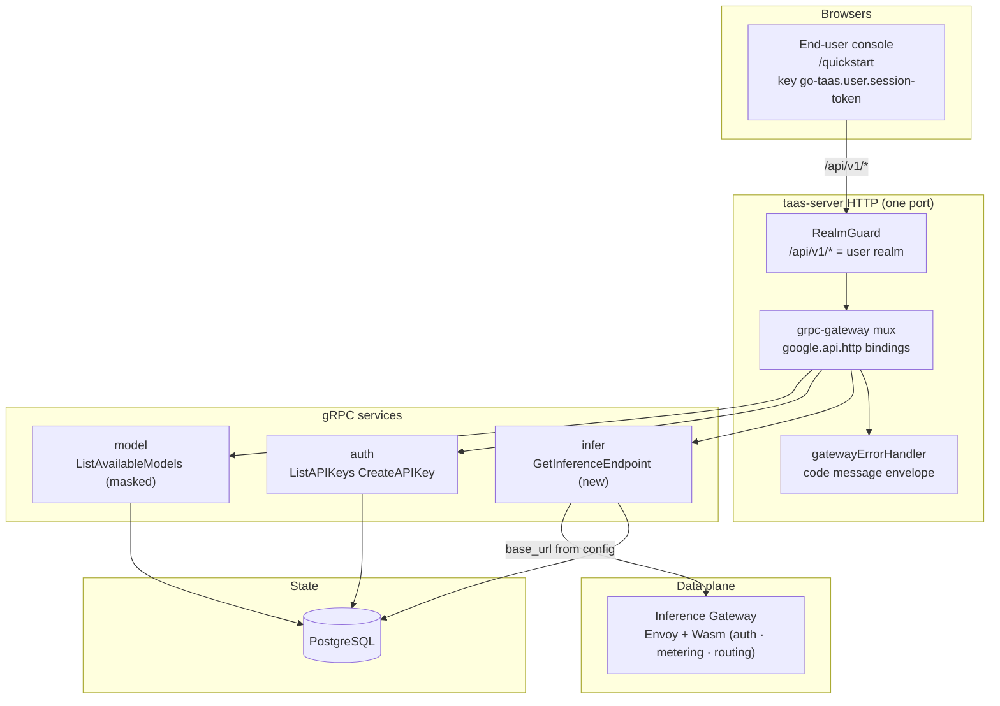
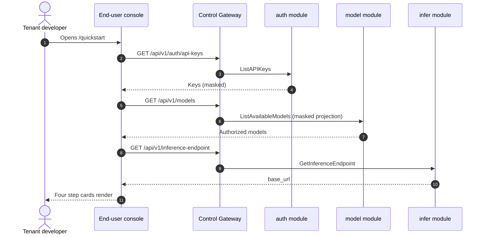
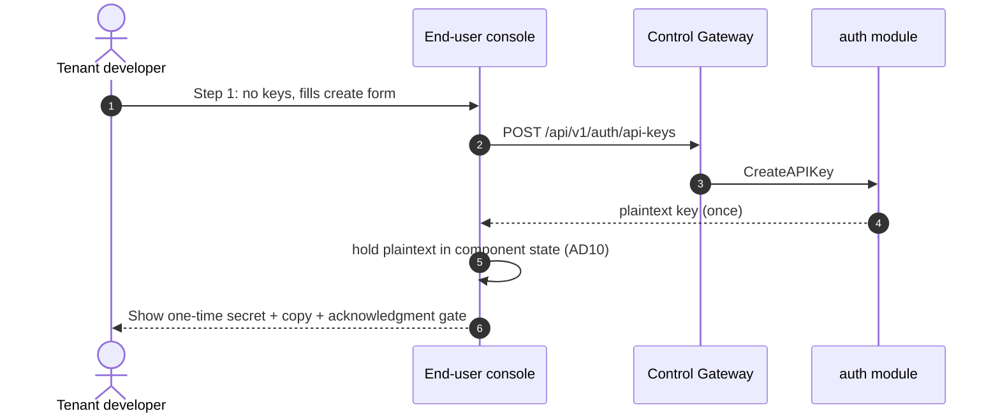
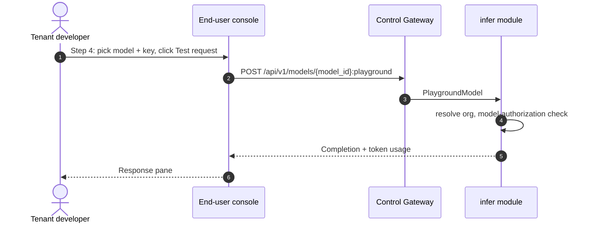

# SDK / Quickstart — Architecture and Detailed Design

| Attribute | Content |
| --- | --- |
| Feature point | SDK / Quickstart — an end-user page with OpenAI-compatible code snippets (Python / Node / curl) and API-key setup for consuming models (backlog row 21) |
| Document scope | Architecture and detailed design for the quickstart feature: the config-driven user-realm `GET /api/v1/inference-endpoint` read, the four reused RPCs with their exact `google.api.http` bindings per surface, the `QuickstartPage` in the end-user console and its route → API-prefix mapping, the sixth `UserShell` nav item, error handling, configuration, security, rollout, and a function-level task list per layer |
| Owning modules | `infer` (owns the new `GetInferenceEndpoint` read), `web/` end-user console (`QuickstartPage` in `UserShell`), `pkg/server` gateway (user-prefix binding), `auth` (API-key create/list, reused), `model` (masked model list, reused), `infer` (model-based playground, reused) |
| Related documents | [Requirement Analysis and UI/UX Design](../design/sdk-quickstart.md) · [Architecture Design](../design/architecture.md) §3.2 (data-plane gateway) and §3.3 (API-key authentication chain) · [Console Surface Separation](./console-surface-separation.md) (the end-user surface this page lives on, the masked `GET /api/v1/models` projection, the model-based playground) · [API Key Lifecycle Management](./api-key-management.md) (the create/list surface this page reuses) · [Model Catalog & One-Click Deployment](./model-catalog-deployment.md) (the model list this page consumes) · [Request Logs & API Playground](./request-logs-playground.md) (the playground proxy this page reuses for the test request) |
| Status | Architecture complete, handed to the Developer agent |

---

## 1. Overview and Goals

go-taas sells OpenAI-compatible inference access to **Agents / SDKs**. A tenant who has been granted a model and issued an API key still faces a gap between "I have a key" and "my first inference call succeeds": the tenant must know the inference base URL, the exact model name to send, and the correct OpenAI-compatible request shape for their language. Today that knowledge lives nowhere in the product.

This feature adds the **SDK / Quickstart** page: a single end-user surface that walks a tenant through the four steps to a working integration — (1) create or select an API key, (2) pick a model they are authorized for, (3) copy the inference base URL, and (4) copy a pre-filled OpenAI-compatible snippet in Python, Node, or curl, then run a test request to prove the setup works. It is the smallest independently valuable increment of the "developer onboarding" story.

**Goals**:

- An end-user page `/quickstart` that walks a tenant through creating or selecting an API key, picking an authorized model, copying the inference base URL, and copying a pre-filled OpenAI-compatible snippet in Python / Node / curl, with a test request that proves the setup works (design D1–D6).
- A new config-driven user-realm read `GET /api/v1/inference-endpoint` returning `{ "base_url": "https://<inference-gateway>/v1" }` (design D3).
- The page → API surface table with exact prefixes (design D1, D3).
- Per-page interactive states including empty, error, disabled, and permission-denied.
- Numbered acceptance criteria testable in Nightwatch against the compose stack.

**Non-goals** (from the design, restated): a full SDK reference or API reference documentation site (the page ships three canonical snippets, not a docs portal); a language beyond Python / Node / curl (Go, Java, and others are future additions); a persistent "my integrations" list (the page is stateless — it does not save the tenant's chosen model or key); embedding the secret in a snippet for an existing key (design D4); a tenant-facing model catalog or price page; changing any data-plane (inference gateway) behaviour; an admin-surface variant of the quickstart page (design D1).

### 1.1 Reading order

Section 2 records the architecture decisions (including the points where the architecture refines the UI/UX design, with their rationale). Sections 3–4 are the component view and the request identity chain. Section 5 is the API contract. Sections 6–7 are the frontend architecture and the key sequences. Sections 8–11 are error handling, configuration, security and rollout. Sections 12–14 are the acceptance-criteria traceability, the function-level detailed design and the ordered implementation task list.

---

## 2. Architecture Decisions

AD1–AD8 restate the UI/UX design's decisions as implementation-level rules. **AD9–AD10 are refinements** the architecture adds, each marked as such with the design decision it refines; they preserve the design's intent and are recorded here so the Developer and Test agents implement one reading.

| # | Decision | Rationale |
| --- | --- | --- |
| AD1 | **The quickstart page is end-user surface only**: route `/quickstart`, API prefix `/api/v1/*`. It is added to the `UserShell` navigation as the first item, "Quickstart" (`user-nav-quickstart`), making six items total | Design D1/D8. Onboarding a tenant to consume models is a tenant self-service task, not an operator task; the operator never needs this page. Placing it first in the user nav matches the tenant's task flow (get started → keys → try → usage → billing) |
| AD2 | **The page is a linear four-step wizard**: (1) API key, (2) model, (3) base URL, (4) code snippets + test request. Each step is a card; the tenant completes them top to bottom | Design D2. Every surveyed product reduces quickstart to this sequence; a fixed order removes the "what do I do next" question |
| AD3 | **The inference base URL comes from a new config-driven user-realm endpoint `GET /api/v1/inference-endpoint`** returning `{ "base_url": "https://<inference-gateway>/v1" }`. It is never hardcoded in the client | Design D3. The inference gateway (Envoy) is a separate deployment-specific entry point; a constant would be wrong on every deployment. A small read keeps the value authoritative and testable |
| AD4 | **Snippets are templated with the selected model name and the base URL.** The API key is injected into the snippet **only if it was created in this page session** (held in component memory); for an existing key the snippet uses the placeholder `YOUR_API_KEY` | Design D4. The plaintext key is shown exactly once (feature #1, D1); persisting it into a snippet would violate that posture. Holding a just-created key in memory lets the "copy and run" path work immediately without storing the secret |
| AD5 | **A "Test request" action reuses the model-based playground proxy `POST /api/v1/models/{model_id}:playground`** to send a real metered inference and show the completion text and token usage | Design D5. The proxy already exists (feature #12, D14) and routes through the real metered path; reusing it avoids a new inference RPC and proves the setup works end to end |
| AD6 | **Language tabs Python / Node / curl**, each with a copy button; the active tab's snippet is pre-filled from the current model + base URL | Design D6. The standard trio; copy buttons are the primary interaction |
| AD7 | **The API-key step adapts to the tenant's state**: with no keys it shows an inline create form (reusing `POST /api/v1/auth/api-keys`); with keys it shows a selector plus a "Create new" link. The model step shows an empty state linking to the Playground when the organization is authorized for no models | Design D7. The page must be useful both to a brand-new tenant (no keys, no models) and to an existing one (pick an existing key and model) |
| AD8 | **The `UserShell` navigation gains a sixth item, "Quickstart", placed first.** The surface-separation feature's AC2 (which asserts exactly five `user-nav-*` items) must be updated to six | Design D8. A new onboarding page is a new nav destination; the earlier assertion is a snapshot that this feature intentionally extends |
| AD9 | **REFINEMENT of design D3 — the new `GetInferenceEndpoint` RPC lives in the `infer` module and reads the existing `infer.endpointBaseURL` configuration key.** The returned `base_url` is `strings.TrimSuffix(endpointBaseURL, "/") + "/v1"` | The design (D3) requires a config-driven value that is never a client constant. `infer` is the module that owns the inference gateway/endpoint concept: it already reads `endpointBaseURL` (the controller composes per-service endpoint URLs from it, `internal/controller/reconciler.go`), and the load-test runner drives those endpoints. `infer.endpointBaseURL` is the single source of truth for the inference gateway's public base URL, so reusing it avoids a second, drift-prone config key. The quickstart base URL is the gateway root (`<base>/v1`), which is exactly `endpointBaseURL` with `/v1` appended — the data-plane gateway routes by model, so the tenant hits the gateway root, not a per-service path. A missing/empty `endpointBaseURL` returns the standard internal error (500), which the page maps to "Could not load the inference endpoint." |
| AD10 | **REFINEMENT of design D4 — the just-created plaintext key is held in `QuickstartPage` component state (a `useState`), never in a module-level variable or any storage.** It is cleared when the page unmounts or the tenant navigates away | The design (D4) requires the plaintext to be held "in component memory" for snippet injection. Component state is the smallest faithful reading: it is scoped to the page instance, is not persisted to `localStorage`/`sessionStorage`, and is dropped on unmount. A module-level variable would leak across page instances and survive navigation; any storage would violate the "shown once" posture. The key is injected into the snippet template only while it is in state; selecting an existing key sets the snippet key to `YOUR_API_KEY` |

---

## 3. Component View

### 3.1 Ownership

| Layer / component | Owns | Changes in this feature |
| --- | --- | --- |
| **Static bundle (SPA)** | One Vite bundle (`web/dist`), embedded into `taas-server` at `pkg/server/console/`; served by the gateway's SPA fallback | A new `QuickstartPage`, a sixth `UserShell` nav item, and the `/quickstart` route registration in `App.tsx` |
| **Gateway (`pkg/server`)** | HTTP composition: `RealmGuard` → `withConsole` → `runtime.ServeMux`; the unified error renderer; the SPA fallback | No change — the new RPC binds under `/api/v1/inference-endpoint` (user), and the realm guard already treats that prefix as the user surface |
| **grpc-gateway mux** | Path → RPC routing from `google.api.http` annotations | A new binding for `GetInferenceEndpoint` (Section 5) |
| **`infer`** | Inference-service lifecycle, endpoints, the playground proxy seam, the load-test runner | The new `GetInferenceEndpoint` RPC reading `infer.endpointBaseURL` (AD9) |
| **`auth`** | API keys | No change — `ListAPIKeys` / `CreateAPIKey` are reused unchanged |
| **`model`** | Model catalog, versions, tenant authorization grants | No change — `ListAvailableModels` (masked) is reused unchanged |
| **`pkg/errors`** | Code blocks per module | No new codes — the feature reuses existing codes (Section 8) |
| **`pkg/config`** | The merged configuration tree | No new key — `infer.endpointBaseURL` is reused (AD9) |

### 3.2 Runtime component view



### 3.3 Request identity chain

The quickstart page is end-user surface only (AD1). The chain is:

1. `RealmGuard` (HTTP, `pkg/server/realm.go`) — path prefix decides the expected realm. All quickstart RPCs bind under `/api/v1/*` → expected realm `user`. With no `Authorization` header: pass through (transitional, feature-17 AD4). With a header: resolve the session realm from Redis; mismatch → 10038, unknown/expired/realm-less → 10027.
2. grpc-gateway mux — routes by the annotated path and forwards `authorization` and `x-organization-id`.
3. Service handler — for a session-bearing call, `SessionActiveOrg` (implemented by `auth`) makes the session's active organization authoritative and ignores `X-Organization-Id`; without a session, `resolveOrganizationID` reads the transitional header and returns 10001 when it is absent or empty.

The new `GetInferenceEndpoint` is a **user-realm read that requires no organization context** (design §6 contract note 1): it returns the configured base URL regardless of the caller's organization. It is reached only through the user prefix, so the realm guard already guarantees a user-realm session (or transitional access). The reused RPCs keep their existing identity semantics: `ListAPIKeys` / `CreateAPIKey` are tenant-scoped (the caller's organization), `ListAvailableModels` applies the model-authorization default-allow rule (feature #13), and `PlaygroundModel` resolves the org and applies the same rule.

---

## 4. The Inference-Endpoint Read

### 4.1 Why it lives in `infer`

The design doc leaves the home of the new read open ("likely lives in `pkg/server` or a small service; decide and justify"). The architecture places it in the **`infer` module** (AD9) for three reasons:

1. **Domain ownership**: the inference gateway and its endpoints are `infer`'s responsibility (architecture §2.4 — "endpoint registration for the data-plane gateway"). A read that returns the inference gateway's public base URL is an `infer` concern, not a gateway-composition concern.
2. **Config access**: `infer` already reads `infer.endpointBaseURL` (via `config.GetConfig()` in `status_consumer.go` / `concurrency_consumer.go`). Placing the read in `infer` keeps the config read next to the config's owner.
3. **No new service**: a single read does not justify a new service or a new module. `pkg/server` is the gateway composition layer and owns no business RPCs; adding a business RPC there would break the layering. `infer` is the smallest module that owns the concept.

### 4.2 The read

`GetInferenceEndpoint` reads `config.GetConfig().Infer.EndpointBaseURL` and returns `{ "base_url": strings.TrimSuffix(endpointBaseURL, "/") + "/v1" }`. When `endpointBaseURL` is empty, it returns the standard internal error (500, `CodeInternal`), which the page maps to "Could not load the inference endpoint." (design §6 contract note 1). No organization context, no new error code.

---

## 5. API Contract

### 5.1 RPC Surface

All quickstart reads are user-realm (`/api/v1/*`). Most are reused; one new endpoint is added.

| RPC | HTTP | Prefix | Status | Purpose |
| --- | --- | --- | --- | --- |
| `ListAPIKeys` | `GET /api/v1/auth/api-keys` | user | **reused** (feature #1) | The organization's keys for the key selector |
| `CreateAPIKey` | `POST /api/v1/auth/api-keys` | user | **reused** (feature #1) | Inline key creation; returns the plaintext once |
| `ListAvailableModels` | `GET /api/v1/models` | user | **reused** (feature #17 D15) | Masked model list (`model_id`, `name`, `latest_version`) for the model selector |
| `GetInferenceEndpoint` | `GET /api/v1/inference-endpoint` | user | **new** | Returns `{ "base_url": "https://<inference-gateway>/v1" }` from configuration (AD9) |
| `PlaygroundModel` | `POST /api/v1/models/{model_id}:playground` | user | **reused** (feature #12 D14) | Test request; real metered inference with the selected key |

### 5.2 Proto contract

```proto
// Additive addition to proto/taas/infer/v1/infer.proto, on
// InferServiceService.

  // GetInferenceEndpoint returns the tenant-facing inference base URL
  // ("<inference-gateway>/v1") from server configuration. It is never
  // a client constant. Requires no organization context; a missing
  // configuration returns the standard internal error.
  // User-surface API: served under /api/v1.
  rpc GetInferenceEndpoint(GetInferenceEndpointRequest) returns (GetInferenceEndpointResponse) {
    option (google.api.http) = {get: "/api/v1/inference-endpoint"};
  }

message GetInferenceEndpointRequest {}

message GetInferenceEndpointResponse {
  taas.common.v1.Response response = 1;
  // base_url is the OpenAI-compatible inference base URL, e.g.
  // "https://infer.example.com/v1". The tenant appends
  // "/chat/completions" to reach the completion endpoint.
  string base_url = 2;
}
```

### 5.3 Wire format (established conventions)

- Success responses are HTTP 200; business errors render as `{"code": <int>, "message": "..."}`.
- `GetInferenceEndpoint` is a **user-realm read with no organization context** (design §6 contract note 1): it returns the configured base URL regardless of the caller's organization. It is reached only through the user prefix, so the realm guard already guarantees a user-realm session (or transitional access).
- The reused RPCs keep their existing wire semantics unchanged: `ListAPIKeys` supports `active_only` and pagination; `CreateAPIKey` returns the plaintext `api_key` once; `ListAvailableModels` returns the masked `AvailableModel` projection; `PlaygroundModel` takes `model_id` (path), `api_key_id`, `prompt`, `temperature`, `max_tokens` and returns `completion`, `prompt_tokens`, `completion_tokens`, `latency_ms`.

### 5.4 Validation matrix

| RPC | Check | Failure code | Canonical message |
| --- | --- | --- | --- |
| `GetInferenceEndpoint` | `infer.endpointBaseURL` is non-empty | 500 `CodeInternal` | internal error (mapped to "Could not load the inference endpoint.") |
| `ListAPIKeys` | (reused) | — | unchanged |
| `CreateAPIKey` | (reused) | — | unchanged |
| `ListAvailableModels` | (reused) | — | unchanged |
| `PlaygroundModel` | (reused) | — | unchanged |

---

## 6. Frontend Architecture

### 6.1 Page → route → API-prefix mapping

| Page | Surface | Route | API prefix | Component |
| --- | --- | --- | --- | --- |
| Quickstart | user | `/quickstart` | `/api/v1/*` | `QuickstartPage` |

The page calls exactly five `/api/v1/*` routes (design FR7.2):

| Call | Route | Purpose |
| --- | --- | --- |
| List keys | `GET /api/v1/auth/api-keys?page.limit=100` | Step 1 key selector / empty-state detection |
| Create key | `POST /api/v1/auth/api-keys` | Step 1 inline create form |
| List models | `GET /api/v1/models?page.limit=100` | Step 2 model selector / empty-state detection |
| Get endpoint | `GET /api/v1/inference-endpoint` | Step 3 base URL |
| Test request | `POST /api/v1/models/{model_id}:playground` | Step 4 test request |

### 6.2 Navigation placement

- **End-user console** (`UserShell`, feature #17): a new first nav item **Quickstart** → `/quickstart`, `data-testid="user-nav-quickstart"`, placed before Usage. The `USER_NAV_ITEMS` array gains the item at index 0, making six items total (AD8).
- **Admin console** (`AdminShell`): no change — the quickstart page is end-user surface only (AD1).

### 6.3 Shared components and state

- **`useApi`** (feature #17 convention): the page uses `useApi()` from `../../surface` to get the realm-scoped API client. All calls go through the user-realm client, which refuses a path whose prefix does not belong to the user realm (a runtime mirror of the gateway realm guard).
- **`useOrg`** (feature #17): the page reads the active organization id for the transitional header (`X-Organization-Id`) when no session is present.
- **`ErrorBanner`** (feature #17): the page renders an `ErrorBanner` with the mapped copy and a Retry button on a failed load (design FR6.3).
- **`data-testid` convention**: every control carries a `kebab-case` `data-testid` (`quickstart-key-select`, `quickstart-model-select`, `quickstart-base-url-copy`, `quickstart-copy`, `quickstart-test`, …) per design FR6.2.
- **API client** (`web/src/api.ts`): a new `InferenceEndpointResponse` type and a `getInferenceEndpoint` helper (or a direct `api.get` call following the existing page pattern). The reused APIs are called directly with paths, matching the existing `ApiKeysPage` / `PlaygroundPage` pattern — no new wrapper functions are required.

### 6.4 Auth guard per surface

- The `QuickstartPage` calls only `/api/v1/*` routes. The `UserShell` route guard requires a user-realm session; a session without the required realm/session receives 10027/10038 and the shell redirects per feature #17 FR4.3. An organization that is disabled/gone receives 10017/10005; a model the organization is not authorized for receives 10105 and the model step shows the "no authorized models" empty state.
- The page contains no `/api/v1/admin/*` string (feature #17, D8).

---

## 7. Key Sequences

### 7.1 Page load (keys, models, base URL)



### 7.2 Create a key inline



### 7.3 Test request



---

## 8. Error Handling

| Condition | Code | Constant | Notes |
| --- | --- | --- | --- |
| No session / expired / realm mismatch | 10027 / 10038 | `CodeSessionInvalid` / `CodeRealmMismatch` | Shell redirect per feature #17 FR4.3 |
| Organization gone / disabled | 10005 / 10017 | `CodeOrganizationNotFound` / `CodeOrganizationDisabled` | Reused by the page's copy |
| Model not authorized for the organization | 10105 | `CodeModelUnauthorized` | The model step's empty state |
| No ready inference service for the model | 10301 / 10303 | `CodeInferServiceNotFound` / `CodeInferServiceStateInvalid` | Surfaced inline in the test-response pane |
| Inference endpoint not configured | 500 | `CodeInternal` | Via error normalization; mapped to "Could not load the inference endpoint." |

No new error codes are added in this feature (design §6: "no new codes; all reused"). The page maps business codes to sentences via the console's centralized mapping (design FR6.3), never showing a bare code.

---

## 9. Configuration Additions

No new configuration key is added. The feature reuses the existing **`infer.endpointBaseURL`** key (AD9):

| Key | Default | Description |
| --- | --- | --- |
| `infer.endpointBaseURL` | `""` | The inference gateway's public base URL. The quickstart `base_url` is `strings.TrimSuffix(endpointBaseURL, "/") + "/v1"`. Empty means the endpoint read returns the standard internal error |

Where it lives:

- **`configs/config.yaml`** and **`configs/server.yaml`**: the `infer.endpointBaseURL` key already exists (currently `""`). The compose stack and deployments set it to the inference gateway's public address.
- **`.env` key**: `CONFIG_INFER_ENDPOINTBASEURL` (the `CONFIG_` env prefix + `.` → `_` replacer, `pkg/config/configuration.go`).
- **Compose stack env** (`deploy/compose/docker-compose.yaml`): `CONFIG_INFER_ENDPOINTBASEURL: https://infer.example.com` (or the compose-network address of the inference gateway).

The value is read by the `infer` module via `config.GetConfig().Infer.EndpointBaseURL` (the established pattern in `status_consumer.go` / `concurrency_consumer.go`).

---

## 10. Security Considerations

- **Surface separation**: the quickstart page and all its RPCs bind under `/api/v1/*` (user surface); the realm guard enforces the session realm per prefix (Section 3.3). The page contains no `/api/v1/admin/*` string (feature #17).
- **No secret persistence**: the just-created plaintext key is held in `QuickstartPage` component state only (AD10), never in `localStorage`/`sessionStorage` or a module-level variable. It is dropped on unmount. An existing key's snippet uses the `YOUR_API_KEY` placeholder (AD4).
- **Base URL from configuration, never the client**: the base URL comes from `infer.endpointBaseURL` server-side (AD9); the client never hardcodes or supplies it.
- **Reused authorization**: the reused RPCs keep their existing authorization — `ListAPIKeys`/`CreateAPIKey` are tenant-scoped, `ListAvailableModels` and `PlaygroundModel` apply the model-authorization default-allow rule (10105). The quickstart page cannot read another organization's keys or models.
- **No new attack surface**: the feature adds one read-only RPC with no organization context and no mutation; it introduces no new privilege or data-plane behaviour.

---

## 11. Rollout / Upgrade Notes

- **Schema**: no schema change — the feature adds no table and no column (design §6: "data model should be none new — confirm"; confirmed).
- **Deploy `taas-server` alone**: the new `GetInferenceEndpoint` RPC rides the existing `infer` service registration; no new deployment, no new MQ subject.
- **Configuration**: deployments must set `infer.endpointBaseURL` (or `CONFIG_INFER_ENDPOINTBASEURL`) for the quickstart base URL to be non-empty. Until it is set, the endpoint read returns the standard internal error and the page shows "Could not load the inference endpoint."
- **Backward compatibility**: existing consumers ignore the new RPC safely. The `UserShell` nav gains a sixth item; the surface-separation AC2 assertion is updated to six items (AD8).
- **Frontend**: the new `QuickstartPage` and the `/quickstart` route ship in the same SPA bundle; no separate frontend deployment.

---

## 12. Acceptance-Criteria Traceability

| Criterion | Where it is satisfied |
| --- | --- |
| AC1 — `GET /api/v1/inference-endpoint` returns the configured `base_url`; matches server config, not a client constant | Section 4.2, Section 5.2, FVT |
| AC2 — `/quickstart` renders inside `UserShell` with the four step cards from the first successful load | Section 6.1/6.2, E2E |
| AC3 — no keys → inline create form; creating a key shows the one-time secret + acknowledgment gate; plaintext injected into the snippet | Section 6.3, Section 7.2, E2E |
| AC4 — existing keys → key selector; selecting an existing key sets the snippet key to `YOUR_API_KEY` | Section 6.3, AD4, E2E |
| AC5 — Step 2 lists authorized models (masked); selecting a model updates the snippet's `model` field | Section 6.1, E2E |
| AC6 — Step 3 shows the base URL from `GET /api/v1/inference-endpoint` with a working copy control | Section 6.1, E2E |
| AC7 — Step 4 renders Python / Node / curl tabs; each snippet templated with model + base URL; copy buttons; tab switch swaps the snippet | Section 6.3, E2E |
| AC8 — Test request disabled until model + key selected; when enabled calls `POST /api/v1/models/{model_id}:playground` and shows completion + token usage; failed call renders error inline | Section 6.1, Section 7.3, E2E |
| AC9 — no authorized models → "No models are available to your organization yet" empty state with a link to `/playground` | Section 6.3, E2E |
| AC10 — failed load → `ErrorBanner` with mapped copy + Retry; failed step keeps last good data with "Showing stale data" banner | Section 6.3, E2E |
| AC11 — unauthorized model → 10105 and the model step shows the empty state; session without the required realm/session redirects per feature #17 FR4.3 | Section 6.4, E2E + FVT |
| AC12 — quickstart reachable only on the end-user surface: route `/quickstart`, `user-nav-quickstart`, every API call uses `/api/v1/*` with no `/api/v1/admin/*` string | Section 6.1/6.4, E2E (surface separation) |
| AC13 — `UserShell` nav shows six items including `user-nav-quickstart` first; surface-separation AC2 updated to six and still passes | Section 6.2, AD8, E2E (regression) |

---

## 13. Detailed Design (function-level)

### 13.1 Proto (`proto/taas/infer/v1/infer.proto`)

Add the `GetInferenceEndpoint` RPC and the `GetInferenceEndpointRequest` / `GetInferenceEndpointResponse` messages from Section 5.2 to `InferServiceService`. Regenerate with `buf generate`.

### 13.2 `services/infer` — service

New file `inference_endpoint.go`:

- `GetInferenceEndpoint(ctx, req) (*inferv1.GetInferenceEndpointResponse, error)` — read `config.GetConfig().Infer.EndpointBaseURL`; if empty, return `apierrors.New(apierrors.CodeInternal)`; else return `{ base_url: strings.TrimSuffix(endpointBaseURL, "/") + "/v1" }` (AD9). No organization context.

### 13.3 `services/infer` — wiring

- `service.go`: register the new RPC in `AttachToServer` (the `inferv1.RegisterInferServiceServiceServer` call) and in `GetServiceHandlerRegisterFn` (the `inferv1.RegisterInferServiceServiceHandlerFromEndpoint` call). No new seam is required — the read uses `config.GetConfig()` directly.

### 13.4 `web/src` — end-user console

- `pages/user/QuickstartPage.tsx` — the four-step wizard:
  - Step 1 (API key): load keys via `GET /api/v1/auth/api-keys?page.limit=100`; with no keys render the inline create form (`quickstart-key-name`, `quickstart-key-expiry`) calling `POST /api/v1/auth/api-keys`; on success show the one-time secret (`quickstart-created-secret`, `quickstart-created-copy`) with the acknowledgment gate (`quickstart-created-confirm`) and hold the plaintext in component state (AD10). With keys render the selector (`quickstart-key-select`) plus a "Create new" link (`quickstart-key-create`); selecting an existing key sets the snippet key to `YOUR_API_KEY`.
  - Step 2 (model): load models via `GET /api/v1/models?page.limit=100`; render the selector (`quickstart-model-select`) or the "no authorized models" empty state (`quickstart-no-models`) with a link to `/playground`.
  - Step 3 (base URL): load via `GET /api/v1/inference-endpoint`; render the monospace field (`quickstart-base-url`) with a copy control (`quickstart-base-url-copy`).
  - Step 4 (code & test): language tabs (`quickstart-lang-python`, `quickstart-lang-node`, `quickstart-lang-curl`), the templated snippet (`quickstart-snippet`) with a copy button (`quickstart-copy`), and the Test request action (`quickstart-test`) calling `POST /api/v1/models/{model_id}:playground` with the selected key and a fixed sample prompt, rendering the response in `quickstart-test-response`.
  - Interactive states: default, loading (skeletons), empty, error (`ErrorBanner` + Retry + "Showing stale data"), disabled (snippet copy and Test request until model + key selected; Test request while in flight; create-key submit while in flight or name empty), permission-denied (10027/10038 redirect, 10017/10005, 10105 empty state).
- `api.ts` — a new `InferenceEndpointResponse` type (`{ response, base_url }`); the reused APIs are called directly with paths (matching the existing `ApiKeysPage` / `PlaygroundPage` pattern).
- `App.tsx` — register `/quickstart` in the `UserSurface` route tree (inside `UserShell`).
- `shells/UserShell.tsx` — add the **Quickstart** item (`user-nav-quickstart`) at index 0 of `USER_NAV_ITEMS` (AD8).

### 13.5 Tests

- **FVT** (`test/fvt/sdk_quickstart_fvt_test.go`): AC1 — `GET /api/v1/inference-endpoint` returns the configured `base_url`; empty config → 500. AC11 — the reused RPCs' error paths (10105, 10027/10038) are exercised through the quickstart surface.
- **E2E** (`test/e2e/tests/sdkQuickstart.js`, the `consoleSurfaces.js` pattern): against the compose stack — `/quickstart` renders the four step cards, the inline create form shows the one-time secret, the key selector sets `YOUR_API_KEY`, the model selector updates the snippet, the base URL renders with a copy control, the language tabs swap the snippet, the Test request shows completion + token usage, the empty states render, and the surface-separation assertions (AC12–AC13) hold. Update `test/e2e/tests/consoleSurfaces.js` AC2 to assert six `user-nav-*` items including `user-nav-quickstart` first (AD8).

---

## 14. Ordered Implementation Task List

1. `proto/taas/infer/v1/infer.proto`: add `GetInferenceEndpoint` + messages; `buf generate`.
2. `services/infer`: `inference_endpoint.go` (the read) + wiring in `service.go`.
3. `web/src`: `api.ts` `InferenceEndpointResponse` type; `pages/user/QuickstartPage.tsx`; `App.tsx` route; `UserShell.tsx` nav item.
4. `test/e2e/tests/consoleSurfaces.js`: update AC2 to six nav items.
5. FVT + E2E suites; run against the compose stack.