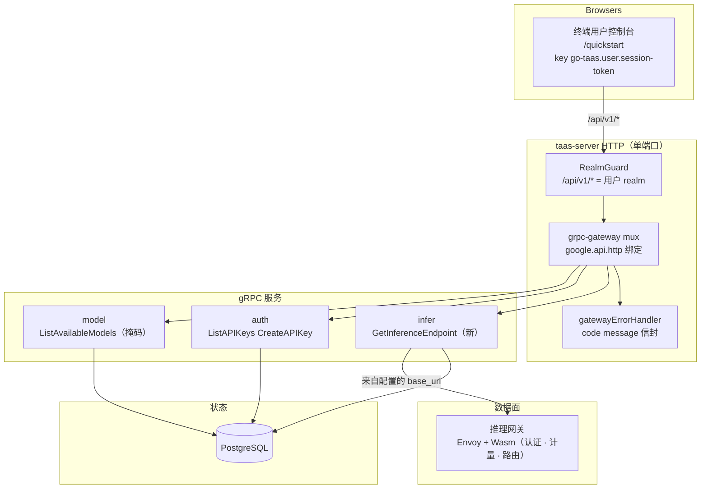
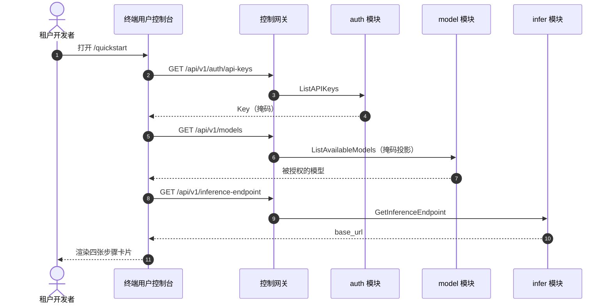
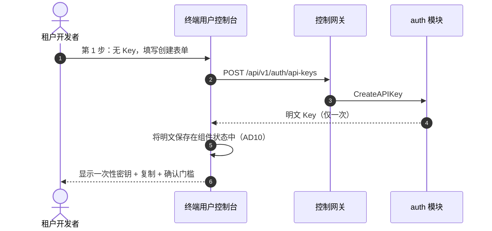
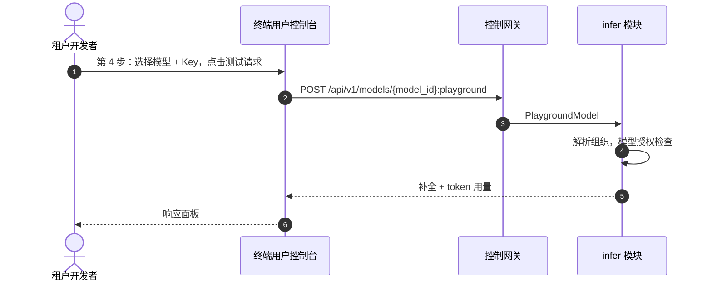

# SDK / 快速开始 — 架构与详细设计

| 属性 | 内容 |
| --- | --- |
| 功能点 | SDK / 快速开始 —— 面向终端用户的页面，提供 OpenAI 兼容的代码片段（Python / Node / curl）与 API Key 配置，用于消费模型（backlog 第 21 行） |
| 文档范围 | 快速开始功能的架构与详细设计：配置驱动的用户面 `GET /api/v1/inference-endpoint` 读取、四个复用的 RPC 及其按面的精确 `google.api.http` 绑定、终端用户控制台中的 `QuickstartPage` 及其路由 → API 前缀映射、`UserShell` 导航的第六项、错误处理、配置、安全、上线，以及按层的函数级任务清单 |
| 归属模块 | `infer`（拥有新的 `GetInferenceEndpoint` 读取）、`web/` 终端用户控制台（`UserShell` 中的 `QuickstartPage`）、`pkg/server` 网关（用户前缀绑定）、`auth`（API Key 创建/列表，复用）、`model`（掩码模型列表，复用）、`infer`（基于模型的 playground，复用） |
| 相关文档 | [需求分析与 UI/UX 设计](../design/sdk-quickstart.zh-cn.md) · [架构设计](../design/architecture.zh-cn.md) §3.2（数据面网关）与 §3.3（API Key 认证链）· [控制台面分离](./console-surface-separation.zh-cn.md)（本页面所在的终端用户面、掩码 `GET /api/v1/models` 投影、基于模型的 playground）· [API Key 生命周期管理](./api-key-management.zh-cn.md)（本页面复用的创建/列表面）· [模型目录与一键部署](./model-catalog-deployment.zh-cn.md)（本页面消费的模型列表）· [请求日志与 API Playground](./request-logs-playground.zh-cn.md)（本页面测试请求复用的 playground 代理） |
| 状态 | 架构完成，已交接给开发者智能体 |

---

## 1. 概述与目标

go-taas 向 **智能体 / SDK** 提供 OpenAI 兼容的推理访问。一个已被授予模型、并已签发 API Key 的租户，仍然面临"我有 Key"与"我的第一次推理调用成功"之间的鸿沟：租户必须知道推理 base URL、要发送的确切模型名，以及符合其语言的 OpenAI 兼容请求格式。今天这些知识在产品中无处可寻。

本功能新增 **SDK / 快速开始** 页面：一个单一的终端用户面，引导租户完成到可用集成的四个步骤——(1) 创建或选择 API Key，(2) 选择其被授权的模型，(3) 复制推理 base URL，(4) 复制 Python、Node 或 curl 的预填充 OpenAI 兼容代码片段，然后运行测试请求以证明配置可用。这是"开发者上手"故事中最小、可独立交付的增量。

**目标**：

- 终端用户页面 `/quickstart`，引导租户创建或选择 API Key、选择被授权的模型、复制推理 base URL，并复制 Python / Node / curl 的预填充 OpenAI 兼容片段，附带证明配置可用的测试请求（设计 D1–D6）。
- 新的配置驱动的用户面读取 `GET /api/v1/inference-endpoint`，返回 `{ "base_url": "https://<inference-gateway>/v1" }`（设计 D3）。
- 页面 → API 面映射表，带精确前缀（设计 D1、D3）。
- 每个页面的交互状态，包括空、错误、禁用、权限拒绝。
- 可在 compose 栈上通过 Nightwatch 测试的编号验收标准。

**非目标**（来自设计，重述）：完整的 SDK 参考或 API 参考文档站（页面只提供三个规范片段，不是文档门户）；Python / Node / curl 之外的语言（Go、Java 等是未来扩展）；持久的"我的集成"列表（页面是无状态的——它不保存租户选择的模型或 Key）；为已有 Key 的片段嵌入密钥（设计 D4）；面向租户的模型目录或价格页；改变任何数据面（推理网关）行为；快速开始页面的管理面变体（设计 D1）。

### 1.1 阅读顺序

第 2 节记录架构决策（包括架构对 UI/UX 设计的细化点及其理由）。第 3–4 节是组件视图与请求身份链。第 5 节是 API 契约。第 6–7 节是前端架构与关键时序。第 8–11 节是错误处理、配置、安全与上线。第 12–14 节是验收标准追溯、函数级详细设计与有序实现任务清单。

---

## 2. 架构决策

AD1–AD8 将 UI/UX 设计的决策重述为实现级规则。**AD9–AD10 是架构新增的细化**，每个都标注了其细化的设计决策；它们保留设计的意图，并在此记录，使开发者与测试智能体按同一解读实现。

| # | 决策 | 理由 |
| --- | --- | --- |
| AD1 | **快速开始页面仅属于终端用户面**：路由 `/quickstart`，API 前缀 `/api/v1/*`。它作为第一项加入 `UserShell` 导航，名为"快速开始"（`user-nav-quickstart`），共六项 | 设计 D1/D8。引导租户消费模型是租户自助任务，不是运维任务；运维人员永远不需要此页面。把它放在用户导航首位符合租户的任务流（开始 → Key → 试用 → 用量 → 账单） |
| AD2 | **页面是线性四步向导**：(1) API Key，(2) 模型，(3) base URL，(4) 代码片段 + 测试请求。每一步是一张卡片；租户自上而下完成 | 设计 D2。每个被调研的产品都把快速开始简化为这个序列；固定顺序消除了"下一步做什么"的问题 |
| AD3 | **推理 base URL 来自新的配置驱动的用户面端点 `GET /api/v1/inference-endpoint`**，返回 `{ "base_url": "https://<inference-gateway>/v1" }`。客户端绝不硬编码 | 设计 D3。推理网关（Envoy）是独立的、部署相关的入口；常量在每次部署上都是错的。一个小的读取让该值权威且可测试 |
| AD4 | **片段用所选模型名和 base URL 模板化。** 仅当 Key 是在本页面会话中创建时，才把 API Key 注入片段（保存在组件内存中）；对于已有 Key，片段使用占位符 `YOUR_API_KEY` | 设计 D4。明文 Key 只显示一次（功能 #1，D1）；把它持久化进片段会违反该姿态。在内存中持有刚创建的 Key，让"复制并运行"路径无需存储密钥即可立即工作 |
| AD5 | **"测试请求"动作复用基于模型的 playground 代理 `POST /api/v1/models/{model_id}:playground`**，发送一次真实的计量推理并显示补全文本和 token 用量 | 设计 D5。该代理已存在（功能 #12，D14），并走真实的计量路径；复用它避免新增推理 RPC，并端到端证明配置可用 |
| AD6 | **语言标签页 Python / Node / curl**，每个都有复制按钮；当前标签页的片段由当前模型 + base URL 预填充 | 设计 D6。标准三件套；复制按钮是主要交互 |
| AD7 | **API Key 步骤适配租户状态**：无 Key 时显示内联创建表单（复用 `POST /api/v1/auth/api-keys`）；有 Key 时显示选择器加"新建"链接。当组织未被授权任何模型时，模型步骤显示指向 Playground 的空状态 | 设计 D7。页面必须对全新租户（无 Key、无模型）和已有租户（选择已有 Key 和模型）都有用 |
| AD8 | **`UserShell` 导航新增第六项"快速开始"，置于首位。** 面分离功能的 AC2（断言恰好五个 `user-nav-*` 项）必须更新为六项 | 设计 D8。新的上手页面是新的导航目的地；此前的断言是快照，本功能有意扩展它 |
| AD9 | **细化设计 D3 —— 新的 `GetInferenceEndpoint` RPC 位于 `infer` 模块，读取现有的 `infer.endpointBaseURL` 配置键。** 返回的 `base_url` 为 `strings.TrimSuffix(endpointBaseURL, "/") + "/v1"` | 设计（D3）要求一个配置驱动的值，绝不能是客户端常量。`infer` 是拥有推理网关/端点概念的模块：它已经读取 `endpointBaseURL`（控制器用它组合每个服务的端点 URL，`internal/controller/reconciler.go`），load-test 运行器也驱动这些端点。`infer.endpointBaseURL` 是推理网关公共 base URL 的唯一事实来源，因此复用它可避免第二个易漂移的配置键。快速开始 base URL 是网关根（`<base>/v1`），正好是 `endpointBaseURL` 追加 `/v1`——数据面网关按模型路由，所以租户访问网关根，而非某个服务的路径。`endpointBaseURL` 缺失/为空时返回标准内部错误（500），页面将其映射为"无法加载推理端点。" |
| AD10 | **细化设计 D4 —— 刚创建的明文 Key 保存在 `QuickstartPage` 组件状态（`useState`）中，绝不放在模块级变量或任何存储中。** 页面卸载或租户离开时清除 | 设计（D4）要求明文"保存在组件内存中"用于片段注入。组件状态是最小的忠实解读：它限定于页面实例，不持久化到 `localStorage`/`sessionStorage`，卸载时丢弃。模块级变量会跨页面实例泄漏并在导航后存活；任何存储都会违反"仅显示一次"的姿态。仅当 Key 在状态中时才注入片段模板；选择已有 Key 会把片段 Key 设为 `YOUR_API_KEY` |

---

## 3. 组件视图

### 3.1 归属

| 层 / 组件 | 拥有 | 本功能的变更 |
| --- | --- | --- |
| **静态包（SPA）** | 一个 Vite 包（`web/dist`），嵌入 `taas-server` 的 `pkg/server/console/`；由网关的 SPA 回退提供 | 新的 `QuickstartPage`、`UserShell` 导航第六项、`App.tsx` 中的 `/quickstart` 路由注册 |
| **网关（`pkg/server`）** | HTTP 组合：`RealmGuard` → `withConsole` → `runtime.ServeMux`；统一错误渲染器；SPA 回退 | 无变更——新 RPC 绑定在 `/api/v1/inference-endpoint`（用户面），realm 守卫已将该前缀视为用户面 |
| **grpc-gateway mux** | 从 `google.api.http` 注解进行路径 → RPC 路由 | `GetInferenceEndpoint` 的新绑定（第 5 节） |
| **`infer`** | 推理服务生命周期、端点、playground 代理接缝、load-test 运行器 | 读取 `infer.endpointBaseURL` 的新 `GetInferenceEndpoint` RPC（AD9） |
| **`auth`** | API Key | 无变更——`ListAPIKeys` / `CreateAPIKey` 原样复用 |
| **`model`** | 模型目录、版本、租户授权授予 | 无变更——`ListAvailableModels`（掩码）原样复用 |
| **`pkg/errors`** | 各模块的错误码块 | 无新错误码——本功能复用现有错误码（第 8 节） |
| **`pkg/config`** | 合并后的配置树 | 无新键——复用 `infer.endpointBaseURL`（AD9） |

### 3.2 运行时组件视图



### 3.3 请求身份链

快速开始页面仅属于终端用户面（AD1）。链路如下：

1. `RealmGuard`（HTTP，`pkg/server/realm.go`）——路径前缀决定期望的 realm。所有快速开始 RPC 绑定在 `/api/v1/*` 下 → 期望 realm 为 `user`。无 `Authorization` 头：放行（过渡态，功能-17 AD4）。有头：从 Redis 解析会话 realm；不匹配 → 10038，未知/过期/无 realm → 10027。
2. grpc-gateway mux——按注解路径路由，并转发 `authorization` 与 `x-organization-id`。
3. 服务处理器——对于带会话的调用，`SessionActiveOrg`（由 `auth` 实现）使会话的活动组织成为权威并忽略 `X-Organization-Id`；无会话时，`resolveOrganizationID` 读取过渡态头，缺失或为空时返回 10001。

新的 `GetInferenceEndpoint` 是**无需组织上下文的用户面读取**（设计 §6 契约注 1）：无论调用方属于哪个组织，都返回配置的 base URL。它只能通过用户前缀到达，因此 realm 守卫已保证是用户 realm 会话（或过渡态访问）。复用的 RPC 保持其现有身份语义：`ListAPIKeys` / `CreateAPIKey` 是租户范围的（调用方组织），`ListAvailableModels` 应用模型授权默认允许规则（功能 #13），`PlaygroundModel` 解析组织并应用同一规则。

---

## 4. 推理端点读取

### 4.1 为何位于 `infer`

设计文档把新读取的归属留作开放（"可能位于 `pkg/server` 或一个小服务；请决定并论证"）。架构将其放在 **`infer` 模块**（AD9），理由有三：

1. **领域归属**：推理网关及其端点是 `infer` 的职责（架构 §2.4——"数据面网关的端点注册"）。返回推理网关公共 base URL 的读取是 `infer` 的关注点，而非网关组合的关注点。
2. **配置访问**：`infer` 已经读取 `infer.endpointBaseURL`（通过 `status_consumer.go` / `concurrency_consumer.go` 中的 `config.GetConfig()`）。把读取放在 `infer` 中，使配置读取紧邻其所有者。
3. **无需新服务**：单个读取不足以支撑新服务或新模块。`pkg/server` 是网关组合层，不拥有业务 RPC；在那里添加业务 RPC 会破坏分层。`infer` 是拥有该概念的最小模块。

### 4.2 读取

`GetInferenceEndpoint` 读取 `config.GetConfig().Infer.EndpointBaseURL`，返回 `{ "base_url": strings.TrimSuffix(endpointBaseURL, "/") + "/v1" }`。当 `endpointBaseURL` 为空时，返回标准内部错误（500，`CodeInternal`），页面将其映射为"无法加载推理端点。"（设计 §6 契约注 1）。无需组织上下文，无新错误码。

---

## 5. API 契约

### 5.1 RPC 面

所有快速开始读取都是用户面（`/api/v1/*`）。大部分复用；新增一个端点。

| RPC | HTTP | 前缀 | 状态 | 用途 |
| --- | --- | --- | --- | --- |
| `ListAPIKeys` | `GET /api/v1/auth/api-keys` | 用户 | **复用**（功能 #1） | 组织的 Key，用于 Key 选择器 |
| `CreateAPIKey` | `POST /api/v1/auth/api-keys` | 用户 | **复用**（功能 #1） | 内联创建 Key；明文仅返回一次 |
| `ListAvailableModels` | `GET /api/v1/models` | 用户 | **复用**（功能 #17 D15） | 掩码模型列表（`model_id`、`name`、`latest_version`），用于模型选择器 |
| `GetInferenceEndpoint` | `GET /api/v1/inference-endpoint` | 用户 | **新** | 从配置返回 `{ "base_url": "https://<inference-gateway>/v1" }`（AD9） |
| `PlaygroundModel` | `POST /api/v1/models/{model_id}:playground` | 用户 | **复用**（功能 #12 D14） | 测试请求；用所选 Key 发送真实计量推理 |

### 5.2 Proto 契约

```proto
// 对 proto/taas/infer/v1/infer.proto 的增量添加，位于
// InferServiceService 上。

  // GetInferenceEndpoint 从服务器配置返回面向租户的推理 base URL
  // （"<inference-gateway>/v1"）。它绝不是客户端常量。无需组织上下文；
  // 配置缺失时返回标准内部错误。
  // 用户面 API：在 /api/v1 下提供。
  rpc GetInferenceEndpoint(GetInferenceEndpointRequest) returns (GetInferenceEndpointResponse) {
    option (google.api.http) = {get: "/api/v1/inference-endpoint"};
  }

message GetInferenceEndpointRequest {}

message GetInferenceEndpointResponse {
  taas.common.v1.Response response = 1;
  // base_url 是 OpenAI 兼容的推理 base URL，例如
  // "https://infer.example.com/v1"。租户追加
  // "/chat/completions" 即可到达补全端点。
  string base_url = 2;
}
```

### 5.3 线上格式（既定约定）

- 成功响应为 HTTP 200；业务错误渲染为 `{"code": <int>, "message": "..."}`。
- `GetInferenceEndpoint` 是**无需组织上下文的用户面读取**（设计 §6 契约注 1）：无论调用方属于哪个组织，都返回配置的 base URL。它只能通过用户前缀到达，因此 realm 守卫已保证是用户 realm 会话（或过渡态访问）。
- 复用的 RPC 保持其现有线上语义不变：`ListAPIKeys` 支持 `active_only` 与分页；`CreateAPIKey` 一次性返回明文 `api_key`；`ListAvailableModels` 返回掩码的 `AvailableModel` 投影；`PlaygroundModel` 接收 `model_id`（路径）、`api_key_id`、`prompt`、`temperature`、`max_tokens`，返回 `completion`、`prompt_tokens`、`completion_tokens`、`latency_ms`。

### 5.4 校验矩阵

| RPC | 检查 | 失败码 | 规范消息 |
| --- | --- | --- | --- |
| `GetInferenceEndpoint` | `infer.endpointBaseURL` 非空 | 500 `CodeInternal` | 内部错误（映射为"无法加载推理端点。"） |
| `ListAPIKeys` | （复用） | — | 不变 |
| `CreateAPIKey` | （复用） | — | 不变 |
| `ListAvailableModels` | （复用） | — | 不变 |
| `PlaygroundModel` | （复用） | — | 不变 |

---

## 6. 前端架构

### 6.1 页面 → 路由 → API 前缀映射

| 页面 | 面 | 路由 | API 前缀 | 组件 |
| --- | --- | --- | --- | --- |
| 快速开始 | 用户 | `/quickstart` | `/api/v1/*` | `QuickstartPage` |

页面恰好调用五个 `/api/v1/*` 路由（设计 FR7.2）：

| 调用 | 路由 | 用途 |
| --- | --- | --- |
| 列出 Key | `GET /api/v1/auth/api-keys?page.limit=100` | 第 1 步 Key 选择器 / 空状态检测 |
| 创建 Key | `POST /api/v1/auth/api-keys` | 第 1 步内联创建表单 |
| 列出模型 | `GET /api/v1/models?page.limit=100` | 第 2 步模型选择器 / 空状态检测 |
| 获取端点 | `GET /api/v1/inference-endpoint` | 第 3 步 base URL |
| 测试请求 | `POST /api/v1/models/{model_id}:playground` | 第 4 步测试请求 |

### 6.2 导航位置

- **终端用户控制台**（`UserShell`，功能 #17）：新增第一项导航 **快速开始** → `/quickstart`，`data-testid="user-nav-quickstart"`，置于 Usage 之前。`USER_NAV_ITEMS` 数组在索引 0 处新增该项，共六项（AD8）。
- **管理控制台**（`AdminShell`）：无变更——快速开始页面仅属于终端用户面（AD1）。

### 6.3 共享组件与状态

- **`useApi`**（功能 #17 约定）：页面使用 `../../surface` 的 `useApi()` 获取 realm 范围的 API 客户端。所有调用都走用户 realm 客户端，它会拒绝前缀不属于用户 realm 的路径（网关 realm 守卫的运行时镜像）。
- **`useOrg`**（功能 #17）：无会话时，页面读取活动组织 id 用于过渡态头（`X-Organization-Id`）。
- **`ErrorBanner`**（功能 #17）：加载失败时，页面渲染带映射文案和重试按钮的 `ErrorBanner`（设计 FR6.3）。
- **`data-testid` 约定**：每个控件都带 `kebab-case` 的 `data-testid`（`quickstart-key-select`、`quickstart-model-select`、`quickstart-base-url-copy`、`quickstart-copy`、`quickstart-test` 等），遵循设计 FR6.2。
- **API 客户端**（`web/src/api.ts`）：新增 `InferenceEndpointResponse` 类型与 `getInferenceEndpoint` 辅助函数（或按现有页面模式直接 `api.get` 调用）。复用的 API 直接用路径调用，匹配现有 `ApiKeysPage` / `PlaygroundPage` 模式——无需新的包装函数。

### 6.4 各面的认证守卫

- `QuickstartPage` 只调用 `/api/v1/*` 路由。`UserShell` 路由守卫要求用户 realm 会话；无所需 realm/会话的会话收到 10027/10038，外壳按功能 #17 FR4.3 重定向。组织被禁用/不存在收到 10017/10005；组织未被授权的模型收到 10105，模型步骤显示"无可用模型"空状态。
- 页面不含任何 `/api/v1/admin/*` 字符串（功能 #17，D8）。

---

## 7. 关键时序

### 7.1 页面加载（Key、模型、base URL）



### 7.2 内联创建 Key



### 7.3 测试请求



---

## 8. 错误处理

| 条件 | 码 | 常量 | 说明 |
| --- | --- | --- | --- |
| 无会话 / 过期 / realm 不匹配 | 10027 / 10038 | `CodeSessionInvalid` / `CodeRealmMismatch` | 外壳按功能 #17 FR4.3 重定向 |
| 组织不存在 / 被禁用 | 10005 / 10017 | `CodeOrganizationNotFound` / `CodeOrganizationDisabled` | 页面文案复用 |
| 组织未被授权的模型 | 10105 | `CodeModelUnauthorized` | 模型步骤的空状态 |
| 模型无就绪推理服务 | 10301 / 10303 | `CodeInferServiceNotFound` / `CodeInferServiceStateInvalid` | 在测试响应面板内联显示 |
| 推理端点未配置 | 500 | `CodeInternal` | 经错误归一化；映射为"无法加载推理端点。" |

本功能不新增任何错误码（设计 §6："无新错误码；全部复用"）。页面通过控制台的集中映射把业务码映射为句子（设计 FR6.3），绝不显示裸码。

---

## 9. 配置新增

不新增配置键。本功能复用现有的 **`infer.endpointBaseURL`** 键（AD9）：

| 键 | 默认 | 描述 |
| --- | --- | --- |
| `infer.endpointBaseURL` | `""` | 推理网关的公共 base URL。快速开始 `base_url` 为 `strings.TrimSuffix(endpointBaseURL, "/") + "/v1"`。为空时端点读取返回标准内部错误 |

所在位置：

- **`configs/config.yaml`** 与 **`configs/server.yaml`**：`infer.endpointBaseURL` 键已存在（当前为 `""`）。compose 栈与部署将其设为推理网关的公共地址。
- **`.env` 键**：`CONFIG_INFER_ENDPOINTBASEURL`（`CONFIG_` 环境前缀 + `.` → `_` 替换器，`pkg/config/configuration.go`）。
- **compose 栈环境**（`deploy/compose/docker-compose.yaml`）：`CONFIG_INFER_ENDPOINTBASEURL: https://infer.example.com`（或推理网关的 compose 网络地址）。

该值由 `infer` 模块通过 `config.GetConfig().Infer.EndpointBaseURL` 读取（`status_consumer.go` / `concurrency_consumer.go` 中的既定模式）。

---

## 10. 安全考量

- **面分离**：快速开始页面及其所有 RPC 绑定在 `/api/v1/*`（用户面）下；realm 守卫按前缀强制会话 realm（第 3.3 节）。页面不含任何 `/api/v1/admin/*` 字符串（功能 #17）。
- **不持久化密钥**：刚创建的明文 Key 仅保存在 `QuickstartPage` 组件状态中（AD10），绝不放在 `localStorage`/`sessionStorage` 或模块级变量中。卸载时丢弃。已有 Key 的片段使用 `YOUR_API_KEY` 占位符（AD4）。
- **base URL 来自配置，绝不来自客户端**：base URL 在服务端来自 `infer.endpointBaseURL`（AD9）；客户端绝不硬编码或提供它。
- **复用的授权**：复用的 RPC 保持其现有授权——`ListAPIKeys`/`CreateAPIKey` 是租户范围的，`ListAvailableModels` 与 `PlaygroundModel` 应用模型授权默认允许规则（10105）。快速开始页面无法读取其他组织的 Key 或模型。
- **无新增攻击面**：本功能新增一个只读、无组织上下文、无变更的 RPC；不引入新特权或数据面行为。

---

## 11. 上线 / 升级说明

- **Schema**：无 schema 变更——本功能不新增表或列（设计 §6："数据模型应为无新增——确认"；已确认）。
- **仅部署 `taas-server`**：新的 `GetInferenceEndpoint` RPC 随现有 `infer` 服务注册；无新部署、无新 MQ subject。
- **配置**：部署必须设置 `infer.endpointBaseURL`（或 `CONFIG_INFER_ENDPOINTBASEURL`），快速开始 base URL 才非空。在设置前，端点读取返回标准内部错误，页面显示"无法加载推理端点。"。
- **向后兼容**：现有消费者可安全忽略新 RPC。`UserShell` 导航新增第六项；面分离 AC2 断言更新为六项（AD8）。
- **前端**：新的 `QuickstartPage` 与 `/quickstart` 路由随同一 SPA 包发布；无独立前端部署。

---

## 12. 验收标准追溯

| 标准 | 满足位置 |
| --- | --- |
| AC1 — `GET /api/v1/inference-endpoint` 返回配置的 `base_url`；与服务器配置一致，非客户端常量 | 第 4.2 节、第 5.2 节、FVT |
| AC2 — `/quickstart` 在 `UserShell` 内渲染，首次成功加载 Key、模型、base URL 后显示四张步骤卡片 | 第 6.1/6.2 节、E2E |
| AC3 — 无 Key → 内联创建表单；创建 Key 显示一次性密钥 + 确认门槛；明文注入片段 | 第 6.3 节、第 7.2 节、E2E |
| AC4 — 有已有 Key → Key 选择器；选择已有 Key 把片段 Key 设为 `YOUR_API_KEY` | 第 6.3 节、AD4、E2E |
| AC5 — 第 2 步列出被授权模型（掩码）；选择模型更新片段的 `model` 字段 | 第 6.1 节、E2E |
| AC6 — 第 3 步从 `GET /api/v1/inference-endpoint` 显示 base URL，带可用的复制控件 | 第 6.1 节、E2E |
| AC7 — 第 4 步渲染 Python / Node / curl 标签页；每个片段用模型 + base URL 模板化；复制按钮；切换标签页交换片段 | 第 6.3 节、E2E |
| AC8 — 选择模型 + Key 前测试请求禁用；启用后调用 `POST /api/v1/models/{model_id}:playground` 并显示补全 + token 用量；失败调用内联渲染错误 | 第 6.1 节、第 7.3 节、E2E |
| AC9 — 无被授权模型 → "您的组织暂无可用的模型"空状态，带指向 `/playground` 的链接 | 第 6.3 节、E2E |
| AC10 — 加载失败 → 带映射文案和重试的 `ErrorBanner`；失败步骤保留最后的好数据并显示"正在显示过期数据"横幅 | 第 6.3 节、E2E |
| AC11 — 未授权模型 → 10105，模型步骤显示空状态；无所需 realm/会话的会话按功能 #17 FR4.3 重定向 | 第 6.4 节、E2E + FVT |
| AC12 — 快速开始仅在终端用户面可达：路由 `/quickstart`、`user-nav-quickstart`、每个 API 调用使用 `/api/v1/*` 且无 `/api/v1/admin/*` 字符串 | 第 6.1/6.4 节、E2E（面分离） |
| AC13 — `UserShell` 导航显示六项，包括置于首位的 `user-nav-quickstart`；面分离 AC2 更新为六项且仍通过 | 第 6.2 节、AD8、E2E（回归） |

---

## 13. 详细设计（函数级）

### 13.1 Proto（`proto/taas/infer/v1/infer.proto`）

将第 5.2 节的 `GetInferenceEndpoint` RPC 与 `GetInferenceEndpointRequest` / `GetInferenceEndpointResponse` 消息添加到 `InferServiceService`。用 `buf generate` 重新生成。

### 13.2 `services/infer` — 服务

新文件 `inference_endpoint.go`：

- `GetInferenceEndpoint(ctx, req) (*inferv1.GetInferenceEndpointResponse, error)` —— 读取 `config.GetConfig().Infer.EndpointBaseURL`；为空时返回 `apierrors.New(apierrors.CodeInternal)`；否则返回 `{ base_url: strings.TrimSuffix(endpointBaseURL, "/") + "/v1" }`（AD9）。无组织上下文。

### 13.3 `services/infer` — 装配

- `service.go`：在 `AttachToServer`（`inferv1.RegisterInferServiceServiceServer` 调用）与 `GetServiceHandlerRegisterFn`（`inferv1.RegisterInferServiceServiceHandlerFromEndpoint` 调用）中注册新 RPC。无需新接缝——读取直接使用 `config.GetConfig()`。

### 13.4 `web/src` — 终端用户控制台

- `pages/user/QuickstartPage.tsx` —— 四步向导：
  - 第 1 步（API Key）：通过 `GET /api/v1/auth/api-keys?page.limit=100` 加载 Key；无 Key 时渲染内联创建表单（`quickstart-key-name`、`quickstart-key-expiry`），调用 `POST /api/v1/auth/api-keys`；成功后显示一次性密钥（`quickstart-created-secret`、`quickstart-created-copy`）与确认门槛（`quickstart-created-confirm`），并把明文保存在组件状态中（AD10）。有 Key 时渲染选择器（`quickstart-key-select`）加"新建"链接（`quickstart-key-create`）；选择已有 Key 把片段 Key 设为 `YOUR_API_KEY`。
  - 第 2 步（模型）：通过 `GET /api/v1/models?page.limit=100` 加载模型；渲染选择器（`quickstart-model-select`）或"无可用模型"空状态（`quickstart-no-models`），带指向 `/playground` 的链接。
  - 第 3 步（base URL）：通过 `GET /api/v1/inference-endpoint` 加载；渲染等宽字段（`quickstart-base-url`）与复制控件（`quickstart-base-url-copy`）。
  - 第 4 步（代码与测试）：语言标签页（`quickstart-lang-python`、`quickstart-lang-node`、`quickstart-lang-curl`）、模板化片段（`quickstart-snippet`）与复制按钮（`quickstart-copy`）、测试请求动作（`quickstart-test`），用所选 Key 和固定示例提示调用 `POST /api/v1/models/{model_id}:playground`，在 `quickstart-test-response` 中渲染响应。
  - 交互状态：默认、加载（骨架）、空、错误（`ErrorBanner` + 重试 + "正在显示过期数据"）、禁用（选择模型 + Key 前片段复制与测试请求禁用；测试进行中禁用；请求进行中且名称为空时创建 Key 提交禁用）、权限拒绝（10027/10038 重定向、10017/10005、10105 空状态）。
- `api.ts` —— 新增 `InferenceEndpointResponse` 类型（`{ response, base_url }`）；复用的 API 直接用路径调用（匹配现有 `ApiKeysPage` / `PlaygroundPage` 模式）。
- `App.tsx` —— 在 `UserSurface` 路由树中注册 `/quickstart`（在 `UserShell` 内）。
- `shells/UserShell.tsx` —— 在 `USER_NAV_ITEMS` 索引 0 处新增 **快速开始** 项（`user-nav-quickstart`）（AD8）。

### 13.5 测试

- **FVT**（`test/fvt/sdk_quickstart_fvt_test.go`）：AC1 —— `GET /api/v1/inference-endpoint` 返回配置的 `base_url`；空配置 → 500。AC11 —— 通过快速开始面演练复用 RPC 的错误路径（10105、10027/10038）。
- **E2E**（`test/e2e/tests/sdkQuickstart.js`，`consoleSurfaces.js` 模式）：在 compose 栈上——`/quickstart` 渲染四张步骤卡片、内联创建表单显示一次性密钥、Key 选择器设置 `YOUR_API_KEY`、模型选择器更新片段、base URL 带复制控件渲染、语言标签页交换片段、测试请求显示补全 + token 用量、空状态渲染、面分离断言（AC12–AC13）成立。更新 `test/e2e/tests/consoleSurfaces.js` AC2，断言六个 `user-nav-*` 项，包括置于首位的 `user-nav-quickstart`（AD8）。

---

## 14. 有序实现任务清单

1. `proto/taas/infer/v1/infer.proto`：添加 `GetInferenceEndpoint` + 消息；`buf generate`。
2. `services/infer`：`inference_endpoint.go`（读取）+ `service.go` 装配。
3. `web/src`：`api.ts` 的 `InferenceEndpointResponse` 类型；`pages/user/QuickstartPage.tsx`；`App.tsx` 路由；`UserShell.tsx` 导航项。
4. `test/e2e/tests/consoleSurfaces.js`：将 AC2 更新为六项导航。
5. FVT + E2E 套件；在 compose 栈上运行。