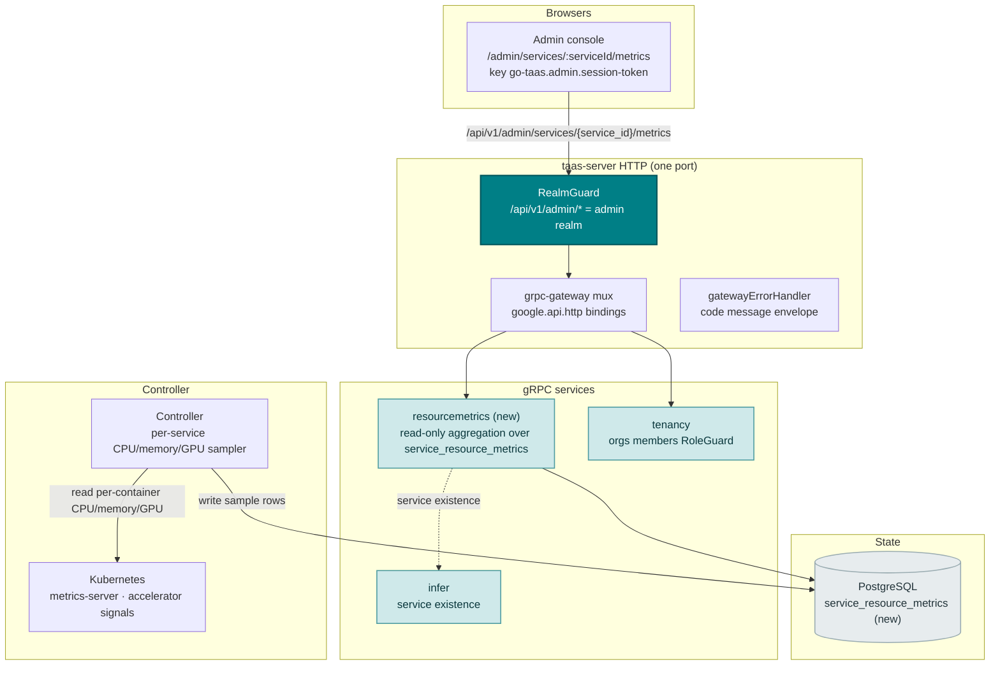
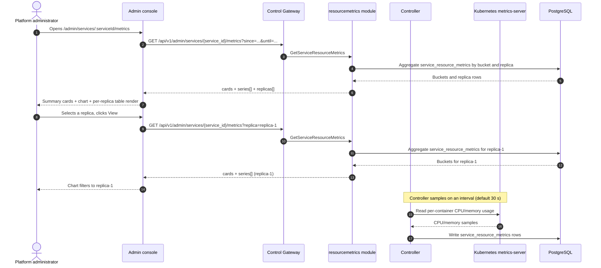
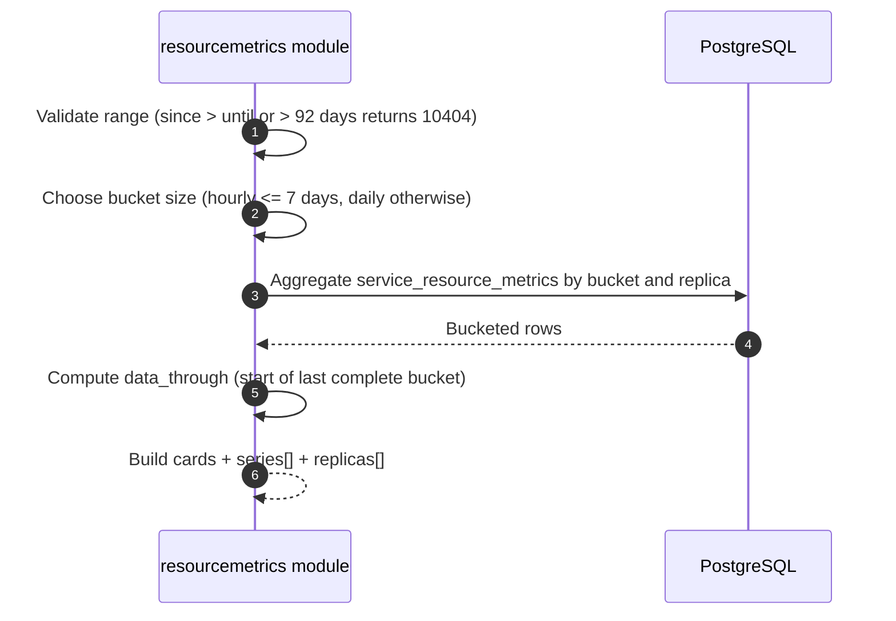

# Inference Service Resource Metrics — Architecture and Detailed Design

| Attribute | Content |
| --- | --- |
| Feature point | Inference service resource metrics — per-service CPU / memory / GPU utilization over time, with time-range filters and resource-usage charts (backlog row 37) |
| Document scope | Architecture and detailed design for feature-37: a new `resourcemetrics` module owning the read-only aggregation over the new `service_resource_metrics` table; the Controller's per-service CPU/memory/GPU sampler; the `taas.resourcemetrics.v1.ResourceMetricsService` proto with the `GetServiceResourceMetrics` RPC; the admin Service Metrics page (`/admin/services/:serviceId/metrics`); plus error handling, configuration, security, rollout, and function-level design per layer |
| Owning modules | New `resourcemetrics` module (`services/resourcemetrics`): the read-only aggregation over `service_resource_metrics`; `internal/controller` (read-only: per-service CPU/memory/GPU sampling from the Kubernetes metrics-server and the accelerator signals); `pkg/server` gateway (admin-prefix bindings); `web` admin console (`ServiceMetricsPage`) |
| Related documents | [Requirement Analysis and UI/UX Design](../design/service-resource-metrics.md) · [Architecture Design](../design/architecture.md) §2.4 (`infer`), §2.7 Controller, §4.2 one-click deployment flow · [Model Observability Dashboard](./model-observability.md) (the sibling read-only time-series aggregation and its bucket/freshness/range conventions) · [Accelerator Inventory & Health](./accelerator-inventory.md) (the sibling GPU health surface whose accelerator signals feed GPU utilization) · [Inference Service Logs Viewer](./service-logs-viewer.md) (the sibling per-service diagnostic surface and the Controller read pattern this feature reuses) · [Console Surface Separation](./console-surface-separation.md) (the two surfaces, the `AdminShell` conventions, the masked-projection rule) |
| Status | Architecture complete, handed to the Developer agent |

---

## 1. Overview and Goals

go-taas runs inference services as Kubernetes Deployments (model-catalog-deployment §4.2): the Controller creates the Deployment and Service, and the inference engine (vLLM, etc.) runs in the container. The model-observability feature (row 24) explains *how the model performs* (latency, throughput, error rate, tokens/sec) from `request_logs`, and the service-logs viewer (row 33) shows *what the engine printed*. What the operator still cannot answer is the infrastructure question: *is this service actually using the resources it was given?* When a service is slow, the operator cannot tell whether it is CPU-bound, memory-constrained, or GPU-starved without leaving the console and running `kubectl top` against the pods or querying a metrics endpoint.

This feature adds an **inference service resource metrics** page: per-service CPU / memory / GPU utilization over time, with time-range filters and resource-usage charts. It is the smallest independently valuable increment of Phase 4's operations surface: it turns "the service is slow" into "the service is CPU-saturated at 95% for the last hour while GPU sits at 20% — the bottleneck is compute, not the accelerator". It is a **read-only** aggregation layer — nothing in the inference, metering, or billing pipelines changes.

**Goals**: a new `resourcemetrics` module owning the read-only aggregation over the new `service_resource_metrics` table; the Controller's per-service CPU/memory/GPU sampler writing to that table; a `taas.resourcemetrics.v1.ResourceMetricsService` with the `GetServiceResourceMetrics` RPC (cards + time-series + per-replica breakdown); an admin Service Metrics page (`/admin/services/:serviceId/metrics`); new error code 12101 `CodeServiceMetricsInvalid`; the page → route → API-prefix table with the exact admin prefix; per-page interactive states including empty, error, and permission-denied; and numbered acceptance criteria testable in Nightwatch against the compose stack.

**Non-goals** (deferred, design §8): model-level performance metrics (latency/throughput/error rate — feature #24); request-level traces (feature #27); container logs (feature #33); a Prometheus/Grafana stack or PromQL query language (deliberately absent, D2); alerting or threshold notifications on resource usage (feature #26 consumes observability events in-console — out of scope here); a user-realm resource surface (deliberately absent, D1); resource-metrics retention / archival (future refinement).

### 1.1 Reading order of this document

Section 2 records the architecture decisions (AD1–AD10, mirroring the design's D1–D10). Sections 3–5 are the component view, data model, and API design. Section 6 is the frontend architecture (page → route → API-prefix table, auth guard). Sections 7–8 are the sequence flows and error handling. Sections 9–11 are configuration, security, and rollout. Sections 12–14 are the acceptance-criteria traceability, the function-level detailed design, and the ordered implementation task list.

---

## 2. Architecture Decisions

| # | Decision | Rationale |
| --- | --- | --- |
| AD1 | **The resource metrics page lives on the admin surface only**: `/admin/services/:serviceId/metrics` + `/api/v1/admin/services/{service_id}/metrics/*`. There is **no end-user surface** — per-service CPU/memory/GPU utilization is operator-orchestration internals (feature #17's masked-projection rule); tenants get model-level performance (row 24), not pod resource internals | Design D1. The operator needs infrastructure utilization to debug capacity and bottlenecks; tenants need model performance, not pod internals. Consistent with the admin-only accelerator inventory (feature #18), system status (feature #30), and service logs (feature #33) |
| AD2 | **CPU and memory are sampled from the Kubernetes metrics-server** (`metrics.k8s.io`) through the Controller, and **GPU utilization from the accelerator signals** (feature #18). The Controller is the only component with a Kubernetes client; it polls per-service per-replica CPU/memory/GPU on an interval (default 30 s) and writes a sample row per (service, replica, sample) to a new `service_resource_metrics` table | Design D2. metrics-server is the canonical, dependency-light source of container CPU/memory (kubectl top, Kubernetes Dashboard both read it); the accelerator signals already carry GPU state (feature #18). The Controller owns the Kubernetes client (service-logs AD2, accelerator AD1), so it is the natural sampler. A new table persists the time series — unlike the point-in-time accelerator snapshot, utilization *over time* requires storage |
| AD3 | **A new `resourcemetrics` module** (`services/resourcemetrics`) owns the read-only aggregation over the `service_resource_metrics` table, with its own error block **121xx**. It reuses the observability patterns (bucket builder, freshness, range contract 10404) but owns its own table and RPCs | Design D3. Resource utilization is infrastructure telemetry (like accelerator), distinct from the request-derived observability aggregation over `request_logs` (model-observability AD3). A dedicated module keeps the concern separate and gives it one home, matching the per-feature-module pattern (accelerator, status, error-analysis) |
| AD4 | **One new RPC `GetServiceResourceMetrics`** returns per-service summary cards, a time-series of buckets, and a per-replica breakdown for a time range and optional replica filter. It mirrors `GetModelObservability`'s cards + series + per-key shape | Design D4. The page needs several shapes at once (headline cards, a time series, a per-replica table); a dedicated RPC keeps the resource concern out of the observability aggregation surface and gives it one home (AD3) |
| AD5 | **Time buckets adapt to the range**: hourly buckets for ranges ≤ 7 days, daily buckets for ranges > 7 days. The range is capped at **92 days** and validation reuses **10404** `CodeMeteringRangeInvalid` | Design D5. Hourly granularity for short ranges shows intra-day spikes (the bottleneck-relevant signal); daily for long ranges keeps the payload small. The 92-day cap and 10404 reuse keep the range contract uniform with every metering/observability query (model-observability AD7) |
| AD6 | **Freshness is explicit**: every response carries `data_through` — the start of the last complete sample bucket covered by the `service_resource_metrics` table. The console shows a "data through <time>" note plus a pending/partial marker when the selected range extends past it | Design D6. Sampled metrics lag the wall clock by up to the sample interval; the marker keeps the freshness story honest with zero new pipeline work (model-observability AD8) |
| AD7 | **GPU utilization is best-effort**: when the accelerator signals expose per-pod GPU utilization (DCGM-style), the series carries it; when the vendor does not (or the accelerator signals are absent), the GPU series is empty and the page shows a "GPU metrics unavailable" note | Design D7. Heterogeneous accelerators (NVIDIA, Iluvatar, MetaX) vary in whether they expose utilization; a best-effort GPU series degrades gracefully to "unavailable" without a parsing contract (mirrors the service-logs best-effort level filter) |
| AD8 | **The chart renders with inline SVG** — one bar (or line) per bucket, with a metric switcher (CPU / Memory / GPU) — no new charting dependency | Design D8. The console is deliberately dependency-light; a small, testable SVG component matches the usage-dashboard D7 and observability D9 decisions |
| AD9 | **New error codes in a resource-metrics block (12101–12199)**: **12101 `CodeServiceMetricsInvalid`** (an invalid metric dimension or replica filter). Unknown `service_id` reuses **10301**; an unknown replica reuses **10304**; an invalid range reuses **10404** | Design D9. Resource metrics is a new module (AD3), so its codes live in a fresh block after the forecast block (120xx); distinct invalid keeps "bad metric/replica filter" actionable, while the service/range contracts stay uniform with infer and metering |
| AD10 | **The page is read-only and audited only for access** — it writes nothing and mutates nothing; the page is reachable only by authenticated admin sessions, and no resource-metrics mutation is audited (there is nothing to mutate) | Design D10. The feature is a pure read of the sampled metrics; the audit trail (feature #15) already covers the underlying service writes. No new audit events are needed |

---

## 3. Component View

### 3.1 Ownership

| Layer / component | Owns | Changes in this feature |
| --- | --- | --- |
| **Control Gateway (`grpc-gateway`)** | HTTP/JSON facade for the `GetServiceResourceMetrics` RPC; realm guard (feature #17) already rejects a wrong-realm session with 10038; passes `X-Organization-Id` through as gRPC metadata | New binding for the HTTP resource-metrics RPC (Section 5); no change to the realm guard |
| **`resourcemetrics` module (`services/resourcemetrics`)** | The read-only aggregation over `service_resource_metrics`: the `GetServiceResourceMetrics` RPC, the range validation, the bucket builder, the aggregation repository, the `data_through` watermark | **New module** (AD3) |
| **`internal/controller`** | Per-service CPU/memory/GPU sampling from the Kubernetes metrics-server and the accelerator signals; writes sample rows to `service_resource_metrics` | New sampling loop (AD2) |
| **`infer` module** | Inference-service metadata (`service_id` → service existence) | Read-only: the resourcemetrics module validates `service_id` against the infer service contract (10301) |
| **`tenancy` module** | Organizations, members, roles, RoleGuard | Read-only: `RoleGuard` gates the admin resource-metrics RPC by the caller's role (10036) |
| **PostgreSQL** | `service_resource_metrics` (new) | One new table + indexes via AutoMigrate (Section 4) |
| **Console** | Admin Service Metrics page | One new page on the admin surface (Section 6) |

### 3.2 Runtime component view



### 3.3 Request identity chain

The resource-metrics RPC is **admin-surface** (AD1). The chain is:

1. `RealmGuard` (HTTP, `pkg/server/realm.go`) — path prefix `/api/v1/admin/services/{service_id}/metrics` decides the expected realm `admin`. With no `Authorization` header: pass through (transitional, feature-17 AD4). With a header: resolve the session realm from Redis; mismatch → 10038, unknown/expired/realm-less → 10027.
2. grpc-gateway mux — routes by the annotated path and forwards `authorization` and `x-organization-id`.
3. `resourcemetrics` handler — validates `service_id` against the infer service contract (10301) and resolves the caller's role via `tenancy.RoleGuard` (10036). The resource-metrics RPC is admin-only (AD1); there is no user binding.
4. `tenancy.RoleGuard` — gates the admin resource-metrics RPC by the caller's role (10036).

---

## 4. Data Model

### 4.1 The `service_resource_metrics` Table

| Column | PostgreSQL type | Constraints | Description |
| --- | --- | --- | --- |
| `id` | `uuid` | PRIMARY KEY | Server-generated UUID v4 |
| `service_id` | `varchar(64)` | NOT NULL, index | The inference service id (the infer service contract) |
| `replica_index` | `varchar(32)` | NOT NULL | The masked replica index (e.g. `replica-1`), never a raw pod name (AD1) |
| `sampled_at` | `timestamptz` | NOT NULL, index | The sample time (RFC3339) |
| `cpu_percent` | `double precision` | NOT NULL | CPU usage ÷ request × 100, 0–100+ |
| `memory_bytes` | `bigint` | NOT NULL | Memory usage in bytes |
| `gpu_percent` | `double precision` | NULL | GPU utilization, best-effort; NULL when the accelerator signals do not expose it (AD7) |

Indexes: `idx_service_resource_metrics_service_time (service_id, sampled_at)` for the per-service range scan; `idx_service_resource_metrics_service_replica_time (service_id, replica_index, sampled_at)` for the per-replica range scan.

### 4.2 Migration Notes

- The new table is created by GORM `AutoMigrate` on `taas-server` startup (additive; no data migration). `Migrate`/`MigrateSchemaForFVT` gain the new model.
- No init-SQL upgrade path is needed: no existing table changes, and the new table is created automatically on startup.
- The Controller writes sample rows; the `resourcemetrics` module reads them read-only. There is no MQ subject and no runner — the Controller writes directly to the table (AD2).

---

## 5. API Design

The resource-metrics RPC belongs to the new **`taas.resourcemetrics.v1.ResourceMetricsService`** (proto: `proto/taas/resourcemetrics/v1/resourcemetrics.proto`), served as HTTP via the Control Gateway. It is admin-only (AD1); there is **no user-prefix binding**.

| RPC | HTTP (admin) | HTTP (user) | Status | Purpose |
| --- | --- | --- | --- | --- |
| `GetServiceResourceMetrics` | `GET /api/v1/admin/services/{service_id}/metrics` | — | **new** | Per-service CPU/memory/GPU utilization over time: summary cards, a time-series, and a per-replica breakdown |

### 5.1 Proto contract

```protobuf
syntax = "proto3";

package taas.resourcemetrics.v1;

import "google/api/annotations.proto";
import "taas/common/v1/common.proto";

option go_package = "github.com/go-taas/go-taas/proto/taas/resourcemetrics/v1;resourcemetricsv1";

// ResourceMetricsService serves the read-only per-service resource
// utilization. Admin-surface API: served under /api/v1/admin.
service ResourceMetricsService {
  // GetServiceResourceMetrics returns per-service CPU/memory/GPU
  // utilization over time: summary cards, a time-series of buckets, and
  // a per-replica breakdown. It is admin-only (no user binding).
  rpc GetServiceResourceMetrics(GetServiceResourceMetricsRequest) returns (GetServiceResourceMetricsResponse) {
    option (google.api.http) = {get: "/api/v1/admin/services/{service_id}/metrics"};
  }
}

message GetServiceResourceMetricsRequest {
  // service_id is the path parameter (the infer service contract).
  string service_id = 1;
  // since/until bound the range, unix seconds. Defaults: until = now,
  // since = until - 24h. A range > 92 days is rejected (10404).
  int64 since = 2;
  int64 until = 3;
  // replica optionally filters to one masked replica index; empty means
  // service-wide.
  string replica = 4;
  // metric optionally selects one dimension (cpu / memory / gpu); empty
  // means all. An invalid value returns 12101.
  string metric = 5;
}

message GetServiceResourceMetricsResponse {
  taas.common.v1.Response response = 1;
  ResourceMetricsCard cards = 2;
  repeated ResourceMetricsSeriesPoint series = 3;
  repeated ResourceMetricsReplicaRow replicas = 4;
}

// ResourceMetricsCard is the headline summary of the range. gpu_percent
// is best-effort and empty when the accelerator signals do not expose it
// (AD7).
message ResourceMetricsCard {
  double current_cpu_percent = 1;
  int64 current_memory_bytes = 2;
  double current_gpu_percent = 3;
  int64 replica_count = 4;
  // data_through is the start of the last complete sample bucket (AD6).
  int64 data_through = 5;
}

// ResourceMetricsSeriesPoint is one time bucket of the series (hourly for
// ranges <= 7 days, daily otherwise, AD5).
message ResourceMetricsSeriesPoint {
  // bucket is the bucket start, unix seconds.
  int64 bucket = 1;
  double cpu_percent = 2;
  int64 memory_bytes = 3;
  double gpu_percent = 4;
}

// ResourceMetricsReplicaRow is one replica's aggregate in the per-replica
// table.
message ResourceMetricsReplicaRow {
  string replica_index = 1;
  double current_cpu_percent = 2;
  int64 current_memory_bytes = 3;
  double current_gpu_percent = 4;
  int64 data_through = 5;
}
```

### 5.2 Contract notes (pinned for the Developer agent)

1. `GetServiceResourceMetrics` accepts `since`/`until` (int64 unix seconds; defaults `until = now`, `since = until − 24h`), `replica` (optional, a masked replica index), and `metric` (optional, one of `cpu` / `memory` / `gpu`). It returns `cards` (current CPU/memory/GPU, replica count, `data_through`), `series[]` (one entry per bucket with `bucket`, `cpu_percent`, `memory_bytes`, `gpu_percent`), and `replicas[]` (one row per replica with `replica_index`, current CPU/memory/GPU, `data_through`).
2. The Controller samples CPU/memory from the Kubernetes metrics-server (`metrics.k8s.io`) and GPU utilization from the accelerator signals (feature #18), on an interval (default 30 s), and writes one row per (service, replica, sample) to the `service_resource_metrics` table (AD2). It masks pod names to replica indices before writing (AD1).
3. GPU utilization is best-effort (AD7): when the accelerator signals do not expose it, `gpu_percent` is empty and the page shows a "GPU metrics unavailable" note.
4. Time buckets adapt to the range (hourly ≤ 7 days, daily otherwise, AD5); every response carries `data_through` for the freshness marker (AD6).
5. Wire conventions unchanged: HTTP 200 on success, business errors as `{"code": <int>, "message": "..."}`, int64 fields serialized as JSON strings.

### 5.3 Error codes

Error codes (resource-metrics block 12101–12199, `pkg/errors/codes.go`):

| Condition | Code | Constant | Notes |
| --- | --- | --- | --- |
| Unknown `service_id` | 10301 | `CodeInferServiceNotFound` | Reused — the infer service contract |
| Unknown replica | 10304 | `CodeInferEndpointNotFound` | Reused for an unknown replica |
| Invalid `metric` dimension or replica filter | 12101 | `CodeServiceMetricsInvalid` | **New** (AD9) |
| Invalid range (`since > until` or > 92 days) | 10404 | `CodeMeteringRangeInvalid` | Reused — the metering range contract (AD5) |
| Database / infrastructure failure | 500 | `CodeInternal` | Via error normalization |

---

## 6. Frontend Architecture

### 6.1 Page → Route → API-prefix table

| Page / component | Surface | Web route | API prefix | Auth guard |
| --- | --- | --- | --- | --- |
| **Service Metrics page** | admin | `/admin/services/:serviceId/metrics` | `/api/v1/admin/services/{service_id}/metrics` | admin session; RoleGuard (admin role) |

> The admin Service Metrics page calls only `/api/v1/admin/services/{service_id}/metrics`; there is no end-user surface (AD1). The page contains no `/api/v1/*` string (feature #17).

### 6.2 Navigation placement

- **Admin console**: the Service Metrics page is reached from the service detail page (feature #2) via a **Metrics** tab or link. It is not a top-level nav item — it is a per-service diagnostic surface, like the service logs viewer (feature #33).

### 6.3 Shared components and state to reuse

- **API client** (`web/src/api.ts`): the realm-scoped client (`createApi(realm)`) already sends `Authorization: Bearer <realm>.session-token` and `X-Organization-Id` (only when the realm token key is empty). The Service Metrics page reuses it unchanged; no new client is added.
- **Time-range control**: the shared preset control (24 h / 7 d / 30 d / custom with a date-time picker) is reused from the usage dashboard / observability pages.
- **Inline-SVG chart**: a new shared `ResourceChart.tsx` component rendering one bar (or line) per bucket with a metric switcher (CPU / Memory / GPU), following the observability inline-SVG chart pattern (AD8).
- **Freshness badge**: the pending/partial marker past the `data_through` threshold reuses the usage-dashboard pending-badge styling (AD6).
- **Empty state / data-freshness note**: the Request Logs page pattern (a note that samples appear after the service starts and the sample interval elapses) is reused.

### 6.4 Auth guard per surface

- **Admin Service Metrics page** (`/admin/services/:serviceId/metrics`): rendered inside `AdminShell`, which runs the admin session guard when `go-taas.admin.session-token` is non-empty; a missing/expired session redirects to `/admin/login?reason=expired`; a wrong-realm session is rejected by the gateway with 10038. The page's API call goes to `/api/v1/admin/services/{service_id}/metrics`. A session without the required role receives 10036 and the page shows the standard permission-denied state (feature #17).
- **Unauthenticated visitors**: an unauthenticated visitor to the page is redirected to `/admin/login` by the shell guard.

### 6.5 Console contract (pinned for the Developer agent)

**Service Metrics page** (`/admin/services/:serviceId/metrics`): a page header ("Service Metrics", subtitle with the service name and `service_id`) with a **Back to Service** link (`metrics-back`) and a **Refresh** action (`metrics-refresh`). Below: a **filter bar** with a **Time range** control (`metrics-range`, the shared preset) and a **Replica** dropdown (`metrics-replica`, from the per-replica breakdown, "All replicas" default); a row of **summary cards** (`metrics-card-cpu`, `metrics-card-memory`, `metrics-card-gpu`, `metrics-card-replicas`) each with a "data through <time>" freshness note (`metrics-data-through`); an **inline-SVG chart** (`metrics-chart`) with a **metric switcher** (`metrics-metric-cpu` / `metrics-metric-memory` / `metrics-metric-gpu`); and a **per-replica table** (`metrics-replicas`, `metrics-replica-{index}`) with columns Replica (masked index), CPU, Memory, GPU, Data through, and a **View** row action that filters the chart to that replica. Sortable by Replica, CPU, Memory, and GPU; filterable by the Replica dropdown; paginated if the replica count exceeds the page size. Empty state: "No resource metrics in this range." with a hint that samples appear after the service starts and the sample interval elapses. Error state: an error banner with a Retry button and a "Showing stale data" banner. Permission-denied: the standard state with a link back to the admin home.

---

## 7. Sequence Flows

### 7.1 Admin service-metrics load



### 7.2 Bucket derivation



---

## 8. Error Handling

All errors are `pkg/errors` business codes in the unified envelope (Section 5.3). The resource-metrics module is read-only, so there are no runner-side failures and no writes to fail. A database failure is normalized to 500 `CodeInternal`.

The console branches on the body `code` (as `web/src/api.ts` already does), never on the HTTP status. The new code 12101 "invalid metric or replica filter" renders a specific inline message. The admin page maps 10036 to the standard permission-denied state (feature #17 §8.2).

---

## 9. Configuration Additions

| Key | Default | Description |
| --- | --- | --- |
| `resourcemetrics.maxRangeSeconds` | `7948800` | The maximum range (92 days); a longer range returns 10404 (AD5) |
| `controller.resourceMetrics.sampleInterval` | `30s` | The Controller's per-service CPU/memory/GPU sampling interval (AD2) |

The `resourcemetrics` config block is new in `pkg/config` (`ResourceMetricsConfig`), following the `observability` block pattern. The `controller.resourceMetrics` block is new in the controller config (`ControllerResourceMetricsConfig`). `applyDefaults`/`Validate` set the defaults above. The resourcemetrics module reads `maxRangeSeconds` in the RPC; the Controller reads `sampleInterval` in the sampling loop. No MQ subjects or runners are added — the Controller writes directly to the table (AD2).

---

## 10. Security Considerations

- **Admin-only surface**: the Service Metrics page lives on the admin surface only (AD1); there is no end-user surface. The realm guard rejects a wrong-realm session with 10038 before any handler runs (feature #17).
- **Admin role gated**: the resource-metrics RPC is gated by `tenancy.RoleGuard` — only a caller with the required admin role can see per-service resource utilization; an inaccessible org returns 10036.
- **Masked projection**: the page exposes masked replica indices, never raw pod names or replica counts (AD1). Tenants never see pod resource internals.
- **Read-only by construction**: the resourcemetrics module issues only reads of the sampled metrics; the Controller writes only sample rows. No new audit events are needed — the underlying service writes are already audited (feature #15).

---

## 11. Rollout / Upgrade Notes

- **One new table**: `service_resource_metrics` is created by `AutoMigrate` on `taas-server` startup; no data migration, no init-SQL upgrade path.
- **The proto change is additive**: one new RPC on a new `ResourceMetricsService`; no existing RPC or message changes. The gateway mux gains the new binding; the realm guard is unchanged.
- **Controller**: the sampling loop is a new background loop in the Controller; it is independent of the reconcile loop and cancelled with the Controller's context.
- **Console**: the new page is added to the existing bundle; the service detail page (feature #2) gains a Metrics tab/link. No existing route changes.
- **Backward compatibility**: the transitional (session-less, `X-Organization-Id`) path is preserved for the CLI, FVT, and e2e suites; the realm guard passes through requests without an `Authorization` header (feature #17 AD4).
- **Empty until data exists**: the RPC returns an empty series until the Controller's first sample; the page renders the empty state with a hint that samples appear after the service starts and the sample interval elapses.

---

## 12. Acceptance-Criteria Traceability

| # | Criterion | Where addressed |
| --- | --- | --- |
| AC1 | `GetServiceResourceMetrics` with a valid range returns summary cards, a time-series, and a per-replica breakdown; a range > 92 days or `since > until` returns 10404 | §5.1, §5.2, §7.2 |
| AC2 | The Controller writes `service_resource_metrics` rows per (service, replica, sample) with `cpu_percent`, `memory_bytes`, and best-effort `gpu_percent`; a service with no running replicas produces no samples | §4.1, §4.2, §7.1 |
| AC3 | Buckets are hourly for ranges ≤ 7 days and daily for ranges > 7 days; every response carries `data_through` | §5.1, §5.2, §7.2 |
| AC4 | The `/admin/services/:serviceId/metrics` page renders the filter bar, summary cards, the chart, and the per-replica table from the first successful load | §6.5 |
| AC5 | Changing the time range or replica refetches the metrics; the metric switcher toggles CPU / Memory / GPU client-side with no refetch | §6.5, §7.1 |
| AC6 | The per-replica table shows masked replica indices (never raw pod names); the GPU card shows "Unavailable" when `gpu_percent` is empty | §6.5, §10 |
| AC7 | The service-metrics page is reachable only on the admin surface: route `/admin/services/:serviceId/metrics`, every API call uses the `/api/v1/admin/services/{service_id}/metrics` prefix with no `/api/v1/*` string | §6.1, §6.4, §10 |
| AC8 | A session without the required role receives 10036 on the service-metrics page and the page shows the standard permission-denied state | §3.3, §6.4, §10 |

---

## 13. Detailed Design (function-level responsibilities per layer)

### 13.1 Proto → service → repository → controller

| Layer | File | Responsibilities |
| --- | --- | --- |
| `proto/taas/resourcemetrics/v1` | `resourcemetrics.proto` | New: `ResourceMetricsService` with `GetServiceResourceMetrics` RPC + `GetServiceResourceMetricsRequest/Response`, `ResourceMetricsCard`, `ResourceMetricsSeriesPoint`, `ResourceMetricsReplicaRow` messages (Section 5.1). Regenerate `resourcemetrics.pb.go`/`resourcemetrics_grpc.pb.go`/`resourcemetrics.pb.gw.go` via `buf generate` |
| `services/resourcemetrics` | `metrics_model.go` | The aggregation row structs (`ResourceMetricsBucketRow`, `ResourceMetricsReplicaRow`) and the `bucketSizeFor` helper (hourly ≤ 7 days, daily otherwise, AD5) |
| | `metrics_repository.go` | `AggregateServiceMetrics(ctx, serviceID, since, until, replica, bucketSize)` — the bucketed aggregation over `service_resource_metrics`; `ReadDataThrough(ctx, serviceID)` — the start of the last complete sample bucket (AD6) |
| | `service.go` | New RPC `GetServiceResourceMetrics`; the range validation (10404, AD5); the cards + series + replicas assembly (AD4); the `data_through` freshness marker (AD6); the `service_id` existence check (10301); the `RoleGuard` seam for admin org scoping (10036) |
| `internal/controller` | `resource_metrics.go` | New sampling loop: on `sampleInterval`, list the inference services, read per-container CPU/memory from the Kubernetes metrics-server and GPU utilization from the accelerator signals, mask pod names to replica indices, and write one row per (service, replica, sample) to `service_resource_metrics` (AD2) |
| `pkg/errors` | `codes.go`/`messages.go` | `CodeServiceMetricsInvalid` (12101) constant + canonical message "invalid service metric or replica filter" (AD9) |
| `pkg/config` | `api.go`/`configuration.go` | `ResourceMetricsConfig` + `maxRangeSeconds` (Section 9) + `applyDefaults`/`Validate`; `ControllerResourceMetricsConfig` + `sampleInterval` |
| `apps/taas-server` | `main.go` | Register the new `ResourceMetricsService`; wire the `tenancy` RoleGuard into the resourcemetrics service |
| `apps/controller` | `main.go` | Start the resource-metrics sampling loop |
| `web/src` | `pages/ServiceMetricsPage.tsx`, `components/ResourceChart.tsx`, `App.tsx`, `api.ts`, `shells/AdminShell.tsx` | Route `/admin/services/:serviceId/metrics`; `GetServiceResourceMetrics` API types and calls; Metrics tab/link on the service detail page (Section 6.5) |
| `test` | `fvt/service_resource_metrics_fvt_test.go`, `e2e/tests/serviceResourceMetrics.js` | Section 14 |

### 13.2 Which React page/module implements each screen

| Screen | React module | Route | API calls |
| --- | --- | --- | --- |
| Service Metrics page (admin) | `web/src/pages/ServiceMetricsPage.tsx` | `/admin/services/:serviceId/metrics` | `GetServiceResourceMetrics` |
| Resource chart | `web/src/components/ResourceChart.tsx` (shared) | (on the page) | (client-side; renders the returned series) |

---

## 14. Testing Strategy

- **Unit** (`services/resourcemetrics`, sqlite in-memory): `metrics_repository_test.go` — `AggregateServiceMetrics` returns the bucketed rows (AC1), `ReadDataThrough` returns the watermark (AC3). `service_test.go` — `bucketSizeFor` returns hourly ≤ 7 days and daily otherwise (AC3); the range validation returns 10404 (AC1); the `service_id` existence check returns 10301; admin org scoping returns 10036 (AC8). Coverage ≥ 80% on the new files.
- **FVT** (`test/fvt/service_resource_metrics_fvt_test.go`, the observability FVT pattern: file-backed sqlite + `MigrateSchemaForFVT` + `NewForFVT` + gRPC server with the production interceptor + gateway mux with `FVTHeaderMatcher`): seed `service_resource_metrics` rows, then assert `GetServiceResourceMetrics` returns cards, series, and replicas (AC1), buckets are hourly/daily by range (AC3), and the response carries `data_through` (AC3).
- **E2E** (`test/e2e/tests/serviceResourceMetrics.js`, the `serviceLogs.js` pattern): against the compose stack — the admin `/admin/services/:serviceId/metrics` page renders the filter bar, summary cards, chart, and per-replica table from the first successful load (AC4); changing the time range or replica refetches and the metric switcher toggles client-side (AC5); the per-replica table shows masked indices and the GPU card shows "Unavailable" when empty (AC6); the page calls only `/api/v1/admin/services/{service_id}/metrics` and an unauthenticated visitor is redirected to `/admin/login` (AC7); a session without the required role receives 10036 and shows the permission-denied state (AC8).