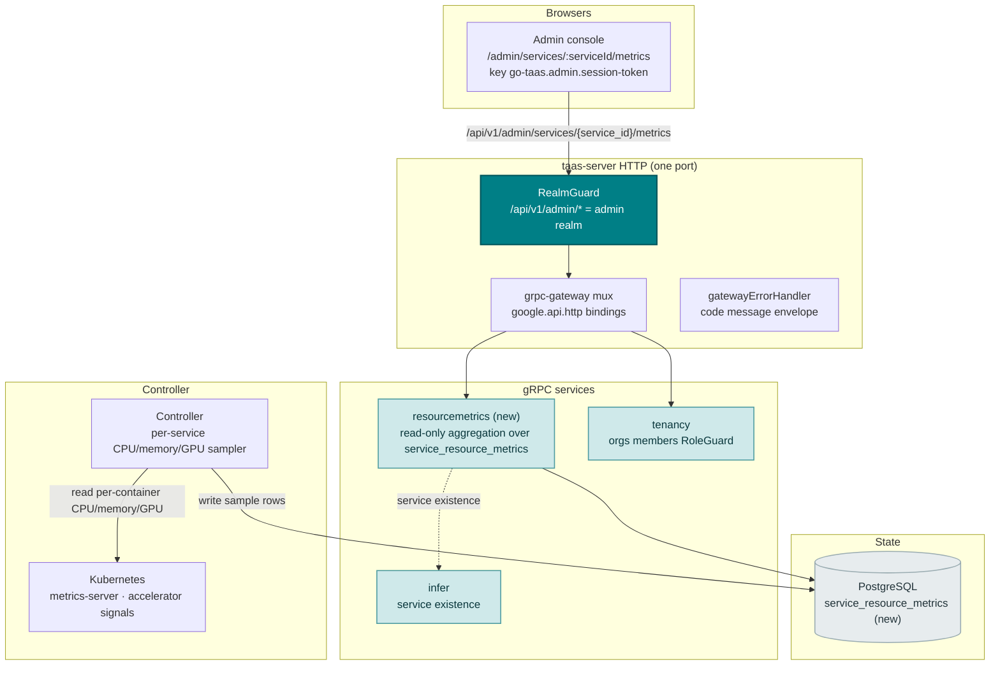
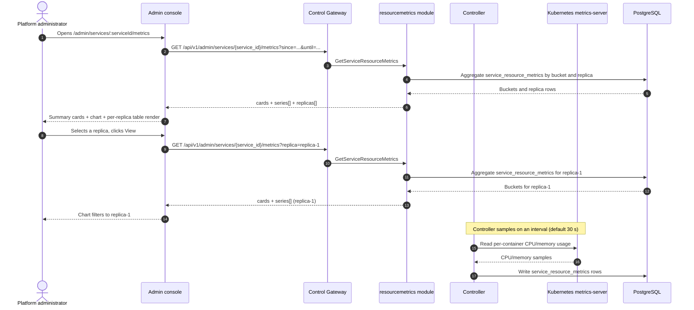
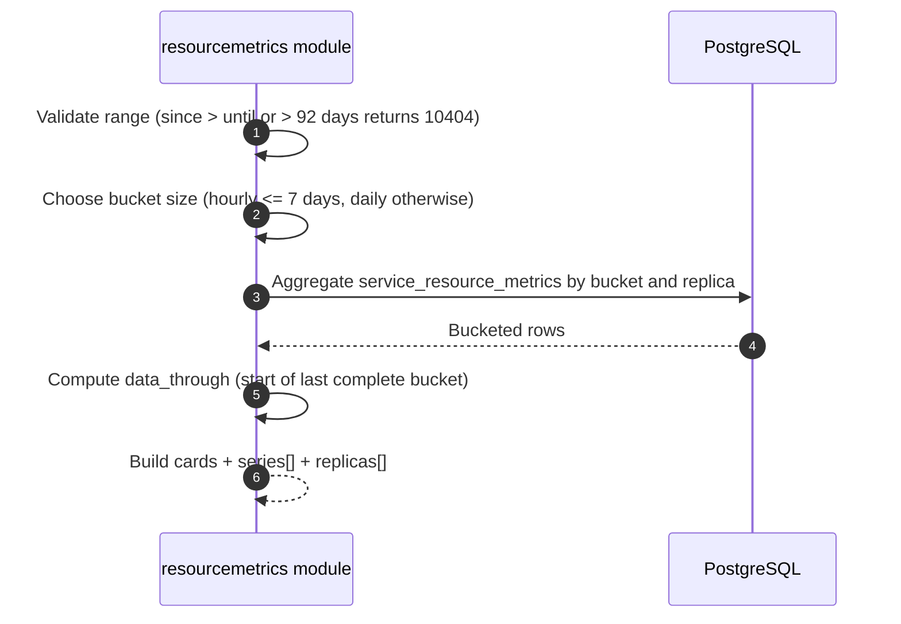

# 推理服务资源指标 — 架构与详细设计

| 属性 | 内容 |
| --- | --- |
| 功能点 | 推理服务资源指标 — 按服务查看 CPU / 内存 / GPU 利用率随时间变化，支持时间范围筛选与资源使用图表（backlog 第 37 行） |
| 文档范围 | 功能 37 的架构与详细设计：新的 `resourcemetrics` 模块，负责对新的 `service_resource_metrics` 表的只读聚合；Controller 的按服务 CPU/内存/GPU 采样器；`taas.resourcemetrics.v1.ResourceMetricsService` proto 及 `GetServiceResourceMetrics` RPC；管理端服务指标页面（`/admin/services/:serviceId/metrics`）；以及错误处理、配置、安全、上线与各层函数级设计 |
| 所属模块 | 新 `resourcemetrics` 模块（`services/resourcemetrics`）：对 `service_resource_metrics` 的只读聚合；`internal/controller`（只读：从 Kubernetes metrics-server 与加速器信号采样按服务 CPU/内存/GPU）；`pkg/server` 网关（管理端前缀绑定）；`web` 管理端控制台（`ServiceMetricsPage`） |
| 相关文档 | [需求分析与 UI/UX 设计](../design/service-resource-metrics.md) · [架构设计](../design/architecture.md) §2.4（`infer`）、§2.7 Controller、§4.2 一键部署流程 · [模型可观测性仪表盘](./model-observability.md)（同类的只读时序聚合及其分桶/新鲜度/范围约定）· [加速器清单与健康](./accelerator-inventory.md)（其加速器信号为 GPU 利用率提供数据的同类 GPU 健康面）· [推理服务日志查看器](./service-logs-viewer.md)（同类的按服务诊断面及本功能复用的 Controller 读取模式）· [控制台面分离](./console-surface-separation.md)（两个面、`AdminShell` 约定、掩码投影规则） |
| 状态 | 架构完成，已移交给 Developer 智能体 |

---

## 1. 概述与目标

go-taas 将推理服务作为 Kubernetes Deployment 运行（model-catalog-deployment §4.2）：Controller 创建 Deployment 与 Service，推理引擎（vLLM 等）在容器内运行。模型可观测性功能（第 24 行）从 `request_logs` 解释*模型表现如何*（延迟、吞吐、错误率、token/秒），服务日志查看器（第 33 行）展示*引擎打印了什么*。而运维人员仍无法回答的基础设施问题是：*这个服务是否真的用到了分配给它的资源？* 当服务变慢时，运维人员无法判断它是 CPU 受限、内存受限还是 GPU 饥饿，除非离开控制台对 Pod 运行 `kubectl top` 或查询指标端点。

本功能新增一个**推理服务资源指标**页面：按服务查看 CPU / 内存 / GPU 利用率随时间变化，支持时间范围筛选与资源使用图表。它是 Phase 4 运维面最小且有独立价值的增量：把"服务很慢"变成"服务在过去一小时 CPU 饱和 95% 而 GPU 只有 20% —— 瓶颈在计算而非加速器"。这是一个**只读**聚合层 —— 推理、计量或计费管线均无改动。

**目标**：新的 `resourcemetrics` 模块，负责对新的 `service_resource_metrics` 表的只读聚合；Controller 的按服务 CPU/内存/GPU 采样器写入该表；`taas.resourcemetrics.v1.ResourceMetricsService` 及 `GetServiceResourceMetrics` RPC（卡片 + 时序 + 按副本明细）；管理端服务指标页面（`/admin/services/:serviceId/metrics`）；新错误码 12101 `CodeServiceMetricsInvalid`；页面 → 路由 → API 前缀表（精确管理端前缀）；各页面交互状态（空、错误、权限拒绝）；以及可在 compose 栈上以 Nightwatch 测试的编号验收标准。

**非目标**（延后，设计 §8）：模型级性能指标（延迟/吞吐/错误率 —— 功能 #24）；请求级追踪（功能 #27）；容器日志（功能 #33）；Prometheus/Grafana 栈或 PromQL 查询语言（刻意不引入，D2）；资源使用告警或阈值通知（功能 #26 在控制台内消费可观测性事件 —— 此处不涉及）；用户域资源面（刻意不引入，D1）；资源指标保留/归档（未来细化）。

### 1.1 本文档阅读顺序

第 2 节记录架构决策（AD1–AD10，对应设计的 D1–D10）。第 3–5 节为组件视图、数据模型与 API 设计。第 6 节为前端架构（页面 → 路由 → API 前缀表、认证守卫）。第 7–8 节为时序流程与错误处理。第 9–11 节为配置、安全与上线。第 12–14 节为验收标准追溯、函数级详细设计与有序实现任务清单。

---

## 2. 架构决策

| # | 决策 | 理由 |
| --- | --- | --- |
| AD1 | **资源指标页面仅存在于管理端面**：`/admin/services/:serviceId/metrics` + `/api/v1/admin/services/{service_id}/metrics/*`。**无用户端面** —— 按服务的 CPU/内存/GPU 利用率属于运维编排内部信息（功能 #17 的掩码投影规则）；租户获得模型级性能（第 24 行），而非 Pod 资源内部信息 | 设计 D1。运维人员需要基础设施利用率来排查容量与瓶颈；租户需要模型性能而非 Pod 内部信息。与仅管理端的加速器清单（功能 #18）、系统状态（功能 #30）、服务日志（功能 #33）一致 |
| AD2 | **CPU 与内存从 Kubernetes metrics-server**（`metrics.k8s.io`）经 Controller 采样，**GPU 利用率来自加速器信号**（功能 #18）。Controller 是唯一持有 Kubernetes 客户端的组件；它按间隔（默认 30 秒）轮询每个服务的每个副本的 CPU/内存/GPU，并向新的 `service_resource_metrics` 表写入每（服务、副本、采样）一行 | 设计 D2。metrics-server 是容器 CPU/内存的规范、低依赖来源（kubectl top、Kubernetes Dashboard 均读取它）；加速器信号已携带 GPU 状态（功能 #18）。Controller 持有 Kubernetes 客户端（service-logs AD2、accelerator AD1），因此是天然的采样器。新表持久化时序 —— 与点状的加速器快照不同，*随时间变化*的利用率需要存储 |
| AD3 | **新 `resourcemetrics` 模块**（`services/resourcemetrics`）负责对 `service_resource_metrics` 表的只读聚合，拥有自己的错误块 **121xx**。它复用可观测性模式（分桶构建器、新鲜度、范围契约 10404），但拥有自己的表与 RPC | 设计 D3。资源利用率是基础设施遥测（类似加速器），区别于基于 `request_logs` 的请求派生可观测性聚合（model-observability AD3）。专用模块保持关注点分离并赋予其单一归属，符合按功能分模块的模式（accelerator、status、error-analysis） |
| AD4 | **一个新 RPC `GetServiceResourceMetrics`** 返回按服务的摘要卡片、分桶时序与按副本明细，支持时间范围与可选副本筛选。它镜像 `GetModelObservability` 的卡片 + 时序 + 按键形状 | 设计 D4。页面需要多种形状（头条卡片、时序、按副本表）；专用 RPC 将资源关注点排除在可观测性聚合面之外并赋予其单一归属（AD3） |
| AD5 | **时间分桶随范围自适应**：范围 ≤ 7 天用小时桶，> 7 天用天桶。范围上限 **92 天**，校验复用 **10404** `CodeMeteringRangeInvalid` | 设计 D5。短范围的小时粒度展示日内尖峰（瓶颈相关信号）；长范围的天粒度保持负载小。92 天上限与 10404 复用使范围契约与每次计量/可观测性查询统一（model-observability AD7） |
| AD6 | **新鲜度显式化**：每个响应携带 `data_through` —— `service_resource_metrics` 表覆盖的最后一个完整采样桶的起始。当所选范围超出它时，控制台显示"数据截至 <时间>"提示及待定/部分标记 | 设计 D6。采样指标滞后墙钟最多一个采样间隔；标记以零新增管线工作保持新鲜度故事诚实（model-observability AD8） |
| AD7 | **GPU 利用率尽力而为**：当加速器信号暴露按 Pod 的 GPU 利用率（DCGM 风格）时，时序携带它；当厂商不暴露（或加速器信号缺失）时，GPU 时序为空，页面显示"GPU 指标不可用"提示 | 设计 D7。异构加速器（NVIDIA、Iluvatar、MetaX）在是否暴露利用率上各不相同；尽力而为的 GPU 时序优雅降级为"不可用"，无需解析契约（镜像 service-logs 的尽力而为级别筛选） |
| AD8 | **图表以内联 SVG 渲染** —— 每桶一根柱（或线），带指标切换器（CPU / 内存 / GPU）—— 不引入新图表依赖 | 设计 D8。控制台刻意轻依赖；小而可测试的 SVG 组件符合 usage-dashboard D7 与 observability D9 决策 |
| AD9 | **新错误码在资源指标块（12101–12199）**：**12101 `CodeServiceMetricsInvalid`**（无效的指标维度或副本筛选）。未知 `service_id` 复用 **10301**；未知副本复用 **10304**；无效范围复用 **10404** | 设计 D9。资源指标是新模块（AD3），因此其错误码位于 forecast 块（120xx）之后的空白块；区分"无效"使"错误指标/副本筛选"可操作，而服务/范围契约与 infer 和 metering 保持统一 |
| AD10 | **页面只读且仅对访问审计** —— 它不写入、不修改任何内容；页面仅可由已认证的管理端会话访问，且不审计任何资源指标变更（无内容可变更） | 设计 D10。本功能是对采样指标的纯读取；审计轨迹（功能 #15）已覆盖底层服务写入。无需新增审计事件 |

---

## 3. 组件视图

### 3.1 归属

| 层 / 组件 | 拥有 | 本功能变更 |
| --- | --- | --- |
| **控制网关（`grpc-gateway`）** | `GetServiceResourceMetrics` RPC 的 HTTP/JSON 门面；域守卫（功能 #17）已以 10038 拒绝错误域会话；将 `X-Organization-Id` 作为 gRPC 元数据透传 | 新增 HTTP 资源指标 RPC 绑定（第 5 节）；域守卫不变 |
| **`resourcemetrics` 模块（`services/resourcemetrics`）** | 对 `service_resource_metrics` 的只读聚合：`GetServiceResourceMetrics` RPC、范围校验、分桶构建器、聚合仓库、`data_through` 水位 | **新模块**（AD3） |
| **`internal/controller`** | 从 Kubernetes metrics-server 与加速器信号采样按服务 CPU/内存/GPU；向 `service_resource_metrics` 写入采样行 | 新采样循环（AD2） |
| **`infer` 模块** | 推理服务元数据（`service_id` → 服务存在性） | 只读：resourcemetrics 模块按 infer 服务契约校验 `service_id`（10301） |
| **`tenancy` 模块** | 组织、成员、角色、RoleGuard | 只读：`RoleGuard` 按调用者角色门控管理端资源指标 RPC（10036） |
| **PostgreSQL** | `service_resource_metrics`（新） | 一张新表 + 索引，经 AutoMigrate（第 4 节） |
| **控制台** | 管理端服务指标页面 | 管理端面新增一页（第 6 节） |

### 3.2 运行时组件视图



### 3.3 请求身份链

资源指标 RPC 为**管理端面**（AD1）。链路如下：

1. `RealmGuard`（HTTP，`pkg/server/realm.go`）—— 路径前缀 `/api/v1/admin/services/{service_id}/metrics` 决定期望域 `admin`。无 `Authorization` 头：透传（过渡期，feature-17 AD4）。有头：从 Redis 解析会话域；不匹配 → 10038，未知/过期/无域 → 10027。
2. grpc-gateway mux —— 按注解路径路由并透传 `authorization` 与 `x-organization-id`。
3. `resourcemetrics` 处理器 —— 按 infer 服务契约校验 `service_id`（10301），并经 `tenancy.RoleGuard` 解析调用者角色（10036）。资源指标 RPC 仅管理端（AD1）；无用户绑定。
4. `tenancy.RoleGuard` —— 按调用者角色门控管理端资源指标 RPC（10036）。

---

## 4. 数据模型

### 4.1 `service_resource_metrics` 表

| 列 | PostgreSQL 类型 | 约束 | 描述 |
| --- | --- | --- | --- |
| `id` | `uuid` | PRIMARY KEY | 服务端生成的 UUID v4 |
| `service_id` | `varchar(64)` | NOT NULL, index | 推理服务 id（infer 服务契约） |
| `replica_index` | `varchar(32)` | NOT NULL | 掩码副本索引（如 `replica-1`），绝不为原始 Pod 名（AD1） |
| `sampled_at` | `timestamptz` | NOT NULL, index | 采样时间（RFC3339） |
| `cpu_percent` | `double precision` | NOT NULL | CPU 用量 ÷ 请求 × 100，0–100+ |
| `memory_bytes` | `bigint` | NOT NULL | 内存用量（字节） |
| `gpu_percent` | `double precision` | NULL | GPU 利用率，尽力而为；当加速器信号不暴露时为 NULL（AD7） |

索引：`idx_service_resource_metrics_service_time (service_id, sampled_at)` 用于按服务范围扫描；`idx_service_resource_metrics_service_replica_time (service_id, replica_index, sampled_at)` 用于按副本范围扫描。

### 4.2 迁移说明

- 新表由 GORM `AutoMigrate` 在 `taas-server` 启动时创建（增量；无数据迁移）。`Migrate`/`MigrateSchemaForFVT` 增加新模型。
- 无需 init-SQL 升级路径：无既有表变更，新表在启动时自动创建。
- Controller 写入采样行；`resourcemetrics` 模块只读读取。无 MQ subject、无 runner —— Controller 直接写表（AD2）。

---

## 5. API 设计

资源指标 RPC 属于新的 **`taas.resourcemetrics.v1.ResourceMetricsService`**（proto：`proto/taas/resourcemetrics/v1/resourcemetrics.proto`），经控制网关以 HTTP 提供。仅管理端（AD1）；**无用户前缀绑定**。

| RPC | HTTP（管理端） | HTTP（用户端） | 状态 | 用途 |
| --- | --- | --- | --- | --- |
| `GetServiceResourceMetrics` | `GET /api/v1/admin/services/{service_id}/metrics` | — | **新** | 按服务 CPU/内存/GPU 利用率随时间变化：摘要卡片、时序、按副本明细 |

### 5.1 Proto 契约

```protobuf
syntax = "proto3";

package taas.resourcemetrics.v1;

import "google/api/annotations.proto";
import "taas/common/v1/common.proto";

option go_package = "github.com/go-taas/go-taas/proto/taas/resourcemetrics/v1;resourcemetricsv1";

// ResourceMetricsService serves the read-only per-service resource
// utilization. Admin-surface API: served under /api/v1/admin.
service ResourceMetricsService {
  // GetServiceResourceMetrics returns per-service CPU/memory/GPU
  // utilization over time: summary cards, a time-series of buckets, and
  // a per-replica breakdown. It is admin-only (no user binding).
  rpc GetServiceResourceMetrics(GetServiceResourceMetricsRequest) returns (GetServiceResourceMetricsResponse) {
    option (google.api.http) = {get: "/api/v1/admin/services/{service_id}/metrics"};
  }
}

message GetServiceResourceMetricsRequest {
  // service_id is the path parameter (the infer service contract).
  string service_id = 1;
  // since/until bound the range, unix seconds. Defaults: until = now,
  // since = until - 24h. A range > 92 days is rejected (10404).
  int64 since = 2;
  int64 until = 3;
  // replica optionally filters to one masked replica index; empty means
  // service-wide.
  string replica = 4;
  // metric optionally selects one dimension (cpu / memory / gpu); empty
  // means all. An invalid value returns 12101.
  string metric = 5;
}

message GetServiceResourceMetricsResponse {
  taas.common.v1.Response response = 1;
  ResourceMetricsCard cards = 2;
  repeated ResourceMetricsSeriesPoint series = 3;
  repeated ResourceMetricsReplicaRow replicas = 4;
}

// ResourceMetricsCard is the headline summary of the range. gpu_percent
// is best-effort and empty when the accelerator signals do not expose it
// (AD7).
message ResourceMetricsCard {
  double current_cpu_percent = 1;
  int64 current_memory_bytes = 2;
  double current_gpu_percent = 3;
  int64 replica_count = 4;
  // data_through is the start of the last complete sample bucket (AD6).
  int64 data_through = 5;
}

// ResourceMetricsSeriesPoint is one time bucket of the series (hourly for
// ranges <= 7 days, daily otherwise, AD5).
message ResourceMetricsSeriesPoint {
  // bucket is the bucket start, unix seconds.
  int64 bucket = 1;
  double cpu_percent = 2;
  int64 memory_bytes = 3;
  double gpu_percent = 4;
}

// ResourceMetricsReplicaRow is one replica's aggregate in the per-replica
// table.
message ResourceMetricsReplicaRow {
  string replica_index = 1;
  double current_cpu_percent = 2;
  int64 current_memory_bytes = 3;
  double current_gpu_percent = 4;
  int64 data_through = 5;
}
```

### 5.2 契约说明（为 Developer 智能体固定）

1. `GetServiceResourceMetrics` 接受 `since`/`until`（int64 unix 秒；默认 `until = now`、`since = until − 24h`）、`replica`（可选，掩码副本索引）与 `metric`（可选，`cpu` / `memory` / `gpu` 之一）。返回 `cards`（当前 CPU/内存/GPU、副本数、`data_through`）、`series[]`（每桶一项，含 `bucket`、`cpu_percent`、`memory_bytes`、`gpu_percent`）与 `replicas[]`（每副本一行，含 `replica_index`、当前 CPU/内存/GPU、`data_through`）。
2. Controller 从 Kubernetes metrics-server（`metrics.k8s.io`）采样 CPU/内存，从加速器信号（功能 #18）采样 GPU 利用率，按间隔（默认 30 秒），向 `service_resource_metrics` 表写入每（服务、副本、采样）一行（AD2）。写入前将 Pod 名掩码为副本索引（AD1）。
3. GPU 利用率尽力而为（AD7）：当加速器信号不暴露时，`gpu_percent` 为空，页面显示"GPU 指标不可用"提示。
4. 时间分桶随范围自适应（≤ 7 天小时、否则天，AD5）；每个响应携带 `data_through` 用于新鲜度标记（AD6）。
5. 线上约定不变：成功 HTTP 200，业务错误为 `{"code": <int>, "message": "..."}`，int64 字段序列化为 JSON 字符串。

### 5.3 错误码

错误码（资源指标块 12101–12199，`pkg/errors/codes.go`）：

| 条件 | 码 | 常量 | 说明 |
| --- | --- | --- | --- |
| 未知 `service_id` | 10301 | `CodeInferServiceNotFound` | 复用 —— infer 服务契约 |
| 未知副本 | 10304 | `CodeInferEndpointNotFound` | 未知副本时复用 |
| 无效 `metric` 维度或副本筛选 | 12101 | `CodeServiceMetricsInvalid` | **新**（AD9） |
| 无效范围（`since > until` 或 > 92 天） | 10404 | `CodeMeteringRangeInvalid` | 复用 —— 计量范围契约（AD5） |
| 数据库 / 基础设施故障 | 500 | `CodeInternal` | 经错误归一化 |

---

## 6. 前端架构

### 6.1 页面 → 路由 → API 前缀表

| 页面 / 组件 | 面 | Web 路由 | API 前缀 | 认证守卫 |
| --- | --- | --- | --- | --- |
| **服务指标页面** | 管理端 | `/admin/services/:serviceId/metrics` | `/api/v1/admin/services/{service_id}/metrics` | 管理端会话；RoleGuard（管理角色） |

> 管理端服务指标页面仅调用 `/api/v1/admin/services/{service_id}/metrics`；无用户端面（AD1）。页面不含 `/api/v1/*` 字符串（功能 #17）。

### 6.2 导航位置

- **管理端控制台**：服务指标页面从服务详情页（功能 #2）经 **Metrics** 标签或链接进入。它不是顶级导航项 —— 它是按服务的诊断面，类似服务日志查看器（功能 #33）。

### 6.3 复用的共享组件与状态

- **API 客户端**（`web/src/api.ts`）：域作用域客户端（`createApi(realm)`）已发送 `Authorization: Bearer <realm>.session-token` 与 `X-Organization-Id`（仅当域 token 键为空时）。服务指标页面原样复用；不新增客户端。
- **时间范围控件**：复用 usage dashboard / observability 页面的共享预设控件（24 h / 7 d / 30 d / 自定义 + 日期时间选择器）。
- **内联 SVG 图表**：新共享 `ResourceChart.tsx` 组件，每桶一根柱（或线），带指标切换器（CPU / 内存 / GPU），遵循 observability 内联 SVG 图表模式（AD8）。
- **新鲜度徽标**：超过 `data_through` 阈值的待定/部分标记复用 usage-dashboard 待定徽标样式（AD6）。
- **空状态 / 数据新鲜度提示**：复用 Request Logs 页面模式（提示采样在服务启动且采样间隔过后出现）。

### 6.4 各面认证守卫

- **管理端服务指标页面**（`/admin/services/:serviceId/metrics`）：在 `AdminShell` 内渲染，当 `go-taas.admin.session-token` 非空时运行管理端会话守卫；缺失/过期会话重定向到 `/admin/login?reason=expired`；错误域会话被网关以 10038 拒绝。页面 API 调用指向 `/api/v1/admin/services/{service_id}/metrics`。无所需角色的会话收到 10036，页面显示标准权限拒绝状态（功能 #17）。
- **未认证访客**：未认证访客被 shell 守卫重定向到 `/admin/login`。

### 6.5 控制台契约（为 Developer 智能体固定）

**服务指标页面**（`/admin/services/:serviceId/metrics`）：页面头部（"Service Metrics"，副标题含服务名与 `service_id`），带 **Back to Service** 链接（`metrics-back`）与 **Refresh** 操作（`metrics-refresh`）。下方：**筛选栏**，含 **Time range** 控件（`metrics-range`，共享预设）与 **Replica** 下拉（`metrics-replica`，来自按副本明细，"All replicas" 默认）；一行**摘要卡片**（`metrics-card-cpu`、`metrics-card-memory`、`metrics-card-gpu`、`metrics-card-replicas`），每张带"数据截至 <时间>"新鲜度提示（`metrics-data-through`）；**内联 SVG 图表**（`metrics-chart`），带**指标切换器**（`metrics-metric-cpu` / `metrics-metric-memory` / `metrics-metric-gpu`）；以及**按副本表**（`metrics-replicas`、`metrics-replica-{index}`），列为副本（掩码索引）、CPU、内存、GPU、数据截至，行操作 **View** 将图表筛选到该副本。可按副本、CPU、内存、GPU 排序；可按 Replica 下拉筛选；副本数超过页大小时分页。空状态："No resource metrics in this range."，提示采样在服务启动且采样间隔过后出现。错误状态：错误横幅 + Retry 按钮 + "Showing stale data" 横幅。权限拒绝：标准状态，带返回管理端首页的链接。

---

## 7. 时序流程

### 7.1 管理端服务指标加载



### 7.2 分桶推导



---

## 8. 错误处理

所有错误均为统一信封中的 `pkg/errors` 业务码（第 5.3 节）。资源指标模块只读，因此无 runner 侧失败、无写入可失败。数据库故障归一化为 500 `CodeInternal`。

控制台按 body `code` 分支（`web/src/api.ts` 已如此），绝不按 HTTP 状态。新码 12101 "无效指标或副本筛选" 渲染特定内联消息。管理端页面将 10036 映射为标准权限拒绝状态（功能 #17 §8.2）。

---

## 9. 配置新增

| 键 | 默认 | 描述 |
| --- | --- | --- |
| `resourcemetrics.maxRangeSeconds` | `7948800` | 最大范围（92 天）；更长范围返回 10404（AD5） |
| `controller.resourceMetrics.sampleInterval` | `30s` | Controller 的按服务 CPU/内存/GPU 采样间隔（AD2） |

`resourcemetrics` 配置块在 `pkg/config` 中新增（`ResourceMetricsConfig`），遵循 `observability` 块模式。`controller.resourceMetrics` 块在 controller 配置中新增（`ControllerResourceMetricsConfig`）。`applyDefaults`/`Validate` 设置上述默认值。resourcemetrics 模块在 RPC 中读取 `maxRangeSeconds`；Controller 在采样循环中读取 `sampleInterval`。不新增 MQ subject 或 runner —— Controller 直接写表（AD2）。

---

## 10. 安全考量

- **仅管理端面**：服务指标页面仅存在于管理端面（AD1）；无用户端面。域守卫在任何处理器运行前以 10038 拒绝错误域会话（功能 #17）。
- **管理角色门控**：资源指标 RPC 由 `tenancy.RoleGuard` 门控 —— 仅有所需管理角色的调用者可查看按服务资源利用率；不可访问的组织返回 10036。
- **掩码投影**：页面暴露掩码副本索引，绝不为原始 Pod 名或副本数（AD1）。租户绝不见 Pod 资源内部信息。
- **构造性只读**：resourcemetrics 模块仅对采样指标发出读取；Controller 仅写入采样行。无需新增审计事件 —— 底层服务写入已被审计（功能 #15）。

---

## 11. 上线 / 升级说明

- **一张新表**：`service_resource_metrics` 在 `taas-server` 启动时经 `AutoMigrate` 创建；无数据迁移、无 init-SQL 升级路径。
- **proto 变更为增量**：新 `ResourceMetricsService` 上一个新 RPC；无既有 RPC 或消息变更。网关 mux 增加新绑定；域守卫不变。
- **Controller**：采样循环是 Controller 中的新后台循环；独立于 reconcile 循环，随 Controller 上下文取消。
- **控制台**：新页面加入既有 bundle；服务详情页（功能 #2）增加 Metrics 标签/链接。无既有路由变更。
- **向后兼容**：过渡期（无会话、`X-Organization-Id`）路径为 CLI、FVT 与 e2e 套件保留；域守卫透传无 `Authorization` 头的请求（功能 #17 AD4）。
- **数据出现前为空**：在 Controller 首次采样前 RPC 返回空时序；页面渲染空状态，提示采样在服务启动且采样间隔过后出现。

---

## 12. 验收标准追溯

| # | 标准 | 处理位置 |
| --- | --- | --- |
| AC1 | `GetServiceResourceMetrics` 在有效范围内返回摘要卡片、时序与按副本明细；范围 > 92 天或 `since > until` 返回 10404 | §5.1、§5.2、§7.2 |
| AC2 | Controller 按（服务、副本、采样）写入 `service_resource_metrics` 行，含 `cpu_percent`、`memory_bytes` 与尽力而为的 `gpu_percent`；无运行副本的服务不产生采样 | §4.1、§4.2、§7.1 |
| AC3 | 范围 ≤ 7 天用小时桶、> 7 天用天桶；每个响应携带 `data_through` | §5.1、§5.2、§7.2 |
| AC4 | `/admin/services/:serviceId/metrics` 页面在首次成功加载时渲染筛选栏、摘要卡片、图表与按副本表 | §6.5 |
| AC5 | 更改时间范围或副本会重新拉取指标；指标切换器在客户端切换 CPU / 内存 / GPU，无需重新拉取 | §6.5、§7.1 |
| AC6 | 按副本表显示掩码副本索引（绝不为原始 Pod 名）；`gpu_percent` 为空时 GPU 卡片显示 "Unavailable" | §6.5、§10 |
| AC7 | 服务指标页面仅可在管理端面访问：路由 `/admin/services/:serviceId/metrics`，每次 API 调用使用 `/api/v1/admin/services/{service_id}/metrics` 前缀且无 `/api/v1/*` 字符串 | §6.1、§6.4、§10 |
| AC8 | 无所需角色的会话在服务指标页面收到 10036，页面显示标准权限拒绝状态 | §3.3、§6.4、§10 |

---

## 13. 详细设计（各层函数级职责）

### 13.1 Proto → 服务 → 仓库 → Controller

| 层 | 文件 | 职责 |
| --- | --- | --- |
| `proto/taas/resourcemetrics/v1` | `resourcemetrics.proto` | 新：`ResourceMetricsService` 及 `GetServiceResourceMetrics` RPC + `GetServiceResourceMetricsRequest/Response`、`ResourceMetricsCard`、`ResourceMetricsSeriesPoint`、`ResourceMetricsReplicaRow` 消息（第 5.1 节）。经 `buf generate` 重新生成 `resourcemetrics.pb.go`/`resourcemetrics_grpc.pb.go`/`resourcemetrics.pb.gw.go` |
| `services/resourcemetrics` | `metrics_model.go` | 聚合行结构体（`ResourceMetricsBucketRow`、`ResourceMetricsReplicaRow`）与 `bucketSizeFor` 辅助函数（≤ 7 天小时、否则天，AD5） |
| | `metrics_repository.go` | `AggregateServiceMetrics(ctx, serviceID, since, until, replica, bucketSize)` —— 对 `service_resource_metrics` 的分桶聚合；`ReadDataThrough(ctx, serviceID)` —— 最后一个完整采样桶的起始（AD6） |
| | `service.go` | 新 RPC `GetServiceResourceMetrics`；范围校验（10404，AD5）；卡片 + 时序 + 副本组装（AD4）；`data_through` 新鲜度标记（AD6）；`service_id` 存在性检查（10301）；管理端组织作用域的 `RoleGuard` 接缝（10036） |
| `internal/controller` | `resource_metrics.go` | 新采样循环：按 `sampleInterval`，列出推理服务，从 Kubernetes metrics-server 读取每容器 CPU/内存、从加速器信号读取 GPU 利用率，将 Pod 名掩码为副本索引，向 `service_resource_metrics` 写入每（服务、副本、采样）一行（AD2） |
| `pkg/errors` | `codes.go`/`messages.go` | `CodeServiceMetricsInvalid`（12101）常量 + 规范消息 "invalid service metric or replica filter"（AD9） |
| `pkg/config` | `api.go`/`configuration.go` | `ResourceMetricsConfig` + `maxRangeSeconds`（第 9 节）+ `applyDefaults`/`Validate`；`ControllerResourceMetricsConfig` + `sampleInterval` |
| `apps/taas-server` | `main.go` | 注册新 `ResourceMetricsService`；将 `tenancy` RoleGuard 接入 resourcemetrics 服务 |
| `apps/controller` | `main.go` | 启动资源指标采样循环 |
| `web/src` | `pages/ServiceMetricsPage.tsx`、`components/ResourceChart.tsx`、`App.tsx`、`api.ts`、`shells/AdminShell.tsx` | 路由 `/admin/services/:serviceId/metrics`；`GetServiceResourceMetrics` API 类型与调用；服务详情页的 Metrics 标签/链接（第 6.5 节） |
| `test` | `fvt/service_resource_metrics_fvt_test.go`、`e2e/tests/serviceResourceMetrics.js` | 第 14 节 |

### 13.2 各屏幕由哪个 React 页面/模块实现

| 屏幕 | React 模块 | 路由 | API 调用 |
| --- | --- | --- | --- |
| 服务指标页面（管理端） | `web/src/pages/ServiceMetricsPage.tsx` | `/admin/services/:serviceId/metrics` | `GetServiceResourceMetrics` |
| 资源图表 | `web/src/components/ResourceChart.tsx`（共享） | （页面上） | （客户端；渲染返回的时序） |

---

## 14. 测试策略

- **单元**（`services/resourcemetrics`，内存 sqlite）：`metrics_repository_test.go` —— `AggregateServiceMetrics` 返回分桶行（AC1），`ReadDataThrough` 返回水位（AC3）。`service_test.go` —— `bucketSizeFor` 在 ≤ 7 天返回小时、否则天（AC3）；范围校验返回 10404（AC1）；`service_id` 存在性检查返回 10301；管理端组织作用域返回 10036（AC8）。新文件覆盖率 ≥ 80%。
- **FVT**（`test/fvt/service_resource_metrics_fvt_test.go`，observability FVT 模式：文件 sqlite + `MigrateSchemaForFVT` + `NewForFVT` + 生产拦截器的 gRPC 服务器 + `FVTHeaderMatcher` 的网关 mux）：预置 `service_resource_metrics` 行，断言 `GetServiceResourceMetrics` 返回卡片、时序与副本（AC1），分桶按范围小时/天（AC3），响应携带 `data_through`（AC3）。
- **E2E**（`test/e2e/tests/serviceResourceMetrics.js`，`serviceLogs.js` 模式）：针对 compose 栈 —— 管理端 `/admin/services/:serviceId/metrics` 页面在首次成功加载时渲染筛选栏、摘要卡片、图表与按副本表（AC4）；更改时间范围或副本重新拉取、指标切换器客户端切换（AC5）；按副本表显示掩码索引、GPU 卡片为空时显示 "Unavailable"（AC6）；页面仅调用 `/api/v1/admin/services/{service_id}/metrics`、未认证访客重定向到 `/admin/login`（AC7）；无所需角色的会话收到 10036 并显示权限拒绝状态（AC8）。