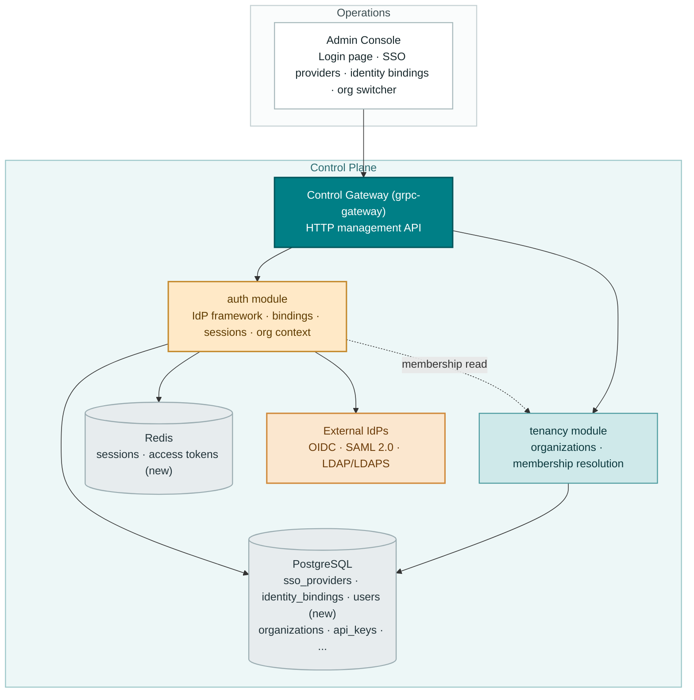
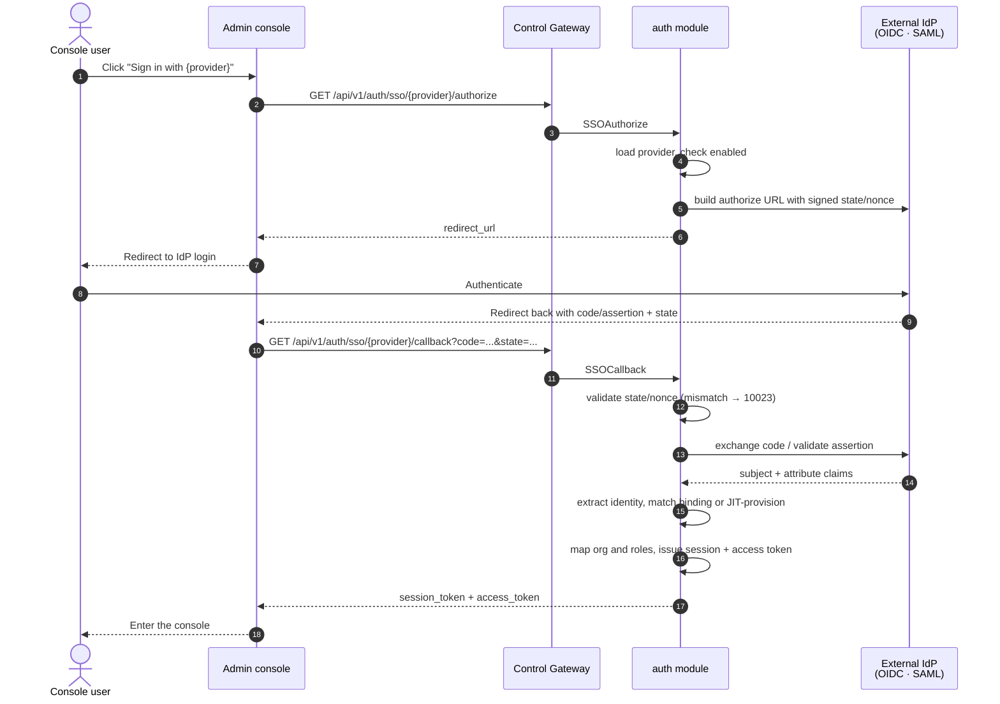
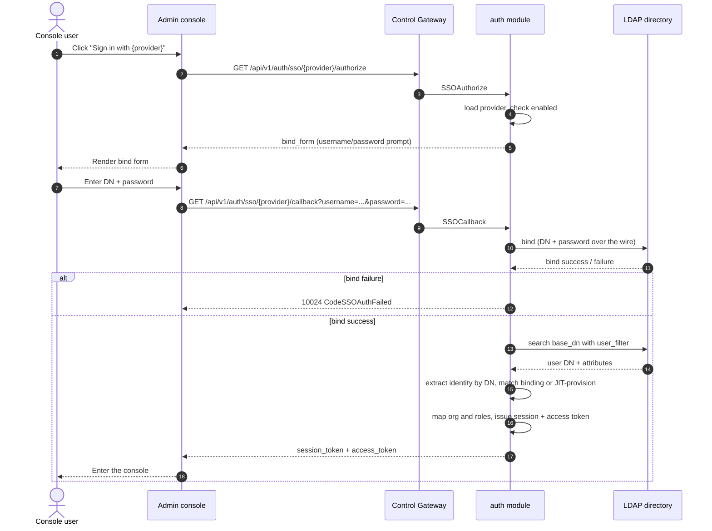
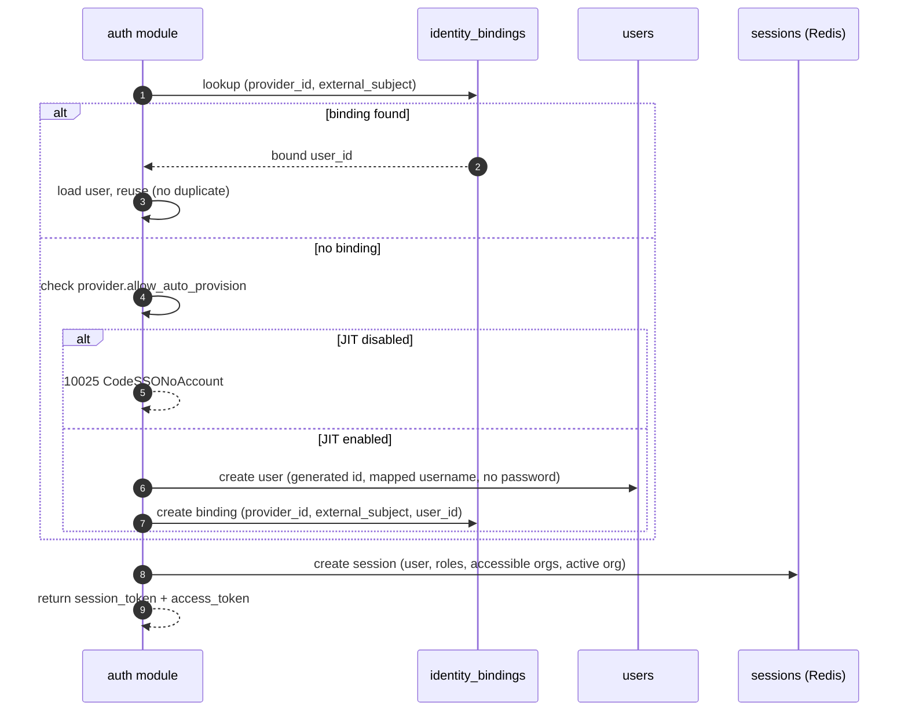
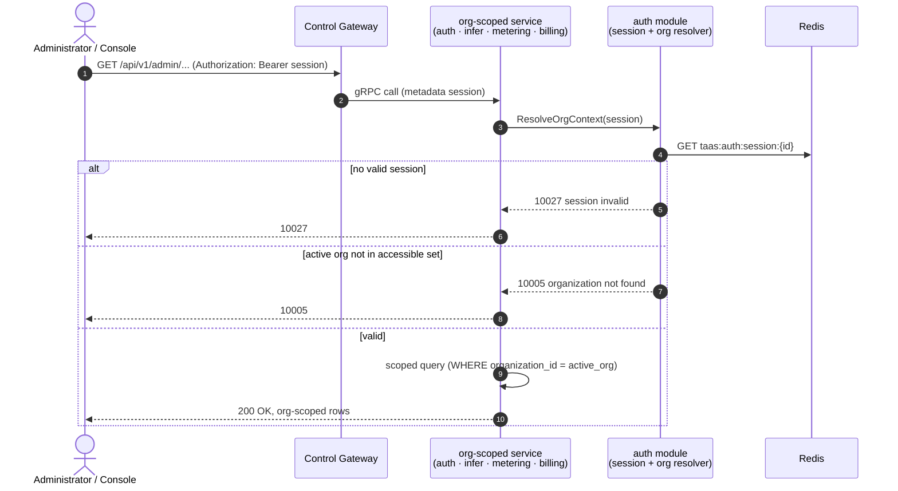

# SSO Federation (OIDC/LDAP/SAML) & Account Binding — Architecture and Detailed Design

| Attribute | Content |
| --- | --- |
| Feature point | SSO federation (OIDC/LDAP/SAML) & account binding |
| Document scope | Architecture and detailed design for the authentication core: the pluggable identity-provider (IdP) framework (OIDC, SAML 2.0, LDAP/LDAPS), provider configuration management, the SSO login flow (authorize + callback), account binding and Just-In-Time (JIT) provisioning, sessions and access tokens, attribute-to-role mapping, the console login page and session handling, the org context evolving from the transitional `X-Organization-Id` header to a session-derived context, and function-level design per layer |
| Owning modules | `auth` (IdP framework, identity bindings, sessions, and the session-derived org context every module consumes), with `tenancy` (org membership resolution for the session) |
| Related documents | [Requirement Analysis and UI/UX Design](../design/sso-federation.md) · [Architecture Design](../design/architecture.md) Section 2.1 `auth` · [Multi-Tenancy](./multi-tenancy.md) — the validated org context this feature replaces with a session (its D4/FR3.3), the org directory and switcher this feature grounds in session membership (its D10/FR4.3) · [API Key Management](./api-key-management.md) — the data-plane key verification this feature leaves unchanged |
| Status | Architecture complete, handed to the Developer agent |

---

## 1. Goals and Non-Goals

### 1.1 Goals

- Implement the **pluggable IdP framework** (D1) in the `auth` module: a unified plugin interface with three hooks — `authorize`, `callback`, and `identity extraction` — and three v1 providers: **OIDC/OAuth 2.0**, **SAML 2.0**, and **LDAP/LDAPS**. Providers are config rows (CRUD), and multiple can be enabled simultaneously.
- **Provider configuration management** (D2): a single `sso_providers` table carrying `provider_id`, `type`, `display_name`, protocol params per type, `enabled`, `default_org`, `allow_auto_provision`, and `attribute_mapping`. Admin-surface CRUD + enable/disable under `/api/v1/admin/auth/sso/providers`.
- **Identity binding** (D3): an `identity_bindings` table keyed by `(provider_id, external_subject)` where `external_subject` = `issuer + subject` (OIDC/SAML) or `DN` (LDAP), bound to a platform `user_id`. Admin-surface management under `/api/v1/admin/auth/identity-bindings`.
- **JIT provisioning with an opt-out** (D4): on first login, if `allow_auto_provision`, auto-create a platform user and binding; if disabled, reject with 10025 `CodeSSONoAccount` and the administrator pre-assigns a binding.
- **Sessions and access tokens** (D5): a successful login issues a server-side session (Redis-backed, revocable) and an access token. `Logout` revokes the session. Token rotation and Single Logout (SLO) are deferred.
- **Org context from the session** (D6): for authenticated console requests, the org context comes from the session's active org (validated against the user's accessible orgs), not the header. The console stops sending `X-Organization-Id`; the header remains supported for CLI/transitional programmatic access (validated as in feature #6). When both a session and a header are present, the session wins.
- **Attribute-to-role mapping** (D7): the provider's `attribute_mapping` maps IdP claims (group/role) to platform org, project, and role. On login the mapped org/project/role are applied to the session. Role enforcement across individual admin APIs is deferred.
- **Console login page and session handling** (D8): a `/admin/login` page lists enabled providers as "Sign in with {display_name}" buttons; the SSO callback returns the console authenticated; the session token is stored and sent as `Authorization: Bearer`; a logout button revokes the session. The org switcher lists the user's accessible orgs (from the session), and switching updates the session's active org.
- **New error codes** (D10): 10020 `CodeSSOProviderExists`, 10021 `CodeSSOProviderNotFound`, 10022 `CodeSSOProviderDisabled`, 10023 `CodeSSOInvalidState`, 10024 `CodeSSOAuthFailed`, 10025 `CodeSSONoAccount`, 10026 `CodeIdentityBindingExists`, 10027 `CodeSessionInvalid`, 10028 `CodeSSOProviderInvalid`.

### 1.2 Non-Goals

| Item | Deferred to |
| --- | --- |
| WeChat provider (QR login) | Future plugin (distinct IdP type) |
| Full RBAC enforcement across individual admin APIs | Dedicated authorization design |
| Token rotation and Single Logout (SLO) | Hardening follow-up |
| SCIM directory sync | Future |
| Local password lifecycle (registration/password reset beyond existing `CreateUser`/`Login`) | Secondary to federation |
| Project-scoped resource columns | Feature #6 deferral |
| CLI SSO commands | When the CLI surface is next touched |
| Session audit trail (who did what in the console) | Future operations tooling |

---

## 2. Component View



| Component | Responsibility in this feature |
| --- | --- |
| Control Gateway (`grpc-gateway`) | HTTP/JSON facade for the 15 new `AuthService` RPCs; passes `Authorization: Bearer` through as gRPC metadata for session resolution; passes `X-Organization-Id` through for CLI/transitional callers |
| `auth` module (`services/auth`) | The IdP plugin framework (authorize/callback/identity-extraction hooks), the `sso_providers`/`identity_bindings`/`users` tables, the SSO login flow, JIT provisioning, Redis-backed sessions and access tokens, attribute-to-role mapping, and the session-derived org context resolver |
| `tenancy` module (`services/tenancy`) | Org membership resolution for the session: the session's active org and accessible orgs are validated against the `organizations` table (feature #6's `OrgGuard` read interface) |
| PostgreSQL | `sso_providers`, `identity_bindings`, `users` tables (new); existing tables unchanged |
| Redis | Sessions and access tokens (new keyspace `taas:auth:session:*`); the existing API-key cache is untouched |
| External IdPs | OIDC/OAuth 2.0, SAML 2.0, LDAP/LDAPS — the console never handles federated credentials; the IdP owns them |
| Message Queue | **Unchanged** — SSO is RPC-only; no new subjects, no consumers, no runners |
| Console | Login page, SSO providers page, identity bindings page, session-aware org switcher, logout (contract in Section 10.5) |

---

## 3. Data Model

### 3.1 The `sso_providers` Table

| Column | PostgreSQL type | Constraints | Description |
| --- | --- | --- | --- |
| `id` | `varchar(64)` | PRIMARY KEY | Caller-supplied immutable provider id, `^[a-z0-9][a-z0-9-]{2,63}` (3-64 chars, lowercase) |
| `type` | `varchar(16)` | NOT NULL | `oidc` / `saml` / `ldap` (immutable) |
| `display_name` | `varchar(128)` | NOT NULL | Mutable display name, 1-128 chars |
| `issuer` | `varchar(512)` | NULL | OIDC: the IdP issuer URL |
| `client_id` | `varchar(256)` | NULL | OIDC: the client id |
| `client_secret` | `varchar(512)` | NULL | OIDC: the client secret (write-only, masked on read) |
| `redirect_uri` | `varchar(512)` | NULL | OIDC: the registered redirect URI |
| `scopes` | `varchar(512)` | NULL | OIDC: space-separated scopes (default `openid profile email`) |
| `metadata_url` | `varchar(512)` | NULL | SAML: the IdP metadata URL |
| `entity_id` | `varchar(512)` | NULL | SAML: the SP entity id |
| `acs_url` | `varchar(512)` | NULL | SAML: the assertion consumer service URL |
| `host` | `varchar(256)` | NULL | LDAP: the directory host |
| `port` | `int` | NULL | LDAP: the directory port (389 / 636 for LDAPS) |
| `bind_dn` | `varchar(512)` | NULL | LDAP: the service bind DN (write-only, masked on read) |
| `base_dn` | `varchar(512)` | NULL | LDAP: the search base DN |
| `user_filter` | `varchar(512)` | NULL | LDAP: the user search filter (e.g. `(uid={{username}})`) |
| `enabled` | `boolean` | NOT NULL DEFAULT false | Whether the provider accepts logins |
| `default_org` | `varchar(64)` | NULL | The org assigned to a session when no org claim maps (must exist in `organizations`) |
| `allow_auto_provision` | `boolean` | NOT NULL DEFAULT true | JIT provisioning on first login |
| `attribute_mapping` | `jsonb` | NOT NULL DEFAULT '{}' | Claim/attribute → platform field mapping (Section 3.4) |
| `created_at` | `timestamptz` | NOT NULL | Row creation time (UTC) |
| `updated_at` | `timestamptz` | NOT NULL | Bumped on update and state transitions |

Design notes:

- The primary key is the caller-supplied id (D2): providers are named, addressable resources. A duplicate insert maps to 10020 (FR1.1).
- Protocol params are **type-specific nullable columns** rather than a JSON blob: the console's provider form renders the right fields per type, and the plugin interprets only its own columns. This keeps validation synchronous and type-safe.
- Secrets (`client_secret`, `bind_dn`) are write-only: returned masked (`"••••"`) in list/get responses and never echoed back (contract constraint 3).
- `enabled` transitions **only** through the enable/disable endpoints — never through `Update*` (contract constraint 1).
- `default_org` is validated to exist in `organizations` at create/update time (10005 when unknown); it is the fallback active org when no org claim maps.

### 3.2 The `identity_bindings` Table

| Column | PostgreSQL type | Constraints | Description |
| --- | --- | --- | --- |
| `id` | `uuid` | PRIMARY KEY | Generated binding id (the `DELETE .../identity-bindings/{binding_id}` path shape) |
| `provider_id` | `varchar(64)` | NOT NULL, index | The owning provider (FK to `sso_providers.id`) |
| `external_subject` | `varchar(512)` | NOT NULL | `issuer + subject` (OIDC/SAML) or `DN` (LDAP) — the stable external identity |
| `user_id` | `uuid` | NOT NULL, index | The bound platform user |
| `created_at` | `timestamptz` | NOT NULL | Row creation time |

Design notes:

- **Uniqueness**: `UNIQUE (provider_id, external_subject)` — the composite is the primary key of the external identity (D3). A duplicate insert maps to 10026 (FR3.1).
- `idx_identity_bindings_provider (provider_id)` serves the provider-filtered directory listing; `idx_identity_bindings_user (user_id)` serves the user-filtered listing and the reverse lookup (which providers a user is bound to).
- A binding is durable evidence: `DeleteSSOProvider` is blocked while bindings exist (10026, FR1.6). Deleting a binding severs the external link but **keeps the user** (FR3.3).
- No FK constraint to `users` in v1 (the `users` table is new in this feature; a real FK can be added once the account model stabilizes). The binding's `user_id` is validated to exist at create time (10005 when unknown).

### 3.3 The `users` Table

| Column | PostgreSQL type | Constraints | Description |
| --- | --- | --- | --- |
| `id` | `uuid` | PRIMARY KEY | Generated user id |
| `username` | `varchar(128)` | NOT NULL, uniqueIndex | The display/login name (from the mapped username claim for JIT users) |
| `email` | `varchar(256)` | NULL | The mapped email claim (optional) |
| `password_hash` | `varchar(256)` | NULL | Local password hash; NULL for federated-only users (JIT-created users cannot log in via local password until one is set, FR3.4) |
| `created_at` | `timestamptz` | NOT NULL | Row creation time |
| `updated_at` | `timestamptz` | NOT NULL | Bumped on update |

Design notes:

- The `users` table is the account model this feature introduces. It is deliberately minimal: username, email, optional password hash, timestamps. Roles and org memberships are **not** columns — they are derived per-session from the attribute mapping and the `organizations` table (D7).
- `username` is unique but is **not** the binding key: the binding key is `(provider_id, external_subject)` (D3). Email is mutable and must never be the key.
- The existing `CreateUser`/`Login` RPCs (local password lifecycle) are **not** implemented in this feature (deferred, Section 1.2); the `users` table is created and used by JIT provisioning and identity binding, and the local-password path lands later.

### 3.4 The `attribute_mapping` JSON Shape

The `attribute_mapping` column is a JSON object mapping IdP claim/attribute paths to platform fields:

```json
{
  "username": "preferred_username",
  "email": "email",
  "org": "groups",
  "project": "groups",
  "role": "groups"
}
```

- `username` / `email`: the claim path (OIDC claim name, SAML attribute name, or LDAP attribute) from which the platform username/email are extracted.
- `org` / `project` / `role`: the claim path (typically a group/role claim) whose **values** are mapped to platform org/project/role. The mapping is value-based: the claim's values are matched against the `organizations` table (for org) and a role vocabulary (for role). On login, the mapped org/project/role are applied to the session (D7).
- The mapping is interpreted by the provider plugin's identity-extraction hook; a malformed mapping (unknown claim path, unmappable role) → 10028 at create/update time.

### 3.5 Sessions (Redis)

Sessions are **not** a table — they live in Redis (D5), keyed `taas:auth:session:{session_id}`:

| Key | Type | Contents |
| --- | --- | --- |
| `taas:auth:session:{session_id}` | Hash | `user_id`, `username`, `roles` (JSON array), `accessible_orgs` (JSON array), `active_org`, `expires_at` (unix), `created_at` (unix) |
| `taas:auth:session:{session_id}:token` | String | The access token (opaque, random 32 bytes base64url), TTL = session TTL |

Design notes:

- The session id is a random UUID; the access token is a separate random opaque value. Both are returned at login; the console stores the **session token** and sends it as `Authorization: Bearer` (D8).
- The session hash carries the full context (user, roles, accessible orgs, active org) so org-scoped services resolve the org context from the session without a DB join (Section 5.4).
- TTL = `auth.sessionTTL` (default 24h, existing config). Expiry is enforced lazily: a `GetSession`/org-resolve on an expired key returns 10027 `CodeSessionInvalid`.
- **Revocation**: `Logout` deletes the session key and the token key (idempotent). A revoked session's subsequent `GetSession` → 10027 (FR4.2).
- The existing API-key cache keyspace (`taas:auth:apikey:*`) is untouched.

### 3.6 Migration Strategy

All three new tables (`sso_providers`, `identity_bindings`, `users`) are created via GORM `AutoMigrate` in the `auth` module's `Migrate` (the established pattern — the GORM model is the single source of truth). The migration is **additive only**: no existing table or column changes. Redis needs no migration — session keys are created and expired at runtime.

---

## 4. API Contract

### 4.1 RPC Surface

All APIs belong to the existing **`taas.auth.v1.AuthService`** (proto: `proto/taas/auth/v1/auth.proto`), served as HTTP via the Control Gateway. Provider and binding management are admin-surface under `/api/v1/admin/auth/*`; login, session, and logout are user-surface under `/api/v1/auth/*` (D9, per the architecture doc's Section 3.1 separation). The data-plane `VerifyAPIKey` RPC is unchanged.

| RPC | HTTP | Status | Purpose |
| --- | --- | --- | --- |
| `CreateSSOProvider` | `POST /api/v1/admin/auth/sso/providers` | **new** | Create a provider; 10020/10028 on bad input |
| `ListSSOProviders` | `GET /api/v1/admin/auth/sso/providers` | **new** | The provider directory; paginated; `type`/`enabled` filters; secrets masked |
| `GetSSOProvider` | `GET /api/v1/admin/auth/sso/providers/{provider_id}` | **new** | One provider; 10021 when unknown |
| `UpdateSSOProvider` | `PATCH /api/v1/admin/auth/sso/providers/{provider_id}` | **new** | Edit name/params/JIT/mapping; id and type immutable |
| `EnableSSOProvider` | `POST …/providers/{provider_id}:enable` | **new** | Activate; idempotent |
| `DisableSSOProvider` | `POST …/providers/{provider_id}:disable` | **new** | Pause; idempotent; authorize → 10022 |
| `DeleteSSOProvider` | `DELETE …/providers/{provider_id}` | **new** | Remove; blocked while bindings exist (10026) |
| `SSOAuthorize` | `GET /api/v1/auth/sso/{provider}/authorize` | **new** | Initiate login; redirect URL or LDAP bind form |
| `SSOCallback` | `GET /api/v1/auth/sso/{provider}/callback` | **new** | Complete login; validates state; issues session |
| `GetSession` | `GET /api/v1/auth/session` | **new** | Current session; 10027 when invalid |
| `UpdateSessionOrg` | `POST /api/v1/auth/session/org` | **new** | Switch active org; validated against accessible orgs |
| `Logout` | `POST /api/v1/auth/logout` | **new** | Revoke session; idempotent |
| `CreateIdentityBinding` | `POST /api/v1/admin/auth/identity-bindings` | **new** | Pre-assign a binding; 10026 on duplicate |
| `ListIdentityBindings` | `GET /api/v1/admin/auth/identity-bindings` | **new** | The binding directory; `provider_id`/`user_id` filters |
| `DeleteIdentityBinding` | `DELETE …/identity-bindings/{binding_id}` | **new** | Sever a binding; idempotent; user kept |
| `VerifyAPIKey` | (gRPC, data plane) | unchanged | Data-plane auth; unaffected by SSO |

### 4.2 New Messages

```proto
// Provider management (admin surface).
message SSOProvider {
  string provider_id = 1;
  string type = 2;              // oidc | saml | ldap
  string display_name = 3;
  // Protocol params (type-specific; secrets masked on read).
  string issuer = 4;
  string client_id = 5;
  string client_secret = 6;     // write-only; masked on read
  string redirect_uri = 7;
  string scopes = 8;
  string metadata_url = 9;
  string entity_id = 10;
  string acs_url = 11;
  string host = 12;
  int32 port = 13;
  string bind_dn = 14;          // write-only; masked on read
  string base_dn = 15;
  string user_filter = 16;
  bool enabled = 17;
  string default_org = 18;
  bool allow_auto_provision = 19;
  string attribute_mapping = 20; // JSON string
  int64 created_at = 21;
  int64 updated_at = 22;
}

message CreateSSOProviderRequest  { SSOProvider provider = 1; }
message CreateSSOProviderResponse { taas.common.v1.Response response = 1; SSOProvider provider = 2; }
message ListSSOProvidersRequest   { taas.common.v1.PageRequest page = 1; string type = 2; bool enabled = 3; }
message ListSSOProvidersResponse  { taas.common.v1.Response response = 1; repeated SSOProvider providers = 2; taas.common.v1.PageMeta page_meta = 3; }
message GetSSOProviderRequest     { string provider_id = 1; }
message GetSSOProviderResponse    { taas.common.v1.Response response = 1; SSOProvider provider = 2; }
message UpdateSSOProviderRequest  { string provider_id = 1; SSOProvider provider = 2; }
message UpdateSSOProviderResponse { taas.common.v1.Response response = 1; SSOProvider provider = 2; }
message EnableSSOProviderRequest  { string provider_id = 1; }
message EnableSSOProviderResponse { taas.common.v1.Response response = 1; SSOProvider provider = 2; }
message DisableSSOProviderRequest { string provider_id = 1; }
message DisableSSOProviderResponse{ taas.common.v1.Response response = 1; SSOProvider provider = 2; }
message DeleteSSOProviderRequest  { string provider_id = 1; }
message DeleteSSOProviderResponse { taas.common.v1.Response response = 1; }

// SSO login flow (user surface).
message SSOAuthorizeRequest  { string provider_id = 1; }
message SSOAuthorizeResponse { taas.common.v1.Response response = 1; string redirect_url = 2; string bind_form = 3; }
message SSOCallbackRequest   { string provider_id = 1; string code = 2; string state = 3; string username = 4; string password = 5; }
message SSOCallbackResponse  { taas.common.v1.Response response = 1; string session_token = 2; string access_token = 3; int64 expires_at = 4; }

// Session (user surface).
message GetSessionRequest  {}
message GetSessionResponse { taas.common.v1.Response response = 1; string user_id = 2; string username = 3; repeated string roles = 4; repeated string accessible_orgs = 5; string active_org = 6; int64 expires_at = 7; }
message UpdateSessionOrgRequest  { string organization_id = 1; }
message UpdateSessionOrgResponse { taas.common.v1.Response response = 1; string active_org = 2; }
message LogoutRequest  {}
message LogoutResponse { taas.common.v1.Response response = 1; }

// Identity bindings (admin surface).
message IdentityBinding {
  string binding_id = 1;
  string provider_id = 2;
  string external_subject = 3;
  string user_id = 4;
  int64 created_at = 5;
}
message CreateIdentityBindingRequest  { string provider_id = 1; string external_subject = 2; string user_id = 3; }
message CreateIdentityBindingResponse { taas.common.v1.Response response = 1; IdentityBinding binding = 2; }
message ListIdentityBindingsRequest   { taas.common.v1.PageRequest page = 1; string provider_id = 2; string user_id = 3; }
message ListIdentityBindingsResponse  { taas.common.v1.Response response = 1; repeated IdentityBinding bindings = 2; taas.common.v1.PageMeta page_meta = 3; }
message DeleteIdentityBindingRequest  { string binding_id = 1; }
message DeleteIdentityBindingResponse { taas.common.v1.Response response = 1; }
```

### 4.3 Wire Format (established conventions)

- Pagination binds as `?page.offset=0&page.limit=20` (dotted form); default limit 20, cap 100; both lists sort newest first (`created_at DESC`).
- Success responses are HTTP 200; business errors render as `{"code": <int>, "message": "..."}`.
- `UpdateSSOProvider` replaces the mutable fields (display name, protocol params, `default_org`, `allow_auto_provision`, `attribute_mapping`); `provider_id` and `type` are immutable (contract constraint 1).
- `Enable*`/`Disable*` take the id from the path and an empty body; they return the updated provider so the console can refresh the row without a refetch.
- Filters: `ListSSOProviders?type=&enabled=`; `ListIdentityBindings?provider_id=&user_id=`; an unknown `type` value → 10028.
- Secrets (`client_secret`, `bind_dn`) are write-only: returned masked (`"••••"`) in list/get responses and never echoed back (contract constraint 3).
- int64 fields serialize as JSON strings (established convention).

### 4.4 Validation Matrix (synchronous)

`CreateSSOProvider` runs these checks in order; the first failure returns immediately and nothing is written (AC1):

| # | Check | Failure code |
| --- | --- | --- |
| 1 | `provider_id` matches `^[a-z0-9][a-z0-9-]{2,63}$` | 10028 `CodeSSOProviderInvalid` |
| 2 | `type` ∈ {`oidc`, `saml`, `ldap`} | 10028 |
| 3 | `display_name` 1-128 chars after trim | 10028 |
| 4 | protocol params valid for the type (OIDC: issuer/client_id/redirect_uri non-empty; SAML: metadata_url or entity_id+acs_url; LDAP: host/port/base_dn non-empty) | 10028 |
| 5 | `default_org` empty or exists in `organizations` | 10005 `CodeOrganizationNotFound` |
| 6 | `attribute_mapping` is valid JSON with known claim paths | 10028 |
| 7 | id not already present | 10020 `CodeSSOProviderExists` |

`CreateIdentityBinding` (AC8):

| # | Check | Failure code |
| --- | --- | --- |
| 1 | `provider_id` exists | 10021 `CodeSSOProviderNotFound` |
| 2 | `external_subject` non-empty | 10028 |
| 3 | `user_id` exists in `users` | 10005 `CodeOrganizationNotFound` (reused: unknown user) |
| 4 | `(provider_id, external_subject)` not already present | 10026 `CodeIdentityBindingExists` |

`UpdateSSOProvider`: unknown id → 10021; same validation as create for the mutable fields (10028/10005). `Enable*`/`Disable*`: unknown id → 10021; otherwise idempotent success. `DeleteSSOProvider`: unknown id → 10021; bindings exist → 10026. `SSOAuthorize`: unknown id → 10021; disabled → 10022. `SSOCallback`: bad state/nonce → 10023; IdP rejection → 10024; JIT disabled + no binding → 10025. `UpdateSessionOrg`: inaccessible org → 10005. `GetSession`/`Logout` on a missing/expired/revoked session → 10027.

### 4.5 Message Contracts

None. SSO is RPC-only: no MQ subjects, no consumers, no runners (Section 2). The data-plane metering path is untouched — `VerifyAPIKey` and the metering event consumer are unchanged.

---

## 5. Sequence Diagrams

### 5.1 SSO Login Flow (OIDC/SAML)



### 5.2 SSO Login Flow (LDAP)



### 5.3 JIT Provisioning and Account Binding



### 5.4 Org Context Resolution (Session)



---

## 6. Error Handling

All errors are `pkg/errors` business codes in the unified envelope. Nine new codes are allocated in the auth block (D10); 10005/10001 already exist and are reused.

| Condition | Code | Constant | Notes |
| --- | --- | --- | --- |
| Duplicate provider id | 10020 | `CodeSSOProviderExists` | **New**; canonical message "sso provider already exists" |
| Unknown provider | 10021 | `CodeSSOProviderNotFound` | **New**; "sso provider not found" |
| Disabled provider on authorize | 10022 | `CodeSSOProviderDisabled` | **New**; "sso provider disabled" |
| Invalid state/nonce on callback | 10023 | `CodeSSOInvalidState` | **New**; "sso invalid state" |
| IdP rejected exchange/bind | 10024 | `CodeSSOAuthFailed` | **New**; "sso authentication failed" |
| JIT disabled, no binding | 10025 | `CodeSSONoAccount` | **New**; "no account for this identity" |
| Duplicate identity binding | 10026 | `CodeIdentityBindingExists` | **New**; "identity binding already exists" |
| Missing/expired/revoked session | 10027 | `CodeSessionInvalid` | **New**; "session invalid" |
| Malformed provider config | 10028 | `CodeSSOProviderInvalid` | **New**; "sso provider invalid" |
| Unknown organization (org context) | 10005 | `CodeOrganizationNotFound` | Existing; reused for inaccessible active org and unknown user on binding |
| Missing `X-Organization-Id` (header-only) | 10001 | `CodeUnauthorized` | Unchanged for CLI/transitional |
| Database failure | 500 | `CodeInternal` | Via error normalization |

The repository maps GORM `ErrRecordNotFound` to 10021 (provider) / 10026 (binding) / 10027 (session) as appropriate; duplicate inserts race safely — the primary key / unique index is the arbiter, and a concurrent duplicate create maps its unique-violation error to 10020/10026 (the `CreateImage` pattern).

---

## 7. Configuration Additions

The existing `auth` config section gains session settings (the design's D5):

| Key | Default | Description |
| --- | --- | --- |
| `auth.sessionTTL` | `24h` | The TTL of issued sessions and access tokens (already present; now actually used) |
| `auth.localPasswordLogin` | `true` | Enables/disables local password login alongside SSO (already present; the `users` table now exists) |
| `auth.autoRegister` | `true` | Global JIT provisioning default; per-provider `allow_auto_provision` overrides it |

Rules:

- `Configuration.applyDefaults` fills the defaults when empty; `Validate` gains: `sessionTTL` > 0, `localPasswordLogin` boolean, `autoRegister` boolean.
- `configs/server.yaml` and `configs/config.yaml` already carry `auth.sessionTTL`, `auth.localPasswordLogin`, and `auth.autoRegister`; no new config section is required — the SSO feature is configured entirely through the `sso_providers` table (admin-surface CRUD), not static config.

---

## 8. Security Considerations

- **Closing the free-text identity hole** (D6): the transitional header becomes a session-derived context. The console stops sending `X-Organization-Id`; a caller with no session and no header → 10001; a session whose active org is not accessible → 10005. The session is authoritative when both are present.
- **Credentials never in the console** (D1): federated logins redirect to the IdP; the console never handles passwords. LDAP is the exception (bind over the wire), but the password is used only for the bind and never persisted (FR2.5).
- **Stable binding key** (D3): `(provider_id, external_subject)` is the binding key, not email — re-login matches the binding and never creates a duplicate account (AC6/AC7).
- **Callback validation** (D2/FR2.2): callbacks validate `state`/`nonce` (10023) and the IdP exchange/assertion signature (10024) to prevent request forgery.
- **Revocable server-side sessions** (D5): sessions live in Redis and are revocable via `Logout`; a stateless client-side cookie cannot be revoked server-side.
- **Secrets are write-only** (contract constraint 3): `client_secret` and `bind_dn` are masked on read and never echoed back.
- **JIT opt-out** (D4): a locked-down deployment disables `allow_auto_provision` and pre-assigns bindings, so only pre-approved identities can enter the console (AC7).
- **No secrets in session hashes**: sessions carry user id, roles, accessible orgs, and active org — never passwords or IdP tokens.

---

## 9. Rollout Notes

- **Schema**: three new tables (`sso_providers`, `identity_bindings`, `users`) via AutoMigrate on first start; additive only — no existing table or column changes (Section 3.6).
- **Proto**: the existing `proto/taas/auth/v1/auth.proto` gains the 15 new RPCs and messages — `make pbgen` required; generated code is not committed.
- **Wiring**: `apps/taas-server/main.go` wires the Redis session store into the `auth` service (the existing Redis component via `pkg/redisx`); the org-context resolver in `auth` (and the four consumers) now feeds from the session when present.
- **Org-context change (called out)**: the feature-#6 resolver (`resolveOrganizationID`) stays, but its input changes. For authenticated console requests, the org context comes from the session's active org; the `X-Organization-Id` header remains supported for CLI/transitional callers (feature #6 behavior unchanged for header-only callers). When both are present, the session wins and the header is ignored (D6, FR4.4).
- **Upgrade compatibility**: the feature is otherwise purely additive — no MQ changes, no data-plane changes, no changes to existing RPC wire formats. `VerifyAPIKey` is unchanged.
- **Rolling update order**: deploy `taas-server` alone; on boot the migrator creates the three tables; the session store activates with the new binary. A rollback simply leaves three unused tables behind.

---

## 10. Detailed Design

### 10.1 File Layout

| Module | File | Contents |
| --- | --- | --- |
| `proto/taas/auth/v1` | `auth.proto` | The 15 new RPCs + request/response/provider/binding/session messages |
| `services/auth` | `sso_model.go` | GORM models `SSOProvider`, `IdentityBinding`, `User` + `TableName` + type/state constants |
| | `sso_repository.go` | `SSORepository` (provider CRUD, binding CRUD, user create/find) |
| | `sso_plugin.go` | The `IdPPlugin` interface + `OIDCPlugin`, `SAMLPlugin`, `LDAPPlugin` |
| | `sso_plugin_oidc.go` | The OIDC/OAuth 2.0 provider implementation |
| | `sso_plugin_saml.go` | The SAML 2.0 provider implementation |
| | `sso_plugin_ldap.go` | The LDAP/LDAPS provider implementation |
| | `session_store.go` | The Redis-backed session store (create/get/update-org/revoke) |
| | `service.go` | The 15 RPC implementations + `Migrate` (AutoMigrate) + `NewForFVT` + `MigrateSchemaForFVT` + the session-aware org resolver |
| `pkg/errors` | `codes.go`, `messages.go` | 10020-10028 + canonical messages |
| `pkg/config` | `api.go`, `configuration.go` | `sessionTTL`/`localPasswordLogin`/`autoRegister` validation |
| `apps/taas-server` | `main.go` | Wire the Redis session store into `auth` |
| `web/src` | `pages/LoginPage.tsx` | The `/admin/login` page |
| | `pages/SSOProvidersPage.tsx` | The SSO providers directory + create/edit dialogs |
| | `pages/IdentityBindingsPage.tsx` | The identity bindings directory + pre-assign dialog |
| | `org.tsx` | OrgSwitcher → session-aware (from `GetSession`) |
| | `App.tsx`, `api.ts`, `router.tsx` | Routes/nav items; `SSOProvider`/`IdentityBinding`/`Session` types; session token storage |
| `test/fvt` | `sso_fvt_test.go` | The SSO FVT (AC1-AC13, AC19) with a fake IdP |
| | `auth_apikey_fvt_test.go` | Regression: session-aware org resolver + header-only path |
| `test/e2e` | `tests/sso.js` | The SSO e2e (AC14-AC19) with a fake IdP |
| | `page-objects/api.js` | `ssoLogin`/`ensureOrg` helpers |

### 10.2 The `auth` Module

GORM models (single source of truth):

```go
// SSO provider types (D1).
const (
    ProviderTypeOIDC = "oidc"
    ProviderTypeSAML = "saml"
    ProviderTypeLDAP = "ldap"
)

type SSOProvider struct {
    ID                 string    `gorm:"primaryKey;size:64"`
    Type               string    `gorm:"size:16;not null"`
    DisplayName        string    `gorm:"size:128;not null"`
    Issuer             string    `gorm:"size:512"`
    ClientID           string    `gorm:"size:256"`
    ClientSecret       string    `gorm:"size:512"`
    RedirectURI        string    `gorm:"size:512"`
    Scopes             string    `gorm:"size:512"`
    MetadataURL        string    `gorm:"size:512"`
    EntityID           string    `gorm:"size:512"`
    ACSUrl             string    `gorm:"size:512"`
    Host               string    `gorm:"size:256"`
    Port               int
    BindDN             string    `gorm:"size:512"`
    BaseDN             string    `gorm:"size:512"`
    UserFilter         string    `gorm:"size:512"`
    Enabled            bool      `gorm:"not null;default:false"`
    DefaultOrg         string    `gorm:"size:64"`
    AllowAutoProvision bool      `gorm:"not null;default:true"`
    AttributeMapping   string    `gorm:"type:jsonb;not null;default:'{}'"`
    CreatedAt          time.Time
    UpdatedAt          time.Time
}

func (SSOProvider) TableName() string { return "sso_providers" }

type IdentityBinding struct {
    ID               string    `gorm:"primaryKey;type:uuid"`
    ProviderID       string    `gorm:"size:64;not null;index:idx_identity_bindings_provider"`
    ExternalSubject  string    `gorm:"size:512;not null"`
    UserID           string    `gorm:"type:uuid;not null;index:idx_identity_bindings_user"`
    CreatedAt        time.Time
}

func (IdentityBinding) TableName() string { return "identity_bindings" }

// UniqueIndex on (provider_id, external_subject) — the primary key of
// the external identity (D3).
func (IdentityBinding) UniqueIndexes() map[string][]string {
    return map[string][]string{
        "idx_identity_bindings_provider_subject": {"provider_id", "external_subject"},
    }
}

type User struct {
    ID           string    `gorm:"primaryKey;type:uuid"`
    Username     string    `gorm:"size:128;not null;uniqueIndex"`
    Email        string    `gorm:"size:256"`
    PasswordHash string    `gorm:"size:256"`
    CreatedAt    time.Time
    UpdatedAt    time.Time
}

func (User) TableName() string { return "users" }
```

`SSORepository` (embeds `database.BaseRepository[SSOProvider]`, holds a `*database.Manager` — the established pattern):

- `CreateProvider(ctx, p *SSOProvider) error` — INSERT; a unique violation on the PK maps to 10020 (the `CreateImage` error-mapping pattern).
- `FindProvider(ctx, id string) (*SSOProvider, error)` — `ErrRecordNotFound` passes through (the caller maps to 10021).
- `ListProviders(ctx, filter ProviderFilter) ([]*SSOProvider, int64, error)` — `type`/`enabled` filters, `created_at DESC`, offset/limit, total count.
- `UpdateProvider(ctx, id string, p *SSOProvider) (*SSOProvider, error)` — `UPDATE ... SET display_name, protocol params, default_org, allow_auto_provision, attribute_mapping, updated_at`; re-selects the row.
- `SetProviderEnabled(ctx, id string, enabled bool) (*SSOProvider, error)` — `UPDATE ... SET enabled, updated_at WHERE id = ?`; idempotent; re-selects.
- `DeleteProvider(ctx, id string) error` — `DELETE WHERE id = ?`; blocked by the caller when bindings exist (10026).
- `CountBindingsByProvider(ctx, providerID string) (int64, error)` — gates `DeleteSSOProvider` (FR1.6).
- `CreateBinding(ctx, b *IdentityBinding) error` — INSERT; a unique violation on `(provider_id, external_subject)` maps to 10026.
- `FindBindingBySubject(ctx, providerID, externalSubject string) (*IdentityBinding, error)` — the login lookup (FR2.3).
- `ListBindings(ctx, filter BindingFilter) ([]*IdentityBinding, int64, error)` — `provider_id`/`user_id` filters, `created_at DESC`, paginated.
- `DeleteBinding(ctx, bindingID string) error` — idempotent; the user is kept (FR3.3).
- `CreateUser(ctx, u *User) error` — INSERT; a unique violation on `username` maps to 10004 `CodeUserExists`.
- `FindUser(ctx, id string) (*User, error)` — `ErrRecordNotFound` passes through (the caller maps to 10005).

### 10.3 The IdP Plugin Framework (`sso_plugin.go`)

The pluggable IdP framework (D1) is a narrow interface with three hooks:

```go
// IdPPlugin is the pluggable identity-provider interface. Each provider
// type (oidc, saml, ldap) implements the three hooks. The framework
// dispatches by provider.Type at runtime.
type IdPPlugin interface {
    // Authorize builds the login initiation for an enabled provider:
    // a redirect URL (OIDC/SAML) or a bind form (LDAP).
    Authorize(ctx context.Context, p *SSOProvider) (*AuthorizeResult, error)

    // Callback completes the login: validates state/nonce, exchanges
    // the code/assertion or performs the LDAP bind, and returns the
    // extracted external identity.
    Callback(ctx context.Context, p *SSOProvider, req *SSOCallbackRequest) (*Identity, error)
}

// AuthorizeResult is the outcome of Authorize.
type AuthorizeResult struct {
    RedirectURL string // OIDC/SAML: the IdP authorize URL with signed state
    BindForm    bool   // LDAP: the console renders a username/password prompt
}

// Identity is the extracted external identity + claims (the
// identity-extraction hook's output).
type Identity struct {
    ExternalSubject string            // issuer + subject (OIDC/SAML) or DN (LDAP)
    Username        string            // from the mapped username claim
    Email           string            // from the mapped email claim
    Claims          map[string][]string // raw claims/attributes for org/role mapping
}
```

- `NewPlugin(type string) (IdPPlugin, error)` — a factory returning the `OIDCPlugin`, `SAMLPlugin`, or `LDAPPlugin`; an unknown type → 10028.
- The framework dispatches by `provider.Type` at runtime; a new provider type (e.g. WeChat) is a new plugin implementing the same interface — no core login logic changes (D1/D11).

**`OIDCPlugin`** (`sso_plugin_oidc.go`):

- `Authorize`: builds the OIDC authorize URL (`issuer` + `/authorize` with `client_id`, `redirect_uri`, `scopes`, `response_type=code`, and a signed `state`/`nonce`). The state is a random value signed with a server secret (HMAC) and stored in a short-lived Redis key `taas:auth:sso:state:{state}` (TTL 10 min).
- `Callback`: validates the `state`/`nonce` against the stored key (mismatch → 10023), exchanges the `code` at the token endpoint (failure → 10024), decodes the ID token / userinfo, and extracts `ExternalSubject = issuer + ":" + sub`, `Username`/`Email` from the mapped claim paths, and the raw claims for org/role mapping.

**`SAMLPlugin`** (`sso_plugin_saml.go`):

- `Authorize`: builds the SAML AuthnRequest redirect to the IdP (from `metadata_url` or `entity_id` + `acs_url`) with a signed `state`/`nonce`.
- `Callback`: validates the `state`/`nonce` (10023), validates the signed assertion (invalid signature → 10024), extracts `ExternalSubject = issuer + ":" + NameID`, `Username`/`Email` from the mapped attribute paths, and the raw attributes for org/role mapping.

**`LDAPPlugin`** (`sso_plugin_ldap.go`):

- `Authorize`: returns `BindForm: true` — the console renders a username/password prompt (FR2.1).
- `Callback`: performs a directory bind with the submitted DN/password over the wire (failure → 10024), searches `base_dn` with `user_filter` for the user's DN and attributes, and extracts `ExternalSubject = DN`, `Username`/`Email` from the mapped attribute paths, and the raw attributes for org/role mapping. The password is used only for the bind and never persisted (FR2.5).

### 10.4 The Session Store (`session_store.go`)

```go
// Session is the server-side session context carried in Redis.
type Session struct {
    SessionID      string   `json:"session_id"`
    UserID         string   `json:"user_id"`
    Username       string   `json:"username"`
    Roles          []string `json:"roles"`
    AccessibleOrgs []string `json:"accessible_orgs"`
    ActiveOrg      string   `json:"active_org"`
    ExpiresAt      int64    `json:"expires_at"` // unix seconds
    CreatedAt      int64    `json:"created_at"`
}

// SessionStore is the Redis-backed session store.
type SessionStore struct { client *goredis.Client; ttl time.Duration }

func NewSessionStore(client *goredis.Client, ttl time.Duration) *SessionStore

// Create stores a session and its access token with the configured TTL.
func (s *SessionStore) Create(ctx context.Context, sess *Session, accessToken string) error

// Get loads a session by id; a missing/expired key returns CodeSessionInvalid.
func (s *SessionStore) Get(ctx context.Context, sessionID string) (*Session, error)

// UpdateOrg sets the session's active org (validated by the caller).
func (s *SessionStore) UpdateOrg(ctx context.Context, sessionID, orgID string) error

// Revoke deletes the session and its token (idempotent).
func (s *SessionStore) Revoke(ctx context.Context, sessionID string) error
```

- The session id is a random UUID; the access token is a separate random opaque value (32 bytes base64url). Both are returned at login; the console stores the **session token** and sends it as `Authorization: Bearer` (D8).
- The session hash carries the full context (user, roles, accessible orgs, active org) so org-scoped services resolve the org context from the session without a DB join (Section 5.4).
- TTL = `auth.sessionTTL` (default 24h). Expiry is enforced lazily: a `GetSession`/org-resolve on an expired key returns 10027.
- `Revoke` is idempotent: deleting a missing key succeeds (FR4.2).

### 10.5 Service RPCs (`service.go`)

The `Service` struct gains `ssoRepo *SSORepository`, `sessionStore *SessionStore`, and `pluginFactory` (the `NewPlugin` function). `NewForFVT(db, redisClient)` wires them directly; production resolves them lazily from the shared components.

**Provider management** (admin surface):

- `CreateSSOProvider(ctx, req)`: run the validation matrix (Section 4.4); `CreateProvider`; respond with the provider (secrets masked).
- `ListSSOProviders(ctx, req)`: normalize pagination; `ListProviders` with `type`/`enabled` filters; map to `SSOProvider` with secrets masked.
- `GetSSOProvider(ctx, req)`: `FindProvider`; unknown → 10021; respond with secrets masked.
- `UpdateSSOProvider(ctx, req)`: `FindProvider` (10021); validate the mutable fields (10028/10005); `UpdateProvider`; respond.
- `EnableSSOProvider`/`DisableSSOProvider(ctx, req)`: `SetProviderEnabled`; idempotent; respond with the updated provider.
- `DeleteSSOProvider(ctx, req)`: `FindProvider` (10021); `CountBindingsByProvider` > 0 → 10026; `DeleteProvider`; respond.

**SSO login flow** (user surface):

- `SSOAuthorize(ctx, req)`: `FindProvider` (10021); `!Enabled` → 10022; `NewPlugin(type).Authorize`; respond with `redirect_url` or `bind_form`.
- `SSOCallback(ctx, req)`: `FindProvider` (10021); `NewPlugin(type).Callback` (validates state → 10023, exchange/bind → 10024); extract the `Identity`; resolve the identity (Section 5.3): `FindBindingBySubject` → hit: load the user; miss: `AllowAutoProvision` → `CreateUser` + `CreateBinding` (JIT), else → 10025. Map org and roles from the claims (Section 3.4); validate the active org against `accessible_orgs` (10005); `sessionStore.Create`; respond with `session_token` + `access_token` + `expires_at`.

**Session** (user surface):

- `GetSession(ctx, req)`: resolve the session from the `Authorization: Bearer` metadata; `sessionStore.Get` (10027); respond with user, roles, accessible orgs, active org, expiry.
- `UpdateSessionOrg(ctx, req)`: resolve the session (10027); validate the requested org is in `accessible_orgs` (10005); `sessionStore.UpdateOrg`; respond.
- `Logout(ctx, req)`: resolve the session (10027); `sessionStore.Revoke` (idempotent); respond.

**Identity bindings** (admin surface):

- `CreateIdentityBinding(ctx, req)`: run the validation matrix (Section 4.4); `CreateBinding`; respond with the binding.
- `ListIdentityBindings(ctx, req)`: normalize pagination; `ListBindings` with `provider_id`/`user_id` filters; respond.
- `DeleteIdentityBinding(ctx, req)`: `DeleteBinding`; idempotent; respond.

**Org context resolution** (the feature-#6 resolver, now session-fed):

```go
// resolveOrgContext returns the org context for an org-scoped API.
// When a session is present (Authorization: Bearer), the session's
// active org wins and the X-Organization-Id header is ignored (D6,
// FR4.4). When no session is present, the transitional header is used
// (feature #6 behavior unchanged for CLI/transitional callers).
func (s *Service) resolveOrgContext(ctx context.Context) (string, error) {
    if sess, err := s.sessionFromContext(ctx); err == nil {
        // session present and valid
        if sess.ActiveOrg == "" {
            return "", apierrors.New(apierrors.CodeOrganizationNotFound)
        }
        return sess.ActiveOrg, nil
    }
    // no session: fall back to the transitional header
    return resolveOrganizationID(ctx)
}
```

- `sessionFromContext(ctx)` reads `authorization` from incoming gRPC metadata, strips the `Bearer ` prefix, and calls `sessionStore.Get`; a missing/expired/revoked session returns an error (the caller falls back to the header — a session that fails validation does **not** block a header-only CLI caller).
- The four org-scoped consumers (`auth`, `infer`, `metering`, `billing`) keep their `resolveOrganizationID` + `checkOrg` wiring for header-only callers; the `auth` module's own org-scoped RPCs (`ListAPIKeys`/`CreateAPIKey`/`RevokeAPIKey`) switch to `resolveOrgContext` so a session-fed console request resolves from the session. The other three consumers are wired in a later feature (their org context is unchanged in this feature — the session resolver lives in `auth` and is consumed by `auth`'s own RPCs here).

### 10.6 `pkg/errors`, `pkg/config` (additive)

- `codes.go`: the auth block gains `CodeSSOProviderExists Code = 10020`, `CodeSSOProviderNotFound Code = 10021`, `CodeSSOProviderDisabled Code = 10022`, `CodeSSOInvalidState Code = 10023`, `CodeSSOAuthFailed Code = 10024`, `CodeSSONoAccount Code = 10025`, `CodeIdentityBindingExists Code = 10026`, `CodeSessionInvalid Code = 10027`, `CodeSSOProviderInvalid Code = 10028`.
- `messages.go`: "sso provider already exists", "sso provider not found", "sso provider disabled", "sso invalid state", "sso authentication failed", "no account for this identity", "identity binding already exists", "session invalid", "sso provider invalid".
- `api.go`: `AuthConfig` already carries `SessionTTL`, `LocalPasswordLogin`, `AutoRegister`; `configuration.go` `Validate` adds: `sessionTTL` > 0, `localPasswordLogin` boolean, `autoRegister` boolean.

### 10.7 `apps/taas-server/main.go` (additive)

```go
// after srv.Init():
if redisClient := srv.Components().Redis().Client(); redisClient != nil {
    sessionStore := auth.NewSessionStore(redisClient, cfg.Auth.SessionTTL)
    authSvc.SetSessionStore(sessionStore)
}
```

- The `auth` service gains a `SetSessionStore(*SessionStore)` setter (the `SetOrgGuard` pattern); production wires it from the Redis component; FVT wires it with a disposable Redis; unit tests leave it nil (session RPCs return 10027).

### 10.8 Console Contract

**Login page** (`/admin/login`, the console's new front door):

- Lists enabled providers as "Sign in with {display_name}" buttons `sso-login-{provider_id}` (from `ListSSOProviders`). Clicking one calls `SSOAuthorize` and redirects to the IdP; the callback returns the console authenticated. A disabled-provider state shows a notice `sso-login-disabled-notice`.
- The session token is stored (localStorage) and sent as `Authorization: Bearer` on every request; the console **stops sending `X-Organization-Id`** (D6). A 10027 response redirects to `/admin/login` (FR5.2).

**SSO providers page** (`/admin/sso`, nav item):

- Directory table `sso-providers-table`: one row per provider `sso-provider-row-{id}` — id (mono), type badge, display name, enabled state, `default_org`, `allow_auto_provision`.
- "Create provider" button `create-sso-provider` opens dialog `create-sso-provider-dialog` with `sso-provider-type-select` (`sso-provider-type-option-{type}`), `sso-provider-id-input`, `sso-provider-name-input`, protocol params per type, JIT toggle `sso-provider-jit-toggle`, attribute mapping `sso-provider-mapping-input`, save `sso-provider-save`; inline 10020/10021/10026/10028 errors via `ErrorBanner` inside the dialog.
- Row actions: edit `sso-provider-edit-{id}` opens `edit-sso-provider-dialog`; enable/disable `sso-provider-enable-{id}`/`sso-provider-disable-{id}` with confirmation `sso-provider-confirm-dialog` (`sso-provider-confirm-ok`, `sso-provider-confirm-cancel`); delete `sso-provider-delete-{id}` (blocked with a notice `sso-provider-delete-blocked` when bindings exist, 10026).
- Empty state `sso-providers-empty`; 60-second poll while visible; `Pagination`.

**Identity bindings page** (`/admin/identity-bindings`, nav item):

- Directory table `identity-bindings-table`: one row per binding `identity-binding-row-{id}` — provider, external subject, user, created time.
- "Pre-assign binding" button `create-identity-binding` opens dialog `create-identity-binding-dialog` with `identity-binding-provider-select` (`identity-binding-provider-option-{id}`), `identity-binding-subject-input`, `identity-binding-user-input`, save `identity-binding-save`; inline 10026 errors.
- Row actions: delete `identity-binding-delete-{id}` with confirmation `identity-binding-confirm-dialog`; empty state `identity-bindings-empty`; 60-second poll; `Pagination`.

**Org switcher** (`org.tsx`, session-aware):

- Fetches `GetSession` on mount; renders `select` `org-switcher-select` with `org-switcher-option-{id}` per accessible org (from the session), replacing the free-text/global list (FR5.5). Switching calls `UpdateSessionOrg` and re-renders org-scoped pages.
- A logout button in the user menu `user-menu-logout` calls `Logout` and returns to `/admin/login`.

### 10.9 Testing Strategy

**Unit tests** (`services/auth`, sqlite in-memory per test):

- `sso_repository_test.go`: provider create/find/list+filter/update/state transitions (idempotent)/delete-gated-by-bindings; binding create/find-by-subject/list+filter/delete; user create/find (AC1-AC4, AC8).
- `sso_plugin_test.go`: the three plugins' `Authorize`/`Callback` against a **fake IdP** (an in-process HTTP server implementing the OIDC token/userinfo endpoints, a SAML assertion signer, and an LDAP bind responder) — valid exchange issues an identity; bad state → 10023; IdP rejection → 10024 (AC5, AC9, AC10).
- `session_store_test.go`: create/get/update-org/revoke; expired key → 10027; idempotent revoke (AC11, AC12).
- `service_test.go` (the framework pattern): the full validation matrices (10020/10021/10022/10023/10024/10025/10026/10028 paths), JIT provisioning (AC6/AC7), attribute-to-role mapping (AC13).

**FVT** (`test/fvt/sso_fvt_test.go`, the pricing FVT pattern): file-backed sqlite + `auth.MigrateSchemaForFVT` + `tenancy.MigrateSchemaForFVT` + a disposable Redis + recordingBus + gRPC server with the production interceptor + gateway mux with `FVTHeaderMatcher`. The env wires a **fake IdP** (in-process) so the SSO flow runs end-to-end in-process. Walks AC1-AC13 and AC19: provider CRUD through the gateway (AC1-AC4), SSO authorize/callback with the fake IdP (AC5), JIT provisioning + binding reuse (AC6/AC7), binding CRUD (AC8), LDAP bind (AC9), SAML assertion (AC10), session get/logout (AC11), session org switch (AC12), attribute-to-role mapping (AC13), and the regression flows (AC19: `VerifyAPIKey` unchanged; a header-only CLI caller still works).

**FVT regression updates** (AC19): the existing `auth_apikey_fvt_test.go` adds the session-aware org resolver path — a session-fed request resolves from the session, a header-only request still resolves from the header.

**E2E** (`test/e2e/tests/sso.js`, tags `['sso', 'feature-07']`, the tenancy.js pattern): against the compose stack with a fake IdP — login page lists enabled providers and clicking one redirects to the IdP (AC14); the console sends the session token and stops sending `X-Organization-Id`, and a 10027 response redirects to `/admin/login` (AC15); the SSO providers page renders the directory, creates a provider via the dialog, enables/disables it, and surfaces inline 10020/10028 (AC16); the identity bindings page renders the directory, pre-assigns a binding, and deletes one, with inline 10026 (AC17); the org switcher lists the user's accessible orgs and switching updates the session's active org, and logout returns to `/admin/login` (AC18); regression: data-plane API key verification is unchanged and a CLI caller sending only `X-Organization-Id` still works (AC19). `page-objects/api.js` gains `ssoLogin(browser, providerId)` and `ensureOrg(browser, orgId)` helpers.

**Regression**: all seven e2e suites green; the full Go test suite green; `make lint` and commitlint pass.

### 10.10 Acceptance Criteria Coverage

| AC | Addressed by | Verification hook |
| --- | --- | --- |
| AC1 — provider create/get/dup 10020/malformed 10028 | Validation matrix + `CreateProvider` | Unit + FVT + E2E |
| AC2 — enable/disable idempotent; authorize on disabled → 10022 | `SetProviderEnabled` + `SSOAuthorize` | Unit + FVT |
| AC3 — update name/params/JIT/mapping; unknown 10021 | `UpdateProvider` | Unit + FVT |
| AC4 — delete provider no bindings; blocked 10026 with bindings | `DeleteProvider` + `CountBindingsByProvider` | Unit + FVT |
| AC5 — authorize returns redirect with signed state; callback exchanges + issues session; bad state 10023; IdP rejection 10024 | `OIDCPlugin` + `SSOCallback` | Unit + FVT |
| AC6 — JIT first login creates user + binding; second login reuses | `SSOCallback` identity resolution | Unit + FVT |
| AC7 — JIT disabled + no binding → 10025; after `CreateIdentityBinding` succeeds | `SSOCallback` + `CreateIdentityBinding` | Unit + FVT |
| AC8 — binding create/dup 10026/list filters/delete keeps user | `SSORepository` binding CRUD | Unit + FVT |
| AC9 — LDAP valid bind authenticates; invalid → 10024 | `LDAPPlugin` | Unit + FVT |
| AC10 — SAML valid assertion authenticates; invalid signature → 10024 | `SAMLPlugin` | Unit + FVT |
| AC11 — session get/logout; subsequent get → 10027 | `SessionStore` | Unit + FVT |
| AC12 — session org switch accessible; inaccessible → 10005 | `UpdateSessionOrg` | Unit + FVT |
| AC13 — attribute mapping maps group claim to role; session carries it | `SSOCallback` mapping | Unit + FVT |
| AC14 — login page lists providers; click redirects; callback authenticates | Console contract (10.8) | E2E |
| AC15 — console sends session token, stops sending header; 10027 → login | Console contract (10.8) | E2E |
| AC16 — SSO providers page directory/create/enable-disable/inline errors | Console contract (10.8) | E2E |
| AC17 — identity bindings page directory/pre-assign/delete/inline 10026 | Console contract (10.8) | E2E |
| AC18 — org switcher session-aware; logout → login | Console contract (10.8) | E2E |
| AC19 — regression: data-plane key verification unchanged; header-only CLI works | `VerifyAPIKey` + `resolveOrgContext` fallback | FVT + E2E regression |

---

## 11. Deferred Items

| Item | Deferred to |
| --- | --- |
| WeChat provider (QR login) | Future plugin (distinct IdP type) |
| Full RBAC enforcement across individual admin APIs | Dedicated authorization design |
| Token rotation and Single Logout (SLO) | Hardening follow-up |
| SCIM directory sync | Future |
| Local password lifecycle (registration/password reset beyond existing `CreateUser`/`Login`) | Secondary to federation |
| Project-scoped resource columns | Feature #6 deferral |
| CLI SSO commands | When the CLI surface is next touched |
| Session audit trail (who did what in the console) | Future operations tooling |
| Session-fed org context in `infer`/`metering`/`billing` (the resolver lives in `auth` here) | Follow-up wiring |