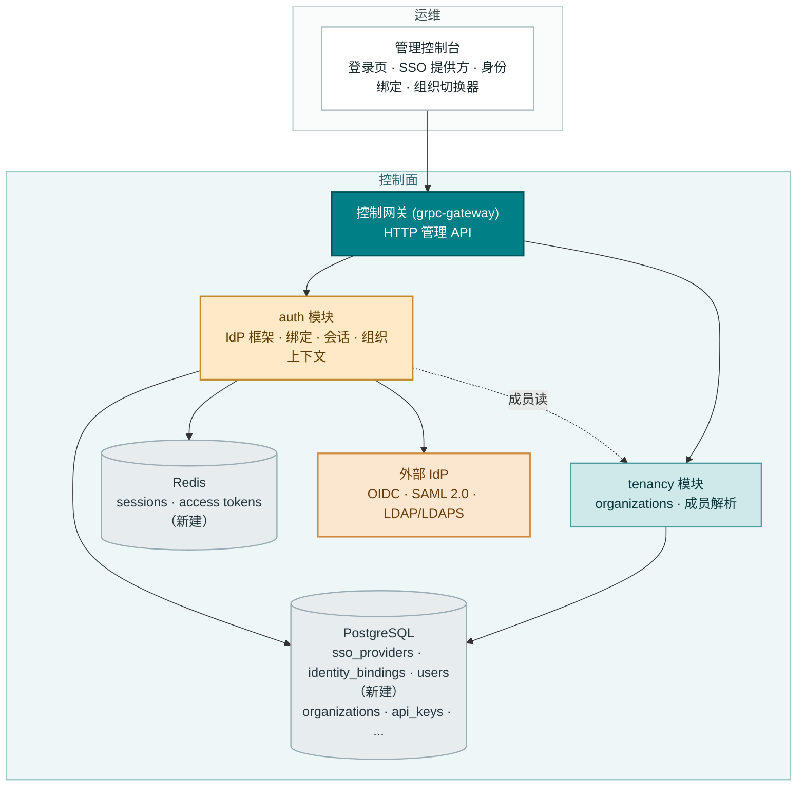
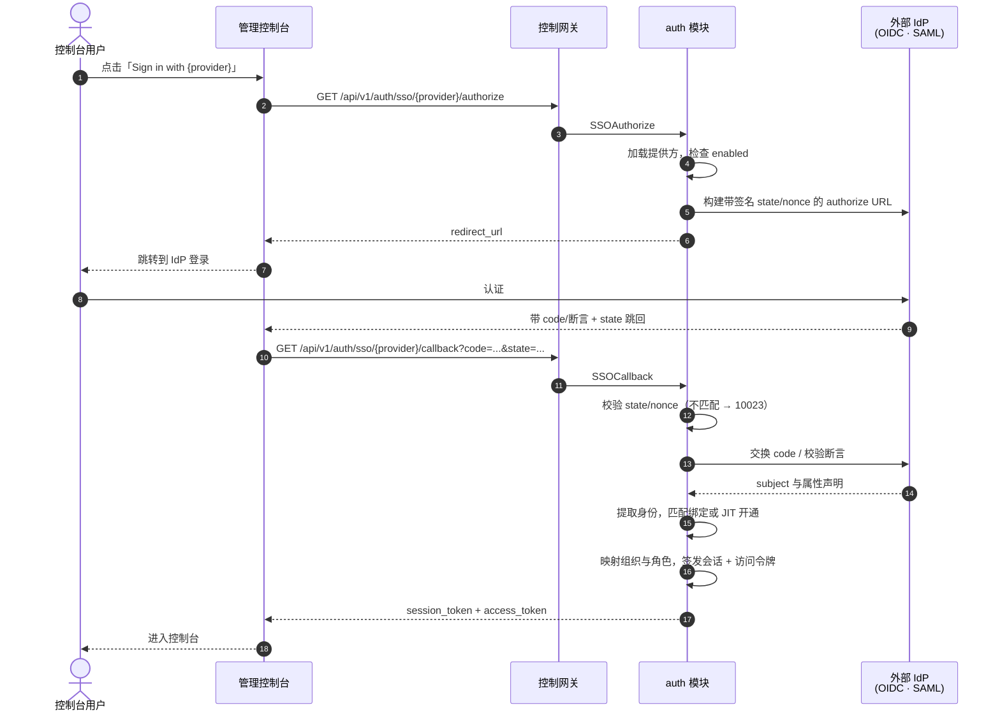
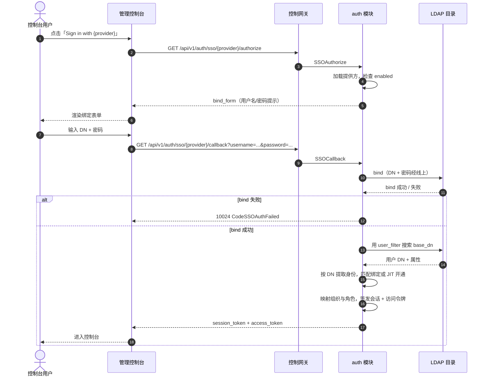
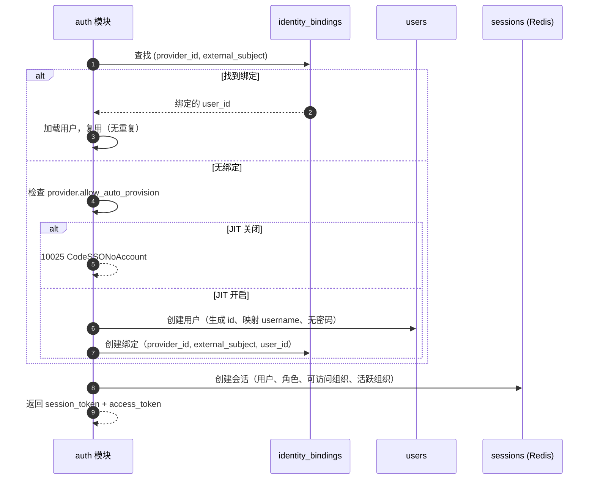
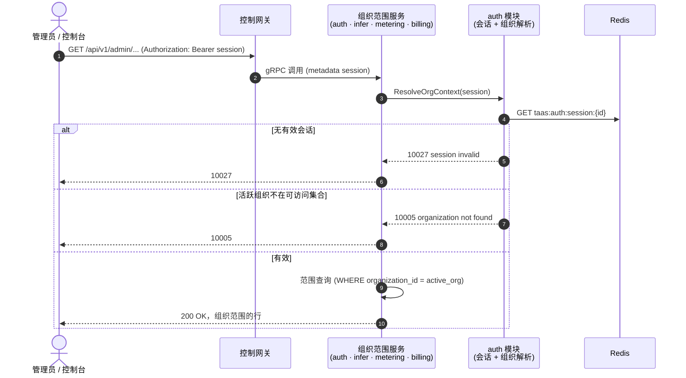

# SSO 联邦（OIDC/LDAP/SAML）与账号绑定 — 架构与详细设计

| 属性 | 内容 |
| --- | --- |
| 特性点 | SSO 联邦（OIDC/LDAP/SAML）与账号绑定 |
| 文档范围 | 认证核心的架构与详细设计：可插拔身份提供方（IdP）框架（OIDC、SAML 2.0、LDAP/LDAPS）、提供方配置管理、SSO 登录流程（authorize + callback）、账号绑定与即时开通（JIT Provisioning）、会话与访问令牌、属性到角色映射、控制台登录页与会话处理、组织上下文从过渡期 `X-Organization-Id` 头演进为会话派生上下文，以及各层的函数级设计 |
| 归属模块 | `auth`（IdP 框架、身份绑定、会话，及各模块消费的会话派生组织上下文），配合 `tenancy`（会话的组织成员解析） |
| 相关文档 | [需求分析与 UI/UX 设计](../design/sso-federation.zh-cn.md) · [架构设计](../design/architecture.zh-cn.md) 第 2.1 节 `auth` · [多租户](./multi-tenancy.zh-cn.md) — 本特性以会话替换的经校验组织上下文（其 D4/FR3.3）、本特性以会话成员资格落地的组织目录与切换器（其 D10/FR4.3） · [API Key 管理](./api-key-management.zh-cn.md) — 本特性保持不变的数据面 Key 校验 |
| 状态 | 架构完成，已移交研发代理 |

---

## 1. 目标与非目标

### 1.1 目标

- 在 `auth` 模块实现**可插拔 IdP 框架**（D1）：统一插件接口，三个钩子 — `authorize`、`callback`、`identity extraction` — 以及三个 v1 提供方：**OIDC/OAuth 2.0**、**SAML 2.0**、**LDAP/LDAPS**。提供方是配置行（CRUD），可同时启用多个。
- **提供方配置管理**（D2）：一张 `sso_providers` 表携带 `provider_id`、`type`、`display_name`、按类型的协议参数、`enabled`、`default_org`、`allow_auto_provision`、`attribute_mapping`。管理面 CRUD + 启用/禁用，位于 `/api/v1/admin/auth/sso/providers`。
- **身份绑定**（D3）：一张 `identity_bindings` 表，以 `(provider_id, external_subject)` 为键，其中 `external_subject` = `issuer + subject`（OIDC/SAML）或 `DN`（LDAP），绑定到平台 `user_id`。管理面管理，位于 `/api/v1/admin/auth/identity-bindings`。
- **JIT 开通带可关闭开关**（D4）：首次登录时，若 `allow_auto_provision`，自动创建平台用户并绑定；若关闭，以 10025 `CodeSSONoAccount` 拒绝，由管理员预分配绑定。
- **会话与访问令牌**（D5）：成功登录签发服务端会话（Redis 存储、可撤销）与访问令牌。`Logout` 撤销会话。令牌轮换与单点登出（SLO）延后。
- **组织上下文来自会话**（D6）：对已认证的控制台请求，组织上下文来自会话的活跃组织（对照用户可访问组织校验），而非头。控制台停止发送 `X-Organization-Id`；头对 CLI/过渡期程序化访问仍受支持（按特性 #6 校验）。会话与头同时存在时，会话优先。
- **属性到角色映射**（D7）：提供方的 `attribute_mapping` 把 IdP 声明（组/角色）映射到平台组织、项目与角色。登录时把映射的组织/项目/角色应用到会话。各管理 API 上的角色执行延后。
- **控制台登录页与会话处理**（D8）：`/admin/login` 页把已启用提供方列为「Sign in with {display_name}」按钮；SSO 回调让控制台进入已认证状态；会话令牌存储并以 `Authorization: Bearer` 发送；登出按钮撤销会话。组织切换器列出用户可访问的组织（来自会话），切换更新会话的活跃组织。
- **新错误码**（D10）：10020 `CodeSSOProviderExists`、10021 `CodeSSOProviderNotFound`、10022 `CodeSSOProviderDisabled`、10023 `CodeSSOInvalidState`、10024 `CodeSSOAuthFailed`、10025 `CodeSSONoAccount`、10026 `CodeIdentityBindingExists`、10027 `CodeSessionInvalid`、10028 `CodeSSOProviderInvalid`。

### 1.2 非目标

| 项 | 延后至 |
| --- | --- |
| 微信提供方（扫码登录） | 未来插件（独立 IdP 类型） |
| 各管理 API 的完整 RBAC 执行 | 专门的授权设计 |
| 令牌轮换与单点登出（SLO） | 加固后续 |
| SCIM 目录同步 | 未来 |
| 既有 `CreateUser`/`Login` 之外的本地密码生命周期（注册/重置） | 次于联邦 |
| 项目范围资源列 | 特性 #6 延后 |
| CLI SSO 命令 | 下次触碰 CLI 面时 |
| 会话审计轨迹（谁在控制台做了什么） | 未来运维工具 |

---

## 2. 组件视图



| 组件 | 本特性中的职责 |
| --- | --- |
| 控制网关（`grpc-gateway`） | 15 个新 `AuthService` RPC 的 HTTP/JSON 门面；`Authorization: Bearer` 作为 gRPC metadata 透传用于会话解析；`X-Organization-Id` 对 CLI/过渡期调用方透传 |
| `auth` 模块（`services/auth`） | IdP 插件框架（authorize/callback/identity-extraction 钩子）、`sso_providers`/`identity_bindings`/`users` 表、SSO 登录流程、JIT 开通、Redis 会话与访问令牌、属性到角色映射，以及会话派生的组织上下文解析函数 |
| `tenancy` 模块（`services/tenancy`） | 会话的组织成员解析：会话的活跃组织与可访问组织对照 `organizations` 表校验（特性 #6 的 `OrgGuard` 读接口） |
| PostgreSQL | `sso_providers`、`identity_bindings`、`users` 表（新建）；既有表不变 |
| Redis | 会话与访问令牌（新 keyspace `taas:auth:session:*`）；既有 API Key 缓存不动 |
| 外部 IdP | OIDC/OAuth 2.0、SAML 2.0、LDAP/LDAPS — 控制台绝不处理联邦凭据；凭据由 IdP 掌握 |
| 消息队列 | **不变** — SSO 仅走 RPC；无新 subject、无消费方、无 runner |
| 控制台 | 登录页、SSO 提供方页、身份绑定页、会话感知组织切换器、登出（契约见第 10.8 节） |

---

## 3. 数据模型

### 3.1 `sso_providers` 表

| 列 | PostgreSQL 类型 | 约束 | 描述 |
| --- | --- | --- | --- |
| `id` | `varchar(64)` | PRIMARY KEY | 调用方提供的不变提供方 id，`^[a-z0-9][a-z0-9-]{2,63}`（3-64 字符，小写） |
| `type` | `varchar(16)` | NOT NULL | `oidc` / `saml` / `ldap`（不可变） |
| `display_name` | `varchar(128)` | NOT NULL | 可变显示名，1-128 字符 |
| `issuer` | `varchar(512)` | NULL | OIDC：IdP issuer URL |
| `client_id` | `varchar(256)` | NULL | OIDC：客户端 id |
| `client_secret` | `varchar(512)` | NULL | OIDC：客户端密钥（只写，读取时掩码） |
| `redirect_uri` | `varchar(512)` | NULL | OIDC：已注册的重定向 URI |
| `scopes` | `varchar(512)` | NULL | OIDC：空格分隔的 scopes（默认 `openid profile email`） |
| `metadata_url` | `varchar(512)` | NULL | SAML：IdP metadata URL |
| `entity_id` | `varchar(512)` | NULL | SAML：SP entity id |
| `acs_url` | `varchar(512)` | NULL | SAML：断言消费服务 URL |
| `host` | `varchar(256)` | NULL | LDAP：目录主机 |
| `port` | `int` | NULL | LDAP：目录端口（LDAPS 为 389 / 636） |
| `bind_dn` | `varchar(512)` | NULL | LDAP：服务绑定 DN（只写，读取时掩码） |
| `base_dn` | `varchar(512)` | NULL | LDAP：搜索基 DN |
| `user_filter` | `varchar(512)` | NULL | LDAP：用户搜索过滤器（如 `(uid={{username}})`） |
| `enabled` | `boolean` | NOT NULL DEFAULT false | 提供方是否接受登录 |
| `default_org` | `varchar(64)` | NULL | 无组织声明映射时分配给会话的组织（必须存在于 `organizations`） |
| `allow_auto_provision` | `boolean` | NOT NULL DEFAULT true | 首次登录的 JIT 开通 |
| `attribute_mapping` | `jsonb` | NOT NULL DEFAULT '{}' | 声明/属性 → 平台字段映射（第 3.4 节） |
| `created_at` | `timestamptz` | NOT NULL | 行创建时间（UTC） |
| `updated_at` | `timestamptz` | NOT NULL | 更新与状态迁移时递增 |

设计说明：

- 主键是调用方提供的 id（D2）：提供方是具名、可寻址的资源。重复插入映射为 10020（FR1.1）。
- 协议参数是**按类型的可空列**而非 JSON blob：控制台的提供方表单按类型渲染正确字段，插件只解释自己的列。这让校验保持同步且类型安全。
- 密钥（`client_secret`、`bind_dn`）只写：在 list/get 响应中返回掩码（`"••••"`），绝不回显（契约约束 3）。
- `enabled` 只能经启用/禁用端点迁移 — 绝不通过 `Update*`（契约约束 1）。
- `default_org` 在创建/更新时校验存在于 `organizations`（未知 → 10005）；它是无组织声明映射时的回退活跃组织。

### 3.2 `identity_bindings` 表

| 列 | PostgreSQL 类型 | 约束 | 描述 |
| --- | --- | --- | --- |
| `id` | `uuid` | PRIMARY KEY | 生成的绑定 id（`DELETE .../identity-bindings/{binding_id}` 路径形状） |
| `provider_id` | `varchar(64)` | NOT NULL, index | 所属提供方（FK 到 `sso_providers.id`） |
| `external_subject` | `varchar(512)` | NOT NULL | `issuer + subject`（OIDC/SAML）或 `DN`（LDAP）— 稳定外部身份 |
| `user_id` | `uuid` | NOT NULL, index | 绑定的平台用户 |
| `created_at` | `timestamptz` | NOT NULL | 行创建时间 |

设计说明：

- **唯一性**：`UNIQUE (provider_id, external_subject)` — 复合键是外部身份的主键（D3）。重复插入映射为 10026（FR3.1）。
- `idx_identity_bindings_provider (provider_id)` 服务按提供方过滤的目录列表；`idx_identity_bindings_user (user_id)` 服务按用户过滤的列表与反向查找（用户绑定了哪些提供方）。
- 绑定是持久证据：存在绑定时 `DeleteSSOProvider` 被阻断（10026，FR1.6）。删除绑定切断外部链接但**保留用户**（FR3.3）。
- v1 不对 `users` 加 FK 约束（`users` 表是本特性新增；账号模型稳定后可加真实 FK）。绑定的 `user_id` 在创建时校验存在（未知 → 10005）。

### 3.3 `users` 表

| 列 | PostgreSQL 类型 | 约束 | 描述 |
| --- | --- | --- | --- |
| `id` | `uuid` | PRIMARY KEY | 生成的用户 id |
| `username` | `varchar(128)` | NOT NULL, uniqueIndex | 显示/登录名（JIT 用户来自映射的 username 声明） |
| `email` | `varchar(256)` | NULL | 映射的 email 声明（可选） |
| `password_hash` | `varchar(256)` | NULL | 本地密码哈希；仅联邦用户为 NULL（JIT 创建的用户在设置密码前不能经本地密码登录，FR3.4） |
| `created_at` | `timestamptz` | NOT NULL | 行创建时间 |
| `updated_at` | `timestamptz` | NOT NULL | 更新时递增 |

设计说明：

- `users` 表是本特性引入的账号模型。它刻意最小化：username、email、可选密码哈希、时间戳。角色与组织成员**不是**列 — 它们按会话从属性映射与 `organizations` 表派生（D7）。
- `username` 唯一但**不是**绑定键：绑定键是 `(provider_id, external_subject)`（D3）。邮箱可变，绝不能作为键。
- 既有 `CreateUser`/`Login` RPC（本地密码生命周期）在本特性**不实现**（延后，第 1.2 节）；`users` 表由 JIT 开通与身份绑定创建和使用，本地密码路径稍后落地。

### 3.4 `attribute_mapping` JSON 形状

`attribute_mapping` 列是一个 JSON 对象，把 IdP 声明/属性路径映射到平台字段：

```json
{
  "username": "preferred_username",
  "email": "email",
  "org": "groups",
  "project": "groups",
  "role": "groups"
}
```

- `username` / `email`：从中提取平台 username/email 的声明路径（OIDC 声明名、SAML 属性名或 LDAP 属性）。
- `org` / `project` / `role`：其**值**被映射到平台组织/项目/角色的声明路径（通常是组/角色声明）。映射基于值：声明的值对照 `organizations` 表（组织）与角色词汇表（角色）匹配。登录时把映射的组织/项目/角色应用到会话（D7）。
- 映射由提供方插件的 identity-extraction 钩子解释；畸形映射（未知声明路径、不可映射角色）在创建/更新时 → 10028。

### 3.5 会话（Redis）

会话**不是**表 — 它们存于 Redis（D5），键为 `taas:auth:session:{session_id}`：

| 键 | 类型 | 内容 |
| --- | --- | --- |
| `taas:auth:session:{session_id}` | Hash | `user_id`、`username`、`roles`（JSON 数组）、`accessible_orgs`（JSON 数组）、`active_org`、`expires_at`（unix）、`created_at`（unix） |
| `taas:auth:session:{session_id}:token` | String | 访问令牌（不透明，随机 32 字节 base64url），TTL = 会话 TTL |

设计说明：

- 会话 id 是随机 UUID；访问令牌是独立的随机不透明值。两者在登录时返回；控制台存储**会话令牌**并以 `Authorization: Bearer` 发送（D8）。
- 会话哈希携带完整上下文（用户、角色、可访问组织、活跃组织），组织范围服务无需 DB 连接即可从会话解析组织上下文（第 5.4 节）。
- TTL = `auth.sessionTTL`（默认 24h，既有配置）。过期惰性执行：对过期键的 `GetSession`/组织解析返回 10027 `CodeSessionInvalid`。
- **撤销**：`Logout` 删除会话键与令牌键（幂等）。已撤销会话的后续 `GetSession` → 10027（FR4.2）。
- 既有 API Key 缓存 keyspace（`taas:auth:apikey:*`）不动。

### 3.6 迁移策略

三张新表（`sso_providers`、`identity_bindings`、`users`）在 `auth` 模块的 `Migrate` 中经 GORM `AutoMigrate` 创建（既有模式 — GORM 模型是 schema 的唯一事实来源）。迁移**仅增量**：无既有表或列变更。Redis 无需迁移 — 会话键在运行时创建与过期。

---

## 4. API 契约

### 4.1 RPC 面

所有 API 属于既有 **`taas.auth.v1.AuthService`**（proto：`proto/taas/auth/v1/auth.proto`），经控制网关以 HTTP 提供。提供方与绑定管理是管理面，在 `/api/v1/admin/auth/*` 之下；登录、会话与登出是用户面，在 `/api/v1/auth/*` 之下（D9，按架构文档第 3.1 节分离）。数据面 `VerifyAPIKey` RPC 不变。

| RPC | HTTP | 状态 | 用途 |
| --- | --- | --- | --- |
| `CreateSSOProvider` | `POST /api/v1/admin/auth/sso/providers` | **新增** | 创建提供方；坏输入 10020/10028 |
| `ListSSOProviders` | `GET /api/v1/admin/auth/sso/providers` | **新增** | 提供方目录；分页；`type`/`enabled` 过滤；密钥掩码 |
| `GetSSOProvider` | `GET /api/v1/admin/auth/sso/providers/{provider_id}` | **新增** | 单个提供方；未知 10021 |
| `UpdateSSOProvider` | `PATCH /api/v1/admin/auth/sso/providers/{provider_id}` | **新增** | 编辑名称/参数/JIT/映射；id 与类型不可变 |
| `EnableSSOProvider` | `POST …/providers/{provider_id}:enable` | **新增** | 激活；幂等 |
| `DisableSSOProvider` | `POST …/providers/{provider_id}:disable` | **新增** | 暂停；幂等；authorize → 10022 |
| `DeleteSSOProvider` | `DELETE …/providers/{provider_id}` | **新增** | 移除；存在绑定时阻断（10026） |
| `SSOAuthorize` | `GET /api/v1/auth/sso/{provider}/authorize` | **新增** | 发起登录；跳转 URL 或 LDAP 绑定表单 |
| `SSOCallback` | `GET /api/v1/auth/sso/{provider}/callback` | **新增** | 完成登录；校验 state；签发会话 |
| `GetSession` | `GET /api/v1/auth/session` | **新增** | 当前会话；无效时 10027 |
| `UpdateSessionOrg` | `POST /api/v1/auth/session/org` | **新增** | 切换活跃组织；对照可访问组织校验 |
| `Logout` | `POST /api/v1/auth/logout` | **新增** | 撤销会话；幂等 |
| `CreateIdentityBinding` | `POST /api/v1/admin/auth/identity-bindings` | **新增** | 预分配绑定；重复 10026 |
| `ListIdentityBindings` | `GET /api/v1/admin/auth/identity-bindings` | **新增** | 绑定目录；`provider_id`/`user_id` 过滤 |
| `DeleteIdentityBinding` | `DELETE …/identity-bindings/{binding_id}` | **新增** | 切断绑定；幂等；用户保留 |
| `VerifyAPIKey` | （gRPC，数据面） | 不变 | 数据面认证；不受 SSO 影响 |

### 4.2 新消息

```proto
// 提供方管理（管理面）。
message SSOProvider {
  string provider_id = 1;
  string type = 2;              // oidc | saml | ldap
  string display_name = 3;
  // 协议参数（按类型；读取时密钥掩码）。
  string issuer = 4;
  string client_id = 5;
  string client_secret = 6;     // 只写；读取时掩码
  string redirect_uri = 7;
  string scopes = 8;
  string metadata_url = 9;
  string entity_id = 10;
  string acs_url = 11;
  string host = 12;
  int32 port = 13;
  string bind_dn = 14;          // 只写；读取时掩码
  string base_dn = 15;
  string user_filter = 16;
  bool enabled = 17;
  string default_org = 18;
  bool allow_auto_provision = 19;
  string attribute_mapping = 20; // JSON 字符串
  int64 created_at = 21;
  int64 updated_at = 22;
}

message CreateSSOProviderRequest  { SSOProvider provider = 1; }
message CreateSSOProviderResponse { taas.common.v1.Response response = 1; SSOProvider provider = 2; }
message ListSSOProvidersRequest   { taas.common.v1.PageRequest page = 1; string type = 2; bool enabled = 3; }
message ListSSOProvidersResponse  { taas.common.v1.Response response = 1; repeated SSOProvider providers = 2; taas.common.v1.PageMeta page_meta = 3; }
message GetSSOProviderRequest     { string provider_id = 1; }
message GetSSOProviderResponse    { taas.common.v1.Response response = 1; SSOProvider provider = 2; }
message UpdateSSOProviderRequest  { string provider_id = 1; SSOProvider provider = 2; }
message UpdateSSOProviderResponse { taas.common.v1.Response response = 1; SSOProvider provider = 2; }
message EnableSSOProviderRequest  { string provider_id = 1; }
message EnableSSOProviderResponse { taas.common.v1.Response response = 1; SSOProvider provider = 2; }
message DisableSSOProviderRequest { string provider_id = 1; }
message DisableSSOProviderResponse{ taas.common.v1.Response response = 1; SSOProvider provider = 2; }
message DeleteSSOProviderRequest  { string provider_id = 1; }
message DeleteSSOProviderResponse { taas.common.v1.Response response = 1; }

// SSO 登录流程（用户面）。
message SSOAuthorizeRequest  { string provider_id = 1; }
message SSOAuthorizeResponse { taas.common.v1.Response response = 1; string redirect_url = 2; string bind_form = 3; }
message SSOCallbackRequest   { string provider_id = 1; string code = 2; string state = 3; string username = 4; string password = 5; }
message SSOCallbackResponse  { taas.common.v1.Response response = 1; string session_token = 2; string access_token = 3; int64 expires_at = 4; }

// 会话（用户面）。
message GetSessionRequest  {}
message GetSessionResponse { taas.common.v1.Response response = 1; string user_id = 2; string username = 3; repeated string roles = 4; repeated string accessible_orgs = 5; string active_org = 6; int64 expires_at = 7; }
message UpdateSessionOrgRequest  { string organization_id = 1; }
message UpdateSessionOrgResponse { taas.common.v1.Response response = 1; string active_org = 2; }
message LogoutRequest  {}
message LogoutResponse { taas.common.v1.Response response = 1; }

// 身份绑定（管理面）。
message IdentityBinding {
  string binding_id = 1;
  string provider_id = 2;
  string external_subject = 3;
  string user_id = 4;
  int64 created_at = 5;
}
message CreateIdentityBindingRequest  { string provider_id = 1; string external_subject = 2; string user_id = 3; }
message CreateIdentityBindingResponse { taas.common.v1.Response response = 1; IdentityBinding binding = 2; }
message ListIdentityBindingsRequest   { taas.common.v1.PageRequest page = 1; string provider_id = 2; string user_id = 3; }
message ListIdentityBindingsResponse  { taas.common.v1.Response response = 1; repeated IdentityBinding bindings = 2; taas.common.v1.PageMeta page_meta = 3; }
message DeleteIdentityBindingRequest  { string binding_id = 1; }
message DeleteIdentityBindingResponse { taas.common.v1.Response response = 1; }
```

### 4.3 线格式（既有惯例）

- 分页绑定为 `?page.offset=0&page.limit=20`（点分形式）；默认 limit 20，上限 100；两个列表都按最新优先（`created_at DESC`）。
- 成功响应为 HTTP 200；业务错误渲染为 `{"code": <int>, "message": "..."}`。
- `UpdateSSOProvider` 替换可变字段（显示名、协议参数、`default_org`、`allow_auto_provision`、`attribute_mapping`）；`provider_id` 与 `type` 不可变（契约约束 1）。
- `Enable*`/`Disable*` 从路径取 id、空 body；返回更新后的提供方，控制台无需重新拉取即可刷新行。
- 过滤：`ListSSOProviders?type=&enabled=`；`ListIdentityBindings?provider_id=&user_id=`；未知 `type` 值 → 10028。
- 密钥（`client_secret`、`bind_dn`）只写：在 list/get 响应中返回掩码（`"••••"`），绝不回显（契约约束 3）。
- int64 字段序列化为 JSON 字符串（既有惯例）。

### 4.4 校验矩阵（同步）

`CreateSSOProvider` 按序执行这些检查；首个失败立即返回且不写入任何内容（AC1）：

| # | 检查 | 失败码 |
| --- | --- | --- |
| 1 | `provider_id` 匹配 `^[a-z0-9][a-z0-9-]{2,63}$` | 10028 `CodeSSOProviderInvalid` |
| 2 | `type` ∈ {`oidc`, `saml`, `ldap`} | 10028 |
| 3 | `display_name` 修剪后 1-128 字符 | 10028 |
| 4 | 协议参数对类型有效（OIDC：issuer/client_id/redirect_uri 非空；SAML：metadata_url 或 entity_id+acs_url；LDAP：host/port/base_dn 非空） | 10028 |
| 5 | `default_org` 为空或存在于 `organizations` | 10005 `CodeOrganizationNotFound` |
| 6 | `attribute_mapping` 是含已知声明路径的有效 JSON | 10028 |
| 7 | id 尚未存在 | 10020 `CodeSSOProviderExists` |

`CreateIdentityBinding`（AC8）：

| # | 检查 | 失败码 |
| --- | --- | --- |
| 1 | `provider_id` 存在 | 10021 `CodeSSOProviderNotFound` |
| 2 | `external_subject` 非空 | 10028 |
| 3 | `user_id` 存在于 `users` | 10005 `CodeOrganizationNotFound`（复用：未知用户） |
| 4 | `(provider_id, external_subject)` 尚未存在 | 10026 `CodeIdentityBindingExists` |

`UpdateSSOProvider`：未知 id → 10021；可变字段与创建同校验（10028/10005）。`Enable*`/`Disable*`：未知 id → 10021；否则幂等成功。`DeleteSSOProvider`：未知 id → 10021；存在绑定 → 10026。`SSOAuthorize`：未知 id → 10021；被禁用 → 10022。`SSOCallback`：坏 state/nonce → 10023；IdP 拒绝 → 10024；JIT 关闭且无绑定 → 10025。`UpdateSessionOrg`：不可访问组织 → 10005。`GetSession`/`Logout` 在缺失/过期/已撤销会话上 → 10027。

### 4.5 消息契约

无。SSO 仅走 RPC：无 MQ subject、无消费方、无 runner（第 2 节）。数据面计量路径不动 — `VerifyAPIKey` 与计量事件消费方不变。

---

## 5. 时序图

### 5.1 SSO 登录流程（OIDC/SAML）



### 5.2 SSO 登录流程（LDAP）



### 5.3 JIT 开通与账号绑定



### 5.4 组织上下文解析（会话）



---

## 6. 错误处理

所有错误都是统一信封中的 `pkg/errors` 业务码。auth 段分配九个新码（D10）；10005/10001 已存在并被复用。

| 条件 | 码 | 常量 | 备注 |
| --- | --- | --- | --- |
| 重复提供方 id | 10020 | `CodeSSOProviderExists` | **新增**；规范消息 "sso provider already exists" |
| 未知提供方 | 10021 | `CodeSSOProviderNotFound` | **新增**；"sso provider not found" |
| authorize 上的被禁用提供方 | 10022 | `CodeSSOProviderDisabled` | **新增**；"sso provider disabled" |
| 回调上的非法 state/nonce | 10023 | `CodeSSOInvalidState` | **新增**；"sso invalid state" |
| IdP 拒绝交换/bind | 10024 | `CodeSSOAuthFailed` | **新增**；"sso authentication failed" |
| JIT 关闭、无绑定 | 10025 | `CodeSSONoAccount` | **新增**；"no account for this identity" |
| 重复身份绑定 | 10026 | `CodeIdentityBindingExists` | **新增**；"identity binding already exists" |
| 缺失/过期/已撤销会话 | 10027 | `CodeSessionInvalid` | **新增**；"session invalid" |
| 畸形提供方配置 | 10028 | `CodeSSOProviderInvalid` | **新增**；"sso provider invalid" |
| 未知组织（组织上下文） | 10005 | `CodeOrganizationNotFound` | 既有；复用于不可访问的活跃组织与绑定上的未知用户 |
| 缺 `X-Organization-Id`（仅头） | 10001 | `CodeUnauthorized` | 对 CLI/过渡期不变 |
| 数据库故障 | 500 | `CodeInternal` | 经错误归一化 |

仓库把 GORM `ErrRecordNotFound` 映射为 10021（提供方）/ 10026（绑定）/ 10027（会话）；重复插入安全竞态 — 主键/唯一索引是仲裁者，并发重复创建把唯一冲突错误映射为 10020/10026（`CreateImage` 模式）。

---

## 7. 配置新增

既有 `auth` 配置段新增会话设置（设计的 D5）：

| 键 | 默认 | 描述 |
| --- | --- | --- |
| `auth.sessionTTL` | `24h` | 签发的会话与访问令牌的 TTL（已存在；现在实际使用） |
| `auth.localPasswordLogin` | `true` | 启用/禁用与 SSO 并存的本地密码登录（已存在；`users` 表现在存在） |
| `auth.autoRegister` | `true` | 全局 JIT 开通默认值；按提供方的 `allow_auto_provision` 覆盖它 |

规则：

- `Configuration.applyDefaults` 在为空时填充默认值；`Validate` 新增：`sessionTTL` > 0、`localPasswordLogin` 布尔、`autoRegister` 布尔。
- `configs/server.yaml` 与 `configs/config.yaml` 已携带 `auth.sessionTTL`、`auth.localPasswordLogin`、`auth.autoRegister`；无需新配置段 — SSO 特性完全通过 `sso_providers` 表（管理面 CRUD）配置，而非静态配置。

---

## 8. 安全考量

- **关闭自由文本身份漏洞**（D6）：过渡期头变为会话派生上下文。控制台停止发送 `X-Organization-Id`；无会话且无头的调用方 → 10001；活跃组织不可访问的会话 → 10005。两者同时存在时会话权威。
- **凭据绝不在控制台**（D1）：联邦登录跳转到 IdP；控制台绝不处理密码。LDAP 是例外（线上 bind），但密码仅用于绑定，绝不持久化（FR2.5）。
- **稳定绑定键**（D3）：`(provider_id, external_subject)` 是绑定键，而非邮箱 — 重新登录匹配绑定，绝不创建重复账号（AC6/AC7）。
- **回调校验**（D2/FR2.2）：回调校验 `state`/`nonce`（10023）与 IdP 交换/断言签名（10024）以防请求伪造。
- **可撤销的服务端会话**（D5）：会话存于 Redis 且可经 `Logout` 撤销；无状态客户端 cookie 无法在服务端撤销。
- **密钥只写**（契约约束 3）：`client_secret` 与 `bind_dn` 读取时掩码，绝不回显。
- **JIT 可关闭**（D4）：锁定部署关闭 `allow_auto_provision` 并预分配绑定，只有预先批准的身份能进入控制台（AC7）。
- **会话哈希无密钥**：会话携带用户 id、角色、可访问组织、活跃组织 — 绝无密码或 IdP 令牌。

---

## 9. 发布说明

- **Schema**：三张新表（`sso_providers`、`identity_bindings`、`users`）在首次启动时经 AutoMigrate 创建；仅增量 — 无既有表或列变更（第 3.6 节）。
- **Proto**：既有 `proto/taas/auth/v1/auth.proto` 新增 15 个 RPC 与消息 — `make pbgen` 必需；生成代码不提交。
- **接线**：`apps/taas-server/main.go` 把 Redis 会话存储接入 `auth` 服务（经 `pkg/redisx` 的既有 Redis 组件）；`auth`（及四个消费方）的组织上下文解析函数在存在会话时从会话供数。
- **组织上下文变化（点名）**：特性 #6 的解析函数（`resolveOrganizationID`）保留，但输入变化。对已认证的控制台请求，组织上下文来自会话的活跃组织；`X-Organization-Id` 头对 CLI/过渡期调用方仍受支持（仅头调用方保持特性 #6 行为）。两者同时存在时，会话优先，头被忽略（D6，FR4.4）。
- **升级兼容性**：本特性其余部分纯增量 — 无 MQ 变更、无数据面变更、无既有 RPC 线格式变更。`VerifyAPIKey` 不变。
- **滚动更新顺序**：单独部署 `taas-server`；启动时迁移器创建三张表；会话存储随新二进制激活。回滚只留下三张未用表。

---

## 10. 详细设计

### 10.1 文件布局

| 模块 | 文件 | 内容 |
| --- | --- | --- |
| `proto/taas/auth/v1` | `auth.proto` | 15 个新 RPC + 请求/响应/提供方/绑定/会话消息 |
| `services/auth` | `sso_model.go` | GORM 模型 `SSOProvider`、`IdentityBinding`、`User` + `TableName` + 类型/状态常量 |
| | `sso_repository.go` | `SSORepository`（提供方 CRUD、绑定 CRUD、用户创建/查找） |
| | `sso_plugin.go` | `IdPPlugin` 接口 + `OIDCPlugin`、`SAMLPlugin`、`LDAPPlugin` |
| | `sso_plugin_oidc.go` | OIDC/OAuth 2.0 提供方实现 |
| | `sso_plugin_saml.go` | SAML 2.0 提供方实现 |
| | `sso_plugin_ldap.go` | LDAP/LDAPS 提供方实现 |
| | `session_store.go` | Redis 会话存储（create/get/update-org/revoke） |
| | `service.go` | 15 个 RPC 实现 + `Migrate`（AutoMigrate）+ `NewForFVT` + `MigrateSchemaForFVT` + 会话感知组织解析函数 |
| `pkg/errors` | `codes.go`、`messages.go` | 10020-10028 + 规范消息 |
| `pkg/config` | `api.go`、`configuration.go` | `sessionTTL`/`localPasswordLogin`/`autoRegister` 校验 |
| `apps/taas-server` | `main.go` | 把 Redis 会话存储接入 `auth` |
| `web/src` | `pages/LoginPage.tsx` | `/admin/login` 页 |
| | `pages/SSOProvidersPage.tsx` | SSO 提供方目录 + 创建/编辑对话框 |
| | `pages/IdentityBindingsPage.tsx` | 身份绑定目录 + 预分配对话框 |
| | `org.tsx` | OrgSwitcher → 会话感知（来自 `GetSession`） |
| | `App.tsx`、`api.ts`、`router.tsx` | 路由/导航项；`SSOProvider`/`IdentityBinding`/`Session` 类型；会话令牌存储 |
| `test/fvt` | `sso_fvt_test.go` | SSO FVT（AC1-AC13、AC19），带假 IdP |
| | `auth_apikey_fvt_test.go` | 回归：会话感知组织解析 + 仅头路径 |
| `test/e2e` | `tests/sso.js` | SSO e2e（AC14-AC19），带假 IdP |
| | `page-objects/api.js` | `ssoLogin`/`ensureOrg` 辅助函数 |

### 10.2 `auth` 模块

GORM 模型（唯一事实来源）：

```go
// SSO 提供方类型（D1）。
const (
    ProviderTypeOIDC = "oidc"
    ProviderTypeSAML = "saml"
    ProviderTypeLDAP = "ldap"
)

type SSOProvider struct {
    ID                 string    `gorm:"primaryKey;size:64"`
    Type               string    `gorm:"size:16;not null"`
    DisplayName        string    `gorm:"size:128;not null"`
    Issuer             string    `gorm:"size:512"`
    ClientID           string    `gorm:"size:256"`
    ClientSecret       string    `gorm:"size:512"`
    RedirectURI        string    `gorm:"size:512"`
    Scopes             string    `gorm:"size:512"`
    MetadataURL        string    `gorm:"size:512"`
    EntityID           string    `gorm:"size:512"`
    ACSUrl             string    `gorm:"size:512"`
    Host               string    `gorm:"size:256"`
    Port               int
    BindDN             string    `gorm:"size:512"`
    BaseDN             string    `gorm:"size:512"`
    UserFilter         string    `gorm:"size:512"`
    Enabled            bool      `gorm:"not null;default:false"`
    DefaultOrg         string    `gorm:"size:64"`
    AllowAutoProvision bool      `gorm:"not null;default:true"`
    AttributeMapping   string    `gorm:"type:jsonb;not null;default:'{}'"`
    CreatedAt          time.Time
    UpdatedAt          time.Time
}

func (SSOProvider) TableName() string { return "sso_providers" }

type IdentityBinding struct {
    ID               string    `gorm:"primaryKey;type:uuid"`
    ProviderID       string    `gorm:"size:64;not null;index:idx_identity_bindings_provider"`
    ExternalSubject  string    `gorm:"size:512;not null"`
    UserID           string    `gorm:"type:uuid;not null;index:idx_identity_bindings_user"`
    CreatedAt        time.Time
}

func (IdentityBinding) TableName() string { return "identity_bindings" }

// (provider_id, external_subject) 上的唯一索引 — 外部身份的主键（D3）。
func (IdentityBinding) UniqueIndexes() map[string][]string {
    return map[string][]string{
        "idx_identity_bindings_provider_subject": {"provider_id", "external_subject"},
    }
}

type User struct {
    ID           string    `gorm:"primaryKey;type:uuid"`
    Username     string    `gorm:"size:128;not null;uniqueIndex"`
    Email        string    `gorm:"size:256"`
    PasswordHash string    `gorm:"size:256"`
    CreatedAt    time.Time
    UpdatedAt    time.Time
}

func (User) TableName() string { return "users" }
```

`SSORepository`（内嵌 `database.BaseRepository[SSOProvider]`，持有 `*database.Manager` — 既有模式）：

- `CreateProvider(ctx, p *SSOProvider) error` — INSERT；主键唯一冲突映射为 10020（`CreateImage` 错误映射模式）。
- `FindProvider(ctx, id string) (*SSOProvider, error)` — `ErrRecordNotFound` 透传（调用方映射为 10021）。
- `ListProviders(ctx, filter ProviderFilter) ([]*SSOProvider, int64, error)` — `type`/`enabled` 过滤、`created_at DESC`、offset/limit、总数。
- `UpdateProvider(ctx, id string, p *SSOProvider) (*SSOProvider, error)` — `UPDATE ... SET display_name, protocol params, default_org, allow_auto_provision, attribute_mapping, updated_at`；重选行。
- `SetProviderEnabled(ctx, id string, enabled bool) (*SSOProvider, error)` — `UPDATE ... SET enabled, updated_at WHERE id = ?`；幂等；重选。
- `DeleteProvider(ctx, id string) error` — `DELETE WHERE id = ?`；存在绑定时由调用方阻断（10026）。
- `CountBindingsByProvider(ctx, providerID string) (int64, error)` — 门控 `DeleteSSOProvider`（FR1.6）。
- `CreateBinding(ctx, b *IdentityBinding) error` — INSERT；`(provider_id, external_subject)` 唯一冲突映射为 10026。
- `FindBindingBySubject(ctx, providerID, externalSubject string) (*IdentityBinding, error)` — 登录查找（FR2.3）。
- `ListBindings(ctx, filter BindingFilter) ([]*IdentityBinding, int64, error)` — `provider_id`/`user_id` 过滤、`created_at DESC`、分页。
- `DeleteBinding(ctx, bindingID string) error` — 幂等；用户保留（FR3.3）。
- `CreateUser(ctx, u *User) error` — INSERT；`username` 唯一冲突映射为 10004 `CodeUserExists`。
- `FindUser(ctx, id string) (*User, error)` — `ErrRecordNotFound` 透传（调用方映射为 10005）。

### 10.3 IdP 插件框架（`sso_plugin.go`）

可插拔 IdP 框架（D1）是一个窄接口，三个钩子：

```go
// IdPPlugin 是可插拔身份提供方接口。每个提供方类型（oidc、saml、
// ldap）实现三个钩子。框架在运行时按 provider.Type 分发。
type IdPPlugin interface {
    // Authorize 为已启用提供方构建登录发起：跳转 URL（OIDC/SAML）
    // 或绑定表单（LDAP）。
    Authorize(ctx context.Context, p *SSOProvider) (*AuthorizeResult, error)

    // Callback 完成登录：校验 state/nonce、交换 code/断言或执行
    // LDAP bind，并返回提取的外部身份。
    Callback(ctx context.Context, p *SSOProvider, req *SSOCallbackRequest) (*Identity, error)
}

// AuthorizeResult 是 Authorize 的结果。
type AuthorizeResult struct {
    RedirectURL string // OIDC/SAML：带签名 state 的 IdP authorize URL
    BindForm    bool   // LDAP：控制台渲染用户名/密码提示
}

// Identity 是提取的外部身份 + 声明（identity-extraction 钩子的输出）。
type Identity struct {
    ExternalSubject string            // issuer + subject（OIDC/SAML）或 DN（LDAP）
    Username        string            // 来自映射的 username 声明
    Email           string            // 来自映射的 email 声明
    Claims          map[string][]string // 用于组织/角色映射的原始声明/属性
}
```

- `NewPlugin(type string) (IdPPlugin, error)` — 返回 `OIDCPlugin`、`SAMLPlugin` 或 `LDAPPlugin` 的工厂；未知类型 → 10028。
- 框架在运行时按 `provider.Type` 分发；新提供方类型（如微信）是实现同一接口的新插件 — 核心登录逻辑不变（D1/D11）。

**`OIDCPlugin`**（`sso_plugin_oidc.go`）：

- `Authorize`：构建 OIDC authorize URL（`issuer` + `/authorize`，带 `client_id`、`redirect_uri`、`scopes`、`response_type=code` 与签名 `state`/`nonce`）。state 是随机值，用服务端密钥（HMAC）签名，并存储在短时 Redis 键 `taas:auth:sso:state:{state}`（TTL 10 分钟）。
- `Callback`：对照存储键校验 `state`/`nonce`（不匹配 → 10023）、在令牌端点交换 `code`（失败 → 10024）、解码 ID token / userinfo，提取 `ExternalSubject = issuer + ":" + sub`、按映射声明路径提取 `Username`/`Email`，以及用于组织/角色映射的原始声明。

**`SAMLPlugin`**（`sso_plugin_saml.go`）：

- `Authorize`：构建到 IdP 的 SAML AuthnRequest 跳转（来自 `metadata_url` 或 `entity_id` + `acs_url`），带签名 `state`/`nonce`。
- `Callback`：校验 `state`/`nonce`（10023）、校验签名断言（无效签名 → 10024）、提取 `ExternalSubject = issuer + ":" + NameID`、按映射属性路径提取 `Username`/`Email`，以及用于组织/角色映射的原始属性。

**`LDAPPlugin`**（`sso_plugin_ldap.go`）：

- `Authorize`：返回 `BindForm: true` — 控制台渲染用户名/密码提示（FR2.1）。
- `Callback`：用提交的 DN/密码经线上执行目录绑定（失败 → 10024）、用 `user_filter` 在 `base_dn` 搜索用户的 DN 与属性、提取 `ExternalSubject = DN`、按映射属性路径提取 `Username`/`Email`，以及用于组织/角色映射的原始属性。密码仅用于绑定，绝不持久化（FR2.5）。

### 10.4 会话存储（`session_store.go`）

```go
// Session 是 Redis 中携带的服务端会话上下文。
type Session struct {
    SessionID      string   `json:"session_id"`
    UserID         string   `json:"user_id"`
    Username       string   `json:"username"`
    Roles          []string `json:"roles"`
    AccessibleOrgs []string `json:"accessible_orgs"`
    ActiveOrg      string   `json:"active_org"`
    ExpiresAt      int64    `json:"expires_at"` // unix 秒
    CreatedAt      int64    `json:"created_at"`
}

// SessionStore 是 Redis 会话存储。
type SessionStore struct { client *goredis.Client; ttl time.Duration }

func NewSessionStore(client *goredis.Client, ttl time.Duration) *SessionStore

// Create 以配置的 TTL 存储会话及其访问令牌。
func (s *SessionStore) Create(ctx context.Context, sess *Session, accessToken string) error

// Get 按 id 加载会话；缺失/过期键返回 CodeSessionInvalid。
func (s *SessionStore) Get(ctx context.Context, sessionID string) (*Session, error)

// UpdateOrg 设置会话的活跃组织（由调用方校验）。
func (s *SessionStore) UpdateOrg(ctx context.Context, sessionID, orgID string) error

// Revoke 删除会话及其令牌（幂等）。
func (s *SessionStore) Revoke(ctx context.Context, sessionID string) error
```

- 会话 id 是随机 UUID；访问令牌是独立的随机不透明值（32 字节 base64url）。两者在登录时返回；控制台存储**会话令牌**并以 `Authorization: Bearer` 发送（D8）。
- 会话哈希携带完整上下文（用户、角色、可访问组织、活跃组织），组织范围服务无需 DB 连接即可从会话解析组织上下文（第 5.4 节）。
- TTL = `auth.sessionTTL`（默认 24h）。过期惰性执行：对过期键的 `GetSession`/组织解析返回 10027。
- `Revoke` 幂等：删除缺失键成功（FR4.2）。

### 10.5 服务 RPC（`service.go`）

`Service` 结构体新增 `ssoRepo *SSORepository`、`sessionStore *SessionStore`、`pluginFactory`（`NewPlugin` 函数）。`NewForFVT(db, redisClient)` 直接接线；生产环境从共享组件惰性解析。

**提供方管理**（管理面）：

- `CreateSSOProvider(ctx, req)`：执行校验矩阵（第 4.4 节）；`CreateProvider`；返回提供方（密钥掩码）。
- `ListSSOProviders(ctx, req)`：规范化分页；`ListProviders` 带 `type`/`enabled` 过滤；映射为 `SSOProvider`（密钥掩码）。
- `GetSSOProvider(ctx, req)`：`FindProvider`；未知 → 10021；返回（密钥掩码）。
- `UpdateSSOProvider(ctx, req)`：`FindProvider`（10021）；校验可变字段（10028/10005）；`UpdateProvider`；返回。
- `EnableSSOProvider`/`DisableSSOProvider(ctx, req)`：`SetProviderEnabled`；幂等；返回更新后的提供方。
- `DeleteSSOProvider(ctx, req)`：`FindProvider`（10021）；`CountBindingsByProvider` > 0 → 10026；`DeleteProvider`；返回。

**SSO 登录流程**（用户面）：

- `SSOAuthorize(ctx, req)`：`FindProvider`（10021）；`!Enabled` → 10022；`NewPlugin(type).Authorize`；返回 `redirect_url` 或 `bind_form`。
- `SSOCallback(ctx, req)`：`FindProvider`（10021）；`NewPlugin(type).Callback`（校验 state → 10023、交换/bind → 10024）；提取 `Identity`；解析身份（第 5.3 节）：`FindBindingBySubject` → 命中：加载用户；未命中：`AllowAutoProvision` → `CreateUser` + `CreateBinding`（JIT），否则 → 10025。从声明映射组织与角色（第 3.4 节）；对照 `accessible_orgs` 校验活跃组织（10005）；`sessionStore.Create`；返回 `session_token` + `access_token` + `expires_at`。

**会话**（用户面）：

- `GetSession(ctx, req)`：从 `Authorization: Bearer` metadata 解析会话；`sessionStore.Get`（10027）；返回用户、角色、可访问组织、活跃组织、过期时间。
- `UpdateSessionOrg(ctx, req)`：解析会话（10027）；校验请求的组织在 `accessible_orgs` 中（10005）；`sessionStore.UpdateOrg`；返回。
- `Logout(ctx, req)`：解析会话（10027）；`sessionStore.Revoke`（幂等）；返回。

**身份绑定**（管理面）：

- `CreateIdentityBinding(ctx, req)`：执行校验矩阵（第 4.4 节）；`CreateBinding`；返回绑定。
- `ListIdentityBindings(ctx, req)`：规范化分页；`ListBindings` 带 `provider_id`/`user_id` 过滤；返回。
- `DeleteIdentityBinding(ctx, req)`：`DeleteBinding`；幂等；返回。

**组织上下文解析**（特性 #6 的解析函数，现在由会话供数）：

```go
// resolveOrgContext 返回组织范围 API 的组织上下文。
// 存在会话（Authorization: Bearer）时，会话的活跃组织优先，
// X-Organization-Id 头被忽略（D6，FR4.4）。无会话时使用过渡期头
// （仅头调用方保持特性 #6 行为）。
func (s *Service) resolveOrgContext(ctx context.Context) (string, error) {
    if sess, err := s.sessionFromContext(ctx); err == nil {
        // 会话存在且有效
        if sess.ActiveOrg == "" {
            return "", apierrors.New(apierrors.CodeOrganizationNotFound)
        }
        return sess.ActiveOrg, nil
    }
    // 无会话：回退到过渡期头
    return resolveOrganizationID(ctx)
}
```

- `sessionFromContext(ctx)` 从 incoming gRPC metadata 读取 `authorization`、去掉 `Bearer ` 前缀、调用 `sessionStore.Get`；缺失/过期/已撤销会话返回错误（调用方回退到头 — 校验失败的会话**不**阻断仅头 CLI 调用方）。
- 四个组织范围消费方（`auth`、`infer`、`metering`、`billing`）对仅头调用方保留 `resolveOrganizationID` + `checkOrg` 接线；`auth` 模块自己的组织范围 RPC（`ListAPIKeys`/`CreateAPIKey`/`RevokeAPIKey`）切换到 `resolveOrgContext`，使会话供数的控制台请求从会话解析。其余三个消费方在后续特性接线（其组织上下文在本特性不变 — 会话解析函数在 `auth` 中，此处由 `auth` 自己的 RPC 消费）。

### 10.6 `pkg/errors`、`pkg/config`（增量）

- `codes.go`：auth 段新增 `CodeSSOProviderExists Code = 10020`、`CodeSSOProviderNotFound Code = 10021`、`CodeSSOProviderDisabled Code = 10022`、`CodeSSOInvalidState Code = 10023`、`CodeSSOAuthFailed Code = 10024`、`CodeSSONoAccount Code = 10025`、`CodeIdentityBindingExists Code = 10026`、`CodeSessionInvalid Code = 10027`、`CodeSSOProviderInvalid Code = 10028`。
- `messages.go`："sso provider already exists"、"sso provider not found"、"sso provider disabled"、"sso invalid state"、"sso authentication failed"、"no account for this identity"、"identity binding already exists"、"session invalid"、"sso provider invalid"。
- `api.go`：`AuthConfig` 已携带 `SessionTTL`、`LocalPasswordLogin`、`AutoRegister`；`configuration.go` `Validate` 新增：`sessionTTL` > 0、`localPasswordLogin` 布尔、`autoRegister` 布尔。

### 10.7 `apps/taas-server/main.go`（增量）

```go
// srv.Init() 之后：
if redisClient := srv.Components().Redis().Client(); redisClient != nil {
    sessionStore := auth.NewSessionStore(redisClient, cfg.Auth.SessionTTL)
    authSvc.SetSessionStore(sessionStore)
}
```

- `auth` 服务新增 `SetSessionStore(*SessionStore)` setter（`SetOrgGuard` 模式）；生产环境从 Redis 组件接线；FVT 用一次性 Redis 接线；单元测试留 nil（会话 RPC 返回 10027）。

### 10.8 控制台契约

**登录页**（`/admin/login`，控制台的新前门）：

- 把已启用提供方列为「Sign in with {display_name}」按钮 `sso-login-{provider_id}`（来自 `ListSSOProviders`）。点击调用 `SSOAuthorize` 并跳转到 IdP；回调让控制台进入已认证状态。被禁用提供方状态显示提示 `sso-login-disabled-notice`。
- 会话令牌存储（localStorage）并在每个请求上以 `Authorization: Bearer` 发送；控制台**停止发送 `X-Organization-Id`**（D6）。10027 响应跳转到 `/admin/login`（FR5.2）。

**SSO 提供方页**（`/admin/sso`，导航项）：

- 目录表 `sso-providers-table`：每个提供方一行 `sso-provider-row-{id}` — id（等宽）、类型徽标、显示名、启用状态、`default_org`、`allow_auto_provision`。
- 「创建提供方」按钮 `create-sso-provider` 打开对话框 `create-sso-provider-dialog`，含 `sso-provider-type-select`（`sso-provider-type-option-{type}`）、`sso-provider-id-input`、`sso-provider-name-input`、按类型的协议参数、JIT 开关 `sso-provider-jit-toggle`、属性映射 `sso-provider-mapping-input`、保存 `sso-provider-save`；对话框内经 `ErrorBanner` 浮出内联 10020/10021/10026/10028 错误。
- 行操作：编辑 `sso-provider-edit-{id}` 打开 `edit-sso-provider-dialog`；启用/禁用 `sso-provider-enable-{id}`/`sso-provider-disable-{id}` 带确认 `sso-provider-confirm-dialog`（`sso-provider-confirm-ok`、`sso-provider-confirm-cancel`）；删除 `sso-provider-delete-{id}`（存在绑定时以提示 `sso-provider-delete-blocked` 阻断，10026）。
- 空状态 `sso-providers-empty`；可见时 60 秒轮询；`Pagination`。

**身份绑定页**（`/admin/identity-bindings`，导航项）：

- 目录表 `identity-bindings-table`：每个绑定一行 `identity-binding-row-{id}` — 提供方、外部 subject、用户、创建时间。
- 「预分配绑定」按钮 `create-identity-binding` 打开对话框 `create-identity-binding-dialog`，含 `identity-binding-provider-select`（`identity-binding-provider-option-{id}`）、`identity-binding-subject-input`、`identity-binding-user-input`、保存 `identity-binding-save`；内联 10026 错误。
- 行操作：删除 `identity-binding-delete-{id}` 带确认 `identity-binding-confirm-dialog`；空状态 `identity-bindings-empty`；60 秒轮询；`Pagination`。

**组织切换器**（`org.tsx`，会话感知）：

- 挂载时获取 `GetSession`；渲染 `select` `org-switcher-select`，每个可访问组织一个 `org-switcher-option-{id}`（来自会话），取代自由文本/全局列表（FR5.5）。切换调用 `UpdateSessionOrg` 并重渲染组织范围页面。
- 用户菜单中的登出按钮 `user-menu-logout` 调用 `Logout` 并返回 `/admin/login`。

### 10.9 测试策略

**单元测试**（`services/auth`，每个测试 sqlite 内存）：

- `sso_repository_test.go`：提供方创建/查找/列表+过滤/更新/状态迁移（幂等）/删除受绑定门控；绑定创建/按 subject 查找/列表+过滤/删除；用户创建/查找（AC1-AC4、AC8）。
- `sso_plugin_test.go`：三个插件对**假 IdP**（实现 OIDC 令牌/userinfo 端点、SAML 断言签名器、LDAP bind 响应器的进程内 HTTP 服务器）的 `Authorize`/`Callback` — 有效交换签发身份；坏 state → 10023；IdP 拒绝 → 10024（AC5、AC9、AC10）。
- `session_store_test.go`：create/get/update-org/revoke；过期键 → 10027；幂等 revoke（AC11、AC12）。
- `service_test.go`（框架模式）：完整校验矩阵（10020/10021/10022/10023/10024/10025/10026/10028 路径）、JIT 开通（AC6/AC7）、属性到角色映射（AC13）。

**FVT**（`test/fvt/sso_fvt_test.go`，pricing FVT 模式）：文件 sqlite + `auth.MigrateSchemaForFVT` + `tenancy.MigrateSchemaForFVT` + 一次性 Redis + recordingBus + 带生产拦截器的 gRPC 服务器 + 带 `FVTHeaderMatcher` 的网关 mux。环境接线**假 IdP**（进程内），使 SSO 流程端到端在进程内运行。走查 AC1-AC13 与 AC19：经网关的提供方 CRUD（AC1-AC4）、带假 IdP 的 SSO authorize/callback（AC5）、JIT 开通 + 绑定复用（AC6/AC7）、绑定 CRUD（AC8）、LDAP bind（AC9）、SAML 断言（AC10）、会话 get/logout（AC11）、会话组织切换（AC12）、属性到角色映射（AC13），以及回归流程（AC19：`VerifyAPIKey` 不变；仅头 CLI 调用方仍工作）。

**FVT 回归更新**（AC19）：既有 `auth_apikey_fvt_test.go` 新增会话感知组织解析路径 — 会话供数的请求从会话解析，仅头请求仍从头解析。

**E2E**（`test/e2e/tests/sso.js`，tags `['sso', 'feature-07']`，tenancy.js 模式）：对照带假 IdP 的 compose 栈 — 登录页列出已启用提供方，点击跳转到 IdP（AC14）；控制台发送会话令牌并停止发送 `X-Organization-Id`，10027 响应跳转到 `/admin/login`（AC15）；SSO 提供方页渲染目录、经对话框创建提供方、启用/禁用，并浮出内联 10020/10028（AC16）；身份绑定页渲染目录、预分配绑定、删除一个，内联 10026（AC17）；组织切换器列出用户可访问的组织，切换更新会话的活跃组织，登出返回 `/admin/login`（AC18）；回归：数据面 API Key 校验不变，仅发送 `X-Organization-Id` 的 CLI 调用方仍工作（AC19）。`page-objects/api.js` 新增 `ssoLogin(browser, providerId)` 与 `ensureOrg(browser, orgId)` 辅助函数。

**回归**：全部七个 e2e 套件绿；完整 Go 测试套件绿；`make lint` 与 commitlint 通过。

### 10.10 验收标准覆盖

| AC | 由…解决 | 验证钩子 |
| --- | --- | --- |
| AC1 — 提供方创建/获取/重复 10020/畸形 10028 | 校验矩阵 + `CreateProvider` | 单元 + FVT + E2E |
| AC2 — 启用/禁用幂等；被禁用提供方 authorize → 10022 | `SetProviderEnabled` + `SSOAuthorize` | 单元 + FVT |
| AC3 — 更新名称/参数/JIT/映射；未知 10021 | `UpdateProvider` | 单元 + FVT |
| AC4 — 删除无绑定提供方；有绑定阻断 10026 | `DeleteProvider` + `CountBindingsByProvider` | 单元 + FVT |
| AC5 — authorize 返回带签名 state 的跳转；callback 交换并签发会话；坏 state 10023；IdP 拒绝 10024 | `OIDCPlugin` + `SSOCallback` | 单元 + FVT |
| AC6 — JIT 首次登录创建用户 + 绑定；第二次复用 | `SSOCallback` 身份解析 | 单元 + FVT |
| AC7 — JIT 关闭 + 无绑定 → 10025；`CreateIdentityBinding` 后成功 | `SSOCallback` + `CreateIdentityBinding` | 单元 + FVT |
| AC8 — 绑定创建/重复 10026/列表过滤/删除保留用户 | `SSORepository` 绑定 CRUD | 单元 + FVT |
| AC9 — LDAP 有效绑定认证；无效 → 10024 | `LDAPPlugin` | 单元 + FVT |
| AC10 — SAML 有效断言认证；无效签名 → 10024 | `SAMLPlugin` | 单元 + FVT |
| AC11 — 会话 get/logout；随后 get → 10027 | `SessionStore` | 单元 + FVT |
| AC12 — 会话组织切换可访问；不可访问 → 10005 | `UpdateSessionOrg` | 单元 + FVT |
| AC13 — 属性映射把组声明映射到角色；会话携带它 | `SSOCallback` 映射 | 单元 + FVT |
| AC14 — 登录页列出提供方；点击跳转；回调认证 | 控制台契约（10.8） | E2E |
| AC15 — 控制台发送会话令牌、停止发送头；10027 → 登录 | 控制台契约（10.8） | E2E |
| AC16 — SSO 提供方页目录/创建/启用禁用/内联错误 | 控制台契约（10.8） | E2E |
| AC17 — 身份绑定页目录/预分配/删除/内联 10026 | 控制台契约（10.8） | E2E |
| AC18 — 组织切换器会话感知；登出 → 登录 | 控制台契约（10.8） | E2E |
| AC19 — 回归：数据面 Key 校验不变；仅头 CLI 工作 | `VerifyAPIKey` + `resolveOrgContext` 回退 | FVT + E2E 回归 |

---

## 11. 延后项

| 项 | 延后至 |
| --- | --- |
| 微信提供方（扫码登录） | 未来插件（独立 IdP 类型） |
| 各管理 API 的完整 RBAC 执行 | 专门的授权设计 |
| 令牌轮换与单点登出（SLO） | 加固后续 |
| SCIM 目录同步 | 未来 |
| 既有 `CreateUser`/`Login` 之外的本地密码生命周期（注册/重置） | 次于联邦 |
| 项目范围资源列 | 特性 #6 延后 |
| CLI SSO 命令 | 下次触碰 CLI 面时 |
| 会话审计轨迹（谁在控制台做了什么） | 未来运维工具 |
| `infer`/`metering`/`billing` 的会话供数组织上下文（解析函数此处位于 `auth`） | 后续接线 |